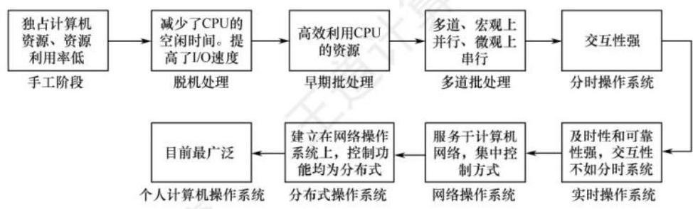

# 1.2 操作系统发展历程

## 1.2.1 手工操作阶段 (此阶段无操作系统)

用户在计算机上算题的所有工作都要人工干预, 如程序的装入、运行、结果的输出等。随着计算机硬件的发展, 人机矛盾 (速度和资源利用) 越来越大, 必须寻求新的解决办法。

手工操作阶段有两个突出的缺点: ①用户独占全机, 虽然不会出现因资源已被其他用户占用而等待的现象, 但资源利用率低。②CPU 等待手工操作, CPU 的利用不充分。

唯一的解决办法就是用高速的机器代替相对较慢的手工操作来对作业进行控制。

## 1.2.2 批处理阶段 (操作系统开始出现)

为了解决人机矛盾及 CPU 和 I/O 设备之间速度不匹配的矛盾, 出现了批处理系统。按发展历程又分为单道批处理系统、多道批处理系统 (多道程序设计技术出现以后)。

命题追踪：批处理系统的特点 (2016)

### 1. 单道批处理系统

为实现对作业的连续处理, 需要先将一批作业以脱机方式输入磁带, 并在系统中配上监督程序 (Monitor), 在其控制下, 使这批作业能一个接一个地连续处理。虽然系统对作业的处理是成批进行的, 但内存中始终保持一道作业。单道批处理系统的主要特征如下:

1) 自动性。在顺利的情况下, 磁带上的一批作业能自动地逐个运行, 而无须人工干预。

2) 顺序性。磁带上的各道作业顺序地进入内存，先调入内存的作业先完成。

3) 单道性。内存中仅有一道程序运行, 即监督程序每次从磁带上只调入一道程序进入内存运行, 当该程序完成或发生异常情况时, 才换入其后继程序进入内存运行。

此时面临的问题是: 每次主机内存中仅存放一道作业, 每当它在运行期间 （注意这里是 “运行时” 而不是 “完成后”）发出输入/输出请求后, 高速的 CPU 便处于等待低速的 I/O 完成的状态。 为了进一步提高资源的利用率和系统的吞吐量, 引入了多道程序技术。

### 2. 多道批处理系统

用户所提交的作业都先存放在外存上并排成一个队列, 作业调度程序按一定的算法从后备队列中选择若干作业调入内存, 它们在管理程序的控制下相互穿插地运行, 共享系统中的各种硬/软件资源。当某道程序因请求 I/O 操作而暂停运行时, CPU 便立即转去运行另一道程序, 这是通过中断机制实现的。它让系统的各个组成部分都尽量的 “忙”, 切换任务所花费的时间很少, 因而可实现系统各部件之间的并行工作, 使其在单位时间内的效率翻倍。

命题追踪：多道批处理系统的特点 (2017、2018、2022)

多道程序设计的特点是多道、宏观上并行、微观上串行。

1) **多道** 。计算机内存中同时存放多道相互独立的程序。

2) **宏观上并行** 。同时进入系统的多道程序都处于运行过程中, 但都未运行完毕。

3) **微观上串行** 。内存中的多道程序轮流占有 CPU ,交替执行。

多道程序设计技术的实现需要解决下列问题:

1) 如何分配处理器。

2) 多道程序的内存分配问题。

3) I/O 设备如何分配。

4) 如何组织和存放大量的程序和数据, 以方便用户使用并保证其安全性与一致性。

在批处理系统中采用多道程序设计技术就形成了多道批处理操作系统。该系统将用户提交的作业成批地送入计算机内存, 然后由作业调度程序自动地选择作业运行。

优点: 资源利用率高, 多道程序共享计算机资源, 从而使各种资源得到充分利用; 系统吞吐量大, CPU 和其他资源保持 “忙碌” 状态。缺点: 用户响应的时间较长; 不提供人机交互能力, 用户既不能了解自己的程序的运行情况, 又不能控制计算机。

> 注 意
> 2018 年真题考查的多任务操作系统可视为具有交互性的多道批处理系统。

## 1.2.3 分时操作系统

所谓分时技术, 是指将处理器的运行时间分成很短的时间片, 按时间片轮流将处理器分配给各联机作业使用。若某个作业在分配给它的时间片内不能完成其计算, 则该作业暂时停止运行, 将处理器让给其他作业使用, 等待下一轮再继续运行。由于计算机速度很快, 作业运行轮转得也很快, 因此给每个用户的感觉就像是自己独占一台计算机。

分时操作系统是指多个用户通过终端同时共享一台主机, 这些终端连接在主机上, 用户可以同时与主机进行交互操作而互不干扰。因此, 实现分时系统的关键问题是如何使用户能与自己的作业进行交互, 即当用户在自己的终端上键入命令时, 系统应能及时接收并及时处理该命令, 再将结果返回用户。分时系统也是支持多道程序设计的系统, 但它不同于多道批处理系统。多道批处理是实现作业自动控制而无须人工干预的系统, 而分时系统是实现人机交互的系统, 这使得分时系统具有与批处理系统不同的特征。分时系统的主要特征如下:( **同时交互、及时独立** )

1) 同时性。同时性也称多路性, 指允许多个终端用户同时使用一台计算机。

2) 交互性。用户通过终端采用人机对话的方式直接控制程序运行，与同程序进行交互。

3) 独立性。系统中多个用户可以彼此独立地进行操作, 互不干扰, 单个用户感觉不到别人也在使用这台计算机, 好像只有自己单独使用这台计算机一样。

4) 及时性。用户请求能在很短时间内获得响应。

虽然分时操作系统较好地解决了人机交互问题, 但在一些应用场合, 需要系统能对外部的信息在规定的时间 (比时间片的时间还短) 内做出处理 (比如飞机订票系统或导弹制导系统), 因此, 实时操作系统应运而生。

## 1.2.4 实时操作系统

为了能在某个时间限制内完成某些紧急任务而不需要时间片排队, 诞生了实时操作系统。这里的时间限制可以分为两种情况: 若某个动作必须绝对地在规定的时刻 (或规定的时间范围) 发生, 则称为硬实时系统, 如飞行器的飞行自动控制系统, 这类系统必须提供绝对保证, 让某个特定的动作在规定的时间内完成。若能够接受偶尔违反时间规定且不会引起任何永久性的损害, 则称为软实时系统, 如飞机订票系统、银行管理系统。

在实时操作系统的控制下, 计算机系统接收到外部信号后及时进行处理, 并在严格的时限内处理完接收的事件。实时操作系统的主要特点是及时性和可靠性。

## 1.2.5 网络操作系统和分布式计算机系统

网络操作系统将计算机网络中的各台计算机有机地结合起来, 提供一种统一、经济而有效的使用各台计算机的方法, 实现各台计算机之间数据的互相传送。网络操作系统最主要的特点是网络中各种资源的共享及各台计算机之间的通信。

分布式计算机系统是由多台计算机组成并满足下列条件的系统: 系统中任意两台计算机通过通信方式交换信息; 系统中的每台计算机都具有同等的地位, 即没有主机也没有从机; 每台计算机上的资源为所有用户共享; 系统中的任意台计算机都可以构成一个子系统, 并且还能重构; 任何工作都可以分布在几台计算机上, 由它们并行工作、协同完成。用于管理分布式计算机系统的操作系统称为分布式计算机系统。该系统的主要特点是: 分布性和并行性。分布式操作系统与网络操作系统的本质不同是, 分布式操作系统中的若干计算机相互协同完成同一任务。

## 1.2.6 个人计算机操作系统

个人计算机操作系统是目前使用最广泛的操作系统, 它广泛应用于文字处理、电子表格、游戏中, 常见的有 Windows、Linux 和 MacOS 等。操作系统的发展历程如图 1.1 所示。

图 1.1 操作系统的发展历程

此外, 还有嵌入式操作系统、服务器操作系统、智能手机操作系统等。

## 1.2.7 本节习题精选

### 一、单项选择题

**01**. 提高单机资源利用率的关键技术是 ( )。  
A. 脱机技术 B. 虚拟技术  
C. 交换技术 D. 多道程序设计技术

**02** . 批处理系统的主要缺点是 ( )。  
A. 系统吞吐量小 B. CPU 利用率不高 C. 资源利用率低 D. 无交互能力

**03** . 下列选项中, 不属于多道程序设计的基本特征的是 ( )。  
A. 制约性 B. 间断性 C. 顺序性 D. 共享性

**04** . 操作系统的基本类型主要有 ( ) 。  
A. 批处理操作系统、分时操作系统和多任务系统  
B. 批处理操作系统、分时操作系统和实时操作系统  
C. 单用户系统、多用户系统和批处理操作系统  
D. 实时操作系统、分时操作系统和多用户系统

**05** . 实时操作系统必须在 ( ) 内处理来自外部的事件。  
A. 一个机器周期 B. 被控制对象规定时间  
C. 周转时间 D. 时间片

**06** . ( ) 不是设计实时操作系统的主要追求目标。  
A. 安全可靠 B. 资源利用率 C. 及时响应 D. 快速处理

**07** . 下列 ( ) 应用工作最好采用实时操作系统平台。  
I. 航空订票 II. 办公自动化 III. 机床控制  
IV. AutoCAD V. 工资管理系统 VI. 股票交易系统  
A. I、II 和 III B. I、III 和 IV C. I、V 和 IV D. I、III 和 VI

**08** . 下列关于分时系统的叙述中, 错误的是 ( )。  
A. 分时系统主要用于批处理作业  
B. 分时系统中每个任务依次轮流使用时间片  
C. 分时系统的响应时间好  
D. 分时系统是一种多用户操作系统

**09** . 分时系统的一个重要性能是系统的响应时间, 对操作系统的 ( ) 因素进行改进有利于改善系统的响应时间。  
A. 加大时间片 B. 采用静态页式管理  
C. 优先级 + 非抢占式调度算法 D. 代码可重入

**10** . 分时系统追求的目标是 ( )。  
A. 充分利用 I/O 设备 B. 比较快速响应用户  
C. 提高系统吞吐率 D. 充分利用内存

**11** . 在分时系统中, 时间片一定时, ( ) 响应时间越长。  
A. 内存越多 B. 内存越少 C. 用户数越多 D. 用户数越少

**12** . 在分时系统中, 为使多个进程能够及时与系统交互, 关键的问题是能在短时间内, 使所有就绪进程都能运行。当就绪进程数为 100 时, 为保证响应时间不超过 2s ,此时的时间片最大应为 ( ) 。

A. 10ms B. 20ms C. 50ms D. 100ms

**13** . 操作系统有多种类型。允许多个用户以交互的方式使用计算机的操作系统, 称为 ( ) ; 允许多个用户将若干作业提交给计算机系统集中处理的操作系统, 称为 ( ) ; 在 ( ) 的控制下, 计算机系统能及时处理由过程控制反馈的数据, 并及时做出响应; 在 IBM-PC 中, 操作系统称为 ( ) 。  
A. 批处理系统 B. 分时操作系统  
C. 实时操作系统 D. 微型计算机操作系统

**14** . 下列各种系统中, ( ) 可以使多个进程并行执行。  
A. 分时系统 B. 多处理器系统 C. 批处理系统 D. 实时系统

**15** . 下列关于操作系统的叙述中, 正确的是 ( )。  
A. 批处理操作系统必须在响应时间内处理完一个任务  
B. 实时操作系统须在规定时间内处理完来自外部的事件  
C. 分时操作系统必须在周转时间内处理完来自外部的事件  
D. 分时操作系统必须在调度时间内处理完来自外部的事件

**16** . 引入多道程序技术的前提条件之一是系统具有 ( )。  
A. 多个 CPU B. 多个终端 C. 中断功能 D. 分时功能

**17** . 【2016 统考真题】下列关于批处理系统的叙述中, 正确的是 ( )。  
I. 批处理系统允许多个用户与计算机直接交互  
II. 批处理系统分为单道批处理系统和多道批处理系统  
III. 中断技术使得多道批处理系统的 I/O 设备可与 CPU 并行工作  
A. 仅 II、III B. 仅 II C. 仅 I、II D. 仅 I、III

**18** .【2017 统考真题】与单道程序系统相比, 多道程序系统的优点是 ( )。  
I. CPU 利用率高 II. 系统开销小  
III. 系统吞吐量大 IV. I/O 设备利用率高  
A. 仅 I、III B. 仅 I、IV C. 仅 II、III D. 仅 I、III、IV

**19** . 【2018 统考真题】下列关于多任务操作系统的叙述中, 正确的是 ( )。  
I. 具有并发和并行的特点  
II. 需要实现对共享资源的保护  
III. 需要运行在多 CPU 的硬件平台上  
A. 仅 I B. 仅 II C. 仅 I、II D. I. II、III

**20** .【2022 统考真题】下列关于多道程序系统的叙述中, 不正确的是 ( )。  
A. 支持进程的并发执行 B. 不必支持虚拟存储管理  
C. 需要实现对共享资源的管理 D. 进程数越多 CPU 利用率越高

## 二、综合应用题

**01** . 有两个程序, 程序 A 依次使用 CPU 计 10s、设备甲计 5s、CPU 计 5s、设备乙计 10s、 CPU 计 10s; 程序 B 依次使用设备甲计 10s、CPU 计 10s、设备乙计 5s、CPU 计 5s、设备乙计 10s 。在单道程序环境下先执行程序 A 再执行程序 B, CPU 的利用率是多少? 在多道程序环境下, CPU 利用率是多少?

**02** . 设某计算机系统有一个 CPU、一台输入设备、一台打印机。现有两个进程同时进入就绪态,且进程 A 先得到 CPU 运行,进程 B 后运行。进程 A 的运行轨迹为: 计算 50ms , 打印信息 100ms ,再计算 50ms ,打印信息 100ms ,结束。进程 B 的运行轨迹为: 计算 50ms ,输入数据 80ms ,再计算 100ms ,结束。画出它们的甘特图,并说明:

1) 开始运行后，CPU 有无空闲等待? 若有, 在哪段时间内等待? 计算 CPU 的利用率。

2) 进程 A 运行时有无等待现象? 若有, 在何时发生等待现象?

3) 进程 B 运行时有无等待现象? 若有,在何时发生等待现象?

## 1.2.8 答案与解析

### 一、单项选择题

**01** . D  
脱机技术是指在主机以外的设备上进行输入/输出操作, 需要时再送主机处理, 以提高设备的利用率。虚拟技术与交换技术以多道程序设计技术为前提。多道程序设计技术由于同时在主存中运行多个程序, 在一个程序等待时, 可以去执行其他程序, 因此提高了系统资源的利用率。

**02** . D  
批处理系统中, 作业执行时用户无法干预其运行, 只能通过事先编制作业控制说明书来间接干预, 缺少交互能力, 也因此才有了分时操作系统的出现。

**03** . C  
多道程序的运行环境比单道程序的运行环境更加复杂。引入多道程序后, 程序的执行就失去了封闭性和顺序性。程序执行因为共享资源及相互协同的原因产生了竞争, 相互制约。

考虑到竞争的公平性, 程序的执行是断续的。

**04** . B  
操作系统的基本类型主要有批处理操作系统、分时操作系统和实时操作系统。

**05** . B  
实时系统要求能实时处理外部事件, 即在规定的时间内完成对外部事件的处理。

**06** . B  
实时性和可靠性是实时操作系统最重要的两个目标, 而安全可靠体现了可靠性, 快速处理和及时响应体现了实时性。资源利用率不是实时操作系统的主要目标, 即为了保证快速处理高优先级任务, 允许 “浪费” 一些系统资源。

**07** . D  
实时操作系统主要应用在需要对外界输入立即做出反应的场合, 不能有拖延, 否则会产生严重后果。本题的选项中, 航空订票系统需要实时处理票务, 因为票额数据库的数量直接反映了航班的可订机位。机床控制也要实时, 不然会出差错。股票交易行情随时在变, 若不能实时交易会出现时间差, 使交易出现偏差。

**08** . A  
分时系统主要用于交互式作业而非批处理作业。分时系统中每个任务依次轮流使用时间片, 这是一种公平的 CPU 分配策略。分时系统的响应时间好, 因为分时系统采用了时间片轮转法来调度进程, 可以使得每个任务在较短的时间内得到响应, 提高用户的满意度。分时系统是一种多用户操作系统, 因为分时系统可以支持多个终端同时连接到同一台计算机上。

**09** . $\mathrm{C}$  
采用优先级+非抢占式调度算法, 既可使重要的作业/进程通过高优先级尽快获得系统响应, 又可保证次要的作业/进程在非抢占式调度下不会迟迟得不到系统响应, 这样有利于改善系统的响应时间。加大时间片会延迟系统响应时间; 静态页式管理和代码可重入与系统响应时间无关。

**10** . B  
要求快速响应用户是导致分时系统出现的重要原因。

**11** . C  
分时系统中, 当时间片固定时, 用户数越多, 每个用户分到的时间片就越少, 响应时间就相应变长。注意,分时系统的响应时间 $T$ 可表示为 $T \approx {QN}$ ,其中 $Q$ 是时间片,而 $N$ 是用户数。

**12** . B  
响应时间不超过 $2\mathrm{\;s}$ ,即在 $2\mathrm{\;s}$ 内必须响应所有进程。所以时间片最大为 $2\mathrm{\;s}/{100} = {20}\mathrm{\;{ms}}$ 。

**13** . B、A、C、D  
这是操作系统发展过程中的几种主要类型。

**14** . B  
多个进程并发执行的系统是指在一段时间内宏观上有多个进程同时运行, 但在单处理器系统中, 每个时刻却只能有一道程序执行, 所以微观上这些程序只能是分时地交替执行。只有多处理器系统才能使多个进程并行执行, 每个处理器上分别运行不同的进程。

**15** . B  
实时操作系统要求能在规定时间内完成特定的功能。批处理操作系统不需要在响应时间内处理完一个任务。分时操作系统不要求在周转时间或调度时间内处理完外部事件。

**16** . C  
多道程序技术要求进程间能实现并发, 需要实现进程调度以保证 CPU 的工作效率, 而并发性的实现需要中断功能的支持。

**17** . A  
批处理系统中, 作业执行时用户无法干预其运行, 只能通过事先编制作业控制说明书来间接干预, 缺少交互能力, I 错误。批处理系统按发展历程又分为单道批处理系统、多道批处理系统, II 正确。多道程序设计技术允许把多个程序同时装入内存, 并允许它们在 CPU 中交替运行, 共享系统中的各种硬/软件资源, 当一道程序因 I/O 请求而暂停运行时, CPU 便立即转去运行另一道程序, 即多道批处理系统的 I/O 设备可与 CPU 并行工作, 这是借助中断技术实现的, III 正确。

**18** . D  
多道程序系统中总有一个作业在 CPU 上执行, 因此提高了 CPU 的利用率、系统吞吐量和 I/O 设备利用率, I、III、IV 正确。但系统要付出额外的开销来组织作业和切换作业, II 错误。

**19** . C  
现代操作系统都是多任务的, 允许用户把程序分为若干个任务, 使它们并发执行。在单 CPU 中, 这些任务并发执行, 即宏观上并行执行, 微观上分时地交替执行; 在多 CPU 中, 这些任务是真正的并行执行。此外, 引入中断之后才出现了多任务操作系统, 而中断方式的特点是 CPU 与外设并行工作, 因此 I 正确。多个任务必须互斥地访问共享资源, 为达到这一目标必须对共享资源进行必要的保护, II 正确。多任务操作系统并不一定需要运行在多 CPU 的硬件上, 单个 CPU 通过分时使用也能满足要求, III 错误。综上所述, I、II 正确, III 错误。

**20** . D  
操作系统的基本特点: 并发、共享、虚拟、异步, 其中最基本、一定要实现的是并发和共享。 早期的多道批处理操作系统会将所有进程的数据全部调入主存, 再让多道程序并发执行, 即使不支持虚拟存储管理, 也能实现多道程序并发。进程多并不意味着 CPU 利用率高, 进程数量越多, 进程之间的资源竞争越激烈, 甚至可能因为资源竞争而出现死锁现象, 导致 CPU 利用率低。

### 二、综合应用题

### 01.【解答】

如下图所示,单道环境下,CPU 的运行时间为 (10+5+10)s+(10+5)s=40s  ,两个程序运行的总时间为 40s+40s=80s ,因此利用率是 40/80=50% 。

多道环境下, CPU 运行时间为 40s ,两个程序运行总时间为 45s ,因此利用率为 40/45=88.9% 。

> 注 意
> 此图为甘特图, 甘特图又称横道图, 它以图示的方式通过活动列表和时间刻度形象地表示任意特定项目的活动顺序与持续时间。

以后遇到此类题目, 即给出几个不同的程序, 每个程序以各个任务时间片给出时, 一定要用甘特图来求解, 因为其直观、快捷。为节省读者研究甘特图画法的时间, 下面给出既定的步骤, 读者可按下列步骤快速、正确地画出甘特图。

- ①横坐标上标出合适的时间间隔, 纵坐标上的点是程序的名字。

- ②过横坐标上每个标出的时间点, 向上作垂直于横坐标的虚线。

- ③用几种不同的线 (推荐用 “直线” “波浪线” “虚线” 三种, 较易区分) 代表对不同资源的占用, 按照题目给出的任务时间片, 平行于横坐标把不同程序对应的线段分别画出来。

画图时要注意, 如处理器、打印设备等资源是不能让两个程序同时使用的, 有一个程序正在使用时, 其他程序的请求只能排队。

## 02.【解答】

这类实际的 CPU 和输入/输出设备调度的题目一定要画图, 画出运行时的甘特图后就能清楚地看到不同进程间的时序关系, 进程运行情况如下图所示。

1) CPU 在 100∼150ms 时间段内空闲,利用率为 250 / 300 = 83.3% 。

2) 进程 A 为无等待现象。

3) 进程 B 为有等待现象,发生在 0∼50ms 和 180∼200ms 时间段。
