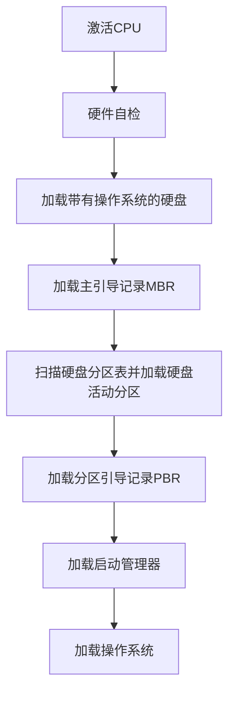

# 1.5 操作系统引导

操作系统 (如 Windows、Linux 等) 是一种程序, 程序以数据的形式存放在硬盘中, 而硬盘通常分为多个区, 一台计算机中又可能有多个或多种外部存储设备。操作系统引导是指计算机利用 CPU 运行特定程序, 通过程序识别硬盘, 识别硬盘分区, 识别硬盘分区上的操作系统, 最后通过程序启动操作系统, 一环扣一环地完成上述过程。

常见操作系统的引导过程如下:

①激活 CPU。激活的 CPU 读取 ROM 中的 boot 程序, 将指令寄存器置为 BIOS（基本输入/输出系统）的第一条指令, 即开始执行 BIOS 的指令。

②硬件自检。BIOS 程序在内存最开始的空间构建中断向量表, 接下来的 POST 过程要用到中断功能。然后进行通电自检, 检查硬件是否出现故障。如有故障, 主板会发出不同含义的蜂鸣, 启动中止: 如无故障, 屏幕会显示 CPU、内存、硬盘等信息。

③加载带有操作系统的硬盘。通电自检后, BIOS 开始读取 Boot Sequence (通过 CMOS 里保存的启动顺序, 或者通过与用户交互的方式), 将控制权交给启动顺序排在第一位的存储设备, 然后 CPU 将该存储设备引导扇区的内容加载到内存中。

④加载主引导记录 (MBR)。硬盘以特定的标识符区分引导硬盘和非引导硬盘。如果发现一个存储设备不是可引导盘, 就检查下一个存储设备。如无其他启动设备, 就会死机。主引导记录 MBR 的作用是告诉 CPU 去硬盘的哪个主分区去找操作系统。

⑤扫描硬盘分区表, 并加载硬盘活动分区。MBR 包含硬盘分区表, 硬盘分区表以特定的标识符区分活动分区和非活动分区。主引导记录扫描硬盘分区表, 进而识别含有操作系统的硬盘分区 (活动分区)。找到硬盘活动分区后, 开始加载硬盘活动分区, 将控制权交给活动分区。

⑥加载分区引导记录 (PBR)。读取活动分区的第一个扇区, 这个扇区称为分区引导记录 (PBR), 其作用是寻找并激活分区根目录下用于引导操作系统的程序 (启动管理器)。

⑦加载启动管理器。分区引导记录搜索活动分区中的启动管理器, 加载启动管理器。

⑧加载操作系统。将操作系统的初始化程序加载到内存中执行。

