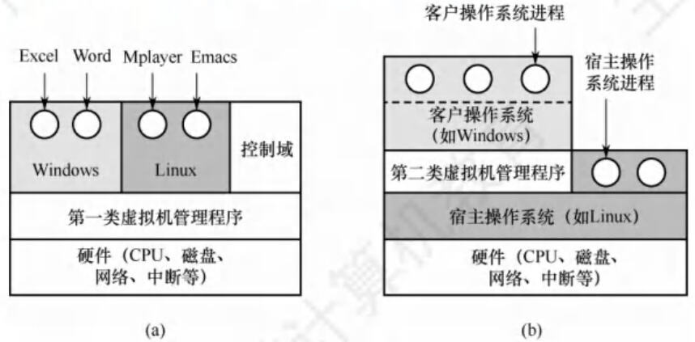

# 1.6 虚拟机

## 1.6.1 虚拟机的基本概念

虚拟机是指利用虚拟化技术, 将一台物理机器虚拟化为多台虚拟机器, 通过隐藏特定计算平台的实际物理特性, 为用户提供抽象的、统一的、模拟的计算环境。有两类虚拟化方法。

### 1. 第一类虚拟机管理程序

从技术上讲, 第一类虚拟机管理程序就像一个操作系统, 因为它是唯一一个运行在最高特权级的程序。它在裸机上运行并且具备多道程序功能。虚拟机管理程序向上层提供若干虚拟机, 这些虚拟机是裸机硬件的精确复制品。由于每台虚拟机都与裸机相同, 所以在不同的虚拟机上可以运行任何不同的操作系统。图 1.7(a)中显示了第一类虚拟机管理程序。 客户操作系统进程

图 1.7 两类虚拟机管理程序在系统中的位置

虚拟机作为用户态的一个进程运行, 不允许执行敏感指令。然而, 虚拟机上的操作系统认为自己运行在内核态 (实际上不是), 称为虚拟内核态。虚拟机中的用户进程认为自己运行在用户态 (实际上确实是)。当虚拟机操作系统执行了一条 CPU 处于内核态才允许执行的指令时, 会陷入虚拟机管理程序。在支持虚拟化的 CPU 上, 虚拟机管理程序检查这条指令是由虚拟机中的操作系统执行的还是由用户程序执行的。如果是前者, 虚拟机管理程序将安排这条指令功能的正确执行。否则, 虚拟机管理程序将模拟真实硬件面对用户态执行敏感指令时的行为。

在过去不支持虚拟化的 CPU 上, 真实硬件不会直接执行虚拟机中的敏感指令, 这些敏感指令被转为对虚拟机管理程序的调用, 由虚拟机管理程序模拟这些指令的功能。

### 2. 第二类虚拟机管理程序

图 1.7(b)中显示了第二类虚拟机管理程序。它是一个依赖于 Windows、Linux 等操作系统分配和调度资源的程序, 很像一个普通的进程。第二类虚拟机管理程序仍然伪装成具有 CPU 和各种设备的完整计算机。VMware Workstation 是首个 x86 平台上的第二类虚拟机管理程序。

运行在两类虚拟机管理程序上的操作系统都称为客户操作系统。对于第二类虚拟机管理程序, 运行在底层硬件上的操作系统称为宿主操作系统。

首次启动时, 第二类虚拟机管理程序像一台刚启动的计算机那样运转, 期望找到的驱动器可以是虚拟设备。然后将操作系统安装到虚拟磁盘上 (其实只是宿主操作系统中的一个文件)。客户操作系统安装完成后, 就能启动并运行。

## 1.6.2 本章习题精选

03 在操作系统结构设计中, 层次结构的操作系统最显著的不足是 ( )。  
A. 不能访问更低的层次 B. 太复杂且效率低  
C. 设计困难 D. 模块太少

07 对于以下五种服务, 在采用微内核结构的操作系统中, ( ) 不宜放在微内核中。  
I. 进程间通信机制 II. 低级 I/O III. 低级进程管理和调度  
IV. 中断和陷入处理 V. 文件系统服务  
A. I、II 和 III B. II 和 V C. 仅 V D. IV 和 V

09 下列关于操作系统结构的说法中, 正确的是 ( )。  
I. 当前广泛使用的 Windows 操作系统, 采用的是分层式 OS 结构  
II. 模块化的 OS 结构设计的基本原则是, 每一层都仅使用其底层所提供的功能和服务, 这样就使系统的调试和验证都变得容易  
III. 由于微内核结构能有效支持多处理机运行, 故非常适合于分布式系统环境  
IV. 采用微内核结构设计和实现操作系统具有诸多好处, 如添加系统服务时, 不必修改内核、使系统更高效。  
A. I 和 II B. I 和 III C. III D. III 和 IV

14 计算机操作系统的引导程序位于 ( ) 中。  
A. 主板 BIOS B. 片外 Cache C. 主存 ROM 区 D. 硬盘

15 计算机的启动过程是 ( )。①CPU 加电, CS:IP 指向 FFFF0H; ②进行操作系统引导; ③执行 JMP 指令跳转到 BIOS；④登记 BIOS 中断程序入口地址；⑤硬件自检。  
A. ①②③④⑤ B. ①③⑤④② C. ①③④⑤② D. ①⑤③④②

16 检查分区表是否正确, 确定哪个分区为活动分区, 并在程序结束时将该分区的启动程序 （操作系统引导扇区）调入内存加以执行，这是（ ）的任务。  
A. MBR B. 引导程序 C. 操作系统 D. BIOS

17 下列关于虚拟机的说法中, 正确的是 ( )。  
I. 虚拟机可以用软件实现 II. 虚拟机可以用硬件实现  
III. 多台虚拟机可同时运行在同一物理机器上, 它实现了真正的并行  
A. I 和 II B. I 和 III C. 仅 I D. I、II 和 III

22【2023 统考真题】与宏内核操作系统相比, 下列特征中, 微内核操作系统具有的是 ( )。  
I. 较好的性能 II. 较高的可靠性 III. 较高的安全性 IV. 较强的可扩展性  
A. 仅 II、IV B. 仅 I、II、III C. 仅 I、III、IV D. 仅 II、III、IV

## 1.6.3 答案与解析

03 C

在层次结构中, 每个层次都可以访问相邻的高层或低层, 但不能跨越多个层次, A 错误。层次结构的操作系统确实会增加一些复杂度和开销, 但这不是最显著的不足, 如果设计得当, 层次结构可以提高效率和可靠性, 因为每一层都可以独立地进行优化和测试, B 错误。层次结构需要对每层精心的划分和设计, 而且要保证接口的一致性和完备性, 这是一个非常复杂的过程, 而且很难做到完美, C 正确。层次结构不限制模块的数量,只将模块按照功能和依赖关系分成不同的层次, 层次结构可以有很多模块, 只要它们符合层次结构的原则, D 错误。

07 C

进程 (线程) 之间的通信功能是微内核最频繁使用的功能, 因此几乎所有微内核 OS 都将其放入微内核。低级 I/O 和硬件紧密相关,因此应放入微内核。低级进程管理和调度属于调度功能的机制部分, 应将它放入微内核。微内核 OS 将与硬件紧密相关的一小部分放入微内核处理, 此时微内核的主要功能是捕获所发生的中断和陷入事件, 并进行中断响应处理, 识别中断或陷入的事件后, 再发送给相关的服务器处理, 故中断和陷入处理也应放入微内核。而文件系统服务是放在微内核外的文件服务器中实现的,故仅 V 不宜放在微内核中。

09 C

Windows 是融合了宏内核和微内核的操作系统, I 错误。II 描述的是层次化构架的原则。微内核架构将操作系统的核心功能和其他服务分离, 使不同的服务可在不同的处理器上并行执行, 提高了系统的并发性和可扩展性; 微内核架构可以方便地实现进程间的通信和同步, 支持服务器之间的消息传递和远程过程调用, 使得分布式系统的开发和管理更简单和高效, III 正确。添加系统服务时不必修改内核, 这就使得微内核构架的可扩展性和灵活性更强; 微内核构架的主要问题是性能问题, “使系统更高效” 显然错误。

14 D

操作系统的引导程序位于磁盘活动分区的引导扇区中。引导程序分为两种: 一种是位于 ROM 中的自举程序 (BIOS 的组成部分), 用于启动具体的设备; 另一种是位于装有操作系统硬盘的活动分区的引导扇区中的引导程序 (称为启动管理器), 用于引导操作系统。

15 C

CPU 激活后, 从顶端的地址 FFFFOH 获得第一条执行的指令, 这个地址仅有 16 字节, 放不下一段程序, 所以是一条 JMP 指令, 以跳到更低地址去执行 BIOS 程序。BIOS 程序在内存最开始的空间构建中断向量表和相应服务程序, 在后续 POST 过程中要用到中断调用等功能。然后进行通电自检 (Power-on Self Test, POST) 以检测硬件是否有故障。完成 POST 后, BIOS 需要在硬盘、光驱或软驱等存储设备搜寻操作系统内核的位置以启动操作系统。

16 A

BIOS 将控制权交给排在首位的启动设备后, CPU 将该设备主引导扇区的内容 [主引导记录 (MBR)] 加载到内存中, 然后由 MBR 检查分区表, 查找活动分区, 并将该分区的引导扇区的内容 [分区引导记录 (PBR)] 加载到内存加以执行。

17 A

软件能实现的功能也能由硬件实现, 因为虚拟机软件能实现的功能也能由硬件实现, 软件和硬件的分界面是系统结构设计者的任务, I 和 II 正确。实现真正并行的是多核处理机, 多台虚拟机同时运行在同一物理机器上, 类似于多个程序运行在同一个系统中。

22 D

微内核构架将内核中最基本的功能保留在内核, 只有微内核运行在用户态, 其余模块都运行在用户态, 一个模块中的错误只会使这个模块崩溃, 而不会使整个系统崩溃, 因此具有较高的可靠性和安全性。微内核的非核心功能运行在用户空间, 可通过插件或模块的方式进行扩展, 无须改动内核代码, 因此具有较强的可扩展性。微内核需要频繁地在用户态和核心态之间进行切换, 操作系统的执行开销偏大, 从而影响系统性能。
