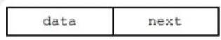
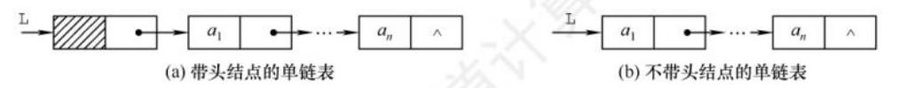
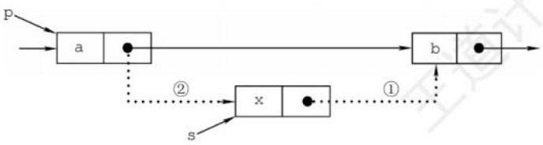
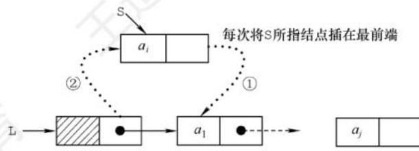
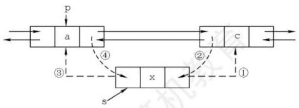
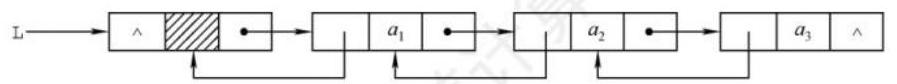
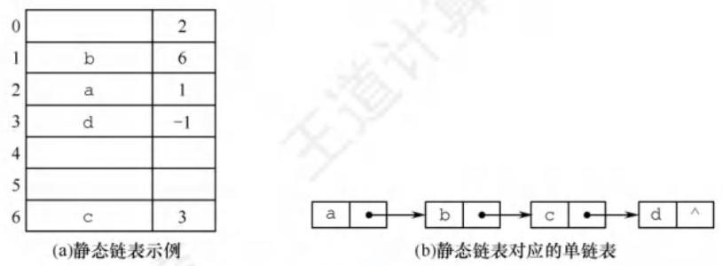
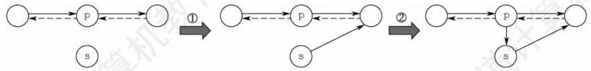

# 2.3 线性表的链式表示

顺序表的存储位置可以用一个简单直观的公式表示, 它可以随机存取表中任一元素, 但插入和删除操作需要移动大量元素。链式存储线性表时, 不需要使用地址连续的存储单元, 即不要求逻辑上相邻的元素在物理位置上也相邻, 它通过 “链” 建立元素之间的逻辑关系, 因此插入和删除操作不需要移动元素, 而只需修改指针, 但也会失去顺序表可随机存取的优点。

## 2.3.1 单链表的定义

【命题追踪】 单链表的应用（2009、2012、2013、2015、2016、2019）

线性表的链式存储又称单链表, 它是指通过一组任意的存储单元来存储线性表中的数据元素。为了建立数据元素之间的线性关系, 对每个链表结点, 除存放元素自身的信息之外, 还需要存放一个指向其后继的指针。单链表结点结构如图 2.3 所示, 其中 data 为数据域, 存放数据元素; next 为指针域, 存放其后继结点的地址。



图 2.3 单链表结点结构

单链表中结点类型的描述如下:

```c
typedef struct LNode{ //定义单链表结点类型 
    ElemType data; //数据域 
    struct LNode *next; //指针域
}LNode, *LinkList;
```

利用单链表可以解决顺序表需要大量连续存储单元的缺点, 但附加的指针域, 也存在浪费存储空间的缺点。由于单链表的元素离散地分布在存储空间中, 因此是非随机存取的存储结构, 即不能直接找到表中某个特定结点。查找特定结点时, 需要从表头开始遍历, 依次查找。

通常用头指针 L (或 head 等) 来标识一个单链表,指出链表的起始地址,头指针为 NULL 时表示一个空表。此外, 为了操作上的方便, 在单链表第一个数据结点之前附加一个结点, 称为头结点。头结点的数据域可以不设任何信息, 但也可以记录表长等信息。单链表带头结点时, 头指针 L 指向头结点,如图 2.4(a)所示。单链表不带头结点时,头指针 L 指向第一个数据结点, 如图 2.4(b)所示。表尾结点的指针域为 NULL (用 “ ^ ” 表示)。



图 2.4 带头结点和不带头结点的单链表

头结点和头指针的关系: 不管带不带头结点, 头指针都始终指向链表的第一个结点, 而头结点是带头结点的链表中的第一个结点, 结点内通常不存储信息。

引入头结点后, 可以带来两个优点:

① 由于第一个数据结点的位置被存放在头结点的指针域中, 因此在链表的第一个位置上的操作和在表的其他位置上的操作一致, 无须进行特殊处理。

② 无论链表是否为空, 其头指针都是指向头结点的非空指针 (空表中头结点的指针域为空), 因此空表和非空表的处理也就得到了统一。

## 2.3.2 单链表上基本操作的实现

带头结点单链表的操作代码书写较为方便, 如无特殊说明, 本节均默认链表带头结点。

### 1. 单链表的初始化

带头结点和不带头结点的单链表的初始化操作是不同的。带头结点的单链表初始化时, 需要创建一个头结点, 并让头指针指向头结点, 头结点的 next 域初始化为 NULL。

```c
bool InitList(LinkList &L) { // 带头结点的单链表的初始化
    L=(LNode*)malloc(sizeof(LNode)); // 创建头结点
    L->next=NULL; // 头结点之后暂时还没有元素结点
    return true;
}
```

不带头结点的单链表初始化时, 只需将头指针 L 初始化为 NULL。

```c
bool InitList(LinkList &L) { // 不带头结点的单链表的初始化
    L=NULL;
    return true;
}
```

> 注 意

设 p 为指向链表结点的结构体指针,则 `*p` 表示结点本身,因此可用 `p->data` 或 `(*p).data` 访问 `*p` 这个结点的数据域,二者完全等价。成员运算符 (.) 左边是一个普通的结构体变量,而指向运算符 -> 左边是一个结构体指针。通过  `*p.next` 可以得到指向下一个结点的指针, 因此 `(*(*p).next).data` 就是下一个结点中存放的数据,或者直接用 `p->next->data`。

### 2. 求表长操作

求表长操作是计算单链表中数据结点的个数, 需要从第一个结点开始依次访问表中每个结点, 为此需设置一个计数变量, 每访问一个结点, 其值加 1 , 直到访问到空结点为止。

```c
int Length(LinkList L) {
    int len = 0; //计数变量, 初始为 0
    LNode *p = L;
    while (p->next!=NULL) {
        p=p->next;
        len++; // 每访问一个结点, 计数加 1
    }
    return len;
}
```

求表长操作的时间复杂度为 $O\left( n\right)$ 。另需注意的是,因为单链表的长度是不包括头结点的,因此不带头结点和带头结点的单链表在求表长操作上会略有不同。

### 3. 按序号查找结点

从单链表的第一个结点开始, 沿着 next 域从前往后依次搜索, 直到找到第 i 个结点为止, 则返回该结点的指针; 若 i 小于单链表的表长,则返回 NULL。

```c
LNode *GetElem(LinkList L, int i){

    LNode *p = L; //指针 p 指向当前扫描到的结点
    int j = 0; //记录当前结点的位序, 头结点是第 0 个结点

    while(p! =NULL && j<i) { //循环找到第 $i$ 个结点
        p=p->next;
        j++;
    }
    return p; //返回第 i 个结点的指针或 NULL 
}
```

按序号查找操作的时间复杂度为 $O\left( n\right)$ 。

### 4. 按值查找表结点

从单链表的第一个结点开始, 从前往后依次比较表中各结点的数据域, 若某结点的 data 域等于给定值 e ,则返回该结点的指针; 若整个单链表中没有这样的结点,则返回 NULL。

```c
LNode *LocateElem(LinkList L, ElemType e){
    LNode *p = L->next;

    while (p!=NULL&&p->data!=e) {//从第一个结点开始查找数据域为 e 的结点
        p=p->next;
    } 

    return p; //找到后返回该结点指针, 否则返回 NULL
}
```

按值查找操作的时间复杂度为 $O\left( n\right)$ 。

### 5. 插入结点操作

插入结点操作将值为 x 的新结点插入到单链表的第 i 个位置。先检查插入位置的合法性,然后找到待插入位置的前驱, 即第 i-1 个结点, 再在其后插入。其操作过程如图 2.5 所示。



图 2.5 单链表的插入操作

【命题追踪】 单链表插入操作后地址或指针的变化 (2016)

首先查找第 `i-1` 个结点,假设第 `i-1` 个结点为 `*p` ,然后令新结点 `*s` 的指针域指向 `*p` 的后继,再令结点 `*p` 的指针域指向新插入的结点 `*s`

```c
bool ListInsert(LinkList &L, int i, ElemType e) {
    LNode *p = L;  //指针 p 指向当前扫描到的结点
    int j = 0; //记录当前结点的位序, 头结点是第 0 个结点
    while(p!=NULL && j<i-1) { //循环找到第 $i - 1$ 个结点
        p=p->next;
        j++;
    }
    if(p==NULL) {
        return false;
    }
    LNode *s = (LNode*)malloc(sizeof(LNode));
    s->data=e;
    s->next=p->next;
    p->next=s;
    return true;
}
```

插入时, ①和②的顺序不能颠倒, 否则, 先执行 `p->next=s` 后, 指向其原后继的指针就不存在了, 再执行 `s->next=p->next` 时, 相当于执行了 `s->next=s` , 显然有误。本算法主要的时间开销在于查找第 `i-1` 个元素,时间复杂度为 $O\left( n\right)$ 。若在指定结点后插入新结点,则时间复杂度仅为 $O\left( 1\right)$ 。需注意的是,当链表不带头结点时,需要判断插入位置 i 是否为 1,若是,则要做特殊处理,将头指针 L 指向新的首结点。当链表带头结点时,插入位置 i 为 1 时不用做特殊处理。

**扩展：对某一结点进行前插操作。**

前插操作是指在某结点的前面插入一个新结点, 后插操作的定义刚好与之相反。在单链表插入算法中, 通常都采用后插操作。以上面的算法为例, 先找到第 i-1 个结点, 即插入结点的前驱, 再对其执行后插操作。由此可知, 对结点的前插操作均可转化为后插操作, 前提是从单链表的头结点开始顺序查找到其前驱结点,时间复杂度为 $O\left( n\right)$ 。

此外,可采用另一种方式将其转化为后插操作来实现,设待插入结点为 `*s` ,将 `*s` 插入到 `*p` 的前面。我们仍然将 `*s` 插入到 `*p` 的后面,然后将 `p->data` 与 `s->data` 交换,这样做既满足逻辑关系,又能使得时间复杂度为 $O\left( 1\right)$ 。该方法的主要代码片段如下:

```c
s->next = p->next; // 修改指针域，不能颠倒
p->next = s;
temp = p->data; // 交换数据域部分
p->data = s->data;
s->data = temp;
```

### 6. 删除结点操作

删除结点操作是将单链表的第 i 个结点删除。先检查删除位置的合法性, 然后查找表中第 i-1 个结点, 即被删结点的前驱, 再删除第 i 个结点。其操作过程如图 2.6 所示。


图 2.6 单链表结点的删除

假设结点 `*p` 为找到的被删结点的前驱,为实现这一操作后的逻辑关系的变化,仅需修改 `*p` 的指针域,将 `*p` 的指针域 next 指向 `*q` 的下一结点,然后释放 `*q` 的存储空间。

```c
bool ListDelete(LinkList &L, int i, ElemType &e) {
    LNode *p = L; //指针 p 指向当前扫描到的结点
    int j = 0; //记录当前结点的位序, 头结点是第 0 个结点
    while(p!=NULL & j<i-1) { // 循环找到第 i-1 个节点
        p=p->next;
        j++;
    }
    if(p == NULL || p->next == NULL) {
        return false; //i 值不合法
    }
    LNode *q = p->next; // 令q指向被删除节点
    e=q->next; // 用e返回元素的值
    p->next = q->next; // 将*q节点从链中断开
    free(q); // 释放节点的存储空间
    return ture;
}
```

同插入算法一样,该算法的主要时间也耗费在查找操作上,时间复杂度为 $O\left( n\right)$ 。当链表不带头结点时, 需要判断被删结点是否为首结点, 若是, 则要做特殊处理, 将头指针 L 指向新的首结点。当链表带头结点时, 删除首结点和删除其他结点的操作是相同的。

**扩展: 删除结点** `*p` 。

要删除某个给定结点 `*p` ,通常的做法是先从链表的头结点开始顺序找到其前驱,然后执行删除操作。其实,删除结点 `*p` 的操作可用删除 `*p` 的后继来实现,实质就是将其后继的值赋予其自身,然后再删除后继,也能使得时间复杂度为 $O\left( 1\right)$ 。该方法的主要代码片段如下:

```c
q=p->next; //令 q 指向 *p 的后继结点
p->data = p->next->data; //用后继结点的数据域覆盖
p->next = q->next; //将*q 结点从链中“断开”
free(q); //释放后继结点的存储空间
```

### 7. 采用头插法建立单链表

该方法从一个空表开始, 生成新结点, 并将读取到的数据存放到新结点的数据域中, 然后将新结点插入到当前链表的表头, 即头结点之后, 如图 2.7 所示。算法实现如下:



图 2.7 头插法建立单链表

```c
LinkList List_HeadInsert (LinkList &L) { //逆向建立单链表
    LNode *s; int x; //设元素类型为整型
    L=(LNode*)malloc(sizeof(LNode))//创建头结点
    L->next=NULL; //初始为空链表
    scanf("%d", &x);//输入结点的值
    while(x != 9999) {//输入 9999 表示结束
        s = (LNode*)malloc(sizeof(LNode));//创建新结点
        s->data = x;
        s->next = L->next;
        L-next = s;//将新结点插入表中, L 为头指针
        scanf("%d", &x);
    }
    return L;
```

采用头插法建立单链表时, 读入数据的顺序与生成的链表中元素的顺序是相反的, 可用来实现链表的逆置。每个结点插入的时间为 $O\left( 1\right)$ ,设单链表长为 $n$ ,则总时间复杂度为 $O\left( n\right)$ 。

**思考** : 若单链表不带头结点,则上述代码中哪些地方需要修改?  
主要修改之处: 因为在头部插入新结点,每次插入新结点后,都需要将它的地址赋值给头指针 L

### 8. 采用尾插法建立单链表

头插法建立单链表的算法虽然简单, 但生成的链表中结点的次序和输入数据的顺序不一致。 若希望两者次序一致, 则可采用尾插法。该方法将新结点插入到当前链表的表尾, 为此必须增加一个尾指针 `r` ,使其始终指向当前链表的尾结点,如图 2.8 所示。算法实现如下:


图 2.8 尾插法建立单链表

```c
LinkList List_TailInsert(LinkList &L) { //正向建立单链表
    int x; // 设元素类型为整型
    L = (LNode*)malloc(sizeof(LNode)); // 创建头节点
    LNode *s, *r = L; // r为表尾指针
    scanf("%d", &x); // 输入节点的值
    while(x!=9999) { // 输入9999表示结束
        s = (LNode *)malloc(sizeof(LNode));
        s->data = x;
        r->next = s;
        r = s; // r 指向新的表尾节点
        scanf("%d", &x);
    }
    r->next = NULL; // 尾节点指针置空
    return L;
}
```

因为附设了一个指向表尾结点的指针, 所以时间复杂度和头插法的相同。

> 注 意
>
> 单链表是整个链表的基础, 读者一定要熟练掌握单链表的基本操作算法。在设计算法时, 建议先通过画图的方法理清算法的思路, 然后进行算法的编写。

## 2.3.3 双链表

单链表结点中只有一个指向其后继的指针, 使得单链表只能从前往后依次遍历。要访问某个结点的前驱 (插入、删除操作时),只能从头开始遍历,访问前驱的时间复杂度为 $O\left( n\right)$ 。为了克服单链表的这个缺点, 引入了双链表, 双链表结点中有两个指针 prior 和 next, 分别指向其直接前驱和直接后继, 如图 2.9 所示。表头结点的 prior 域和尾结点的 next 域都是 `NULL` 。


图 2.9 双链表示意图

双链表中结点类型的描述如下:

```c
typedef struct DNode { //定义双链表结点类型
    ElemType data; //数据域
    struct DNode *prior,*next; //前驱和后继指针
}DNode, *DLinklist;
```

双链表在单链表结点中增加了一个指向其前驱的指针 prior, 因此双链表的按值查找和按位查找的操作与单链表的相同。但双链表在插入和删除操作的实现上, 与单链表有着较大的不同。这是因为 “链” 变化时也需要对指针 prior 做出修改, 其关键是保证在修改的过程中不断链。此外, 双链表可以很方便地找到当前结点的前驱,因此,插入、删除操作的时间复杂度仅为 $O\left( 1\right)$ 。

### 1. 双链表的插入操作

在双链表中 $\mathrm{p}$ 所指的结点之后插入结点*s,其指针的变化过程如图 2.10 所示。



图 2.10 双链表插入结点过程

【命题追踪】 双链表中插入操作的实现 (2023)

插入操作的代码片段如下:

```c
s->next = p->next; // ① 将节点 *s 插入到节点 *p 之后
p->next->prior = s;
s->prior = p;
p->next = s;
```

上述代码的语句顺序不是唯一的,但也不是任意的,①步必须在④步之前,否则 `*p` 的后继结点的指针就会丢掉, 导致插入失败。为了加深理解, 读者可以在纸上画出示意图。若问题改成要求在结点 `*p` 之前插入结点 `*s` ,请读者思考具体的操作步骤。

### 2. 双链表的删除操作

删除双链表中结点 `*p` 的后继结点 `*1` ,其指针的变化过程如图 2.11 所示。


图 2.11 双链表删除结点过程

【命题追踪】循环双链表中删除操作的实现（2016）

删除操作的代码片段如下:

```c
p->next = q->next; //图 2.11 中步骤①
q->next->prior = p; //图 2.11 中步骤②
free(q); //释放结点空间
```

若问题改成要求删除结点 `*q` 的前驱结点 `*p`,请读者思考具体的操作步骤。

在建立双链表的操作中, 也可采用如同单链表的头插法和尾插法, 但在操作上需要注意指针的变化和单链表有所不同。

## 2.3.4 循环链表

### 1. 循环单链表

循环单链表和单链表的区别在于, 表中最后一个结点的指针不是 `NULL`, 而改为指向头结点, 从而整个链表形成一个环, 如图 2.12 所示。

在循环单链表中,表尾结点 `*r` 的 next 域指向 L ,故表中没有指针域为 `NULL` 的结点,因此, 循环单链表的判空条件不是头结点的指针是否为空, 而是它是否等于头指针 L。



图 2.12 循环单链表

【命题追踪】循环单链表中删除首元素的操作

循环单链表的插入、删除算法与单链表的几乎一样, 所不同的是若操作是在表尾进行, 则执行的操作不同, 以让单链表继续保持循环的性质。当然, 正是因为循环单链表是一个 “环”, 所以在任何位置上的插入和删除操作都是等价的, 而无须判断是否是表尾。

在单链表中只能从表头结点开始往后顺序遍历整个链表, 而循环单链表可以从表中的任意一个结点开始遍历整个链表。有时对循环单链表不设头指针而仅设尾指针，以使得操作效率更高。 其原因是,若设的是头指针,对在表尾插入元素需要 $O\left( n\right)$ 的时间复杂度,而若设的是尾指针 `r` , `r->next` 即为头指针,对在表头或表尾插入元素都只需要 $O\left( 1\right)$ 的时间复杂度。

### 2. 循环双链表

由循环单链表的定义不难推出循环双链表。不同的是, 在循环双链表中, 头结点的 prior 指针还要指向表尾结点,如图 2.13 所示。当某结点 `*p` 为尾结点时, `p->next == L` ; 当循环双链表为空表时, 其头结点的 prior 域和 next 域都等于 L。


图 2.13 循环双链表

## 2.3.5 静态链表

静态链表是用数组来描述线性表的链式存储结构, 结点也有数据域 data 和指针域 next, 与前面所讲的链表中的指针不同的是, 这里的指针是结点在数组中的相对地址 (数组下标), 又称游标。和顺序表一样, 静态链表也要预先分配一块连续的内存空间。

静态链表和单链表的对应关系如图 2.14 所示。



图 2.14 静态链表存储示意图

静态链表结构类型的描述如下:

```c
# define MaxSize 50 //静态链表的最大长度

typedef struct { //静态链表结构类型的定义
    ElemType data; // 存储数据元素
    int next; //下一个元素的数组下标
} SLinkList[MaxSize];
```

静态链表以 `next == -1` 作为其结束的标志。静态链表的插入、删除操作与动态链表的相同, 只需要修改指针, 而不需要移动元素。总体来说, 静态链表没有单链表使用起来方便, 但在一些不支持指针的高级语言 (如 Basic) 中, 这是一种非常巧妙的设计方法。

## 2.3.6 顺序表和链表的比较

### 1. 存取 (读/写) 方式

顺序表可以顺序存取,也可以随机存取,链表只能从表头开始依次顺序存取。例如在第 i 个位置上执行存取的操作,顺序表仅需一次访问,而链表则需从表头开始依次访问 i 次。

### 2. 逻辑结构与物理结构

采用顺序存储时, 逻辑上相邻的元素, 对应的物理存储位置也相邻。而采用链式存储时, 逻辑上相邻的元素, 物理存储位置不一定相邻, 对应的逻辑关系是通过指针链接来表示的。

### 3. 查找、插入和删除操作

对于按值查找,顺序表无序时,两者的时间复杂度均为 $O\left( n\right)$ ; 顺序表有序时,可采用折半查找,此时的时间复杂度为 $O\left( {{\log }_{2}n}\right)$ 。对于按序号查找,顺序表支持随机访问,时间复杂度仅为 $O\left( 1\right)$ , 而链表的平均时间复杂度为 $O\left( n\right)$ 。顺序表的插入、删除操作,平均需要移动半个表长的元素。链表的插入、删除操作, 只需修改相关结点的指针域即可。

### 4. 空间分配

顺序存储在静态存储分配情形下, 一旦存储空间装满就不能扩充, 若再加入新元素, 则会出现内存溢出, 因此需要预先分配足够大的存储空间。预先分配过大, 可能会导致顺序表后部大量闲置; 预先分配过小, 又会造成溢出。动态存储分配虽然存储空间可以扩充, 但需要移动大量元素, 导致操作效率降低, 而且若内存中没有更大块的连续存储空间, 则会导致分配失败。链式存储的结点空间只在需要时申请分配, 只要内存有空间就可以分配, 操作灵活、高效。此外, 由于链表的每个结点都带有指针域, 因此存储密度不够大。

在实际中应该怎样选取存储结构呢?

1. 基于存储的考虑  
    难以估计线性表的长度或存储规模时, 不宜采用顺序表; 链表不用事先估计存储规模, 但链表的存储密度较低, 显然链式存储结构的存储密度是小于 1 的。

2. 基于运算的考虑  
    在顺序表中按序号访问 ${a}_{i}$ 的时间复杂度为 $O\left( 1\right)$ ,而链表中按序号访问的时间复杂度为 $O\left( n\right)$ , 因此若经常做的运算是按序号访问数据元素, 则显然顺序表优于链表。  

    在顺序表中进行插入、删除操作时, 平均移动表中一半的元素, 当数据元素的信息量较大且表较长时, 这一点是不应忽视的; 在链表中进行插入、删除操作时, 虽然也要找插入位置, 但操作主要是比较操作, 从这个角度考虑显然后者优于前者。

3. 基于环境的考虑  
    顺序表容易实现, 任何高级语言中都有数组类型; 链表的操作是基于指针的, 相对来讲, 前者实现较为简单, 这也是用户考虑的一个因素。

总之, 两种存储结构各有长短, 选择哪一种由实际问题的主要因素决定。通常较稳定的线性表选择顺序存储, 而频繁进行插入、删除操作的线性表 (即动态性较强) 宜选择链式存储。

> 注 意
>
> 只有熟练掌握顺序存储和链式存储, 才能深刻理解它们的优缺点。

## 2.3.7 本节试题精选

**03**. 链式存储设计时, 结点内的存储单元地址 ( )。  
A. 一定连续 B. 一定不连续  
C. 不一定连续 D. 部分连续, 部分不连续

**05**. 设线性表中有 ${2n}$ 个元素,（ ）在单链表上实现要比在顺序表上实现效率更高。  
A. 删除所有值为 $x$ 的元素  
B. 在最后一个元素的后面插入一个新元素  
C. 顺序输出前 $k$ 个元素  
D. 交换第 $i$ 个元素和第 ${2n} - i - 1$ 个元素的值 $\left( {i = 0,\cdots, n - 1}\right)$

**07**. 给定有 $n$ 个元素的一维数组,建立一个有序单链表的最低时间复杂度是 ( )。  
A. $O\left( 1\right)$ &emsp; B. $O\left( n\right)$ &emsp; C. $O\left( {n}^{2}\right)$ &emsp; D. $O\left( {n{\log }_{2}n}\right)$

**08**. 将长度为 $n$ 的单链表链接在长度为 $m$ 的单链表后面,其算法的时间复杂度采用大 $O$ 形式表示应该是 $\left( \;\right)$ 。  
A. $O\left( 1\right)$ &emsp; B. $O\left( n\right)$ &emsp; C. $O\left( m\right)$ &emsp; D. $O\left( {n + m}\right)$

**18**. 在双链表的两个结点之间插入一个新结点, 需要修改 ( ) 个指针域。  
A. 1 &emsp; B. 3 &emsp; C. 4 &emsp; D. 2

**19**. 在长度为 $n$ 的有序单链表中插入一个新结点,并仍然保持有序的时间复杂度是 ( )。  
A. $O\left( 1\right)$ &emsp; B. $O\left( n\right)$ &emsp; C. $O\left( {n}^{2}\right)$ &emsp; D. $O\left( {n{\log }_{2}n}\right)$

**21**. 对于一个带头结点的循环单链表 L, 判断该表为空表的条件是 ( )。  
A. 头结点的指针域为空 &emsp; B. L 的值为 NULL  
C. 头结点的指针域与 $\mathrm{L}$ 的值相等 &emsp; D. 头结点的指针域与 $\mathrm{L}$ 的地址相等

**35**. 【2023 统考真题】现有非空双向链表 L, 其结点结构为 prev data next, prev 是指向直接前驱结点的指针, next 是指向直接后继结点的指针。若要在 L 中指针 p 所指向的结点 (非尾结点) 之后插入指针 s 指向的新结点,则在执行语句序列 `s->next=p->next; p->next=s;`" 后, 下列语句序列中还需要执行的是 ( )。

A. `s->next->prev=p; s->prev=p;`  
B. `p->next->prev=s; s->prev=s;`  
C. `s->prev=s->next->prev; s->next->prev=s;`  
D. `p->next->prev=s->prev; s->next->prev=p;`

## 2.3.8 课后习题

**03**. A  
链式存储设计时, 各个不同结点的存储空间可以不连续, 但结点内的存储单元地址必须连续。

**05**. A  
对于 $\mathrm{A}$ ,在单链表和顺序表上实现的时间复杂度都为 $O\left( n\right)$ ,但后者要移动很多元素,因此在单链表上实现效率更高。对于 $\mathrm{B}$ 和 $\mathrm{D}$ ,顺序表的效率更高。 $\mathrm{C}$ 无区别。

**07**. D  
若先建立链表, 然后依次插入建立有序表, 则每插入一个元素就需遍历链表寻找插入位置, 即直接插入排序,时间复杂度为 $O\left( {n}^{2}\right)$ 。若先将数组排好序,然后建立链表,建立链表的时间复杂度为 $O\left( n\right)$ ，数组排序的最好时间复杂度为 $O\left( {n{\log }_{2}n}\right)$ ，总时间复杂度为 $O\left( {n{\log }_{2}n}\right)$ 。故选 D。

**08**. C  
先遍历长度为 $m$ 的单链表,找到该单链表的尾结点,然后将其 next 域指向另一个单链表的首结点,其时间复杂度为 $O\left( m\right)$ 。

**18**. C  
当在双链表的两个结点 (分别用第一个、第二个结点表示) 之间插入一个新结点时, 需要修改四个指针域, 分别是: 新结点的前驱指针域, 指向第一个结点; 新结点的后继指针域, 指向第二个结点; 第一个结点的后继指针域, 指向新结点; 第二个结点的前驱指针域, 指向新结点。

**19**. B  
设单链表递增有序,首先要在单链表中找到第一个大于 x 的结点的直接前驱 p ,在 p 之后插入该结点。查找的时间复杂度为 $O\left( n\right)$ ，插入的时间复杂度为 $O\left( 1\right)$ ，总时间复杂度为 $O\left( n\right)$ 。

**21**. C  
带头结点的循环单链表  L 为空表时,满足 `L->next=L` ,即头结点的指针域与 L 的值相等,

而不是头结点的指针域与 L 的地址相等。注意,带头结点的单循环链表中不存在空指针。

**35**. C  
链表的插入操作要保证不会造成断链, 画图再依次判断选项。执行完语句 “① `s->next=p->next;` ② `p->next=s;` ”后的结构如下图所示 (虚线表示 prev, 实线表示 next)。



对于 A `s->next->prev=p` ,错误。对于 B `p->next->prev=s` ,让 s 的 prev 指向 s , 错误。对于 D ,两句代码均错误。对于 C ,执行完语句 “③ `s->prev=s->next->prev;` ④ `s->next->prev=s;` ” 后的结构如下图所示, 满足插入的要求。

