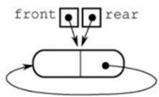
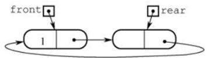

# 3.2 队列

## 3.2.5 本节试题精选

### 一、单项选择题

- 06. 已知循环队列的存储空间为数组 A[21], front 指向队头元素的前一个位置,
rear 指向队尾元素, 假设当前 front 和 rear 的值分别为 8 和 3, 则该队列的长度为 ( )。  
A. 5 B. 6 C. 16 D. 17

- 07. 若用数组 A[0...5] 实现循环队列,且当前 rear 和 front 的值分别为 1 和 5,
当从队列中删除一个元素, 再加入两个元素后, rear 和 front 的值分别为 ( )。  
A. 3 和 4 B. 3 和 0 C. 5 和 0 D. 5 和 1

- 08. 假设用数组 Q[MaxSize] 实现循环队列,
队首指针 front 指向队首元素的前一位置, 队尾指针 rear 指向队尾元素,
则判断该队列为空的条件是 ( )。  
A. (Q.rear+1)%MaxSize==(Q.front+1)%MaxSize  
A. (Q.rear+1)%MaxSize==Q.front+1  
A. (Q.rear+1)%MaxSize==Q.front  
A. Q.rear==Q.front

- 09. 假设循环队列 Q[MaxSize]的队头指针为 front，队尾指针为 rear，队列的最大容量MaxSize，
此外，该队列再没有其他数据成员，则判断该队列已满条件是 ( )。  
A. Q.front==Q.rear  
B. Q.front+Q.rear>=MaxSize  
C. Q.front==(Q.rear+1)%MaxSize  
D. Q.rear==(Q.front+1)%MaxSize

- 11. 与顺序队列相比, 链式队列 ( ) 。  
A. 优点是队列的长度不受限制  
B. 优点是进队和出队时间效率更高  
C. 缺点是不能进行顺序访问  
D. 缺点是不能根据队首指针和队尾指针计算队列的长度

- 12. 最适合用作队列的链表是 ( )。  
A. 带队首指针和队尾指针的循环单链表  
B. 带队首指针和队尾指针的非循环单链表  
C. 只带队首指针的非循环单链表  
D. 只带队首指针的循环单链表

- 15. 用链式存储方式的队列进行删除操作时需要 ( )。  
A. 仅修改头指针 B. 仅修改尾指针  
C. 头尾指针都要修改 D. 头尾指针可能都要修改

- 16. 在一个链队列中, 假设队头指针为 front, 队尾指针为 rear,
x 所指向的元素需要入队，则需要执行的操作为 ( )。  
A. front=x, front=front->next  
B. x->next=front->next,front=x  
C. rear->next=x, rear=x  
D. rear->next=x, x->next=NULL, rear=x

- 17. 假设循环单链表表示的队列长度为 n ,队头固定在链表尾,
若只设头指针,则进队操作的时间复杂度为 ( ) 。  
A. $O\left( n\right)$ B. $O\left( 1\right)$ C. $O\left( {n}^{2}\right)$ D. $O\left( {n{\log }_{2}n}\right)$

- 21. 【2011 统考真题】已知循环队列存储在一维数组 A[0...n-1]中, 且队列非空时 front 和 rear 分别指向队头元素和队尾元素。若初始时队列为空, 且要求第一个进入队列的元素存储在 A[0] 处,则初始时 front 和 rear 的值分别是 ( )。  
A. 0,0 &emsp; B. 0,n-1 &emsp; C.n-1,0 &emsp; D. n-1,n-1

### 二、综合应用题

- 01. 若希望循环队列中的元素都能得到利用, 则需设置一个标志域 tag, 并以 tag 的值为 0 或 1 来区分队头指针 front 和队尾指针 rear 相同时的队列状态是 “空” 还是 “满” 试编写与此结构相应的入队和出队算法。

- 02. Q 是一个队列, S 是一个空栈, 实现将队列中的元素逆置的算法。

- 03. 利用两个栈 S1 和 S2 来模拟一个队列, 已知栈的 4 个运算定义如下:  

    ```c
    Push(S, x); // 元素 x 入栈 S
    Pop(S, x); // S 出栈, 并将出栈的值赋给 x
    StackEmpty(S); //判断栈是否为空
    StackOverflow(S); //判断栈是否满
    ```

    如何利用栈的运算来实现该队列的 3 个运算 (形参由读者根据要求自己设计) ?

    ```c
    Enqueue; //将元素 x 入队
    Dequeue; //出队,并将出队元素存储在 x 中
    QueueEmpty; //判断队列是否为空
    ```

- 04. 【2019 统考真题】请设计一个队列，要求满足：①初始时队列为空；②入队时，允许增加队列占用空间; ③出队后, 出队元素所占用的空间可重复使用, 即整个队列所占用的空间只增不减；④入队操作和出队操作的时间复杂度始终保持为 $O\left( 1\right)$ 。请回答：  
1）该队列是应选择链式存储结构，还是应选择顺序存储结构？  
2）画出队列的初始状态，并给出判断队空和队满的条件。  
3）画出第一个元素入队后的队列状态。  
4）给出入队操作和出队操作的基本过程。

## 3.2.6 答案与解析

### 一、单项选择题

- 06. C  
队列的长度为 (rear-front+maxsize) %maxsize= (rear-front+21)%21 = 16 。这种情况和 front 指向当前元素， rear 指向队尾元素的下一个元素的计算是相同的。

- 07. B  
循环队列中，每删除一个元素，队首指针 front= (front+l)%6 ，每插入一个元素，队尾指针 rear= (rear+l)%6 。上述操作后， front= 0 ， rear=3.

- 08. D  
当队列中只有一个元素时, front 指向该元素的前一个位置, rear 指向该元素, 因此当队列为空时, 队首指针等于队尾指针, 这样第一个元素进队后, 才能符合题目要求。

- 09. C  
既然不能附加任何其他数据成员, 只能采用牺牲一个存储单元的方法来区分是队空还是队满, 约定以 “队列头指针在队尾指针的下一位置作为队满的标志”, 因此选 C。选项 A 是判断队列是否空的条件,选项 B 和 D 都是干扰项。

- 11. D  
虽然链式队列采用动态分配方式, 但其长度也受内存空间的限制, 不能无限制增长。顺序队列和链式队列的进队和出队时间均为 $O\left( 1\right)$ 。顺序队列和链式队列都可以进行顺序访问。对于顺序队列, 可通过队头指针和队尾指针计算队列中的元素个数, 而链式队列则不能。

- 12. B  
因为队列需在双端进行操作,所以选项 C 和 D 的链表显然不太适合链队。对于 A ,链表在完成进队和出队后还要修改为循环的, 对于队列来讲这是多余的 (画蛇添足)。对于 B ,因为有首指针, 所以适合删除首结点; 因为有尾指针, 所以适合在其后插入结点。

- 15. D  
队列用链式存储时, 删除元素从表头删除, 通常仅需修改头指针, 但若队列中仅有一个元素, 则尾指针也需要被修改, 当仅有一个元素时, 删除后队列为空, 需修改尾指针为 rear=front。

- 16. D  
插入操作时,先将结点 x 插入到链表尾部,再让 rear 指向这个结点 x 。 C 的做法不够严密, 因为是队尾, 所以队尾 x->next 必须置为空。

- 17. A  
依题意, 进队操作是在队尾进行, 即链表表头。题中已明确说明链表只设头指针, 也即没有头结点和尾指针, 进队后, 循环单链表必须保持循环的性质, 在只带头指针的循环单链表中寻找表尾结点的时间复杂度为 $O\left( n\right)$ ,所以进队的时间复杂度为 $O\left( n\right)$ 。

- 21. B  
根据题意, 第一个元素进入队列后存储在 A[0] 处,此时 front 和 rear 值都为 0 。入队时因为要执行 (rear+1) %n 操作, 所以若入队后指针指向 0, 则 rear 初值为 n-1 ,而因为第一个元素在 A[0] 中,插入操作只改变 rear 指针,所以 front 为 0 不变。

    >注 意
    >
    >①循环队列是指顺序存储的队列, 而不是指逻辑上的循环, 如循环单链表表示的队列不能称为循环队列。②front 和 rear 的初值并不是固定的。

### 二、综合应用题

- 01.【解答】  
在循环队列的类型结构中, 增设一个 tag 的整型变量, 进队时置 tag 为 1 , 出队时置 tag 为 0 (因为只有入队操作可能导致队满,也只有出队操作可能导致队空)。队列 Q 初始时,置 tag=0 、 front=rear=0。这样队列的 4 要素如下:  
队空条件: Q.front==Q.rear 且 Q.tag== 0 。  
队满条件: Q.front==Q.rear 且 Q.tag== 1 。  
进队操作: Q.data[Q.rear]=x; Q.rear= (Q.rear+1) %MaxSize; Q.tag=1。  
出队操作: x=Q.data[Q.front]; Q.front= (Q.front+1) %MaxSize; Q.tag=0。

    一、设 “tag” 法的循环队列入队算法:

    ```c
    int EnQueue1(SeQueue &Q, ElemType x) {
        if ((Q.front == Q.rear) && (Q.tag == 1)) { // 队满
            return 0;
        }
        Q.data[Q.rear] = x;
        Q.rear = (Q.rear + 1) % MaxSize;
        Q.tag = 1; // 可能队满
        return 1;
    }
    ```

    二、设 “tag” 法的循环队列出队算法:

    ```c
    int DeQueue1(SeQueue &Q, ElemType &x) {
        if (Q.front == Q.rear && Q.tag == 0) { // 队空
            return 0;
        }
        x = Q.data[Q.front];
        Q.front = (Q.front + 1) % MaxSize;
        Q.tag = 0; // 可能队空
        return 1;
    }
    ```

- 02. 【解答】  
本题主要考查大家对队列和栈的特性与操作的理解。因为对队列的一系列操作不可能将其中的元素逆置, 而栈可以将入栈的元素逆序提取出来, 所以我们可以让队列中的元素逐个地出队列, 入栈; 全部入栈后再逐个出栈, 入队列。算法的实现如下:

    ```c
    void Inverser(Stack &S, Queue &Q) {
        while (!QueueEmpty(Q)) {
            x = DeQueue(Q); // 出队
            Push(S, x); // 入栈
        }
        while (!StackEmpty(S)) {
            Pop(S, x); // 出栈
            EnQueue(Q, x); // 入队
        }
    }
    ```

- 03.【解答】  
利用两个栈 s1 和 s2 来模拟一个队列, 当需要向队列中插入一个元素时, 用 s1 来存放已输入的元素, 即 s1 执行入栈操作。当需要出队时, 则对 s2 执行出栈操作。因为从栈中取出元素的顺序是原顺序的逆序, 所以必须先将 s1 中的所有元素全部出栈并入栈到 s2 中, 再在 s2 中执行出栈操作, 即可实现出队操作, 而在执行此操作前必须判断 S2 是否为空, 否则会导致顺序混乱。 当栈 s1 和 s2 都为空时队列为空。 总结如下:

    1) 对 S2 的出栈操作用做出队, 若 S2 为空, 则先将 S1 中的所有元素送入 S2。

    2) 对 s1 的入栈操作用作入队, 若 s1 满, 必须先保证 s2 为空, 才能将 s1 中的元素全部插入 s2 中。  
    入队算法:

    ```c
    int EnQueue(Stack &S1, Stack &S2, ElemType e) {
        if(!StackOverflow(S1)) {
            Push(S1, e);
            return 1;
        }
        if(!StackOverflow(S1) && !StackEmpty(S2)) {
            printf("队列已满\n");
            return 0;
        }
        if(StackOverflow(S1) && StackEmpty(S2)) {
            while(!StackEmpty(S1)) {
                Pop(S1, x);
                Push(S2, x);
            }
        }
        Push(S1, x);
        return 1;
    }
    ```

    出队算法:

    ```c
    void DeQueue(Stack &S1, Stack &S2, ElemType &x) {
        if(!StackEmpty(S2)) {
            Pop(S2, x);
        }
        else if(StackEmpty(S1)) {
            printf("队列为空\n");
        } else {
            while(!StackEmpty(S1)) {
                Pop(S1, x);
                Push(S2, x);
            }
            Pop(S2, x);
        }
    }
    ```

    判断队列为空的算法：

    ```c
    int QueueEmpty(Stack S1, Stack S2) {
        if(StackEmpty(S1) && StackEmpty(S2)) {
            return 1;
        }
        return 0;
    }
    ```

- 04.【解答】  

1. 顺序存储无法满足要求②的队列占用空间随着入队操作而增加。根据要求来分析: 要求 ①容易满足; 链式存储方便开辟新空间, 要求②容易满足; 对于要求③, 出队后的结点并不真正释放, 用队头指针指向新的队头结点, 新元素入队时, 有空余结点则无须开辟新空间, 赋值到队尾后的第一个空结点即可, 然后用队尾指针指向新的队尾结点, 这就需要设计成一个首尾相接的循环单链表, 类似于循环队列的思想。设置队头、队尾指针后,链式队列的入队操作和出队操作的时间复杂度均为 $O\left( 1\right)$ ,要求④可以满足。
因此, 采用链式存储结构 (两段式单向循环链表), 队头指针为 front, 队尾指针为 rear。

2. 该循环链式队列的实现可以参考循环队列, 不同之处在于循环链式队列可以方便地增加空间, 出队的结点可以循环利用, 入队时空间不够也可以动态增加。同样, 循环链式队列也要区分队满和队空的情况, 这里参考循环队列牺牲一个单元来判断。初始时, 创建只有一个空闲结点的循环单链表, 头指针 front 和尾指针 rear 均指向空闲结点, 如下图所示。  
  
队空的判定条件: front==rear。  
队满的判定条件: front==rear->next。  

3. 插入第一个元素后的状态如下图所示。  
  

4. 操作的基本过程如下:  
    入队操作:

    ```c
    若 (front==rear->next) // 队满
        则在 rear 后面插入一个新的空闲结点;
    入队元素保存到 rear所指结点中; rear=rear->next; 返回。
    ```

    出队操作:

    ```c
    若 (front==rear) //队空
        则出队失败, 返回;
    取 front 所指结点中的元素e; front=front->next; 返回e。
    ```
