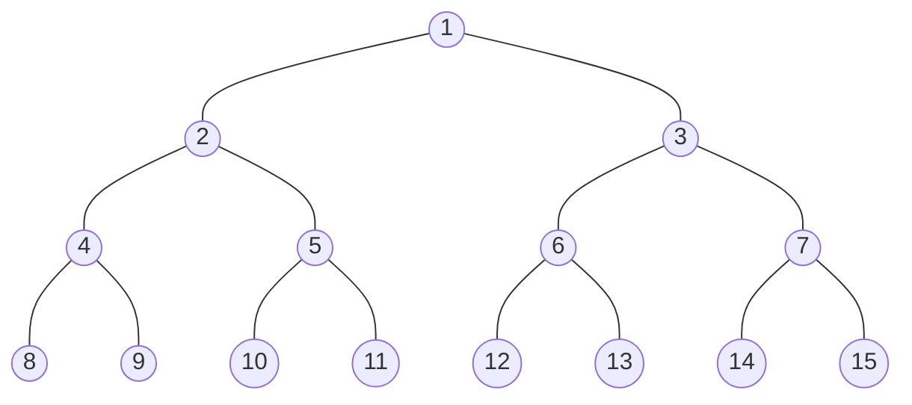
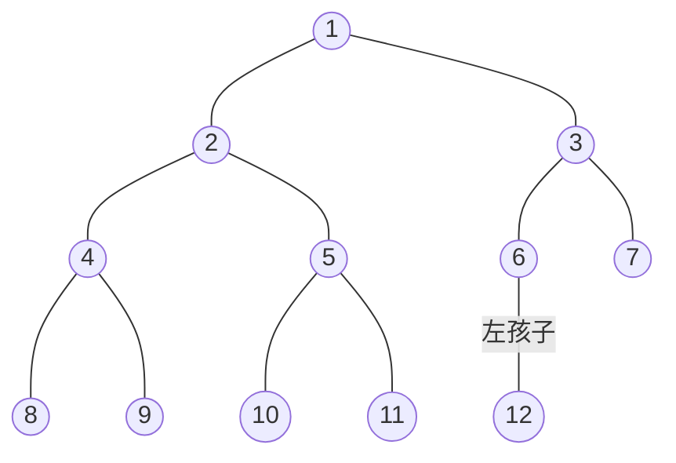

# 5.2 二叉树的概念

## 5.2.1  二叉树的定义及其主要特性

### 1. 二叉树的定义

二叉树是一种特殊的树形结构，其特点是每个结点至多只有两棵子树（即二叉树中不存在度大于 2 的结点），并且二叉树的子树有左右之分，其次序不能任意颠倒。

### 2. 几种特殊的二叉树

#### 1. 满二叉树

一棵高度为 $h$ ，且有 $2^{h}\!-\!1$ 个结点的二叉树称为满二叉树，即二叉树中的每层都含有最多的结点，如图5.3（a）所示。满二叉树的叶结点都集中在二叉树的最下一层，并且除叶结点之外的每个结点度数均为2。  

可以对满二叉树按层序编号：约定编号从根结点（根结点编号为1）起，自上而下，自左向右。这样，每个结点对应一个编号，对于编号为 $i$ 的结点，若有双亲，则其双亲为 $\lfloor i/2 \rfloor$，若有左孩子，则左孩子为2i：若有右孩子，则右孩子为 $2i+1$



图5.3(a) 满二叉树

#### 2. 完全二叉树

高度为 $h$ 、有 $n$ 个结点的二叉树，当且仅当其每个结点都与高度为 $h$ 的满二叉树中编号为 $1\!\sim\!n$ 的结点一一对应时，称为完全二叉树，如图5.3（b）所示。



图5.3(b) 完全二叉树

其特点如下：  

- 若 $i\le\lfloor n/2 \rfloor$，则结点 $i$ 为分支结点，否则为叶结点。  

- 叶结点只可能在层次最大的两层上出现。对于最大层次中的叶结点，都依次排列在该层最左边的位置上。
- 若有度为1的结点，则最多只可能有一个，且该结点只有左孩子而无右孩子。
- 按层序编号后，一旦出现某结点（编号为 i ）为叶结点或只有左孩子，则编号大于 i 的结点均为叶结点。
- 若 $n$ 为奇数，则每个分支结点都有左孩子和右孩子：若 $n$ 为偶数，则编号最大的分支结点（编号为 $n/2$ ）只有左孩子，没有右孩子，其余分支结点左、右孩子都有。  

#### 3. 二叉排序树

左子树上所有结点的关键字均小于根结点的关键字；右子树上所有结点的关键字均大于根结点的关键字；左子树和右子树又各是一棵二叉排序树。

#### 4. 平衡二叉树

树中任意一个结点的左子树和右子树的高度之差的绝对值不超过1。关于二叉排序树和平衡二叉树的详细介绍，见本书中的7.3节。  

#### 5. 正则二叉树

树中每个分支结点都有2个孩子，即树中只有度为0或2的结点。

### 3. 二叉树的性质  

- 非空二叉树上的叶结点数等于度为2的结点数加1，即 $n_{0}\!=\!n_{2}+1$  
- 非空二叉树的第  $k$  层最多有  $2^{k-1}$  个结点（  $k\!\geqslant\!1$ ）
- 高度为  $h$  的二叉树至多有  $2^{h}\!-\!1$  个结点（  $h{\geqslant}1$ ）
- 对完全二叉树按从上到下，从左到右的顺序依次编号 $1, 2, \cdots, n$ ，则有以下关系：
  1. 若 $i\leq \lfloor n/2 \rfloor$，则结点 $i$ 为分支结点，否则为叶结点，即最后一个分支节点的编号是 $\lfloor n/2 \rfloor$
  2. 叶节点只可能在层次最大的两层上出现（若删除满二叉树中最底层、最右边的连续2个或以上的叶结点，则倒数第二层将会出现叶节点）
  3. 若有度为 1 的结点，则只可能有一个，且该结点只有左孩子而无右孩子（度为 1 的分支结点只可能是最后一个分支节点，其节点编号为 $\lfloor n/2 \rfloor$ ）
  4. 按层序编号后，一旦出现某结点（如编号为 $i$ 的结点）为叶结点或只有左孩子，则编号大于 $i$ 的结点均为叶结点（与结论 1 和结论 3 是相通的）
  5. 若 $n$ 为奇数，则每个分支结点都有左孩子和右孩子；若 $n$ 为偶数，则编号最大的分支结点（编号为 $n/2$ ）只有左孩子，没有右孩子，其余分支结点都有左、右孩子。
  6. 当 $i>1$ 时，结点 $i$ 的双亲结点编号为 $\lfloor i/2 \rfloor$
  7. 若结点 $i$ 有左、右孩子，则左孩子编号为 $2i$，右孩子编号为 $2i+1$
  8. 节点 $i$ 所在层次（深度）为 $\lfloor \log_2 i \rfloor + 1$
- 具有 $n$ 个( $n>0$ ）结点的完全二叉树的高度为 $\lceil\log_{2}(n+1)\rceil$ 或 $\lfloor\log_{2}\!n\rfloor+1$ 。

## 5.2.2 二叉树的存储结构

### 1. 顺序存储结构

二叉树的顺序存储是指用一组连续的存储单元依次自上而下、自左至右存储完全二叉树上的结点元素，即将完全二叉树上编号为 $i$ 的结点元素存储在一维数组下标为 `i-1` 的分量中。  

依据二叉树的性质，完全二叉树和满二叉树采用顺序存储比较合适，树中结点的序号可以唯一地反映结点之间的逻辑关系，这样既能最大可能地节省存储空间，又能利用数组元素的下标值确定结点在二叉树中的位置，以及结点之间的关系。  

### 2. 链式存储结构

由于顺序存储的空间利用率较低，因此二叉树一般都采用链式存储结构，用链表结点来存储二叉树中的每个结点。在二叉树中，结点结构通常包括若干数据域和若干指针域，二叉链表至少包含3个域：数据域data、左指针域 `lchild` 和右指针域 `rchild` ，如图5.5所示。  

```txt
┌────────┬────────┬────────┐
│ lchild │  data  │ rchild │
└────────┴────────┴────────┘
```

图5.5

容易验证，在含有 $n$ 个结点的二叉链表中，含有 $n+1$ 个空链域（重要结论，经常出现在选择题中）。在下一节中，我们将利用这些空链域来组成另一种链表结构一一线索链表。

## 5.2.3 本节试题精选

### 一、单项选择题

03 以下说法中，正确的是（）。  
A.在完全二叉树中，叶结点的双亲的左兄弟（若存在）一定不是叶结点  
B.任何一棵二叉树中，叶结点数为度为2的结点数减1，即 $n_0=n_2-1$  
C.完全二叉树不适合顺序存储结构，只有满二叉树适合顺序存储结构  
D.结点按完全二叉树层序编号的二叉树中，第 i 个结点的左孩子的编号为 2i

08 设二叉树有2n个结点，且 $m<n$ ，则不可能存在（）的结点。  
A.n个度为o  
B.2m个度为0  
C.2m个度为1  
D.2m个度为2

16 一棵有124个叶结点的完全二叉树，最多有（）个结点。  
A. 247  
B. 248  
C. 249  
D. 250

18.设有n（n≥1）个结点的二叉树采用三叉链表表示，其中每个结点包含三个指针，分别
指向其左孩子、右孩子及双亲（若不存在，则置为空），则下列说法中正确的是（）。  
I.树中空指针的数量为n+2  
II.所有度为2的结点均被三个指针指向  
III.每个叶结点均被一个指针所指向  
A. I  
B. I、II  
C. I、III  
D. II、III

24.【2009统考真题】已知一棵完全二叉树的第6层（设根为第1层）有8个叶结点，则该
完全二叉树的结点个数最多是（）。  
A. 39  
B. 52  
C. 111  
D. 119

### 二、综合应用题

01 在一棵完全二叉树中，含有n个叶结点，当度为1的结点数为1时，该树的高度是多少？
当度为1的结点数为0时，该树的高度是多少？

03 已知完全二叉树的第9层有240个结点，则整个完全二叉树有多少个结点？有多少个叶结点？

04 一棵高度为 $h$ 的满 $m$ 叉树有如下性质：根结点所在层次为第 1层，第$h$层上的结点都是叶结点，其余各层上每个结点都有$m$棵非空子树，若按层次自顶向下，同一层自左向右，
顺序从1开始对全部结点进行编号，试问：  

1. 各层的结点个数是多少？
2. 编号为$i$的结点的双亲结点(若存在)的编号是多少？
3. 编号为$i$的结点的第$k$个孩子结点(若存在)的编号是多少？
4. 编号为$i$的结点有右兄弟的条件是什么？其右兄弟结点的编号是多少？

## 5.2.4 答案与解析

### 一、单项选择题

03 A

在完全二叉树中，叶结点的双亲的左兄弟的孩子一定在其前面(且一定存在),所以双亲的左兄弟(若存在)一定不是叶结点，选项 A 正确。$n_0$应等于$n_2+1$,选项 B 错误。完全二叉树和满二叉树均可以采用顺序存储结构，选项 C 错误。第$i$个结点的左孩子不一定存在，选项 D 错误。
选项 B 的这种通用公式适用于所有二叉树，我们应能立即联想到采用特殊值代入法验证，如
画一个只含 3 个结点的满二叉树的草图来验证是否满足条件。

08 C

由二叉树的性质 1 可知 $n_0=n_2+1$,结点总数 $=2n=n_0+n_1+n_2=n_1+2n_2+1$ ,则  $n_1=2(n-n_2)-1$ ,所以 $n_1$ 为奇数，说明该二叉树中不可能有 $2m$ 个度为 1 的结点。

16 B

在非空的二叉树当中，由度为 0 和 2 的结点数的关系$n_0=n_2+1$可知$n_{2}=123;$总结点数$n=n_0+n_1+n_2=247+n_1$,其最大值为 248($n_1$的取值为 1 或0，当$n_1=1$时结点最多)。注意，由完全二叉树总结点数的奇偶性可以确定$n_1$的值，但不能根据$n_0$来确定$n_1$的值。  

18 A
二叉链表表示的二叉树中空指针的数量为$n+1$,三叉链表表示的二叉树多了一个根结点指向双亲的空指针，所以树中空指针的数量为$n+2$, I 正确。若根结点的度为2，则只有左、右两个孩子指向它，II 错误。若整棵树只有一个根结点，则没有指针指向它，III 错误。

24 C

第 6 层有叶结点，完全二叉树的高度可能为6 或 7,显然树高为 7 时结点最多。完全二叉树与满二叉树相比，只是在最下一层的右边缺少部分叶结点，而最后一层之上是个满二叉树，且只有最后两层上有叶结点。若第 6 层上有 8 个叶结点，则前 6 层为满二叉树，而第 7 层缺失 8×2=16个叶结点，所以完全二叉树的结点个数最多为 $2^7-1-16=111$ 。

### 二、综合应用题

01

在非空的二叉树中，由度为 0 和度为 2 的结点之间的关系$n_0=n_2+1$ ,可知$n_2=n_0-1$。因此
总结点数$n=n_0+n_1+n_2=2n_0+n_1-1$。  
$\textcircled{1}当n_{1}=1时，n=2n_{0},h=\lceil\log_{2}(n+1)\rceil=\lceil\log_{2}(2n_{0}+1)\rceil$。  
$\textcircled{2}当n_{1}=0$时，$n=2n_0-1,h=\lceil\log_2(n+1)\rceil=\lceil\log_2(2n_0)\rceil=\lceil\log_2(n_0)\rceil+1$。

03

在完全二叉树中，若第 9层是满的，则结点数$=2^9-1=256$,而现在第 9层只有 240 个结点，
说明第 9 层未满，是最后一层。1~8 层是满的，所以总结点数$=2^8-1+240=495$。

因为第 9 层是最后一层，所以第 9 层的结点都是叶结点。且第 9 层的 240 个结点的双亲在第8 层中，其双亲个数为 120,即第 8 层有 120 个分支结点，其余为叶结点，所以第 8 层的叶结点个数为 $2^8-1-120=8$。因此，总的叶结点个数=8+240=248。

[另解]总结点数 $n= n_0+ n_1+ n_2$, $n_2= n_0- 1$, $n= n_0+ n_1+ n_2= 2n_0+ n_1- 1$。若 $n_1=1$,则
$2n_{0}+n_{1}-1=2n_{0}=495$,不符合；若$n_1=0$,则$2n_0+n_1-1=2n_0-1=495$,则$n_0=248$。

04

1) 第 1 层有$m^0=1$个结点，第 2 层有$m^{1}$个结点，第 3 层有$m^{2}$个结点，第 3 层有$m^{2}$个结点 .......一般地，第$i$层有
$m^{i-1}$个结点（ $1\leqslant i\leqslant h$ ）。
2) 在$m$叉树的情形下，结点$i$的第 1 个子女编号为$j=(i-1)m+2$,反过来，结点$i$的双亲的编号是$\lfloor(i-2)/m\rfloor+1$,根结点没有双亲，所以要求 $i>1$。
3) 因为结点$i$的第 1 个子女编号为$(i-1)m+2$,若设该结点子女的序号为$k=1,2,\cdots,m$,则
第 $k$ 个子女结点的编号为$( i- 1) m+ k+ 1$ $( 1\leq k\leqslant m)$。
4) 结点$i$ 不是其双亲的第 $m$ 个 子 女 时 才 有 右 兄 弟 。设 其 双 亲 编 号 为 $j$,可得$j=\lfloor(i+m-2)/m\rfloor$,
结点$j$ 的第 $m$ 个子女的编号为$(j-1)m+m+1=jm+1=\lfloor(i+m-2)/m\rfloor m+1$,所以当结点的编号 $i\leqslant\lfloor(i+m-2)/m\rfloor m$ 时才有右兄弟，右兄弟的编号为$i+1$。或者，对于任意一个双亲结点$j$,其第$m$ 个子女结点的编号是$jm+1$,所以若不为第$m$ 的子女结点，则$(i-1)\%m \ne 0$。
