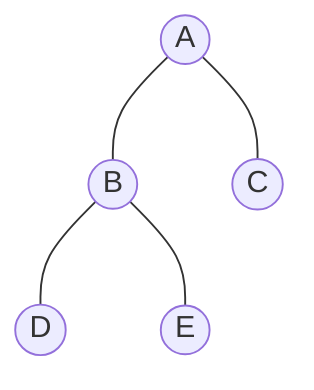
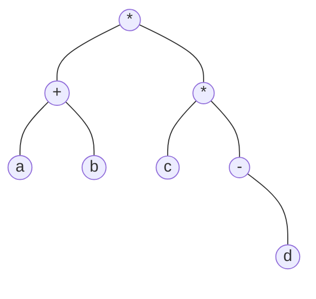
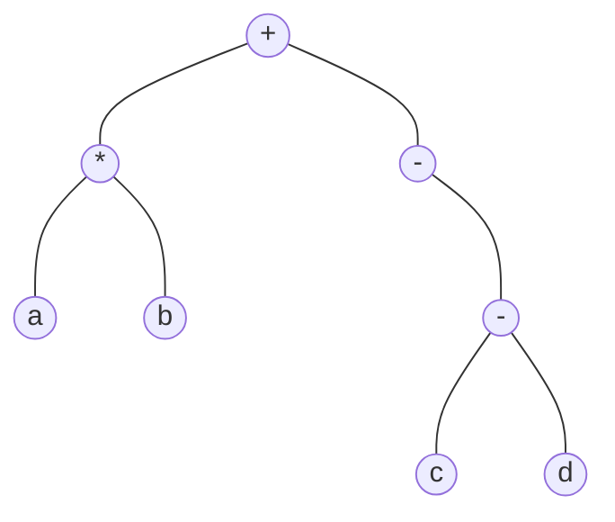
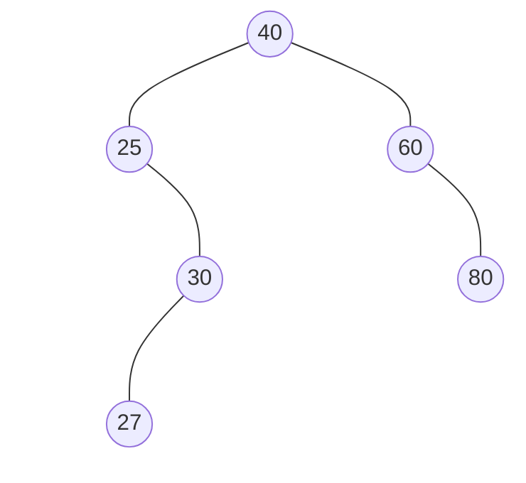
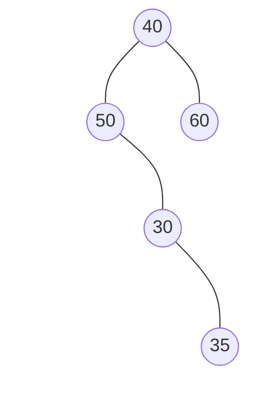
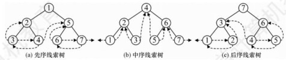
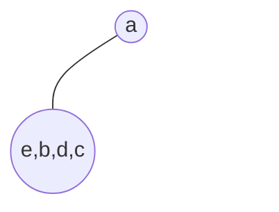
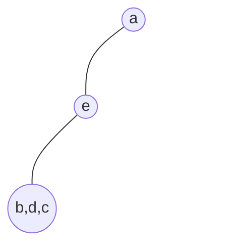
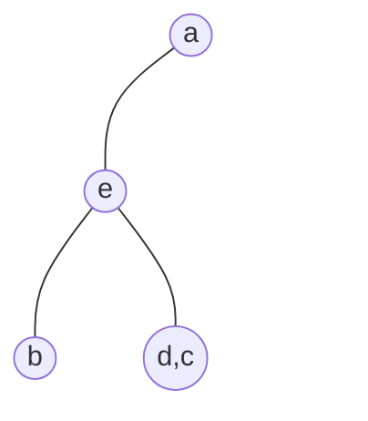
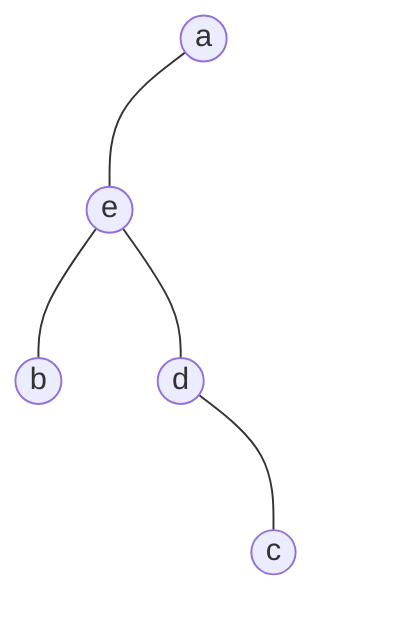

# 5.3 二叉树的遍历和线索二叉树

## 5.3.1 二叉树的遍历

### 1. 先序遍历

根左右

```c
void preOrder(BiTree T) {
    if (T != NULL) {
        visit(T->data);
        preOrder(T->lchild);
        preOrder(T->rchild);
    }
}
```

### 2. 中序遍历

左根右

```c
void inOrder(BiTree T) {
    if (T != NULL) {
        inOrder(T->lchild);
        visit(T->data);
        inOrder(T->rchild);
    }
}
```

### 3. 后序遍历

左右根

```c
void postOrder(BiTree T) {
    if (T != NULL) {
        postOrder(T->lchild);
        postOrder(T->rchild);
        visit(T->data);
    }
}
```

### 4. 递归算法和非递归算法的转换

中序遍历的非递归算法如下

```c
void inOrder2(BiTree T) {
    Stack S; InitStack(S); // 创建栈S
    BiTree p = T; // 初始化遍历指针p
    while (p || !StackEmpty(S)) { // 当p不空或栈S不为空时，循环
        if (p) { // 一路向左
            Push(S, p); // 当前结点入栈
            p = p->lchild; // 左孩子不空，继续向左
        } else {
            Pop(S, p); // 栈顶结点出栈
            visit(p->data); // 访问栈顶结点
            p = p->rchild; // 向右子树走，p置为当前节点的右孩子
        }
    }
}
```

先序遍历的非递归算法如下

```c
void preOrder2(BiTree T) {
    Stack S; InitStack(S);
    BiTree p = T;
    while (p || !StackEmpty(S)) {
        if (p) {
            visit(p->data);
            Push(S, p);
            p = p->lchild;
        } else {
            Pop(S, p);
            p = p->rchild;
        }
    }
}
```

后序遍历的非递归实现是三种遍历方法中最难的。因为在后序遍历中，要保证左孩子和右孩子都已被访问并且左孩子在右孩子前访问才能访问根结点，这就为流程的控制带来了难题。

后序非递归遍历算法的思路分析：从根结点开始，将其入栈，然后沿其左子树一直往下搜索， 直到搜索到没有左孩子的结点，但是此时不能出栈并访问，因为若其有右子树，则还需按相同的规则对其右子树进行处理。直至上述操作进行不下去，若栈顶元素想要出栈被访问，要么右子树为空，要么右子树刚被访问完(此时左子树早已访问完),这样就保证了正确的访问顺序。



图 5.10

按后序非递归算法遍历上图中的二叉树，当访问到$E$ 时，$A,B,D$ 都已入过栈，对于后序非递归遍历，当一个结点的左右子树都被访问后才会出栈，图中$D$已出栈，此时栈内还有$A$和$B$, 这是$E$ 的全部祖先。实际上，访问一个结点$p$ 时，栈中结点恰好是结点 $p$ 的所有祖先，从栈底到栈顶结点再加上结点$p$,刚好构成从根结点到结点$p$的一条路径。在很多算法设计中都可以利用这一思路来求解，如求根到某结点的路径、求两个结点的最近公共祖先等。

### 5. 层次遍历

进行层次遍历，需要借助一个队列。层次遍历的思想如下：

1. 首先将二叉树的根结点入队。
2. 若队列非空，则队头结点出队，访问该结点，若它有左孩子，则将其左孩子入队；若它有右孩子，则将其右孩子入队。
3. 重复 2. 步，直至队列为空。

二叉树的层次遍历算法如下：

```c
void levelOrder(BiTree T) {
    Queue Q; InitQueue(Q); // 创建辅助队列Q
    EnQueue(Q, T); // 将根结点入队
    BiTree p;
    while (!QueueEmpty(Q)) { // 当队列Q非空时，循环
        DeQueue(Q, p); // 队头结点出队
        visit(p->data); // 访问队头结点
        if (p->lchild != NULL) EnQueue(Q, p->lchild); // 左孩子入队
        if (p->rchild != NULL) EnQueue(Q, p->rchild); // 右孩子入队 
    }
}
```

### 6. 由遍历序列构造二叉树

对于一棵给定的二叉树，其先序序列、中序序列、后序序列和层序序列都是确定的。然而， 只给出四种遍历序列中的任意一种，却无法唯一地确定一棵二叉树。若已知中序序列，再给出其他三种遍历序列中的任意一种，就可以唯一地确定一棵二叉树。

## 5.3.2 线索二叉树

### 1. 线索二叉树的基本概念

遍历二叉树是以一定的规则将二叉树中的结点排列成一个线性序列，从而得到几种遍历序
列，使得该序列中的每个结点(第一个和最后一个除外)都有一个直接前驱和直接后继。

```txt
┌────────┬────────┬────────┬────────┬────────┐
│ lchild │  ltag  │  data  │  rtag  │ rchild |
└────────└────────┴────────┴────────┴────────┘
```

$$
\begin{aligned}&\text{1tag}=\begin{cases}0,&\text{1child域指示结点的左孩子}\\1,&\text{1child域指示结点的前驱}\end{cases}\\&\text{rtag}=\begin{cases}0,&\text{rchild域指示结点的右孩子}\\1,&\text{rchild域指示结点的后继}\end{cases}\end{aligned}
$$

```c
typedef struct ThreadNode {
    ElemType data; // 数据元素
    struct ThreadNode *lchild, *rchild; // 左右孩子指针
    int ltag, rtag; // 左右线索标志
} ThreadNode, *ThreadBiTree;
```

以这种结点结构构成的二叉链表作为二叉树的存储结构，称为线索链表，其中指向结点前驱和后继的指针称为线索。加上线索的二叉树称为线索二叉树。

### 2.中序线索二叉树的构造

二叉树的线索化是将二叉链表中的空指针改为指向前驱或后继的线索。而前驱或后继的信息
只有在遍历时才能得到，因此线索化的实质就是遍历一次二叉树。

以中序线索二叉树的建立为例。附设指针 pre 指向刚刚访问过的结点，指针 p 指向正在访问的结点，即 pre 指向 p 的前驱。在中序遍历的过程中，检查 p 的左指针是否为空，若为空就将它指向 pre; 检查 pre 的右指针是否为空，若为空就将它指向 p 。

通过中序遍历对二叉树线索化的递归算法如下

```c
void InThread(ThreadBiTree &p, ThreadBiTree &pre) {
    if (p != NULL) {
        InThread(p->lchild, pre); // 递归处理左子树
        if (p->lchild == NULL) { // 当前节点的左子树为空
            p->lchild = pre; // 建立当前结点的前驱线索
            p->ltag = 1;
        }
        if (pre != NULL && pre->rchild == NULL) { // 前驱结点非空且右子树为空
            pre->rchild = p; // 建立前驱结点的后继线索
            pre->rtag = 1;
        }
        pre = p; // pre指向刚刚访问的结点
        InThread(p->rchild, pre); // 递归处理右子树
    }
}
```

通过中序遍历建立中序线索二叉树的主过程算法如下

```c
void CreateInThread(ThreadBiTree &T) {
    ThreadBiTree pre = NULL;
    if (T != NULL) {
        InThread(T, pre);
        pre->rchild = NULL; // 处理最后一个结点
        pre->rtag = 1;
    }
}
```

### 3. 中序线索二叉树的遍历

中序线索二叉树的结点中隐含了线索二叉树的前驱和后继信息。在对其进行遍历时，只要先找到序列中的第一个结点，然后依次找结点的后继，直至其后继为空。在中序线索二叉树中找结点后继的规律是：若其右标志为“1”,则右链为线索，指示其后继，否则遍历右子树中第一个访问的结点(右子树中最左下的结点)为其后继。不含头结点的线索二叉树的遍历算法如下。

1 求中序线索二叉树的中序序列下的第一个结点：

```c
ThreadNode *Firstnode(ThreadNode *p) {
    while (p->ltag == 0) p = p->lchild; // 循环找到最左下结点 （不一定是叶节点）
    return p;
}
```

2 求中序线索二叉树中结点 p在中序序列下的后继

```c
ThreadNode *Nextnode(ThreadNode *p) {
    if (p->rtag == 0) return Firstnode(p->rchild); // 右子树中最左下结点
    return p->rchild;
}
```

利用上面两个算法,可写出不含头结点的中序线索二叉树的中序遍历的算法:

```c
void InOrderThread(ThreadNode *p) {
    for (ThreadNode *p = Firstnode(T); p != NULL; p = Nextnode(p)) {
        visit(p->data);
    }
}
```

### 4. 先序线索二叉树和后序线索二叉树

上面给出了建立中序线索二叉树的代码，建立先序线索二叉树和建立后序线索二叉树的代码类似，只需变动线索化改造的代码段与调用线索化左右子树递归函数的位置。

如何在先序线索二叉树中找结点的后继？若有左孩子，则左孩子就是其后继；若无左孩子但有右孩子，则右孩子就是其后继；若为叶结点，则右链域直接指示了结点的后继。

在后序线索二叉树中找结点的后继较为复杂，可分三种情况：

- 若结点 x 是二叉树的根，则其后继为空；
- 若结点 x 是其双亲的右孩子，或是其双亲的左孩子且其双亲没有右子树，则其后继即为双亲；
- 若结点 x 是其双亲的左孩子，且其双亲有右子树，则其后继为双亲的右子树上按后序遍历列出的第一个结点。在后序线索二叉树上找后继时需知道结点双亲，即需采用带标志域的三叉链表作为存储结构。

## 5.3.3 本节试题精选

### 一、单项选择题

**01** 在下列关于二叉树遍历的说法中，正确的是( )  
A. 若有一个结点是二叉树中某个子树的中序遍历结果序列的最后一个结点，则它一定是该子树的前序遍历结果序列的最后一个结点。  
B. 若有一个结点是二叉树中某个子树的前序遍历结果序列的最后一个结点，则它一定是该子树的中序遍历结果序列的最后一个结点。  
C. 若有一个叶节点是二叉树中某个子树的中序遍历结果序列的最后一个结点，则它一定是该子树的前序遍历结果序列的最后一个结点。  
D. 若有一个叶节点是二叉树中某个子树的前序遍历结果序列的最后一个结点，则它一定是该子树的中序遍历结果序列的最后一个结点。

**04** 设 $n,m$ 为一棵二叉树上的两个结点，在后序遍历时，$n$ 在 $m$ 前的充分条件是()。  
A. $n$在$m$ 右方  
B. $n$是$m$ 祖先  
C. $n$在$m$左方  
D. $n$是$m$子孙

**05** 在二叉树中有两个结点m和n,若m是n的祖先,则使用()可以找到从m到n的路径。  
A.先序遍历  
B.中序遍历  
C.后序遍历  
D.层次遍历

**09** 按某种顺序对二叉树的结点进行编号，编号为 1,2,...,n,规定：树中任一结点 v ,其编
号等于 v 的左子树上的最小编号减1，而 v 的右子树中的最小编号等于 v 的左子树上的
最大编号加 1,则说明该二叉树是按()次序编号的。  
A. 中序遍历  
B. 先序遍历  
C. 后序遍历  
D. 层次遍历

**23** 线索二叉树是一种()结构。  
A. 逻辑  
B. 逻辑和存储  
C. 物理  
D. 线性

**29** 若$X$是二叉中序线索树中一个有左孩子的结点，且$X$不为根，则$X$的前驱为()。  
A. $X$的双亲  
B. $X$的右子树中最左的结点  
C. $X$的左子树中最右的结点  
D. $X$的左子树中最右的叶结点

**31** ()的遍历仍需要栈的支持。  
A. 前序线索树  
B. 中序线索树  
C. 后序线索树  
D. 所有线索树

**36** [2012 统考真题] 若一棵二叉树的前序遍历序列为 a,e,b,d,c ,后序遍历序列为 b,c,d,e,a, 则根结点的孩子结点()。  
A. 只有 e  
B. 有e、b  
C. 有e、c  
D. 无法确定

### 二、综合应用题

***01*** 若某非空二叉树的先序序列和后序序列正好相反，则该二叉树的形态是什么？

***02*** 若某非空二叉树的先序序列和后序序列正好相同，则该二叉树的形态是什么？

***03*** 编写后序遍历二叉树的非递归算法。

***17*** [2014统考真题] 二叉树的带权路径长度(WPL)是二叉树中所有叶结点的带权路径长度之和。给定一棵二叉树 T ，采用二叉链表存储，节点结构为

```txt
┌────────┬────────┬────────┐
│  left  │ weight │  right │
└────────┴────────┴────────┘
```

其中叶结点的 weight 域保存该结点的非负权值。设 root为指向 T 的根结点的指针，  
请设计求 T 的 WPL 的算法，要求：

1. 给出算法的基本设计思想。
2. 使用 C 或 C++ 语言，给出二叉树结点的数据类型定义。
3. 根据设计思想，采用C或 C++语言描述算法，关键之处给出注释。

***18*** [2017统考真题] 请设计一个算法，将给定的表达式树(二叉树)转换为等价的中缀表达式
(通过括号反映操作符的计算次序)并输出。例如，当下列两棵表达式树作为算法的输入时：





输出的等价中缀表达式分别为 `(a+b)*(c*(-d))` 和 `(a*b)+(-(c-d))`。

二叉树结点定义如下：

```c
typedef struct node{
    char data[10]; //存储操作数或操作符
    struct node *left, *right;
}BTree;
```

要求：

1. 给出算法的基本设计思想

2. 根据设计思想，采用C或 C++语言描述算法，关键之处给出注释。

***19*** [2022统考真题] 已知非空二叉树 T 的结点值均为正整数，采用顺序存储方式保存，数据结构定义如下：

```c
typedef struct { // MAX_SIZE为已定义常量
    int SqBiTNode[MAX_SIZE]; // 保存二叉树结点值的数组
    int ElemNum; // 实际占用的数组元素个数
} SqBiTree;
```

T 中不存在的结点在数组 SqBiTNode 中用 -1 表示。例如，对于下图所示的两颗非空二叉树 $T_1$ 和 $T_2$ ,



二叉树 $T_1$



二叉树 $T_2$

$T_1$ 的存储结果如下：

```txt
T1.SqBiTNode
T1.ElemNum = 10
┌────┬────┬────┬────┬────┬────┬────┬────┬────┬────┬────┬────┐
│ 40 │ 25 │ 60 │ -1 │ 30 │ -1 │ 80 │ -1 │ -1 │ 27 │    │    │
└────┴────┴────┴────┴────┴────┴────┴────┴────┴────┴────┴────┘
````

```txt
T1.SqBiTNode
T1.ElemNum = 11
┌────┬────┬────┬────┬────┬────┬────┬────┬────┬────┬────┬────┐
│ 40 │ 50 │ 60 │ -1 │ 30 │ -1 │ -1 │ -1 │ -1 │ -1 │ 35 │    │
└────┴────┴────┴────┴────┴────┴────┴────┴────┴────┴────┴────┘
```

请设计一个尽可能高效的算法，判定一棵采用这种方式存储的二叉树是否为二叉搜索树，若是，则返回 `true`, 否则，返回 `false` 。要求：

1. 给出算法的基本设计思想。
2. 根据设计思想，采用 C 或 C++ 语言描述算法，关键之处给出注释。

## 5.3.4 答案与解析

### 一、单项选择题

***01 C***

二叉树中序遍历的最后一个结点一定是从根开始沿右子女指针链走到底的结点，设用 $p$ 指示。若结点$p$不是叶结点(其左子树非空),则前序遍历的最后一个结点在它的左子树中，A、B 错误； 若结点$p$是叶结点，则前序与中序遍历的最后一个结点就是它，C 正确。若中序遍历的最后一个结点$p$不是叶结点，它还有一个左子女$q$,结点$q$是叶结点，那么结点$q$是前序遍历的最后一个结点，但不是中序遍历的最后一个结点，D错误。

***04 D***

后序遍历的顺序是 LRN,若$n$在 N 的左子树，$m$在 N 的右子树，则在后序遍历的过程中$n$
在$m$之前访问；若$n$ 是$m$ 的子孙，设$m$ 在 N 的位置，则 $n$ 无论是在 $m$ 的左子树还是在右子树， 在后序遍历的过程中$n$都在$m$之前访问。其他都不可以。选项 C 要成立，就需加上两个结点位于同一层这个条件。

***05 C***

在后序遍历退回时访问根结点，就可以从下向上把从$n$到$m$的路径上的结点输出，若采用非递归的算法，则当后序遍历访问到$n$时，栈中把从根到$n$的父指针的路径上的结点都记忆下来， 也可以找到从$m$到$n$的路径。

***09 B***

结点 v 的编号比其左子树上的最小编号还小，而 v 的右子树中的最小编号大于 v 的左子树中
的最大编号，因此 v 的编号比其左、右子树上的所有编号都小，显然是按先序遍历次序。

***23 C***

二叉树是一种逻辑结构，但线索二叉树是加上线索后的链表结构，即它是二叉树在计算机内部的一种存储结构，所以是一种物理结构。

***29 C***

在二叉中序线索树中，某结点若有左孩子，则按照中序“左根右”的顺序，该结点的前驱结
点为左子树中最右的一个结点(注意，并不一定是最右叶结点)。

***31 C***

后序线索树遍历时，最后访问根结点，若从右孩子 x返回访问父结点，则由于结点 x 的右孩子不一定为空(右指针无法指向其后继),因此通过指针可能无法遍历整棵树。如下图所示，结点中的数字表示遍历的顺序，图(c)中结点 6 的右指针指向其右孩子 5,而不指向其后序后继结点7,因此后序遍历还需要栈的支持，而图(a)和图(b)均可遍历。



***36 A***

前序序列和后序序列不能唯一确定一棵二叉树，但可以确定二叉树中结点的祖先关系：当两个结点的前序序列为XY与后序序列为 YX 时，则 X 为 Y 的祖先。考虑前序序列 a,e,b,d,c、后序序列 b,c,d,e,a, 可知 a 为根结点，e 为 a 的孩子结点；此外，由 a 的孩子结点的前序序列 e,b,d,c、后序序列 b,c,d,e,可知 e 是 bcd 的祖先，所以根结点的孩子结点只有 e 。



(a)



(b)



(c)



(d)

排除法：显然 a 为根结点，且确定 e 为 a 的孩子结点，排除 D。各种遍历算法中左右子树的遍历次序是固定的，若 b 也为 a 的孩子结点，则在前序序列和后序序列中 e、 b 的相对次序应是不变的，所以排除 B,同理排除 C。

特殊法：前序序列和后序序列对应多棵不同的二叉树树形，我们只需画出满足该条件的任意
一棵二叉树即可，任意一棵二叉树必定满足正确选项的要求。

显然选择 A, 最终得到的二叉树满足题设中前序序列和后序序列的要求。

### 二、综合应用题

***01***

二叉树的先序序列是 NLR,后序序列是 LRN。要使 NLR = NRL(后序序列反序)成立，L 或 R 应为空，这样的二叉树每层只有一个结点，即二叉树的形态是其高度等于结点个数。

***02***

二叉树的先序序列是 NLR,后序序列是 LRN。要使 NLR=LRN 成立，L 和 R 应均为空，所
以满足条件的二叉树只有一个根结点。

***03***

算法思想如下：后序非递归遍历二叉树先访问左子树，再访问右子树，最后访问根结点。结合图 5.10 来分析：


图 5.10

1. 沿着根的左孩子，依次入栈，直到左孩子为空。此时栈内元素依次为$ABD$  。  
2. 读栈顶元素：若其右孩子不空且未被访问过，将右子树转执行 1. ；否则，栈顶元素出栈并访问。

栈顶$D$的右孩子为空，出栈并访问，它是后序序列的第一个结点；  
栈顶$B$的右孩子不空且未被访问过，$E$入栈，栈顶$E$ 的左右孩子均为空，出栈并访问；  
栈顶$B$ 的右孩子不空但已被访问，$B$ 出栈并访问；  
栈顶$A$ 的右孩子不空且未被访问过，$C$ 入栈，栈顶$C$ 的左右孩子均为空，出栈并访问；  
栈顶$A$的右孩子不空但已被访问，$A$出栈并访问。  
由此得到后序序列 $DEBCA$。

在上述思想的第 2. 步中，必须分清返回时是从左子树返回的还是从右子树返回的，因此设定一个辅助指针 `r` ,用于指向最近访问过的结点。也可在结点中增加一个标志域，记录是否已被访问。

```c
void PostOrder(BiTree T) {
    Stack S; InitStack(S);
    BiTNode *p = T;
    BiTNode *r = NULL;
    while (p || !StackEmpty(S)) {
        if (p) { // 走到最左边
            push(S, p);
            p = p->lchild;
        } else { // 向右
            GetTop(S, p); // 独取栈顶结点（非出栈）
            if (p->rchild && p->rchild != r) { // 右子树存在且未被访问过
                 p = p->rchild; // 转向右
            } else { // 否则，弹出节点并访问
                pop(S, p); // 弹出节点
                visit(p->data); // 访问结点
                r = p; // 标记最近访问过的结点
                p = NULL; // 节点访问完后，重置 p 指针
            }
        }
    }
}
```

注意：每次出栈访问完一个结点就相当于遍历完以该结点为根的子树,需将p置NULL。

***17***

二叉树的带权路径长度有两种常见的计算方法：

(1) 根据二叉树的带权路径长度的定义，二叉树的 WPL 值 = 树中全部叶结点的带权路径长度之和。  
(2) 根据带权二叉树的性质，二叉树的 WPL 值 = 树中所有非叶结点的权值之和 (记住该结论即可,不要求证明)。根据两种常见的计算方法,本题不难写出下列两种解法。

1. 算法的基本设计思想。

    (1) 本问题可采用递归算法实现。根据定义：

    $$
    \begin{align*}
    二叉树的 WPL 值 &= 树中全部叶结点的带权路径长度之和&
    \\\\
    &= 根结点左子树中全部叶结点的带权路径长度之和 \; + &
    \\
    &\;\quad 根结点右子树中全部叶结点的带权路径长度之和&
    \end{align*}
    $$

    $$
    叶结点的带权路径长度 = 该结点的 weight 域的值 \times 该结点的深度
    $$

    设根结点的深度为0,若某结点的深度为 $d$ 时,则其孩子结点的深度为 $d+1$ 。

    在递归遍历二叉树结点的过程中,若遍历到叶结点,则返回该结点的带权路径长度,否则返回其左右子树的带权路径长度之和。则返回其左右子树的带权路径长度之和。

    (2) 若借用非叶结点的 weight 域保存其孩子结点中 weight 域值的和,则树的WPL等于树中所有非叶结点weight域值之和。

    采用后序遍历策略,在遍历三叉树$T$时递归计算每个非叶结点的weight域的值,则树 $T$ 的WPL等于根结点左子树的 WPL 加上右子树的 WPL ,再加上根结点中 weight 域的值。  
    在递归遍历二叉树结点的过程中，若遍历到叶结点，则 `return 0` 并且退出递归，否则递归计算其左右子树的 WPL 和自身结点的权值。

2. 二叉树结点的数据类型定义如下。

    ```c
    typedef struct node {
        int weight;
        struct node *left, *right;
    } BTree;
    ```

3. 算法的代码如下。

    (1) 基于方法 1 的算法实现

    ```c
    int WPL(BTree *root) {
        return WPL1(root, 0);
    }
    int WPL1(BTree *root, int depth) {
        if (root -> left == NULL && root -> right == NULL) {
            return root -> weight * depth;
        } else {
            return WPL1(root -> left, depth + 1) + WPL1(root -> right, depth + 1);
        }
    }
    ```

    (2) 基于方法 2 的算法实现

    ```c
    int WPL(BTree *root) { // 基于递归的后序遍历算法实现
        int wl, wr;
        if (root -> left == NULL && root -> right == NULL) {
            return 0;
        } else {
            wl = WPL(root -> left);
            wr = WPL(root -> right);
            root -> weight = root -> left -> weight + root -> right -> weight;
            return wl + wr + root -> weight;
        }
    }
    ```

***18***

1. 算法的基本设计思想。

    表达式树的中序序列加上必要的括号即为等价的中缀表达式。可以基于二叉树的中序遍历策略得到所需的表达式。  
    表达式树中分支结点所对应的子表达式的计算次序，由该分支结点所处的位置决定。为得到正确的中缀表达式，需要在生成遍历序列的同时，在适当位置增加必要的括号。显然，表达式的最外层(对应根结点)和操作数(对应叶结点)不需要添加括号。

2. 算法实现。
    将二叉树的中序遍历递归算法稍加改造即可得本题的答案。除根结点和叶结点外，遍历到其他结点时在遍历其左子树之前加上左括号，遍历完右子树后加上右括号。

    ```c
    void BtreeToExp(BTree *root) {
        BtreeToExp(root, 1); // 根结点深度为1
    }
    void BtreeToExp(BTree *root, int deep) {
        if (root == NULL) return; // 空结点
        if (root -> left == NULL && root -> right == NULL) { // 叶结点
            printf("%s", root -> data); // 输出操作数，不加括号
        } else {
            if (deep > 1) printf("("); // 若有子表达式则加一层括号
            BtreeToExp(root -> left, deep + 1);
            printf("%s", root -> data); // 输出操作符
            BtreeToExp(root -> right, deep + 1);
            if (deep > 1) printf(")"); // 若有子表达式则加一层括号
        }
    }

***19***

【解法一】

1. 算法的基本设计思想。

    对于采用顺序存储方式保存的二叉树，根结点保存在 `SqBiTNode[0]` 中；当某结点保存在 `SqBiTNode[i]` 中时，若有左孩子，则其值保存在 `SqBiTNode[2i+1]` 中；若有右孩子，则其值保存在 `SqBiTNode[2i+2]`中；若有双亲结点，则其值保存在 `SqBiTNode[(i-1)/2]` 中。

    二叉搜索树需要满足的条件是：任意一个结点值大于其左子树中的全部结点值，小于其右子树中的全部结点值。中序遍历二叉搜索树得到一个升序序列。

    使用整型变量 `val` 记录中序遍历过程中已遍历结点的最大值，初值为一个负整数。若当前遍历的结点值小于或等于 `val` ,则算法返回 `false` ,否则，将 `val` 的值更新为当前结点的值。

2. 算法实现。

    ```c
    #include <stdbool.h>
    bool judgeInOrder(SqBiTree bt, int k, int *val) { // 初始调用时 k = 0
        if (k < bt.ElemNum && bt.SqBiTNode[k] != -1) {
            if (!judgeInOrder(bt, 2 * k + 1, val)) return false;
            if (bt.SqBiTNode[k] <= *val) return false;
            *val = bt.SqBiTNode[k];
            if (!judgeInOrder(bt, 2 * k + 2, val)) return false;
        }
        return true;
    }
    ```

【解法二】

1. 算法的基本设计思想。

    对于采用顺序存储方式保存的二叉树，根结点保存在 `SqBiTNode[0]` 中；当某结点保存在 `SqBiTNode[i]` 中时，若有左孩子，则其值保存在 `SqBiTNode[2i+1]` 中；若有右孩子，则其值保存在 `SqBiTNode[2i+2]` 中；若有双亲结点，则其值保存在 `SqBiTNode[(i-1)/2]`中。

    二叉搜索树需要满足的条件是：任意一个结点值大于其左子树中的全部结点值，小于其右子树中的全部结点值。设置两个数组 `pmax` 和 `pmin` 。根据二叉搜索树的定义， `SqBiTNode[i]` 中的值应该大于以 `SqBiTNode[2i+1]` 为根的子树中的最大值(保存在 `pmax[2i+1]` 中),小于以 `SqBiTNode[2i+2]` 为根的子树中的最小值(保存在 `pmin[2i+1]` 中)。初始时，用数组 `SqBiTNode` 中前 `ElemNum` 个元素的值对数组 `pmax` 和 `pmin` 初始化。
    在数组 `SqBiTNode` 中从后向前扫描，扫描过程中逐一验证结点与子树之间是否满足上述的大小关系。

2. 算法实现。

    ```c
    #include <stdbool.h>
    bool judgeBST(SqBiTree bt) {
        int k,m, *pmax, *pmin;
        pmax = (int *)malloc(bt.ElemNum * sizeof(int));
        pmin = (int *)malloc(bt.ElemNum * sizeof(int));
        for (k = 0; k < bt.ElemNum; k++) { // 辅助数组初始化
            pmin[k] = pmax[k] = bt.SqBiTNode[k];
        }
        for (k = bt.ElemNum - 1; k > 0; k--) { // 从最后一个叶节点向根遍历
            if (bt.SqBiTNode[k] != -1) {
                m = (k - 1) / 2; // 双亲结点
                if (k % 2 == 1 && bt.SqBiTNode[m] > pmax[k]) { // 左孩子结点
                    pmin[m] = pmin[k];
                } else if (k % 2 == 0 && bt.SqBiTNode[m] < pmin[k]) { // 右孩子结点
                    pmax[m] = pmax[k];
                } else {
                    return false;
                }
            }
        }
        return true;
    }
    ```
