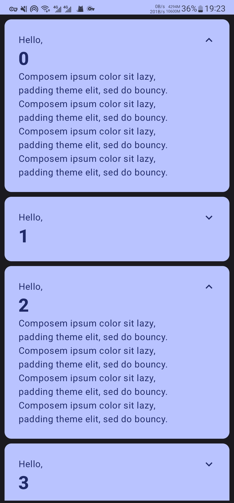

# 基础

## MainActivity.kt

```kotlin
package cool.cmg.basicscodelab

import android.content.res.Configuration.UI_MODE_NIGHT_YES
import android.os.Bundle
import androidx.activity.ComponentActivity
import androidx.activity.compose.setContent
import androidx.compose.animation.animateContentSize
import androidx.compose.animation.core.Spring
import androidx.compose.animation.core.spring
import androidx.compose.foundation.layout.*
import androidx.compose.foundation.lazy.LazyColumn
import androidx.compose.foundation.lazy.items
import androidx.compose.material.icons.Icons
import androidx.compose.material.icons.filled.ExpandLess
import androidx.compose.material.icons.filled.ExpandMore
import androidx.compose.material3.*
import androidx.compose.runtime.*
import androidx.compose.runtime.saveable.rememberSaveable
import androidx.compose.ui.Alignment
import androidx.compose.ui.Modifier
import androidx.compose.ui.text.font.FontWeight
import androidx.compose.ui.tooling.preview.Preview
import androidx.compose.ui.unit.dp
import cool.cmg.basicscodelab.ui.theme.BasicsCodelabTheme

class MainActivity : ComponentActivity() {
    override fun onCreate(savedInstanceState: Bundle?) {
        super.onCreate(savedInstanceState)
        setContent {
            BasicsCodelabTheme {
                // A surface container using the 'background' color from the theme
                Surface(
                    modifier = Modifier.fillMaxSize(),
                    color = MaterialTheme.colorScheme.background
                ) {
                    MyApp()
                }
            }
        }
    }
}

@Composable
fun MyApp() {
    // rememberSaveable 保存每个在配置更改（如旋转，更改为深色模式，更改Material You 颜色）和进程终止后保留下来的状态。
    // shouldShowOnboarding 为布尔值，是否显示开屏欢迎
    var shouldShowOnboarding by rememberSaveable { mutableStateOf(true) }

    if (shouldShowOnboarding) {
        // 开屏欢迎
        OnboardingScreen(onContinueClicked = { shouldShowOnboarding = false })
    } else {
        // 列表
        Greetings()
    }
}

// 列表
@Composable
private fun Greetings(names: List<String> = List(1000) { "$it" }) {
    /*
     LazyColumn类似RecyclerView
     但 LazyColumn 不会像 RecyclerView 一样回收其子级。
     它会在您滚动它时发出新的可组合项，并保持高效运行，因为与实例化 Android Views 相比，发出可组合项的成本相对较低。
     */
    LazyColumn(modifier = Modifier.padding(vertical = 4.dp)) {
        // LazyColumn API 会在其作用域内提供一个 items 元素，并在该元素中编写各项内容的渲染逻辑：
        items(items = names) { name ->
            Greeting(name = name)
        }
    }
}

@Composable
private fun Greeting(name: String) {
    // Cards contain contain content and actions that relate information about a subject
    Card(
        colors = CardDefaults.cardColors(containerColor = MaterialTheme.colorScheme.primary),
        modifier = Modifier.padding(vertical = 4.dp, horizontal = 8.dp)
    ) {
        CardContent(name)
    }
}

@Composable
private fun CardContent(name: String) {
    var expanded by rememberSaveable { mutableStateOf(false) }

    Row(
        modifier = Modifier
            .padding(12.dp)
            // 弹簧动效
            .animateContentSize(
                animationSpec = spring(
                    dampingRatio = Spring.DampingRatioMediumBouncy,
                    stiffness = Spring.StiffnessLow
                )
            )
    ) {
        Column(
            modifier = Modifier
                // 把其余元素挤到最边上，自己占满剩余空间
                .weight(1f)
                .padding(12.dp)
        ) {
            Text(text = "Hello, ")
            Text(
                text = name,
                style = MaterialTheme.typography.headlineLarge.copy(
                    fontWeight = FontWeight.ExtraBold
                )
            )
            if (expanded) {
                Text(
                    text = ("Composem ipsum color sit lazy, " +
                            "padding theme elit, sed do bouncy. ").repeat(4),
                )
            }
        }

        IconButton(onClick = { expanded = !expanded }) {
            Icon(
                imageVector = if (expanded) Icons.Filled.ExpandLess else Icons.Filled.ExpandMore,
                contentDescription = if (expanded) "Show less" else "Show more"
            )
        }
    }
}

@Preview(
    showBackground = true,
    widthDp = 320,
    uiMode = UI_MODE_NIGHT_YES,
    name = "DefaultPreviewDark"
)
@Composable
private fun DefaultPreview() {
    BasicsCodelabTheme {
        MyApp()
    }
}

@Composable
fun OnboardingScreen(onContinueClicked: () -> Unit) {
    Surface {
        Column(
            modifier = Modifier.fillMaxSize(),
            verticalArrangement = Arrangement.Center,
            horizontalAlignment = Alignment.CenterHorizontally
        ) {
            Text("Welcome to the Basics Codelab!")
            Button(
                modifier = Modifier.padding(vertical = 24.dp),
                onClick = onContinueClicked
            ) {
                Text("Continue")
            }
        }
    }
}

@Preview(showBackground = true, widthDp = 320, heightDp = 320)
@Composable
fun OnboardingPreview() {
    BasicsCodelabTheme {
        OnboardingScreen(onContinueClicked = {})
    }
}
```

## ui/theme/Color.kt

```kotlin
package cool.cmg.basicscodelab.ui.theme

import androidx.compose.ui.graphics.Color

val Purple80 = Color(0xFFD0BCFF)
val PurpleGrey80 = Color(0xFFCCC2DC)
val Pink80 = Color(0xFFEFB8C8)

val Purple40 = Color(0xFF6650a4)
val PurpleGrey40 = Color(0xFF625b71)
val Pink40 = Color(0xFF7D5260)

val Navy = Color(0xFF073042)
val Blue = Color(0xFF4285F4)
val LightBlue = Color(0xFFD7EFFE)
val Chartreuse = Color(0xFFEFF7CF)
```

## ui/theme/Theme.kt

```kotlin
package cool.cmg.basicscodelab.ui.theme

import android.app.Activity
import androidx.compose.foundation.isSystemInDarkTheme
import androidx.compose.material3.*
import androidx.compose.runtime.Composable
import androidx.compose.runtime.SideEffect
import androidx.compose.ui.graphics.Color
import androidx.compose.ui.graphics.toArgb
import androidx.compose.ui.platform.LocalContext
import androidx.compose.ui.platform.LocalView
import androidx.core.view.WindowCompat

private val DarkColorScheme = darkColorScheme(
//    primary = Purple80,
//    secondary = PurpleGrey80,
//    tertiary = Pink80
    surface = Blue,
    onSurface = Navy,
    primary = Navy,
    onPrimary = Chartreuse
)

private val LightColorScheme = lightColorScheme(
//    primary = Purple40,
//    secondary = PurpleGrey40,
//    tertiary = Pink40
    surface = Blue,
    onSurface = Color.White,
    primary = LightBlue,
    onPrimary = Navy

    /* Other default colors to override
    background = Color(0xFFFFFBFE),
    surface = Color(0xFFFFFBFE),
    onPrimary = Color.White,
    onSecondary = Color.White,
    onTertiary = Color.White,
    onBackground = Color(0xFF1C1B1F),
    onSurface = Color(0xFF1C1B1F),
    */
)

@Composable
fun BasicsCodelabTheme(
    darkTheme: Boolean = isSystemInDarkTheme(),
    // Dynamic color is available on Android 12+
    dynamicColor: Boolean = true,
    content: @Composable () -> Unit
) {
    val colorScheme = when {
        dynamicColor -> {
            val context = LocalContext.current
            if (darkTheme) dynamicDarkColorScheme(context) else dynamicLightColorScheme(context)
        }
        darkTheme -> DarkColorScheme
        else -> LightColorScheme
    }
    val view = LocalView.current
    if (!view.isInEditMode) {
        SideEffect {
            val window = (view.context as Activity).window.apply {
                statusBarColor = colorScheme.primary.toArgb()
            }
//            ViewCompat.getWindowInsetsController(view)?.isAppearanceLightStatusBars = darkTheme
            WindowCompat.getInsetsController(window,view).isAppearanceLightStatusBars = darkTheme
        }
    }

    MaterialTheme(
        colorScheme = colorScheme,
        typography = Typography,
        content = content
    )
}
```

## ui/theme/Type.kt

```kotlin
package cool.cmg.basicscodelab.ui.theme

import androidx.compose.material3.Typography
import androidx.compose.ui.text.TextStyle
import androidx.compose.ui.text.font.FontFamily
import androidx.compose.ui.text.font.FontWeight
import androidx.compose.ui.unit.sp

// Set of Material typography styles to start with
val Typography = Typography(
    bodyLarge = TextStyle(
        fontFamily = FontFamily.Default,
        fontWeight = FontWeight.Normal,
        fontSize = 16.sp,
        lineHeight = 24.sp,
        letterSpacing = 0.5.sp
    )
    /* Other default text styles to override
    titleLarge = TextStyle(
        fontFamily = FontFamily.Default,
        fontWeight = FontWeight.Normal,
        fontSize = 22.sp,
        lineHeight = 28.sp,
        letterSpacing = 0.sp
    ),
    labelSmall = TextStyle(
        fontFamily = FontFamily.Default,
        fontWeight = FontWeight.Medium,
        fontSize = 11.sp,
        lineHeight = 16.sp,
        letterSpacing = 0.5.sp
    )
    */
)
```

## 预览


