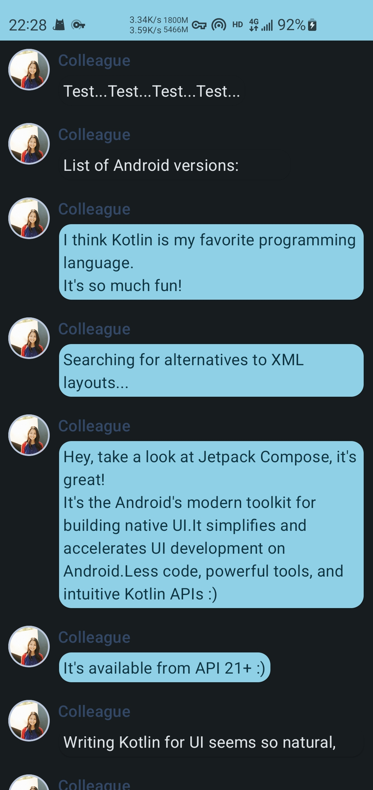

# 官网教程代码（Material You版）

[官网教程代码（Material You版）](https://developer.android.com/jetpack/compose/tutorial)

## MainActivity.kt

```kotlin
package cool.cmg.myheaven

import android.content.res.Configuration
import android.os.Bundle
import androidx.activity.ComponentActivity
import androidx.activity.compose.setContent
import androidx.compose.animation.animateColorAsState
import androidx.compose.animation.animateContentSize
import androidx.compose.foundation.Image
import androidx.compose.foundation.border
import androidx.compose.foundation.clickable
import androidx.compose.foundation.layout.*
import androidx.compose.foundation.lazy.LazyColumn
import androidx.compose.foundation.lazy.items
import androidx.compose.foundation.shape.CircleShape
import androidx.compose.material3.MaterialTheme
import androidx.compose.material3.Surface
import androidx.compose.material3.Text
import androidx.compose.runtime.*
import androidx.compose.ui.Modifier
import androidx.compose.ui.draw.clip
import androidx.compose.ui.res.painterResource
import androidx.compose.ui.tooling.preview.Preview
import androidx.compose.ui.unit.dp
import cool.cmg.myheaven.ui.theme.MyHeavenTheme

class MainActivity : ComponentActivity() {
    override fun onCreate(savedInstanceState: Bundle?) {
        super.onCreate(savedInstanceState)
        setContent {
            MyHeavenTheme {
                // A surface container using the 'background' color from the theme
                Surface(
                    modifier = Modifier.fillMaxSize(),
                    color = MaterialTheme.colorScheme.background
                ) {
                    Conversation(SampleData.conversationSample)
                }
            }
        }
    }
}

data class Message(val author: String, val body: String)

@Composable
fun MessageCard(msg: Message) {
    // Add padding around our message
    Row(modifier = Modifier.padding(all = 8.dp)) {
        Image(
            painter = painterResource(R.drawable.profile_picture),
            contentDescription = "Contact profile picture",
            modifier = Modifier
                // Set image size to 40 dp
                .size(40.dp)
                // Clip image to be shaped as a circle
                .clip(CircleShape)
                .border(1.5.dp, MaterialTheme.colorScheme.secondary, CircleShape)
        )

        // Add a horizontal space between the image and the column
        Spacer(modifier = Modifier.width(8.dp))

        // We keep track if the message is expanded or not in this
        // variable
        var isExpanded by remember { mutableStateOf(false) }

        // surfaceColor will be updated gradually from one color to the other
        val surfaceColor by animateColorAsState(
            if (isExpanded) MaterialTheme.colorScheme.primary else MaterialTheme.colorScheme.surface,
        )

        // We toggle the isExpanded variable when we click on this Column
        Column(modifier = Modifier.clickable { isExpanded = !isExpanded }) {
            Text(
                text = msg.author,
                color = MaterialTheme.colorScheme.secondaryContainer,
                style = MaterialTheme.typography.titleSmall
            )

            Spacer(modifier = Modifier.height(4.dp))

            Surface(
                shape = MaterialTheme.shapes.medium,
                shadowElevation = 1.dp,
                // surfaceColor color will be changing gradually from primary to surface
                color = surfaceColor,
                // animateContentSize will change the Surface size gradually
                modifier = Modifier
                    .animateContentSize()
                    .padding(1.dp)
            ) {
                Text(
                    text = msg.body,
                    modifier = Modifier.padding(all = 4.dp),
                    // If the message is expanded, we display all its content
                    // otherwise we only display the first line
                    maxLines = if (isExpanded) Int.MAX_VALUE else 1,
                    style = MaterialTheme.typography.bodyMedium
                )
            }
        }
    }
}

@Composable
fun Conversation(messages: List<Message>) {
    LazyColumn {
        items(messages) { message ->
            MessageCard(message)
        }
    }
}

@Preview(name = "Light Mode")
@Preview(
    uiMode = Configuration.UI_MODE_NIGHT_YES,
    showBackground = true,
    name = "Dark Mode"
)
@Composable
fun PreviewMessageCard() {
    MyHeavenTheme {
        MessageCard(
            msg = Message("Colleague", "Hey, take a look at Jetpack Compose, it's great!")
        )
    }
}

object SampleData {
    // Sample conversation data
    val conversationSample = listOf(
        Message(
            "Colleague",
            "Test...Test...Test...Test..."
        ),
        Message(
            "Colleague",
            "List of Android versions:\n" +
                    "Android KitKat (API 19)\n" +
                    "Android Lollipop (API 21)\n" +
                    "Android Marshmallow (API 23)\n" +
                    "Android Nougat (API 24)\n" +
                    "Android Oreo (API 26)\n" +
                    "Android Pie (API 28)\n" +
                    "Android 10 (API 29)\n" +
                    "Android 11 (API 30)\n" +
                    "Android 12 (API 31)\n"
        ),
        Message(
            "Colleague",
            "I think Kotlin is my favorite programming language.\n" +
                    "It's so much fun!"
        ),
        Message(
            "Colleague",
            "Searching for alternatives to XML layouts..."
        ),
        Message(
            "Colleague",
            "Hey, take a look at Jetpack Compose, it's great!\n" +
                    "It's the Android's modern toolkit for building native UI." +
                    "It simplifies and accelerates UI development on Android." +
                    "Less code, powerful tools, and intuitive Kotlin APIs :)"
        ),
        Message(
            "Colleague",
            "It's available from API 21+ :)"
        ),
        Message(
            "Colleague",
            "Writing Kotlin for UI seems so natural, Compose where have you been all my life?"
        ),
        Message(
            "Colleague",
            "Android Studio next version's name is Arctic Fox"
        ),
        Message(
            "Colleague",
            "Android Studio Arctic Fox tooling for Compose is top notch ^_^"
        ),
        Message(
            "Colleague",
            "I didn't know you can now run the emulator directly from Android Studio"
        ),
        Message(
            "Colleague",
            "Compose Previews are great to check quickly how a composable layout looks like"
        ),
        Message(
            "Colleague",
            "Previews are also interactive after enabling the experimental setting"
        ),
        Message(
            "Colleague",
            "Have you tried writing build.gradle with KTS?"
        ),
    )
}
```

## ui/Color.kt

```kotlin
package cool.cmg.myheaven.ui.theme

import androidx.compose.ui.graphics.Color

val Purple80 = Color(0xFFD0BCFF)
val PurpleGrey80 = Color(0xFFCCC2DC)
val Pink80 = Color(0xFFEFB8C8)

val Purple40 = Color(0xFF6650a4)
val PurpleGrey40 = Color(0xFF625b71)
val Pink40 = Color(0xFF7D5260)
```

## ui/Theme.kt

```kotlin
package cool.cmg.myheaven.ui.theme

import android.app.Activity
import android.os.Build
import androidx.compose.foundation.isSystemInDarkTheme
import androidx.compose.material3.MaterialTheme
import androidx.compose.material3.darkColorScheme
import androidx.compose.material3.dynamicDarkColorScheme
import androidx.compose.material3.dynamicLightColorScheme
import androidx.compose.material3.lightColorScheme
import androidx.compose.runtime.Composable
import androidx.compose.runtime.SideEffect
import androidx.compose.ui.graphics.toArgb
import androidx.compose.ui.platform.LocalContext
import androidx.compose.ui.platform.LocalView
import androidx.core.view.ViewCompat

private val DarkColorScheme = darkColorScheme(
    primary = Purple80,
    secondary = PurpleGrey80,
    tertiary = Pink80
)

private val LightColorScheme = lightColorScheme(
    primary = Purple40,
    secondary = PurpleGrey40,
    tertiary = Pink40

    /* Other default colors to override
    background = Color(0xFFFFFBFE),
    surface = Color(0xFFFFFBFE),
    onPrimary = Color.White,
    onSecondary = Color.White,
    onTertiary = Color.White,
    onBackground = Color(0xFF1C1B1F),
    onSurface = Color(0xFF1C1B1F),
    */
)

@Composable
fun MyHeavenTheme(
    darkTheme: Boolean = isSystemInDarkTheme(),
    // Dynamic color is available on Android 12+
    dynamicColor: Boolean = true,
    content: @Composable () -> Unit
) {
    val colorScheme = when {
        dynamicColor && Build.VERSION.SDK_INT >= Build.VERSION_CODES.S -> {
            val context = LocalContext.current
            if (darkTheme) dynamicDarkColorScheme(context) else dynamicLightColorScheme(context)
        }
        darkTheme -> DarkColorScheme
        else -> LightColorScheme
    }
    val view = LocalView.current
    if (!view.isInEditMode) {
        SideEffect {
            (view.context as Activity).window.statusBarColor = colorScheme.primary.toArgb()
            ViewCompat.getWindowInsetsController(view)?.isAppearanceLightStatusBars = darkTheme
        }
    }

    MaterialTheme(
        colorScheme = colorScheme,
        typography = Typography,
        content = content
    )
}
```

## ui/Type.kt

```kotlin
package cool.cmg.myheaven.ui.theme

import androidx.compose.material3.Typography
import androidx.compose.ui.text.TextStyle
import androidx.compose.ui.text.font.FontFamily
import androidx.compose.ui.text.font.FontWeight
import androidx.compose.ui.unit.sp

// Set of Material typography styles to start with
val Typography = Typography(
    bodyLarge = TextStyle(
        fontFamily = FontFamily.Default,
        fontWeight = FontWeight.Normal,
        fontSize = 16.sp,
        lineHeight = 24.sp,
        letterSpacing = 0.5.sp
    )
    /* Other default text styles to override
    titleLarge = TextStyle(
        fontFamily = FontFamily.Default,
        fontWeight = FontWeight.Normal,
        fontSize = 22.sp,
        lineHeight = 28.sp,
        letterSpacing = 0.sp
    ),
    labelSmall = TextStyle(
        fontFamily = FontFamily.Default,
        fontWeight = FontWeight.Medium,
        fontSize = 11.sp,
        lineHeight = 16.sp,
        letterSpacing = 0.5.sp
    )
    */
)
```

## 效果


