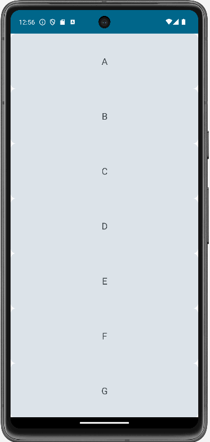
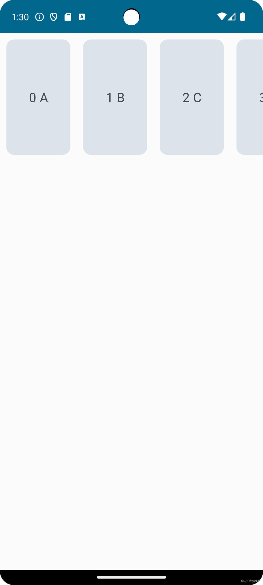
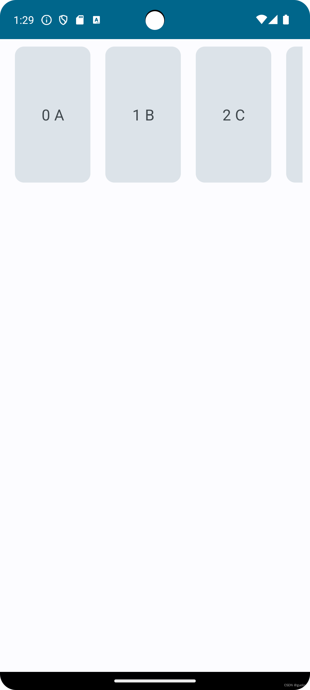
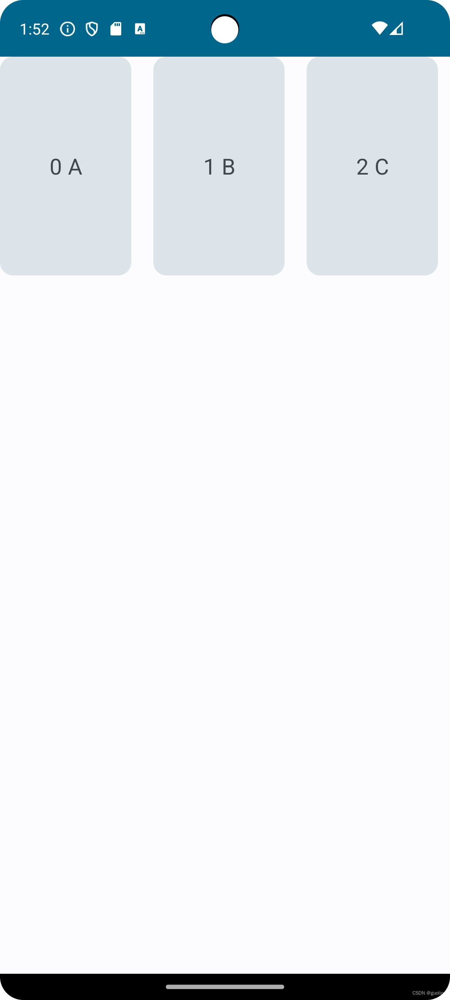

# 04. Lazy Layout

> 本文同步发表于我的[微信公众号](https://so.csdn.net/so/search?q=%E5%BE%AE%E4%BF%A1%E5%85%AC%E4%BC%97%E5%8F%B7&spm=1001.2101.3001.7020)，扫一扫文章底部的二维码或在微信搜索 郭霖 即可关注，每个工作日都有文章更新。

大家好，写给初学者的Jetpack Compose教程又来了。

经过前面4篇文章的学习，相信大家都已经成功入门了Compose编程。不仅了解了Compose的核心编程理念（声明式UI），而且已经可以使用Compose编写一些简单的小程序了。

今天我们要学习的是Compose中必学的一个控件，Lazy Layout。

这是一个什么样的控件呢？只要和View进行一下类比，大家立刻就能知道它是用来做什么的了。

Lazy Layout大概就相当于View系统中的ListView和RecyclerView。

这样类比一下相信大家一下子就懂了。同时，也应该意识到这是多么重要的一个控件了吧。

## 用法对比

在开始学习Lazy Layout之前，我想先来对比一下Lazy Layout和RecyclerView的用法区别。你会发现Lazy Layout在用法方面相比于RecyclerView简直就是降维打击。

比如我们想要实现下图中的滚动列表效果：


如果是使用RecyclerView要怎么实现呢？

首先需要在Activity的布局文件中引入RecyclerView控件。修改activity\_main.xml，如下所示：

```xml
<LinearLayout xmlns:android="http://schemas.android.com/apk/res/android"
    android:layout_width="match_parent"
    android:layout_height="match_parent">

    <androidx.recyclerview.widget.RecyclerView
        android:id="@+id/recyclerView"
        android:layout_width="match_parent"
        android:layout_height="match_parent" />
    
</LinearLayout>
```

接下来要为RecyclerView定义一个子项的布局文件recycler\_view\_item.xml：

```xml
<LinearLayout xmlns:android="http://schemas.android.com/apk/res/android"
    android:layout_width="match_parent"
    android:layout_height="60dp">

    <TextView
        android:id="@+id/itemName"
        android:layout_width="wrap_content"
        android:layout_height="wrap_content" />

</LinearLayout>
```

然后还要为RecyclerView定义一个适配器MyAdapter:

```kotlin
class MyAdapter(private val itemList: List<String>) :
    RecyclerView.Adapter<MyAdapter.ViewHolder>() {
    inner class ViewHolder(view: View) : RecyclerView.ViewHolder(view) {
        val fruitName: TextView = view.findViewById(R.id.itemName)
    }

    override fun onCreateViewHolder(parent: ViewGroup, viewType: Int): ViewHolder {
        val view = LayoutInflater.from(parent.context)
            .inflate(R.layout.recycler_view_item, parent, false)
        return ViewHolder(view)
    }

    override fun onBindViewHolder(holder: ViewHolder, position: Int) {
        val itemName = itemList[position]
        holder.fruitName.text = itemName
    }

    override fun getItemCount() = itemList.size
}
```

最后在Activity中指定RecyclerView的布局类型，并为其填充数据：

```kotlin
class MainActivity : AppCompatActivity() {
    private val itemList = ArrayList<String>()

    override fun onCreate(savedInstanceState: Bundle?) {
        super.onCreate(savedInstanceState)
        setContentView(R.layout.activity_main)
        initItems()
        val recyclerView = findViewById<RecyclerView>(R.id.recyclerView)
        val layoutManager = LinearLayoutManager(this)
        recyclerView.layoutManager = layoutManager
        val adapter = MyAdapter(itemList)
        recyclerView.adapter = adapter
    }

    private fun initItems() {
        repeat(20) { i ->
            itemList.add("Item $i")
        }
    }
}
```

也就是说，使用RecyclerView来实现上图中的滚动列表效果，最少也得编写这么多代码才行。

这算复杂吗？可能也还好，因为我们一直以来都是这么写的，很多Android开发者都已经习惯了。

但是如果我告诉你，在Compose中只需要编写这些代码就能实现完全相同的效果，你还能坐得住吗？

```kotlin
@Composable
fun ScrollableList() {
    LazyColumn {
        items(20) { i ->
            Text(
                text = "Item $i",
                modifier = Modifier
                    .fillMaxWidth()
                    .height(60.dp)
            )
        }
    }
}
```

是的，这两种写法对比所带来的冲击过于巨大，以至于连RecyclerView的作者Yigit Boyar都在Twitter上发出感慨，为自己设计的用法感到羞愧。


当然，Yigit大佬这波更多是在商业互吹，为Compose作势，毕竟基于两种完全不同的UI架构设计出来的控件是不好直接对比的。但由此我们也可以看出，Compose为我们编写UI界面提供了太多便捷和可能性。

## LazyColumn和LazyRow

Lazy Layout只是一个可复用列表的统称，事实上并没有这样的一个控件。

我们需要根据不同的场景需求，采用与其所相对应的Compose控件。

比如上述例子中使用的LazyColumn，它就是用于在垂直方向上滚动的可复用列表。而LazyRow则是用于在水平方向上滚动的可复用列表。

除此之外，LazyGrid下还有一批不同种类的可复用列表，不过这些不在今天文章的讨论范围，今天我们主要聚焦在LazyColumn和LazyRow这两个比较简单的可复用列表上面。

那么先来看一下这两者的基本用法吧，一个是纵向滚动列表，一个是横向滚动列表。

LazyColumn的用法示例：

```kotlin
@Composable
fun ScrollableList() {
    val list = ('A'..'Z').map { it.toString() }
    LazyColumn {
        items(list) { letter ->
            Card(
                modifier = Modifier
                    .fillMaxWidth()
                    .height(120.dp)
            ) {
                Text(
                    text = letter,
                    textAlign = TextAlign.Center,
                    fontSize = 20.sp,
                    modifier = Modifier
                        .fillMaxSize()
                        .wrapContentHeight(Alignment.CenterVertically)
                )
            }
        }
    }
}
```

这里我们创建了一个纵向滚动的字母表，效果如下图所示：



LazyRow的用法示例：

```kotlin
@Composable
fun ScrollableList() {
    val list = ('A'..'Z').map { it.toString() }
    LazyRow {
        items(list) { letter ->
            Card(
                modifier = Modifier
                    .width(120.dp)
                    .height(200.dp)
            ) {
                Text(
                    text = letter,
                    textAlign = TextAlign.Center,
                    fontSize = 20.sp,
                    modifier = Modifier
                        .fillMaxSize()
                        .wrapContentHeight(Alignment.CenterVertically)
                )
            }
        }
    }
}
```

这里我们又创建了一个横向滚动的字母表，效果如下图所示：


所以，Lazy Layout用法的核心，基本就是在LazyColumn或LazyRow的闭包中添加一个items函数，并且将我们的列表数据源传递给这个函数即可。

之后在items函数闭包内编写列表子项的样式，这些用我们前几期介绍的Compose知识就可以完成了，相信不用做更多解释。

Lazy Layout的核心用法就这么些，是不是非常简单？

## 带下标的Lazy Layout

我们刚才看到的效果是能够通过Lazy Layout显示出列表每行的内容，但是有的时候我们可能还需要知道每行所对应的下标。就好像使用RecyclerView时常常会用到onBindViewHolder()所携带的position参数一样。

那么如何才能知道每行所对应的下标是什么呢？也非常简单，只需要将刚才的items函数替换成itemsIndexed函数就可以了，代码如下所示：

```kotlin
@Composable
fun ScrollableList() {
    val list = ('A'..'Z').map { it.toString() }
    LazyRow {
        itemsIndexed(list) { index, letter ->
            Card(
                modifier = Modifier
                    .width(120.dp)
                    .height(200.dp)
            ) {
                Text(
                    text = "$index $letter",
                    textAlign = TextAlign.Center,
                    fontSize = 20.sp,
                    modifier = Modifier
                        .fillMaxSize()
                        .wrapContentHeight(Alignment.CenterVertically)
                )
            }
        }
    }
}
```

使用itemsIndexed函数之后，我们将会在函数闭包的参数列表上同时得到下标和字母表内容，接下来将它们同时显示到Text控件上即可，效果如下图所示：


## 边距设置

相信你也看出来了，目前的Lazy Layout并不美观，主要是因为每个子项之间没有很好的边距，互相都糅杂在了一起，这也是Lazy Layout默认的效果。

接下来我们就学习一下如何通过合理设置边距，来让Lazy Layout变得更加美观。

首先我们可以在Card控件上通过Modifier.padding()设置一些边距，让每个子项之间都留有一些空隙：

```kotlin
@Composable
fun ScrollableList() {
    val list = ('A'..'Z').map { it.toString() }
    LazyRow {
        itemsIndexed(list) { index, letter ->
            Card(
                modifier = Modifier
                    .width(120.dp)
                    .height(200.dp)
                    .padding(10.dp)
            ) {
                ...
            }
        }
    }
}
```

重新运行一下程序，效果如下图所示：



怎么样，这样看上去就美观多了吧？

但如果你非常追求细节，你会发现第一个子项它的左右两侧边距是不一样的。这也难怪，毕竟左侧的边距我们设置的是10dp，而右侧的边距虽然也是10dp，但是它会再叠加第二个子项左侧的边距，于是就变成了20dp。

最后一个子项也会面临同样的问题。

那么如何解决这个问题呢？有一个非常简单的办法，就是我们给Lazy Layout整体的左右两边都再设置一个10dp的边距不就行了吗，代码如下：

```kotlin
@Composable
fun ScrollableList() {
    val list = ('A'..'Z').map { it.toString() }
    LazyRow(modifier = Modifier.padding(start = 10.dp, end = 10.dp)) {
        ...
    }
}
```

重新运行程序之后效果如下图所示：



这样第一个子项和最后一个子项，它们左右两侧的边距就能保持一致了。

然而这个解决方案并不完美，因为如果你尝试滚动一下列表的话，你会发现由于给Lazy Layout设置了边距，左右两侧内容会出现切割现象：


为了解决这个问题，我们可以使用专门为Lazy Layout打造的边距设置属性contentPadding，代码如下：

```kotlin
@Composable
fun ScrollableList() {
    val list = ('A'..'Z').map { it.toString() }
    LazyRow(contentPadding = PaddingValues(start = 10.dp, end = 10.dp)) {
        ...
    }
}
```

使用了contentPadding，就能保证给Lazy Layout整体的左右两边设置边距的同时，还不会在滚动中出现上图的切割现象了。


最后，我们也可以不用借助Modifier.padding()来设置边距，Lazy Layout提供了专门给子项之间设置边距的属性，使用Arrangement.spacedBy()即可，代码示例如下：

```kotlin
@Composable
fun ScrollableList() {
    val list = ('A'..'Z').map { it.toString() }
    LazyRow(horizontalArrangement = Arrangement.spacedBy(20.dp)) {
        ...
    }
}
```

这段代码得出的效果就是，每个子项之间都会有20dp的间隔，运行效果如下图所示：



当然你会发现，使用Arrangement.spacedBy()之后，第一个子项的左侧和最后一个子项的右侧是不会有边距的。

这个并不难解决，因为你可以继续叠加我们刚才学到的contentPadding属性，给Lazy Layout整体设置边距，从而完成你想要的效果。

## rememberLazyListState

我们在使用RecyclerView编写滚动列表的时候，除了实现最基础的滚动功能之外，通常还会让程序随着列表的滚动进行一些额外事件的响应。如随着滚动隐藏和显示某些控件。

而如果想要在Lazy Layout中实现类似效果的话，则需要借助rememberLazyListState函数，我们接下来就瞧一瞧具体如何实现。

```kotlin
val state = rememberLazyListState()
state.firstVisibleItemIndex
state.firstVisibleItemScrollOffset
```

调用rememberLazyListState函数，将能够得到一个LazyListState对象。

我们可以通过访问它的firstVisibleItemIndex属性来得知当前第一个可见子项元素的下标。

还可以访问firstVisibleItemScrollOffset属性来得到当前第一个可见子项元素的偏移距离。

有了这些属性，就可以编写许多更加复杂的效果了。

比如说根据Material Design的设计，许多应用程序主界面的右下角会放置一个Fab按钮。


这个Fab按钮可以提供一些常用的便捷操作，但同时也会遮盖一部分界面，如果一直显示的话对于用户来说并不友好。

因此最好的设计方案就是，当用户向下滚动列表时，我们就认为用户不再需要和Fab按钮交互，此时将按钮进行隐藏。

下面具体看一下如何在Compose中实现这种效果。

```kotlin
@Composable
fun MainLayout() {
    val state = rememberLazyListState()
    Box {
        ScrollableList(state)
        val shouldShowAddButton = state.firstVisibleItemIndex  == 0
        AddButton(shouldShowAddButton)
    }
}

@Composable
fun ScrollableList(state: LazyListState) {
    val list = ('A'..'Z').map { it.toString() }
    LazyColumn(state = state) {
        items(list) { letter ->
            Card(
                modifier = Modifier
                    .fillMaxWidth()
                    .height(120.dp)
                    .padding(10.dp)
            ) {
                Text(
                    text = letter,
                    textAlign = TextAlign.Center,
                    fontSize = 20.sp,
                    modifier = Modifier
                        .fillMaxSize()
                        .wrapContentHeight(Alignment.CenterVertically)
                )
            }
        }
    }
}

@Composable
fun BoxScope.AddButton(isVisible: Boolean) {
    if (isVisible) {
        FloatingActionButton(
            onClick = { /*TODO*/},
            shape = CircleShape,
            modifier = Modifier
                .align(Alignment.BottomEnd)
                .padding(20.dp)
        ) {
            Icon(Icons.Filled.Add, "Add Button")
        }
    }
}
```

代码并不算很长，我直接就全贴出来了。

其中AddButton()函数就是用于定义Fab按钮的，我们将它放置在了屏幕的右下角，并且它的显示状态是受到isVisible这个参数控制的。

而ScrollableList()函数还是用于定义滚动列表，只不过这次我们在LazyColumn的参数中指定了一个LazyListState对象，这样就可以调用刚才所学的firstVisibleItemIndex等属性了。

最后在MainLayout()函数中将以上两个函数都包含进去，并加了一个布尔变量，只有firstVisibleItemIndex为0，也就是列表中第一个子项元素可见的时候，Fab按钮才显示。

现在可以运行一下程序看看效果了：


正如我们所期待的那样，当A元素在屏幕上可见的时候，Fab按钮也是可见的。当A元素滑出了屏幕，Fab按钮也会随之消失。

但其实我在上述代码中挖了一个大坑，它是有非常严重的性能问题的。只不过这个问题与我们今天要学的Lazy Layout无关，我不想偏离主题太远再去讲其他的知识点，我会在下篇文章中讲解如何解决这个性能问题。

## 嵌套滚动

嵌套滚动一直是我最不喜欢做的事情，但是架不住就是有很多朋友会问。

RecyclerView是支持嵌套滚动的，但我认为绝大部分的情况下大家应该都用不到它。每当你认为自己需要用到嵌套滚动时，我觉得都应该先暂停一下，想想是不是有其他的替代方案，如ConcatAdapter等。

而到了Compose当中，这下好了，Lazy Layout压根就不支持嵌套滚动，这下直接就把大家的念象给断了。

那么我为什么还要写这个主题呢？因为Compose中还允许一些场景和逻辑都比较合理的嵌套滚动，我们主要来看这部分的用法。

首先第一种合理的嵌套滚动，就是内层和外层的列表滚动方向并不一致，这样它们之间是没有滑动事件冲突的，因此合情合理。示例代码如下：

```kotlin
@Composable
fun VerticalScrollable() {
    Column(modifier = Modifier.verticalScroll(rememberScrollState())) {
        HorizontalScrollable()
        for (i in 1..10) {
            Card(
                modifier = Modifier
                    .fillMaxWidth()
                    .height(120.dp)
                    .padding(10.dp)
            ) {
                Text(
                    text = "Item $i",
                    textAlign = TextAlign.Center,
                    fontSize = 20.sp,
                    modifier = Modifier
                        .fillMaxSize()
                        .wrapContentHeight(Alignment.CenterVertically)
                )
            }
        }
    }
}

@Composable
fun HorizontalScrollable() {
    val list = ('A'..'Z').map { it.toString() }
    LazyRow(horizontalArrangement = Arrangement.spacedBy(20.dp)) {
        items(list) { letter ->
            Card(
                modifier = Modifier
                    .width(120.dp)
                    .height(200.dp)
            ) {
                Text(
                    text = letter,
                    textAlign = TextAlign.Center,
                    fontSize = 20.sp,
                    modifier = Modifier
                        .fillMaxSize()
                        .wrapContentHeight(Alignment.CenterVertically)
                )
            }
        }
    }
}
```

这里我们定义了两个不同方向的滚动列表函数，VerticalScrollable()和HorizontalScrollable()。

其中，VerticalScrollable()函数是垂直方向的滚动列表，它在第一行的位置又嵌套了HorizontalScrollable()函数。

由于嵌套的滚动列表方向并不一致，因此这种情况是完全合法的，运行效果如下：


再来看第二种合理的嵌套滚动，即使内层和外层的列表滚动方向一致，只要内层列表在滚动方向上的尺寸是固定的，那么Compose对此仍然是支持的。

也就是说，如果是纵向嵌套滚动，那么内层列表的高度必须是固定的。如果是横向嵌套滚动，那么内层列表的宽度必须是固定的。示例代码如下：

```kotlin
@Composable
fun VerticalScrollable() {
    Column(modifier = Modifier.verticalScroll(rememberScrollState())) {
        SubVerticalScrollable()
        for (i in 1..10) {
            Card(
                modifier = Modifier
                    .fillMaxWidth()
                    .height(120.dp)
                    .padding(10.dp)
            ) {
                Text(
                    text = "Item $i",
                    textAlign = TextAlign.Center,
                    fontSize = 20.sp,
                    modifier = Modifier
                        .fillMaxSize()
                        .wrapContentHeight(Alignment.CenterVertically)
                )
            }
        }
    }
}

@Composable
fun SubVerticalScrollable() {
    val list = ('A'..'Z').map { it.toString() }
    LazyColumn(modifier = Modifier.height(300.dp)) {
        items(list) { letter ->
            Card(
                modifier = Modifier
                    .fillMaxWidth()
                    .height(80.dp)
                    .padding(10.dp)
            ) {
                Text(
                    text = letter,
                    textAlign = TextAlign.Center,
                    fontSize = 20.sp,
                    modifier = Modifier
                        .fillMaxSize()
                        .wrapContentHeight(Alignment.CenterVertically)
                )
            }
        }
    }
}
```

这里我们定义了两个相同方向的滚动列表函数，VerticalScrollable()和SubVerticalScrollable()。

其中，VerticalScrollable()函数是垂直方向的滚动列表，它在第一行的位置又嵌套了SubVerticalScrollable()函数。

由于SubVerticalScrollable()中的滚动列表高度是固定的，我们设置成了300dp，因此这种情况也是合法的，运行效果如下：


除了这两种情况以外的嵌套滚动都是不合法的，Compose也不会惯着我们，用错了直接就会崩溃，不信你可以试一试。

## 拼接不同类型子项

刚才有提到，RecyclerView中一些不合理的嵌套滚动需求其实可以考虑使用ConcatAdapter来解决。

ConcatAdapter是用于将不同类型的子项元素拼接到一起，让它们形成一个整体可滚动的列表。由于这是Compose专场，我不会对ConcatAdapter的用法做更详细的讲解，还不了解的朋友可以参考[这篇文章](https://blog.csdn.net/guolin_blog/article/details/105606409)。

那么Lazy Layout中是否也可以实现与ConcatAdapter类似的效果呢？答案是肯定的，而且更加简单。

目前我们已经知道，可以在Lazy Layout中添加一个items函数来指定要滚动的数据源列表。你当然也可以添加多个items函数来指定不同类型的数据源列表，这样就可以将不同类型的子项元素拼接到一起了。

除此之外，还可以在Lazy Layout中添加item函数来指定单个数据项，最终它们都会形成一个整体可滚动的列表。

下面我们来看一段代码示例：

```kotlin
@Composable
fun ImageHeader() {
    Image(
        painterResource(id = R.drawable.header),
        contentDescription = "Header Image",
        modifier = Modifier
            .fillMaxWidth()
            .wrapContentHeight()
    )
}

@Composable
fun ImageFooter() {
    Image(
        painterResource(id = R.drawable.footer),
        contentDescription = "Header Image",
        modifier = Modifier
            .fillMaxWidth()
            .wrapContentHeight()
    )
}

@Composable
fun ScrollableList(state: LazyListState) {
    val list = (1..10).map { it.toString() }
    LazyColumn(state = state) {
        item {
            ImageHeader()
        }
        items(list) { letter ->
            Card(
                modifier = Modifier
                    .fillMaxWidth()
                    .height(120.dp)
                    .padding(10.dp)
            ) {
                Text(
                    text = letter,
                    textAlign = TextAlign.Center,
                    fontSize = 20.sp,
                    modifier = Modifier
                        .fillMaxSize()
                        .wrapContentHeight(Alignment.CenterVertically)
                )
            }
        }
        item {
            ImageFooter()
        }
    }
}
```

这里定义了ImageHeader()和ImageFooter()这两个Composable函数，里面你可以随意放置任意类型的控件。简单起见，我们就放了两张图片。

接下来在LazyColumn当中，我们使用item函数将ImageHeader()和ImageFooter()分别引入到了头部和尾部，而主间则是使用items函数添加的列表型数据。

通过这样一种写法，就可以将这三种不同类型内容合并成一个整体可滚动的列表，等同于ConcatAdapter所能完成的功能，并且代码还要更加的简单。

运行一下程序，效果如下图所示：


## 提升Lazy Layout性能

目前我们已经将Lazy Layout相关的主要用法都学习的差不多了，最后来关注一下性能方面的问题。

有些朋友可能很早之前体验Compose的时候用过Lazy Layout，很快被那稀烂的性能给劝退了。

是的，早期Lazy Layout的性能很差，滚动的时候巨卡无比，确实很难让人用得下去。

但是在Compose 1.5版本中，Google做了大量的性能优化工作，所以如果你现在再来尝试一次，你会发现性能已经不是什么问题了。

当然可能有些朋友会说，我用的就是Compose 1.5版本，Lazy Layout滚动的时候还是会感觉卡卡的。这是因为debug包会包含许多冗余的代码，这些代码也会影响程序的运行效率，你只要再打一个release包就会发现滚动丝般顺滑了。

既然如此，我们上述的Lazy Layout代码就没有任何性能问题了吗？其实不然。

上述所演示的代码有一个共性，都是固定数据列表，即我们没有对数据列表进行过增加或删除。而一旦执行了这些操作，我们就可能会遇到比较严重的性能问题。

为了能够清晰地解释这个问题，我来举一个数据结构上的例子。

数组相信大家都非常熟悉，如果我有一个长度为10的数组：

```kotlin
[1,2,3,4,5,6,7,8,9,10]
```

现在我想要往这个数组的头部再添加一个元素0，让数组变成：

```kotlin
[0,1,2,3,4,5,6,7,8,9,10]
```

大家认为这个操作的成本高不高，以及它的时间复杂度是多少？

它的时间复杂度一定是O(n)，因为为了向数组的头部添加一个元素，需要将原来的每一个元素都往后移动一位。数组越长，这个操作的成本就越高。

删除头部元素也是一样的道理，需要将原来的每一个元素都往前移动一位，因此时间复杂度也是O(n)。

为什么要讲这样一个例子呢？是因为Compose默认的重组规则也是如此。

在默认情况下，一个Composable函数是否要发生重组，除了使用我们上篇文章中学习的State之外，当Composable函数的位置发生了变动，也会触发重组行为。

也就是说，Lazy Layout如果一屏显示了10个元素，现在删除了第一个元素，剩余的9个元素因为位置都发生了变动，它们所对应的Composable函数全部会重组一遍，这就是非常大的性能开销。

相比于RecyclerView，基于Compose的Lazy Layout在这一点上确实非常劣势，因为RecyclerView就完全不会有重组的困扰，只需要offset一下子项的位置就可以了。

那么Lazy Layout要怎么解决这个问题呢？方案就是，我们需要找到一个能够标识子项唯一性的id值，用于替换之前基于位置变动去触发重组的机制。

至于这个id值是什么？在哪里？你要自己想办法。

比如说我们上述举的例子当中，由于每个数值都不相同，那么就可以直接拿这些数值来当id。

如果你使用的数据源是更复杂的对象类型，那么就需要想办法从这些对象中找到能够标识它唯一性的值来当id。

确定好了id之后，只需要对Lazy Layout中的代码进行如下修改即可：

```kotlin
@Composable
fun SubVerticalScrollable() {
    val list = ('A'..'Z').map { it.toString() }
    LazyColumn(modifier = Modifier.height(300.dp)) {
        items(list, key = { it }) { letter ->
            ...
        }
    }
}
```

这里给items函数新增了一个key参数，这个参数就是用于指定每个子项的唯一id的。由于我们所使用的数据A-Z本身每个值就是唯一的，因此这里直接指定it即可。

添加了key参数之后，Compose编译器就有了一个唯一标识符来精准定位到每个Composable函数，而不是像之前那样只能基于Composable函数的位置来定位了。

这样，不管是对Lazy Layout中的元素进行添加、删除、甚至是重新排序，都不会导致多余的重组发生，性能也就大大提升了。

好了，关于Lazy Layout的性能提升技巧就介绍到这儿。

不过这并没有解决我在rememberLazyListState部分提到的性能陷阱，因为这个性能陷阱更多是和State相关的内容，就不在这篇文章中展开了，我们下篇原创再进行讨论，敬请期待。

Compose是基于Kotlin语言的声明式UI框架，如果想要学习Kotlin和最新的Android知识，可以参考我写的书 **《第一行代码 Android 第3版》**，[点击此处查看详情](https://guolin.blog.csdn.net/article/details/105233078)。
