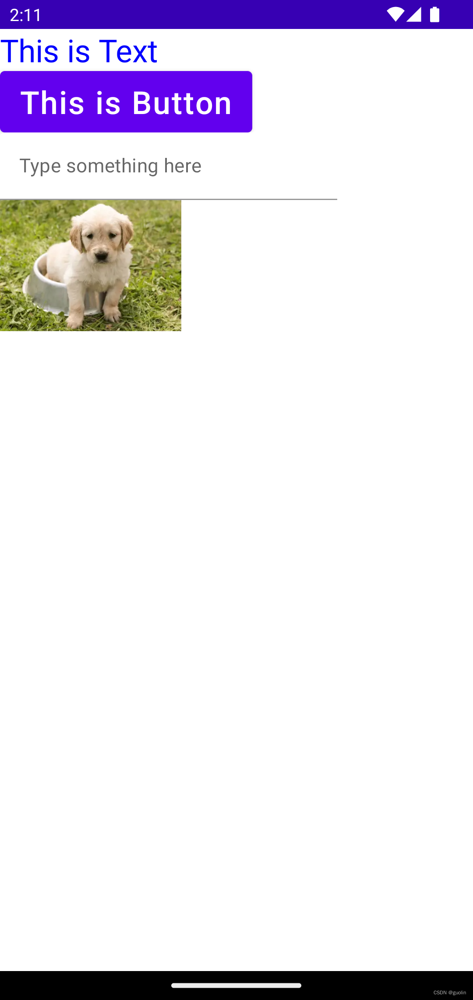

# 1. 基础控件和布局

> 本文同步发表于我的[微信公众号](https://so.csdn.net/so/search?q=%E5%BE%AE%E4%BF%A1%E5%85%AC%E4%BC%97%E5%8F%B7&spm=1001.2101.3001.7020)，扫一扫文章底部的二维码或在微信搜索 郭霖 即可关注，每个工作日都有文章更新。

大家好，写给初学者的Jetpack Compose教程又更新了。

准确来说，这才是本系列的第一篇文章。因为上篇文章只是个序篇，和大家聊一聊为什么我们要学习Compose。如果你现在仍然有这个疑惑，那么可以先移步上篇文章 [写给初学者的Jetpack Compose教程，为什么要学习Compose？](../0.%20为什么要学习Compose？/index.md)

Compose的知识体系很庞大，因此这个系列教程可能我会写很多篇。当然我并不是什么Compose高手，目前我也是个初学者。本教程实质上就是我在自我学习Compose的同时，将这些学习记录分享给大家，希望大家可以零基础跟着我一起学习。

Compose是一个用于替代Android View的全新声明式UI框架。既然是UI框架，因此我们第一篇文章就来讲一讲基础控件和布局方面的知识。

## 创建Compose工程

我的文章通常都是动手性比较强的，希望大家也能跟着我一起动起手来编写代码。

要使用Compose来编写UI界面，首先需要引入Compose相关的依赖库才行。不过Compose相关的依赖库比较繁多，还有可能经常会变动，毕竟还是一个很新的UI框架，因此这里我教大家一个最简单的方法来引入Compose依赖库。

打开Android Studio，创建一个名叫ComposeTest的新项目，然后选择Compose Empty Activity，如下图所示：


这样Android Studio就会为我们创建一个拥有Compose开发环境的项目，里面自然也就添加上了所有必要的依赖库，如下所示：

```groovy
dependencies {
    implementation 'androidx.core:core-ktx:1.7.0'
    implementation 'androidx.lifecycle:lifecycle-runtime-ktx:2.3.1'
    implementation 'androidx.activity:activity-compose:1.3.1'
    implementation "androidx.compose.ui:ui:$compose_ui_version"
    implementation "androidx.compose.ui:ui-tooling-preview:$compose_ui_version"
    implementation 'androidx.compose.material:material:1.2.0'
    testImplementation 'junit:junit:4.13.2'
    androidTestImplementation 'androidx.test.ext:junit:1.1.5'
    androidTestImplementation 'androidx.test.espresso:espresso-core:3.5.1'
    androidTestImplementation "androidx.compose.ui:ui-test-junit4:$compose_ui_version"
    debugImplementation "androidx.compose.ui:ui-tooling:$compose_ui_version"
    debugImplementation "androidx.compose.ui:ui-test-manifest:$compose_ui_version"
}
```

接下来看一下MainActivity中自动生成的内容：

```kotlin
class MainActivity : ComponentActivity() {
    override fun onCreate(savedInstanceState: Bundle?) {
        super.onCreate(savedInstanceState)
        setContent {
            ComposeTestTheme {
                // A surface container using the 'background' color from the theme
                Surface(
                    modifier = Modifier.fillMaxSize(),
                    color = MaterialTheme.colors.background
                ) {
                    Greeting("Android")
                }
            }
        }
    }
}

@Composable
fun Greeting(name: String) {
    Text(text = "Hello $name!")
}

@Preview(showBackground = true)
@Composable
fun DefaultPreview() {
    ComposeTestTheme {
        Greeting("Android")
    }
}
```

这里自动生成的代码涉及到了一些Compose的基础知识，我们得把这些基础知识了解清楚了，才能开始后续Compose的学习。

首先看一下onCreate函数中的代码，这里调用了一个setContent函数。注意这个名字是非常讲究的，因为每个Android开发者都会对另外一个函数的名字非常熟悉：setContentView。所以，过去我们使用View来编写界面的时候，都会调用setContentView函数来设置界面。而用了Compose之后，由于不再使用View了，所以就改用这个新的setContent函数来设置界面了。

setContent函数会提供一个Composable作用域，所以在它的闭包中我们就可以随意地调用Composable函数了。

那么什么又是Composable函数呢？简单来说，就是一个函数的上方，使用了@Composable进行声明，那么它就是一个Composable函数。

观察上述代码，你会发现Greeting函数就是一个Composable函数。

注意，Composable函数只能在Composable作用域中才能调用，所以如果你尝试在setContent函数的闭包外面调用Greeting函数，你会发现编译无法通过。

另外，所有的Composable函数还有一个约定俗成的习惯，就是函数的命名首字母需要大写。这一点和Java的函数命名习惯很不相同，因为Java函数命名通常都是使用首字母小写的驼峰模式。

但也正是因为如此，Composable函数名才特意要求首字母需要大写，这样我们就能够更加直观地通过函数名称来快速地判断一个函数是不是Composable函数，不然的话还需要找到这个函数的定义位置，看看它有没有@Composable注解才行。

那么根据这个规则，我们就可以得知，setContent函数中嵌套的ComposeTestTheme和Surface这两个函数都是Composable函数。

其中，ComposeTestTheme函数是Android Studio自动为我们创建的，主要用于对项目的主题进行设置和定制，我们可能会在后面的文章讨论这个话题。

Surface函数是Material库中提供的一个通用函数，它的主要作用是为了让应用程序可以更好地适配Material Design，例如控制阴影高度、控制内容颜色、裁剪形状等等。由于目前我们还是初学者，暂时没有必要对这个Surface函数了解太多，这里就不做过多解释了。

除此之外，你会发现Android Studio还为我们生成了一个DefaultPreview函数。它也是一个Composable函数，但是它比普通的Composable函数多了一个@Preview注解，这个注解表示这个函数是用来快速预览UI样式的。

也就是说，写在DefaultPreview函数中的UI，可以在不运行程序到手机上的情况下就实现快速预览。操作方法是，在Android Studio的主编辑界面点击右上角的Split选项，然后编译一下项目即可，如下图所示：


不过，我个人觉得这个快速预览功能并不算是非常好用，尤其是早期的时候还有很多的bug。所以如果你的项目不是很大，编译一次也花不了多长时间，那么我觉得直接运行到手机来查看效果可能是个更好的选择。

那么现在我们就来把项目运行到手机看一看吧：


这就是默认自动创建的代码所实现的效果，一个非常简单的Hello Android。

初始代码已经解释的比较清楚了，下面就让我们开始学习一些基础控件和布局方面的知识吧。

## 基础控件

相信你一定知道，View当中有数不清的控件可以供我们使用。Compose也是。

所以说，如果想要通过一篇文章就把Compose的控件知识全部掌握，那显然是不可能的事情。

因此，这里我们只会学习Compose中一些基础控件的常见用法，旨在帮助大家快速入门。入门之后，更多复杂的用法大家只需要通过搜索或者询问ChatGPT即可快速掌握。

### 1\. Text

Text毫无疑问一定是Compose当中最常用的一个控件，主要用于显示一段文本，对应的是View当中的TextView。

其实在刚才自动生成的Greeting函数里，就已经使用了Text控件，所以我们才能在界面上看到Hello Android的字样。

Text的用法非常简单，只需要给它指定一个text参数，里面传入要显示的内容即可。

修改MainActivity中的代码，如下所示：

```kotlin
class MainActivity : ComponentActivity() {
    override fun onCreate(savedInstanceState: Bundle?) {
        super.onCreate(savedInstanceState)
        setContent {
            ComposeTestTheme {
                // A surface container using the 'background' color from the theme
                Surface(
                    modifier = Modifier.fillMaxSize(),
                    color = MaterialTheme.colors.background
                ) {
                    SimpleWidgetColumn()
                }
            }
        }
    }
}

@Composable
fun SimpleWidgetColumn() {
    Column {
        Text(text = "This is Text")
    }
}
```

可以看到，这里我们定义了一个叫SimpleWidgetColumn的Composable函数，然后把之前在Surface函数中调用的Greeting函数替换成了这个，那么最终界面上显示的就会是我们在SimpleWidgetColumn函数中编写的内容了。

那么在SimpleWidgetColumn函数中，我们首先定义了一个Column。这个Column待会会进行详细的讲解，目前你只要知道它是用于纵向显示一列内容的，功能类型于View当中的LinearLayout。

接下来在Column当中，我们添加了一个Text，并通过text参数指定了它显示的内容是"This is Text"。

现在运行一下程序，结果如下图所示。


那么恭喜，我们Compose之旅的第一个控件，你已经掌握它的最基本用法了。

不过只能显示一段文字很明显功能太单调了。事实上，Text提供了非常丰富的API来允许我们对显示的内容进行定制。那么最常见的就是改变文字的颜色和大小，我们可以通过以下代码完成：

```kotlin
@Composable
fun SimpleWidgetColumn() {
    Column {
        Text(
            text = "This is Text",
            color = Color.Blue,
            fontSize = 26.sp
        )
    }
}
```

重新运行一下代码，结果如下图所示：


除此之外，Text还能实现很多其他的功能，通过观察它的参数列表便可略之一二：

```kotlin
fun Text(
    text: String,
    modifier: Modifier = Modifier,
    color: Color = Color.Unspecified,
    fontSize: TextUnit = TextUnit.Unspecified,
    fontStyle: FontStyle? = null,
    fontWeight: FontWeight? = null,
    fontFamily: FontFamily? = null,
    letterSpacing: TextUnit = TextUnit.Unspecified,
    textDecoration: TextDecoration? = null,
    textAlign: TextAlign? = null,
    lineHeight: TextUnit = TextUnit.Unspecified,
    overflow: TextOverflow = TextOverflow.Clip,
    softWrap: Boolean = true,
    maxLines: Int = Int.MAX_VALUE,
    onTextLayout: (TextLayoutResult) -> Unit = {},
    style: TextStyle = LocalTextStyle.current
) {
    ...
}
```

正如我刚才说的，这里我们只讲一些常见用法来帮助大家快速入门，更多丰富的用法就等待大家自己探索了。

### 2\. Button

Button应该是仅次于Text之后最常用的控件了。这个相信不需要我介绍大家也都知道是用来做什么的，因为它和View中的Button名字完全相同。

不同的是，在View当中，Button是TextView的子类，它们之间是继承的关系。因此，Button实际上是在TextView的基础之上做了功能扩展，使得控件可以点击了。

而在Compose当中，Button和Text之间并没有什么关系。它们是两个独立的控件，并且通常它们还需要配合在一起使用才行。

那么我们先来尝试添加一下Button吧，代码如下所示：

```kotlin
fun SimpleWidgetColumn() {
    Column {
        ...
        
        Button(onClick = { /*TODO*/ }) {
            
        }
    }
}
```

运行一下程序，你会看到如下图所示的结果：


按钮虽然已经显示出来了，但是上面没有任何的文字。

而如果你还按照View当中的思维，尝试去给Button设置一个text属性来指定文字内容，你会发现Compose中的Button根本就没有这个属性。

正如我刚才说的，Compose中的Button和Text之间并不是继承关系，因此它没有继承来自Text的各种能力。

那么我们如何才能给Button指定文字内容呢？我刚才也提到了，它可以和Text配合在一起使用。

修改SimpleWidgetColumn函数中的代码，如下所示：

```kotlin
@Composable
fun SimpleWidgetColumn() {
    Column {
        ...
        
        Button(onClick = { /*TODO*/ }) {
            Text(
                text = "This is Button",
                color = Color.White,
                fontSize = 26.sp
            )
        }
    }
}
```

这里我们将Text放到了Button的闭包当中，这样就可以为Button指定显示的内容了。当然这里并不一定非得使用Text，你也可以在这里编写其他控件。

现在重新运行一下程序，效果如下图所示：


另外我们注意到，Button的参数列表上还有一个onClick参数，这是一个必填参数，当按钮点击时，就会执行这个参数里指定的逻辑。

为了演示一下这个功能，我们就让点击按钮时弹出一个Toast提示吧。

修改SimpleWidgetColumn函数中的代码，如下所示：

```kotlin
@Composable
fun SimpleWidgetColumn() {
    Column {
        ...
        
        val context = LocalContext.current
        Button(onClick = {
            Toast.makeText(context, "This is Toast", Toast.LENGTH_SHORT).show()
        }) {
            Text(
                text = "This is Button",
                color = Color.White,
                fontSize = 26.sp
            )
        }
    }
}
```

注意，要想弹出Toast需要有Context参数才行。在Composable函数当中获取Context对象，可以调用LocalContext.current获得。

现在当点击一下Button，效果如下图所示：


### 3\. TextField

TextField对应的是View当中的EditText，也就是一个输入框，因此它也是一个非常常用的控件。

但是，TextField使用起来可不像EditText那么容易，它的用法设计充分贴合了声明式UI的思想，而目前我们对这一思想了解还很少，所以暂时你可能会觉得这个控件很难用。

首先我们尝试在界面上添加一个TextField吧，代码如下所示：

```kotlin
@Composable
fun SimpleWidgetColumn() {
    Column {
        ...

        TextField(value = "", onValueChange = {})
    }
}
```

TextField参数列表上有两个必填参数，其中value参数用于指定当前输入框中显示的文字内容，onValueChange参数用于监听输入框中的文字内容变化。

现在运行一下程序，效果如下图所示：


可以看到，输入框已经显示出来了。

到这里为止还算比较简单，可是当你尝试在输入框里输入内容时，你会发现不管你在键盘上敲了什么东西，输入框上都不会显示出来。

这是和EditText最大的不同点，因为EditText一定是可以显示你输入的内容的。

那么为什么TextField无法显示输入的内容呢？这需要回顾一下我们在上一篇文章中提到的声明式UI的编程思想，还没看过的朋友请参考 [写给初学者的Jetpack Compose教程，为什么要学习Compose？](../0.%20为什么要学习Compose？/index.md)

声明式UI的工作流程有点像是刷新网页一样。即我们去描述一个控件时要附带上它的状态。然后当有任何状态需要发生改变时，只需要像刷新网页一样，让界面上的元素刷新一遍，那么自然状态就能得到更新了。

而TextField中显示的内容就是一种状态，因为随着你的输入，界面上显示的内容也需要跟着更新才行。

那么这里，当在TextField中输入内容时，首先我们并没有去做刷新页面这个操作。其次，就算是做了刷新操作，TextField刷新后发现value参数指定的内容仍然是一个空字符串，因此我们输入的内容还是无法上屏。

现在问题的原因已经解释清楚了，那么要如何解决呢？这就得借助Compose的State组件了。不过这是另外一个知识点，我打算在之后的文章中讲解，本篇文章我不想过于发散，暂时我们还是把精力聚焦在基础控件和布局上，就先跳过这个问题吧。

TextField同样也提供了非常丰富的API来来允许我们对它进行定制。比如，EditText有一个hint属性，用于在输入框里显示一些提示性的文字，然后一旦用户输入了任何内容，这些提示性的文字就会消失。那么TextField如何实现类似的功能呢？代码如下所示：

```kotlin
@Composable
fun SimpleWidgetColumn() {
    Column {
        ...

        TextField(
            value = "",
            onValueChange = {},
            placeholder = {
                Text(text = "Type something here")
            }
        )
    }
}
```

这里通过placeholder参数来指定一个占位符，其实就是和hint差不多的功能，用户没有在输入框里输入任何内容时就显示placeholder中的内容，一旦用户输入了任何内容，placeholder就会消失。基本效果如下图所示：


另外你可能会觉得TextField默认的输入框背景色实在是太丑了，我们可以通过以下代码非常轻松地调整TextField的输入框背景色：

```kotlin
@Composable
fun SimpleWidgetColumn() {
    Column {
        ...

        TextField(
            value = "",
            onValueChange = {},
            placeholder = {
                Text(text = "Type something here")
            },
            colors = TextFieldDefaults.textFieldColors(
                backgroundColor = Color.White
            )
        )
    }
}
```

这个TextFieldDefaults可以支持调整任何你想要调整的颜色，可不仅仅是输入框背景色，具体的用法参考一下它的参数列表你就知道了。

现在重新运行一下程序，效果如下图所示：


### 4\. Image

Image对应的是View当中的ImageView，也就是用于展示图片的，那么毫无疑问，这绝对又是一个必须掌握的常用控件。

好消息是，Image的用法还挺简单的，所以我们应该很快就可以上手了。

大家都知道，Android中的图片通常有两种比较常见的形式，一种是drawable资源，另一种是bitmap对象。Image对这两种形式的图片都提供了支持。

首先来看一下drawable资源形式的图片要如何加载，代码如下所示：

```kotlin
@Composable
fun SimpleWidgetColumn() {
    Column {
        ...

        Image(
            painter = painterResource(id = R.drawable.dog),
            contentDescription = "A dog image"
        )
    }
}
```

Image参数列表上有两个必填参数，其中painter参数用于指定要展示的drawable资源，contentDescription参数用于指定对于这个资源的文字描述。

这个文字描述主要是在accessibility模式下，为有视觉障碍的群体提供发音辅助的。ImageView上也有类型的功能，但只是作为一项可选的属性提供。而到了Compose的Image上，则变成了一个强制性的参数。

当然，如果你就是不想要为图片指定contentDescription，也可以直接传null。

现在运行一下程序，效果如下图所示：



怎么样，是不是用法非常简单？

再来看一下bitmap形式的图片要如何加载：

```kotlin
@Composable
fun SimpleWidgetColumn() {
    Column {
        ...

        val bitmap: ImageBitmap = ImageBitmap.imageResource(id = R.drawable.dog)
        Image(
            bitmap = bitmap,
            contentDescription = "A dog image"
        )
    }
}
```

代码同样也非常简单，这里我们先借助ImageBitmap.imageResource函数将drawable资源转换成了一个ImageBitmap对象，然后再将它转给Image控件即可。

需要注意的是，Image接收的是Compose中专有的ImageBitmap对象，而不是传统的Bitmap对象。如果你这里要传入的是一个传统的Bitmap对象，那么还得再额外调用asImageBitmap函数转换一下，如下所示：

```kotlin
@Composable
fun SimpleWidgetColumn(bitmap: Bitmap) {
    Column {
        ...

        Image(
            bitmap = bitmap.asImageBitmap(),
            contentDescription = "A dog image"
        )
    }
}
```

到目前为止，我们展示的都是本地的图片资源。那么如果想要展示一张网络图片资源要怎么办呢？

很遗憾，Compose提供的Image是没有这个能力的，我们需要借助第三方依赖库才行。当然，ImageView也是没有这个能力的，所以我们以前也会使用Glide这样的第三方库。

目前Google比较推荐的第三方Compose图片加载库是Coil和Glide这两个。我知道大家看到Glide一定会感到非常亲切，可能更倾向于使用这个。但实际上Coil是一个基于协程开发的新兴图片加载库，用法更加贴合Kotlin也更加简单，因此我更推荐使用这个新库。

要使用Coil，首先需要将它引入到我们的项目当中：

```groovy
dependencies {
    implementation("io.coil-kt:coil-compose:2.4.0")
}
```

接下来使用Coil提供的AsyncImage控件即可轻松加载网络图片资源了，代码如下所示：

```kotlin
@Composable
fun SimpleWidgetColumn() {
    Column {
        ...

        AsyncImage(
            model = "https://img-blog.csdnimg.cn/20200401094829557.jpg",
            contentDescription = "First line of code"
        )
    }
}
```

重新运行一下程序看看效果吧，不过在那之前，别忘了在AndroidManifest.xml文件中声明网络权限。


### 5\. ProgressIndicator

ProgressIndicator对应的是View当中的ProgressBar，也就是用于展示进度条的，这也算是核心基础控件之一了。

我们都知道，View当中的ProgressBar有两种比较常见的形态，分别是圆形ProgressBar和长条形ProgressBar。ProgressIndicator也有这两种形态，对应的控件分别是CircularProgressIndicator和LinearProgressIndicator，我们来逐个学习一下。

首先来看CircularProgressIndicator，它的用法非常简单，如下所示：

```kotlin
@Composable
fun SimpleWidgetColumn() {
    Column {
        ...

        CircularProgressIndicator()
    }
}
```

只需要放置一个CircularProgressIndicator控件即可，我们甚至都不需要指定任何的参数。

现在运行一下程序，效果如下图所示：


除了默认的效果外，我们也可以轻松定制进度条的样式，比如通过如下代码就可以修改进度条的颜色和线条粗细：

```kotlin
@Composable
fun SimpleWidgetColumn() {
    Column {
        ...

        CircularProgressIndicator(
            color = Color.Green,
            strokeWidth = 6.dp
        )
    }
}
```

重新运行一下程序，效果如下图所示：


接下来再来看一下LinearProgressIndicator的用法，同样非常简单：

```kotlin
@Composable
fun SimpleWidgetColumn() {
    Column {
        ...

        LinearProgressIndicator()
    }
}
```

类似地，我们只需要放置一个LinearProgressIndicator控件即可，运行效果如下图所示：


可以看到，现在显示的就是一个水平方向的横向进度条了。

那么大家一定已经想到了，我们可以使用类似的方法来定制LinearProgressIndicator的样式：

```kotlin
@Composable
fun SimpleWidgetColumn() {
    Column {
        ...

        LinearProgressIndicator(
            color = Color.Blue,
            backgroundColor = Color.Gray
        )
    }
}
```

这里我分别指定了横向进度条的前景色和背景色，大家来感受一下效果吧：


到这里为止，我认为Compose中最常见的控件就已经介绍的差不多了。

当然UI相关的控件是无穷无尽的，以后还会有数不清的自定义控件出现。但是大家只要对Compose的控件知识有了最基础的了解之后，更多内容你都可以在用到的时候通过查阅资料快速掌握的。

## 基础布局

接下来我们开始学习基础布局。

相比于View，Compose的布局其实要相对简单很多。在View系统当中，各式各样的布局那真是让人目不暇接，学起来也挺费劲的。

Compose虽然也有很多的布局，但是最核心的主要就只有三个，Column、Row和Box。来看如下示意图：


Column就是让控件纵向排列，这个我们刚才已经体验过了。Row就是让控件横向排列。Column和Row对应的其实就是View当中的LinearLayout。

而Box对应的是View当中的FrameLayout，这样解释的话大家应该就很好理解了。

那么可能有些朋友会感到疑惑，为什么Compose的核心布局就只有这几个？RelativeLayout和ConstraintLayout也很常用，Compose就没有对应的布局吗？

这是因为Compose的设计和性能都非常优秀，仅这几个核心布局就已经基本能够满足我们编写各种复杂的UI界面了。

其实Compose当中也有ConstraintLayout，但我并不是非常推荐使用。原因在于，我们之前在View当中之所以使用ConstraintLayout，主要是因为View在布局嵌套过深的情况下性能会急剧下降，而ConstraintLayout则可以使用一层布局嵌套来完成复杂的界面编写，这是它最大的价值所在。

而Compose则完全没有了这个问题，使用Compose来编写界面，你可以进行任意深度的布局嵌套，性能是丝毫不会受影响的。

也正是因为这个原因，Compose中的ConstraintLayout就没有太大的优势了，毕竟使用Column和Row编写出来的布局，在可读性方面要更好一些。

那么下面我们开始逐个学习。

### 1\. Column

实际上在讲解基础控件的时候我们就一直在使用Column，因为所有的控件都是放在Column当中的。

Column当中的控件会按照纵向的方式从上到下排列，效果也就是我们刚才看到的那样。

既然这样的话，那么Column还有什么可讲的呢？实际上，Column还有非常多可定制的内容。

首先你会发现，目前Column中的所有控件都是居左对齐的，那么我们有没有办法让它们居中对齐呢？

代码其实非常简单，如下所示：

```kotlin
@Composable
fun SimpleWidgetColumn() {
    Column(
        modifier = Modifier.fillMaxSize(),
        horizontalAlignment = Alignment.CenterHorizontally
    ) {
        ...
    }
}
```

这里我们给Column增加了两个参数。

modifier参数是Compose当中非常灵魂的一个组件，所有的Compose控件都需要依赖它，我们接下来的一篇文章就会对Modifier进行详细的讨论。目前你只要知道它调用了fillMaxSize()函数之后可以让Column的大小充满父布局即可。

horizontalAlignment参数可以指定Column当中的子控件在水平方向上的对齐方式，CenterHorizontally表示居中对齐，另外你还可以选择Start和End。

重新运行一下程序，可以看到现在所有的控件都已经居中对齐了：


那么有些朋友可能会说了，如果我的需要是Column中的每个子控件的对齐方式各不相同怎么办呢？当然没问题，Compose提供了非常高的可定制性，我们只需要在相应子控件的modifier参数中进行对齐方式覆写即可：

```kotlin
@Composable
fun SimpleWidgetColumn() {
    Column(
        modifier = Modifier.fillMaxSize(),
        horizontalAlignment = Alignment.CenterHorizontally
    ) {
        Text(
            modifier = Modifier.align(Alignment.End),
            text = "This is Text",
            color = Color.Blue,
            fontSize = 26.sp
        )

        ...
    }
}
```

这样的话，只有第一个Text控件会变成居右对齐，剩下的其他控件会仍然保持居中对齐，如下图所示：


除了可以指定子控件在水平方向上的对齐方式外，我们还可以指定子控件在垂直方向上的分布方式，这是什么意思呢？来观看如下代码：

```kotlin
@Composable
fun SimpleWidgetColumn() {
    Column(
        modifier = Modifier.fillMaxSize(),
        horizontalAlignment = Alignment.CenterHorizontally,
        verticalArrangement = Arrangement.SpaceEvenly
    ) {
        ...
    }
}
```

这里我们又指定了一个verticalArrangement参数，并给它设置成SpaceEvenly。SpaceEvenly的意思是，让Column中的每个子控件平分Column在垂直方向上的空间。

运行看一下效果就很好理解了，如下图所示：


这个可能是会让大家耳目一新的功能，因为LinearLayout当中是没有类似的功能的，或者LinearLayout要借助layout\_weight参数才能实现同样的效果。

但verticalArrangement参数可指定的分布方式非常丰富，LinearLayout想要进行完全类似的模拟还是相当困难的。由于可指定的分布方式比较多，这里我无法给大家一一演示，因此我们来看一张Google官方的动图示例就能快速了解每种分布方式的效果了：


好了，关于Column就介绍到这里，接下来我们开始看Row。

### 2\. Row

掌握了Column之后再来看Row，那就相当简单了，因为它们基本是就是完全一样的东西，只是方向上有所区别。

首先我们只是简单地将Column换成Row，不添加任何参数，代码如下：

```kotlin
@Composable
fun SimpleWidgetColumn() {
    Row {
        Text(
            text = "This is Text",
            color = Color.Blue,
            fontSize = 26.sp
        )

        ...
    }
}
```

运行一下程序，效果如下图所示：


我知道这个效果很丑，但它是符合预期的。因为Row当中的控件确实是在水平方向上排列了，只是因为空间放不下这么多的控件，所以只能显示成这个样子。

但这并不影响我们指定其他的参数，比如我们想要将这些子控件在垂直方向中居中对齐，就可以这样写：

```kotlin
@Composable
fun SimpleWidgetColumn() {
    Row(
        modifier = Modifier.fillMaxSize(),
        verticalAlignment = Alignment.CenterVertically,
    ) {
        ...
    }
}
```

你会发现，Column和Row中可指定的参数都非常合理。

Column因为是纵向布局，因此只能指定水平方向上的对齐方式，所以提供了horizontalAlignment参数。

反过来Row因为是横向布局，因此只能指定垂直方向上的对齐方式，所以提供了verticalAlignment参数。

现在重新运行一下程序，效果如下图所示：


类似地，Column因为是纵向布局，因此只能指定垂直方向上的分布方式，所以提供了verticalArrangement参数。

那么你一定已经猜到了，Row因为是横向布局，那么就只能指定水平方向上的分布方式，所以一定会提供一个horizontalArrangement参数。

道理是没错，但是很遗憾我无法在这里给大家演示，因为目前水平方向上排列的内容已经超出Row可显示的尺寸。在布局已经放不下子控件内容的情况下，再指定其分布方式就是没有意义的事情了，也不会有效果。

关于horizontalArrangement参数可以指定哪些分布方式及其效果如何，我觉得直接看这张图会更加直观：


这样我们就用和Column对等的方式将Row中的功能都学完了。不过正好由于Row中的内容显示不下，我想借这个机会来讲一下如何允许用户通过滚动的方式来查看超出屏幕的内容。

首先，如果你是想要寻求RecyclerView或者是ListView在Compose当中的替代品，那么很遗憾，这不在我们今天这篇文章的覆盖范围内，这部分内容我会专门写一篇文章进行讲解。

而像我们当前遇到的这种情况，在View中的话，通常可以在需要滚动的内容之外再嵌套一层ScrollView布局，这样ScrollView中的内容就可以滚动了。

而Compose则不需要再进行额外的布局嵌套，只需要借助modifier参数即可，代码如下所示：

```kotlin
@Composable
fun SimpleWidgetColumn() {
    Row(
        modifier = Modifier
            .fillMaxSize()
            .horizontalScroll(rememberScrollState()),
        verticalAlignment = Alignment.CenterVertically,
    ) {
        ...
    }
}
```

这里我们在modifier参数上面又串接了一个horizontalScroll函数，这个函数有一个ScrollState参数是必填参数，它是用于保证在手机横竖屏旋转的情况下滚动位置不会丢失的，通常可以调用rememberScrollState函数获得。

remember系列的函数是Compose当中非常重要的一个部分，我也会在后续的文章当中会进行详细的介绍。

现在重新运行一下程序，效果如下图所示：


当Column中的内容显示不下时，让Column滚动的方式也是类似的，只需要将horizontalScroll改成verticalScroll即可，这里就不演示了。

### 3\. Box

Box对应的是View当中的FrameLayout，它没有丰富的定位方式，所有的控件都会默认摆放在布局的左上角。让我们通过例子来看一看吧：

```kotlin
@Composable
fun SimpleWidgetColumn() {
    Box {
        ...
    }
}
```

这里我们将最外层的布局修改成了Box，重新运行一下程序，效果如下图所示：


可以看到，所有子控件都出现在了布局的左上角，并且后添加的控件是会压在先添加的控件上面的。

当然除了这种默认效果之外，我们还可以通过修改子控件的modifier参数来指定控件在布局中的对齐方式，这和Column中的用法是相似的。

修改SimpleWidgetColumn函数中的代码，如下所示：

```kotlin
@Composable
fun SimpleWidgetColumn() {
    Box(modifier = Modifier.fillMaxSize()) {
        Text(
            modifier = Modifier.align(Alignment.TopStart),
            ...
        )

        Button(
            modifier = Modifier.align(Alignment.TopEnd),
            ...
        })

        TextField(
            modifier = Modifier.align(Alignment.CenterStart),
            ...
        )

        Image(
            modifier = Modifier.align(Alignment.CenterEnd),
            ...
        )

        CircularProgressIndicator(
            modifier = Modifier.align(Alignment.BottomStart),
            ...
        )

        LinearProgressIndicator(
            modifier = Modifier.align(Alignment.BottomEnd),
            ...
        )
    }
}
```

首先我们通过给Box指定Modifier.fillMaxSize()让它充满父布局，接下来给每个子控件都增加了一个modifier参数，并且通过Modifier.align分别指定了它们各自的对齐方式，这样就不会重叠到一起了。

现在重新运行一下程序，效果如下图所示：


### 4\. ConstraintLayout

其实刚才我已经说了，ConstraintLayout在Compose中并不是那么常用，原因是它最大的优势单层布局嵌套在Compose当中并不算是优势。

但是不排除有些朋友喜欢ConstraintLayout是单纯喜欢它的写法而非性能。对于这部分朋友，我只能说Google充分考虑到了你们，并且提供了用法类似的Compose版ConstraintLayout。

不过我不打算讲解这部分内容了，如果是对ConstraintLayout情有独钟的朋友，请参考以下官方文档进行学习即可：

[https://developer.android.google.cn/jetpack/compose/layouts/constraintlayout](https://developer.android.google.cn/jetpack/compose/layouts/constraintlayout)

## 总结

这篇文章到这里差不多就结束了，如果你之前还从来没有接触过Compose，那么看完本篇文章，相信你已经能够编写一些简单的界面了。

最后我还想再跟大家分享一个小工具。因为我在本篇文章中一直在说某某Compose控件对应是的View中的什么，那么有些朋友可能会产生更多的疑问：RecyclerView在Compose中的替代品是什么？DrawerLayout在Compose中的替代品是什么？

这里我给大家推荐一个网站：[https://www.jetpackcompose.app/What-is-the-equivalent-of-DrawerLayout-in-Jetpack-Compose](https://www.jetpackcompose.app/What-is-the-equivalent-of-DrawerLayout-in-Jetpack-Compose)

你可以在这个网站的左侧页面选择一个View系统中的组件，然后右侧页面会告诉你它在Compose当中所对应的组件是什么，对于初学者来说是非常实用的一个网站。


好了，今天文章就到这里，我们下篇原创再见。

Compose是基于Kotlin语言的声明式UI框架，如果想要学习Kotlin和最新的Android知识，可以参考我的新书 **《第一行代码 第3版》**，[点击此处查看详情](https://guolin.blog.csdn.net/article/details/105233078)。
