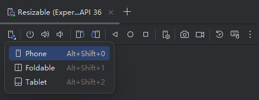
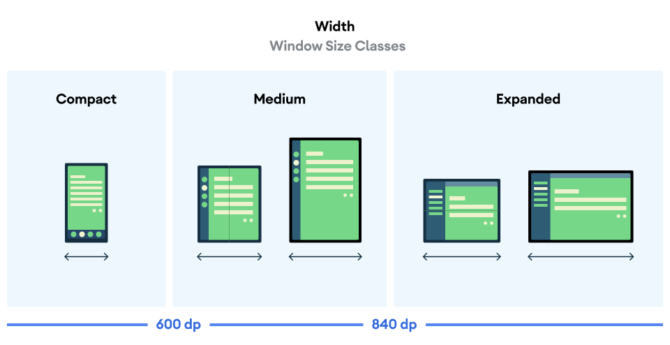

# 10. 大屏设备适配

大家好，写给初学者的 Jetpack Compose 教程又更新了。

在上一篇原创文章中，我介绍了在即将到来的Android 16系统中将会有一个比较大的行为变更，那就是大屏设备将无法再限制应用的横竖屏旋转。具体内容请参考 [Android 16不再支持横竖屏设置？官方文档详尽解读](https://blog.csdn.net/guolin_blog/article/details/147233500) 。

之所以做出这样的变更，是因为Google不希望看到众多开发者在大屏设备适配方面采取比较消极的态度。

许多 Android 开发者在开发应用程序时都只考虑手机这一种设备，对于平板之类的大屏设备，有些开发者为了图省事，就选择将应用横竖屏旋转一锁，让平板也只能像手机一样竖着拿起来使用。

这种做法很显然没有充分利用大屏设备的特性，对于平板用户群体是非常不友好的。虽说平板用户只占Android总用户群体的很小一部分，但未来Google和苹果都很可能会在折叠屏手机这一领域持续发力，到时手机和平板的界限也会变得非常模糊，这样大屏设备的适配就变得更加重要了。

其实为了方便我们对大屏设备进行适配，Google提供了许多工具来简化整个的适配过程。因此，今天这篇文章我们就来学习一下，如何让Compose编写的界面可以轻松适配各种不同尺寸的Android设备。

## 准备工作

相信大部分朋友手上应该是没有一台折叠屏或平板设备来进行大屏设备适配测试的。

没有关系，我们可以使用模拟器来解决这个问题。

在Android Studio中创建一个新的手机模拟器，并选择Resizable类型，表示这个模拟器是可改变尺寸的。


启动这个模拟器，并点击模拟器工具栏最左侧的按钮，将可以看到，当前的模拟器可以切换成手机、折叠机、平板这3种设备类型。



尝试点击切换一下，3种设备类型的效果分别如下图所示。


有了这个模拟器的帮助，就可以非常快速地验证我们编写的界面在不同尺寸的设备下适配效果到底如何了。

接下来提前在你的项目中引入如下几个库，本篇文章的后续内容将会用到这些库，这里提前一次性引入方便我们后面的学习：

```kotlin
dependencies {
    implementation("androidx.window:window:1.4.0-rc02")
    implementation("androidx.compose.material3.adaptive:adaptive:1.1.0")
    implementation("androidx.compose.material3.adaptive:adaptive")
    implementation("androidx.compose.material3.adaptive:adaptive-layout")
    implementation("androidx.compose.material3.adaptive:adaptive-navigation")
    implementation("androidx.compose.material3:material3-adaptive-navigation-suite")
}
```

## 使用window size classes

大屏适配的本质就是要根据不同的屏幕尺寸来显示不同的界面布局。

Compose中我们可以借助WindowSizeClass来获取当前设备的屏幕尺寸类型。

WindowSizeClass将Android设备根据不同的屏幕尺寸分为了以下几类。




可以看到，如果设备屏幕的宽度小于600dp，就属于Compact类型的设备。如果在600dp到840dp之间，就属于Medium类型的设备。如果在840dp及以上，就属于Expanded类型的设备。

而在高度方面，如果设备屏幕的高度小于480dp，就属于Compact类型的设备。如果在480dp到900dp之间，就属于Medium类型的设备。如果在900dp及以上，就属于Expanded类型的设备。

我们可以通过如下代码来获取并展示当前设备的屏幕尺寸类型。

```kotlin
@Composable
fun MyApp() {
    val windowSizeClass = currentWindowAdaptiveInfo().windowSizeClass
    val textInfo = "${windowSizeClass.windowWidthSizeClass}\n" +
            "${windowSizeClass.windowHeightSizeClass}"
    Text(
        text = textInfo,
        color = Color.Magenta,
        modifier = Modifier.padding(
            WindowInsets.safeDrawing.asPaddingValues()
        )
    )
}
```

运行效果如下图所示。


不过在androidx.window版本升级到1.4.0以后，上述的API会被废弃。之后Google不推荐我们直接获取设备的屏幕尺寸类型，而是可以通过如下代码来控制指定控件是否显示在限定屏幕尺寸类型的设备上：

```kotlin
@Composable
fun MyApp() {
    val windowSizeClass: WindowSizeClass = currentWindowAdaptiveInfo().windowSizeClass
    val showTopAppBar = windowSizeClass.isHeightAtLeastBreakpoint(WindowSizeClass.HEIGHT_DP_MEDIUM_LOWER_BOUND)
    if (showTopAppBar) {
        ...
    }
}
```

其中，参数HEIGHT\_DP\_MEDIUM\_LOWER\_BOUND就表示设备屏幕的高度至少要在Medium及以上才符合条件。

关于这个参数还有以下几种参数类型可选，基本能够覆盖所有的大屏设备适配场景了。

```kotlin
HEIGHT_DP_EXPANDED_LOWER_BOUND
HEIGHT_DP_MEDIUM_LOWER_BOUND
WIDTH_DP_EXPANDED_LOWER_BOUND
WIDTH_DP_MEDIUM_LOWER_BOUND
```

## 简单适配

下面我们通过一个简单的例子来学习一下，如何让Compose编写的界面快速适配不同屏幕尺寸的Android设备。

比如说，我们正在编写一个Feed流的界面，代码如下所示：

```kotlin
@Composable
fun MyFeed(modifier: Modifier = Modifier) {
    LazyColumn(
        modifier = modifier
            .fillMaxSize()
    ) {
        items(20) {
            FeedItem()
        }
    }
}

@Composable
fun FeedItem() {
    Card(
        modifier = Modifier
            .padding(10.dp),
        shape = RoundedCornerShape(10.dp)
    ) {
        Image(
            modifier = Modifier.fillMaxWidth(),
            painter = painterResource(id = R.drawable.image),
            contentDescription = "Image",
            contentScale = ContentScale.FillWidth
        )
        Text(
            modifier = Modifier.padding(8.dp),
            text = "Dunluce Castle is steeped in legend, including the tale of its banshee.",
        )
    }
}
```

这段代码非常简单，就是使用LazyColumn来显示一个可滚动的Feed列表，运行效果如下图所示。


这个效果就目前来讲看上去还算不错，可是如果我们把模拟器类型切换成折叠屏的话，效果就不是特别理想了。


可以看到，在折叠屏模式下，单条Feed所占屏幕的空间过大。从而导致明明是更大的屏幕，却只能显示更少的信息，说明我们没能让App更加充分地利用屏幕空间。

针对这种情况，有一个非常简单的适配方案，就是让大屏设备一行显示多条Feed，这样就能让屏幕的空间利用率更高了。

在Compose中LazyColumn一行只能显示一条内容，如果想要一行显示多条内容的话，可以使用LazyVerticalGrid。

现在对上述代码进行简单的修改：

```kotlin
@Composable
fun MyFeed(modifier: Modifier = Modifier) {
    val windowSizeClass = currentWindowAdaptiveInfo().windowSizeClass
    val columnCount = if (windowSizeClass.isWidthAtLeastBreakpoint(
            WindowSizeClass.WIDTH_DP_MEDIUM_LOWER_BOUND)) {
        2
    } else {
        1
    }
    LazyVerticalGrid(
        modifier = modifier.fillMaxSize(),
        columns = GridCells.Fixed(columnCount),
    ) {
        items(20) {
            FeedItem()
        }
    }
}
```

这里我们加入了对屏幕尺寸逻辑的判断，如果设备屏幕的宽度在Medium及以上，那么我们就将columnCount设置为2，表示一行显示两条Feed内容。否则，columnCount设置为1，这样就保证了手机平台的显示效果和之前是一样的。

所以手机的运行效果这里我们就不重复验证了，直接看一下在折叠屏设备上的运行效果吧。


怎么样？现在折叠屏上的显示效果就好上很多了吧。

当然，这只是一个非常简单的例子，并且这个例子我们还是通过纯原生实现去完成的大屏适配工作。

事实上，Google在Compose中还提供了一系列非常有用的工具，能让大屏适配工作变得更加轻松简单，下面我们就来继续学习。

## NavigationSuiteScaffold

现在绝大部分的手机App都使用了同一个非常主流的主界面设计风格，那就是在主界面的底部放置一排导航栏，方便用户切换到不同的功能模块。

你可以观察一下，微信、抖音、淘宝、京东、拼多多，几乎所有你叫得上名字的App无一使用的不是这种设计风格。

那么为什么大家都喜欢将导航栏放置在底部呢？因为这个位置是单手握持手机时拇指最容易触碰到的区域。

假如大家都把导航栏放置在手机顶部，你会发现你的拇指根本就够不着那里，需要借助另外一只手来操作才行。

下面我们就用Compose来实现一个导航栏的效果，代码其实很简单，如下所示：

```kotlin
class NavigationItem(
    val title: String,
    val icon: ImageVector,
    val content: String,
)

@Composable
fun MyApp() {
    val navigationItems = listOf(
        NavigationItem("Home", Icons.Default.Home, "Home Content"),
        NavigationItem("Favorites", Icons.Default.Favorite, "Favorites Content"),
        NavigationItem("Shopping", Icons.Default.ShoppingCart, "Shopping Content"),
        NavigationItem("Profile", Icons.Default.AccountBox, "Profile Content"),
    )
    var selectedItem by rememberSaveable { mutableIntStateOf(0) }
    Column(
        modifier = Modifier
            .fillMaxSize()
            .background(MaterialTheme.colorScheme.inverseOnSurface)
    ) {
        Box(modifier = Modifier
            .fillMaxWidth()
            .weight(1f)) {
            Text(
                text = navigationItems[selectedItem].content,
                fontSize = 30.sp,
                modifier = Modifier.align(Alignment.Center),
            )
        }
        NavigationBar(modifier = Modifier.fillMaxWidth()) {
            navigationItems.forEachIndexed { index, it ->
                NavigationBarItem(
                    selected = selectedItem == index,
                    onClick = { selectedItem = index },
                    icon = {
                        Icon(
                            imageVector = it.icon,
                            contentDescription = it.title
                        )
                    },
                    label = {
                        Text(text = it.title)
                    },
                )
            }
        }
    }
}
```

这里我们使用了Compose中提供的NavigationBar控件，轻松就能实现一个导航栏的效果，来看一下运行效果吧。


看上去还挺不错的样子。可是如果我们把模拟器调整成折叠屏设备又会怎样呢？


单纯从界面美观性的角度上来看，好像也并不差的样子。

但是不知道大家有没有发现一个问题，折叠屏或平板的手持方式和手机是不一样的，你在使用折叠屏或平板时，你的手一定是在屏幕的两侧而不是屏幕的底部。

这就导致，底部的导航栏会变得很难点击，使用起来会非常不顺手。

当然，你可能会说，如果只是为了让用户点击起来更加顺手，但却需要为手机、折叠屏、平板分别设计不同的导航栏，这维护成本也太高了吧。

没错，如果是这么高的维护成本，相信没有多少开发者愿意去为大屏设备进行适配了。

但如果我说是零成本呢？

是的，现在就要介绍本节的主题内容了：NavigationSuiteScaffold。

NavigationSuiteScaffold你可以把它简单理解成NavigationBar的替代器，用法也非常的相似，但是会自动帮我们做好大屏适配工作。

下面直接来看代码吧：

```kotlin
@Composable
fun MyApp() {
    val navigationItems = listOf(
        NavigationItem("Home", Icons.Default.Home, "Home Content"),
        NavigationItem("Favorites", Icons.NavigationItemDefault.Favorite, "Favorites Content"),
        NavigationItem("Shopping", Icons.Default.ShoppingCart, "Shopping Content"),
        NavigationItem("Profile", Icons.Default.AccountBox, "Profile Content"),
    )
    var selectedItem by rememberSaveable { mutableIntStateOf(0) }
    NavigationSuiteScaffold(
        navigationSuiteItems = {
            navigationItems.forEachIndexed { index, it ->
                item(
                    selected = selectedItem == index,
                    onClick = { selectedItem = index },
                    icon = {
                        Icon(
                            imageVector = it.icon,
                            contentDescription = it.title
                        )
                    },
                    label = {
                        Text(text = it.title)
                    },
                )
            }
        }
    ) {
        Box(modifier = Modifier.fillMaxSize()) {
            Text(
                text = navigationItems[selectedItem].content,
                fontSize = 30.sp,
                modifier = Modifier.align(Alignment.Center),
            )
        }
    }
}
```

总体来说，代码基本上没有发生什么太大的变化，我觉得基本上你就可以理解成，将NavigationBar控件替换成了NavigationSuiteScaffold控件，然后再稍微做一点代码结构上的调整就行了。

现在重新运行程序到手机设备上，你会发现和之前的效果没有任何区别。但是如果重新运行程序到折叠屏设备上，效果就不一样了。


可以看到，现在导航栏自动变到了屏幕左侧，并且你会发现，这个位置刚好是你手持折叠屏设备时，手指最容易触碰到的区域。

另外其实我们还可以对导航栏的类型做更加精细的控制。

NavigationSuiteScaffold支持3种类型的导航栏，默认情况下手机的导航栏类型叫做NavigationBar，折叠屏和平板的导航栏类型叫做NavigationRail。还有一种导航栏类型叫做NavigationDrawer，它是给超大屏设备使用的。

比如我们现在将刚才的程序运行到一台超大屏平板上，效果如下图所示。


可以看到，由于屏幕实在是太大了，导致导航栏看上去显得太小，比例有些不协调了。

在这种情况下我们就可以考虑使用NavigationDrawer类型的导航栏，代码如下所示：

```kotlin
@Composable
fun MyApp() {
    ...
    val windowSize = with(LocalDensity.current) {
        currentWindowSize().toSize().toDpSize()
    }
    val layoutType = if (windowSize.width >= 1200.dp) {
        NavigationSuiteType.NavigationDrawer
    } else {
        NavigationSuiteScaffoldDefaults.calculateFromAdaptiveInfo(
            currentWindowAdaptiveInfo()
        )
    }
    NavigationSuiteScaffold(
        layoutType = layoutType,
        ...
    ) {
       ...
    }
}
```

这里使用了LocalDensity去获取屏幕的分辨率数据，如果大于1200dp，我们就认为这是一台超大屏设备，将使用NavigationDrawer类型的导航栏。否则就调用calculateFromAdaptiveInfo()函数去动态计算应该使用哪种导航栏类型，这个calculateFromAdaptiveInfo()其实就是原本NavigationSuiteScaffold默认的执行逻辑。

最后，将计算出来的导航栏类型通过layoutType参数传递给NavigationSuiteScaffold即可。

现在，将程序重新运行到超大屏平板上，效果如下图所示。


这样我们就借助了Compose提供的内置控件，非常轻松地实现了导航栏效果对大屏设备的适配。

## NavigableListDetailPaneScaffold

下面我们再来学习另外一个手机上非常主流的界面设计风格，列表页面+详情页面的双页面设计。

这种设计风格在新闻、社交、聊天类的App里都非常常见。

比如下图就是一个设计非常精美的列表页面。


点击列表中的任意一项，就会进入到该项内容的详情界面。


这种界面设计在手机上是非常经典和美观的。但是，直接把这种界面设计搬到折叠屏或平板上会怎样呢？我们可以来看看效果。


嗯。。列表中的每一项都被拉得太长了，总体来说显得不太美观，但也不是不能用。

是的，相信绝大部分开发都是抱着同样的心态，能用就行了，如果还要专门为了折叠屏和平板设备再去写另外一套界面，那维护成本也太高了。

没错，大屏适配成本永远是最大的问题，同时这也是Google需要去解决的问题。

那么对于列表页面+详情页面这种界面设计，Google在Compose中加入了ListDetailPaneScaffold这个控件。

使用这个控件来编写列表页面+详情页面，就能在不引入额外工作量的前提下，又能自动对大屏设备进行适配，实现下图中的效果。


上面的几张截图都是Google官方Demo中的效果，官方Demo虽然好看，但是代码也比较复杂。

下面我带着大家编写一个简易版的Demo，以快速掌握ListDetailPaneScaffold控件的用法。

首先我们需要准备好两个页面，一个是列表页面， 一个是详情页面。代码如下所示：

```kotlin
class Feed(val title: String, val content: String) : Serializable

@Composable
fun ListPane(feedList: List<Feed>, onItemClick: (Feed) -> Unit) {
    LazyColumn(
        modifier = Modifier.fillMaxSize(),
        contentPadding = WindowInsets.safeDrawing.only(
            WindowInsetsSides.Horizontal + WindowInsetsSides.Top
        ).asPaddingValues()
    ) {
        items(feedList) {
            Card(
                onClick = { onItemClick(it) },
                modifier = Modifier
                    .fillMaxWidth()
                    .height(120.dp)
                    .padding(10.dp),
                shape = RoundedCornerShape(10.dp)
            ) {
                Box(modifier = Modifier.fillMaxSize()) {
                    Text(
                        modifier = Modifier
                            .padding(8.dp)
                            .align(Alignment.Center),
                        text = it.title,
                    )
                }
            }
        }
    }
}

@Composable
fun DetailPane(feed: Feed) {
    Box(modifier = Modifier.fillMaxSize()) {
        Text(
            text = feed.content,
            fontSize = 30.sp,
            modifier = Modifier.align(Alignment.Center),
        )
    }
}
```

这两个页面我们实现的都比较简单，其实就是用了一些Text控件来模拟页面上的内容就可以了。

接下来定义App的主页面，并通过ListDetailPaneScaffold来引用刚才编写好的列表页面+详情页面。

```kotlin
@OptIn(ExperimentalMaterial3AdaptiveApi::class)
@Composable
fun HomePage() {
    val feedList = listOf(
        Feed("A", "Feed A Content"),
        Feed("B", "Feed B Content"),
        Feed("C", "Feed C Content"),
        Feed("D", "Feed D Content"),
        Feed("E", "Feed E Content"),
        Feed("F", "Feed F Content"),
        Feed("G", "Feed G Content"),
    )
    val navigator = rememberListDetailPaneScaffoldNavigator<Feed>()
    val scope = rememberCoroutineScope()
    NavigableListDetailPaneScaffold(
        navigator = navigator,
        listPane = {
            AnimatedPane {
                ListPane(feedList) { feed ->
                    scope.launch {
                        navigator.navigateTo(ListDetailPaneScaffoldRole.Detail, feed)
                    }
                }
            }
        },
        detailPane = {
            AnimatedPane {
                navigator.currentDestination?.contentKey?.let {
                    DetailPane(it)
                } ?: DetailPane(feedList[0])
            }
        },
    )
}
```

这里我来简单解释一下这段代码。

NavigableListDetailPaneScaffold要求必须传入3个参数。

第一个参数navigator其实就是对整个控件起到一个穿针引线的作用，各种设备类型的自动适配，处理列表和详情页面之间的跳转都是借助它来完成的。通常只需要调用rememberListDetailPaneScaffoldNavigator，并传入数据类型的泛型即可。

第二个参数listPane用于指定列表页面内容，这里调用我们刚才准备好的ListPane()函数，并处理一下列表项的点击事件。当有列表项被点击时，我们需要调用一下navigator的navigateTo()函数，这样才能跳转到对应项的详情页面。

第三个参数detailPane用于指定详情页面内容，我们可以通过调用navigator的currentDestination来获取当前被点击的列表项，并展示对应的详情页面。如果还没有任意一项被点击，那么默认就展示第一条数据的详情页面。

注意我们在列表页面和详情页面的外面还嵌套了一层AnimatedPane函数，这个是用于自动实现界面切换动画的，并不属于必须项，只是可以增加美观性。

最后，把定义好的主页面HomePage()函数放到刚才NavigationSuiteScaffold的方法体里，替换之前的界面内容即可：

```kotlin
    NavigationSuiteScaffold(
        ...
    ) {
        HomePage()
    }
```

重新运行程序到手机上，效果如下图所示。


点击第一项进入详情页面，效果如下图所示。


然后将模拟器切换成折叠屏模式，效果如下图所示。


因为我们实现的毕竟是一个极简模式的Demo，所以从效果图上来说肯定没有Google的Demo好看，但是关于NavigableListDetailPaneScaffold该展示的功能基本上都已经展示出来了。

这大概就是本篇文章要演示的所有内容了，关于更多Compose大屏适配的策略，也可以参考Google的官方文档：

[https://developer.android.com/develop/ui/compose/layouts/adaptive](https://developer.android.com/develop/ui/compose/layouts/adaptive)

___

Compose是基于Kotlin语言的声明式UI框架，如果想要学习Kotlin和最新的Android知识，可以参考我的新书 **《第一行代码 第3版》**，[点击此处查看详情](https://guolin.blog.csdn.net/article/details/105233078)。
