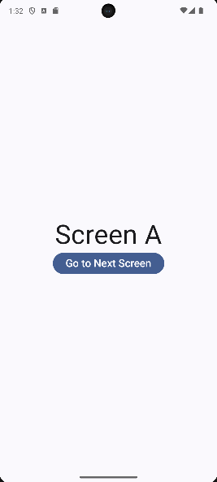
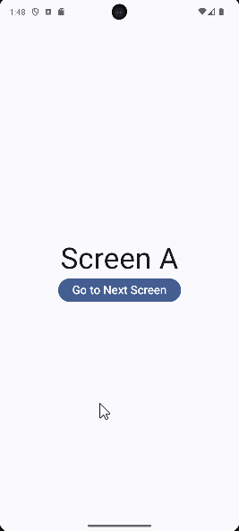
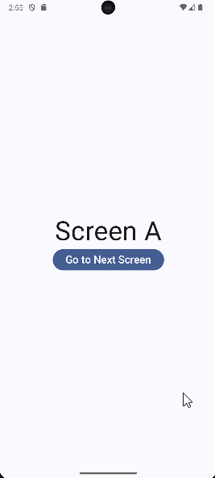
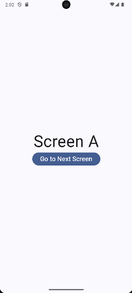
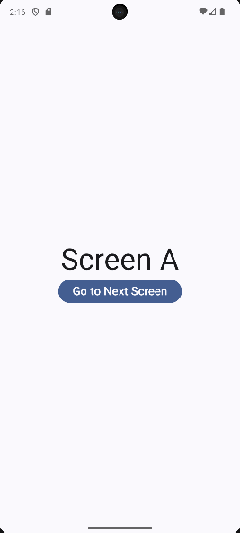
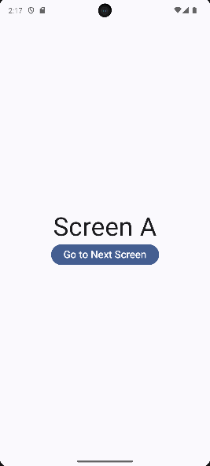
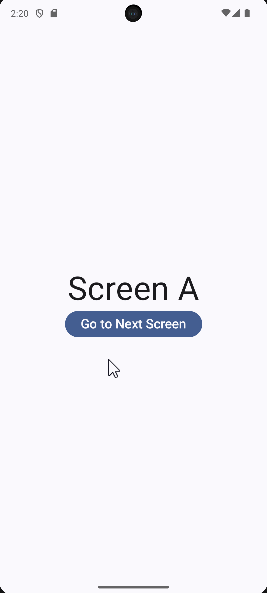
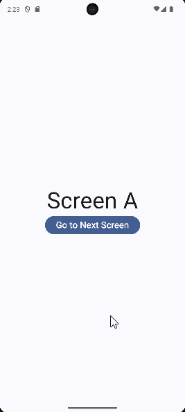
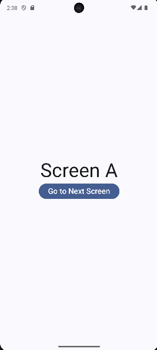
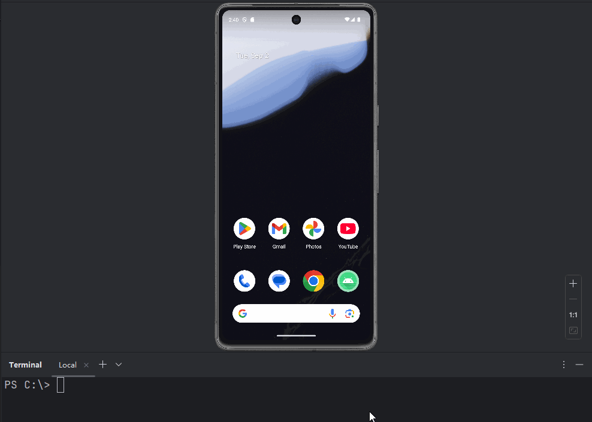

# 11. Navigation

大家好，写给初学者的Jetpack Compose教程又更新了。

本篇文章已经是这个系列教程的第11篇文章了，在前面的文章中，我们已经将绝大部分Compose的常用用法都覆盖到了，所以现在我们要学习一些更加高级，涉及到项目架构部分的知识点。

想要看本系列前面文章的朋友，可以滑动到本篇文章的底部，查看本系列所有文章的链接。

之前我们所学习的Compose知识，基本都是仅限于单个页面内的。而大家都知道，复杂成熟的项目不可能只有一个页面，一定是由许多个页面组合而成的。那么多个页面之间要如何进行跳转就是个不得不面对的问题。

当然这个问题有一个简单的解法，那就是为每个页面都创建一个单独的Activity，这样就只需要使用最传统的Intent方式就能在各个页面之间进行跳转了。

但Activity毕竟是比较重的组件，现在很多App甚至都在追求单Activity模式，而且这种思路更多还是一种基于View的编程思路，所以我们在Compose模式下就尽量不选它了。

事实上，如果想要在Compose中实现多个页面之间进行跳转，可以借助我们在 [写给初学者的Jetpack Compose教程，使用State让界面动起来](../3.%20State/index.md) 这篇文章中学习的State技术来实现。

除此之外，Compose还给我们提供了一个专门用于在不同页面之间进行导航的组件：Navigation。

今天我们就重点来学习一下这些知识。

## 简易的页面跳转实现

首先，我们先来学习一个简易版的页面跳转实现方案，使用State技术实现。

为了更好地演示今天的例子，这里先定义3个简易的页面，ScreenA、ScreenB和ScreenC，代码如下所示：

```kotlin
@Composable
fun ScreenA(modifier: Modifier = Modifier, onClick: () -> Unit) {
    Column(
        modifier = modifier.fillMaxSize(),
        horizontalAlignment = Alignment.CenterHorizontally,
        verticalArrangement = Arrangement.Center
    ) {
        Text(text = "Screen A", fontSize = 50.sp)

        Button(onClick = onClick) {
            Text(text = "Go to Next Screen", fontSize = 20.sp)
        }
    }
}

@Composable
fun ScreenB(modifier: Modifier = Modifier, onClick: () -> Unit) {
    Column(
        modifier = modifier.fillMaxSize(),
        horizontalAlignment = Alignment.CenterHorizontally,
        verticalArrangement = Arrangement.Center
    ) {
        Text(text = "Screen B", fontSize = 50.sp)

        Button(onClick = onClick) {
            Text(text = "Go to Next Screen", fontSize = 20.sp)
        }
    }
}

@Composable
fun ScreenC(modifier: Modifier = Modifier, onClick: () -> Unit) {
    Column(
        modifier = modifier.fillMaxSize(),
        horizontalAlignment = Alignment.CenterHorizontally,
        verticalArrangement = Arrangement.Center
    ) {
        Text(text = "Screen C", fontSize = 50.sp)

        Button(onClick = onClick) {
            Text(text = "Go to Next Screen", fontSize = 20.sp)
        }
    }
}
```

每个页面的内容都非常简单，只有一个Text控件用于展示当前是在哪个页面，然后有一个Button控件，点击用于跳转到下一个页面。

接下来我们看看如何让这几个页面互相串联起来，代码如下所示：

```kotlin
@Composable
fun MyApp(modifier: Modifier = Modifier) {
    var currentScreen by remember { mutableIntStateOf(0) }
    when (currentScreen % 3) {
        0 -> ScreenA(modifier) {
            currentScreen++
        }
        1 -> ScreenB(modifier) {
            currentScreen++
        }
        2 -> ScreenC(modifier) {
            currentScreen++
        }
    }
}
```

这里使用到了在 [写给初学者的Jetpack Compose教程，使用State让界面动起来](../3.%20State/index.md) 这篇文章中学到的State技术。

定义了一个currentScreen变量用于控制当前展示的页面，然后用户点击了跳转按钮之后，更新currentScreen变量的值，这样就能实现页面跳转效果了，如下图所示。



可以看到，我们在没有借助任何额外组件库的帮助下，纯粹使用Compose本身的机制，也能实现一个简易的页面跳转功能。

只不过当前的效果只有页面跳转功能，却没有页面导航的能力。

有什么区别呢？页面导航能力是指，我可以从A页面跳转到B页面，同时也应该能从B页面返回A页面。

那么我们当前的代码有实现页面导航能力吗？观察下面的效果图。



可以看到，当触发系统返回键时，不管我们当前在哪个页面，都会直接回到系统桌面，而无法回到上一个页面。说明当前代码是不具备页面导航能力的。

当然，你不需要再去思考如何优化上述代码来实现页面导航能力，因为Compose已经给我们提供了一个专门的组件：Navigation。这也正是我们本篇文章要重点学习的内容。

## Navigation的基本用法

这里需要提前说明的是，在我写本篇文章的时候，Compose已经推出了最新的导航库Navigation 3。

Navigation 3的用法和Navigation 2大体上还是比较相似的，只是又增加了许多新的功能，如大屏模式适配等等。

由于Navigation 3才刚刚推出，目前还在alpha版阶段。也就是说，它的API还不够移到稳定，后期还存在变动的可能。

因此这次我们就不那么超前了，本篇文章仍然会以Navigation 2的用法来进行讲解。等后期Navigation 3稳定版推出了之后，我会专门再写一篇文章来进行讲解。

首先，要想使用Navigation组件，需要先把必要的依赖库加进来才行。

```groovy
dependencies {
  implementation "androidx.navigation:navigation-compose:2.9.3"
}
```

接下来修改MyApp()函数中的代码，如下所示：

```kotlin
const val SCREEN_A_ROUTE = "screen_a"
const val SCREEN_B_ROUTE = "screen_b"
const val SCREEN_C_ROUTE = "screen_c"

@Composable
fun MyApp(modifier: Modifier = Modifier) {
    val navController = rememberNavController()
    NavHost(
        navController = navController,
        startDestination = SCREEN_A_ROUTE,
        modifier = modifier
    ) {
        composable(route = SCREEN_A_ROUTE) {
            ScreenA(onClick = {
                navController.navigate(SCREEN_B_ROUTE)
            })
        }
        composable(route = SCREEN_B_ROUTE) {
            ScreenB(onClick = {
                navController.navigate(SCREEN_C_ROUTE)
            })
        }
        composable(route = SCREEN_C_ROUTE) {
            ScreenC(onClick = {
                navController.navigate(SCREEN_A_ROUTE)
            })
        }
    }
}
```

别看这段代码不长，因为这已经是我简化过后的包含Navigation基本用法的最小代码示例了。

要使用Navigation，首先我们需要创建一个NavController对象才行，可以借助rememberNavController()函数来创建。

注意，通常我们要将NavController对象放在整个Compose的最顶层结构当中，这样它可以管理整个App所有页面的导航与跳转。同时，这种写法也最符合Compose提倡的状态提升原则。

接下来，调用NavHost()函数，并将刚才创建的NavController对象作用参数传入。

另外NavHost()还要求传入一个startDestination参数，这个参数指的是，刚启用程序时，App应该展示的首个页面是什么。可以看到，上述代码中，我传入了一个字符串常量，代表着ScreenA页面。

这个其实就是Navigation中的route概念了，也就是路由。在Navigation 2中，页面的路由定义非常简单，就是一个字符串就可以了，不过需要保证这个字符串是唯一的。而在Navigation 3中，路由的定义方式会变得更加广泛，这个我们之后的文章再讲。

最后，还需要在NavHost()函数的闭包当中去定义每个路由字符串与相应的Compose页面之间的映射关系。比方说，遇到路由A，那么就显示ScreenA页面，遇到路由B，就显示ScreenB页面。

Navigation的组件定义到这里就都完成了，但是别忘了我们还需要处理页面跳转的逻辑呢。

这个也非常简单，只需要在点击按钮时，调用NavController的navigate()函数，并将对应页面的路由字符串传入即可。

现在重新运行一下程序，效果如下图所示。


可以看到，这次不光实现了ScreenA、ScreenB、ScreenC之间的页面跳转，同时当触发返回键操作时，还能按照刚才页面的跳转顺序依次返回。

这样，Navigation的基本用法我们就已经掌握了。

## 知晓当前页面的路由

上述代码的写法是在每个页面ScreenA、ScreenB、ScreenC都单独进行了导航事件处理，所以它们都要在各自按钮的点击事件回调中去调用NavController的navigate()函数。

那么我如果想要在一个统一的函数中去专门处理这些页面的跳转事件该怎么办呢？

首先，这就得要知晓当前页面的路由是什么才行。因为只有知道当前是在哪个页面，我才能知道要跳转到的下一个页面是什么。

在Navigation库当中，我们可以借助NavDestination来获取当前页面的路由，代码如下所示：

```kotlin
navController.currentDestination?.route
```

那么有了当前页面的路由值，我们就可以将刚才的代码进行如下修改：

```kotlin
@Composable
fun MyApp(modifier: Modifier = Modifier) {
    val navController = rememberNavController()
    val onClick = {
        when (navController.currentDestination?.route) {
            SCREEN_A_ROUTE -> navController.navigate(SCREEN_B_ROUTE)
            SCREEN_B_ROUTE -> navController.navigate(SCREEN_C_ROUTE)
            SCREEN_C_ROUTE -> navController.navigate(SCREEN_A_ROUTE)
        }
    }
    NavHost(
        ...
    ) {
        composable(SCREEN_A_ROUTE) {
            ScreenA(onClick = onClick)
        }
        composable(SCREEN_B_ROUTE) {
            ScreenB(onClick = onClick)
        }
        composable(SCREEN_C_ROUTE) {
            ScreenC(onClick = onClick)
        }
    }
}
```

这种写法同样能够实现和刚才一模一样的页面跳转效果。

另外，如果你需要的是在Composable函数中获取当前页面的路由值，而不是在点击事件的回调中获取，那么就得使用带State版的NavDestination API了。基本语法如下：

```kotlin
val currentBackStack by navController.currentBackStackEntryAsState()
currentBackStack?.destination?.route
```

由于这里拿到的当前页面的路由器是带状态的，所以可以直接在Composable函数当中使用。比如说下面的代码实现了，当访问页面C的时候，弹出一段Toast提示。

```kotlin
@Composable
fun MyApp(modifier: Modifier = Modifier) {
    val navController = rememberNavController()
    val currentBackStack by navController.currentBackStackEntryAsState()
    if (currentBackStack?.destination?.route == SCREEN_C_ROUTE) {
        Toast.makeText(LocalContext.current, "You are in Screen C", Toast.LENGTH_SHORT).show()
    }
    ...
}
```

重新运行程序，效果如下图所示。



## Navigation选项

我们回顾一下使用Navigation来进行页面导航之后的效果。

页面的跳转顺序如下：  
ScreenA -> ScreenB -> ScreenC -> ScreenA

触发返回操作时，则是刚好以完全相反的顺序返回。效果如下图所示。



现在请把每个Screen都想象成一个Activity，你会发现当前的导航模式正是Activity默认的导航模式，也就是launchMode对应的是Standard的模式。

而我们都知道，Activity是有4种launchMode的，除了standard之外，还有singleTop、singleTask和singleInstance。

如果你还不熟悉这4种launchMode分别对应的什么效果，请先去参考《第一行代码》的基础知识部分。

使用Navigation来进行导航，我们也是可以实现出类似的launchMode效果的。

比如说，如果是在singleTask模式下，用同样的顺序进行页面跳转：  
ScreenA -> ScreenB -> ScreenC -> ScreenA

当从ScreenC跳转到ScreenA时，系统会发现当前的返回栈当中已经有一个ScreenA了，于是就不会再创建一个新的ScreenA，而是会将ScreenC和ScreenB从返回栈中依次弹出，这样返回栈中最上面的页面就是ScreenA了。

这是在Activity中使用singleTask模式来进行导航所实现的效果，下面我们在Compose中借助Navigation选项来实现类似的效果。

```kotlin
@Composable
fun MyApp(modifier: Modifier = Modifier) {
    val navController = rememberNavController()
    val onClick = {
        when (navController.currentDestination?.route) {
            SCREEN_A_ROUTE -> navController.navigate(SCREEN_B_ROUTE)
            SCREEN_B_ROUTE -> navController.navigate(SCREEN_C_ROUTE)
            SCREEN_C_ROUTE -> navController.navigate(SCREEN_A_ROUTE) {
                popUpTo(SCREEN_A_ROUTE)
            }
        }
    }
    ...
}
```

观察上述代码，这里我们在从ScreenC跳转到ScreenA的时候，通过闭包增加了一个Navigation选项：popUpTo(SCREEN\_A\_ROUTE)。这是什么意思呢？

这个popUpTo()指的就是，当我调用navigate()函数想要跳转到ScreenA时，并不是从当前的ScreenC开始跳转，而是先执行一个导航出栈操作，一直出栈到popUpTo()函数传入的参数对应的那个页面，然后再跳转到ScreenA。

这个过程是不是有就点类似于刚才Activity中singleTask模式的导航效果了？

我们来运行一下程序验证看看吧，效果如下图所示。



可以看到，现在从ScreenA页面开始执行返回操作，就不会再经历ScreenC和ScreenB的页面回退了，因为它们早就已经不存在于当前导航的返回栈当中了。

但是还存在着一个奇怪的问题，上图中为什么ScreenA页面要回退两次才能回到系统桌面呢？

这是因为popUpTo()在执行导航出栈操作时，找到传入参数对应的那个页面时就不再出栈了，也就是ScreenA。这个时候我们再通过navigate()函数跳转到ScreenA，那么此时Navigation的返回栈当中就会出现两个ScreenA，自然就需要回退两次才能回到系统桌面了。

这个问题也非常好解决，因为popUpTo()函数还可以再指定另外一个属性：

```kotlin
popUpTo(SCREEN_A_ROUTE) {
    inclusive = true
}
```

这个inclusive就是包括的意思，将这个属性指定成true，就意味着，当popUpTo()函数找到ScreenA页面时，会将ScreenA也一起弹出栈，这样就不会存在两个ScreenA页面了。

重新运行程序，效果如下图所示。



现在我们就成功实现了和Activity中singleTask模式类似的导航效果。

那么再来看另外一种launchMode，singleTop。

这个launchMode非常好理解，就是如果当前页面正好就是你打算启用的新页面，那么就不用再启用一个新的了，防止创建多个重复的页面实例。

默认情况下，Navigation的导航是不会阻止你创建多个重复的页面实例的，我们可以通过如下代码来进行验证：

```kotlin
@Composable
fun MyApp(modifier: Modifier = Modifier) {
    val navController = rememberNavController()
    val onClick = {
        when (navController.currentDestination?.route) {
            SCREEN_A_ROUTE -> navController.navigate(SCREEN_A_ROUTE)
        }
    }
    ...
}
```

现在我调整了一下导航的逻辑，在页面路由是ScreenA的时候，我们启用的仍然是一个ScreenA页面。

重新运行程序，效果如下图所示。



可以看到，随着我不断点击页面跳转按钮，会创建出许多个页面A的实例，因此我需要执行多次返回操作才能回到系统桌面。

而在Compose中，借助Navigation选项来实现类似Activity中singleTop的效果是非常简单的，只需要指定一个launchSingleTop属性就可以了。代码如下所示：

```kotlin
SCREEN_A_ROUTE -> navController.navigate(SCREEN_A_ROUTE) {
    launchSingleTop = true
}
```

再次重新运行程序，效果如下图所示。



可以看到，现在不管我点击多少次页面跳转按钮，最终只会有一个页面A的实例，因而只需要执行一次返回操作就能够回到系统桌面了。

## 带参数的Navigation

我们已经成功实现了使用Navigation来进行页面跳转的功能，但是目前只是可以单纯地跳转页面，如果我想要在页面跳转的同时再携带一些参数该怎么办呢？

这个需求在Activity中是非常常见的，同时也非常简单，因为Activity是使用Intent来进行跳转的，而Intent本身就可以传递参数。

相比之下，在Compose中使用Navigation的同时再携带一些参数就会相对麻烦一些，不过不用担心，现在我们就来解决这个问题。

这里我准备用一个最简化的例子来演示Navigation参数传递功能。当从页面A跳转到页面B的时候，携带一个字符串参数和一个整型参数。

那么首先第一步，我们得让页面B能够接收这个字符串参数才行。

修改ScreenB()函数的代码，如下所示：

```kotlin
@Composable
fun ScreenB(
    modifier: Modifier = Modifier,
    name: String? = null,
    age: Int? = null,
    onClick: () -> Unit
) {
    Column(
        modifier = modifier.fillMaxSize(),
        horizontalAlignment = Alignment.CenterHorizontally,
        verticalArrangement = Arrangement.Center
    ) {
        Text(text = "Screen B", fontSize = 50.sp)

        Button(onClick = onClick) {
            Text(text = "Go to Next Screen", fontSize = 20.sp)
        }

        if (name != null) {
            Text(text = "Name: $name", fontSize = 20.sp)
        }
        if (age != null) {
            Text(text = "Age: $age", fontSize = 20.sp)
        }
    }
}
```

可以看到，这里给ScreenB新增了一个name参数和一个age参数，这两个参数都是可为空的。如果不为空的情况下，就将参数的内容显示在界面上。

现在ScreenB虽然已经支持接收额外的字符串参数了，但是还不够，我们还得在Navigation的路由定义层面让ScreenB能够支持参数传递才行。

接着修改NavHost中的代码，如下所示：

```kotlin
NavHost(
    navController = navController,
    startDestination = SCREEN_A_ROUTE,
    modifier = modifier
) {
    ...
    composable(
        "${SCREEN_B_ROUTE}/{name}/{age}",
        arguments = listOf(
            navArgument("name") { type = NavType.StringType },
            navArgument("age") { type = NavType.IntType }
        )) { navBackStackEntry ->
        val name = navBackStackEntry.arguments?.getString("name")
        val age = navBackStackEntry.arguments?.getInt("age")
        ScreenB(name = name, age = age, onClick = onClick)
    }
    ...
}
```

这段代码应该是整个Navigation参数传递部分最复杂的部分了，但是由于我使用的是一个极简示例，所以相对来说应该还算比较好懂。

首先看路由定义层面，之前我们为每个页面定义路由其实就是使用的一个字符串。而现在仍然还是一个字符串，只不过还可以通过斜杠(/)来增加对参数的支持。所以上述代码中，我们就是在路由上增加了name和age这两个参数。注意，参数一定要使用{}包裹起来。

不过，虽然在字符串中可以指定额外的参数，但是却无法指定这几个参数的数据类型是什么。因此我们需要再给composable函数传递一个arguments参数，并构建一个list集合，然后分别调用navArgument()来给每个路由参数指定它的数据类型。

接下来，借助NavBackStackEntry获取到传入的name和age这两个参数的内容，然后传递给ScreenB即可。

现在路由定义方面也已经完成了，最后，只需要在执行页面跳转的地方传入name和age这两个参数值就可以了。

修改页面A点击事件处的代码，如下所示：

```kotlin
@Composable
fun MyApp(modifier: Modifier = Modifier) {
    val navController = rememberNavController()
    val onClick = {
        when (navController.currentDestination?.route) {
            SCREEN_A_ROUTE -> {
                val name = "Hello world"
                val age = 100
                navController.navigate("${SCREEN_B_ROUTE}/$name/$age")
            }
        }
    }
    ...
}
```

这里在从页面A跳转到页面B的时候，在navigate()函数中指定了name和age这两个参数。

现在重新运行一下程序，效果如下图所示。



可以看到，参数已经成功从页面A传递到了页面B。

## 让Navigation支持deep link

最后我们再来介绍一下Navigation对于deep link的支持。

deep link可以用于直接打开App中的指定某个页面，而不需要先从App首页开始一层层点击进入目标页面。这个功能在Activity模式的页面导航中非常常见。

而在Compose中我们也是可以实现deep link功能的，Navigation还专门为deep link功能加入了相应的API支持。

而且，在学完了通过Navigation传递参数之外，再来学习deep link会非常简单，因为它们的用法是比较相似的。

下面我们就尝试让页面B可以通过一个deep link链接直接打开。

首先，为了让当前的Activity能够支持deep link，需要先去修改一下AndroidManifest.xml文件的配置，如下所示：

```xml
<activity
    android:name=".MainActivity"
    android:exported="true"
    android:label="@string/app_name"
    android:theme="@style/Theme.NavigationTest">
    <intent-filter>
        <action android:name="android.intent.action.MAIN" />
        <category android:name="android.intent.category.LAUNCHER" />
    </intent-filter>
    <intent-filter>
        <action android:name="android.intent.action.VIEW" />
        <category android:name="android.intent.category.DEFAULT" />
        <category android:name="android.intent.category.BROWSABLE" />
        <data android:scheme="myapp" android:host="screen_b" />
    </intent-filter>
</activity>
```

这里给MainActivity增加了一个新的intent-filter，并且通过标签指定了一个myapp的scheme和一个screen\_b的host。

这样就意味着，MainActivity可以支持类似于myapp://screen\_b这种格式的deep link了。

接下来的一步非常关键，我们在ScreenB的路由定义处给它再加上一个deep link的支持，代码如下所示：

```kotlin
composable(
    "${SCREEN_B_ROUTE}/{name}/{age}",
    arguments = listOf(
        navArgument("name") { type = NavType.StringType },
        navArgument("age") { type = NavType.IntType }
    ),
    deepLinks = listOf(
        navDeepLink { uriPattern = "myapp://${SCREEN_B_ROUTE}/{name}/{age}" }
    )
) { navBackStackEntry ->
    val name = navBackStackEntry.arguments?.getString("name")
    val age = navBackStackEntry.arguments?.getInt("age")
    ScreenB(name = name, age = age, onClick = onClick)
}
```

可以看到，这里的composable函数可以再传递一个deepLinks参数，很明显这就是用于给当前页面增加deep link支持的。

然后我们调用navDeepLink函数给ScreenB创建了一个deep link的格式：

```txt
myapp://${SCREEN_B_ROUTE}/{name}/{age}
```

这样的话，使用如下链接就应该可以直接打开页面B，并且还能额外给页面B传递参数。

```txt
myapp://screen_b/Tom/35
```

至于要如何测试，你可以制作一个简单的测试网页，配置好上述的超链接，然后点击试试看能否直接打开页面B。

当然也可以再简单一点，直接使用下面的adb命令来进行测试就可以了。

```shell
adb shell am start -d "myapp://screen_b/Tom/35" -a android.intent.action.VIEW
```

我们来运行这段adb命令看看效果，如下图所示。



可以看到，不仅直接打开了页面B，同时name和age参数也都成功传递过去了，说明对于deep link的支持已经成功生效了。

好的，关于Navigation或者说Navigation 2所有要讲的内容就到这里，希望大家都能掌握好本篇文章的知识。

至于Navigation 3的讲解，就暂且等到Google发布了更加稳定的版本之后吧。

我们下篇文章再见。

___

Compose是基于Kotlin语言的声明式UI框架，如果想要学习Kotlin和最新的Android知识，可以参考我的新书 **《第一行代码 第3版》**，[点击此处查看详情](https://guolin.blog.csdn.net/article/details/105233078)。
