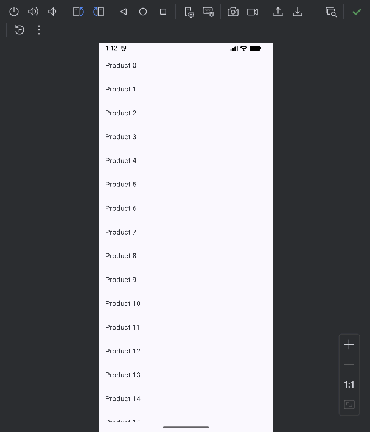

# 12. Navigation3

大家好，写给初学者的Jetpack Compose教程又更新了。

在上一篇文章当中，我详细讲解了如何在Compose中实现多个页面之间的导航与跳转功能，重点介绍的就是Google专门为Compose设计的导航库Navigation。

还没看过上篇文章的朋友可以先去参考 [写给初学者的Jetpack Compose教程，Navigation](../11.%20Navigation/index.md) 。

不过在上篇文章中我也提到了，目前稳定的Navigation库还是2.x的版本。虽然Google已经推出了全新的Navigation 3，但目前还处于alpha版的阶段，API可能还不够稳定，所以我准备等Navigation 3推出稳定版之后再专门写一篇文章来介绍它。

结果有朋友在评论区很积极地回应，说Navigation 3已经用起来了，实在是太好用了。


说得我心里都痒痒的了，真的有这么好用吗？

看来得提前研究一波了，并且将研究的结果跟大家分享出来。

说实话，在学完了Navigation 3的用法之后，我感觉Google这次对Navigation库的变动比我想象中要大得多，基本上可以算是完全重写了。

所以如果你的代码之前使用的是Navigation 2的版本，直接升级到Navigation 3的话会发现哪哪都是错误，因为API用法全部都变了。

但是我仍然认为，如果你之前了解过Navigation 2的用法，再来学习Navigation 3会相对容易一些，因此上一篇文章我还是非常推荐大家可以先去阅读一下的。

除了API上的变动之外，再说到Navigation 3相对于Navigaion 2在功能上的变更，我认为最[主要的](https://so.csdn.net/so/search?q=%E4%B8%BB%E8%A6%81%E7%9A%84&spm=1001.2101.3001.7020)就是两点。

第一，Navigation 2的导航返回栈完全是由Navigation库内部去控制的，对于我们开发者来说是个黑盒。而到了Navigation 3，整个导航的返回栈都变成了由我们自己来控制，Navigation库是完全不管的。这带来了极高的[自由度](https://so.csdn.net/so/search?q=%E8%87%AA%E7%94%B1%E5%BA%A6&spm=1001.2101.3001.7020)，同时还让用法变得更加简单了，待会具体讲解的时候我会结合着代码再和Navigation 2做个对比。

第二，Navigation 2只适用于单页模式，也就是说不管你是手机还是平板，不管当前屏幕有多大，一屏只能显示一个路由所对应的界面，很明显这已经不再符合Google现在的大屏多设备适配的策略。而Navigation 3重点要解决的就是这个问题，目标就是让你只需要开发一次程序，就能同时完美运行在手机、平板等多种不同尺寸的[Android](https://so.csdn.net/so/search?q=Android&spm=1001.2101.3001.7020)设备上。

今天这篇文章的内容也是主要围绕以上两点变更展开的，那么我们就开始吧。

## 准备工作

要想使用Navigation 3，首先得要把Navigation 3相关的依赖库引入才行。

由于Naivgation 3相关的依赖库很多，这里我建议大家也不用搞清楚哪个是哪个了，反正一股脑把下面的所有依赖库全部引入就行了，这样待会在学习过程中不至于会出现找不到库的情况。

首先新建一个Navigation3Test项目，然后将以下内容添加到libs.versions.toml：

```toml
[versions]
nav3Core = "1.0.0-alpha11"
lifecycleViewmodelNav3 = "2.10.0-alpha05"
kotlinSerialization = "2.1.21"
kotlinxSerializationCore = "1.8.1"
material3AdaptiveNav3 = "1.3.0-alpha01"

[libraries]
# Core Navigation 3 libraries
androidx-navigation3-runtime = { module = "androidx.navigation3:navigation3-runtime", version.ref = "nav3Core" }
androidx-navigation3-ui = { module = "androidx.navigation3:navigation3-ui", version.ref = "nav3Core" }

# Optional add-on libraries
androidx-lifecycle-viewmodel-navigation3 = { module = "androidx.lifecycle:lifecycle-viewmodel-navigation3", version.ref = "lifecycleViewmodelNav3" }
kotlinx-serialization-core = { module = "org.jetbrains.kotlinx:kotlinx-serialization-core", version.ref = "kotlinxSerializationCore" }

androidx-material3-adaptive-navigation3 = { group = "androidx.compose.material3.adaptive", name = "adaptive-navigation3", version.ref = "material3AdaptiveNav3" }

[plugins]
# Optional plugins
jetbrains-kotlin-serialization = { id = "org.jetbrains.kotlin.plugin.serialization", version.ref = "kotlinSerialization"}
```

接下来在app/build.gradle.kts中添加如下依赖：

```gradle
plugins {
    ...
    // Optional, provides the @Serialize annotation for autogeneration of Serializers.
    alias(libs.plugins.jetbrains.kotlin.serialization)
}

dependencies {
    ...
    implementation(libs.androidx.navigation3.ui)
    implementation(libs.androidx.navigation3.runtime)
    implementation(libs.androidx.lifecycle.viewmodel.navigation3)
    implementation(libs.androidx.material3.adaptive.navigation3)
    implementation(libs.kotlinx.serialization.core)
}
```

最后还需要确认一下你的compileSdkVersion需要是36及以上，如果不是请升级。

这样我们就把准备工作都完成了。

## Navigation 3的基础用法

下面开始学习Navigation 3的基础用法，这里我们就用一个简单的商品列表页和商品详情页来举例讲解吧。

首先，定义商品列表页和商品详情页这两个Composable函数，代码如下所示：

```kotlin
data object ProductList
data class ProductDetail(
    val name: String,
    val description: String
)

@Composable
fun ProductList(
    products: List<ProductDetail>,
    onProductClick: (ProductDetail) -> Unit,
    modifier: Modifier = Modifier
) {
    LazyColumn(modifier = modifier.fillMaxSize()) {
        items(products) { product ->
            Text(
                text = product.name,
                modifier = Modifier
                    .fillMaxSize()
                    .clickable { onProductClick(product) }
                    .padding(16.dp)
            )
        }
    }
}

@Composable
fun ProductDetail(
    product: ProductDetail,
    modifier: Modifier = Modifier
) {
    Column(
        modifier = modifier
            .fillMaxSize()
            .padding(16.dp),
        horizontalAlignment = Alignment.CenterHorizontally
    ) {
        Text(
            text = product.name,
            fontWeight = FontWeight.Bold,
            fontSize = 30.sp
        )
        Column(
            modifier = Modifier
                .fillMaxSize()
                .weight(1f),
            verticalArrangement = Arrangement.Center,
            horizontalAlignment = Alignment.CenterHorizontally
        ) {
            Text(
                text = product.description,
                fontSize = 26.sp
            )
        }
    }
}
```

商品列表页就是使用了一个LazyColumn来展示一列商品。

商品详情页用于展示具体某个商品的详细信息，当然这里只是为了演示，所以详情页也很简单，就是使用了两个Text分别显示商品的name和description。

需要特别注意的是，这里我们还分别定义了ProductList和ProductDetail这两个data class，它们在接下来的代码示例中是属于必须的部分。

简单点来说，你有几个页面需要导航，最好就定义几个对应的data class，这会让你在待会NavEntry配置的时候更加容易。

接下来就到了Navigation 3最主要的用法部分了，虽说在API方面和Navigation 2已经完全不同了，但是代码结构还是比较类似的，所以我才说如果你之前学过Navigation 2可能会相对好理解一些。代码如下所示：

```kotlin
@Composable
fun MyApp(modifier: Modifier = Modifier) {
    val backStack = remember { mutableStateListOf<Any>(ProductList) }
    NavDisplay(
        backStack = backStack,
        onBack = { backStack.removeLastOrNull() },
        entryProvider = { key ->
            when (key) {
                is ProductList -> NavEntry(key) {
                    val products = mutableListOf<ProductDetail>()
                    repeat(50) {
                        products.add(ProductDetail("Product $it", "Description of Product $it"))
                    }
                    ProductList(
                        products = products,
                        onProductClick = { product ->
                            backStack.add(ProductDetail(product.name, product.description))
                        },
                        modifier
                    )
                }

                is ProductDetail -> NavEntry(key) {
                    ProductDetail(
                        product = ProductDetail(key.name, key.description),
                        modifier
                    )
                }

                else -> error("Unknown key: $key")
            }
        }
    )
}
```

代码虽然不长，但全是重点，我得详细讲解一下。

NavDisplay函数是Navigation 3的总入口，它主要接收3个参数，backStack，onBack和entryProvider，我来逐个进行解释。

backStack参数指的是导航要使用的返回栈。前面已经说了，Navigation 3将导航的返回栈都交给开发者来控制了，因此这里需要创建一个List来管理整个App的页面导航。Compose中创建List可以使用mutableStateListOf()函数来实现，给这个函数传入一个ProductList参数，表示导航默认的初始页面是商品列表页。

而且，Navigation 3会观察我们传入的这个返回栈，并自动展示栈顶的那个页面。因此，想要打开某个就变得非常简单了，只需要将该页面对应的data class添加到栈顶即可。

onBack参数实际上是一个回调，当用户触发了返回键操作时会回调到这里，而我们就可以在这里自定义自己的返回逻辑。在不传入onBack参数的情况下，默认当用户触发了返回键操作时会自动返回到上一个页面。

到这里可以先暂停一下，来和Navigation 2做个对比。你会发现，当我们可以自主控制导航的返回栈之后，很多之前Navigation 2中的知识就已经用不到了。

比如说，之前讲解Navigation 2选项的时候，还教大家如何实现类似于Activity中singleTop和singleTask的导航效果。而到了Navigation 3中，就再也没有这些知识点了，因为整个返回栈都是由我们自己控制的，你想要实现singleTop的效果，只需要在入栈新页面的时候自己做下栈顶页面检查就可以了。Navigation 3给到了我们最大的自由度。

最后一个entryProvider参数，用于定义每个页面的NavEntry。这有点类似于Navigation 2中的路由定义，但是要更加灵活。因为Naviation 2的路由只支持字符串格式，而Navigation 3的NavEntry支持以任意类型的字段来做为key。

在这里，就用到了刚才提前定义好的ProductList和ProductDetail这两个data class，并以这两个data class分别作为key来定义了两个NavEntry，分别用于展示商品列表页面和商品详情页面。

然后当点击了商品列表页面的某个商品时，我们会创建一个ProductDetail的实例，并将它添加到返回栈中，这样Navigation 3就会自动显示商品详情页面了。

Navigation 3另一个非常方便的地方是，由于可以用任何数据类型来定义NavEntry，只要选择了恰当的类型，在不同页面之间传递参数会非常方便。上面的代码就是很好的例子，我们非常轻松地将商品列表页面选中商品的name和description传递到了商品详情页面。相比之下，Navigation 2的页面参数传递那是相当痛苦，我已经不想再回顾了。

好了，一个最简单的Navigation 3示例就已经写好了，现在我们运行一下程序吧，效果如下图所示。


可以看到，页面的导航效果已经成功实现了。并且你会发现，在打开商品详情页面和返回商品列表页面时，还会有额外的动画效果。

这个效果当然也是Navigation 3自动帮我们添加的，你如果不喜欢这个默认动画效果是可以自定义的，至于Compose中如何进行自定义动画，请参考本系列前面的文章 [写给初学者的Jetpack Compose教程，动画](https://guolin.blog.csdn.net/article/details/144811453) 。

## 保存和管理导航状态

现在你已经体会到了能够自己控制导航返回栈的好处，那么它难道就没有什么弊端吗？

当然也是有的，比如说观察如下效果图。


可以看到，当我们在商品详情页面旋转手机屏幕，会自动返回到商品列表页面。

这是因为手机屏幕旋转会导致Activity重新创建，那么我们自己控制的返回栈也就跟着被清空了，因此Navigation 3会显示默认的商品列表页面。

只能说凡事有利就有弊吧，在横竖屏旋转场景上，Navigation 2就不会存在这个问题，因为库里已经将这些场景都考虑进去了。

不过这个问题也非常容易解决，只需要稍稍改动之前的代码就可以了，如下所示：

```kotlin
@Serializable
data object ProductList : NavKey
@Serializable
data class ProductDetail(
    val name: String,
    val description: String
) : NavKey

@Composable
fun MyApp(modifier: Modifier = Modifier) {
    val backStack = rememberNavBackStack(ProductList)
    ...
}
```

这里有几点注意事项。

首先，所有作为NavEntry Key的data class都必须实现NavKey接口才行。

其次，所有作为NavEntry Key的data class都必须添加@Serializable注解，因为横竖屏旋转后的状态恢复要求数据是可序列化的才行。

完成以上两点修改之后，我们只需要再将创建返回栈的代码改成调用rememberNavBackStack()函数就可以了。

重新运行代码，我们的程序就能够支持横竖屏旋转后保存导航状态了。



## 理解场景

现在你已经掌握了Navigation 3的基本用法。

到目前为止，我们学习的内容多数是和返回栈相关的。返回栈是很重要，但仍然不是Navigation 3最核心的部分。

Google这次完全重做Navigation库，最主要的原因还是过去的Navigation 2只适用于单页模式，即一屏只能显示一个路由所对应的界面。

因此，Navigation 3最核心的部分就是要解决大屏多设备适配的问题，而场景（Scene）就是专门为了解决这个问题而设计的。

在Navigation 3中，Scene是用于呈现一个或多个NavEntry实例的基本单元。也就是说，我们可以借助Scene来实现，让屏幕中同时显示多个NavEntry页面的功能。

不过，Scene的接口定义和使用方法都相对有些复杂，我在第一次学习的时候对着那些复杂的概念术语和接口定义愣是没看明白。

到后来我才发现，其实你并不需要搞懂Scene的这些接口和用法，因为为了方便开发者使用，Google早已将最通用的一些场景封装到了Navigation 3库里面，我们直接调用现成的工具函数就可以了。

下面就来学习一下这些工具函数是怎么使用的，其实非常简单。

NavDisplay支持传入一个sceneStrategy参数来指定我们想要的场景策略，如果不指定的话，默认使用的就是SinglePaneSceneStrategy，即单页场景模式。

前面已经说了，Navigation 2支持的就是单页模式，所以Navigation 3在默认情况下效果和Navigation 2是一样的。

比如，我们将刚才的程序运行到平板上，效果如下图所示。


可以看到，平板上的运行效果和手机上并没有什么区别。

这就是只支持单页模式所带来的问题，平板上明明有非常充足的空间，可是我们却没有好好利用起来，导致整个页面看起来非常空旷。

那么要如何解决这个问题呢？很明显，没有人愿意再去为平板单独写一份页面适配的代码。

这个时候就可以使用Navigation 3内置的工具函数了。刚才说了，默认的SinglePaneSceneStrategy代表单页场景模式。除此之外，我们还可以使用ListDetailSceneStrategy，它是专门为列表详情页面这种场景设计的一种策略，可以自动根据当前运行设备的屏幕大小来安排最合理的页面分配。

ListDetailSceneStrategy的用法非常简单，只需要修改如下代码部分：

```kotlin
@OptIn(ExperimentalMaterial3AdaptiveApi::class)
@Composable
fun MyApp(modifier: Modifier = Modifier) {
    ...
    val listDetailStrategy = rememberListDetailSceneStrategy<Any>()
    NavDisplay(
        sceneStrategy = listDetailStrategy,
        ...
        entryProvider = { key ->
            when (key) {
                is ProductList -> NavEntry(
                    key, metadata = ListDetailSceneStrategy.listPane(
                    detailPlaceholder = {
                        Column(
                            modifier = Modifier
                                .fillMaxSize(),
                            verticalArrangement = Arrangement.Center,
                        ) {
                            Text("Choose a product from the list", fontSize = 26.sp)
                        }
                    }
                )) {
                   ...
                }

                is ProductDetail -> NavEntry(key, metadata = ListDetailSceneStrategy.detailPane()) {
                    ...
                }

                ...
            }
        }
    )
}
```

首先，调用rememberListDetailSceneStrategy()函数创建ListDetailSceneStrategy的实例，并把它传入给NavDisplay。

接下来，需要给ProductList和ProductDetail的NavEntry分别传入一个metadata参数，并通过listPane()和detailPane()函数来告知Navigation库，哪个NavEntry是列表页，哪个NavEntry是详情页。

列表页还可以再额外传入一个detailPlaceholder参数，用于在用户未选中列表中任意一项的时候，在大屏的右侧显示占位的内容。

现在如果将修改后的程序运行到手机上，你会发现和之前的版本效果一模一样，看不出有任何的区别。

但是再将同样的程序运行到平板上，效果就会如下图所示。


可以看到，现在我们的程序在平板设备上会自动切换成双页模式，从而更加充分地利用了屏幕的空间，用户在导航操作上也会更加流畅。

Navigation 3帮我们做到了，一份代码，多种屏幕尺寸设备的完美适配。

## 创建自定义场景

到了最后一部分，如果你是一个有更高追求的程序员，就是喜欢刨根问底，那么也可以不使用Navigation 3内置的工具函数，而是创建自己自定义的场景。

自定义场景的缺点就是要写很多复杂的代码，优点就是自由度极高，你完全可以根据自己的需求去创建任意类型的场景，别说是双页模式，三页、四页模式也都随你的便。

不过这里我没办法带着大家去实现三页、四页等如此复杂的自定义场景，本篇文章只是以教学为目的。因为我就选择去实现一个双页模式的场景了，事实上我认为双页模式的代码已经挺复杂了。

在开始编写双页模式场景之前，我们先来看一下Navigation 3默认的单页模式场景的源码是什么样的，这有助于大家理解自定义场景的语法规则。

```kotlin
data class SinglePaneScene<T : Any>(
    override val key: Any,
    override val previousEntries: List<NavEntry<T>>,
    val entry: NavEntry<T>,
) : Scene<T> {
    override val entries: List<NavEntry<T>> = listOf(entry)
    override val content: @Composable () -> Unit = { entry.Content() }
}

public class SinglePaneSceneStrategy<T : Any> : SceneStrategy<T> {
    @Composable
    override fun calculateScene(entries: List<NavEntry<T>>, onBack: (Int) -> Unit): Scene<T> =
        SinglePaneScene(
            key = entries.last().contentKey,
            previousEntries = entries.dropLast(1),
            entry = entries.last()
        )
}
```

单页模式场景下的代码还是相对比较简单的。

首先，需要创建一个自定义的场景类，并实现Scene接口。自定义场景类需要提供如下几个参数：

- key：唯一标识符，主要用于动画用途。
- previousEntries：记录当前页之前的NavEntry列表，主要用于预测性返回动画。
- entry：记录当前页面的NavEntry是什么。

除了以上3个参数之外，我们还需要重写entries和content这两个变量。

entries用于决定当前的场景要显示哪些NavEntry，由于这里是单页模式场景，所以只需要显示当前的NavEntry就可以了。

而content比较简单，就是调用NavEntry的Content()函数，将该NavEntry的内容显示到界面上即可。

创建好了自定义的场景类之后，我们还要再创建一个场景策略。

场景策略必须实现SceneStrategy接口，并重写calculateScene()函数。

我们需要在calculateScene()函数里计算要返回什么样的场景类，返回的场景类决定着最终界面上显示什么样的内容。

由于单页模式的场景非常简单，屏幕上只需要显示当前NavEntry的内容就可以了，所以这里直接返回一个SinglePaneScene的实例即可。

这大概就是自定义场景的基本语法规则了，看完了这个简单的场景，接下来我们尝试动手实现一个复杂一点的双页模式场景吧。代码如下所示：

```kotlin
class TwoPaneScene<T : Any>(
    override val key: Any,
    override val previousEntries: List<NavEntry<T>>,
    val firstPane: NavEntry<T>,
    val secondPane: NavEntry<T>
) : Scene<T> {
    override val entries: List<NavEntry<T>> = listOf(firstPane, secondPane)
    override val content: @Composable (() -> Unit) = {
        val windowSizeClass = currentWindowAdaptiveInfo().windowSizeClass
        if (windowSizeClass.isWidthAtLeastBreakpoint(WIDTH_DP_MEDIUM_LOWER_BOUND)) {
            Row(modifier = Modifier.fillMaxSize()) {
                Column(modifier = Modifier.weight(0.5f)) {
                    firstPane.Content()
                }
                Column(modifier = Modifier.weight(0.5f)) {
                    secondPane.Content()
                }
            }
        } else {
            secondPane.Content()
        }
    }

    companion object {
        internal const val FIRST_PANE_KEY = "FirstPane"
        internal const val SECOND_PANE_KEY = "SecondPane"
        fun firstPane() = mapOf(FIRST_PANE_KEY to true)
        fun secondPane() = mapOf(SECOND_PANE_KEY to true)
    }
}

class TwoPaneSceneStrategy<T : Any> : SceneStrategy<T> {
    override fun SceneStrategyScope<T>.calculateScene(entries: List<NavEntry<T>>): Scene<T>? {
        val firstPane =
            entries.filter { it.metadata.containsKey(TwoPaneScene.FIRST_PANE_KEY) }.takeLast(1)
        val secondPane =
            entries.filter { it.metadata.containsKey(TwoPaneScene.SECOND_PANE_KEY) }.takeLast(1)
        return if (firstPane.size == 1 && secondPane.size == 1
        ) {
            val sceneKey = Pair(firstPane[0].contentKey, secondPane[0].contentKey)
            TwoPaneScene(
                key = sceneKey,
                previousEntries = entries.dropLast(1),
                firstPane = firstPane[0],
                secondPane = secondPane[0]
            )
        } else {
            null
        }
    }
}
```

代码虽然长了很多，但是使用到的自定义场景的语法规则是一样的。

我们创建了一个TwoPaneScene的场景类，并同样实现了Scene接口。不同的地方在于，由于这是双页模式场景，所以需要接收两个NavEntry参数。

然后在重写content变量的时候，我们根据当前屏幕的尺寸来判断是手机还是平板。如果是平板，那么就同时显示firstPane和secondPane的内容，而如果是手机的话，只需要显示secondPane的内容就可以了。

你可能会问，那为什么不是显示firstPane的内容呢？这个继续看接下来的代码你就明白了。

接下来，同样是需要再创建一个双页模式的场景策略TwoPaneSceneStrategy，它也需要实现SceneStrategy接口，并重写calculateScene()函数。

在calculateScene()函数中，会判断当前返回栈中的NavEntry列表里是否同时存在firstPane和secondPane。如果不能满足这个条件，那么直接返回null。

返回null的意思是当前的场景策略无法处理现有的NavEntry列表，就会交给其他的场景策略类去处理，所以默认的单页模式场景策略此时就会工作。

现在思考一下，在手机模式下如果需要显示的是商品列表页面，那么肯定无法满足返回栈中firstPane和secondPane同时存在的条件，所以此时会交由默认的单页模式场景来处理。

当进入商品详情页面时，可以满足返回栈中firstPane和secondPane同时存在的条件了，我们创建的TwoPaneSceneStrategy也就能正常工作了。但由于手机模式下同时只能显示一个页面，那么自然现在应该显示的是商品详情页，也就是secondPane的内容。

以上代码大致就是这些意思，可能还有一些比较细节的地方我没有介绍到，相信大家稍微看一下就能明白了。

最后，就是要如何使用这个TwoPaneSceneStrategy了，代码如下所示：

```kotlin
@Composable
fun MyApp(modifier: Modifier = Modifier) {
    ...
    NavDisplay(
        sceneStrategy = TwoPaneSceneStrategy(),
        ...
        entryProvider = { key ->
            when (key) {
                is ProductList -> NavEntry(key, metadata = TwoPaneScene.firstPane()) {
                    ...
                }
                is ProductDetail -> NavEntry(key, metadata = TwoPaneScene.secondPane()) {
                    ...
                }
                ...
            }
        }
    )
}
```

改动非常简单，首先将传给NavDisplay的sceneStrategy参数改成我们自己创建的TwoPaneSceneStrategy。

然后，通过NavEntry的metadata参数来标记ProductList为firstPane，ProductDetail为secondPane。只有打上这两个标记，TwoPaneSceneStrategy才能正常工作起来。

现在重新运行一下程序，效果如下图所示。


可以看到，自定义的双页模式场景策略已经可以正常工作了。

只是你会发现，每当点击商品列表中的某一项时，页面都会闪一下，体验并不好。这是因为每次触发点击事件时，Compose确实在重组，所以闪烁是正常的。

而Navigation 3自带的ListDetailSceneStrategy则会有很多remember的处理来防止无效重组，所以体验要明显更好。

这也是我推荐大家尽可能使用Navigation 3自带场景策略的原因，Google写的代码一定比我们的代码考虑更加周全，也更加稳定。除非你有非常明确的需求必须要创建自定义场景，否则不推荐。

好的，关于Navigation 3所有要讲的内容就到这里，希望大家都能掌握好本篇文章的知识。

我们下篇文章再见。

___

Compose是基于Kotlin语言的声明式UI框架，如果想要学习Kotlin和最新的Android知识，可以参考我写的书 **《第一行代码 第3版》**，[点击此处查看详情](https://guolin.blog.csdn.net/article/details/105233078)。
