# 2. Modifier

> 本文同步发表于我的[微信公众号](https://so.csdn.net/so/search?q=%E5%BE%AE%E4%BF%A1%E5%85%AC%E4%BC%97%E5%8F%B7&spm=1001.2101.3001.7020)，扫一扫文章底部的二维码或在微信搜索 郭霖 即可关注，每个工作日都有文章更新。

大家好，写给初学者的Jetpack Compose教程又更新了。

上一篇文章中，我们学习了Compose的基础控件和布局，还没有看过上一篇文章的，请参考 [写给初学者的Jetpack Compose教程，基础控件和布局](../1.%20基础控件和布局/index.md) 。

其实在上一篇文章中，有个知识点一直在反复出现，但是我却一直没有讲解，那就是Modifier。之所以没有讲，是因为这个东西太重要了，需要单独用一篇文章来讲解才行。

只要你使用了Compose，那么就一定绕不开Modifier。甚至可以说，任何一个Composable函数都应该有一个Modifier参数才对，如果没有的话，那么就说明这个Composable函数写的有问题。

我在刚开始学习Compose的时候，对Modifier的用法和场景一直存在疑问。主要原因在于，一般Google提供的Composable函数除了有Modifier参数之外，还会有许许多多其他参数。有的时候某些功能是通过Modifier参数完成的，而有的时候则需要通过其他参数完成，我一直没能找到一个合理的规律，导致对这块的理解一直不够到位。

这也是我写这篇文章的其中一个目的，希望通过这篇文章，能把我自己之前没能搞清楚的知识点都搞明白，同时也分享出来给大家参考。

## Modifier的作用

开篇就来回答一下刚才提出的问题，我们在使用Compose编写界面的时候，到底什么功能应该使用Modifier参数来完成，而什么功能又要使用其他参数来完成呢？

要回答这个问题，其实只要把Modifier能做什么搞清楚就行了，除了Modifier能做的事情，剩下的自然应该使用其他参数来完成。

那么根据我查阅的官方文档，Compose对于Modifier能做的事情规定的很明确，Modifier主要负责以下4个大类的功能：

- 修改Compose控件的尺寸、布局、行为和样式。
- 为Compose控件增加额外的信息，如无障碍标签。
- 处理用户的输入
- 添加上层交互功能，如让控件变得可点击、可滚动、可拖拽。

为什么一个参数可以做这么多事情呢？因为Modifier是一个非常特殊的参数，它可以通过链式调用的方式串接无限多的API，从而实现各种你想要的效果。

接下来，我们就针对这4个大类，分别演示一下Modifier的具体用法，大家就能对Modifier有比较好的掌握了。

## 修改尺寸、布局、行为和样式

在上一篇文章中，我们简单使用过Modifier.fillMaxSize()来使布局充满全屏。那么接下来，我们就来看看Modifier还能做到哪些事情。

首先创建一个新的Compose项目，如果还不知道如何创建Compose项目的话，仍然请先参考上一篇文章。

在新的Compose项目中，我们对MainActivity的代码进行如下修改：

```kotlin
class MainActivity : ComponentActivity() {
    override fun onCreate(savedInstanceState: Bundle?) {
        super.onCreate(savedInstanceState)
        setContent {
            ComposeTestTheme {
                // A surface container using the 'background' color from the theme
                Surface(
                    modifier = Modifier.fillMaxSize(),
                    color = MaterialTheme.colors.background
                ) {
                    IconImage()
                }
            }
        }
    }
}

@Composable
fun IconImage() {
    Image(
        painter = painterResource(id = R.drawable.icon),
        contentDescription = "Icon Image",
    )
}
```

这里定义了一个IconImage()函数，然后在里面放置了一个Image()，用于显示一张图片。我们就用这个简单的例子来进行演示吧。

首先直接运行程序，将会看到如下效果：

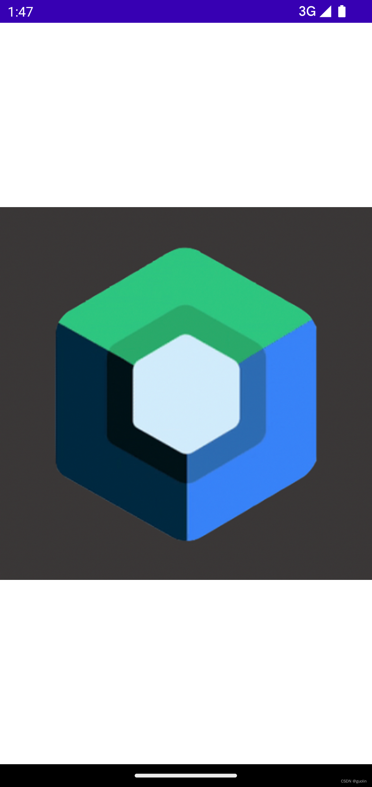

这张图片的像素是500\*500，而我的手机分辨率显然是大于这个像素数的，但这张图片却可以横向充满全屏。因此说明，在没有进行任何Modifier指定的情况下，Image默认是使用了fillMaxSize()的效果。

接下来我们通过手动指定Modifier来修改一下默认样式：

```kotlin
@Composable
fun IconImage() {
    Image(
        painter = painterResource(id = R.drawable.icon),
        contentDescription = "Icon Image",
        modifier = Modifier.wrapContentSize()
    )
}
```

这里调用了Modifier.wrapContentSize()，从而让Image根据自身内容来决定控件的大小。重新运行一下程序，效果如下图所示：

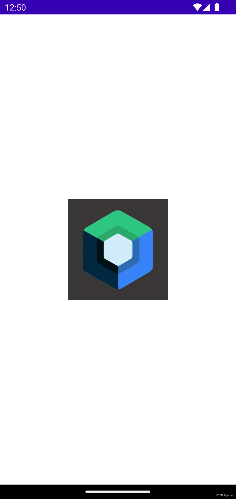

wrapContentSize()函数还提供了一个能力，就是可以对控件的对齐方式进行指定。比如这里我希望让图片垂直居中水平居左对齐，那么就可以这样写：

```kotlin
@Composable
fun IconImage() {
    Image(
        painter = painterResource(id = R.drawable.icon),
        contentDescription = "Icon Image",
        modifier = Modifier
            .wrapContentSize(align = Alignment.CenterStart)
    )
}
```

重新运行程序，效果如下图所示：

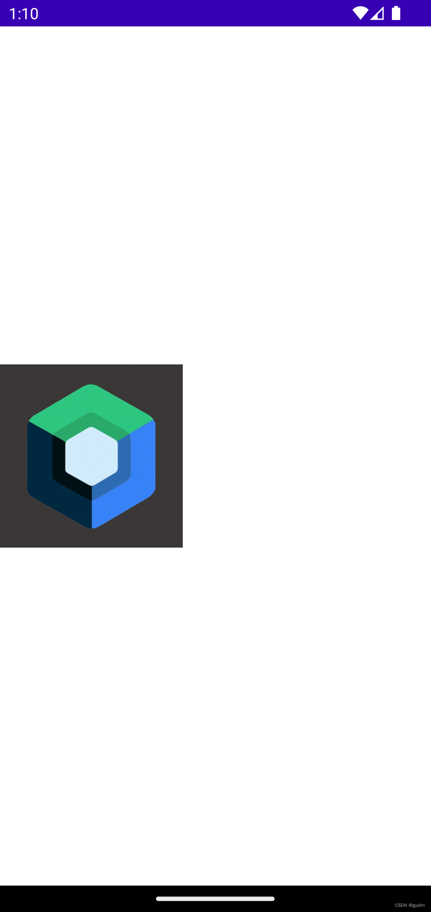

除此之外，我们还可以非常轻松地对图片进行裁剪和增加边框，代码如下：

```kotlin
@Composable
fun IconImage() {
    Image(
        painter = painterResource(id = R.drawable.icon),
        contentDescription = "Icon Image",
        modifier = Modifier
            .wrapContentSize(align = Alignment.CenterStart)
            .border(5.dp, Color.Magenta, CircleShape)
            .clip(CircleShape)
    )
}
```

这里将图片裁剪成了圆形，同时给它增加了一个5dp的边框。重新运行程序，效果如下图所示：

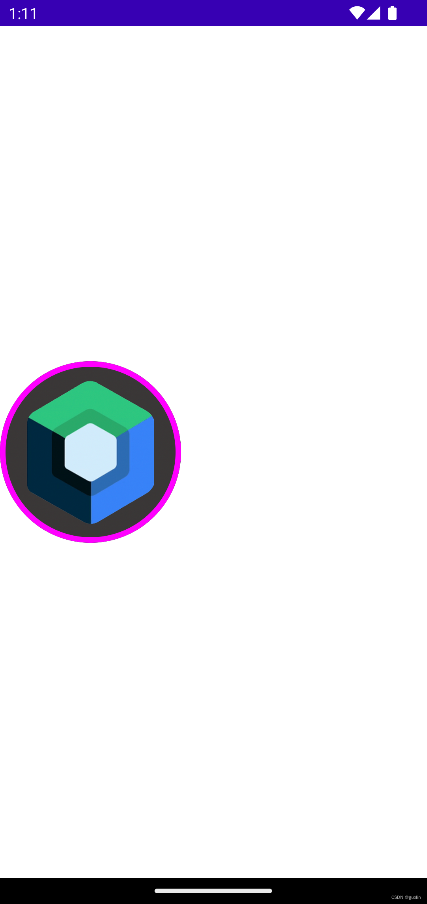

我们也可以借助Modifier修改控件的行为，如偏移、旋转等等。比如通过如下代码让图片旋转180度：

```kotlin
@Composable
fun IconImage() {
    Image(
        painter = painterResource(id = R.drawable.icon),
        contentDescription = "Icon Image",
        modifier = Modifier
            .wrapContentSize(align = Alignment.CenterStart)
            .border(5.dp, Color.Magenta, CircleShape)
            .clip(CircleShape)
            .rotate(180f)
    )
}
```

运行效果如下图所示：

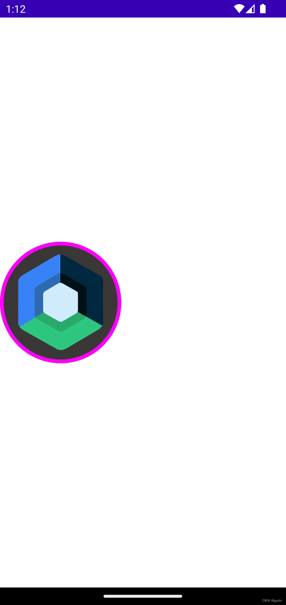

这样我们就使用Modifier对Compose控件的尺寸、布局、行为、样式进行了修改。说白了，Compose控件的外观都是由Modifier控制的。

当然，Modifier提供的修改控件外观的函数还远不止这些，你可以根据你的需求慢慢探索更多的内容。但最重要的是，你要知道，当需要修改Compose控件外观的时候，找Modifier就对了。

## 为Compose控件增加额外的信息

我个人感觉，国内的开发者绝大部分对于Accessibility和Test都不怎么感兴趣。虽然也有一些文章会讲解如何使用Accessibility，但目标应用场景基本都是做一些自动化脚本，甚至是流氓软件之类的东西，可能真的鲜有人关注Accessibility具体是用来做什么的。

事实上，Accessibility的最主要目的，是结合Talkback为那些有视觉障碍的群体提供发音辅助的，以保证即使他们的眼睛看不见或看不清，也可以正常地使用手机和各类App。

但是可能大部分的开发者对于这类功能都不怎么感冒，也不太爱看这类的文章，所以写的人也比较少。

由于这是Modifier的4大应用场景之一，我还是要展开讲解一下。其实这块内容如果深挖的话可以单独写一篇甚至几篇文章出来，但是这里我就不打算深挖了。我的目标是让大家大致了解一下即可，如果感兴趣或者有需要的话，可以再自行深入学习。

在 [写给初学者的Jetpack Compose教程，为什么要学习Compose？](../0.%20为什么要学习Compose？/index.md) 这篇文章当中，我有提到重组这个概念。重组其实就是根据当前Compose的代码结构，将一层一层的Composable函数组合成界面的过程。

在Compose的内部，是用树型结构来存储一次重组过程中每个Composable函数节点的。

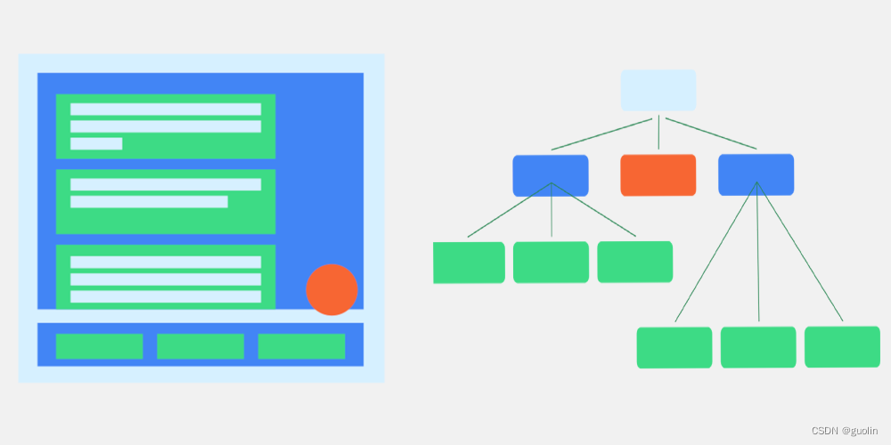

在上图当中，左边是我们看到的Compose渲染出来界面效果，而右边则是它内部的存储结构示意图。

但需要指出的是，虽然看上去这里只有一颗树，实际上在源码实现当中却有两颗。一颗就是我们现在看到的重组树，另外一颗则是我们看不到的语义树。

语义树完全不参与绘制和渲染工作，因此是完全不可见的，它只为Accessibility和Test服务。Accessibility需要根据语义树的节点内容进行发音，Test则需要根据语义树找到想要测试的节点来执行测试逻辑。

听上去可能有点复杂，但好消息是，绝大部分情况下，我们是不需要专门为语义树去做什么事情的。只要我们使用的是一些标准的Composable函数来编写界面，它们在内部就已经帮我们处理好了这些工作。

但假如你使用了一些底层API来自行绘制的界面，那么这些事情就得由你自己来做了。

在Android开发者官网有这样一个例子，比如你使用底层API自行绘制了一个日历界面，如下图所示：


那么当用户选中了17号这天的时候，系统不会发音你选中了17号，而是可能最多只会发音你选中了日历。这对于那些有视角障碍的用户们来说，就完全无法使用你的App了。

因此这个时候，我们就需要手动为Compose控件增加额外的信息，以帮助语义树能正常工作。

那么要如何为Compose控件增加额外的信息呢？答案很显然，因为这就是Modifier应用场景的一部分呀。

Modifier主要提供了两个函数来允许开发者自行添加额外信息，分别是Modifier.semantics()和Modifier.clearAndSetSemantics()。

semantics()函数允许向当前Compose控件添加键值对形式的额外信息，但是不能覆写。因此clearAndSetSemantics()函数相对用得更多一些，它会把Compsoe控件之前携带的一些额外信息都清除掉。

不过semantics()函数还有一个特别重要的功能，那就是它可以接收一个mergeDescendants参数。这个参数是什么意思呢？我们来看下面这个例子：

```kotlin
Button(onClick = { /*TODO*/ }) {
    Text(
        text = "This is Button",
        color = Color.White,
        fontSize = 26.sp
    )
}
```

这是一个Button控件的用法，Button中还嵌套了一个Text用于显示Button上的文字。但是在语义树上面，Text是Button的子节点，它们是两个独立的控件，独立控件的话，Talkback就会为它们单独发音，这显然并不是我们想要的。

这个时候就可以借助mergeDescendants参数将子节点和当前节点在语义树上面进行合并，从而视它们为一个整体的控件，Talkback就不会出现发音混乱的问题了。

但是上面的这个例子我们不用担心这个情况，因为刚才有提到，只要使用的是一些标准的Composable函数，Google在内部就已经帮我们处理好了这些场景。事实上，只要你的Compose控件是可点击的（clickable，toggleable），那么它们就会自动将所有的子节点进行合并。

讲了这么多理论知识，但接下来并不会进入到实战环节。

正如前面所说，Accessibility在国内非常小众，相信大部分朋友应该都不知道如何打开Talkback，所以对这部分进行实战演示可能意义并不大。不过相信看到这里，大家已经对语义树的概念和作用都有一定的了解了，如果感兴趣或者有需要的话，请自行深入学习。

## 处理用户的输入

这里的用户输入并不是指的文本输入框的输入，那个是由TextField控件处理的，和Modifier关系不大。

这里的用户输入指的是，当用户的手指在屏幕上进行滑动、点击各种操作时，会认为这是用户的一种输入，而我们则需要对这类输入进行处理。

其实Compose已经提供了许多上层的API，使得开发者能够非常轻松地处理用户的各种输入，这个我们待会就会看到具体的例子。

但如果这些上层API都无法满足你的需求，那么可能你就得使用偏底层的API来进行一些特殊的定制了，而这也是Modifier的其中一个功能领域。

下面我们直接看代码：

```kotlin
@Composable
fun PointerInputEvent() {
    Box(modifier = Modifier
        .requiredSize(200.dp)
        .background(Color.Blue)
        .pointerInput(Unit) {
            awaitPointerEventScope {
                while (true) {
                    val event = awaitPointerEvent()
                    Log.d("PointerInputEvent", "event: ${event.type}")
                }
            }
        }
    )
}
```

这里定义了一个PointerInputEvent函数，里面封装了一个Box，并指定它的大小是200dp，颜色是蓝色。

Compose中的Box基本就相当于View中的FrameLayout，它们默认是不能影响用户的点击或其他输入事件的。

而这里，我们调用了Modifier.pointerInput()函数，使用偏底层的API来允许Box可以对用户的输入事件进行处理。

pointerInput()函数至少要传入一个参数，这个参数的作用是，当参数的值发生变化时，pointerInput()函数会重新执行。这是一种声明式编程的思维，我们之前也提到过，以后还会再反复提及。而如果你并没有需求需要pointerInput()函数重新执行，那么传入一个Unit参数就可以了。

在pointerInput()函数的代码块当中，这里调用awaitPointerEventScope启动了一个协程作用域，我们在协程作用域里编写一个死循环，并调用awaitPointerEvent()函数来等待用户输入事件到来。

如果用户没有输入任何事件，这里就会一直挂起等待，直到有用户输入事件之后才会恢复执行，执行完之后又会进入死循环等待下一次用户输入事件的到来。

现在运行一下程序，效果如下图所示：


可以看到，当手指在屏幕上按下并拖动时，我们就能捕获到这些用户输入事件了。

当然这个写法有点过于底层了，基本没有太多场景我们需要使用如此底层的事件处理API。Compose给我们提供了一系列非常好用的辅助API，可以轻松应对绝大部分的事件处理场景。

观察如下代码：

```kotlin
@Composable
fun PointerInputEvent() {
    Box(modifier = Modifier
        .requiredSize(200.dp)
        .background(Color.Blue)
        .pointerInput(Unit) {
            detectTapGestures {
                Log.d("PointerInputEvent", "Tap")
            }
            // Never reach
        }
        .pointerInput(Unit) {
            detectDragGestures { change, dragAmount ->
                Log.d("PointerInputEvent", "Dragging")
            }
            // Never reach
        }
    )
}
```

这里我们在pointerInput()函数中使用了detectTapGestures，用来监听用户的点击事件。又在另一个pointerInput()函数中使用detectDragGestures，用来监听用户的拖拽事件。

注意这两个事件不能在同一个pointerInput()函数中监听，因为detectTapGestures和detectDragGestures函数都是阻塞性的，调用了之后下面的一行代码就永远不会执行到了。

重新运行程序，效果如下图所示：

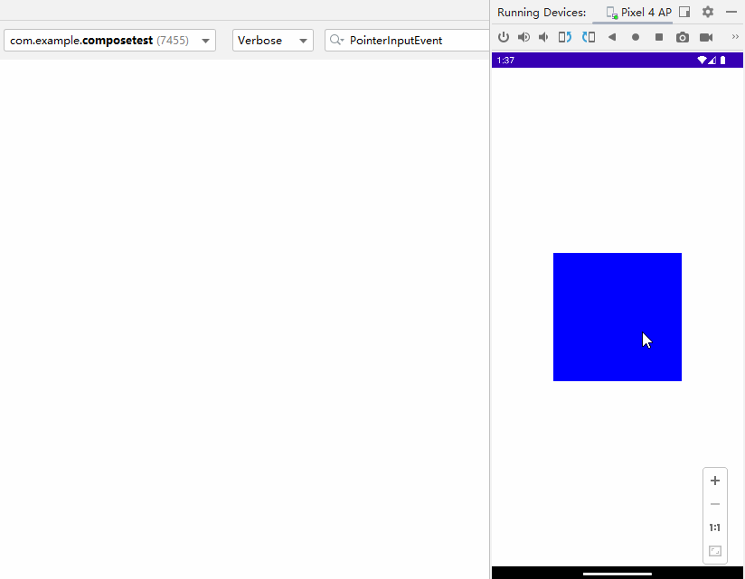

pointerInput()函数当中能做的事情还非常非常多，但是这个展开那又可以写一篇很长的文章了，所以我们就此打往。本篇文章的目的是讲解Modifier，而不是针对每一个知识点都无限发散展开。

## 使控件可点击、滚动、拖拽

总体来说，使用pointerInput()函数来处理用户输入是比较偏底层的，就像是在View系统中处理TouchEvent一样。

事实上，我们并不需要总是使用这么底层的API。Modifier提供了足够多的上层API来处理诸如点击、滚动、拖拽等用户输入事件。使用这些上层API能让开发者的工作变得非常简单，下面我们就来逐个学习下吧。

首先看点击。事实上，有些控件默认就是可以点击的，如Button。而有些则不能，如Box。

让一个默认不能点击的控件变得可以点击，并不一定非要使用pointerInput()函数，clickable()函数也能做到，并且代码会更加简洁。

```kotlin
@Composable
fun HighLevelCompose() {
    val context = LocalContext.current
    Box(modifier = Modifier
        .requiredSize(200.dp)
        .background(Color.Blue)
        .clickable {
            Toast.makeText(context, "Box is clicked", Toast.LENGTH_SHORT).show()
        }
    )
}
```

这里我们给Box添加了一个clickable()函数，那么当Box被点击的时候，clickable()函数闭包中的代码就会执行了。效果如下图所示：


接下来是滚动。其实我们在上篇文章中已经演示过如何让一个控件布局可以滚动了，这里再快速看一下吧。

```kotlin
@Composable
fun HighLevelCompose() {
    val context = LocalContext.current
    Column(modifier = Modifier
        .requiredSize(200.dp)
        .background(Color.Blue)
        .verticalScroll(rememberScrollState())
    ) {
        repeat(10) {
            Text(
                text = "Item $it",
                color = Color.White,
                fontSize = 26.sp
            )
        }
    }
}
```

借助verticalScroll()函数就可以快速让Column布局可以在垂直方向上滚动了，效果如下图所示：

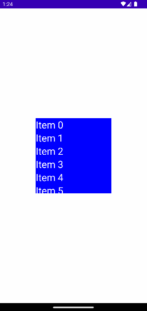

再来看拖拽。draggable()函数允许让一个控件在水平或垂直方向上拖拽，并可以监听用户的拖拽距离，我们再根据返回的拖拽距离对控件进行相应的偏移，就可以实现拖拽效果了。

```kotlin
@Composable
fun HighLevelCompose() {
    var offsetX by remember { mutableStateOf(0f) }
    Box(
        modifier = Modifier
            .offset { IntOffset(offsetX.roundToInt(), 0) }
            .requiredSize(200.dp)
            .background(Color.Blue)
            .draggable(
                orientation = Orientation.Horizontal,
                state = rememberDraggableState { delta ->
                    offsetX += delta
                })
    )
}
```

这里为了让控件能够偏移，引入了一个我们还没学过的知识点，State。关于这个知识点下篇文章中就会讲解，如果现在还看不懂的话也没关系，目前你只要了解draggable()函数的作用就足够了。

运行一下程序，效果如下图所示：

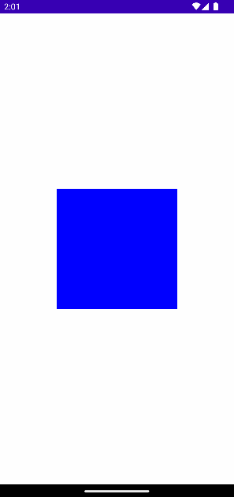

不过draggable()函数有一个弊端，它只能允许控件在水平或垂直方向上拖拽，不可以同时在水平和垂直方向上拖拽。所以如果你有这种特殊需求的话，那么就可以使用更加底层的pointerInput()函数来实现：

```kotlin
@Composable
fun HighLevelCompose() {
    var offsetX by remember { mutableStateOf(0f) }
    var offsetY by remember { mutableStateOf(0f) }
    Box(
        modifier = Modifier
            .offset { IntOffset(offsetX.roundToInt(), offsetY.roundToInt()) }
            .requiredSize(200.dp)
            .background(Color.Blue)
            .pointerInput(Unit) {
                detectDragGestures { change, dragAmount ->
                    change.consume()
                    offsetX += dragAmount.x
                    offsetY += dragAmount.y
                }
            }
    )
}
```

在pointerInput()函数内部，我们调用detectDragGestures来监听用户的拖拽手势，这样就可以同步获得用户在水平和垂直方向上的拖拽距离，并对控件进行相应的偏移了。

另外要记得，由于这是底层API，所以很多事情要自己做，比如事件处理完了，要记得调用consume()函数将它消费掉。

重新运行一下程序，效果如下图所示：

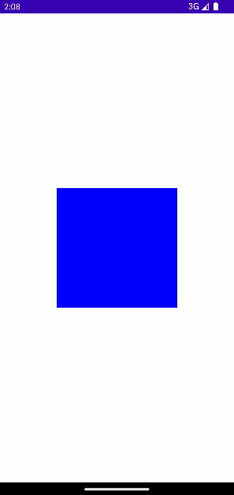

到这里为止，我们就把Modifier的4大应用场景全部讲解完了，并且一一进行了实例演示。

了解了Modifier能做哪些事情之后，接下来还有一些知识点是关于Modifier自身特性的。这些内容同样非常重要，因此在本篇文章中会一并进行讲解。

## 理解当前作用域

xml大家都很喜欢，现在仍然有很多人认为使用xml编写界面要比Compose更加简单易懂。

但是不知道大家使用xml编写界面时有没有发现一个问题，就是它无法理解当前代码所处的作用域。

什么意思呢？比如说我们正在给一个纵向的LinearLayout指定它子元素的对齐方式，由于这是一个纵向的LinearLayout，因此它的子元素必然只能在水平方向上对齐。

但是很遗憾，由于xml并不能理解当前代码所处的作用域，所以它提供给我们的对齐方式候选项里会有许多不可使用的选项。

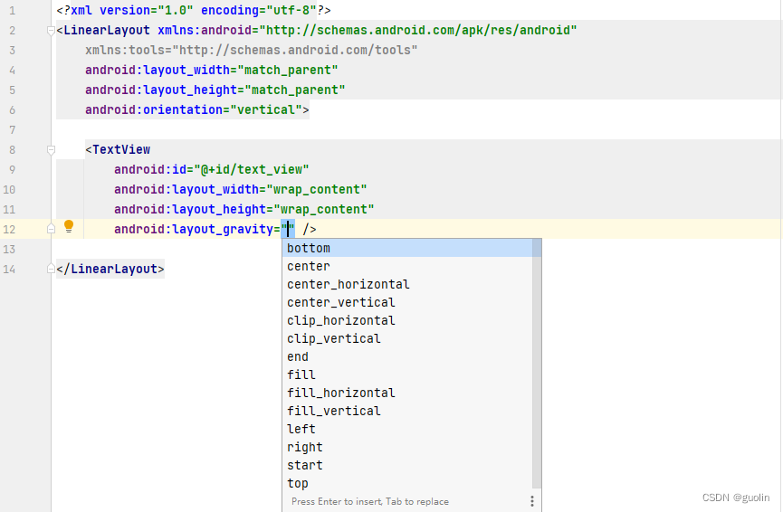

事实上，正是由于这个原因，导致xml提供的一些代码建议永远是一成不变的，从而让这些建议的价值大大降低。

而Compose则没有这个问题，它是可以理解当前代码所处的作用域的，这也是Modifier的重要特性之一。

比如说，这里我们使用Column实现一个纵向排列布局，当想要为子元素指定对齐方式时，你会发现Modifier.align()的参数类型自动变成了Aliangment.Horizontal，说明只可以在水平方向上指定对齐方式。

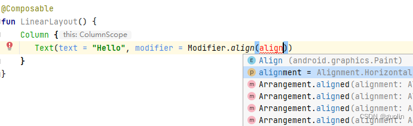

而如果我们使用Row把布局改成横向排列模式，你会发现，子元素的Modifier.align()的参数类型自动变成了Aliangment.Vertical，说明只可以在垂直方向上指定对齐方式。

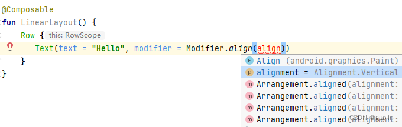

这个特性是得益于Kotlin的高阶函数功能所实现的，而xml天然不具备这个能力，所以Compose在这里的优势还是很明显的。

有了理解当前作用域的能力之后，Modifier提供给我们的接口和参数都更加精准、安全和简练，对编写代码是有很大帮助的。

## 串接顺序有影响

开篇的时候有提到过，Modifier是一个非常特殊的参数，它可以通过链式调用的方式串接无限多的API，从而实现各种你想要的效果。

而Modifier的链式调用模式对于串接的顺序是有要求的，不同的串接顺序可能实现的是不同的效果。这点和xml的区别非常大，因为xml对于属性的指定是没有顺序要求的，每个属性写在上面还是写在下面都无所谓。

但是不用担心，这并不会导致Modifier变得更难使用，反而能够让你更加清楚自己在做什么。我们通过一个例子就可以快速了解了。

回到一开始IconImage()函数的例子，现在我们通过串接一个background()函数给它添加一个灰色的背景：

```kotlin
@Composable
fun IconImage() {
    Image(
        painter = painterResource(id = R.drawable.icon),
        contentDescription = "Icon Image",
        modifier = Modifier
            .wrapContentSize()
            .background(Color.Gray)
            .border(5.dp, Color.Magenta, CircleShape)
            .clip(CircleShape)
    )
}
```

运行一下程序，效果如下图所示：

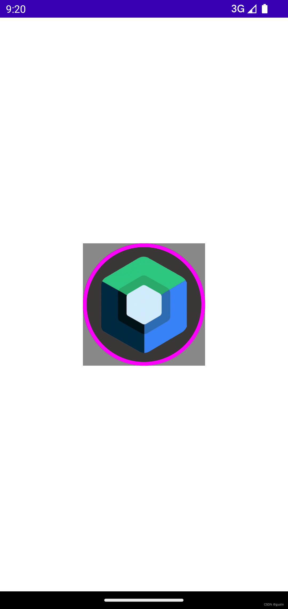

其实这里的代码就已经开始有讲究了。

如果想要给图片增加一个背景色，background()函数一定要在border()和clip()函数之前调用才行，这样Compose的执行逻辑就是，先为图片指定了一个矩形灰色背景，然后再将图片裁剪成圆形，就出现了上图所示的效果。

如果把background()函数放在border()和clip()函数之后调用，Compose的执行逻辑就会变成，先把图片裁剪成圆形，然后再在圆形的基础上添加背景色，那么这个背景色也是圆形的，从而就完全看不到了。

下面继续对这个例子进行改造，现在我们想要为图片增加一些边距。Compose中为控件增加边距是借助Modifier.padding()函数实现的，如下所示：

```kotlin
@Composable
fun IconImage() {
    Image(
        painter = painterResource(id = R.drawable.icon),
        contentDescription = "Icon Image",
        modifier = Modifier
            .wrapContentSize()
            .background(Color.Gray)
            .border(5.dp, Color.Magenta, CircleShape)
            .padding(18.dp)
            .clip(CircleShape)
    )
}
```

这里我们调用Modifier.padding()函数给图片增加了18dp的边距。重新运行程序，效果如下图所示：


你会发现，增加的边距是属于内边距，边框的位置并没有变，只是里面内容的边距增加了。

出现这种现象的原因是，我们先调用的border()函数，再调用的padding()函数，因此边框的位置已经在设置边距之前就固定下来了，也就形成了内边距的效果。

那么很明显，改成先调用padding()函数，再调用border()函数，就可以实现外边距的效果：

```kotlin
@Composable
fun IconImage() {
    Image(
        painter = painterResource(id = R.drawable.icon),
        contentDescription = "Icon Image",
        modifier = Modifier
            .wrapContentSize()
            .background(Color.Gray)
            .padding(18.dp)
            .border(5.dp, Color.Magenta, CircleShape)
            .clip(CircleShape)
    )
}
```

重新运行一下程序看看吧：

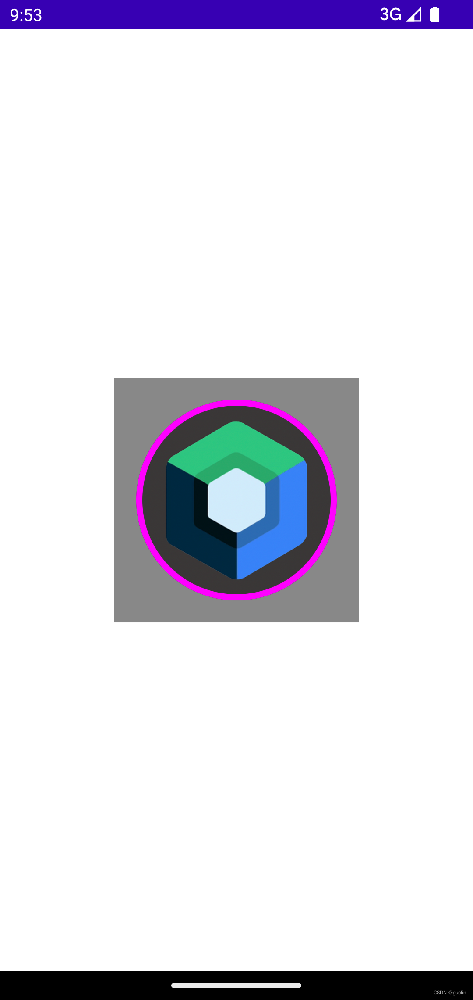

借助Modifier的这个特性，其实我们只需要调整一下padding()函数的调用顺序，就能非常容易地控制控件的内外边距。在View系统中需要借助layout\_marging和padding两个属性才能完成的工作，在Compose当中只需要一个padding()函数就能实现了。

因此你会发现，在Compose当中根本就没有layout\_marging这个属性所对应的概念，因为它是不需要的。

## 为Composable函数增加Modifier参数

开篇的时候还提到过，任何一个Composable函数都应该有一个Modifier参数才对，如果没有的话，那么就说明这个Composable函数写的有问题。

这句话是我说的，但是Google同样也表达过类型的观点。根据Google官方推荐的Compose编码规范，任何一个Composable函数它的第一个非强制参数都应该是Modifier，就像这样：

```kotlin
@Composable
fun TestComposable(a: Int, b: String, modifier: Modifier = Modifier) {
    
}
```

这个规范非常有讲究，因为Modifier是一个可选参数，因此它需要放到所有强制性参数的后面。这样调用方可以选择指定Modifier参数，也可以选择不指定。

而如果Modifier参数被放到了强制性参数的前面，那么就必须先指定Modifier参数，然后才能接着去指定强制性参数，或者就得使用参数名传参法，用法就变得不方便了。

现在我们明白了为什么Modifier参数要放到第一个非强制参数的位置，那么为什么每个Composable函数都应该有一个Modifier参数呢？

这主要还是为了灵活性考虑的。

还是以刚才的IconImage()函数举例，IconImage()的作用应该是提供一个头像控件，所以它可以控制头像的形状、背景、边框、边距等等，但是它不应该控制头像的对齐方式。

这点应该很好理解，总不能说一个头像控件只能居中或者居左显示吧？

控件的对齐方式应该由它的父布局决定，父布局可以根据其自身的显示需求决定如何对齐这个头像控件，那么为了让IconImage()函数拥有这个灵活性，我们就需要为其添加一个Modifier参数，如下所示：

```kotlin
@Composable
fun ParentLayout(modifier: Modifier = Modifier) {
    Column {
        IconImage(Modifier.align(Alignment.CenterHorizontally))
    }
}

@Composable
fun IconImage(modifier: Modifier = Modifier) {
    Image(
        painter = painterResource(id = R.drawable.icon),
        contentDescription = "Icon Image",
        modifier = modifier
            .wrapContentSize()
            .background(Color.Gray)
            .padding(18.dp)
            .border(5.dp, Color.Magenta, CircleShape)
            .clip(CircleShape)
    )
}
```

除了给IconImage()函数增加了Modifier参数之外，在为内部Image()控件指定行为的时候也要使用这个参数，而不是创建一个新的Modifier对象。

这样我们在任何调用IconImage()的地方，就都可以根据实际需求来指定它的对齐方式了。

这个例子充分展示了拥有Modifier参数的Composable函数具备更高的灵活性，Google提供的所有内置Composable函数都遵循了这个规范，因此希望你也能遵守吧。

## 总结

这篇文章我们讨论了Modifier的4大应用场景，以及Modifier的3大特性，我认为是把Modifier基本讲解到位了。

当然，这里面的每一个知识点其实还都可以继续深挖，如语义树、事件处理等等。但这些发散性的知识无法在一篇文章中覆盖全，有机会的话我可能再专门展开讲解吧。

下篇文章我们即将开始学习Compose中最重要的概念之一，State。学了这个之后Compose会变得有趣起来，敬请期待。

那么我们下篇原创文章再见。

Compose是基于Kotlin语言的声明式UI框架，如果想要学习Kotlin和最新的Android知识，可以参考我的新书 **《第一行代码 第3版》**，[点击此处查看详情](https://guolin.blog.csdn.net/article/details/105233078)。
