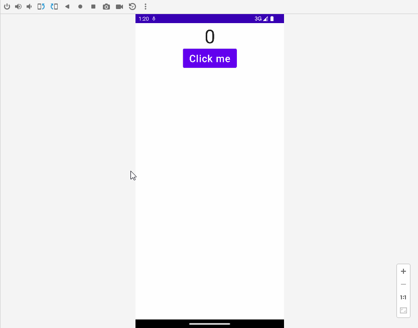
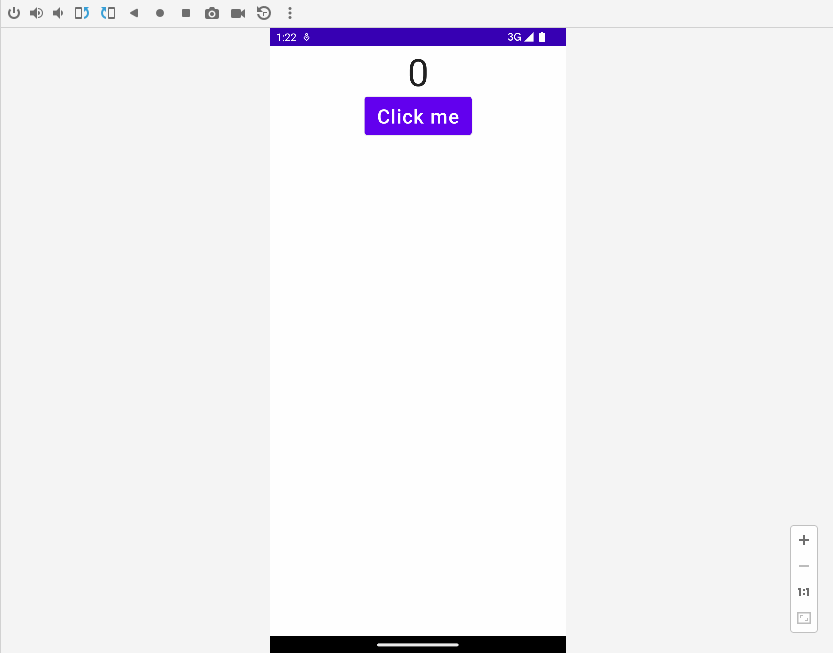

# 3. State

> 本文同步发表于我的[微信公众号](https://so.csdn.net/so/search?q=%E5%BE%AE%E4%BF%A1%E5%85%AC%E4%BC%97%E5%8F%B7&spm=1001.2101.3001.7020)，扫一扫文章底部的二维码或在微信搜索 郭霖 即可关注，每个工作日都有文章更新。

大家好，写给初学者的Jetpack Compose教程第4篇更新了。

今天我们要介绍的是Compose当中至关重要的一个组件，State。

State不光非常的重要，同时可以让我们的Compose学习之旅变得更加有趣。为什么这么说呢？因为在之前的学习过程当中，我们所实现的都是静止的界面效果，而有了State之后，则可以让界面开始动起来了。

因为这个系列教程采用的循序渐进的写法，后面的文章会依赖前面所介绍过的知识，因此如果你还没有读过前一篇文章的话，建议先去参考 [写给初学者的Jetpack Compose教程，Modifier](../2.%20Modifier/index.md)。

## 让界面动起来

其实让界面动起来这个说法并不是非常准确，因为我们在 [写给初学者的Jetpack Compose教程，基础控件和布局](../1.%20基础控件和布局/index.md) 这篇文章中学到的进度条控件，它本来就是一直在运动的。

因此更准确的说法应该是，让界面变得可交互。而这，是我们使用目前所学的Compose知识所做不到的。

为什么这么说呢？通过下面一个例子你就能迅速了解了。

这里我们打算做一个非常简单的计数器，每点击一次按钮就让计数器加1。

这么简单的功能，使用View去写的话你一定三两下就搞定了吧。而现在使用Compose要如何去实现呢？

根据我们现有学过的Compose知识，你可能会写出如下代码：

```kotlin
@Composable
fun Counter(modifier: Modifier = Modifier) {
    var count = 0
    Column(
        modifier = modifier,
        horizontalAlignment = Alignment.CenterHorizontally
    ) {
        Text(
            text = "$count",
            fontSize = 50.sp
        )
        Button(
            onClick = { count++ }
        ) {
            Text(
                text = "Click me",
                fontSize = 26.sp
            )
        }
    }
}
```

感觉这段代码逻辑非常简洁清晰呀。

我们自定义了一个叫Counter()的Composable函数，里面在Column中分别放置了一个Text和一个Button。Text用于显示计数器的数值，Button用于给计数器加1。

UI显示部分很好理解，这里的关键就是如何允许用户通过点击Button来让计数器加1。

上述代码采用的做法是，定义一个count变量，在Text控件中显示这个count变量的值，并且每次点击Button时让count变量加1。

思路非常简单，那么这段代码能正常工作吗？我们运行一下程序试试看。


可以看到，无论我们怎么点击Button，计数器的数值都不会增加。

那么这段代码的问题出在哪里呢？

这里我又要再次引用 [写给初学者的Jetpack Compose教程，为什么要学习Compose？](https://guolin.blog.csdn.net/article/details/130783168) 这篇文章中提到的知识点：声明式UI的工作流程有点像是刷新网页一样。即我们去描述一个控件时要附带上它的状态。然后当有任何状态需要发生改变时，只需要像刷新网页一样，让界面上的元素刷新一遍，那么自然状态就能得到更新了。

所以Compose更新UI界面的核心逻辑在于刷新界面，这个概念在Compose中被称为重组。而上述代码中我们并没有关心过如何才能让Counter()函数重组，事实上它也并不会重组，这也正是计数器不能正常工作的原因。

那么如何才能让Counter()函数重组呢？这就需要借助我们今天这篇文章的主题了：State。

State是一种基于观察者机制的组件，它的用法和LiveData类似，因此非常的简单易懂。

State可以让Compose感知到界面上有状态发生了变化，从而对界面上相关联的Composable函数进行重组。不仅如此，State还可以让Compose能够精准只更新那些状态有变化的控件，而那些状态没有变化的控件在重组的时候则会跳过执行。

由此可见，为了让Compose的界面可以交互，State可以说是至关重要的组件。

下面我们来看一下State的用法吧，其实很简单。

```kotlin
@Composable
fun Counter(modifier: Modifier = Modifier) {
    val count = mutableStateOf(0)
    Column(
        modifier = modifier,
        horizontalAlignment = Alignment.CenterHorizontally
    ) {
        Text(
            text = "${count.value}",
            fontSize = 50.sp
        )
        Button(
            onClick = { count.value++ }
        ) {
            Text(
                text = "Click me",
                fontSize = 26.sp
            )
        }
    }
}
```

这里我们把count变量从原来的整型变成了一个State类型。mutableStateOf()函数就是用于创建一个可变的State对象，参数中传入的是初始值。

接下来如果我想要访问这个State对象中的值，那么就调用它的getValue()函数，想要更新State对象中的值，就调用它的setValue()函数。是不是和LiveData很像？

而使用了State来追踪某个数据之后，当这个数据的值发生变化，Compose就会自动触发重组来更新所有读取这个值的地方，从而界面就会得到更新了。

State的主要用法其实就是这些，但如果现在重新运行一下程序，你会发现不管怎么点击按钮，计数器的数值仍然不会增加。

看上去好像State没有起作用？实际上并不是，State已经在正常工作了，计数器的数值没有增加是因为我们还忽略了一个细节。

刚才有说过，为了让界面内容更新，我们需要让Counter()函数发生重组，这点其实借助State对象已经做到了。但是当Counter()函数每次重组的时候，count变量又会被重新初始化为0，因此计数器也就一直显示0了。

为了解决这个问题，我们还需要再使用一个remember函数。事实上，remember和mutableStateOf在Composable函数中几乎永远都是配套使用的。

remember函数的作用是让其包裹住的变量在重组的过程中得到保留，从而就不会出现变量被重新初始化的情况了。对代码进行如下修改：

```kotlin
@Composable
fun Counter(modifier: Modifier = Modifier) {
    val count = remember { mutableStateOf(0) }
    ...
}
```

然后再重新运行一下程序，效果如下图所示：


计数器终于可以正常工作了。

同时也意味着，我们目前终于可以使用Compose写出可交互的界面了。

## 简化State代码

虽说现在的代码也并不算复杂，你一定能看得懂，但其实还是有一定优化空间的，至少绝大部分的State代码都不会这样写。

更加普遍的写法是借助Kotlin的委托语法对来State的用法进一步精简，代码如下所示：

```kotlin
@Composable
fun Counter(modifier: Modifier = Modifier) {
    var count by remember { mutableStateOf(0) }
    Column(
        modifier = modifier,
        horizontalAlignment = Alignment.CenterHorizontally
    ) {
        Text(
            text = "$count",
            fontSize = 50.sp
        )
        Button(
            onClick = { count++ }
        ) {
            Text(
                text = "Click me",
                fontSize = 26.sp
            )
        }
    }
}
```

这里的变化是，我们使用by关键字替代了之前的等号，用委托的方式来为count变量赋值。

别看只是改变了一下赋值方式，count变量的类型都会因此而发生变化。之前用等号赋值的时候，count的类型是MutableState，而改用by关键字赋值之后，count的类型就变成了Int。

既然都是Int了，那么我们就可以直接对这个值进行读写操作了，而不用像之前那样再调用它的getValue()和setValue()函数，是不是代码变得更简单了？

不过，如果你跟着我进行了同样的修改，大概率会出现一个编译错误，这是因为缺少import所导致的。在编译报错的地方通过快捷键Alt+Enter可以快速导入缺失的import，或者你也可以手动添加如下import来解决问题：

```kotlin
import androidx.compose.runtime.getValue
import androidx.compose.runtime.setValue
```

## 恢复State数据

目前我们的计数器虽然看上去可以正常工作，但其实还存在着一些问题。

比如说，每次当手机横竖屏旋转的时候，计数器都会重新归零，如下图所示：



这是因为用于计数的count变量是定义在Composable函数中的，虽然我们用remember函数将它包裹住了，但这只能保证它在Composable函数重组的时候数据不会丢失。而手机横竖屏旋转会导致Activity重新创建，这个时候数据肯定是会丢失的。

当然这个问题并不是Compose独有的，因为View也会面临同样的问题。而解决这个问题的办法有很多，比如说我们都知道，ViewModel的生命周期是可以跨越手机横竖屏旋转的，存放在ViewModel中的数据即使Activity因为横竖屏旋转而重新创建也不会丢失。这个方案之前在View系统中就被广泛使用，在Compose当中也仍然有效。我们稍后就会讲解如何在Compose中使用ViewModel。

但如果你的变量并不想定义在ViewModel当中，而是就得定义在Composable函数中，我们仍然还是有其他解决方法的。

rememberSaveable函数是remember函数的一个增强版，它唯一和remember不同的地方就是在于其包裹的数据在手机横竖屏旋转时会被保留下来。

对代码进行如下修改：

```kotlin
@Composable
fun Counter(modifier: Modifier = Modifier) {
    val count = rememberSaveable { mutableStateOf(0) }
    ...
}
```

重新运行程序，你会发现手机横竖屏旋转时计数器不会归零了。



虽说rememberSaveable是remember的增强版，但这并不意味着我们直接简单粗暴地把所有remember都替换成rememberSaveable就行了，还是要根据具体的UI需求来做出合理的选择。

## 状态提升

State现在你已经会使用了，但是会使用和用得好还是有差别的。

其实评价一段代码写得好还是不好，有时候是一件仁者见仁智者见智的事情。但幸运的是，Compose在关于State的使用方面，写得好还是不好是有明确标准的。

我们来观察如下两个Composable函数：

```kotlin
@Composable
fun StatefulCounter(modifier: Modifier = Modifier) {
    val count by remember { mutableStateOf(0) }
    Text(
        text = "$count",
        fontSize = 50.sp
    )
}

@Composable
fun StatelessCounter(count: Int, modifier: Modifier = Modifier) {
    Text(
        text = "$count",
        fontSize = 50.sp
    )
}
```

这两个函数很相似，都是使用一个Text控件来显示count变量的值。唯一的区别就是，第一个函数的count是由State对象赋值的，而第二个函数的count则是传递进来的参数。

基于这点区别，我们就可以将第一个函数称之为有状态的Composable函数，而第二个函数则是无状态的Composable函数。

根据Google给出的最佳实践准则，有状态的Composable函数通常在复用性和可测试性方面都会表现得比较差。

因此，当我们编写Composable函数时，最理想的情况就是尽可能地让它成为一个无状态的Composable函数。

那么怎样才能做到这一点呢？Compose提供了一种编程模式，叫State hoisting，中文译作状态提升。

也就是说，我们要尽可能地把State提到更上一层的Composable函数当中，这样偏底层的Composable函数就可以成为无状态的函数，从而提高它们的复用性。

而实现状态提升最核心的步骤只有两个。

第一就是将原来声明State对象的写法改成用参数传递的写法，就像上面的示例一样。

第二就是将写入State数据的地方改成用回调的方式来通知到上一层。Kotlin语言可以借助高阶函数来轻松实现回调编写，还不了解的朋友们请参考[《第一行代码 第3版》](https://guolin.blog.csdn.net/article/details/105233078)6.5节。

下面我们通过实践的方式来对刚才的Counter函数进行状态提升。

```kotlin
@Composable
fun CallCounter(modifier: Modifier = Modifier) {
    var count by rememberSaveable { mutableStateOf(0) }
    Counter(
        count = count,
        onIncrement = { count++ },
        modifier
    )
}

@Composable
fun Counter(count: Int, onIncrement: () -> Unit, modifier: Modifier = Modifier) {
    Column(
        modifier = modifier,
        horizontalAlignment = Alignment.CenterHorizontally
    ) {
        Text(
            text = "$count",
            fontSize = 50.sp
        )
        Button(
            onClick = { onIncrement() }
        ) {
            Text(
                text = "Click me",
                fontSize = 26.sp
            )
        }
    }
}
```

这里严格按照刚才说的两个步骤对Counter函数进行了状态提升。

可以看到，Counter函数中移除了count变量的声明，改成了使用参数传递的模式。同时，当按钮被点击时，因为我们已经无法对State变量进行写入，这里改用了回调的方式将点击事件通知到上一层。最后由上一层来完成对count变量的修改操作。

现在你可以重新运行一下程序，计数器的效果应该和之前一样的。

既然效果一模一样，那么经过状态提升后的Counter函数到底好在哪里呢？

刚才也说了，有状态的Composable函数通常在复用性方面会存在一些问题。而现在Counter函数已经无状态了，它的复用性会更加出色吗？我们来试试吧。

这里我们打算实现两个计时器，第一个计时器和之前保持一致即可，而第二个计时器则是双倍计时器，每点击一次按钮，让计数器的数值加2。

你会发现，在状态提升之前，Counter函数是无论如何都无法实现两种不同逻辑的计时器的，除了再复制另写一份DoubleCounter函数，别无他法。

而在状态提升之后，我们就可以使用如下写法轻松复用同一套逻辑实现两种不同的计时器了：

```kotlin
@Composable
fun CallCounter(modifier: Modifier = Modifier) {
    var count by rememberSaveable { mutableStateOf(0) }
    var doubleCount by rememberSaveable { mutableStateOf(0) }
    Column {
        Counter(
            count = count,
            onIncrement = { count++ },
            modifier.fillMaxWidth()
        )
        Counter(
            count = doubleCount,
            onIncrement = { doubleCount += 2 },
            modifier.fillMaxWidth()
        )
    }
}

@Composable
fun Counter(count: Int, onIncrement: () -> Unit, modifier: Modifier = Modifier) {
    ...
}
```

可以看到，这里调用了两次Counter函数并让它们纵向排列。

然后我们通过参数传递的方式给两次Counter函数调用传入了不同的State对象，并通过回调的方式对两个计时器的点击事件进行了不同的逻辑处理。

运行一下程序，效果如下图所示：


通过这样一个实例的演示，相信你已经明白状态提升的好处在哪里了。

但其实这并不是Compose自己独创的编程模式，基本上每一个声明式UI框架都有类似的编程理念。

通常意义上来讲，像这种状态向下传递、事件向上传递的编程模式，我们称之为单向数据流模式（Unidirectional Data Flow）。而状态提升就是这种单向数据流模式在Compose中的具体应用。

关于状态提升最后还有一个问题。既然我们可以将状态提升到上一层，那么是不是还可以再往上提一层，再往上呢？提到哪一层才能算结束？

关于这个问题其实并没有一个非常精准的答案，基本上只要你想往上提，提多少层都是可以的，因此更多是根据你实际的业务需求来进行状态提升。

不过虽然状态提升没有上限，下限却是有的，如果你的状态提升的层级不够高，那么你的代码将很难满足单向数据流的编程模式。

以下是你应该考虑的状态提升最少应该到达哪个层级的关键因素：

1. 如果有多个Composable函数需要读取同一个State对象，那么至少要将State提升到这些Composable函数共有的父级函数当中。
2. 如果有多个Composable函数需要对同一个State对象进行写入，那么至少要将State提升到所有执行写入的Composable函数里调用层级最高的那一层。
3. 如果某个事件的触发会导致两个或更多的State发生变更，那么这些State都应该提升到相同的层级。

只要你在编写Compose代码的时候始终将这种编程模式牢记心头，那么最终你的代码质量一定会非常不错的。

## 结合ViewModel一起使用

ViewModel大家应该都相当熟悉了。

如果你的项目已经使用了现代化Android应用程序的架构，那么就一定会用到ViewModel。

事实上，ViewModel主要是和Activity或Fragment关联的，而并没有和View绑定。因此，不管你的项目是基于View的还是基于Compose的，在ViewModel的用法方面基本没有太大的变化。

那么我们现在就将刚才的计时器项目进行一点简单的重构，让它可以结合着ViewModel一起工作。注意这里假设你已经对ViewModel比较熟悉了，如果还不了解ViewModel的朋友，请参考[《第一行代码 第3版》](https://guolin.blog.csdn.net/article/details/105233078)13.2节。

通常在Activity中接收来自ViewModel的数据变更，有LiveData和Flow这两种方式。这两种方式我们都会进行介绍。

假如你使用的是LiveData，那么就可以编写如下ViewModel的代码：

```kotlin
class MainViewModel : ViewModel() {
    private val _count = MutableLiveData<Int>()
    private val _doubleCount = MutableLiveData<Int>()

    val count: LiveData<Int> = _count
    val doubleCount: LiveData<Int> = _doubleCount

    fun incrementCount() {
        _count.value = (_count.value ?: 0).plus(1)
    }

    fun incrementDoubleCount() {
        _doubleCount.value = (_doubleCount.value ?: 0).plus(2)
    }
}
```

这段代码和Compose没有任何关系，完全是纯粹的ViewModel和LiveData的用法。

这里我们将count和doubleCount变量封装到了ViewModel当中，并且提供了incrementCount()和incrementDoubleCount()这两个接口来允许增加这两个变量的值。

接下来就是如何在Compose中监听和修改这两个变量的值，这部分会有一些不同。

首先我们要引入如下两个库，这是Compose为了适配ViewModel和LiveData而专门设计的库：

```groovy
dependencies {
    implementation "androidx.lifecycle:lifecycle-viewmodel-compose:2.6.2"
    implementation "androidx.compose.runtime:runtime-livedata:1.5.1"
}
```

然后修改CallCounter函数中的代码，如下所示：

```kotlin
import androidx.lifecycle.viewmodel.compose.viewModel

@Composable
fun CallCounter(modifier: Modifier = Modifier, viewModel: MainViewModel = viewModel()) {
    val count by viewModel.count.observeAsState(0)
    val doubleCount by viewModel.doubleCount.observeAsState(0)
    Column {
        Counter(
            count = count,
            onIncrement = { viewModel.incrementCount() },
            modifier.fillMaxWidth()
        )
        Counter(
            count = doubleCount,
            onIncrement = { viewModel.incrementDoubleCount() },
            modifier.fillMaxWidth()
        )
    }
}
```

注意这里的变化，我们在CallCounter函数的参数列表当中增加了一个viewModel参数，并且通过默认赋值的方式对它进行初始化，这样就可以调用MainViewModel中定义的对象和函数了。

但是传统LiveData的用法在Compose中并不好使，因为传统LiveData依赖于监听某个值的变化，并对相应的界面进行更新，而Compose的界面更新则依赖于重组。

因此，我们需要将LiveData转换成State才行，observeAsState()函数就是用来做这个事情的，参数中传入的0表示它的初始值。

最后，当按钮被点击的时候，我们调用ViewMode的incrementCount()和incrementDoubleCount()函数来对计数器进行修改即可。

这就是Compose配合ViewModel和LiveData的用法。

接下来我们再看一下Compose配合ViewModel和Flow的用法。

如果你早就已经不再使用LiveData，而是转向使用Kotlin Flow的话，那么你的ViewModel中的代码可能是长这样的：

```kotlin
class MainViewModel : ViewModel() {
    private val _count = MutableStateFlow(0)
    private val _doubleCount = MutableStateFlow(0)

    val count = _count.asStateFlow()
    val doubleCount = _doubleCount.asStateFlow()

    fun incrementCount() {
        _count.value += 1
    }

    fun incrementDoubleCount() {
        _doubleCount.value += 2
    }
}
```

这里使用了StateFlow来替代LiveData。如果你对Kotlin Flow的用法还不熟悉，可以在我的公众号主页回复“Flow”，就能看到我之前写的Kotlin Flow三部曲了。

说到StateFlow，它本来和LiveData的用法就极其相似，最大的不同点可能就在于StateFlow是用Kotlin编写的，它可以在初始化的时候就传入一个初始值，从而确保它的值永远不会为空。因此我们在incrementCount()和incrementDoubleCount()函数里可以直接对其加1加2，而不用像之前LiveData那样写一段很奇怪的空指针保护代码了。

接下来回到CallCounter函数中进行如下修改：

```kotlin
@Composable
fun CallCounter(modifier: Modifier = Modifier, viewModel: MainViewModel = viewModel()) {
    val count by viewModel.count.collectAsState()
    val doubleCount by viewModel.doubleCount.collectAsState()
    ...
}
```

这里我们只需要将刚才LiveData的observeAsState()函数改成Flow的collectAsState()函数即可。不用说，这个函数的作用就是将Flow转换成State的。

那么到这里，相信你已经了解如何在Compose中无缝对接ViewModel了。

## 回到第2篇

现在你已经掌握了关于State的方方面面，这个时候可以回顾一下我们在本系列第2篇文章中遗留的问题了。

[写给初学者的Jetpack Compose教程，基础控件和布局](../1.%20基础控件和布局/index.md) 这篇文章中讲到了TextField控件，也就是输入框。但遗憾的是，当时的我们不管在键盘上输入了任意内容，TextField上都不会显示出来。

先来回顾一下当时的代码：

```kotlin
@Composable
fun SimpleWidgetColumn() {
    Column {
        ...
        TextField(value = "", onValueChange = {})
    }
}
```

至于为什么使用这段代码，TextField无法显示输入的内容呢？因为TextField中显示的内容就是一种状态，需要刷新界面才能显示。

而当我们在键盘上输入内容时，并没有哪里去做了刷新界面这个操作。

其次，就算是做了刷新操作，TextField刷新后发现value参数指定的内容仍然是一个空字符串，因此我们输入的内容还是无法上屏。

既然懂得了问题的原因，再结合着我们本篇文章中学到的State知识，相信你已经可以轻松解决掉这个问题了，代码如下所示：

```kotlin
@Composable
fun SimpleWidgetColumn() {
    var userInput by remember { mutableStateOf("") }
    Column {
        TextFieldWidget(userInput, { newValue ->
            userInput = newValue
        })
    }
}

@Composable
fun TextFieldWidget(value: String, onValueChange: (String) -> Unit, modifier: Modifier = Modifier) {
    TextField(
        modifier = modifier,
        value = value,
        onValueChange = onValueChange
    )
}
```

这里我们将TextField提取到了一个TextFieldWidget函数当中，并且在这个函数中使用了状态提升的技巧，通过传入的value参数来指定TextField显示的内容，以及通过onValueChange回调来通知TextField的内容变化。

而在原来的SimpleWidgetColumn函数中，我们只需要创建一个State对象，并将它的值传给TextFieldWidget函数，以及监听回调的内容即可。

现在重新运行一下程序，效果如下图所示：


可以看到，我们终于能够在Compose的输入框中输入内容了。

那么关于State的知识就讲到这里，下篇文章我准备开始讲解LazyColumn的相关内容，敬请期待。

Compose是基于Kotlin语言的声明式UI框架，如果想要学习Kotlin和最新的Android知识，可以参考我的新书 **《第一行代码 第3版》**，[点击此处查看详情](https://guolin.blog.csdn.net/article/details/105233078)。
