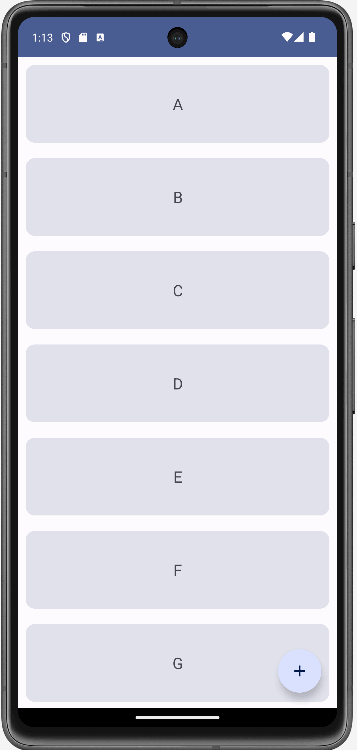
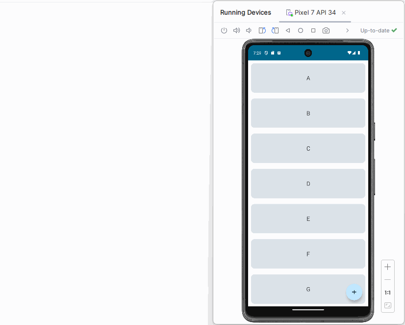
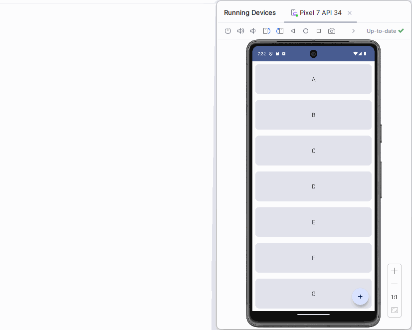

# 5. derivedStateOf

> 本文同步发表于我的[微信公众号](https://so.csdn.net/so/search?q=%E5%BE%AE%E4%BF%A1%E5%85%AC%E4%BC%97%E5%8F%B7&spm=1001.2101.3001.7020)，扫一扫文章底部的二维码或在微信搜索 郭霖 即可关注，每个工作日都有文章更新。

大家好，写给初学者的Jetpack Compose教程又更新了。

虽然我的进度很慢，但这个系列的教程还没有停更。

书接上篇的Compose文章，[写给初学者的Jetpack Compose教程，Lazy Layout](../4.%20Lazy%20Layout/index.md)。

在这篇文章中，我很细致地讲解了Lazy Layout的用法，但同时也埋下了一个坑，这个坑会严重影响Lazy Layout的性能。

今天这篇文章，我们就来一起探究一下这个坑到底是什么，以及如何解决这个问题。

由于Lazy Layout本身就有一定的复杂性，直接基于Lazy Layout来进行分析会相对更加难懂一些。因此这里我准备先用一个更加简单的例子进行讲解，之后我们再回到上篇文章留下的陷阱去分析和解决。

经过前面几篇文章的学习，现在你对Compose应该已经比较熟悉，并且能完成一些基本的功能开发了。

那么现在这里有一个非常简单的需求。提供一个按钮，当用户点击按钮超过5次，就提示用户你已经点击很多次了。

如何用Compose来实现这个功能呢？

借助前面几篇文章中学习的知识，实现这个功能并不难，代码如下所示：

```kotlin
@Composable
fun MainLayout() {
    var clickCount by remember { mutableStateOf(0) }
    Column {
        Button(onClick = { clickCount++ }) {
            Text(text = "Click me")
        }

        if (clickCount >= 5) {
            Text(text = "You clicked a lot")
        }
    }
}
```

代码比较简单易懂，只要你阅读过本系列前面的几篇文章，相信不需要我做更多的解释。

运行一下，效果如下图所示：


所以，我们已经按照需求成功实现了效果，那么这段代码就没有任何问题了吗？

其实不然。这段代码写成这样，代表着开发者对于Compose的工作机制还不够了解，没有更合理地利用一些技术手段来避免没必要的重组。

重组这个概念我在前面的文章中已经提到很多回了，因为它就是Compose工作的核心。

简单来说，重组就是通过刷新界面来让Compose中显示的内容进行更新。那么如何刷新界面呢，这就要借助State来实现了。我在 [写给初学者的Jetpack Compose教程，使用State让界面动起来](../3.%20State/index.md) 这篇文章中有详细介绍State的用法。

那么上述代码中，clickCount就是一个State变量。因此，当这个变量的值发生变化时，所有读取这个值的Composable函数都会发生重组，以刷新界面。

根据这个特性，我们会发现，每当点击一下按钮，MainLayout函数都会发生一次重组。但实际上，只有在第5次点击按钮的时候，界面才会发生一次UI变动，其他时候UI都是不会变化的。在这种场景下，当前代码就会导致大量的无效重组，没有任何的意义，只会浪费性能。

那么如何解决这个问题呢？这就需要引入我们今天文章的主题了：derivedStateOf。

derivedStateOf其实和mutableStateOf是比较相似的，它们都是用于创建State变量，然后Compose则会基于State变量值的变化来触发重组行为。

不同的是，derivedStateOf接收的一个表达式，只有当这个表达式中的条件发生变化了，那么才算是State的值发生了变化，这时才会触发重组。

我们通过具体的代码来看一下吧，如下所示：

```kotlin
@Composable
fun MainLayout() {
    var clickCount by remember { mutableStateOf(0) }
    val clickedALot by remember { derivedStateOf { clickCount >= 5 } }
    Column {
        Button(onClick = { clickCount++ }) {
            Text(text = "Click me")
        }

        if (clickedALot) {
            Text(text = "You clicked a lot")
        }
    }
}
```

这里我新增了一个变量clickedALot，它是通过derivedStateOf创建的，而derivedStateOf中指定的条件是clickCount >= 5。

这也就意味着，clickedALot的值只会在clickCount由4变成5的那一次发生变化，其余时候不管你点击了多少次按钮，clickedALot的值都是不会变的。

然后我们再基于clickedALot的值来决定是否提示用户已经点击很多次了，这样就可以实现只做必要的重组，移除所有多余的重组，从而提升了应用性能。

讲到这里相信你已经理解什么是derivedStateOf了，那么接下来我们回到开篇提及的Lazy Layout问题，看一看坑到底在哪里，以及如何去解决它。

因为这个坑是在上篇文章中埋下的，所以我先把上篇文章中的代码给直接搬运过来吧：

```kotlin
@Composable
fun MainLayout() {
    val state = rememberLazyListState()
    Box {
        ScrollableList(state)
        val shouldShowAddButton = state.firstVisibleItemIndex == 0
        AddButton(shouldShowAddButton)
    }
}

@Composable
fun ScrollableList(state: LazyListState) {
    val list = ('A'..'Z').map { it.toString() }
    LazyColumn(state = state) {
        items(list) { letter ->
            Card(
                modifier = Modifier
                    .fillMaxWidth()
                    .height(120.dp)
                    .padding(10.dp)
            ) {
                Text(
                    text = letter,
                    textAlign = TextAlign.Center,
                    fontSize = 20.sp,
                    modifier = Modifier
                        .fillMaxSize()
                        .wrapContentHeight(Alignment.CenterVertically)
                )
            }
        }
    }
}

@Composable
fun BoxScope.AddButton(isVisible: Boolean) {
    if (isVisible) {
        FloatingActionButton(
            onClick = { /*TODO*/},
            shape = CircleShape,
            modifier = Modifier
                .align(Alignment.BottomEnd)
                .padding(20.dp)
        ) {
            Icon(Icons.Filled.Add, "Add Button")
        }
    }
}
```

这段代码实现的效果是，在主界面的右下方显示一个Fab按钮，但是当用户向下滚动列表时，我们就认为用户不再需要和Fab按钮交互，此时将按钮进行隐藏，以节省界面空间。

其中AddButton()函数就是用于定义Fab按钮的，它的显示状态受到了isVisible这个参数的控制。

而ScrollableList()函数用于定义滚动列表。

最后在MainLayout()函数中将以上两个函数都包含进去，并加了一个布尔变量，只有firstVisibleItemIndex为0，也就是列表中第一个子项元素可见的时候，Fab按钮才显示。

这段代码的运行效果如下图所示：



效果是实现了，但是性能呢？

没错，这段代码有非常严重的性能陷阱，下面我们就来仔细分析一下。

首先，Fab按钮是否显示是受isVisible这个参数控制的，而isVisible参数的值则依赖于`state.firstVisibleItemIndex == 0`这个表达式，这里的state变量是用于控制Lazy Layout滚动状态的State。

那么前面有说过，当state变量的值发生变化时，所有读取这个值的Composable函数都会发生重组，以刷新界面。

所以，当我们滚动Lazy Layout时，由于firstVisibleItemIndex的值一直在变化，从而就会导致整个MainLayout函数一直在发生重组。

为了印证这个说明，这里我们通过一个简单的例子来测试一下。

```kotlin
@Composable
fun MainLayout() {
    Log.d(TAG, "MainLayout Recomposed")
    val state = rememberLazyListState()
    Box {
        ScrollableList(state)
        val shouldShowAddButton = state.firstVisibleItemIndex == 0
        AddButton(shouldShowAddButton)
    }
}
```

可以看到，我们在MainLayout函数中加了一行日志，如果MainLayout函数发生了重组，那么这行日志就一定会被打印出来。

重新运行一下程序，效果如下图所示：



可以看到，随着Lazy Layout向下或向上滚动，这行日志在反复不断地打印，由此说明MainLayout函数在Lazy Layout的滚动过程中一直在发生重组，那么Lazy Layout的性能有没有问题就可想而知了。

至于要如何解决呢？当然还是要借助derivedStateOf。

让我们重新审视一下题目。

只有firstVisibleItemIndex为0，也就是列表中第一个子项元素可见的时候，Fab按钮才显示，否则将按钮隐藏。

所以，其实只需要当firstVisibleItemIndex从0变1，或者从1变0的时候发生一次重组来刷新界面即可，其余的时候是完全不需要进行重组的。

那么我们使用derivedStateOf进行如下改造：

```kotlin
@Composable
fun MainLayout() {
    Log.d(TAG, "MainLayout Recomposed")
    val state = rememberLazyListState()
    Box {
        ScrollableList(state)
        val shouldShowAddButton by remember {
            derivedStateOf { state.firstVisibleItemIndex == 0 }
        }
        AddButton(shouldShowAddButton)
    }
}
```

这里将shouldShowAddButton变量用derivedStateOf包裹了进来，那么根据derivedStateOf的特性，只有当这个表达式中的条件发生变化了，才算是State的值发生了变化，这时才会触发重组。

现在重新运行一下程序，效果如下图所示：



可以看到，现在只有列表中第一个子项元素可见性发生变化时才会触发重组打印日志，用于控制Fab按钮的显示与隐藏，其他时候MainLayout都是不会进行重组的。

这样我们就很好地避免了无效重组的发生，从而也就提升了应用程序的性能。

今天这篇文章的内容很简单，希望能给大家带来帮助。

Compose是基于Kotlin语言的声明式UI框架，如果想要学习Kotlin和最新的Android知识，可以参考我的新书 **《第一行代码 第3版》**，[点击此处查看详情](https://guolin.blog.csdn.net/article/details/105233078)。
