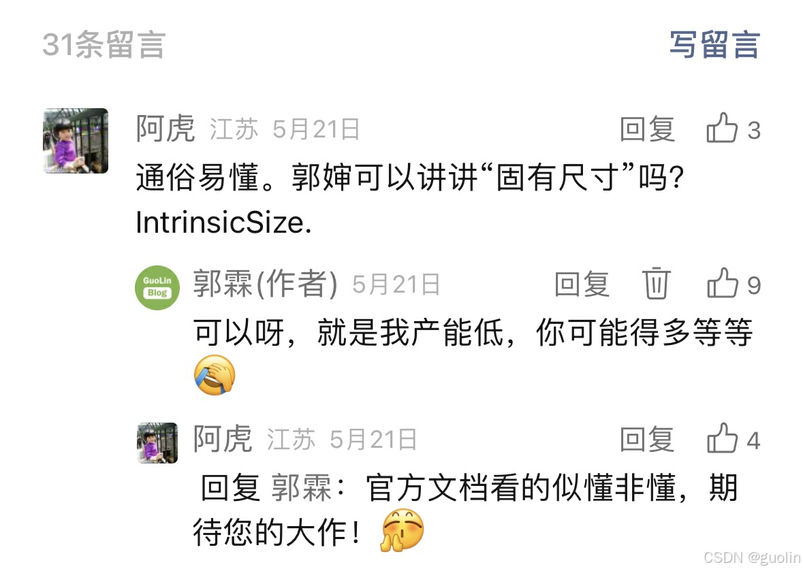
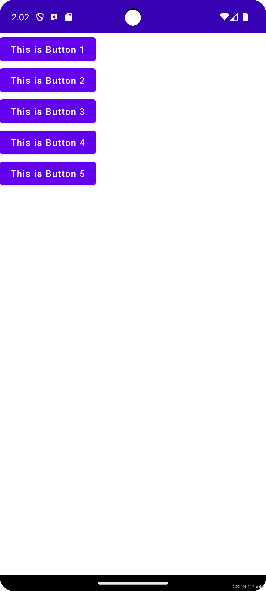
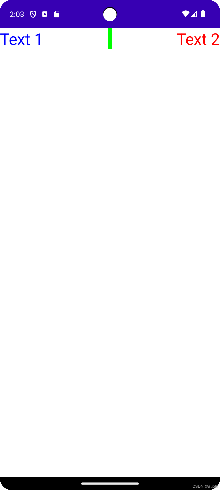
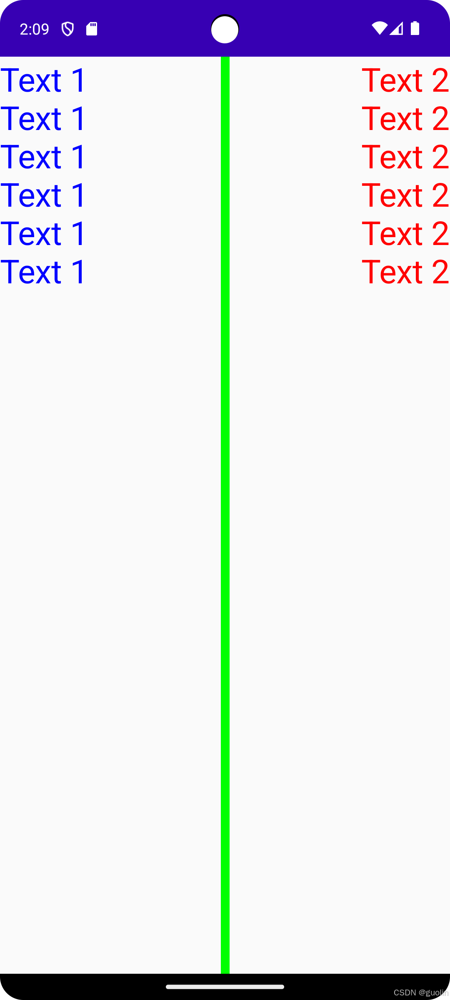

# 6. 高级Layout

> 本文同步发表于我的[微信公众号](https://so.csdn.net/so/search?q=%E5%BE%AE%E4%BF%A1%E5%85%AC%E4%BC%97%E5%8F%B7&spm=1001.2101.3001.7020)，扫一扫文章底部的二维码或在微信搜索 郭霖 即可关注，每个工作日都有文章更新。

大家好，写给初学者的Jetpack Compose教程又更新了。

在本系列上一篇文章 [写给初学者的Jetpack Compose教程，derivedStateOf](../5.%20derivedStateOf/index.md) 的留言中，有位读者朋友说，想要让我写一篇关于IntrinsicSize的文章，官方文档看得似懂非懂。



我的这个Compose系列本来就没有非常严谨的规划，经常是我自己学到了哪里就写哪里。如果大家有特别想看的内容，也可以告诉我，我尽量帮大家给安排上。

关于这个IntrinsicSize，我专门去学习了一下，它的内容其实并不复杂，甚至单独拿出来写一篇文章我认为有点太简单了。所以这篇文章我准备讲一讲Compose的高级Layout知识，顺便引出IntrinsicSize的相关介绍。

Compose的基础控件和布局在 [写给初学者的Jetpack Compose教程，基础控件和布局](../1.%20基础控件和布局/index.md) 这篇文章中已经有比较详细的讲解了，但是这篇文章中使用的都是Compose内置好的布局，如Column、Row、Box等。那么如果我们想要编写一个自定义布局该怎么办呢？这就是本篇文章要介绍的内容了。

首先搬出一张来自官网的Compose工作流程示意图：


可以看到，客户端UI框架的工作，无非就是要把各种各样的数据，转换成UI界面呈现给用户。

至于如何转换呢？主要分成了3个步骤，Composition、Layout和Drawing。

Composition这一步其实就是我们平时写的各种Composable函数，用于告知Compose我们想要编写出一个怎样的界面，最终会构建成一棵UI树（见下图）。对应到View系统中，那就是编写XML这部分。


Layout这一步则是对构建好的UI树进行遍历，测量树中每个节点的尺寸以及在屏幕中放置的位置。对应到View系统中，那就是onMeasure()和onLayout()这部分。

最后，Drawing这一步就是把测量好的所有节点绘制到屏幕上。对应到View系统中，那就是onDraw()这部分。

之前本系列文章的主要内容都是聚焦在Composition这一块，今天就让我们调整一下关注点，来看一看Layout这部分的知识。

Compose的Layout阶段由两部分组成，分别是Measure和Place，也就是测量和放置。

在Layout阶段，Compose的执行逻辑遵循以下规则：

- 测量当前布局下每个子控件的尺寸。
- 根据子控件测量的结果约定自身的尺寸。
- 将子控件放置在合理的位置上。

将这个规则应用到上图中的Compose UI树的话，那么Layout这部分的执行流程将会是以下步骤：

- 测量Row布局下的所有子控件，也就是Image和Column
- Image被测量，并且由于Image没有子控件了，因此它可以直接决定自身的尺寸，并返回给Row。
- Column被测量，由于Column下还有两个Text子控件，因此Column的尺寸暂时是不能决定的，要先测量子控件才行。
- 第一个Text被测量，由于Text没有子控件了，因此它可以直接决定自身的尺寸，并返回给Column。
- 第二个Text被测量，由于Text没有子控件了，因此它可以直接决定自身的尺寸，并返回给Column。
- Column根据子控件返回的尺寸来决定自身的尺寸，并将两个Text子控件按纵向进行放置，最后返回给Row。
- Row根据子控件返回的尺寸来决定自身的尺寸，并将Image和Column两个子控件按横向进行放置。

这就是你在Composition阶段写好界面之后，Compose在Layout阶段所做的事情。

你会发现，在整个Layout过程中，UI树中的每个节点都只会被访问一次。

这一点至关重要，因为在Compose的Layout设计上，父布局和子控件之间是不用反复沟通来确认尺寸的，只要一次遍历所有尺寸就都确定下来了。

也正是得益于此，用Compose来写界面是不怕UI嵌套的，即使再深的嵌套也不会影响性能，因此它始终是一个线性级别的耗时。

而相比之下，View在测量和放置的过程中则会出现多次执行的情况，详情可以参考这篇文章 [View为什么会至少进行2次onMeasure、onLayout](https://www.jianshu.com/p/733c7e9fb284) 。

调用一次和调用两次看上去差别也并不大，但实际上，如果你的布局嵌套很深的话，在性能上的开销就会变成指数级的上升。假如你的布局有10层嵌套，每一层的onMeasure都会执行两次，那么最底层的那个布局就需要measure 2^10次。

所以在View体系当中，Google一直不推荐将布局嵌套太深，因为这太影响性能了。而Compose则可以无视这个规则，甚至是为了一些更好的封装和复用，反而推荐你嵌套的更深。

现在你已经了解了Compose在Layout阶段的执行流程，理论知识就算是已经掌握好了。接下来让我们通过一个实际的例子来看看如何基于这套理论编写一个自定义布局。

编写自定义布局需要用到的最重要的一个函数就是Compose提供的Layout函数，事实上，几乎所有的Compose控件都是基于Layout函数打造出来的。

这里我打算实现一个简易的纵向排列布局，类似于Column的效果。使用Layout函数我们可以比较简单地完成这个功能，代码如下：

```kotlin
@Composable
fun MyColumn(modifier: Modifier = Modifier, content: @Composable () -> Unit) {
    Layout(modifier = modifier, content = content) { measurables, constraints ->
        val placeables = measurables.map {
            it.measure(constraints)
        }
        val layoutWidth = placeables.maxOf { it.width }
        val layoutHeight = placeables.sumOf { it.height }
        layout(layoutWidth, layoutHeight) {
            var y = 0
            for (placeable in placeables) {
                placeable.placeRelative(x = 0, y = y)
                y += placeable.height
            }
        }
    }
}
```

这段代码并不长，但我还是要详细地解释一下，因此关于Compose自定义布局最核心的代码都在这里了。

Layout函数接收3个参数，modifier、content以及MeasurePolicy。

modifier这个相信大家已经不陌生了，几乎所有的Composable函数都会有这样一个参数。对modifier还不子解的朋友可以参考 [写给初学者的Jetpack Compose教程，Modifier](../2.%20Modifier/index.md) 这篇文章。

content就是我们这个布局中要放入哪些内容，比如要包含什么子控件。通常这里传入一个@Composable高阶函数回调，这样就可以在外部调用的地方去指定content内容了。

MeasurePolicy则是用于指定如何去测量和放置，这也是自定义布局中最重要的部分。

由于MeasurePolicy接口中只有一个未实现的measure函数，符合Kotlin Lambda表达式的语法糖规则，因此通常会使用闭包代码块的方式来实现，上述代码中Layout函数的代码块其实就是我们传入的MeasurePolicy参数。

在这个代码块中，首先会传入measurables和constraints这两个参数，measurables用于告诉我们有哪些子布局可以去测量，constraints则用于对子布局的尺寸进行约束，具体一点就是限定子布局所允许的最大和最小宽高。

有了这两个参数之后，我们就可以遍历measurables中的所有可测量子布局，每别调用它们的measure函数来测量它们的尺寸，并将测量的结果赋值给placeables这个集合变量。

在得到所有子布局测量好的尺寸之后，我们选择其中最宽的子布局的宽度来作为我们自定义布局MyColumn的宽度，选择所有子布局高度的总和来作为MyColumn的高度。这样MyColumn的宽高就都确定下来了。

确定好了MyColumn的宽高之后，接下来调用layout函数来使这个宽高生效，并开始对子布局进行放置。注意虽然名字很像，但这是小写的layout函数，它的作用以及接收的参数都和刚才大写的Layout函数完全不同。

最后一步，通过循环对每个子布局进行放置。放置子布局主要是通过调用Placeable的placeRelative函数来实现，这个Placeable对象就是刚才调用measure函数测量后得到的。我们给placeRelative函数传入x、y坐标来设置子布局的位置，上述代码实现的就是将所有子布局向上到下纵向排列的效果。

将整段代码解析完之后，我们再重新回顾一下，你会发现，这段代码是严格按照刚才介绍的Compose在Layout阶段的执行逻辑去工作的，即：

- 测量当前布局下每个子控件的尺寸。
- 根据子控件测量的结果决定自身的尺寸。
- 将子控件放置在合理的位置上。

整个Compose UI树中的每个节点都是使用的这段逻辑进行Layout，也就实现了单次节点访问即可测量所有控件尺寸的功能。

现在我们来尝试使用一下自定义的MyColumn布局吧，用法和普通Column基本一致，代码如下：

```kotlin
@Composable
fun SimpleWidgetColumn() {
    MyColumn(modifier = Modifier.wrapContentSize(align = Alignment.TopStart)) {
        for (i in 1..5) {
             Button(onClick = {}) {
                 Text(
                    text = "This is Button $i",
                    color = Color.White,
                )
             }
        }
    }
}
```

这里我们通过for循环，在MyColumn的内部放置了5个Button，运行一下程序，效果如下图所示：



5个按钮依次从上到下排列，纵向排列布局的效果也就实现了。

这虽然只是一个很简单的例子，但Compose在Layout阶段所有复杂的逻辑都是建立在这基础之上的。掌握了这些，你也就掌握了Compose高级Layout的知识。

不过文章到这里还没完，讲了这么多Layout相关的知识，开篇读者朋友提到的IntrinsicSize和这又有什么关系呢？

是的，我还没忘，文章要讲究首尾呼应，现在我们要把开篇的这个问题给解决了。

之所以要现在才讲IntrinsicSize，是因为它是Compose体系中少有的可以打破单次节点访问测量的场景。

而正如我前面所说，IntrinsicSize并不复杂，我通过一个例子就能让大家快速了解它的作用了。

假设我们要实现一个非常简单的布局，左右各放置两个Text控件，中间使用一条竖线分割。这代码要怎么写呢？下面是一种写法示例：

```kotlin
@Composable
fun SimpleTextRow(modifier: Modifier = Modifier) {
    Box(modifier.fillMaxWidth()) {
        Text(
            text = "Text 1",
            color = Color.Blue,
            fontSize = 30.sp, modifier = modifier.align(Alignment.TopStart)
        )

        Divider(
            modifier = modifier
                .width(8.dp)
                .height(40.dp)
                .align(Alignment.TopCenter),
            color = Color.Green
        )

        Text(
            text = "Text 2",
            color = Color.Red,
            fontSize = 30.sp, modifier = modifier.align(Alignment.TopEnd)
        )
    }
}
```

可以看到，我们在Box布局当中放置了3个控件，两个Text分别居左和居右对齐，Divider分隔线居中对齐。

是不是非常简单？现在运行一下程序，效果如下图所示：



效果已经出来了，但是不知道大家有没有发现一个问题，这里Divider分隔线的高度是固定值40dp。这也就意味着，如果Text的高度发生了变化，分隔线的高度是不会跟着变的。

比如我们通过增加文本内容来改变两个Text控件的高度：

```kotlin
@Composable
fun SimpleTextRow(modifier: Modifier = Modifier) {
    Box(modifier.fillMaxWidth()) {
        Text(
            text = "Text 1\nText 1\nText 1\nText 1\nText 1\nText 1",
            color = Color.Blue,
            fontSize = 30.sp, modifier = modifier.align(Alignment.TopStart)
        )

        Divider(
            modifier = modifier
                .width(8.dp)
                .height(40.dp)
                .align(Alignment.TopCenter),
            color = Color.Green
        )

        Text(
            text = "Text 2\nText 2\nText 2\nText 2\nText 2\nText 2",
            color = Color.Red,
            fontSize = 30.sp, modifier = modifier.align(Alignment.TopEnd)
        )
    }
}
```

然后重新运行程序，效果如下图所示：


这个结果基本是符合预期的，毕竟分隔线的高度是写死的。

但是我猜这一定不是大家期望中的效果，大家一定是期望这个分隔线的高度能够随着Text高度的变化而自适应变化。

这要怎么写呢？把Divider的高度设置成fillMaxHeight可行吗：

```kotlin
@Composable
fun SimpleTextRow(modifier: Modifier = Modifier) {
    Box(modifier.fillMaxWidth()) {
        ...
        Divider(
            modifier = modifier
                .width(8.dp)
                .fillMaxHeight()
                .align(Alignment.TopCenter),
            color = Color.Green
        )
        ...
    }
}
```

重新运行程序后还是得不到我们想要的效果：



这个问题之所以不好解决，是因为它不符合传统的布局测量规则。

刚才有说过，Compose在Layout阶段，每个布局都会先测量自己所有子控件的尺寸，然后再根据测量的结果决定自身的尺寸。

但是很明显，这里Divider分隔线并不想决定自己的高度，而是想去适配两个Text控件的高度。

那到底该如何实现自适应高度的分隔线呢？这个时候IntrinsicSize终于要登场了。

IntrinsicSize可以打破传统的Compose测量规则，它允许子布局在被测量之前先去查询子布局的信息，从而让父布局提前于子布局先确定自己的尺寸。

观察如下代码：

```kotlin
@Composable
fun SimpleTextRow(modifier: Modifier = Modifier) {
    Box(modifier.fillMaxWidth().height(IntrinsicSize.Max)) {
        Text(
            text = "Text 1\nText 1\nText 1\nText 1\nText 1\nText 1",
            color = Color.Blue,
            fontSize = 30.sp, modifier = modifier.align(Alignment.TopStart)
        )

        Divider(
            modifier = modifier
                .width(8.dp)
                .fillMaxHeight()
                .align(Alignment.TopCenter),
            color = Color.Green
        )

        Text(
            text = "Text 2\nText 2\nText 2\nText 2\nText 2\nText 2",
            color = Color.Red,
            fontSize = 30.sp, modifier = modifier.align(Alignment.TopEnd)
        )
    }
}
```

这里我们只是给父布局Box设置了一个height，并将值指定成IntrinsicSize.Max。

这是什么意思呢？这表示Box布局不会遵守Compose传统的测量规则，而是会先去询问子布局，要让所有内容都正常显示，最大需要多少高度？而这个高度就是两个Text控件的高度。Box会使用这个高度来做为自身的高度。

Box布局确认好了高度之后，Divider分隔线再去fillMaxHeight()那么自然也就是保持高度和Box一致，所以最终效果如下图所示：


IntrinsicSize还有另外一个IntrinsicSize.Min的值可选，它表达的语义就是，要让所有内容都正常显示，最小需要多少高度。不过在我们这个例子当中这两个值的效果是一样的，就不给大家演示了。

最后还有一个问题，IntrinsicSize是如何定义让一个控件的内容能够正常显示所需要的最大或最小高度是多少呢？

对于绝大部分的Compose自带控件，这个事情就不需要你操心了，它们的内部都有一套非常合理的计算机制。

而如果是对于你自己开发的自定义控件，你也可以通过重写以下函数来自行设置你的规则：

```kotlin
@Composable
fun MyColumn(modifier: Modifier = Modifier, content: @Composable () -> Unit) {
    val measurePolicy = object : MeasurePolicy {
        override fun MeasureScope.measure(
            measurables: List<Measurable>,
            constraints: Constraints
        ): MeasureResult {
            ...
        }

        override fun IntrinsicMeasureScope.maxIntrinsicHeight(
            measurables: List<IntrinsicMeasurable>,
            width: Int
        ): Int {
            ...
        }

    }
    Layout(modifier = modifier, content = content, measurePolicy = measurePolicy)
}
```

可以看到，自定义控件在指定MeasurePolicy时，除了必须实现的measure函数之外，还有一些可选的函数可去重写。

在这里指定你认为合理的IntrinsicSize值，那么Compose就会使用你提供的值来去工作了。

好了，Compose高级Layout篇到这里结束，我们下篇原创文章再见。

___

Compose是基于Kotlin语言的声明式UI框架，如果想要学习Kotlin和最新的Android知识，可以参考我的新书 **《第一行代码 第3版》**，[点击此处查看详情](https://guolin.blog.csdn.net/article/details/105233078)。
