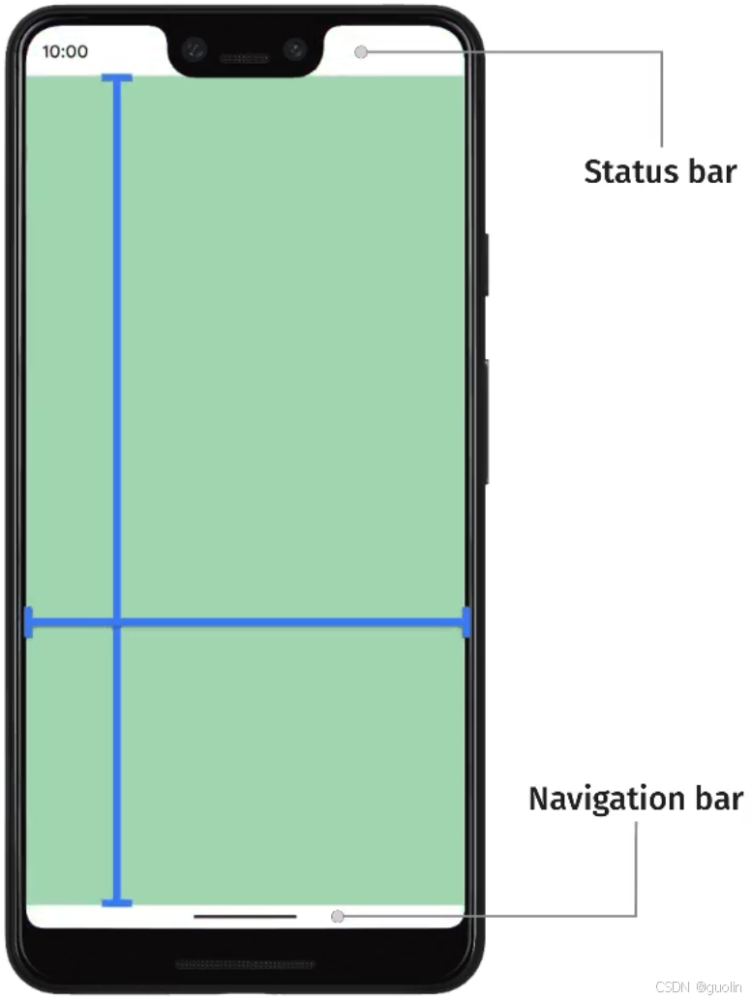
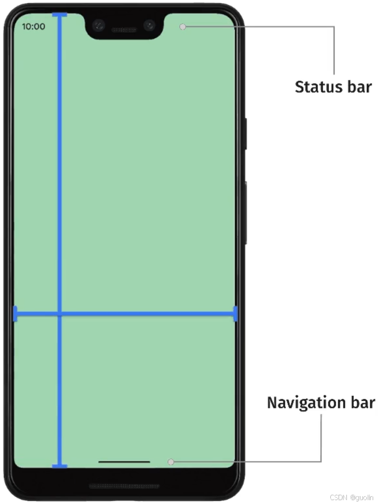
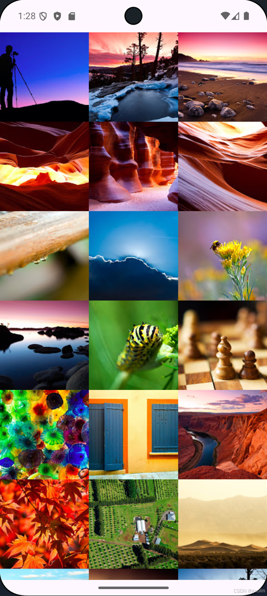
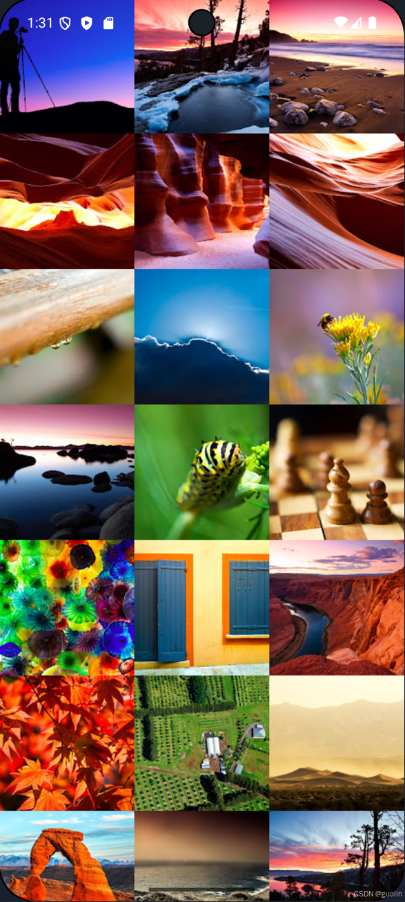
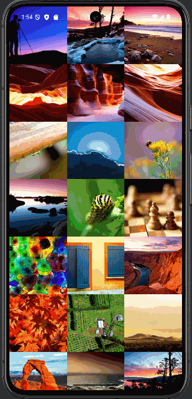
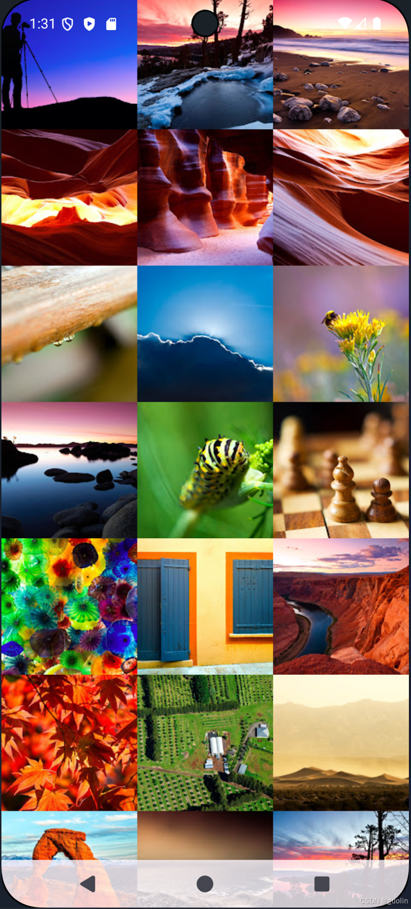
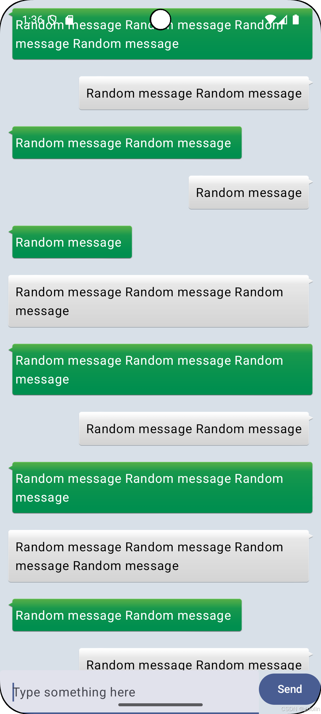
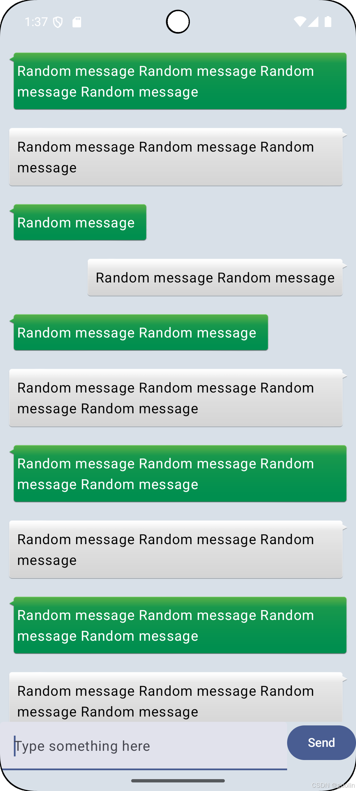
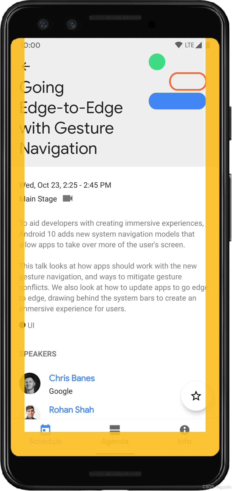

# 7. edge-to-edge全面屏体验

> 本文同步发表于我的[微信公众号](https://so.csdn.net/so/search?q=%E5%BE%AE%E4%BF%A1%E5%85%AC%E4%BC%97%E5%8F%B7&spm=1001.2101.3001.7020)，扫一扫文章底部的二维码或在微信搜索 郭霖 即可关注，每个工作日都有文章更新。

在上一篇原创文章中，我介绍了Android 15的一个重要变化，那就是会强制App启用edge\-to-edge全面屏体验，详情请参考 [Android 15新特性，强制edge-to-edge全面屏体验](https://guolin.blog.csdn.net/article/details/141500877) 。

不过上面这篇文章是基于View系统来进行讲解的，既然是Android 15的一个重要变化，那么理应也该有一份Compose版的教程。于是，写给初学者的Jetpack Compose教程又更新了。

今天文章的讲解方式以及文章中使用的例子，都会和上篇文章保持一致。不同之处在于，本篇文章我会把所有例子的源码直接贴在文章中，这主要还是得益于用Compose来写UI代码实在是太简洁了，代码不会占据过多的篇幅。

其实edge-to-edge全面屏体验并不是什么全新的功能，早在Android 15之前就已经支持了。

但是这个功能推出了很多年，仍然有大量的应用程序没有对全面屏体验进行适配。所以，在这次的Android 15更新中，Google终于下决心要强推这个功能，以让所有应用程序都能达到更好的体验。

需要说明的是，只有将App的targetSdk指定到35或更高时，Android 15才会强制启用edge-to-edge功能。所以，如果你就是不想适配，那么只要不升级targetSdk的版本就行了。

下面开始进入正题，首先跟大家介绍一下到底什么是edge-to-edge全面屏体验。

其实简单来讲，就是让App的界面延伸到手机屏幕的全部空间，这样可以带来更加沉浸式的用户体验。

事实上，绝大多数的App都没有将界面延伸到手机屏幕的全部空间，因此它们本可以提供更好的用户体验。

这里说的手机屏幕的全部空间具体指的是什么呢？我们看下面这张图就能快速了解了。



绝大部分的App其实都只使用了绿色这部分的空间，屏幕上方的状态栏以及屏幕下方的导航栏这两个白色部分的空间都是没有利用起来的，想想你写的App是不是也是这样？

而edge-to-edge全面屏体验就是要将所有的空间都利用起来，如下图所示。



从上面的两张图对比来看，或许有些朋友并不会觉得edge-to-edge效果带来了多少用户体验的提升。其实这个主要还是得看App的界面设计是什么样的，不同的界面对应出来的edge-to-edge效果也是完全不同的。

这里就让我用一个照片墙App来进行演示吧。

需要注意的是，一开始我们将项目的targetSdk指定的是34，也就是默认不会强制启用edge-to-edge功能。

```groovy
defaultConfig {
    ...
    targetSdk = 34
}
```

由于照片墙毕竟是需要展示图片的，因此这里我们再引入一个Compose专门的图片加载库：coil-compose库。

```groovy
dependencies {
    implementation("io.coil-kt:coil-compose:2.7.0")
}
```

另外记得要在AndroidManifest.xml文件中添加网络权限。

```xml
<manifest xmlns:android="http://schemas.android.com/apk/res/android"
    xmlns:tools="http://schemas.android.com/tools">
    <uses-permission android:name="android.permission.INTERNET" />
    ...
</manifest>
```

做好以上准备之后，接下来我们开始编写照片墙的代码。

由于Compose编写UI界面的优越性，一个照片墙效果借助LazyVerticalGrid控件只需要短短几行代码就能实现了。

```kotlin
private val imageList = listOf(
    ...
)

class MainActivity : ComponentActivity() {

    override fun onCreate(savedInstanceState: Bundle?) {
        super.onCreate(savedInstanceState)
        setContent {
            Edge2EdgeComposeSampleTheme {
                Album()
            }
        }
    }
}

@Composable
fun Album() {
    LazyVerticalGrid(
        columns = GridCells.Fixed(3)
    ) {
        items(imageList) { imageUrl ->
            AsyncImage(
                model = imageUrl,
                contentScale = ContentScale.Crop,
                contentDescription = ""
            )
        }
    }
}
```

这里我们给LazyVerticalGrid指定了每行显示3张图片的照片墙效果，所有图片均来自于网络，我在源码中将图片的链接地址省略了，大家可在imageList里填入你自己的图片链接。

现在将项目运行到Android 15设备上，效果如下图所示。



这个照片墙效果当然不能说是差，只能说中规中矩。毕竟在没有edge-to-edge全面屏体验之前，所有的App都只能做到这个效果。

那么现在有了edge-to-edge功能之后呢？我们来对比看看效果吧。让你的App支持edge-to-edge非常简单，只需要将targetSdk指定成35或更高，就会自动变成edge-to-edge全面屏效果了，如下图所示。



怎么样，这样一对比，照片墙的沉浸感体验是不是立马就上来了？而且edge-to-edge效果看久了之后，你就再也回不去之前的UI效果了。

另外再说一些关于edge-to-edge全面屏体验的细节。当我们在照片墙上进行滚动时，你会发现屏幕底部导航条的颜色会随着滚动而发生变化。



这个是Android系统自带的功能，为了保证在启用了edge-to-edge全面屏体验之后，底部导航条不会因为因为背景的原因而难以识别。

发现了这个现象之后，可能细心的朋友立马就察觉到了，那如果我手机底部的导航栏模式不是这种手势导航栏，而是传统的Back、Home、Task 3按键导航栏，edge-to-edge全面屏体验会变成什么样呢？

这个结果估计大多数人都猜不到，我们直接来看效果截图吧。



可以看到，导航栏变成了一种半透明的效果，不透明度默认是80%。

从这个效果上我们也可以看出，3按键导航栏在edge-to-edge全面屏体验方面是完全落后的，这种模式后面就会逐渐被Android系统边缘化了。

同时被边缘化的还有一些与状态栏、导航栏颜色设置相关的API，这些API由于和edge-to-edge全面屏体验是相冲突的，有些是现在就已经不能用了，有些是已经不再推荐使用，反正大家看完这篇文章之后尽量就别再使用下面这些API了：

```txt
Window#setStatusBarColor
Window#setStatusBarContrastEnforced
Window#setNavigationBarColor
Window#setNavigationBarContrastEnforced
```

文章看到这里，edge-to-edge全面屏体验就已经成功启用了。

但是我们实际上只是将targetSdk从34指定成了35而已。所以，适配edge-to-edge真的一行代码都不用写吗？

当然不是，需不需要对edge-to-edge进行额外的适配工作，主要还是取决于你的界面是什么样的。

像刚才的照片墙界面，由于它非常适合填充满手机屏幕的全部空间，即使我们不做任何的适配，用户体验仍然是非常好的。

但是换一个其他的界面就未必如此了。

这里我使用[《第一行代码 第3版》](https://guolin.blog.csdn.net/article/details/105233078)第4章的最佳实践项目来作为例子进行演示，看过的读者朋友们应该都知道这是一个聊天框界面。

那么今天我们就用Compose来实现一个效果一模一样的聊天框界面。

首先，定义一个Msg类，做为聊天信息的实体类。

```kotlin
class Msg(val content: String, val type: Int) {
    companion object {
        const val TYPE_RECEIVED = 0
        const val TYPE_SENT = 1
    }
}
```

然后，定义一个ChatActivity，并在这里编写聊天框界面。

```kotlin
private val msgList = ArrayList<Msg>()

class ChatActivity : ComponentActivity() {

    override fun onCreate(savedInstanceState: Bundle?) {
        super.onCreate(savedInstanceState)
        initMsg()
        setContent {
            Edge2EdgeComposeSampleTheme {
                var userInput by remember { mutableStateOf("") }
                ChatLayout(userInput) { newValue ->
                    userInput = newValue
                }
            }
        }
    }

    private fun initMsg() {
        repeat(16) { i ->
            val msgType = if (i % 2 == 0) Msg.TYPE_RECEIVED else Msg.TYPE_SENT
            val msg = Msg("Random message ".repeat(Random.nextInt(1, 5)), msgType)
            msgList.add(msg)
        }
    }
}

@Composable
fun ChatLayout(inputValue: String, modifier: Modifier = Modifier, onValueChange: (String) -> Unit) {
    val chatMessages = remember {
        mutableStateListOf<Msg>().apply {
            addAll(msgList)
        }
    }
    val lazyListState = rememberLazyListState()
    val coroutineScope = rememberCoroutineScope()

    Column(
        modifier = modifier
            .fillMaxSize()
            .background(color = Color(0xffd8e0e8))
    ) {
        LazyColumn(
            state = lazyListState,
            modifier = modifier
                .fillMaxWidth()
                .height(0.dp)
                .weight(1f)
        ) {
            items(chatMessages) { msg ->
                Box(
                    modifier = modifier
                        .fillMaxWidth()
                        .wrapContentHeight()
                ) {
                    Box(
                        modifier = modifier
                            .wrapContentSize()
                            .align(if (msg.type == Msg.TYPE_RECEIVED) Alignment.CenterStart else Alignment.CenterEnd)
                            .padding(10.dp)
                            .draw9Patch(
                                context = LocalContext.current,
                                ninePatchRes = if (msg.type == Msg.TYPE_RECEIVED) R.drawable.message_left else R.drawable.message_right
                            )
                    ) {
                        Text(
                            text = msg.content,
                            color = if (msg.type == Msg.TYPE_RECEIVED) Color.White else Color.Black,
                            modifier = modifier.padding(10.dp)
                        )
                    }
                }
            }
        }
        Row(
            modifier = modifier
                .fillMaxWidth()
                .wrapContentHeight()
        ) {
            TextField(
                modifier = modifier
                    .width(0.dp)
                    .weight(1f),
                value = inputValue,
                onValueChange = onValueChange,
                placeholder = { Text("Type something here") }
            )
            Button(onClick = {
                if (inputValue.isNotEmpty()) {
                    chatMessages.add(Msg(inputValue, Msg.TYPE_SENT))
                    onValueChange("")
                    coroutineScope.launch {
                        lazyListState.animateScrollToItem(chatMessages.size - 1)
                    }
                }
            }) {
                Text(text = "Send")
            }
        }
    }
}

fun Modifier.draw9Patch(
    context: Context,
    @DrawableRes ninePatchRes: Int,
) = this.drawBehind {
    drawIntoCanvas {
        ContextCompat.getDrawable(context, ninePatchRes)?.let { ninePatch ->
            ninePatch.run {
                bounds = Rect(0, 0, size.width.toInt(), size.height.toInt())
                draw(it.nativeCanvas)
            }
        }
    }
}
```

代码虽然有点长，但是上述代码中用到的所有Compose控件都是我们在本系列教程中学过的，所以应该不难理解，我就不具体进行解释了。

如果上述代码完全看不懂，请先去阅读本系列教程的前面文章。

我们来看下聊天框界面在edge-to-edge全面屏体验下的效果是什么样的吧，直接上截图。



可以看到，这次的效果就没有那么理想了。聊天内容进入了状态栏区域，导致部分文字内容和状态栏重叠不易阅读，输入框和发送按钮则进入了导航栏区域，导致输入框和按钮操作可能会受到影响。

这些就是最典型的edge-to-edge全面屏体验所带来的问题，而这也正是我们需要去适配的地方。

适配的代码其实还是比较简单的，主要就是借助Compose提供的一些内置函数，来对某些指定的控件进行偏移，保证其不会被系统的状态栏或导航栏遮挡住就可以了。

对应到当前的界面，那就是要让顶部的聊天内容不要进入状态栏区域，底部的输入框和发送按钮不要进入导航栏区域，代码如下所示。

```kotlin
@Composable
fun ChatLayout(...) {
    Column(
        ...
    ) {
        LazyColumn(
            modifier = modifier
                ...
                .statusBarsPadding()
        ) {
            ...
        }
        Row(
            modifier = modifier
                ...
                .navigationBarsPadding()
        ) {
            ...
        }
    }
}
```

由于我们不希望聊天内容进入状态栏区域，因此这里给包含聊天内容的LazyColumn增加了一个statusBarsPadding，从而保证聊天内容不进入状态栏区域。

类似地，我们不希望输入框和发送按钮进入导航栏区域，那么这里给包含输入框和发送按钮的Row增加了一个navigationBarsPadding。

加上这一段代码之后，重新运行程序就可以得到比较理想的效果了，如下图所示。



statusBarsPadding()和navigationBarsPadding()都是Compose内置的专门用于解决Insets问题的函数。除此之外，Compose还提供了许多其他有用的函数。

- safeDrawingPadding() 可以保护Compose控件的内容不会绘制到任何系统UI的区域，包括状态栏、导航栏、刘海区域等，可以说是最常用的一种Insets处理函数。
- safeGesturesPadding() 从Android 10开始，Google引入了手势导航，这使得手机屏幕的左右两侧可以用于触发Back键操作，手机屏幕的底部可以用于触发Home键操作。如果我们设计的界面在这个区域有正好类似的手势操作，那么就会出现手势冲突的情况。safeGesturesPadding()则保护了避免发生和系统手势冲突的情况。系统手势触发区域如下图中的黄色部分所示。
- safeContentPadding() 这个比较好理解，它就是safeDrawingPadding()和safeGesturesPadding()的结合，保证界面和手势都不会与系统UI发生冲突覆盖的情况。



除了以上介绍的这些最常用的函数之外，Compose还提供了许多用于解决其他场景问题的Insets函数，包括曲面屏手机、输入法弹出等等场景。由于函数众多，这里就不一一展开了，想要进一步了解的朋友可以参考官方文档。

[https://developer.android.com/develop/ui/compose/layouts/insets](https://developer.android.com/develop/ui/compose/layouts/insets)

另外如果你使用了一些Compose Material 3的控件，如TopAppBar、BottomAppBar、NavigationBar等等，它们会自动帮你处理Insets的问题，就不需要我们再手动进行适配了。

基本上关于edge-to-edge全面屏适配要讲的内容也就是这些了，适配的代码还是比较简单的。但是由于它影响到的是所有的项目，而每个项目的UI界面复杂度都各不相同，因此具体会对大家带来多少影响可能还得要大家自己去评估了。

最后，开篇的时候提到过，edge-to-edge全面屏体验其实并不是全新的功能，在Android 15之前也是支持的，Android 15只是将这个功能强制开启了而已。

那么如果我们已经为edge-to-edge全面屏体验做好了适配，就没有任何理由只在Android 15上启用，当然是启用的设备越多越好。

要在Android 15之前的设备上启用edge-to-edge全面屏体验，只需要额外再多做一步就可以了。

```kotlin
class MainActivity : ComponentActivity() {

    override fun onCreate(savedInstanceState: Bundle?) {
        enableEdgeToEdge()
        super.onCreate(savedInstanceState)
        ...
    }
}
```

这样edge-to-edge全面屏体验就可以在Android 15之前的设备上启用了，最早可以支持到Android 6.0的设备。

好了，关于edge-to-edge全面屏体验的所有介绍就到这里，我们下篇原创再见。

___

Compose是基于Kotlin语言的声明式UI框架，如果想要学习Kotlin和最新的Android知识，可以参考我的新书 **《第一行代码 第3版》**，[点击此处查看详情](https://guolin.blog.csdn.net/article/details/105233078)。
