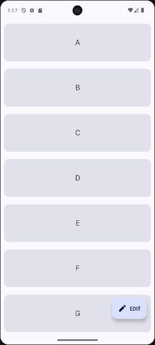
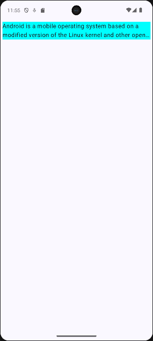
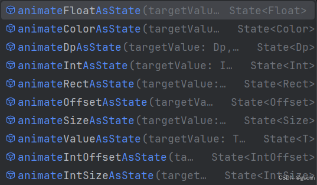
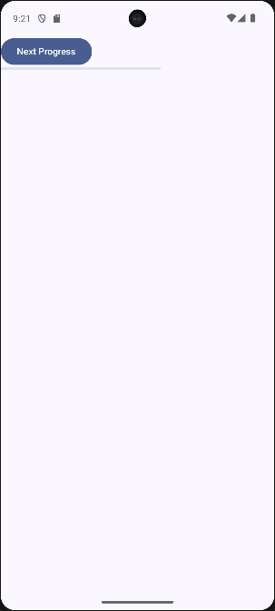
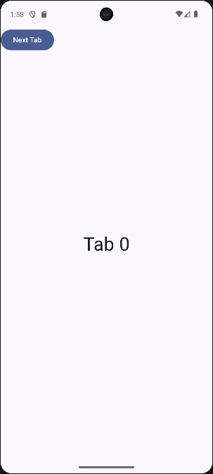
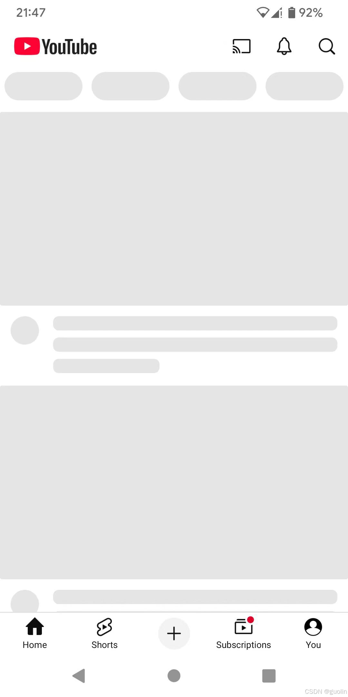
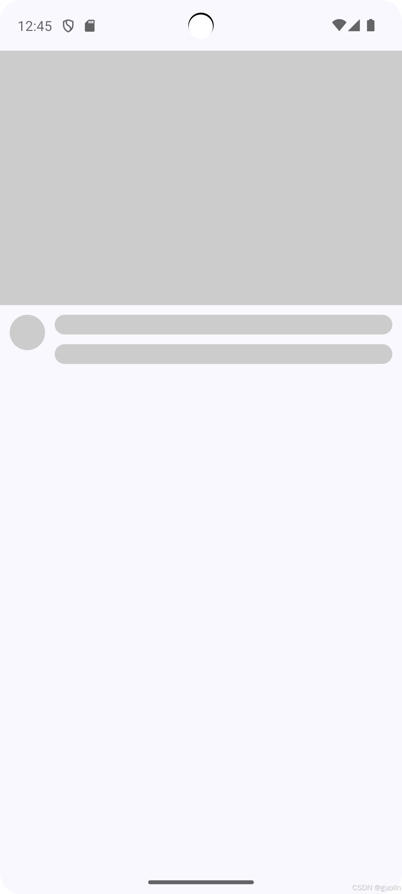
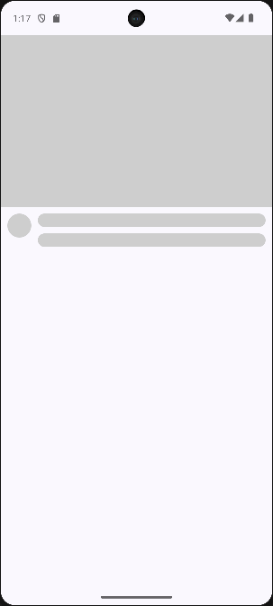
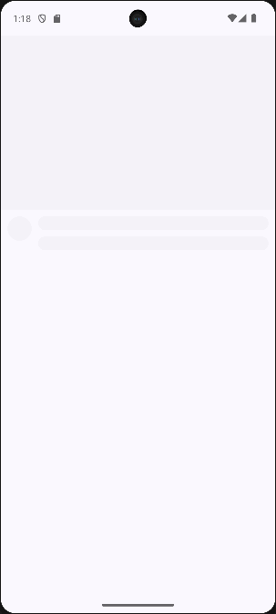

# 8. 动画

大家好，写给初学者的Jetpack Compose教程又更新了。

今天来讲一讲Compose动画方面的知识。

其实我并不是很擅长写动画相关的内容，《第一行代码》整本书里面我都没有写过任何讲解动画的知识。当然书本静态纸张不容易表达动画的效果可能也是我没有写动画的原因之一。

而在博客里，我总共只写过3篇讲解动画知识的文章，分别是：

- [Android属性动画基础用法](https://guolin.blog.csdn.net/article/details/43536355)
- [Android属性动画进阶用法](https://guolin.blog.csdn.net/article/details/43816093)
- [Android属性动画高级用法](https://guolin.blog.csdn.net/article/details/44171115)

上面这3篇文章讲的都是基于[Android](https://so.csdn.net/so/search?q=Android&spm=1001.2101.3001.7020) View系统的属性动画。

虽说属性动画最初的设计理念就是要脱离View的限定，围绕属性的概念重新打造。但最终属性动画虽然能够脱离View这个类，却仍然脱离不了Android View这一整套的UI绘制体系。因此想要把之前的属性动画直接搬到Compose上来使用还是比较困难的。

不过我们也确实完全没有必要这么做，因为Google给Compose设计了一套全新的动画框架，并且用法也完全贴合Compose的声明式UI的写法。

很快你就会知道，在Compose中编写动画是件非常简单的事情。当然，Compose也提供了很多高级API来编写复杂的[动画效果](https://so.csdn.net/so/search?q=%E5%8A%A8%E7%94%BB%E6%95%88%E6%9E%9C&spm=1001.2101.3001.7020)，本篇文章中也会涉及一些高级动画的用法，但整体上还是会以Compose动画的简单用法为主。

另外，Compose的动画功能高度依赖Compose的State概念，如果你还不了解Compose State的话，请先去阅读 [写给初学者的Jetpack Compose教程，使用State让界面动起来](../3.%20State/index.md) 。

## AnimatedVisibility

AnimatedVisibility应该是整个Compose动画体系里最简单的一个函数了，那么我们就从它开始学起吧。

为了能够更好地演示AnimatedVisibility的作用，这里我从 [写给初学者的Jetpack Compose教程，Lazy Layout](../4.%20Lazy%20Layout/index.md) 这篇文章中找了一个我们之前学习过的例子，并稍微进行了一点改造。

下面的代码会实现一个可滚动的列表和一个Fab按钮，默认情况下Fab按钮会显示在页面的右下角并且处于展开状态，当用户向下[滚动列表](https://so.csdn.net/so/search?q=%E6%BB%9A%E5%8A%A8%E5%88%97%E8%A1%A8&spm=1001.2101.3001.7020)时，我们就认为用户可能不再需要和Fab按钮交互，此时将按钮进行收缩。

```kotlin
@Composable
fun MainLayout(modifier: Modifier = Modifier) {
    val state = rememberLazyListState()
    Box(modifier = modifier) {
        ScrollableList(state)
        val isExpand by remember {
            derivedStateOf { state.firstVisibleItemIndex == 0 }
        }
        EditFab(
            isExpand,
            modifier
                .align(Alignment.BottomEnd)
                .padding(20.dp)
        )
    }
}

@Composable
fun ScrollableList(state: LazyListState) {
    val list = ('A'..'Z').map { it.toString() }
    LazyColumn(state = state) {
        items(list) { letter ->
            Card(
                modifier = Modifier
                    .fillMaxWidth()
                    .height(120.dp)
                    .padding(10.dp)
            ) {
                Text(
                    text = letter,
                    textAlign = TextAlign.Center,
                    fontSize = 20.sp,
                    modifier = Modifier
                        .fillMaxSize()
                        .wrapContentHeight(Alignment.CenterVertically)
                )
            }
        }
    }
}

@Composable
fun EditFab(isExpand: Boolean, modifier: Modifier = Modifier) {
    FloatingActionButton(
        onClick = { },
        modifier = modifier
    ) {
        Row(
            modifier = Modifier.padding(horizontal = 16.dp)
        ) {
            Icon(
                imageVector = Icons.Default.Edit,
                contentDescription = null
            )
            if (isExpand) {
                Text(
                    text = "EDIT",
                    modifier = Modifier
                        .padding(start = 8.dp, top = 3.dp)
                )
            }
        }
    }
}
```

这段代码并没有涉及什么新知识点，都是本系列文章前面讲过的内容，所以应该不需要什么解释，运行一下程序，效果如下图所示。



可以看到，一开始右下角的Fab按钮是处于展开状态的，如果我们向下滚动列表，Fab按钮会变成收缩状态，再次向上滚动Fab按钮又会变成展开状态。

功能虽然是有了，但是看上去可能并不美观。因为Fab按钮的展开和收缩是通过更改isExpand这个变量的值来完成的，显示和隐藏都是一个瞬时行为，没有任何的动画效果。

这里如果想要让Fab的展开和收缩有更加丝滑的动画效果，我们就可以借助AnimatedVisibility函数来实现。

AnimatedVisibility的用法非常简单，它本身就能接受一个布尔变量，然后会根据变量的变化自动处理显示和隐藏的动画。

因此，我们只需要将上述代码中的if部分替换成AnimatedVisibility就可以了，如下所示。

```kotlin
fun EditFab(isExpand: Boolean, modifier: Modifier = Modifier) {
    FloatingActionButton(
        onClick = { },
        modifier = modifier
    ) {
        Row(
            modifier = Modifier.padding(horizontal = 16.dp)
        ) {
            Icon(
                imageVector = Icons.Default.Edit,
                contentDescription = null
            )
            AnimatedVisibility(isExpand) {
                Text(
                    text = "EDIT",
                    modifier = Modifier
                        .padding(start = 8.dp, top = 3.dp)
                )
            }
        }
    }
}
```

现在重新运行一下程序，再来看看效果吧。


怎么样？只需要一行代码的改动，我们就让App的用户体验上升了好几个档次。

在Compose中编写动画是不是很简单？

## animateContentSize

简单的部分还没完，接下来我们继续学习简单的动画内容。

刚才学习了通过AnimatedVisibility来控制控件显示和隐藏的动画，但是有时候我们并不想要隐藏或显示整个控件，而是要对其内容做出一些改变，这种情况下就不能再使用AnimatedVisibility了。

观察如下的例子，这是使用了一个Text控件来显示一段文字，点击Text可以让这段文字展开和收缩。

```kotlin
@Composable
fun ExpandableText(text: String, modifier: Modifier = Modifier) {
    var isExpand by remember { mutableStateOf(false) }
    Text(
        text = text, modifier = modifier
            .padding(5.dp)
            .background(Color.Cyan)
            .clickable {
                isExpand = !isExpand
            },
        maxLines = if (isExpand) 10 else 2,
        overflow = TextOverflow.Ellipsis
    )
}
```

可以看到，这里使用了isExpand变量来控制Text是否展开的状态，然后分别在展开和收缩的情况下给Text设置不同的maxLines值，从而实现了让Text能够展开和收缩的功能。每当点击Text控件的时候，我们都会更改一下isExpand当前的状态。

运行上面这段代码，效果如下图所示。



可以看到，让Text控件实现展开和收缩的功能已经有了，但是不够美观，因为没有动画效果，看起来比较僵硬。

这种情况下如果我们想要在Text控件切换展开和收缩状态时加上动画效果，只需要使用animateContentSize函数就可以了。

animateContentSize是Modify类下定义一个动画函数，专门就是用于在控件的内容尺寸发生变化时加入过渡动画效果的。

这个函数的用法非常简单，只需要调用一下就可以了，如下所示。

```kotlin
@Composable
fun ExpandableText(text: String, modifier: Modifier = Modifier) {
    var isExpand by remember { mutableStateOf(false) }
    Text(
        text = text, modifier = modifier
            .padding(5.dp)
            .background(Color.Cyan)
            .animateContentSize()
            .clickable {
                isExpand = !isExpand
            },
        maxLines = if (isExpand) 10 else 2,
        overflow = TextOverflow.Ellipsis
    )
}
```

我们把animateContentSize串接在了当前Modify的调用链路上，这样就能生效了。运行一下程序，效果如下图所示。


可以看到，现在Text的展开和收缩状态切换就更加丝滑了。

## AnimatedContent

刚才我们学习的AnimatedVisibility和animateContentSize函数主要都是用于控制具体某个控件的动画效果。

如果你是想要对比较大的UI范围，例如对整个页面应用一个整体的动画效果，那么可以考虑使用AnimatedContent函数。

现在几乎所有主流的App都会有一个类似的设计，在App的顶部或者是底部提供一排标签栏，点击不同的标签就将界面切换成不同的内容。

这里我通过如下代码实现了一个类似的效果，通过点击按钮来切换不同的标签，从而显示不同的信息。

```kotlin
@Composable
fun DynamicTabContent(modifier: Modifier = Modifier) {
    var tab by remember { mutableIntStateOf(0) }
    Button(onClick = { tab = (tab + 1) % 3 }, modifier = modifier) {
        Text(text = "Next Tab")
    }
    when (tab) {
        0 -> TabZero(modifier)
        1 -> TabOne(modifier)
        2 -> TabTwo(modifier)
    }
}

@Composable
fun TabZero(modifier: Modifier = Modifier) {
    Text(
        text = "Tab 0",
        fontSize = 36.sp,
        modifier = modifier
            .fillMaxSize()
            .wrapContentSize(Alignment.Center)
    )
}

@Composable
fun TabOne(modifier: Modifier = Modifier) {
    Text(
        text = "Tab 1",
        fontSize = 36.sp,
        modifier = modifier
            .fillMaxSize()
            .wrapContentSize(Alignment.Center)
    )
}

@Composable
fun TabTwo(modifier: Modifier = Modifier) {
    Text(
        text = "Tab 2",
        fontSize = 36.sp,
        modifier = modifier
            .fillMaxSize()
            .wrapContentSize(Alignment.Center)
    )
}
```

当然，标签里的内容可以是任意内容，我这里只是简单起见，每个标签页里只放置了一个Text控件。

现在运行一下程序，效果如下图所示。


可以看到，虽然功能已经实现了，但仍然是同样的问题，标签之间的切换是非常僵硬的，没有任何动画效果。

现在我们用AnimatedContent来改良一下，代码如下所示。

```kotlin
@Composable
fun DynamicTabContent(modifier: Modifier = Modifier) {
    var tab by remember { mutableIntStateOf(0) }
    Button(onClick = { tab = (tab + 1) % 3 }, modifier = modifier) {
        Text(text = "Next Tab")
    }
    AnimatedContent(targetState = tab, label = "Tab") { tab ->
        when (tab) {
            0 -> TabZero(modifier)
            1 -> TabOne(modifier)
            2 -> TabTwo(modifier)
        }
    }
}
```

可以看到，我们把标签切换的代码整体用AnimatedContent函数包裹了起来，并把当前tab作为参数传给了AnimatedContent函数。这就意味着每当tab发生变化时，AnimatedContent函数都会执行一段动画效果。

现在重新运行一下程序，效果如下图所示。


默认情况下，AnimatedContent函数执行的动画效果是让界面上的内容淡入淡出。如果这并不是你想要的动画效果，没有关系，我们下面很快就会讲到如何定制任意你想要的动画效果。

## animateAsState

简单的内容现在都介绍得差不多了，后面的内容要稍微开始上点难度了。

学过属性动画的朋友应该都知道，Android的属性动画是一种基于不断地对数值进行操作，并将变化后的数值赋值到指定对象指定属性上的动画机制。ValueAnimator就是属性动画中非常常用的一个类。

而Compose的动画中也有非常类似的机制，那就是我们现在要学习的animateAsState函数。

实际上并没有animateAsState这样一个函数，它是一组函数的统称。目前Compose中支持以下animateAsState类型的函数。



每种animateAsState函数的用法基本都是类似的，我们给它的第一个参数targetValue传入一个值，当这个值发生改变时，animateAsState函数会自动计算出一套平滑的数值变化曲线，从而实现丝滑的数值变化效果。

我们分别拿animateFloatAsState和animateColorAsState这两个函数举例。

先看animateFloatAsState，它是用于对两个Float值之间进行平滑过渡的动画函数。具体有什么应用场景呢？我们来看下面这个例子。

```kotlin
@Composable
fun AnimationProgressBar(modifier: Modifier = Modifier) {
    var progress by remember { mutableFloatStateOf(0f) }
    Column(modifier = modifier) {
        Button(onClick = { progress += 0.2f }) {
            Text(text = "Next Progress")
        }
        
        LinearProgressIndicator(progress = { progress })
    }
}
```

这里我们实现了一个非常简单的进度条功能，每当点击一下按钮就让进度条增加20%的进度。

运行一下程序，效果如下图所示。


这个进度条的效果肯定是不够好的，因为它没有丝毫的动画效果，看起来就很僵硬。

而借助animateFloatAsState函数，我们就可以很好地解决这个问题，代码如下。

```kotlin
@Composable
fun AnimationProgressBar(modifier: Modifier = Modifier) {
    var progress by remember { mutableFloatStateOf(0f) }
    val animationProgress by animateFloatAsState(targetValue = progress, label = "progress")
    Column(modifier = modifier) {
        Button(onClick = { progress += 0.2f }) {
            Text(text = "Next Progress")
        }
        LinearProgressIndicator(progress = { animationProgress })
    }
}
```

这里我们把progress的值作为targetValue参数传给animateFloatAsState函数，然后就能得到一个专门用于平滑过渡的数值变量animationProgress，再把这个值传递给LinearProgressIndicator，这样就大功告成了。

现在重新运行一下程序，就会发现进度条的效果变得好多了。


再来看animateColorAsState，它是用于对两个颜色值之间进行平滑过渡的动画函数。有了刚才那个例子的展示，相信再来理解这个函数的用法就非常简单了。

我们先使用如下代码来实现点击按钮给按钮背景换颜色的效果。

```kotlin
@Composable
fun SwitchButtonColor(modifier: Modifier = Modifier) {
    var flag by remember { mutableStateOf(false) }
    Button(
        colors = buttonColors(containerColor = if (flag) Color.Red else Color.Blue),
        onClick = { flag = !flag },
        modifier = modifier.size(150.dp, 60.dp)
    ) {
        Text(text = "Switch Color")
    }
}
```

可以看到，这里每点击一次按钮，它的背景色都会在蓝色和红色之间切换，效果如下图所示。


接下来用animateColorAsState函数改造一下，给颜色的切换加入动画效果，代码如下。

```kotlin
@Composable
fun SwitchButtonColor(modifier: Modifier = Modifier) {
    var flag by remember { mutableStateOf(false) }
    val animationColor by animateColorAsState(
        targetValue = if (flag) Color.Red else Color.Blue,
        label = "button"
    )
    Button(
        colors = buttonColors(containerColor = animationColor),
        onClick = { flag = !flag },
        modifier = modifier.size(150.dp, 60.dp)
    ) {
        Text(text = "Switch Color")
    }
}
```

然后再重新运行程序看一看效果吧。


可以看到，现在两个颜色切换的时候，就不再是瞬间切换完成了，而是有了一些中间颜色的过渡，这些中间颜色就是由animateColorAsState帮我们计算出来的。

至于其他animateAsState类型的函数，就要靠你自己去研究了，不过基本它们的用法都是类似的，所谓一通百通。

## AnimationSpec

绝大部分的Compose动画函数都支持传入一个AnimationSpec参数。

这个参数的作用很厉害，它可以定制这些动画函数的默认行为，将一些预设的动画效果调整成我们想要的样子。

比如说，如果想要调整动画的持续时间、动画的加速模式等等，都可以通过AnimationSpec实现。

Compose给我们提供了多种预设的AnimationSpec类型，但我认为最常用的就只有tween和spring这两种。毕竟要受篇幅的影响，这里我们只讲解最常用的类型。

tween是补间的意思，当然现在的动画基本上都是补间动画了。在Compose当中，tween函数可以用于指定动画的时长、延迟、加速模式这几个属性。

拿刚才的进度条项目举例，如果我们想要调整进度条动画的时长，就可以这样写。

```kotlin
@Composable
fun AnimationProgressBar(modifier: Modifier = Modifier) {
    var progress by remember { mutableFloatStateOf(0f) }
    val animationProgress by animateFloatAsState(
        targetValue = progress,
        label = "progress",
        animationSpec = tween(durationMillis = 2000)
    )
    Column(modifier = modifier) {
        Button(onClick = { progress += 0.2f }) {
            Text(text = "Next Progress")
        }
        LinearProgressIndicator(progress = { animationProgress })
    }
}
```

这里我们给animateFloatAsState函数指定了animationSpec参数，并通过tween函数把动画时长设置成了2000ms，效果如下图所示。



tween函数默认会使用FastOutSlowInEasing，也就是先快后慢的动画加速模式。我们一共有以下加速模式可供选择：

```kotlin
FastOutSlowInEasing
LinearOutSlowInEasing
FastOutLinearInEasing
LinearEasing
```

如果你想要给tween函数指定不同的加速模式，只需要通过easing参数设置一下就可以了。

```kotlin
tween(durationMillis = 2000, easing = LinearEasing)
```

再来看spring函数。spring在这里可不是春天的意思，而是弹簧的意思，所以它是用于实现回弹动画效果的。

spring函数支持传入dampingRatio和stiffness这两个参数。

dampingRatio用于设置弹簧的弹性，有以下几种值可选：

```kotlin
DampingRatioNoBouncy
DampingRatioLowBouncy
DampingRatioMediumBouncy
DampingRatioHighBouncy
```

其中DampingRatioNoBouncy表示没有弹性，也就是看不到任何弹簧效果。DampingRatioHighBouncy表示弹性最大，会导致动画回弹好几回。

stiffness用于设置弹簧的硬度，这个属性我感觉还挺难翻译和解释的，有以下几种值可选：

```kotlin
StiffnessLow
StiffnessMediumLow
StiffnessMedium
StiffnessHigh
```

其中StiffnessLow表示弹簧的硬度最低，这样回弹动画效果会看起来会比较柔软。StiffnessHigh表示硬度最高，回弹动画也会看起来非常硬。

这几个值的效果通过文字描述不一定好理解，其实只需要设置一下试试，观察动画效果的变化就非常好懂了。

这里我们以刚才的ExpandableText举例，给它加入回弹动画效果，代码如下所示。

```kotlin
@Composable
fun ExpandableText(text: String, modifier: Modifier = Modifier) {
    var isExpand by remember { mutableStateOf(false) }
    Text(
        text = text, modifier = modifier
            .padding(5.dp)
            .background(Color.Cyan)
            .animateContentSize(
                animationSpec = spring(
                    dampingRatio = Spring.DampingRatioMediumBouncy,
                    stiffness = Spring.StiffnessMediumLow
                )
            )
            .clickable {
                isExpand = !isExpand
            },
        maxLines = if (isExpand) 10 else 2,
        overflow = TextOverflow.Ellipsis
    )
}
```

这里把弹簧的弹性设置成DampingRatioMediumBouncy，再把弹簧的硬度设置成StiffnessMediumLow。运行一下程序，效果如下图所示。


你也可以再换几个值试一试效果，应该就能很好地理解每个参数的作用了。

## enter和exit动画

刚才在学习AnimatedContent函数的时候，我们有了解到它的默认动画效果是淡入淡出。

如果这并不是你想要的效果，现在是时候来学习一下如何定制任意你想要的动画效果了。

先来看一下AnimatedContent函数的源码，如下所示。

```kotlin
@Composable
fun <S> AnimatedContent(
    targetState: S,
    modifier: Modifier = Modifier,
    transitionSpec: AnimatedContentTransitionScope<S>.() -> ContentTransform = {
        (fadeIn(animationSpec = tween(220, delayMillis = 90)) +
            scaleIn(initialScale = 0.92f, animationSpec = tween(220, delayMillis = 90)))
            .togetherWith(fadeOut(animationSpec = tween(90)))
    },
    contentAlignment: Alignment = Alignment.TopStart,
    label: String = "AnimatedContent",
    contentKey: (targetState: S) -> Any? = { it },
    content: @Composable() AnimatedContentScope.(targetState: S) -> Unit
) {
    val transition = updateTransition(targetState = targetState, label = label)
    transition.AnimatedContent(
        modifier,
        transitionSpec,
        contentAlignment,
        contentKey,
        content = content
    )
}
```

可以看到，AnimatedContent可以传入一个transitionSpec参数来定制enter和exit动画。

这个transitionSpec已经有默认值了，也就是如果我们不指定这个参数的情况下，默认使用的是fadeIn和fadeOut效果，也就是我们所看到的淡入淡出效果。

Compose提供了很多内置的enter/exit动画效果，除了淡入淡出之外，还有滑入滑出，缩进缩出等等。

由于它们的用法基本也都是类似的，这里我不会一一举例，选择其中一个进行演示就足够了。

那我们就来试试看，将AnimatedContent的效果改成滑入滑出试试吧。

回到刚才DynamicTabContent的例子，这里我们给AnimatedContent加上transitionSpec参数，并设置切换标签时的动画效果是横向滑入滑出。

```kotlin
@Composable
fun DynamicTabContent(modifier: Modifier = Modifier) {
    var tab by remember { mutableIntStateOf(0) }
    Button(onClick = { tab = (tab + 1) % 3 }, modifier = modifier) {
        Text(text = "Next Tab")
    }
    AnimatedContent(targetState = tab, transitionSpec = {
        (slideInHorizontally())
            .togetherWith(slideOutHorizontally())
    }, label = "Tab") { tab ->
        when (tab) {
            0 -> TabZero(modifier)
            1 -> TabOne(modifier)
            2 -> TabTwo(modifier)
        }
    }
}
```

slideInHorizontally()函数表示新内容是通过横向滑动进入屏幕的，slideOutHorizontally()函数表示旧内容是通过横向滑动离开屏幕的。中间用togetherWith串接起来，表示两个动画是同时执行的。

现在运行一下程序，效果如下图所示。



这个效果肯定是不对的。

具体问题出在哪儿了呢？仔细观察一下不难发现，旧内容离开屏幕时是从右往左离开的，新内容进入屏幕是从左往右进入的。这是完全不符合我们所习惯的动画效果的，通常来讲，旧内容向左离开屏幕是没有问题的，但是新内容应该是从右往左进入屏幕才对。

现在我们再进行一些更高级的定制来解决这个问题。

slideInHorizontally函数支持传入一个initialOffsetX参数，用于指定新内容进入屏幕时的初始位置。slideOutHorizontally函数支持传入一个targetOffsetX参数，用于指定旧内容离开屏幕后停止的位置。

使用这两个参数就能很好地解决刚才的动画问题了，代码如下所示。

```kotlin
@Composable
fun DynamicTabContent(modifier: Modifier = Modifier) {
    var tab by remember { mutableIntStateOf(0) }
    Button(onClick = { tab = (tab + 1) % 3 }, modifier = modifier) {
        Text(text = "Next Tab")
    }
    AnimatedContent(targetState = tab, transitionSpec = {
        (slideInHorizontally(initialOffsetX = { fullWidth -> fullWidth }))
            .togetherWith(slideOutHorizontally(targetOffsetX = { fullWidth -> -fullWidth }))
    }, label = "Tab") { tab ->
        when (tab) {
            0 -> TabZero(modifier)
            1 -> TabOne(modifier)
            2 -> TabTwo(modifier)
        }
    }
}
```

可以看到，我们给initialOffsetX设置的值是fullWidth，表示即将进入屏幕的新内容初始位置是在屏幕外的右侧。然后给targetOffsetX设置的值是-fullWidth，表示即将离开屏幕的老内容最终会停止在屏幕外的左侧。

现在重新运行一下程序，效果如下图所示。


这样我们就成功地把切换标签时的动画效果调整为横向滑入滑出了。

另外，除了AnimatedContent，我们最开始学习的AnimatedVisibility函数也是支持通过设置enter和exit参数来调整动画效果的，并且用法和上面介绍的基本一致，就不再重复讲解了。

## 重复性动画

前面所学习的所有动画效果都是一次性的，即播放完成之后就自动停止了。

那如果我们想要持续性地循环播放某个动画该怎么办呢？这就需要借助InfiniteTransition来创建永不停止的动画效果了，下面我们通过一个具体的例子来学习一下。

现在有很多的App都会使用这样一种设计，在App的内容还没有加载出来之前，先用一些遮挡物盖住主界面，表示正在加载的效果，比如YouTube的主界面。



这种效果有一个专业术语，叫骨架屏（Skeleton Loading）。

在Compose中实现类似的骨架屏效果其实还挺容易的，只需要用几个Box控件配合着Column和Row组合一下就能搞定了，代码如下。

```kotlin
@Composable
fun SkeletonLoading(modifier: Modifier = Modifier) {
    Column(modifier = modifier) {
        Box(
            modifier = Modifier
                .fillMaxWidth()
                .height(260.dp)
                .background(Color.LightGray)
        )
        Spacer(modifier = Modifier.height(10.dp))
        Row(modifier = Modifier.padding(start = 10.dp, end = 10.dp)) {
            Box(
                modifier = Modifier
                    .size(36.dp)
                    .clip(CircleShape)
                    .background(Color.LightGray)
            )
            Column(modifier = Modifier.padding(start = 10.dp)) {
                Box(
                    modifier = Modifier
                        .fillMaxWidth()
                        .height(20.dp)
                        .clip(RoundedCornerShape(16.dp))
                        .background(Color.LightGray)
                )
                Spacer(modifier = Modifier.height(10.dp))
                Box(
                    modifier = Modifier
                        .fillMaxWidth()
                        .height(20.dp)
                        .clip(RoundedCornerShape(16.dp))
                        .background(Color.LightGray)
                )
            }
        }
    }
}
```

运行上述代码，效果如下图所示。



骨架屏的效果已经有了，但是如果没有一些动画效果配合的话，用户可能无法直观地理解这是一个加载中的状态，因此还要再添加一些加载动画才行。

虽然我们已经学习了很多种动画函数的用法，但正如前面所说，这些动画都是一次性的，而正在加载的内容我们并不知道具体需要多久才能加载好，所以通常加载动画必须支持重复播放才行。

在Compose当中重复播放的动画都是通过InfiniteTransition来实现的，下面我们来看下具体代码。

```kotlin
@Composable
fun LoadingPlaceHolder(modifier: Modifier = Modifier) {
    val infiniteTransition = rememberInfiniteTransition(label = "infinite")
    val alpha by infiniteTransition.animateFloat(
        initialValue = 1f, targetValue = 0f, animationSpec = infiniteRepeatable(
            animation = tween(1000)
        ), label = "alpha"
    )
    Column(modifier = modifier.alpha(alpha)) {
        ...
    }
}
```

首先，调用rememberInfiniteTransition可以获得一个InfiniteTransition的实例，接下来的动画操作都在这个实例上进行。

这里我们要添加的是加载动画效果，那么最简单的加载动画就是更改骨架屏区域的透明度就可以了。

因此，这里调用InfiniteTransition的animateFloat函数来实现alpha值从1到0的动画效果。

animateFloat函数支持传入一个initialValue，一个targetValue，和一个animationSpec。我们将initialValue设置成1，targetValue设置成0，再通过animationSpec设置动画的时长是1000ms。

注意这里在创建animationSpec时使用的是infiniteRepeatable函数创建的，也就意味着这个动画效果是持续重复性播放的。

最后我们把animateFloat函数的返回值设置到Column的alpha属性上，加载动画效果就完成了。

现在运行一下程序看看效果吧。



虽然加载动画效果已经出来了，并且也是持续性播放的，但是这个动画效果看着总感觉哪里不太对劲。

这是因为infiniteRepeatable函数创建的重复性动画，默认使用的是Restart模式，即动画播放完成之后是从头开始重新播放的，这也就导致了上面的加载动画一闪一闪的效果。

我们可以通过给infiniteRepeatable函数传入repeatMode参数来修改动画的重复模式。

```kotlin
@Composable
fun SkeletonLoading(modifier: Modifier = Modifier) {
    val infiniteTransition = rememberInfiniteTransition(label = "infinite")
    val alpha by infiniteTransition.animateFloat(
        initialValue = 0f, targetValue = 1f, animationSpec = infiniteRepeatable(
            animation = tween(1000), repeatMode = RepeatMode.Reverse
        ), label = "alpha"
    )
    ...
}
```

可以看到，这里将repeatMode指定成了Reverse，也就是反转模式。这样当动画播放完之后，会倒着播放一遍，以此往复。

这样动画效果看起来就会好很多了，如下图所示。



好了，关于Compose动画的相关知识我准备就介绍就到这里。Compose动画当然还有很多更高级的用法，但这是写给初学者的Compose教程，所以讲到这里刚刚好。

那么我们下篇原创再见。

___

Compose是基于Kotlin语言的声明式UI框架，如果想要学习Kotlin和最新的Android知识，可以参考我的新书 **《第一行代码 第3版》**，[点击此处查看详情](https://guolin.blog.csdn.net/article/details/105233078)。
