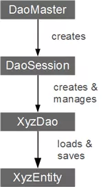

# 概念

## 核心类



一旦你**定义了至少一个实体并构建了你的项目**，你就可以开始在你的Android项目中使用greenDAO。

以下核心类是 greenDAO 的基本接口：

### [DaoMaster](http://greenrobot.org/files/greendao/javadoc/current/org/greenrobot/greendao/AbstractDaoMaster.html)

使用绿色 DAO 的入口点。DaoMaster持有数据库对象（SQLiteDatabase）并管理特定模式的DAO类（而不是对象）。它具有用于创建表或删除表的静态方法。它的内部类OpenHelper和DevOpenHelper是SQLiteOpenHelper实现，用于在SQLite数据库中创建模式。

### [DaoSession](http://greenrobot.org/files/greendao/javadoc/current/org/greenrobot/greendao/AbstractDaoSession.html)

管理特定架构的所有可用 DAO 对象，您可以使用其中一个 getter 方法获取这些对象。DaoSession 还提供了一些通用的持久性方法，如实体的插入、加载、更新、刷新和删除。最后，DaoSession 对象还会跟踪标识范围。有关更多详细信息，请查看[会话文档](http://greenrobot.org/greendao/documentation/sessions/ "Sessions")。

### [DAOs](http://greenrobot.org/files/greendao/javadoc/current/org/greenrobot/greendao/AbstractDao.html)

数据访问对象 （DAO） 保留并查询实体。对于每个实体，greenDAO 都会生成一个 DAO。它具有比 DaoSession 更多的持久性方法，例如：count、loadAll 和 insertInTx。

### 实体

持久化对象。通常，实体是使用标准 Java 属性（如 POJO 或 JavaBean）表示数据库行的对象。

## 核心初始化

最后，初始化数据库和核心 greenDAO 类的第一步：

```java
// do this once, for example in your Application class
helper = new DaoMaster.DevOpenHelper(this, "notes-db", null);
db = helper.getWritableDatabase();
daoMaster = new DaoMaster(db);
daoSession = daoMaster.newSession();
// do this in your activities/fragments to get hold of a DAO
noteDao = daoSession.getNoteDao();
```

该示例假定注意`Note`存在。凭借其 DAO （`noteDao` object），我们可以调用此特定实体的持久性操作。
