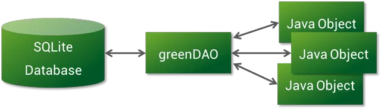

# greenDAO

**注意：**  
对于新的应用程序，我们建议使用[ObjectBox](https://objectbox.io)，这是一个新的面向对象的数据库，比SQLite快得多，更易于使用。  
对于基于greenDAO的现有应用程序，我们提供[DaoCompat](https://greenrobot.org/greendao/documentation/objectbox-compat/)以便于切换（另请参阅[公告](https://greenrobot.org/release/daocompat-greendao-on-objectbox/)）。

## 介绍

用于 SQLite 的 Android ORM 框架。

greenDAO是一个开源的Android ORM，使SQLite数据库的开发再次变得有趣。  
它使开发人员无需处理低级数据库需求，同时节省了开发时间。  
SQLite是一个很棒的嵌入式关系数据库。  
尽管如此，编写SQL和分析查询结果仍然是非常繁琐且耗时的任务。  
greenDAO通过将Java对象映射到数据库表（称为[ORM](http://en.wikipedia.org/wiki/Object-relational_mapping)，“对象/关系映射”）来将您从这些中解放出来。  
通过这种方式，您可以使用简单的面向对象 API 存储、更新、删除和查询 Java 对象。

greenDAO是一个用于Android的对象/关系映射（ORM）工具。它为关系数据库 SQLite 提供了一个面向对象的接口。像greenDAO这样的ORM工具可以为您完成许多重复性任务，并为您的数据提供简单的界面。

附：  
仅支持 Java 语言编写的 JavaBean，不支持 kotlin 的 `class` 和 `data class`

## greenDAO功能一览

- **最大性能**（可能是Android上最快的ORM）;我们的基准测试也是开源的
- **易于使用**的强大 API，涵盖关系和连接
- **最小的**内存消耗
- **小型**库大小 （<100KB），以保持较低的构建时间并避免 65k 方法限制
- **数据库加密**：绿道支持SQLCipher，保障用户数据安全
- **强大的社区**：超过5.000个GitHub明星表明有一个强大而活跃的社区

### 对象/关系映射 （ORM）

greenDAO的本质是为存储在关系数据库SQLite中的数据提供面向对象的接口。只需定义数据模型，greenDAO就会创建Java数据对象（实体）和DAO（[数据访问对象](http://en.wikipedia.org/wiki/Data_access_object)）。这将为您节省大量无聊的代码，这些代码只是来回移动数据。除此之外，greenDAO还提供了[一些高级ORM功能](http://greenrobot.org/2011/08/12/greendao-2nd-preview/ "greenDAO 2nd Preview")，例如会话缓存，预先加载和活动实体。

### 性能

在我们所知道的所有ORM中，greenDAO是最快的。greenDAO不会在性能方面做出任何妥协。数据库非常适合存储大量数据，因此速度很重要。使用 greenDAO，可以以[每秒数千个实体](http://greenrobot.org/2011/10/23/current-performance-figures/ "Current performance figures")的速率插入、更新和加载大多数实体。

我们对greenDAO的表现充满信心，并邀请您将greenDAO与其他ORM进行比较。我们[开源了我们的基准，](https://github.com/greenrobot/android-database-performance)以实现完全透明。下图比较了Android greenDAO，OrmLite和ActiveAndroid的3种最受欢迎的ORM解决方案（根据基于GitHub明星和Appbrain统计数据的受欢迎程度）。greenDAO插入和更新实体的速度比ORMLite快2倍左右，加载实体的速度快4倍左右。对于典型应用，装载速度是最相关的。

  
除了 greenDAO 的高性能核心之外，会话缓存和智能急切加载技术等功能还可提供额外的性能提升。

### 加密支持

您可以将 greenDAO 与嵌入在 Android 中的标准 SQLite 一起使用，也可以将其与 SQLCipher 一起使用。有关详细信息，请查看[数据库加密文档](http://greenrobot.org/greendao/documentation/database-encryption/)。

### 超小库

greenDAO的核心库大小小于100k，因此添加greenDAO不会损害您的APK大小。

### 活动实体

如果需要，可以将实体设置为“活动”：活动实体透明地解析关系（您只需调用 getter），并具有更新、删除和刷新方法，以便于访问持久性功能。

### 协议缓冲区支持

greenDAO允许您将[协议缓冲区（protobuf）](http://code.google.com/p/protobuf/)对象直接保存到数据库中。如果您通过 protobuf 与服务器通信，则不需要另一个映射。常规实体的所有持久性操作都可用于 protobuf 对象。我们相信这是greenDAO的一个独特之处。

### 代码生成

greenDAO将生成Java数据对象（实体）和DAO对象。DAO 对象针对实体进行了定制，从而实现了最佳映射。  
未来计划：生成适配器，也许还有 CRUD 活动。

### 开源

greenDAO的源代码完全可以在G[itHub](https://github.com/greenrobot/greenDAO)上找到。源代码分发还包含一个JUnit测试套件，它使用greenDAO的所有功能，因此是了解greenDAO的好方法。

### 支持

greenDAO是开源[的，并得到](http://greenrobot.org/contact-support/ "Contact/Support")其开发人员和社区的支持。

## Gradle 插件和 DAO 代码生成

