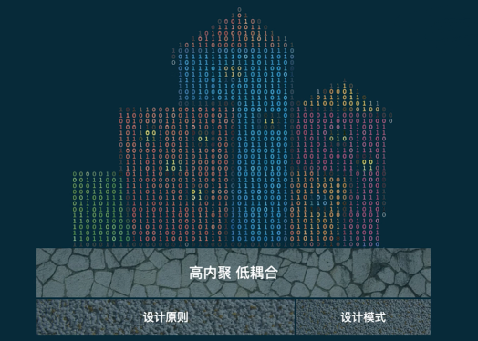

# 软件设计原则

## 内聚

模块内部合理且紧密联系的元素彼此组织在一起完成一个单一的功能。  
这样的模块职责单一，边界清晰，功能稳定,可维护性和可复用性强。

## 耦合

耦合度描述的是模块与模块之间的关联、感知、依赖程度。  
耦合度越低则代表模块的独立性越强，模块间的互相影响越小，模块间的互相影响越小，则系统越稳定可靠。  
耦合度越高，则系统内部越错综复杂，越容易牵一发而动全身，局部的修改导致大范围的修改，局部的异常甚至引发系统的瘫痪

## 内聚和耦合的关系

软件涉及力求做到高内聚，低耦合。高内聚是低耦合的基础。

## 可维护性

在不破坏原有代码设计、不引入新的bug 的情况下，能够快速地修改或者添加代码。

## 可扩展性

在不修改或少量修改原有代码的情况下，可以通过扩展的方式添加新的功能代码。

## 可复用性

尽量减少编写重复代码，复用已有代码。
