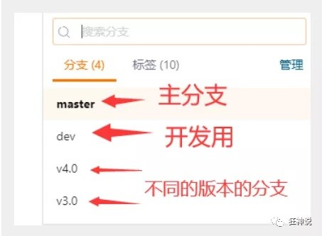
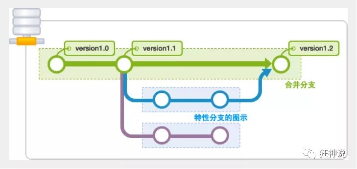
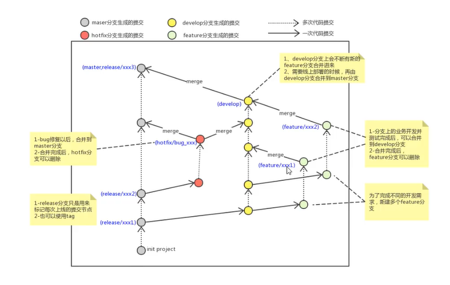

# 管理分支

|功能|命令|
|-|-|
|列出所有本地分支|`git branch`|
|列出所有远程分支|`git branch -r`|
|新建一个分支，但依然停留在当前分支|`git branch [branch-name]`|
|切换到指定分支|`git checkout  [branch]`|
|切换到指定分支|`git switch [branch]`|
|新建一个分支，并切换到该分支|`git checkout -b [branch]`或者`git switch -c [branch]`|
|合并指定分支到当前分支。用 git add [filename] 告诉 Git 文件冲突已经解决|`git merge [branch]`|
|删除分支|`git branch -d [branch-name]`|
|不做检查，强制删除分支|`git branch -D [branch-name]`|
|删除远程分支|`git push origin --delete [branch-name]`或者`git branch -dr [remote/branch]`|
|切换版本|`git reset --hard [commitID]`|
|查看已经删除的提交记录|`git reflog`|

---

  
  
  

---

如果同一个文件在合并分支时都被修改了则会引起冲突：解决的办法是我们可以修改冲突文件后重新提交！选择要保留他的代码还是你的代码！

- master主分支应该非常稳定，用来发布新版本，一般情况下不允许在上面工作，工作一般情况下在新建的dev分支上工作，工作完后，比如上要发布，或者说dev分支代码稳定后可以合并到主分支master上来。
- 切换分支前,一定要提交本地的修改
- 及时提交代码,提交了就不会丢
- 如果多人在同一分支上开发，在本地 `commit` 和 `push` 前要 `git pull` 。

## 在 GitHub 上 重命名分支 master 为 main 后本地需要的操作

```sh
git branch -m master main
git fetch origin
git branch -u origin/main main
git remote set-head origin -a
```
