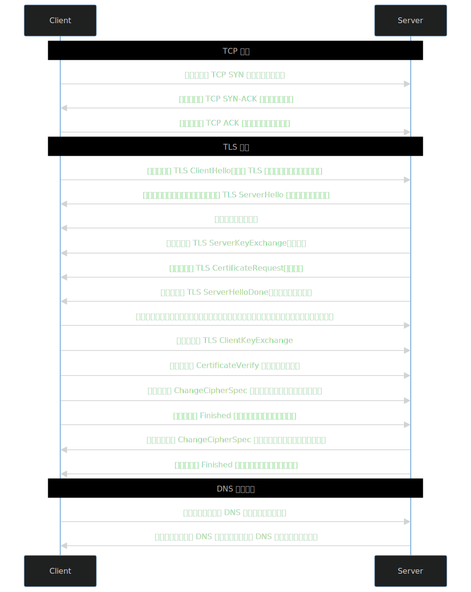
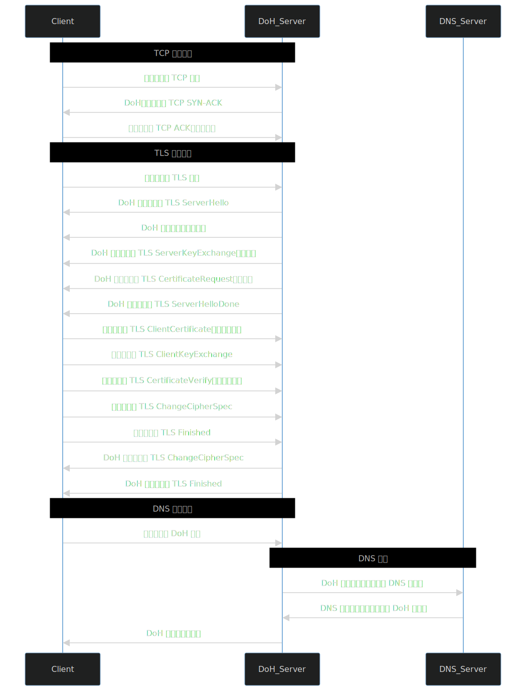
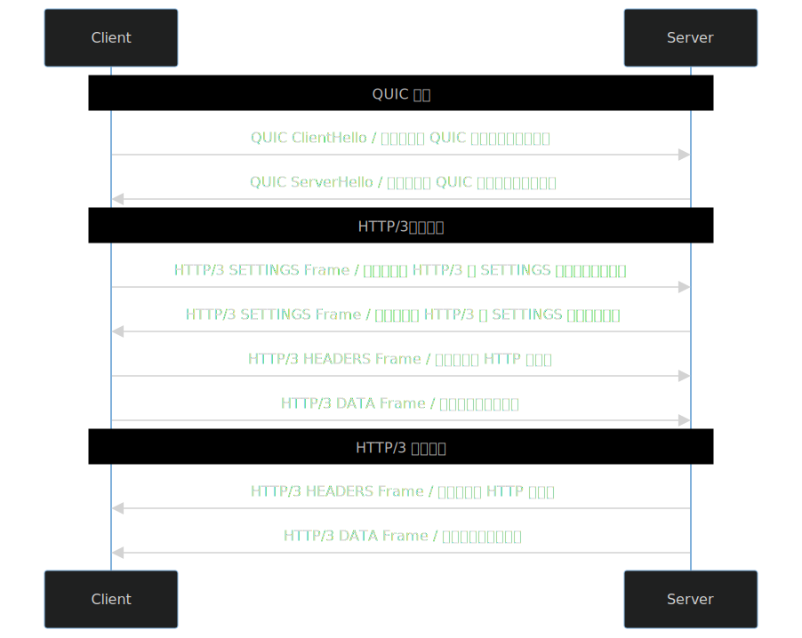
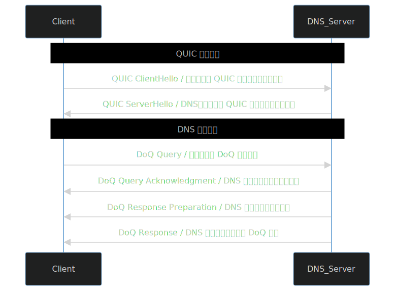

# DNS

原文链接：[保护隐私与优化网络：深入比较 DoT、DoH、H3 和 DoQ 协议的功能与优势](https://www.timochan.cn/posts/study/protecting_privacy_and_optimizing_networks)

其他好文：[AdGuard Home 中文指南](https://www.timochan.cn/posts/jc/adguard_home_configuration_guide)、[Checking DNS ECS Feature Support](https://www.timochan.cn/posts/study/check_dns_ecs_support)

## 前言

在当今网络环境中，传统的 UDP 53 端口的 DNS 请求容易受到篡改和劫持，全球范围内的主要公共 DNS 服务都已经开始采用加密的 DNS 解析方式，如国内的 DNSPod DNS、Ali DNS，以及国外的 Google DNS、OpenDNS、Quad9 DNS、AdGuard DNS、Next DNS 等。然而，加密 DNS 的普及并非空穴来风，传统的 DNS 在满足日益增长的隐私需求已不再足够。

为了解决这个问题，DNS 加密技术应运而生。我们可以查阅与 DNS 相关的 RFC 文件，根据这些标准文件的发布时间，我们可以逐一深入探讨 DoT（DNS-over-TLS）、DoH（DNS-over-HTTPS）、H3（HTTP/3）以及 DoQ（DNS-over-QUIC）等加密协议。

## 传统 DNS （UDP 53）

传统的 UDP 53 协议虽然实现简单且具有广泛的适用性，但其存在诸多问题，如容易被劫持和篡改，以及易受分布式拒绝服务（DDoS）攻击等。因此，传统 DNS 已无法满足现代网络安全和隐私的需求。

优缺点如下：

| 优点 | 缺点 | 争议点 |
| --- | --- | --- |
| 开销小，性能好 | 基于 UDP 明文，易劫持和篡改 | DNS 查询透明，容易审计 |
| 普适性 | 易受 DDoS 攻击 | / |

虽然有了 DNSSEC 扩展可以防止劫持和篡改，但是整个过程是明文的，别人可以轻松探测到你正在浏览的网站，对于隐私的保护是致命的。

## DoT

DoT（DNS-over-TLS）协议的 RFC 文件是 RFC 7858 [^1](https://datatracker.ietf.org/doc/rfc7858)，DoT 通过在 TCP 传输层上添加 TLS 层加密来保护 DNS 查询的隐私和安全。以下是 DoT 协议的请求流程：

这就是整个 DoT 请求流程，此时我们的客户端拿到的还是加密后的 DNS 响应，需要本地解密以后才可以使用。从上面的流程可以看到，整个过程既有 TCP 三次握手，又有 TLS 握手，资源开销在整个加密技术里面，是相对比较小的。

那么优缺点如下：

| 优点 | 缺点 | 争议点 |
| --- | --- | --- |
| 资源开销较小，性能良好 | 鉴权认证弱 | DNS 查询对于中间设备不透明，可能会影响流量审计 |
| 基于现有基础设施，易于部署 | 默认使用了 853 端口，虽然不知道查询内容，但是知道你在做 DNS 查询 | / |
| 隐私和安全 | / | / |

## DoH

DoH（DNS-over-HTTPS）协议的标准文件为 RFC 8484 [^2](https://datatracker.ietf.org/doc/rfc8484)，DoH 通过在应用层上使用 HTTPS 来加密 DNS 查询，进一步增强了隐私和安全性。

根据标准文件描述，我绘制的具体流程如下：

这就是整个 DoH 请求的过程，客户端还需要自行解密 DNS 查询结果，我写这个流程图的时候，手已经有点酸了，太繁多了，然而 DoH 首次请求（在 keep-alive 保持连接后速度就很不错了），流程就是这么多，所以导致 DoH 的资源开销是目前加密技术最大的。

那么优缺点如下：

| 优点 | 缺点 | 争议点 |
| --- | --- | --- |
| 可以做强鉴权 | 结构复杂，资源开销目前最大 | DNS 查询对于中间设备不透明，可能会影响流量审计 |
| 基于 HTTPS 实现，可以很好的利用现有的基础设施，客户端和服务端更灵活，隐蔽性更高 | 延迟最大，如果使用 keep-alive 保持连接，整体响应速度比 DoT 快 | / |
| 隐私和安全 | / | / |

值得注意的是，国内很多 APP 为了对抗 Local DNS 的劫持，内置了 HTTPDNS，但是根据我的抓包检查，这种算不上 DoH，只是把传统 DNS 查询换成了 HTTP 查询，整个过程没有添加 TLS 层，只是自己建立了一套加密机制，如果你能知晓对称加密的秘钥，直接可以监听到明文。

## H3

H3（HTTP/3）协议的标准文件是 RFC 9114[^3](https://datatracker.ietf.org/doc/rfc9114)， H3 基于 QUIC 协议实现，使用 UDP 传输层。

根据标准文件描述，我绘制的具体流程如下：

可以看到基于 QUIC 协议的 H3 整个流程非常简单，同时因为 QUIC 协议本身就支持加密，所以没有那么多握手流程；得益于 QUIC 协议对于 TCP + TLS 这套组合的大幅度改进，使得基于 UDP 传输的 QUIC 数据包速度非常快（理论）。

优缺点如下：

| 优点 | 缺点 | 争议点 |
| --- | --- | --- |
| 基于 QUIC 协议速度较快，性能较好 | 新协议服务端支持相对较少 | DNS 查询对于中间设备不透明，可能会影响流量审计 |
| 支持多路复用，允许多个数据流共享一个连接，减少了连接建立的成本 | 同理，客户端支持较少 | / |
| 隐私和安全 | 可以被 SNI 阻断 | / |

## DoQ

DoQ（DNS-over-QUIC）它的标准文件是 RFC 9250[^4](https://datatracker.ietf.org/doc/rfc9250)，基于 QUIC 协议实现，使用 UDP 传输层。DoQ 结合了 QUIC 协议的高效性能和 DNS 查询的加密保护。

那么根据标准文件，我绘制的流程图如下：

这就是整个 DoQ 查询的过程，客户端还需要自行解密响应数据，拿到需要的 DNS 内容，和 H3 一样，基于 UDP 传输，但是没有 SNI 信息不会被 SNI 阻断。优缺点如下：

| 优点 | 缺点 | 争议点 |
| --- | --- | --- |
| 基于 QUIC 协议速度最快，性能最好 | 新协议服务端支持相对较少 | DNS 查询对于中间设备不透明，可能会影响流量审计 |
| 支持多路复用，允许多个数据流共享一个连接，减少了连接建立的成本 | 同理，客户端支持较少 | / |
| 隐私和安全 | / | / |

## 总结

当我们深入比较 DoT、DoH、H3 和 DoQ 等加密协议的功能和优势时，不难看出网络通信的保护隐私和优化性能的迫切需求。传统的 UDP 53 协议的不足已经变得显而易见，这促使了加密 DNS 技术的发展。通过观察标准文件发布的时间，我们逐一了解了这些协议的工作流程和优点。图表如下：

| 类别 | 优点 | 缺点 |
| --- | --- | --- |
| 传统 DNS | 速度快，实现广泛 | 传输透明，容易嗅探和审计 |
| DoT | 基于 TCP + TLS 层，因为标准化比较早，支持相对广泛 | 默认端口可能是一个明显的特征。可能存在的 SNI 阻断（这个端口还阻断就过分了吧） |
| DoH | 可以做强鉴权，而且隐藏于 HTTPS 流量中，特征不明显 | 基于 HTTPS，部署开销较大，而且首次响应速度较慢，不过借助于 keep-alive，之后的速度就比 DoT 快得多。可能 SNI 阻断。 |
| H3 | 使用 QUIC 协议，基于 UDP 传输，速度较快，性能较好 | 仍然基于 HTTPS ，开销略大，会被 SNI 阻断，UDP QoS |
| DoQ | 使用 QUIC 协议，基于 UDP 传输，速度最快（理论），最接近于传统 DNS 的速度 | 暂时没发现缺点，如果有的话，那就是 UDP QoS 以及可能存在的 SNI 阻断（这个端口还阻断就过分了吧） |

然而，在我们探索这些前沿技术的同时，也需要正视一些现实问题。特别是在中国等一些地区，存在着 UDP 篡改和劫持的乱象，这进一步凸显了加密 DNS 的重要性。UDP 篡改和劫持是一种干扰手段，通过对 DNS 流量进行检测和操纵，可能导致用户隐私泄露、网络稳定性下降，甚至影响合法信息的传递。这种干扰行为不仅违背了网络中立性的原则，也削弱了用户对互联网的信任。

面对这些问题，使用加密协议是保护用户隐私和维护网络健康的重要一步。然而，技术的发展和实施需要与政策、法律以及用户教育相结合。只有通过共同的努力，我们才能在数字时代建立一个更加安全、开放和可信赖的网络环境。

但是值得警惕的是，整个 DNS 加密技术强依赖于 TLS 层，一旦你的系统根证书被篡改，那么整个加密也是不可信的，会被监听的，等同于明文传输。但是这种情况相对比较少。

总之，DoT、DoH、H3 和 DoQ 等加密协议为我们提供了保护隐私与优化网络性能的有效途径。然而，我们也应当认识到在一些地区的网络环境中仍存在的挑战，因此加密 DNS 的推广和普及需要我们的持续努力。只有通过合作与创新，我们才能建设一个更加安全、稳定和可持续发展的数字化世界。
