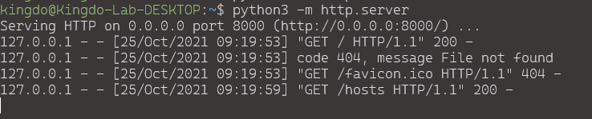
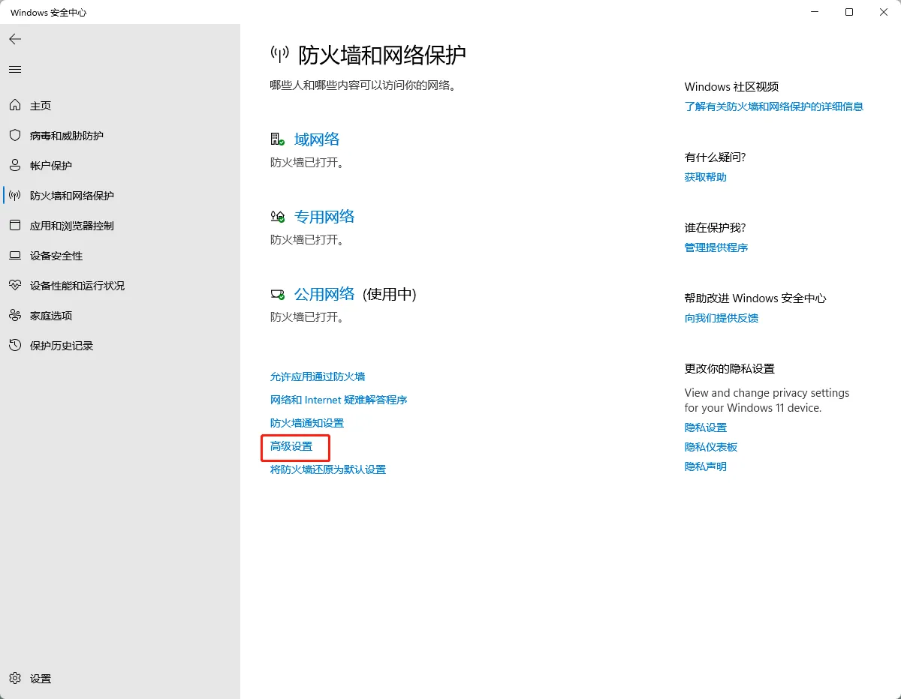
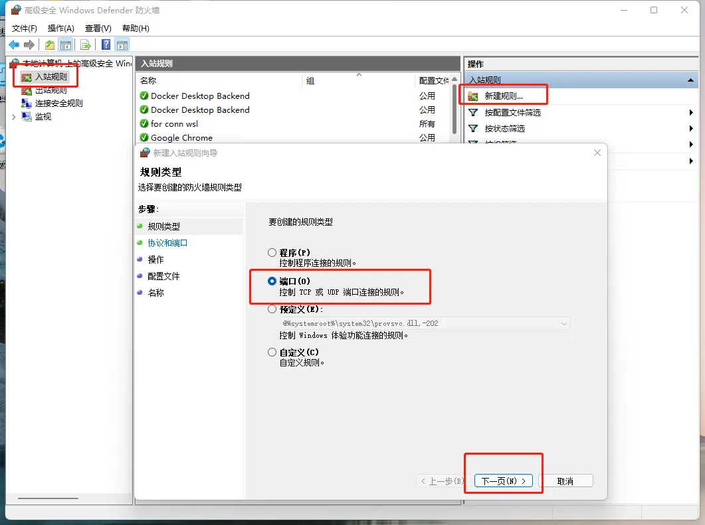
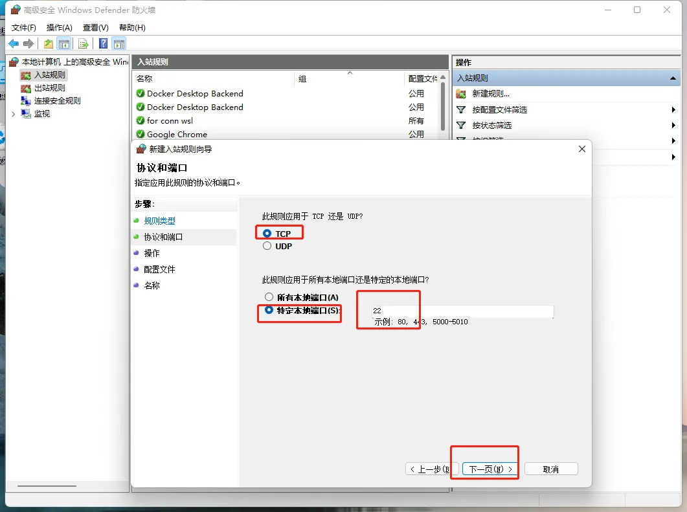
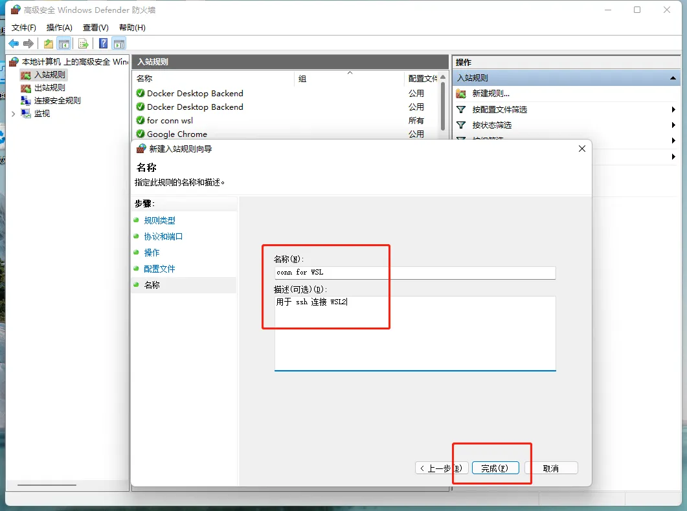
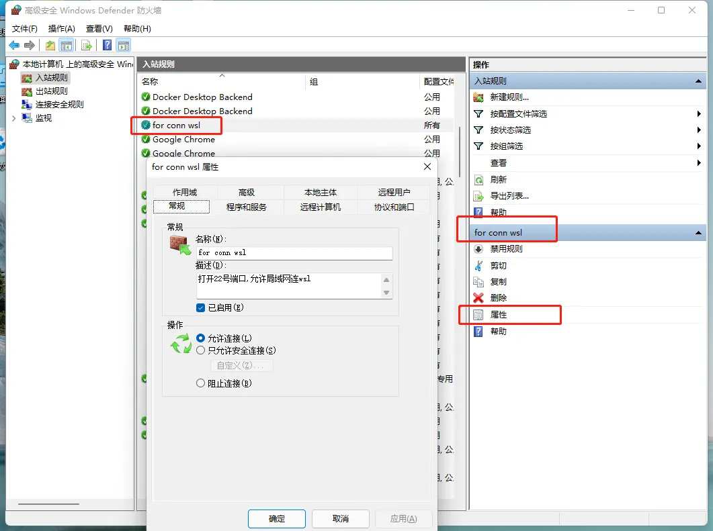
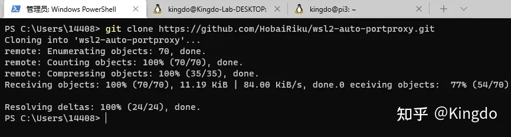
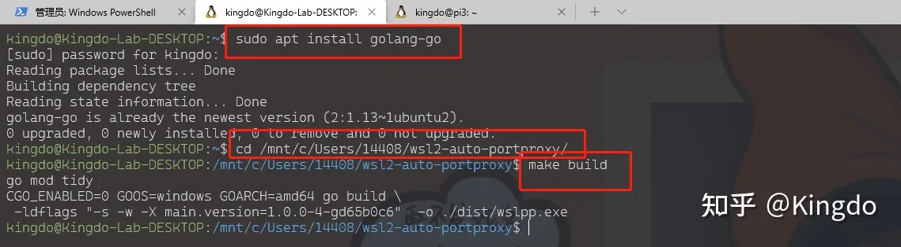

# 如何在局域网的其他主机上中访问本机的WSL2

本文为转载，来源为知乎Kingdo的[如何在局域网的其他主机上中访问本机的WSL2](https://zhuanlan.zhihu.com/p/425312804)

PS，更新采用追加式，不会修改原文，补充内容按时间放在文尾

| 更新日期 | 概述 |
| --- | --- |
| 2019年10月25日 | 发布原文 |
| 2021年10月28日 | ssh 连接失败: ssh_exchange_identification |
| 2021年10月28日 | 使用wslpp工具 |

## 原文

## 前言

WSL2 可以认为是一个运行在超轻的虚拟机当中的Linux系统. Windows中创建了一个虚拟的网卡,通过网桥(我估计)的方式与WSL相连接,网卡信息如下:

WSL 网卡：


Windows 虚拟网卡：


但是麻烦的, 每次重启WSL2, 其IP地址都会被重置, 这将带来无穷的麻烦!

好在, 在18945之后的版本中, 微软改进了WSL2, 使我们可以使用localhost, 访问WSL的网络服务:

在 wsl2 中开启一个web服务：



在windows主机中访问：


我们也可以在PowerShell中, 直接使用ssh连接:

在PowerShell中ssh连接WSL2：


但是如果我们希望在局域网的其他主机上直接访问WSL2, 是无法直接访问的(WSL1可以).

## 操作步骤

### 概要

1. **打开防火墙的指定端口**
2. **配置端口转发规则**

下以22号端口为例, 实现ssh连接, 其他如80端口方式一样

### 一. 开放防火墙端口

#### 1. 找到Windows 防火墙的设置页面, 点击高级设置



#### 2. 入栈规则 -> 新建规则 -> 端口 -> 下一页



#### 3. TCP 特定本地端口, 输入22, 即想要开放的端口



#### 4. 允许连接


#### 5. 指定可用域


#### 6. 添加描述(自己定义)



#### 7. 查看验证



### 二. 配置端口转发

#### 1. 用管理员方式打开PowerShell


#### 2. 键入指令

```shell
netsh interface portproxy add v4tov4 listenport=22 listenaddress=0.0.0.0 connectport=22 connectaddress=localhost
```

其中:

listenport, 表示要监听的 Windows 端口

listenaddress, 表示监听地址, 0.0.0.0 表示匹配所有地址, 比如Windows 既有Wifi网卡, 又有有线网卡, 那么访问任意两个网卡, 都会被监听到,当然也可以指定其中之一的IP的地址

connectaddress ,要转发的地址, 这里设置为localhost, 是因为,我们可以通过localhost来访问WSL2, 如果暂不支持, 这里需要指定为 WSL2的IP地址

connectport, 要转发到的端口

## 后记

### 一. 端口转发的其他命令

**show:**

```shell
netsh interface portproxy show all
```


**delete:**

```shell
netsh interface portproxy delete v4tov4 listenport=22 listenaddress=0.0.0.0
```

### 二. 避免端口冲突

根据我的观察, 如果Windows本地启动了指定端口, 这时WSL2中虽然可以使用相同的端口, 但是localhost:port 将指向Windows的服务, WSL的服务将会被覆盖!

当然了, 如果我们配置了端口转发, 转发的IP是WSL的地址, 而不是localhost, 那么WSL将会覆盖Windows的服务!

因此在配置时, 特别是web服务, 需要注意!

### 三. 容器服务

使用容器,来配置web服务,显然是最佳选择,这个时候你就会遇到本文的问题,因为你可能希望让其他主机来访问你的容器服务!

但是,我并不推荐你这么做, 更好的方式是安装docker-desktop, 即Windows版的docker, WSL2会自动连接到Windows的Docker 服务中.

此时启动的容器使用的端口和Windows的端口是"相通"的,完全不需要配置端口转发!

## 参考文献

[使用WSL访问网络应用程序](https://link.zhihu.com/?target=https%3A//docs.microsoft.com/zh-cn/windows/wsl/networking)

[Win10系统如何在防火墙里开放端口](https://link.zhihu.com/?target=https%3A//jingyan.baidu.com/article/09ea3ede7311dec0afde3977.html)

[Windows开启端口转发功能](https://zhuanlan.zhihu.com/p/266473873)
___

## 补充

### 补充一

连接出现了如下的这样的连接错误.:

```shell
ssh_exchange_identification: read: Connection reset by peer
```

我研究了很久, 但是, 并没有最终确定导致的原因

这里建议将 `connectaddress` 指定为WSL2的IP地址,即:

```shell
netsh interface portproxy add v4tov4 listenport=22 listenaddress=0.0.0.0 connectport=22 connectaddress=[WSL2 IP Address]
```

或者是使用ipv6的回环地址,即:

```shell
netsh interface portproxy add v4tov6 listenport=22 listenaddress=0.0.0.0 connectport=22 connectaddress=::1
```

一个是**v4tov4**, 另一个是**v4tov6**

### **补充二**

这是评论区同学,告知的一个脚本, wslpp :

这个脚本是用go语言写的,我在这里奉上使用方法:

一、在Windows PowerShell中, 将其clone到本地:

```shell
git clone https://github.com/HobaiRiku/wsl2-auto-portproxy.git
```



二、在WSL2中, 编译此项目,注意,是需要Go的环境的, 而且这一步骤需要在Windows的管理员模式进行

```shell
 sudo apt install golang-go
 cd /mnt/c/Users/`windows-user-name`/wsl2-auto-portproxy/
 make build
```



三、配置wslpp的配置文件, 在WSL中执行:

```shell
mkdir /mnt/c/Users/14408/.wslpp
vim  /mnt/c/Users/14408/.wslpp/config.json

输入:
{
  "onlyPredefined": true,
  "predefined": {
    "tcp": [
      "22:22"
    ]
  },
  "ignore": {
    "tcp": [
      445
    ]
  }
}:
```

四、回到Windows PowerShell中, 执行:

```shell
 cd .\wsl2-auto-portproxy\dist\
 .\wslpp.exe
```


第一次执行,需要等一会,而且还要允许防火墙让wslpp访问网络的配置!

本质上,这个脚本就是开启防火墙,然后进行端口映射,只不过他会自动扫描WSL的配置,因此比我们手动自己配置映射要靠谱一些!

其实上述过程,只在windows中就可以完成, 但是毕竟Linux操作不会多复杂.

此外, WSL操作Windows的文件,是需要在管理员模式下进行的.

这方法,目前没遇到问题, 但是需要你额外软件开一个!
