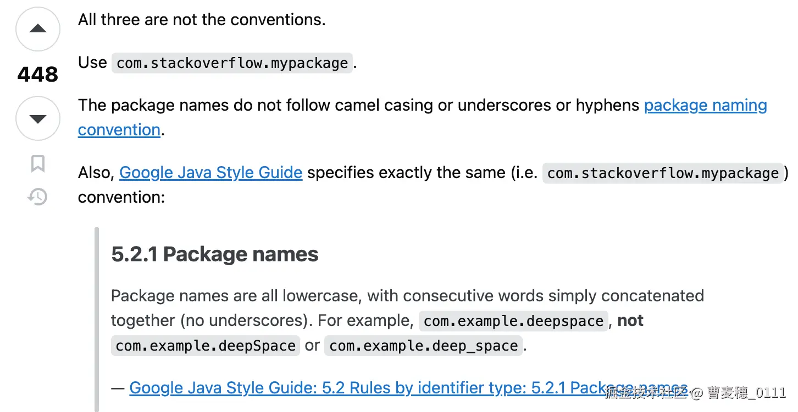
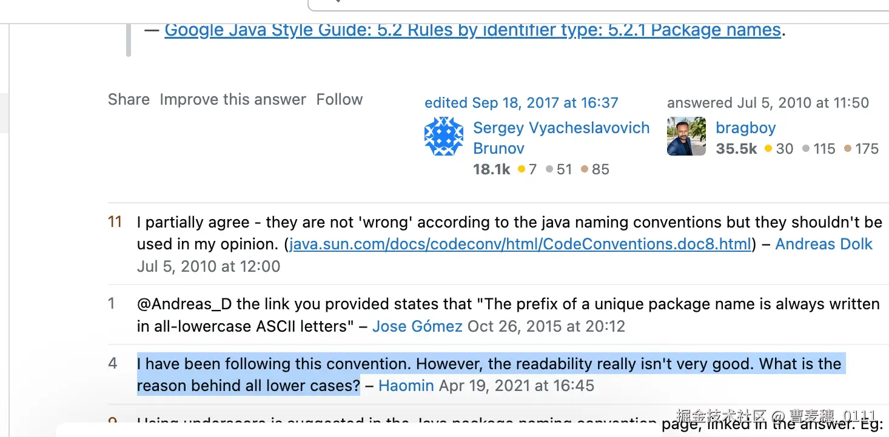
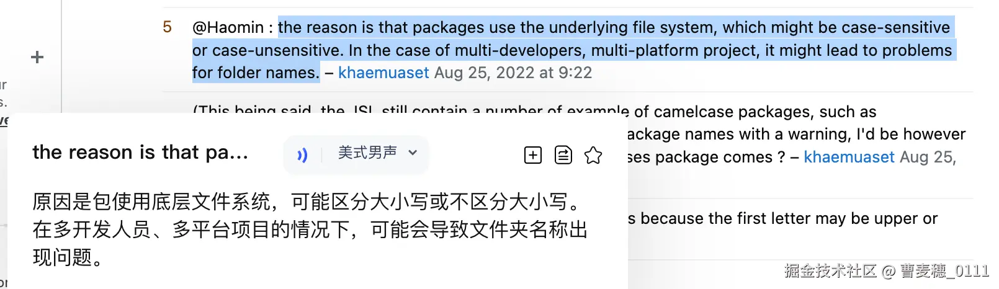
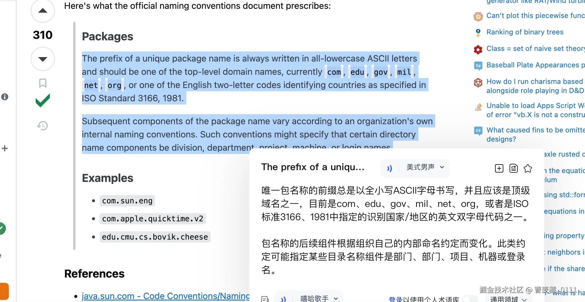
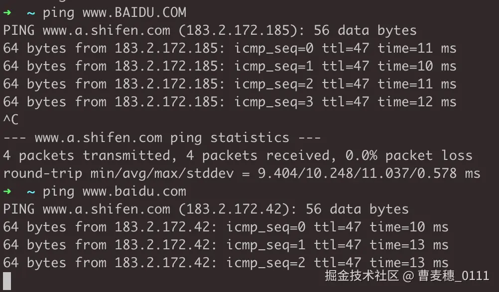
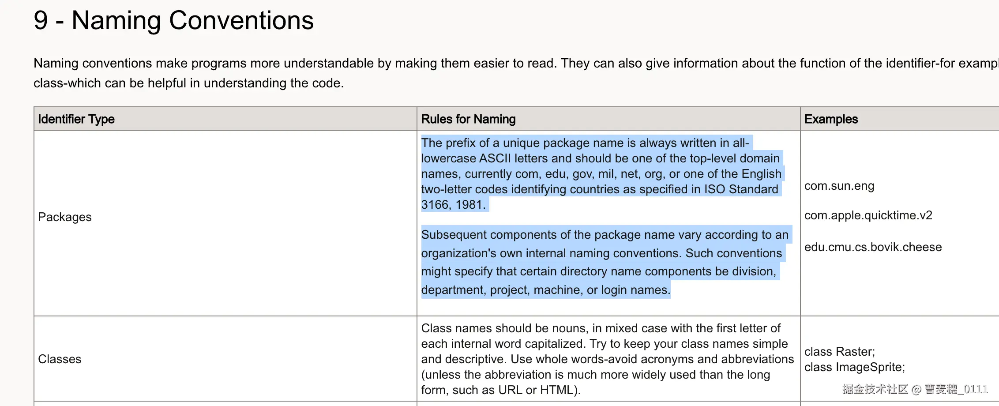

# Java包名真的有全小写的规范？

背景: 我是先使用的PHP语言进行工作，后面才使用的Java语言。对于PHP而言对应Java包的概念是Namespace这个概念。PSR的规范其实示例的是大坨峰，并且明确是要大小写区分的。但在Java这边无论是问的AI，还是问的Java唯一语言长期工作者得到的答案是全小写是规范。

> 不符合行业惯例和标准
>
>在Java开发的长期实践中，全小写字母的包名已经成为一种被广泛接受的行业标准。
> 这种标准有助于不同开发团队之间的代码交流和协作。

## 为什么我会质疑

习惯了php的写法一个包名是可以用驼峰的方式去表达多个单词。如果用Java的写法，必须全小写。要么几个单词粘连起来。举个例子`orderPayed` 要写成`orderpayed`。 这无疑是弱化了语言的表达能力，不方便辨识。要么就写成子包形式`order.payed` 这样导致的另一问题是，强行建立多了一个层级。

有人说我这是php的先入为主。但是既然其他语言可以是驼峰表示，为什么Java要全小写呢？

## 为什么要全小写？

首先我们来问问AI。其中有一条是有一点技术原因道理的。

> 区分大小写的文件系统考虑
>
> 避免潜在冲突：在很多操作系统的文件系统中,文件名是区分大小写的。
> 如果包名使用了大小写混合的方式,可能会在不同的操作系统环境下导致文件路径解析的混乱。
> 例如，在一个Linux系统中，`com.example` 和 `Com.example` 会被视为两个完全不同的目录路径，
> 而保持包名全小写可以减少这种因操作系统差异而产生的潜在问题。

但是我认为仍然站不住脚，原因是类文件依然是驼峰的写法，为什么类文件就不考虑这一点了？

## 真的是官方规范么？

我搜了下国内外的资料，确实绝大部分都说的是这个是规范，很少有质疑。但好在不是我一个人在战斗。

[stackoverflow.com/questions/3…](https://stackoverflow.com/questions/3179216/what-is-the-convention-for-word-separator-in-java-package-names)

stackoverflow 有一篇帖子与我的疑惑差不多。

其中被顶的最多的一条回复是：**规范是小写**

被顶448次，还引用了谷歌的规范。

在该帖的回复里也有人提出了质疑。

这个@Haomin 回复到,"我是按这个规范的，但是我觉得可读性并没有那么好，全小写背后的原因究竟是什么" ？这也恰恰是我想问的。

随后有人的回复也是类似AI的回答，文件系统大小写非敏感的问题。

这个理由前面提到了，并不认为能站得住脚。

另外还有一个被提问者采纳的回答。

- 被顶了310次，被提问者采纳。
- 他引用了官方的描述，唯一包名前缀必须是全小写，并且必须域名。我们知道域名是大小写不敏感的，[www.BAIDU.COM](https://link.juejin.cn/?target=http%3A%2F%2Fwww.BAIDU.COM "http://www.BAIDU.COM") 和 [www.baidu.com](https://link.juejin.cn/?target=http%3A%2F%2Fwww.baidu.com "http://www.baidu.com") 其实是一样的。

后面又有描述，后续部分命名根据自己内部命名约定而变化。这部分内容出自

[www.oracle.com/java/techno…](https://link.juejin.cn/?target=https%3A%2F%2Fwww.oracle.com%2Fjava%2Ftechnologies%2Fjavase%2Fcodeconventions-namingconventions.html "https://www.oracle.com/java/technologies/javase/codeconventions-namingconventions.html") Oracle java编码规范-命名规范。

我们如果把包名看作2部分，前缀是域名用来唯一标识，后面是具体业务或功能路径。前部分因为域名大小写不敏感，所以规范化下来用全小写，后面部分按照自己团队内规范走。在不加深层级的情况下，驼峰命名肯定比全小写的可读性和表达能力都要好。

## 结论

1. 就实际使用感受而言，全部纯小写限制了表达能力，给工作实际带来了不便利。
2. 依据Oracle java编码规范-命名规范，包名有2部分，第一部分全小写，后面部分按自己团队内规范走。

## 题外话

- 在传播的不一定就是准确的。

举个我小时候的例子：小时候玩过一个游戏 那个动物棋，老鼠 大象 狮子 狗 的那个。不管是我那个乡的学校 还是我隔壁乡的学校，都使用的还是 "一冈" , 后面我跟我哥玩的时候 就在想 这个为什么是这个 "冈" ，跟其他的 棋子完全联系不上 想不出它的意义。后面想了一下 是不是 "网" 才对， 后面我们自己制作这个动物棋的时候就用"一网"，逐渐纠正了整个学校的认知。 在传播的并不一定是准确的，它的产生有某些偶然的原因 也可能有它必然的道理。这个很难说，制定标准的人也是人 也会犯错。或者说制定标准的人，标准不一定就是现在传播的。传播的过程当中可能有人理解出错，或者进行了断章取义。

保持独立思考，勇于质疑。

转自：[Java包名真的有全小写的规范？](https://juejin.cn/post/7460319992413405199)
