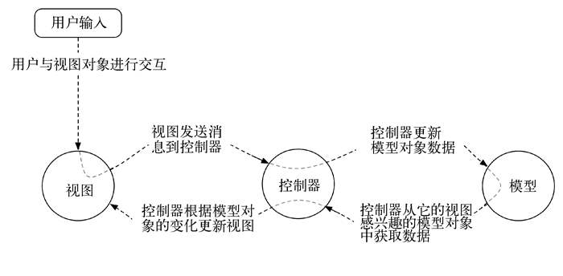

# Android 碎片知识，待整理

## 引入ViewModel

在Activity关联ViewModel需要在模块下引入依赖

```groovy
implementation "androidx.activity:activity-ktx:$activity_version"
implementation "androidx.fragment:fragment-ktx:$fragment_version"
```

用到那个引用哪个
使用方法:

```kotlin
val quizViewModel:QuizViewModel by viewModels()
```

QuizViewModel和MainActivity的关系是单向的。某个activity会引用其关联ViewModel，反过来则不行。一个ViewModel绝不能引用activity或view，否则会引发内存泄漏。

## 暂存状态

只要在未结束使用的activity进入停止状态时（比如用户按了Home按钮，启动另一个应用时），操作系统都会调用Activity.onSaveInstanceState(Bundle)。这个时间点很重要，因为停止的activity会被标记为killable。如果应用进程因低优先级被“杀死”，那么，你大可放心Activity.onSaveInstanceState(Bundle)肯定已被调用过。

保留实例状态数据是要序列化到磁盘的，所以应避免用它保存任何大而复杂的对象。

因而，常见的做法是，覆盖onSaveInstanceState(Bundle)函数，在Bundle对象中，保存当前activity小的或暂存状态的数据；覆盖onStop()函数，保存永久性数据，比如用户编辑的文字等。调用完onStop()函数后，activity随时会被系统销毁，所以用它保存永久性数据。

那么暂存的activity记录到底可以保留多久呢？
前面说过，用户按了回退键后，系统会彻底销毁当前的activity。此时，暂存的activity记录会同时被清除。
用户在任务界面清除应用，暂存的activity记录也会被清除。
此外，如果系统重启，那么暂存的activity记录也会被清除。

使用保留实例状态保存少量必需信息以重建UI状态（例如，GeoQuiz应用的currentIndex）。使用ViewModel保存的更丰富的数据，可以快速方便地取回来填充UI，以应对设备配置改变。如果activity是在进程销毁后重建，那就借助保留实例状态先创建ViewModel，从而达到ViewModel和activity从未失效的效果。

## 何时会销毁ViewModel?

两种情况:

- 用户主动销毁 : `Actiuvity.isFinishing`为`true`
- 被系统销毁 : `Actiuvity.isFinishing`为`false`

如果Activity被用户主动销毁就会同时销毁ViewModel

通过检查activity的isFinishing属性可以知道哪一场景正在上演。
如果isFinishing属性值是true，那么activity正在被销毁，因为用户结束使用当前activity了（比如按了回退键，或者从概览屏消除了应用卡片）。
如果isFinishing属性值是false，activity则正在被系统销毁，因为设备配置改变了。

## 新版Logcat

见 <https://androidstudio.googleblog.com/2022/03/android-studio-dolphin-canary-6-now.html>

## gradlew

有时，出于某种原因，可能需要脱离Android Studio编译代码。最简单的方法是使用命令行编译工具。Android编译系统使用的编译工具叫Gradle。

（注意，能读懂本节内容并按步骤操作是最好的。如果看不懂，甚至不知道为什么要手动编译代码，或者是无法正确使用命令行，也不必太在意，请继续学习下一章内容。命令行工具的具体使用不在本书讨论范围内。）

要从命令行使用Gradle，请切换至项目目录并执行以下命令：  
`./gradlew tasks`

如果是Windows系统，执行以下命令：  
`gradlew.bat tasks`

执行以上命令会显示一系列可用任务。你需要的任务是`installDebug`，因此，再执行以下命令：
`./gradlew installDebug`

如果是Windows系统，执行以下命令：  
`gradlew.bat installDebug`  

以上命令将把应用安装到当前连接的设备上，但不会运行它。要运行应用，需要在设备上手动启动。

## 定义Int型的ResourceId形参要加 @StringRes

`@StringRes` 注解可以不加，但最好加上，原因有两个。  
首先，Android Studio内置有Lint代码检查器，有了该注解，它在编译时就知道构造函数会提供有效的资源ID。  
这样一来，构造函数使用无效资源ID的情况（比如提供的资源ID指向非String类型资源）就能避免，从而阻止了应用的运行时崩溃。  
其次，注解可以方便其他开发人员阅读和理解你的代码。

## MVC



## 单一抽象方法（SAM）

单一抽象方法（single abstract method）：一个接口里只有一个抽象方法。

## 屏幕像素密度

1英寸=2.54厘米

- px  
pixel的缩写，即像素。无论屏幕密度是多少，一个像素单位对应一个屏幕像素单位。不推荐使用px，因为它不会根据屏幕密度自动缩放。

- dp（或dip）  
density-independent pixel的缩写，意为密度无关像素。通常，在设置边距、内边距或任何不打算按像素值指定尺寸的情况下，都使用dp这种单位。1dp在设备屏幕上总是等于1/160英寸。使用dp的好处是，无论屏幕密度如何，总能获得同样的尺寸。如果屏幕密度较高，那么密度无关像素会相应扩展至整个屏幕。

- sp  
scale-independent pixel的缩写，意为缩放无关像素。它是一种与密度无关的像素，这种像素会受用户字体偏好设置的影响。sp通常用来设置屏幕上的字体大小。

- pt、mm、in
类似于dp的缩放单位，允许以点（1/72英寸）、毫米或英寸为单位指定用户界面尺寸。实际开发中不建议使用这些单位，因为并非所有设备都能按照这些单位进行正确的尺寸缩放配置。

在实际开发中，通常只会用到dp和sp这两种单位。Android会在运行时自动将它们的值转换为像素单位。
