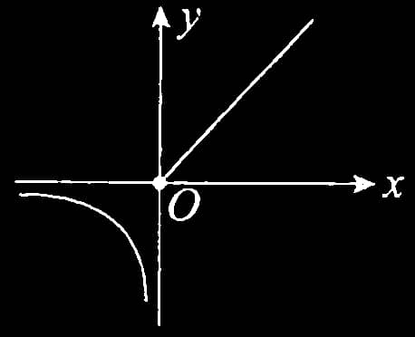

# 一、函数的概念和特性

## 1. 函数

设 $x$ 与 $y$ 是两个变量，$D$ 是一个给定的数集，若对于每一个 $x\in D$ ，按照一定的法则 $f$，有一个确定的值 $y$ 与之对应，则称 $y$ 为 $x$ 的 **函数** ，记作 $y=f(x)$ 。称 $x$ 为 **自变量** ， $y$ 为 **因变量** 。称数集 $D$ 为此函数的 **定义域** ，定义域一般由实际背景中变量的具体意义或者函数对应法则的要求确定。

## 2.反函数

设函数 $y=f(x)$ 的定义域为 $D$ ，值域为 $R$ 。如果对于每一个 $y \in R$ ，必存在唯一的 $x \in D$ 使得 $y=f(x)$ 成立，则由此定义了一个新的函数 $x=\varphi(y)$ 。这个函数就称为函数 $y=f(x)$ 的反函数，一般记作 $x=f^{-1}(y)$ ，它的定义域为 $R$ ，值域为 $D$ ，相对于反函数来说，原来的函数也称为 **直接函数** 。以下两点需要说明。

第一，严格单调函数必有反函数，比如函数 $y=x^2 (x\in [0, +\infty))$ 是严格单调函数，故它有反函数 $x=\sqrt{y}$ 。

第二，若把 $x=f^{-1}(y)$ 与 $y=f(x)$ 的图形画在同一坐标系中，则它们完全重合。只有把 $y=f(x)$ 的反函数 $x=f^{-1}(y)$ 写成 $y=f^{-1}(x)$ 后，它们的图形才关于 $y=x$ 对称，事实上这也是字母 $x$ 与 $y$ 互换的结果。

> 【注】有反函数的函数不一定是单调函数。比如 $f(x)=\begin{cases}x,\quad x\geq 0,\\[10px] \displaystyle\frac{1}{x}, \quad x<0,\end{cases}$ ，其图像如图 1-1 所示，其反函数即为 $f(x)$ 本身，但 $f(x)$ 不是单调函数。  
> 图1-1 

## 3. 复合函数

设函数 $y=f(u)$ 的定义域为 $D_1$ ，函数 $u=g(x)$ 在 $D$ 上有定义，且 $g(D) \subset D_1$ ，则由

$$
y = f\left\lbrack {g\left( x\right) }\right\rbrack \left( {x \in D}\right)
$$

确定的函数，称为由函数 $u = g\left( x\right)$ 和函数 $y = f\left( u\right)$ 构成的 **复合函数** ，它的定义域为 $D$ ， $u$ 称为中间变量，要掌握复合的方法， 具体见例 1.4 。

## 4. 函数的四种特性及重要结论

### (1) 有界性

设 $f\left( x\right)$ 的定义域为 $D$ ，数集 $I \subset D$ . 如果存在某个正数 $M$ ，使对任一 $x \in I$ ，有 $\left| {f\left( x\right) }\right| \leq$ $M$ ，则称 $f\left( x\right)$ 在 $I$ 上 **有界** ； 如果这样的 $M$ 不存在，则称 $f\left( x\right)$ 在 $I$ 上 **无界** .

>【注】（1）从几何上看，如果在给定的区间，函数 $y = f\left( x\right)$ 的图形能够被直线 $y = - M$ 和 $y = M$ “完全包起来”，则为有界； 从解析上说，找到某个正数 $M$ ，使得 $\left| {f\left( x\right) }\right| \leq M$ ，则为有界。
>
>（2） 有界还是无界的讨论首先需 **指明区间** $I$ ，不知区间，无法谈论有界性。 比如 $y = \displaystyle\frac{1}{x}$ 在 $\left( {2, + \infty }\right)$ 内有界，但在 $\left( {0，2}\right)$ 内无界.
>
>（3）事实上，只要在区间 $I$ 上或其端点处存在点 $x_0$ ，使得 $\mathop{\lim }\limits_{{x \rightarrow {x}_{0}}}f\left( x\right)$ 的值为无穷大，则没有任何两条直线 $y = - M$ 和 $y = M$ 可以把 $I$ 上的 $f{\left( x\right) }$ “包起来”，这就叫无界. 考研中常出这样的题目，比如例 3.3.

### (2) 单调性

设 $f\left( x\right)$ 的定义域为 $D$ ，区间 $I \subset D$ . 如果对于区间 $I$ 上任意两点 ${x}_{1}，{x}_{2}$ ，当 ${x}_{1} < {x}_{2}$ 时，恒有 $f\left( {x}_{1}\right) <$ $f\left( {x}_{2}\right)$ ，则称 $f\left( x\right)$ 在区间 $I$ 上单调增加. 如果对于区间 $I$ 上任意两点 ${x}_{1}，{x}_{2}$ ，当 ${x}_{1} < {x}_{2}$ 时，恒有 $f\left( {x}_{1}\right) >$ $f\left( {x}_{2}\right)$ ，则称 $f\left( x\right)$ 在区间 $I$ 上单调减少.

>【注】后面会看到， 在考研试题中常常用求导的方法来讨论函数在某个区间上的单调性， 但是定义法不可以忘记. 试题中也常用到如下定义法的判别形式， 请读者留意.
>
>对任意 ${x}_{1}，{x}_{2} \in D，{x}_{1} \neq {x}_{2}$ ，有
>
> $f\left( x\right)$ 是单调增函数 $\Leftrightarrow \left( {{x}_{1} - {x}_{2}}\right) \left\lbrack {f\left( {x}_{1}\right) - f\left( {x}_{2}\right) }\right\rbrack > 0$ ；
>
> $f\left( x\right)$ 是单调减函数 $\Leftrightarrow \left( {{x}_{1} - {x}_{2}}\right) \left\lbrack {f\left( {x}_{1}\right) - f\left( {x}_{2}\right) }\right\rbrack < 0$ ；
>
> $f\left( x\right)$ 是单调不减函数 $\Leftrightarrow \left( {{x}_{1} - {x}_{2}}\right) \left\lbrack {f\left( {x}_{1}\right) - f\left( {x}_{2}\right) }\right\rbrack \geq 0$ ；
>
> $f\left( x\right)$ 是单调不增函数 $\Leftrightarrow \left( {{x}_{1} - {x}_{2}}\right) \left\lbrack {f\left( {x}_{1}\right) - f\left( {x}_{2}\right) }\right\rbrack \leq 0$ .

### (3) 奇偶性

设 $f\left( x\right)$ 的定义域 $D$ 关于原点对称 (即若 $x \in D$ ，则 $- x \in D$ ). 如果对于任一 $x \in D$ ，恒有 $f\left( {-x}\right)=f\left( x\right)$ ，则称 $f\left( x\right)$ 为 **偶函数** . 如果对于任一 $x \in D$ ，恒有 $f\left( {-x}\right) = - f\left( x\right)$ ，则称 $f\left( x\right)$ 为 **奇函数** . 我们熟知的是，偶函数的图形关于 $y$ 轴对称，奇函数的图形关于原点对称.

>【注】设 $f\left( x\right)$ 是定义在 $\left\lbrack {-l，l}\right\rbrack$ 上的任意函数，则
>
>${F}_{1}\left( x\right) = f\left( x\right) - f\left( {-x}\right)$ 必为奇函数； ${F}_{2}\left( x\right) = f\left( x\right) + f\left( {-x}\right)$ 必为偶函数.
>
>显然 $u(x)=\displaystyle\frac{1}{2}[f(x)+f(-x)]$ 是偶函数， $v\left( x\right) = \displaystyle\frac{1}{2}\left\lbrack {f\left( x\right) - f\left( {-x}\right) }\right\rbrack$ 是奇函数，而
>
> $$
f\left( x\right) = \frac{1}{2}\left\lbrack {f\left( x\right) + f\left( {-x}\right) }\right\rbrack + \frac{1}{2}\left\lbrack {f\left( x\right) - f\left( {-x}\right) }\right\rbrack = u\left( x\right) + v\left( x\right) $$
>
> (1) 奇函数 $y = f\left( x\right)$ 的图形关于坐标原点对称，当 $f\left( x\right)$ 在 $x = 0$ 处有定义时，必有 $f\left( 0\right) = 0$ 。
>
> (2) 偶函数 $y = f\left( x\right)$ 的图形关于 $y$ 轴对称,且当 ${f}^{\prime }\left( 0\right)$ 存在时,必有 ${f}^{\prime }\left( 0\right) = 0$ .
>
> (3) 函数 $y = f\left( x\right)$ 与 $y = - f\left( x\right)$ 的图形关于 $x$ 轴对称; 函数 $y = f\left( x\right)$ 与 $y = f\left( {-x}\right)$ 的图形关于 $y$ 轴对称; 函数 $y = f\left( x\right)$ 与 $y = - f\left( {-x}\right)$ 的图形关于原点对称.
>
> (4) 函数 $y = f\left( x\right)$ 的图形关于直线 $x = T$ 对称的充分必要条件是
>
> $$
f\left( x\right) = f\left( {{2T} - x}\right) \text{或}f\left( {x + T}\right) = f\left( {T - x}\right) \text{.} $$

### (4) 周期性

设 $f\left( x\right)$ 的定义域为 $D$ ,如果存在一个正数 $T$ ,使得对于任一 $x \in D$ ,有 $x \pm T \in D$ ,且 $f\left( {x + T}\right) = f\left( x\right)$ , 则称 $f\left( x\right)$ 为周期函数, $T$ 称为 $f\left( x\right)$ 的周期. 从几何图形上看,在周期函数的定义域内,相邻两个长度为 $T$ 的区间上, 函数的图形完全一样.

### (5) 重要结论

事实上,关于 ${f}^{\prime }\left( x\right)$ 和 ${\int }_{a}^{x}f\left( t\right) \mathrm{d}t$ 的性质才是这部分知识的重点,先提前总结在这里:

- ① 若 $f\left( x\right)$ 是可导的偶函数,则 ${f}^{\prime }\left( x\right)$ 是奇函数,见例 4.4(1);

- ② 若 $f\left( x\right)$ 是可导的奇函数,则 ${f}^{\prime }\left( x\right)$ 是偶函数,见例 4.4(2);

- ③ 若 $f\left( x\right)$ 是可导的周期为 $T$ 的周期函数,则 ${f}^{\prime }\left( x\right)$ 也是以 $T$ 为周期的周期函数,见例 4.5 ;

- ④ 连续的奇函数的一切原函数都是偶函数, 见例 8.3 ;

- ⑤ 连续的偶函数的原函数中仅有一个原函数是奇函数,见例 8.3;

- ⑥ 若连续函数 $f\left( x\right)$ 以 $T$ 为周期且 ${\int }_{0}^{T}f\left( x\right) \mathrm{d}x = 0$ ,则 $f\left( x\right)$ 的一切原函数也以 $T$ 为周期,见例 8.6; 

- ⑦ 若 $f\left( x\right)$ 在 $\left( {a,b}\right)$ 内可导且 ${f}^{\prime }\left( x\right)$ 有界,则 $f\left( x\right)$ 在 $\left( {a,b}\right)$ 内有界.

> 【注】证明 因为 $f\left( x\right)$ 在 $\left( {a,b}\right)$ 内可导,所以 $f\left( x\right)$ 在 $\left( {a,b}\right)$ 内连续,因此对任意 ${x}_{0} \in \left( {a,b}\right)$ , $f\left( {x}_{0}\right)$ 存在. 对任意 $x \in \left( {a,b}\right)$ ,不妨设 $x < {x}_{0}$ ,对 $f\left( x\right)$ 在 $\left\lbrack {x,{x}_{0}}\right\rbrack$ 上应用拉格朗日中值定理,有
>
> $$
f\left( x\right) - f\left( {x}_{0}\right) = {f}^{\prime }\left( \xi \right) \left( {x - {x}_{0}}\right) ,\xi \in \left( {x,{x}_{0}}\right) ,$$
>
> 则 $\left| {f\left( x\right) }\right| \leq \left| {f\left( {x}_{0}\right) }\right| + \left| {{f}^{\prime }\left( \xi \right) }\right| \left| {x - {x}_{0}}\right|$ ,由于 ${f}^{\prime }\left( x\right)$ 有界,故存在 $k > 0$ ,使得对任意 $x \in \left( {a,b}\right)$ ,有 $\left| {{f}^{\prime }\left( x\right) }\right| \leq k$ ,则 $\left| {{f}^{\prime }\left( \xi \right) }\right| \leq k$ ,故
>
> $$
\left| {f\left( x\right) }\right| \leq \left| {f\left( {x}_{0}\right) }\right| + k\left| {x - {x}_{0}}\right| < \left| {f\left( {x}_{0}\right) }\right| + k\left( {b - a}\right) \overset{\text{ 记 }}{ = }M,$$
>
> 即 $f\left( x\right)$ 在 $\left( {a,b}\right)$ 内有界.
