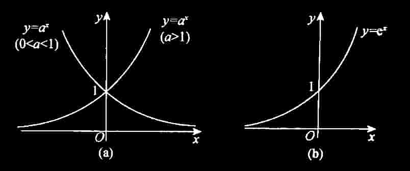

# 二、函数的图像

## (一) 直角坐标系下的图像 $\left( {f\left( {x,y}\right) = 0}\right)$

1. 常见图像

### (1) 基本初等函数与初等函数

基本初等函数: 常数函数、幂函数、指数函数、对数函数、三角函数、反三角函数.

#### ① 常数函数

$y = A,A$ 为常数,其图形为平行于 $x$ 轴的水平直线 (见图 1-2).

图1-2

#### ② 幂函数

$y=x^\mu$ （ $\mu$ 是实数）。

> 【注】 (1) $y = {x}^{\mu }$ 的定义域和值域取决于 $\mu$ 的值. 当 $x > 0$ 时, $y = {x}^{\mu }$ 都有定义.
>
> (2) 常用的幂函数 (见图 1-3(a)-(c)).
>
> $$
y = x,\;y = {x}^{2},\;y = \sqrt{x},\;y = {x}^{3},\;y = \sqrt[3]{x},\;y = \frac{1}{x}.$$
>
> (3) 当 $x > 0$ 时,由 $y = x$ 与 $y = \sqrt{x},y = \sqrt[3]{x},y = \ln x$ (见图 1-5(b)) 具有相同的单调性且与 $y = \displaystyle\frac{1}{x}$ 具有相反的单调性, 故
>
> ① 见到 $\sqrt{u},\sqrt[3]{u}$ 时,可用 $u$ 来研究最值;
>
> ② 见到 $\left| u\right|$ 时,由 $\left| u\right| = \sqrt{{u}^{2}}$ ,可用 ${u}^{2}$ 来研究最值;
>
> ③ 见到 ${u}_{1}{u}_{2}{u}_{3}$ 时,可用 $\ln \left( {{u}_{1}{u}_{2}{u}_{3}}\right) = \ln {u}_{1} + \ln {u}_{2} + \ln {u}_{3}$ 来研究最值;
>
> ④ 见到 $\displaystyle\frac{1}{u}$ 时,可用 $u$ 来研究最值 (结论相反,即 $\frac{1}{u}$ 与 $u$ 的最大值点、最小值点相反).
>
> 以上① ~ ④,可使得计算简单方便.

图 1-3

#### ③指数函数

$y = {a}^{x}\left( {a > 0,a \neq 1}\right)$ (见图 1-4(a)).

图 1-4

> 【注】(1) 定义域: $\left( {-\infty , + \infty }\right)$ . 值域: $\left( {0, + \infty }\right)$ .
>
> (2) 单调性: 当 $a > 1$ 时, $y = {a}^{x}$ 单调增加; 当 $0 < a < 1$ 时, $y = {a}^{x}$ 单调减少.
>
> (3) 常用的指数函数: $y = {\mathrm{e}}^{x}$ (见图 1-4(b)).
>
> (4) 极限: $\mathop{\lim }\limits_{{x \rightarrow - \infty }}{\mathrm{e}}^{x} = 0,\mathop{\lim }\limits_{{x \rightarrow + \infty }}{\mathrm{e}}^{x} = + \infty$ .
>
> (5) 特殊函数值: ${a}^{0} = 1,{\mathrm{e}}^{0} = 1$ .
