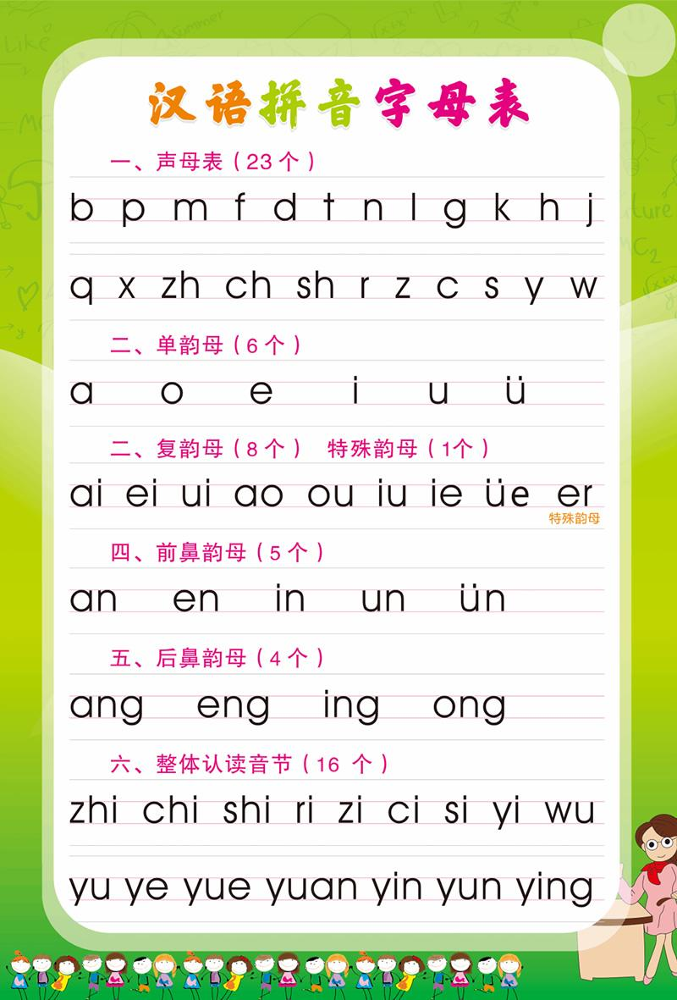
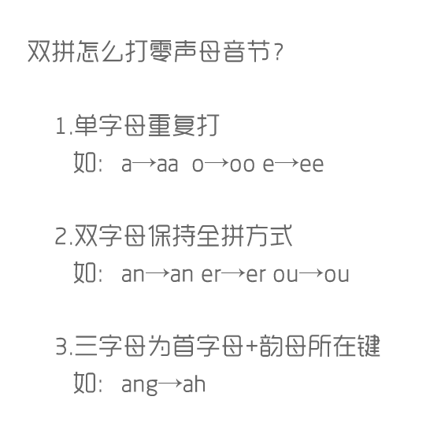

# 小鹤双拼

## 双拼定义

双拼（也称双打）是一种建立在拼音输入法基础上的输入方法，
可视为全拼的一种改进，它通过将汉语拼音中每个含多个字母的声母或韵母各自映射到某个按键上，
使得每个音都可以用两个按键打出，极大地提高了拼音输入法的输入速度。
这种声母或韵母到按键的对应表通常称之为双拼方案，
这种方案不是固定的，流行的大多数拼音输入法都支持双拼，并且有各自不同的方案，还允许用户自定义方案。

## 汉语拼音

学好小鹤双拼，首先得学好汉语拼音



## 小鹤双拼




`uan üan R`  
`üe T`  
`un ün Y`  
`ü ui V`

## Windows 10/11 为微软拼音导入小鹤双拼方案

按win+R 输入cmd

再粘贴以下内容

```bat
reg add HKCU\Software\Microsoft\InputMethod\Settings\CHS /v UserDefinedDoublePinyinScheme0 /t REG_SZ /d "小鹤双拼*2*^*iuvdjhcwfg^xmlnpbksqszxkrltvyovt"
```

打开输入法的设置菜单，其中已经出现小鹤双拼方案了，将其设置为默认即可。 作者：大白兔-夏日限定版  出处：[bilibili](https://www.bilibili.com/read/cv35435995/?jump_opus=1)
