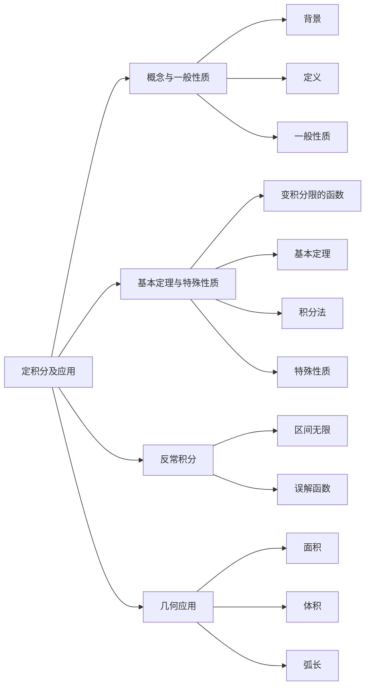

# 第5章 定积分及应用

## 第一节  定积分的基本概念与一般性质

### 二、定积分的定义

设函数 $f\left( x\right)$ 在区间 $\left\lbrack  {a,b}\right\rbrack$ 上有界,取 $a = {x}_{0} < {x}_{1} < \cdots  < {x}_{n} = b$ ,令 $\Delta {x}_{i} = {x}_{i} - {x}_{i - 1}$

$\left( {1 \leq  i \leq  n}\right) ;$

任取 ${\xi }_{i} \in  \left\lbrack  {{x}_{i - 1},{x}_{i}}\right\rbrack  \left( {1 \leq  i \leq  n}\right)$ ,作

$$
\mathop{\sum }\limits_{{i = 1}}^{n}f\left( {\xi }_{i}\right) \Delta {x}_{i}
$$

取 $\lambda  = \max \left\{  {\Delta {x}_{1},\cdots ,\Delta {x}_{n}}\right\}$ ,若极限 $\mathop{\lim }\limits_{{\lambda  \rightarrow  0}}\mathop{\sum }\limits_{{i = 1}}^{n}f\left( {\xi }_{i}\right) \Delta {x}_{i}$ 存在,则称函数 $f\left( x\right)$ 在 $\left\lbrack  {a,b}\right\rbrack$ 上可积,极限值称为 $f\left( x\right)$ 在 $\left\lbrack  {a,b}\right\rbrack$ 上的定积分,记为 ${\int }_{a}^{b}f\left( x\right) \mathrm{d}x$ .

---

(1) 极限 $\mathop{\lim }\limits_{{\lambda  \rightarrow  0}}\mathop{\sum }\limits_{{i = 1}}^{n}f\left( {\xi }_{i}\right) \Delta {x}_{i}$ 存在与否与区间的分法和区间上点的取法无关;

(2) 若 $\lambda  \rightarrow  0$ ,则 $n \rightarrow  \infty$ ,反之不对;

(3) 设函数 $f\left( x\right)$ 在 $\left\lbrack  {0,1}\right\rbrack$ 上可积，将区间 $\left\lbrack  {0,1}\right\rbrack$ 等分为

$$
\left\lbrack  {0,1}\right\rbrack   = \left\lbrack  {0,\frac{1}{n}}\right\rbrack   \cup  \left\lbrack  {\frac{1}{n},\frac{2}{n}}\right\rbrack   \cup  \cdots  \cup  \left\lbrack  {\frac{n - 1}{n},\frac{n}{n}}\right\rbrack  ;
$$

取 ${\xi }_{i} = \frac{i}{n}\left( {i \leq  i \leq  n}\right)$ ，则

$$
\mathop{\lim }\limits_{{\lambda  \rightarrow  0}}\mathop{\sum }\limits_{{i = 1}}^{n}f\left( {\xi }_{i}\right) \Delta {x}_{i} = \mathop{\lim }\limits_{{n \rightarrow  \infty }}\frac{1}{n}\mathop{\sum }\limits_{{i = 1}}^{n}f\left( \frac{i}{n}\right) ,
$$

而 $\mathop{\lim }\limits_{{\lambda  \rightarrow  0}}\mathop{\sum }\limits_{{i = 1}}^{n}f\left( {\xi }_{i}\right) \Delta {x}_{i} = {\int }_{0}^{1}f\left( x\right) \mathrm{d}x$ ，故

$$
\mathop{\lim }\limits_{{n \rightarrow  \infty }}\frac{1}{n}\mathop{\sum }\limits_{{i = 1}}^{n}f\left( \frac{i}{n}\right)  = {\int }_{0}^{1}f\left( x\right) \mathrm{d}x.
$$

（4）函数 $f\left( x\right)$ 在 $\left\lbrack  {a,b}\right\rbrack$ 上连续或 $f\left( x\right)$ 在 $\left\lbrack  {a,b}\right\rbrack$ 上有界且只有有限个间断点时可积.

### 三、定积分的一般性质

1. ${\int }_{a}^{b}\left\lbrack  {{k}_{1}f\left( x\right)  + {k}_{2}g\left( x\right) }\right\rbrack  \mathrm{d}x = {k}_{1}{\int }_{a}^{b}f\left( x\right) \mathrm{d}x + {k}_{2}{\int }_{a}^{b}g\left( x\right) \mathrm{d}x\left( {{k}_{1},{k}_{2}}\right.$ 为任意常数 $)$ .

2. ${\int }_{a}^{b}f\left( x\right) \mathrm{d}x = {\int }_{a}^{c}f\left( x\right) \mathrm{d}x + {\int }_{c}^{b}f\left( x\right) \mathrm{d}x$ .

3. ${\int }_{a}^{b}1\mathrm{\;d}x = b - a$ .

4. (1) 若 $f\left( x\right)  \geq  0\left( {a \leq  x \leq  b}\right)$ ,则 ${\int }_{a}^{b}f\left( x\right) \mathrm{d}x \geq  0$ ;

    (2) 若 $f\left( x\right)  \geq  g\left( x\right) \left( {a \leq  x \leq  b}\right)$ ,则 ${\int }_{a}^{b}f\left( x\right) \mathrm{d}x \geq  {\int }_{a}^{b}g\left( x\right) \mathrm{d}x$ ;

    (3) 若 $f\left( x\right) ,\left| {f\left( x\right) }\right|$ 在 $\left\lbrack  {a,b}\right\rbrack$ 上可积,则
    $$
    \left| {{\int }_{a}^{b}f\left( x\right) \mathrm{d}x}\right|  \leq  {\int }_{a}^{b}\left| {f\left( x\right) }\right| \mathrm{d}x.
    $$

5. 设函数 $f\left( x\right)$ 在 $\left\lbrack  {a,b}\right\rbrack$ 上可积,且 $m \leq  f\left( x\right)  \leq  M$ ,则
    $$
    m\left( {b - a}\right)  \leq  {\int }_{a}^{b}f\left( x\right) \mathrm{d}x \leq  M\left( {b - a}\right) .
    $$

6. (积分中值定理) 设函数 $f\left( x\right)  \in  C\left\lbrack  {a,b}\right\rbrack$ ,则存在 $\xi  \in  \left\lbrack  {a,b}\right\rbrack$ ,使得
    $$
    {\int }_{a}^{b}f\left( x\right) \mathrm{d}x = f\left( \xi \right) \left( {b - a}\right) .
    $$

## 第二节 定积分基本定理与定积分的特殊性质

在研究相关问题之前, 有几个基本性质需要了解:

(1) ${\int }_{a}^{a}f\left( x\right) \mathrm{d}x = 0$ ;

(2) ${\int }_{a}^{b}f\left( x\right) \mathrm{d}x =  - {\int }_{b}^{a}f\left( x\right) \mathrm{d}x$ ;

(3) 定积分由积分的上下限和函数关系决定, 与积分变量无关, 即
    $$
    {\int }_{a}^{b}f\left( x\right) \mathrm{d}x = {\int }_{a}^{b}f\left( t\right) \mathrm{d}t = {\int }_{a}^{b}f\left( u\right) \mathrm{d}u = \cdots .
    $$

### 一、变积分限的函数

设 $f\left( x\right)  \in  C\left\lbrack  {a,b}\right\rbrack$ ,取一点 $x \in  \left\lbrack  {a,b}\right\rbrack$ ,其对应的曲边梯形的面积为

$$
{\int }_{a}^{x}f\left( x\right) \mathrm{d}x,
$$

这个随着 $x$ 的变化而变化的量,记为 $\Phi \left( x\right)$ ,即 $\Phi \left( x\right)  = {\int }_{a}^{x}f\left( x\right) \mathrm{d}x$ (如图 5-1),而定积分与积分变量无关,一般记为

$$
\Phi \left( x\right)  = {\int }_{a}^{x}f\left( t\right) \mathrm{d}t,
$$

称此函数为积分上限函数.

### 二、定积分基本定理

#### 定理 1

设函数 $f\left( x\right) \in C\left\lbrack {a, b}\right\rbrack ,\Phi \left( x\right) = {\int }_{a}^{x}f\left( t\right) \mathrm{d}t$ ,则

$$
\frac{\mathrm{d}}{\mathrm{d}x}\Phi \left( x\right) = f\left( x\right) .
$$

划重点

(1) 若 $f\left( x\right) \in C\left\lbrack {a, b}\right\rbrack$ ,则 $f\left( x\right)$ 一定存在原函数.

(2) $\Phi \left( x\right) = {\int }_{a}^{x}f\left( t\right) \mathrm{d}t$ 即为 $f\left( x\right)$ 的一个原函数.

(3) $\frac{\mathrm{d}}{\mathrm{d}x}{\int }_{a}^{\phi \left( x\right) }f\left( t\right) \mathrm{d}t = f\left\lbrack {\phi \left( x\right) }\right\rbrack {\phi }^{\prime }\left( x\right)$ .

#### 定理 2 (牛顿 一 莱布尼茨公式)

设 $f\left( x\right) \in C\left\lbrack {a, b}\right\rbrack$ ,且 ${F}^{\prime }\left( x\right) = f\left( x\right)$ ,则

$$
{\int }_{a}^{b}f\left( x\right) \mathrm{d}x = F\left( b\right) - F\left( a\right) .
$$

### 三、定积分的积分法

#### 1. 换元积分法

设 $f\left( x\right) \in C\left\lbrack {a, b}\right\rbrack$ ,连续可导函数 $x = \varphi \left( t\right)$ 严格单调,且 $\varphi \left( \alpha \right) = a,\varphi \left( \beta \right) = b$ ,则

$$
{\int }_{a}^{b}f\left( x\right) \mathrm{d}x \xlongequal{\displaystyle x = \varphi \left( t\right)} {\int }_{\alpha }^{\beta }f\left\lbrack {\varphi \left( t\right) }\right\rbrack {\varphi }^{\prime }\left( t\right) \mathrm{d}t.
$$

#### 2. 分部积分法

被积函数为不定积分需要使用分部积分的形式的定积分计算时, 一般需要如下的分部积

分公式:

$$
{\int }_{a}^{b}u\mathrm{\;d}v = {\left. uv\right| }_{a}^{b} - {\int }_{a}^{b}v\mathrm{\;d}u.
$$

### 四、定积分的特殊性质

#### 1. 对称区间的定积分性质

设 $f\left( x\right) \in C\left\lbrack {-a, a}\right\rbrack$ ,则 ${\int }_{-a}^{a}f\left( x\right) \mathrm{d}x = {\int }_{0}^{a}\left\lbrack {f\left( x\right) + f\left( {-x}\right) }\right\rbrack \mathrm{d}x$ ,特别地,

(1) 若 $f\left( {-x}\right) = - f\left( x\right)$ ,则 ${\int }_{-a}^{a}f\left( x\right) \mathrm{d}x = 0$ ;

(2) 若 $f\left( {-x}\right) = f\left( x\right)$ ,则 ${\int }_{-a}^{a}f\left( x\right) \mathrm{d}x = 2{\int }_{0}^{a}f\left( x\right) \mathrm{d}x$ .

#### 2. 三角函数的定积分性质

1. 设函数 $f\left( x\right) \in C\left\lbrack {0,1}\right\rbrack$ ,则 ${\int }_{0}^{\frac{\pi }{2}}f\left( {\sin x}\right) \mathrm{d}x = {\int }_{0}^{\frac{\pi }{2}}f\left( {\cos x}\right) \mathrm{d}x$ ,特别地,

$$
{I}_{n} = {\int }_{0}^{\frac{\pi }{2}}{\sin }^{n}x\mathrm{\;d}x = {\int }_{0}^{\frac{\pi }{2}}{\cos }^{n}x\mathrm{\;d}x,
$$

且有

(1) ${I}_{n} = \frac{n - 1}{n}{I}_{n - 2}$ ;

(2) ${I}_{1} = 1$ ;

(3) ${I}_{0} = \frac{\pi }{2}$ ,即

$$
\begin{align*}
{I}_{2n} = &\frac{{2n} - 1}{2n} \cdot \frac{{2n} - 3}{{2n} - 2} \cdot \cdots \cdot \frac{1}{2} \cdot \frac{\pi }{2} = \frac{\left( {{2n} - 1}\right) !!}{\left( {2n}\right) !!} \cdot \frac{\pi }{2}&;
\\\\
{I}_{{2n} + 1} = &\frac{2n}{{2n} + 1} \cdot \frac{{2n} - 2}{{2n} - 1} \cdot \cdots \cdot \frac{2}{3} \cdot 1 = \frac{\left( {2n}\right) !!}{\left( {{2n} + 1}\right) !!}&.
\end{align*}
$$

#### 3. 周期函数的定积分性质

1. 设函数 $f\left( x\right)$ 是以 $T$ 为周期的连续函数,则对任意常数 $a$ ,有
    $$
    {\int }_{a}^{a + T}f\left( x\right) \mathrm{d}x = {\int }_{0}^{T}f\left( x\right) \mathrm{d}x.
    $$

2. 设函数 $f\left( x\right)$ 是以 $T$ 为周期的连续函数,则有
    $$
    {\int }_{0}^{nT}f\left( x\right) \mathrm{d}x = n{\int }_{0}^{T}f\left( x\right) \mathrm{d}x.
    $$

## 第三节 反常积分

### 一、区间无限的反常积分

#### 1. 积分区间右侧无限的反常积分

1. 定义

    设函数 $f\left( x\right) \in C\lbrack a, + \infty )$ ,对任意的 $b,{\int }_{a}^{b}f\left( x\right) \mathrm{d}x = F\left( b\right) - F\left( a\right)$ ,若极限 $\mathop{\lim }\limits_{{b \rightarrow + \infty }}\left\lbrack {F\left( b\right) - F\left( a\right) }\right\rbrack = A$ ,则称反常积分 ${\int }_{a}^{+\infty }f\left( x\right) \mathrm{d}x$ 收敛于常数 $A$ ,记为

    $$
    {\int }_{a}^{+\infty }f\left( x\right) \mathrm{d}x = A;
    $$

    若极限 $\mathop{\lim }\limits_{{b \rightarrow + \infty }}\left\lbrack {F\left( b\right) - F\left( a\right) }\right\rbrack$ 不存在,则称反常积分 ${\int }_{a}^{+\infty }f\left( x\right) \mathrm{d}x$ 发散.

2. 敛散性判别法

    （1）若存在 $\alpha > 1$ ,使得 $\mathop{\lim }\limits_{{x \rightarrow + \infty }}{x}^{\alpha}f\left( x\right)$ 存在,则反常积分 ${\int }_{a}^{+\infty }f\left( x\right) \mathrm{d}x$ 收敛;

    （2）若存在 $\alpha \leq 1$ ,使得 $\mathop{\lim }\limits_{{x \rightarrow + \infty }}{x}^{\alpha}f\left( x\right) = k\left( { \neq 0}\right)$ ,或者 $\mathop{\lim }\limits_{{x \rightarrow + \infty }}{x}^{\alpha}f\left( x\right) = \infty$ ,则反常积分 ${\int }_{a}^{+\infty }f\left( x\right) \mathrm{d}x$ 发散.

#### 2. 积分区间左侧无限的反常积分

1. 定义

    设函数 $f\left( x\right) \in C( - \infty, a\rbrack$ ,对任意的 $b,{\int }_{b}^{a}f\left( x\right) \mathrm{d}x = F\left( a\right) - F\left( b\right)$ ,若极限 $\mathop{\lim }\limits_{{b \rightarrow - \infty }}\left\lbrack {F\left( a\right) - F\left( b\right) }\right\rbrack = A$ ,则称反常积分 ${\int }_{-\infty }^{a}f\left( x\right) \mathrm{d}x$ 收敛于常数 $A$ ,记为
    $$
    {\int }_{-\infty }^{a}f\left( x\right) \mathrm{d}x = A;
    $$

    若极限 $\mathop{\lim }\limits_{{b \rightarrow - \infty }}\left\lbrack {F\left( a\right) - F\left( b\right) }\right\rbrack$ 不存在,则称反常积分 ${\int }_{-\infty }^{a}f\left( x\right) \mathrm{d}x$ 发散.

2. 敛散性判别法

    (1) 若存在 $\alpha > 1$ ,使得 $\mathop{\lim }\limits_{{x \rightarrow - \infty }}{x}^{\alpha }f\left( x\right)$ 存在,则反常积分 ${\int }_{-\infty }^{a}f\left( x\right) \mathrm{d}x$ 收敛;

    (2) 若存在 $\alpha \leq 1$ ,使得 $\mathop{\lim }\limits_{{x \rightarrow - \infty }}{x}^{\alpha}f\left( x\right) = k\left( { \neq 0}\right)$ ,或者 $\mathop{\lim }\limits_{{x \rightarrow - \infty }}{x}^{\alpha}f\left( x\right) = \infty$ ,则反常积分 ${\int }_{-\infty }^{a}f\left( x\right) \mathrm{d}x$ 发散.

#### 3. 积分区间左右无限的反常积分

设 $f\left( x\right) \in C\left( {-\infty , + \infty }\right)$ ,若反常积分 ${\int }_{-\infty }^{a}f\left( x\right) \mathrm{d}x$ 与 ${\int }_{a}^{+\infty }f\left( x\right) \mathrm{d}x$ 都收敛,则反常积分

${\int }_{-\infty }^{+\infty }f\left( x\right) \mathrm{d}x$ 收敛,且

$$
{\int }_{-\infty }^{+\infty }f\left( x\right) \mathrm{d}x = {\int }_{-\infty }^{a}f\left( x\right) \mathrm{d}x + {\int }_{a}^{+\infty }f\left( x\right) \mathrm{d}x;
$$

若反常积分 ${\int }_{-\infty }^{a}f\left( x\right) \mathrm{d}x$ 与 ${\int }_{a}^{+\infty }f\left( x\right) \mathrm{d}x$ 至少有一个发散,则反常积分 ${\int }_{-\infty }^{+\infty }f\left( x\right) \mathrm{d}x$ 发散.

>划重点
>
> (1) 称 ${\int }_{0}^{+\infty }{x}^{\alpha - 1}{e}^{-x}\mathrm{\;d}x\left( {\alpha > 0}\right)$ 为 $\Gamma$ 函数,记为 $\Gamma \left( \alpha \right)$ ,即
>
> $$
\Gamma \left( \alpha \right) = {\int }_{0}^{+\infty }{x}^{\alpha - 1}{e}^{-x}{dx}$$
>
> (2) $\Gamma \left( \alpha \right)$ 函数的性质如下:
>
> $$
\Gamma \left( {\alpha + 1}\right) = {\alpha \Gamma }\left( \alpha \right) ; \quad
\Gamma \left( {n + 1}\right) = n!;\quad
\Gamma \left( \frac{1}{2}\right) = \sqrt{\pi }.$$

### 二、无界函数的反常积分

#### 1. 区间左端点无界的反常积分

1. 定义

    设函数 $f\left( x\right) \in C(a, b\rbrack$ 且 $f\left( {a + 0}\right) = \infty$ ,对任意的 $\varepsilon > 0$ ,

    $$
    {\int }_{a + \varepsilon }^{b}f\left( x\right) \mathrm{d}x = F\left( b\right) - F\left( {a + \varepsilon }\right) ,
    $$

    若极限 $\mathop{\lim }\limits_{{\varepsilon \rightarrow 0}}\left\lbrack {F\left( b\right) - F\left( {a + \varepsilon }\right) }\right\rbrack = A$ ,则称反常积分 ${\int }_{a}^{b}f\left( x\right) \mathrm{d}x$ 收敛于常数 $A$ ,记为

    $$
    {\int }_{a}^{b}f\left( x\right) \mathrm{d}x = A;
    $$

    若极限 $\mathop{\lim }\limits_{{\varepsilon \rightarrow 0}}\left\lbrack {F\left( b\right) - F\left( {a + \varepsilon }\right) }\right\rbrack$ 不存在,则称反常积分 ${\int }_{a}^{b}f\left( x\right) \mathrm{d}x$ 发散.

2. 判别法

    （1）若存在 $\alpha < 1$ ,使得 $\mathop{\lim }\limits_{{x \rightarrow {a}^{ + }}}{\left( x - a\right) }^{\alpha}f\left( x\right)$ 存在,则反常积分 ${\int }_{a}^{b}f\left( x\right) \mathrm{d}x$ 收敛;

    （2）若存在 $\alpha \geq 1$ ,使得 $\mathop{\lim }\limits_{{x \rightarrow {a}^{ + }}}{\left( x - a\right) }^{\alpha}f\left( x\right) = k\left( { \neq 0}\right)$ ,或者 $\mathop{\lim }\limits_{{x \rightarrow {a}^{ + }}}{\left( x - a\right) }^{\alpha}f\left( x\right) = \infty$ ,则反常积分 ${\int }_{a}^{b}f\left( x\right) \mathrm{d}x$ 发散.

#### 2. 区间右端点无界的反常积分

1. 定义

    设函数 $f\left( x\right) \in C\lbrack a, b)$ 且 $f\left( {b - 0}\right) = \infty$ ,对任意的 $\varepsilon > 0$ ,

    $$
    {\int }_{a}^{b - \varepsilon }f\left( x\right) \mathrm{d}x = F\left( {b - \varepsilon }\right) - F\left( a\right) ,
    $$

    若极限 $\mathop{\lim }\limits_{{\varepsilon \rightarrow 0}}\left\lbrack {F\left( {b - \varepsilon }\right) - F\left( a\right) }\right\rbrack = A$ ,则称反常积分 ${\int }_{a}^{b}f\left( x\right) \mathrm{d}x$ 收敛于常数 $A$ ,记为

    $$
    {\int }_{a}^{b}f\left( x\right) \mathrm{d}x = A;
    $$

    若极限 $\mathop{\lim }\limits_{{\varepsilon \rightarrow 0}}\left\lbrack {F\left( {b - \varepsilon }\right) - F\left( a\right) }\right\rbrack$ 不存在,则称反常积分 ${\int }_{a}^{b}f\left( x\right) \mathrm{d}x$ 发散.

2. 判别法

    （1）若存在 $\alpha < 1$ ,使得 $\mathop{\lim }\limits_{{x \rightarrow {b}^{ - }}}{\left( b - x\right) }^{\alpha}f\left( x\right)$ 存在,则反常积分 ${\int }_{a}^{b}f\left( x\right) \mathrm{d}x$ 收敛;

    （2）若存在 $\alpha \geq 1$ ,使得 $\mathop{\lim }\limits_{{x \rightarrow {b}^{ - }}}{\left( b - x\right) }^{\alpha }f\left( x\right) = k\left( { \neq 0}\right)$ ,或者 $\mathop{\lim }\limits_{{x \rightarrow {b}^{ - }}}{\left( b - x\right) }^{\alpha }f\left( x\right) = \infty$ ,则反常积分 ${\int }_{a}^{b}f\left( x\right) \mathrm{d}x$ 发散.

#### 3. 区间内无界的反常积分

设函数 $f\left( x\right) \in C\left\lbrack {a, c)\cup (c, b}\right\rbrack$ 且 $c$ 为 $f\left( x\right)$ 的无穷间断点,当且仅当反常积分 ${\int }_{a}^{c}f\left( x\right) \mathrm{d}x$ 与 ${\int }_{c}^{b}f\left( x\right) \mathrm{d}x$ 都收敛时,反常积分 ${\int }_{a}^{b}f\left( x\right) \mathrm{d}x$ 收敛,且

$$
{\int }_{a}^{b}f\left( x\right) \mathrm{d}x = {\int }_{a}^{c}f\left( x\right) \mathrm{d}x + {\int }_{c}^{b}f\left( x\right) \mathrm{d}x,
$$

反常积分 ${\int }_{a}^{c}f\left( x\right) \mathrm{d}x$ 与 ${\int }_{c}^{b}f\left( x\right) \mathrm{d}x$ 至少有一个发散时,反常积分 ${\int }_{a}^{b}f\left( x\right) \mathrm{d}x$ 发散.

## 第四节 定积分的几何应用

### 一、面积

1. 设平面区域 $D$ 由 $y = g\left( x\right), y = f\left( x\right) \left( {g\left( x\right) \leq f\left( x\right) }\right)$ 及直线 $x = a, x = b$ 围成 (如图 5-2), 则该区域的面积为
    $$
    A = {\int }_{a}^{b}\left\lbrack {f\left( x\right) - g\left( x\right) }\right\rbrack \mathrm{d}x.
    $$

    

    图 5-2

2. 设平面区域 $D$ 由 $L : r = r\left( \theta \right)$ 及射线 $\theta = \alpha ,\theta = \beta$ 围成 (如图 5-3),则区域 $D$ 的面积为
    $$
    A = \frac{1}{2}{\int }_{\alpha }^{\beta }{r}^{2}\left( \theta \right) \mathrm{d}\theta .
    $$

    

    图 5-3

3. 设平面区域 $D$ 由 ${L}_{1} : r = {r}_{1}\left( \theta \right) ,{L}_{2} : r = {r}_{2}\left( \theta \right) \left( {{r}_{1}\left( \theta \right) \leq {r}_{2}\left( \theta \right) }\right)$ 及射线 $\theta = \alpha ,\theta = \beta$ 围成 (如图 5-4),则区域 $D$ 的面积为
    $$
    A = \frac{1}{2}{\int }_{\alpha }^{\beta }\left\lbrack {{r}_{2}^{2}\left( \theta \right) - {r}_{1}^{2}\left( \theta \right) }\right\rbrack \mathrm{d}\theta .
    $$

    

    图 5-4

### 二、体积

设平面区域 $D$ 是由 $y = f\left( x\right)$ ,直线 $x = a, x = b$ 及 $x$ 轴围成的曲边梯形 $\left( {0 \leq a < b}\right)$ .

1. 区域 $D$ 绕 $x$ 轴旋转一周 (如图 5-5) 而成的几何体的体积
    $$
    {V}_{x} = \pi {\int }_{a}^{b}{f}^{2}\left( x\right) \mathrm{d}x;
    $$

    

    图 5-5

2. 区域 $D$ 绕 $y$ 轴旋转一周 (如图 5-6) 而成的几何体的体积为
    $$
    {V}_{y} = {2\pi }{\int }_{a}^{b}x\left| {f\left( x\right) }\right| \mathrm{d}x.
    $$

    

    图 5-6

### 三、弧长

1. 设曲线段 $L : y = f\left( x\right) \left( {a \leq x \leq b}\right)$ ,则曲线段 $L$ 的长度为
    $$
    l = {\int }_{a}^{b}\sqrt{1 + {f}^{\prime 2}\left( x\right) }\mathrm{d}x.
    $$

2. 设曲线段 $L : \left\{ {\begin{array}{l} x = \varphi \left( t\right) , \\ y = \psi \left( t\right) \end{array}\left( {\alpha \leq t \leq \beta }\right) }\right.$ ,则曲线段 $L$ 的长度为
    $$
    l = {\int }_{\alpha }^{\beta }\sqrt{{\varphi }^{\prime 2}\left( t\right) + {\psi }^{\prime 2}\left( t\right) }\mathrm{d}t.
    $$
