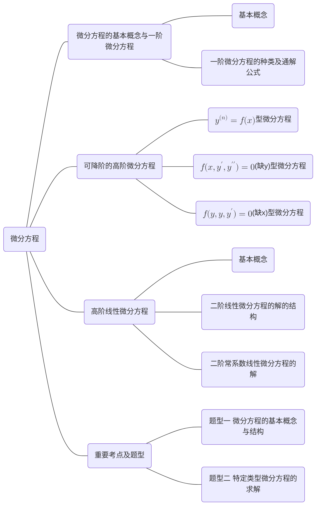

# 微分方程

## 第一节 微分方程的基本概念与一阶微分方程

### 一、微分方程的基本概念

1.微分方程：含导数或微分的方程，称为微分方程.

2.微分方程的阶：微分方程中所含的导数或微分的最高阶数，称为该微分方程的阶数.
如：$(y^\prime)^2+2xy=x^2+1$ 为一阶微分方程；$\frac{\mathrm{d}^2y}{\mathrm{d}x^2}-x(y^\prime)^3=\mathrm{e}^{2x}$ 为二阶微分方程.

3.微分方程的解：使得微分方程成立的函数，称为微分方程的解.

(1)不含任意常数的微分方程的解，称为特解

(2) 含相互独立的任意常数的个数与微分方程阶数一致的微分方程的解，称为通解
上述例2中，$y_1=e^{-x},y_2=e^{2x}$都是微分方程$y^{\prime\prime}-y^{\prime}-2y=0$ 的特解；$y_3=C_1e^{-x}+C_2e^{2x}$为微分
方程$y^{\prime\prime}-y^{\prime}-2y=0$ 的通解

### 二、一阶微分方程的种类及解法(或通解公式)

#### 1. 可分离变量的微分方程

1.定义 对一阶微分方程$\frac{\mathrm{d}y}{\mathrm{d}x}=f(x,y)$,若$f(x,y)=\varphi_1(x)\varphi_2(y)(\varphi_2(y)\neq0)$,则称

$\frac{\mathrm{d}y}{\mathrm{d}x}=f(x,y)$为可分离变量的微分方程

2.解法 将 $\frac{\mathrm{d}y}{\mathrm{d}x}=f(x,y)$ 化为$\frac{\mathrm{d}y}{\mathrm{d}x}=\varphi_1(x)\varphi_2(y)$ ,变量分离得

$$
\frac{\mathrm{d}y}{\varphi_2(y)}=\varphi_1(x)\mathrm{d}x\:,$$

等号两边积分得

$$
\int\frac{\mathrm{d}y}{\varphi_2(y)}=\int\varphi_1(x)\mathrm{d}x+C.
$$

#### 2. 齐次微分方程

1.定义 对微分方程 $\frac{\mathrm{d}y}{\mathrm{d}x}=f(x,y)$ ,若 $f(x,y)=\varphi\left(\frac yx\right)$,则称$\frac{\mathrm{d}y}{\mathrm{d}x}=f(x,y)$为齐次微分方程.

2.解法 将 $\frac {\mathrm{d} y}{\mathrm{d} x}= f( x, y)$化为$\frac{\mathrm{d}y}{\mathrm{d}x}=\varphi\left(\frac yx\right),令u=\frac yx$,则$y=ux,\frac{\mathrm{d}y}{\mathrm{d}x}=u+x\:\frac{\mathrm{d}u}{\mathrm{d}x}$ ,

代人得

$$
x\:\frac{\mathrm{d}u}{\mathrm{d}x}=\varphi\:(u\:)-u\:,
$$

变量分离后积分得

$$
\int\frac{\mathrm{d}u}{\varphi\left(u\right)-u}=\int\frac{\mathrm{d}x}x+C\:,
$$

再将$u=\frac yx$ 代入即可得原方程的通解.

#### 3. 一阶齐次线性微分方程

1,定义

形如$\frac{\mathrm{d}y}{\mathrm{d}x}+P(x)y=0$ 的微分方程，称为一阶齐次线性微分方程

2.解法及通解公式

$\frac{\mathrm{d}y}{\mathrm{d}x}+P(x)y=0$ 化为 $\frac{\mathrm{d}y}{\mathrm{d}x}=-P(x)y$,显然$y=0$ 为微分方程的一个解；当 $y\neq0$ 时，原方程化为

$$
\frac{\mathrm{d}y}y=-P\left(x\right)\mathrm{d}x\:,
$$

等号两边积分得

$$
\ln\mid y\mid=-\int P\left(x\right)\mathrm{d}x+C_0,\text{或 }y=\pm\mathrm{e}^{C_0}\mathrm{e}^{-\int P\left(x\right)\mathrm{d}x},
$$

令 $C=\pm\mathrm{e}^{C_0}$ ,则 $y= C\mathrm{e}^{-\int P(x)\mathrm{d}x}\left ( C\neq 0\right )$ ,故原方程的通解为

$$
y=C\mathrm{e}^{-\int P(x)\mathrm{d}x}\left(C\text{ 为任意常数}\right).
$$

称 $y=C\mathrm{e}^{-\int P(x)\mathrm{d}x}$ 为一阶齐次线性微分方程 $\frac{\mathrm{d}y}{\mathrm{d}x}+P(x)y=0$ 的通解公式。

#### 4. 一阶非齐次线性微分方程

1.定义

形如 $\frac{\mathrm{d}y}{\mathrm{d}x}+P(x)y=Q(x)(Q(x)\not\equiv0)$ 为一阶非齐次线性微分方程

2.解法(常数变易法)

设方程$\frac{\mathrm{d}y}{\mathrm{d}x}+P(x)y=Q(x)$的通解为
$$y=C\left(x\right)\mathrm{e}^{-\int P(x)\mathrm{d}x},$$
代人得

$$
C'(x)\mathrm{e}^{-\int P(x)\mathrm{d}x}=Q(x)
\text{ , 或 }
C'(x)=Q(x)\mathrm{e}^{\int P(x)\mathrm{d}x}
$$

从而 $C(x)=\int Q(x)\mathrm{e}^{\int P(x)\mathrm{d}x}\mathrm{d}x+C$ ,故一阶非齐次线性微分方程 $\frac{\mathrm{d}y}{\mathrm{d}x}+P(x)y=Q(x)$ 的通解公式为

$$
y=\left[\int Q(x)\mathrm{e}^{\int P(x)\mathrm{d}x}\mathrm{d}x+C \right]\mathrm{e}^{-\int P(x)\mathrm{d}x}\left(C\text{ 为任意常数}\right).
$$

## 第二节 可降阶的高阶微分方程

### 一、 $y^{(n)}=f(x)\;(x \ge 2)$ 型微分方程

解法: 将 $y^{(n)}=f(x)$ 进行 $n$ 次不定积分，即可得该微分方程的通解

### 二、 $f(x,y',y'')=0$ (缺y)型微分方程

解法：令 $y^\prime=p$ ,则 $y^{\prime\prime}=\frac{\mathrm{d}p}{\mathrm{d}x}$ ,代人得一阶微分方程

$$
f\begin{pmatrix}x\:,p\:,\frac{\mathrm{d}p}{\mathrm{d}x}\end{pmatrix}=0\:,
$$

解出 $p=\varphi(x,C_1)$ ,即 $y^\prime=\varphi(x,C_1)$ ,再进行一次不定积分即可得原方程的通解.

### 三、 $f(y,y',y'')=0$ (缺x)型微分方程

解法：令 $y^\prime = p, 则  y^{\prime \prime }= \frac {\mathrm{d} p}{\mathrm{d} x}= \frac {\mathrm{d} p/ \mathrm{d} y}{\mathrm{d} x/ \mathrm{d} y}= \frac {\mathrm{d} y}{\mathrm{d} x}\cdot \frac {\mathrm{d} p}{\mathrm{d} y}= p$ $\frac {\mathrm{d} p}{\mathrm{d} y}$ ,代人得

$$
f\left(y\:,p\:,p\:\frac{\mathrm{d}p}{\mathrm{d}y}\right)=0\:,
$$

解出 $p=\varphi\left(y,C_1\right)$,变量分离得

$$
\frac{\mathrm{d}y}{\varphi(y,C_1)}=\mathrm{d}x\:,
$$

两边积分得

$$
\int\frac{\mathrm{d}y}{\varphi(y,C_1)}=x+C_2.$$

## 第三节 高阶线性微分方程

### 一、基本概念

#### 1. 二阶齐次线性微分方程

形如

$$
\begin{align}
y''(x)+p(x)y'+q(x)y=0 \tag*{\textcircled{1}}
\end{align}
$$

的方程称为二阶齐次线性微分方程

#### 2. 二阶非齐次线性微分方程

形如

$$
\begin{align}
y''(x)+p(x)y'+q(x)y=f(x) \tag*{\textcircled{2}}
\end{align}
$$

的方程称为二阶非齐次线性微分方程

### 二、二阶线性微分方程的解的结构

1.设$\varphi_1(x),\varphi_2(x),...,\varphi_s(x)$为二阶齐次线性微分方程$\textcircled{1}$的一组解，则
$$k_1\varphi_1(x)+k_2\varphi_2(x)+\cdots+k_s\varphi_s(x)$$
仍为$\textcircled{1}$的解.

2.设$\varphi_1(x),\varphi_2(x),...,\varphi_s(x)$为二阶非齐次线性微分方程$\textcircled{2}$的一组解，则
$$k_1\varphi_1(x)+k_2\varphi_2(x)+\cdotp\cdotp\cdotp+k_s\varphi_s(x)$$
为$\textcircled{1}$ 的解的充分必要条件是 $k_1+k_2+\cdots+k_s=0;$
$$k_1\varphi_1(x)+k_2\varphi_2(x)+\cdots+k_s\varphi_s(x)$$
为$\textcircled{2}$ 的解的充分必要条件是 $k_1+k_2+\cdots+k_s=1.$

3.对方程 $\textcircled{2}$,若 $f(x)=f_1(x)+f_2(x)$,则方程 $\textcircled{2}$ 可拆成两个方程

$$
\begin{align}
y^{\prime\prime}+p\left(x\right)y^{\prime}+q\left(x\right)y=f_{_1}\left(x\right), \tag*{\textcircled{3}}
\end{align}
$$

$$
\begin{align}
y^{\prime\prime}+p\left(x\right)y^{\prime}+q\left(x\right)y=f_{2}\left(x\right), \tag*{\textcircled{4}}
\end{align}
$$

若$\varphi_1(x),\varphi_2(x)$分别为$\textcircled{3}\textcircled{4}$的两个特解，则$\varphi_{_1}(x)+\varphi_{_2}(x)$为方程$\textcircled{2}$的特解.

4.设$\varphi_1(x),\varphi_2(x)$为$\textcircled{1}$的两个不成比例的解，则$\textcircled{1}$的通解为
$$y=C_1\varphi_1(x)+C_2\varphi_2(x).$$
5.设$\varphi_1(x),\varphi_2(x)$为$\textcircled{1}$的两个不成比例的解，$\varphi_0(x)$为$\textcircled{2}$的特解，则$\textcircled{2}$的通解为
$$y=C_1\varphi_1(x)+C_2\varphi_2(x)+\varphi_0(x).$$

### 三、二阶常系数线性微分方程的解

#### 1. 二阶常系数齐次线性微分方程

1.定义

形如 $y^{\prime\prime}+py^{\prime}+qy=0$ ,其中 $p,q$ 为常数，称该方程为二阶常系数齐次线性微分方程.

2.通解

称 $\lambda^2+p\lambda+q=0$ 为方程 $y^{\prime\prime}+py^{\prime}+qy=0$ 的特征方程，按照特征方程解的不同情形，通解分为如下三种情形：

(1) $\Delta=p^2-4q>0$,特征方程有两个不同的实特征值$\lambda_1,\lambda_2$,方程的通解为
$$y=C_1\mathrm{e}^{\lambda_1x}+C_2\mathrm{e}^{\lambda_2x};$$

$(2)\Delta=p^2-4q=0$,特征方程有两个相等的实特征值$\lambda_1=\lambda_2$,方程的通解为
$$y=(C_1+C_2x)\mathrm{e}^{\lambda_1x}\:;$$

(3) $\Delta=p^2-4q<0$ ，特征方程有一对共轭的虚特征值 $\lambda_{1,2}=\alpha\pm\mathrm{i}\beta$ ，方程的通解为

$$
y=\mathrm{e}^{\alpha x}\left(C_{1}\cos\beta x+C_{2}\sin\beta x\right).
$$

#### 2. 二阶常系数非齐次线性微分方程

1.定义

形如 $y^{\prime\prime}+py^{\prime}+qy=f(x)$,其中 $p,q$ 为常数$,f(x$ )为非零的函数，称该方程为二阶常系数非齐次线性微分方程.

2.特解求法

**类型一**：

$f(x)=P_n(x)\mathrm{e}^{kx}$ （其中 $P_n(x)$ 为 $n$ 次多项式）

(1) 若 $k\neq\lambda_1,k\neq\lambda_2$ ,方程 $y^{\prime\prime}+py^{\prime}+qy=f(x)$ 的特解形式为
$$y^*(x)=Q_n(x)\mathrm{e}^{kx}=(b_nx^n+\cdotp\cdotp\cdotp+b_1x+b_0)\mathrm{e}^{kx};$$

(2) 若$k=\lambda_1,k\neq\lambda_2$,方程$y^{\prime\prime}+py^{\prime}+qy=f(x)$的特解形式为
$$y^*\left(x\right)=xQ_n\left(x\right)\mathrm{e}^{kx}=x\left(b_nx^n+\cdots+b_1x+b_0\right)\mathrm{e}^{kx};$$

(3)若 $k=\lambda_1=\lambda_2$,方程$y^{\prime\prime}+py^{\prime}+qy=f(x)$的特解形式为

$$
y^{*}(x)=x^{2}Q_{n}(x)\mathrm{e}^{kx}=x^{2}(b_{n}x^{n}+\cdots+b_{1}x+b_{0})\mathrm{e}^{kx}.
$$

**类型二**：

$f(x)=\mathrm{e}^{ax}\left[P_{m}^{(1)}(x)\mathrm{cos}\beta x+P_{l}^{(2)}(x)\mathrm{sin}\beta x\right]$(其中$P_m^{(1)}(x),P_{l}^{(2)}(x)$分别为$m$
和 $l$ 次多项式)

令 $n=\max\left\{m,l\right\},\alpha+i\beta\neq\lambda_1,\alpha+i\beta\neq\lambda_2$ ,则 $y^{\prime\prime}+py^{\prime}+qy=f(x)$ 的特解形式为

$$
y^{*}(x)=\mathrm{e}^{ax}\left[Q_n^{(1)}(x)\cos\beta x+Q_n^{(2)}(x)\sin\beta x\right]
,$$

其中$Q_n^{(1)}(x),Q_n^{(2)}(x)$为$n$次多项式；
