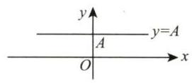
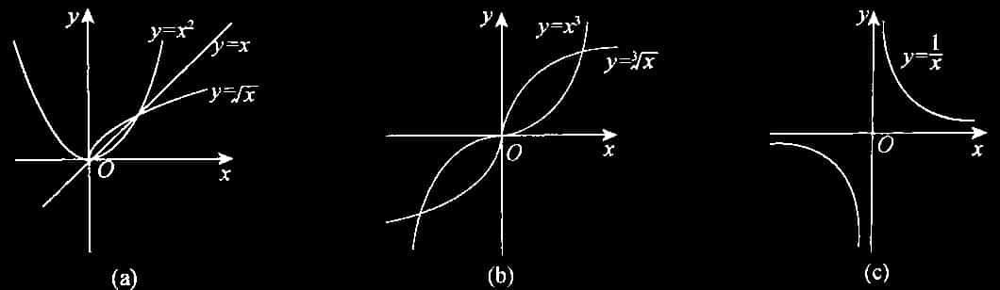
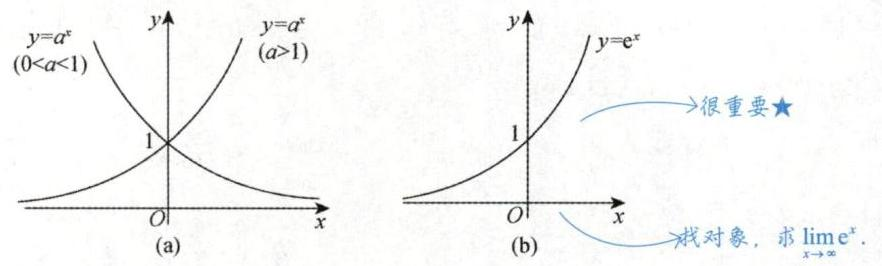
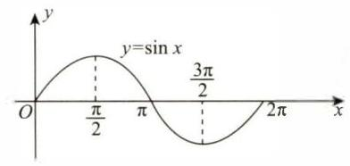
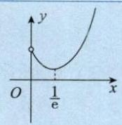
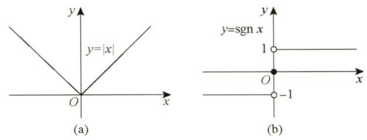

# 1.2 函数的图像

## 1. 基本初等函数与初等函数

基本初等函数: 常数函数、幂函数、指数函数、对数函数、三角函数、反三角函数.

### (1) 常数函数

$y = A, A$ 为常数,其图形为平行于 $x$ 轴的水平直线 (见图 1-5).

> 易考 “找交点个数” 或在概率论中求概率 $P\{ g\left( X\right) \leq y\}$  
> 它为偶函数

图 1-5

### (2) 幂函数

$y = {x}^{\mu }\left( {\mu \text{ 是实数 }}\right)$ .

> 【注】(1) $y = {x}^{\mu }$ 的定义域和值域取决于 $\mu$ 的值. 当 $x > 0$ 时, $y = {x}^{\mu }$ 都有定义.
>
> (2) 常用的幂函数 (见图 1-6).
>
> $$
y = x, y = {x}^{2}, y = \sqrt{x}, y = {x}^{3}, y = \sqrt[3]{x}, y = \frac{1}{x}.$$
>
> 
>
> 图 1-6
>
> (3) 当 $x > 0$ 时,由 $y = x$ 与 $y = \sqrt{x}, y = \sqrt[3]{x}, y = \ln x$ [见图 1-8(b)] 具有相同的单调性且与 $y = \displaystyle\frac{1}{x}$ 具有相反的单调性, 故
>
> ① 见到 $\sqrt{u},\sqrt[3]{u}$ 时,可用 $u$ 来研究最值;
>
> ② 见到 $\left| u\right|$ 时,由 $\left| u\right| = \sqrt{{u}^{2}}$ ,可用 ${u}^{2}$ 来研究最值;
>
> ③ 见到 ${u}_{1}{u}_{2}{u}_{3}$ 时,可用 $\ln \left( {{u}_{1}{u}_{2}{u}_{3}}\right) = \ln {u}_{1} + \ln {u}_{2} + \ln {u}_{3}$ 来研究最值;
>
> ④ 见到 $\displaystyle\frac{1}{u}$ 时,可用 $u$ 来研究最值 (结论相反,即 $\displaystyle\frac{1}{u}$ 与 $u$ 的最大值点、最小值点相反).
>
> 利用以上①∼④ ,可使得计算简单方便.

【例 1.10】 设 $0 < x < \displaystyle\frac{1}{2}$ ,求 $y\left( x\right) = {x}^{6}{\left( 1 - x\right) }^{2}{\left( 1 - 2x\right) }^{4}$ 的最大值点.

解 取对数, 得

$$
\ln y\left( x\right) = 6\ln x + 2\ln \left( {1 - x}\right) + 4\ln \left( {1 - {2x}}\right) .
$$

令

$$
\frac{\mathrm{d}\left\lbrack {\ln y\left( x\right) }\right\rbrack }{\mathrm{d}x} = \frac{6}{x} - \frac{2}{1 - x} - \frac{8}{1 - {2x}} = \frac{{24}{x}^{2} - {28x} + 6}{x\left( {1 - x}\right) \left( {1 - {2x}}\right) } = 0,
$$

即 ${12}{x}^{2} - {14x} + 3 = 0$ ,解得 $x = \displaystyle\frac{7 \pm \sqrt{13}}{12}$ ,因为 $\displaystyle\frac{7 + \sqrt{13}}{12} > \frac{1}{2}$ 不符合题意,又 $\mathop{\lim }\limits_{{x \rightarrow {0}^{ + }}}y\left( x\right) = \mathop{\lim }\limits_{{x \rightarrow \left( \frac{1}{2}\right)^- }}y\left( x\right) =$ $0 < y\left( \displaystyle\frac{7 - \sqrt{13}}{12}\right)$ ,故 $y$ 的最大值点为 $x = \displaystyle\frac{7 - \sqrt{13}}{12}$ .

### (3) 指数函数

$y = {a}^{x}\left( {a > 0, a \neq 1}\right)$ [见图 1-7(a)].

图 1-7

> 【注】(1) 定义域: $\left( {-\infty , + \infty }\right)$ ,值域: $\left( {0, + \infty }\right)$ .
>
> (2) 单调性: 当 $a > 1$ 时, $y = {a}^{x}$ 单调增加; 当 $0 < a < 1$ 时, $y = {a}^{x}$ 单调减少.
>
> (3) 常用的指数函数: $y = {\mathrm{e}}^{x}$ [见图 1-7(b)].
>
> (4) 极限: $\mathop{\lim }\limits_{{x \rightarrow - \infty }}{\mathrm{e}}^{x} = 0,\mathop{\lim }\limits_{{x \rightarrow + \infty }}{\mathrm{e}}^{x} = + \infty$ .
>
> (5) 特殊函数值: ${a}^{0} = 1,{\mathrm{e}}^{0} = 1$ .
>
> (6) 指数运算法则.
>
>
> $$
{a}^{\alpha } \cdot {a}^{\beta } = {a}^{\alpha + \beta },\frac{{a}^{\alpha }}{{a}^{\beta }} = {a}^{\alpha - \beta },{\left( {a}^{\alpha }\right) }^{\beta } = {a}^{\alpha \beta },{\left( ab\right) }^{\alpha } = {a}^{\alpha }{b}^{\alpha },{\left( \frac{a}{b}\right) }^{\alpha } = \frac{{a}^{\alpha }}{{b}^{\alpha }}, $$
>
>> $$
(\alpha^\alpha)^\beta \text{如}{\left| x\right| }^{3n} = {\left( {\left| x\right| }^{3}\right) }^{n} = {\left( \left| {x}^{3}\right| \right) }^{n} $$
>>
>> $$
\alpha^{\alpha - \beta}\text{如}{\mathrm{e}}^{\tan x} - {\mathrm{e}}^{\sin x} = {\mathrm{e}}^{\sin x}\left( {{\mathrm{e}}^{\tan x - \sin x} - 1}\right) $$
>
> 其中 $a, b$ 是正实数, $\alpha ,\beta$ 是任意实数.

### (4) 对数函数

$y = {\log }_{a}x\left( {a > 0, a \neq 1}\right) \left\lbrack \text{见图 1-8(a)}\right\rbrack$ 是 $y = {a}^{x}$ 的反函数.

图 1-8

>【注】(1) 定义域: $\left( {0, + \infty }\right)$ ,值域: $\left( {-\infty , + \infty }\right)$ .
>
>(2) 单调性: 当 $a > 1$ 时, $y = {\log }_{a}x$ 单调增加; 当 $0 < a < 1$ 时, $y = {\log }_{a}x$ 单调减少.
>
>(3) 常用的对数函数: $y = \ln x$ (自然对数: $\ln x = {\log }_{\mathrm{e}}x,\mathrm{e} = {2.71828}\cdots$ ) [见图 1-8(b)].
>
>(4) 特殊函数值: ${\log }_{a}1 = 0,{\log }_{a}a = 1,\ln 1 = 0,\ln \mathrm{e} = 1$ .
>
>(5) 极限: $\mathop{\lim }\limits_{{x \rightarrow {0}^{ + }}}\ln x = - \infty ,\mathop{\lim }\limits_{{x \rightarrow + \infty }}\ln x = + \infty$ .
>
>(6) 常用公式: $x = {\mathrm{e}}^{\ln x}\left( {x > 0}\right) ,{u}^{v} = {\mathrm{e}}^{\ln {u}^{v}} = {\mathrm{e}}^{v\ln u}\left( {u > 0}\right)$ .
>
>(7) 对数运算法则.
>
> ① ${\log }_{a}\left( {MN}\right) = {\log }_{a}M + {\log }_{a}N$ (积的对数 $=$ 对数的和).
>> 积变和
>
>② ${\log }_{a}\displaystyle\frac{M}{N} = {\log }_{a}M - {\log }_{a}N$ (商的对数 $=$ 对数的差).
>> 商变差
>
>③ ${\log }_{a}{M}^{n} = n{\log }_{a}M$，${\log }_{a}\sqrt[n]{M} = \displaystyle\frac{1}{n}{\log }_{a}M$ (幂的对数 $=$ 对数的倍数).
>
>> 幂次变倍数
>
>常考: 当 $x > 0$ 时,
>
>$\ln \sqrt{x} = \displaystyle\frac{1}{2}\ln x$ ； $\ln \displaystyle\frac{1}{x} = - \ln x$ ； $\ln \left( {1 + \displaystyle\frac{1}{x}}\right) = \ln \displaystyle\frac{x + 1}{x} = \ln \left( {x + 1}\right) - \ln x$ （中值定理（拉格朗日中值定理）证明）。

【例 1.11】 已知 ${\mathrm{e}}^{x} = \mathop{\sum }\limits_{{n = 0}}^{\infty }\displaystyle\frac{{x}^{n}}{n!}, x \in \mathbf{R}$ ,则 ${2}^{x} = \left( \;\right)$ .

(A) $\mathop{\sum }\limits_{{n = 1}}^{\infty }\displaystyle\frac{{\left( x\ln 2\right) }^{n}}{n!}$  &emsp; (B) $\mathop{\sum }\limits_{{n = 0}}^{\infty }\displaystyle\frac{{\left( x\ln 2\right) }^{n}}{n!}$  &emsp; (C) $\mathop{\sum }\limits_{{n = 1}}^{\infty }\displaystyle\frac{\left( {\ln 2}\right) {x}^{n}}{n!}$  &emsp; (D) $\mathop{\sum }\limits_{{n = 0}}^{\infty }\displaystyle\frac{\left( {\ln 2}\right) {x}^{n}}{n!}$

解 应选 (B).

由于 ${2}^{x} = {\mathrm{e}}^{x\ln 2}$ ,又 ${\mathrm{e}}^{x} = \mathop{\sum }\limits_{{n = 0}}^{\infty }\displaystyle\frac{{x}^{n}}{n!}, x \in \mathbf{R}$ ,因此 ${2}^{x} = \mathop{\sum }\limits_{{n = 0}}^{\infty }\displaystyle\frac{{\left( x\ln 2\right) }^{n}}{n!}$ .

### (5) 三角函数

一拱的面积为2.

#### ①正弦函数与余弦函数

正弦函数 $y = \sin x$ [见图 1-9(a)],余弦函数 $y = \cos x$ [见图 1-9(b)].

图 1-9

>【注】(1) 定义域: $\left( {-\infty , + \infty }\right)$ ,值域: $\left\lbrack {-1,1}\right\rbrack$ .
>
>(2) 奇偶性: $y = \sin x$ 是奇函数, $y = \cos x$ 是偶函数, $x \in \left( {-\infty , + \infty }\right)$ .
>
>(3) 周期性: $y = \sin x$ 和 $y = \cos x$ 均以 ${2\pi }$ 为最小正周期, $x \in \left( {-\infty , + \infty }\right)$ .
>
>(4) 有界性: $\left| {\sin x}\right| \leq 1,\left| {\cos x}\right| \leq 1$ .
>
>(5) 特殊函数值: $\;\sin 0 = 0,\sin \displaystyle\frac{\pi }{6} = \frac{1}{2},\sin \frac{\pi }{4} = \frac{\sqrt{2}}{2},\sin \frac{\pi }{3} = \frac{\sqrt{3}}{2}$ ,
>
>$$
>\sin \frac{\pi }{2} = 1,\sin \pi = 0,\sin \frac{3\pi }{2} = - 1,\sin {2\pi } = 0,$$
>
>$$
\cos 0 = 1,\cos \frac{\pi }{6} = \frac{\sqrt{3}}{2},\cos \frac{\pi }{4} = \frac{\sqrt{2}}{2},\cos \frac{\pi }{3} = \frac{1}{2}\text{,} $$
>
>$$
>\cos \frac{\pi }{2} = 0,\cos \pi = - 1,\cos \frac{3\pi }{2} = 0,\cos {2\pi } = 1.$$
>
>(6) ${\sin }^{2}\alpha + {\cos }^{2}\alpha = 1$ .

#### ②正切函数与余切函数

正切函数 $y = \tan x$ [见图 1-10(a)],余切函数 $y = \cot x$ [见图 1-10(b)].

$$
\tan x = \frac{\sin x}{\cos x},\cot x = \frac{\cos x}{\sin x} = \frac{1}{\tan x}.
$$

图 1-10

> 【注】(1) 定义域: $y = \tan x$ 的定义域为 $\left\{ {x \mid x \neq {k\pi } + \displaystyle\frac{\pi }{2}\left( {k \in \mathbf{Z}}\right) }\right\} ;y = \cot x$ 的定义域为 $\{ x \mid x \neq {k\pi }$ $\left( {k \in \mathbf{Z}}\right) \}$ .
>
> 值域: $\left( {-\infty , + \infty }\right)$ .
>
> (2) 奇偶性: $y = \tan x$ 和 $y = \cot x$ 均为奇函数 (在其定义域内).
>
> (3) 周期性: $y = \tan x$ 和 $y = \cot x$ 均以 $\pi$ 为最小正周期 (在其定义域内).
>
> (4) 特殊函数值: $\;\tan 0 = 0,\tan \displaystyle\frac{\pi }{6} = \frac{\sqrt{3}}{3},\tan \frac{\pi }{4} = 1,\tan \frac{\pi }{3} = \sqrt{3}$ ,
>
> $$
\mathop{\lim }\limits_{{x \rightarrow \frac{\pi }{2}}}\tan x = \infty ,\tan \pi = 0,\mathop{\lim }\limits_{{x \rightarrow \frac{3\pi }{2}}}\tan x = \infty ,\tan {2\pi } = 0, $$
>
> $$
\mathop{\lim }\limits_{{x \rightarrow 0}}\cot x = \infty ,\cot \frac{\pi }{6} = \sqrt{3},\cot \frac{\pi }{4} = 1,\cot \frac{\pi }{3} = \frac{\sqrt{3}}{3}, $$
>
> $$
\cot \frac{\pi }{2} = 0,\mathop{\lim }\limits_{{x \rightarrow \pi }}\cot x = \infty ,\cot \frac{3\pi }{2} = 0,\mathop{\lim }\limits_{{x \rightarrow {2\pi }}}\cot x = \infty .$$

#### ③正割函数与余割函数

正割函数 $y = \sec x$ [见图 1-11(a)],余割函数 $y = \csc x$ [见图 1-11(b)].

$$
\sec x = \frac{1}{\cos x},\csc x = \frac{1}{\sin x}.
$$

图 1-11

> 【注】(1) 定义域: $y = \sec x$ 的定义域为 $\left\{ {x \mid x \neq {k\pi } + \displaystyle\frac{\pi }{2}\left( {k \in \mathbf{Z}}\right) }\right\} ;y = \csc x$ 的定义域为 $\{ x \mid x \neq {k\pi }$ $\left( {k \in \mathbf{Z}}\right) \}$ .
>
> 值域: $\left( {-\infty , - 1\rbrack \cup \lbrack 1, + \infty }\right)$ .
>
> (2) 奇偶性: $y = \sec x$ 为偶函数, $y = \csc x$ 为奇函数 (在其定义域内).
>
> (3) 周期性: $y = \sec x$ 和 $y = \csc x$ 均以 ${2\pi }$ 为最小正周期 (在其定义域内).
>
> (4) $1 + {\tan }^{2}\alpha = {\sec }^{2}\alpha $ ； $1 + {\cot }^{2}\alpha = {\csc }^{2}\alpha$ .

### (6) 反三角函数

#### ①反正弦函数与反余弦函数.

反正弦函数 $y = \arcsin x$ [见图 1-12(a)],反余弦函数 $y = \arccos x$ [见图 1-12(b)].

图 1-12

$y = \arcsin x$ 是 $y = \sin x\left( {-\displaystyle\frac{\pi }{2} \leq x \leq \frac{\pi }{2}}\right)$ 的反函数, $y = \arccos x$ 是 $y = \cos x\left( {0 \leq x \leq \pi }\right)$ 的反函数.

>【注】(1) 主值区间.
>
>$y = \arcsin x$ 的主值区间为 $\left\lbrack {-\displaystyle\frac{\pi }{2},\frac{\pi }{2}}\right\rbrack, y = \arccos x$ 的主值区间为 $\left\lbrack {0,\pi }\right\rbrack$ .
>
>(2) 反三角函数的恒等式有
>
> $$
\sin \left( {\arcsin x}\right) = x, x \in \left\lbrack {-1,1}\right\rbrack ,\sin \left( {\arccos x}\right) = \sqrt{1 - {x}^{2}}, x \in \left\lbrack {-1,1}\right\rbrack ; $$
>
>> $\sin \left( {\arccos x}\right) = \sqrt{1 - {x}^{2}}, x \in \left\lbrack {-1,1}\right\rbrack$  
>> 令 $t = \arccos x \in \left\lbrack {0,\pi }\right\rbrack$  
>> 则 $x = \cos t,\sin t > 0$  
>> 又 ${\sin }^{2}t + {\cos }^{2}t = 1$  
>> 因此 $\sin t = \sqrt{1 - {x}^{2}}$  
>> 即 $\sin \left( {\arccos x}\right) = \sqrt{1 - {x}^{2}}$
>
>$$
\cos \left( {\arccos x}\right) = x, x \in \left\lbrack {-1,1}\right\rbrack ,\cos \left( {\arcsin x}\right) = \sqrt{1 - {x}^{2}}, x \in \left\lbrack {-1,1}\right\rbrack ; $$
>
>$$
\arcsin \left( {\sin y}\right) = y, y \in \left\lbrack {-\frac{\pi }{2},\frac{\pi }{2}}\right\rbrack ;$$
>
>$$
\arccos \left( {\cos y}\right) = y, y \in \left\lbrack {0,\pi }\right\rbrack ;$$
>
>$$
\arcsin x + \arccos x = \frac{\pi }{2}\left( {-1 \leq x \leq 1}\right) .$$
>
>(3) 特殊函数值:
>
>$$
\arcsin 0 = 0,\arcsin \frac{1}{2} = \frac{\pi }{6},\arcsin \frac{\sqrt{2}}{2} = \frac{\pi }{4},\arcsin \frac{\sqrt{3}}{2} = \frac{\pi }{3},\arcsin 1 = \frac{\pi }{2}\text{,} $$
>
> $$
> \arccos 1 = 0,\arccos \frac{\sqrt{3}}{2} = \frac{\pi }{6},\arccos \frac{\sqrt{2}}{2} = \frac{\pi }{4},\arccos \frac{1}{2} = \frac{\pi }{3},\arccos 0 = \frac{\pi }{2} $$

【例 1.12】 设 $y = \sin x,0 \leq x \leq {2\pi }$ ,求其所有单调区间上的反函数.

只有当 $x$ 落在 $\left\lbrack {-\displaystyle\frac{\pi }{2},\frac{\pi }{2}}\right\rbrack$ 上时，才有反函数 $x = \arcsin y.\;y \in \left\lbrack {-1,1}\right\rbrack$ .

解 当 $0 \leq x \leq \displaystyle\frac{\pi }{2}$ 时,对 $y = \sin x$ ,有 $x = \arcsin y, y \in \left\lbrack {0,1}\right\rbrack$ ;

当 $\displaystyle\frac{\pi }{2} < x \leq \frac{3\pi }{2}$ 时 (见图 1-13),有 $- \displaystyle\frac{\pi }{2} < x - \pi \leq \frac{\pi }{2}$ ,此时 $\sin \left( {x - \pi }\right) = - \sin \left( {\pi - x}\right) = - \sin x = - y$ ,于是有 $x - \pi = - \arcsin y$ ,故 $x = \pi - \arcsin y, y \in \lbrack - 1,1)$ ;

当 $\displaystyle\frac{3\pi }{2} < x \leq {2\pi }$ 时 (见图 1-13),有 $- \displaystyle\frac{\pi }{2} < x - {2\pi } \leq 0$ ,此时 $\sin \left( {x - {2\pi }}\right) = \sin x = y$ ,于是有 $x - {2\pi } =$ $\arcsin y$ ,故

$$
x = {2\pi } + \arcsin y, y \in ( - 1,0\rbrack \text{.}
$$

图 1-13

综上所述, $x = \left\{ \begin{array}{ll} \arcsin y, & 0 \leq x \leq \displaystyle\frac{\pi }{2}, \\\\ \pi - \arcsin y, & \displaystyle\frac{\pi }{2} < x \leq \displaystyle\frac{3\pi }{2}, \\\\ {2\pi } + \arcsin y, & \displaystyle\frac{3}{2}\pi < x \leq {2\pi }. \end{array}\right.$

#### ②反正切函数与反余切函数

反正切函数 $y = \arctan x$ [见图 1-14(a)],反余切函数 $y = \operatorname{arccot}x$ [见图 1-14(b)].

图 1-14

$y = \arctan x$ 是 $y = \tan x\left( {-\displaystyle\frac{\pi }{2} < x < \frac{\pi }{2}}\right)$ 的反函数, $y = \operatorname{arccot}x$ 是 $y = \cot x\left( {0 < x < \pi }\right)$ 的反函数.

>【注】(1) 定义域: $\left( {-\infty , + \infty }\right)$ .
>
>值域: $y = \arctan x$ 的值域为 $\left( {-\displaystyle\frac{\pi }{2},\frac{\pi }{2}}\right), y = \operatorname{arccot}x$ 的值域为 $\left( {0,\pi }\right)$ .
>
>(2) 单调性: $y = \arctan x$ 单调增加, $y = \operatorname{arccot}x$ 单调减少.
>
>(3) 奇偶性: $y = \arctan x$ 为奇函数 (在其定义域内).
>
> (4) 有界性: 两个函数在其定义域内有界, $- \displaystyle\frac{\pi }{2} < \arctan x < \frac{\pi }{2},0 < \operatorname{arccot}x < \pi$ .
>
> (5) 性质: $\arctan x + \operatorname{arccot}x = \displaystyle\frac{\pi }{2}\left( {-\infty < x < + \infty }\right)$ .
>
> (6) 特殊函数值: $\arctan 0 = 0,\arctan \displaystyle\frac{\sqrt{3}}{3} = \frac{\pi }{6},\arctan 1 = \frac{\pi }{4},\arctan \sqrt{3} = \frac{\pi }{3}$ ,
>
> $$
\operatorname{arccot}0 = \frac{\pi }{2},\operatorname{arccot}\sqrt{3} = \frac{\pi }{6},\operatorname{arccot}1 = \frac{\pi }{4},\operatorname{arccot}\frac{\sqrt{3}}{3} = \frac{\pi }{3}.$$
>
> (7) 极限: $\mathop{\lim }\limits_{{x \rightarrow - \infty }}\arctan x = - \displaystyle\frac{\pi }{2},\mathop{\lim }\limits_{{x \rightarrow + \infty }}\arctan x = \frac{\pi }{2},\mathop{\lim }\limits_{{x \rightarrow - \infty }}\operatorname{arccot}x = \pi ,\mathop{\lim }\limits_{{x \rightarrow + \infty }}\operatorname{arccot}x = 0$ .

### (7) 初等函数

由基本初等函数经过有限次的四则运算, 以及有限次的复合步骤所构成的并且可以由一个式子所表示的函数称为 **初等函数** .

> 【注】(1) 初等函数的定义域可以是一个区间,也可以是几个区间的并集, 甚至可以是一些孤立的点. 例如, $y = \sqrt{\cos {\pi x} - 1}$ 的定义域是 $x = 0, \pm 2, \pm 4,\cdots$ .
>
> (2) 幂指函数 $u{\left( x\right) }^{v\left( x\right) } = {\mathrm{e}}^{v\left( x\right) \ln u\left( x\right) }$ 也是初等函数,如 $x > 0$ 时, $f\left( x\right) = {x}^{x} = {\mathrm{e}}^{x\ln x}$ 是初等函数, 其图形如图 1-15 所示. 具体作图过程见例 5.12.
>
> 
>
> 图 1-15

## 2. 分段函数

在自变量的不同变化范围中, 对应法则用不同式子来表示的函数称为 **分段函数** . 需要强调一句, 分段函数是用几个式子来表示的一个 (不是几个) 函数, 一般来说, 它不是初等函数. 分段函数的典型形式如下:

$$
f\left( x\right) = \left\{ {\begin{array}{ll} {\varphi }_{1}\left( x\right) , & x > {x}_{0}, \\ a, & x = {x}_{0}, \\ {\varphi }_{2}\left( x\right) , & x < {x}_{0} \end{array}\text{,或 }f\left( x\right) = \left\{ \begin{array}{ll} \varphi \left( x\right) , & x \neq {x}_{0}, \\ a, & x = {x}_{0}. \end{array}\right. }\right.
$$

分段函数很重要, 原因在于其形式的复杂性所带来的命题的丰富性. 后面会看到, 不论是求极限、 求导数, 还是求积分, 出现最多的研究对象之一便是分段函数.

下面列出三个重要的分段函数.

① $y = \left| x\right| = \left\{ \begin{array}{ll} x, & x \geq 0, \\ - x, & x < 0 \end{array}\right.$ 称为 **绝对值函数**,如图 1-16(a) 所示.

② $y = \operatorname{sgn}x = \left\{ \begin{array}{ll} 1, & x > 0, \\ 0, & x = 0, \\ - 1, & x < 0 \end{array}\right.$ 称为符号函数,如图 1-16(b) 所示. 对于任意实数 $x$ ，有 $x = \left| x\right| \operatorname{sgn}x$ 。

图 1-16

③ $y = \left\lbrack x\right\rbrack$ 称为取整函数. 先给出定义: 设 $x$ 为任一实数,不超过 $x$ 的最大整数称为 $x$ 的整数部分,记作 $\left\lbrack x\right\rbrack$ . 如

$$
\left\lbrack {0.99}\right\rbrack = 0,\left\lbrack \pi \right\rbrack = 3,\left\lbrack {-1}\right\rbrack = - 1,\left\lbrack {-{1.99}}\right\rbrack = - 2\text{.}
$$

因此,取整函数 $y = \left\lbrack x\right\rbrack$ 的定义域为 $\mathbf{R}$ ,值域为 $\mathbf{Z}$ . 它的图形如图 1-17 所示,在 $x$ 为整数值处图形发生跳跃.

图 1-17

>【注】(1) $\left\lbrack {x + n}\right\rbrack = \left\lbrack x\right\rbrack + n$ ,其中 $n$ 为整数.
>
>(2) $x - 1 < \left\lbrack x\right\rbrack \leq x$ .
>
>(3) $\mathop{\lim }\limits_{{x \rightarrow {0}^{ + }}}\left\lbrack x\right\rbrack = 0;\mathop{\lim }\limits_{{x \rightarrow {0}^{ - }}}\left\lbrack x\right\rbrack = - 1$ .
>
【例 1.13】 设 $\left\lbrack x\right\rbrack$ 表示不超过 $x$ 的最大整数,则 $y = x - \left\lbrack x\right\rbrack$ 是 ( ) .

(A) 无界函数 (B) 单调函数

(C) 偶函数 (D) 周期函数

解 应选 (D).

由于 $y\left( {x + 1}\right) = x + 1 - \left\lbrack {x + 1}\right\rbrack = x + 1 - \left( {\left\lbrack x\right\rbrack + 1}\right) = x - \left\lbrack x\right\rbrack = y\left( x\right)$ ,即 $y\left( x\right)$ 是周期为 1 的周期函数, 其图形如图 1-18 所示, 故选 (D).

图 1-18
