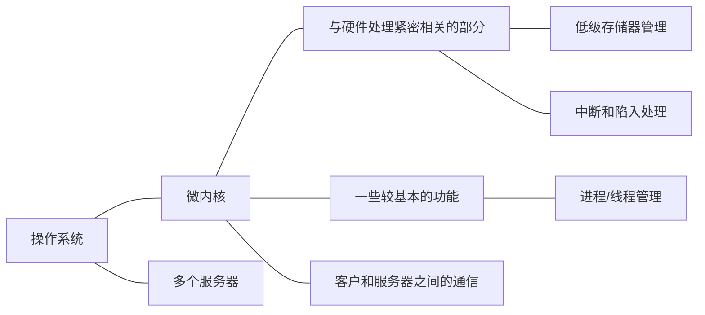

# 1.4 操作系统结构

## 1. 分层法

优点：

- 便于系统的调试和验证、简化了系统的设计和实现
- 易扩充易维护

缺点：

- 合理定义各层比较困难
- 效率较差

## 2. 模块化

优点：

- 提高了操作系统设计的正确性、可理解性和可维护性;
- 增强了操作系统的可适应性;
- 加速了操作系统的开发过程。

缺点：

- 模块间的接口规定很难满足对接口的实际需求。
- 各模块设计者齐头并进, 每个决定无法建立在上一个已验证的正确决定的基础上, 因此无法找到一个可靠的决定顺序。

## 3. 宏内核

也称作单内核或大内核

## 4. 微内核

### 4.1 概念

微内核构架, 是指将内核中最基本的功能保留在内核, 而将那些不需要在核心态执行的功能移到用户态执行, 从而降低内核的设计复杂性。那些移出内核的操作系统代码根据分层的原则被划分成若干服务程序, 它们的执行相互独立, 交互则都借助于微内核进行通信。

微内核结构将操作系统划分为两大部分:  **微内核和多个服务器** 。微内核是指精心设计的、能实现操作系统最基本核心功能的小型内核, 通常包含: ①与硬件处理紧密相关的部分; ②一些较基本的功能; ③客户和服务器之间的通信。这些部分只是为构建通用操作系统提供一个重要基础，这样就可以确保将内核做得很小。操作系统中的绝大部分功能都放在微内核外的一组服务器 (进程) 中实现, 如用于提供对进程 (线程) 进行管理的进程 (线程) 服务器、提供虚拟存储器管理功能的虚拟存储器服务器等, 它们都是作为进程来实现的, 运行在用户态, 客户与服务器之间是借助微内核提供的消息传递机制来实现交互的。

在微内核结构中, 为了实现高可靠性, 只有微内核运行在内核态, 其余模块都运行在用户态, 一个模块中的错误只会使这个模块崩溃, 而不会使整个系统崩溃。例如, 文件服务代码运行时出了问题, 宏内核因为文件服务是运行在内核态的, 系统直接就崩溃了。而微内核的文件服务是运行在用户态的, 只要将文件服务功能强行停止, 然后重启, 就可以继续使用, 系统不会崩溃。

### 4.2 功能

微内核结构通常利用 “机制与策略分离” 的原理来构造 OS 结构, 将机制部分以及与硬件紧密相关的部分放入微内核。微内核通常具有如下功能:

- ① 进程 (线程) 管理。进程 (线程) 之间的通信功能是微内核 OS 最基本的功能, 此外还有进程的切换、进程的调度, 以及多处理机之间的同步等功能, 都应放入微内核。举个例子, 为实现进程调度功能, 需要在进程管理中设置一个或多个进程优先级队列, 这部分属于调度功能的机制部分, 应将它放入微内核。而对用户进程如何分类, 以及优先级的确认方式, 则属于策略问题, 可将它们放入微内核外的进程管理服务器中。

- ② 低级存储器管理。在微内核中, 只配置最基本的低级存储器管理机制, 如用于实现将逻辑地址变换为物理地址等的页表机制和地址变换机制, 这一部分是依赖于硬件的, 因此放入微内核。 而实现虚拟存储器管理的策略, 则包含应采取何种页面置换算法, 采用何种内存分配与回收的策略, 应将这部分放在微内核外的存储器管理服务器中。

- ③ 中断和陷入处理。微内核 OS 将与硬件紧密相关的一小部分放入微内核, 此时微内核的主要功能是捕获所发生的中断和陷入事件, 并进行中断响应处理, 在识别中断或陷入的事件后, 再发送给相关的服务器来处理, 故中断和陷入处理也应放入微内核。

微内核操作系统将进程管理、存储器管理以及 I/O 管理这些功能一分为二, 属于机制的很小一部分放入微内核, 而绝大部分放入微内核外的各种服务器实现, 大多数服务器都要比微内核大。 因此, 在采用客户/服务器模式时, 能将微内核做得很小。

### 4.3 特点

微内核结构的主要优点如下所示。

- ① 扩展性和灵活性。许多功能从内核中分离出来, 当要修改某些功能或增加新功能时, 只需在相应的服务器中修改或新增功能, 或再增加一个专用的服务器, 而无需改动内核代码。

- ② 可靠性和安全性。前面已举例说明。

- ③ 可移植性。与 CPU 和 I/O 硬件有关的代码均放在内核中, 而其他各种服务器均与硬件平台无关, 因而将操作系统移植到另一个平台上所需做的修改是比较小的。

- ④ 分布式计算。客户和服务器之间、服务器和服务器之间的通信采用消息传递机制, 这就使得微内核系统能很好地支持分布式系统和网络系统。

微内核结构的主要问题是性能问题, 因为需要频繁地在核心态和用户态之间进行切换, 操作系统的执行开销偏大。为了改善运行效率, 可以将那些频繁使用的系统服务移回内核, 从而保证系统性能, 但这又会使微内核的容量明显地增大。

虽然宏内核在桌面操作系统中取得了绝对的胜利, 但是微内核在实时、工业、航空及军事应用中特别流行, 这些领域都是关键任务, 需要有高度的可靠性。

## 5. 外核

不同于虚拟机克隆真实机器, 另一种策略是对资源进行划分, 给每个用户分配整个资源的一个子集。这样, 某个虚拟机可能得到磁盘的 0 至 1023 盘块, 而另一台虚拟机得到磁盘的 1024 至 2047 盘块等。在底层, 一种称为外核 (exokernel) 的程序在内核态中运行。它的任务是为虚拟机分配资源, 并检查这些资源使用的安全性, 以确保没有机器会使用他人的资源。每个用户的虚拟机可以运行自己的操作系统, 但限制只能使用已经申请并且获得分配的那部分资源。

外核机制的优点是减少了资源的 “映射层”。在其他设计中, 每个虚拟机系统都认为它拥有完整的磁盘 (或其他资源), 这样虚拟机监控程序就必须维护一张表格以重映像磁盘地址, 有了外核, 这个重映射处理就不需要了。外核只需要记录已分配给各个虚拟机的有关资源即可。这种方法还有一个优点, 它将多道程序 (在外核内) 与用户操作系统代码 (在用户空间内) 加以分离, 而且相应的负载并不重, 因为外核所做的只是保持多个虚拟机彼此不发生冲突。
