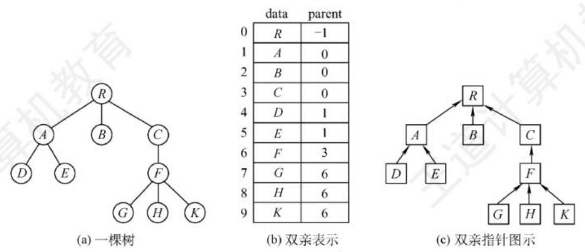
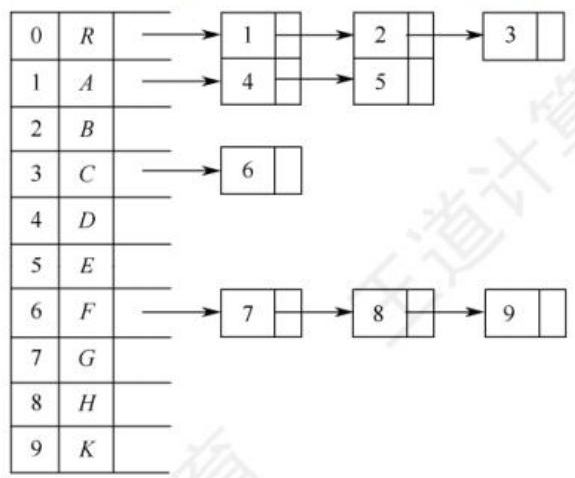
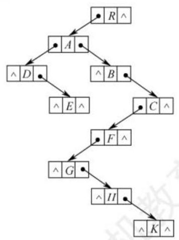
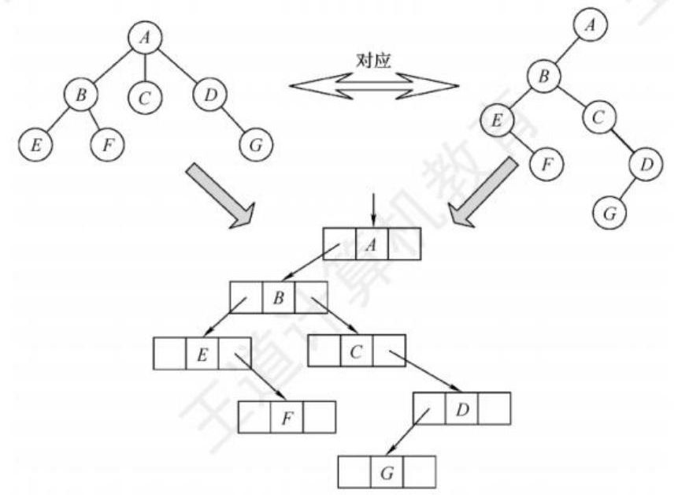
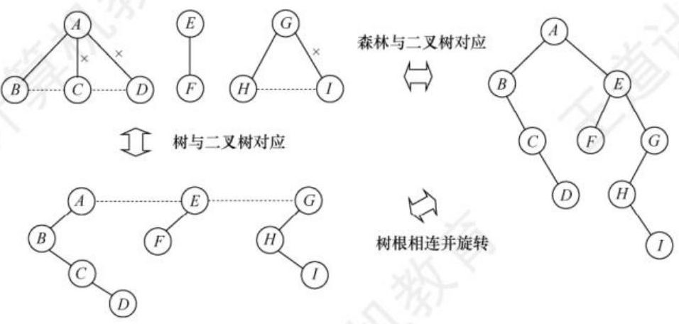

# 5.4 树、森林

## 5.4.1 树的存储结构

树的存储方式有多种, 既可采用顺序存储结构, 又可采用链式存储结构, 但无论采用何种存储方式, 都要求能唯一地反映树中各结点之间的逻辑关系, 这里介绍 3 种常用的存储结构。

### 1. 双亲表示法

这种存储结构采用一组连续空间来存储每个结点, 同时在每个结点中增设一个伪指针, 指示其双亲结点在数组中的位置。如图 5.21 所示, 根结点下标为 0, 其伪指针域为-1。



图 5.21 树的双亲表示法

双亲表示法的存储结构描述如下:

```c
#define MAX_TREE_SIZE 100 //树中最多结点数

typedef struct{ //树的结点定义
    ElemType data; //数据元素
    int parent; //双亲位置域
} PTNode;

typedef struct{ //树的类型定义
    PTNode nodes [MAX_TREE_SIZE]; //双亲表示 
    int n; //结点数 
} PTree;
```

双亲表示法利用了每个结点 (根结点除外) 只有唯一双亲的性质, 可以很快地得到每个结点的双亲结点,但求结点的孩子时则需要遍历整个结构。

---

注意

区别树的顺序存储结构与二叉树的顺序存储结构。在树的顺序存储结构中, 数组下标代表结点的编号, 下标中所存的内容指示了结点之间的关系。而在二叉树的顺序存储结构中, 数组下标既代表了结点的编号, 又指示了二叉树中各结点之间的关系。当然, 二叉树属于树, 因此二叉树也可用树的存储结构来存储, 但树却不都能用二叉树的存储结构来存储。

---

### 2. 孩子表示法

孩子表示法是将每个结点的孩子结点视为一个线性表,且以单链表作为存储结构,则 $ n $ 个结点就有 $ n $ 个孩子链表 (叶结点的孩子链表为空表)。而 $ n $ 个头指针又组成一个线性表,为便于查找,可采用顺序存储结构。图 5.22(a)是图 5.21(a)中的树的孩子表示法。



(a) 孩子表示法

图 5.22 树的孩子表示法和孩子兄弟表示法

与双亲表示法相反,孩子表示法寻找孩子的操作非常方便,而寻找双亲的操作则需要遍历 $ n $ 个结点中孩子链表指针域所指向的 $ n $ 个孩子链表。

### 3. 孩子兄弟表示法

孩子兄弟表示法又称二叉树表示法, 即以二叉链表作为树的存储结构。孩子兄弟表示法使每个结点包括三部分内容: 结点值、指向结点第一个孩子结点的指针, 以及指向结点下一个兄弟结点的指针(沿此域可以找到结点的所有兄弟结点),如图 5.22(b)所示。



(b) 孩子兄弟表示法

图 5.22 树的孩子表示法和孩子兄弟表示法

孩子兄弟表示法的存储结构描述如下:

```c
typedef struct CSNode{
    ElemType data; //数据域
    struct CSNode *firstchild,*nextsibling; //第一个孩子和右兄弟指针
}CSNODE, *CSTREE;
```

孩子兄弟表示法比较灵活, 其最大的优点是可以方便地实现树转换为二叉树的操作, 易于查找结点的孩子等, 但缺点是从当前结点查找其双亲结点比较麻烦。若为每个结点增设一个 parent 域指向其父结点, 则查找结点的父结点也很方便。

## 5.4.2 树、森林与二叉树的转换

二叉树和树都可以用二叉链表作为存储结构。从物理结构上看, 树的孩子兄弟表示法与二叉树的二叉链表表示法是相同的, 因此可以用同一存储结构的不同解释将一棵树转换为二叉树。

### 1. 树转换为二叉树

【命题追踪】树和二叉树的转换及相关性质的推理 (2009、2011)

树转换为二叉树的规则: 每个结点的左指针指向它的第一个孩子, 右指针指向它在树中的相邻右兄弟, 这个规则又称 “左孩子右兄弟”。由于根结点没有兄弟, 因此树转换得到的二叉树没有右子树, 如图 5.23 所示。



图 5.23 树与二叉树的对应关系

树转换为二叉树的画法:

1. 在兄弟结点之间加一连线;

2. 对每个结点, 只保留它与第一个孩子的连线, 而与其他孩子的连线全部抹掉;

3. 以树根为轴心,顺时针旋转 $ {45}^{ \circ  } $ 。

### 2. 森林转换为二叉树

【命题追踪】森林和二叉树的转换及相关性质的推理(2014)

将森林转换为二叉树的规则与树类似。先将森林中的每棵树转换为二叉树, 由于任意一棵树对应的二叉树的右子树必空, 若把森林中第二棵树根视为第一棵树根的右兄弟, 即将第二棵树对应的二叉树当作第一棵二叉树根的右子树, 将第三棵树对应的二叉树当作第二棵二叉树根的右子树, 以此类推, 就可以将森林转换为二叉树。

森林转换为二叉树的画法:

1. 将森林中的每棵树转换成相应的二叉树;

2. 每棵树的根也可视为兄弟关系, 在每棵树的根之间加一根连线;

3. 以第一棵树的根为轴心顺时针旋转 $ {45}^{ \circ  } $ 。

### 3. 二叉树转换为森林

【命题追踪】由遍历序列构造一棵二叉树并转换为对应的森林(2020、2021)

二叉树转换为森林的规则: 若二叉树非空, 则二叉树的根及其左子树为第一棵树的二叉树形式, 所以将根的右链断开。二叉树根的右子树又可视为一个由除第一棵树外的森林转换后的二叉树, 应用同样的方法, 直到最后只剩一棵没有右子树的二叉树为止, 最后将每棵二叉树依次转换成树, 就得到了原森林, 如图 5.24 所示。二叉树转换为树或森林是唯一的。



图 5.24 森林与二叉树的对应关系

## 5.4.3 树和森林的遍历

### 1. 树的遍历

【命题追踪】树与二叉树遍历方法的对应关系 (2019)

树的遍历是指用某种方式访问树中的每个结点, 且仅访问一次。主要有两种方式:

1. 先根遍历。若树非空,则按如下规则遍历:
    - 先访问根结点。
    - 再依次遍历根结点的每棵子树, 遍历子树时仍遵循先根后子树的规则。

    其遍历序列与这棵树相应二叉树的先序序列相同。

2. 后根遍历。若树非空, 则按如下规则遍历:
    - 先依次遍历根结点的每棵子树, 遍历子树时仍遵循先子树后根的规则。
    - 再访问根结点。

    其遍历序列与这棵树相应二叉树的中序序列相同。

图 5.23 的树的先根遍历序列为 ABEFCDG ,后根遍历序列为 EFBCGDA 。

另外,树也有层次遍历,与二叉树的层次遍历思想基本相同,即按层序依次访问各结点。

### 2. 森林的遍历

按照森林和树相互递归的定义, 可得到森林的两种遍历方法。

- 先序遍历森林。若森林为非空,则按如下规则遍历:
    1. 访问森林中第一棵树的根结点。
    2. 先序遍历第一棵树中根结点的子树森林。
    3. 先序遍历除去第一棵树之后剩余的树构成的森林。
- 中序遍历森林。森林为非空时,按如下规则遍历:
    1. 中序遍历森林中第一棵树的根结点的子树森林。
    2. 访问第一棵树的根结点。
    3. 中序遍历除去第一棵树之后剩余的树构成的森林。

图 5.24 的森林的先序遍历序列为 ABCDEFGHI ,中序遍历序列为 BCDAFEHIG 。

当森林转换成二叉树时, 其第一棵树的子树森林转换成左子树, 剩余树的森林转换成右子树, 可知森林的先序和中序遍历即为其对应二叉树的先序和中序遍历。

树和森林的遍历与二叉树的遍历关系见表 5.1。

表 5.1 树和森林的遍历与二叉树遍历的对应关系

<table><thead><tr><th>树</th><th>森林</th><th>二 叉 树</th></tr></thead><tr><td>先根遍历</td><td>先序遍历</td><td>先序遍历</td></tr><tr><td>后根遍历</td><td>中(后)序遍历</td><td>中序遍历</td></tr></table>

---

注意

部分教材也将森林的中序遍历称为后序遍历, 称中序遍历是相对其二叉树而言的, 称后序遍历是因为根确实是最后才访问的, 若遇到这两种称谓, 则可理解为同一种遍历方法。

---

错题：所有
