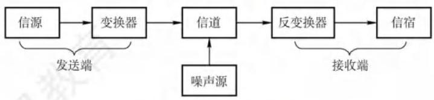
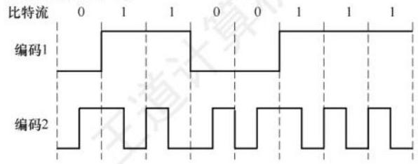
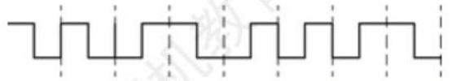
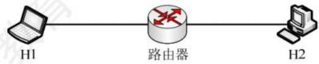
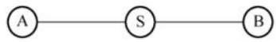
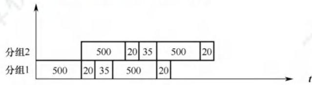

# 2.1 通信基础

## 2.1.1 基本概念

### 1. 数据、信号与码元

通信的目的是传输信息, 如文字、图像和视频等。数据是指传送信息的实体。信号则是数据的电气或电磁表现, 是数据在传输过程中的存在形式。数据和信号都有模拟或数字之分: ① 模拟数据（或模拟信号）的取值是连续的；②数字数据（或数字信号）的取值是离散的。

在通信系统中,常用一个固定时长的信号波形 (数字脉冲) 表示一位 $k$ 进制数字,代表不同离散数值的基本波形就称为码元。码元是数字通信中数字信号的计量单位, 这个时长内的信号称为 $k$ 进制码元,而该时长称为码元宽度。 1 码元可携带若干比特的信息量。例如,在使用二进制编码时, 只有两种不同的码元: 一种代表 0 状态, 另一种代表 1 状态。

### 2. 信源、信道与信宿

图 2.1 所示为一个单向通信系统的模型, 实际的通信系统大多数是双向的, 可进行双向通信。 数据通信系统主要划分为信源、信道和信宿三部分。信源是产生和发送数据的源头, 信宿是接收数据的终点, 它们通常都是计算机或其他数字终端装置。信道是信号的传输介质, 一条双向通信的线路包含一个发送信道和一个接收信道。发送端信源发出的信息需要通过变换器转换成适合在信道上传输的信号, 而通过信道传输到接收端的信号首先由反变换器转换成原始信息, 然后发送给信宿。噪声源是信道上的噪声及分散在通信系统其他各处的噪声的集中表示。

图 2.1 通信系统模型

信道按传输信号形式的不同, 分为传送模拟信号的模拟信道和传送数字信号的数字信道两大类; 信道按传输介质的不同分为无线信道和有线信道。

信道上传送的信号有基带信号和宽带信号之分。基带信号首先将数字信号 1 和 0 直接用两种不同的电压表示, 然后送到数字信道上传输 (称为基带传输); 宽带信号首先将基带信号进行调制, 形成频分复用模拟信号, 然后送到模拟信道上传输 (称为宽带传输)。

数据传输方式分为串行传输和并行传输。串行传输是指逐比特地按序依次传输, 并行传输是指若干比特通过多个通信信道同时传输。串行传输适用于长距离通信, 如计算机网络。并行传输适用于近距离通信, 常用于计算机内部, 如 CPU 与主存之间。

从通信双方信息的交互方式看, 可分为三种基本方式:

1) 单向通信。只有一个方向的通信而没有反方向的交互, 如无线电广播、电视广播等。

2) 半双工通信。通信双方都可发送或接收信息, 但任何一方都不能同时发送和接收信息。

3) 全双工通信。通信双方可同时发送和接收信息。

单向通信只需一个信道, 而半双工通信或全双工通信都需要两个信道, 每个方向一个信道。

### 3. 速率、波特与带宽

速率是指数据传输速率, 表示单位时间内传输的数据量, 常有两种描述形式。

【命题追踪】 调制速率的概念 (2014)

1) 码元传输速率。又称波特率, 表示单位时间内数字通信系统所传输的码元数 (也称调制速率或符号速率), 单位是波特 (Baud)。 1 波特表示数字通信系统每秒传输 1 个码元。 码元既可以是多进制的, 又可以是二进制的, 码元速率与进制数无关。

2) 信息传输速率。又称比特率, 表示单位时间内数字通信系统传输的二进制码元数 (即比特数), 单位是比特/秒 (b/s)。

> 注 意
>
> 波特和比特是两个不同的概念, 但波特率与比特率在数量上又有一定的关系。若一个码元携带 $n$ 比特的信息量,则波特率 $M$ Baud 对应的比特率为 ${Mn}\mathrm{\;b}/\mathrm{s}$ 。

在模拟信号系统中, 带宽 (又称频率带宽) 用来表示某个信道所能传输信号的频率范围, 即最高频率与最低频率之差,单位是赫兹 $\left( \mathrm{{Hz}}\right)$ 。在计算机网络中,带宽用来表示网络的通信线路所能传输数据的能力,即最高数据率; 显然,此时带宽的单位不再是 $\mathrm{{Hz}}$ ,而是 $\mathrm{b}/\mathrm{s}$ 。

## 2.1.2 信道的极限容量

任何实际的信道都不是理想的, 信号在信道上传输时会不可避免地产生失真。但是, 只要接收端能够从失真的信号波形中识别出原来的信号, 这种失真对通信质量就没有影响。但是, 若信号失真很严重, 则接收端就无法识别出每个码元。码元的传输速率越高, 或者信号的传输距离越远, 或者噪声干扰越大, 或者传输介质的质量越差, 接收端波形的失真就越严重。

### 1. 奈奎斯特定理 (奈氏准则)

【命题追踪】 无噪声信道的最大数据传输速率（2009、2022、2023）

具体的信道所能通过的频率范围总是有限的。信号中的许多高频分量往往不能通过信道, 否则在传输中就会衰减, 导致接收端收到的信号波形失去码元之间的清晰界限, 这种现象称为码间串扰。奈奎斯特定理规定: 在理想低通 (没有噪声、带宽有限) 信道中, 为了避免码间串扰,极限码元传输速率为 ${2W}$ 波特,其中 $W$ 是信道的频率带宽 (单位为 $\mathrm{{Hz}}$ )。若用 $V$ 表示每个码元的离散电平数目 (码元的离散电平数目是指有多少种不同的码元, 若有 16 种不同的码元, 则需要 4 个二进制位, 因此数据传输速率是码元传输速率的 4 倍), 则极限数据率为

理想低通信道下的极限数据传输速率 $= {2W}{\log }_{2}V$ (单位为 $\mathrm{b}/\mathrm{s}$ )

对于奈氏准则, 有以下结论:

1) 在任何信道中, 码元传输速率是有上限的。若传输速率超过上限, 则会出现严重的码间串扰问题, 使得接收端不可能完全正确地识别码元。

2) 信道的频带越宽 (即通过的信号高频分量越多), 就越可用更高的速率有效地传输码元。

3) 奈氏准则给出了码元传输速率的限制, 但并未限制信息传输速率, 即未对一个码元可以对应多少个二进制位给出限制。

因为码元传输速率受奈氏准则制约, 所以要提高数据传输速率, 就要设法使每个码元携带更多比特的信息量, 此时需要采用多元制的调制方法。

### 2. 香农定理

【命题追踪】无噪声信道的最大数据传输速率（2009、2022、2023）

实际的信道会有噪声, 噪声是随机产生的。香农定理给出了带宽受限且有高斯噪声干扰的信道的极限数据传输速率, 当用该速率传输数据时, 不会产生误差。香农定理定义为

$$
\text{信道的极限数据传输速率} = W{\log }_{2}\left( {1 + S/N}\right) \;\text{(单位为 b/s)}
$$

式中, $W$ 为信道的频率带宽 (单位为 $\mathrm{{Hz}}$ ), $S$ 为信道内所传输信号的平均功率, $N$ 为信道内的高斯噪声功率。 $S/N$ 为信噪比,即信号的平均功率与噪声的平均功率之比,信噪比 $= {10}{\log }_{10}\left( {S/N}\right)$ (单位为 $\mathrm{{dB}}$ )。例如,当 $S/N = {10}$ 时,信噪比为 ${10}\mathrm{\;{dB}}$ ; 而当 $S/N = {1000}$ 时,信噪比为 ${30}\mathrm{\;{dB}}$ 。

【命题追踪】信道数据传输速率的影响分析

对于香农定理, 有以下结论:

1) 信道的带宽或信道中的信噪比越大, 信息的极限传输速率越高。

2) 对一定的传输带宽和一定的信噪比, 信息传输速率的上限是确定的。

3) 只要信息传输速率低于信道的极限传输速率, 就能找到某种方法实现无差错的传输。

4) 香农定理得出的是极限信息传输速率, 实际信道能达到的传输速率要比它低不少。

【命题追踪】 奈氏准则和香农定理的对比分析 (2017)

奈氏准则只考虑了带宽与极限码元传输速率之间的关系, 而香农定理不仅考虑了带宽, 也考虑了信噪比。这从另一个侧面表明, 一个码元对应的二进制位数是有限的。

## 2.1.3 编码与调制

信号是数据的具体表示形式, 数据无论是数字的还是模拟的, 为了传输的目的, 都要转换成信号。将数据转换为模拟信号的过程称为调制, 将数据转换为数字信号的过程称为编码。

数字数据可通过数字发送器转换为数字信号传输, 也可通过调制器转换成模拟信号传输; 同样, 模拟数据可通过 PCM 编码器转换成数字信号传输, 也可通过放大器调制器转换成模拟信号传输。这样, 就形成了如下 4 种编码与调制方式。

### 1. 数字数据编码为数字信号

数字数据编码用于基带传输中, 即在基本不改变数字数据信号频率的情况下, 直接传输数字信号。具体用什么样的数字信号表示 0 及用什么样的数字信号表示 1 , 就是所谓的编码。编码的规则有多种, 只要能有效区分 0 和 1 即可。常用的数字数据编码有以下几种, 如图 2.2 所示。

图 2.2 常用的数字数据编码

1) 归零 (RZ) 编码。用高电平表示 1、低电平表示 0 (或者相反), 每个码元的中间均跳变到零电平 (归零), 接收方根据该跳变调整本方的时钟基准, 这就为收发双方提供了自同步机制。因为归零需要占用一部分带宽, 所以传输效率受到了一定的影响。

    【命题追踪】 非归零编码和反向非归零编码的波形记忆 (2015)

2) 非归零 (NRZ) 编码。与 RZ 编码的区别是不用归零, 一个时钟全部用来传输数据, 编码效率最高。但 NRZ 编码的收发双方存在同步问题, 为此需要双方都带有时钟线。

3) 反向非归零 (NRZI) 编码。与 NRZ 编码的区别是用电平的跳变表示 0 、电平保持不变表示 1 。跳变信号本身可作为一种通知机制。这种编码方式集成了前两种编码的优点, 既能传输时钟信号, 又能尽量不损失系统带宽。USB 2.0 的编码方式就是 NRZI 编码。

    【命题追踪】曼彻斯特编码的波形记忆 (2013、2015)

4) 曼彻斯特编码。每个码元的中间都发生电平跳变, 电平跳变既作为时钟信号 (用于同步), 又作为数据信号。可用向下跳变表示 1、向上跳变表示 0 , 或者采用相反的规定。

    【命题追踪】 差分曼彻斯特编码的波形记忆 (2021)

5) 差分曼彻斯特编码。每个码元的中间都发生电平跳变, 与曼彻斯特编码不同的是, 电平跳变仅表示时钟信号, 而不表示数据。数据的表示在于每个码元开始处是否有电平跳变: 无跳变表示 1 , 有跳变表示 0 。差分曼彻斯特编码拥有更强的抗干扰能力。

曼彻斯特编码和差分曼彻斯特编码在每个码元的中间都发生电平跳变, 相当于将一个码元一分为二, 编码速率是码元速率的 2 倍, 二者所占的频带宽度是原始基带宽度的 2 倍。标准以太网使用的就是曼彻斯特编码, 而差分曼彻斯特编码则被广泛用于宽带高速网中。

### 2. 模拟数据编码为数字信号

主要包括三个步骤, 即采样、量化和编码, 常用于对音频信号进行编码的 PCM 编码。

首先介绍采样定理: 在将模拟信号转换成数字信号时,假设原始信号中的最大频率为 $f$ ,那么采样率 ${f}_{\text{采样}}$ 必须大于或等于最大频率 $f$ 的 2 倍,才能保证采样后的数字信号完整保留原模拟信号的信息 (只需记住结论)。另外, 采样定理又称奈奎斯特定理。

1) 采样是指对模拟信号进行周期性扫描, 将时间上连续的信号变成时间上离散的信号。

2) 量化是指将采样得到的电平幅值按照一定的分级标度转换为对应的数值并取整, 这样就将连续的电平幅值转换为了离散的数字量。采样和量化的实质就是分割和转换。

3) 编码是指将量化得到的离散整数转换为与之对应的二进制编码。

### 3. 数字数据调制为模拟信号

数字数据调制技术在发送端将数字信号转换为模拟信号, 而在接收端将模拟信号还原为数字信号, 分别对应于调制解调器的调制和解调过程。图 2.3 中显示了数字调制的三种方式。

图 2.3 数字调制的三种方式

【命题追踪】采用调幅技术时码元的比特位数（2022）

1) 调幅 (AM) 或幅移键控 (ASK)。通过改变载波的振幅来表示数字信号 1 和 0 。例如, 用有载波和无载波输出分别表示 1 和 0 。这种方式比较容易实现, 但抗干扰能力差。

2) 调频 (FM) 或频移键控 (FSK)。通过改变载波的频率来表示数字信号 1 和 0 。例如, 用频率 ${f}_{1}$ 和频率 ${f}_{2}$ 分别表示 1 和 0 。这种方式容易实现,抗干扰能力强,目前应用较广泛。

    【命题追踪】 采用调相技术时比特率和波特率的转化 (2011)

3) 调相 (PM) 或相移键控 (PSK)。通过改变载波的相位来表示数字信号 1 和 0 , 又分为绝对调相和相对调相。例如,用相位 0 和 $\pi$ 分别表示 1 和 0,是一种绝对调相方式。

    【命题追踪】采用 QAM 技术时码元的比特位数（2009、2023）

4) 正交幅度调制 (QAM)。在频率相同的前提下, 将 AM 与 PM 结合起来, 形成叠加信号。 设波特率为 $B$ ,采用 $m$ 个相位,每个相位有 $n$ 种振幅,则该 QAM 的数据传输速率 $R$ 为

$$
R = B{\log }_{2}\left( {mn}\right) \;\text{ (单位为 b/s) }
$$

### 4. 模拟数据调制为模拟信号

为了实现传输的有效性, 可能需要较高的频率。这种调制方式还可使用频分复用 (FDM) 技术, 充分利用带宽资源。电话机和本地局交换机采用模拟信号传输模拟数据的编码方式。

## 2.1.4 本节习题精选

### 一、单项选择题

01 下列说法中正确的是 ( )。  
A. 信道与通信电路类似, 一条可通信的电路往往包含一个信道  
B. 调制是指把模拟数据转换为数字信号的过程  
C. 信息传输速率是指通信信道上每秒传输的码元数  
D. 在数值上, 波特率等于比特率与每符号所含的比特数的比值

02 影响信道最大传输速率的因素主要有 ( )。  
A. 信道带宽和信噪比 B. 码元传输速率和噪声功率  
C. 频率特性和带宽 D. 发送功率和噪声功率

03 ( ) 被用于计算机内部的数据传输。  
A. 串行传输 B. 并行传输 C. 同步传输 D. 异步传输

04 下列有关曼彻斯特编码的叙述中, 正确的是 ( )。  
A. 每个信号起始边界作为时钟信号有利于同步  
B. 将时钟与数据取值都包含在信号中  
C. 这种编码机制特别适合传输模拟数据  
D. 每位的中间不跳变表示信号的取值为 0

05 在数据通信中使用曼彻斯特编码的主要原因是 ( )。  
A. 实现对通信过程中传输错误的恢复 B. 实现对通信过程中收发双方的数据同步  
C. 提高对数据的有效传输速率 D. 提高传输信号的抗干扰能力

06 不含同步信息的编码是 ( )。  
I. 非归零编码 II. 曼彻斯特编码 III. 差分曼彻斯特编码  
A. 仅 I B. 仅 II C. 仅 II、III D. I、II、III

07 波特率等于 ( ) 。  
A. 每秒可能发生的信号变化次数 B. 每秒传输的比特数  
C. 每秒传输的周期数 D. 每秒传输的字节数

08 测得一个以太网的数据波特率是 40M Baud,那么其数据率是 ( )。  
A. 10Mb/s &emsp; B. 20Mb/s &emsp; C. 40Mb/s &emsp; D. 80Mb/s

09 某信道的波特率为 1000 Baud ,若令其数据传输速率达到 4kb/s ,则一个信号码元所取的有效离散值个数为 ( ) 。
A. 2 B. 4 C. 8 D. 16

10 下图是某比特串的曼彻斯特编码信号波形, 则该比特串为 ( )。  
  
A. 00110110 B. 10101101 C. 01010010 D. 11000101

11 已知某信道的信息传输速率为 64kb/s  ,一个载波信号码元有 4 个有效离散值,则该信道的波特率为 ( ) 。  
A. 16k Baud &emsp; B. 32k Baud &emsp; C. 64k Baud &emsp; D. 128k Baud

12 有一个无噪声的 8kHz 信道,每个信号包含 8 级,每秒采样 24k 次,那么可以获得的最大传输速率是 ( )。  
A. 24kb/s &emsp; B. 32kb/s &emsp; C. 48kb/s &emsp; D. 72kb/s

13 对于某带宽为 4000Hz 的低通信道,采用 16 种不同的物理状态来表示数据。按照奈奎斯特定理, 信道的最大传输速率是 ( )。  
A. 4kb/s &emsp; B. 8kb/s &emsp; C. 16kb/s &emsp; D. 32kb/s

14 二进制信号在信噪比为 127:1 的 4kHz 信道上传输,最大数据传输速率可以达到 ( )。  
A. 28000b/s &emsp; B. 8000b/s &emsp; C. 4000b/s &emsp; D. 无限大

15 电话系统的典型参数是信道带宽为 3000Hz ,信噪比为 30dB ,该系统的最大数据传输速率为 ( )。  
A. 3kb/s &emsp; B. 6kb/s &emsp; C. 30kb/s &emsp; D. 64kb/s

16 一个传输数字信号的模拟信道的信号功率是 0.14W ,噪声功率是 0.02W ,频率范围为 3.5MHz ~ 3.9MHz ,则该信道的最高数据传输速率是 ( )。  
A. 1.2Mb/s &emsp; B. 2.4Mb/s &emsp; C. 11.7Mb/s &emsp; D. 23.4Mb/s

17 采用 8 种相位, 每种相位各有两种幅度的 QAM 调制方法, 在 1200Baud 的信息传输速率下能达到的数据传输速率为 ( )。  
A. 2400 b/s &emsp; B. 3600 b/s &emsp; C. 9600 b/s &emsp; D. 4800 b/s

18 一个信道每 1/8s 采样一次, 传输信号共有 16 种变化状态, 最大数据传输速率是 ( )。  
A. 16 b/s &emsp; B. 32 b/s &emsp; C. 48 b/s &emsp; D. 64 b/s

19 根据采样定理, 在对连续变化的模拟信号进行周期性采样时, 只要采样率大于或等于有效信号的最高频率或其带宽的（ ）倍，采样值便可包含原始信号的全部信息。  
A. 0.5 B. 1 C. 2 D. 4

20 将 1 路模拟信号分别编码为数字信号后, 与另外 7 路数字信号采用同步 TDM 方式复用到一条通信线路上。 1 路模拟信号的频率变化范围为 0~1kHz ,每个采样点采用 PCM 方式编码为 4 位的二进制数, 另外 7 路数字信号的数据率均为 7.2kb/s 。复用线路需要的最小通信能力是 ( )。  
A. 7.2 kb/s &emsp; B. 8 kb/s &emsp; C. 64 kb/s &emsp; D. 512 kb/s

21 用 PCM 对语音进行数字量化, 若将声音分为 128 个量化级, 采样率为 8000 次/秒, 则一路话音需要的数据传输速率为 ( )。  
A. 56 kb/s &emsp; B. 64 kb/s &emsp; C. 128 kb/s &emsp; D. 1024 kb/s

22【2009 统考真题】在无噪声的情况下,若某通信链路的带宽为 3kHz ,采用 4 个相位,每个相位具有 4 种幅度的 QAM 调制技术，则该通信链路的最大数据传输速率是 ( )。  
A. 12 kb/s &emsp; B. 24 kb/s &emsp; C. 48 kb/s &emsp; D. 96 kb/s

23 【2011 统考真题】若某通信链路的数据传输速率为 2400b/s ,采用 4 个相位调制,则该链路的波特率是 () 。  
A. 600 Baud &emsp; B. 1200 Baud &emsp; C. 4800 Baud &emsp; D. 9600 Baud

24【2013 统考真题】下图为 10BaseT 网卡接收到的信号波形, 则该网卡收到的比特串是 ( )。  
  
A. 00110110 B. 10101101  
C. 01010010 D. 11000101

25 【2014 统考真题】在下列因素中，不影响信道数据传输速率的是 ( )。  
A. 信噪比 B. 频率带宽 C. 调制速率 D. 信号传播速度

26 【2015 统考真题】使用两种编码方案对比特流 01100111 进行编码的结果如下图所示, 编码 1 和编码 2 分别是 ( )。  
  
A. NRZ 编码和曼彻斯特编码 B. NRZ 编码和差分曼彻斯特编码  
C. NRZI 编码和曼彻斯特编码 D. NRZI 编码和差分曼彻斯特编码

27【2016 统考真题】如下图所示,若连接 R2 和 R3 链路的频带宽度为 8kHz ,信噪比为 30dB , 该链路实际数据传输速率约为理论最大数据传输速率的 50% ,则该链路的实际数据传输速率约为 ( ) 。  
  
A. 8 kb/s &emsp; B. 20 kb/s &emsp; C. 40 kb/s &emsp; D. 80 kb/s

28 【2017 统考真题】若信道在无噪声情况下的极限数据传输速率不小于信噪比为 ${30}\mathrm{\;{dB}}$ 条件下的极限数据传输速率, 则信号状态数至少是 ( )。  
A. 4 B. 8 C. 16 D. 32

29.【2021 统考真题】下图为一段差分曼彻斯特编码信号波形, 该编码的二进制串是 ( )。  
  
A. 10111001  &emsp; B. 11010001  &emsp; C. 00101110  &emsp; D. 10110110

30.【2022 统考真题】在一条带宽为 200kHz 的无噪声信道上,若采用 4 个幅值的 ASK 调制, 则该信道的最大数据传输速率是 ( )。  
A. 200 kb/s &emsp; B. 400 kb/s &emsp; C. 800 kb/s &emsp; D. 1600 kb/s

31 【2023 统考真题】在下图所示的分组交换网络中,主机 H1 和 H2 通过路由器互连,2 段链路的带宽均为 100Mb/s ,时延带宽积 (即单向传播时延 × 带宽) 均为1000b 。若 H1 向 H2 发送一个大小为 1MB 的文件,分组长度为 1000B ,则从 H1 开始发送的时刻起到 H2 收到文件全部数据时刻止,所需的时间至少是 ( )。(注: $1\mathrm{M} = {10}^{6}$ 。)  
  
A. 80.02ms &emsp; B. 80.08ms &emsp; C. 80.09ms &emsp; D. 80.10ms

### 二、综合应用题

01 如下图所示,主机 A 和 B 都通过 10Mb/s 的链路连接到交换机 S 。

每条链路上的传播时延都是 20μs 。S 是一个存储转发设备，它在接收完一个分组 35μs 后开始转发收到的分组。试计算将 10000 比特从 A 发送到 B 所需的总时间。

1) 作为单个分组。

2) 作为两个 5000 比特的分组一个紧接着另一个发送。

02 一个分组交换网采用虚电路方式转发分组,分组的首部和数据部分分别为 $h$ 位和 $p$ 位。 现有 $L$ ( $L \gg p$ 且 $L$ 为 $p$ 的倍数) 位的报文通过该网络传送,源点和终点之间的线路数为 $k$ ,每条线路上的传播时延为 $d$ 秒,数据传输速率为 $b\mathrm{\;b}/\mathrm{s}$ ,虚电路建立连接的时间为 $s$ 秒,每个中间结点有 $m$ 秒的平均处理时延。求源点开始发送数据直至终点收到全部数据所需的时间。

## 2.1.5 答案与解析

### 一、单项选择题

01 D

信道不等于通信电路, 一条可双向通信的电路往往包含两个信道: 一个是发送信道, 一个是接收信道。另外, 多个通信用户共用通信电路时, 每个用户在该通信电路都有一个信道, 因此 A 错误。调制是将数据转换为模拟信号的过程, B 错误。 C 明显错误。“比特率” 在数值上和 “波特率” 的关系如下: 波特率 $=$ 比特率/每符号含的比特数, D 正确。

02 A

根据香农定理, 影响信道最大传输速率的因素主要有信道带宽和信噪比, 而信噪比与信道内所传输的平均信号功率和噪声功率有关, 数值上等于二者之比。

03 B

并行传输的特点: 距离短、速度快。串行传输的特点: 距离长、速度慢。所以在计算机内部 (距离短) 传输时应选择并行传输。同步、异步传输是通信方式, 而不是传输方式。

04 B

曼彻斯特编码将时钟和数据包含在信号中, 在传输数据的同时, 也将时钟一起传输给对方, 码元中间的跳变作为时钟信号, 不同的跳变方式作为数据信号, A 错误、B 正确。每个码元的中间都发生电平跳变, D 错误。曼彻斯特编码最适合传输二进制数字信号, C 错误。

05 B

曼彻斯特编码用码元中间的电平跳变来表示每个比特, 可方便收发双方根据跳变来同步时钟, 而不需要额外的时钟信号, B 正确。

06 A

非归零编码是最简单的一种编码方式, 它用低电平表示 0 , 用高电平表示 1 , 或者采用相反的表示方式。因为各个码元之间并没有间隔标志, 所以不包含同步信息。曼彻斯特编码和差分曼彻斯特编码都将每个码元分成两个相等的时间间隔, 码元的中间跳变也作为收发双方的同步信息, 所以不需要额外的同步信息, 实际应用较多, 但它们所占的频带宽度是原始基带宽度的 2 倍。

07 A

波特率表示信号每秒变化的次数 (注意和比特率的区别)。

08 B

因为以太网采用曼彻斯特编码, 每位数据 (1 比特, 对应信息传输速率) 都需要两个电平 (两个脉冲信号,对应码元传输速率) 来表示,因此波特率是数据率的 2 倍,得数据率为  (40Mb/s)/2 = 20Mb/s。

注 意

曼彻斯特编码的每个比特需要两个信号周期，信号率是数据率的 2 倍，编码效率是 50%。

09 D

比特率 $=$ 波特率 $\times {\log }_{2}n$ ,若一个码元含有 $k$ 比特的信息量,则表示该码元所需的不同离散值为 $n = {2}^{k}$ 个。波特率数值上等于比特率/每码元所含比特数,因此每码元所含比特数 $= {4000}/{1000} = 4$ 比特,有效离散值的个数为 ${2}^{4} = {16}$ 。

10 A

在曼彻斯特编码中, 可用向下跳变表示 1、向上跳变表示 0 , 或者采用相反的表示。因此, 该比特串可能是 00110110 或 11001001, 因此选 A。

11 B

一个码元若取 ${2}^{n}$ 个不同的离散值,则含有 $n$ 比特的信息量。本题中,一个码元所含的信息量为 2 比特,因为数值上波特率 $=$ 比特率/每码元所含比特数,所以波特率为 $\left( {{64}/2}\right) \mathrm{k} = {32}\mathrm{{k}}$ Baud。

12 C

无噪声的信号应该满足奈奎斯特定理,即最大数据传输速率 $= {2W}{\log }_{2}V$ 比特/秒。将题中的数据代入,得到答案是 48kb/s 。注意题中给出的每秒采样 24kHz 是无意义的,因为超过了波特率的上限 ${2W} = {16}\mathrm{{kBaud}}$ ,所以选项 D 是错误答案。

13 D

根据奈奎斯特定理,题中 $W = {4000}\mathrm{\;{Hz}}$ ,最大码元传输速率 $= {2W} = {8000}\mathrm{{Baud}},{16}$ 种不同的物理状态可以表示 ${\log }_{2}{16} = 4$ 比特的数据,所以信道的最大传输速率 $= {8000} \times 4 = {32}\mathrm{\;{kb}}/\mathrm{s}$ 。

14 B

根据香农定理,最大数据率 $= W{\log }_{2}\left( {1 + S/N}\right) = {4000} \times {\log }_{2}\left( {1 + {127}}\right) = {28000}\mathrm{\;b}/\mathrm{s}$ ,容易误选 A 。注意题中 “二进制信号” 的限制后,依据奈奎斯特定理,最大数据传输速率 $= {2H}{\log }_{2}V = 2 \times {4000} \times {\log }_{2}2 =$ ${8000}\mathrm{\;b}/\mathrm{s}$ ,两个上限中取小者,因此答案为 B 。

注 意

若给出了码元与比特数之间的关系, 则需受两个公式的共同限制。关于香农定理和奈奎斯特定理的比较, 请参考本章中的疑难点。

15 C

信噪比 $S/N$ 常用分贝 (dB) 表示,数值上等于 ${10}{\log }_{10}\left( {S/N}\right) \mathrm{{dB}}$ 。依题意有 ${30} = {10}{\log }_{10}\left( {S/N}\right)$ , 解出 $S/N = {1000}$ 。根据香农定理,最大数据传输速率 $= {3000}{\log }_{2}\left( {1 + S/N}\right) \approx {30}\mathrm{{kb}}/\mathrm{s}$ 。

16 A

带宽受限且有噪声的信道应用香农定理来计算信道容量。最高数据传输速率 $= W{\log }_{2}\left( {1 + S/N}\right)$ ,其中,信道带宽 $W = {3.9} - {3.5} = {0.4}\mathrm{{MHz}}$ ,信号功率 $S = {0.14}\mathrm{\;W}$ ,噪声功率 $N = {0.02}\mathrm{\;W}$ ,代入得 ${1.2}\mathrm{{Mb}}/\mathrm{s}$ 。

17 D

每个信号有 $8 \times 2 = {16}$ 种变化,每个码元携带 ${\log }_{2}{16} = 4$ 比特的信息,则信息传输速率为 ${1200} \times$ $4 = {4800}\mathrm{\;b}/\mathrm{s}$ 。

18 B

由题意知采样率为 $8\mathrm{\;{Hz}}$ 。有 16 种变化状态的信号可携带 4 比特的数据,因此最大数据传输速率为 $8 \times 4 = {32}\mathrm{\;b}/\mathrm{s}$ 。

19 C

根据采样定理 (又称奈奎斯特定理或奈氏准则), 若采样率低于有效信号最高频率的 2 倍, 则会出现频谱混叠现象, 导致原始信号无法完全恢复。

20 C

1 路模拟信号的最大频率为 $1\mathrm{{kHz}}$ ,根据采样定理可知采样率至少为 $2\mathrm{{kHz}}$ ,每个样值编码为 4 位二进制数, 所以数据传输速率为 $8\mathrm{\;{kb}}/\mathrm{s}$ 。复用的每条支路的数字信号的速率要相等,而另 7 路数字信号的速率均低于 $8\mathrm{\;{kb}}/\mathrm{s}$ ,所以它们均要采用脉冲填充方式,将数据率提高到 $8\mathrm{{kb}}/\mathrm{s}$ ,然后复用这 8 路信号,需要的通信能力为 $8\mathrm{\;{kb}}/\mathrm{s} \times 8 = {64}\mathrm{\;{kb}}/\mathrm{s}$ 。

21 A

声音信号需要 128 个量化级,因此每采样一次就需要 ${\log }_{2}{128} = 7$ 比特来表示,每秒采样 8000 次,一路话音需要的数据传输速率为 ${8000} \times 7 = {56}\mathrm{\;{kb}}/\mathrm{s}$ 。

22 B

采用 4 个相位, 每个相位有 4 种幅度的 QAM 调制方法, 每个信号有 16 种变化, 传输 4 比特的数据。根据奈奎斯特定理,信息的最大传输速率为 ${2W}{\log }_{2}V = 2 \times 3\mathrm{k} \times 4 = {24}\mathrm{\;{kb}}/\mathrm{s}$ 。

23 B

波特率 $B$ 与数据传输速率 $C$ 的关系为 $C = B{\log }_{2}N, N$ 为一个码元所取的离散值个数。采用 4 种相位,即可以表示 4 种变化,因此一个码元可携带 ${\log }_{2}4 = 2$ 比特的信息。于是,该链路的波特率 $=$ 比特率/每码元所含比特数 $= {2400}/2 = {1200}$ 波特。

24 A

${10}\mathrm{{BaseT}}$ 即 ${10}\mathrm{{Mb}}/\mathrm{s}$ 的以太网,采用曼彻斯特编码,将一个码元分成两个相等的间隔,前一个间隔为低电平, 而后一个间隔为高电平, 表示码元 1 ; 码元 0 正好相反。也可采用相反的规定。因此, 对应的比特串可以是 00110110 或 11001001。

25 D

由香农定理可知, 信噪比和频带宽度都可限制信道的极限传输速率, A 和 B 错误。码元速率也称调制速率, 它也直接限制数据传输速率, C 错误。信道传输速率实际上是信号的发送速率, 而信号的传播速率是信号在信道上传播的速率, 它与信道的发送速率无关, 答案为 D。

26 A

NRZ 是最简单的串行编码技术, 它用两个电压来代表两个二进制数, 如高电平表示 1 、低电平表示 0 , 题中编码 1 符合。NRZI 用电平的一次翻转来表示 0 , 用与前一个 NRZI 电平相同的电平表示 1 。曼彻斯特编码将一个码元分成两个相等的间隔, 前一个间隔为高电平, 后一个间隔为低电平, 表示 1 ; 0 的表示方式正好相反, 题中编码 2 符合。

27 C

香农定理给出了带宽受限且有高斯白噪声干扰的信道的极限数据传输速率, 香农定理定义为: 信道的极限数据传输速率 $= W{\log }_{2}\left( {1 + S/N}\right)$ ,单位为 $\mathrm{b}/\mathrm{s}$ 。其中, $S/N$ 为信噪比,即信号的平均功率和噪声的平均功率之比,信噪比 $= {10}{\log }_{10}\left( {S/N}\right)$ ,单位为 $\mathrm{{dB}}$ ,当 $S/N = {1000}$ 时,信噪比为 ${30}\mathrm{\;{dB}}$ 。 则该链路的实际数据传输速率约为 ${50}\% \times W{\log }_{2}\left( {1 + S/N}\right) = {50}\% \times 8\mathrm{k} \times {\log }_{2}\left( {1 + {1000}}\right) = {40}\mathrm{{kb}}/\mathrm{s}$ 。

28 D

可用奈奎斯特采样定理计算无噪声情况下的极限数据传输速率, 用香农第二定理计算有噪信道极限数据传输速率。 ${2W}{\log }_{2}N \geq W{\log }_{2}\left( {1 + S/N}\right), W$ 是信道带宽, $N$ 是信号状态数, $S/N$ 是信噪比。将数据代入公式得 $N \geq {32}$ 。分贝数 $= {10}{\log }_{10}\left( {S/N}\right)$ 。

29 A

差分曼彻斯特编码常用于局域网传输, 其规则是: 若码元为 1 , 则前半个码元的电平与上一码元的后半个码元的电平相同; 若码元为 0 , 则情形相反。差分曼彻斯特编码的特点是, 在每个时钟周期的起始处, 跳变则说明该比特是 0 , 不跳变则说明该比特是 1 。根据题图, 第 1 个码元的信号波形因缺乏上一码元的信号波形, 无法判断是 0 还是 1 , 但根据后面的信号波形, 可以求出第 $2 \sim 8$ 个码元为 0111001 。

30 C。

根据奈奎斯特定理,最大数据传输速率 $= {2W}{\log }_{2}V,4$ 个幅值的 ASK 调制说明有 4 个幅度, 将 $V = 4$ 代入得 ${800}\mathrm{{kb}}/\mathrm{s}$ 。

31 D

文件大小为 $1\mathrm{{MB}}$ ,分组长度为 ${1000}\mathrm{\;B}$ ,分组数量为 $1\mathrm{{MB}} \div {1000}\mathrm{\;B} = {1000}$ ,一个分组从 $\mathrm{H}1$ 到 $\mathrm{H}2$ 所需的时间 $= \mathrm{H}1$ 的发送时延 ${t}_{1} + \mathrm{H}1$ 到路由器的传播时延 ${t}_{2} +$ 路由器的发送时延 ${t}_{3} +$ 路由器到 $\mathrm{H}2$ 的传播时延 ${t}_{4}$ ,其中 ${t}_{1} = {t}_{3} = {1000}\mathrm{\;B} \div {100}\mathrm{{Mb}}/\mathrm{s} = {0.08}\mathrm{\;{ms}},{t}_{2} = {t}_{4} = {1000}\mathrm{\;b} \div {100}\mathrm{{Mb}}/\mathrm{s} = {0.01}\mathrm{\;{ms}}$ 。 因此,一个分组从 $\mathrm{H}1$ 到 $\mathrm{H}2$ 所需的时间为 $\left( {{0.08} + {0.01}}\right) \times 2 = {0.18}\mathrm{\;{ms}},\mathrm{H}1$ 发送前 999 个分组所需的时间为 ${999} \times \mathrm{t}1 = {79.92}\mathrm{\;{ms}}$ ,总时间等于发送前 999 个分组的时间加上最后一个分组从 $\mathrm{H}1$ 到 $\mathrm{H}2$ 的时间,即所需的时间至少为 ${79.92} + {0.18} = {80.10}\mathrm{\;{ms}}$ 。

### 二、综合应用题

01【解答】

1) 每条链路的发送时延是 ${10000}/\left( {{10}\mathrm{{Mb}}/\mathrm{s}}\right) = {1000\mu }\mathrm{s}$ 。

    总传送时间等于 $2 \times {1000} + 2 \times {20} + {35} = {2075\mu }\mathrm{s}$ 。

2) 解法一: 作为两个分组发送时, 下面列出了各种事件发生的时间表。

    $T = 0\;$ 开始

    $T = {500}\;\mathrm{\;A}$ 完成分组 1 的发送,开始发送分组 2

    $T = {520}$ 分组 1 完全到达 $\mathrm{S}$

    $T = {555}\;$ 分组 1 从 S 起程前往 B

    $T = {1000}\mathrm{\;A}$ 结束分组 2 的发送

    $T = {1055}$ 分组 2 从 $\mathrm{S}$ 起程前往 $\mathrm{B}$

    $T = {1075}$ 分组 2 的第 1 位开始到达 B

    $T = {1575}$ 分组 2 的最后 1 位到达 B

    解法二: 此题属于分组交换各过程中时间不等长的情况, 类似于不等长流水段的情况, 为避免出错,建议画出对应的时空图。根据题意可分为 5 个流水段,各流水段的时间分别为 ${500\mu }\mathrm{s}$ 、 ${20\mu }\mathrm{s}\text{、}{35\mu }\mathrm{s}\text{、}{500\mu }\mathrm{s}\text{、}{20\mu }\mathrm{s}$ ,共有 2 个分组,注意不同分组的相同流水段不能重叠,画出的时空图如下图所示。本题只有 2 个分组, 不用流水线的方法也可求得结果, 但当分组数量更多时, 采用流水线的方法并画出时空图得出计算规律, 才不容易出错。  
    

02【解答】

整个传输过程的总时延 $=$ 连接建立时延 + 源点发送时延 + 中间结点的发送时延 + 中间结点的处理时延 + 传播时延。

虚电路的建立时延已给出,为 $s$ 秒。

源点要将 $L$ 位报文分割成分组,分组数 $= L/p$ ,每个分组的长度为 $\left( {h + p}\right)$ ,源点要发送的数据量 $= \left( {h + p}\right) L/p$ ,所以源点的发送时延 $= \left( {h + p}\right) L/\left( {pb}\right)$ 秒。

每个中间结点的发送时延 $= \left( {h + p}\right) /b$ 秒,源点和终点之间的线路数为 $k$ ,所以有 $k - 1$ 个中间结点,因此中间结点的发送时延 $= \left( {h + p}\right) \left( {k - 1}\right) /b$ 秒。

中间结点的处理时延 $= m\left( {k - 1}\right)$ 秒,传播时延 $= {kd}$ 秒。所以源结点开始发送数据直至终点收到全部数据所需的时间 $= s + \left( {h + p}\right) L/\left( {pb}\right) + \left( {h + p}\right) \left( {k - 1}\right) /b + m\left( {k - 1}\right) + {kd}$ 秒。
