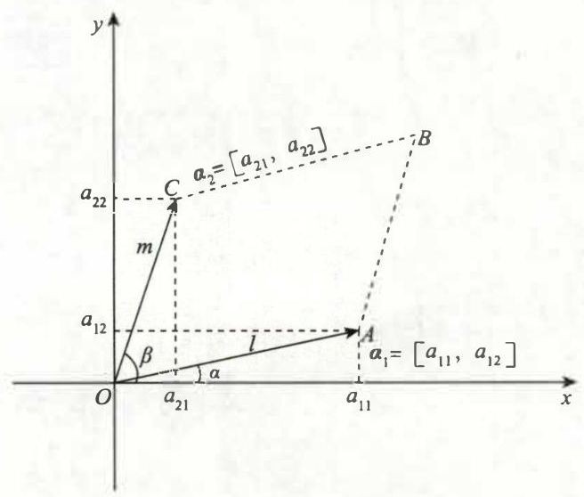
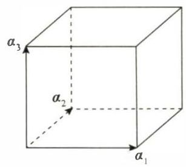
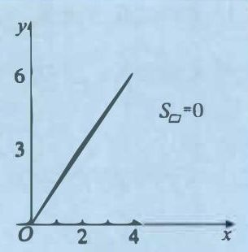

# 第1讲 行列式

## 一、行列式的本质定义 (第一种定义)

大多数教材都是从 “纯粹” 的代数学角度来定义行列式的, 较为抽象, 难于理解和接受. 我们先详细通俗地给出行列式的本质定义, 并且告诉考生, 我们将要开始的线性代数这门课程到底要学什么.

先看一个式子: $ {D}_{2} = \left| \begin{array}{ll} {a}_{11} & {a}_{12} \\  {a}_{21} & {a}_{22} \end{array}\right| $ . 我们称其为 2 阶行列式,其中 $ {a}_{ij} $ 的第一个下标 $ i $ 表示此元素所在的行数,第二个下标 $ j $ 表示此元素所在的列数, $ i = 1,2, j = 1,2 $ ,于是此行列式中有四个元素,并且 $ \left| \begin{array}{ll} {a}_{11} & {a}_{12} \\  {a}_{21} & {a}_{22} \end{array}\right|  = {a}_{11}{a}_{22} - {a}_{12}{a}_{21} $ . 这是一个什么样的计算规则? 它背后有什么样的意义?

将此行列式的第 1 行的两个元素 $ {a}_{11},{a}_{12} $ 看成一个 2 维向量 $ \left\lbrack  {{a}_{11},{a}_{12}}\right\rbrack  \xlongequal{\text{ 记 }}{a}_{1} $ ( 线性代数中,向量不需要在字母上加箭头写成 $ {\overrightarrow{\alpha }}_{1} $ ,只要写 $ {\alpha }_{1} $ 即可,此后类同,不再重复). 将此行列式的第 2 行的两个元素 $ {a}_{21},{a}_{22} $ 看成另一个 2 维向量 $ \left\lbrack  {{a}_{21},{a}_{22}}\right\rbrack  \xlongequal{\text{ 记 }}{a}_{2} $ . 不失一般性,将这两个向量标在直角坐标系中,且以这两个向量为邻边作出一个 $\text{▱}{OABC} $ ,则 $ {S}_{\text{▱}{OABC}} = $ ?

不妨设 $ {\alpha }_{1} $ 的长度 (模) 为 $ l,{\alpha }_{2} $ 的长度 (模) 为 $ m,{\alpha }_{1} $ 与 $ x $ 轴正向的夹角为 $ \alpha ,{\alpha }_{2} $ 与 $ x $ 轴正向的夹角为 $ \beta $ ,如图 1-1 所示.



图 1-1

则

$$
{S}_{\text{▱} {OABC}} = l \cdot  m \cdot  \sin \left( {\beta  - \alpha }\right)
$$

$$
= l \cdot  m\left( {\sin \beta \cos \alpha  - \cos \beta \sin \alpha }\right)
$$

$$
= l\cos \alpha  \cdot  m\sin \beta  - l\sin \alpha  \cdot  m\cos \beta
$$

$$
= {a}_{11}{a}_{22} - {a}_{12}{a}_{21},
$$

于是

$$
\left| \begin{array}{ll} {a}_{11} & {a}_{12} \\  {a}_{21} & {a}_{22} \end{array}\right|  = {a}_{11}{a}_{22} - {a}_{12}{a}_{21} = {S}_{\text{\text{▱}OABC }}.
$$

我们看到了一个极其直观有趣的结论: **2 阶行列式是由两个 2 维向量组成的, 其 (运算规则的) 结果为以这两个向量为邻边的平行四边形的面积** . 这不仅得出了 2 阶行列式的计算规则, 也能够清楚地看到其几何意义.

线性代数可以作 “线性推广” —— 3 阶行列式 $ {D}_{3} = \left| \begin{array}{lll} {a}_{11} & {a}_{12} & {a}_{13} \\  {a}_{21} & {a}_{22} & {a}_{23} \\  {a}_{31} & {a}_{32} & {a}_{33} \end{array}\right| $ 是什么? 我希望考生能够仿照上述定义回答出: **3 阶行列式是由三个 3 维向量 $ {a}_{1} = \left\lbrack  {{a}_{11},{a}_{12},{a}_{13}}\right\rbrack  ,{a}_{2} = \left\lbrack  {{a}_{21},{a}_{22},{a}_{23}}\right\rbrack  ,{a}_{3} = \left\lbrack  {{a}_{31},{a}_{32},{a}_{33}}\right\rbrack $ 组成的, 其 (运算规则的) 结果为以这三个向量为邻边的平行六面体的体积** . 如图 1-2 所示.



图 1-2

依次类推,我们便可以给出 $ n $ 阶行列式 $ {D}_{n} = \left| \begin{matrix} {a}_{11} & \cdots & {a}_{1n} \\  \vdots & & \vdots \\  {a}_{n1} & \cdots & {a}_{nn} \end{matrix}\right| $ 的本质定义:

**$ n\left( {n \geq  3}\right) $ 阶行列式是由 $ n $ 个 $ n $ 维向量 $ {a}_{1} = \left\lbrack  {{a}_{11},{a}_{12},\cdots ,{a}_{1n}}\right\rbrack  ,{a}_{2} = \left\lbrack  {{a}_{21},{a}_{22},\cdots ,{a}_{2n}}\right\rbrack  ,\cdots ,{a}_{n} = $ $ \left\lbrack  {{a}_{n1},{a}_{n2},\cdots ,{a}_{nn}}\right\rbrack $ 组成的,其 (运算规则的) 结果为以这 $ n $ 个向量为邻边的 $ n $ 维图形的体积** .

由此看来, 一个重要观点出现了: 考生一开始就应该把行列式看作是由若干个向量拼成的, 并且要把这些向量作运算. 以 3 阶行列式为例,若 $ {D}_{3} \neq  0 $ ,则意味着体积不为 0,则称组成该行列式的三个向量线性无关; 若 $ {D}_{3} = 0 $ ,则称线性相关.

## 二、行列式的性质

性质 1 行列互换,其值不变,即 $ \left| \mathbf{A}\right|  = \left| {\mathbf{A}}^{\mathrm{T}}\right| $ .

性质 2 若行列式中某行 (列) 元素全为零, 则行列式为零.

性质 3 若行列式中某行 (列) 元素有公因子 $ k\left( {k \neq  0}\right) $ ,则 $ k $ 可提到行列式外面,即

$$
\left| \begin{matrix} {a}_{11} & {a}_{12} & \cdots & {a}_{1n} \\  \vdots & \vdots & & \vdots \\  k{a}_{i1} & k{a}_{i2} & \cdots & k{a}_{in} \\  \vdots & \vdots & & \vdots \\  {a}_{n1} & {a}_{n2} & \cdots & {a}_{nn} \end{matrix}\right|  = k\left| \begin{matrix} {a}_{11} & {a}_{12} & \cdots & {a}_{1n} \\  \vdots & \vdots & & \vdots \\  {a}_{i1} & {a}_{i2} & \cdots & {a}_{in} \\  \vdots & \vdots & & \vdots \\  {a}_{n1} & {a}_{n2} & \cdots & {a}_{nn} \end{matrix}\right| .
$$

> 【注】上述等式从右到左的运算称为 “倍乘” 性质

性质 4 行列式中某行 (列) 元素均是两个数之和, 则可拆成两个行列式之和, 即

$$
\left| \begin{matrix} {a}_{11} & {a}_{12} & \cdots & {a}_{1n} \\  \vdots & \vdots & & \vdots \\  {a}_{i1} + {b}_{i1} & {a}_{i2} + {b}_{i2} & \cdots & {a}_{in} + {b}_{in} \\  \vdots & \vdots & & \vdots \\  {a}_{n1} & {a}_{n2} & \cdots & {a}_{nn} \end{matrix}\right|  = \left| \begin{matrix} {a}_{11} & {a}_{12} & \cdots & {a}_{1n} \\  \vdots & \vdots & & \vdots \\  {a}_{i1} & {a}_{i2} & \cdots & {a}_{in} \\  \vdots & \vdots & & \vdots \\  {a}_{n1} & {a}_{n2} & \cdots & {a}_{nn} \end{matrix}\right|  + \left| \begin{matrix} {a}_{11} & {a}_{12} & \cdots & {a}_{1n} \\  \vdots & \vdots & & \vdots \\  {a}_{i1} & {a}_{i2} & \cdots & {a}_{in} \\  \vdots & \vdots & & \vdots \\  {a}_{n1} & {a}_{n2} & \cdots & {a}_{nn} \end{matrix}\right| .
$$

> 【注】等式从右到左是两个行列式相加的运算. 如果两个行列式的其他元素对应相等, 只有一行 (列) 不同时, 可以相加, 相加时其他元素不变, 不同元素的行 (列) 对应相加即可.

性质 5 行列式中两行 (列) 互换, 行列式变号.
> 【注】上述运算称为 “互换” 性质.

性质 6 行列式中的两行 (列) 元素相等或对应成比例, 则行列式为零.

性质 7 行列式中某行 (列) 的 $ k $ 倍加到另一行 (列),行列式不变.

> 【注 1】上述运算称为 “倍加” 性质.
>
>【注 2】以上七个性质均可由 “一、行列式的本质定义 (第一种定义)” 所介绍的行列式的几何背景直观地得到, 而不需复杂抽象的分析. 如性质 6 所说的 “两行 (列) 元素对应成比例,则行列式为零”,可取 $ \left| \begin{array}{ll} 2 & 3 \\  4 & 6 \end{array}\right| $ ,因向量 $ \left\lbrack  {2,3}\right\rbrack $ 与向量 $ \left\lbrack  {4,6}\right\rbrack $ 为平行向量,故 $ \left| \begin{array}{ll} 2 & 3 \\  4 & 6 \end{array}\right|  = {S}_{\text{ ▱ } } = 0 $ ,如图 1-3 所示, 一目了然.
>
> 
>
> 图 1-3

## 三、行列式的逆序数法定义 (第二种定义)

### 1. 排列和逆序

**排列** 由 $ n $ 个数 $ 1,2,\cdots , n $ 组成的一个有序数组称为一个 $ n $ 级排列,如 23145 是一个 5 级排列, 41352 也是一个 5 级排列. $ n $ 级排列共有 $ n $ ! 个.

**逆序** 在一个 $ n $ 级排列 $ {i}_{1}{i}_{2}\cdots {i}_{s}\cdots {i}_{i}\cdots {i}_{n} $ 中,若 $ {i}_{s} > {i}_{i} $ ,且 $ {i}_{s} $ 排在 $ {i}_{i} $ 前面,则称这两个数构成一个逆序.

**逆序数** 一个排列中,逆序的总数称为该排列的逆序数,记作 $ \tau \left( {{i}_{1}{i}_{2}\cdots {i}_{n}}\right) $ ,如 $ \tau \left( {231546}\right)  = 3 $ , $ \tau \left( {621534}\right)  = 8 $ . 由小到大顺排的排列称为自然排序,如 12345,显然,自然排序的逆序数为 0 .

**奇排列和偶排列** 排列的逆序数为奇数时, 该排列称为奇排列; 排列的逆序数为偶数时, 该排列称为偶排列.

### 2. n 阶行列式的定义

$ n\left( {n \geq  2}\right) $ 阶行列式

$$
\left| \begin{matrix} {a}_{11} & {a}_{12} & \cdots & {a}_{1n} \\  {a}_{21} & {a}_{22} & \cdots & {a}_{2n} \\  \vdots & \vdots & & \vdots \\  {a}_{n1} & {a}_{n2} & \cdots & {a}_{nn} \end{matrix}\right|  = \mathop{\sum }\limits_{{{j}_{1}{j}_{2}\cdots {j}_{n}}}{\left( -1\right) }^{\tau \left( {{j}_{1}{j}_{2}\cdots {j}_{n}}\right) }{a}_{1{j}_{1}}{a}_{2{j}_{2}}\cdots {a}_{n{j}_{n}}.
$$

这 $ \mathop{\sum }\limits_{{{j}_{1}{j}_{2}\cdots {j}_{n}}} $ 表示对所有 $ n $ 个列下标排列求和,故为 $ n $ ! 项之和. 注意到行下标已经顺排,而列下标是任一个 $ n $ 级排列,故每项由取自不同行、不同列的 $ n $ 个元素的乘积组成,每项的正、负号取决于 $ {\left( -1\right) }^{\tau \left( {{j}_{1}{j}_{2}\cdots {j}_{n}}\right) } $ . 当列下标为奇排列时,应附加负号; 当列下标为偶排列时,应附加正号.

---

【注】(1) 规定 1 阶行列式 $ \left| {a}_{11}\right|  = {a}_{11} $ .

(2) 如: 请确定 “ $ {a}_{12}{a}_{31}{a}_{54}{a}_{43}{a}_{25} $ ” 这一展开项前的正、负号. 答: 首先将行下标顺排为 $ {a}_{12}{a}_{25}{a}_{31}{a}_{43}{a}_{54} $ ,然后计算 $ \tau \left( {25134}\right)  = 4 $ ,为偶排列,故该项前为正号.

(3) 上述 $ n $ 阶行列式利用逆序的定义和教材中对于 2,3 阶行列式的定义是完全一致的,也就是

$$
\left| \begin{array}{ll} a & b \\  c & d \end{array}\right|  = {ad} - {bc},
$$

$$
\left| \begin{array}{lll} {a}_{1} & {a}_{2} & {a}_{3} \\  {b}_{1} & {b}_{2} & {b}_{3} \\  {c}_{1} & {c}_{2} & {c}_{3} \end{array}\right|  = {a}_{1}{b}_{2}{c}_{3} + {a}_{2}{b}_{3}{c}_{1} + {a}_{3}{b}_{1}{c}_{2} - {a}_{1}{b}_{3}{c}_{2} - {a}_{2}{b}_{1}{c}_{3} - {a}_{3}{b}_{2}{c}_{1}
$$

如

$$
\left| \begin{matrix} 5 & 2 & 1 \\  1 & 2 & 5 \\  {34} & 1 & {34} \end{matrix}\right|  = {520},\left| \begin{matrix} \text{ 我 } & 0 & \text{ 生 } \\  0 & \text{ 有 } & 0 \\  \text{ 你 } & 0 & \text{ 幸 } \end{matrix}\right|  = \text{ 我有幸一生有你,}
$$

考生若将上式结果中的减号 “一” 看作汉字 “一”, 一个浪漫的公式便产生了.

---

## 四、行列式的展开定理 (第三种定义)

阶数超过 3 的行列式, 若还用 “一” “三” 的方法, 就太麻烦了, 为此, 提出行列式的展开定理.

### 1. 余子式

在 $ n $ 阶行列式中,去掉元素 $ {a}_{ij} $ 所在的第 $ i $ 行、第 $ j $ 列元素,由剩下的元素按原来的位置与顺序组成的 $ n - 1 $ 阶行列式称为元素 $ {a}_{ij} $ 的余子式,记作 $ {M}_{ij} $ ,即

$$
{M}_{ij} = \left| \begin{matrix} {a}_{i1} & \cdots & {a}_{i - 1, i - 1} & {a}_{i - 1, i + 1} & \cdots & {a}_{in} \\  \vdots & & \vdots & \vdots & & \vdots \\  {a}_{i - 1,1} & \cdots & {a}_{i - 1, i - 1} & {a}_{i - 1, i + 1} & \cdots & {a}_{i - 1, n} \\  {a}_{i + 1,1} & \cdots & {a}_{i + 1, j - 1} & {a}_{i + 1, j + 1} & \cdots & {a}_{i + 1, n} \\  \vdots & & \vdots & \vdots & & \vdots \\  {a}_{n,1} & \cdots & {a}_{n, j - 1} & {a}_{n, j + 1} & \cdots & {a}_{nn} \end{matrix}\right| .
$$

### 2. 代数余子式

余子式 $ {M}_{ij} $ 乘 $ {\left( -1\right) }^{i + j} $ 后称为 $ {a}_{ij} $ 的代数余子式,记作 $ {A}_{ij} $ ,即

$$
{A}_{ij} = {\left( -1\right) }^{i + j}{M}_{ij},
$$

显然也有 $ {M}_{ij} = {\left( -1\right) }^{j + j}{A}_{ij} $ .

### 3. 行列式按某一行 (列) 展开的展开公式

> 目的: 降阶,即 $ n $ 阶降成 $ n $ 个 $ n - 1 $ 阶;  
> 展开原则：某一行(列)为0的元素越多越好

行列式等于行列式的某行 (列) 元素分别乘其相应的代数余子式后再求和, 即

$$
\left| A\right|  = \left\{  \begin{array}{l} {a}_{i1}{A}_{i1} + {a}_{i2}{A}_{i2} + \cdots  + {a}_{in}{A}_{in} = \mathop{\sum }\limits_{{j = 1}}^{n}{a}_{ij}{A}_{ij}\left( {i = 1,2,\cdots , n}\right) , \\  {a}_{1j}{A}_{1j} + {a}_{2j}{A}_{2j} + \cdots  + {a}_{nj}{A}_{nj} = \mathop{\sum }\limits_{{i = 1}}^{n}{a}_{ij}{A}_{ij}\left( {j = 1,2,\cdots , n}\right) . \end{array}\right.
$$

但行列式的某行 (列) 元素分别乘另一行 (列) 元素的代数余子式后再求和, 结果为零, 即

$$
{a}_{i1}{A}_{k1} + {a}_{i2}{A}_{k2} + \cdots  + {a}_{in}{A}_{kn} = 0, i \neq  k;
$$

$$
{a}_{1j}{A}_{1k} + {a}_{2j}{A}_{2k} + \cdots  + {a}_{nj}{A}_{nk} = 0, j \neq  k.
$$

例 1.1 $ {D}_{4} = \left| \begin{matrix} 2 &  - 1 & 0 & 0 \\  0 & 2 &  - 1 & 0 \\  0 & 0 & 2 &  - 1 \\   - 1 & 0 & 0 & 2 \end{matrix}\right|  =  $ (   ).

(A)17 (B) 15 (C) 13 (D) 11

解 应选 (B).

$$
{D}_{4} = \left| \begin{matrix} 2 &  - 1 & 0 & 0 \\  0 & 2 &  - 1 & 0 \\  0 & 0 & 2 &  - 1 \\   - 1 & 0 & 0 & 2 \end{matrix}\right|
$$

$$
\xlongequal{\text{ 按第一列展开 }}2\left| \begin{matrix} 2 &  - 1 & 0 \\  0 & 2 &  - 1 \\  0 & 0 & 2 \end{matrix}\right|  - 1 \times  {\left( -1\right) }^{4 + 1}\left| \begin{matrix}  - 1 & 0 & 0 \\  2 &  - 1 & 0 \\  0 & 2 &  - 1 \end{matrix}\right|
$$

$$
= {16} - 1 = {15},
$$

故选 (B).

## 五、几个重要的行列式

### 1. 主对角线行列式 (上 (下) 三角形行列式)

$$
\left| \begin{matrix} {a}_{11} & {a}_{12} & \cdots & {a}_{1n} \\  0 & {a}_{22} & \cdots & {a}_{2n} \\  \vdots & \vdots & & \vdots \\  0 & 0 & \cdots & {a}_{nn} \end{matrix}\right|  = \left| \begin{matrix} {a}_{11} & 0 & \cdots & 0 \\  {a}_{21} & {a}_{22} & \cdots & 0 \\  \vdots & \vdots & & \vdots \\  {a}_{n1} & {a}_{n2} & \cdots & {a}_{nn} \end{matrix}\right|  = \left| \begin{matrix} {a}_{11} & 0 & \cdots & 0 \\  0 & {a}_{22} & \cdots & 0 \\  \vdots & \vdots & & \vdots \\  0 & 0 & \cdots & {a}_{nn} \end{matrix}\right|  = \mathop{\prod }\limits_{{i = 1}}^{n}{a}_{ii}.
$$

### 2. 副对角线行列式

$$
\left| \begin{matrix} {a}_{11} & \cdots & {a}_{1, n - 1} & {a}_{1n} \\  {a}_{21} & \cdots & {a}_{2, n - 1} & 0 \\  \vdots & & \vdots & \vdots \\  {a}_{n1} & \cdots & 0 & 0 \end{matrix}\right|  = \left| \begin{matrix} 0 & \cdots & 0 & {a}_{1n} \\  0 & \cdots & {a}_{2, n - 1} & {a}_{2n} \\  \vdots & \vdots & & \vdots \\  {a}_{n1} & \cdots & {a}_{n, n - 1} & {a}_{nn} \end{matrix}\right|  = \left| \begin{matrix} 0 & \cdots & 0 & {a}_{1n} \\  0 & \cdots & {a}_{2, n - 1} & 0 \\  \vdots & & \vdots & \vdots \\  {a}_{n1} & \cdots & 0 & 0 \end{matrix}\right|  = {\left( -1\right) }^{\frac{n\left( {n - 1}\right) }{2}}{a}_{1n}{a}_{2, n - 1}\cdots {a}_{n1}.
$$

### 3. 拉普拉斯展开式

设 $ A $ 为 $ m $ 阶矩阵, $ B $ 为 $ n $ 阶矩阵,则

$$
\left| \begin{array}{ll} A & O \\  O & B \end{array}\right|  = \left| \begin{array}{ll} A & C \\  O & B \end{array}\right|  = \left| \begin{array}{ll} A & O \\  C & B \end{array}\right|  = \left| A\right| \left| B\right| ,
$$

$$
\left| \begin{array}{ll} \mathbf{O} & \mathbf{A} \\  \mathbf{B} & \mathbf{O} \end{array}\right|  = \left| \begin{array}{ll} \mathbf{C} & \mathbf{A} \\  \mathbf{B} & \mathbf{O} \end{array}\right|  = \left| \begin{array}{ll} O & \mathbf{A} \\  \mathbf{B} & \mathbf{C} \end{array}\right|  = {\left( -1\right) }^{mn}\left| \mathbf{A}\right| \left| \mathbf{B}\right| .
$$

> 【注】以后称以上 12 个行列式为 “基本形” 行列式, 加上下面的 “4. 范德蒙德行列式”, 简称为 “12+1” 型行列式.

### 4. 范德蒙德行列式

$$
\left| \begin{matrix} 1 & 1 & \cdots & 1 \\  {x}_{1} & {x}_{2} & \cdots & {x}_{n} \\  {x}_{1}^{2} & {x}_{2}^{2} & \cdots & {x}_{n}^{2} \\  \vdots & \vdots & & \vdots \\  {x}_{1}^{n - 1} & {x}_{2}^{n - 1} & \cdots & {x}_{n}^{n - 1} \end{matrix}\right|  = \mathop{\prod }\limits_{{1 \leq  i < j \leq  n}}\left( {{x}_{j} - {x}_{i}}\right)
$$

> 盯着第二行，后一项减去前一项的所有项的乘积.

## 六、具体型行列式的计算

### 1. 化为基本形

例 1.2 计算行列式 $ \left| \begin{array}{llll} 1 & 1 & 1 & 1 \\  1 & 2 & 0 & 0 \\  1 & 0 & 3 & 0 \\  1 & 0 & 0 & 4 \end{array}\right| $ .

解：

$$\left| \begin{array}{llll} 1 & 1 & 1 & 1 \\  1 & 2 & 0 & 0 \\  1 & 0 & 3 & 0 \\  1 & 0 & 0 & 4 \end{array}\right|$$
$$\xlongequal{第2行提出2，第3行提出3，第4行提出4}$$
$$2 \times  3 \times  4\left| \begin{array}{llll} 1 & 1 & 1 & 1 \\\\ \frac{1}{2} & 1 & 0 & 0 \\\\  \frac{1}{3} & 0 & 1 & 0 \\\\ \frac{1}{4} & 0 & 0 & 1 \end{array}\right|$$
$$\xlongequal{第2行的(-1)倍加到第1行，第3行的(-1)倍加到第1行，第4行的(-1)倍加到第1行}$$
$$24\left| \begin{matrix} 1-\frac{1}{2}-\frac{1}{3}-\frac{1}{4} & 1 & 1 & 1 \\\\ \frac{1}{2} & 1 & 0 & 0 \\\\  \frac{1}{3} & 0 & 1 & 0 \\\\ \frac{1}{4} & 0 & 0 & 1 \end{matrix}\right|$$

$$
= {24} \times  \left( {1 - \frac{1}{2} - \frac{1}{3} - \frac{1}{4}}\right)  = {24} - {12} - 8 - 6 =  - 2.
$$

---

【注】本题的行列式是 “爪形行列式” ( 除了第 1 列、第 1 行及主对角线元素, 其余元素均为零的行列式), 这种行列式都可以化为 “基本形” 行列式

```txt
*  *  *  *  *  *        *  *  *  *  *  *        *              *        *              *
*  *                                *  *        *           *              *           *
*     *                          *     *        *        *                    *        *
*        *                    *        *        *     *                          *     *
*           *              *           *        *  *                                *  *
*              *        *              *        *  *  *  *  *  *        *  *  *  *  *  *
```

称为爪形行列式，其解法为利用斜爪 消去竖爪或平爪

---
例 1.3 行列式 $ \left| \begin{matrix} 1 &  - 1 & 1 & x - 1 \\  1 &  - 1 & x + 1 &  - 1 \\  1 & x - 1 & 1 &  - 1 \\  x + 1 &  - 1 & 1 &  - 1 \end{matrix}\right|  = $ _____.

解 应填 $ {x}^{4} $ .

$$\left| \begin{matrix} 1 &  - 1 & 1 & x - 1 \\  1 &  - 1 & x + 1 &  - 1 \\  1 & x - 1 & 1 &  - 1 \\  x + 1 &  - 1 & 1 &  - 1 \end{matrix}\right|$$
$$\xlongequal{\text{第1行的(-1)倍加到第2行，第1行的(-1)倍加到第3行，第1行的(-1)倍加到第4行}}$$
$$\left| \begin{matrix} 1 &  - 1 & 1 & x - 1 \\  0 &  0 & x &  -x \\  0 & x  & 0 &  -x \\  x &  0 & 0 &  -x \end{matrix}\right|$$
$$\xlongequal{\text{第1列的1倍加到第4列，第2列的1倍加到第4列，第3列的1倍加到第4列}}$$
$$\left| \begin{matrix} 1 &  - 1 & 1 & x \\  0 &  0 & x &  0 \\  0 & x  & 0 &  0\\  x &  0 & 0 &  0 \end{matrix}\right|\xlongequal{\text{(*)}}(-1)^{\frac{4(4-1)}{2}}\cdot x^4 = x^4$$

>【注】(*) 处来自 $ \left| \begin{matrix} {a}_{11} & {a}_{12} & \cdots & {a}_{1, n - 1} & {a}_{1n} \\  {a}_{21} & {a}_{22} & \cdots & {a}_{2, n - 1} & 0 \\  \vdots & \vdots & & \vdots & \vdots \\  {a}_{n1} & 0 & \cdots & 0 & 0 \end{matrix}\right|  = {\left( -1\right) }^{\frac{n\left( {n - 1}\right) }{2}}{a}_{1n}{a}_{2, n - 1}\cdots {a}_{n1} $ .

例 1.4 计算 $ n $ 阶行列式

$$
{D}_{n} = \left| \begin{matrix} a & b & b & \cdots & b \\  b & a & b & \cdots & b \\  b & b & a & \cdots & b \\  \vdots & \vdots & \vdots & & \vdots \\  b & b & b & \cdots & a \end{matrix}\right| .
$$

解

$$
{D}_{n} = \left| \begin{matrix} a & b & b & \cdots & b \\  b & a & b & \cdots & b \\  b & b & a & \cdots & b \\  \vdots & \vdots & \vdots & & \vdots \\  b & b & b & \cdots & a \end{matrix}\right| .
$$

$$
\xlongequal{\text{第2到n列的1倍加到第1列}}
$$

$$
\left| \begin{matrix} a + \left( {n - 1}\right) b & b & b & \cdots & b \\  a + \left( {n - 1}\right) b & a & b & \cdots & b \\  a + \left( {n - 1}\right) b & b & b & \cdots & a \\  \vdots & \vdots & \vdots & & \vdots \\  a + \left( {n - 1}\right) b & b & b & \cdots & a \end{matrix}\right|
$$

$$
\xlongequal{\text{第1列提出}[a+\left( {n - 1}\right) b]}
$$

$$
[a+\left( {n - 1}\right) b]\left| \begin{matrix} 1 & b & b & \cdots & b \\  1 & a & b & \cdots & b \\  1 & b & a & \cdots & b \\  \vdots & \vdots & \vdots & & \vdots \\  1 & b & b & \cdots & a \end{matrix}\right|
$$

$$
\xlongequal{\text{第1行的(-1)倍加至第2到n行}}
$$

$$
\left\lbrack  {a + \left( {n - 1}\right) b}\right\rbrack  \left| \begin{matrix} 1 & b & b & \cdots & b \\  0 & a - b & 0 & \cdots & 0 \\  0 & 0 & a - b & \cdots & 0 \\  \vdots & \vdots & \vdots & & \vdots \\  0 & 0 & 0 & \cdots & a - b \end{matrix}\right|  = \left\lbrack  {a + \left( {n - 1}\right) b}\right\rbrack  {\left( a - b\right) }^{n - 1}
$$

---

【注 1】行列式中每行 (列) 元素之和相等时, 将其余各列 (行) 加到第 1 列 (行), 然后提出公因子是可取的方法.

【注 2】这类字母抽象型行列式显然具有代表性. 如

(1) 当 $ a = 0, b = 1 $ 时, $ {\left| \begin{matrix} 0 & 1 & 1 & \cdots & 1 \\  1 & 0 & 1 & \cdots & 1 \\  1 & 1 & 0 & \cdots & 1 \\  \vdots & \vdots & \vdots & & \vdots \\  1 & 1 & 1 & \cdots & 0 \end{matrix}\right| }_{n \times  n} = \left( {n - 1}\right) {\left( -1\right) }^{n - 1} $ ;

当 $ a = 2, b = 1 $ 时, $ {\left| \begin{matrix} 2 & 1 & 1 & \cdots & 1 \\  1 & 2 & 1 & \cdots & 1 \\  1 & 1 & 2 & \cdots & 1 \\  \vdots & \vdots & \vdots & & \vdots \\  1 & 1 & 1 & \cdots & 2 \end{matrix}\right| }_{n \times  n} = n + 1 $ .

(2) 当 $ a = x $ 时, $ {\left| \begin{matrix} x & b & b & \cdots & b \\  b & x & b & \cdots & b \\  b & b & x & \cdots & b \\  \vdots & \vdots & \vdots & & \vdots \\  b & b & b & \cdots & x \end{matrix}\right| }_{n \times  n} = \left\lbrack  {x + \left( {n - 1}\right) b}\right\rbrack  {\left( x - b\right) }^{n - 1} $ .

若视 $ x $ 为变量, $ b $ 为常数,则行列式是 $ x $ 的 $ n $ 次多项式,其根是 $ {x}_{1} = {x}_{2} = \cdots  = {x}_{n - 1} = b,{x}_{n} = \left( {1 - n}\right) b $ .

当 $ a $ 取为 $ \lambda  - a $ 时, $ \left| \begin{matrix} \lambda  - a & b & b & \cdots & b \\  b & \lambda  - a & b & \cdots & b \\  b & b & \lambda  - a & \cdots & b \\  \vdots & \vdots & \vdots & & \vdots \\  b & b & b & \cdots & \lambda  - a\end{matrix}\right|_{n \times  n} = \left\lbrack  {\lambda  - a + \left( {n - 1}\right) b}\right\rbrack  {\left( \lambda  - a - b\right) }^{n - 1} $ .

若视 $ \lambda $ 为变量, $ a, b $ 为常数,则行列式是 $ \lambda $ 的 $ n $ 次多项式,其根是 $ {\lambda }_{1} = {\lambda }_{2} = \cdots  = {\lambda }_{n - 1} = a + b,{\lambda }_{n} = a - $ $ \left( {n - 1}\right) b $ .

(3) 当 $ a $ 在副对角线上时,

$$
{G}_{n} = \left| \begin{matrix} b & b & \cdots & b & a \\  b & b & \cdots & a & b \\  \vdots & \vdots & & \vdots & \vdots \\  b & a & \cdots & b & b \\  a & b & \cdots & b & b \end{matrix}\right| \xrightarrow[]{\left( *\right) }{\left( -1\right) }^{\frac{n\left( {n - 1}\right) }{2}}\left| \begin{matrix} a & b & \cdots & b & b \\  b & a & \cdots & b & b \\  \vdots & \vdots & & \vdots & \vdots \\  b & b & \cdots & a & b \\  b & b & \cdots & b & a \end{matrix}\right|
$$

$$
= {\left( -1\right) }^{\frac{n\left( {n - 1}\right) }{2}}\left\lbrack  {a + \left( {n - 1}\right) b}\right\rbrack  {\left( a - b\right) }^{n - 1}.
$$

(*) 处是将最后 1 列和前面相邻列对换,对换 $ n - 1 $ 次到第 1 列,再将最新的行列式的最后 1 列和相邻列对换,对换 $ n - 2 $ 次到第 2 列, $ \cdots \cdots $ ,直到换成 $ {D}_{n} $ ,共交换 $ \left( {n - 1}\right)  + \left( {n - 2}\right)  + \cdots  + 1 = \frac{n\left( {n - 1}\right) }{2} $ 次, 故得

$$
{G}_{n} = {\left( -1\right) }^{\frac{n\left( {n - 1}\right) }{2}}\left\lbrack  {a + \left( {n - 1}\right) b}\right\rbrack  {\left( a - b\right) }^{n - 1}.
$$

注意, 上述结果不要当作公式去记忆, 而是要学会分析行列式中元素分布的规律性, 并掌握相应的计算方法.

---

例 1.5 计算行列式

$$
{D}_{4} = \left| \begin{matrix} {a}_{1} & 0 & 0 & {b}_{1} \\  0 & {a}_{2} & {b}_{2} & 0 \\  0 & {b}_{3} & {a}_{3} & 0 \\  {b}_{4} & 0 & 0 & {a}_{4} \end{matrix}\right|
$$

互换

解

$$
{D}_{4} = \left| \begin{array}{lllll} {a}_{1} & 0 & 0 & 0 & {b}_{1} \\  0 & {a}_{2} & {b}_{2} & 0 & 0 \\  0 & {b}_{3} & {a}_{3} & 0 & 0 \\  {b}_{4} & 0 & 0 & 0 & {a}_{4} \end{array}\right|  \xlongequal{\text{第2列与第4列互换}} \left( {-1}\right) \left| \begin{array}{llll} {a}_{1} & {b}_{1} & 0 & 0 \\  0 & 0 & {b}_{2} & {a}_{2} \\  0 & 0 & {a}_{3} & {b}_{3} \\  {b}_{4} & {a}_{4} & 0 & 0 \end{array}\right|  \xlongequal{\text{第2行与第4行互换}} \left( {-1}\right)  \times  \left( {-1}\right) \left| \begin{array}{llll} {a}_{1} & {b}_{1} & 0 & 0 \\  {b}_{4} & {a}_{4} & 0 & 0 \\  0 & 0 & {a}_{3} & {b}_{3} \\  0 & 0 & {b}_{2} & {a}_{2} \end{array}\right|
$$

$$
= \left| \begin{array}{ll} {a}_{1} & {b}_{1} \\  {b}_{4} & {a}_{4} \end{array}\right| \left| \begin{array}{ll} {a}_{3} & {b}_{3} \\  {b}_{2} & {a}_{2} \end{array}\right|  = \left( {{a}_{1}{a}_{4} - {b}_{1}{b}_{4}}\right) \left( {{a}_{2}{a}_{3} - {b}_{2}{b}_{3}}\right)
$$

$$
= {a}_{1}{a}_{2}{a}_{4} + {b}_{1}{b}_{2}{b}_{3}{b}_{4} - {a}_{1}{b}_{2}{b}_{3}{a}_{4} - {b}_{1}{a}_{2}{a}_{3}{b}_{4}.
$$

---

【注】注意,

$$
{D}_{4} = \left| \begin{matrix} {a}_{1} & 0 & 0 & {b}_{1} \\  0 & {a}_{2} & {b}_{2} & 0 \\  0 & {b}_{3} & {a}_{3} & 0 \\  {b}_{4} & 0 & 0 & {a}_{4} \end{matrix}\right|  = {a}_{1}{a}_{2}{a}_{3}{a}_{4} - {b}_{1}{b}_{2}{b}_{3}{b}_{4}
$$

是错误的. 不要当作 2 阶行列式计算. 展开式共有 4 项, 且副对角线元素乘积的那一项取正号.

---

例 1.6 计算行列式 $ \left| \begin{matrix} a & b & c \\  {a}^{2} & {b}^{2} & {c}^{2} \\  b + c & a + c & a + b \end{matrix}\right| $ .

解 $ \left| \begin{matrix} a & b & c \\  {a}^{2} & {b}^{2} & {c}^{2} \\   - b + c & a + c & a + b \end{matrix}\right| \xlongequal{\text{第1行的1倍加至第3行 }} \left| \begin{matrix} a & b & c \\  {a}^{2} & {b}^{2} & {c}^{2} \\  a + b + c & a + b + c & a + b + c \end{matrix}\right| $

$$
\xlongequal{\text{提出}(a+b+c)} \left( {a + b + c}\right) \left| \begin{matrix} a & b & c \\  {a}^{2} & {b}^{2} & {c}^{2} \\  1 & 1 & 1 \end{matrix}\right|
$$

$$
\xlongequal{\text{第2，3行互换}} \left( {a + b + c}\right) \left( {-1}\right) \left| \begin{matrix} a & b & c \\  1 & 1 & 1 \\  {a}^{2} & {b}^{2} & {c}^{2} \end{matrix}\right| \text{ . }
$$

$$
\xlongequal{\text{第1，2行互换}} \left( {a + b + c}\right) {\left( -1\right) }^{2}\left| \begin{array}{lll} 1 & 1 & 1 \\  a & b & c \\  {a}^{2} & {b}^{2} & {c}^{2} \end{array}\right|
$$

$$
= \left( {a + b + c}\right) \left( {b - a}\right) \left( {c - b}\right) \left( {c - a}\right) \text{.}
$$

### 2. 递推法

>建立 $ {D}_{n} $ 与 $ {D}_{n - 1} $ 的关系式,实现递推
>
>$ \left\{  \begin{array}{l} \text{ ① 元素 }\text{ 分布规律相信 } \\  \text{ ② }{D}_{n - 1}\text{ 比 }{D}_{n}\text{ 少一阶 } \end{array}\right. $

例1.7 ${D}_{4} = \left| \begin{matrix} 1 - a & a & 0 & 0 \\   - 1 & 1 - a & a & 0 \\  0 &  - 1 & 1 - a & a \\  0 & 0 &  - 1 & 1 - a \end{matrix}\right|  =  $ (   ).

(A) $ {a}^{4} + 2{a}^{3} + 6{a}^{2} + {2a} + 1 $ (B) $ {a}^{4} - 2{a}^{3} + 6{a}^{2} + a $

(C) $ {a}^{4} + {a}^{3} + {a}^{2} + a + 1 $ (D) $ {a}^{4} - {a}^{3} + {a}^{2} - a + 1 $

解 应选 (D).

对这类行列式, 适宜采用递推法计算. 计算的关键是找到上、下阶行列式之间的关系式, 即递推公式.

$$
{D}_{4} = \left| \begin{matrix} 1 - a & a & 0 & 0 \\   - 1 & 1 - a & a & 0 \\  0 &  - 1 & 1 - a & a \\  0 & 0 &  - 1 & 1 - a \end{matrix}\right|
$$

$$\xlongequal{第1，2，3行的1倍加至第4行}$$

$$
\left| \begin{matrix} 1 - a & a & 0 & 0 \\   - 1 & 1 - a & a & 0 \\  0 &  - 1 & 1 - a & a \\  -a & 0 &  0 & 1\end{matrix}\right|
$$

$$\xlongequal{按第4行展开}$$

$$
\begin{array}{l}  =  - {\left( -1\right) }^{4 + 1}{a}^{4} + {D}_{3} = {a}^{4} - {\left( -1\right) }^{3 + 1}{a}^{3} + {D}_{2} = {a}^{4} - {a}^{3} - {\left( -1\right) }^{2 + 1}{a}^{2} + {D}_{1} \\   = {a}^{4} - {a}^{3} + {a}^{2} - a + 1, \end{array}
$$

故选 (D).

---

【注】本题也可考虑用归纳法. 考虑到行列式排列有序, 可以从低阶计算, 逐步升阶找出规律. 由

$$
{D}_{1} = 1 - a,{D}_{2} = \left| \begin{matrix} 1 - a & a \\   - 1 & 1 - a \end{matrix}\right|  = 1 - a + {a}^{2},
$$

$$
{D}_{3} = \left| \begin{matrix} 1 - a & a & 0 \\   - 1 & 1 - a & a \\  0 &  - 1 & 1 - a \end{matrix}\right|  \xlongequal{按第1列展开} \left( {1 - a}\right) {D}_{2} - 1 \times  {\left( -1\right) }^{2 + 1}a\left( {1 - a}\right)  = 1 - a + {a}^{2} - {a}^{3},
$$

可类推得 $ {D}_{4} = {a}^{4} - {a}^{3} + {a}^{2} - a + 1 $ ,故选 (D).

---

### 3. 行列式表示的函数和方程

这类问题的行列式元素 $ {a}_{ij} $ 往往不是具体数值,而是含 $ x $ 或 $ \lambda $ 等的函数,可能会在计算之外给考生带来新的困难和麻烦, 自然也会给命题人带来新的角度. 请考生重视对此类问题的研究.

例 1.8 设 $ f\left( x\right)  = \left| \begin{array}{lll} 1 & 0 & x \\  1 & 2 & {x}^{2} \\  1 & 3 & {x}^{3} \end{array}\right| $ ,求 $ f\left( {x + 1}\right)  - f\left( x\right) $ .

解

$$
f\left( {x + 1}\right)  - f\left( x\right)  = \left| \begin{matrix} 1 & 0 & x + 1 \\  1 & 2 & {\left( x + 1\right) }^{2} \\  1 & 3 & {\left( x + 1\right) }^{3} \end{matrix}\right|  - \left| \begin{matrix} 1 & 0 & x \\  1 & 2 & {x}^{2} \\  1 & 3 & {x}^{3} \end{matrix}\right|
$$

$$
=\left| \begin{matrix} 1 & 0 & x + 1 \\  1 & 2 & x^2+2x+1 \\  1 & 3 & x^3+3x^2+3x+1 \end{matrix}\right|  - \left| \begin{matrix} 1 & 0 & x \\  1 & 2 & {x}^{2} \\  1 & 3 & {x}^{3} \end{matrix}\right|
$$

$$
= \left| \begin{matrix} 1 & 0 & 1 \\  1 & 0 & 1 \\  1 & 2 & {2x} + 1 \\  1 & 3 & 3{x}^{2} + {3x} + 1 \end{matrix}\right|  \xlongequal{第1列的(-1)倍加至第3列，第2列的(-x)倍加至第3列} \left| \begin{matrix} 1 & 0 & 0 \\  1 & 2 & 0 \\  1 & 3 & 3{x}^{2} \end{matrix}\right|  = 6{x}^{2}.
$$

---

【注】函数可以用含有变量的行列式表示, 因此, 对这类行列式当然也可以求极限、导数、积分等,如本题 $ {\left\lbrack  f\left( x + 1\right)  - f\left( x\right) \right\rbrack  }^{\prime } = {\left( 6{x}^{2}\right) }^{\prime } = {12x},\int \left\lbrack  {f\left( {x + 1}\right)  - f\left( x\right) }\right\rbrack  \mathrm{d}x = 2{x}^{3} + C $

---

例 1.9 设关于 $ \lambda $ 的方程

$$
\left| \begin{matrix} \lambda  - 1 &  - 2 & 3 \\  1 & \lambda  - 4 & 3 \\   - 1 & a & \lambda  - 5 \end{matrix}\right|  = 0
$$

有二重根,求参数 $ a $ 的值.

解

$$
\left| \begin{matrix} \lambda -1 &  - 2 & 3 \\  1 & \lambda  - 4 & 3 \\   - 1 & a & \lambda  - 5 \end{matrix}\right|
$$

$$\xlongequal{第2行的(-1)倍加至第1行}$$

$$
\left| \begin{matrix} \lambda  - 2 & 2 - \lambda & 0 \\  1 & \lambda  - 4 & 3 \\   - 1 & a & \lambda  - 5 \end{matrix}\right|
$$

$$\xlongequal{第1列加至第2列}$$

$$
= \left| \begin{matrix} \lambda  - 2 & 0 & 0 \\  1 & \lambda  - 3 & 3 \\   - 1 & a - 1 & \lambda  - 5 \end{matrix}\right|
$$

$$
\xlongequal{按第1行展开}\left( {\lambda  - 2}\right) \left\lbrack  {\left( {\lambda  - 3}\right) \left( {\lambda  - 5}\right)  - 3\left( {a - 1}\right) }\right\rbrack
$$

$$
= \left( {\lambda  - 2}\right) \left( {{\lambda }^{2} - {8\lambda } + {18} - {3a}}\right)  = 0.
$$

若 $ \lambda  = 2 $ 是二重根,则

$$
{\left. \left( {\lambda }^{2} - 8\lambda  + {18} - 3a\right) \right| }_{\lambda  = 2} = 4 - {16} + {18} - {3a} = 0,
$$

得 $ a = 2 $ ,经验证 $ \lambda  = 2 $ 是二重根.

若 $ \lambda  = 2 $ 不是二重根,则 $ {\lambda }^{2} - {8\lambda } + {18} - {3a} = 0 $ 有两个相等的根,故 $ \Delta  = {\left( -8\right) }^{2} - 4\left( {{18} - {3a}}\right)  = 0 $ ,得 $ a = \frac{2}{3} $ . 此时, $ \lambda  = 4 $ 是二重根.

综上所述, $ a = 2 $ 或 $ a = \frac{2}{3} $ .

## 七、抽象型行列式的计算

- 用性质
- 用公式 $ \left| \mathbf{{AB}}\right|  = \left| \mathbf{A}\right| \left| \mathbf{B}\right| $

例 1.10 已知 4 阶行列式 $ \left| {{\alpha }_{1},{\alpha }_{2},{\alpha }_{3},\beta }\right|  = a,\left| {\beta  + \gamma ,{\alpha }_{2},{\alpha }_{3},{\alpha }_{1}}\right|  = b $ ,则 $ \left| {{\alpha }_{2} + {\alpha }_{3},{\alpha }_{1},{\alpha }_{3},\gamma }\right|  = $ _____..

解 应填 $ a + b $ .

这是一个抽象的带字母的行列式计算题, 要通过列变换将要求的行列式简化分离, 最终表示为两个已知行列式的运算形式.

因为

$$
\left| {{\alpha }_{2} + {\alpha }_{3},{\alpha }_{1},{\alpha }_{3},\gamma }\right|  \xlongequal{\text{第3列的(-1)倍加至第1列}} \left| {{\alpha }_{2},{\alpha }_{1},{\alpha }_{3},\gamma }\right|  \xlongequal{\text{第1，2列互换}}  - \left| {{\alpha }_{1},{\alpha }_{2},{\alpha }_{3},\gamma }\right| ,
$$

又

$$
\left| {\beta  + \gamma ,{\alpha }_{2},{\alpha }_{3},{\alpha }_{1}}\right|  \xlongequal{\text{第1，4列互换}}  - \left| {{\alpha }_{1},{\alpha }_{2},{\alpha }_{3},\beta  + \gamma }\right|  =  - \left| {{\alpha }_{1},{\alpha }_{2},{\alpha }_{3},\beta }\right|  - \left| {{\alpha }_{1},{\alpha }_{2},{\alpha }_{3},\gamma }\right| ,
$$

所以 $ \left| {{\alpha }_{2} + {\alpha }_{3},{\alpha }_{1},{\alpha }_{3}, y}\right|  = a + b $ .

---

【注】高阶带字母行列式, 通常指 4 阶及 4 阶以上带字母的行列式, 比较抽象. 有两种基本类型. 一种与高阶数值型行列式类似, 元素排列有序, 有一定规律性, 且计算有一定规律, 可通过初等变换最终化为三角形行列式定值, 这些题一般阶数不大, 即使大一些, 但计算量不大, 大家通过一定练习即可掌握. 另一种如本题, 主要通过行、列变换, 与已知行列式对应, 代值计算.

---

例 1.11 设 $ {\alpha }_{1},{\alpha }_{2},{\alpha }_{3} $ 均为 3 维列向量,已知

$$
A = \left\lbrack  {{\alpha }_{1},{\alpha }_{2},{\alpha }_{3}}\right\rbrack  , B = \left\lbrack  {{\alpha }_{1} - {\alpha }_{2} + 2{\alpha }_{3},2{\alpha }_{1} + 3{\alpha }_{2} - 5{\alpha }_{3},{\alpha }_{1} + 2{\alpha }_{2} - {\alpha }_{3}}\right\rbrack  ,
$$

且 $ \left| \mathbf{A}\right|  = 2 $ ,则 $ \left| {\mathbf{B} - \mathbf{A}}\right|  =  $ _____.

解 应填 10 .

$$
\left| {\mathbf{B} - \mathbf{A}}\right|  = \left| {-{\alpha }_{2} + 2{\alpha }_{3},2{\alpha }_{1} + 2{\alpha }_{2} - 5{\alpha }_{3},{\alpha }_{1} + 2{\alpha }_{2} - 2{\alpha }_{3}}\right| \overset{\left( *\right) }{ = }\left|\left\lbrack  {{\alpha }_{1},{\alpha }_{2},{\alpha }_{3}}\right\rbrack  \left\lbrack  \begin{matrix} 0 & 2 & 1 \\   - 1 & 2 & 2 \\  2 &  - 5 &  - 2 \end{matrix}\right\rbrack\right|
$$

$$
= \left| {{\alpha }_{1},{\alpha }_{2},{\alpha }_{3}}\right| \left| \begin{matrix} 0 & 2 & 1 \\   - 1 & 2 & 2 \\  2 &  - 5 &  - 2 \end{matrix}\right|
$$

其中 $ \left| {{\alpha }_{1},{\alpha }_{2},{\alpha }_{3}}\right|  = \left| A\right|  = 2 $ . 又

$$
\left| \begin{matrix} 0 & 2 & 1 \\   - 1 & 2 & 2 \\  2 &  - 5 &  - 2 \end{matrix}\right|  \xlongequal{\text{第2行的2倍加至第3行}} \left| \begin{matrix} 0 & 2 & 1 \\   - 1 & 2 & 2 \\  0 &  - 1 & 2 \end{matrix}\right|  \xlongequal{\text{按第1列展开}} \left| \begin{matrix} 2 & 1 \\   - 1 & 2 \end{matrix}\right|  = 5\text{,}
$$

故 $ \left| {\mathbf{B} - \mathbf{A}}\right|  = {10} $ .

---

【注】能够熟练地将线性组合表示成矩阵乘积的形式,

$$
0{\alpha }_{1} - {\alpha }_{2} + 2{\alpha }_{3} = \left\lbrack  {{\alpha }_{1},{\alpha }_{2},{\alpha }_{3}}\right\rbrack  \left\lbrack  \begin{matrix} 0 \\   - 1 \\  2 \end{matrix}\right\rbrack  ,2{\alpha }_{1} + 2{\alpha }_{2} - 5{\alpha }_{3} = \left\lbrack  {{\alpha }_{1},{\alpha }_{2},{\alpha }_{3}}\right\rbrack  \left\lbrack  \begin{matrix} 2 \\  2 \\   - 5 \end{matrix}\right\rbrack  ,
$$

$$
{\alpha }_{1} + 2{\alpha }_{2} - 2{\alpha }_{3} = \left\lbrack  {{\alpha }_{1},{\alpha }_{2},{\alpha }_{3}}\right\rbrack  \left\lbrack  \begin{matrix} 1 \\  2 \\   - 2 \end{matrix}\right\rbrack  ,
$$

再合并成矩阵乘积的行列式, 其中 (*) 处是解决此类问题的关键.

---

## 八、余子式和代数余子式的线性组合的计算

由

$$
{a}_{i1}{A}_{i1} + {a}_{i2}{A}_{i2} + \cdots  + {a}_{in}{A}_{in} = \left| \begin{matrix}    &  * & & \\  {a}_{i1} & {a}_{i2} & \cdots & {a}_{in} \\   &  * & &  \end{matrix}\right| , \tag*{$①$}
$$

则

$$
{k}_{1}{A}_{i1} + {k}_{2}{A}_{i2} + \cdots  + {k}_{n}{A}_{in} = \left| \begin{matrix}    &  * & & \\  {k}_{1} & {k}_{2} & \cdots & {k}_{n} \\   &  * & &  \end{matrix}\right| , \tag*{$②$}
$$

其中 $ * $ 处表示元素不变,①,②的区别仅仅在于第 $ i $ 行的元素 $ {a}_{i1},{a}_{i2},\cdots ,{a}_{in} $ 换成了 $ {k}_{1},{k}_{2},\cdots ,{k}_{n} $ ,这样,给出不同的系数 $ {k}_{1},{k}_{2},\cdots ,{k}_{n} $ ,即得到了不同的行列式. 而若要求 $ {k}_{1}{M}_{i1} + {k}_{2}{M}_{i2} + \cdots  + {k}_{n}{M}_{in} $ ,只需用 $ {M}_{ij} = {\left( -1\right) }^{i + j}{A}_{ij} $ 化为关于 $ {A}_{ij} $ 的线性组合即可.

例 1.12 设 $ \left| A\right|  = \left| \begin{matrix} 2 &  - 1 & 2 & 3 \\  0 & 1 &  - 1 & 0 \\  2 & 3 & 4 & 5 \\  1 & 1 & 1 & 1 \end{matrix}\right| $ ,则 $ {A}_{31} + {A}_{32} + {A}_{33} + {M}_{34} =  $ (   ).

(A)8 (B)6 (C)4

解 应选 (B).

本题即计算 $ {A}_{31} + {A}_{32} + {A}_{33} - {A}_{34} $ ,结果是将组合系数置换行列式中第 3 行元素后的行列式.

$$
{A}_{31} + {A}_{32} + {A}_{33} + {M}_{34} = {A}_{31} + {A}_{32} + {A}_{33} - {A}_{34}
$$

$$
\left| \begin{matrix} 2 &  - 1 & 2 & 3 \\  0 & 1 &  - 1 & 0 \\  1 & 1 & 1 &  - 1 \\  1 & 1 & 1 & 1 \end{matrix}\right|
$$

$$\xlongequal{\text{第3行的(-2)倍加至第1行，第3行的(-1)倍加至第4行}}$$

$$
\begin{array}{l}\left| \begin{matrix} 0 &  - 3 & 0 & 5 \\  0 & 1 &  - 1 & 0 \\  1 & 1 & 1 &  - 1 \\  0 & 0 & 0 & 2 \end{matrix}\right|  = 6, \end{array}
$$

故选 (B).

---

【注】与余子式、代数余子式相关的问题主要有两个角度: 一是余子式与代数余子式之间的转换, 注意符号上的变换; 二是计算某行 (列) 的余子式或代数余子式的线性组合, 关键查看其组合系数与其他行 (列) 的元素是否一致, 若一致, 则取值为零, 否则, 将代数余子式的线性组合系数置换行列式中对应行 (列) 的元素后计算行列式.

---

## 九、克拉默法则

(1) 对 $ n $ 个方程 $ n $ 个未知数 (这是前提) 的非齐次线性方程组

$$
\left\{  \begin{matrix} {a}_{11}{x}_{1} + {a}_{12}{x}_{2} + \cdots  + {a}_{1n}{x}_{n} = {b}_{1}, \\  {a}_{21}{x}_{1} + {a}_{22}{x}_{2} + \cdots  + {a}_{2n}{x}_{n} = {b}_{2}, \\  \cdots \cdots \\  {a}_{n1}{x}_{1} + {a}_{n2}{x}_{2} + \cdots  + {a}_{nn}{x}_{n} = {b}_{n}, \end{matrix}\right.
$$

若系数行列式 $ D = \left| \begin{matrix} {a}_{11} & {a}_{12} & \cdots & {a}_{1n} \\  {a}_{21} & {a}_{22} & \cdots & {a}_{2n} \\  \vdots & \vdots & & \vdots \\  {a}_{n1} & {a}_{n2} & \cdots & {a}_{nn} \end{matrix}\right|  \neq  0 $ ,则方程组有唯一解,且解为

$$
{x}_{i} = \frac{{D}_{i}}{D}, i = 1,2,\cdots , n.
$$

式中, $ {D}_{i} $ 是由常数项 $ {b}_{1},{b}_{2},\cdots ,{b}_{n} $ 替换 $ D $ 中第 $ i $ 列元素得到的行列式.

>【注】若行列式 $ D = 0 $ ,则非齐次方程组无解或有无穷多解,这一点要切记.

(2) 对 $ n $ 个方程 $ n $ 个未知数 (这是前提) 的齐次线性方程组

$$
\left\{  \begin{array}{l} {a}_{11}{x}_{1} + {a}_{12}{x}_{2} + \cdots  + {a}_{1n}{x}_{n} = 0, \\  {a}_{21}{x}_{1} + {a}_{22}{x}_{2} + \cdots  + {a}_{2n}{x}_{n} = 0, \\  \cdots \cdots \\  {a}_{n1}{x}_{1} + {a}_{n2}{x}_{2} + \cdots  + {a}_{nn}{x}_{n} = 0, \end{array}\right.
$$

若 $ D \neq  0 $ ,则齐次方程组只有零解; 若 $ D = 0 $ ,则齐次方程组有非零解.

>【注】以上两个关于齐次方程组的结论实际上反过来也成立, 也就是说它们之间是充分必要关系

例 1.13 已知 3 阶矩阵 $ B \neq  O $ ,且 $ B $ 的每一个列向量都是以下方程组的解:

$$
\left\{  \begin{array}{l} {x}_{1} + 2{x}_{2} - 2{x}_{3} = 0, \\  2{x}_{1} - {x}_{2} + \lambda {x}_{3} = 0, \\  3{x}_{1} + {x}_{2} - {x}_{3} = 0. \end{array}\right.
$$

(1) 求 $ \lambda $ 的值;

(2) 证明 $ \left| \mathbf{B}\right|  = 0 $ .

(1) 解 把齐次线性方程组记为 $ {Ax} = 0 $ ,并记 $ B = \left\lbrack  {{\beta }_{1},{\beta }_{2},{\beta }_{3}}\right\rbrack $ ,应有 $ A{\beta }_{i} = 0\left( {i = 1,2,3}\right) $ .

由于 $ \mathbf{B} \neq  \mathbf{O} $ ,故 $ {\mathbf{\beta }}_{1},{\mathbf{\beta }}_{2},{\mathbf{\beta }}_{3} $ 不全为零向量,即 $ A\mathbf{x} = \mathbf{0} $ 有非零解,则其系数行列式为零,即

$$
\left| A\right|  = \left| \begin{matrix} 1 & 2 &  - 2 \\  2 &  - 1 & \lambda \\  3 & 1 &  - 1 \end{matrix}\right|  = 5\left( {\lambda  - 1}\right)  = 0,
$$

得 $ \lambda  = 1 $ .

(2) 证明 $ \mathbf{O} = \left\lbrack  {\mathbf{A}{\mathbf{\beta }}_{1},\mathbf{A}{\mathbf{\beta }}_{2},\mathbf{A}{\mathbf{\beta }}_{3}}\right\rbrack   = \mathbf{A}\left\lbrack  {{\mathbf{\beta }}_{1},{\mathbf{\beta }}_{2},{\mathbf{\beta }}_{3}}\right\rbrack   = \mathbf{A}\mathbf{B}, $ 即 $ \mathbf{A}\mathbf{B} = \mathbf{O}. $

(反证法) 设 $ \left| \mathbf{B}\right|  \neq  0 $ ,则 $ \mathbf{B} $ 可逆,在 $ \mathbf{{AB}} = \mathbf{O} $ 的两端右边乘 $ {\mathbf{B}}^{-1} $ ,得 $ \mathbf{A} = \mathbf{O} $ ,这与 $ \mathbf{A} = \left\lbrack  \begin{matrix} 1 & 2 &  - 2 \\  2 &  - 1 & 1 \\  3 & 1 &  - 1 \end{matrix}\right\rbrack   \neq  \mathbf{O} $ 矛盾,可见必有 $ \left| \mathbf{B}\right|  = 0 $ .

## 习题

1. 设 $ f\left( x\right)  = \left| \begin{matrix} x - 2 & x - 1 & x - 2 & x - 3 \\  {2x} - 2 & {2x} - 1 & {2x} - 2 & {2x} - 3 \\  {3x} - 3 & {3x} - 2 & {4x} - 5 & {3x} - 5 \\  {4x} & {4x} - 3 & {5x} - 7 & {4x} - 3 \end{matrix}\right| $ ,则方程 $ f\left( x\right)  = 0 $ 的根的个数为(   ).

(A) 1 (B) 2 (C) 3 (D) 4

1.2 设 $ \left| A\right|  = \left| \begin{matrix} 1 &  - 1 & 0 & 1 \\   - 2 & 1 &  - 1 & 1 \\  3 &  - 2 & 2 &  - 1 \\  0 & 0 & 3 & 4 \end{matrix}\right| ,{A}_{1j} $ 是元素 $ {a}_{1j}\left( {j = 1,2,3,4}\right) $ 的代数余子式,则 $ {A}_{11} - {A}_{12} =  $ (   ).

(A) 4 (B) -4 (C) 2 (D) -2

1.3 ${D}_{4} = \left| \begin{array}{llll} 1 & a & 0 & 0 \\  0 & 1 & a & 0 \\  0 & 0 & 1 & a \\  a & 0 & 0 & 1 \end{array}\right|  = $

1.4 行列式

$$
{D}_{4} = \left| \begin{array}{llll} 4 & 1 & 2 & 3 \\  3 & 4 & 1 & 2 \\  2 & 3 & 4 & 1 \\  1 & 2 & 3 & 4 \end{array}\right|  = \_ \_ \_ .
$$

1.5 行列式

$$
{D}_{4} = \left| \begin{matrix} 1 & a & 0 & 0 \\   - 1 & 2 - a & b & 0 \\  0 &  - 2 & 3 - b & c \\  0 & 0 &  - 3 & 4 - c \end{matrix}\right|  = \_ \_ .
$$

1.6 已知 $ \left| \begin{matrix} \lambda & 2 & 2 \\   - 2 & \lambda  - 2 & 2 \\  2 & 2 & \lambda  - 2 \end{matrix}\right|  = 0 $ ,则 $ \lambda  =  $ _____.

1.7 已知 $ {\alpha }_{1},{\alpha }_{2},{\alpha }_{3},\beta ,\gamma $ 均为 4 维列向量,且

$$
\left| {\gamma ,{\alpha }_{1},{\alpha }_{2},{\alpha }_{3}}\right|  = n,\left| {{\alpha }_{1},\beta  + \gamma ,{\alpha }_{2},{\alpha }_{3}}\right|  = m,
$$

则 $ \left| {{\alpha }_{1},{\alpha }_{2},{\alpha }_{3},{3\beta }}\right|  = {\_ \_ \_ } $ .

1.8 已知 $ {\alpha }_{1},{\alpha }_{2},{\alpha }_{3} $ 是 3 维列向量,且 $ \left| {{\alpha }_{1},{\alpha }_{2},{\alpha }_{3}}\right|  \neq  0, A $ 是 3 阶矩阵,满足

$$
A{\alpha }_{1} = {\alpha }_{2} - 2{\alpha }_{3}, A{\alpha }_{2} = {\alpha }_{1} - {\alpha }_{2} + 2{\alpha }_{3}, A{\alpha }_{3} = 2{\alpha }_{1} + {\alpha }_{2},
$$

则 $ \left| A\right|  = $ _____.

## 解答

1.1 (B) 解 此题实质上是计算行列式,观察计算出的关于 $ x $ 的多项式的次数. 在计算过程中要充分运用行列式的性质. (-1)倍加至

$$
f\left( x\right)  = \left| \begin{matrix} x - 2 & x - 1 & x - 2 & x - 3 \\  {2x} - 2 & {2x} - 1 & {2x} - 2 & {2x} - 3 \\  {3x} - 3 & {3x} - 2 & {4x} - 5 & {3x} - 5 \\  {4x} & {4x} - 3 & {5x} - 7 & {4x} - 3 \end{matrix}\right|  = \left| \begin{matrix} x - 2 & 1 & 0 & 0 \\  {2x} - 2 & 1 & 0 &  - 1 \\  {3x} - 3 & 1 & x - 2 &  - 2 \\  {3x} - 3 & 1 & x - 2 &  - 2 \end{matrix}\right|  = \left| \begin{matrix} x - 2 & 1 & 0 & 0 \\  {2x} - 2 & 1 & 0 & 0 \\  {3x} - 3 & 1 & x - 2 &  - 1 \\  {4x} &  - 3 & x - 7 &  - 6 \end{matrix}\right|
$$

$$
= \left| \begin{matrix} x - 2 & 1 \\  {2x} - 2 & 1 \end{matrix}\right| \left| \begin{array}{ll} x - 2 &  - 1 \\  x - 7 &  - 6 \end{array}\right|  = {5x}\left( {x - 1}\right) ,
$$

由此可知 $ f\left( x\right) $ 是二次多项式,故应选 (B).

>【注】不要错误地认为 $ f\left( x\right) $ 一定是四次多项式.

1.2 (B) 解 1 倍加至

$$
{A}_{11} - {A}_{12} = {A}_{11} - {A}_{12} + 0{A}_{13} + 0{A}_{14} = \left| \begin{matrix} 1 &  - 1 & 0 & 0 \\   - 2 & 1 &  - 1 & 1 \\  3 &  - 2 & 2 &  - 1 \\  0 & 0 & 3 & 4 \end{matrix}\right|  = \left| \begin{matrix} 1 & 0 & 0 & 0 \\   - 2 &  - 1 &  - 1 & 1 \\  3 & 1 & 2 &  - 1 \\  0 & 0 & 3 & 4 \end{matrix}\right|  = \left| \begin{matrix}  - 1 &  - 1 & 1 \\  1 & 2 &  - 1 \\  0 & 3 & 4 \end{matrix}\right|  =  - 4.
$$

$$
\left| \begin{array}{llll} 1 & a & 0 & 0 \\  0 & 1 & a & 0 \\  0 & 0 & 1 & a \\  a & 0 & 0 & 1 \end{array}\right|  = \left| \begin{array}{lll} 1 & a & 0 \\  0 & 1 & a \\  0 & 0 & 1 \end{array}\right|  - a\left| \begin{array}{lll} 0 & a & 0 \\  0 & 1 & a \\  a & 0 & 1 \end{array}\right|  = 1 - {a}^{4}.
$$

1.4 160 解 $ {D}_{4} = \left| \begin{array}{llll} 1 & 1 & 2 & 3 \\  4 & 1 & 2 & 3 \\  2 & 3 & 4 & 1 \\  1 & 2 & 3 & 4 \end{array}\right|  = \left| \begin{array}{llll} {10} & 1 & 2 & 3 \\  {10} & 1 & 2 & 3 \\  2 & 3 & 4 & 1 \\  {10} & 2 & 3 & 4 \end{array}\right|  = \left| \begin{array}{llll} {10} & 1 & 2 & 3 \\  {10} & 4 & 1 & 2 \\  {10} & 3 & 4 & 1 \\  {10} & 2 & 3 & 4 \end{array}\right|  = {10}\left| \begin{array}{llll} {10} & 1 & 2 & 3 \\  {10} & 1 & 1 & 2 \\  {10} & 3 & 4 & 1 \\  {10} & 3 & 4 & 1 \end{array}\right|  = {10}\left| \begin{array}{llll} {10} & 1 & 2 & 3 \\  {10} & 2 & 2 &  - 2 \\  0 & 1 & 1 & 1 \end{array}\right|  \geq  {48} $

$$
=  - {10}\left| \begin{matrix} 1 & 1 & 2 & 3 \\  0 & 1 & 1 & 1 \\  0 & 2 & 2 &  - 2 \\  0 & 3 &  - 1 &  - 1 \end{matrix}\right|  = {10}\left| \begin{matrix} 1 & 1 & 2 & 3 \\  0 & 1 & 1 & 1 \\  0 & 3 &  - 1 &  - 1 \\  0 & 2 & 2 &  - 2 \end{matrix}\right|  = {10}\left| \begin{matrix} 1 & 1 & 2 & 3 \\  0 & 1 & 1 & 1 \\  0 & 0 &  - 4 &  - 4 \\  0 & 0 & 0 &  - 4 \end{matrix}\right|  = {160}.
$$

$$
{D}_{4} = \left| \begin{matrix} 1 & a & 0 & 0 & 1/e \\   - 1 & 2 - a & b & 0 & 0 \\  0 &  - 2 & 3 - b & c & 1/e \\  0 & 0 &  - 3 & 4 - c & 1/e \end{matrix}\right|  = \left| \begin{matrix} 1 & a & 0 & 0 & 0 \\  0 & 2 & b & 0 & 0 \\   - 1 & 0 &  - 2 & 3 - b & c \\  0 & 0 &  - 3 & 4 - c & 0 \end{matrix}\right|
$$

$$
= \left| \begin{matrix} 1 & a & 0 & 0 \\  0 & 2 & b & 0 \\  0 & 0 & 3 & c \\  0 & 0 &  - 3 & 4 \end{matrix}\right|  = \left| \begin{matrix} 1 & a & 0 & 0 \\  0 & 2 & b & 0 \\  0 & 0 & 3 & c \\  0 & 0 & 0 & 4 \end{matrix}\right|  = {24}.
$$

1.6 0 或 4 解 1 倍 $ \left| \begin{matrix} \lambda & 2 & 2 \\   - 2 & \lambda  - 2 & 2 \\  2 & 2 & \lambda  - 2 \end{matrix}\right|  = \left| \begin{matrix} \lambda & 2 & 2 \\  0 & \lambda & \lambda \\  2 & 2 & \lambda  - 2 \end{matrix}\right|  = \frac{\lambda }{2}\left| \begin{matrix} \lambda & 2 & 2 \\  0 & 1 & 1 \\  2 & 2 & \lambda  - 2 \end{matrix}\right| $ 加至

$$
= \lambda \left| \begin{matrix} \lambda & 0 & 0 \\  0 & 1 & 1 \\  2 & 2 & \lambda  - 2 \end{matrix}\right|  = {\lambda }^{2}\left( {\lambda  - 4 = 0}\right) ,
$$

故 $ \lambda  = 0 $ 或 4

$ {1.7}\;3\left( {m + n}\right) $ 解 因为

$$
m = \left| {{\alpha }_{1}\beta  + {\gamma }_{2},{\alpha }_{3}}\right|  = \left| {{\alpha }_{1},\beta  - {\alpha }_{2},{\alpha }_{3}}\right|  + \left| {{\alpha }_{1},\gamma {\alpha }_{2},{\alpha }_{3}}\right|
$$

$$
=  - \left| {{\alpha }_{1},{\alpha }_{2},{\beta }^{\prime }{\alpha }_{3}}\right|  - \left| {\gamma {\alpha }_{1},{\alpha }_{2},{\alpha }_{3}}\right|
$$

$$
= \left| {{\alpha }_{1},{\alpha }_{2},{\alpha }_{3},\beta  - }\right| \gamma \;{\alpha }_{1},{\alpha }_{2},{\alpha }_{3} \mid
$$

$$
= \left| {{\alpha }_{1},{\alpha }_{2},{\alpha }_{3},\beta }\right|  - n,
$$

所以

$$
\left| {{\alpha }_{1},{\alpha }_{2},{\alpha }_{3},\beta }\right|  = m + n
$$

故

$$
\left| {{\alpha }_{1},{\alpha }_{2},{\alpha }_{3},\beta }\right|  = 3\left| {{\alpha }_{1},{\alpha }_{2},{\alpha }_{3},\beta }\right|  = 3\left( {m + n}\right) .
$$

>【注】利用行列式的性质将未知行列式化成已知行列式是解决此类问题的关键.

1.8 -2 解 $ A\left\lbrack  {{\alpha }_{1},{\alpha }_{2},{\alpha }_{3}}\right\rbrack   = \left\lbrack  {A{\alpha }_{1}, A{\alpha }_{2}, A{\alpha }_{3}}\right\rbrack   = \left\lbrack  {{\alpha }_{2} - 2{\alpha }_{3},{\alpha }_{1} - {\alpha }_{2} + 2{\alpha }_{3},2{\alpha }_{1} + {\alpha }_{2}}\right\rbrack $ , 等式两边取行列式, 有

$$
\left| A\right| \left| {{a}_{1},{a}_{2},{a}_{3}}\right|  = \left| {{a}_{2} - 2{a}_{3},{a}_{1} - {a}_{2} + 2{a}_{3},2{a}_{1} + {a}_{2}}\right|
$$

$$
= \left| {{\alpha }_{1},{\alpha }_{2},{\alpha }_{3}}\right| \left| \begin{matrix} 0 & 1 & 2 \\  1 &  - 1 & 1 \\   - 2 & 2 & 0 \end{matrix}\right|
$$

因 $ \left| {{\alpha }_{1},{\alpha }_{2},{\alpha }_{3}}\right|  \neq  0 $ ,故

$$
\left| A\right|  = \left| \begin{matrix} 0 & 1 & 2 \\  1 &  - 1 & 1 \\  0 & 0 & 2 \end{matrix}\right|  = \left| \begin{matrix} 0 & 1 & 2 \\  1 &  - 1 & 1 \\  0 & 0 & 2 \end{matrix}\right|  =  - 2.
$$
