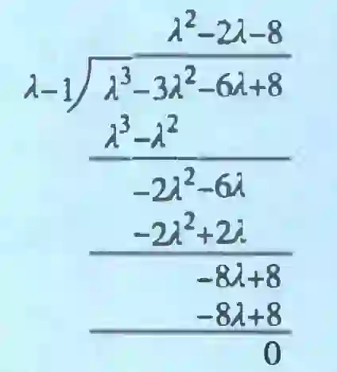
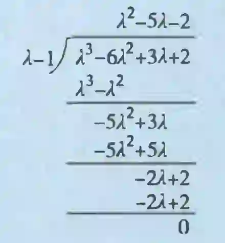

# 第5讲 特征值与特征向量

## 一、特征值与特征向量的定义

设 $A$ 是 $n$ 阶矩阵, $\lambda$ 是一个数,若存在 $n$ 维非零列向量 $\xi$ ,使得

$$
{A\xi } = {\lambda \xi }, \tag*{①}
$$

则称 $\lambda$ 是 $A$ 的特征值, $\xi$ 是 $A$ 的对应于特征值 $\lambda$ 的特征向量.

## 二、矩阵的特征值与特征向量的求法

由①式, 得

$$
\left( {{\lambda E} - A}\right) \xi  = 0,
$$

因 $\mathbf{\xi } \neq  \mathbf{0}$ ,故齐次方程组 $\left( {\lambda \mathbf{E} - \mathbf{A}}\right) \mathbf{x} = \mathbf{0}$ 有非零解,于是

$$
\left| {\lambda \mathbf{E} - \mathbf{A}}\right|  = \left| \begin{matrix} \lambda  - {a}_{11} &  - {a}_{12} & \cdots &  - {a}_{1n} \\   - {a}_{21} & \lambda  - {a}_{22} & \cdots &  - {a}_{2n} \\  \vdots & \vdots & & \vdots \\   - {a}_{n1} &  - {a}_{n2} & \cdots & \lambda  - {a}_{nn} \end{matrix}\right|  = 0.\tag*{②}
$$

> 由此可知。上、下三角矩阵与对角矩阵的特征值就是其主对角线元素。
>
> 如 $\mathbf{A} = \left\lbrack  \begin{matrix} {a}_{11} & 0 & 0 \\  0 & {a}_{22} & 0 \\  0 & 0 & {a}_{33} \end{matrix}\right\rbrack  ,\;\text{ 则 }\left| {\lambda \mathbf{E} - \mathbf{A}}\right|  = \left| \begin{matrix} \lambda  - {a}_{11} & 0 & 0 \\  0 & \lambda  - {a}_{22} & 0 \\  0 & 0 & \lambda  - {a}_{33} \end{matrix}\right|  = 0,$  
> 于是 ${\lambda }_{1} = {a}_{11},{\lambda }_{2} = {a}_{22},{\lambda }_{3} = {a}_{33}, $

②式称为 $A$ 的特征方程,是未知量 $\lambda$ 的 $n$ 次方程,有 $n$ 个根 (重根按照重数计), ${\lambda E} - A$ 称为特征矩阵, $\left| {{\lambda E} - A}\right|$ 称为特征多项式.

于是,求解具体型矩阵的特征值与特征向量,一般先用特征方程 $\left| {{\lambda E} - A}\right|  = 0$ 求出 $\lambda$ ,再解齐次线性方程组 $\left( {{\lambda E} - A}\right) x = 0$ ,求出特征向量.

例 5.1 求矩阵 $A = \left\lbrack  \begin{matrix} 2 & 2 &  - 2 \\  2 & 5 &  - 4 \\   - 2 &  - 4 & 5 \end{matrix}\right\rbrack$ 的特征值与特征向量.

解 由特征方程

$$
\left| {\lambda \mathbf{E} - \mathbf{A}}\right|  = \left| \begin{matrix} \lambda  - 2 &  - 2 & 2 \\   - 2 & \lambda  - 5 & 4 \\  2 & 4 & \lambda  - 5 \end{matrix}\right|  \xlongequal{\text{第2列的1倍加至第3列}} \left| \begin{matrix} \lambda  - 2 &  - 2 & 0 \\   - 2 & \lambda  - 5 & \lambda  - 1 \\  2 & 4 & \lambda  - 1 \end{matrix}\right| .
$$

$$
\xlongequal{\text{第3行的(-1)倍加至第2行}} \left| \begin{matrix} \lambda  - 2 &  - 2 & 0 \\   - 4 & \lambda  - 9 & 0 \\  2 & 4 & \lambda  - 1 \end{matrix}\right|  \xlongequal{ \text{按第3列展开}}
$$

$$
= \left( {\lambda  - 1}\right) \left( {{\lambda }^{2} - {11\lambda } + {10}}\right)  = {\left( \lambda  - 1\right) }^{2}\left( {\lambda  - {10}}\right)  = 0,
$$

知 $A$ 有特征值 ${\lambda }_{1} = {\lambda }_{2} = 1,{\lambda }_{3} = {10}$ .

当 ${\lambda }_{1} = {\lambda }_{2} = 1$ 时,有

$$
\left( {\mathbf{E} - \mathbf{A}}\right) \mathbf{x} = \left\lbrack  \begin{matrix}  - 1 &  - 2 & 2 \\   - 2 &  - 4 & 4 \\  2 & 4 &  - 4 \end{matrix}\right\rbrack  \left\lbrack  \begin{array}{l} {x}_{1} \\  {x}_{2} \\  {x}_{3} \end{array}\right\rbrack   = \mathbf{0}.
$$

解得基础解系为 ${\xi }_{1} = {\left\lbrack   2,-1,0\right\rbrack  }^{\mathrm{T}},{\xi }_{2} = {\left\lbrack 2,0,1 \right\rbrack  }^{\mathrm{T}}$ ,则 ${k}_{1}{\xi }_{1} + {k}_{2}{\xi }_{2}$ 即为 ${\lambda }_{1} = {\lambda }_{2} = 1$ 的全部特征向量, ${k}_{1},{k}_{2}$ 不全为 0 .

当 ${\lambda }_{3} = {10}$ 时,有

$$
\left( {{10}\mathbf{E} - \mathbf{A}}\right) \mathbf{x} = \left\lbrack  \begin{matrix} 8 &  - 2 & 2 \\   - 2 & 5 & 4 \\  2 & 4 & 5 \end{matrix}\right\rbrack  \left\lbrack  \begin{array}{l} {x}_{1} \\  {x}_{2} \\  {x}_{3} \end{array}\right\rbrack   = \mathbf{0}, \tag{*}
$$

解得基础解系为 ${\mathbf{\xi }}_{3} = {\left\lbrack  1,2, - 2\right\rbrack  }^{\mathrm{T}}$ ,则 ${k}_{3}{\mathbf{\xi }}_{3}$ 即为 ${\lambda }_{3} = {10}$ 的全部特征向量, ${k}_{3} \neq  0$ .

---

【注 1】解方程组 $\left( *\right)$ 的技巧:

${\lambda }_{3} = {10}$ 是单根, $\mathbf{A}$ 是实对称矩阵,必可相似对角化,故 $r\left( {{10}\mathbf{E} - \mathbf{A}}\right)  = 2$ ,必有一个方程是多余方程. 因 ${10}\mathbf{E} - \mathbf{A}$ 中三行均不成比例,任一方程均是另外两个方程的线性组合,故可去除任一方程,例如去掉第一个方程, 剩下的仍是同解方程组,

$\left\lbrack  \begin{matrix}  - 2 & 5 & 4 \\  2 & 4 & 5 \\  0 & 0 & 0 \end{matrix}\right\rbrack$
$\xrightarrow{\text{第1行的1倍加至第2行}}$
$\left\lbrack  \begin{matrix}  - 2 & 5 & 4 \\  0 & 9 & 9 \\  0 & 0 & 0 \end{matrix}\right\rbrack$
$\xrightarrow{\text{第2行乘 1/9 }}$
$\left\lbrack  \begin{matrix}  - 2 & 5 & 4 \\  0 & 1 & 1 \\  0 & 0 & 0 \end{matrix}\right\rbrack$
$\xrightarrow{\text{第2行的(-5)倍加至第1行}}$
$\rightarrow  \left\lbrack  \begin{matrix}  - 2 & 0 &  - 1 \\  0 & 1 & 1 \\  0 & 0 & 0 \end{matrix}\right\rbrack ,$

解得 ${\xi }_{3} = {\left\lbrack  1,2, - 2\right\rbrack  }^{\mathrm{T}}$ .

【注 2】用 $\left| {{\lambda E} - A}\right|  = 0$ 求出全部的 $\lambda$ 是起步,也是关键. 上面的例子都是用行列式的性质写成了 $\left| {\lambda \mathbf{E} - \mathbf{A}}\right|  = \left( {\lambda  - {\lambda }_{1}}\right) \left( {\lambda  - {\lambda }_{2}}\right) \cdots \left( {\lambda  - {\lambda }_{n}}\right)$ 的形式,但如果有些技巧想不到,而直接展开成 $\lambda$ 的 $n$ 次多项式 $f\left( \lambda \right)$ ,那又该如何求特征根呢?

例如,设 $\mathbf{A} = \left\lbrack  \begin{matrix} 2 &  - 2 & 0 \\   - 2 & 1 &  - 2 \\  0 &  - 2 & 0 \end{matrix}\right\rbrack$ ,求矩阵 $\mathbf{A}$ 的特征多项式 $\left| {\lambda \mathbf{E} - \mathbf{A}}\right|$ 及 $\mathbf{A}$ 的全部特征值.

解

$\left| {\lambda \mathbf{E} - \mathbf{A}}\right|  = \left| \begin{matrix} \lambda  - 2 & 2 & 0 \\  2 & \lambda  - 1 & 2 \\  0 & 2 & \lambda  \end{matrix}\right|$
$\xlongequal{\text{第2列的2倍加至第1列，第3列的2倍加至第1列}}$
$\left| \begin{matrix} \lambda  + 2 & 2 & 0 \\  2\left( {\lambda  + 2}\right) & \lambda  - 1 & 2 \\  2\left( {\lambda  + 2}\right) & 2 & \lambda \end{matrix}\right|$
$\xlongequal{\text{第1列提出}\lambda +2}$
$\left( {\lambda  + 2}\right) \left| \begin{matrix} 1 & 2 & 0 \\  2 & \lambda  - 1 & 2 \\  2 & 2 & \lambda  \end{matrix}\right|$
$\xlongequal{\text{第1列的(-2)倍加至第2列}}$
$\left( {\lambda  + 2}\right) \left| \begin{matrix} 1 & 0 & 0 \\  2 & \lambda  - 5 & 2 \\  2 &  - 2 & \lambda  \end{matrix}\right|$
$\xlongequal{\text{按第1行展开}}$
$\left( {\lambda  + 2}\right) \left| \begin{matrix} \lambda  - 5 & 2 \\   - 2 & \lambda  \end{matrix}\right|  = \left( {\lambda  + 2}\right) \left( {{\lambda }^{2} - {5\lambda } + 4}\right)$
$= \left( {\lambda  + 2}\right) \left( {\lambda  - 1}\right) \left( {\lambda  - 4}\right) ,$

所以 $A$ 的特征值为-2,1,4.

但以上过程可能有的考生一时想不到, 而直接用展开做:

$$
\left| \begin{matrix} \lambda  - 2 & 2 & 0 \\  2 & \lambda  - 1 & 2 \\  0 & 2 & \lambda  \end{matrix}\right|  = \lambda \left( {\lambda  - 1}\right) \left( {\lambda  - 2}\right)  - 4\left( {\lambda  - 2}\right)  - {4\lambda }
$$

$$
= {\lambda }^{3} - 3{\lambda }^{2} - {6\lambda } + 8\text{.}
$$

矩阵 $A$ 的特征多项式 $f\left( \lambda \right)  = \left| {{\lambda E} - A}\right|$ 求出来了,但 $f\left( \lambda \right)$ 是 $\lambda$ 的三次多项式,求特征根有些困难. 为此介绍三个简单而有效的 $k$ 次多项式方程

$$
f\left( \lambda \right)  = {a}_{k}{\lambda }^{k} + \cdots  + {a}_{1}\lambda  + {a}_{0} = 0
$$

的求根方法:

① 若 ${a}_{0} = 0$ ,则 $f\left( 0\right)  = 0$ ,所以此时 0 是 $f\left( \lambda \right)  = 0$ 的根.

② 若 ${a}_{k} + {a}_{k - 1} + \cdots  + {a}_{1} + {a}_{0} = 0$ ,则 $f\left( 1\right)  = 0$ ,所以此时 1 是 $f\left( \lambda \right)  = 0$ 的根.

③ 若 $f\left( \lambda \right)$ 的偶次项 (包括 ${a}_{0}$ ) 系数之和等于奇次项系数之和,则 $f\left( {-1}\right)  = 0$ ,所以此时 -1 是 $f\left( \lambda \right)  = 0$ 的根.

据此,在本例中 $f\left( \lambda \right)  = {\lambda }^{3} - 3{\lambda }^{2} - {6\lambda } + 8$ ,因 $1 + \left( {-3}\right)  + \left( {-6}\right)  + 8 = 0$ ,所以 1 是 $f\left( \lambda \right)  = 0$ 的根. 从而 $\lambda  - 1$ 是 $f\left( \lambda \right)$ 的一个因式,进一步分解 $f\left( \lambda \right)$ ,可用多项式的带余除法

则 $f\left( \lambda \right)  = \left( {\lambda  - 1}\right) \left( {{\lambda }^{2} - {2\lambda } - 8}\right)$ . 而 ${\lambda }^{2} - {2\lambda } - 8$ 作为二次三项式的因式分解考生是熟悉的,故有

$$
f\left( \lambda \right)  = \left( {\lambda  - 1}\right) \left( {\lambda  + 2}\right) \left( {\lambda  - 4}\right) ,
$$

所以 $\mathbf{A}$ 的 3 个特征值为-2,1,4.

这里所说的三个求根方法常称为试根法. 多项式的带余除法和常数的带余除法形式上基本相同. 上述这些原理浅显易懂, 很容易掌握, 且很实用, 再看一题.

例如, 设

$$
A = \left\lbrack  \begin{matrix} 5 & 6 &  - {10} \\   - 6 & 1 & 6 \\   - 2 & 3 & 0 \end{matrix}\right\rbrack
$$

求矩阵 $\mathbf{A}$ 的特征多项式和全部特征值.

解

$\left| {{\lambda E} - A}\right|  = \left| \begin{matrix} \lambda  - 5 &  - 6 & {10} \\  6 & \lambda  - 1 &  - 6 \\  2 &  - 3 & \lambda  \end{matrix}\right|$
$\xlongequal{\text{第1列的1倍加至第3列}}$
$\left| \begin{matrix} \lambda  - 5 &  - 6 & \lambda  + 5 \\  6 & \lambda  - 1 & 0 \\  2 &  - 3 & \lambda  + 2 \end{matrix}\right|$
$\xlongequal{\text{第3行的(-2)倍加至第1行}}$
$\left| \begin{matrix} \lambda  - 9 & 0 &  - \lambda  + 1 \\  6 & \lambda  - 1 & 0 \\  2 &  - 3 & \lambda  + 2 \end{matrix}\right|$
$\xlongequal{\text{第2行的(-1/3)倍加至第3行}}$
$\left| \begin{matrix} \lambda  - 9 & 0 &  - \lambda  + 1 \\  6 & \lambda  - 1 & 0 \\  0 &  - \frac{\lambda }{3} - \frac{8}{3} & \lambda  + 2 \end{matrix}\right|$

$$
\xlongequal{\text{按第1列展开}}\left( {\lambda  - 9}\right) \left( {\lambda  - 1}\right) \left( {\lambda  + 2}\right)  + 6\left( {-\lambda  + 1}\right) \left( {-\frac{\lambda }{3} - \frac{8}{3}}\right)
$$

$$
\overset{\left( *\right) }{ = }\left( {\lambda  - 1}\right) \left\lbrack  {\left( {\lambda  - 9}\right) \left( {\lambda  + 2}\right)  + \left( {{2\lambda } + {16}}\right) }\right\rbrack
$$

$$
= \left( {\lambda  - 1}\right) \left( {{\lambda }^{2} - {5\lambda } - 2}\right)
$$

$$
= \left( {\lambda  - 1}\right) \left( {\lambda  - \frac{5 + \sqrt{33}}{2}}\right) \left( {\lambda  - \frac{5 - \sqrt{33}}{2}}\right) .
$$

所以 $A$ 的 3 个特征值为 $1,\displaystyle\frac{5 + \sqrt{33}}{2},\frac{5 - \sqrt{33}}{2}$ .

(*) 处提出公因子 $\lambda  - 1$ 是重要的,有了这一步下面就能将特征多项式完全分解,从而求出 $A$ 的全部特征值. 如有考生忽略了提出公因子,或在计算 $\left| {{\lambda E} - A}\right|$ 时用其他方法得出

$$
f\left( \lambda \right)  = \left| {\lambda \mathbf{E} - \mathbf{A}}\right|  = {\lambda }^{3} - 6{\lambda }^{2} + {3\lambda } + 2,
$$

可利用上面介绍的试根法求根. 因

$$
1 + \left( {-6}\right)  + 3 + 2 = 0,
$$

故 1 是 $f\left( \lambda \right)  = 0$ 的一个根,从而 $\lambda  - 1$ 是 $f\left( \lambda \right)$ 的一个因式. 再用多项式的带余除法

可得

$$
f\left( \lambda \right)  = \left( {\lambda  - 1}\right) \left( {{\lambda }^{2} - {5\lambda } - 2}\right) ,
$$

同样可求得 $A$ 的 3 个特征值为 $\displaystyle 1,\frac{5 + \sqrt{33}}{2},\frac{5 - \sqrt{33}}{2} $ .

其实, 还有一个定理可供考生试根:

**定理** 设

$$
f\left( x\right)  = 1 \cdot  {x}^{k} + {a}_{k - 1}{x}^{k - 1} + \cdots  + {a}_{1}x + {a}_{0}
$$

是系数 ${a}_{i}\left( {i = 0,1,2,\cdots , k - 1}\right)$ 都是整数的多项式,则 $f\left( x\right)  = 0$ 的有理根都是整数,且均是 ${a}_{0}$ 的因子. 例如,设 3 阶方阵 $\mathbf{A}$ 的特征多项式为

$$
f\left( \lambda \right)  = \left| {{\lambda E} - A}\right|  = {\lambda }^{3} - 4{\lambda }^{2} + {3\lambda } + 2,
$$

求矩阵 $A$ 的特征值.

解 根据上述定理, $f\left( \lambda \right)  = 0$ 的有理根只可能是 $\pm  1, \pm  2$ . 计算得

$$
f\left( 1\right)  = 2 \neq  0, f\left( {-1}\right)  =  - 6 \neq  0,
$$

$$
f\left( 2\right)  = 0, f\left( {-2}\right)  =  - {28} \neq  0,
$$

故 $f\left( \lambda \right)  = 0$ 的有理根只有一个,即 ${\lambda }_{1} = 2$ . 从而 $\lambda  - 2$ 是 $f\left( \lambda \right)$ 的一个因式. 用多项式的带余除法可得

$$
f\left( \lambda \right)  = \left( {\lambda  - 2}\right) \left( {{\lambda }^{2} - {2\lambda } - 1}\right) .
$$

对二次多项式方程 ${\lambda }^{2} - {2\lambda } - 1 = 0$ 用求根公式得出两个根为

$$
{\lambda }_{2} = 1 + \sqrt{2},{\lambda }_{3} = 1 - \sqrt{2}.
$$

综上可知, $A$ 的 3 个特征值为 $2,1 + \sqrt{2},1 - \sqrt{2}$ .

---

## 三、特征值、特征向量的性质与重要结论

### 1. 特征值的性质与重要结论

(1) ${\lambda }_{0}$ 是 $A$ 的特征值 $\Leftrightarrow  \left| {{\lambda }_{0}E - A}\right|  = 0$ (建立方程求参数或证明行列式 $\left| {{\lambda }_{0}E - A}\right|  = 0$ );

${\lambda }_{0}$ 不是 $A$ 的特征值 $\Leftrightarrow  \left| {{\lambda }_{0}E - A}\right|  \neq  0$ (矩阵可逆,满秩).

---

【注】这里常见的命题方法: 若 $\left| {{aA} + {bE}}\right|  = 0$ (或 ${aA} + {bE}$ 不可逆), $a \neq  0$ ,则 $- \frac{b}{a}$ 是 $A$ 的特征值.

$|bE-(-aA)|=(-a)^n \left|-\displaystyle\frac{b}{a}E-A\right|=0$，则$\lambda _0 =-\displaystyle\frac{b}{a}$

---

(2) 若 ${\lambda }_{1},{\lambda }_{2},\cdots ,{\lambda }_{n}$ 是 $A$ 的 $n$ 个特征值,则

$$
\left\{  \begin{array}{l} \left| \mathbf{A}\right|  = {\lambda }_{1}{\lambda }_{2}\cdots {\lambda }_{n}, \\  \operatorname{tr}\left( \mathbf{A}\right)  = {\lambda }_{1} + {\lambda }_{2} + \cdots  + {\lambda }_{n}. \end{array}\right.
$$

---

定义：主子式

设$A$是一个$n\times n$矩阵。$A$的$k\times k$子矩阵通过删除$n-k$列、删除$n-k$行（$i_1,i_2,\ldots,i_{n-k}$ ）形成，这样的子矩阵称为$A$的$k$阶主子矩阵。 $k\times k$主子矩阵的行列式称为 $A$的$k$ 阶主子式。

例：三阶矩阵

给定一个$3\times3$矩阵：

$$
A=\left.\left[\begin{array}{ccc}a_{11}&a_{12}&a_{13}\\a_{21}&a_{22}&a_{23}\\a_{31}&a_{32}&a_{33}\end{array}\right.\right]$$

有一个三阶主子式：$A$ .

有三个二阶主子式：

(1) $\begin{vmatrix}a_{11}&a_{12}\\a_{21}&a_{22}\end{vmatrix}$,从A中删除第3列和第3行得到

(2) $\begin{vmatrix}a_{11}&a_{13}\\a_{31}&a_{33}\end{vmatrix}$,从A中删除第2列和第2行得到

(3) $\begin{vmatrix}a_{22}&a_{23}\\a_{32}&a_{33}\end{vmatrix}$,从A中删除第1列和第1行得到。

有三个一阶主子式：$|a_{11}|$、$|a_{22}|$、$|a_{33}|$ 。

【注】以 3 阶矩阵为例, 证明并作推广.

设 $A = \left\lbrack  \begin{array}{lll} {a}_{11} & {a}_{12} & {a}_{13} \\  {a}_{21} & {a}_{22} & {a}_{23} \\  {a}_{31} & {a}_{32} & {a}_{33} \end{array}\right\rbrack$ ,并定义 3 阶矩阵的 $k$ 阶主子式为 $\left| \begin{matrix} {a}_{i_1 i_1} & \cdots & {a}_{i_1 i_k} \\  \vdots & & \vdots \\  {a}_{i_k i_1} & \cdots & {a}_{i_k i_k} \end{matrix}\right| ,1 \leq  {i}_{1} < \cdots  < {i}_{k} \leq  3$ . 则

$\left| {{\lambda E} - A}\right|  = \left| \begin{matrix} \lambda  - {a}_{11} &  - {a}_{12} &  - {a}_{13} \\   - {a}_{21} & \lambda  - {a}_{22} &  - {a}_{23} \\   - {a}_{31} &  - {a}_{32} & \lambda  - {a}_{33} \end{matrix}\right|$ 是 $\lambda$ 的一元三次多项式,且 1 阶主子式为 ${a}_{11},{a}_{22},{a}_{33};2$ 阶主子式

为 $\left| \begin{array}{ll} {a}_{22} & {a}_{23} \\  {a}_{32} & {a}_{33} \end{array}\right|  = {A}_{11},\left| \begin{array}{ll} {a}_{11} & {a}_{13} \\  {a}_{31} & {a}_{33} \end{array}\right|  = {A}_{22},\left| \begin{array}{ll} {a}_{11} & {a}_{12} \\  {a}_{21} & {a}_{22} \end{array}\right|  = {A}_{33};3$ 阶主子式为 $\left| \mathbf{A}\right|$ ,则

$$
\left| {\lambda E - A}\right|  = \left| \begin{matrix} \lambda  - {a}_{11} &  - {a}_{12} &  - {a}_{13} \\   - {a}_{21} & \lambda  - {a}_{22} &  - {a}_{23} \\   - {a}_{31} &  - {a}_{32} & \lambda  - {a}_{33} \end{matrix}\right|  = \left| \begin{matrix} \lambda  - {a}_{11} & 0 - {a}_{12} & 0 - {a}_{13} \\  0 - {a}_{21} & \lambda  - {a}_{22} & 0 - {a}_{23} \\  0-{a}_{31} & 0 - {a}_{32} & \lambda  - {a}_{33} \end{matrix}\right| ,
$$

将上述行列式全部拆开, 得

$\left| {\lambda \mathbf{E} - \mathbf{A}}\right|=\left| \begin{array}{ccc}\lambda & 0 & 0 \\ 0&\lambda &0 \\ 0&0&\lambda\end{array}\right|+$
$\left|\begin{array}{ccc}\lambda&0&-a_{13}\\0&\lambda&-a_{23}\\0&0&-a_{33}\end{array}\right|+$
$\left|\begin{array}{ccc}\lambda&-a_{12}&0\\0&-a_{22}&0\\0&-a_{32}&\lambda\end{array}\right|+$
$\left|\begin{array}{ccc}-a_{11}&0&0\\-a_{21}&\lambda&0\\-a_{31}&0&\lambda\end{array}\right|+$
$\left|\begin{array}{ccc}\lambda&-a_{12}&-a_{13}\\0&-a_{22}&-a_{23}\\0&-a_{32}&-a_{33}\end{array}\right|+$
$\left|\begin{array}{ccc}-a_{11}&0&-a_{13}\\-a_{21}&\lambda&-a_{23}\\-a_{31}&0&-a_{33}\end{array}\right|+$
$\left| \begin{array}{lll}  - {a}_{11} &  - {a}_{12} & 0 \\   - {a}_{21} &  - {a}_{22} & 0 \\   - {a}_{31} &  - {a}_{32} & \lambda  \end{array}\right| +$
$\left| \begin{array}{lll}  - {a}_{11} &  - {a}_{12} &  - {a}_{13} \\   - {a}_{21} &  - {a}_{22} &  - {a}_{23} \\   - {a}_{31} &  - {a}_{32} &  - {a}_{33} \end{array}\right|$

$$
= {\lambda }^{3} - \left( {{a}_{11} + {a}_{22} + {a}_{33}}\right) {\lambda }^{2} + \left( {{A}_{11} + {A}_{22} + {A}_{33}}\right) \lambda  - \left| A\right| \tag*{①}
$$

> $\lambda^2$ 的系数是1阶主子式之和，$\lambda$ 的系数是2阶主子式之和，$\left| A\right|$ 是3阶主子式之和

设

$$
\left| {\lambda \mathbf{E} - \mathbf{A}}\right|  = \left( {\lambda  - {\lambda }_{1}}\right) \left( {\lambda  - {\lambda }_{2}}\right) \left( {\lambda  - {\lambda }_{3}}\right)
$$

$$
= {\lambda }^{3} - \left( {{\lambda }_{1} + {\lambda }_{2} + {\lambda }_{3}}\right) {\lambda }^{2} + \left( {{\lambda }_{1}{\lambda }_{2} + {\lambda }_{1}{\lambda }_{3} + {\lambda }_{2}{\lambda }_{3}}\right) \lambda  - {\lambda }_{1}{\lambda }_{2}{\lambda }_{3}. \tag*{②}
$$

比较①, ② 两式 得

$\left\{  \begin{array}{l} {a}_{11} + {a}_{22} + {a}_{33} = {\lambda }_{1} + {\lambda }_{2} + {\lambda }_{3}, \\  {A}_{11} + {A}_{22} + {A}_{33} = {\lambda }_{2}{\lambda }_{3} + {\lambda }_{1}{\lambda }_{3} + {\lambda }_{1}{\lambda }_{2},\\   \left|A\right|={\lambda }_{1}{\lambda }_{2}{\lambda }_{3} \end{array}\right.$ （ $k$阶主子式之和 = 任意$k$ 个特征值乘积之和）

以后会经常用到这里的结论.

### 2. 特征向量的性质与重要结论

(1) $\xi \left( { \neq  0}\right)$ 是 $A$ 的属于 ${\lambda }_{0}$ 的特征向量 $\Leftrightarrow  \xi$ 是 $\left( {{\lambda }_{0}E - A}\right) x = 0$ 的非零解.

(2) 重要结论.

① $k$重特征值$\lambda$至多只有$k$ 个线性无关的特征向量 (不用证明).  
② 若 ${\xi }_{1},{\xi }_{2}$是$A$的属于不同特征值$\lambda _1,\lambda _2$的特征向量, 则${\xi}_1, {\xi}_2$ 线性无关.

$$
\begin{cases}
\lambda _1 \ne \lambda_{2} \Rightarrow \xi _1 , \xi_2 \text{ 线性无关}\\\\
\lambda _1 = \lambda_{2} \Rightarrow \xi _1 , \xi_2 \text{ 可能}
\begin{cases}
\text{线性相关}\\
\text{线性无关}
\end{cases}
\end{cases}
$$

---

【注】证明: $n$ 阶方阵 $A$ 的任意两个不同特征值 ${\lambda }_{1},{\lambda }_{2}$ 对应的两个特征向量线性无关.

证明 设 $A$ 的特征值 ${\lambda }_{1},{\lambda }_{2}\left( {{\lambda }_{1} \neq  {\lambda }_{2}}\right)$ 对应的特征向量分别是 ${\mathbf{\xi }}_{1},{\mathbf{\xi }}_{2}\left( {{\mathbf{\xi }}_{i} \neq  \mathbf{0}}\right.$ , $i = 1,2$ ),即

$$
A{\xi }_{1} = {\lambda }_{1}{\xi }_{1}, A{\xi }_{2} = {\lambda }_{2}{\xi }_{2}.
$$

考查

$$
{k}_{1}{\xi }_{1} + {k}_{2}{\xi }_{2} = 0. \tag*{①}
$$

式①两端左边乘 $\mathbf{A}$ ,得

$$
A\left( {{k}_{1}{\xi }_{1} + {k}_{2}{\xi }_{2}}\right)  = {k}_{1}A{\xi }_{1} + {k}_{2}A{\xi }_{2} = {k}_{1}{\lambda }_{1}{\xi }_{1} + {k}_{2}{\lambda }_{2}{\xi }_{2} = 0. \tag*{②}
$$

式①两边乘 ${\lambda }_{1}$ ,得

$$
{k}_{1}{\lambda }_{1}{\xi }_{1} + {k}_{2}{\lambda }_{1}{\xi }_{2} = 0. \tag*{③}
$$

式③减式②,得 ${k}_{2}\left( {{\lambda }_{1} - {\lambda }_{2}}\right) {\xi }_{2} = 0$ . 因 ${\lambda }_{1} \neq  {\lambda }_{2},{\xi }_{2} \neq  0$ ,故 ${k}_{2} = 0$ .

将 ${k}_{2} = 0$ 代入式①,因 ${\xi }_{1} \neq  0$ ,得 ${k}_{1} = 0$ ,故不同特征值 ${\lambda }_{1},{\lambda }_{2}$ 对应的特征向量线性无关.

---

③ 若 ${\xi }_{1},{\xi }_{2}$ 是 $A$ 的属于同一特征值 $\lambda$ 的特征向量,则非零向量 ${k}_{1}{\xi }_{1} + {k}_{2}{\xi }_{2}$ 仍是 $A$ 的属于特征值 $\lambda$ 的特征向量. (常考其中一个系数 (如 ${k}_{2}$ ) 等于 0 的情形)

④ 若 ${\xi }_{1},{\xi }_{2}$ 是 $A$ 的属于不同特征值 ${\lambda }_{1},{\lambda }_{2}$ 的特征向量,则当 ${k}_{1} \neq  0,{k}_{2} \neq  0$ 时, ${k}_{1}{\xi }_{1} + {k}_{2}{\xi }_{2}$ 不是 $A$ 的任何特征值的特征向量. (常考 ${k}_{1} = {k}_{2} = 1$ 的情形)

---

【注】证明 反证法. 假设 ${k}_{1}{\xi }_{1} + {k}_{2}{\xi }_{2}$ 是 $A$ 的特征向量,则存在数 $\lambda$ ,有

$$
A\left( {{k}_{1}{\xi }_{1} + {k}_{2}{\xi }_{2}}\right)  = \lambda \left( {{k}_{1}{\xi }_{1} + {k}_{2}{\xi }_{2}}\right) ,
$$

$$
{k}_{1}A{\xi }_{1} + {k}_{2}A{\xi }_{2} = {k}_{1}\lambda {\xi }_{1} + {k}_{2}\lambda {\xi }_{2},
$$

也即

$$
{k}_{1}{\lambda }_{1}{\xi }_{1} + {k}_{2}{\lambda }_{2}{\xi }_{2} = {k}_{1}\lambda {\xi }_{1} + {k}_{2}\lambda {\xi }_{2},
$$

移项, 得

$$
{k}_{1}\left( {{\lambda }_{1} - \lambda }\right) {\xi }_{1} + {k}_{2}\left( {{\lambda }_{2} - \lambda }\right) {\xi }_{2} = \mathbf{0}.
$$

由于 ${\xi }_{1},{\xi }_{2}$ 线性无关,则

$$
\left\{  \begin{array}{l} {k}_{1}\left( {{\lambda }_{1} - \lambda }\right)  = 0, \\  {k}_{2}\left( {{\lambda }_{2} - \lambda }\right)  = 0. \end{array}\right.
$$

又 ${k}_{1} \neq  0,{k}_{2} \neq  0$ ,则 ${\lambda }_{1} = {\lambda }_{2} = \lambda$ ,与 ${\lambda }_{1} \neq  {\lambda }_{2}$ 矛盾,故 ${k}_{1}{\xi }_{1} + {k}_{2}{\xi }_{2}$ 不是 $A$ 的任何特征值的特征向量.

---

⑤设 ${\lambda }_{1},{\lambda }_{2}$ 是 $A$ 的两个不同的特征值, $\xi$ 是对应于 ${\lambda }_{1}$ 的特征向量,则 $\xi$ 不是对应于 ${\lambda }_{2}$ 的特征向量 (即一个特征向量不能属于两个不同的特征值).

【注】证明 用反证法. 由题设知 ${A\xi } = {\lambda }_{1}\xi$ . 若 $\xi$ 也是 $A$ 的对应于 ${\lambda }_{2}$ 的特征向量,则有 ${A\xi } = {\lambda }_{2}\xi$ , 即得 ${\lambda }_{1}\xi  = {\lambda }_{2}\xi$ ,即 $\left( {{\lambda }_{1} - {\lambda }_{2}}\right) \xi  = 0$ . 由于 $\xi  \neq  0$ ,故 ${\lambda }_{1} = {\lambda }_{2}$ ,这与已知 ${\lambda }_{1} \neq  {\lambda }_{2}$ 矛盾,故一个特征向量不能属于两个不同的特征值.

### 3. 常用矩阵的特征值与特征向量

$A$ 以及与 $A$ 有关的常用矩阵的特征值和特征向量总结如下:

| 矩阵 | 特征值 | 对应的特征向量 |
| :---: | :---: | :---: |
| $A$ | $\lambda$ | $\xi$ |
| $kA$ | $k\lambda$ | $\xi$ |
| ${A}^{k}$ | $\lambda^{k}$ | $\xi$ |
| $f\left( A\right)$ | $f\left( \lambda \right)$ | $\xi$ |
| ${A}^{-1}$ | $\displaystyle\frac{1}{\lambda }$ | $\xi$ |
| ${A}^{ * }$ | $\displaystyle\frac{\left\vert A\right\vert }{\lambda }$ | $\xi$ |
| $\mathbf{P}A\mathbf{P}^{-1}$ | $\lambda$ | ${P}^{-1}\xi$ |

【注】(1) 表中若 $\lambda$ 在分母上,设 $\lambda  \neq  0$ .

(2) 第 3,4,5 列的证明. 设 $n$ 阶矩阵 $A$ 有特征值 $\lambda$ ,对应的特征向量为 $\xi$ . 求 ${kA},{A}^{k}, f\left( A\right)$ 的特征值和特征向量,其中 $f\left( x\right)  = {a}_{0} + {a}_{1}x + \cdots  + {a}_{n}{x}^{n}$ .

解 利用定义,由题设条件,有 $\mathbf{\xi } \neq  \mathbf{0}$ ,且

$$
{A\xi } = {\lambda \xi }. \tag*{①}
$$

式①两端乘 $k$ ,得

$$
{kA\xi } = {k\lambda \xi },\left( {kA}\right) \xi  = \left( {k\lambda }\right) \xi ,\tag*{②}
$$

故由式 ② 知, ${kA}$ 有特征值 ${k\lambda }$ ,对应的特征向量仍是 $\xi$ .

式①两端左边连着乘 $k - 1$ 个 $A$ ,并逐个代入式①,得

$$
{A}^{k}\xi  = \lambda {A}^{k - 1}\xi  = {\lambda }^{2}{A}^{k - 2}\xi  = \cdots  = {\lambda }^{k}\xi , \tag*{③}
$$

由式③知, ${A}^{k}$ 有特征值 ${\lambda }^{k}$ ,对应的特征向量仍是 $\xi$ .

由式①, ②, ③得

$$
f\left( \mathbf{A}\right) \xi  = \left( {{a}_{0}\mathbf{E} + {a}_{1}\mathbf{A} + {a}_{2}{\mathbf{A}}^{2} + \cdots  + {a}_{n}{\mathbf{A}}^{n}}\right) \mathbf{\xi }
$$

$$
= {a}_{0}\xi  + {a}_{1}{A\xi } + {a}_{2}{A}^{2}\xi  + \cdots  + {a}_{n}{A}^{n}\xi
$$

$$
= {a}_{0}\xi  + {a}_{1}{\lambda \xi } + {a}_{2}{\lambda }^{2}\xi  + \cdots  + {a}_{n}{\lambda }^{n}\xi  = f\left( \lambda \right) \xi , \tag*{④}
$$

由式④知, $f\left( A\right)$ 有特征值 $f\left( \lambda \right)$ ,对应的特征向量仍是 $\xi$ .

(3) 第 6,7,8 列的证明. 设 $n$ 阶可逆矩阵 $A$ 有特征值 $\lambda$ ,对应的特征向量为 $\xi$ . 求 ${A}^{-1},{A}^{ * },{P}^{-1}{AP}\left( {P\text{为可逆矩阵}}\right)$ 的特征值和特征向量

解 由题设条件知,

$$
{A\xi } = {\lambda \xi },\xi  \neq  0  \tag{*}
$$

(*) 式两端左边乘 ${A}^{-1}$ ,且由 $\left| A\right|  = {\lambda }_{1}{\lambda }_{2} \cdot  \cdots  \cdot  {\lambda }_{n} \neq  0$ ,知 $\lambda  \neq  0$ ,得

$$
{A}^{-1}{A\xi } = \xi  = \lambda {A}^{-1}\xi ,
$$

$$
{A}^{-1}\xi  = \frac{1}{\lambda }\xi ,
$$

故 ${\mathbf{A}}^{-1}$ 有特征值 $\frac{1}{\lambda }$ ,对应的特征向量仍是 $\mathbf{\xi }$ .

(*) 式两端左边乘 ${A}^{ * }$ ,得

$$
{A}^{*}{A\xi } = \left| A\right| {E\xi } = \lambda {A}^{\ast}\xi ,
$$

$$
{A}^{ * }\xi  = \frac{\left| A\right| }{\lambda }\xi ,
$$

故 ${A}^{ * }$ 有特征值 $\frac{\left| A\right| }{\lambda }$ ,对应的特征向量仍是 $\xi$ .(若 $A$ 有特征值 ${\lambda }_{1},{\lambda }_{2},\cdots ,{\lambda }_{n}$ ,因 $\left| A\right|  = \mathop{\prod }\limits_{{i = 1}}^{n}{\lambda }_{i}$ ,故 ${A}^{ * }$ 的特征值为 ${\lambda }_{2}{\lambda }_{3}\cdots {\lambda }_{n},{\lambda }_{1}{\lambda }_{3}\cdots {\lambda }_{n},\cdots ,{\lambda }_{1}{\lambda }_{2}\cdots {\lambda }_{n - 1}$ .)

因为 ${P}^{-1}{AP}{P}^{-1}\xi  = \lambda {P}^{-1}\xi$ ,即 ${P}^{-1}{AP}\left( {{P}^{-1}\xi }\right)  = \lambda \left( {{P}^{-1}\xi }\right)$ ,故 $\lambda$ 是 ${P}^{-1}{AP}$ 的特征值,对应的特征向量是 ${\mathbf{P}}^{-1}\xi$ .

(4) $f\left( x\right)$ 为多项式,若矩阵 $A$ 满足 $f\left( A\right)  = O,\lambda$ 是 $A$ 的任一特征值,则 $\lambda$ 满足 $f\left( \lambda \right)  = 0$ .

(5) 虽然 ${A}^{\mathrm{T}}$ 的特征值与 $A$ 相同,但特征向量不再是 $\xi$ .

$\left| {{\lambda E} - {A}^{\mathrm{T}}}\right|  = \left| {\left( \lambda E - A\right) }^{\mathrm{T}}\right|  = \left| {{\lambda E} - A}\right|$,故特征值相同,但 $\left( {{\lambda E} - A}\right) x = 0$ 与 $\left( {{\lambda E} - {A}^{\mathrm{T}}}\right)$  $x = 0$ 是不同的方程组。故特征向量要单独计算才能得出.

---

例 5.2 证明: 对于秩为 1 的 $n$ 阶矩阵 $A$ 或 $A = a{\beta }^{\mathrm{T}}$ (或 $\beta {\alpha }^{\mathrm{T}}$ ) ( $\alpha ,\beta$ 都是 $n$ 维非零列向量), 其特征值为 ${\lambda }_{1} = {\lambda }_{2} = \cdots  = {\lambda }_{n - 1} = 0,{\lambda }_{n} = \mathop{\sum }\limits_{{i = 1}}^{n}{a}_{ii} = {\mathbf{\beta }}^{\mathrm{T}}\mathbf{\alpha }$ (或 ${\mathbf{\alpha }}^{\mathrm{T}}\mathbf{\beta }$ ).

证明 由于 $r\left( \mathbf{A}\right)  = 1$ ,则 $\mathbf{{Ax}} = \mathbf{0}$ 有 $n - 1$ 个线性无关的解 ${a}_{1},{a}_{2},\cdots ,{a}_{n - 1}$ ,于是 $\mathbf{A}{\mathbf{a}}_{1} = \mathbf{0} = 0{\mathbf{a}}_{1},\mathbf{A}{\mathbf{a}}_{2} =$ $\mathbf{0} = 0{\alpha }_{2},\cdots , A{\alpha }_{n - 1} = \mathbf{0} = 0{\alpha }_{n - 1}$ ,故 $\lambda  = 0$ 至少是 $A$ 的 $n - 1$ 重特征值,又 $\mathop{\sum }\limits_{{i = 1}}^{n}{\lambda }_{i} = \mathop{\sum }\limits_{{i = 1}}^{n}{a}_{ii}$ ,则 ${\lambda }_{n} = \mathop{\sum }\limits_{{i = 1}}^{n}{a}_{ii} = {\mathbf{\beta }}^{\mathrm{T}}\mathbf{a}$ , 故 $\mathbf{A}$ 的特征值为 ${\lambda }_{1} = {\lambda }_{2} = \cdots  = {\lambda }_{n - 1} = 0,{\lambda }_{n} = \mathop{\sum }\limits_{{i = 1}}^{n}{a}_{ii} = {\mathbf{\beta }}^{\mathrm{T}}\mathbf{\alpha }$ .

例 5.3 设 $A$ 是 $n$ 阶矩阵,且满足 $ {A}^{2} = A$（$A$ 称为幂等矩阵）

(1) 求 $A$ 的特征值可能的取值;

(2) 证明: $\mathbf{E} + \mathbf{A}$ 是可逆矩阵.

(1) 解 由 ${A}^{2} = A$ 知 ${A}^{2} - A = O$ ,设 $\lambda$ 是 $A$ 的特征值,由 “三、3” 的注 (4) 知, ${\lambda }^{2} - \lambda  = 0$ ,解得 $\lambda  = 0$ 或 $\lambda  = 1.$

(2) 证明 由 (1) 知,满足 ${A}^{2} = A$ 的矩阵 $A$ 的特征值可能的取值是 $\lambda  = 0$ 或 $\lambda  = 1$ ,则 $E + A$ 的特征值可能的取值是 1 或 2,均不为 0,故 $\left| {\mathbf{E} + \mathbf{A}}\right|  \neq  0$ (或假设 $\left| {\mathbf{E} + \mathbf{A}}\right|  = 0$ ,则-1是 $\mathbf{A}$ 的特征值,这与 (1) 中的结论矛盾),则 $E + A$ 是可逆矩阵.

---

【注】满足条件 ${A}^{2} = A$ 的矩阵有很多,例如, $A = \left\lbrack  \begin{array}{ll} 1 & 0 \\  0 & 1 \end{array}\right\rbrack$ 或 $\left\lbrack  \begin{array}{ll} 1 & 0 \\  0 & 0 \end{array}\right\rbrack$ 或 $\left\lbrack  \begin{array}{ll} 0 & 0 \\  0 & 0 \end{array}\right\rbrack$ ,均有 ${A}^{2} = A$ ,而它们的特征值分别是 $1,1;1,0;0,0$ .

---

例 5.4 已知 $A$ 是 3 阶方阵,特征值为1,2,3,则 $\left| A\right|$ 的元素 ${a}_{11},{a}_{22},{a}_{33}$ 的代数余子式 ${A}_{11},{A}_{22},{A}_{33}$ 的和 $\mathop{\sum }\limits_{{i = 1}}^{3}{A}_{ii} =$ _____.

解 应填 11 .

3 阶矩阵 $A$ 的特征值 $\lambda  = 1,2,3$ ,由 2 阶主子式之和 $=$ 任意两个特征值乘积之和,得

$$
\mathop{\sum }\limits_{{i = 1}}^{3}{A}_{ii} = 2 \times  3 + 1 \times  3 + 1 \times  2 = {11}.
$$

例 5.5 设 $A = \left( {a}_{ij}\right)$ 为 3 阶矩阵, ${A}_{ij}$ 为元素 ${a}_{ij}$ 的代数余子式. 若 $A$ 的每行元素之和均为 2,且 $\left| A\right|  = 3$ , 则 ${A}_{11} + {A}_{21} + {A}_{31} =$ _____.

解 应填 $\displaystyle\frac{3}{2} $ .

由 $A\left\lbrack  \begin{array}{l} 1 \\  1 \\  1 \end{array}\right\rbrack   = 2\left\lbrack  \begin{array}{l} 1 \\  1 \\  1 \end{array}\right\rbrack$ ,得 $A$ 有一个特征值 $\lambda  = 2$ ,其对应的特征向量为 $\alpha  = \left\lbrack  \begin{array}{l} 1 \\  1 \\  1 \end{array}\right\rbrack$ ,则 ${A}^{ * }$ 的一个特征值为 $\frac{\left| A\right| }{\lambda }$ ,

其对应的特征向量也为 $\mathbf{\alpha } = \left\lbrack  \begin{array}{l} 1 \\  1 \\  1 \end{array}\right\rbrack$ . 由 ${A}^{ * }\mathbf{\alpha } = \frac{\left| A\right| }{\lambda }\mathbf{\alpha },{A}^{ * } = \left\lbrack  \begin{array}{lll} {A}_{11} & {A}_{21} & {A}_{31} \\  {A}_{12} & {A}_{22} & {A}_{32} \\  {A}_{13} & {A}_{23} & {A}_{33} \end{array}\right\rbrack$ ,得 ${A}^{ * }\left\lbrack  \begin{array}{l} 1 \\  1 \\  1 \end{array}\right\rbrack   = \left\lbrack  \begin{array}{l} {A}_{11} + {A}_{21} + {A}_{31} \\  {A}_{12} + {A}_{22} + {A}_{32} \\  {A}_{13} + {A}_{23} + {A}_{33} \end{array}\right\rbrack   = \frac{\left| A\right| }{\lambda }\left\lbrack  \begin{array}{l} 1 \\  1 \\  1 \end{array}\right\rbrack$ ,

即

$$
{A}_{11} + {A}_{21} + {A}_{31} = \frac{3}{2}.
$$

## 四、矩阵的相似

### 1. 定义

设 $A, B$ 是两个 $n$ 阶方阵,若存在 $n$ 阶可逆矩阵 $P$ ,使得 ${P}^{-1}{AP} = B$ ,则称 $A$ 相似于 $B$ ,记成 $A \sim  B$ .

【注】(1) $A \sim  A$ ; (反身性)

(2) 若 $A \sim  B$ ,则 $B \sim  A$ ; ( 对称性 )

(3) 若 $A \sim  B, B \sim  C$ ,则 $A \sim  C$ . (传递性) 这个性质以后常用.

---

如何证明矩阵相似? ① 定义法 ② 传递法

---

### 2. 相似矩阵的性质

若 $\mathbf{A} \sim  \mathbf{B}$ ,则

① $\left| \mathbf{A}\right|  = \left| \mathbf{B}\right|$ .

② $r\left( \mathbf{A}\right)  = r\left( \mathbf{B}\right)$ .

③ $\operatorname{tr}\left( \mathbf{A}\right)  = \operatorname{tr}\left( \mathbf{B}\right)$ .

④ ${\lambda }_{A} = {\lambda }_{B}$ (或 $\left| {{\lambda E} - A}\right|  = \left| {{\lambda E} - B}\right|$ ).

⑤ $r\left( {\lambda \mathbf{E} - \mathbf{A}}\right)  = r\left( {\lambda \mathbf{E} - \mathbf{B}}\right)$ .

⑥ $\mathbf{A},\mathbf{B}$ 的各阶主子式之和分别相等.

【注】(1) 若①,②, ③, ④, ⑤, ⑥中至少有一个不成立,则 $A$ 不相似于 $B$

(2) 性质⑤的证明方法如下.

证明 若 $\mathbf{A} \sim  \mathbf{B}$ ,则 $\lambda \mathbf{E} - \mathbf{A} \sim  \lambda \mathbf{E} - \mathbf{B}$ ,所以 $r\left( {\lambda \mathbf{E} - \mathbf{A}}\right)  = r\left( {\lambda \mathbf{E} - \mathbf{B}}\right)$ . 事实上,由 $\mathbf{A} \sim  \mathbf{B}$ ,则存在可逆矩阵 $P$ ,使得 ${P}^{-1}{AP} = B$ ,若 $A$ 属于 $\lambda$ 的线性无关的特征向量是 ${\xi }_{1},{\xi }_{2},\cdots ,{\xi }_{s}$ ,可知 $B$ 属于 $\lambda$ 的线性无关的特征向量是 ${P}^{-1}{\xi }_{1}\;,\;{P}^{-1}{\xi }_{2}\;,\;\cdots \;,\;{P}^{-1}{\xi }_{s}$ ,故 $A$ 和 $B$ 对应于特征值 $\lambda$ 的线性无关的特征向量的个数相同,即 $n - r\left( {{\lambda E} - A}\right)  = n - r\left( {{\lambda E} - B}\right)$ ,也即 $r\left( {{\lambda E} - A}\right)  = r\left( {{\lambda E} - B}\right)$ .

(3) ⑥ 的说明: 在 “三、1.(2)” 注中已经给出了 $\mathbf{A}$ 的各阶主子式,由于 $\mathbf{A},\mathbf{B}$ 相似,所以④成立, 故⑥成立. 这里也说明了一个深刻的事实: 相似变换的不变量是 “各阶主子式之和”. 如矩阵 $A = \left\lbrack  \begin{array}{lll} 1 & 1 & 0 \\  0 & 1 & 1 \\  1 & 0 & 1 \end{array}\right\rbrack$ ,其 2 阶主子式之和为 ${A}_{11} + {A}_{22} + {A}_{33} = 1 + 1 + 1 = 3;B = \left\lbrack  \begin{matrix} 1 & 1 &  - 1 \\  0 & 1 & 0 \\  1 & 0 & 1 \end{matrix}\right\rbrack$ ,其 2 阶主子式之和为 ${\widetilde{A}}_{11} + {\widetilde{A}}_{22} + {\widetilde{A}}_{33} = 1 + 2 + 1 = 4$ ,故 $A$ 与 $B$ 不相似.

但是,即使① $\sim$ ⑥全成立,也不能说 $\mathbf{A}$ 相似于 $\mathbf{B}$ . 如:

设 $\mathbf{A} = \left\lbrack  \begin{array}{llll} 1 & 0 & 0 & 0 \\  1 & 1 & 0 & 0 \\  0 & 0 & 1 & 0 \\  0 & 0 & 1 & 1 \end{array}\right\rbrack  ,\mathbf{B} = \left\lbrack  \begin{array}{llll} 1 & 0 & 0 & 0 \\  0 & 1 & 0 & 0 \\  0 & 1 & 1 & 0 \\  0 & 0 & 1 & 1 \end{array}\right\rbrack$ ,可轻易验证 ① $\sim$ ⑥均成立.

现设 $\mathbf{A} \sim  \mathbf{B}$ ,则 $\mathbf{A} - \mathbf{E} \sim  \mathbf{B} - \mathbf{E}$

记 $A - E = {A}_{1}, B - E = {B}_{1}$ ,即 ${A}_{1} \sim  {B}_{1}$ ,也即存在可逆矩阵 $P$ ,使得 ${P}^{-1}{A}_{1}P = {B}_{1}$ ,于是 ${A}_{1}P = P{B}_{1}$ . 设 $\mathbf{P} = \left( {p}_{ij}\right) ,1 \leq  i, j \leq  4$ ,故

$$
\left\lbrack  \begin{array}{llll} 0 & 0 & 0 & 0 \\  1 & 0 & 0 & 0 \\  0 & 0 & 0 & 0 \\  0 & 0 & 1 & 0 \end{array}\right\rbrack  \left\lbrack  \begin{array}{llll} {p}_{11} & {p}_{12} & {p}_{13} & {p}_{14} \\  {p}_{21} & {p}_{22} & {p}_{23} & {p}_{24} \\  {p}_{31} & {p}_{32} & {p}_{33} & {p}_{34} \\  {p}_{41} & {p}_{42} & {p}_{43} & {p}_{44} \end{array}\right\rbrack   = \left\lbrack  \begin{array}{llll} {p}_{11} & {p}_{12} & {p}_{13} & {p}_{14} \\  {p}_{21} & {p}_{22} & {p}_{23} & {p}_{24} \\  {p}_{31} & {p}_{32} & {p}_{33} & {p}_{34} \\  {p}_{41} & {p}_{42} & {p}_{43} & {p}_{44} \end{array}\right\rbrack  \left\lbrack  \begin{array}{llll} 0 & 0 & 0 & 0 \\  0 & 0 & 0 & 0 \\  0 & 1 & 0 & 0 \\  0 & 0 & 1 & 0 \end{array}\right\rbrack  ,
$$

即

$$
\left\lbrack  \begin{matrix} 0 & 0 & 0 & 0 \\  {p}_{11} & {p}_{12} & {p}_{13} & {p}_{14} \\  0 & 0 & 0 & 0 \\  {p}_{31} & {p}_{32} & {p}_{33} & {p}_{34} \end{matrix}\right\rbrack   = \left\lbrack  \begin{matrix} 0 & {p}_{13} & {p}_{14} & 0 \\  0 & {p}_{23} & {p}_{24} & 0 \\  0 & {p}_{33} & {p}_{34} & 0 \\  0 & {p}_{43} & {p}_{44} & 0 \end{matrix}\right\rbrack  ,
$$

得

$$
\left\{  \begin{array}{l} {p}_{13} = {p}_{14} = 0, \\  {p}_{13} = {p}_{24}, \\  {p}_{33} = {p}_{34} = 0, \\  {p}_{33} = {p}_{44}, \end{array}\right.
$$

解得 ${p}_{14} = 0,{p}_{24} = 0,{p}_{34} = 0,{p}_{44} = 0$ ,即 $P$ 的第 4 列元素全为 0,故 $\left| P\right|  = 0, P$ 不可逆,矛盾. 于是 ${A}_{1}$ 与 ${B}_{1}$ 不相似,即 $A$ 与 $B$ 不相似 .

### 3. 重要结论

(1) 若 $\mathbf{A} \sim  \mathbf{B}$ ,则 ${\mathbf{A}}^{k} \sim  {\mathbf{B}}^{k}, f\left( \mathbf{A}\right)  \sim  f\left( \mathbf{B}\right)$ (其中 $f\left( x\right)$ 是多项式).

【注】证明 ① 因 $A, B$ 相似,故有可逆矩阵 $P$ ,使得 ${P}^{-1}{AP} = B$

由

$$
{\mathbf{B}}^{k} = \overset{k\text{个}}{\overbrace{\mathbf{B}\mathbf{B}\cdots \mathbf{B}\mathbf{B}}} = \overset{k\text{个}}{\overbrace{\left( {{\mathbf{P}}^{-1}\mathbf{A}\mathbf{P}}\right) \left( {{\mathbf{P}}^{-1}\mathbf{A}\mathbf{P}}\right) \cdots \left( {{\mathbf{P}}^{-1}\mathbf{A}\mathbf{P}}\right) }}
$$

$$
= {\mathbf{P}}^{-1}\mathbf{A}\left( {\mathbf{P}{\mathbf{P}}^{-1}}\right) \mathbf{A}\left( {\mathbf{P}{\mathbf{P}}^{-1}}\right) \cdots \mathbf{A}\mathbf{P} = {\mathbf{P}}^{-1}{\mathbf{A}}^{k}\mathbf{P},
$$

知 ${A}^{k} \sim  {B}^{k}$ .

② 设 $f\left( x\right)  = {a}_{k}{x}^{k} + {a}_{k - 1}{x}^{k - 1} + \cdots  + {a}_{1}x + {a}_{0}$ ,由于

$$
{\mathbf{P}}^{-1}\left( {{a}_{0}\mathbf{E}}\right) \mathbf{P} = {a}_{0}\mathbf{E},
$$

并且由①可知

$$
{\mathbf{P}}^{-1}\left( {{a}_{1}\mathbf{A}}\right) \mathbf{P} = {a}_{1}\mathbf{B},\cdots ,{\mathbf{P}}^{-1}\left( {{a}_{k}{\mathbf{A}}^{k}}\right) \mathbf{P} = {a}_{k}{\mathbf{B}}^{k}.
$$

等式两边全部相加, 得

$$
{\mathbf{P}}^{-1}\left( {{a}_{k}{\mathbf{A}}^{k} + \cdots  + {a}_{1}\mathbf{A} + {a}_{0}\mathbf{E}}\right) \mathbf{P} = {a}_{k}{\mathbf{B}}^{k} + \cdots  + {a}_{1}\mathbf{B} + {a}_{0}\mathbf{E},
$$

即 ${\mathbf{P}}^{-1}f\left( \mathbf{A}\right) \mathbf{P} = f\left( \mathbf{B}\right)$ ,故 $f\left( \mathbf{A}\right)  \sim  f\left( \mathbf{B}\right)$ .

(2) 若 $\mathbf{A} \sim  \mathbf{B}$ ,且 $\mathbf{A}$ 可逆,则 ${\mathbf{A}}^{-1} \sim  {\mathbf{B}}^{-1}, f\left( {\mathbf{A}}^{-1}\right)  \sim  f\left( {\mathbf{B}}^{-1}\right)$ (其中 $f\left( x\right)$ 是多项式).

---

【注】证明 $A \sim  B$ ,则存在可逆矩阵 $P$ ,使得 ${P}^{-1}{AP} = B$ ,两边取逆,有 ${P}^{-1}{A}^{-1}P = {B}^{-1}$ ,故 ${\mathbf{A}}^{-1} \sim  {\mathbf{B}}^{-1}$ ,由 (1) 知 $f\left( {\mathbf{A}}^{-1}\right)  \sim  f\left( {\mathbf{B}}^{-1}\right)$ .

---

(3) 若 $A \sim  B$ ,则 ${A}^{ *  } \sim  {B}^{ *  }$ .

---

【注】① 证明 $A \sim  B$ ,则存在可逆矩阵 $P$ ,使得 ${P}^{-1}{AP} = B$ ,两边取伴随,有 ${P}^{ * }{A}^{ * }{\left( {P}^{-1}\right) }^{ * } = {B}^{ * }$ , 即 ${P}^{ * }{A}^{ * }{\left( {P}^{ * }\right) }^{-1} = {B}^{ * }$ ,故 ${A}^{ * } \sim  {B}^{ * }$ ,事实上,由于 ${P}^{ * } = \left| P\right| {P}^{-1}$ ,即 $\left| P\right| {P}^{-1}{A}^{ * }\frac{1}{\left| P\right| }P = {B}^{ * }$ ,也即 ${P}^{-1}{A}^{ * }P = {B}^{ * }$ .

② 由以上 (1) ~ (3) 可知,若 ${P}^{-1}{AP} = B$ ,则 ${P}^{-1}f\left( A\right) P = f\left( B\right) ,{P}^{-1}{A}^{-1}P = {B}^{-1},{P}^{-1}{A}^{ * }P = {B}^{ * }$ , 即 $f\left( A\right)$ 与 $f\left( B\right) ,{A}^{-1}$ 与 ${B}^{-1},{A}^{ * }$ 与 ${B}^{ * }$ 相似的手段相同,也即 ${P}^{-1}\left\lbrack  {{af}\left( A\right)  + b{A}^{-1} + c{A}^{ * }}\right\rbrack  P = {af}\left( B\right)  +$ $b{B}^{-1} + c{B}^{ * }$ .

---

(4) 若 $\mathbf{A} \sim  \mathbf{B}$ ,则 ${\mathbf{A}}^{\mathrm{T}} \sim  {\mathbf{B}}^{\mathrm{T}}$ .

---

【注】证明 $A \sim  B$ ,则存在可逆矩阵 $P$ ,使得 ${P}^{-1}{AP} = B$ ,两边取转置,有 ${P}^{\mathrm{T}}{A}^{\mathrm{T}}{\left( {P}^{-1}\right) }^{\mathrm{T}} = {B}^{\mathrm{T}}$ , 即 ${P}^{\mathrm{T}}{A}^{\mathrm{T}}{\left( {P}^{\mathrm{T}}\right) }^{-1} = {B}^{\mathrm{T}}$ ,故 ${A}^{\mathrm{T}} \sim  {B}^{\mathrm{T}}$ . 由此可知, ${A}^{\mathrm{T}}$ 与 ${B}^{\mathrm{T}}$ 相似的手段与 (1) ~ (3) 不同.

---

(5) 若 $A \sim  C, B \sim  D$ ,则 $\left\lbrack  \begin{array}{ll} A & O \\  O & B \end{array}\right\rbrack   \sim  \left\lbrack  \begin{array}{ll} C & O \\  O & D \end{array}\right\rbrack$ .

---

【注】证明 $A \sim  C$ ,则存在可逆矩阵 ${P}_{1}^{-1}A{P}_{1} = C;B \sim  D$ ,则存在可逆矩阵 ${P}_{2}$ ,使得${P}_{2}^{-1}B{P}_{2} = D$

故 $\left\lbrack  \begin{matrix} {\mathbf{P}}_{1}^{-1} & \mathbf{O} \\  \mathbf{O} & {\mathbf{P}}_{2}^{-1} \end{matrix}\right\rbrack  \left\lbrack  \begin{array}{ll} \mathbf{A} & \mathbf{O} \\  \mathbf{O} & \mathbf{B} \end{array}\right\rbrack  \left\lbrack  \begin{array}{ll} {\mathbf{P}}_{1} & \mathbf{O} \\  \mathbf{O} & {\mathbf{P}}_{2} \end{array}\right\rbrack   = \left\lbrack  \begin{array}{ll} \mathbf{C} & \mathbf{O} \\  \mathbf{O} & \mathbf{D} \end{array}\right\rbrack$ ,则 $\left\lbrack  \begin{array}{ll} \mathbf{A} & \mathbf{O} \\  \mathbf{O} & \mathbf{B} \end{array}\right\rbrack   \sim  \left\lbrack  \begin{array}{ll} \mathbf{C} & \mathbf{O} \\  \mathbf{O} & \mathbf{D} \end{array}\right\rbrack$ .

---

### 4. 两个矩阵是否相似的判别与证明

(1) 定义法. 若存在可逆矩阵 $\mathbf{P}$ ,使得 ${\mathbf{P}}^{-1}\mathbf{{AP}} = \mathbf{B}$ ,则 $\mathbf{A} \sim  \mathbf{B}$ .

(2) 传递性. 若 $A \sim \Lambda, \Lambda \sim  B$ ,则 $A \sim  B$ .

(3) 性质. 若 $\mathbf{A} \sim  \mathbf{B}$ ,则 $r\left( \mathbf{A}\right)  = r\left( \mathbf{B}\right) ,\left| \mathbf{A}\right|  = \left| \mathbf{B}\right| ,\operatorname{tr}\left( \mathbf{A}\right)  = \operatorname{tr}\left( \mathbf{B}\right) ,{\lambda }_{A} = {\lambda }_{B}, r\left( {\lambda \mathbf{E} - \mathbf{A}}\right)  = r\left( {\lambda \mathbf{E} - \mathbf{B}}\right) ,\mathbf{A}$ 与 $\mathbf{B}$ 的各阶主子式之和分别相等.

---

【注】可在 $\mathbf{A} \sim  \mathbf{B}$ 的条件下,用性质反求参数,但如前所述,所有的性质都只是 $\mathbf{A} \sim  \mathbf{B}$ 的必要条件.

---

例 5.6 设 $W = \left\lbrack  \begin{array}{lll} 1 & 1 & 1 \\  2 & 2 & 2 \\  3 & 3 & 3 \end{array}\right\rbrack$ ,则与 $W$ 相似的矩阵是 (   ).

(A) $A = \left\lbrack  \begin{array}{lll} 1 & 0 & 1 \\  0 & 2 & 0 \\  0 & 0 & 0 \end{array}\right\rbrack$ (B) $\mathbf{B} = \left\lbrack  \begin{array}{lll} 1 & 0 & 0 \\  0 & 0 & 2 \\  0 & 3 & 0 \end{array}\right\rbrack$ (C) $\mathbf{C} = \left\lbrack  \begin{matrix} 1 & 1 & 1 \\  2 & 2 & 2 \\   - 3 &  - 3 &  - 3 \end{matrix}\right\rbrack$ (D) $\mathbf{D} = \left\lbrack  \begin{array}{lll} 1 & 2 & 1 \\  2 & 4 & 2 \\  1 & 2 & 1 \end{array}\right\rbrack$

解 应选 (D).

$r\left( W\right)  = 1 \neq  r\left( A\right)  = 2, W$ 与 $A$ 不相似,排除 $\left( \mathrm{A}\right) ;\left| W\right|  = 0 \neq  \left| B\right|  =  - 6, W$ 与 $B$ 不相似,排除 $\left( B\right) ;\operatorname{tr}\left( W\right)  =$ $6 \neq  \operatorname{tr}\left( C\right)  = 1, W$ 与 $C$ 不相似,排除(C).

由排除法知, 应选 (D).

对于 $\left( \mathrm{D}\right) , r\left( \mathbf{W}\right)  = r\left( \mathbf{D}\right)  = 1,\lambda  = 0$ 均为二重特征值, $r\left( {0\mathbf{E} - \mathbf{W}}\right)  = r\left( {0\mathbf{E} - \mathbf{D}}\right)  = 1$ ,即它们均有 2 个线性无关的特征向量,又 ${\lambda }_{3} = \mathop{\sum }\limits_{{i = 1}}^{3}{w}_{ii} = \mathop{\sum }\limits_{{i = 1}}^{3}{d}_{ii}$ = 6,故 $W \sim  D$ ,即

$$
\left\lbrack  \begin{array}{lll} 1 & 1 & 1 \\  2 & 2 & 2 \\  3 & 3 & 3 \end{array}\right\rbrack   \sim  \left\lbrack  \begin{array}{lll} 1 & 2 & 1 \\  2 & 4 & 2 \\  1 & 2 & 1 \end{array}\right\rbrack
$$

应选 (D).

---

【注】选项 (A),(B),(C) 均不满足与 $W$ 相似的必要条件,应排除,利用必要条件来排除不成立的结论是选择题常用的方法, 此题在考场上不必验证 (D).

---

例 5.7 已知

$$
\mathbf{A} = \left\lbrack  \begin{array}{lll} 2 & 0 & 0 \\  0 & 0 & 1 \\  0 & 1 & a \end{array}\right\rbrack  ,\mathbf{B} = \left\lbrack  \begin{array}{lll} 2 & & \\   & b & \\   & &  - 1 \end{array}\right\rbrack  ,
$$

且 $\mathbf{A} \sim  \mathbf{B}$ ,则 $\left( {a, b}\right)  =$ _____.

解 应填(0,1).

因为 $\mathbf{A} \sim  \mathbf{B}$ ,则有 $\left| \mathbf{A}\right|  = \left| \mathbf{B}\right| ,\operatorname{tr}\left( \mathbf{A}\right)  = \operatorname{tr}\left( \mathbf{B}\right)$ ,得

$\left| \mathbf{A}\right|  =  - 2 = \left| \mathbf{B}\right|  =  - {2b}$ ,则 $b = 1$ ,

$\operatorname{tr}\left( \mathbf{A}\right)  = 2 + a = \operatorname{tr}\left( \mathbf{B}\right)  = 1 + b$ ,则 $a = 0$ .

例 5.8 已知可逆矩阵 $A$ 相似于 $B$ ,则下列选项不正确的是 (   ).

(A) ${\mathbf{A}}^{ * } + {\mathbf{A}}^{-1}$ 与 ${\mathbf{B}}^{ * } + {\mathbf{B}}^{-1}$ 相似 (B) ${\mathbf{A}}^{2} + {\mathbf{A}}^{-1}$ 与 ${\mathbf{B}}^{2} + {\mathbf{B}}^{-1}$ 相似

(C) ${A}^{2} + {A}^{ *  }$ 与 ${B}^{2} + {B}^{ *  }$ 相似 (D) ${A}^{2} + {A}^{\mathrm{T}}$ 与 ${B}^{2} + {B}^{\mathrm{T}}$ 相似

解 应选 (D).

由 “四、3. 重要结论” 的 (1) $\sim$ (4) 可知,选项 (A),(B),(C) 正确,(D) 不正确. 故选 (D).

## 五、矩阵的相似对角化

### 1. 定义

设 $A$ 为 $n$ 阶矩阵,若存在 $n$ 阶可逆矩阵 $P$ ,使得 ${P}^{-1}{AP} = \mathbf{\Lambda}$ ,其中 $ \mathbf{\Lambda}$是对角矩阵,则称$ A $可相似对角化,记$ A \sim  \mathbf{\Lambda} $,称$ \mathbf{\Lambda} $是$ A $ 的相似标准形.

### 2. 矩阵可相似对角化的条件

由定义可知,若 $\mathbf{A}$ 可相似对角化,即 ${\mathbf{P}}^{-1}\mathbf{{AP}} = \mathbf{\Lambda}$ ,其中 $\mathbf{P}$ 可逆,等式两边同时左边乘 $\mathbf{P}$ ,有 ${AP} = {P\Lambda}$ ,记

$$
\mathbf{P} = \left\lbrack  {{\xi }_{1},{\xi }_{2},\cdots ,{\xi }_{n}}\right\rbrack  ,\mathbf{\Lambda } = \left\lbrack  \begin{array}{llll} {\lambda }_{1} & & & \\   & {\lambda }_{2} & & \\   & &  \ddots  & \\   & & & {\lambda }_{n} \end{array}\right\rbrack  ,
$$

则

$$
A\left\lbrack  {{\xi }_{1},{\xi }_{2},\cdots ,{\xi }_{n}}\right\rbrack   = \left\lbrack  {{\xi }_{1},{\xi }_{2},\cdots ,{\xi }_{n}}\right\rbrack  \left\lbrack  \begin{array}{llll} {\lambda }_{1} & & & \\   & {\lambda }_{2} & & \\   & &  \ddots  & \\   & & & {\lambda }_{n} \end{array}\right\rbrack  ,
$$

即

$$
\left\lbrack  {A{\xi }_{1}, A{\xi }_{2},\cdots , A{\xi }_{n}}\right\rbrack   = \left\lbrack  {{\lambda }_{1}{\xi }_{1},{\lambda }_{2}{\xi }_{2},\cdots ,{\lambda }_{n}{\xi }_{n}}\right\rbrack  ,
$$

也即

$$
\mathbf{A}{\xi }_{i} = {\lambda }_{i}{\xi }_{i}, i = 1,2,\cdots , n.
$$

由 $P$ 可逆,则 ${\xi }_{1},{\xi }_{2},\cdots ,{\xi }_{n}$ 线性无关. 上述过程可逆,于是

① $n$ 阶矩阵 $A$ 可相似对角化 $\Leftrightarrow  A$ 有 $n$ 个线性无关的特征向量.

> 记住：
> $$
{\left\lbrack  {\xi }_{1},{\xi }_{2},\cdots ,{\xi }_{n}\right\rbrack  }^{-1}A\left\lbrack  {{\xi }_{1},{\xi }_{2},\cdots ,{\xi }_{n}}\right\rbrack   = \left\lbrack  \begin{array}{llll} {\lambda }_{1} & & & \\   & {\lambda }_{2} & & \\   & &  \ddots  & \\   & & & {\lambda }_{n} \end{array}\right\rbrack $$

由 “三、2.(2) ①”, $k$ 重特征值 $\lambda$ 至多只有 $k$ 个线性无关的特征向量,得

② $n$ 阶矩阵 $A$ 可相似对角化 $\Leftrightarrow  A$ 对应于每个 ${k}_{i}$ 重特征值都有 ${k}_{i}$ 个线性无关的特征向量.

例如 $A_{5 \times 5}$ ：

$$
\begin{aligned}
&\lambda_1& = &\lambda_2& =7 \\
&\downarrow &&\downarrow & \\
&\xi_1 && \xi_2 \\
\end{aligned}
\\
2=5-r(7E-A)
$$

$$
\begin{aligned}
&\lambda_3& = &\lambda_4& = &\lambda_5& =2 \\
&\downarrow &&\downarrow & &\downarrow &\\
&\xi_3 && \xi_4&& \xi_5 \\
\end{aligned}
\\
4=5-r(2E-A)
$$

由 “三、2.(2) ②”, 对应于不同特征值的特征向量线性无关, 得

③ $n$ 阶矩阵 $A$ 有 $n$ 个不同特征值 $\Rightarrow  A$ 可相似对角化.

由下面的 “六” 可知:

④ $n$ 阶矩阵 $\mathbf{A}$ 为实对称矩阵 $\Rightarrow  \mathbf{A}$ 可相似对角化.

以上①, ② 为 $A$ 可相似对角化的充要条件; ③, ④ 为 $A$ 可相似对角化的充分条件.

### 3. 求可逆矩阵 $P$ ,使得 ${P}^{-1}{AP} = \Lambda$

在已知 $n$ 阶矩阵 $A$ 可相似对角化的条件下,其基本步骤如下.

①求 $A$ 的特征值 ${\lambda }_{1},{\lambda }_{2},\cdots ,{\lambda }_{n}$ .

② 求 $A$ 的对应于特征值 ${\lambda }_{1},{\lambda }_{2},\cdots ,{\lambda }_{n}$ 的线性无关的特征向量 ${\xi }_{1},{\xi }_{2},\cdots ,{\xi }_{n}$ .

③令 $\mathbf{P} = \left\lbrack  {{\xi }_{1},{\xi }_{2},\cdots ,{\xi }_{n}}\right\rbrack$ ,则 ${\mathbf{P}}^{-1}\mathbf{{AP}} = \mathbf{\Lambda} = \left\lbrack  \begin{array}{llll} {\lambda }_{1} & & & \\   & {\lambda }_{2} & & \\   & &  \ddots  & \\   & & & {\lambda }_{n} \end{array}\right\rbrack$ .

需要注意的是, $\mathbf{P}$ 中特征向量 ${\mathbf{\xi }}_{i}$ 与 $\Lambda$ 中特征值 ${\lambda }_{i}$ 对应,且 $\mathbf{P}$ 没有唯一性.

### 4. 由特征值、特征向量反求 $A$

若有可逆矩阵 $\mathbf{P}$ ,使得 ${\mathbf{P}}^{-1}\mathbf{{AP}} = \mathbf{\Lambda}$ ,则 $\mathbf{A} = \mathbf{P}\mathbf{\Lambda}{\mathbf{P}}^{-1}$ ,这是反求 $\mathbf{A}$ 的一个基本思路.

### 5. 求 ${A}^{k}$ 及 $f\left( A\right)$

按照 4,进一步地,当 $A \sim  \Lambda  = \left\lbrack  \begin{array}{llll} {\lambda }_{1} & & & \\   & {\lambda }_{2} & & \\   & &  \ddots  & \\   & & & {\lambda }_{n} \end{array}\right\rbrack$ 时,有

$$
{\mathbf{P}}^{-1}{\mathbf{A}}^{k}\mathbf{P} = {\mathbf{\Lambda }}^{k},{\mathbf{A}}^{k} = \mathbf{P}{\mathbf{\Lambda }}^{k}{\mathbf{P}}^{-1} = \mathbf{P}\left\lbrack  \begin{array}{llll} {\lambda }_{1}^{k} & & & \\   & {\lambda }_{2}^{k} & & \\   & &  \ddots  & \\   & & & {\lambda }_{n}^{k} \end{array}\right\rbrack  {\mathbf{P}}^{-1},
$$

${\mathbf{P}}^{-1}f\left( \mathbf{A}\right) \mathbf{P} = f\left( \mathbf{\Lambda}\right) , f\left( \mathbf{A}\right)  = \mathbf{P}f\left( \mathbf{\Lambda}\right) {\mathbf{P}}^{-1} = \mathbf{P}\left\lbrack  \begin{array}{llll} f\left( {\lambda }_{1}\right) & & & \\   & f\left( {\lambda }_{2}\right) & & \\   & &  \ddots  & \\   & & & f\left( {\lambda }_{n}\right)  \end{array}\right\rbrack  {\mathbf{P}}^{-1}.$

例 5.9 下列矩阵中,不能相似于对角矩阵的是 (   ).

(A) $A = \left\lbrack  \begin{array}{lll} 0 & 0 & 1 \\  0 & 1 & 0 \\  1 & 0 & 0 \end{array}\right\rbrack$ (B) $\mathbf{B} = \left\lbrack  \begin{array}{lll} 1 & 1 & 1 \\  0 & 2 & 2 \\  0 & 0 & 3 \end{array}\right\rbrack$

(C) $\mathbf{C} = \left\lbrack  \begin{array}{lll} 1 &  - 2 & 1 \\  2 &  - 4 & 2 \\  1 &  - 2 & 1 \end{array}\right\rbrack$ (D) $\mathbf{D} = \left\lbrack  \begin{matrix} 2 &  - 1 & 2 \\  5 &  - 3 & 3 \\   - 1 & 0 &  - 2 \end{matrix}\right\rbrack$

解 应选 (D).

$A$ 是实对称矩阵,必相似于对角矩阵. $B$ 有 3 个不同的特征值 ${\lambda }_{1} = 1,{\lambda }_{2} = 2,{\lambda }_{3} = 3$ ,能相似于对角矩阵.

$r\left( \mathbf{C}\right)  = 1,\lambda  = 0$ 是二重特征值,有 2 个线性无关的特征向量,另一个特征值 ${\lambda }_{3} =  - 2$ ,故 $\mathbf{C}$ 能相似于对角矩阵. 由排除法, 应选 (D).

对 (D),

$\left| {\lambda \mathbf{E} - \mathbf{D}}\right|  = \left| \begin{matrix} \lambda  - 2 & 1 &  - 2 \\   - 5 & \lambda  + 3 &  - 3 \\  1 & 0 & \lambda  + 2 \end{matrix}\right|$
$\xlongequal{\text{第2列的1倍加至第1列，第3列的(-1)倍加至第1列}}$
$\left| \begin{matrix} \lambda  + 1 & 1 &  - 2 \\  \lambda  + 1 & \lambda  + 3 &  - 3 \\   - \lambda  - 1 & 0 & \lambda  + 2 \end{matrix}\right|$
$\xlongequal{\text{第1列提出}\lambda +1}$
$\left( {\lambda  + 1}\right) \left| \begin{matrix} 1 & 1 &  - 2 \\  1 & \lambda  + 3 &  - 3 \\   - 1 & 0 & \lambda  + 2 \end{matrix}\right|$
$\xlongequal{\text{第1行的(-1)倍加至第2行，第1行的1倍加至第3行}}$
$\left( {\lambda  + 1}\right) \left| \begin{matrix} 1 & 1 &  - 2 \\  0 & \lambda  + 2 &  - 1 \\   0 &1& \lambda\end{matrix}\right|$
$=(\lambda +1)^3=0$

知 $\lambda  =  - 1$ 是三重特征值,但 $- \mathbf{E} - \mathbf{D} \neq  \mathbf{O}$ ,线性无关的特征向量最多有 2 个 (实际上只有 1 个 ),故 $\mathbf{D}$ 不能相似于对角矩阵.

---

【注】判别一个矩阵是否相似于对角矩阵的步骤如下.

(1) 是否是实对称矩阵, 实对称矩阵必相似于对角矩阵 (如 (A)).

(2) 特征值是否都是实单根, 若是, 则相似于对角矩阵 (如 (B)).

(3) 特征值是 $r$ 重根,若对应有 $r$ 个线性无关的特征向量,则相似于对角矩阵 (如 (C)); 若对应的线性无关的特征向量少于 $r$ 个 (不可能多于 $r$ 个),则不能相似于对角矩阵 (如 (D)).

---

例 5.10 设 $A$ 是 3 阶矩阵,已知 $\left| {E + A}\right|  = 0,\left( {{3E} - A}\right) x = 0$ 有非零解, $E - {3A}$ 不可逆,问 $A$ 是否相似于对角矩阵, 并说明理由.

解 $A$ 相似于对角矩阵.

由题意,知 $\mathbf{E} + \mathbf{A},3\mathbf{E} - \mathbf{A},\mathbf{E} - 3\mathbf{A}$ 均不可逆,即

$$
\left| {\mathbf{E} + \mathbf{A}}\right|  = 0,\left| {3\mathbf{E} - \mathbf{A}}\right|  = 0,\left| {\mathbf{E} - 3\mathbf{A}}\right|  = 0,
$$

因此可知, $A$ 有 3 个不同的特征值: $- 1,3,\frac{1}{3}$ . 从而 $A$ 有 3 个线性无关的特征向量,故 $A$ 相似于对角矩阵, 即

> $\left| {{aA} + {bE}}\right|  = 0 \Rightarrow  \lambda  =  - \frac{b}{a}$

$$
A \sim  \left\lbrack  \begin{array}{lll}  - 1 & &  \\   & 3 &  \\   & & \displaystyle\frac{1}{3} \\ \end{array}\right\rbrack  .
$$

例 5.11 设 $A$ 为 3 阶矩阵, ${\alpha }_{1},{\alpha }_{2}$ 为 $A$ 的属于特征值 $l$ 的线性无关的特征向量, ${\alpha }_{3}$ 为 $A$ 的属于特征值 -1 的特征向量,则满足 ${\mathbf{P}}^{-1}\mathbf{{AP}} = \left\lbrack  \begin{matrix} 1 & 0 & 0 \\  0 &  - 1 & 0 \\  0 & 0 & 1 \end{matrix}\right\rbrack$ 的可逆矩阵 $\mathbf{P}$ 可为(   ).

(A) $\left\lbrack  {{a}_{1} + {a}_{3},{a}_{2}, - {a}_{3}}\right\rbrack$ (B) $\left\lbrack  {{\alpha }_{1} + {\alpha }_{2},{\alpha }_{2}, - {\alpha }_{3}}\right\rbrack$

(C) $\left\lbrack  {{a}_{1} + {a}_{3}, - {a}_{3},{a}_{2}}\right\rbrack$ (D) $\left\lbrack  {{a}_{1} + {a}_{2}, - {a}_{3},{a}_{2}}\right\rbrack$

解 应选 (D).

因为 ${\alpha }_{1},{\alpha }_{3}$ 是属于矩阵 $A$ 的不同特征值的特征向量,故 ${\alpha }_{1} + {\alpha }_{3}$ 不是 $A$ 的特征向量,所以可排除选项(A), (C).

若取 $\mathbf{P} = \left\lbrack  {{a}_{1} + {a}_{2},{a}_{2}, - {a}_{3}}\right\rbrack$ ,则由 ${a}_{1} + {a}_{2},{a}_{2}, - {a}_{3}$ 分别是 $\mathbf{A}$ 的对应于特征值 $1,1, - 1$ 的特征向量,

故 ${\mathbf{P}}^{-1}\mathbf{{AP}} = \left\lbrack  \begin{matrix} 1 & 0 & 0 \\  0 & 1 & 0 \\  0 & 0 &  - 1 \end{matrix}\right\rbrack$ ,排除 (B);

若取 $\mathbf{P} = \left\lbrack  {{\alpha }_{1} + {\alpha }_{2}, - {\alpha }_{3},{\alpha }_{2}}\right\rbrack$ ,则由 ${\alpha }_{1} + {\alpha }_{2}, - {\alpha }_{3},{\alpha }_{2}$ 分别是 $A$ 的对应于特征值 $1, - 1,1$ 的特征向量, 故 ${\mathbf{P}}^{-1}\mathbf{{AP}} = \left\lbrack  \begin{matrix} 1 & 0 & 0 \\  0 &  - 1 & 0 \\  0 & 0 & 1 \end{matrix}\right\rbrack$ . 故选 (D).

例 5.12 设 $A$ 为 2 阶矩阵且 ${A}^{2} - A = {2E}, P = \left\lbrack  {\alpha ,{A\alpha }}\right\rbrack$ ,其中 $\alpha$ 是非零向量且不是 $A$ 的特征向量.

(1) 证明 $\left| P\right|  \neq  0$ ;

(2) 求 ${P}^{-1}{AP} $,并判断$ A $ 是否相似于对角矩阵.

(1) 证明 若 $\left| \mathbf{P}\right|  = 0$ ,即 $\mathbf{P}$ 为不可逆矩阵,则 $\mathbf{\alpha },\mathbf{A}\mathbf{\alpha }$ 线性相关,因为 $\mathbf{\alpha } \neq  \mathbf{0}$ ,所以存在数 ${\lambda }_{0}$ ,使得 $\mathbf{A}\mathbf{\alpha } = {\lambda }_{0}\mathbf{\alpha }$ . 这与 $\mathbf{\alpha }$ 不是 $\mathbf{A}$ 的特征向量矛盾,所以 $\mathbf{P}$ 为可逆矩阵,即 $\left| \mathbf{P}\right|  \neq  0$ .

(2) 解 因为 ${A}^{2} - A - {2E} = O$ ,即 ${A}^{2}\alpha  - {A\alpha } - {2\alpha } = 0,{A}^{2}\alpha  = {2\alpha } + {A\alpha }$ ,所以

$$
{AP} = \left\lbrack  {{A\alpha },{A}^{2}\alpha }\right\rbrack   = \left\lbrack  {{A\alpha },{2\alpha } + {A\alpha }}\right\rbrack   = \left\lbrack  {\alpha ,{A\alpha }}\right\rbrack  \left\lbrack  \begin{array}{ll} 0 & 2 \\  1 & 1 \end{array}\right\rbrack   = P\left\lbrack  \begin{array}{ll} 0 & 2 \\  1 & 1 \end{array}\right\rbrack  ,
$$

故

$$
{\mathbf{P}}^{-1}\mathbf{{AP}} = \left\lbrack  \begin{array}{ll} 0 & 2 \\  1 & 1 \end{array}\right\rbrack
$$

可知 $A$ 相似于 $\left\lbrack  \begin{array}{ll} 0 & 2 \\  1 & 1 \end{array}\right\rbrack$ ,故 $\left| {{\lambda E} - A}\right|  = \left| \begin{matrix} \lambda &  - 2 \\   - 1 & \lambda  - 1 \end{matrix}\right|  = \left( {\lambda  - 2}\right) \left( {\lambda  + 1}\right)$ ,得 $A$ 的特征值为 $2, - 1$ . 所以 $A$ 相似于对角矩阵 $\left\lbrack  \begin{matrix} 2 & 0 \\  0 &  - 1 \end{matrix}\right\rbrack$ .

例 5.13 设 $A$ 为 3 阶矩阵, $\mathbf{P}$ 为 3 阶可逆矩阵,且 ${\mathbf{P}}^{-1}A\mathbf{P} = \left\lbrack  \begin{array}{lll} 1 & 0 & 0 \\  0 & 1 & 0 \\  0 & 0 & 2 \end{array}\right\rbrack$ . 若 $\mathbf{P} = \left\lbrack  {{\alpha }_{1},{\alpha }_{2},{\alpha }_{3}}\right\rbrack  ,\mathbf{Q} =$ $\left\lbrack  {{\alpha }_{1} + {\alpha }_{2},{\alpha }_{2},{\alpha }_{3}}\right\rbrack$ ,则 ${Q}^{-1}{AQ} =$ (   ).

(A) $\left\lbrack  \begin{array}{lll} 1 & 0 & 0 \\  0 & 2 & 0 \\  0 & 0 & 1 \end{array}\right\rbrack$ (B) $\left\lbrack  \begin{array}{lll} 1 & 0 & 0 \\  0 & 1 & 0 \\  0 & 0 & 2 \end{array}\right\rbrack$ (C) $\left\lbrack  \begin{array}{lll} 2 & 0 & 0 \\  0 & 1 & 0 \\  0 & 0 & 2 \end{array}\right\rbrack$ (D) $\left\lbrack  \begin{array}{lll} 2 & 0 & 0 \\  0 & 2 & 0 \\  0 & 0 & 1 \end{array}\right\rbrack$

解 应选 (B).

由 ${P}^{-1}{AP} = \left\lbrack  \begin{array}{lll} 1 & 0 & 0 \\  0 & 1 & 0 \\  0 & 0 & 2 \end{array}\right\rbrack$ ,知矩阵 $A$ 可相似对角化,因而其相似变换矩阵 $P$ 的列向量 ${\alpha }_{1},{\alpha }_{2},{\alpha }_{3}$ 是 $A$ 的分别属于特征值 ${\lambda }_{1} = 1,{\lambda }_{2} = 1,{\lambda }_{3} = 2$ 的特征向量. 由于 ${\lambda }_{1} = {\lambda }_{2} = 1$ 是 $A$ 的二重特征值,因此 ${a}_{1} + {a}_{2}$ 仍是 $A$ 的属于特征值 1 的特征向量,即 $A\left( {{\alpha }_{1} + {\alpha }_{2}}\right)  = 1\left( {{\alpha }_{1} + {\alpha }_{2}}\right)$ ,从而有

$$
{\mathbf{Q}}^{-1}\mathbf{A}\mathbf{Q} = {\left\lbrack  {\alpha }_{1} + {\alpha }_{2},{\alpha }_{2},{\alpha }_{3}\right\rbrack  }^{-1}\mathbf{A}\left\lbrack  {{\mathbf{\alpha }}_{1} + {\mathbf{\alpha }}_{2},{\alpha }_{2},{\alpha }_{3}}\right\rbrack   = \left\lbrack  \begin{matrix} 1 & 0 & 0 \\  0 & 1 & 0 \\  0 & 0 & 2 \end{matrix}\right\rbrack  .
$$

例 5.14 设 $A$ 为 3 阶矩阵,已知 ${\alpha }_{1},{\alpha }_{2},{\alpha }_{3}$ 是线性无关的 3 维列向量,且满足

$$
A{\alpha }_{1} = {\alpha }_{1} + {\alpha }_{2} + {\alpha }_{3}, A{\alpha }_{2} = 2{\alpha }_{2} + {\alpha }_{3}, A{\alpha }_{3} = 2{\alpha }_{2} + 3{\alpha }_{3}.
$$

(1) 求矩阵 $B$ ,使得 $A\left\lbrack  {{\alpha }_{1},{\alpha }_{2},{\alpha }_{3}}\right\rbrack   = \left\lbrack  {{\alpha }_{1},{\alpha }_{2},{\alpha }_{3}}\right\rbrack  B$ ;

(2) 求矩阵 $A$ 的特征值;

(3) 求可逆矩阵 $\mathbf{P}$ ,使得 ${\mathbf{P}}^{-1}\mathbf{{AP}}$ 为对角矩阵.

解 (1) 将题设条件合并成矩阵形式有

$$
A\left\lbrack  {{\alpha }_{1},{\alpha }_{2},{\alpha }_{3}}\right\rbrack   = \left\lbrack  {A{\alpha }_{1}, A{\alpha }_{2}, A{\alpha }_{3}}\right\rbrack   = \left\lbrack  {{\alpha }_{1} + {\alpha }_{2} + {\alpha }_{3},2{\alpha }_{2} + {\alpha }_{3},2{\alpha }_{2} + 3{\alpha }_{3}}\right\rbrack
$$

$$
= \left\lbrack  {{\alpha }_{1},{\alpha }_{2},{\alpha }_{3}}\right\rbrack  \left\lbrack  \begin{array}{lll} 1 & 0 & 0 \\  1 & 2 & 2 \\  1 & 1 & 3 \end{array}\right\rbrack  ,
$$

故

$$
\mathbf{B} = \left\lbrack  \begin{array}{lll} 1 & 0 & 0 \\  1 & 2 & 2 \\  1 & 1 & 3 \end{array}\right\rbrack
$$

(2) 因 ${\alpha }_{1},{\alpha }_{2},{\alpha }_{3}$ 线性无关,故 $C = \left\lbrack  {{\alpha }_{1},{\alpha }_{2},{\alpha }_{3}}\right\rbrack$ 是可逆矩阵,且有 ${C}^{-1}{AC} = B$ ,即 $A$ 和 $B$ 相似,相似矩阵有相同的特征值. 因

$$
\left| {\lambda \mathbf{E} - \mathbf{B}}\right|  = \left| \begin{matrix} \lambda  - 1 & 0 & 0 \\   - 1 & \lambda  - 2 &  - 2 \\   - 1 &  - 1 & \lambda  - 3 \end{matrix}\right|  = \left( {\lambda  - 1}\right) \left( {{\lambda }^{2} - {5\lambda } + 4}\right)  = {\left( \lambda  - 1\right) }^{2}\left( {\lambda  - 4}\right)  = 0,
$$

故 $\mathbf{B}$ 的特征值为1,1,4,所以 $\mathbf{A}$ 的特征值也为1,1,4.

(3) 对于矩阵 $\mathbf{B}$ ,当 ${\lambda }_{1} = {\lambda }_{2} = 1$ 时,由 $\left( {\mathbf{E} - \mathbf{B}}\right) \mathbf{x} = \mathbf{0}$ ,即

$$
\left\lbrack  \begin{matrix} 0 & 0 & 0 \\   - 1 &  - 1 &  - 2 \\   - 1 &  - 1 &  - 2 \end{matrix}\right\rbrack  \left\lbrack  \begin{array}{l} {x}_{1} \\  {x}_{2} \\  {x}_{3} \end{array}\right\rbrack   = \left\lbrack  \begin{array}{l} 0 \\  0 \\  0 \end{array}\right\rbrack
$$

得基础解系 ${\xi }_{1} = {\left\lbrack  1, - 1,0\right\rbrack  }^{\mathrm{T}},{\xi }_{2} = {\left\lbrack  -2,0,1\right\rbrack  }^{\mathrm{T}}$ ;

当 ${\lambda }_{3} = 4$ 时,由 $\left( {{4E} - B}\right) x = 0$ ,即

$$
\left\lbrack  \begin{matrix} 3 & 0 & 0 \\   - 1 & 2 &  - 2 \\   - 1 &  - 1 & 1 \end{matrix}\right\rbrack  \left\lbrack  \begin{array}{l} {x}_{1} \\  {x}_{2} \\  {x}_{3} \end{array}\right\rbrack   = \left\lbrack  \begin{array}{l} 0 \\  0 \\  0 \end{array}\right\rbrack
$$

得基础解系 ${\xi }_{3} = {\left\lbrack  0,1,1\right\rbrack  }^{\mathrm{T}}$ .

令 $\mathbf{Q} = \left\lbrack  {{\xi }_{1},{\xi }_{2},{\xi }_{3}}\right\rbrack   = \left\lbrack  \begin{matrix} 1 &  - 2 & 0 \\   - 1 & 0 & 1 \\  0 & 1 & 1 \end{matrix}\right\rbrack$ ,有 ${\mathbf{Q}}^{-1}\mathbf{B}\mathbf{Q} = \mathbf{\Lambda} = \left\lbrack  \begin{array}{lll} 1 & 0 & 0 \\  0 & 1 & 0 \\  0 & 0 & 4 \end{array}\right\rbrack$ ,故有

$$
{\mathbf{Q}}^{-1}\mathbf{B}\mathbf{Q} = {\mathbf{Q}}^{-1}{\mathbf{C}}^{-1}\mathbf{A}\mathbf{C}\mathbf{Q} = \mathbf{\Lambda} = \left\lbrack  \begin{array}{lll} 1 & 0 & 0 \\  0 & 1 & 0 \\  0 & 0 & 4 \end{array}\right\rbrack  .
$$

取 $P = {CQ} = \left\lbrack  {{\alpha }_{1},{\alpha }_{2},{\alpha }_{3}}\right\rbrack  \left\lbrack  \begin{matrix} 1 &  - 2 & 0 \\   - 1 & 0 & 1 \\  0 & 1 & 1 \end{matrix}\right\rbrack   = \left\lbrack  {{\alpha }_{1} - {\alpha }_{2}, - 2{\alpha }_{1} + {\alpha }_{3},{\alpha }_{2} + {\alpha }_{3}}\right\rbrack$ ,则有

$$
{\mathbf{P}}^{-1}\mathbf{{AP}} = \left\lbrack  \begin{array}{lll} 1 & 0 & 0 \\  0 & 1 & 0 \\  0 & 0 & 4 \end{array}\right\rbrack
$$

例 5.15 设 $A$ 是 3 阶矩阵,已知 $A{\xi }_{i} = i{\xi }_{i}\left( {i = 1,2,3}\right)$ ,其中 ${\xi }_{1} = {\left\lbrack  1,0,0\right\rbrack  }^{\mathrm{T}},{\xi }_{2} = {\left\lbrack  1,1,0\right\rbrack  }^{\mathrm{T}},{\xi }_{3} =$ ${\left\lbrack  1,1,1\right\rbrack  }^{\mathrm{T}}$ ,则矩阵 $A =$ _____.

解 应填 $\left\lbrack  \begin{array}{lll} 1 & 1 & 1 \\  0 & 2 & 1 \\  0 & 0 & 3 \end{array}\right\rbrack$ .

方法一 由题设 $A{\xi }_{i} = i{\xi }_{i}\left( {i = 1,2,3}\right)$ 知,3 阶矩阵 $A$ 有 3 个互不相同的特征值,所以 $A$ 可以相似于对角矩阵,且 ${\xi }_{1},{\xi }_{2},{\xi }_{3}$ 是 3 个线性无关的特征向量,故存在可逆矩阵 $\mathbf{P} = \left\lbrack  {{\xi }_{1},{\xi }_{2},{\xi }_{3}}\right\rbrack$ ,使得

$$
{\mathbf{P}}^{-1}\mathbf{{AP}} = \left\lbrack  \begin{array}{lll} 1 & & \\   & 2 & \\   & & 3 \end{array}\right\rbrack  ,
$$

故

$$
\mathbf{A} = \mathbf{P}\left\lbrack  \begin{array}{lll} 1 & & \\   & 2 & \\   & & 3 \end{array}\right\rbrack  {\mathbf{P}}^{-1} = \left\lbrack  \begin{array}{lll} 1 & 1 & 1 \\  0 & 1 & 1 \\  0 & 0 & 1 \end{array}\right\rbrack  \left\lbrack  \begin{array}{lll} 1 & & \\   & 2 & \\   & & 3 \end{array}\right\rbrack  \left\lbrack  \begin{matrix} 1 &  - 1 & 0 \\  0 & 1 &  - 1 \\  0 & 0 & 1 \end{matrix}\right\rbrack   = \left\lbrack  \begin{array}{lll} 1 & 1 & 1 \\  0 & 2 & 1 \\  0 & 0 & 3 \end{array}\right\rbrack  .
$$

方法二 由题设条件 $A{\xi }_{i} = i{\xi }_{i}\left( {i = 1,2,3}\right)$ ,合并成矩阵形式,得

$$
\left\lbrack  {A{\xi }_{1}, A{\xi }_{2}, A{\xi }_{3}}\right\rbrack   = A\left\lbrack  {{\xi }_{1},{\xi }_{2},{\xi }_{3}}\right\rbrack   = \left\lbrack  {{\xi }_{1},2{\xi }_{2},3{\xi }_{3}}\right\rbrack  ,
$$

两端右边乘 ${\left\lbrack  {\xi }_{1},{\xi }_{2},{\xi }_{3}\right\rbrack  }^{-1}$ ,得

$$
A = \left\lbrack  {{\xi }_{1},2{\xi }_{2},3{\xi }_{3}}\right\rbrack  {\left\lbrack  {\xi }_{1},{\xi }_{2},{\xi }_{3}\right\rbrack  }^{-1}
$$

$$
= \left\lbrack  \begin{array}{lll} 1 & 2 & 3 \\  0 & 2 & 3 \\  0 & 0 & 3 \end{array}\right\rbrack  {\left\lbrack  \begin{array}{lll} 1 & 1 & 1 \\  0 & 1 & 1 \\  0 & 0 & 1 \end{array}\right\rbrack  }^{-1} = \left\lbrack  \begin{array}{lll} 1 & 2 & 3 \\  0 & 2 & 3 \\  0 & 0 & 3 \end{array}\right\rbrack  \left\lbrack  \begin{matrix} 1 &  - 1 & 0 \\  0 & 1 &  - 1 \\  0 & 0 & 1 \end{matrix}\right\rbrack   = \left\lbrack  \begin{array}{lll} 1 & 1 & 1 \\  0 & 2 & 1 \\  0 & 0 & 3 \end{array}\right\rbrack  .
$$

例 5.16 已知 $A$ 是 3 阶矩阵,且

$$
A \sim  \Lambda  = \left\lbrack  \begin{array}{lll} 1 & & \\   & 2 & \\   & & 3 \end{array}\right\rbrack  .
$$

设 $B = {A}^{3} - 6{A}^{2} + {11A} - {8E}$ ,则 $B =$ _____.

解 应填 $- {2E}$ .

由 $A \sim  \Lambda = \left\lbrack  \begin{array}{lll} 1 & & \\   & 2 & \\   & & 3 \end{array}\right\rbrack$ 知,存在可逆矩阵 $P$ ,使 ${P}^{-1}{AP} = \Lambda, A = {P}\Lambda{P}^{-1}$ ,则

$$
\mathbf{B} = {\mathbf{A}}^{3} - 6{\mathbf{A}}^{2} + {11}\mathbf{A} - 8\mathbf{E} = {\left( \mathbf{P}\mathbf{\Lambda}{\mathbf{P}}^{-1}\right) }^{3} - 6{\left( \mathbf{P}\mathbf{\Lambda}{\mathbf{P}}^{-1}\right) }^{2} + {11}\mathbf{P}\mathbf{\Lambda}{\mathbf{P}}^{-1} - 8\mathbf{E}
$$

$$
= \mathbf{P}\mathbf{\Lambda}({\mathbf{P}}^{-1}\mathbf{P})\mathbf{\Lambda}({\mathbf{P}}^{-1}\mathbf{P})\mathbf{\Lambda}{\mathbf{P}}^{-1}- 6 \mathbf{P}\mathbf{\Lambda}({\mathbf{P}}^{-1}\mathbf{P})\mathbf{\Lambda}{\mathbf{P}}^{-1} + {11}\mathbf{P}\mathbf{\Lambda}{\mathbf{P}}^{-1}
$$

$$
= \mathbf{P}\left( {{\Lambda }^{3} - 6{\Lambda }^{2} + {11\Lambda } - 8\mathbf{E}}\right) {\mathbf{P}}^{-1}
$$

$$
= \mathbf{P}\left( {{\left\lbrack  \begin{array}{lll} 1 & & \\   & 2 & \\   & & 3 \end{array}\right\rbrack  }^{3} - 6{\left\lbrack  \begin{array}{lll} 1 & & \\   & 2 & \\   & & 3 \end{array}\right\rbrack  }^{2} + {11}\left\lbrack  \begin{array}{lll} 1 & & \\   & 2 & \\   & & 3 \end{array}\right\rbrack   - 8\left\lbrack  \begin{array}{lll} 1 & & \\   & 1 & \\   & & 1 \end{array}\right\rbrack  }\right) {\mathbf{P}}^{-1}
$$

$$
= \mathbf{P}\left\lbrack  \begin{array}{lll} 1 - 6 + {11} - 8 & & \\   & 8 - {24} + {22} - 8 & \\   & & {27} - {54} + {33} - 8 \end{array}\right\rbrack  {\mathbf{P}}^{-1}
$$

$$
= \mathbf{P}\left\lbrack  \begin{array}{lll}  - 2 & & \\   &  - 2 & \\   & &  - 2 \end{array}\right\rbrack  {\mathbf{P}}^{-1} =  - 2\mathbf{E}.
$$

例 5.17 已知 $A = \left\lbrack  \begin{matrix} 2 & a & 1 \\  0 & 3 & 0 \\  3 &  - 6 & 0 \end{matrix}\right\rbrack$ 能相似于对角矩阵.

(1) 求 $a$ 的值;

(2) 求 ${A}^{100}$ .

解 (1) 因 $A = \left\lbrack  \begin{matrix} 2 & a & 1 \\  0 & 3 & 0 \\  3 &  - 6 & 0 \end{matrix}\right\rbrack$ 的特征方程为

$$
\left| {\lambda \mathbf{E} - \mathbf{A}}\right|  = \left| \begin{matrix} \lambda  - 2 &  - a &  - 1 \\  0 & \lambda  - 3 & 0 \\   - 3 & 6 & \lambda  \end{matrix}\right|  = \left( {\lambda  - 3}\right) \left( {{\lambda }^{2} - {2\lambda } - 3}\right)  = {\left( \lambda  - 3\right) }^{2}\left( {\lambda  + 1}\right)  = 0,
$$

故有特征值 ${\lambda }_{1} = {\lambda }_{2} = 3,{\lambda }_{3} =  - 1$ .

已知 $\mathbf{A}$ 能相似于对角矩阵,故当 $\lambda  = 3$ (二重根) 时,应有 $r\left( {3\mathbf{E} - \mathbf{A}}\right)  = 1$ . 又

$$
3\mathbf{E} - \mathbf{A} = \left\lbrack  \begin{matrix} 1 &  - a &  - 1 \\  0 & 0 & 0 \\   - 3 & 6 & 3 \end{matrix}\right\rbrack \xrightarrow{\text{第1行的3倍加至第3行}}  \left\lbrack  \begin{matrix} 1 &  - a &  - 1 \\  0 & 0 & 0 \\  0 & 6 - {3a} & 0 \end{matrix}\right\rbrack  \text{. }
$$

所以 $6 - {3a} = 0$ ,即 $a = 2$ .

(2) 当 ${\lambda }_{1} = {\lambda }_{2} = 3$ 时, $\left( {{3E} - A}\right) x = 0$ 的同解方程为 ${x}_{1} - 2{x}_{2} - {x}_{3} = 0$ ,解得线性无关的特征向量

$$
{\xi }_{1} = {\left\lbrack  1,0,1\right\rbrack  }^{\mathrm{T}},{\xi }_{2} = {\left\lbrack  2,1,0\right\rbrack  }^{\mathrm{T}};
$$

当 ${\lambda }_{3} =  - 1$ 时,

$$
\left( {-\mathbf{E} - \mathbf{A}}\right) \mathbf{x} = \left\lbrack  \begin{matrix}  - 3 &  - 2 &  - 1 \\  0 &  - 4 & 0 \\   - 3 & 6 &  - 1 \end{matrix}\right\rbrack  \left\lbrack  \begin{array}{l} {x}_{1} \\  {x}_{2} \\  {x}_{3} \end{array}\right\rbrack   = \mathbf{0},
$$

解得线性无关的特征向量 ${\xi }_{3} = {\left\lbrack  1,0, - 3\right\rbrack  }^{\mathrm{T}}$ .

于是有可逆矩阵 $\mathbf{P} = \left\lbrack  {{\xi }_{1},{\xi }_{2},{\xi }_{3}}\right\rbrack$ ,使得 ${\mathbf{P}}^{-1}\mathbf{{AP}} = \mathbf{\Lambda} = \left\lbrack  \begin{array}{lll} 3 & & \\   & 3 & \\   & &  - 1 \end{array}\right\rbrack$ ,则 $\mathbf{A} = \mathbf{P}\mathbf{\Lambda}{\mathbf{P}}^{-1}$ ,故

$$
{A}^{100} = P{\Lambda}^{100}{P}^{-1} = \left\lbrack  \begin{matrix} 1 & 2 & 1 \\  0 & 1 & 0 \\  1 & 0 &  - 3 \end{matrix}\right\rbrack  \left\lbrack  \begin{array}{lll} {3}^{100} & & \\   & {3}^{100} & \\   & & {\left( -1\right) }^{100} \end{array}\right\rbrack  \frac{1}{4}\left\lbrack  \begin{matrix} 3 &  - 6 & 1 \\  0 & 4 & 0 \\  1 &  - 2 &  - 1 \end{matrix}\right\rbrack
$$

$$
= \frac{1}{4}\left\lbrack  \begin{matrix} {3}^{101} + 1 & 2 \times  {3}^{100} - 2 & {3}^{100} - 1 \\  0 & 4 \times  {3}^{100} & 0 \\  {3}^{101} - 3 &  - 2 \times  {3}^{101} + 6 & {3}^{100} + 3 \end{matrix}\right\rbrack
$$

---

【注】至此,你能求出在例 3.8 注中所提及的 ${\left( CB\right) }^{8}$ 了吗?

解 已知 $\mathbf{{CB}} = \left\lbrack  \begin{matrix}  - 1 & 0 \\   - 1 &  - 2 \end{matrix}\right\rbrack$ ,则 $\left| {\lambda \mathbf{E} - \mathbf{{CB}}}\right|  = \left| \begin{matrix} \lambda  + 1 & 0 \\  1 & \lambda  + 2 \end{matrix}\right|  = \left( {\lambda  + 1}\right) \left( {\lambda  + 2}\right)  = 0$ ,故有特征值 ${\lambda }_{1} =  - 1$ , ${\lambda }_{2} =  - 2$ .

当 ${\lambda }_{1} =  - 1$ 时,解得特征向量 ${\xi }_{1} = {\left\lbrack  1, - 1\right\rbrack  }^{\mathrm{T}}$ ;

当 ${\lambda }_{2} =  - 2$ 时,解得特征向量 ${\xi }_{2} = {\left\lbrack  0,1\right\rbrack  }^{\mathrm{T}}$ .

于是有可逆矩阵 $P = \left\lbrack  {{\xi }_{1},{\xi }_{2}}\right\rbrack$ ,使得 ${P}^{ -1  }\left( {CB}\right) P = \Lambda  = \left\lbrack  \begin{matrix}  - 1 & 0 \\  0 &  - 2 \end{matrix}\right\rbrack$ ,则 ${CB} = {P\Lambda }{P}^{ -1  }$ ,故 $ {\left( CB\right) }^{8} = P{\Lambda }^{8}{P}^{-1} = \left\lbrack  \begin{matrix} 1 & 0 \\   - 1 & 1 \end{matrix}\right\rbrack  {\left\lbrack  \begin{matrix}  - 1 & 0 \\  0 &  - 2 \end{matrix}\right\rbrack  }^{8}\left\lbrack  \begin{array}{ll} 1 & 0 \\  1 & 1 \end{array}\right\rbrack   = \left\lbrack  \begin{matrix} 1 & 0 \\  {255} & {256} \end{matrix}\right\rbrack .$

---

## 六、实对称矩阵的相似对角化

### 1. 实对称矩阵的性质

在第 2 讲中已经学过,若 ${A}^{\mathrm{T}} = A$ ,则 $A$ 为对称矩阵,进一步,若组成 $A$ 的元素都是实数,则 $A$ 为实对称矩阵.

(1) $\mathbf{A}$ 是实对称矩阵,则 $\mathbf{A}$ 的特征值是实数,特征向量是实向量 (不用证明).

(2) 实对称矩阵 $A$ 的属于不同特征值的特征向量相互正交

$$
\text{实对称矩阵 }A\begin{cases}\lambda_1\ne\lambda_2\Longrightarrow\xi_1\perp\xi_2,\\\lambda_1=\lambda_2\xRightarrow{\text{可能}}\begin{cases}\xi_1\perp\xi_2,\\\xi_1\text{与}\xi_2\text{无关}&\end{cases}\end{cases}
$$

---

【注】证明 设 $A{\xi }_{i} = {\lambda }_{i}{\xi }_{i}\left( {{\xi }_{i} \neq  0, i = 1}\right.$ , ${\lambda }_{1} \neq  {\lambda }_{2},{A}^{\mathrm{T}} = A$ ,则

$$
{\lambda }_{1}{\xi }_{2}^{\mathrm{T}}{\xi }_{1} ={\xi }_{2}^{\mathrm{T}}({\lambda }_{1}{\xi }_{1}) = {\xi }_{2}^{\mathrm{T}}A{\xi }_{1} = {\xi }_{2}^{\mathrm{T}}{A}^{\mathrm{T}}{\xi }_{1} = {\left( A{\xi }_{2}\right) }^{\mathrm{T}}{\xi }_{1}
$$

$$
= {\left( {\lambda }_{2}{\xi }_{2}\right) }^{\mathrm{T}}{\xi }_{1} = {\lambda }_{2}{\xi }_{2}^{\mathrm{T}}{\xi }_{1}.
$$

由于 ${\lambda }_{1} \neq  {\lambda }_{2}$ ,因此 ${\xi }_{2}^{\mathrm{T}}{\xi }_{1} = 0$ ,即 $\left( {{\xi }_{1},{\xi }_{2}}\right)  = 0$ ,故当 ${\xi }_{1},{\xi }_{2}$ 为实对称矩阵 $A$ 对应于不同特征值的特征向量时, ${\xi }_{1}$ 与 ${\xi }_{2}$ 正交.

---

(3) 对任意的 $n$ 阶实对称矩阵 $\mathbf{A}$ ,存在 $n$ 阶正交矩阵 $\mathbf{Q}$ ,使得

$$
{\mathbf{Q}}^{\mathrm{T}}\mathbf{A}\mathbf{Q} = {\mathbf{Q}}^{-1}\mathbf{A}\mathbf{Q} = \left\lbrack  \begin{array}{llll} {\lambda }_{1} & & & \\   & {\lambda }_{2} & & \\   & &  \ddots  & \\   & & & {\lambda }_{n} \end{array}\right\rbrack  ,
$$

这里 ${\lambda }_{i}\left( {1 \leq  i \leq  n}\right)$ 是 $A$ 的全部特征值 (不用证明).

### 2. 实对称矩阵相似对角化的基本步骤

若 $A$ 为 $n$ 阶实对称矩阵,则其用正交矩阵 $Q$ 相似对角化的基本步骤如下.

(1) 求 $A$ 的特征值 ${\lambda }_{1},{\lambda }_{2},\cdots ,{\lambda }_{n}$ .

(2) 求 $A$ 的对应于特征值 ${\lambda }_{1},{\lambda }_{2},\cdots ,{\lambda }_{n}$ 的特征向量 ${\xi }_{1},{\xi }_{2},\cdots ,{\xi }_{n}$ .

(3) 将 ${\xi }_{1},{\xi }_{2},\cdots ,{\xi }_{n}$ 正交化 (若需要的话)、单位化为 ${\eta }_{1},{\eta }_{2},\cdots ,{\eta }_{n}$ .

(4) 令 $Q = \left\lbrack  {{\eta }_{1},{\eta }_{2},\cdots ,{\eta }_{n}}\right\rbrack$ ,则 $Q$ 为正交矩阵,且 ${Q}^{-1}{AQ} = {Q}^{\mathrm{T}}{AQ} = \Lambda$ .

---

【注】①施密特正交化公式:

设 ${\alpha }_{1},{\alpha }_{2},{\alpha }_{3}$ 线性无关但不正交,令

$$
{\beta }_{1} = {\alpha }_{1},\quad{\beta }_{2} = {\alpha }_{2} - \frac{\left( {\alpha}_{2},{\beta}_{1}\right) }{\left( {\beta }_{1},{\beta }_{1}\right) }{\beta }_{1},\quad{\beta }_{3} = {\alpha }_{3} - \frac{\left( {\alpha}_{3},{\beta}_{1}\right) }{\left( {\beta }_{1},{\beta }_{1}\right) }{\beta }_{1} - \frac{\left( {\alpha}_{3},{\beta}_{2}\right) }{\left( {\beta }_{2},{\beta }_{2}\right) }{\beta }_{2},
$$

则 ${\mathbf{\beta }}_{1},{\mathbf{\beta }}_{2},{\mathbf{\beta }}_{3}$ 相互正交.

如, ${\mathbf{\alpha }}_{1} = \left\lbrack  \begin{array}{l} 1 \\  0 \\  1 \end{array}\right\rbrack  ,{\mathbf{\alpha }}_{2} = \left\lbrack  \begin{array}{l} 1 \\  2 \\  1 \end{array}\right\rbrack  ,{\mathbf{\alpha }}_{3} = \left\lbrack  \begin{array}{l} 3 \\  1 \\  2 \end{array}\right\rbrack$ ,则施密特正交化过程如下:

令

$$
{\beta }_{1} = {\alpha }_{1} = {\left\lbrack  1,0,1\right\rbrack  }^{\mathrm{T}},
$$

$$
{\mathbf{\beta }}_{2} = {\mathbf{\alpha }}_{2} - \frac{\left( {\mathbf{\beta }}_{1},{\mathbf{\alpha }}_{2}\right) }{\left( {\mathbf{\beta }}_{1},{\mathbf{\beta }}_{1}\right) }{\mathbf{\beta }}_{1} = {\left\lbrack  1,2,1\right\rbrack  }^{\mathrm{T}} - \frac{2}{2}{\left\lbrack  1,0,1\right\rbrack  }^{\mathrm{T}} = {\left\lbrack  0,2,0\right\rbrack  }^{\mathrm{T}},
$$

$$
{\beta }_{3} = {\alpha }_{3} - \frac{\left( {\beta }_{1},{\alpha }_{3}\right) }{\left( {\beta }_{1},{\beta }_{1}\right) }{\beta }_{1} - \frac{\left( {\beta }_{2},{\alpha }_{3}\right) }{\left( {\beta }_{2},{\beta }_{2}\right) }{\beta }_{2}
$$

$$
= {\left\lbrack  3,1,2\right\rbrack  }^{\mathrm{T}} - \frac{5}{2}{\left\lbrack  1,0,1\right\rbrack  }^{\mathrm{T}} - \frac{2}{4}{\left\lbrack 0,2,0\right\rbrack  }^{\mathrm{T}}
$$

$$
= {\left\lbrack  \frac{1}{2},0, - \frac{1}{2}\right\rbrack  }^{\mathrm{T}},
$$

此时 ${\mathbf{\beta }}_{1},{\mathbf{\beta }}_{2},{\mathbf{\beta }}_{3}$ 相互正交.

② $Q$ 中特征向量 ${\eta }_{i}$ 与 $\Lambda$ 中特征值 ${\lambda }_{i}$ 对应,且 $Q$ 不唯一.

---

例 5.18 设 $\mathbf{A} = \left\lbrack  \begin{matrix} 0 &  - 1 & 4 \\   - 1 & 3 & a \\  4 & a & 0 \end{matrix}\right\rbrack$ ,正交矩阵 $Q$. 使得$Q^{T}AQ$为对角矩阵,若$ \mathbf{Q} $的第 1 列为$ \frac{1}{\sqrt{6}}\left\lbrack  {1,2,1}\right\rbrack^T $求$ a, Q $ .

解 由于 $\frac{1}{\sqrt{6}}{\left\lbrack  1,2,1\right\rbrack  }^{\mathrm{T}}$ 是正交矩阵上的 第 1 列,因此 ${\left\lbrack  1,2,1\right\rbrack  }^{\mathrm{T}}$ 是 矩阵 $A$ 的一个特征向量. 设其对应的特征值为 ${\lambda }_{1}$ ,于是有

$$
A\left\lbrack  \begin{array}{l} 1 \\  2 \\  1 \end{array}\right\rbrack   = \left\lbrack  \begin{matrix} 0 &  - 1 & 4 \\   - 1 & 3 & a \\  4 & a & 0 \end{matrix}\right\rbrack  \left\lbrack  \begin{array}{l} 1 \\  2 \\  1 \end{array}\right\rbrack   = {\lambda }_{1}\left\lbrack  \begin{array}{l} 1 \\  2 \\  1 \end{array}\right\rbrack
$$

即

$$
\left\{  \begin{array}{l}  - 2 + 4 = {\lambda }_{1}, \\  5 + a = 2{\lambda }_{1}, \\  4 + {2a} = {\lambda }_{1}, \end{array}\right.
$$

解得 $a =  - 1,{\lambda }_{1} = 2$ . 由此可知 $\;A = \left\lbrack  \begin{matrix} 0 &  - 1 & 4 \\   - 1 & 3 &  - 1 \\  4 &  - 1 & 0 \end{matrix}\right\rbrack$ ,

其特征多项式为 $ \left| {\lambda E-A}\right|  = \left| \begin{matrix} \lambda & 1 &  - 4 \\  1 & \lambda  - 3 & 1 \\   - 4 & 1 & \lambda  \end{matrix}\right|$
$\xlongequal{\text{第3列的(-1)倍加至第1列}}$
$\left| \begin{matrix} \lambda  + {4} &1&  - 4 & \\  0 & \lambda  - 3 & 1 \\   - 4 & 1 & \lambda  \end{matrix}\right| $
$\xlongequal{\text{第1行的1倍加至第3行}}$
$\left| \begin{matrix} \lambda  + 4 & 1 &  - 4 \\  0 & \lambda  - 3 & 1 \\  0 & 2 & \lambda  - 4 \end{matrix}\right| $

$$
= (\lambda + 4)(\lambda -2)(\lambda -5)=0
$$

则 $A$ 的特征值为 ${\lambda }_{1} = 2,{\lambda }_{2} = 5,{\lambda }_{3} =  - 4$ .

当 ${\lambda }_{2} = 5$ 时,解齐次方程组

$$
\left\lbrack  \begin{matrix} 5 & 1 &  - 4 \\  1 & 2 & 1 \\   - 4 & 1 & 5 \end{matrix}\right\rbrack  \left\lbrack  \begin{array}{l} {x}_{1} \\  {x}_{2} \\  {x}_{3} \end{array}\right\rbrack   = \mathbf{0}.
$$

得到属于 ${\lambda }_{2}$ 的一个特征向量 ${\xi }_{2} = {\left\lbrack  1, - 1,1\right\rbrack  }^{\mathrm{T}}$ ;

当 ${\lambda }_{3} =  - 4$ 时,解齐次方程组

$$
\left\lbrack  \begin{matrix}  - 4 & 1 &  - 4 \\  1 &  - 7 & 1 \\   - 4 & 1 &  - 4 \end{matrix}\right\rbrack  \left\lbrack  \begin{array}{l} {x}_{1} \\  {x}_{2} \\  {x}_{3} \end{array}\right\rbrack   = \mathbf{0}.
$$

得到属于 ${\lambda }_{3}$ 的一个特征向量 ${\xi }_{3} = {\left\lbrack  -1,0,1\right\rbrack  }^{\mathrm{T}}$ .

将 ${\xi }_{2},{\xi }_{3}$ 单位化后分别作为 $Q$ 的第 2,3 列,可得

$$
Q = \left\lbrack  \begin{matrix} \displaystyle\frac{1}{\sqrt{6}} & \displaystyle\frac{1}{\sqrt{3}} &  - \displaystyle\frac{1}{\sqrt{2}} \\\\  \displaystyle\frac{2}{\sqrt{6}} &  - \displaystyle\frac{1}{\sqrt{3}} & 0 \\\\  \displaystyle\frac{1}{\sqrt{6}} & \displaystyle\frac{1}{\sqrt{3}} & \displaystyle\frac{1}{\sqrt{2}} \end{matrix}\right\rbrack  ,
$$

且 ${\mathbf{Q}}^{\mathrm{T}}\mathbf{A}\mathbf{Q} = \left\lbrack  \begin{matrix} 2 & 0 & 0 \\  0 & 5 & 0 \\  0 & 0 &  - 4 \end{matrix}\right\rbrack$ ,所以 $\mathbf{Q}$ 为所求矩阵.

例 5.19 设 $\mathbf{A} = \left\lbrack  \begin{matrix} 0 &  - 1 & 4 \\   - 1 & 3 &  - 1 \\  4 &  - 1 & 0 \end{matrix}\right\rbrack  ,\mathbf{B} = \left\lbrack  \begin{matrix} 5 & 0 & 0 \\   - 5 &  - 1 & 3 \\  4 & 3 &  - 1 \end{matrix}\right\rbrack  ,\mathbf{A},\mathbf{B}$ 是否相似,说明理由.

解 因

$$
A = \left\lbrack  \begin{matrix} 0 &  - 1 & 4 \\   - 1 & 3 &  - 1 \\  4 &  - 1 & 0 \end{matrix}\right\rbrack
$$

由例 5.18 知, $A$ 有 3 个不同的特征值 ${\lambda }_{1} = 2,{\lambda }_{2} = 5,{\lambda }_{3} =  - 4$ ,故 $A \sim  \Lambda  = \left\lbrack  \begin{matrix} 2 & 0 & 0 \\  0 & 5 & 0 \\  0 & 0 &  - 4 \end{matrix}\right\rbrack$ .

又

$$
\mathbf{B} = \left\lbrack  \begin{matrix} 5 & 0 & 0 \\   - 5 &  - 1 & 3 \\  4 & 3 &  - 1 \end{matrix}\right\rbrack
$$

有

$$
\left| {\lambda \mathbf{E} - \mathbf{B}}\right|  = \left| \begin{matrix} \lambda  - 5 & 0 & 0 \\  5 & \lambda  + 1 &  - 3 \\   - 4 &  - 3 & \lambda  + 1 \end{matrix}\right|  = \left( {\lambda  - 5}\right) \left( {\lambda^2+2\lambda-8}\right)  = \left( {\lambda  - 5}\right) \left( {\lambda  + 4}\right) \left(\lambda -2\right)  = 0,
$$

所以 $B$ 有 3 个不同的特征值 ${\lambda }_{1} = 2,{\lambda }_{2} = 5,{\lambda }_{3} =  - 4$ ,故

$$
B \sim  A = \left\lbrack  \begin{matrix} 2 & 0 & 0 \\  0 & 5 & 0 \\  0 & 0 &  - 4 \end{matrix}\right\rbrack
$$

由传递性知, $\mathbf{A} \sim  \mathbf{B}$ .

---

【注】特征值相同是两个矩阵相似的必要条件,如 $\left\lbrack  \begin{matrix} 1 & 0 \\  0 & 1 \end{matrix}\right\rbrack$ 与 $\left\lbrack  \begin{matrix} 1 & 0 \\  0 & 2 \end{matrix}\right\rbrack$ 的特征值不同,肯定不相似, 但特征值相同的矩阵也不一定相似,如 $\left\lbrack  \begin{array}{ll} 1 & 1 \\  0 & 1 \end{array}\right\rbrack$ 与 $\left\lbrack  \begin{array}{ll} 1 & 0 \\  0 & 1 \end{array}\right\rbrack$ 的特征值相同,但并不相似. 不过,当 $A, B$ 均是实对称矩阵时, $\mathbf{A},\mathbf{B}$ 相似的充分必要条件是 $\mathbf{A},\mathbf{B}$ 有相同的特征值.

---

## 习题

5.1 设 $A = \left\lbrack  \begin{array}{lll} {a}_{11} & {a}_{12} & {a}_{13} \\  {a}_{21} & {a}_{22} & {a}_{23} \\  {a}_{31} & {a}_{32} & {a}_{33} \end{array}\right\rbrack$ 是可逆矩阵, ${BA} = \left\lbrack  \begin{array}{lll} 2{a}_{11} &  - {a}_{12} & 3{a}_{13} \\  2{a}_{21} &  - {a}_{22} & 3{a}_{23} \\  2{a}_{31} &  - {a}_{32} & 3{a}_{33} \end{array}\right\rbrack$ ,则 $B$ 相似于(   ).

(A) $\left\lbrack  \begin{array}{lll}  - 1 & & \\   & 2 & \\   & &  - 3 \end{array}\right\rbrack$ (B) $\left\lbrack  \begin{array}{lll} 2 & & \\   &  - 1 & \\   & & 3 \end{array}\right\rbrack$ (C) $\left\lbrack  \begin{array}{lll} 3 & & \\   &  - 2 & \\   & &  - 1 \end{array}\right\rbrack$ (D) $\left\lbrack  \begin{array}{lll} 1 & &  \\   &3 & \\   & &2 \end{array}\right\rbrack$

5.2 设 $A$ 是 3 阶矩阵,已知 $- {3E} + A$ 不可逆, $\left| {{2E} + A}\right|  = 0,\left( {E - A}\right) x = 0$ 有非零解,则 $\left| {{A}^{ * } - E}\right|  =$ _____.

5.3 设 $A$ 是 4 阶实矩阵, ${A}^{ * }$ 是 $A$ 的伴随矩阵,已知 ${A}^{ * }$ 有特征值 $1, - 1,2, - 4$ ,则 $\left| {{A}^{3} + 2{A}^{2} - A - {3E}}\right|  =$ _____.

5.4 设 $A = \left\lbrack  \begin{array}{lll} 0 & 0 & 1 \\  x & 1 & y \\  1 & 0 & 0 \end{array}\right\rbrack$ ,若 $A$ 可相似于对角矩阵,则 $x, y$ 应满足_____.

5.5 设 $A \sim  \left\lbrack  \begin{array}{lll} 1 & & \\   &  - 1 & \\   & & 2 \end{array}\right\rbrack$ ,则 $r\left( {A - E}\right)  + r\left( {A + E}\right)  =$ _____.

5.6 求下列矩阵的特征值和特征向量.

(1) $A = \left\lbrack  \begin{array}{lll} 1 & 1 & 1 \\  0 & 2 & 2 \\  0 & 0 & 3 \end{array}\right\rbrack$ ; (2) $\mathbf{B} = \left\lbrack  \begin{matrix} 1 &  - 2 & 2 \\   - 2 &  - 2 & 4 \\  2 & 4 &  - 2 \end{matrix}\right\rbrack$ .

5.7 已知 $\mathbf{\alpha } = {\left\lbrack  1, k,1\right\rbrack  }^{\mathrm{T}}$ 是 ${A}^{-1}$ 的特征向量,其中 $A = \left\lbrack  \begin{array}{lll} 2 & 1 & 1 \\  1 & 2 & 1 \\  1 & 1 & 2 \end{array}\right\rbrack$ ,求 $k$ 及 $\mathbf{\alpha }$ 所对应的 ${A}^{-1}$ 的特征值.

5.8 设 $A = \left\lbrack  \begin{matrix} a &  - 1 & c \\  5 & b & 3 \\  1 - c & 0 &  - a \end{matrix}\right\rbrack$ ,且 $\left| A\right|  =  - 1,{A}^{ * }$ 是 $A$ 的伴随矩阵, ${A}^{ * }$ 有特征值 ${\lambda }_{0}$ ,对应于 ${\lambda }_{0}$ 的特征向量为 $\mathbf{\xi } = {\left\lbrack  -1, - 1,1\right\rbrack  }^{\mathrm{T}}$ ,求 $a, b, c$ 及 ${\lambda }_{0}$ .

5.9 已知 $\xi  = {\left\lbrack  1,1, - 1\right\rbrack  }^{\mathrm{T}}$ 是矩阵 $A = \left\lbrack  \begin{matrix} 2 &  - 1 & 2 \\  5 & a & 3 \\   - 1 & b &  - 2 \end{matrix}\right\rbrack$ 的一个特征向量.

(1) 确定参数 $a, b$ 及 $\xi$ 对应的特征值 $\lambda$ ;

(2) $A$ 是否相似于对角矩阵? 说明理由.

5.10 设矩阵 $A$ 满足对任意 ${x}_{1},{x}_{2},{x}_{3}$ 均有 $A\left\lbrack  \begin{array}{l} {x}_{1} \\  {x}_{2} \\  {x}_{3} \end{array}\right\rbrack   = \left\lbrack  \begin{matrix} {x}_{1} + {x}_{2} + {x}_{3} \\  2{x}_{1} - {x}_{2} + {x}_{3} \\  {x}_{2} - {x}_{3} \end{matrix}\right\rbrack$ .

(1) 求 $A$ ;

(2) 求可逆矩阵 $\mathbf{P}$ 与对角矩阵 $\mathbf{\Lambda }$ ,使得 ${\mathbf{P}}^{-1}\mathbf{{AP}} = \mathbf{\Lambda }$ .

5.11 设矩阵 $\mathbf{A} = \left\lbrack  \begin{matrix} 0 & 2 &  - 3 \\   - 1 & 3 &  - 3 \\  1 &  - 2 & a \end{matrix}\right\rbrack$ 相似于矩阵 $\mathbf{B} = \left\lbrack  \begin{matrix} 1 &  - 2 & 0 \\  0 & b & 0 \\  0 & 3 & 1 \end{matrix}\right\rbrack$ .

(1) 求 $a, b$ 的值;

(2) 求可逆矩阵 $\mathbf{P}$ ,使 ${\mathbf{P}}^{-1}\mathbf{{AP}}$ 为对角矩阵.

5.12 设

$$
A = \left\lbrack  \begin{matrix} 1 &  - 2 & 2 \\   - 2 &  - 2 & 4 \\  2 & 4 &  - 2 \end{matrix}\right\rbrack
$$

求正交矩阵 $\mathbf{Q}$ ,使 ${\mathbf{Q}}^{-1}\mathbf{A}\mathbf{Q}$ 为对角矩阵.

5.13 已知 $1,1, - 1$ 是 3 阶实对称矩阵 $A$ 的特征值,向量 ${\xi }_{1} = {\left\lbrack  1,1,1\right\rbrack  }^{\mathrm{T}},{\xi }_{2} = {\left\lbrack  2,2,1\right\rbrack  }^{\mathrm{T}}$ 是 $A$ 的对应于特征值 ${\lambda }_{1} = {\lambda }_{2} = 1$ 的特征向量,求矩阵 $A$ .

5.14 设 $A = \left\lbrack  \begin{matrix} 1 &  - 2 & 0 & 0 \\   - 1 & 0 & 0 & 0 \\  0 & 0 & 2 & 1 \\  0 & 0 & 0 & 2 \end{matrix}\right\rbrack$ ,求 ${A}^{n}\left( {n \geq  2}\right)$ .

## 解答

5.1 (B) 解 因

$$
\mathbf{{BA}} = \left\lbrack  \begin{array}{lll} 2{a}_{11} &  - {a}_{12} & 3{a}_{13} \\  2{a}_{21} &  - {a}_{22} & 3{a}_{23} \\  2{a}_{31} &  - {a}_{32} & 3{a}_{33} \end{array}\right\rbrack   = \left\lbrack  \begin{array}{lll} {a}_{11} & {a}_{12} & {a}_{13} \\  {a}_{21} & {a}_{22} & {a}_{23} \\  {a}_{31} & {a}_{32} & {a}_{33} \end{array}\right\rbrack  \left\lbrack  \begin{array}{lll} 2 & & \\   &  - 1 & \\   & & 3 \end{array}\right\rbrack   = A\left\lbrack  \begin{array}{lll} 2 & & \\   &  - 1 & \\   & & 3 \end{array}\right\rbrack  ,
$$

又 $\mathbf{A}$ 可逆,故 $\mathbf{B} = \mathbf{A}\left\lbrack  \begin{array}{lll} 2 & & \\   &  - 1 & \\   & & 3 \end{array}\right\rbrack  {\mathbf{A}}^{-1} = {\left( {\mathbf{A}}^{-1}\right) }^{-1}\left\lbrack  \begin{array}{lll} 2 & & \\   &  - 1 & \\   & & 3 \end{array}\right\rbrack  {\mathbf{A}}^{-1}$ ,故 $\mathbf{B} \sim  \left\lbrack  \begin{array}{lll} 2 & & \\   &  - 1 & \\   & & 3 \end{array}\right\rbrack$ .

5.2 42 解 由题知, $- 3\mathbf{E} + \mathbf{A}$ 不可逆,故 $\left| {3\mathbf{E} - \mathbf{A}}\right|  = 0$ ,则 $\mathbf{A}$ 有特征值 ${\lambda }_{1} = 3$ ;

$\left| {{2E} + A}\right|  = {\left( -1\right) }^{3}\left| {-{2E} - A}\right|  = 0$ ,则 $A$ 有特征值 ${\lambda }_{2} =  - 2$ ;

$\left( {\mathbf{E} - \mathbf{A}}\right) \mathbf{x} = \mathbf{0}$ 有非零解,故 $\left| {\mathbf{E} - \mathbf{A}}\right|  = 0$ ,则 $\mathbf{A}$ 有特征值 ${\lambda }_{3} = 1$ .

综上,3 阶矩阵 $\mathbf{A}$ 有特征值 ${\lambda }_{1} = 3,{\lambda }_{2} =  - 2,{\lambda }_{3} = 1$ ,得 $\left| \mathbf{A}\right|  = \mathop{\prod }\limits_{{i = t}}^{3}{\lambda }_{i} =  - 6$ . 则 ${\mathbf{A}}^{ * }$ 的特征值为

$$
{\mu }_{1} = \frac{-6}{3} =  - 2,{\mu }_{2} = \frac{-6}{-2} = 3,{\mu }_{3} =  - 6.
$$

则 ${A}^{ * } - E$ 的特征值为 ${m}_{1} =  - 2 - 1 =  - 3,{m}_{2} = 3 - 1 = 2,{m}_{3} =  - 6 - 1 =  - 7$ ,故

$$
\left| {{\mathbf{A}}^{ * } - \mathbf{E}}\right|  = \left( {-3}\right)  \times  2 \times  \left( {-7}\right)  = {42}.
$$

5.3 $-\displaystyle\frac{187}{8}$ 解 ${A}^{ * }$ 有特征值 $1, - 1,2, - 4$ ,则 $\left| {A}^{ * }\right|  = \mathop{\prod }\limits_{{i = 1}}^{4}{\lambda }_{i} = 8 \neq  0$ ,故 ${A}^{ * }$ 可逆, $A$ 可逆. 又 $\left| {A}^{ * }\right|  =$ ${\left| A\right| }^{n - 1} = {\left| A\right| }^{3} = 8$ ,得 $\left| A\right|  = 2$ . 故 $A$ 的特征值 ${\lambda }_{A} = \displaystyle\frac{\left| A\right| }{{\lambda }_{A^{*}}}$ ,即为 $2, - 2,1, - \displaystyle\frac{1}{2}$ .

设 $f\left( A\right)  = {A}^{3} + 2{A}^{2} - A - {3E}$ ,则 $f\left( A\right)$ 的特征值为

$$
f\left( 2\right)  = {2}^{3} + 2 \times  {2}^{2} - 2 - 3 = {11},
$$

$$
f\left( {-2}\right)  = {\left( -2\right) }^{3} + 2 \times  {\left( -2\right) }^{2} + 2 - 3 =  - 1,
$$

$$
f\left( 1\right)  = 1 + 2 - 1 - 3 =  - 1,
$$

$$
f\left( {-\frac{1}{2}}\right)  = {\left( -\frac{1}{2}\right) }^{3} + 2 \times  {\left( -\frac{1}{2}\right) }^{2} + \frac{1}{2} - 3 =  - \frac{17}{8},
$$

故 $\displaystyle\left| {{A}^{3} + 2{A}^{2} - A - {3E}}\right|  = f\left( 2\right)  \cdot  f\left( {-2}\right)  \cdot  f\left( 1\right)  \cdot  f\left( {-\frac{1}{2}}\right)  =  - \frac{187}{8}$ .

5.4 $x+ y = 0$ 解 $A$ 相似于对角矩阵,对角矩阵的对角元素是 $A$ 的特征值,且应存在 3 个线性无关的特征向量. 因为

$$
\left| {\lambda \mathbf{E} - \mathbf{A}}\right|  = \left| \begin{matrix} \lambda & 0 &  - 1 \\   - x & \lambda  - 1 &  - y \\   - 1 & 0 & \lambda  \end{matrix}\right|  = \left( {\lambda  - 1}\right) \left( {{\lambda }^{2} - 1}\right)  = {\left( \lambda  - 1\right) }^{2}\left( {\lambda  + 1}\right)  = 0,
$$

故无论 $x, y$ 为何值,均有 ${\lambda }_{1} = {\lambda }_{2} = 1,{\lambda }_{3} =  - 1$ .

对于二重特征值 ${\lambda }_{1} = {\lambda }_{2} = 1$ ,应有 2 个线性无关的特征向量,即方程组

$$
\left( {\mathbf{E} - \mathbf{A}}\right) \mathbf{x} = \mathbf{0}
$$

应有 2 个线性无关的解向量. 因

$$
\mathbf{E} - \mathbf{A} = \left\lbrack  \begin{matrix} 1 & 0 &  - 1 \\   - x & 0 &  - y \\   - 1 & 0 & 1 \end{matrix}\right\rbrack   \xrightarrow{\text{第1行的1倍加至第3行，第1行的 x 倍加至第2行}}  \left\lbrack  \begin{matrix} 1 & 0 &  - 1 \\  0 & 0 &  - x - y \\  0 & 0 & 0 \end{matrix}\right\rbrack  ,
$$

故当 $x + y = 0$ 时,有 $r\left( {\mathbf{E} - \mathbf{A}}\right)  = 1$ ,从而 $\left( {\mathbf{E} - \mathbf{A}}\right) \mathbf{x} = \mathbf{0}$ 有 2 个线性无关的解向量,此时 $\mathbf{A}$ 相似于对角矩阵.

5.5 4 解 因 $A \sim \Lambda= \left\lbrack  \begin{array}{lll} 1 & & \\   &  - 1 & \\   & & 2 \end{array}\right\rbrack$ ,即存在可逆矩阵 $P$ ,使 ${P}^{-1}{AP} = \Lambda$ ,即 $A = {P\Lambda }{P}^{-1}$ ,故

$$
r\left( {\mathbf{A} - \mathbf{E}}\right)  + r\left( {\mathbf{A} + \mathbf{E}}\right)  = r\left( {\mathbf{P}\mathbf{\Lambda }{\mathbf{P}}^{-1} - \mathbf{E}}\right)  + r\left( {\mathbf{P}\mathbf{\Lambda }{\mathbf{P}}^{-1} + \mathbf{E}}\right)
$$

$$
= r\left( {\mathbf{P}\left( {\mathbf{A} - \mathbf{E}}\right) {\mathbf{P}}^{-1}}\right)  + r\left( {\mathbf{P}\left( {\mathbf{A} + \mathbf{E}}\right) {\mathbf{P}}^{-1}}\right)  = r\left( {\mathbf{A} - \mathbf{E}}\right)  + r\left( {\mathbf{A} + \mathbf{E}}\right)
$$

$$
= r\left( \left\lbrack  \begin{array}{lll} 0 & & \\   &  - 2 & \\   & & 1 \end{array}\right\rbrack  \right)  + r\left( \left\lbrack  \begin{array}{lll} 2 & & \\   & 0 & \\   & & 3 \end{array}\right\rbrack  \right)
$$

$$
= 2 + 2 = 4\text{.}
$$

5.6 解 (1)

$$
\left| {\lambda \mathbf{E} - \mathbf{A}}\right|  = \left| \begin{matrix} \lambda  - 1 &  - 1 &  - 1 \\  0 & \lambda  - 2 &  - 2 \\  0 & 0 & \lambda  - 3 \end{matrix}\right|  = \left( {\lambda  - 1}\right) \left( {\lambda  - 2}\right) \left( {\lambda  - 3}\right)  = 0,
$$

解得 $A$ 的特征值为 ${\lambda }_{1} = 1,{\lambda }_{2} = 2,{\lambda }_{3} = 3$ .

当 ${\lambda }_{1} = 1$ 时,由

$$
\left( {{\lambda }_{1}\mathbf{E} - \mathbf{A}}\right) \mathbf{x} = \left\lbrack  \begin{matrix} 0 &  - 1 &  - 1 \\  0 &  - 1 &  - 2 \\  0 & 0 &  - 2 \end{matrix}\right\rbrack  \left\lbrack  \begin{array}{l} {x}_{1} \\  {x}_{2} \\  {x}_{3} \end{array}\right\rbrack   = \mathbf{0},
$$

解得基础解系为 ${\mathbf{\xi }}_{1} = {\left\lbrack  1,0,0\right\rbrack  }^{\mathrm{T}},{k}_{1}{\xi }_{1}$ ( ${k}_{1}$ 是不为零的任意常数) 为对应于 ${\lambda }_{1} = 1$ 的全部特征向量.

当 ${\lambda }_{2} = 2$ 时,由

$$
\left( {{\lambda }_{2}\mathbf{E} - \mathbf{A}}\right) \mathbf{x} = \left\lbrack  \begin{matrix} 1 &  - 1 &  - 1 \\  0 & 0 &  - 2 \\  0 & 0 &  - 1 \end{matrix}\right\rbrack  \left\lbrack  \begin{array}{l} {x}_{1} \\  {x}_{2} \\  {x}_{3} \end{array}\right\rbrack   = \mathbf{0},
$$

解得基础解系为 ${\xi }_{2} = {\left\lbrack  1,1,0\right\rbrack  }^{\mathrm{T}},{k}_{2}{\xi }_{2}\left( {k}_{2}\right.$ 是不为零的任意常数) 为对应于 ${\lambda }_{2} = 2$ 的全部特征向量.

当 ${\lambda }_{3} = 3$ 时,由

$$
\left( {{\lambda }_{3}\mathbf{E} - \mathbf{A}}\right) \mathbf{x} = \left\lbrack  \begin{matrix} 2 &  - 1 &  - 1 \\  0 & 1 &  - 2 \\  0 & 0 & 0 \end{matrix}\right\rbrack  \left\lbrack  \begin{array}{l} {x}_{1} \\  {x}_{2} \\  {x}_{3} \end{array}\right\rbrack   = \mathbf{0},
$$

解得基础解系为 ${\mathbf{\xi }}_{3} = {\left\lbrack  3,4,2\right\rbrack  }^{\mathrm{T}},{k}_{3}{\mathbf{\xi }}_{3}$ ( ${k}_{3}$ 是不为零的任意常数) 为对应于 ${\lambda }_{3} = 3$ 的全部特征向量.

(2) 由

$\left| {\lambda \mathbf{E} - \mathbf{B}}\right|  = \left| \begin{matrix} \lambda  - 1 & 2 &  - 2 \\  2 & \lambda  + 2 &  - 4 \\   - 2 &  - 4 & \lambda  + 2 \end{matrix}\right|$
$\xlongequal{\text{第3行的1倍加至第2行}}$
$\left| \begin{matrix} \lambda  - 1 & 2 &  - 2 \\  0 & \lambda  - 2 & \lambda  - 2 \\   - 2 &  - 4 & \lambda  + 2 \end{matrix}\right|$
$\xlongequal{\text{第2列的(-1)倍加至第3列}}$
$\left| \begin{matrix} \lambda  - 1 & 2 &  - 4 \\  0 & \lambda  - 2 & 0 \\ - 2 &  - 4 & \lambda  + 6\end{matrix}\right|$
$\xlongequal{\text{按第2行展开}}$
$\left( {\lambda  - 2}\right) \left| \begin{matrix} \lambda  - 1 &  - 4 \\   - 2 & \lambda  + 6 \end{matrix}\right|$

$$
= \left( {\lambda  - 2}\right) \left( {{\lambda }^{2} + {5\lambda } - {14}}\right)
$$

$$
= {\left( \lambda  - 2\right) }^{2}\left( {\lambda  + 7}\right) ,
$$

令 $\left| {\lambda \mathbf{E} - \mathbf{B}}\right|  = 0$ ,得 ${\lambda }_{1} = {\lambda }_{2} = 2,{\lambda }_{3} =  - 7$ .

对于 ${\lambda }_{1} = {\lambda }_{2} = 2$ ,由 $\left( {{\lambda }_{1}\mathbf{E} - \mathbf{B}}\right) \mathbf{x} = \mathbf{0}$ ,即

$$
\left\lbrack  \begin{matrix} 1 & 2 &  - 2 \\  2 & 4 &  - 4 \\   - 2 &  - 4 & 4 \end{matrix}\right\rbrack  \left\lbrack  \begin{array}{l} {x}_{1} \\  {x}_{2} \\  {x}_{3} \end{array}\right\rbrack   = \left\lbrack  \begin{array}{l} 0 \\  0 \\  0 \end{array}\right\rbrack
$$

得基础解系 ${\mathbf{\xi }}_{1} = {\left\lbrack  -2,1,0\right\rbrack  }^{\mathrm{T}},{\mathbf{\xi }}_{2} = {\left\lbrack  2,0,1\right\rbrack  }^{\mathrm{T}},{k}_{1}{\mathbf{\xi }}_{1} + {k}_{2}{\mathbf{\xi }}_{2}\left( \right. {k}_{1},{k}_{2}$ 是不全为零的任意常数 $)$ 为对应于 ${\lambda }_{1} = {\lambda }_{2} = 2$ 的全部特征向量.

对于 ${\lambda }_{3} =  - 7$ ,由 $\left( {{\lambda }_{3}\mathbf{E} - \mathbf{B}}\right) \mathbf{x} = \mathbf{0}$ ,即

$$
\left\lbrack  \begin{matrix}  - 8 & 2 &  - 2 \\  2 &  - 5 &  - 4 \\   - 2 &  - 4 &  - 5 \end{matrix}\right\rbrack  \left\lbrack  \begin{array}{l} {x}_{1} \\  {x}_{2} \\  {x}_{3} \end{array}\right\rbrack   = \left\lbrack  \begin{array}{l} 0 \\  0 \\  0 \end{array}\right\rbrack  ,
$$

得基础解系 ${\xi }_{3} = {\left\lbrack  1,2, - 2\right\rbrack  }^{\mathrm{T}},{k}_{3}{\xi }_{3}$ ( ${k}_{3}$ 是不为零的任意常数) 为对应于 ${\lambda }_{3} =  - 7$ 的全部特征向量.

5.7 解 由题设知, ${A}^{-1}\alpha  = {\lambda a},\lambda$ 是 ${A}^{-1}$ 的对应于 $\alpha$ 的特征值,两端左边乘 $A$ ,得 $\alpha  = {\lambda Aa}$ .

因 $\alpha  \neq  0$ ,故 $\displaystyle \lambda  \neq  0,{A\alpha } = \frac{1}{\lambda }a \xlongequal{\text{记}} {\mu a} $ ,即

$$
\left\lbrack  \begin{array}{lll} 2 & 1 & 1 \\  1 & 2 & 1 \\  1 & 1 & 2 \end{array}\right\rbrack  \left\lbrack  \begin{array}{l} 1 \\  k \\  1 \end{array}\right\rbrack   = \mu \left\lbrack  \begin{array}{l} 1 \\  k \\  1 \end{array}\right\rbrack
$$

由对应分量相等, 得

$$
\left\{  \begin{array}{l} 3 + k = \mu , \\  2 + {2k} = {k\mu }, \\  3 + k = \mu , \end{array}\right.
$$

得 $2 + {2k} = k\left( {3 + k}\right)$ ,即 ${k}^{2} + k - 2 = 0$ ,故 $k = 1$ 或 $k =  - 2$ .

当 $k = 1$ 时, $\displaystyle \alpha  = {\left\lbrack  1,1,1\right\rbrack  }^{\mathrm{T}},\mu  = 4,\lambda  = \frac{1}{\mu } = \frac{1}{4} $; 当$ k =  - 2 $时,$\displaystyle \alpha  = {\left\lbrack  1, - 2,1\right\rbrack  }^{\mathrm{T}},\mu  = 1,\lambda  = \frac{1}{\mu } = 1 $ .

---

【注】已知 ${A}^{-1}$ 的特征向量,因 $A,{A}^{-1}$ 有相同的特征向量,故不必求出 ${A}^{-1}$ .

---

5.8 解 由题知 ${A}^{ * }\xi  = {\lambda }_{0}\xi$ ,在等式两端左边乘 $A, A{A}^{ * }\xi  = {\lambda }_{0}{A\xi } = \left| A\right| \xi  =  - \xi$ ,即

$$
{\lambda }_{0}\left\lbrack  \begin{matrix} a &  - 1 & c \\  5 & b & 3 \\  1 - c & 0 &  - a \end{matrix}\right\rbrack  \left\lbrack  \begin{matrix}  - 1 \\   - 1 \\  1 \end{matrix}\right\rbrack   = \left\lbrack  \begin{matrix} 1 \\  1 \\   - 1 \end{matrix}\right\rbrack
$$

$$
\left\{  \begin{array}{l} {\lambda }_{0}\left( {-a + 1 + c}\right)  = 1, \\  {\lambda }_{0}\left( {-5 - b + 3}\right)  = 1, \\  {\lambda }_{0}\left( {-1 + c - a}\right)  =  - 1, \end{array}\right.
$$

得 ${\lambda }_{0} = 1, a = c, b =  - 3$ ,又 $\left| A\right|  = \left| \begin{matrix} a &  - 1 & a \\  5 &  - 3 & 3 \\  1 - a & 0 &  - a \end{matrix}\right|  = a - 3 =  - 1$ ,得 $a = c = 2$ .

5.9 解 (1) 由题意知 ${A\xi } = {\lambda \xi }$ ,即

$$
\left\lbrack  \begin{matrix} 2 &  - 1 & 2 \\  5 & a & 3 \\   - 1 & b &  - 2 \end{matrix}\right\rbrack  \left\lbrack  \begin{matrix} 1 \\  1 \\   - 1 \end{matrix}\right\rbrack   = \lambda \left\lbrack  \begin{matrix} 1 \\  1 \\   - 1 \end{matrix}\right\rbrack
$$

即

$$
\left\{  \begin{array}{l} 2 - 1 - 2 = \lambda , \\  5 + a - 3 = \lambda , \\   - 1 + b + 2 =  - \lambda , \end{array}\right.
$$

解得 $\lambda  =  - 1, a =  - 3, b = 0$ .

(2) 当 $a =  - 3, b = 0$ 时,令

$$
\left| {{\lambda E} - A}\right|  = \left| \begin{matrix} \lambda  - 2 & 1 &  - 2 \\   - 5 & \lambda  + 3 &  - 3 \\  1 & 0 & \lambda  + 2 \end{matrix}\right|  = {\left( \lambda  + 1\right) }^{3} = 0,
$$

可知 $\lambda  =  - 1$ 是 $A$ 的三重特征值,但

$- \mathbf{E} - \mathbf{A} = \left\lbrack  \begin{matrix}  - 3 & 1 &  - 2 \\   - 5 & 2 &  - 3 \\  1 & 0 & 1 \end{matrix}\right\rbrack$
$\xrightarrow{\text{第1，3行互换}}$
$\left\lbrack  \begin{matrix} 1 & 0 & 1 \\   - 5 & 2 &  - 3 \\   - 3 & 1 &  - 2 \end{matrix}\right\rbrack $
$\xrightarrow{\text{第1行的5倍加至第2行，第1行的3倍加至第3行}}$
$\left\lbrack  \begin{matrix} 1 & 0 & 1 \\  0 & 2 & 2 \\  0 & 1 & 1 \end{matrix}\right\rbrack$
$\xrightarrow{\text{第2行乘以1/2}}$
$\left\lbrack  \begin{matrix} 1 & 0 & 1 \\  0 & 1 & 1 \\  0 & 1 & 1 \end{matrix}\right\rbrack$
$\xrightarrow{\text{第2行的(-1)倍加至第3行}}$
$\left\lbrack  \begin{matrix} 1 & 0 & 1 \\  0 & 1 & 1 \\  0 & 0 & 0 \end{matrix}\right\rbrack $ ,

$$
r\left( {-\mathbf{E} - \mathbf{A}}\right)  = 2.
$$

当 $\lambda  =  - 1$ 时,对应的线性无关特征向量只有一个,因此 $A$ 不能相似于对角矩阵

5.10 解 (1) 由题可知, $A\left\lbrack  \begin{array}{l} {x}_{1} \\  {x}_{2} \\  {x}_{3} \end{array}\right\rbrack   = \left\lbrack  \begin{matrix} 1 & 1 & 1 \\  2 &  - 1 & 1 \\  0 & 1 &  - 1 \end{matrix}\right\rbrack  \left\lbrack  \begin{array}{l} {x}_{1} \\  {x}_{2} \\  {x}_{3} \end{array}\right\rbrack$ ,故 $A = \left\lbrack  \begin{matrix} 1 & 1 & 1 \\  2 &  - 1 & 1 \\  0 & 1 &  - 1 \end{matrix}\right\rbrack$ .

(2) 由 $\left| {{\lambda E} - A}\right|  = \left( {\lambda  + 2}\right) \left( {\lambda  - 2}\right) \left( {\lambda  + 1}\right)  = 0$ ,得 $A$ 的特征值为 ${\lambda }_{1} = 2,{\lambda }_{2} =  - 1,{\lambda }_{3} =  - 2$ .

由 $\left( {2\mathbf{E} - \mathbf{A}}\right) \mathbf{x} = \mathbf{0}$ 得 ${\lambda }_{1} = 2$ 对应的特征向量 ${\mathbf{a}}_{1} = {\left\lbrack  4,3,1\right\rbrack  }^{\mathrm{T}}$ ;

由 $\left( {-\mathbf{E} - \mathbf{A}}\right) \mathbf{x} = \mathbf{0}$ 得 ${\lambda }_{2} =  - 1$ 对应的特征向量 ${a}_{2} = {\left\lbrack  -\frac{1}{2},0,1\right\rbrack  }^{\mathrm{T}}$ ;

由 $\left( {-2\mathbf{E} - \mathbf{A}}\right) \mathbf{x} = \mathbf{0}$ 得 ${\lambda }_{3} =  - 2$ 对应的特征向量 ${a}_{3} = {\left\lbrack  0, - 1,1\right\rbrack  }^{\mathrm{T}}$ .

令 $\mathbf{P} = \left\lbrack  {{\alpha }_{1},{\alpha }_{2},{\alpha }_{3}}\right\rbrack   = \left\lbrack  \begin{matrix} 4 &  - \frac{1}{2} & 0 \\  3 & 0 &  - 1 \\  1 & 1 & 1 \end{matrix}\right\rbrack  ,\mathbf{\Lambda } = \left\lbrack  \begin{matrix} 2 & 0 & 0 \\  0 &  - 1 & 0 \\  0 & 0 &  - 2 \end{matrix}\right\rbrack$ ,则有

$$
{\mathbf{P}}^{-1}\mathbf{{AP}} = \left\lbrack  \begin{matrix} 2 & 0 & 0 \\  0 &  - 1 & 0 \\  0 & 0 &  - 2 \end{matrix}\right\rbrack
$$

5.11 解 (I) 由于矩阵 $\mathbf{A}$ 与矩阵 $\mathbf{B}$ 相似,因此

$$
\operatorname{tr}\left( \mathbf{A}\right)  = \operatorname{tr}\left( \mathbf{B}\right) ,\left| \mathbf{A}\right|  = \left| \mathbf{B}\right| ,
$$

于是

$$
3 + a = 2 + b,{2a} - 3 = b,
$$

解得

$$
a = 4, b = 5\text{.}
$$

(2) 由 (1) 知 $\mathbf{A} = \left\lbrack  \begin{matrix} 0 & 2 &  - 3 \\   - 1 & 3 &  - 3 \\  1 &  - 2 & 4 \end{matrix}\right\rbrack  ,\mathbf{B} = \left\lbrack  \begin{matrix} 1 &  - 2 & 0 \\  0 & 5 & 0 \\  0 & 3 & 1 \end{matrix}\right\rbrack$ .

由于矩阵 $\mathbf{A}$ 与矩阵 $\mathbf{B}$ 相似,因此

$$
\left| {\lambda \mathbf{E} - \mathbf{A}}\right|  = \left| {\lambda \mathbf{E} - \mathbf{B}}\right|  = {\left( \lambda  - 1\right) }^{2}\left( {\lambda  - 5}\right) ,
$$

故 $A$ 的特征值为 ${\lambda }_{1} = {\lambda }_{2} = 1,{\lambda }_{3} = 5$ .

当 ${\lambda }_{1} = {\lambda }_{2} = 1$ 时,解方程组 $\left( {\mathbf{E} - \mathbf{A}}\right) \mathbf{x} = \mathbf{0}$ ,得线性无关的特征向量 ${\xi }_{1} = \left\lbrack  \begin{array}{l} 2 \\  1 \\  0 \end{array}\right\rbrack  ,{\xi }_{2} = \left\lbrack  \begin{matrix}  - 3 \\  0 \\  1 \end{matrix}\right\rbrack$ ;

当 ${\lambda }_{3} = 5$ 时,解方程组 $\left( {5\mathbf{E} - \mathbf{A}}\right) \mathbf{x} = \mathbf{0}$ ,得特征向量 ${\mathbf{\xi }}_{3} = \left\lbrack  \begin{matrix}  - 1 \\   - 1 \\  1 \end{matrix}\right\rbrack$ .

令 $\mathbf{P} = \left\lbrack  {{\mathbf{\xi }}_{1},{\mathbf{\xi }}_{2}.{\mathbf{\xi }}_{3}}\right\rbrack   = \left\lbrack  \begin{matrix} 2 &  - 3 &  - 1 \\  1 & 0 &  - 1 \\  0 & 1 & 1 \end{matrix}\right\rbrack$ ,则 ${\mathbf{P}}^{-1}\mathbf{{AP}} = \left\lbrack  \begin{array}{lll} 1 & 0 & 0 \\  0 & 1 & 0 \\  0 & 0 & 5 \end{array}\right\rbrack$ ,故 $\mathbf{P}$ 为所求可逆矩阵.

5.12 解 由习题 5.6(2) 知,

$$
{\lambda }_{1} = {\lambda }_{2} = 2,{\lambda }_{3} =  - 7.
$$

对于 ${\lambda }_{1} = {\lambda }_{2} = 2$ ,对应的线性无关的特征向量 ${\xi }_{1} = {\left\lbrack  2, - 1,0\right\rbrack  }^{\mathrm{T}},{\xi }_{2} = {\left\lbrack  2,0,1\right\rbrack  }^{\mathrm{T}}$ . 用施密特正交化方法,

先正交化, 得

$$
{\beta }_{1} = {\xi }_{1},
$$

$$
{\beta }_{2} = {\xi }_{2} - \frac{\left( {\beta }_{1},{\xi }_{2}\right) }{\left( {\beta }_{1},{\beta }_{1}\right) }{\beta }_{1}
$$

$$
= \left\lbrack  \begin{array}{l} 2 \\  0 \\  1 \end{array}\right\rbrack   - \frac{4}{5}\left\lbrack  \begin{matrix} 2 \\   - 1 \\  0 \end{matrix}\right\rbrack   = \frac{1}{5}\left\lbrack  \begin{array}{l} 2 \\  4 \\  5 \end{array}\right\rbrack
$$

再将 ${\beta }_{1},{\beta }_{2}$ 单位化得

$$
{\mathbf{\eta }}_{1} = {\left\lbrack  \frac{2\sqrt{5}}{5}, - \frac{\sqrt{5}}{5},0\right\rbrack  }^{\mathrm{T}},
$$

$$
{\mathbf{\eta }}_{2} = {\left\lbrack  \frac{2\sqrt{5}}{15},\frac{4\sqrt{5}}{15},\frac{\sqrt{5}}{3}\right\rbrack  }^{\mathrm{T}}.
$$

对于 ${\lambda }_{3} =  - 7$ ,特征向量 ${\xi }_{3} = {\left\lbrack  1,2, - 2\right\rbrack  }^{\mathrm{T}} $,单位化得$\displaystyle {\eta }_{3} = {\left\lbrack  \frac{1}{3},\frac{2}{3}, - \frac{2}{3}\right\rbrack  }^{\mathrm{T}} $ ,取正交矩阵

$$
\mathbf{Q} = \left\lbrack  {{\mathbf{\eta }}_{1},{\mathbf{\eta }}_{2},{\mathbf{\eta }}_{3}}\right\rbrack   = \left\lbrack  \begin{matrix} \displaystyle \frac{2\sqrt{5}}{5} & \displaystyle \frac{2\sqrt{5}}{15} & \displaystyle \frac{1}{3} \\\\   - \displaystyle \frac{\sqrt{5}}{5} & \displaystyle \frac{4\sqrt{5}}{15} & \displaystyle \frac{2}{3} \\\\  0 & \displaystyle \frac{\sqrt{5}}{3} &  - \displaystyle \frac{2}{3} \end{matrix}\right\rbrack
$$

则 ${\mathbf{Q}}^{-1}\mathbf{A}\mathbf{Q} = \left\lbrack  \begin{array}{lll} 2 & & \\   & 2 & \\   & &  - 7 \end{array}\right\rbrack$ .

5.13 分析 因 $A$ 是实对称矩阵,故 $A$ 一定相似于对角矩阵,且不同的特征值对应的特征向量相互正交,故由此可求出 ${\lambda }_{3} =  - 1$ 对应的特征向量 (和例 5.15 不同,在例 5.15 中, $A$ 不是实对称矩阵,求 $A$ 时, $A$ 的 3 个特征向量必须给出).

解 设 ${\lambda }_{3} =  - 1$ 对应的特征向量为 ${\xi }_{3} = {\left\lbrack  \begin{array}{l} {x}_{1},{x}_{2},{x}_{3} \end{array}\right\rbrack  }^{\mathrm{T}}$ ,则由 $A$ 是实对称矩阵,有

$$
\left\{  \begin{array}{l} \left( {{\xi }_{1},{\xi }_{3}}\right)  = {x}_{1} + {x}_{2} + {x}_{3} = 0, \\  \left( {{\xi }_{2},{\xi }_{3}}\right)  = 2{x}_{1} + 2{x}_{2} + {x}_{3} = 0, \end{array}\right.
$$

取 ${\mathbf{\xi }}_{3} = {\left\lbrack  -1,1,0\right\rbrack  }^{\mathrm{T}}$ ,从而得可逆矩阵 $\mathbf{P} = \left\lbrack  {{\mathbf{\xi }}_{1},{\mathbf{\xi }}_{2},{\mathbf{\xi }}_{3}}\right\rbrack$ ,使得

$$
{P}^{-1}{AP} = \Lambda ,
$$

则有

$$
\mathbf{A} = \mathbf{P}\mathbf{\Lambda }{\mathbf{P}}^{-1} = \left\lbrack  \begin{matrix} 1 & 2 &  - 1 \\  1 & 2 & 1 \\  1 & 1 & 0 \end{matrix}\right\rbrack  \left\lbrack  \begin{array}{lll} 1 & & \\   & 1 & \\   & &  - 1 \end{array}\right\rbrack  {\left\lbrack  \begin{matrix} 1 & 2 &  - 1 \\  1 & 2 & 1 \\  1 & 1 & 0 \end{matrix}\right\rbrack  }^{-1}
$$

$$
= \frac{1}{2}\left\lbrack  \begin{array}{lll} 1 & 2 &  - 1 \\  1 & 2 & 1 \\  1 & 1 & 0 \end{array}\right\rbrack  \left\lbrack  \begin{array}{lll} 1 & & \\   & 1 & \\   & &  - 1 \end{array}\right\rbrack  \left\lbrack  \begin{matrix}  - 1 &  - 1 & 4 \\  1 & 1 &  - 2 \\   - 1 & 1 & 0 \end{matrix}\right\rbrack   = \left\lbrack  \begin{array}{lll} 0 & 1 & 0 \\  1 & 0 & 0 \\  0 & 0 & 1 \end{array}\right\rbrack  .
$$

---

【注】若将 ${\xi }_{1},{\xi }_{2},{\xi }_{3}$ 标准正交化,还可求得正交矩阵 $Q$ ,使得 $A = {QA}{Q}^{-1} = {QA}{Q}^{\mathrm{T}}$ ,用转置来替代求逆运算, 结果当然是一样的

---

5.14 解 $\mathbf{A}$ 是分块对角矩阵,记 $\mathbf{A} = \left\lbrack  \begin{matrix} \mathbf{B} & \mathbf{O} \\  \mathbf{O} & \mathbf{C} \end{matrix}\right\rbrack$ ,其中 $\mathbf{B} = \left\lbrack  \begin{matrix} 1 &  - 2 \\   - 1 & 0 \end{matrix}\right\rbrack  ,\mathbf{C} = \left\lbrack  \begin{array}{ll} 2 & 1 \\  0 & 2 \end{array}\right\rbrack$ ,则

$$
{A}^{n} = {\left\lbrack  \begin{array}{ll} B & O \\  O & C \end{array}\right\rbrack  }^{n} = \left\lbrack  \begin{array}{ll} {B}^{n} & O \\  O & {C}^{n} \end{array}\right\rbrack  .
$$

对于 $\mathbf{B} = \left\lbrack  \begin{matrix} 1 &  - 2 \\   - 1 & 0 \end{matrix}\right\rbrack$ ,由 $\left| {\lambda \mathbf{E} - \mathbf{B}}\right|  = \left| \begin{matrix} \lambda  - 1 & 2 \\  1 & \lambda  \end{matrix}\right|  = \left( {\lambda  + 1}\right) \left( {\lambda  - 2}\right)  = 0$ ,得对应的特征值为 ${\lambda }_{1} =  - 1,{\lambda }_{2} = 2$ .

当 ${\lambda }_{1} =  - 1$ 时,由 $\left( {{\lambda }_{1}\mathbf{E} - \mathbf{B}}\right) \mathbf{x} = \mathbf{0}$ ,得 ${\mathbf{\xi }}_{1} = {\left\lbrack  1,1\right\rbrack  }^{\mathrm{T}}$ ; 当 ${\lambda }_{2} = 2$ 时,由 $\left( {{\lambda }_{2}\mathbf{E} - \mathbf{B}}\right) \mathbf{x} = \mathbf{0}$ ,得 ${\mathbf{\xi }}_{2} = {\left\lbrack  -2,1\right\rbrack  }^{\mathrm{T}}$ .

于是有 ${\mathbf{P}}^{-1}\mathbf{{BP}} = \left\lbrack  \begin{matrix}  - 1 & 0 \\  0 & 2 \end{matrix}\right\rbrack$ ,其中 $\mathbf{P} = \left\lbrack  \begin{matrix} 1 &  - 2 \\  1 & 1 \end{matrix}\right\rbrack  ,{\mathbf{P}}^{-1} = \displaystyle \frac{1}{3}\left\lbrack  \begin{matrix} 1 & 2 \\   - 1 & 1 \end{matrix}\right\rbrack$ ,故

$$
{\mathbf{B}}^{n} = {\left( \mathbf{P}\left\lbrack  \begin{matrix}  - 1 & 0 \\  0 & 2 \end{matrix}\right\rbrack  {\mathbf{P}}^{-1}\right) }^{n} = \mathbf{P}{\left\lbrack  \begin{matrix}  - 1 & 0 \\  0 & 2 \end{matrix}\right\rbrack  }^{n}{\mathbf{P}}^{-1}
$$

$$
= \displaystyle \frac{1}{3}\left\lbrack  \begin{array}{ll} 1 &  - 2 \\  1 & 1 \end{array}\right\rbrack  \left\lbrack  \begin{matrix} {\left( -1\right) }^{n} & 0 \\  0 & {2}^{n} \end{matrix}\right\rbrack  \left\lbrack  \begin{matrix} 1 & 2 \\   - 1 & 1 \end{matrix}\right\rbrack
$$

$$
= \displaystyle \frac{1}{3}\left\lbrack  \begin{array}{ll} {\left( -1\right) }^{n} + {2}^{n + 1} & {\left( -1\right) }^{n} \cdot  2 - {2}^{n + 1} \\  {\left( -1\right) }^{n} - {2}^{n} & {\left( -1\right) }^{n} \cdot  2 + {2}^{n} \end{array}\right\rbrack  .
$$

对于 $\mathbf{C} = \left\lbrack  \begin{array}{ll} 2 & 1 \\  0 & 2 \end{array}\right\rbrack$ ,因当 $n \geq  2$ 时, ${\left\lbrack  \begin{array}{ll} 0 & 1 \\  0 & 0 \end{array}\right\rbrack  }^{n} = \mathbf{O}$ ,故

$$
{\mathbf{C}}^{n} = {\left( 2\mathbf{E} + \left\lbrack  \begin{array}{ll} 0 & 1 \\  0 & 0 \end{array}\right\rbrack  \right) }^{n} = {2}^{n}{\mathbf{E}}^{n} + n \cdot  {2}^{n - 1}{\mathbf{E}}^{n - 1}\left\lbrack  \begin{array}{ll} 0 & 1 \\  0 & 0 \end{array}\right\rbrack   = \left\lbrack  \begin{matrix} {2}^{n} & n \cdot  {2}^{n - 1} \\  0 & {2}^{n} \end{matrix}\right\rbrack  .
$$

因此,

$$
{\mathbf{A}}^{n} = \left\lbrack  \begin{matrix} {\mathbf{B}}^{n} & \mathbf{O} \\\\  \mathbf{O} & {\mathbf{C}}^{n} \end{matrix}\right\rbrack   = \left\lbrack  \begin{matrix} \displaystyle \frac{1}{3}{\left( -1\right) }^{n} + \displaystyle \frac{1}{3} \cdot  {2}^{n + 1} & \displaystyle \frac{2}{3}{\left( -1\right) }^{n} - \displaystyle \frac{1}{3} \cdot  {2}^{n + 1} & 0 & 0 \\\\  \displaystyle \frac{1}{3}{\left( -1\right) }^{n} - \displaystyle \frac{1}{3} \cdot  {2}^{n} & \displaystyle \frac{2}{3}{\left( -1\right) }^{n} + \displaystyle \frac{1}{3} \cdot  {2}^{n} & 0 & 0 \\\\  0 & 0 & {2}^{n} & n \cdot  {2}^{n - 1} \\\\  0 & 0 & 0 & {2}^{n} \end{matrix}\right\rbrack  .
$$
