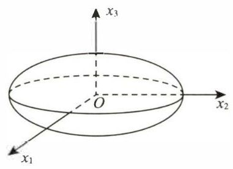
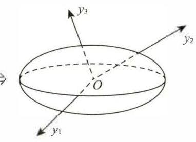

# 第6讲 二次型

## 一、二次型的定义及其矩阵表达式

$ n $ 元变量 $ {x}_{1},{x}_{2},\cdots ,{x}_{n} $ 的二次齐次多项式

$$
\begin{aligned}
f\left( {{x}_{1},{x}_{2},\cdots ,{x}_{n}}\right)  = {a}_{11}{x}_{1}^{2} + 2{a}_{12}{x}_{1}{x}_{2} + \cdots  + 2{a}_{1n}{x}_{1}{x}_{n}\\
+ {a}_{22}{x}_{2}^{2} + \cdots  + 2{a}_{2n}{x}_{2}{x}_{n}\\
+ \cdots \\
+ {a}_{nn}{x}_{n}^{2}
\end{aligned}
$$

称为 $ n $ 元二次型,简称二次型.

考研只研究系数 $ {a}_{ij} \in  \mathbf{R}\left( {i \leq  j;i, j = 1,2,\cdots , n}\right) $ 的情况,故称此二次型 $ f $ 为实二次型.

因为 $ {x}_{i}{x}_{j} = {x}_{j}{x}_{i} $ ,若令 $ {a}_{ij} = {a}_{ji}\left( {i, j = 1,2,\cdots , n}\right) $ ,则 $ 2{a}_{ij}{x}_{i}{x}_{j} = {a}_{ij}{x}_{i}{x}_{j} + {a}_{ji}{x}_{j}{x}_{i} $ ,于是

$$
f\left( {{x}_{1},{x}_{2},\cdots ,{x}_{n}}\right)  = {a}_{11}{x}_{1}^{2} + {a}_{12}{x}_{1}{x}_{2} + \cdots  + {a}_{1n}{x}_{1}{x}_{n} + {a}_{21}{x}_{2}{x}_{1} + {a}_{22}{x}_{2}^{2} + \cdots  + {a}_{2n}{x}_{2}{x}_{n} + \cdots  +
$$

$$
{a}_{n1}{x}_{n}{x}_{1} + {a}_{n2}{x}_{n}{x}_{2} + \cdots  + {a}_{nn}{x}_{n}^{2} \tag{*}
$$

$$
= \mathop{\sum }\limits_{{i = 1}}^{n}\mathop{\sum }\limits_{{j = 1}}^{n}{a}_{ij}{x}_{i}{x}_{j} \tag{**}
$$

其中 $ \left( *\right) $ 式称为完全展开式, $ \left( {* * }\right) $ 式称为和式. 令

$$
A = \left\lbrack  \begin{matrix} {a}_{11} & {a}_{12} & \cdots & {a}_{1n} \\  {a}_{21} & {a}_{22} & \cdots & {a}_{2n} \\  \vdots & \vdots & & \vdots \\  {a}_{n1} & {a}_{n2} & \cdots & {a}_{nn} \end{matrix}\right\rbrack  , x = \left\lbrack  \begin{matrix} {x}_{1} \\  {x}_{2} \\  \vdots \\  {x}_{n} \end{matrix}\right\rbrack  ,
$$

则二次型可表示为

$$
f\left( \mathbf{x}\right)  = {\mathbf{x}}^{\mathrm{T}}\mathbf{{Ax}}.\tag{***}
$$

$ \left( {* *  * }\right) $ 式称为二次型 $ f\left( {{x}_{1},{x}_{2},\cdots ,{x}_{n}}\right) $ 的矩阵表达式,实对称矩阵 $ A $ 称为二次型 $ f\left( x\right) $ 的矩阵. 这里需要着重多说几句.

二次型的矩阵 $ A $ 是一个对称矩阵,其中 $ A = \left( {a}_{ij}\right) ,{a}_{ij} = {a}_{ji} $ ,即满足 $ {A}^{\mathrm{T}} = A $ . 为什么要强调这一点?

事实上, 一个二次型可以有不同的写法, 例如三元二次型

$$
f\left( {{x}_{1},{x}_{2},{x}_{3}}\right)  = {x}_{1}^{2} + {x}_{2}^{2} + {x}_{3}^{2} + 4{x}_{1}{x}_{2},
$$

可以写成

$$
f\left( {{x}_{1},{x}_{2},{x}_{3}}\right)  = {x}_{1}^{2} + {x}_{2}^{2} + {x}_{3}^{2} + {x}_{1}{x}_{2} + 3{x}_{2}{x}_{1},
$$

也可以写成

$$
f\left( {{x}_{1},{x}_{2},{x}_{3}}\right)  = {x}_{1}^{2} + {x}_{2}^{2} + {x}_{3}^{2} + 2{x}_{1}{x}_{2} + 2{x}_{2}{x}_{1}
$$

等. 对应的用矩阵表示也有多种形式:

$$
f\left( {{x}_{1},{x}_{2},{x}_{3}}\right)  = \left\lbrack  {{x}_{1},{x}_{2},{x}_{3}}\right\rbrack  \left\lbrack  \begin{array}{lll} 1 & 4 & 0 \\  0 & 1 & 0 \\  0 & 0 & 1 \end{array}\right\rbrack  \left\lbrack  \begin{array}{l} {x}_{1} \\  {x}_{2} \\  {x}_{3} \end{array}\right\rbrack \tag*{①}
$$

$$
= \left\lbrack  {{x}_{1},{x}_{2},{x}_{3}}\right\rbrack  \left\lbrack  \begin{array}{lll} 1 & 1 & 0 \\  3 & 1 & 0 \\  0 & 0 & 1 \end{array}\right\rbrack  \left\lbrack  \begin{array}{l} {x}_{1} \\  {x}_{2} \\  {x}_{3} \end{array}\right\rbrack \tag*{②}
$$

$$
= \left\lbrack  {{x}_{1},{x}_{2},{x}_{3}}\right\rbrack  \left\lbrack  \begin{array}{lll} 1 & 2 & 0 \\  2 & 1 & 0 \\  0 & 0 & 1 \end{array}\right\rbrack  \left\lbrack  \begin{array}{l} {x}_{1} \\  {x}_{2} \\  {x}_{3} \end{array}\right\rbrack  .\tag*{③}
$$

> 中间的矩阵分别为 $A_1,A_2,A_3$ ，则  $A_3=\frac{1}{2}(A_1+A_1^T)=\frac{1}{2}(A_2+A_2^T)$

这样, 代表二次型的矩阵就不唯一了, 不利于研究二次型问题. 现在我们立了 “规矩”, 规定二次型的矩阵必须是对称矩阵, 代表二次型的矩阵就是唯一的. 所以只有对称矩阵才是二次型的矩阵, 也只有用对称矩阵表达的式子才是二次型的矩阵表达式, 上面第③种形式是按 “规矩” 写的.

例 6.1 写出三元二次型 $ f\left( {{x}_{1},{x}_{2},{x}_{3}}\right)  = 2{x}_{1}^{2} + 2{x}_{2}^{2} + 2{x}_{3}^{2} - 2{x}_{1}{x}_{2} - 2{x}_{2}{x}_{3} + 2{x}_{1}{x}_{3} $ 的二次型矩阵 $ A $

解 将二次型表示成矩阵形式是基本要求,方法: $ A $ 的主对角线元素 $ {a}_{ii} $ 是平方项 $ {x}_{i}^{2} $ 的系数, $ {a}_{ij} $ 是混合项 $ {x}_{i}{x}_{j} $ 的系数的 $\displaystyle\frac{1}{2} $ ,即

$$
f\left( {{x}_{1},{x}_{2},{x}_{3}}\right)  = \left\lbrack  {{x}_{1},{x}_{2},{x}_{3}}\right\rbrack  \left\lbrack  \begin{matrix} 2 &  - 1 & 1 \\   - 1 & 2 &  - 1 \\  1 &  - 1 & 2 \end{matrix}\right\rbrack  \left\lbrack  \begin{array}{l} {x}_{1} \\  {x}_{2} \\  {x}_{3} \end{array}\right\rbrack  ,
$$

得

$$
A = \left\lbrack  \begin{matrix} 2 &  - 1 & 1 \\   - 1 & 2 &  - 1 \\  1 &  - 1 & 2 \end{matrix}\right\rbrack
$$

> 【注】系数矩阵 $ A $ 的秩称为二次型 $ f\left( \mathbf{x}\right) $ 的秩. 比如本题中, $ A = \left\lbrack  \begin{matrix} 2 &  - 1 & 1 \\   - 1 & 2 &  - 1 \\  1 &  - 1 & 2 \end{matrix}\right\rbrack $ ,其秩 $ r\left( A\right)  = 3 $ , 故其对应的二次型的秩也是 3 .

## 二、合同变换, 二次型的合同标准形、规范形

### 1. 线性变换的定义

对于 $ n $ 元二次型 $ f\left( {{x}_{1},{x}_{2},\cdots ,{x}_{n}}\right) $ ,若令

$$
\left\{  \begin{matrix} {x}_{1} = {c}_{11}{y}_{1} + {c}_{12}{y}_{2} + \cdots  + {c}_{1n}{y}_{n}, \\  {x}_{2} = {c}_{21}{y}_{1} + {c}_{22}{y}_{2} + \cdots  + {c}_{2n}{y}_{n}, \\  \cdots \cdots \\  {x}_{n} = {c}_{n1}{y}_{1} + {c}_{n2}{y}_{2} + \cdots  + {c}_{nn}{y}_{n}, \end{matrix}\right. \tag{*}
$$

记 $ \mathbf{x} = \left\lbrack  \begin{matrix} {x}_{1} \\  {x}_{2} \\  \vdots \\  {x}_{n} \end{matrix}\right\rbrack  ,\mathbf{C} = \left\lbrack  \begin{matrix} {c}_{11} & {c}_{12} & \cdots & {c}_{1n} \\  {c}_{21} & {c}_{22} & \cdots & {c}_{2n} \\  \vdots & \vdots & & \vdots \\  {c}_{n1} & {c}_{n2} & \cdots & {c}_{nn} \end{matrix}\right\rbrack  ,\mathbf{y} = \left\lbrack  \begin{matrix} {y}_{1} \\  {y}_{2} \\  \vdots \\  {y}_{n} \end{matrix}\right\rbrack $ ,则 $ \left( *\right) $ 式可写为

$$
x = {Cy},
$$

其中 (*) 式称为线性变换. 若线性变换的系数矩阵 $ C $ 可逆,即 $ \left| C\right|  \neq  0 $ ,则称为可逆线性变换. 现给出 $ f\left( \mathbf{x}\right)  = {\mathbf{x}}^{\mathrm{T}}\mathbf{{Ax}} $ ,令 $ \mathbf{x} = \mathbf{{Cy}} $ ,则

$$
f\left( \mathbf{x}\right)  = {\left( \mathbf{{Cy}}\right) }^{\mathrm{T}}\mathbf{A}(\mathbf{Cy}) = {\mathbf{y}}^{\mathrm{T} }\left( {{\mathbf{C}}^{\mathrm{T} }\mathbf{{AC}}}\right) \mathbf{y}.
$$

记 $ B = {C}^{\mathrm{T}}{AC} $ ,则

$$
f\left( \mathbf{x}\right)  = {\mathbf{y}}^{\mathrm{T}}\mathbf{B}\mathbf{y} = g\left( \mathbf{y}\right) .
$$

此时,二次型 $ f\left( \mathbf{x}\right)  = {\mathbf{x}}^{\mathrm{T}}\mathbf{{Ax}} $ 通过线性变换 $ \mathbf{x} = \mathbf{{Cy}} $ 得到一个新二次型 $ g\left( \mathbf{y}\right)  = {\mathbf{y}}^{\mathrm{T}}\mathbf{{By}} $ .

### 2. 矩阵合同的定义与性质

考生不难发现,上述二次型 $ f\left( \mathbf{x}\right) $ 与 $ g\left( \mathbf{y}\right) $ 的系数矩阵 $ \mathbf{A} $ 与 $ \mathbf{B} $ 有下述关系

$$
\mathbf{B} = {\mathbf{C}}^{\mathrm{T}}\mathbf{A}\mathbf{C},
$$

这种关系叫什么呢? 下面就给出数学上的描述.

定义 设 $ A, B $ 为 $ n $ 阶矩阵,若存在可逆矩阵 $ C $ ,使得

$$
{\mathbf{C}}^{\mathrm{T}}\mathbf{A}\mathbf{C} = \mathbf{B},
$$

则称 $ A $ 与 $ B $ 合同,记作 $ A \simeq  B $ . 此时称其对应的二次型 $ f\left( x\right) $ 与 $ g\left( y\right) $ 为合同二次型.

可以看出，在二次型背景下, $ A $ 表征的是 $ f\left( x\right)  = {x}^{\mathrm{T}}{Ax} $ 的 “形态”, $ B $ 表征的是 $ g\left( y\right)  = {y}^{\mathrm{T}}{By} $ 的 “形态”,但是毕竟 $ f\left( \mathbf{x}\right)  = g\left( \mathbf{y}\right) $ 是同一个东西,之所以 $ \mathbf{A},\mathbf{B} $ 分别表征了不同的 “形态”,无非是因为在 $ \mathbf{x} = {\left\lbrack  {x}_{1},{x}_{2},\cdots ,{x}_{n}\right\rbrack  }^{\mathrm{T}} $ 的参照系下与在 $ \mathbf{y} = {\left\lbrack  {y}_{1},{y}_{2},\cdots ,{y}_{n}\right\rbrack  }^{\mathrm{T}} $ 的参照系下看到的是同一个事物的不同 “形态” 罢了.

后面会知道,如果 $ {\mathbf{C}}^{-1} = {\mathbf{C}}^{\mathrm{T}} $ ,称 $ \mathbf{C} $ 为正交矩阵,这是一种特殊的可逆线性变换. 在变换 $ x = \mathbf{{Cy}} $ 下, 如果 $ {\mathbf{C}}^{-1} \neq  {\mathbf{C}}^{\mathrm{T}} $ ,这种可逆线性变换一般会改变图形的形状,使其 “扭曲”,但图形的类型不会变,比如 $ f = 1 $ ,原来是封闭曲面,可逆线性变换后仍是封闭曲面. 若在 $ \mathbf{x} = {\left\lbrack  {x}_{1},{x}_{2},{x}_{3}\right\rbrack  }^{\mathrm{T}} $ 的参照系下,“ $ f\left( \mathbf{x}\right)  = $ 某常数 $ {a}^{n} $ 的图形是 “正” 着放的,如图 6-1 所示,则在 $ y = {\left\lbrack  {y}_{1},{y}_{2},{y}_{3}\right\rbrack  }^{\mathrm{T}} $ 的参照系下, $ {}^{u}g\left( y\right)  = $ 某常数 $ a $ ” 的图形是 “歪” 着放的,如图 6-2 所示 (考生只需将头稍稍歪一下,使得 $ {y}_{3} $ 轴平行于你的鼻梁, 即可看到图形在 $ \mathbf{y} = {\left\lbrack  {y}_{1},{y}_{2},{y}_{3}\right\rbrack  }^{\mathrm{T}} $ 的参照系下的 “歪” 的形态 ).

$ f\left( \mathbf{x}\right)  = {\mathbf{x}}^{\mathrm{T}}\mathbf{{Ax}} = $ 某常数 $ a $

图 6-1

$f(x)$ 做正交变换 $x=Cy,C^{-1}=C^{\mathrm{T}}$，得到下图 $g(y)$

$ g\left( \mathbf{y}\right)  = {\mathbf{y}}^{\mathrm{T}}\mathbf{B}\mathbf{y} = $ 某常数 $ a $

图 6-2

上面这段分析让我们理解到: 在二次型中, $ A $ 与 $ B $ 的合同,就是指同一个二次型在可逆线性变换下的两个不同状态的联系.

合同有以下三个性质:

(1) $ A \simeq  A $ (反身性);

(2) 若 $ A \simeq  B $ ,则 $ B \simeq  A $ (对称性);

(3) 若 $ A \simeq  B $ ,且 $ B \simeq  C $ ,则 $ A \simeq  C $ (传递性).

特别需要指出的是,由矩阵合同的定义知,若 $ \mathbf{A} \simeq \mathbf{B} $ ,则有 $ r\left( \mathbf{A}\right)  = r\left( \mathbf{B}\right) $ ,因此有重要结论: 可逆线性变换不会改变二次型的秩. 顺便再说一句, 由于在二次型中, 二次型的矩阵都是对称矩阵, 因此和对称矩阵合同的矩阵也必是对称矩阵. 这是因为若 $ A \simeq  B $ ,即存在可逆矩阵 $ C $ ,使得 $ {C}^{\mathrm{T}}{AC} = B $ ,其中 $ {\mathbf{A}}^{\mathrm{T}} = \mathbf{A} $ ,则

$$
{\mathbf{B}}^{\mathrm{T}} = {\left( {\mathbf{C}}^{\mathrm{T}}\mathbf{A}\mathbf{C}\right) }^{\mathrm{T}} = {\mathbf{C}}^{\mathrm{T}}{\mathbf{A}}^{\mathrm{T}}\mathbf{C} = {\mathbf{C}}^{\mathrm{T}}\mathbf{A}\mathbf{C} = \mathbf{B}
$$

### 3. 二次型的标准形、规范形

> 二次型什么时候形态是“最佳”的呢?

若二次型中只含有平方项, 没有交叉项 (即所有交叉项的系数全为零), 即形如

$$
{d}_{1}{x}_{1}^{2} + {d}_{2}{x}_{2}^{2} + \cdots  + {d}_{n}{x}_{n}^{2}
$$

的二次型称为 **标准形** (一般不唯一) .

若标准形中,系数 $ {d}_{i}\left( {i = 1,2,\cdots , n}\right) $ 的取值范围为 $ \{ 1, - 1,0\} $ ,即形如 $ {x}_{1}^{2} + \cdots  + {x}_{p}^{2} - {x}_{p + 1}^{2} - \cdots  - {x}_{p + q}^{2} $ 的二次型称为 **规范形** , （在不考虑 $ d_i $ 顺序时,唯一）。

**定理 1** 任何二次型 $ f\left( x\right)  = {x}^{\mathrm{T}}{Ax} $ 均可通过配方法 (作可逆线性变换 $ x = {Cy} $ ) 化成标准形及规范形, 用矩阵语言表述: 任何实对称矩阵 $ \mathbf{A} $ ,必存在可逆矩阵 $ \mathbf{C} $ （可逆矩阵不是唯一的） ,使得 $ {\mathbf{C}}^{\mathrm{T}}\mathbf{A}\mathbf{C} = \mathbf{\Lambda } $ ,其中

$$
\begin{aligned}
\Lambda  = &\left\lbrack  \begin{array}{llll} {d}_{1} & & & \\   & {d }_{2} & & \\   & &  \ddots  & \\   & & & {d}_{n} \end{array}\right\rbrack &  \text{或} \Lambda  = &\left\lbrack  \begin{matrix} 1 &&&& &&&& \\ &\ddots&&& &&&& \\&& 1 && &&&&\\  &&&-1& &&&&\\ &&&& \ddots  &&&& \\ &&&& &-1&&& \\&&&& &&0&&\\ &&&& &&& \ddots &  \\&&&& &&&&0\end{matrix}\right\rbrack &.

\\
& \text{（标准型）}& & \text{（规范型）}&
\end{aligned}
$$

---

【注】此处 $ \mathbf{C} $ 的列向量一般不是 $ \mathbf{A} $ 的特征向量, $ {d}_{i}\left( {i = 1,2,\cdots , n}\right) $ 一般也不是 $ \mathbf{A} $ 的特征值.

---

**定理 2** 任何二次型 $ f\left( x\right)  = {x}^{\mathrm{T}}{Ax} $ 也可以通过正交变换 $ x = {Qy} $ 化成标准形,用矩阵语言表述: 任何实对称矩阵 $ \mathbf{A} $ ,一定存在正交矩阵 $ \mathbf{Q} $ （正交矩阵 $ Q $ 不是唯一的） ,使得

$$
{Q}^{-1}{AQ} = {Q}^{\mathrm{T}}{AQ} = \Lambda ,
$$

其中

$$
\Lambda  = \left\lbrack  \begin{array}{llll} {\lambda }_{1} & & & \\   & {\lambda }_{2} & & \\   & &  \ddots  & \\   & & & {\lambda }_{n} \end{array}\right\rbrack  .
$$

【注】此处 $ \mathbf{Q} $ 的列向量均是 $ \mathbf{A} $ 的特征向量, $ {\lambda }_{i}\left( {i = 1,2,\cdots , n}\right) $ 均是 $ \mathbf{A} $ 的特征值.

## 三、惯性定理

> 合同变换下的不变量是正,负惯性指数

无论选取什么样的可逆线性变换,将二次型化成标准形或规范形,其正项个数 $ p $ ,负项个数 $ q $ 都是不变的, $ p $ 称为正惯性指数, $ q $ 称为负惯性指数.

---

【注】若二次型的秩为 $ r $ ,则 $ r = p + q $ ,可逆线性变换不改变正、负惯性指数.

---

两个二次型 (或实对称矩阵) 合同的充要条件是有相同的正、负惯性指数, 或有相同的秩及正 (或负) 惯性指数, 或有相同的正、负特征值个数.

例 6.2 化二次型

$$
f\left( {{x}_{1},{x}_{2},{x}_{3}}\right)  = {x}_{1}^{2} + 2{x}_{1}{x}_{2} + 2{x}_{1}{x}_{3} - {x}_{2}^{2} - 2{x}_{2}{x}_{3} - {x}_{3}^{2}
$$

为标准形, 并写出所作的可逆线性变换.

解 先对 $ {x}_{1}^{2} $ 及所有含 $ {x}_{1} $ 的混合项 $ 2{x}_{1}{x}_{2},2{x}_{1}{x}_{3} $ 配完全平方,有

$$
f\left( {{x}_{1},{x}_{2},{x}_{3}}\right)  = {\left( {x}_{1} + {x}_{2} + {x}_{3}\right) }^{2} - {x}_{2}^{2} - {x}_{3}^{2} - 2{x}_{2}{x}_{3} - {x}_{2}^{2} - 2{x}_{2}{x}_{3} - {x}_{3}^{2}
$$

$$
= {\left( {x}_{1} + {x}_{2} + {x}_{3}\right) }^{2} - 2{x}_{2}^{2} - 4{x}_{2}{x}_{3} - 2{x}_{3}^{2}.
$$

再对 $ 2{x}_{2}^{2} $ 及所有含 $ {x}_{2} $ 的混合项 $ - 4{x}_{2}{x}_{3} $ 配完全平方,有

$$
f\left( {{x}_{1},{x}_{2},{x}_{3}}\right)  = {\left( {x}_{1} + {x}_{2} + {x}_{3}\right) }^{2} - 2{\left( {x}_{2} + {x}_{3}\right) }^{2}.
$$

作线性变换

$$
\left\{  {\begin{array}{l} {y}_{1} = {x}_{1} + {x}_{2} + {x}_{3}, \\  {y}_{2} = {x}_{2} + {x}_{3}, \\  {y}_{3} = {x}_{3}, \end{array}\text{ 即 }\left\{  \begin{array}{l} {x}_{1} = {y}_{1} - {y}_{2}, \\  {x}_{2} = {y}_{2} - {y}_{3}, \\  {x}_{3} = {y}_{3}, \end{array}\right. }\right.
$$

把二次型化为标准形 $ f\left( {{x}_{1},{x}_{2},{x}_{3}}\right) \xlongequal{x = {Cy}}{y}_{1}^{2} - 2{y}_{2}^{2} $ .

将线性变换表示成矩阵形式, 即

$$
x = {Cy},
$$

其中 $ \mathbf{C} = \left\lbrack  \begin{matrix} 1 &  - 1 & 0 \\  0 & 1 &  - 1 \\  0 & 0 & 1 \end{matrix}\right\rbrack $ . 由于 $ \left| \mathbf{C}\right|  = \left| \begin{matrix} 1 &  - 1 & 0 \\  0 & 1 &  - 1 \\  0 & 0 & 1 \end{matrix}\right|  = 1 \neq  0 $ ,故所作变换是可逆线性变换.

---

【注】(1) 用配方法化二次型为标准形时, 要遵循 “将某个变量的平方项及与其有关的混合项一次配完, 配成一个完全平方, 减少一个未配完全平方的变量, 使得总的平方项的项数小于等于变量个数”. 目的是保证所用变换是可逆的.

(2) 当总的完全平方项的项数小于变量个数时, 例如本题是三元二次型, 完全平方项个数是 2, 应视作

$$
f\left( {{x}_{1},{x}_{2},{x}_{3}}\right)  = {\left( {x}_{1} + {x}_{2} + {x}_{3}\right) }^{2} - 2{\left( {x}_{2} + {x}_{3}\right) }^{2} + 0{x}_{3}^{2},
$$

变换为

$$
\left\{  \begin{array}{l} {y}_{1} = {x}_{1} + {x}_{2} + {x}_{3}, \\  {y}_{2} = {x}_{2} + {x}_{3}, \\  {y}_{3} = {x}_{3}. \end{array}\right.
$$

如变换为

$$
\left\{  \begin{array}{l} {y}_{1} = {x}_{1} + {x}_{2} + {x}_{3}, \\  {y}_{2} = {x}_{2} + {x}_{3}, \end{array}\right.
$$

显然是不可逆的.

(3) 配方法中配方次序可以不同, 故所作可逆线性变换不唯一, 标准形不唯一, 但标准形中不为零的项数 $ \left( {r\left( f\right) }\right) $ 、正项个数 (正惯性指数)、负项个数 (负惯性指数) 是不变的.

(4) 本题用矩阵语言表述: 设 $ \mathbf{A} = \left\lbrack  \begin{matrix} 1 & 1 & 1 \\  1 &  - 1 &  - 1 \\  1 &  - 1 &  - 1 \end{matrix}\right\rbrack $ ,求可逆矩阵 $ \mathbf{C} $ ,使得 $ {\mathbf{C}}^{\mathrm{T}}\mathbf{A}\mathbf{C} = \mathbf{\Lambda} $ ,并写出对角矩阵 $ A $ .

---

例 6.3 将二次型 $ f\left( {{x}_{1},{x}_{2},{x}_{3}}\right)  = {x}_{1}{x}_{2} + {x}_{1}{x}_{3} - {x}_{2}{x}_{3} $ 化为规范形,并求所用的可逆线性变换解 令

$$
\left\{  \begin{array}{l} {x}_{1} = {y}_{1} + {y}_{2}, \\  {x}_{2} = {y}_{1} - {y}_{2}, \\  {x}_{3} = {y}_{3}. \end{array}\right.
$$

则

$$
f\left( {{x}_{1},{x}_{2},{x}_{3}}\right)  = {y}_{1}^{2} - {y}_{2}^{2} + {y}_{1}{y}_{3} + {y}_{2}{y}_{3} - {y}_{1}{y}_{3} + {y}_{2}{y}_{3} = {y}_{1}^{2} - {y}_{2}^{2} + 2{y}_{2}{y}_{3}
$$

$$
= {y}_{1}^{2} - {\left( {y}_{2} - {y}_{3}\right) }^{2} + {y}_{3}^{2}.
$$

令

$$
\left\{  {\begin{array}{l} {z}_{1} = {y}_{1}, \\  {z}_{2} = {y}_{2} - {y}_{3}, \\  {z}_{3} = {y}_{3}, \end{array}\text{ 即 }\left\{  \begin{array}{l} {y}_{1} = {z}_{1}, \\  {y}_{2} = {z}_{2} + {z}_{3}, \\  {y}_{3} = {z}_{3}, \end{array}\right. }\right.
$$

得二次型的规范形为

$$
f\left( {{x}_{1},{x}_{2},{x}_{3}}\right) \xlongequal{x = {Cz}}{z}_{1}^{2} - {z}_{2}^{2} + {z}_{3}^{2}.
$$

所用线性变换为

$$
\left\{  {\begin{array}{l} {x}_{1} = {y}_{1} + {y}_{2}, \\  {x}_{2} = {y}_{1} - {y}_{2}, \\  {x}_{3} = {y}_{3} \end{array}\text{ 与 }\left\{  \begin{array}{l} {y}_{1} = {z}_{1}, \\  {y}_{2} = {z}_{2} + {z}_{3}, \\  {y}_{3} = {z}_{3}, \end{array}\right. }\right.
$$

得

$$
\left\{  \begin{array}{l} {x}_{1} = {z}_{1} + {z}_{2} + {z}_{3}, \\  {x}_{2} = {z}_{1} - {z}_{2} - {z}_{3}, \\  {x}_{3} = {z}_{3} \end{array}\right.
$$

用矩阵表示为

$$
\left\lbrack  \begin{array}{l} {x}_{1} \\  {x}_{2} \\  {x}_{3} \end{array}\right\rbrack   = \left\lbrack  \begin{matrix} 1 & 1 & 1 \\  1 &  - 1 &  - 1 \\  0 & 0 & 1 \end{matrix}\right\rbrack  \left\lbrack  \begin{array}{l} {z}_{1} \\  {z}_{2} \\  {z}_{3} \end{array}\right\rbrack  \overset{\text{ 记 }}{ = }{Cz},
$$

其中 $ \left| \mathbf{C}\right|  = \left| \begin{matrix} 1 & 1 & 1 \\  1 &  - 1 &  - 1 \\  0 & 0 & 1 \end{matrix}\right|  =  - 2 \neq  0 $ ,故 $ \mathbf{x} = \mathbf{{Cz}} $ 是可逆线性变换.

---

【注】(1) 用配方法化二次型为标准形、规范形, 若有平方项, 应将平方项及其有关混合项配成完全平方 (如例 6.2). 没有平方项时,作可逆线性变换 $ \left\{  \begin{array}{l} {x}_{1} = {y}_{1} + {y}_{2}, \\  {x}_{2} = {y}_{1} - {y}_{2}, \\  {x}_{3} = {y}_{3}, \end{array}\right. $ 使其出现平方项,然后再配完全平方 (如本题). 这样, 任何二次型总可以用配方法化成标准形、规范形, 且所作变换均是可逆线性变换. 用矩阵的语言表述: 任何实对称矩阵 $ A $ ,必存在可逆矩阵 $ \mathbf{C} $ ,使得 $ {\mathbf{C}}^{\mathrm{T}}\mathbf{A}\mathbf{C} = \mathbf{\Lambda} $ ,其中 $ \mathbf{\Lambda} $ 是对角矩阵,或是对角元素取值范围为 $ \{ 1, - 1,0\} $ 的对角矩阵.

(2) 配方是中学已经掌握的内容,并不难,但为我们提供了①所作的可逆线性变换; ②与 $ A $ 合同的对角矩阵; ③二次型 (或 $ A $ ) 的秩; ④正、负惯性指数; ⑤是否正定等二次型的重要信息,故在解上述问题时, 别忘了有一招是配方法.

---

例 6.4 用正交变换化二次型

$$
f\left( {{x}_{1},{x}_{2},{x}_{3}}\right)  = 2{x}_{1}^{2} + 5{x}_{2}^{2} + 5{x}_{3}^{2} + 4{x}_{1}{x}_{2} - 4{x}_{1}{x}_{3} - 8{x}_{2}{x}_{3}
$$

为标准形, 并求所作的正交变换

---

做题步骤：

① 加头: $ f \Rightarrow $ 写出 $ A = \left\lbrack  \begin{matrix} 2 & 2 &  - 2 \\  2 & 5 &  - 4 \\   - 2 &  - 4 & 5 \end{matrix}\right\rbrack $

② 求 $ A $ 的 $ \lambda $ 与 $ \xi $ ;

③ $ {\xi }_{1},{\xi }_{2},\cdots ,{\xi }_{n}\xrightarrow[\text{ 单位化 }]{\text{ 正交化 }}{\eta }_{1},{\eta }_{2},\cdots ,{\eta }_{n} $ .

令 $ \mathbf{Q} = \left\lbrack  {{\eta }_{1},{\eta }_{2},\cdots ,{\eta }_{n}}\right\rbrack $ :

④ 加尾: 令 $ x = {Qy} \Rightarrow $

$ f = {x}^{\mathrm{T}}{Ax} = {\left( Qy\right) }^{\mathrm{T}}{AQy} = {y}^{\mathrm{T}}{Q}^{\mathrm{T}}{AQy} $

$ = {y}^{\mathrm{T}}{Q}^{-1}{AQy} = {y}^{\mathrm{T}}{\Lambda y} $

$ = {\lambda }_{1}{y}_{1}^{2} + \cdots  + {\lambda }_{n}{y}_{n}^{2} $

---

解 二次型的对应矩阵为

$$
A = \left\lbrack  \begin{matrix} 2 & 2 &  - 2 \\  2 & 5 &  - 4 \\   - 2 &  - 4 & 5 \end{matrix}\right\rbrack
$$

由例 5.1 知 $ A $ 有特征值 $ {\lambda }_{1} = {\lambda }_{2} = 1,{\lambda }_{3} = {10} $ .

当 $ {\lambda }_{1} = {\lambda }_{2} = 1 $ 时,基础解系为 $ {\xi }_{1} = {\left\lbrack  -2,1,0\right\rbrack  }^{\mathrm{T}},{\xi }_{2} = {\left\lbrack  2,0,1\right\rbrack  }^{\mathrm{T}} $ .

当 $ {\lambda }_{3} = {10} $ 时,基础解系为 $ {\xi }_{3} = {\left\lbrack  1,2, - 2\right\rbrack  }^{\mathrm{T}} $ .

将 $ {\lambda }_{1} = {\lambda }_{2} = 1 $ 对应的特征向量 $ {\xi }_{1},{\xi }_{2} $ 标准正交化.

取

$$
{\mathbf{\eta }}_{1} = {\mathbf{\xi }}_{1} = {\left\lbrack  -2,1,0\right\rbrack  }^{\mathrm{T}},
$$

$$
{\mathbf{\eta }}_{2} = {\mathbf{\xi }}_{2} - \frac{\left( {\mathbf{\eta }}_{1},{\mathbf{\xi }}_{2}\right) }{\left( {\mathbf{\eta }}_{1},{\mathbf{\eta }}_{1}\right) }{\mathbf{\eta }}_{1} = {\left\lbrack  2,0,1\right\rbrack  }^{\mathrm{T}} - \frac{-4}{5}{\left\lbrack  -2,1,0\right\rbrack  }^{\mathrm{T}} = {\left\lbrack  \frac{2}{5},\frac{4}{5},1\right\rbrack  }^{\mathrm{T}},
$$

不妨取 $ {\eta }_{2} = {\left\lbrack  2,4,5\right\rbrack  }^{\mathrm{T}} $ .

再将 $ {\eta }_{1},{\eta }_{2},{\xi }_{3} $ 单位化,

$$
{\mathbf{\eta }}_{1}^{ \circ  } = \left\lbrack  \begin{matrix} \displaystyle\frac{-2}{\sqrt{5}} \\\\  \displaystyle\frac{1}{\sqrt{5}} \\\\  0 \end{matrix}\right\rbrack  ,{\mathbf{\eta }}_{2}^{ \circ  } = \left\lbrack  \begin{matrix} \displaystyle\frac{2}{3\sqrt{5}} \\\\  \displaystyle\frac{4}{3\sqrt{5}} \\\\  \displaystyle\frac{5}{3\sqrt{5}} \end{matrix}\right\rbrack  ,{\mathbf{\eta }}_{3}^{ \circ  } = \left\lbrack  \begin{matrix} \displaystyle\frac{1}{3} \\\\  \displaystyle\frac{2}{3} \\\\  \displaystyle\frac{-2}{3} \end{matrix}\right\rbrack  ,
$$

得正交矩阵 $ Q = \left\lbrack  {{\eta }_{1}^{ \circ  },{\eta }_{2}^{ \circ  },{\eta }_{3}^{ \circ  }}\right\rbrack $ ,令 $ x = {Qy} $ ,则原二次型化为标准形

$$
f\left( {{x}_{1},{x}_{2},{x}_{3}}\right)  = {\mathbf{x}}^{\mathrm{T}}A\mathbf{x}\xlongequal{\mathbf{x} = Q\mathbf{y}}{\mathbf{y}}^{\mathrm{T}}{Q}^{\mathrm{T}}{AQ}\mathbf{y} = {y}_{1}^{2} + {y}_{2}^{2} + {10}{y}_{3}^{2},
$$

其中正交变换为

$$
x = {Qy} = \left\lbrack  \begin{matrix} \displaystyle\frac{-2}{\sqrt{5}} & \displaystyle\frac{2}{3\sqrt{5}} & \displaystyle\frac{1}{3} \\\\  \displaystyle\frac{1}{\sqrt{5}} & \displaystyle\frac{4}{3\sqrt{5}} & \displaystyle\frac{2}{3} \\\\  0 & \displaystyle\frac{5}{3\sqrt{5}} & \displaystyle\frac{-2}{3} \end{matrix}\right\rbrack  \left\lbrack  \begin{array}{l} {y}_{1} \\\\  {y}_{2} \\\\  {y}_{3} \end{array}\right\rbrack  .
$$

---

【注】(1) 正交变换只能化二次型为标准形,不能化为规范形 (除非特征值都属于 $ \{ 1, - 1,0\} $ ).

(2) 正交变换不唯一,但经正交变换所得标准形是唯一的 (不考虑 $ {\lambda }_{i} $ 的顺序),求得特征值后即可得标准形为

$$
{\lambda }_{1}{y}_{1}^{2} + {\lambda }_{2}{y}_{2}^{2} + \cdots  + {\lambda }_{n}{y}_{n}^{2}
$$

(3) $ {\lambda }_{1} = {\lambda }_{2} = 1 $ 是二重根,方程组 $ \left( {\mathbf{E} - \mathbf{A}}\right) \mathbf{x} = \left\lbrack  \begin{matrix}  - 1 &  - 2 & 2 \\   - 2 &  - 4 & 4 \\  2 & 4 &  - 4 \end{matrix}\right\rbrack  \left\lbrack  \begin{array}{l} {x}_{1} \\  {x}_{2} \\  {x}_{3} \end{array}\right\rbrack   = \mathbf{0} $ 有两个线性无关解,为避免后面的正交化计算,可在解此方程组时,同时考虑正交化. $ {\lambda }_{1} = {\lambda }_{2} = 1 $ ,对应特征向量应满足

$$
- {x}_{1} - 2{x}_{2} + 2{x}_{3} = 0.
$$

取 $ {\xi }_{1} = {\left\lbrack  -2,1,0\right\rbrack  }^{\mathrm{T}} $ ,再求 $ {\xi }_{2} $ 时,可先令 $ {\xi }_{2} $ 和 $ {\xi }_{1} $ 正交,取 $ {\xi }_{2} = {\left\lbrack  1,2, a\right\rbrack  }^{\mathrm{T}}$ （ $\left( {{\xi }_{1},{\xi }_{2}}\right)  = 0, a $ 待定 $ ） $ ,再代入方程以确定 $ a $ ,即 $ - 1 - 4 + {2a} = 0 $ ,得 $ a = \displaystyle\frac{5}{2} $ ,则 $ {\xi }_{2} = {\left\lbrack  1,2,\displaystyle\frac{5}{2}\right\rbrack  }^{\mathrm{T}} $ ,取整数得 $ {\xi }_{2}^{\prime } = {\left\lbrack  2,4,5\right\rbrack  }^{\mathrm{T}} $ .

(4) 计算过程还可作如下验算: ① $ \mathop{\sum }\limits_{{i = 1}}^{3}{\lambda }_{i} = \mathop{\sum }\limits_{{i = 1}}^{3}{a}_{ii},\left| A\right|  = \mathop{\prod }\limits_{{i = 1}}^{3}{\lambda }_{i} $ ; ②当 $ {\lambda }_{i} \neq  {\lambda }_{3} $ 时, $ \left( {{\xi }_{1},{\xi }_{3}}\right)  = 0 $ .

(5) 本题用矩阵语言表述: 设 $ A = \left\lbrack  \begin{matrix} 2 & 2 &  - 2 \\  2 & 5 &  - 4 \\   - 2 &  - 4 & 5 \end{matrix}\right\rbrack $ ,求正交矩阵 $ Q $ ,使得 $ {Q}^{-1}{AQ} = {Q}^{\mathrm{T}}{AQ} = \Lambda $ ,并写出对角矩阵 $ \Lambda $ .

---

例 6.5 设二次型 $ f\left( {{x}_{1},{x}_{2},{x}_{3}}\right) $ 在正交变换 $ x = {Py} $ 下的标准形为 $ 2{y}_{1}^{2} + {y}_{2}^{2} - {y}_{3}^{2} $ ,其中 $ P = $ $ \left\lbrack  {{e}_{1},{e}_{2},{e}_{3}}\right\rbrack $ . 若 $ Q = \left\lbrack  {{e}_{1}, - {e}_{3},{e}_{2}}\right\rbrack $ ,则 $ f\left( {{x}_{1},{x}_{2},{x}_{3}}\right) $ 在正交变换 $ x = {Qy} $ 下的标准形为(   ).

(A) $ 2{y}_{1}^{2} - {y}_{2}^{2} + {y}_{3}^{2} $ (B) $ 2{y}_{1}^{2} + {y}_{2}^{2} - {y}_{3}^{2} $ (C) $ 2{y}_{1}^{2} - {y}_{2}^{2} - {y}_{3}^{2} $ (D) $ 2{y}_{1}^{2} + {y}_{2}^{2} + {y}_{3}^{2} $

解 应选 (A).

设二次型矩阵为 $ \mathbf{A} $ ,则

$$
{\mathbf{P}}^{-1}\mathbf{{AP}} = {\mathbf{P}}^{\mathrm{T}}\mathbf{{AP}} = \left\lbrack  \begin{matrix} 2 & 0 & 0 \\  0 & 1 & 0 \\  0 & 0 &  - 1 \end{matrix}\right\rbrack
$$

则 $ {e}_{1},{e}_{2},{e}_{3} $ 分别是 $ \mathbf{A} $ 的对应于特征值 $ 2,1, - 1 $ 的特征向量. 于是 $ - {e}_{3} $ 也是 $ A $ 的对应于特征值 -1 的特征向量. 因此

$$
{\mathbf{Q}}^{-1}\mathbf{A}\mathbf{Q} = {\mathbf{Q}}^{\mathrm{T}}\mathbf{A}\mathbf{Q} = \left\lbrack  \begin{matrix} 2 & 0 & 0 \\  0 &  - 1 & 0 \\  0 & 0 & 1 \end{matrix}\right\rbrack  .
$$

从而 $ f $ 在正交变换 $ \mathbf{x} = \mathbf{Q}\mathbf{y} $ 下的标准形为 $ 2{y}_{1}^{2} - {y}_{2}^{2} + {y}_{3}^{2} $ .

例 6.6 设二次型 $ f\left( {{x}_{1},{x}_{2}}\right)  = {x}_{1}^{2} - 4{x}_{1}{x}_{2} + a{x}_{2}^{2} $ 经过正交变换 $ \left\lbrack  \begin{array}{l} {x}_{1} \\  {x}_{2} \end{array}\right\rbrack   = \mathbf{Q}\left\lbrack  \begin{array}{l} {y}_{1} \\  {y}_{2} \end{array}\right\rbrack $ 化为二次型

$$
g\left( {{y}_{1},{y}_{2}}\right)  = 4{y}_{1}^{2} + 4{y}_{1}{y}_{2} + b{y}_{2}^{2}.
$$

(1) 求 $ a, b $ 的值;

(2) 求正交矩阵 $ Q $ .

解 (1) 由题意,二次型 $ f\left( {{x}_{1},{x}_{2}}\right) $ 与 $ g\left( {{y}_{1},{y}_{2}}\right) $ 的矩阵分别为

$$
\mathbf{A} = \left\lbrack  \begin{matrix} 1 &  - 2 \\   - 2 & a \end{matrix}\right\rbrack  ,\mathbf{B} = \left\lbrack  \begin{array}{ll} 4 & 2 \\  2 & b \end{array}\right\rbrack  ,
$$

且 $ {Q}^{\mathrm{T}}{AQ} = B $ . 由于 $ Q $ 为正交矩阵,于是 $ {Q}^{-1}{AQ} = B $ ,因此 $ \operatorname{tr}\left( A\right)  = \operatorname{tr}\left( B\right) ,\left| A\right|  = \left| B\right| $ ,即

$$
\left\{  \begin{array}{l} 1 + a = 4 + b, \\  a - 4 = {4b} - 4, \end{array}\right.
$$

解得 $ a = 4, b = 1 $ .

(2) 由于 $ \left| {{\lambda E} - A}\right|  = \left| {{\lambda E} - B}\right|  = \lambda \left( {\lambda  - 5}\right) $ ,因此矩阵 $ A, B $ 的特征值均为 $ {\lambda }_{1} = 0,{\lambda }_{2} = 5 $ .

矩阵 $ A $ 的属于特征值 $ {\lambda }_{1} = 0 $ 的单位特征向量 $ {\alpha }_{1} = \frac{1}{\sqrt{5}}\left\lbrack  \begin{array}{l} 2 \\  1 \end{array}\right\rbrack $ ;

矩阵 $ A $ 的属于特征值 $ {\lambda }_{2} = 5 $ 的单位特征向量 $ {\alpha }_{2} = \frac{1}{\sqrt{5}}\left\lbrack  \begin{matrix} 1 \\   - 2 \end{matrix}\right\rbrack $ .

令 $ {\mathbf{Q}}_{1} = \left\lbrack  {{\mathbf{\alpha }}_{1},{\mathbf{\alpha }}_{2}}\right\rbrack   = \frac{1}{\sqrt{5}}\left\lbrack  \begin{matrix} 2 & 1 \\  1 &  - 2 \end{matrix}\right\rbrack $ ,则 $ {\mathbf{Q}}_{1} $ 为正交矩阵,且 $ {\mathbf{Q}}_{1}^{\mathrm{T}}\mathbf{A}{\mathbf{Q}}_{1} = \left\lbrack  \begin{array}{ll} 0 & 0 \\  0 & 5 \end{array}\right\rbrack $ .

由 (1) 知, $ \mathbf{B} = \left\lbrack  \begin{array}{ll} 4 & 2 \\  2 & 1 \end{array}\right\rbrack $

矩阵 $ \mathbf{B} $ 的属于特征值 $ {\lambda }_{1} = 0 $ 的单位特征向量 $ {\beta }_{1} = \frac{1}{\sqrt{5}}\left\lbrack  \begin{matrix} 1 \\   - 2 \end{matrix}\right\rbrack $ ;

矩阵 $ \mathbf{B} $ 的属于特征值 $ {\lambda }_{2} = 5 $ 的单位特征向量 $ {\mathbf{\beta }}_{2} = \frac{1}{\sqrt{5}}\left\lbrack  \begin{array}{l} 2 \\  1 \end{array}\right\rbrack $ .

令 $ {\mathbf{Q}}_{2} = \left\lbrack  {{\mathbf{\beta }}_{1},{\mathbf{\beta }}_{2}}\right\rbrack   = \frac{1}{\sqrt{5}}\left\lbrack  \begin{matrix} 1 & 2 \\   - 2 & 1 \end{matrix}\right\rbrack $ ,则 $ {\mathbf{Q}}_{2} $ 为正交矩阵,且 $ {\mathbf{Q}}_{2}^{\mathrm{T}}\mathbf{B}{\mathbf{Q}}_{2} = \left\lbrack  \begin{array}{ll} 0 & 0 \\  0 & 5 \end{array}\right\rbrack $ .

由于 $ {Q}_{1}^{\mathrm{T}}A{Q}_{1} = {Q}_{2}^{\mathrm{T}}B{Q}_{2} = \left\lbrack  \begin{array}{ll} 0 & 0 \\  0 & 5 \end{array}\right\rbrack $ ,因此 $ {\left( {Q}_{1}{Q}_{2}^{\mathrm{T}}\right) }^{\mathrm{T}}A\left( {{Q}_{1}{Q}_{2}^{\mathrm{T}}}\right)  = B $ ,故 $ Q = {Q}_{1}{Q}_{2}^{\mathrm{T}} = \frac{1}{5}\left\lbrack  \begin{matrix} 4 &  - 3 \\   - 3 &  - 4 \end{matrix}\right\rbrack $ 为所求矩阵 .

例 6.7 设二次型 $ f\left( {{x}_{1},{x}_{2},{x}_{3}}\right)  = {x}_{1}^{2} - {x}_{2}^{2} + {2a}{x}_{1}{x}_{3} + 4{x}_{2}{x}_{3} $ 的负惯性指数为 1,则 $ a $ 的取值范围是_____.

解 应填 $ \left\lbrack  {-2,2}\right\rbrack $ .

因为

$$
f\left( {{x}_{1},{x}_{2},{x}_{3}}\right)  = {x}_{1}^{2} - {x}_{2}^{2} + {2a}{x}_{1}{x}_{3} + 4{x}_{2}{x}_{3}
$$

$$
= {x}_{1}^{2} + {2a}{x}_{1}{x}_{3} + {a}^{2}{x}_{3}^{2} - {x}_{2}^{2} + 4{x}_{2}{x}_{3} - 4{x}_{3}^{2} + 4{x}_{3}^{2} - {a}^{2}{x}_{3}^{2}
$$

$$
= {\left( {x}_{1} + a{x}_{3}\right) }^{2} - {\left( {x}_{2} - 2{x}_{3}\right) }^{2} + \left( {4 - {a}^{2}}\right) {x}_{3}^{2},
$$

又因为 $ f $ 的负惯性指数为 1,所以 $ 4 - {a}^{2} \geq  0 $ ,故 $ - 2 \leq  a \leq  2 $ .

例 6.8 设 $ \mathbf{A} = \left\lbrack  \begin{array}{lll} 1 & 2 & 0 \\  2 & 1 & 0 \\  0 & 0 & 1 \end{array}\right\rbrack $ ,则下列矩阵中与 $ \mathbf{A} $ 合同的是(   ).

(A) $ \left\lbrack  \begin{array}{lll} 1 & 0 & 0 \\  0 & 1 & 0 \\  0 & 0 & 1 \end{array}\right\rbrack $ (B) $ \left\lbrack  \begin{matrix} 1 & 0 & 0 \\  0 & 1 & 0 \\  0 & 0 &  - 1 \end{matrix}\right\rbrack $ (C) $ \left\lbrack  \begin{matrix} 1 & 0 & 0 \\  0 &  - 1 & 0 \\  0 & 0 &  - 1 \end{matrix}\right\rbrack $ (D) $ \left\lbrack  \begin{matrix}  - 1 & 0 & 0 \\  0 &  - 1 & 0 \\  0 & 0 &  - 1 \end{matrix}\right\rbrack $

解 应选 (B).

**方法一** $ A $ 对应的二次型为

$$
f\left( {{x}_{1},{x}_{2},{x}_{3}}\right)  = {x}_{1}^{2} + {x}_{2}^{2} + {x}_{3}^{2} + 4{x}_{1}{x}_{2},
$$

经配方法化为

$$
f\left( {{x}_{1},{x}_{2},{x}_{3}}\right)  = {x}_{1}^{2} + {x}_{2}^{2} + {x}_{3}^{2} + 4{x}_{1}{x}_{2} = {\left( {x}_{1} + 2{x}_{2}\right) }^{2} - 3{x}_{2}^{2} + {x}_{3}^{2},
$$

知 $ r\left( f\right)  = 3 $ ,正惯性指数 $ p = 2 $ ,与选项 (B) 相同,故应选 (B).

**方法二** 求 $ A $ 的特征值. 由

$$
\left| {\lambda \mathbf{E} - \mathbf{A}}\right|  = \left| \begin{matrix} \lambda  - 1 &  - 2 & 0 \\   - 2 & \lambda  - 1 & 0 \\  0 & 0 & \lambda  - 1 \end{matrix}\right|  \xlongequal{\text{按第3行展开}} \left( {\lambda  - 1}\right) \left( {{\lambda }^{2} - {2\lambda } - 3}\right)  = \left( {\lambda  - 1}\right) \left( {\lambda  - 3}\right) \left( {\lambda  + 1}\right)  = 0,
$$

知 $ \mathbf{A} $ 的特征值为 $ {\lambda }_{1} = 1,{\lambda }_{2} = 3,{\lambda }_{3} =  - 1 $ ,且 $ \mathbf{A} $ 对应的二次型在正交变换下化为标准形 $ {y}_{1}^{2} + 3{y}_{2}^{2} - {y}_{3}^{2} $ ,与选项 (B) 的正、负惯性指数相同, 即

$$
A \simeq  \left\lbrack  \begin{matrix} 1 & 0 & 0 \\  0 & 1 & 0 \\  0 & 0 &  - 1 \end{matrix}\right\rbrack
$$

故应选 (B).

例 6.9 设 $ A $ 为 3 阶实对称矩阵,互换 $ A $ 的 1,2 行得到矩阵 $ B $ ,再互换 $ B $ 的 1,2 列得到矩阵 $ C $ ,则矩阵 $ A $ 与矩阵 $ C $ (   ).

(A) 合同但不相似 (B) 相似但不合同 (C) 合同且相似 (D) 不合同也不相似

解 应选 (C).

由题设互换 $ A $ 的 1,2 行得到矩阵 $ B $ ,则有 $ {PA} = B $ ,其中 $ P = \left\lbrack  \begin{array}{lll} 0 & 1 & 0 \\  1 & 0 & 0 \\  0 & 0 & 1 \end{array}\right\rbrack $ . 再互换 $ B $ 的 1,2 列得到矩阵 $ C $ ,则有 $ {BP} = C $ ,从而 $ {PAP} = C $ . 由于初等矩阵 $ P = \left\lbrack  \begin{array}{lll} 0 & 1 & 0 \\  1 & 0 & 0 \\  0 & 0 & 1 \end{array}\right\rbrack $ 满足 $ {P}^{\mathrm{T}} = P,{P}^{-1} = P $ ,因此 $ {\mathbf{P}}^{-1}\mathbf{{AP}} = \mathbf{C},{\mathbf{P}}^{\mathrm{T}}\mathbf{{AP}} = \mathbf{C} $ ,即矩阵 $ \mathbf{A} $ 与矩阵 $ \mathbf{C} $ 合同且相似,故正确选项为 (C).

## 四、正定二次型及其判别

### 1. 定义

$ n $ 元二次型 $ f\left( {{x}_{1},{x}_{2},\cdots ,{x}_{n}}\right)  = {\mathbf{x}}^{\mathrm{T}}\mathbf{{Ax}} $ . 若对任意的 $ \mathbf{x} = {\left\lbrack  {x}_{1},{x}_{2},\cdots ,{x}_{n}\right\rbrack  }^{\mathrm{T}} \neq  \mathbf{0} $ ,均有 $ {\mathbf{x}}^{\mathrm{T}}\mathbf{{Ax}} > 0 $ ,则称 $ f $ 为正定二次型,称二次型的对应矩阵 $ A $ 为正定矩阵.

### 2. 二次型正定的充要条件

$ n $ 元二次型 $ f = {\mathbf{x}}^{\mathrm{T}}\mathbf{{Ax}} $ 正定 $ \Leftrightarrow $ 对任意 $ \mathbf{x} \neq  \mathbf{0} $ ,有 $ {\mathbf{x}}^{\mathrm{T}}\mathbf{{Ax}} > 0 $ (定义)

$ \Leftrightarrow  f $ 的正惯性指数 $ p = n $

$ \Leftrightarrow $ 存在可逆矩阵 $ D $ ,使 $ A = {D}^{\mathrm{T}}D $

$ \Leftrightarrow  A \simeq  E $

$ \Leftrightarrow  A $ 的特征值 $ {\lambda }_{i} > 0\left( {i = 1,2,\cdots , n}\right) $

$ \Leftrightarrow  A $ 的全部顺序主子式均大于 0 .

---

【注】设 $ A = {\left( {a}_{ij}\right) }_{n \times  n} $ ,则

$$
\left| {A}_{k}\right|  = \left| \begin{matrix} {a}_{11} & {a}_{12} & \cdots & {a}_{1k} \\  {a}_{21} & {a}_{22} & \cdots & {a}_{2k} \\  \vdots & \vdots & & \vdots \\  {a}_{k1} & {a}_{k2} & \cdots & {a}_{kk} \end{matrix}\right|
$$

称为 $ n $ 阶矩阵 $ A $ 的 $ k $ 阶顺序 (或左上角) 主子式. 当 $ k $ 取 $ 1,2,\cdots , n $ 时,就得到 $ A $ 的 $ n $ 个顺序主子式.

---

### 3. 二次型正定的必要条件

(1) $ {a}_{ii} > 0\left( {i = 1,2,\cdots , n}\right) $ .

(2) $ \left| A\right|  > 0 $ .

例 6.10 判别二次型

$$
f\left( {{x}_{1},{x}_{2},{x}_{3}}\right)  = 2{x}_{1}^{2} + 2{x}_{2}^{2} + 2{x}_{3}^{2} + 2{x}_{1}{x}_{2} + 2{x}_{1}{x}_{3} + 2{x}_{2}{x}_{3}
$$

的正定性.

解

$$
f\left( {{x}_{1},{x}_{2},{x}_{3}}\right)  = \left\lbrack  {{x}_{1},{x}_{2},{x}_{3}}\right\rbrack  \left\lbrack  \begin{array}{lll} 2 & 1 & 1 \\  1 & 2 & 1 \\  1 & 1 & 2 \end{array}\right\rbrack  \left\lbrack  \begin{array}{l} {x}_{1} \\  {x}_{2} \\  {x}_{3} \end{array}\right\rbrack  ,
$$

故 $ f\left( {{x}_{1},{x}_{2},{x}_{3}}\right. $ ) 的对应矩阵是

$$
A = \left\lbrack  \begin{array}{lll} 2 & 1 & 1 \\  1 & 2 & 1 \\  1 & 1 & 2 \end{array}\right\rbrack
$$

**方法一** 判别对应矩阵 $ A $ 的各阶顺序主子式是否大于零.

由

$$
2 > 0,\left| \begin{array}{ll} 2 & 1 \\  1 & 2 \end{array}\right|  = 3 > 0,
$$

$\left| A\right|  = \left| \begin{array}{rrr} 2 & 1 & 1 \\  1 & 2 & 1 \\  1 & 1 & 2 \end{array}\right|$
$\xlongequal{\text{第2列的1倍加至第1列，第3列的1倍加至第1列}}$
$\left| \begin{array}{lll} 4 & 1 & 1 \\  4 & 2 & 1 \\  4 & 1 & 2 \end{array}\right|$
$\xlongequal{\text{提出第1列的4}}$
$4\left| \begin{array}{lll} 1 & 1 & 1 \\  1 & 2 & 1 \\  1 & 1 & 2 \end{array}\right|$
$\xlongequal{\text{第1行的(-1)倍分别加至第2，3行}}$
$4\left| \begin{array}{lll} 1 & 1 & 1 \\  0 & 1 & 0 \\  0 & 0 & 1 \end{array}\right|$
$=4>0$

故 $ A $ 正定, $ f $ 是正定二次型.

**方法二** 判别对应矩阵 $ A $ 的特征值是否全部大于零.

由 $|\lambda E-A|=\left|\begin{matrix} \lambda -2 &  - 1 &  - 1 \\ -1 & \lambda -2  & -1\\ -1 &-1 &  \lambda -2  \end{matrix}\right|$
$\xlongequal{\text{第2,3列的1倍分别加至第1列}}$
$\left|\begin{matrix} \lambda -4 &  - 1 &  - 1 \\ \lambda -4 & \lambda -2  & -1\\ \lambda -4 &-1 &  \lambda -2  \end{matrix}\right|$
$\xlongequal{\text{提出第1列的}\lambda -4}$
$(\lambda -4)\left|\begin{matrix} 1 &  - 1 &  - 1 \\ 1 & \lambda -2  & -1\\ 1 &-1 &  \lambda -2  \end{matrix}\right|$
$\xlongequal{\text{第1行的(-1)倍分别加至第2,3行}}$
$ \left( {\lambda  - 4}\right) \left| \begin{matrix} 1 &  - 1 &  - 1 \\  0 & \lambda  - 1 & 0 \\  0 & 0 & \lambda  - 1 \end{matrix}\right|  = \left( {\lambda  - 4}\right) \left( {\lambda  - {1}^{2}}\right)  = 0,$

知 $ A $ 的特征值 $ {\lambda }_{1} = 4,{\lambda }_{2} = {\lambda }_{3} = 1 $ 全部大于零,故 $ A $ 正定, $ f $ 是正定二次型.

**方法三** 利用配方法化为标准形,判别 $ f $ 的正惯性指数 $ p $ 是否等于 $ n $ (未知量个数).

$$
f = 2{x}_{1}^{2} + 2{x}_{2}^{2} + 2{x}_{3}^{2} + 2{x}_{1}{x}_{2} + 2{x}_{1}{x}_{3} + 2{x}_{2}{x}_{3}
$$

$$
= 2{\left( {x}_{1} + \frac{{x}_{3}}{2} + \frac{{x}_{3}}{2}\right) }^{2} + \frac{3}{2}{x}_{2}^{2} + \frac{3}{2}{x}_{3}^{2} + {x}_{2}{x}_{3}
$$

$$
= 2{\left( {x}_{1} + \frac{{x}_{3}}{2} + \frac{{x}_{3}}{2}\right) }^{2} + \frac{3}{2}{\left( {x}_{2} + \frac{1}{3}{x}_{3}\right) }^{2} + \frac{4}{3}{x}_{3}^{2},
$$

由二次型的标准形知, $ f $ 的正惯性指数 $ p = 3 = n $ ,故 $ f $ 是正定二次型.

**方法四** 用定义,验证是否对任意的 $ x = {\left\lbrack  {x}_{1},{x}_{2},{x}_{3}\right\rbrack  }^{\mathrm{T} } \neq  \mathbf{0} $ ,有 $ {\mathbf{x}}^{\mathrm{T} }\mathbf{A}\mathbf{x} > 0 $ . 将二次型配成完全平方和 (注意: 这里配完全平方和的做法与方法三中的配方法不同, 这里没有要求将某平方项及与其有关的混合项一次配完), 即

$$
f\left( {{x}_{1},{x}_{2},{x}_{3}}\right)  = 2{x}_{1}^{2} + 2{x}_{2}^{2} + 2{x}_{3}^{2} + 2{x}_{1}{x}_{2} + 2{x}_{1}{x}_{3} + 2{x}_{2}{x}_{3}
$$

$$
= {\left( {x}_{1} + {x}_{2}\right) }^{2} + {\left( {x}_{2} + {x}_{3}\right) }^{2} + {\left( {x}_{3} + {x}_{1}\right) }^{2},
$$

故有 $ f \geq  0 $ ,且

$$
f = 0 \Leftrightarrow  \left\{  \begin{array}{l} {x}_{1} + {x}_{2} = 0, \\  {x}_{2} + {x}_{3} = 0, \\  {x}_{3} + {x}_{1} = 0. \end{array}\right. \tag{*}
$$

因方程组 $ \left( *\right) $ 的系数行列式

$$
\left| \begin{array}{lll} 1 & 1 & 0 \\  0 & 1 & 1 \\  1 & 0 & 1 \end{array}\right|  = 2 \neq  0,
$$

故方程组 (*) 只有零解,故 $ f = 0 \Leftrightarrow  {x}_{1} = {x}_{2} = {x}_{3} = 0 $ .

因此,当 $ \mathbf{x} = {\left\lbrack  {x}_{1},{x}_{2},{x}_{3}\right\rbrack  }^{\mathrm{T}} \neq  \mathbf{0} $ 时,恒有 $ f\left( {{x}_{1},{x}_{2},{x}_{3}}\right)  > 0 $ ,从而知 $ f $ 是正定二次型.

**方法五** 由方法四知, $ f\left( {{x}_{1},{x}_{2},{x}_{3}}\right) $ 可配完全平方和

$$
f\left( {{x}_{1},{x}_{2},{x}_{3}}\right)  = {\left( {x}_{1} + {x}_{2}\right) }^{2} + {\left( {x}_{2} + {x}_{3}\right) }^{2} + {\left( {x}_{3} + {x}_{1}\right) }^{2},
$$

且利用内积可表示成如下矩阵形式

$$
f\left( {{x}_{1},{x}_{2},{x}_{3}}\right)  = \left\lbrack  {{x}_{1} + {x}_{2},{x}_{2} + {x}_{3},{x}_{3} + {x}_{1}}\right\rbrack  \left\lbrack  \begin{array}{l} {x}_{1} + {x}_{2} \\  {x}_{2} + {x}_{3} \\  {x}_{3} + {x}_{1} \end{array}\right\rbrack
$$

$$
= \left\lbrack  {{x}_{1},{x}_{2},{x}_{3}}\right\rbrack  \left\lbrack  \begin{array}{lll} 1 & 0 & 1 \\  1 & 1 & 0 \\  0 & 1 & 1 \end{array}\right\rbrack  \left\lbrack  \begin{array}{lll} 1 & 1 & 0 \\  0 & 1 & 1 \\  1 & 0 & 1 \end{array}\right\rbrack  \left\lbrack  \begin{array}{l} {x}_{1} \\  {x}_{2} \\  {x}_{3} \end{array}\right\rbrack
$$

$$
\overset{\text{ 记 }}{ = }{\mathbf{x}}^{\mathrm{T}}{\mathbf{D}}^{\mathrm{T}}\mathbf{{Dx}}\overset{\text{ 记 }}{ = }{\mathbf{x}}^{\mathrm{T}}\mathbf{{Ax}},
$$

其中 $ A = {D}^{\mathrm{T}}D,\left| D\right|  = \left| \begin{array}{lll} 1 & 1 & 0 \\  0 & 1 & 1 \\  1 & 0 & 1 \end{array}\right|  = 2 \neq  0, D $ 可逆,故 $ A $ 合同于单位矩阵,是正定矩阵,即 $ f\left( {{x}_{1},{x}_{2},{x}_{3}}\right) $ 是正定二次型.

---

【注】以上五种方法是利用定义及 4 个充要条件判别二次型是否正定. 对具体的数值二次型 (或实对称矩阵) 主要用方法一, 即判别顺序主子式是否全部大于零, 其他问题要具体分析并根据你对这些充要条件的熟练程度作出选择.

---

例 6.11 设二次型 $ f\left( {{x}_{1},{x}_{2},{x}_{3}}\right)  = {\left( {x}_{1} + {x}_{2}\right) }^{2} + {\left( {x}_{2} + {x}_{3}\right) }^{2} + {\left( a{x}_{3} + {x}_{1}\right) }^{2} $ 正定,则 $ a $ 的取值范围是_____.

解 应填 $ a \neq   - 1 $ .

如例 6.10 的方法四,由于 $ f\left( {{x}_{1},{x}_{2},{x}_{3}}\right)  \geq  0 $ ,且

$$
f\left( {{x}_{1},{x}_{2},{x}_{3}}\right)  = 0 \Leftrightarrow  \left\{  \begin{array}{l} {x}_{1} + {x}_{2} = 0, \\  {x}_{2} + {x}_{3} = 0, \\  a{x}_{3} + {x}_{1} = 0. \end{array}\right.
$$

因方程组的系数行列式为

$$
\left[ \begin{array}{lll} 1 & 1 & 0 \\  0 & 1 & 1 \\  1 & 0 & a \end{array}\right] \xlongequal{\text{第1行的(-1) 倍加至第3行}} \left| \begin{matrix} 1 & 1 & 0 \\  0 & 1 & 1 \\  0 &  - 1 & a \end{matrix}\right|  = a + 1\text{,}
$$

当 $ a + 1 \neq  0 $ 时, $ f\left( {{x}_{1},{x}_{2},{x}_{3}}\right)  = 0 \Leftrightarrow  {x}_{1} = {x}_{2} = {x}_{3} = 0 $ ,故当 $ a \neq   - 1 $ 时, $ f\left( {{x}_{1},{x}_{2},{x}_{3}}\right) $ 正定.

---

【注】对于 $ f\left( {{x}_{1},{x}_{2},{x}_{3}}\right)  = {\left( {a}_{1}{x}_{1} + {a}_{2}{x}_{2} + {a}_{3}{x}_{3}\right) }^{2} + {\left( {b}_{1}{x}_{1} + {b}_{2}{x}_{2} + {b}_{3}{x}_{3}\right) }^{2} + {\left( {c}_{1}{x}_{1} + {c}_{2}{x}_{2} + {c}_{3}{x}_{3}\right) }^{2} $ 的情形,可总结如下做题方法:

令 $ f = 0 $ ,即 $\begin{cases}{a}_{1}{x}_{1} + {a}_{2}{x}_{2} + {a}_{3}{x}_{3} = 0\\{b}_{1}{x}_{1} + {b}_{2}{x}_{2} + {b}_{3}{x}_{3} = 0\\{c}_{1}{x}_{1} + {c}_{2}{x}_{2} + {c}_{3}{x}_{3} = 0\end{cases}$ ,计算 $|A|=\left|\begin{matrix}{a}_{1} & {a}_{2} & {a}_{3} \\  {b}_{1} & {b}_{2} & {b}_{3} \\  {c}_{1} & {c}_{2} & {c}_{3} \end{matrix}\right|$ ，若 $|A|\ne 0$ ，则 $f$ 正定；若 $|A| = 0$ ，则 $f$ 不正定。

---

例 6.12 设实二次型 $ f\left( {{x}_{1},{x}_{2},\cdots ,{x}_{n}}\right)  = {\mathbf{x}}^{\mathrm{T}}A\mathbf{x} $ ,其中 $ A = {\left( {a}_{ij}\right) }_{n \times  n} $ 是实对称矩阵,则 $ f\left( {{x}_{1},{x}_{2},\cdots ,{x}_{n}}\right) $

为正定二次型的充要条件是 (   ) .

(A) $ {A}^{ *  } $ 是正定矩阵 (B) $ {A}^{-1} $ 是正定矩阵

(C) $ f\left( {{x}_{1},{x}_{2},\cdots ,{x}_{n}}\right) $ 的负惯性指数为零 (D) 存在 $ n $ 阶实矩阵 $ C $ ,使得 $ A = {C}^{\mathrm{T}}C $

解 应选 (B).

> 证明正定二次型充要条件的步骤: ,① 先说明 $ A $ = $ {A}^{\mathrm{T}} $ ,②再用充要条件

因 $ A $ 正定,且 $ A $ 为实对称矩阵,有 $ {A}^{\mathrm{T}} = A $ ,且 $ A $ 的特征值 $ \lambda  > 0 $ . 两边求逆,得 $ {\left( {A}^{\mathrm{T}}\right) }^{-1} = {A}^{-1} = $ $ {\left( {\mathbf{A}}^{-1}\right) }^{\mathrm{T}} $ ,所以 $ {\mathbf{A}}^{-1} $ 是实对称矩阵,且其特征值 $ \frac{1}{\lambda } > 0 $ ,故 $ {\mathbf{A}}^{-1} $ 是正定矩阵.

反之,因 $ {A}^{-1} $ 正定,故 $ {\left( {A}^{-1}\right) }^{\mathrm{T}} = {A}^{-1} $ ,且 $ {A}^{-1} $ 的特征值 $ \frac{1}{\lambda } > 0 $ . 两边求逆,得 $ {A}^{\mathrm{T}} = A $ ,所以 $ A $ 为实对称矩阵,且 $ A $ 的特征值 $ \lambda  > 0 $ ,故 $ A $ 是正定矩阵.

综上, $ A $ 正定 $ \Leftrightarrow  {A}^{-1} $ 正定,应选 (B).

选项 (A), $ {A}^{ * } $ 正定是 $ A $ 正定的必要条件,但不充分,如

$$
\mathbf{A} = \left\lbrack  \begin{matrix}  - 1 & 0 & 0 \\  0 &  - 1 & 0 \\  0 & 0 &  - 1 \end{matrix}\right\rbrack   =  - \mathbf{E},{\mathbf{A}}^{ * } = \left| \mathbf{A}\right| {\mathbf{A}}^{-1} =  - 1{\left( -\mathbf{E}\right) }^{-1} = {\mathbf{E}}^{-1} = \mathbf{E},
$$

$ {A}^{ * } $ 是正定矩阵,但 $ A $ 不是正定矩阵,故 (A) 不成立;

选项 (C), $ f $ 的负惯性指数为零,但正惯性指数 $ p $ 不一定为 $ n $ ,即可能 $ p = r\left( f\right)  < n $ ,故 (C) 不成立;

选项 (D), $ A $ 正定 $ \Leftrightarrow $ 存在 $ n $ 阶实可逆矩阵 $ C $ ,使 $ A = {C}^{\mathrm{T}}C $ ,但 (D) 中没有要求 $ C $ 可逆,故 (D) 不成立. 例如取

$$
\mathbf{C} = \left\lbrack  \begin{array}{ll} 1 & 1 \\  0 & 0 \end{array}\right\rbrack
$$

此时,

$$
\mathbf{A} = {\mathbf{C}}^{\mathrm{T}}\mathbf{C} = \left\lbrack  \begin{array}{ll} 1 & 0 \\  1 & 0 \end{array}\right\rbrack  \left\lbrack  \begin{array}{ll} 1 & 1 \\  0 & 0 \end{array}\right\rbrack   = \left\lbrack  \begin{array}{ll} 1 & 1 \\  1 & 1 \end{array}\right\rbrack  ,
$$

$ \left| \mathbf{A}\right|  = 0,\mathbf{A} $ 不正定.

## 习题

6.1 二次型 $ f\left( {{x}_{1},{x}_{2},{x}_{3}}\right)  = 2{x}_{2}^{2} + 2{x}_{3}^{2} + 4{x}_{1}{x}_{2} - 4{x}_{1}{x}_{3} + 8{x}_{2}{x}_{3} $ 的规范形为(   ).

(A) $ {y}_{1}^{2} + {y}_{2}^{2} + {y}_{3}^{2} $ (B) $ {y}_{1}^{2} + {y}_{2}^{2} - {y}_{3}^{2} $ (C) $ {y}_{1}^{2} - {y}_{2}^{2} - {y}_{3}^{2} $ (D) $ {y}_{1}^{2} - {y}_{2}^{2} $

6.2 设 $ f\left( {{x}_{1},{x}_{2}}\right)  = {x}_{1}^{2} + 3{x}_{2}^{2} + 4{x}_{1}{x}_{2} $ ,则 $ f\left( {{x}_{1},{x}_{2}}\right) $ 对应的矩阵与下列矩阵不合同的是 (   )

(A) $ \left\lbrack  \begin{matrix}  - 1 & 1 \\  1 & 2 \end{matrix}\right\rbrack $ (B) $ \left\lbrack  \begin{array}{ll} 1 & 2 \\  2 & 1 \end{array}\right\rbrack $ (C) $ \left\lbrack  \begin{matrix} 0 &  - 1 \\   - 1 & 1 \end{matrix}\right\rbrack $ (D) $ \left\lbrack  \begin{array}{ll} 1 & 1 \\  1 & 2 \end{array}\right\rbrack $

6.3 下列矩阵中, 为正定矩阵的是 (   ).

(A) $ \left\lbrack  \begin{matrix} 4 & 2 & 3 \\  2 & 2 & 1 \\  3 & 1 &  - 1 \end{matrix}\right\rbrack $ (B) $ \left\lbrack  \begin{array}{lll} 1 & 2 & 2 \\  2 & 1 & 2 \\  2 & 2 & 4 \end{array}\right\rbrack $ (C) $ \left\lbrack  \begin{array}{lll} 1 & 2 & 2 \\  2 & 1 & 0 \\  2 & 0 & 2 \end{array}\right\rbrack $ (D) $ \left\lbrack  \begin{array}{lll} 3 & 0 & 1 \\  0 & 2 & 1 \\  1 & 1 & 2 \end{array}\right\rbrack $

6.4 设二次型 $ f\left( {{x}_{1},{x}_{2},{x}_{3}}\right)  = 2{x}_{1}^{2} + 4{x}_{2}^{2} + a{x}_{3}^{2} + 4{x}_{1}{x}_{2} + 4{x}_{1}{x}_{3} + 4{x}_{2}{x}_{3} $ 的秩为 2,则参数 $ a = $ _____.

6.5 设二次型 $ f\left( {{x}_{1},{x}_{2},{x}_{3}}\right)  = {x}_{1}^{2} + 3{x}_{2}^{2} + {x}_{3}^{2} + 2{x}_{1}{x}_{2} + 2{x}_{1}{x}_{3} + 2{x}_{2}{x}_{3} $ ,则 $ f $ 的正惯性指数为_____.

6.6 $ f\left( {{x}_{1},{x}_{2},{x}_{3}}\right)  = {x}_{1}^{2} + {2t}{x}_{1}{x}_{2} - 2{x}_{1}{x}_{3} + {x}_{2}^{2} + 4{x}_{2}{x}_{3} + 5{x}_{3}^{2} $ 正定,则 $ t $ 的取值范围是_____.

6.7 设矩阵

$$
\mathbf{B} = \left\lbrack  \begin{matrix} 1 & 2 & 3 \\   - 2 & 0 & 1 \\  0 & 4 & 5 \end{matrix}\right\rbrack  ,\mathbf{x} = \left\lbrack  \begin{array}{l} {x}_{1} \\  {x}_{2} \\  {x}_{3} \end{array}\right\rbrack  .
$$

问 $ f\left( {{x}_{1},{x}_{2},{x}_{3}}\right)  = {x}^{\mathrm{T}}{Bx} $ 是否为关于 $ {x}_{1},{x}_{2},{x}_{3} $ 的二次型? $ B $ 是否为 $ f $ 的矩阵? 写出 $ f $ 的矩阵表达式.

6.8 设二次型

$$
f\left( {{x}_{1},{x}_{2},{x}_{3}}\right)  = k{x}_{1}^{2} + 2{x}_{2}^{2} - 2{x}_{3}^{2} + {2m}{x}_{1}{x}_{3}\left( {m > 0}\right) ,
$$

其中二次型的矩阵的特征值之和为 1 , 特征值之积为 -12

(1) 求 $ k, m $ 的值;

(2) 用正交变换化二次型为标准形, 并求所作的正交变换及对应的正交矩阵.

6.9 已知二次型 $ f\left( {{x}_{1},{x}_{2},{x}_{3}}\right)  = 2{x}_{1}^{2} + 3{x}_{2}^{2} + 3{x}_{3}^{2} + {2a}{x}_{2}{x}_{3}\left( {a > 0}\right) $ ,通过正交变换化为标准形 $ f = {y}_{1}^{2} + 2{y}_{2}^{2} + 5{y}_{3}^{2} $ ,求参数 $ a $ 及所用的正交变换矩阵.

6.10 已知二次型 $ f\left( {{x}_{1},{x}_{2},{x}_{3}}\right)  = 5{x}_{1}^{2} + 5{x}_{2}^{2} + c{x}_{3}^{2} - 2{x}_{1}{x}_{2} + 6{x}_{1}{x}_{3} - 6{x}_{2}{x}_{3} $ 的秩为 2 .

(1) 求参数 $ c $ 及此二次型对应矩阵的特征值;

(2) (仅数学一) 指出方程 $ f\left( {{x}_{1},{x}_{2},{x}_{3}}\right)  = 1 $ 表示何种二次曲面.

6.11 已知二次型 $ f\left( {{x}_{1},{x}_{2},{x}_{3}}\right)  = {\mathbf{x}}^{\mathrm{T}}\mathbf{A}\mathbf{x} $ 在正交变换 $ \mathbf{x} = \mathbf{Q}\mathbf{y} $ 下的标准形为 $ {y}_{1}^{2} + {y}_{2}^{2} $ ,且 $ \mathbf{Q} $ 的第 3 列为$ {\left\lbrack  \frac{\sqrt{2}}{2},0,\frac{\sqrt{2}}{2}\right\rbrack  }^{\mathrm{T}}. $

(1) 求矩阵 $ A $ ;

(2) 证明 $ A + E $ 为正定矩阵,其中 $ E $ 为 3 阶单位矩阵

6.12 已知 $ A $ 是 $ n $ 阶实对称方阵,有特征值 $ {\lambda }_{1} < {\lambda }_{2} < \cdots  < {\lambda }_{n} $ ,问:

(1) $ a $ 满足什么条件时, $ {aE} + A $ 正定?

(2) 正数 $ \varepsilon $ 满足什么条件时, $ E + {\varepsilon A} $ 正定?

## 解答

6.1 (B) 解 方法一

$$
f\left( {{x}_{1},{x}_{2},{x}_{3}}\right)  = 2{x}_{2}^{2} + 2{x}_{3}^{2} + 4{x}_{1}{x}_{2} - 4{x}_{1}{x}_{3} + 8{x}_{2}{x}_{3} = 2{\left( {x}_{1} + {x}_{2} + 2{x}_{3}\right) }^{2} - 2{x}_{1}^{2} - 6{x}_{3}^{2} - {12}{x}_{1}{x}_{3}
$$

$$
= 2{\left( {x}_{1} + {x}_{2} + 2{x}_{3}\right) }^{2} - 2{\left( {x}_{1} + 3{x}_{3}\right) }^{2} + {12}{x}_{3}^{2},
$$

故 $ f $ 的规范形为 $ {y}_{1}^{2} + {y}_{2}^{2} - {y}_{3}^{2} $ .

方法二 二次型 $ f $ 对应的矩阵为

$$
A = \left\lbrack  \begin{matrix} 0 & 2 &  - 2 \\  2 & 2 & 4 \\   - 2 & 4 & 2 \end{matrix}\right\rbrack
$$

故

$$
\left| {\lambda \mathbf{E} - \mathbf{A}}\right|  = \left| \begin{matrix} \lambda &  - 2 & 2 \\   - 2 & \lambda  - 2 &  - 4 \\  2 &  - 4 & \lambda  - 2 \end{matrix}\right|  = \left( {\lambda  - 6}\right) \left( {\lambda  + 4}\right) \left( {\lambda  - 2}\right)  = 0,
$$

得 $ A $ 的特征值为 $ {\lambda }_{1} = 6,{\lambda }_{2} = 2,{\lambda }_{3} =  - 4 $ ,故 $ f $ 的规范形为 $ {y}_{1}^{2} + {y}_{2}^{2} - {y}_{3}^{2} $ . 故应选 (B).

6.2 (D) 解 由题设,二次型为 $ f\left( {{x}_{1},{x}_{2}}\right)  = {x}^{\mathrm{T}}{Ax} = {x}_{1}^{2} + 3{x}_{2}^{2} + 4{x}_{1}{x}_{2} = {\left( {x}_{1} + 2{x}_{2}\right) }^{2} - {x}_{2}^{2} $ .

可知二次型的正惯性指数 $ p = 1 $ ,负惯性指数 $ q = 1 $ .

选项 (A) 对应的二次型为 $ f = {x}^{\mathrm{T}}\left\lbrack  \begin{array}{rr}  - 1 & 1 \\  1 & 2 \end{array}\right\rbrack  x =  - {x}_{1}^{2} + 2{x}_{2}^{2} + 2{x}_{1}{x}_{2} =  - {\left( {x}_{1} - {x}_{2}\right) }^{2} + 3{x}_{2}^{2} $ ;

选项 (B) 对应的二次型为 $ f = {x}^{\mathrm{T}}\left\lbrack  \begin{array}{ll} 1 & 2 \\  2 & 1 \end{array}\right\rbrack  x = {x}_{1}^{2} + {x}_{2}^{2} + 4{x}_{1}{x}_{2} = {\left( {x}_{1} + 2{x}_{2}\right) }^{2} - 3{x}_{2}^{2} $ ;

选项 (C) 对应的二次型为 $ f = {x}^{\mathrm{T}}\left\lbrack  \begin{matrix} 0 &  - 1 \\   - 1 & 1 \end{matrix}\right\rbrack  x = {x}_{2}^{2} - 2{x}_{1}{x}_{2} = {\left( {x}_{2} - {x}_{1}\right) }^{2} - {x}_{1}^{2} $ ;

选项 (D) 对应的二次型为 $ f = {\mathbf{x}}^{\mathrm{T}}\left\lbrack  \begin{array}{ll} 1 & 1 \\  1 & 2 \end{array}\right\rbrack  \mathbf{x} = {x}_{1}^{2} + 2{x}_{2}^{2} + 2{x}_{1}{x}_{2} = {\left( {x}_{1} + {x}_{2}\right) }^{2} + {x}_{2}^{2} $ .

显然只有选项 (D) 对应的二次型与题干中二次型的正、负惯性指数不同.

故应选 (D).

6.3 (D) 解 利用正定矩阵的必要条件及顺序主子式判别.

选项 (A) 中矩阵元素 $ {a}_{33} =  - 1 < 0 $ ,不正定.

选项 (B),选项 (C) 中矩阵二阶顺序主子式 $ \left| \begin{array}{ll} 1 & 2 \\  2 & 1 \end{array}\right|  =  - 3 < 0 $ ,不正定.

由排除法, 应选 (D).

对选项 (D), 各阶顺序主子式为

${\Delta }_{1} = 3 > 0,{\Delta }_{2} = 6 > 0,{\Delta }_{3} = \left| \begin{array}{lll} 3& 0 & 1 \\  0 & 2 & 1 \\  1 & 1 & 2 \end{array}\right| $
$\xlongequal{\text{第3列的(-2)倍加至第2列}}$
$\left| \begin{array}{rrr} 3 &  - 2 & 1 \\  0 & 0 & 1 \\  1 &  - 3 & 2 \end{array}\right|$
$\xlongequal{\text{按第2行展开}}$
$- \left| \begin{array}{rr} 3 &  - 2 \\   1 &  - 3 \end{array}\right|  = 7 > 0\text{,}$

故其是正定矩阵, 应选 (D).

6.4 2 解 $ f $ 对应的矩阵 $ \mathbf{A} = \left\lbrack  \begin{array}{lll} 2 & 2 & 2 \\  2 & 4 & 2 \\  2 & 2 & a \end{array}\right\rbrack $ ,对 $ \mathbf{A} $ 作初等行变换,

$$
A = \left[ \begin{array}{lll}  2 & 2& 2 \\  2 & 4 & 2 \\  2 & 2 & a \end{array}\right]\xrightarrow{\text{第1行的(-1)倍分别加至第2，3行}}\left\lbrack  \begin{matrix}  2 &2&2\\  0 & 2 & 0 \\  0 & 0 & a - 2 \end{matrix}\right\rbrack  \text{,}
$$

于是 $ r\left( A\right)  = r\left( f\right)  = 2 \Leftrightarrow  a = 2 $ .

6.5 2 解 方法一 求二次型矩阵 $ A $ 的特征值.

因为

$$
A = \left\lbrack  \begin{array}{lll} 1 & 1 & 1 \\  1 & 3 & 1 \\  1 & 1 & 1 \end{array}\right\rbrack
$$

所以

$$
\left| {\lambda \mathbf{E} - \mathbf{A}}\right|  = \left| \begin{matrix} \lambda  - 1 &  - 1 &  - 1 \\   - 1 & \lambda  - 3 &  - 1 \\   - 1 &  - 1 & \lambda  - 1 \end{matrix}\right|
$$

$$
= \lambda \left( {\lambda  - 1}\right) \left( {\lambda  - 4}\right) ,
$$

即 $ A $ 的特征值为 $ {\lambda }_{1} = 0,{\lambda }_{2} = 1,{\lambda }_{3} = 4 $ ,原二次型的标准形为 $ f = {y}_{2}^{2} + 4{y}_{3}^{2} $ ,其正惯性指数 $ p = 2 $ .

方法二 配方法.

$$
f = {x}_{1}^{2} + 2{x}_{1}\left( {{x}_{2} + {x}_{3}}\right)  + {\left( {x}_{2} + {x}_{3}\right) }^{2} + 2{x}_{2}^{2}
$$

$$
= {\left( {x}_{1} + {x}_{2} + {x}_{3}\right) }^{2} + 2{x}_{2}^{2},
$$

因此原二次型的正惯性指数 $ p = 2 $ .

$ {6.6} - \frac{4}{5} < t < 0 $ 解 二次型的对应矩阵为

$$
A = \left\lbrack  \begin{matrix} 1 & t &  - 1 \\  t & 1 & 2 \\   - 1 & 2 & 5 \end{matrix}\right\rbrack
$$

$ A $ 的各阶顺序主子式为

$$
{\Delta }_{1} = 1,
$$

$$
{\Delta }_{2} = \left| \begin{array}{ll} 1 & t \\  t & 1 \end{array}\right|  = 1 - {t}^{2},
$$

${\Delta }_{3} = \left| \begin{array}{rrr} 1 & t & - 1 & \\  t & 1 & 2 \\   - 1 & 2& 5\end{array}\right|$
$\xlongequal{\text{第1列的(-t)倍第2列，第1列的1倍第3列}}$
$\left| \begin{matrix} 1 & 0 & 0 \\  t & 1 - {t}^{2} & 2 + t \\   - 1 & 2 + t & 4 \end{matrix}\right|$
$\xlongequal{\text{按第1行展开}}$
$4\left( {1 - {t}^{2}}\right)  - {\left( 2 + t\right) }^{2} =  - 5{t}^{2} - {4t}.$

于是, $ f $ 正定 $ \Leftrightarrow  A $ 正定 $ \Leftrightarrow  \left\{  {\begin{array}{l} 1 - {t}^{2} > 0, \\   - t\left( {{5t} + 4}\right)  > 0 \end{array} \Leftrightarrow  \left\{  {\begin{array}{l}  - 1 < t < 1, \\   - \frac{4}{5} < t < 0 \end{array} \Leftrightarrow   - \frac{4}{5} < t < 0}\right. }\right. $ .

6.7 解 $ f $ 是关于 $ {x}_{1},{x}_{2},{x}_{3} $ 的二次型,但 $ \mathbf{B} $ 不是 $ f $ 的矩阵 (因为 $ \mathbf{B} $ 不是对称矩阵). 求 $ f $ 的矩阵有以下两种方法.

方法一 由于

$$
f\left( {{x}_{1},{x}_{2},{x}_{3}}\right)  = \left\lbrack  {{x}_{1},{x}_{2},{x}_{3}}\right\rbrack  \left\lbrack  \begin{matrix} 1 & 2 & 3 \\   - 2 & 0 & 1 \\  0 & 4 & 5 \end{matrix}\right\rbrack  \left\lbrack  \begin{array}{l} {x}_{1} \\  {x}_{2} \\  {x}_{3} \end{array}\right\rbrack
$$

$$
= \left\lbrack  {{x}_{1},{x}_{2},{x}_{3}}\right\rbrack  \left\lbrack  \begin{matrix} {x}_{1} + 2{x}_{2} + 3{x}_{3} \\   - 2{x}_{1} + {x}_{3} \\  4{x}_{2} + 5{x}_{3} \end{matrix}\right\rbrack
$$

$$
= {x}_{1}^{2} + 2{x}_{1}{x}_{2} + 3{x}_{1}{x}_{3} - 2{x}_{1}{x}_{2} + {x}_{2}{x}_{3} + 4{x}_{2}{x}_{3} + 5{x}_{3}^{2}
$$

$$
= {x}_{1}^{2} + 5{x}_{3}^{2} + 3{x}_{1}{x}_{3} + 5{x}_{2}{x}_{3},
$$

因此 $ f $ 的矩阵为

$$
A = \left\lbrack  \begin{array}{lll} 1 & 0 & \displaystyle\frac{3}{2} \\\\  0 & 0 & \displaystyle\frac{5}{2} \\\\  \displaystyle\frac{3}{2} & \displaystyle\frac{5}{2} & 5 \end{array}\right\rbrack
$$

则 $ f $ 的矩阵表达式为 $ f\left( \mathbf{x}\right)  = {\mathbf{x}}^{\mathrm{T}}\mathbf{{Ax}} $ .

方法二 注意 $ {\mathbf{x}}^{\mathrm{T}}\mathbf{B}\mathbf{x} $ 是 $ 1 \times  1 $ 矩阵,故其转置不变,因而有

$$
f\left( \mathbf{x}\right)  = {\mathbf{x}}^{\mathrm{T}}\mathbf{{Bx}} = {\left( {\mathbf{x}}^{\mathrm{T}}\mathbf{{Bx}}\right) }^{\mathrm{T}} = \frac{1}{2}\left\lbrack  {{\mathbf{x}}^{\mathrm{T}}\mathbf{{Bx}} + {\left( {\mathbf{x}}^{\mathrm{T}}\mathbf{{Bx}}\right) }^{\mathrm{T}}}\right\rbrack
$$

$$
= \frac{1}{2}\left( {{x}^{\mathrm{T}}{Bx} + {x}^{\mathrm{T}}{B}^{\mathrm{T}}x}\right)  = \frac{1}{2}{x}^{\mathrm{T}}\left( {B + {B}^{\mathrm{T}}}\right) x = {x}^{\mathrm{T}}\frac{B + {B}^{\mathrm{T}}}{2}x,
$$

由于 $ \frac{1}{2}\left( {\mathbf{B} + {\mathbf{B}}^{\mathrm{T}}}\right) $ 是对称矩阵,故 $ f $ 的矩阵为

$$
\mathbf{A} = \frac{1}{2}\left( {\mathbf{B} + {\mathbf{B}}^{\mathrm{T}}}\right)  = \frac{1}{2}\left( {\left\lbrack  \begin{matrix} 1 & 2 & 3 \\   - 2 & 0 & 1 \\  0 & 4 & 5 \end{matrix}\right\rbrack   + \left\lbrack  \begin{matrix} 1 &  - 2 & 0 \\  2 & 0 & 4 \\  3 & 1 & 5 \end{matrix}\right\rbrack  }\right)
$$

$$
= \left\lbrack  \begin{array}{lll} 1 & 0 & \displaystyle\frac{3}{2} \\\\  0 & 0 & \displaystyle\frac{5}{2} \\\\  \displaystyle\frac{3}{2} & \displaystyle\frac{5}{2} & 5 \end{array}\right\rbrack
$$

$ f $ 的矩阵表达式同方法一.

6.8 解 (1) 二次型 $ f $ 的对应矩阵为

$$
A = \left\lbrack  \begin{matrix} k & 0 & m \\  0 & 2 & 0 \\  m & 0 &  - 2 \end{matrix}\right\rbrack
$$

设 $ A $ 的特征值为 $ {\lambda }_{1},{\lambda }_{2},{\lambda }_{3} $ ,由题设条件,得

$$
{\lambda }_{1} + {\lambda }_{2} + {\lambda }_{3} = k + 2 - 2 = 1,
$$

$$
{\lambda }_{1}{\lambda }_{2}{\lambda }_{3} = \left| A\right|  =  - {4k} - 2{m} =  - {12},
$$

解得 $ k = 1, m =  \pm  2 $ ,已知 $ m > 0 $ ,故 $ m = 2 $ ,即 $ k = 1, m = 2 $ .

(2) 由矩阵 $ A $ 的特征方程

$$
\left| {\lambda \mathbf{E} - \mathbf{A}}\right|  = \left| \begin{matrix} \lambda  - 1 & 0 &  - 2 \\  0 & \lambda  - 2 & 0 \\   - 2 & 0 & \lambda  + 2 \end{matrix}\right|  = \left( {\lambda  - 2}\right) \left( {{\lambda }^{2} + \lambda  - 6}\right)  = {\left( \lambda  - 2\right) }^{2}\left( {\lambda  + 3}\right)  = 0,
$$

知 $ A $ 的特征值为 $ {\lambda }_{1} = {\lambda }_{2} = 2,{\lambda }_{3} =  - 3 $ ,故二次型的标准形为 $ 2{y}_{1}^{2} + 2{y}_{2}^{2}-3{y}_{3}^{2} $ .

对 $ {\lambda }_{1} = {\lambda }_{2} = 2 $ ,由

$$
\left( {2\mathbf{E} - \mathbf{A}}\right) \mathbf{x} = \left\lbrack  \begin{matrix} 1 & 0 &  - 2 \\  0 & 0 & 0 \\   - 2 & 0 & 4 \end{matrix}\right\rbrack  \left\lbrack  \begin{array}{l} {x}_{1} \\  {x}_{2} \\  {x}_{3} \end{array}\right\rbrack   = \mathbf{0},
$$

解得基础解系为 $ {\xi }_{1} = {\left\lbrack  0,1,0\right\rbrack  }^{\mathrm{T}},{\xi }_{2} = {\left\lbrack 2,0,1 \right\rbrack }^{\mathrm{T}} $ .

对 $ {\lambda }_{3} =  - 3 $ ,由

$$
\left( {-3\mathbf{E} - \mathbf{A}}\right) \mathbf{x} = \left\lbrack  \begin{matrix}  - 4 & 0 &  - 2 \\  0 &  - 5 & 0 \\   - 2 & 0 &  - 1 \end{matrix}\right\rbrack  \left\lbrack  \begin{array}{l} {x}_{1} \\  {x}_{2} \\  {x}_{3} \end{array}\right\rbrack   = \mathbf{0},
$$

解得基础解系为 $ {\xi }_{3} = \left\lbrack 1 ,0, - 2\right\rbrack^{\mathrm{T}}$ .

因 $ {\xi }_{1},{\xi }_{2},{\xi }_{3} $ 已两两正交,故只需单位化,得

$$
{\xi }_{1}^{ \circ  } = {\left\lbrack  0,1,0\right\rbrack  }^{\mathrm{T}},{\xi }_{2}^{ \circ  } = {\left\lbrack  \frac{2}{\sqrt{5}},0,\frac{1}{\sqrt{5}}\right\rbrack  }^{\mathrm{T}},{\xi }_{3}^{ \circ  } = {\left\lbrack  \frac{1}{\sqrt{5}},0,\frac{-2}{\sqrt{5}}\right\rbrack  }^{\mathrm{T}},
$$

则所求正交矩阵

$$
Q = \left\lbrack  {{\xi }_{1}^{ \circ  },{\xi }_{2}^{ \circ  },{\xi }_{3}^{ \circ  }}\right\rbrack   = \left\lbrack  \begin{matrix} 0 & \displaystyle\frac{2}{\sqrt{5}} & \displaystyle\frac{1}{\sqrt{5}} \\\\  1 & 0 & 0 \\\\  0 & \displaystyle\frac{1}{\sqrt{5}} & \displaystyle\frac{-2}{\sqrt{5}} \end{matrix}\right\rbrack  ,
$$

故 $ x = {Qy} $ 即为所求正交变换,且有

$$
f = {\mathbf{x}}^{\mathrm{T}}\mathbf{{Ax}}\xlongequal{\mathbf{x} = \mathbf{{Qy}}}{\mathbf{y}}^{\mathrm{T}}{\mathbf{Q}}^{\mathrm{T}}\mathbf{{AQy}} = {\mathbf{y}}^{\mathrm{T}}\left\lbrack  \begin{array}{lll} 2 & & \\   & 2 & \\   & &  - 3 \end{array}\right\rbrack  \mathbf{y} = 2{y}_{1}^{2} + 2{y}_{2}^{2} - 3{y}_{3}^{2}.
$$

6.9 解 二次型 $ f $ 的矩阵 $ A = \left\lbrack  \begin{array}{lll} 2 & 0 & 0 \\  0 & 3 & a \\  0 & a & 3 \end{array}\right\rbrack $ ,特征方程为

$\left| {\lambda \mathbf{E} - \mathbf{A}}\right|  = \left| \begin{matrix} \lambda  - 2 & 0 & 0 \\  0 & \lambda  - 3 &  - a \\  0 &  - a & \lambda  - 3 \end{matrix}\right|$
$\xlongequal{\text{按第1行展开}}$
$\left( {\lambda  - 2}\right) \left( {{\lambda }^{2} - {6\lambda } + 9 - {a}^{2}}\right)  = 0.$

由二次型的标准形可知, $ A $ 的特征值为 $ {\lambda }_{1} = 1,{\lambda }_{2} = 2,{\lambda }_{3} = 5 $ . 将 $ {\lambda }_{1} = 1 $ (或 $ {\lambda }_{3} = 5 $ ) 代入特征方程, 得 $ {a}^{2} - 4 = 0, a =  \pm  2 $ . 由于 $ a > 0 $ ,故 $ a = 2 $ .

此处也可根据 $ \left| A\right|  = {\lambda }_{1}{\lambda }_{2}{\lambda }_{3} $ ,得 $ \left| \begin{array}{lll} 2 & 0 & 0 \\  0 & 3 & a \\  0 & a & 3 \end{array}\right|  = 1 \times  2 \times  5 $ ,即 $ 9 - {a}^{2} = 5 $ ,所以 $ a =  \pm  2 $ ,由于 $ a > 0 $ ,故 $ a = 2 $ .

此时,

$$
A = \left\lbrack  \begin{array}{lll} 2 & 0 & 0 \\  0 & 3 & 2 \\  0 & 2 & 3 \end{array}\right\rbrack
$$

以下逐一求出对应于每一特征值的特征向量, 并将其单位化:

当 $ {\lambda }_{1} = 1 $ 时,由 $ \left( {\mathbf{E} - \mathbf{A}}\right) \mathbf{x} = \mathbf{0} $ ,即

$$
\left\lbrack  \begin{matrix}  - 1 & 0 & 0 \\  0 &  - 2 &  - 2 \\  0 &  - 2 &  - 2 \end{matrix}\right\rbrack  \left\lbrack  \begin{array}{l} {x}_{1} \\  {x}_{2} \\  {x}_{3} \end{array}\right\rbrack   = \left\lbrack  \begin{array}{l} 0 \\  0 \\  0 \end{array}\right\rbrack  ,
$$

解得对应的特征向量 $ {\xi }_{1} = \left\lbrack  \begin{matrix} 0 \\  1 \\   - 1 \end{matrix}\right\rbrack $ ;

当 $ {\lambda }_{2} = 2 $ 时,由 $ \left( {2\mathbf{E} - \mathbf{A}}\right) \mathbf{x} = \mathbf{0} $ ,即

$$
\left\lbrack  \begin{matrix} 0 & 0 & 0 \\  0 &  - 1 &  - 2 \\  0 &  - 2 &  - 1 \end{matrix}\right\rbrack  \left\lbrack  \begin{array}{l} {x}_{1} \\  {x}_{2} \\  {x}_{3} \end{array}\right\rbrack   = \left\lbrack  \begin{array}{l} 0 \\  0 \\  0 \end{array}\right\rbrack
$$

解得对应的特征向量 $ {\xi }_{2} = \left\lbrack  \begin{array}{l} 1 \\  0 \\  0 \end{array}\right\rbrack $ ;

当 $ {\lambda }_{3} = 5 $ 时,由 $ \left( {5\mathbf{E} - \mathbf{A}}\right) \mathbf{x} = \mathbf{0} $ ,即

$$
\left\lbrack  \begin{matrix} 3 & 0 & 0 \\  0 & 2 &  - 2 \\  0 &  - 2 & 2 \end{matrix}\right\rbrack  \left\lbrack  \begin{array}{l} {x}_{1} \\  {x}_{2} \\  {x}_{3} \end{array}\right\rbrack   = \left\lbrack  \begin{array}{l} 0 \\  0 \\  0 \end{array}\right\rbrack  ,
$$

解得对应的特征向量 $ {\mathbf{\xi }}_{3} = \left\lbrack  \begin{array}{l} 0 \\  1 \\  1 \end{array}\right\rbrack $ .

将 $ {\xi }_{1},{\xi }_{2},{\xi }_{3} $ 单位化,得

$$
{\mathbf{p}}_{1} = \displaystyle\frac{{\mathbf{\xi }}_{1}}{\begin{Vmatrix}{\mathbf{\xi }}_{1}\end{Vmatrix}} = \left\lbrack  \begin{matrix} 0 \\\\  \displaystyle\frac{1}{\sqrt{2}} \\\\  \displaystyle\frac{-1}{\sqrt{2}} \end{matrix}\right\rbrack  ,{\mathbf{p}}_{2} = {\mathbf{\xi }}_{2} = \left\lbrack  \begin{matrix} 1 \\\\  0 \\\\  0 \end{matrix}\right\rbrack  ,{\mathbf{p}}_{3} = \displaystyle\frac{{\mathbf{\xi }}_{3}}{\begin{Vmatrix}{\mathbf{\xi }}_{3}\end{Vmatrix}} = \left\lbrack  \begin{matrix} 0 \\\\  \displaystyle\frac{1}{\sqrt{2}} \\\\  \displaystyle\frac{1}{\sqrt{2}} \end{matrix}\right\rbrack  ,
$$

故所用的正交变换矩阵为

$$
\mathbf{P} = \left\lbrack  {{p}_{1},{p}_{2},{p}_{3}}\right\rbrack   = \left\lbrack  \begin{matrix} 0 & 1 & 0 \\\\  \displaystyle\frac{1}{\sqrt{2}} & 0 & \displaystyle\frac{1}{\sqrt{2}} \\\\  \displaystyle\frac{-1}{\sqrt{2}} & 0 & \displaystyle\frac{1}{\sqrt{2}} \end{matrix}\right\rbrack  .
$$

6.10 解 (1) 二次型对应的矩阵为 $ \mathbf{A} = \left\lbrack  \begin{matrix} 5 &  - 1 & 3 \\   - 1 & 5 &  - 3 \\  3 &  - 3 & c \end{matrix}\right\rbrack $ . 因 $ r\left( \mathbf{A}\right)  = 2 $ ,故

$$
\left| A\right|  = \left| \begin{matrix} 5 &  - 1 & 3 \\   - 1 & 5 &  - 3 \\  3 &  - 3 & c \end{matrix}\right|  = 0,
$$

解得 $ c = 3 $ ,容易验证,此时 $ \mathbf{A} $ 的秩是 $ 2.\mathbf{A} $ 的特征多项式为

$$
\left| {{\lambda E} - A}\right|  = \left| \begin{matrix} \lambda  - 5 & 1 &  - 3 \\  1 & \lambda  - 5 & 3 \\   - 3 & 3 & \lambda  - 3 \end{matrix}\right|  = \lambda \left( {\lambda  - 4}\right) \left( {\lambda  - 9}\right) ,
$$

故所求特征值为 $ {\lambda }_{1} = 0,{\lambda }_{2} = 4,{\lambda }_{3} = 9 $ .

(2) 二次型 $ f $ 的标准形为

$$
f = 4{y}_{2}^{2} + 9{y}_{3}^{2},
$$

由此可知 $ f\left( {{x}_{1},{x}_{2},{x}_{3}}\right)  = 1 $ 所表示的曲面是椭圆柱面.

6.11 (1) 解 因为二次型 $ {x}^{\mathrm{T}}{Ax} $ 在正交变换 $ x = {Qy} $ 下的标准形为 $ {y}_{1}^{2} + {y}_{2}^{2} $ ,所以其系数1,1,0就是矩阵 $ A $ 的特征值,即

$$
{\mathbf{Q}}^{-1}\mathbf{A}\mathbf{Q} = {\mathbf{Q}}^{\mathrm{T}}\mathbf{A}\mathbf{Q} = \left\lbrack  \begin{array}{lll} 1 & & \\   & 1 & \\   & & 0 \end{array}\right\rbrack  ,
$$

且矩阵 $ \mathbf{Q} $ 的第 3 列就是属于特征值 0 的特征向量.

设 $ {\left\lbrack  {x}_{1},{x}_{2},{x}_{3}\right\rbrack  }^{\mathrm{T}} $ 为 $ A $ 的属于特征值 1 的特征向量. 由于实对称矩阵属于不同特征值的特征向量是正交的, 故有

$$
\left\lbrack  {\frac{\sqrt{2}}{2},0,\frac{\sqrt{2}}{2}}\right\rbrack  \left\lbrack  \begin{array}{l} {x}_{1} \\  {x}_{2} \\  {x}_{3} \end{array}\right\rbrack   = 0,
$$

即 $ {x}_{1} + {x}_{3} = 0 $ ,解得 $ {\xi }_{2} = {\left\lbrack  \frac{\sqrt{2}}{2},0, - \frac{\sqrt{2}}{2}\right\rbrack  }^{\mathrm{T}},{\xi }_{3} = {\left\lbrack  0,1,0\right\rbrack  }^{\mathrm{T}} $ ,即为属于特征值 1 的两个正交单位特征向量. 以 $ {\xi }_{2},{\xi }_{3} $ 分别为 $ Q $ 的第 1,2 列 (或第 2,1 列) 得到

$$
\mathbf{Q} = \left\lbrack  \begin{matrix} \displaystyle\frac{\sqrt{2}}{2} & 0 & \displaystyle\frac{\sqrt{2}}{2} \\\\  0 & 1 & 0 \\\\   - \displaystyle\frac{\sqrt{2}}{2} & 0 & \displaystyle\frac{\sqrt{2}}{2} \end{matrix}\right\rbrack
$$

或

$$
\mathbf{Q} = \left\lbrack  \begin{matrix} 0 & \displaystyle\frac{\sqrt{2}}{2} & \displaystyle\frac{\sqrt{2}}{2} \\\\  1 & 0 & 0 \\\\  0 &  - \displaystyle\frac{\sqrt{2}}{2} & \displaystyle\frac{\sqrt{2}}{2} \end{matrix}\right\rbrack
$$

并有

$$
{\mathbf{Q}}^{\mathrm{T}}\mathbf{A}\mathbf{Q} = \left\lbrack  \begin{array}{lll} 1 & & \\   & 1 & \\   & & 0 \end{array}\right\rbrack  .
$$

从而得

$$
A = Q\left\lbrack  \begin{array}{lll} 1 & & \\   & 1 & \\   & & 0 \end{array}\right\rbrack  {Q}^{\mathrm{T}} = \frac{1}{2}\left\lbrack  \begin{matrix} 1 & 0 &  - 1 \\  0 & 2 & 0 \\   - 1 & 0 & 1 \end{matrix}\right\rbrack  .
$$

(2) 证明 因 $ A $ 的特征值为1,1,0,所以矩阵 $ A + E $ 的特征值为2,2,1. 又 $ {A}^{\mathrm{T}} = A $ ,则 $ A + E $ 为实对称矩阵,故 $ \mathbf{A} + \mathbf{E} $ 是正定矩阵 (实对称矩阵正定的一个充要条件是其所有特征值均为正数).

---

【注】第 (2) 问也可计算 $ \mathbf{A} + \mathbf{E} $ 的顺序主子式 $ {\Delta }_{1} = \frac{3}{2} > 0,{\Delta }_{2} = 3 > 0,{\Delta }_{3} = 4 > 0 $ ,故 $ \mathbf{A} + \mathbf{E} $ 正定.

---

6.12 解 (1) $ A $ 有特征值 $ {\lambda }_{i}\left( {i = 1,2,\cdots , n}\right) $ ,则 $ {aE} + A $ 有特征值 $ a + {\lambda }_{i}\left( {i = 1,2,\cdots , n}\right) $ ,由题设条件, 知

$$
a + {\lambda }_{1} < a + {\lambda }_{2} < \cdots  < a + {\lambda }_{n}.
$$

当 $ a + {\lambda }_{1} > 0 $ ,即 $ a >  - {\lambda }_{1} $ 时,有 $ a + {\lambda }_{i} > 0\left( {i = 1,2,\cdots , n}\right) ,{aE} + A $ 是正定矩阵.

(2) $ \mathbf{A} $ 有特征值 $ {\lambda }_{i}\left( {i = 1,2,\cdots , n}\right) $ ,则 $ \mathbf{E} + \varepsilon \mathbf{A} $ 有特征值 $ 1 + \varepsilon {\lambda }_{i}\left( {i = 1,2,\cdots , n}\right) $ . 因 $ \varepsilon  > 0 $ ,由题设条件,知

$$
1 + \varepsilon {\lambda }_{1} < 1 + \varepsilon {\lambda }_{2} < \cdots  < 1 + \varepsilon {\lambda }_{n}.
$$

当 $ {\lambda }_{1} \geq  0 $ 时,对任意的 $ \varepsilon  > 0 $ ,有 $ 1 + \varepsilon {\lambda }_{1} > 0\left( {i = 1,2,\cdots , n}\right) , E + {\varepsilon A} $ 正定;

当 $ {\lambda }_{1} < 0 $ 时,只需 $ 1 + \varepsilon {\lambda }_{1} > 0 $ ,即 $ \varepsilon {\lambda }_{1} >  - 1,0 < \varepsilon  < \frac{-1}{{\lambda }_{1}} $ ,就有 $ 1 + \varepsilon {\lambda }_{1} > 0\left( {i = 1,2,\cdots , n}\right) $ ,从而 $ E + {\varepsilon A} $ 正定.
