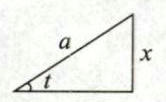

# 第4章 不定积分

## 第一节 不定积分的基本概念与性质

### 一、基本概念

#### 1. 原函数

设函数 $f(x)$ 定义于区域 $D$,若存在函数 $F(x)$,使得对任意的 $x\in D$,有
$$F^{\prime}\left(x\right)=f\left(x\right),$$
则称$F(x)$为$f(x)$在$D$上的一个原函数.

> (1)若 $f(x)$ 为连续函数，则一定有原函数，反之不对；  
> (2)若 $f(x)$ 有一个原函数，则一定有无数个原函数，且任意两个原函数相差为常数，设 $F(x)$ 为 $f(x)$ 的一个原函数，则其所有原函数为 $F(x)+C$ (C为任意常数)

#### 2. 不定积分

函数 $f(x)$ 的所有原函数称为 $f(x)$ 的不定积分，记为$\int f(x)\mathrm{d}x$ ,设 $F(x)$ 为 $f(x)$ 的一个原函数，则有

$$
\int f\left(x\right)\mathrm{d}x=F\left(x\right)+C.
$$

### 二、不定积分的基本性质

$\int [f(x)\pm g(x)]\mathrm{d}x = \int f(x) \mathrm{d}x \pm \int  g(x)\mathrm{d}x$

$\int kf(x)\mathrm{d}x=k\int f(x) \mathrm{d}x$

### 三、不定积分基本公式

1、 $\int k \mathrm{d}x = kx+C$

2、 $\int x^a \mathrm{d}x=\begin{cases}\displaystyle\frac{1}{a+1}x^{ a+1}+C ,&a\neq-1 ,\\[2ex]\ln\mid x\mid+C ,&a=-1.\end{cases}$

3、 $\int {a}^{x}\mathrm{\;d}x = \displaystyle\frac{{a}^{x}}{\ln a} + C$ ,特别地, $\int {\mathrm{e}}^{x}\mathrm{\;d}x = {\mathrm{e}}^{x} + C$ .

4、

$$
\begin{align*}
&(1)\int \sin x\mathrm{\;d}x =  - \cos x + C& &(2) \int \cos x\mathrm{\;d}x = \sin x + C&
\\\\
&(3)\int \tan x\mathrm{\;d}x =  - \ln \left| {\cos x}\right|  + C& &(4) \int \cot x\mathrm{\;d}x = \ln \left| {\sin x}\right|  + C&
\\\\
&(5)\int {\sec }^{2}x\mathrm{\;d}x = \tan x + C& &(6) \int {\csc }^{2}x\mathrm{\;d}x =  - \cot x + C&
\\\\
&(7)\int \sec x\tan x\mathrm{\;d}x = \sec x + C& &(8) \int \csc x\cot x\mathrm{\;d}x =  - \csc x + C&
\\\\
&(9) \int \sec x = \ln |\sec x + \tan x| + C& &(10) \int \csc x = -\ln |\csc x + \cot x| + C&
\end{align*}
$$

5、

$$
\begin{align*}
&(1) \int \displaystyle\frac{\mathrm{d}x}{\sqrt{1 - {x}^{2}}} = \arcsin x + C& &(2) \int \displaystyle\frac{\mathrm{d}x}{\sqrt{{a}^{2} - {x}^{2}}} = \arcsin \frac{x}{a} + C\left( {a > 0}\right)&
\\\\
&(3) \int \displaystyle\frac{\mathrm{d}x}{1 + {x}^{2}} = \arctan x + C& &(4) \int \displaystyle\frac{\mathrm{d}x}{{a}^{2} + {x}^{2}} = \frac{1}{a}\arctan \frac{x}{a} + C&
\\\\
&(5) \int \frac{\mathrm{d}x}{\sqrt{{x}^{2} + {a}^{2}}} = \ln \left( {x + \sqrt{{x}^{2} + {a}^{2}}}\right)  + C&
&(6) \int \frac{\mathrm{d}x}{\sqrt{{x}^{2} - {a}^{2}}} = \ln \left| {x + \sqrt{{x}^{2} - {a}^{2}}}\right|  + C&
\end{align*}
$$

$$
\begin{align*}
&(7) \int \frac{\mathrm{d}x}{{x}^{2} - {a}^{2}} = \frac{1}{2a}\ln \left| \frac{x - a}{x + a}\right|  + C&
\\\\
&(8) \int \sqrt{{a}^{2} - {x}^{2}}\mathrm{\;d}x = \frac{x}{2}\sqrt{{a}^{2} - {x}^{2}} + \frac{{a}^{2}}{2}\arcsin \frac{x}{a} + C\left( {a > 0}\right)&
\\\\
&(9) \int \sqrt{{x}^{2} + {a}^{2}}\mathrm{\;d}x = \frac{x}{2}\sqrt{a^2+x^2} + \frac{a^2}{2}\ln \left|x + \sqrt{a^2+x^2}\right| + C&
\\\\
&(10) \int \sqrt{{x}^{2} - {a}^{2}}\mathrm{\;d}x = \frac{x}{2}\sqrt{x^2-a^2} - \frac{a^2}{2}\ln \left|x + \sqrt{x^2-a^2}\right| + C&
\end{align*}
$$

## 第二节 不定积分的积分法

### 一、换元积分法

#### 定理 1

设函数 $f\left( u\right)$ 的原函数为 $F\left( u\right)$ ,且 $u = \varphi \left( x\right)$ 可导,则

$$
\int f\left\lbrack  {\varphi \left( x\right) }\right\rbrack  {\varphi }^{\prime }\left( x\right) \mathrm{d}x = \int f\left\lbrack  {\varphi \left( x\right) }\right\rbrack  \mathrm{d}\left\lbrack  {\varphi \left( x\right) }\right\rbrack
$$

$$
\xlongequal{\varphi \left( x\right)  = u}\int f\left( u\right) \mathrm{d}u = F\left( u\right)  + C
$$

$$
 = F\left\lbrack  {\varphi \left( x\right) }\right\rbrack   + C,
$$

称其为第一类换元积分法.

#### 定理 2

 设函数 $x = \varphi \left( t\right)$ 单调、可导且 ${\varphi }^{\prime }\left( t\right)  \neq  0$ ,再令 $f\left\lbrack  {\varphi \left( t\right) }\right\rbrack  {\varphi }^{\prime }\left( t\right)$ 的原函数为 $G\left( t\right)$

则

$$
\int f\left( x\right) \mathrm{d}x\xlongequal{x = \varphi \left( t\right) }\int f\left\lbrack  {\varphi \left( t\right) }\right\rbrack  {\varphi }^{\prime }\left( t\right) \mathrm{d}t = G\left( t\right)  + C = G\left\lbrack  {{\varphi }^{-1}\left( x\right) }\right\rbrack   + C,
$$

称其为第二类换元积分法.

对于被积函数含平方和或平方差, 或者被积函数为无理函数时, 一般使用第二类换元积分法,即将 $x$ 表示为一个含 $t$ 的表达式.

第二类换元积分法最常见的是平方和、平方差的三角代换，换元方法如下：

|被积函数表达式|三角换元替代式|图形理解|
|:---:|:---|:---:|
|$a^{2}-x^{2}$|令 $x=a\sin t \quad (\vert t\vert < \frac{\pi}{2})$ ，则 $a^2-x^2=a^2\cos^2 t$||
|$x^{2}+a^{2}$|令 $x=a\tan t \quad (\vert t\vert < \frac{\pi}{2})$ ，则 $x^2+a^2=a^2\sec^2 t$||
|$x^{2}-a^{2}$|令 $x=\pm a\sec t \quad (0<t<\frac{\pi}{2})$ ，则 $x^2-a^2=a^2\tan^2 t$||

### 二、分部积分法

对被积分函数为不同种类的初等函数之积，或 ${\sec }^{n}x,{\csc }^{n}x$ ( $n$ 为奇数) 时,一般使用分部

积分法:

$$
\int u\mathrm{\;d}v = {uv} - \int v\mathrm{\;d}u.
$$

分部积分一般适用于如下情形:

- 情形一：被积函数为幂函数与指数函数之积
- 情形二：被积函数为幂函数与对数函数之积
- 情形三：被积函数为幂函数与三角函数之积
- 情形四：被积函数为幂函数与反之角函数之积
- 情形五：被积函数形如 $e^{ax}\cos bx$ 或 $e^{ax}\sin bx$

## 第三节 两类特殊函数的不定积分

### 一、有理函数的不定积分

所谓有理函数的不定积分,即 $\int R\left( x\right) \mathrm{d}x,R\left( x\right)  = \displaystyle\frac{P\left( x\right) }{Q\left( x\right) }$ ,其中 $P\left( x\right) ,Q\left( x\right)$ 为多项式.

若 $P\left( x\right)$ 的次数不低于 $Q\left( x\right)$ ,称 $R\left( x\right)$ 为假分式; 若 $P\left( x\right)$ 的次数低于 $Q\left( x\right)$ ,称 $R\left( x\right)$ 为真分式.

计算有理函数的不定积分步骤如下:

第一步,若 $R\left( x\right)$ 为假分式,将 $R\left( x\right)$ 化为多项式与真分式之和,如:

$$
R\left( x\right)  = \frac{2{x}^{3} + x - 3}{{x}^{2} + 1} = {2x} - \frac{x + 3}{{x}^{2} + 1};
$$

第二步,若 $R\left( x\right)$ 为真分式,将 $R\left( x\right)$ 的分子不变,分母因式分解,再拆成部分和:

（1）若分母有因式 ${ax} + b$ ,拆成 $\displaystyle\frac{A}{{ax} + b}$ ;

（2）若分母有因式 ${\left( ax + b\right) }^{n}$ ,拆成 $\displaystyle\frac{{A}_{1}}{{ax} + b} + \frac{{A}_{2}}{{\left( ax + b\right) }^{2}} + \cdots  + \frac{{A}_{n}}{{\left( ax + b\right) }^{n}}$ ;

（3）若分母有因式 $a{x}^{2} + {bx} + c\left( {\Delta  = {b}^{2} - {4ac} < 0}\right)$ ,拆成 $\displaystyle\frac{{Ax} + B}{a{x}^{2} + {bx} + c}$ .

### 二、三角函数有理式的不定积分

所谓三角函数有理式的不定积分,即形如 $\int R\left( {\sin x,\cos x}\right) \mathrm{d}x$ 的不定积分,其中 $R\left( {u,v}\right)$ 为有理函数.

三角函数有理式的积分可根据具体题型选用换元积分法或分部积分法, 在没有好的方法的情况下, 可以使用万能公式:

令 $u = \tan \displaystyle\frac{x}{2}$ ,则

$$
\sin x = \frac{2u}{1 + {u}^{2}},\cos x = \frac{1 - {u}^{2}}{1 + {u}^{2}},\tan x = \frac{2u}{1 - {u}^{2}},\mathrm{\;d}x = \frac{2}{1 + {u}^{2}}\mathrm{\;d}u.
$$
