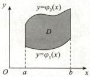

# 第8章 二重积分

## 第一节 二重积分的概念与性质

### 一、二重积分产生的背景

设有一平面薄片占有 $xOy$ 平面上的有界闭区域$D$ ，其面密度为 $\rho(x,y)$ ，求其质量$m.$

第一步，将区域 $D$ 分为 $n$ 个小闭区域 $\Delta\sigma_1,\Delta\sigma_2,\cdots,\Delta\sigma_n$

第二步，任取$(\xi_i,\eta_i)\in\Delta\sigma_i(i=1,2,\cdots,n)$ ，第$i$ 个区域$\Delta\sigma_i$ 的质量的近似值为

$$\rho\left(\xi_i,\eta_i\right)\Delta\sigma_i$$

区域 $D$ 的质量的近似值为

$$\sum_{i=1}^n\rho\left(\xi_i,\eta_i\right)\Delta\sigma_i$$

第三步，设 $\lambda$ 为区域$\Delta\sigma_1,\Delta\sigma_2,\cdots,\Delta\sigma_n$ 的直径最大值，则
$$m=\lim_{\lambda\to0}\sum_{i=1}^n\rho\left(\xi_i,\eta_i\right)\Delta\sigma_i.$$

> 划重点  
> 二重积分产生的背景即二元不规则量的计算

### 二、二重积分的定义

设 $D$ 为 $xOy$ 平面上的有界闭区域，二元函数$f(x,y)$ 在$D$ 上有界

第一步，将区域$D$ 分为$n$ 个小闭区域$\Delta\sigma_1,\Delta\sigma_2,\cdots,\Delta\sigma_n$

第二步，任取 $(\xi_{i},\eta_{i})\in\Delta\sigma_{i}(i=1,2,\cdotp\cdotp\cdotp,n)$ ，作和

$$\sum_{i=1}^{n}f\left(\xi_{i},\eta_{i}\right)\Delta\sigma_{i}\:;$$

第三步，设入为区域$\Delta\sigma_1,\Delta\sigma_2,\cdots,\Delta\sigma_n$ 的直径最大值.若极限 $\lim_{\lambda\to0}\sum_{i=1}^n\rho\left(\xi_i,\eta_i\right)\Delta\sigma_i$ 存在，则称此极限为函数 $f(x,y)$ 在$D$ 上的二重积分，记为 $\iint\limits_{D}f\left(x,y\right)\mathrm{d}\sigma$ ，即

$$\iint\limits_{D}f\left(x\:,y\right)\mathrm{d}\sigma=\lim\limits_{\lambda\to0}\sum\limits_{i=1}^{n}f\left(\xi_{i}\:,\eta_{i}\:\right)\Delta\sigma_{i}\:.$$

>划重点
>
>(1) 设曲顶柱体 $z=f(x,y)\geq0((x,y)\in D)$ ，则 $\iint\limits_{D}f\left(x,y\right)\mathrm{d}\sigma$ 为曲顶柱体的体积，即
>$$V=\iint\limits_{D}f(x,y)\mathrm{d}\sigma\:;$$
>
>(2) 设平面薄片占有平面有界闭区域D，且面密度为 $\rho(x,y)$ ，则该薄片的质量为
>$$m=\iint\limits_{D}\rho\:(x,y)\mathrm{d}\sigma\:;$$
>
>(3) 令 $D=\{(x.y)\mid 0\le x \le 1,\;0\le y\le 1\}$，则
> $$\lim_{n\to\infty} \frac{1}{n^{2}} \sum_{i=1}^{n} \sum_{j=1}^{n} f\left(\frac{i}{n},\frac{j}{n}\right)= \iint\limits_{D}f(x,y)\mathrm{d}\sigma = \iint\limits_{D}f(x,y)\mathrm{d}x\mathrm{d}y.$$

### 三、二重积分的性质

***性质1***

$$\iint\limits_{D}\left[k_{1}f\left(x,y\right)+k_{2}g\left(x,y\right)\right]\mathrm{d}x\:\mathrm{d}y=k_{1}\iint\limits_{D}f\left(x,y\right)\mathrm{d}x\:\mathrm{d}y+k_{2}\iint\limits_{D}g\left(x,y\right)\mathrm{d}x\:\mathrm{d}y\:,\text{其中}$$
$k_1,k_2$ 为任意常数。

***性质2***

设$D$ 由$D_1,D_2$ 构成，则
$$\iint\limits_{D}f\left(x\:,y\:\right)\mathrm{d}x\:\mathrm{d}y=\iint\limits_{D_{1}}f\left(x\:,y\:\right)\mathrm{d}x\:\mathrm{d}y+\iint\limits_{D_{2}}f\left(x\:,y\:\right)\mathrm{d}x\:\mathrm{d}y.$$

***性质3***

设平面有界闭区域$D$ 的面积为$A$ ，则
$$A=\iint\limits_{D}\mathrm{d}x\:\mathrm{d}y.$$

***性质4（对称性）***

(1) 设平面有界闭区域$D$ 关于$y$ 轴对称，其中右侧区域为 $D_{1}.$

若 $f\left(-x\:,y\right)=-f\left(x\:,y\right)$ ，则 $\iint\limits_{D}f\left(x\:,y\:\right)\mathrm{d}x\:\mathrm{d}y=0\:;$

若 $f\left(-x\:,y\right)=f\left(x\:,y\right)$ ，则 $\iint\limits_{D}f\left(x\:,y\:\right)\mathrm{d}x\:\mathrm{d}y=2\iint\limits_{D_{1}}f\left(x\:,y\:\right)\mathrm{d}x\:\mathrm{ d}y.$

(2) 设平面有界闭区域$D$ 关于$x$ 轴对称，其中上侧区域为$D_{1}$ 。

若 $f\left(x\:,-y\right)=-f\left(x\:,y\right)$ ，则 $\iint\limits_{D}f\left(x\:,y\:\right)\mathrm{d}x\:\mathrm{d}y=0\:;$

若 $f\left(x\:,-y\right)=f\left(x\:,y\right)$ ，则 $\iint\limits_{D}f\left(x\:,y\:\right)\mathrm{d}x\:\mathrm{d}y=2\iint\limits_{D_{1}}f\left(x\:,y\:\right)\mathrm{d}x\:\mathrm{ d}y.$

(3) 设平面有界闭区域$D$ 关于$y=x$ 对称，则
$$\iint\limits_{D}f\left(x\:,y\:\right)\mathrm{d}x\mathrm{d}y=\iint\limits_{D}f\left(y\:,x\:\right)\mathrm{d}x\mathrm{d}y.$$

***性质5（二重积分的中值定理）***

设二元函数$f(x,y)$ 在平面有界闭区域$D$ 上连续，且$D$ 的面积为$A$ ，则存在$(\xi,\eta)\in D$ ，使得
$$\iint\limits_{D}f\left(x,y\right)\mathrm{d}x\mathrm{d}y=f\left(\xi\:,\eta\right)A.$$

## 第二节 二重积分的计算方法

### 一、直角坐标法

#### 1. X型区域

对 $\iint\limits_{D}f\left(x,y\right)\mathrm{d}x\mathrm{d}y$ ，将区域$D$ 向$x$ 轴投影（如图8-1），若区域$D$ 可表示为

$$D=\{(x,y)\mid a\leqslant x\leqslant b,\varphi_1(x)\leqslant y\leqslant\varphi_2(x)\},$$

则称其为$X$ 型区域，且有

$$\iint\limits_{D}f\left(x\:,y\right)\mathrm{d}x\:\mathrm{d}y=\int_{a}^{b}\mathrm{d}x\int_{\varphi_{1}\left(x\right)}^{\varphi_{2}\left(x\right)}f\left(x\:,y\:\right)\mathrm{d}y.$$

图8-1

#### 2. Y型区域

对 $\iint\limits_{D}f\left(x\:,y\right)\mathrm{d}x\mathrm{d}y$ ，将区域 $D$ 向 $y$ 轴投影（如图8-2),若区域$D$ 可表示为

$$
D=\left\{\begin{matrix}(x,y)\mid\varphi_1(y)\leqslant x\leqslant\varphi_2(y),c\leqslant y\leqslant d\end{matrix}\right\},
$$

则称其为$Y$ 型区域，且有
$$\iint\limits_{D}f\left(x\:,y\right)\mathrm{d}x\:\mathrm{d}y=\int_{c}^{d}\mathrm{d}y\int_{\varphi_{1}\left(y\right)}^{\varphi_{2}\left(y\right)}f\left(x\:,y\right)\mathrm{d}x\:.$$

图8-2

### 二、极坐标法

计算二重积分时，若具有如下两个特征之一，一般使用极坐标法

(1) 积分区域$D$ 的边界曲线含 $x^2+y^2$

(2) 被积函数 $f(x,y)$ 中含 $x^2+y^2$

令 $\begin{cases}x=r\cos\theta ,\\y=r\sin\theta\end{cases}(\alpha\leqslant\theta\leqslant\beta,r_1(\theta)\leqslant r\leqslant r_2(\theta))$ 如图8-5 ,则

$$\iint\limits_{D}f\left(x\:,y\:\right)\mathrm{d}\sigma=\int_{\alpha}^{\beta}\mathrm{d}\theta\int_{r_{1}(\theta)}^{r_{2}(\theta)}rf\left(r\cos\theta\:,r\sin\theta\:\right)\mathrm{d}r.$$

图8-5
