# 第10讲 一元函数积分学的应用（一）几何应用

假设以下曲线都是连续的.

## 1. 用定积分表达和计算平面图形的面积

三大体系下的图形: $\left\{ \begin{array}{l} \text{ ① 直角坐标系下 }\left( \text{ 直接算 }\right) \\ \text{ ② 参数方程下 }\left\{ \begin{array}{l} \text{ 直接算 }\left( \text{ 少 }\right) \\ \text{ 接元法 } \end{array}\right. \\ \text{ ③ 极坐标系下 }\left( \text{ 直接算 }\right) \end{array}\right.$

### (1) 曲线 $y = {y}_{1}\left( x\right)$ 与 $y = {y}_{2}\left( x\right)$ 及 $x = a, x = b\left( {a < b}\right)$ 所围成的平面图形的面积

$$
S = {\int }_{a}^{b}\left| {{y}_{1}\left( x\right) - {y}_{2}\left( x\right) }\right| \mathrm{d}x.
$$

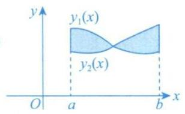

### (2) 曲线 $r = {r}_{1}\left( \theta \right)$ 与 $r = {r}_{2}\left( \theta \right)$ 与两射线 $\theta = \alpha$ 与 $\theta = \beta \left( {0 < \beta - \alpha \leq {2\pi }}\right)$ 所围成的曲边扇形的面积

$$
S = \frac{1}{2}{\int }_{\alpha }^{\beta }\left| {{r}_{1}^{2}\left( \theta \right) - {r}_{2}^{2}\left( \theta \right) }\right| \mathrm{d}\theta .
$$

例 10.1 设 ${A}_{n}$ 是曲线 $y = {x}^{n}$ 与 $y = {x}^{n + 1}\left( {n = 1,2,\cdots }\right)$ 所围区域的面积,则 $\mathop{\lim }\limits_{{n \rightarrow \infty }}{\left( 2\mathop{\sum }\limits_{{k = 1}}^{n}{A}_{k}\right) }^{n} =$ ___.

解 应填 ${\mathrm{e}}^{-2}$ .

$y = {x}^{n}$ 与 $y = {x}^{n + 1}$ 的交点为 $\left( {0,0}\right) ,\left( {1,1}\right)$ ,故

$$
{A}_{n} = {\int }_{0}^{1}\left( {{x}^{n} - {x}^{n + 1}}\right) \mathrm{d}x = {\left. \left( \frac{1}{n + 1}{x}^{n + 1} - \frac{1}{n + 2}{x}^{n + 2}\right) \right| }_{0}^{1} = \frac{1}{n + 1} - \frac{1}{n + 2},
$$

则

$$
\mathop{\lim }\limits_{{n \rightarrow \infty }}{\left( 2\mathop{\sum }\limits_{{k = 1}}^{n}{A}_{k}\right) }^{n} = \mathop{\lim }\limits_{{n \rightarrow \infty }}{\left\lbrack \mathop{\sum }\limits_{{k = 1}}^{n}\left( \frac{2}{k + 1} - \frac{2}{k + 2}\right) \right\rbrack }^{n}
$$

$$
= \mathop{\lim }\limits_{{n \rightarrow \infty }}{\left( \frac{2}{2} - \frac{2}{3} + \frac{2}{3} - \frac{2}{4} + \cdots + \frac{2}{n + 1} - \frac{2}{n + 2}\right) }^{n} = \mathop{\lim }\limits_{{n \rightarrow \infty }}{\left( 1 - \frac{2}{n + 2}\right) }^{n} = {\mathrm{e}}^{-2}\text{.}
$$

例 10.2 求由摆线 $\left\{ {\begin{array}{l} x = a\left( {t - \sin t}\right) , \\ y = a\left( {1 - \cos t}\right) \end{array}\left( {a > 0}\right) }\right.$ 的一拱 (见图 10-1) 与 $x$ 轴所围平面图形的面积.

> 参数方程下的问题是重点. ① $\left\{ {\begin{array}{l} x = x\left( t\right) , \\ y = y\left( t\right) \end{array} \Rightarrow y = f\left( x\right) }\right.$
>
> ② $S = {\int }_{0}^{2\pi a}f\left( x\right) \mathrm{d}x$ (直角坐标系) $= {\int }_{0}^{2\pi }y\left( t\right) \mathrm{d}\left\lbrack {x\left( t\right) }\right\rbrack$

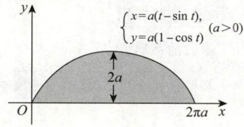

图 10-1

解 当 $t = 0$ 或 $t = {2\pi }$ 时, $y = 0$ . 故当 $t$ 由 0 变到 ${2\pi }$ 时,曲线正好成一拱. 所以

$$
S = {\int }_{0}^{2\pi a}y\left( x\right) \mathrm{d}x = {\int }_{0}^{2\pi }a\left( {1 - \cos t}\right) {\left\lbrack a\left( t - \sin t\right) \right\rbrack }^{\prime }\mathrm{d}t
$$

$$
= {\int }_{0}^{2\pi }{a}^{2}{\left( 1 - \cos t\right) }^{2}\mathrm{\;d}t = {a}^{2}{\int }_{0}^{2\pi }\left( {1 - 2\cos t + {\cos }^{2}t}\right) \mathrm{d}t
$$

$$
= {a}^{2}{\int }_{0}^{2\pi }\mathrm{d}t - 2{a}^{2}{\int }_{0}^{2\pi }\cos t\mathrm{\;d}t + {a}^{2}{\int }_{0}^{2\pi }{\cos }^{2}t\mathrm{\;d}t
$$

$$
= 2{a}^{2}\pi + 4{a}^{2}{\int }_{0}^{\frac{\pi }{2}}{\cos }^{2}t\mathrm{\;d}t = 3{a}^{2}\pi .
$$

例 10.3 求伯努利双纽线 ${r}^{2} = {a}^{2}\cos {2\theta }$ 围成的图形面积.

解 如图 10-2 所示, 利用对称性, 所求图形面积是阴影部分面积的 4 倍.

图 10-2

阴影部分的图形由射线 $\theta = 0,\theta = \frac{\pi }{4}$ 与伯努利双纽线 ${r}^{2} = {a}^{2}\cos {2\theta }$ 围成, 于是所求的平面图形面积为

$$
S = 4{\int }_{0}^{\frac{\pi }{4}}\frac{1}{2}{a}^{2}\cos {2\theta }\mathrm{d}\theta = {\left. {a}^{2}\sin 2\theta \right| }_{0}^{\frac{\pi }{4}} = {a}^{2}.
$$

例 10.4 求曲线 $y = {\mathrm{e}}^{-x}\sin x\left( {x \geq 0}\right)$ 与 $x$ 轴所围平面图形的面积.

解 $S = {\int }_{0}^{+\infty }{\mathrm{e}}^{-x}\left| {\sin x}\right| \mathrm{d}x = \mathop{\sum }\limits_{{n = 0}}^{\infty }\left| {{\int }_{n\pi }^{\left( {n + 1}\right) \pi }{\mathrm{e}}^{-x}\sin x\mathrm{\;d}x}\right|$ ,其中

$$
{\int }_{n\pi }^{\left( {n + 1}\right) \pi }{\mathrm{e}}^{-x}\sin x\mathrm{\;d}x = {\left. \frac{1}{2}\left| \begin{matrix} {\left( {\mathrm{e}}^{-x}\right) }^{\prime } & {\left( \sin x\right) }^{\prime } \\ {\mathrm{e}}^{-x} & \sin x \end{matrix}\right| \right| }_{n\pi }^{\left( {n + 1}\right) \pi }
$$

$$
= - {\left. \frac{1}{2}{\mathrm{e}}^{-x}\left( \cos x + \sin x\right) \right| }_{n\pi }^{\left( {n + 1}\right) \pi } = \frac{{\left( -1\right) }^{n}}{2}{\mathrm{e}}^{-{n\pi }}\left( {{\mathrm{e}}^{-\pi } + 1}\right) ,
$$

故

$$
S = \frac{{\mathrm{e}}^{-\pi } + 1}{2}\mathop{\sum }\limits_{{n = 0}}^{\infty }{\left( {\mathrm{e}}^{-\pi }\right) }^{n} = \frac{{\mathrm{e}}^{-\pi } + 1}{2} \cdot \frac{1}{1 - {\mathrm{e}}^{-\pi }} = \frac{{\mathrm{e}}^{-\pi } + 1}{2\left( {1 - {\mathrm{e}}^{-\pi }}\right) }.
$$

## 2. 用定积分表达和计算旋转体的体积

### (1) 曲线 $y = y\left( x\right)$ 与 $x = a, x = b\left( {a < b}\right)$ 及 $x$ 轴围成的曲边梯形绕 $x$ 轴旋转一周所得到的旋转体的体积

$$
{V}_{x} = {\int }_{a}^{b}\pi {y}^{2}\left( x\right) \mathrm{d}x
$$

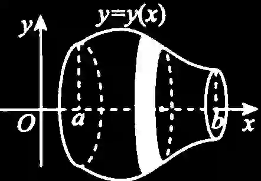

### (2) 曲线 $y = y\left( x\right)$ 与 $x = a, x = b\left( {0 \leq a < b}\right)$ 及 $x$ 轴围成的曲边梯形绕 $y$ 轴旋转一周所得到的旋转体的体积

$$
{V}_{y} = {2\pi }{\int }_{a}^{b}x\left| {y\left( x\right) }\right| \mathrm{d}x. \tag{*}
$$

---

【注】公式 (*) 有时用起来很方便, 现简单推导如下:

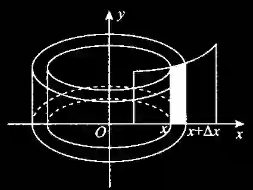

图 10-3

取 $\left\lbrack {x, x + {\Delta x}}\right\rbrack \left( {{\Delta x} > 0}\right)$ ,得到一个小竖条,如图 10-3 的阴影区域所示,此小竖条绕着 $y$ 轴旋转一周,成为一个 “圆柱壳”,将其沿任何一条竖线 “切开”, 可展开为一个 “长方体”, 其体积为

$$
\mathrm{d}{V}_{y} = {2\pi x}\left| {y\left( x\right) }\right| \mathrm{d}x,
$$

故

$$
{V}_{y} = {2\pi }{\int }_{a}^{b}x\left| {y\left( x\right) }\right| \mathrm{d}x.
$$

---

### (3) 平面曲线绕定直线旋转

设平面曲线 $L : y = f\left( x\right), a \leq x \leq b$ ,且 $f\left( x\right)$ 可导.

定直线 ${L}_{0} : {Ax} + {By} + C = 0$ ,且过 ${L}_{0}$ 的任一条垂线与 $L$ 至多有一个交点,如图 10-4 所示,则 $L$ 绕 ${L}_{0}$ 旋转一周所得旋转体的体积为

$$
V = \frac{\pi }{{\left( {A}^{2} + {B}^{2}\right) }^{\frac{3}{2}}}{\int }_{a}^{b}{\left\lbrack Ax + Bf\left( x\right) + C\right\rbrack }^{2}\left| {A{f}^{\prime }\left( x\right) - B}\right| \mathrm{d}x. \tag{10-1}
$$

特别地,若 $A = C = 0, B \neq 0$ ,则 ${L}_{0}$ 为 $y = 0\left( {x\text{轴}}\right)$ ,如图 10-5 所示, $L$ 绕 ${L}_{0}$ 旋转一周所得旋转体的体积为

$$
V = \pi {\int }_{a}^{b}{f}^{2}\left( x\right) \mathrm{d}x.
$$

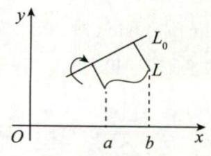

图 10-4

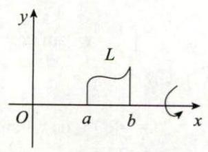

图 10-5

例 10.5 求曲线 $y = {\mathrm{e}}^{-\frac{x}{2}}\sqrt{\sin x}$ 在 $\left\lbrack {0,{2\pi }}\right\rbrack$ 部分与 $x$ 轴围成的平面图形绕 $x$ 轴旋转一周所成的旋转体的体积.

解 $y = {\mathrm{e}}^{-\frac{x}{2}}\sqrt{\sin x}$ 在 $\left\lbrack {0,\pi }\right\rbrack$ 上存在,在 $\left( {\pi ,{2\pi }}\right)$ 内不存在,故

$$
V = {\int }_{0}^{\pi }\pi {y}^{2}\left( x\right) \mathrm{d}x = {\int }_{0}^{\pi }\pi {\mathrm{e}}^{-x}\sin x\mathrm{\;d}x\xlongequal{\text{ 见注 }}\frac{1}{2}\pi \left( {1 + {\mathrm{e}}^{-\pi }}\right) .
$$

---

【注】 ${\int }_{0}^{\pi }\pi {\mathrm{e}}^{-x}\sin x\mathrm{\;d}x = {\left. {\left. \displaystyle\frac{\pi }{2}\left( \begin{matrix} {(\mathrm{e}}^{-x})' & (\sin x)' \\ {\mathrm{e}}^{-x} & \sin x \end{matrix}\right)  \right| }_{0}^{\pi } = - \frac{\pi }{2}\left( \cos x + \sin x\right) {\mathrm{e}}^{-x}\right| }_{0}^{\pi } = \frac{\pi }{2}\left( {{\mathrm{e}}^{-\pi } + 1}\right)$ .

---

例 10.6 设函数 $f\left( x\right)$ 的定义域为 $\left( {0, + \infty }\right)$ ,且满足 ${2f}\left( x\right) + {x}^{2}f\left( \frac{1}{x}\right) = \frac{{x}^{2} + {2x}}{\sqrt{1 + {x}^{2}}}$ . 求 $f\left( x\right)$ ,并求曲线 $y = f\left( x\right), y = \frac{1}{2}, y = \frac{\sqrt{3}}{2}$ 及 $y$ 轴所围图形绕 $x$ 轴旋转所成旋转体的体积.

解 由例 1.2 知

$$
f\left( x\right) = \frac{x}{\sqrt{1 + {x}^{2}}}\left( {x > 0}\right) .
$$

由 $y = \frac{x}{\sqrt{1 + {x}^{2}}}$ 得 $x = \frac{y}{\sqrt{1 - {y}^{2}}}\left( {0 < y < 1}\right)$ ,从而曲线 $y = f\left( x\right), y = \frac{1}{2}, y = \frac{\sqrt{3}}{2}$ 及 $y$ 轴所围图形绕 $x$ 轴旋转所成旋转体的体积为

$$
V = {2\pi }{\int }_{\frac{1}{2}}^{\frac{\sqrt{3}}{2}}{xy}\mathrm{\;d}y = {2\pi }{\int }_{\frac{1}{2}}^{\frac{\sqrt{3}}{2}}\frac{{y}^{2}}{\sqrt{1 - {y}^{2}}}\mathrm{\;d}y
$$

$$
\xlongequal{\text{ 令 }y = \sin t}{}{2\pi }{\int }_{\frac{\pi }{6}}^{\frac{\pi }{3}}{\sin }^{2}t\mathrm{\;d}t = {2\pi }{\int }_{\frac{\pi }{6}}^{\frac{\pi }{3}}\frac{1 - \cos {2t}}{2}\mathrm{\;d}t
$$

$$
= \frac{{\pi }^{2}}{6}\text{. }
$$

例 10.7 过坐标原点作曲线 $y = {\mathrm{e}}^{x}$ 的切线,该切线与曲线 $y = {\mathrm{e}}^{x}$ 以及 $x$ 轴围成的向 $x$ 轴负向无限伸展的平面图形记为 $D$ . 求

(1) $D$ 的面积 $A$ ;

(2) $D$ 绕直线 $x = 1$ 旋转一周所成的旋转体的体积 $V$ .

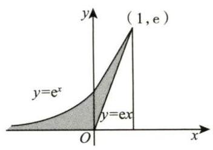

图 10-6

解 设切点坐标为 $P\left( {{x}_{0},{y}_{0}}\right)$ ,于是曲线 $y = {\mathrm{e}}^{x}$ 在点 $P$ 的切线斜率为

$$
{y}^{\prime }\left( {x}_{0}\right) = {\mathrm{e}}^{{x}_{0}},
$$

切线方程为

$$
y - {y}_{0} = {\mathrm{e}}^{{x}_{0}}\left( {x - {x}_{0}}\right) .
$$

因为该切线经过点 $\left( {0,0}\right)$ ,所以 $- {y}_{0} = - {x}_{0}{\mathrm{e}}^{{x}_{0}}$ . 又因为 ${y}_{0} = {\mathrm{e}}^{{x}_{0}}$ ,代入求得 ${x}_{0} = 1$ ,从而 ${y}_{0} = {\mathrm{e}}^{{x}_{0}} = \mathrm{e}$ ,切线方程为 $y = \mathrm{e}x$ ,如图 10-6 所示. (1) 取水平条面积微元,则 $D$ 的面积

$$
A = {\int }_{0}^{\mathrm{e}}\left( {\frac{y}{\mathrm{e}} - \ln y}\right) \mathrm{d}y = {\left. \left( \frac{{y}^{2}}{2\mathrm{e}} - y\ln y + y\right) \right| }_{0}^{\mathrm{e}} = \frac{\mathrm{e}}{2} + \mathop{\lim }\limits_{{y \rightarrow {0}^{ + }}}y\ln y = \frac{\mathrm{e}}{2}.
$$

(2) $D$ 绕直线 $x = 1$ 旋转一周所成的旋转体的体积微元为

$$
\mathrm{d}V = \left\lbrack {\pi {\left( 1 - \ln y\right) }^{2} - \pi {\left( 1 - \frac{y}{\mathrm{e}}\right) }^{2}}\right\rbrack \mathrm{d}y,
$$

从而

$$
V = \pi {\int }_{0}^{\mathrm{e}}\left( {{\ln }^{2}y - 2\ln y + \frac{2y}{\mathrm{e}} - \frac{{y}^{2}}{{\mathrm{e}}^{2}}}\right) \mathrm{d}y
$$

$$
= {\left. \pi \left( y{\ln }^{2}y - 4y\ln y + 4y + \frac{{y}^{2}}{\mathrm{e}} - \frac{{y}^{3}}{3{\mathrm{e}}^{2}}\right) \right| }_{0}^{\mathrm{e}} = \frac{5}{3}\pi \mathrm{e}.
$$

---

【注】第二问也可用公式 (10-1) 来做.

$$
V = \pi {\int }_{-\infty }^{1}{\left( x - 1\right) }^{2} \cdot {\mathrm{e}}^{x}\mathrm{\;d}x - \pi {\int }_{0}^{1}{\left( x - 1\right) }^{2} \cdot \mathrm{e}\mathrm{d}x
$$

$$
= \pi {\int }_{-\infty }^{1}{\left( x - 1\right) }^{2}\mathrm{\;d}\left( {\mathrm{e}}^{x}\right) - \mathrm{e}\pi {\int }_{0}^{1}\left( {{x}^{2} - {2x} + 1}\right) \mathrm{d}x
$$

$$
= {\left. \pi {\mathrm{e}}^{x}{\left( x - 1\right) }^{2}\right| }_{-\infty }^{1} - {2\pi }{\int }_{-\infty }^{1}\left( {x - 1}\right) \cdot {\mathrm{e}}^{x}\mathrm{\;d}x - \frac{\pi \mathrm{e}}{3}
$$

$$
= - {2\pi }{\int }_{-\infty }^{1}\left( {x - 1}\right) \mathrm{d}\left( {\mathrm{e}}^{x}\right) - \frac{\pi \mathrm{e}}{3}
$$

$$
= - {\left. 2\pi {\mathrm{e}}^{x} \cdot \left( x - 1\right) \right| }_{-\infty }^{1} + {2\pi }{\int }_{-\infty }^{1}{\mathrm{e}}^{x}\mathrm{\;d}x - \frac{\pi \mathrm{e}}{3}
$$

$$
= {\left. 2\pi {\mathrm{e}}^{x}\right| }_{-\infty }^{1} - \frac{\pi \mathrm{e}}{3}
$$

$$
= \frac{{5\pi }\mathrm{e}}{3}\text{. }
$$

---

例 10.8 曲线 $y = \sqrt{x}$ 与 $y = x$ 所围平面有界区域绕直线 $y = x$ 旋转一周所得旋转体的体积为

解 应填 $\frac{\sqrt{2}}{60}\pi$ .

$L : y = \sqrt{x},0 \leq x \leq 1.{L}_{0} : y = x$ ,即 $x - y = 0$ ,故 $A = 1, B = - 1, C = 0$ . 于是由公式 (10-1),有

$$
V = \frac{\pi }{{\left\lbrack {1}^{2} + {\left( -1\right) }^{2}\right\rbrack }^{\frac{3}{2}}}{\int }_{0}^{1}{\left( x - \sqrt{x}\right) }^{2}\left| {\frac{1}{2\sqrt{x}} - \left( {-1}\right) }\right| \mathrm{d}x
$$

$$
= \frac{\pi }{2\sqrt{2}}{\int }_{0}^{1}{\left( x - \sqrt{x}\right) }^{2} \cdot \left( {\frac{1}{2\sqrt{x}} + 1}\right) \mathrm{d}x
$$

$$
= \frac{\pi }{2\sqrt{2}}{\int }_{0}^{1}\left( {{x}^{2} - \frac{3}{2}{x}^{\frac{3}{2}} + \frac{\sqrt{x}}{2}}\right) \mathrm{d}x
$$

$$
= \frac{\sqrt{2}}{60}\pi
$$

## 3. 用定积分表达和计算函数的平均值

设 $x \in \left\lbrack {a, b}\right\rbrack$ ,函数 $y\left( x\right)$ 在 $\left\lbrack {a, b}\right\rbrack$ 上的平均值为 $\bar{y} = \frac{1}{b - a}{\int }_{a}^{b}y\left( x\right) \mathrm{d}x$ .

例 10.9 设 $f\left( x\right)$ 连续,且 $f\left( {x + 2}\right) - f\left( x\right) = x,{\int }_{0}^{2}f\left( x\right) \mathrm{d}x = 0$ ,则 $f\left( x\right)$ 在 $\left\lbrack {1,3}\right\rbrack$ 上的平均值为

解 应填 $\frac{1}{4}$ .

记 $F\left( x\right) = {\int }_{x}^{x + 2}f\left( t\right) \mathrm{d}t$ ,则

$$
{F}^{\prime }\left( x\right) = f\left( {x + 2}\right) - f\left( x\right) = x,
$$

故

$$
F\left( x\right) = \int x\mathrm{\;d}x = \frac{1}{2}{x}^{2} + C.
$$

由 $F\left( 0\right) = {\int }_{0}^{2}f\left( x\right) \mathrm{d}x = 0 = C$ ,得 $F\left( x\right) = \frac{1}{2}{x}^{2}$ ,则

$$
\bar{f} = \frac{1}{3 - 1}{\int }_{1}^{3}f\left( x\right) \mathrm{d}x = \frac{1}{2}F\left( 1\right) = \frac{1}{4}.
$$

## 4. 其他几何应用 (仅数学一、数学二)

### (1) “平面上的曲边梯形” 的形心坐标公式

设平面区域 $D = \{ \left( {x, y}\right) \mid 0 \leq y \leq f\left( x\right), a \leq x \leq b\}, y = f\left( x\right)$ 在 $\left\lbrack {a, b}\right\rbrack$ 上连续,如图 10-7 所示. 现推导 $D$ 的形心坐标 $\bar{x},\bar{y}$ 的计算公式.

$$
\bar{x} = \frac{{\iint }_{D}x\mathrm{\;d}\sigma }{{\iint }_{D}\mathrm{\;d}\sigma } = \frac{{\int }_{a}^{b}\mathrm{\;d}x{\int }_{0}^{f\left( x\right) }x\mathrm{\;d}y}{{\int }_{a}^{b}\mathrm{\;d}x{\int }_{0}^{f\left( x\right) }\mathrm{d}y} = \frac{{\int }_{a}^{b}{xf}\left( x\right) \mathrm{d}x}{{\int }_{a}^{b}f\left( x\right) \mathrm{d}x};
$$

$$
\bar{y} = \frac{{\iint }_{D}y\mathrm{\;d}\sigma }{{\iint }_{D}\mathrm{\;d}\sigma } = \frac{{\int }_{a}^{b}\mathrm{\;d}x{\int }_{0}^{f\left( x\right) }y\mathrm{\;d}y}{{\int }_{a}^{b}\mathrm{\;d}x{\int }_{0}^{f\left( x\right) }\mathrm{d}y} = \frac{\frac{1}{2}{\int }_{a}^{b}{f}^{2}\left( x\right) \mathrm{d}x}{{\int }_{a}^{b}f\left( x\right) \mathrm{d}x}.
$$

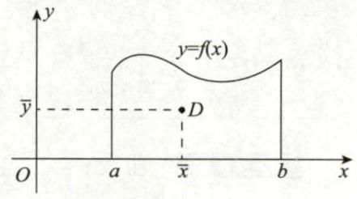

图 10-7

例 10.10 设曲线 $L$ 的方程为 $y = \frac{1}{4}{x}^{2} - \frac{1}{2}\ln x,1 \leq x \leq \mathrm{e}, D$ 是由曲线 $L$ 和直线 $x = 1, x = \mathrm{e}$ 及 $x$ 轴围成的平面图形,则 $D$ 的形心的横坐标为___.

解 应填 $\displaystyle\frac{3\left( {{\mathrm{e}}^{2} + 1}\right) \left( {{\mathrm{e}}^{2} - 3}\right) }{4\left( {{\mathrm{e}}^{3} - 7}\right) }$ .

平面图形 $D$ 的形心的横坐标的计算公式为 $\bar{x} = \frac{{\int }_{1}^{\mathrm{e}}{xy}\mathrm{\;d}x}{{\int }_{1}^{\mathrm{e}}y\mathrm{\;d}x}$ ,其中

$$
{\int }_{1}^{\mathrm{e}}{xy}\mathrm{\;d}x = {\int }_{1}^{\mathrm{e}}x\left( {\frac{1}{4}{x}^{2} - \frac{1}{2}\ln x}\right) \mathrm{d}x = {\left. \left( \frac{1}{16}{x}^{4} - \frac{1}{4}{x}^{2}\ln x + \frac{1}{8}{x}^{2}\right) \right| }_{1}^{\mathrm{e}} = \frac{1}{16}\left( {{\mathrm{e}}^{2} + 1}\right) \left( {{\mathrm{e}}^{2} - 3}\right) ,
$$

$$
{\int }_{1}^{\mathrm{e}}y\mathrm{\;d}x = {\int }_{1}^{\mathrm{e}}\left( {\frac{1}{4}{x}^{2} - \frac{1}{2}\ln x}\right) \mathrm{d}x = {\left. \left( \frac{1}{12}{x}^{3} - \frac{1}{2}x\ln x + \frac{1}{2}x\right) \right| }_{1}^{\mathrm{e}} = \frac{1}{12}{\mathrm{e}}^{3} - \frac{7}{12},
$$

所以 $D$ 的形心的横坐标为

$$
\bar{x} = \frac{\frac{1}{16}\left( {{\mathrm{e}}^{2} + 1}\right) \left( {{\mathrm{e}}^{2} - 3}\right) }{\frac{1}{12}{\mathrm{e}}^{3} - \frac{7}{12}} = \frac{3\left( {{\mathrm{e}}^{2} + 1}\right) \left( {{\mathrm{e}}^{2} - 3}\right) }{4\left( {{\mathrm{e}}^{3} - 7}\right) }.
$$

### (2) 平面曲线的弧长

①若平面光滑曲线由直角坐标方程 $y = y\left( x\right) \left( {a \leq x \leq b}\right)$ 给出,则 $s = {\int }_{a}^{b}\sqrt{1 + {\left\lbrack {y}^{\prime }\left( x\right) \right\rbrack }^{2}}\mathrm{\;d}x$ .

②若平面光滑曲线由参数方程 $\left\{ {\begin{array}{l} x = x\left( t\right) , \\ y = y\left( t\right) \end{array}\left( {\alpha \leq t \leq \beta }\right) }\right.$ 给出,则 $s = {\int }_{\alpha }^{\beta }\sqrt{{\left\lbrack {x}^{\prime }\left( t\right) \right\rbrack }^{2} + {\left\lbrack {y}^{\prime }\left( t\right) \right\rbrack }^{2}}\mathrm{\;d}t$ .

③若平面光滑曲线由极坐标方程 $r = r\left( \theta \right) \left( {\alpha \leq \theta \leq \beta }\right)$ 给出,则 $s = {\int }_{\alpha }^{\beta }\sqrt{{\left\lbrack r\left( \theta \right) \right\rbrack }^{2} + {\left\lbrack {r}^{\prime }\left( \theta \right) \right\rbrack }^{2}}\mathrm{\;d}\theta$ .

例 10.11 曲线 $y = \ln \left( {1 - {x}^{2}}\right)$ 上相应于 $0 \leq x \leq \frac{1}{2}$ 的一段弧的长度为___.

解 应填 $\ln 3 - \frac{1}{2}$ .

$$
s = {\int }_{0}^{\frac{1}{2}}\sqrt{1 + {\left( {y}^{\prime }\right) }^{2}}\mathrm{\;d}x = {\int }_{0}^{\frac{1}{2}}\sqrt{1 + {\left( \frac{-{2x}}{1 - {x}^{2}}\right) }^{2}}\mathrm{\;d}x = {\int }_{0}^{\frac{1}{2}}\frac{1 + {x}^{2}}{1 - {x}^{2}}\mathrm{\;d}x
$$

$$
= {\int }_{0}^{\frac{1}{2}}\left( {\frac{1}{1 + x} + \frac{1}{1 - x} - 1}\right) \mathrm{d}x = \ln 3 - \frac{1}{2}.
$$

例 10.12 阿基米德螺线 $r = \theta$ 上相应于 $\theta$ 从 0 到 ${2\pi }$ 一段的弧长为___.

解 应填 $\pi \sqrt{1 + 4{\pi }^{2}} + \frac{1}{2}\ln \left( {{2\pi } + \sqrt{1 + 4{\pi }^{2}}}\right)$ .

曲线图形如图 10-8 所示.

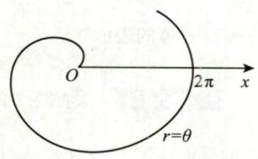

图 10-8

由题意, 所求弧长为

$$
s = {\int }_{0}^{2\pi }\sqrt{{r}^{2}\left( \theta \right) + {\left\lbrack {r}^{\prime }\left( \theta \right) \right\rbrack }^{2}}\mathrm{\;d}\theta
$$

$$
= {\int }_{0}^{2\pi }\sqrt{{\theta }^{2} + {1}^{2}}\mathrm{\;d}\theta
$$

$$
= {\int }_{0}^{2\pi }\sqrt{1 + {\theta }^{2}}\mathrm{\;d}\theta
$$

$$
= {\left. \left\lbrack \frac{\theta }{2}\sqrt{1 + {\theta }^{2}} + \frac{1}{2}\ln \left( \theta + \sqrt{1 + {\theta }^{2}}\right) \right\rbrack \right| }_{0}^{2\pi }
$$

$$
= \pi \sqrt{1 + 4{\pi }^{2}} + \frac{1}{2}\ln \left( {{2\pi } + \sqrt{1 + 4{\pi }^{2}}}\right) .
$$

### (3) 旋转曲面的面积 (侧面积)

①曲线 $L : y = f\left( x\right), a \leq x \leq b$ ,绕 $x$ 轴旋转一周所得旋转曲面的面积

$$
S = {2\pi }{\int }_{a}^{b}\left| y\right| \sqrt{1 + {\left( {y}_{x}^{\prime }\right) }^{2}}\mathrm{\;d}x.
$$

②曲线 $L : \left\{ {\begin{array}{l} x = x\left( t\right) , \\ y = y\left( t\right) , \end{array}\alpha \leq t \leq \beta ,{x}^{\prime }\left( t\right) \neq 0}\right.$ ,绕 $x$ 轴旋转一周所得旋转曲面的面积

$$
S = {2\pi }{\int }_{\alpha }^{\beta }\left| {y\left( t\right) }\right| \sqrt{{\left( {x}_{t}^{\prime }\right) }^{2} + {\left( {y}_{t}^{\prime }\right) }^{2}}\mathrm{\;d}t.
$$

③曲线 $L : r = r\left( \theta \right) ,\alpha \leq \theta \leq \beta$ ,绕 $x$ 轴旋转一周所得旋转曲面的面积

$$
S = {2\pi }{\int }_{\alpha }^{\beta }\left| {r\left( \theta \right) \sin \theta }\right| \sqrt{{r}^{2}\left( \theta \right) + {\left\lbrack {r}^{\prime }\left( \theta \right) \right\rbrack }^{2}}\mathrm{\;d}\theta .
$$

例 10.13 设曲线 $y = \sqrt{x - 1}\left( {1 \leq x \leq 2}\right)$ ,则该曲线绕 $x$ 轴旋转一周所得到的旋转体的表面积为

解 应填 $\frac{\pi }{6}\left( {5\sqrt{5} - 1}\right)$ .

曲线 $y = \sqrt{x - 1}\left( {1 \leq x \leq 2}\right)$ 绕 $x$ 轴旋转一周所得到的旋转体的表面积为

$$
S = {\int }_{1}^{2}{2\pi y}\sqrt{1 + {\left( {y}^{\prime }\right) }^{2}}\mathrm{\;d}x = \pi {\int }_{1}^{2}\sqrt{{4x} - 3}\mathrm{\;d}x = \frac{\pi }{6}\left( {5\sqrt{5} - 1}\right) .
$$

例 10.14 设星形线的方程为 $\left\{ \begin{array}{l} x = 2{\cos }^{3}t, \\ y = 2{\sin }^{3}t, \end{array}\right.$ 则它绕 $x$ 轴旋转一周而成的旋转体的表面积为

解 应填 $\frac{48}{5}\pi$ .

旋转体的表面积为

$$
S = 2{\int }_{0}^{\frac{\pi }{2}}{2\pi y}\sqrt{{\left( {x}_{t}^{\prime }\right) }^{2} + {\left( {y}_{t}^{\prime }\right) }^{2}}\mathrm{\;d}t
$$

$$
= {4\pi }{\int }_{0}^{\frac{\pi }{2}}2{\sin }^{3}t \cdot 6\sin t\cos t\mathrm{\;d}t = \frac{48}{5}\pi .
$$

### (4) 平行截面面积为已知的立体体积

在区间 $\left\lbrack {a, b}\right\rbrack$ 上,垂直于 $x$ 轴的平面截立体 $\Omega$ 所得到的截面面积为 $x$ 的连续函数 $A\left( x\right)$ ,则 $\Omega$ 的体积为

$$
V = {\int }_{a}^{b}A\left( x\right) \mathrm{d}x
$$

例 10.15 曲线 $y = \sqrt{x}$ 与 $y = x$ 所围平面有界区域绕直线 $y = x$ 旋转一周所得旋转体的体积为

解 应填 $\frac{\sqrt{2}}{60}\pi$ .

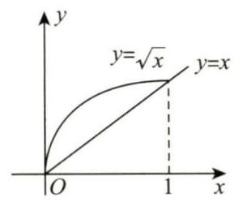

图 10-9

在例 10.8 中, 我们用了一种方法求此问题, 这里, 我们再从 “平行截面面积为已知的立体体积” 角度, 提供第二种方法进行求解.

$y = \sqrt{x}$ 与 $y = x$ 交于点 $\left( {0,0}\right) ,\left( {1,1}\right)$ ,如图 10-9 所示,曲线 $y = \sqrt{x}$ 上的点到 $y = x$ 的距离为 $r = \frac{\sqrt{x} - x}{\sqrt{2}}$ ,故垂直于 $x$ 轴的平面截 “该旋转体” 所得的截面面积为 $A\left( x\right) = \sqrt{2}\pi {\left( \frac{\sqrt{x} - x}{\sqrt{2}}\right) }^{2}$ . 因此,旋转体的体积为

$$
V = {\int }_{0}^{1}\sqrt{2}\pi {\left( \frac{\sqrt{x} - x}{\sqrt{2}}\right) }^{2}\mathrm{\;d}x = {\int }_{0}^{1}\frac{\pi }{\sqrt{2}}\left( {x - 2{x}^{\frac{3}{2}} + {x}^{2}}\right) \mathrm{d}x = \frac{\sqrt{2}}{60}\pi .
$$

> 【注】事实上, $V = {\int }_{a}^{b}A\left( x\right) \mathrm{d}x$ 就是 $V = {\int }_{a}^{b}\pi {f}^{2}\left( x\right) \mathrm{d}x$ 的一般化.

## 习题

10.1 双纽线 ${\left( {x}^{2} + {y}^{2}\right) }^{2} = {x}^{2} - {y}^{2}$ 所围成的区域的面积用定积分表示为 ( ).

(A) $2{\int }_{0}^{\frac{\pi }{4}}\cos {2\theta }\mathrm{d}\theta$ (B) $4{\int }_{0}^{\frac{\pi }{4}}\cos {2\theta }\mathrm{d}\theta$ (C) $2{\int }_{0}^{\frac{\pi }{4}}\sqrt{\cos {2\theta }}\mathrm{d}\theta$ (D) $\frac{1}{2}{\int }_{0}^{\frac{\pi }{4}}{\left( \cos 2\theta \right) }^{2}\mathrm{\;d}\theta$

10.2 位于曲线 $y = \frac{1}{\sqrt{1 + {x}^{2}}}\left( {0 \leq x < + \infty }\right)$ 下方, $x$ 轴上方的无界区域绕 $x$ 轴旋转一周所得旋转体的体积为___.

10.3 圆域 ${x}^{2} + {\left( y - b\right) }^{2} \leq {k}^{2}\left( {0 < k < b}\right)$ 绕 $x$ 轴旋转一周所得旋转体的体积 $V =$

10.4 (仅数学一、数学二) 曲线 $x = \frac{1}{4}{y}^{2} - \frac{1}{2}\ln y$ 相应于 $1 \leq y \leq \mathrm{e}$ 的一段弧的长度为

10.5 (仅数学一、数学二) 星形线 $x = {\cos }^{3}t, y = {\sin }^{3}t\left( {0 \leq t \leq {2\pi }}\right)$ 的弧长为___.

10.6 已知曲线 $y = a\sqrt{x}\left( {a > 0}\right)$ 与曲线 $y = \ln \sqrt{x}$ 在点 $\left( {{x}_{0},{y}_{0}}\right)$ 处有公共切线,求:

(1) 常数 $a$ 及切点 $\left( {{x}_{0},{y}_{0}}\right)$ ;

(2) 两曲线与 $x$ 轴围成的平面图形的面积 $S$ .

10.7 设 ${D}_{1}$ 是由抛物线 $y = 2{x}^{2}$ 和直线 $x = a, x = 2$ 及 $y = 0$ 所围成的平面区域, ${D}_{2}$ 是由抛物线 $y = 2{x}^{2}$ 和直线 $y = 0, x = a$ 所围成的平面区域,其中 $0 < a < 2$ .

(1) 求 ${D}_{1}$ 绕 $x$ 轴旋转一周而成的旋转体体积 ${V}_{1},{D}_{2}$ 绕 $y$ 轴旋转一周而成的旋转体体积 ${V}_{2}$ ;

(2) 问当 $a$ 为何值时, ${V}_{1} + {V}_{2}$ 取得最大值? 并求此最大值.

10.8 计算由摆线 $\left\{ {\begin{array}{l} x = a\left( {t - \sin t}\right) , \\ y = a\left( {1 - \cos t}\right) \end{array}\left( {a > 0,0 \leq t \leq {2\pi }}\right) }\right.$ 与 $x$ 轴所围平面图形绕 $y$ 轴旋转一周所得旋转体的体积.

10.9 求曲线 $y = 3 - \left| {{x}^{2} - 1}\right|$ 与 $x$ 轴围成的封闭图形绕直线 $y = 3$ 旋转一周所得旋转体的体积.

## 解答

10.1 (A) 解 双纽线的极坐标方程为 ${r}^{2} = \cos {2\theta }$ ,根据对称性,所求面积为

$$
S = 4 \cdot \frac{1}{2}{\int }_{0}^{\frac{\pi }{4}}{r}^{2}\mathrm{\;d}\theta = 2{\int }_{0}^{\frac{\pi }{4}}\cos {2\theta }\mathrm{d}\theta .
$$

故选 (A).

${10.2}\frac{{\pi }^{2}}{2}$ 解 所求体积为

$$
{\int }_{0}^{+\infty }\pi {\left( \frac{1}{\sqrt{1 + {x}^{2}}}\right) }^{2}\mathrm{\;d}x = \mathop{\lim }\limits_{{b \rightarrow + \infty }}\pi {\int }_{0}^{b}\frac{1}{1 + {x}^{2}}\mathrm{\;d}x = {\left. \pi \mathop{\lim }\limits_{{b \rightarrow + \infty }}\arctan x\right| }_{0}^{b} = \frac{{\pi }^{2}}{2}.
$$

10.3 $2{\pi }^{2}{k}^{2}b$ 解 如图 10-10 所示,上半圆周为 ${y}_{2} = b + \sqrt{{k}^{2} - {x}^{2}}$ ,下半圆周为 ${y}_{1} = b - \sqrt{{k}^{2} - {x}^{2}}$ . 其体积微元为

$$
\mathrm{d}V = \left( {\pi {y}_{2}^{2} - \pi {y}_{1}^{2}}\right) \mathrm{d}x
$$

$$
= \pi \left\lbrack {{\left( b + \sqrt{{k}^{2} - {x}^{2}}\right) }^{2} - {\left( b - \sqrt{{k}^{2} - {x}^{2}}\right) }^{2}}\right\rbrack \mathrm{d}x
$$

$$
= {4\pi b}\sqrt{{k}^{2} - {x}^{2}}\mathrm{\;d}x,
$$

则所求旋转体的体积为

$$
V = {4\pi b}{\int }_{-k}^{k}\sqrt{{k}^{2} - {x}^{2}}\mathrm{\;d}x
$$

$$
= {8\pi b}{\int }_{0}^{k}\sqrt{{k}^{2} - {x}^{2}}\mathrm{\;d}x
$$

$$
= {8\pi b} \cdot \frac{\pi {k}^{2}}{4} = 2{\pi }^{2}{k}^{2}b.
$$

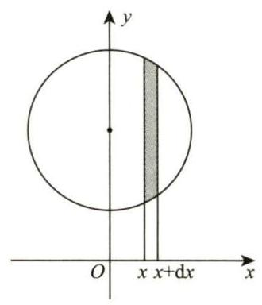

图 10-10

> 【注】采用对 $y$ 积分,即取微元 $\left\lbrack {y, y + \mathrm{d}y}\right\rbrack$ 亦可算出 $V$ .

${10.4}\frac{1}{4}\left( {{\mathrm{e}}^{2} + 1}\right)$ 解 以 $y$ 作为参数,则

$$
\mathrm{d}s = \sqrt{{\left( \frac{\mathrm{d}x}{\mathrm{\;d}y}\right) }^{2} + 1}\mathrm{\;d}y = \sqrt{{\left( \frac{y}{2} - \frac{1}{2y}\right) }^{2} + 1}\mathrm{\;d}y = \frac{1}{2}\left( {y + \frac{1}{y}}\right) \mathrm{d}y,
$$

故弧长

$$
s = {\int }_{1}^{\mathrm{e}}\frac{1}{2}\left( {y + \frac{1}{y}}\right) \mathrm{d}y = \frac{1}{4}\left( {{\mathrm{e}}^{2} + 1}\right) .
$$

10.5 6 解 如图 10-11 所示,曲线具有对称性,我们只需计算在第一象限的弧段,即 $t \in \left\lbrack {0,\frac{\pi }{2}}\right\rbrack$ 对应的部分弧长. 故

$$
s = 4{\int }_{0}^{\frac{\pi }{2}}\sqrt{{\left\lbrack {x}^{\prime }\left( t\right) \right\rbrack }^{2} + {\left\lbrack {y}^{\prime }\left( t\right) \right\rbrack }^{2}}\mathrm{\;d}t
$$

$$
= 4{\int }_{0}^{\frac{\pi }{2}}\sqrt{{\left( -3{\cos }^{2}t\sin t\right) }^{2} + {\left( 3{\sin }^{2}t\cos t\right) }^{2}}\mathrm{\;d}t
$$

$$
= 4{\int }_{0}^{\frac{\pi }{2}}3\left| {\sin t\cos t}\right| \mathrm{d}t = {12}{\int }_{0}^{\frac{\pi }{2}}\sin t\cos t\mathrm{\;d}t = 6.
$$

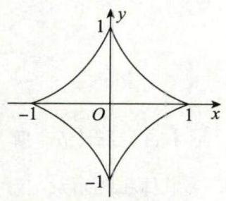

图 10-11

10.6 分析 利用两条曲线都经过点 $\left( {{x}_{0},{y}_{0}}\right)$ 及两条曲线在点 $\left( {{x}_{0},{y}_{0}}\right)$ 处有公共切线可列出三个方程,从而可解出常数 $a,{x}_{0},{y}_{0}$ ,然后可求出平面图形的面积.

解 (1) 由题设条件可得

$$
\left\{ \begin{array}{l} {y}_{0} = a\sqrt{{x}_{0}}, \\ {y}_{0} = \ln \sqrt{{x}_{0}}, \\ \frac{a}{2\sqrt{{x}_{0}}} = \frac{1}{2{x}_{0}}, \end{array}\right.
$$

解此方程组可得 $a = \frac{1}{\mathrm{e}},{x}_{0} = {\mathrm{e}}^{2},{y}_{0} = 1$ ,于是切点为 $\left( {{\mathrm{e}}^{2},1}\right)$ .

(2) 方法一 画出曲线 $y = \frac{1}{\mathrm{e}}\sqrt{x}$ 与曲线 $y = \ln \sqrt{x}$ 的图形,则两曲线与 $x$ 轴围成的平面图形 (见图 10-12)

的面积

$$
S = {\int }_{0}^{1}\left( {{\mathrm{e}}^{2y} - {\mathrm{e}}^{2}{y}^{2}}\right) \mathrm{d}y = \frac{1}{6}{\mathrm{e}}^{2} - \frac{1}{2}.
$$

方法二

$$
S = {\int }_{0}^{1}\frac{1}{\mathrm{e}}\sqrt{x}\mathrm{\;d}x + {\int }_{1}^{{\mathrm{e}}^{2}}\left( {\frac{1}{\mathrm{e}}\sqrt{x} - \ln \sqrt{x}}\right) \mathrm{d}x = \frac{1}{6}{\mathrm{e}}^{2} - \frac{1}{2}.
$$

方法三

$$
S = {\int }_{0}^{{\mathrm{e}}^{2}}\frac{1}{\mathrm{e}}\sqrt{x}\mathrm{\;d}x - {\int }_{1}^{{\mathrm{e}}^{2}}\ln \sqrt{x}\mathrm{\;d}x = \frac{1}{6}{\mathrm{e}}^{2} - \frac{1}{2}.
$$

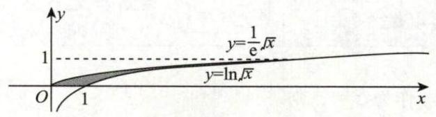

图 10-12

10.7 解 (1) 由题意得,

$$
{V}_{1} = \pi {\int }_{a}^{2}{\left( 2{x}^{2}\right) }^{2}\mathrm{\;d}x = \frac{4}{5}\pi \left( {{32} - {a}^{5}}\right) ,
$$

$$
{V}_{2} = \pi {a}^{2} \cdot 2{a}^{2} - \pi {\int }_{0}^{2{a}^{2}}\frac{y}{2}\mathrm{\;d}y = \pi {a}^{4}.
$$

(2) 由 (1) 得,

$$
V = {V}_{1} + {V}_{2} = \frac{4}{5}\pi \left( {{32} - {a}^{5}}\right) + \pi {a}^{4}.
$$

令

$$
{V}^{\prime } = {4\pi }{a}^{3}\left( {1 - a}\right) = 0,
$$

得区间 $\left( {0,2}\right)$ 内唯一的驻点 $a = 1$ ,且 ${V}^{\prime \prime }\left( 1\right) = - {4\pi } < 0$ ,因此 $a = 1$ 是极大值点,即最大值点,此时

$$
{V}_{\max } = \frac{129}{5}\pi
$$

10.8 解 作平面图形如图 10-13 所示.

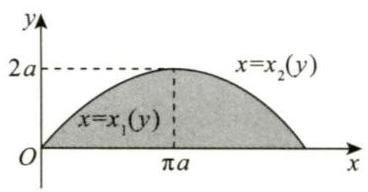

图 10-13

方法一 平面图形绕 $y$ 轴旋转一周所得旋转体体积为

$$
{V}_{y} = \pi \left\lbrack {{\int }_{0}^{2a}{x}_{2}^{2}\left( y\right) \mathrm{d}y - {\int }_{0}^{2a}{x}_{1}^{2}\left( y\right) \mathrm{d}y}\right\rbrack
$$

$$
= \pi \left\lbrack {{\int }_{2\pi }^{\pi }{a}^{2}{\left( t - \sin t\right) }^{2}a\sin t\mathrm{\;d}t - {\int }_{0}^{\pi }{a}^{2}{\left( t - \sin t\right) }^{2}a\sin t\mathrm{\;d}t}\right\rbrack
$$

$$
= \pi {a}^{3}\left\lbrack {-{\int }_{\pi }^{2\pi }{\left( t - \sin t\right) }^{2}\sin t\mathrm{\;d}t - {\int }_{0}^{\pi }{\left( t - \sin t\right) }^{2}\sin t\mathrm{\;d}t}\right\rbrack
$$

$$
= - \pi {a}^{3}{\int }_{0}^{2\pi }{\left( t - \sin t\right) }^{2}\sin t\mathrm{\;d}t,
$$

其中

$$
{\int }_{0}^{2\pi }{\left( t - \sin t\right) }^{2}\sin t\mathrm{\;d}t = {\int }_{0}^{2\pi }\left( {{t}^{2}\sin t + {\sin }^{3}t - {2t}{\sin }^{2}t}\right) \mathrm{d}t = {\int }_{0}^{2\pi }{t}^{2}\sin t\mathrm{\;d}t - {\int }_{0}^{2\pi }{2t}{\sin }^{2}t\mathrm{\;d}t.
$$

因为

$$
{\int }_{0}^{2\pi }{t}^{2}\sin t\mathrm{\;d}t = - {\left. {t}^{2}\cos t\right| }_{0}^{2\pi } + {\int }_{0}^{2\pi }{2t}\cos t\mathrm{\;d}t
$$

$$
= - {\left. 4{\pi }^{2} + 2t\sin t\right| }_{0}^{2\pi } - {\int }_{0}^{2\pi }2\sin t\mathrm{\;d}t = - 4{\pi }^{2},
$$

$$
{\int }_{0}^{2\pi }{2t}{\sin }^{2}t\mathrm{\;d}t = {\int }_{0}^{2\pi }{2t}\frac{1 - \cos {2t}}{2}\mathrm{\;d}t = {\int }_{0}^{2\pi }\left( {t - t\cos {2t}}\right) \mathrm{d}t
$$

$$
= {\left. \left( \frac{1}{2}{t}^{2} - \frac{t\sin {2t}}{2}\right) \right| }_{0}^{2\pi } + {\int }_{0}^{2\pi }\frac{\sin {2t}}{2}\mathrm{\;d}t
$$

$$
= {\left. 2{\pi }^{2} - \frac{\cos {2t}}{4}\right| }_{0}^{2\pi }
$$

$$
= 2{\pi }^{2}
$$

所以

$$
{\int }_{0}^{2\pi }{\left( t - \sin t\right) }^{2}\sin t\mathrm{\;d}t = - 4{\pi }^{2} - 2{\pi }^{2} = - 6{\pi }^{2},
$$

则

$$
{V}_{y} = - \pi {a}^{3} \cdot \left( {-6{\pi }^{2}}\right) = 6{\pi }^{3}{a}^{3}.
$$

方法二 平面图形绕 $y$ 轴旋转一周所得旋转体的体积为

$$
{V}_{y} = {2\pi }{\int }_{0}^{2\pi a}{xy}\left( x\right) \mathrm{d}x
$$

$$
= {2\pi }{\int }_{0}^{2\pi }a\left( {t - \sin t}\right) a\left( {1 - \cos t}\right) a\left( {1 - \cos t}\right) \mathrm{d}t
$$

$$
= {2\pi }{a}^{3}{\int }_{0}^{2\pi }\left( {t - {2t}\cos t + t{\cos }^{2}t - \sin t + 2\sin t\cos t - \sin t{\cos }^{2}t}\right) \mathrm{d}t
$$

$$
= 6{\pi }^{3}{a}^{3}\text{.}
$$

10.9 解 作出图形如图 10-14 所示. $\overset{⏜}{AB}$ 的方程为 $y = {x}^{2} + 2\left( {0 \leq x \leq 1}\right) ,\overset{⏜}{BC}$ 的方程为 $y = 4 - {x}^{2}\left( {1 \leq x \leq 2}\right)$ .

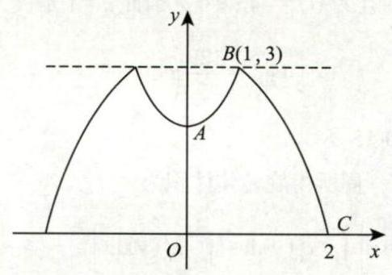

图 10-14

设旋转体在区间 $\left\lbrack {0,1}\right\rbrack$ 上的体积为 ${V}_{1}$ ,在区间 $\left\lbrack {1,2}\right\rbrack$ 上的体积为 ${V}_{2}$ ,则它们的体积微元分别为

$$
\mathrm{d}{V}_{1} = \pi \left\{ {{3}^{2} - {\left\lbrack 3 - \left( {x}^{2} + 2\right) \right\rbrack }^{2}}\right\} \mathrm{d}x = \pi \left( {8 + 2{x}^{2} - {x}^{4}}\right) \mathrm{d}x,
$$

$$
\mathrm{d}{V}_{2} = \pi \left\{ {{3}^{2} - {\left\lbrack 3 - \left( 4 - {x}^{2}\right) \right\rbrack }^{2}}\right\} \mathrm{d}x = \pi \left( {8 + 2{x}^{2} - {x}^{4}}\right) \mathrm{d}x.
$$

由对称性得

$$
V = 2\left( {{V}_{1} + {V}_{2}}\right) = {2\pi }{\int }_{0}^{1}\left( {8 + 2{x}^{2} - {x}^{4}}\right) \mathrm{d}x + {2\pi }{\int }_{1}^{2}\left( {8 + 2{x}^{2} - {x}^{4}}\right) \mathrm{d}x
$$

$$
= {2\pi }{\int }_{0}^{2}\left( {8 + 2{x}^{2} - {x}^{4}}\right) \mathrm{d}x = \frac{448}{15}\pi .
$$
