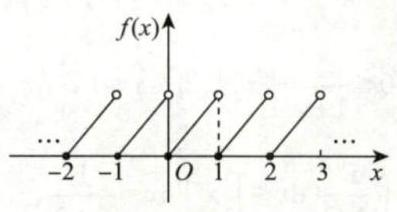

# 第11讲 一元函数积分学的应用（二）积分等式与积分不等式

积分等式问题主要涉及积分形式的中值定理 (见例 11.1, 例 11.2), 用夹逼准则求一类积分的极限 (见例 11.3 ~ 11.5 ) 与证明某些特殊的积分等式 [见例 11.6(1)]; 积分不等式问题主要涉及积分形式的不等式证明, 可用函数的单调性 (见例 11.7)、拉格朗日中值定理 (见例 11.8)、泰勒公式 (见例 11.9)、积分法 (见例 11.10) 与牛顿 - 莱布尼茨公式 (见例 11.11) 来解决.

## 一、积分等式

### 1. 用中值定理

例 11.1 (1) 设 $f\left( x\right), g\left( x\right)$ 在 $\left\lbrack {a, b}\right\rbrack$ 上连续,且 $g\left( x\right)$ 在 $\left\lbrack {a, b}\right\rbrack$ 上不变号,证明: 存在 $\xi \in \left( {a, b}\right)$ ,使得

$$
{\int }_{a}^{b}f\left( x\right) g\left( x\right) \mathrm{d}x = f\left( \xi \right) {\int }_{a}^{b}g\left( x\right) \mathrm{d}x;
$$

(2) 设 $f\left( x\right)$ 在 $\left\lbrack {1,2}\right\rbrack$ 上连续,计算 $\mathop{\lim }\limits_{{n \rightarrow \infty }}{\int }_{1}^{2}f\left( x\right) {\mathrm{e}}^{-{x}^{n}}\mathrm{\;d}x$ .

(1) 证明 若 $g\left( x\right) \equiv 0$ ,结论显然成立;

若 $g\left( x\right) ≢ 0$ ,由于不变号,不妨设 $g\left( x\right) > 0$ . 令

$$
F\left( x\right) = {\int }_{a}^{x}f\left( t\right) g\left( t\right) \mathrm{d}t, G\left( x\right) = {\int }_{a}^{x}g\left( t\right) \mathrm{d}t,
$$

在 $\left\lbrack {a, b}\right\rbrack$ 上应用柯西中值定理,有 $\frac{F\left( b\right) - F\left( a\right) }{G\left( b\right) - G\left( a\right) } = \frac{{F}^{\prime }\left( \xi \right) }{{G}^{\prime }\left( \xi \right) }$ ,即

$$
\frac{{\int }_{a}^{b}f\left( x\right) g\left( x\right) \mathrm{d}x - 0}{{\int }_{a}^{b}g\left( x\right) \mathrm{d}x - 0} = \frac{f\left( \xi \right) g\left( \xi \right) }{g\left( \xi \right) },
$$

$$
{\int }_{a}^{b}f\left( x\right) g\left( x\right) \mathrm{d}x = f\left( \xi \right) {\int }_{a}^{b}g\left( x\right) \mathrm{d}x,\xi \in \left( {a, b}\right) ,
$$

其中 ${\int }_{a}^{b}g\left( x\right) \mathrm{d}x > 0$ . 同理可得 $g\left( x\right) < 0$ 时成立. 得证.

(2) 解 由 (1) 知, ${\int }_{1}^{2}f\left( x\right) {\mathrm{e}}^{-{x}^{n}}\mathrm{\;d}x = f\left( {\xi }_{n}\right) {\int }_{1}^{2}{\mathrm{e}}^{-{x}^{n}}\mathrm{\;d}x,1 < {\xi }_{n} < 2$ . 因 $f\left( x\right)$ 在 $\left\lbrack {1,2}\right\rbrack$ 上连续,则 $f\left( {\xi }_{n}\right)$ 有界;

又在 $\left( {1,2}\right)$ 内, ${\mathrm{e}}^{{x}^{n}} > {x}^{n} + 1 > 0$ ,即 $\frac{1}{{\mathrm{e}}^{{x}^{n}}} < \frac{1}{{x}^{n} + 1} < \frac{1}{{x}^{n}}$ .

于是

$$
0 < {\int }_{1}^{2}{\mathrm{e}}^{-{x}^{n}}\mathrm{\;d}x < {\int }_{1}^{2}{x}^{-n}\mathrm{\;d}x = {\left. \frac{1}{1 - n}{x}^{1 - n}\right| }_{1}^{2} = \frac{1}{1 - n}\left( {{2}^{1 - n} - 1}\right) ,
$$

$$
\mathop{\lim }\limits_{{n \rightarrow \infty }}\frac{1}{1 - n}\left( {{2}^{1 - n} - 1}\right) = 0
$$

由夹逼准则得 $\mathop{\lim }\limits_{{n \rightarrow \infty }}{\int }_{1}^{2}{\mathrm{e}}^{-{x}^{n}}\mathrm{\;d}x = 0$ . 故 $\mathop{\lim }\limits_{{n \rightarrow \infty }}{\int }_{1}^{2}f\left( x\right) {\mathrm{e}}^{-{x}^{n}}\mathrm{\;d}x = 0$ .

---

【注】(1) 由于 $\xi \in \left( {a, b}\right) \subset \left\lbrack {a, b}\right\rbrack$ ,故闭区间上结论亦成立,即设 $f\left( x\right), g\left( x\right)$ 在 $\left\lbrack {a, b}\right\rbrack$ 上连续且 $g\left( x\right)$ 不变号,则至少存在一点 $\xi \in \left\lbrack {a, b}\right\rbrack$ ,使得 ${\int }_{a}^{b}f\left( x\right) g\left( x\right) \mathrm{d}x = f\left( \xi \right) {\int }_{a}^{b}g\left( x\right) \mathrm{d}x$ .

(2) 对于 ${\int }_{1}^{2}f\left( x\right) {\mathrm{e}}^{-{x}^{n}}\mathrm{\;d}x$ ,虽然上下限为常数,但被积函数 $f\left( x\right) {\mathrm{e}}^{-{x}^{n}}$ 与 $n$ 有关,故中值 ${\xi }_{n}$ 与 $n$ 有关;

同理,对于 ${\int }_{1}^{2}{\mathrm{e}}^{-{x}^{n}}$ ,若写成 ${\int }_{1}^{2}{\mathrm{e}}^{-{x}^{n}}\mathrm{\;d}x = {\mathrm{e}}^{-{\eta }_{n}^{n}},{\eta }_{n} \in \left( {1,2}\right) ,{\eta }_{n}$ 亦与 $n$ 有关,考生需注意,此时不能用 $\mathop{\lim }\limits_{{n \rightarrow \infty }}{\mathrm{e}}^{-{\eta }_{n}^{n}} = 0$

---

例 11.2 设 $f\left( x\right)$ 在 $\left\lbrack {0,\frac{\pi }{2}}\right\rbrack$ 上有二阶导数,且 $f\left( 0\right) = 2, f\left( \frac{\pi }{2}\right) = 1,{\int }_{0}^{\frac{\pi }{2}}f\left( x\right) {\mathrm{e}}^{\sin x}\cos x\mathrm{\;d}x = 2\left( {\mathrm{e} - 1}\right)$ . 证明: 存在 $\xi \in \left( {0,\frac{\pi }{2}}\right)$ ,使 ${f}^{\prime \prime }\left( \xi \right) < 0$ .

证明 由推广的积分中值定理知,存在 $\eta \in \left( {0,\frac{\pi }{2}}\right)$ ,使得 $f\left( \eta \right) {\int }_{0}^{\frac{\pi }{2}}{\mathrm{e}}^{\sin x}\cos x\mathrm{\;d}x = 2\left( {\mathrm{e} - 1}\right)$ .

又 ${\int }_{0}^{\frac{\pi }{2}}{\mathrm{e}}^{\sin x}\cos x\mathrm{\;d}x = {\left. {\mathrm{e}}^{\sin x}\right| }_{0}^{\frac{\pi }{2}} = \mathrm{e} - 1$ ,于是 $f\left( \eta \right) \cdot \left( {\mathrm{e} - 1}\right) = 2\left( {\mathrm{e} - 1}\right)$ ,即存在 $\eta \in \left( {0,\frac{\pi }{2}}\right)$ ,使得 $f\left( \eta \right) = 2$ .

因 $f\left( 0\right) = 2, f\left( \eta \right) = 2, f\left( \frac{\pi }{2}\right) = 1$ ,由罗尔定理知,存在 ${\xi }_{1} \in \left( {0,\eta }\right)$ ,使得 ${f}^{\prime }\left( {\xi }_{1}\right) = 0$ ,又由拉格朗日中值定理知,存在 ${\xi }_{2} \in \left( {\eta ,\frac{\pi }{2}}\right)$ ,使得

$$
{f}^{\prime }\left( {\xi }_{2}\right) = \frac{f\left( \frac{\pi }{2}\right) - f\left( \eta \right) }{\frac{\pi }{2} - \eta } = \frac{1 - 2}{\frac{\pi }{2} - \eta } < 0,
$$

再由拉格朗日中值定理知,存在 $\xi \in \left( {{\xi }_{1},{\xi }_{2}}\right) \subset \left( {0,\frac{\pi }{2}}\right)$ ,使得 ${f}^{\prime \prime }\left( \xi \right) = \frac{{f}^{\prime }\left( {\xi }_{2}\right) - {f}^{\prime }\left( {\xi }_{1}\right) }{{\xi }_{2} - {\xi }_{1}} < 0$ .

### 2. 用夹逼准则

例 11.3 $\mathop{\lim }\limits_{{n \rightarrow \infty }}{\int }_{0}^{1}\left( {n + 1}\right) {x}^{n}\ln \left( {1 + x}\right) \mathrm{d}x = \left( \;\right)$ .

(A) $\ln 2$ (B) 1

(C) ${\mathrm{e}}^{2}$ (D) $+ \infty$

解 应选 (A).

$$
{\int }_{0}^{1}\left( {n + 1}\right) {x}^{n}\ln \left( {1 + x}\right) \mathrm{d}x = {\int }_{0}^{1}\ln \left( {1 + x}\right) \mathrm{d}\left( {x}^{n + 1}\right)
$$

$$
= {\left. {x}^{n + 1}\ln \left( 1 + x\right) \right| }_{0}^{1} - {\int }_{0}^{1}\frac{{x}^{n + 1}}{1 + x}\mathrm{\;d}x
$$

$$
= \ln 2 - {\int }_{0}^{1}\frac{{x}^{n + 1}}{1 + x}\mathrm{\;d}x
$$

对于 $\mathop{\lim }\limits_{{n \rightarrow \infty }}{\int }_{0}^{1}\frac{{x}^{n + 1}}{1 + x}\mathrm{\;d}x$ ,利用放缩法,由于 $0 \leq \frac{{x}^{n + 1}}{1 + x} \leq {x}^{n + 1},0 \leq x \leq 1$ ,故

$$
0 \leq {\int }_{0}^{1}\frac{{x}^{n + 1}}{1 + x}\mathrm{\;d}x \leq {\int }_{0}^{1}{x}^{n + 1}\mathrm{\;d}x = \frac{1}{n + 2},
$$

当 $n \rightarrow \infty$ 时,由夹逼准则,有 $\mathop{\lim }\limits_{{n \rightarrow \infty }}{\int }_{0}^{1}\frac{{x}^{n + 1}}{1 + x}\mathrm{\;d}x = 0$ . 于是原式 $= \ln 2$ .

例 11.4 (1) 比较 ${\int }_{0}^{1}\left| {\ln t}\right| {\left\lbrack \ln \left( 1 + t\right) \right\rbrack }^{n}\mathrm{\;d}t$ 与 ${\int }_{0}^{1}{t}^{n}\left| {\ln t}\right| \mathrm{d}t\left( {n = 1,2,\cdots }\right)$ 的大小,说明理由;

(2) 记 ${u}_{n} = {\int }_{0}^{1}\left| {\ln t}\right| {\left\lbrack \ln \left( 1 + t\right) \right\rbrack }^{n}\mathrm{\;d}t\left( {n = 1,2,\cdots }\right)$ ,求 $\mathop{\lim }\limits_{{n \rightarrow \infty }}{u}_{n}$ .

解 (1) 当 $0 \leq t \leq 1$ 时, $0 \leq \ln \left( {1 + t}\right) \leq t$ ,所以

$$
0 \leq \left| {\ln t}\right| {\left\lbrack \ln \left( 1 + t\right) \right\rbrack }^{n} \leq {t}^{n}\left| {\ln t}\right|
$$

根据积分的保号性, 得

$$
{\int }_{0}^{1}\left| {\ln t}\right| {\left\lbrack \ln \left( 1 + t\right) \right\rbrack }^{n}\mathrm{\;d}t \leq {\int }_{0}^{1}{t}^{n}\left| {\ln t}\right| \mathrm{d}t.
$$

(2) 由 (1) 知,

$$
0 \leq {u}_{n} = {\int }_{0}^{1}\left| {\ln t}\right| {\left\lbrack \ln \left( 1 + t\right) \right\rbrack }^{n}\mathrm{\;d}t \leq {\int }_{0}^{1}{t}^{n}\left| {\ln t}\right| \mathrm{d}t.
$$

$$
\text{因为}\;{\int }_{0}^{1}{t}^{n}\left| {\ln t}\right| \mathrm{d}t = - {\int }_{0}^{1}{t}^{n}\ln t\mathrm{\;d}t = - {\left. \frac{{t}^{n + 1}}{n + 1}\ln t\right| }_{0}^{1} + \frac{1}{n + 1}{\int }_{0}^{1}{t}^{n}\mathrm{\;d}t = \frac{1}{{\left( n + 1\right) }^{2}}\text{,}
$$

所以 $\mathop{\lim }\limits_{{n \rightarrow \infty }}{\int }_{0}^{1}{t}^{n}\left| {\ln t}\right| \mathrm{d}t = 0$ ,于是由夹逼准则得 $\mathop{\lim }\limits_{{n \rightarrow \infty }}{u}_{n} = 0$ .

---

【注】更为一般的结论: 设 $f\left( x\right)$ 在 $\left\lbrack {0,1}\right\rbrack$ 上连续,则 $\mathop{\lim }\limits_{{n \rightarrow \infty }}{\int }_{0}^{1}{x}^{n}f\left( x\right) \mathrm{d}x = 0$ .

证明 由 $f\left( x\right)$ 在 $\left\lbrack {0,1}\right\rbrack$ 上连续,则 $f\left( x\right)$ 在 $\left\lbrack {0,1}\right\rbrack$ 上有最大值 $M$ 和最小值 $m$ ,即 $m \leq f\left( x\right) \leq M$ ,于是 $m{x}^{n} \leq {x}^{n}f\left( x\right) \leq M{x}^{n}$ . 根据积分的保号性,有 ${\int }_{0}^{1}m{x}^{n}\mathrm{\;d}x \leq {\int }_{0}^{1}{x}^{n}f\left( x\right) \mathrm{d}x \leq {\int }_{0}^{1}M{x}^{n}\mathrm{\;d}x$ ,即 $\frac{m}{n + 1} \leq {\int }_{0}^{1}{x}^{n}f\left( x\right) \mathrm{d}x \leq$

$\frac{M}{n + 1}$ . 根据夹逼准则,有 $\mathop{\lim }\limits_{{n \rightarrow \infty }}{\int }_{0}^{1}{x}^{n}f\left( x\right) \mathrm{d}x = 0$ .

如例 11.4 中所取的 $f\left( x\right) = \left\{ \begin{array}{ll} \left| {\ln x}\right| , & 0 < x \leq 1, \\ 0, & x = 0, \end{array}\right.$ 则有 $\mathop{\lim }\limits_{{n \rightarrow \infty }}{\int }_{0}^{1}{x}^{n}\left| {\ln x}\right| \mathrm{d}x = 0$ .

---

例 11.5 设函数 $f\left( x\right) = x - \left\lbrack x\right\rbrack$ ,其中 $\left\lbrack x\right\rbrack$ 表示不超过 $x$ 的最大整数,则 $\mathop{\lim }\limits_{{x \rightarrow + \infty }}\frac{1}{x}{\int }_{0}^{x}f\left( t\right) \mathrm{d}t =$

解 应填 $\frac{1}{2}$ .

由例 1.13 可知 $f\left( x\right)$ 是周期为 1 的周期函数,其图像如图 11-1 所示.

图 11-1

> ${\int }_{0}^{n}f\left( t\right) \mathrm{d}t = n{\int }_{0}^{1}f\left( t\right) \mathrm{d}t$ ,表示 $n$ 个三角形的面积.每个三角形的面积为 $\frac{1}{2}$ ，故为 $\frac{n}{2}$ .  
> 当 $0 < a < y < b,0 < c < x < d$ 时， 有 $\frac{a}{d} < \frac{y}{x} < \frac{b}{c}$

当 $n \leq x < n + 1$ 时, $\frac{n}{2} = {\int }_{0}^{n}f\left( t\right) \mathrm{d}t \leq {\int }_{0}^{x}f\left( t\right) \mathrm{d}t < {\int }_{0}^{n + 1}f\left( t\right) \mathrm{d}t = \frac{n + 1}{2}$ ,于是

$$
\frac{n}{2\left( {n + 1}\right) } = \left( {\frac{1}{n + 1}{\int }_{0}^{n}f\left( t\right) \mathrm{d}t < \frac{1}{x}{\int }_{0}^{x}f\left( t\right) \mathrm{d}t < \frac{1}{n}{\int }_{0}^{n + 1}f\left( t\right) \mathrm{d}t}\right) = \frac{n + 1}{2n}.
$$

当 $x \rightarrow + \infty$ 时, $n \rightarrow \infty$ ,由夹逼准则,有 $\mathop{\lim }\limits_{{x \rightarrow + \infty }}\frac{1}{x}{\int }_{0}^{x}f\left( t\right) \mathrm{d}t = \frac{1}{2}$ .

### 3. 用积分法

例 11.6 设 $f\left( x\right)$ 的二阶导数 ${f}^{\prime \prime }\left( x\right)$ 在 $\left\lbrack {0,1}\right\rbrack$ 上连续,且 $f\left( 0\right) = f\left( 1\right) = 0$ ,证明:

(1) ${\int }_{0}^{1}f\left( x\right) \mathrm{d}x = \frac{1}{2}{\int }_{0}^{1}x\left( {x - 1}\right) {f}^{\prime \prime }\left( x\right) \mathrm{d}x$ ;

(2) $\left| {{\int }_{0}^{1}f\left( x\right) \mathrm{d}x}\right| \leq \frac{1}{12}\mathop{\max }\limits_{{0 \leq x \leq 1}}\left\{ \left| {{f}^{\prime \prime }\left( x\right) }\right| \right\}$ .

证明 (1) $\frac{1}{2}{\int }_{0}^{1}x\left( {x - 1}\right) {f}^{\prime \prime }\left( x\right) \mathrm{d}x = \frac{1}{2}{\int }_{0}^{1}x\left( {x - 1}\right) \mathrm{d}\left\lbrack {{f}^{\prime }\left( x\right) }\right\rbrack$

$$
= {\left. \frac{1}{2}x\left( x - 1\right) {f}^{\prime }\left( x\right) \right| }_{0}^{1} - \frac{1}{2}{\int }_{0}^{1}{f}^{\prime }\left( x\right) \left( {{2x} - 1}\right) \mathrm{d}x
$$

$$
= - \frac{1}{2}{\int }_{0}^{1}\left( {{2x} - 1}\right) \mathrm{d}\left\lbrack {f\left( x\right) }\right\rbrack
$$

$$
= - {\left. \frac{1}{2}\left( 2x - 1\right) f\left( x\right) \right| }_{0}^{1} + {\int }_{0}^{1}f\left( x\right) \mathrm{d}x,
$$

由条件 $f\left( 0\right) = f\left( 1\right) = 0$ ,知结论成立.

(2) 记 $M = \mathop{\max }\limits_{{0 \leq x \leq 1}}\left\{ \left| {{f}^{\prime \prime }\left( x\right) }\right| \right\}$ ,则由 (1) 有

$$
\left| {{\int }_{0}^{1}f\left( x\right) \mathrm{d}x}\right| \leq \frac{M}{2}{\int }_{0}^{1}x\left( {1 - x}\right) \mathrm{d}x = \frac{M}{2}\left( {\frac{1}{2} - \frac{1}{3}}\right) = \frac{M}{12}.
$$

## 二、积分不等式

### 1. 用函数的单调性

通常的做法: 首先将某一积分限 (通常取上限) 变量化, 然后移项构造辅助函数, 由辅助函数的单调性来证明不等式,此方法多用于所给条件为 “ $f\left( x\right)$ 在 $\left\lbrack {a, b}\right\rbrack$ 上连续” 的情形.

例 11.7 设函数 $f\left( x\right), g\left( x\right)$ 在区间 $\left\lbrack {a, b}\right\rbrack$ 上连续,且 $f\left( x\right)$ 单调增加, $0 \leq g\left( x\right) \leq 1$ . 证明:

(1) $0 \leq {\int }_{a}^{x}g\left( t\right) \mathrm{d}t \leq x - a, x \in \left\lbrack {a, b}\right\rbrack$ ;

(2) ${\int }_{a}^{a + {\int }_{a}^{b}g\left( t\right) \mathrm{d}t}f\left( x\right) \mathrm{d}x \leq {\int }_{a}^{b}f\left( x\right) g\left( x\right) \mathrm{d}x$ .

证明 (1) 因为 $0 \leq g\left( x\right) \leq 1$ ,所以当 $x \in \left\lbrack {a, b}\right\rbrack$ 时,有 ${\int }_{a}^{x}0\mathrm{\;d}t \leq {\int }_{a}^{x}g\left( t\right) \mathrm{d}t \leq {\int }_{a}^{x}1\mathrm{\;d}t$ ,即

$$
0 \leq {\int }_{a}^{x}g\left( t\right) \mathrm{d}t \leq x - a.
$$

(2) 令 $F\left( x\right) = {\int }_{a}^{a + {\int }_{a}^{x}g\left( u\right) \mathrm{d}u}f\left( t\right) \mathrm{d}t - {\int }_{a}^{x}f\left( t\right) g\left( t\right) \mathrm{d}t, x \in \left\lbrack {a, b}\right\rbrack$ .

因为 $f\left( x\right), g\left( x\right)$ 在区间 $\left\lbrack {a, b}\right\rbrack$ 上连续,所以 $F\left( x\right)$ 在区间 $\left\lbrack {a, b}\right\rbrack$ 上可导,且

$$
{F}^{\prime }\left( x\right) = \left\{ {f\left\lbrack {a + {\int }_{a}^{x}g\left( u\right) \mathrm{d}u}\right\rbrack - f\left( x\right) }\right\} g\left( x\right) .
$$

由 (1) 知, $a + {\int }_{a}^{x}g\left( u\right) \mathrm{d}u \leq x, x \in \left\lbrack {a, b}\right\rbrack$ . 又因为 $f\left( x\right)$ 单调增加,且 $g\left( x\right) \geq 0$ ,所以 ${F}^{\prime }\left( x\right) \leq 0$ ,从而 $F\left( x\right)$ 在区间 $\left\lbrack {a, b}\right\rbrack$ 上单调减少.

又 $F\left( a\right) = 0$ ,故 $F\left( b\right) \leq 0$ ,即 ${\int }_{a}^{a + {\int }_{a}^{b}g\left( t\right) \mathrm{d}t}f\left( x\right) \mathrm{d}x \leq {\int }_{a}^{b}f\left( x\right) g\left( x\right) \mathrm{d}x$ .

### 2. 用拉格朗日中值定理

此方法多用于所给条件为 “ $f\left( x\right)$ 一阶可导” 且某一端点值较简单 (甚至为 0 ) 的题目.

例 11.8 设 $f\left( x\right)$ 在 $\left\lbrack {0,1}\right\rbrack$ 上具有一阶连续导数,且 $f\left( 0\right) = f\left( 1\right) = 0$ . 记 $M = \mathop{\max }\limits_{{x \in \left\lbrack {0,1}\right\rbrack }}\left\{ \left| {{f}^{\prime }\left( x\right) }\right| \right\}$ . 证明: $\;\left| {{\int }_{0}^{1}f\left( x\right) \mathrm{d}x}\right| \leq \frac{1}{4}M$ .

证明

> 见到 $f,{f}^{\prime }$ ,想拉格朗日中值定理

将大区间 $\left\lbrack {0,1}\right\rbrack$ 分成两个小区间 $\left\lbrack {0, x}\right\rbrack$ 和 $\left\lbrack {x,1}\right\rbrack$ .

在 $\left\lbrack {0, x}\right\rbrack$ 上对 $f\left( x\right)$ 使用拉格朗日中值定理,得 $f\left( x\right) - f\left( 0\right) = f\left( x\right) = {f}^{\prime }\left( {\xi }_{1}\right) x$ ,其中 ${\xi }_{1} \in \left( {0, x}\right)$ ,于是

$$
\left| {f\left( x\right) }\right| = \left| {{f}^{\prime }\left( {\xi }_{1}\right) }\right| x.
$$

在 $\left\lbrack {x,1}\right\rbrack$ 上对 $f\left( x\right)$ 使用拉格朗日中值定理,得 $f\left( 1\right) - f\left( x\right) = - f\left( x\right) = {f}^{\prime }\left( {\xi }_{2}\right) \left( {1 - x}\right)$ ,其中 ${\xi }_{2} \in \left( {x,1}\right)$ ,

于是

$$
\left| {f\left( x\right) }\right| = \left| {{f}^{\prime }\left( {\xi }_{2}\right) }\right| \left( {1 - x}\right) .
$$

当 $x \in \left\lbrack {0,1}\right\rbrack$ 时,因为 $M = \max \left\{ \left| {{f}^{\prime }\left( x\right) }\right| \right\}$ ,所以

$$
\left| {f\left( x\right) }\right| \leq {Mx},\left| {f\left( x\right) }\right| \leq M\left( {1 - x}\right) ,
$$

于是

$$
\left| {{\int }_{0}^{1}f\left( x\right) \mathrm{d}x}\right| = \left| {{\int }_{0}^{x}f\left( t\right) \mathrm{d}t + {\int }_{x}^{1}f\left( t\right) \mathrm{d}t}\right|
$$

$$
\leq M{\int }_{0}^{x}t\mathrm{\;d}t + M{\int }_{x}^{1}\left( {1 - t}\right) \mathrm{d}t = M\left\lbrack {\frac{{x}^{2}}{2} + \frac{{\left( 1 - x\right) }^{2}}{2}}\right\rbrack ,
$$

其中, $\frac{{x}^{2}}{2} + \frac{{\left( 1 - x\right) }^{2}}{2} = {x}^{2} - x + \frac{1}{2} = {\left( x - \frac{1}{2}\right) }^{2} + \frac{1}{4} \geq \frac{1}{4}$ ,故得证.

### 3. 用泰勒公式

此方法多用于所给条件为 “ $f\left( x\right)$ 二阶可导” 且题中有简单函数值 (甚至为 0 ) 的题目.

例 11.9 设 $f\left( x\right)$ 在 $\left\lbrack {0,2}\right\rbrack$ 上二阶导数连续,且 $f\left( 1\right) = 0$ . 当 $x \in \left\lbrack {0,2}\right\rbrack$ 时,记 $M = \max \left\{ \left| {{f}^{\prime \prime }\left( x\right) }\right| \right\}$ ,证明: $\left| {{\int }_{0}^{2}f\left( x\right) \mathrm{d}x}\right| \leq \frac{1}{3}M$ .

证明 根据题设,选取点 ${x}_{0} = 1$ 展开成泰勒公式,则

$$
f\left( x\right) = f\left( 1\right) + {f}^{\prime }\left( 1\right) \left( {x - 1}\right) + \frac{{f}^{\prime \prime }\left( \xi \right) }{2}{\left( x - 1\right) }^{2}\text{(}\xi \text{介于}x,1\text{之间),}
$$

$$
{\int }_{0}^{2}f\left( x\right) \mathrm{d}x = {f}^{\prime }\left( 1\right) {\int }_{0}^{2}\left( {x - 1}\right) \mathrm{d}x + {\int }_{0}^{2}\frac{{f}^{\prime \prime }\left( \xi \right) }{2}{\left( x - 1\right) }^{2}\mathrm{\;d}x = \frac{1}{2}{\int }_{0}^{2}{f}^{\prime \prime }\left( \xi \right) {\left( x - 1\right) }^{2}\mathrm{\;d}x,
$$

$$
\left| {{\int }_{0}^{2}f\left( x\right) \mathrm{d}x}\right| \leq \frac{1}{2}{\int }_{0}^{2}\left| {{f}^{\prime \prime }\left( \xi \right) }\right| {\left( x - 1\right) }^{2}\mathrm{\;d}x \leq \frac{1}{2}M{\int }_{0}^{2}{\left( x - 1\right) }^{2}\mathrm{\;d}x = \frac{1}{3}M,
$$

故得证.

### 4. 用积分法

例 11.10 设 $f\left( x\right)$ 在 $\left\lbrack {0,{2\pi }}\right\rbrack$ 上具有一阶连续导数,且 ${f}^{\prime }\left( x\right) \geq 0$ ,证明: 对任意正整数 $n$ 有

$$
\left| {{\int }_{0}^{2\pi }f\left( x\right) \sin {nx}\mathrm{\;d}x}\right| \leq \frac{2}{n}\left\lbrack {f\left( {2\pi }\right) - f\left( 0\right) }\right\rbrack .
$$

证明 $\left| {{\int }_{0}^{2\pi }f\left( x\right) \sin {nx}\mathrm{\;d}x}\right| = \left| {\frac{1}{n}{\int }_{0}^{2\pi }f\left( x\right) \mathrm{d}\left( {\cos {nx}}\right) }\right| = \left| {\frac{1}{n}f\left( x\right) \cos {nx}}\right| {\int }_{0}^{2\pi } - \frac{1}{n}{\int }_{0}^{2\pi }{f}^{\prime }\left( x\right) \cos {nx}\mathrm{\;d}x$

$$
\leq {\left| \frac{1}{n}f\left( x\right) \cos nx\right| }_{0}^{2\pi }\left| {+\frac{1}{n}{\int }_{0}^{2\pi }{f}^{\prime }\left( x\right) \cos {nx}\mathrm{\;d}x}\right|
$$

$$
\leq \frac{1}{n}\left\lbrack {f\left( {2\pi }\right) - f\left( 0\right) }\right\rbrack + \frac{1}{n}{\int }_{0}^{2\pi }\left| {{f}^{\prime }\left( x\right) \cos {nx}}\right| \mathrm{d}x
$$

$$
\leq \frac{1}{n}\left\lbrack {f\left( {2\pi }\right) - f\left( 0\right) }\right\rbrack + \frac{1}{n}{\int }_{0}^{2\pi }{f}^{\prime }\left( x\right) \mathrm{d}x
$$

$$
= \frac{2}{n}\left\lbrack {f\left( {2\pi }\right) - f\left( 0\right) }\right\rbrack \text{.}
$$

### 5. 用牛顿——莱布尼茨公式

例 11.11 设 ${f}^{\prime }\left( x\right)$ 在 $\left\lbrack {a, b}\right\rbrack$ 上连续,且 $f\left( a\right) = f\left( b\right) = 0$ . 证明:

$$
\left| {f\left( x\right) }\right| \leq \frac{1}{2}{\int }_{a}^{b}\left| {{f}^{\prime }\left( x\right) }\right| \mathrm{d}x.
$$

证明 由 $f\left( x\right) = f\left( x\right) - f\left( a\right) = {\int }_{a}^{x}{f}^{\prime }\left( t\right) \mathrm{d}t$ 得

$$
\left| {f\left( x\right) }\right| \leq {\int }_{a}^{x}\left| {{f}^{\prime }\left( t\right) }\right| \mathrm{d}t \tag{①}
$$

由 $f\left( x\right) = f\left( x\right) - f\left( b\right) = {\int }_{b}^{x}{f}^{\prime }\left( t\right) \mathrm{d}t$ 得

$$
\left| {f\left( x\right) }\right| \leq {\int }_{x}^{b}\left| {{f}^{\prime }\left( t\right) }\right| \mathrm{d}t. \tag{②}
$$

式① + 式②,得 $2\left| {f\left( x\right) }\right| \leq {\int }_{a}^{x}\left| {{f}^{\prime }\left( t\right) }\right| \mathrm{d}t + {\int }_{x}^{b}\left| {{f}^{\prime }\left( t\right) }\right| \mathrm{d}t = {\int }_{a}^{b}\left| {{f}^{\prime }\left( t\right) }\right| \mathrm{d}t$ ,即

$$
\left| {f\left( x\right) }\right| \leq \frac{1}{2}{\int }_{a}^{b}\left| {{f}^{\prime }\left( x\right) }\right| \mathrm{d}x.
$$

## 习题

11.1 若函数 $\varphi \left( x\right)$ 具有二阶导数,且满足 $\varphi \left( 2\right) > \varphi \left( 1\right) ,\varphi \left( 2\right) > {\int }_{2}^{3}\varphi \left( x\right) \mathrm{d}x$ ,证明: 至少存在一点 $\xi \in$ $\left( {1,3}\right)$ ,使得 ${\varphi }^{\prime \prime }\left( \xi \right) < 0$ .

11.2 设 $\varphi \left( x\right)$ 是可微函数 $f\left( x\right)$ 的反函数,且 $f\left( 1\right) = 0$ ,证明:

$$
{\int }_{0}^{1}\left\lbrack {{\int }_{0}^{f\left( x\right) }\varphi \left( t\right) \mathrm{d}t}\right\rbrack \mathrm{d}x = 2{\int }_{0}^{1}{xf}\left( x\right) \mathrm{d}x.
$$

11.3 证明: ${\int }_{0}^{\frac{\pi }{2}}\frac{\cos x}{1 + {x}^{2}}\mathrm{\;d}x \geq {\int }_{0}^{\frac{\pi }{2}}\frac{\sin x}{1 + {x}^{2}}\mathrm{\;d}x$ .

11.4 设 $f\left( x\right)$ 在 $\left\lbrack {a, b}\right\rbrack$ 上连续且严格单调增加,证明:

$$
\left( {a + b}\right) {\int }_{a}^{b}f\left( x\right) \mathrm{d}x < 2{\int }_{a}^{b}{xf}\left( x\right) \mathrm{d}x.
$$

11.5 设 $f\left( x\right)$ 在 $\left\lbrack {0,1}\right\rbrack$ 上连续且单调减少,证明: 当 $0 < \lambda < 1$ 时, ${\int }_{0}^{\lambda }f\left( x\right) \mathrm{d}x \geq \lambda {\int }_{0}^{1}f\left( x\right) \mathrm{d}x$ .

11.6 设 $f\left( x\right)$ 在区间 $\left\lbrack {0,1}\right\rbrack$ 上有二阶导数,且 $f\left( \frac{1}{2}\right) = 1,{f}^{\prime \prime }\left( x\right) > 0$ ,证明: ${\int }_{0}^{1}f\left( x\right) \mathrm{d}x \geq 1$ .

## 解答

11.1 证明 由积分中值定理,可知至少存在一点 $\eta \in \left( {2,3}\right)$ ,使得

$$
{\int }_{2}^{3}\varphi \left( x\right) \mathrm{d}x = \varphi \left( \eta \right) \left( {3 - 2}\right) = \varphi \left( \eta \right) .
$$

对 $\varphi \left( x\right)$ 在 $\left\lbrack {1,2}\right\rbrack$ 和 $\left\lbrack {2,\eta }\right\rbrack$ 上分别应用拉格朗日中值定理,并注意到 $\varphi \left( 1\right) < \varphi \left( 2\right) ,\varphi \left( \eta \right) < \varphi \left( 2\right)$ ,得

$$
{\varphi }^{\prime }\left( {\xi }_{1}\right) = \frac{\varphi \left( 2\right) - \varphi \left( 1\right) }{2 - 1} > 0,1 < {\xi }_{1} < 2,
$$

$$
{\varphi }^{\prime }\left( {\xi }_{2}\right) = \frac{\varphi \left( \eta \right) - \varphi \left( 2\right) }{\eta - 2} < 0,2 < {\xi }_{2} < \eta \leq 3.
$$

在 $\left\lbrack {{\xi }_{1},{\xi }_{2}}\right\rbrack$ 上对导函数 ${\varphi }^{\prime }\left( x\right)$ 应用拉格朗日中值定理,有

$$
{\varphi }^{\prime \prime }\left( \xi \right) = \frac{{\varphi }^{\prime }\left( {\xi }_{2}\right) - {\varphi }^{\prime }\left( {\xi }_{1}\right) }{{\xi }_{2} - {\xi }_{1}} < 0,\xi \in \left( {{\xi }_{1},{\xi }_{2}}\right) \subset \left( {1,3}\right) .
$$

11.2 分析 左端定积分的被积函数为变限积分, 考虑分部积分法.

证明 ${\int }_{0}^{1}\left\lbrack {{\int }_{0}^{f\left( x\right) }\varphi \left( t\right) \mathrm{d}t}\right\rbrack \mathrm{d}x = {\left. x{\int }_{0}^{f\left( x\right) }\varphi \left( t\right) \mathrm{d}t\right| }_{0}^{1} - {\int }_{0}^{1}{x\varphi }\left\lbrack {f\left( x\right) }\right\rbrack \cdot {f}^{\prime }\left( x\right) \mathrm{d}x$

$$
= - {\int }_{0}^{1}{x}^{2} \cdot {f}^{\prime }\left( x\right) \mathrm{d}x = - {\int }_{0}^{1}{x}^{2}\mathrm{\;d}\left\lbrack {f\left( x\right) }\right\rbrack
$$

$$
= - {\left. {x}^{2}f\left( x\right) \right| }_{0}^{1} + 2{\int }_{0}^{1}{xf}\left( x\right) \mathrm{d}x = 2{\int }_{0}^{1}{xf}\left( x\right) \mathrm{d}x.
$$

11.3 证明 要证原不等式成立,只需证 ${\int }_{0}^{\frac{\pi }{2}}\frac{\cos x - \sin x}{1 + {x}^{2}}\mathrm{\;d}x \geq 0$ .

方法一 ${\int }_{0}^{\frac{\pi }{2}}\frac{\cos x - \sin x}{1 + {x}^{2}}\mathrm{\;d}x = {\int }_{0}^{\frac{\pi }{4}}\frac{\cos x - \sin x}{1 + {x}^{2}}\mathrm{\;d}x + {\int }_{\frac{\pi }{4}}^{\frac{\pi }{2}}\frac{\cos x - \sin x}{1 + {x}^{2}}\mathrm{\;d}x$ .

在上式右边第二项积分中,令 $x = \frac{\pi }{2} - t$ ,得

$$
{\int }_{0}^{\frac{\pi }{2}}\frac{\cos x - \sin x}{1 + {x}^{2}}\mathrm{\;d}x = {\int }_{0}^{\frac{\pi }{4}}\frac{\cos x - \sin x}{1 + {x}^{2}}\mathrm{\;d}x + {\int }_{0}^{\frac{\pi }{4}}\frac{\sin t - \cos t}{1 + {\left( \frac{\pi }{2} - t\right) }^{2}}\mathrm{\;d}t
$$

$$
= {\int }_{0}^{\frac{\pi }{4}}\left( {\cos x - \sin x}\right) \left\lbrack {\frac{1}{1 + {x}^{2}} - \frac{1}{1 + {\left( \frac{\pi }{2} - x\right) }^{2}}}\right\rbrack \mathrm{d}x \geq 0,
$$

故原式得证.

方法二

$$
{\int }_{0}^{\frac{\pi }{2}}\frac{\cos x - \sin x}{1 + {x}^{2}}\mathrm{\;d}x
$$

$$
= {\int }_{0}^{\frac{\pi }{4}}\frac{\cos x - \sin x}{1 + {x}^{2}}\mathrm{\;d}x + {\int }_{\frac{\pi }{4}}^{\frac{\pi }{2}}\frac{\cos x - \sin x}{1 + {x}^{2}}\mathrm{\;d}x
$$

$$
= \frac{1}{1 + {\xi }^{2}}{\int }_{0}^{\frac{\pi }{4}}\left( {\cos x - \sin x}\right) \mathrm{d}x + \frac{1}{1 + {\eta }^{2}}{\int }_{\frac{\pi }{4}}^{\frac{\pi }{2}}\left( {\cos x - \sin x}\right) \mathrm{d}x
$$

$$
= \left( {\sqrt{2} - 1}\right) \left( {\frac{1}{1 + {\xi }^{2}} - \frac{1}{1 + {\eta }^{2}}}\right) ,
$$

其中 $0 \leq \xi \leq \frac{\pi }{4},\frac{\pi }{4} \leq \eta \leq \frac{\pi }{2}$ ,从而有

$$
{\int }_{0}^{\frac{\pi }{2}}\frac{\cos x - \sin x}{1 + {x}^{2}}\mathrm{\;d}x \geq 0
$$

故原式得证.

11.4 分析 $\left( {a + b}\right) {\int }_{a}^{b}f\left( x\right) \mathrm{d}x < 2{\int }_{a}^{b}{xf}\left( x\right) \mathrm{d}x \Leftrightarrow \left( {a + b}\right) {\int }_{a}^{b}f\left( x\right) \mathrm{d}x - 2{\int }_{a}^{b}{xf}\left( x\right) \mathrm{d}x < 0$ ,可构造辅助函数,

用单调性证明.

证明 令 $F\left( t\right) = \left( {a + t}\right) {\int }_{a}^{t}f\left( x\right) \mathrm{d}x - 2{\int }_{a}^{t}{xf}\left( x\right) \mathrm{d}x, t \in \left\lbrack {a, b}\right\rbrack$ ,则

$$
{F}^{\prime }\left( t\right) = {\int }_{a}^{t}f\left( x\right) \mathrm{d}x + \left( {a + t}\right) f\left( t\right) - {2tf}\left( t\right) = {\int }_{a}^{t}f\left( x\right) \mathrm{d}x - \left( {t - a}\right) f\left( t\right)
$$

$$
= {\int }_{a}^{t}f\left( x\right) \mathrm{d}x - {\int }_{a}^{t}f\left( t\right) \mathrm{d}x = {\int }_{a}^{t}\left\lbrack {f\left( x\right) - f\left( t\right) }\right\rbrack \mathrm{d}x.
$$

因为 $f\left( x\right)$ 在 $\left\lbrack {a, b}\right\rbrack$ 上严格单调增加,所以 $f\left( x\right) - f\left( t\right) < 0$ ,于是有

$$
{F}^{\prime }\left( t\right) = {\int }_{a}^{t}\left\lbrack {f\left( x\right) - f\left( t\right) }\right\rbrack \mathrm{d}x < 0,
$$

即 $F\left( t\right)$ 严格单调减少,又 $F\left( a\right) = 0$ ,所以 $F\left( b\right) < 0$ ,即

$$
\left( {a + b}\right) {\int }_{a}^{b}f\left( x\right) \mathrm{d}x - 2{\int }_{a}^{b}{xf}\left( x\right) \mathrm{d}x < 0,
$$

即

$$
\left( {a + b}\right) {\int }_{a}^{b}f\left( x\right) \mathrm{d}x < 2{\int }_{a}^{b}{xf}\left( x\right) \mathrm{d}x.
$$

11.5 证明 要证原不等式成立,只需证 $\frac{{\int }_{0}^{\lambda }f\left( x\right) \mathrm{d}x}{\lambda } \geq {\int }_{0}^{1}f\left( x\right) \mathrm{d}x$ .

令 $F\left( t\right) = \frac{{\int }_{0}^{t}f\left( x\right) \mathrm{d}x}{t}$ ,由于 $F\left( \lambda \right) = \frac{{\int }_{0}^{\lambda }f\left( x\right) \mathrm{d}x}{\lambda }, F\left( 1\right) = {\int }_{0}^{1}f\left( x\right) \mathrm{d}x$ ,故只需证当 $\lambda \in \left( {0,1}\right)$ 时,有

$$
F\left( \lambda \right) \geq F\left( 1\right) \text{.} \tag{*}
$$

由 $F\left( t\right)$ 在 $(0,1\rbrack$ 内连续,在 $\left( {0,1}\right)$ 内可导,且

$$
{F}^{\prime }\left( t\right) = \frac{f\left( t\right) t - {\int }_{0}^{t}f\left( x\right) \mathrm{d}x}{{t}^{2}} = \frac{f\left( t\right) t - f\left( c\right) t}{{t}^{2}} = \frac{f\left( t\right) - f\left( c\right) }{t},
$$

其中 $0 \leq c \leq t$ ,知 $f\left( c\right) \geq f\left( t\right)$ ,有 ${F}^{\prime }\left( t\right) \leq 0$ ,知 $F\left( t\right)$ 在 $(0,1\rbrack$ 内单调减少. 又 $0 < \lambda < 1$ ,有 $F\left( \lambda \right) \geq F\left( 1\right)$ ,即 $\left( *\right)$ 式成立, 故原不等式成立.

11.6 证明

$$
f\left( x\right) = f\left( \frac{1}{2}\right) + {f}^{\prime }\left( \frac{1}{2}\right) \left( {x - \frac{1}{2}}\right) + \frac{{f}^{\prime \prime }\left( \xi \right) }{2!}{\left( x - \frac{1}{2}\right) }^{2},
$$

其中 $\xi$ 介于 $x$ 与 $\frac{1}{2}$ 之间. 又由 ${f}^{\prime \prime }\left( x\right) > 0$ ,则 ${f}^{\prime \prime }\left( \xi \right) > 0$ ,于是

$$
f\left( x\right) \geq f\left( \frac{1}{2}\right) + {f}^{\prime }\left( \frac{1}{2}\right) \left( {x - \frac{1}{2}}\right) .
$$

两边在区间 $\left\lbrack {0,1}\right\rbrack$ 上对 $x$ 积分,得

$$
{\int }_{0}^{1}f\left( x\right) \mathrm{d}x \geq {\int }_{0}^{1}\left\lbrack {f\left( \frac{1}{2}\right) + {f}^{\prime }\left( \frac{1}{2}\right) \left( {x - \frac{1}{2}}\right) }\right\rbrack \mathrm{d}x
$$

$$
= f\left( \frac{1}{2}\right) + {f}^{\prime }\left( \frac{1}{2}\right) {\int }_{0}^{1}\left( {x - \frac{1}{2}}\right) \mathrm{d}x = f\left( \frac{1}{2}\right) = 1.
$$
