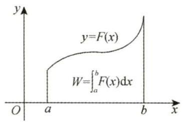
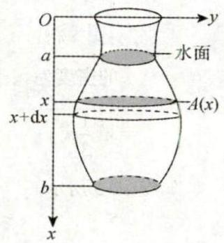
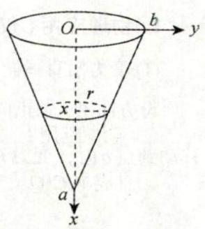
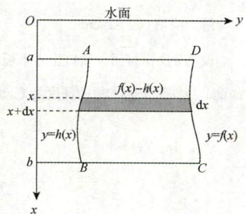
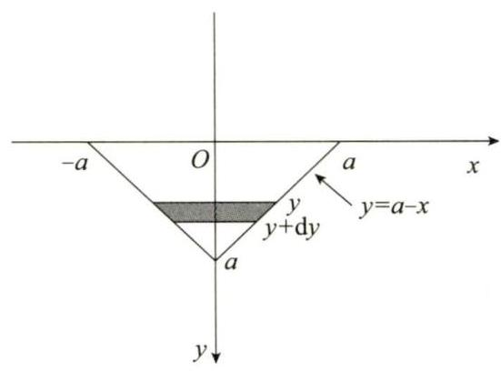
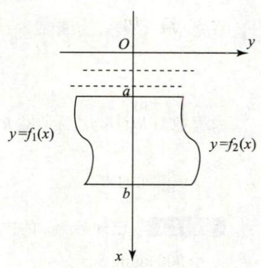
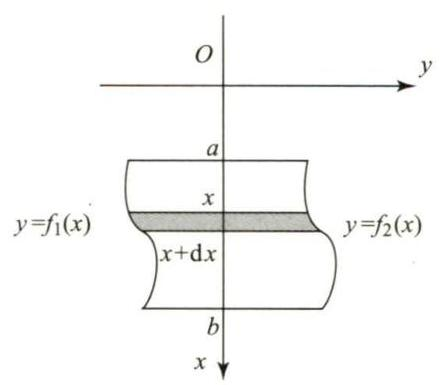
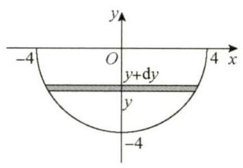

# 第12讲 一元函数积分学的应用（三）物理应用与经济应用

## 1. 物理应用 (仅数学一、数学二)

### (1) 变力沿直线做功

图 12-1

设方向沿 $x$ 轴正向的力函数为 $y = F\left( x\right) \left( {a \leq x \leq b}\right)$ ,则物体沿 $x$ 轴从点 $a$ 移动到点 $b$ 时,变力 $F\left( x\right)$ 所做的功 (见图 12-1) 为

$$
W = {\int }_{a}^{b}F\left( x\right) \mathrm{d}x
$$

功的微元 $\mathrm{d}W = F\left( x\right) \mathrm{d}x$ .

例 12.1 用铁锤将一铁钉击入木板, 设木板对铁钉的阻力与铁钉击入木板的深度成正比, 在击第一次时，将铁钉击入木板 $1\mathrm{\;{cm}}$ . 如果铁锤每次击打做功相等，则第二锤可将铁钉又击入___.

解 应填 $\left( {\sqrt{2} - 1}\right) \mathrm{{cm}}$ .

设第 $n$ 次击打后,铁钉击入木板的深度为 ${x}_{n}\mathrm{\;{cm}}$ ,第 $n$ 次击打时,铁锤所做的功为 ${W}_{n}\left( {n = 1,2}\right)$ ,由题设,当铁钉击入木板的深度为 $x\mathrm{\;{cm}}$ 时,木板对铁钉的阻力的大小为 ${kx}$ ( $k$ 为常数),所以

$$
{W}_{1} = {\int }_{0}^{{x}_{1}}{kx}\mathrm{\;d}x = \frac{k}{2}{x}_{1}^{2},{x}_{1} = 1;
$$

$$
{W}_{2} = {\int }_{{x}_{1}}^{{x}_{2}}{kx}\mathrm{\;d}x = \frac{k}{2}{x}_{2}^{2} - \frac{k}{2}{x}_{1}^{2},
$$

又 ${W}_{2} = {W}_{1}$ ,从而

$$
\frac{k}{2}{x}_{2}^{2} = 2{W}_{1} = k,
$$

于是

$$
{x}_{2} = \sqrt{2}
$$

所以第二锤可将铁钉又击入 $\left( {\sqrt{2} - 1}\right) \mathrm{{cm}}$ .

### (2) 抽水做功

图 12-2

如图 12-2 所示, 将容器中的水全部抽出所做的功为

$$
W = {\rho g}{\int }_{a}^{b}{xA}\left( x\right) \mathrm{d}x,
$$

其中 $\rho$ 为水的密度, $g$ 为重力加速度.

功的微元 $\mathrm{d}W = {\rho gxA}\left( x\right) \mathrm{d}x$ 为位于 $x$ 处厚度为 $\mathrm{d}x$ ,水平截面面积为 $A\left( x\right)$ 的一层水被抽出 (路程为 $x$ ) 所做的功.

求解这类问题的关键是确定 $x$ 处的水平截面面积 $A\left( x\right)$ ,其余的量都是固定的.

例 12.2 有一倒圆锥形容器,高为 $a$ ,上底半径为 $b$ ,装满水. 记水的密度为 $\rho$ ,重力加速度为 $g$ ,则将容器中的水全部从容器顶部抽出所做的功为___.

解 应填 $\frac{1}{12}{\rho g}{a}^{2}{b}^{2}\pi$ .

图 12-3

如图 12-3 所示,建立坐标系. 在 $x$ 处的水平截面的半径 $r$ 满足 $\frac{r}{b} = \frac{a - x}{a}$ ,即

$$
r = \frac{b\left( {a - x}\right) }{a}.
$$

截面面积

$$
A\left( x\right) = \pi {r}^{2} = \pi \cdot {\left\lbrack \frac{b\left( {a - x}\right) }{a}\right\rbrack }^{2} = \frac{{b}^{2}{\left( a - x\right) }^{2}\pi }{{a}^{2}}.
$$

所以将水全部抽出所做的功

$$
W = {\rho g}{\int }_{0}^{a}{xA}\left( x\right) \mathrm{d}x = {\rho g}{\int }_{0}^{a}x\frac{{b}^{2}{\left( a - x\right) }^{2}\pi }{{a}^{2}}\mathrm{\;d}x
$$

$$
= \frac{1}{12}{\rho g}{a}^{2}{b}^{2}\pi
$$

### (3) 静水压力

图 12-4

垂直浸没在水中的平板 ${ABCD}$ (见图 12-4) 的一侧受到的水压力为

$$
P = {\rho g}{\int }_{a}^{b}x\left\lbrack {f\left( x\right) - h\left( x\right) }\right\rbrack \mathrm{d}x,
$$

其中 $\rho$ 为水的密度, $g$ 为重力加速度.

压力微元 $\mathrm{d}P = {\rho gx}\left\lbrack {f\left( x\right) - h\left( x\right) }\right\rbrack \mathrm{d}x$ ,即图中矩形条所受到的压力. $x$ 表示水深, $f\left( x\right) - h\left( x\right)$ 是矩形条的宽度, $\mathrm{d}x$ 是矩形条的高度.

>【注】水压力问题的特点: 压强随水的深度的改变而改变. 求解这类问题的关键是确定水深 $x$ 处的平板的宽度 $f\left( x\right) - h\left( x\right)$ .

例 12.3 斜边长为 ${2a}$ 的等腰直角三角形平板铅直地沉没在水中,且斜边与水面相齐. 记重力加速度为 $g$ ,水的密度为 $\rho$ ,则该平板一侧所受的水压力为___.

解 应填 $\frac{1}{3}{a}^{3}{\rho g}$ .

如图 12-5 所示, 该平板一侧所受的水压力为

$$
P = {\int }_{0}^{a}{2\rho g}\left( {a - y}\right) y\mathrm{\;d}y = {2\rho g}{\int }_{0}^{a}\left( {{ay} - {y}^{2}}\right) \mathrm{d}y = {2\rho g}\left( {\frac{{a}^{3}}{2} - \frac{{a}^{3}}{3}}\right) = \frac{1}{3}{a}^{3}{\rho g}.
$$

图 12-5

## 2. 经济应用 (仅数学三)

①总成本 $C\left( Q\right)$ ,边际成本 ${C}^{\prime }\left( Q\right)$ ,固定成本 ${C}_{0}$ 之间的关系为

$$
C\left( Q\right) = {\int }_{0}^{Q}{C}^{\prime }\left( t\right) \mathrm{d}t + {C}_{0}.
$$

② 总收益 $R\left( Q\right)$ 与边际收益 ${R}^{\prime }\left( Q\right)$ 之间的关系为

$$
R\left( Q\right) = {\int }_{0}^{Q}{R}^{\prime }\left( t\right) \mathrm{d}t
$$

例 12.4 已知某产品的边际成本为 $4 + \frac{x}{4}$ (万元 / 单位),固定成本为 1 万元,产品对价格的需求弹性为 $\frac{p}{8 - p}$ ,产品最大需求量为 8,其中 $x$ 表示产量, $p$ 表示价格,求使产品取最大利润时的产量和价格.

解 由 ${C}^{\prime }\left( x\right) = 4 + \frac{x}{4}, C\left( 0\right) = 1$ ,可得

$$
C\left( x\right) = {\int }_{0}^{x}{C}^{\prime }\left( t\right) \mathrm{d}t + C\left( 0\right) = {4x} + \frac{{x}^{2}}{8} + 1.
$$

又 ${\eta }_{0} = \frac{-p\mathrm{\;d}x}{x\mathrm{\;d}p} = \frac{p}{8 - p}$ (注意: 由经济意义知 $\frac{p}{8 - p} > 0$ ).

$\frac{\mathrm{d}x}{x} = \frac{\mathrm{d}p}{p - 8}$ ,可得 $\ln \left| x\right| = \ln \left| {p - 8}\right| + \ln c$ .

由 $x\left( 0\right) = 8$ 可得 $c = 1$ . 所以 $x = 8 - p, R\left( x\right) = {8x} - {x}^{2}$ . 故

$$
L\left( x\right) = R\left( x\right) - C\left( x\right) = \left( {{8x} - {x}^{2}}\right) - \left( {{4x} + \frac{{x}^{2}}{8} + 1}\right)
$$

$$
= - \frac{9}{8}{x}^{2} + {4x} - 1\text{. }
$$

令 ${L}^{\prime }\left( x\right) = 4 - \frac{9}{4}x = 0$ ,可得 ${x}_{0} = \frac{16}{9}$ .

因为 ${L}^{\prime \prime }\left( x\right) = - \frac{9}{4} < 0$ ,所以 ${x}_{0} = \frac{16}{9}$ 为最大值点,这时 $p = 8 - {x}_{0} = \frac{56}{9}$ . 故当产量为 $\frac{16}{9}$ 个单位,价格为 $\frac{56}{9}$ 万元时,利润最大.

## 习题

12.1 (仅数学一、数学二) 由曲线 $y = {f}_{1}\left( x\right), y = {f}_{2}\left( x\right)$ 及直线 $x = a, x = b\left( {a < b}\right)$ 所围成的平面板铅直地没入容重为 $r(r = {\rho g}$ ,表示单位体积液体的重力) 的液体中, $x$ 轴铅直向下,液面与 $y$ 轴重合, 如图 12-6 所示, 平面板所受液压力为 ( ).

图 12-6

(A) ${\int }_{a}^{b}x\left\lbrack {{f}_{2}\left( x\right) - {f}_{1}\left( x\right) }\right\rbrack \mathrm{d}x$

(B) ${\int }_{a}^{b}{rx}\left\lbrack {{f}_{1}\left( x\right) - {f}_{2}\left( x\right) }\right\rbrack \mathrm{d}x$

(C) ${\int }_{a}^{b}r\left\lbrack {{f}_{2}\left( x\right) - {f}_{1}\left( x\right) }\right\rbrack \mathrm{d}x$

(D) ${\int }_{a}^{b}{rx}\left\lbrack {{f}_{2}\left( x\right) - {f}_{1}\left( x\right) }\right\rbrack \mathrm{d}x$

12.2 (仅数学三) 当某商品销售量为 $a$ 时,边际收入为 ${R}^{\prime }\left( a\right) = {200} - \frac{a}{50}$ ,则销售量为 2000 时的平均单位收入为___. 第 12 讲 一元函数积分学的应用 (三) 一物理应用与经济应用

12.3 (仅数学一、数学二) 有一半径为 $4\mathrm{\;m}$ 的半球形水池蓄满了水,现在要将水全部抽到距水池原水面 $6\mathrm{\;m}$ 高的水箱中,求需做多少功. (水的密度 $\rho = {1000}\mathrm{\;{kg}}/{\mathrm{m}}^{3}$ ,重力加速度 $g = {9.8}\mathrm{\;m}/{\mathrm{s}}^{2},\pi = {3.14}$ )

12.4 (仅数学三) 设某商品的最大需求量为 1200 件,该商品的需求函数 $Q = Q\left( p\right)$ ,需求弹性 $\eta = \frac{p}{{120} - p}\left( {\eta > 0}\right), p$ 为单价 (单位: 万元).

(1) 求需求函数的表达式;

(2) 求 $p = {100}$ 万元时的边际收益,并说明其经济意义.

## 解答

12.1 (D) 解 由图 12-7 可知,在 $\left\lbrack {x, x + \mathrm{d}x}\right\rbrack$ 上液体对阴影部分的压力微元为

$$
{rx}\left\lbrack {{f}_{2}\left( x\right) - {f}_{1}\left( x\right) }\right\rbrack \mathrm{d}x.
$$

图 12-7

因此平面板所受液压力为

$$
F = {\int }_{a}^{b}{rx}\left\lbrack {{f}_{2}\left( x\right) - {f}_{1}\left( x\right) }\right\rbrack \mathrm{d}x.
$$

故选 (D).

12.2 180 解 由题意可得,

$$
\overline{{R}^{\prime }} = \frac{1}{2000}{\int }_{0}^{2000}\left( {{200} - \frac{a}{50}}\right) \mathrm{d}a = {\left. \frac{1}{2000}\left( {200}a - \frac{{a}^{2}}{100}\right) \right| }_{0}^{2000} = {180}.
$$

12.3 解 如图 12-8 所示,建立坐标系. 在 $y$ 处的水面面积为

$$
\pi \left( {{4}^{2} - {y}^{2}}\right) = \pi \left( {{16} - {y}^{2}}\right) ,
$$

图 12-8

在区间 $\left\lbrack {y, y + \mathrm{d}y}\right\rbrack$ 上的体积微元为

$$
\pi \left( {{16} - {y}^{2}}\right) \mathrm{d}y
$$

提升此体积微元的水所需要的力的微元为

$$
{\rho g\pi }\left( {{16} - {y}^{2}}\right) \mathrm{d}y
$$

其中 $\rho = {1000}\mathrm{\;{kg}}/{\mathrm{m}}^{3}, g = {9.8}\mathrm{\;m}/{\mathrm{s}}^{2},\pi = {3.14}$ . 提升到距原水面 $6\mathrm{\;m}$ 高处等于提升距离为 $\left( {6 - y}\right) \mathrm{m}$ ,从而提

升此微元的水需做功的微元为

$$
\left( {6 - y}\right) {\rho g\pi }\left( {{16} - {y}^{2}}\right) \mathrm{d}y
$$

所以将水全部提升至原水面上方 $6\mathrm{\;m}$ 处需做功为

$$
W = {\int }_{-4}^{0}\left( {6 - y}\right) {\rho g\pi }\left( {{16} - {y}^{2}}\right) \mathrm{d}y = {320\pi \rho g} \approx {9847}\left( \mathrm{\;{kJ}}\right) .
$$

12.4 解 (1) 由题设

$$
- \frac{p}{Q}{Q}^{\prime } = \frac{p}{{120} - p},
$$

所以 $\int \frac{\mathrm{d}Q}{Q} = - \int \frac{1}{{120} - p}\mathrm{\;d}p$ ,可得 $\ln Q = \ln \left( {{120} - p}\right) + \ln C$ ,即 $Q = C\left( {{120} - p}\right)$ .

又最大需求量为 1200 件,故 $C = {10}$ ,所以需求函数 $Q = {1200} - {10p}$ .

(2) 由 (1) 知,收益函数 $R = {120Q} - \frac{1}{10}{Q}^{2}$ ,边际收益 ${R}^{\prime }\left( Q\right) = {120} - \frac{1}{5}Q$ .

当 $p = {100}$ 时, $Q = {200}$ ,故当 $p = {100}$ 万元时的边际收益 ${R}^{\prime }\left( {200}\right) = {80}$ . 其经济意义: 当销售量为 200 时, 每增加一个单位的销售量, 商品所得收益增加 80 万元.
