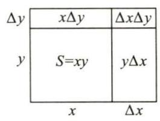
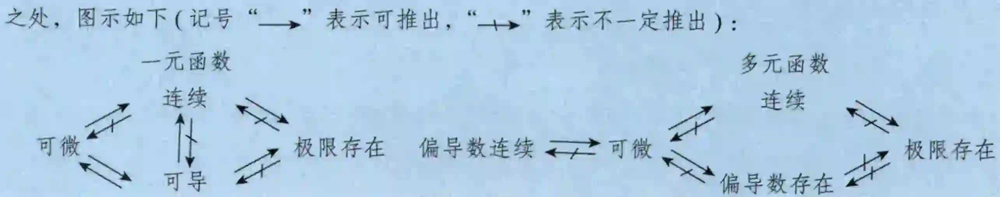
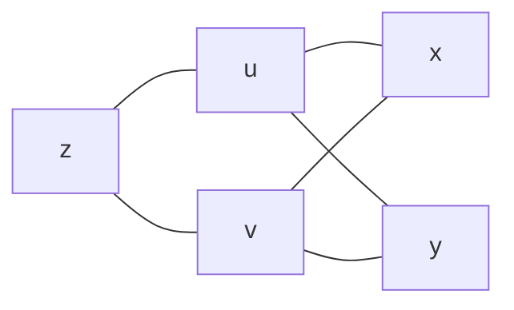
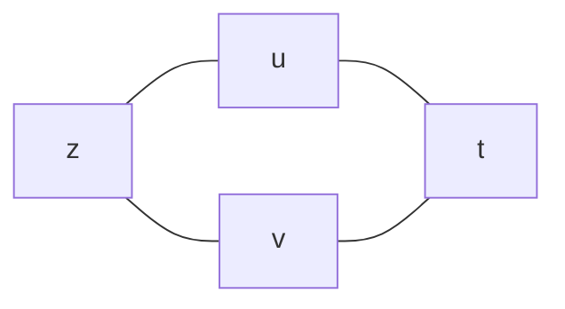
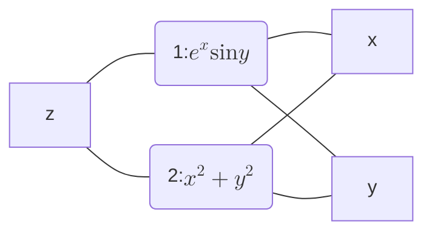
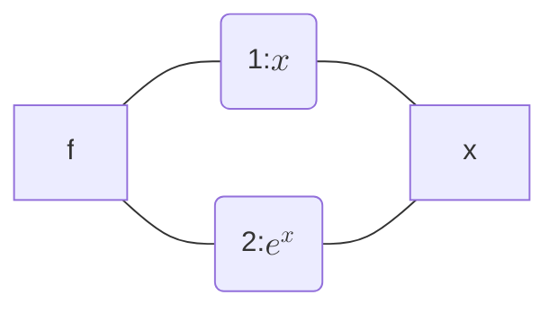
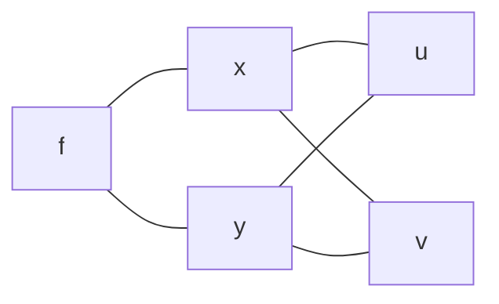

# 第13讲 多元函数微分学

## 一、基本概念

### 1. 邻域

**$\delta$ 邻域** ： 设 ${P}_{0}\left( {{x}_{0},{y}_{0}}\right)$ 是 ${xOy}$ 平面上的一个点, $\delta$ 是某一正数. 与点 ${P}_{0}\left( {{x}_{0},{y}_{0}}\right)$ 的距离小于 $\delta$ 的点 $P\left( {x, y}\right)$ 的全体,称为点 ${P}_{0}$ 的 $\delta$ 邻域,记为 $U\left( {{P}_{0},\delta }\right)$ ,即

$$
U\left( {{P}_{0},\delta }\right) = \left\{ {P\left| \right| P{P}_{0} \mid < \delta }\right\} \text{ 或 }U\left( {{P}_{0},\delta }\right) = \left\{ {\left( {x, y}\right) \left| {\;\sqrt{{\left( x - {x}_{0}\right) }^{2} + {\left( y - {y}_{0}\right) }^{2}} < \delta }\right. }\right\} .
$$

**去心 $\delta$ 邻域** ： 点 ${P}_{0}$ 的去心 $\delta$ 邻域,记作 $\overset{ \circ }{U}\left( {{P}_{0},\delta }\right)$ ,即 $\overset{ \circ }{U}\left( {{P}_{0},\delta }\right) = \left\{ {P\left| {0 < }\right| P{P}_{0} \mid < \delta }\right\}$ .

特别指出,如果不需要强调邻域的半径 $\delta$ ,则用 $U\left( {P}_{0}\right)$ 表示点 ${P}_{0}$ 的某个邻域,点 ${P}_{0}$ 的去心邻域记作 $\overset{ \circ }{U}\left( {P}_{0}\right)$ .

**$\delta$ 邻域的几何意义** $U\left( {{P}_{0},\delta }\right)$ 表示 ${xOy}$ 平面上以点 ${P}_{0}\left( {{x}_{0},{y}_{0}}\right)$ 为中心, $\delta > 0$ 为半径的圆内部的点 $P\left( {x, y}\right)$ 的全体.

### 2. 极限

设函数 $f\left( {x, y}\right)$ 在区域 $D$ 上有定义, ${P}_{0}\left( {{x}_{0},{y}_{0}}\right) \in D$ 或为区域 $D$ 边界上的一点. 如果对于任意给定的 $\varepsilon > 0$ ,总存在 $\delta > 0$ ,当点 $P\left( {x, y}\right) \in D$ ,且满足 $0 < \left| {P{P}_{0}}\right| = \sqrt{{\left( x - {x}_{0}\right) }^{2} + {\left( y - {y}_{0}\right) }^{2}} < \delta$ 时,恒有

$$
\left| {f\left( {x, y}\right) - A}\right| < \varepsilon ,
$$

则称常数 $A$ 为 $\left( {x, y}\right) \rightarrow \left( {{x}_{0},{y}_{0}}\right)$ 时 $f\left( {x, y}\right)$ 的极限,记作

$$
\mathop{\lim }\limits_{{\left( {x, y}\right) \rightarrow \left( {{x}_{0},{y}_{0}}\right) }}f\left( {x, y}\right) = A\text{ 或 }\mathop{\lim }\limits_{\substack{{x \rightarrow {x}_{0}} \\ {y \rightarrow {y}_{0}} }}f\left( {x, y}\right) = A\text{,}
$$

也常记作

$$
\mathop{\lim }\limits_{{P \rightarrow {P}_{0}}}f\left( P\right) = A
$$

---

【注】(1) 一元极限中 $x \rightarrow {x}_{0}$ 有且仅有两种方式 $\left( {x \rightarrow {x}_{0}^{ - }\text{和}x \rightarrow {x}_{0}^{ + }}\right)$ ,二重极限中 $\left( {x, y}\right) \rightarrow \left( {{x}_{0},{y}_{0}}\right)$ 一般有无穷多种方式.

(2) 若有两条不同路径使极限 $\mathop{\lim }\limits_{{\left( {x, y}\right) \rightarrow \left( {{x}_{0},{y}_{0}}\right) }}f\left( {x, y}\right)$ 的值不相等或某一路径使极限 $\mathop{\lim }\limits_{{\left( {x, y}\right) \rightarrow \left( {{x}_{0},{y}_{0}}\right) }}f\left( {x, y}\right)$ 的值不存在,都说明 $\mathop{\lim }\limits_{{\left( {x, y}\right) \rightarrow \left( {{x}_{0},{y}_{0}}\right) }}f\left( {x, y}\right)$ 不存在.

(3) 除洛必达法则和单调有界准则外, 可照搬一元函数求极限的方法来求二重极限, 二重极限保持了一元极限的各种性质, 如唯一性、局部有界性、局部保号性、运算规则及脱帽法: $\mathop{\lim }\limits_{{\left( {x, y}\right) \rightarrow \left( {{x}_{0},{y}_{0}}\right) }}f\left( {x, y}\right) = A \Leftrightarrow f\left( {x, y}\right) = A + \alpha$ ,其中当 $\left( {x, y}\right) \rightarrow \left( {{x}_{0},{y}_{0}}\right)$ 时, $\alpha$ 是无穷小量.

---

例 13.1 设 $\displaystyle{I}_{1} = \mathop{\lim }\limits_{\substack{{x \rightarrow 0} \\ {y \rightarrow 0} }}\frac{\left| xy\right| }{\sqrt{{x}^{2} + {y}^{2}}},{I}_{2} = \mathop{\lim }\limits_{\substack{{x \rightarrow 0} \\ {y \rightarrow 0} }}\frac{x\left| y\right| }{{x}^{2} + {y}^{2}}$ ,则 $\left( \;\right)$ .

(A) ${I}_{1}$ 存在, ${I}_{2}$ 不存在 (B) ${I}_{1}$ 存在, ${I}_{2}$ 存在

(C) ${I}_{1}$ 不存在, ${I}_{2}$ 存在 (D) ${I}_{1}$ 不存在, ${I}_{2}$ 不存在

**解** 应选 (A).

$$
0 \leq {I}_{1} = \mathop{\lim }\limits_{\substack{{x \rightarrow 0} \\ {y \rightarrow 0} }}\frac{\left| xy\right| }{\sqrt{{x}^{2} + {y}^{2}}} \leq \mathop{\lim }\limits_{\substack{{x \rightarrow 0} \\ {y \rightarrow 0} }}\frac{\frac{1}{2}\left( {{x}^{2} + {y}^{2}}\right) }{\sqrt{{x}^{2} + {y}^{2}}} = 0,
$$

由夹逼准则,得 ${I}_{1} = 0$ ,故 ${I}_{1}$ 存在.

取路径 $y = x$ ,则

$$
{I}_{2} = \mathop{\lim }\limits_{\substack{{x \to 0} \\ {y = x} }}\frac{x\left| y\right| }{{x}^{2} + {y}^{2}} = \mathop{\lim }\limits_{{x \to 0}}\frac{x\left| x\right| }{2{x}^{2}},
$$

又 $\displaystyle\mathop{\lim }\limits_{{x \to {0}^{ + }}}\frac{x\left| x\right| }{2{x}^{2}} = \frac{1}{2},\mathop{\lim }\limits_{{x \rightarrow {0}^{ - }}}\frac{x\left| x\right| }{2{x}^{2}} = - \frac{1}{2}$ ,极限不存在,故 ${I}_{2}$ 不存在.

### 3. 连续

如果 $\mathop{\lim }\limits_{\substack{{x \rightarrow {x}_{0}} \\ {y \rightarrow {y}_{0}} }}f\left( {x, y}\right) = f\left( {{x}_{0},{y}_{0}}\right)$ ,则称函数 $f\left( {x, y}\right)$ 在点 $\left( {{x}_{0},{y}_{0}}\right)$ 处连续,如果 $f\left( {x, y}\right)$ 在区域 $D$ 上每一点处都连续,则称 $f\left( {x, y}\right)$ 在区域 $D$ 上连续.

---

【注】如果多元函数不连续, 《全国硕士研究生招生考试数学考试大纲》未要求讨论间断点类型

---

例 13.2 设

$$
f\left( {x, y}\right) = \left\{ \begin{array}{ll} \displaystyle\frac{\sqrt[3]{1 - {(x^2 + y^2)}} - 1}{{\mathrm{e}}^{x^2 + y^2} - 1}, & {x^2 + y^2} \neq 0, \\ a, & {x^2 + y^2} = 0 \end{array}\right.
$$

为连续函数,则 $a =$ ___.

解 应填 $- \frac{1}{3}$ .

因为 $f\left( {x, y}\right)$ 为连续函数,所以

$$
a = f\left( {0,0}\right) = \mathop{\lim }\limits_{{\left( {x, y}\right) \rightarrow \left( {0,0}\right) }}f\left( {x, y}\right) = \mathop{\lim }\limits_{{{x^2 + y^2} \rightarrow 0}}\frac{\sqrt[3]{1 - {(x^2 + y^2)}} - 1}{{\mathrm{e}}^{x^2 + y^2} - 1} = \mathop{\lim }\limits_{{{x^2 + y^2} \rightarrow 0}}\frac{-\frac{1}{3}{(x^2 + y^2)}}{x^2 + y^2} = - \frac{1}{3}.
$$

### 4. 偏导数

(1) 定义.

设函数 $z = f\left( {x, y}\right)$ 在点 $\left( {{x}_{0},{y}_{0}}\right)$ 的某邻域内有定义,如果极限

$$
\mathop{\lim }\limits_{{{\Delta x} \rightarrow 0}}\frac{f\left( {{x}_{0} + {\Delta x},{y}_{0}}\right) - f\left( {{x}_{0},{y}_{0}}\right) }{\Delta x}
$$

存在,则称此极限为函数 $z = f\left( {x, y}\right)$ 在点 $\left( {{x}_{0},{y}_{0}}\right)$ 处对 $x$ 的偏导数,记作

$$
{\left. {\left. \frac{\partial z}{\partial x}\right| }_{\begin{matrix} {x = {x}_{0}} \\ {y = {y}_{0}} \end{matrix}},{\left. \frac{\partial f}{\partial x}\right| }_{\begin{matrix} {x = {x}_{0}} \\ {y = {y}_{0}} \end{matrix}},{z}_{x}^{\prime }\right| }_{\begin{matrix} {x = {x}_{0}} \\ {y = {y}_{0}} \end{matrix}}\text{ 或 }{f}_{x}^{\prime }\left( {{x}_{0},{y}_{0}}\right) ,
$$

即

$$
{f}_{x}^{\prime }\left( {{x}_{0},{y}_{0}}\right) = \mathop{\lim }\limits_{{{\Delta x} \rightarrow 0}}\frac{f\left( {{x}_{0} + {\Delta x},{y}_{0}}\right) - f\left( {{x}_{0},{y}_{0}}\right) }{\Delta x}.
$$

类似地,函数 $z = f\left( {x, y}\right)$ 在点 $\left( {{x}_{0},{y}_{0}}\right)$ 处对 $y$ 的偏导数定义为

$$
{f}_{y}^{\prime }\left( {{x}_{0},{y}_{0}}\right) = \mathop{\lim }\limits_{{{\Delta y} \rightarrow 0}}\frac{f\left( {{x}_{0},{y}_{0} + {\Delta y}}\right) - f\left( {{x}_{0},{y}_{0}}\right) }{\Delta y}.
$$

(2) 如果 $z = f\left( {x, y}\right)$ 在区域 $D$ 上的每一点 $\left( {x, y}\right)$ 处都有偏导数,一般来说,它们仍是 $x, y$ 的函数, 则称为 $f\left( {x, y}\right)$ 的偏导函数,简称偏导数,记作 $\displaystyle\frac{\partial z}{\partial x},\frac{\partial f}{\partial x},{f}_{x}^{\prime }\left( {x, y}\right) ,\frac{\partial z}{\partial y},\frac{\partial f}{\partial y},{f}_{y}^{\prime }\left( {x, y}\right)$ .

(3) 几何意义.

设有二元函数 $z = f\left( {x, y}\right)$ ,且 ${z}_{0} = f\left( {{x}_{0},{y}_{0}}\right)$ ,则 ${f}_{x}^{\prime }\left( {{x}_{0},{y}_{0}}\right)$ 在几何上表示曲线 $\left\{ \begin{array}{l} z = f\left( {x, y}\right) , \\ y = {y}_{0} \end{array}\right.$ 在点 $\left( {{x}_{0},{y}_{0},{z}_{0}}\right)$ 处的切线对 $x$ 轴的斜率. 同理, ${f}_{y}^{\prime }\left( {{x}_{0},{y}_{0}}\right)$ 在几何上表示曲线 $\left\{ \begin{array}{l} z = f\left( {x, y}\right) , \\ x = {x}_{0} \end{array}\right.$ 在点 $\left( {{x}_{0},{y}_{0},{z}_{0}}\right)$ 处的切线对 $y$ 轴的斜率.

(4) 高阶偏导数.

如果二元函数 $z = f\left( {x, y}\right)$ 的偏导数 ${f}_{x}^{\prime }\left( {x, y}\right)$ 和 ${f}_{y}^{\prime }\left( {x, y}\right)$ 仍然具有偏导数,则它们的偏导数称为 $z = f\left( {x, y}\right)$ 的二阶偏导数,记作

$$
\frac{{\partial }^{2}z}{\partial {x}^{2}} = \frac{\partial }{\partial x}\left( \frac{\partial z}{\partial x}\right) = {f}_{xx}^{\prime \prime }\left( {x, y}\right) = {z}_{xx}^{\prime \prime },
$$

$$
\frac{{\partial }^{2}z}{\partial x\partial y} = \frac{\partial }{\partial y}\left( \frac{\partial z}{\partial x}\right) = {f}_{xy}^{\prime \prime }\left( {x, y}\right) = {z}_{xy}^{\prime \prime },
$$

$$
\frac{{\partial }^{2}z}{\partial {y}^{2}} = \frac{\partial }{\partial y}\left( \frac{\partial z}{\partial y}\right) = {f}_{yy}^{\prime \prime }\left( {x, y}\right) = {z}_{yy}^{\prime \prime },
$$

$$
\frac{{\partial }^{2}z}{\partial y\partial x} = \frac{\partial }{\partial x}\left( \frac{\partial z}{\partial y}\right) = {f}_{yx}^{\prime \prime }\left( {x, y}\right) = {z}_{yx}^{\prime \prime },
$$

其中称 $\displaystyle\frac{{\partial }^{2}z}{\partial x\partial y}$ 与 $\displaystyle\frac{{\partial }^{2}z}{\partial y\partial x}$ 为二阶混合偏导数. 类似地可以定义 $n\left( {n \geq 3}\right)$ 阶偏导数.

(5) 如果函数 $z = f\left( {x, y}\right)$ 的两个二阶混合偏导数 $\displaystyle\frac{{\partial }^{2}z}{\partial x\partial y}$ 及 $\displaystyle\frac{{\partial }^{2}z}{\partial y\partial x}$ 都在区域 $D$ 内连续,则在区域 $D$ 内 $\displaystyle\frac{{\partial }^{2}z}{\partial x\partial y} = \displaystyle\frac{{\partial }^{2}z}{\partial y\partial x}$ ,即二阶混合偏导数在连续的条件下与求导的次序无关.

例 13.3 已知函数 $f\left( {x, y}\right) = \ln \left( {y + \left| {x\sin y}\right| }\right)$ ,则 $\left( \;\right)$ .

(A) ${\left. \frac{\partial f}{\partial x}\right| }_{\left( 0,1\right) }$ 不存在, ${\left. \frac{\partial f}{\partial y}\right| }_{\left( 0,1\right) }$ 存在 (B) ${\left. \frac{\partial f}{\partial x}\right| }_{\left( 0,1\right) }$ 存在, ${\left. \frac{\partial f}{\partial y}\right| }_{\left( 0,1\right) }$ 不存在

(C) ${\left. \frac{\partial f}{\partial x}\right| }_{\left( 0,1\right) },{\left. \frac{\partial f}{\partial y}\right| }_{\left( 0,1\right) }$ 均存在 (D) ${\left. \frac{\partial f}{\partial x}\right| }_{\left( 0,1\right) },{\left. \frac{\partial f}{\partial y}\right| }_{\left( 0,1\right) }$ 均不存在

解 应选 (A).

因为 $f\left( {x, y}\right) = \ln \left( {y + \left| {x\sin y}\right| }\right)$ ,所以

$$
f\left( {0,1}\right) = \ln \left( {1 + 0}\right) = 0, f\left( {x,1}\right) = \ln \left( {1 + \left| {x\sin 1}\right| }\right), f\left( {0, y}\right) = \ln \left( {y + 0}\right) = \ln y,
$$

因此

$$
{\left. \frac{\partial f}{\partial x}\right| }_{\left( 0,1\right) } = \mathop{\lim }\limits_{{x \rightarrow 0}}\frac{f\left( {x,1}\right) - f\left( {0,1}\right) }{x - 0} = \mathop{\lim }\limits_{{x \rightarrow 0}}\frac{\ln \left( {1 + \left| {x\sin 1}\right| }\right) }{x} = \mathop{\lim }\limits_{{x \rightarrow 0}}\frac{\left| x\sin 1\right| }{x},
$$

$$
{\left. \frac{\partial f}{\partial y}\right| }_{\left( 0,1\right) } = \mathop{\lim }\limits_{{y \rightarrow 1}}\frac{f\left( {0, y}\right) - f\left( {0,1}\right) }{y - 1} = \mathop{\lim }\limits_{{y \rightarrow 1}}\frac{\ln y}{y - 1} = \mathop{\lim }\limits_{{y \rightarrow 1}}\frac{1}{y} = 1,
$$

所以 $\displaystyle{\left. \frac{\partial f}{\partial x}\right| }_{\left( 0,1\right) }$ 不存在, $\displaystyle{\left. \frac{\partial f}{\partial y}\right| }_{\left( 0,1\right) }$ 存在.

例 13.4 设函数 $f\left( t\right)$ 连续,令 $F\left( {x, y}\right) = {\int }_{0}^{x - y}\left( {x - y - t}\right) f\left( t\right) \mathrm{d}t$ ,则 $\left( \;\right)$ .

(A) $\displaystyle\frac{\partial F}{\partial x} = \frac{\partial F}{\partial y},\frac{{\partial }^{2}F}{\partial {x}^{2}} = \frac{{\partial }^{2}F}{\partial {y}^{2}}$ (B) $\displaystyle\frac{\partial F}{\partial x} = \frac{\partial F}{\partial y},\frac{{\partial }^{2}F}{\partial {x}^{2}} = - \frac{{\partial }^{2}F}{\partial {y}^{2}}$

(C) $\displaystyle\frac{\partial F}{\partial x} = - \frac{\partial F}{\partial y},\frac{{\partial }^{2}F}{\partial {x}^{2}} = \frac{{\partial }^{2}F}{\partial {y}^{2}}$ (D) $\displaystyle\frac{\partial F}{\partial x} = - \frac{\partial F}{\partial y},\frac{{\partial }^{2}F}{\partial {x}^{2}} = - \frac{{\partial }^{2}F}{\partial {y}^{2}}$

解 应选 (C).

由题知, $\displaystyle F\left( {x, y}\right) = x{\int }_{0}^{x - y}f\left( t\right) \mathrm{d}t - y{\int }_{0}^{x - y}f\left( t\right) \mathrm{d}t - {\int }_{0}^{x - y}{tf}\left( t\right) \mathrm{d}t$ ,则

$$
\frac{\partial F}{\partial x} = {\int }_{0}^{x - y}f\left( t\right) \mathrm{d}t + {xf}\left( {x - y}\right) - {yf}\left( {x - y}\right) - \left( {x - y}\right) f\left( {x - y}\right) = {\int }_{0}^{x - y}f\left( t\right) \mathrm{d}t,
$$

$$
\frac{{\partial }^{2}F}{\partial {x}^{2}} = f\left( {x - y}\right) ,
$$

$$
\frac{\partial F}{\partial y} = - {xf}\left( {x - y}\right) - {\int }_{0}^{x - y}f\left( t\right) \mathrm{d}t + {yf}\left( {x - y}\right) + \left( {x - y}\right) f\left( {x - y}\right) = - {\int }_{0}^{x - y}f\left( t\right) \mathrm{d}t,
$$

$$
\frac{{\partial }^{2}F}{\partial {y}^{2}} = f\left( {x - y}\right) ,
$$

所以 $\displaystyle\frac{\partial F}{\partial x} = - \frac{\partial F}{\partial y},\frac{{\partial }^{2}F}{\partial {x}^{2}} = \frac{{\partial }^{2}F}{\partial {y}^{2}}$ .

例 13.5 设函数 $\displaystyle f\left( {x, y}\right) = {\int }_{0}^{xy}{\mathrm{e}}^{-x{t}^{2}}\mathrm{\;d}t$ ,则 ${f}_{x}^{\prime }\left( {1, + \infty }\right) =$

解 应填 $\displaystyle - \frac{\sqrt{\pi }}{4}$ .

当 $x > 0$ 时,

$$
f\left( {x, y}\right) = {\int }_{0}^{xy}{\mathrm{e}}^{-x{t}^{2}}\mathrm{\;d}t \; \displaystyle{\underset{\displaystyle u = \sqrt{x}t}{\xlongequal{\text{ 令 }\displaystyle\frac{u}{\sqrt{x}} = t}}}\; \frac{1}{\sqrt{x}}{\int }_{0}^{\frac{3}{{x}^{2}y}}{\mathrm{e}}^{-{u}^{2}}\mathrm{\;d}u,
$$

于是 $f\left( {x, + \infty }\right) = \mathop{\lim }\limits_{{y \rightarrow + \infty }}f\left( {x, y}\right) = \frac{1}{\sqrt{x}}{\int }_{0}^{+\infty }{\mathrm{e}}^{-{u}^{2}}\mathrm{\;d}u = \frac{\sqrt{\pi }}{2} \cdot \frac{1}{\sqrt{x}}$ ,故

$$
{f}_{x}^{\prime }\left( {1, + \infty }\right) = {\left. \frac{\sqrt{\pi }}{2}{\left( \frac{1}{\sqrt{x}}\right) }^{\prime }\right| }_{x = 1} = {\left. \frac{\sqrt{\pi }}{2}\left( -\frac{1}{2}\right) \frac{1}{{x}^{\frac{3}{2}}}\right| }_{x = 1} = - \frac{\sqrt{\pi }}{4}.
$$

---

【注】此题先计算 $f\left( {x, + \infty }\right)$ ,再计算 ${f}_{x}^{\prime }\left( {1, + \infty }\right)$ 是简便的.

若先计算 ${f}_{x}^{\prime }\left( {x, y}\right)$ ,再代入 $\left( {1, + \infty }\right)$ ,过程如下:

$$
{f}_{x}^{\prime }\left( {x, y}\right) = - \frac{1}{2}{x}^{-\frac{3}{2}} \cdot {\int }_{0}^{\frac{3}{{x}^{2}y}}{\mathrm{e}}^{-{u}^{2}}\mathrm{\;d}u + \frac{1}{\sqrt{x}}{\mathrm{e}}^{-{x}^{3}{y}^{2}} \cdot \frac{3}{2}\sqrt{x}y,
$$

于是 ${f}_{x}^{\prime }\left( {1, + \infty }\right) = - \frac{1}{2}{\int }_{0}^{+\infty }{\mathrm{e}}^{-{u}^{2}}\mathrm{\;d}u = - \frac{\sqrt{\pi }}{4}$ . 略复杂.

---

> 求 $f'_{x}(x_0,y_0)$ 可以先把 $y_0$ 代入进去，再求导 ：$[f(x_0,y_0)]'_x |_{x=x_0}$ ，这样计算简单；也可以先求导，再把 $x_0,y_0$ 代入：$f'(x_0,y_0)|_{\overset{x=x_0}{\underset{y=y_0}{}}}$

例 13.6 设函数 $f\left( {x, y}\right)$ 可微, $f\left( {0,0}\right) = 0,\frac{\partial f}{\partial x} = - f\left( {x, y}\right) ,\frac{\partial f}{\partial y} = {\mathrm{e}}^{-x}\cos y$ ,求 $f\left( {x, y}\right)$ .

解 由 $\frac{\partial f}{\partial y} = {\mathrm{e}}^{-x}\cos y$ 得 $f\left( {x, y}\right) = {\mathrm{e}}^{-x}\sin y + \varphi \left( x\right)$ ,于是 $\frac{\partial f}{\partial x} = - {\mathrm{e}}^{-x}\sin y + {\varphi }^{\prime }\left( x\right)$ .

又 $\frac{\partial f}{\partial x} = - f\left( {x, y}\right)$ ,故

$$
- {\mathrm{e}}^{-x}\sin y + {\varphi }^{\prime }\left( x\right) = - {\mathrm{e}}^{-x}\sin y - \varphi \left( x\right) ,
$$

于是有 ${\varphi }^{\prime }\left( x\right) + \varphi \left( x\right) = 0$ ,解得 $\varphi \left( x\right) = C{\mathrm{e}}^{-x}$ ,即 $f\left( {x, y}\right) = {\mathrm{e}}^{-x}\sin y + C{\mathrm{e}}^{-x}$ .

由 $f\left( {0,0}\right) = 0$ ,得 $C = 0$ ,所以 $f\left( {x, y}\right) = {\mathrm{e}}^{-x}\sin y$ .

---

【注】本题进一步可求 $f\left( {x, x}\right)$ 在 $\lbrack 0, + \infty )$ 的部分与 $x$ 轴围成的图形绕 $x$ 轴旋转一周所成的旋转体体积, 步骤如下:

$$
V = {\int }_{0}^{+\infty }\pi {f}^{2}\left( {x, x}\right) \mathrm{d}x = {\int }_{0}^{+\infty }\pi {\mathrm{e}}^{-{2x}}{\sin }^{2}x\mathrm{\;d}x = {\int }_{0}^{+\infty }\pi {\mathrm{e}}^{-{2x}}\frac{1 - \cos {2x}}{2}\mathrm{\;d}x
$$

$$
= \frac{\pi }{2}{\int }_{0}^{+\infty }{\mathrm{e}}^{-{2x}}\left( {1 - \cos {2x}}\right) \mathrm{d}x = \frac{\pi }{2}{\int }_{0}^{+\infty }{\mathrm{e}}^{-{2x}}\mathrm{\;d}x - \frac{\pi }{2}{\int }_{0}^{+\infty }{\mathrm{e}}^{-{2x}}\cos {2x}\mathrm{\;d}x
$$

$$
\xlongequal{\text{ 令 }u = {2x}}{}\frac{\pi }{4} - \frac{\pi }{4}{\int }_{0}^{+\infty }{\mathrm{e}}^{-u}\cos u\mathrm{\;d}u,
$$

其中

$$
{\int }_{0}^{+\infty }{\mathrm{e}}^{-u}\cos u\mathrm{\;d}u = {\left. \frac{\left| \begin{matrix} {\left( {\mathrm{e}}^{-u}\right) }^{\prime } & {\left( \cos u\right) }^{\prime } \\ {\mathrm{e}}^{-u} & \cos u \end{matrix}\right| }{{\left( -1\right) }^{2} + {1}^{2}}\right| }_{0}^{+\infty }
$$

$$
= {\left. \frac{1}{2}\left( -{\mathrm{e}}^{-u}\cos u + {\mathrm{e}}^{-u}\sin u\right) \right| }_{0}^{+\infty }
$$

$$
= \frac{1}{2}\left\lbrack {0 - \left( {-1}\right) }\right\rbrack = \frac{1}{2}\text{,}
$$

故

$$
V = \frac{\pi }{4} - \frac{\pi }{4} \cdot \frac{1}{2} = \frac{\pi }{8}.
$$

---

### 5. 可微

先看一个引例. 如图 13-1 所示,设矩形的长和宽分别为 $x$ 和 $y$ ,则此矩形的面积为 $S = {xy}$ .

图 13-1

若 $x, y$ 分别增长 ${\Delta x},{\Delta y}$ ,则该矩形面积的增量为

$$
{\Delta S} = \left( {x + {\Delta x}}\right) \left( {y + {\Delta y}}\right) - {xy} = {y\Delta x} + {x\Delta y} + {\Delta x\Delta y}.
$$

上式右端由两部分组成: 一部分是 ${y\Delta x} + {x\Delta y}$ ,它是关于 ${\Delta x},{\Delta y}$ 的线性函数; 另一部分是 ${\Delta x\Delta y}$ ,因为

$$
\mathop{\lim }\limits_{\substack{{{\Delta x} \rightarrow 0} \\ {{\Delta y} \rightarrow 0} }}\frac{\Delta x\Delta y}{\sqrt{{\left( \Delta x\right) }^{2} + {\left( \Delta y\right) }^{2}}} \leq \mathop{\lim }\limits_{\substack{{{\Delta x} \rightarrow 0} \\ {{\Delta y} \rightarrow 0} }}\frac{\frac{{\left( \Delta x\right) }^{2} + {\left( \Delta y\right) }^{2}}{2}}{\sqrt{{\left( \Delta x\right) }^{2} + {\left( \Delta y\right) }^{2}}} = \mathop{\lim }\limits_{\substack{{{\Delta x} \rightarrow 0} \\ {{\Delta y} \rightarrow 0} }}\frac{\sqrt{{\left( \Delta x\right) }^{2} + {\left( \Delta y\right) }^{2}}}{2} = 0,
$$

所以当 ${\Delta x} \rightarrow 0,{\Delta y} \rightarrow 0$ 时, ${\Delta x\Delta y}$ 是比 $\rho = \sqrt{{\left( \Delta x\right) }^{2} + {\left( \Delta y\right) }^{2}}$ 高阶的无穷小量,即

$$
{\Delta S} = {y\Delta x} + {x\Delta y} + o\left( \rho \right) \left( {\rho \rightarrow 0}\right) .
$$

${y\Delta x} + {x\Delta y}$ 是 ${\Delta S}$ 的主要部分, $o\left( \rho \right)$ 是 ${\Delta S}$ 与主要部分 ${y\Delta x} + {x\Delta y}$ 之间的误差,称 ${y\Delta x} + {x\Delta y}$ 为函数 $S = {xy}$ 在点 $\left( {x, y}\right)$ 处的全微分.

#### (1) 定义

设函数 $z = f\left( {x, y}\right)$ 在点 $\left( {x, y}\right)$ 的某实心邻域内有定义,若 $z = f\left( {x, y}\right)$ 在该点的全增量

$$
{\Delta z} = f\left( {x + {\Delta x}, y + {\Delta y}}\right) - f\left( {x, y}\right)
$$

可表示为

$$
{\Delta z} = {A\Delta x} + {B\Delta y} + o\left( \rho \right) ,
$$

其中 $A, B$ 仅与点 $\left( {x, y}\right)$ 有关,而与 ${\Delta x},{\Delta y}$ 无关; $\rho = \sqrt{{\left( \Delta x\right) }^{2} + {\left( \Delta y\right) }^{2}}$ ,且当 ${\Delta x} \rightarrow 0,{\Delta y} \rightarrow 0$ 时, $o\left( \rho \right)$ 为 $\rho$ 的高阶无穷小,则称函数 $z = f\left( {x, y}\right)$ 在点 $\left( {x, y}\right)$ 处可微分,并称 ${A\Delta x} + {B\Delta y}$ 为函数 $z = f\left( {x, y}\right)$ 在点 $\left( {x, y}\right)$ 处的全微分,记为

$$
\mathrm{d}z = {A\Delta x} + {B\Delta y}.
$$

#### (2) 可微的必要条件

若函数 $z = f\left( {x, y}\right)$ 在点 $\left( {x, y}\right)$ 处可微,则该函数在该点处的偏导数必存在,且

$$
A = \frac{\partial z}{\partial x}, B = \frac{\partial z}{\partial y}.
$$

由此可得,若函数 $z = f\left( {x, y}\right)$ 在点 $\left( {x, y}\right)$ 处可微,则全微分可记为 $\mathrm{d}z = \frac{\partial z}{\partial x}\mathrm{\;d}x + \frac{\partial z}{\partial y}\mathrm{\;d}y$ .

#### (3) 可微的充分条件

若函数 $z = f\left( {x, y}\right)$ 在点 $\left( {x, y}\right)$ 处的偏导数存在且连续,则该函数在点 $\left( {x, y}\right)$ 处可微.

---

【注】(1) 在区域 $D$ 上,若 $\mathrm{d}\left\lbrack {f\left( {x, y}\right) }\right\rbrack = 0$ 或 $\frac{\partial f}{\partial x} = \frac{\partial f}{\partial y} = 0$ ,则 $f\left( {x, y}\right) \equiv C$ (常数), $\left( {x, y}\right) \in D$ .

(2) 判别函数 $z = f\left( {x, y}\right)$ 在点 $\left( {{x}_{0},{y}_{0}}\right)$ 处的偏导数是否连续,步骤如下:

① 用定义法求 ${f}_{x}^{\prime }\left( {{x}_{0},{y}_{0}}\right) ,{f}_{y}^{\prime }\left( {{x}_{0},{y}_{0}}\right)$ ;

② 用公式法求 ${f}_{x}^{\prime }\left( {x, y}\right) ,{f}_{y}^{\prime }\left( {x, y}\right)$ ;

③ 计算 $\mathop{\lim }\limits_{\substack{{x \rightarrow {x}_{0}} \\ {y \rightarrow {y}_{0}} }}{f}_{x}^{\prime }\left( {x, y}\right) ,\mathop{\lim }\limits_{\substack{{x \rightarrow {x}_{0}} \\ {y \rightarrow {y}_{0}} }}{f}_{y}^{\prime }\left( {x, y}\right)$ .

看 $\mathop{\lim }\limits_{\substack{{x \rightarrow {x}_{0}} \\ {y \rightarrow {y}_{0}} }}{f}_{x}^{\prime }\left( {x, y}\right) = {f}_{x}^{\prime }\left( {{x}_{0},{y}_{0}}\right) ,\mathop{\lim }\limits_{\substack{{x \rightarrow {x}_{0}} \\ {y \rightarrow {y}_{0}} }}{f}_{y}^{\prime }\left( {x, y}\right) = {f}_{y}^{\prime }\left( {{x}_{0},{y}_{0}}\right)$ 是否成立. 若成立,则 $z = f\left( {x, y}\right)$ 在点 $\left( {{x}_{0},{y}_{0}}\right)$ 处的偏导数是连续的.

(3) 一元函数和多元函数在极限存在、连续、可导、可微的相互关系上, 有相同之处, 更有相异之处

---

#### (4) 可微的判别步骤

判别函数 $z = f\left( {x, y}\right)$ 在点 $\left( {{x}_{0},{y}_{0}}\right)$ 处是否可微,步骤如下:

①写出全增量 ${\Delta z} = f\left( {{x}_{0} + {\Delta x},{y}_{0} + {\Delta y}}\right) - f\left( {{x}_{0},{y}_{0}}\right)$ ;

② 写出线性增量 ${A\Delta x} + {B\Delta y}$ ,其中 $A = {f}_{x}^{\prime }\left( {{x}_{0},{y}_{0}}\right), B = {f}_{y}^{\prime }\left( {{x}_{0},{y}_{0}}\right)$ ;

③作极限 $\mathop{\lim }\limits_{\substack{{{\Delta x} \rightarrow 0} \\ {{\Delta y} \rightarrow 0} }}\frac{{\Delta z} - \left( {{A\Delta x} + {B\Delta y}}\right) }{\sqrt{{\left( \Delta x\right) }^{2} + {\left( \Delta y\right) }^{2}}}$ ,若该极限等于 0,则 $z = f\left( {x, y}\right)$ 在点 $\left( {{x}_{0},{y}_{0}}\right)$ 处可微,否则,就不可微.

例 13.7 已知 $\left( {a{y}^{3} - {y}^{2}\cos x}\right) \mathrm{d}x + \left( {1 + {by}\sin x + 3{x}^{2}{y}^{2}}\right) \mathrm{d}y$ 为某一函数 $u\left( {x, y}\right)$ 的全微分,则 $\left( {a, b}\right) =$ ( ).

(A) $\left( {2,2}\right)$ (B) $\left( {2, - 2}\right)$ (C) $\left( {-2,2}\right)$ (D) $\left( {-2, - 2}\right)$

解 应选 (B).

依题意, 有

$$
\frac{\partial u}{\partial x} = {ax}{y}^{3} - {y}^{2}\cos x,\frac{\partial u}{\partial y} = 1 + {by}\sin x + 3{x}^{2}{y}^{2},
$$

则

$$
\frac{{\partial }^{2}u}{\partial x\partial y} = {3ax}{y}^{2} - {2y}\cos x,\frac{{\partial }^{2}u}{\partial y\partial x} = {by}\cos x + {6x}{y}^{2}.
$$

显然 $\frac{{\partial }^{2}u}{\partial x\partial y}$ 和 $\frac{{\partial }^{2}u}{\partial y\partial x}$ 连续,于是 $\frac{{\partial }^{2}u}{\partial x\partial y} = \frac{{\partial }^{2}u}{\partial y\partial x}$ ,从而 $a = 2, b = - 2$ .

例 13.8 设 ${z}_{1} = \left| {xy}\right| ,{z}_{2} = \left\{ \begin{array}{l} \frac{x\left| y\right| }{\sqrt{{x}^{2} + {y}^{2}}},\left( {x, y}\right) \neq \left( {0,0}\right) , \\ 0,\left( {x, y}\right) = \left( {0,0}\right) , \end{array}\right.$ 则 $\left( \;\right)$ .

(A) ${z}_{1}$ 在点 $\left( {0,0}\right)$ 处不可微, ${z}_{2}$ 在点 $\left( {0,0}\right)$ 处不可微

(B) ${z}_{1}$ 在点 $\left( {0,0}\right)$ 处不可微, ${z}_{2}$ 在点 $\left( {0,0}\right)$ 处可微

(C) ${z}_{1}$ 在点 $\left( {0,0}\right)$ 处可微, ${z}_{2}$ 在点 $\left( {0,0}\right)$ 处不可微

(D) ${z}_{1}$ 在点 $\left( {0,0}\right)$ 处可微, ${z}_{2}$ 在点 $\left( {0,0}\right)$ 处可微

解 应选 (C).

$$
{\left. \frac{\partial {z}_{1}}{\partial x}\right| }_{\left( 0,0\right) } = \mathop{\lim }\limits_{{x \rightarrow 0}}\frac{{z}_{1}\left( {x,0}\right) - {z}_{1}\left( {0,0}\right) }{x - 0} = 0,
$$

$$
{\left. \frac{\partial {z}_{1}}{\partial y}\right| }_{\left( 0,0\right) } = \mathop{\lim }\limits_{{y \rightarrow 0}}\frac{{z}_{1}\left( {0, y}\right) - {z}_{1}\left( {0,0}\right) }{y - 0} = 0,
$$

$$
\frac{{z}_{1}\left( {x, y}\right) - {z}_{1}\left( {0,0}\right) - {\left. \frac{\partial {z}_{1}}{\partial x}\right| }_{\left( 0,0\right) } \cdot x - {\left. \frac{\partial {z}_{1}}{\partial y}\right| }_{\left( 0,0\right) } \cdot y}{\sqrt{{x}^{2} + {y}^{2}}} = \frac{\left| xy\right| }{\sqrt{{x}^{2} + {y}^{2}}},
$$

由例 13.1 可知 ${z}_{1}$ 在点 $\left( {0,0}\right)$ 处可微.

$$
{\left. \frac{\partial {z}_{2}}{\partial x}\right| }_{\left( 0,0\right) } = \mathop{\lim }\limits_{{x \rightarrow 0}}\frac{{z}_{2}\left( {x,0}\right) - {z}_{2}\left( {0,0}\right) }{x - 0} = 0,
$$

$$
{\left. \frac{\partial {z}_{2}}{\partial y}\right| }_{\left( 0,0\right) } = \mathop{\lim }\limits_{{y \rightarrow 0}}\frac{{z}_{2}\left( {0, y}\right) - {z}_{2}\left( {0,0}\right) }{y - 0} = 0,
$$

$$
\frac{{z}_{2}\left( {x, y}\right) - {z}_{2}\left( {0,0}\right) - {\left. \frac{\partial {z}_{2}}{\partial x}\right| }_{\left( 0,0\right) } \cdot x - {\left. \frac{\partial {z}_{2}}{\partial y}\right| }_{\left( 0,0\right) } \cdot y}{\sqrt{{x}^{2} + {y}^{2}}} = \frac{x\left| y\right| }{{x}^{2} + {y}^{2}},
$$

由例 13.1 可知 ${z}_{2}$ 在点 $\left( {0,0}\right)$ 处不可微.

## 二、多元函数微分法则

### 1. 链式求导规则

复合结构图

设 $z = f\left( {u, v}\right), u = \varphi \left( {x, y}\right), v = \psi \left( {x, y}\right)$ ,则 $z = f\left\lbrack {\varphi \left( {x, y}\right) ,\psi \left( {x, y}\right) }\right\rbrack$ ,且

$$
\frac{\partial z}{\partial x} = \frac{\partial z}{\partial u}\frac{\partial u}{\partial x} + \frac{\partial z}{\partial v}\frac{\partial v}{\partial x},\frac{\partial z}{\partial y} = \frac{\partial z}{\partial u}\frac{\partial u}{\partial y} + \frac{\partial z}{\partial v}\frac{\partial v}{\partial y}.
$$

---

【注】(1) 设 $z = f\left( {u, v}\right), u = \varphi \left( t\right), v = \psi \left( t\right)$ ,则 $z = f\left\lbrack {\varphi \left( t\right) ,\psi \left( t\right) }\right\rbrack$ ,且 $\frac{\mathrm{d}z}{\mathrm{\;d}t} = \frac{\partial z}{\partial u}\frac{\mathrm{d}u}{\mathrm{\;d}t} + \frac{\partial z}{\partial v}\frac{\mathrm{d}v}{\mathrm{\;d}t}$ .

复合结构图

(2) 无论 $z$ 对哪个变量求导,也无论 $z$ 已经求了几阶导,求导后的新函数仍然具有与原函数完全相同的复合结构.

---

例 13.9 设 $z = f\left( {{\mathrm{e}}^{x}\sin y,{x}^{2} + {y}^{2}}\right)$ ,其中 $f$ 具有二阶连续偏导数, ${f}_{1}^{\prime \prime }\left( {0,0}\right) = 1,{f}_{2}^{\prime \prime }\left( {0,0}\right) = - 1$ ,则 ${\left. \frac{{\partial }^{2}z}{\partial x\partial y}\right| }_{\left( 0,0\right) } = \left( \;\right) .$

(A) 0 (B) 1 (C) 2 (D) -1

解 应选 (B).

复合结构图

$$
\frac{\partial z}{\partial x} = {\mathrm{e}}^{x}\sin y{f}_{1}^{\prime } + {2x}{f}_{2}^{\prime },
$$

$$
\frac{{\partial }^{2}z}{\partial x\partial y} = {\mathrm{e}}^{2x}\sin y\cos y{f}_{11}^{\prime \prime } + 2{\mathrm{e}}^{x}\left( {y\sin y + x\cos y}\right) {f}_{12}^{\prime \prime } + {4xy}{f}_{22}^{\prime \prime } + {\mathrm{e}}^{x}\cos y{f}_{1}^{\prime }.
$$

于是 ${\left. \frac{{\partial }^{2}z}{\partial x\partial y}\right| }_{\left( 0,0\right) } = {f}_{1}^{\prime }\left( {0,0}\right) = 1$ .

例 13.10 设函数 $f\left( {x,{\mathrm{e}}^{x}}\right) = x + {\mathrm{e}}^{x}$ ,且 ${\left. {f}_{x}^{\prime }\left( x, y\right) \right| }_{y = {\mathrm{e}}^{x}} = 1 + {\left. 2{\mathrm{e}}^{x}\text{,则 }{f}_{y}^{\prime }\left( x, y\right) \right| }_{y = {\mathrm{e}}^{x}} =$

解 应填 -1 .

$$
\frac{\mathrm{d}\left\lbrack {f\left( {x,{\mathrm{e}}^{x}}\right) }\right\rbrack }{\mathrm{d}x} = {\left. {f}_{x}^{\prime }\left( x, y\right) \right| }_{y = {\mathrm{e}}^{x}} + {\left. {f}_{y}^{\prime }\left( x, y\right) \right| }_{y = {\mathrm{e}}^{x}} \cdot {\mathrm{e}}^{x},
$$

复合结构图

即

$$
1 + {\mathrm{e}}^{x} = 1 + {\left. 2{\mathrm{e}}^{x} + {f}_{y}^{\prime }\left( x, y\right) \right| }_{y = {\mathrm{e}}^{x}} \cdot {\mathrm{e}}^{x},
$$

故

$$
{\left. {f}_{y}^{\prime }\left( x, y\right) \right| }_{y = {\mathrm{e}}^{x}} = - 1
$$

---

【注】事实上, ${f}_{y}^{\prime }\left( {x,\square }\right)$ 是 $f\left( {x,\square }\right)$ 对第二个位置求导,故有

$$
{\left. {f}_{y}^{\prime }\left( x, y\right) \right| }_{y = {\mathrm{e}}^{x}} = {f}_{y}^{\prime }\left( {x,{\mathrm{e}}^{x}}\right) ,
$$

同理

$$
{\left. {f}_{x}^{\prime }\left( x, y\right) \right| }_{y = {\mathrm{e}}^{x}} = {f}_{x}^{\prime }\left( {x,{\mathrm{e}}^{x}}\right) .
$$

---

例 13.11 设对任意的 $x, y$ 有 ${\left( \frac{\partial f}{\partial x}\right) }^{2} + {\left( \frac{\partial f}{\partial y}\right) }^{2} = 4$ ,用变量代换 $x = {uv}, y = \frac{{u}^{2} - {v}^{2}}{2}$ 将函数 $f\left( {x, y}\right)$ 变

换成函数 $g\left( {u, v}\right)$ ,且满足关系式 $a{\left( \frac{\partial g}{\partial u}\right) }^{2} - b{\left( \frac{\partial g}{\partial v}\right) }^{2} = {u}^{2} + {v}^{2}$ ,求 $a, b$ .

复合结构图。

解 $g\left( {u, v}\right) = f\left( {{uv},\frac{{u}^{2} - {v}^{2}}{2}}\right)$ ,于是

$$
\frac{\partial g}{\partial u} = \frac{\partial f}{\partial x}v + \frac{\partial f}{\partial y}u,\frac{\partial g}{\partial v} = \frac{\partial f}{\partial x}u - \frac{\partial f}{\partial y}v,
$$

代入到 $a{\left( \frac{\partial g}{\partial u}\right) }^{2} - b{\left( \frac{\partial g}{\partial v}\right) }^{2} = {u}^{2} + {v}^{2}$ 中,整理得

$$
\left( {a{v}^{2} - b{u}^{2}}\right) {\left( \frac{\partial f}{\partial x}\right) }^{2} + 2\left( {a + b}\right) {uv}\frac{\partial f}{\partial x} \cdot \frac{\partial f}{\partial y} + \left( {a{u}^{2} - b{v}^{2}}\right) {\left( \frac{\partial f}{\partial y}\right) }^{2} = {u}^{2} + {v}^{2}, \tag{*}
$$

比较等号左右两端,必须有 $2\left( {a + b}\right) = 0$ ,此时再将 ${\left( \frac{\partial f}{\partial y}\right) }^{2} = 4 - {\left( \frac{\partial f}{\partial x}\right) }^{2}$ 代入 (*) 式,并整理得

$$
\left( {a + b}\right) \left( {{v}^{2} - {u}^{2}}\right) {\left( \frac{\partial f}{\partial x}\right) }^{2} + 4\left( {a{u}^{2} - b{v}^{2}}\right) = {u}^{2} + {v}^{2},
$$

所以有 $a + b = 0$ ,且 ${4a} = 1, - {4b} = 1$ ,于是 $a = \frac{1}{4}, b = - \frac{1}{4}$ .

### 2. 全微分形式不变性

设 $z = f\left( {u, v}\right), u = u\left( {x, y}\right), v = v\left( {x, y}\right)$ ,如果 $f\left( {u, v}\right), u\left( {x, y}\right), v\left( {x, y}\right)$ 分别有连续偏导数,则复合函数 $z = f\left( {u, v}\right)$ 在 $\left( {x, y}\right)$ 处的全微分仍可表示为

$$
\mathrm{d}z = \frac{\partial z}{\partial u}\mathrm{\;d}u + \frac{\partial z}{\partial v}\mathrm{\;d}v
$$

即无论 $u, v$ 是自变量还是中间变量,上式总成立.

例 13.12 若函数 $z = z\left( {x, y}\right)$ 由方程 ${\mathrm{e}}^{x + {2y} + {3z}} + {xyz} = 1$ 确定,则 ${\left. \mathrm{d}z\right| }_{\left( 0,0\right) } =$

解 应填 $- \frac{1}{3}\mathrm{\;d}x - \frac{2}{3}\mathrm{\;d}y$ .

先求 $z\left( {0,0}\right)$ . 在原方程中令 $x = 0, y = 0$ 得 ${\mathrm{e}}^{{3z}\left( {0,0}\right) } = 1$ ,故 $z\left( {0,0}\right) = 0$ .

利用全微分形式不变性, 将原方程两端求全微分得

$$
{\mathrm{e}}^{x + {2y} + {3z}}\mathrm{\;d}\left( {x + {2y} + {3z}}\right) + \mathrm{d}\left( {xyz}\right) = 0,
$$

即

$$
{\mathrm{e}}^{x + {2y} + {3z}}\left( {\mathrm{\;d}x + 2\mathrm{\;d}y + 3\mathrm{\;d}z}\right) + {yz}\mathrm{\;d}x + {xz}\mathrm{\;d}y + {xy}\mathrm{\;d}z = 0,
$$

令 $x = 0, y = 0, z = 0$ 可得 $\mathrm{d}x + {\left. 2\mathrm{\;d}y + 3\mathrm{\;d}z\right| }_{\left( 0,0\right) } = 0$ ,则

$$
{\left. \mathrm{d}z\right| }_{\left( 0,0\right) } = - \frac{1}{3}\mathrm{\;d}x - \frac{2}{3}\mathrm{\;d}y.
$$

### 3. 隐函数存在定理 (公式法)

#### 隐函数存在定理 1

对于由方程 $F\left( {x, y}\right) = 0$ 确定的隐函数 $y = f\left( x\right)$ ,当 ${F}_{y}^{\prime }\left( {x, y}\right) \neq 0$ 时,则有

$$
\frac{\mathrm{d}y}{\mathrm{\;d}x} = - \frac{{F}_{x}^{\prime }\left( {x, y}\right) }{{F}_{y}^{\prime }\left( {x, y}\right) }.
$$

---

【注】证明如下:

将 $y = f\left( x\right)$ 代入 $F\left( {x, y}\right) = 0$ ,得 $F\left\lbrack {x, f\left( x\right) }\right\rbrack = 0$ ,在这个等式两边对 $x$ 求导,得 ${F}_{x}^{\prime }\left( {x, y}\right) +$ ${F}_{y}^{\prime }\left( {x, y}\right) \cdot \frac{\mathrm{d}y}{\mathrm{\;d}x} = 0$ ,因 ${F}_{y}^{\prime }\left( {x, y}\right) \neq 0$ ,故 $\frac{\mathrm{d}y}{\mathrm{\;d}x} = - \frac{{F}_{x}^{\prime }\left( {x, y}\right) }{{F}_{y}^{\prime }\left( {x, y}\right) }$ .

---

#### 隐函数存在定理 2

对于由方程 $F\left( {x, y, z}\right) = 0$ 确定的隐函数 $z = f\left( {x, y}\right)$ ,当 ${F}_{z}^{\prime }\left( {x, y, z}\right) \neq 0$ 时,则有

$$
\frac{\partial z}{\partial x} = - \frac{{F}_{x}^{\prime }\left( {x, y, z}\right) }{{F}_{z}^{\prime }\left( {x, y, z}\right) },\frac{\partial z}{\partial y} = - \frac{{F}_{y}^{\prime }\left( {x, y, z}\right) }{{F}_{z}^{\prime }\left( {x, y, z}\right) }.
$$

---

【注】证明如下:

将 $z = f\left( {x, y}\right)$ 代入 $F\left( {x, y, z}\right) = 0$ ,得 $F\left\lbrack {x, y, f\left( {x, y}\right) }\right\rbrack = 0$ ,在这个等式两边分别对 $x$ 和 $y$ 求偏导数,得 ${F}_{x}^{\prime }\left( {x, y, z}\right) + {F}_{z}^{\prime }\left( {x, y, z}\right) \cdot \frac{\partial z}{\partial x} = 0,{F}_{y}^{\prime }\left( {x, y, z}\right) + {F}_{z}^{\prime }\left( {x, y, z}\right) \cdot \frac{\partial z}{\partial y} = 0$ ,因 ${F}_{z}^{\prime }\left( {x, y, z}\right) \neq 0$ ,故

$$
\frac{\partial z}{\partial x} = - \frac{{F}_{x}^{\prime }\left( {x, y, z}\right) }{{F}_{z}^{\prime }\left( {x, y, z}\right) },\frac{\partial z}{\partial y} = - \frac{{F}_{y}^{\prime }\left( {x, y, z}\right) }{{F}_{z}^{\prime }\left( {x, y, z}\right) }.
$$

---

例 13.13 设有三元方程 ${xy} - z\ln y + {\mathrm{e}}^{xz} = 1$ ,根据隐函数存在定理,存在点 $\left( {0,1,1}\right)$ 的一个邻域, 在此邻域内该方程 ( ).

(A) 只能确定一个具有连续偏导数的隐函数 $z = z\left( {x, y}\right)$

(B) 可确定两个具有连续偏导数的隐函数 $y = y\left( {x, z}\right)$ 和 $z = z\left( {x, y}\right)$

(C) 可确定两个具有连续偏导数的隐函数 $x = x\left( {y, z}\right)$ 和 $z = z\left( {x, y}\right)$

(D) 可确定两个具有连续偏导数的隐函数 $x = x\left( {y, z}\right)$ 和 $y = y\left( {x, z}\right)$

解 应选 (D).

令

$$
F\left( {x, y, z}\right) = {xy} - z\ln y + {\mathrm{e}}^{xz} - 1,
$$

则 ${F}_{x}^{\prime }\left( {x, y, z}\right) = y + {\mathrm{e}}^{xz}z,{F}_{y}^{\prime }\left( {x, y, z}\right) = x - \frac{z}{y},{F}_{z}^{\prime }\left( {x, y, z}\right) = - \ln y + {\mathrm{e}}^{xz}x$ . 于是,

$$
{F}_{x}^{\prime }\left( {0,1,1}\right) = 2 \neq 0,{F}_{y}^{\prime }\left( {0,1,1}\right) = - 1 \neq 0,{F}_{z}^{\prime }\left( {0,1,1}\right) = 0.
$$

因此,在点 $\left( {0,1,1}\right)$ 的某一个邻域 ${U}_{1}$ 内,存在一个连续且具有连续偏导数的隐函数 $x = x\left( {y, z}\right)$ ; 在点 $\left( {0,1,1}\right)$ 的某一个邻域 ${U}_{2}$ 内,也存在一个连续且具有连续偏导数的隐函数 $y = y\left( {x, z}\right)$ . 于是,在邻域 $U = {U}_{1} \cap {U}_{2}$ 内,就存在两个连续且具有连续偏导数的隐函数 $x = x\left( {y, z}\right)$ 和 $y = y\left( {x, z}\right)$ ,故应选 (D).

例 13.14 设 $F\left( {x, y}\right)$ 在点 $\left( {{x}_{0},{y}_{0}}\right)$ 的某邻域内有连续的偏导数,且 $F\left( {{x}_{0},{y}_{0}}\right) = 0$ ,则 ${F}_{y}^{\prime }\left( {{x}_{0},{y}_{0}}\right) \neq 0$ 是 $F\left( {x, y}\right) = 0$ 在点 $\left( {{x}_{0},{y}_{0}}\right)$ 的某邻域内能确定一个连续函数 $y = y\left( x\right)$ ,且满足 ${y}_{0} = y\left( {x}_{0}\right)$ ,并有连续导数的 $\left( \;\right)$ .

(A) 必要非充分条件 (B) 充分非必要条件

(C) 充要条件 (D) 既不充分又不必要条件

解 应选 (B).

由隐函数存在定理 1 知,在题设条件下, ${F}_{y}^{\prime }\left( {{x}_{0},{y}_{0}}\right) \neq 0$ 是方程 $F\left( {x, y}\right) = 0$ 在点 $\left( {{x}_{0},{y}_{0}}\right)$ 的某邻域内能确定一个连续函数 $y = y\left( x\right)$ ,且满足 ${y}_{0} = y\left( {x}_{0}\right)$ ,并有连续导数的充分条件,但不是必要条件. 如 $F\left( {x, y}\right) = {x}^{3} - {xy}, F\left( {0,0}\right) = 0,{F}_{y}^{\prime }\left( {0,0}\right) = - {\left. x\right| }_{x = 0} = 0$ ,但 $F\left( {x, y}\right) = 0$ 可确定函数 $y = {x}^{2}$ (满足 $y\left( 0\right) = 0$ ).

例 13.15 若函数 $z = z\left( {x, y}\right)$ 由方程 ${\mathrm{e}}^{x + {2y} + {3z}} + {xyz} = 1$ 确定,则 ${\left. \mathrm{d}z\right| }_{\left( 0,0\right) } =$ ___.

解 应填 $- \frac{1}{3}\mathrm{\;d}x - \frac{2}{3}\mathrm{\;d}y$ .

在例 13.12 中, 已利用全微分形式不变性做过本题, 在此利用公式法再做一遍.

先求 $z\left( {0,0}\right)$ . 在原方程中令 $x = 0, y = 0$ 得 ${\mathrm{e}}^{{3z}\left( {0,0}\right) } = 1$ ,故 $z\left( {0,0}\right) = 0$ .

令 $F\left( {x, y, z}\right) = {\mathrm{e}}^{x + {2y} + {3z}} + {xyz} - 1$ ,则由公式法,知

$$
\frac{\partial z}{\partial x} = - \frac{{F}_{x}^{\prime }}{{F}_{z}^{\prime }} = - \frac{{\mathrm{e}}^{x + {2y} + {3z}} \cdot 1 + {yz}}{{\mathrm{e}}^{x + {2y} + {3z}} \cdot 3 + {xy}},
$$

$$
\frac{\partial z}{\partial y} = - \frac{{F}_{y}^{\prime }}{{F}_{z}^{\prime }} = - \frac{{\mathrm{e}}^{x + {2y} + {3z}} \cdot 2 + {xz}}{{\mathrm{e}}^{x + {2y} + {3z}} \cdot 3 + {xy}},
$$

当 $x = 0, y = 0, z = 0$ 时, $\frac{\partial z}{\partial x} = - \frac{1}{3},\frac{\partial z}{\partial y} = - \frac{2}{3}$ ,则

$$
{\left. \mathrm{d}z\right| }_{\left( 0,0\right) } = - \frac{1}{3}\mathrm{\;d}x - \frac{2}{3}\mathrm{\;d}y.
$$

例 13.16 设函数 $z = z\left( {x, y}\right)$ 由方程 $F\left( {x + z{y}^{-1}, y + z{x}^{-1}}\right) = 0$ 所确定,其中 $F$ 具有连续偏导数,且

$x{F}_{1}^{\prime } + y{F}_{2}^{\prime } \neq 0$ ,则 $x\frac{\partial z}{\partial x} + y\frac{\partial z}{\partial y} =$

解 应填 $z - {xy}$ .

令 $G\left( {x, y, z}\right) = F\left( {x + z{y}^{-1}, y + z{x}^{-1}}\right)$ ,则由公式法得

$$
\frac{\partial z}{\partial x} = - \frac{{G}_{x}^{\prime }}{{G}_{z}^{\prime }} = - \frac{{F}_{1}^{\prime } - \frac{z}{{x}^{2}}{F}_{2}^{\prime }}{\frac{1}{y}{F}_{1}^{\prime } + \frac{1}{x}{F}_{2}^{\prime }},\frac{\partial z}{\partial y} = - \frac{{G}_{y}^{\prime }}{{G}_{z}^{\prime }} = - \frac{-\frac{z}{{y}^{2}}{F}_{1}^{\prime } + {F}_{2}^{\prime }}{\frac{1}{y}{F}_{1}^{\prime } + \frac{1}{x}{F}_{2}^{\prime }},
$$

所以

$$
x\frac{\partial z}{\partial x} + y\frac{\partial z}{\partial y} = \frac{\left( {-x{F}_{1}^{\prime } + \frac{z}{x}{F}_{2}^{\prime }}\right) + \left( {\frac{z}{y}{F}_{1}^{\prime } - y{F}_{2}^{\prime }}\right) }{\frac{1}{y}{F}_{1}^{\prime } + \frac{1}{x}{F}_{2}^{\prime }}
$$

$$
= \frac{\left( {-{x}^{2}y + {xz}}\right) {F}_{1}^{\prime } + \left( {{yz} - x{y}^{2}}\right) {F}_{2}^{\prime }}{x{F}_{1}^{\prime } + y{F}_{2}^{\prime }}
$$

$$
= \frac{x{F}_{1}^{\prime }\left( {-{xy} + z}\right) + y{F}_{2}^{\prime }\left( {z - {xy}}\right) }{x{F}_{1}^{\prime } + y{F}_{2}^{\prime }}
$$

$$
= z - {xy}\text{. }
$$

---

【注】此题还有以下两种解法, 一是复合函数求导法, 二是利用全微分形式不变性.

**复合函数求导法** 在等式 $F\left( {x + \frac{z}{y}, y + \frac{z}{x}}\right) = 0$ 两边对 $x$ 求偏导,并注意到 $x, y$ 是自变量, $z$ 是因变量, 有

$$
{F}_{1}^{\prime }\left( {1 + \frac{1}{y}\frac{\partial z}{\partial x}}\right) + {F}_{2}^{\prime }\left( \frac{x\frac{\partial z}{\partial x} - z}{{x}^{2}}\right) = 0,
$$

解得 $\frac{\partial z}{\partial x} = \frac{-{F}_{1}^{\prime } + \frac{z}{{x}^{2}}{F}_{2}^{\prime }}{\frac{1}{y}{F}_{1}^{\prime } + \frac{1}{x}{F}_{2}^{\prime }}$ . 同理可得 $\frac{\partial z}{\partial y} = \frac{\frac{z}{{y}^{2}}{F}_{1}^{\prime } - {F}_{2}^{\prime }}{\frac{1}{y}{F}_{1}^{\prime } + \frac{1}{x}{F}_{2}^{\prime }}$ . 余下步骤同上.

**利用全微分形式不变性** 对方程 $F\left( {x + \frac{z}{y}, y + \frac{z}{x}}\right) = 0$ 两边求全微分,利用全微分的形式不变性,有

$$
{F}_{1}^{\prime }\mathrm{d}\left( {x + \frac{z}{y}}\right) + {F}_{2}^{\prime }\mathrm{d}\left( {y + \frac{z}{x}}\right) = {F}_{1}^{\prime }\left( {\mathrm{d}x + \frac{y\mathrm{\;d}z - z\mathrm{\;d}y}{{y}^{2}}}\right) + {F}_{2}^{\prime }\left( {\mathrm{d}y + \frac{x\mathrm{\;d}z - z\mathrm{\;d}x}{{x}^{2}}}\right) = 0,
$$

解得

$$
\mathrm{d}z = \frac{-{F}_{1}^{\prime } + \frac{z}{{x}^{2}}{F}_{2}^{\prime }}{\frac{1}{y}{F}_{1}^{\prime } + \frac{1}{x}{F}_{2}^{\prime }}\mathrm{d}x + \frac{\frac{z}{{y}^{2}}{F}_{1}^{\prime } - {F}_{2}^{\prime }}{\frac{1}{y}{F}_{1}^{\prime } + \frac{1}{x}{F}_{2}^{\prime }}\mathrm{d}y,
$$

即有

$$
\frac{\partial z}{\partial x} = \frac{-{F}_{1}^{\prime } + \frac{z}{{x}^{2}}{F}_{2}^{\prime }}{\frac{1}{y}{F}_{1}^{\prime } + \frac{1}{x}{F}_{2}^{\prime }},\frac{\partial z}{\partial y} = \frac{\frac{z}{{y}^{2}}{F}_{1}^{\prime } - {F}_{2}^{\prime }}{\frac{1}{y}{F}_{1}^{\prime } + \frac{1}{x}{F}_{2}^{\prime }}.
$$

余下步骤同上.

---

## 三、多元函数的极值与最值

### 1. 概念

若存在点 $\left( {{x}_{0},{y}_{0}}\right)$ 的某个邻域,使得在该邻域内任意一点 $\left( {x, y}\right)$ ,均有

$$
f\left( {x, y}\right) \leq f\left( {{x}_{0},{y}_{0}}\right) \text{(或}f\left( {x, y}\right) \geq f\left( {{x}_{0},{y}_{0}}\right) \text{)}
$$

成立,则称点 $\left( {{x}_{0},{y}_{0}}\right)$ 为 $f\left( {x, y}\right)$ 的极大值点 (或极小值点), $f\left( {{x}_{0},{y}_{0}}\right)$ 为 $f\left( {x, y}\right)$ 的极大值 (或极小值).

设点 $\left( {{x}_{0},{y}_{0}}\right)$ 为 $f\left( {x, y}\right)$ 定义域内一点,若对于 $f\left( {x, y}\right)$ 的定义域内任意一点 $\left( {x, y}\right)$ ,均有

$$
f\left( {x, y}\right) \leq f\left( {{x}_{0},{y}_{0}}\right) \text{(或}f\left( {x, y}\right) \geq f\left( {{x}_{0},{y}_{0}}\right) \text{)}
$$

成立,则称 $f\left( {{x}_{0},{y}_{0}}\right)$ 为 $f\left( {x, y}\right)$ 的最大值 (或最小值).

例 13.17 二元函数 $f\left( {x, y}\right)$ 在点 $\left( {{x}_{0},{y}_{0}}\right)$ 处取得极值是一元函数 $f\left( {x,{y}_{0}}\right)$ 和 $f\left( {{x}_{0}, y}\right)$ 分别在 ${x}_{0}$ 和 ${y}_{0}$ 处取得极值的 $\left( \;\right)$ .

(A) 充分条件 (B) 必要条件

(C) 充要条件 (D) 既非充分也非必要条件

解 应选 (A).

不妨设二元函数 $f\left( {x, y}\right)$ 在点 $\left( {{x}_{0},{y}_{0}}\right)$ 处取得极小值,则在点 $\left( {{x}_{0},{y}_{0}}\right)$ 的某邻域内处处有 $f\left( {x, y}\right) \geq$ $f\left( {{x}_{0},{y}_{0}}\right)$ ,显然在此邻域内固定 $y = {y}_{0}$ 时有 $f\left( {x,{y}_{0}}\right) \geq f\left( {{x}_{0},{y}_{0}}\right)$ ,这表明一元函数 $f\left( {x,{y}_{0}}\right)$ 在点 ${x}_{0}$ 处取得极小值,同理,固定 $x = {x}_{0}$ 时有 $f\left( {{x}_{0}, y}\right) \geq f\left( {{x}_{0},{y}_{0}}\right)$ ,这表明一元函数 $f\left( {{x}_{0}, y}\right)$ 在点 ${y}_{0}$ 处取得极小值.

反之,若一元函数 $f\left( {x,{y}_{0}}\right)$ 和 $f\left( {{x}_{0}, y}\right)$ 分别在 ${x}_{0}$ 和 ${y}_{0}$ 处取得极值,此时未必有二元函数 $f\left( {x, y}\right)$ 在点 $\left( {{x}_{0},{y}_{0}}\right)$ 处取得极值,比如二元函数 $f\left( {x, y}\right) = {x}^{4} + {y}^{4} - {\left( x + y\right) }^{2}$ 在点 $\left( {0,0}\right)$ 处不取极值 (取 $y = - x$ 路径有 $f\left( {x, - x}\right) = 2{x}^{4} > 0$ ,取 $y = x$ 路径有 $f\left( {x, x}\right) = 2{x}^{4} - 4{x}^{2} < 0$ ,而 $f\left( {0,0}\right) = 0$ ,于是 $f\left( {x, y}\right)$ 在点 $\left( {0,0}\right)$ 处不取极值),但是一元函数 $f\left( {x,0}\right) = {x}^{4} - {x}^{2} < 0 = f\left( {0,0}\right)$ ,即一元函数 $f\left( {x,0}\right)$ 在 $x = 0$ 处取极大值, $f\left( {0, y}\right) = {y}^{4} - {y}^{2} < 0 = f\left( {0,0}\right)$ ,即一元函数 $f\left( {0, y}\right)$ 在 $y = 0$ 处取极大值.

例 13.18 设函数 $f\left( {x, y}\right)$ 具有二阶连续偏导数,且在点 $\left( {{x}_{0},{y}_{0}}\right)$ 处取极大值,记 $a = {\left. \frac{{\partial }^{2}f}{\partial {x}^{2}}\right| }_{\left( {x}_{0},{y}_{0}\right) }$ ,

$b = {\left. \frac{{\partial }^{2}f}{\partial {y}^{2}}\right| }_{\left( {x}_{0},{y}_{0}\right) }$ ,则 ( ) .

(A) $a > 0, b > 0$ (B) $a \geq 0, b \geq 0$

(C) $a < 0, b < 0$ (D) $a \leq 0, b \leq 0$

解 应选 (D).

此题用举特例的方法比较简便.

①取 $f\left( {x, y}\right) = - \left( {{x}^{2} + {y}^{2}}\right)$ ,则点 $\left( {0,0}\right)$ 为极大值点.

此时,

$$
a = {\left. {f}_{xx}^{\prime \prime }\left( x, y\right) \right| }_{\left( 0,0\right) } = - 2 < 0,
$$

$$
b = {\left. {f}_{yy}^{\prime \prime }\left( x, y\right) \right| }_{\left( 0,0\right) } = - 2 < 0,
$$

排除 (A), (B).

②再取 $f\left( {x, y}\right) = - \left( {{x}^{4} + {y}^{4}}\right)$ ,则点 $\left( {0,0}\right)$ 为极大值点.

此时,

$$
a = {f}_{xx}^{\prime \prime }\left( {x, y}\right) {\left| {}_{\left( 0,0\right) } = - {12}{x}^{2}\right| }_{\left( 0,0\right) } = 0,
$$

$$
b = {f}_{yy}^{\prime \prime }\left( {x, y}\right) {\left| {}_{\left( 0,0\right) } = - {12}{y}^{2}\right| }_{\left( 0,0\right) } = 0,
$$

排除 (C), 选 (D).

事实上, ${\left. a = \frac{{\partial }^{2}f}{\partial {x}^{2}}\right| }_{\left( {x}_{0},{y}_{0}\right) } = {\left. \frac{{\mathrm{d}}^{2}\left\lbrack {f\left( {x,{y}_{0}}\right) }\right\rbrack }{\mathrm{d}{x}^{2}}\right| }_{x = {x}_{0}}$ ,记 $g\left( x\right) = f\left( {x,{y}_{0}}\right)$ ,按题设,即 $g\left( x\right)$ 在 $x = {x}_{0}$ 处取极大值,

故由例 5.2 知,有 ${g}^{\prime }\left( {x}_{0}\right) = 0,{g}^{\prime \prime }\left( {x}_{0}\right) \leq 0$ ,即 ${g}^{\prime \prime }\left( {x}_{0}\right) = {\left. \frac{{\mathrm{d}}^{2}\left\lbrack {f\left( {x,{y}_{0}}\right) }\right\rbrack }{\mathrm{d}{x}^{2}}\right| }_{x = {x}_{0}} = a \leq 0$ ,同理, $b \leq 0$ .

### 2. 无条件极值

#### (1) 二元函数取极值的必要条件 (类比一元函数)

设 $z = f\left( {x, y}\right)$ 在点 $\left( {{x}_{0},{y}_{0}}\right)$ 处 $\left\{ \begin{array}{l} \text{ 一阶偏导数存在,} \\ \text{ 取极值,} \end{array}\right.$ 则 ${f}_{x}^{\prime }\left( {{x}_{0},{y}_{0}}\right) = 0,{f}_{y}^{\prime }\left( {{x}_{0},{y}_{0}}\right) = 0$ .

---

【注】(1) 该必要条件同样适用于三元及三元以上函数.

(2) 偏导数不存在的点也可能是极值点.

如 $z = \sqrt{{x}^{2} + {y}^{2}}$ 在 $\left( {0,0}\right)$ 点处取极小值,但其 ${z}_{x}^{\prime }\left( {0,0}\right) ,{z}_{y}^{\prime }\left( {0,0}\right)$ 均不存在.

---

#### (2) 二元函数取极值的充分条件

记 $\left\{ \begin{array}{l} {f}_{xx}^{\prime \prime }\left( {{x}_{0},{y}_{0}}\right) = A, \\ {f}_{xy}^{\prime \prime }\left( {{x}_{0},{y}_{0}}\right) = B,\text{ 则 }\Delta = {AC} - {B}^{2} \\ {f}_{yy}^{\prime \prime }\left( {{x}_{0},{y}_{0}}\right) = C, \end{array}\right. \left\{ \begin{array}{l} > 0 \Rightarrow \text{ 极值 }\left\{ \begin{array}{l} A < 0 \Rightarrow \text{ 极大值,} \\ A > 0 \Rightarrow \text{ 极小值,} \end{array}\right. \\ < 0 \Rightarrow \text{ 非极值,} \\ = 0 \Rightarrow \text{ 方法失效,} \end{array}\right.$

---

【注】该充分条件不适用于三元及三元以上函数.

---

综合 (1), (2), 可用必要条件求出所有可疑点, 再用充分条件判别这些可疑点是否是极值点.

例 13.19 已知函数 $z = z\left( {x, y}\right)$ 由方程 $\left( {{x}^{2} + {y}^{2}}\right) z + \ln z + 2\left( {x + y + 1}\right) = 0$ 确定,求 $z\left( {x, y}\right)$ 的极值.

解 在 $\left( {{x}^{2} + {y}^{2}}\right) z + \ln z + 2\left( {x + y + 1}\right) = 0$ 两端分别对 $x$ 和 $y$ 求偏导数,得

$$
\left\{ \begin{array}{l}\displaystyle {2xz} + \left( {{x}^{2} + {y}^{2}}\right) \frac{\partial z}{\partial x} + \frac{1}{z}\frac{\partial z}{\partial x} + 2 = 0, \\\\ \displaystyle{2yz} + \left( {{x}^{2} + {y}^{2}}\right) \frac{\partial z}{\partial y} + \frac{1}{z}\frac{\partial z}{\partial y} + 2 = 0, \end{array}\right. \tag{*}
$$

令 $\frac{\partial z}{\partial x} = 0,\frac{\partial z}{\partial y} = 0$ ,得

$$
\left\{ \begin{array}{l} \displaystyle x = - \frac{1}{z}, \\\\ \displaystyle y = - \frac{1}{z}. \end{array}\right.
$$

将 $\left\{ \begin{array}{l} x = - \frac{1}{z}, \\ y = - \frac{1}{z} \end{array}\right.$ 代入方程 $\left( {{x}^{2} + {y}^{2}}\right) z + \ln z + 2\left( {x + y + 1}\right) = 0$ ,得 $\ln z - \frac{2}{z} + 2 = 0$ ,可知 $z = 1$ ,从而 $\left\{ \begin{array}{l} x = - 1, \\ y = - 1. \end{array}\right.$

对方程组 (*) 中两式的两端分别再对 $x, y$ 求偏导数,得

$$
\left\{ \begin{array}{l}\displaystyle {2z} + {4x}\frac{\partial z}{\partial x} + \left( {{x}^{2} + {y}^{2}}\right) \frac{{\partial }^{2}z}{\partial {x}^{2}} - \frac{1}{{z}^{2}}{\left( \frac{\partial z}{\partial x}\right) }^{2} + \frac{1}{z}\frac{{\partial }^{2}z}{\partial {x}^{2}} = 0, \\\\ \displaystyle{2x}\frac{\partial z}{\partial y} + {2y}\frac{\partial z}{\partial x} + \left( {{x}^{2} + {y}^{2}}\right) \frac{{\partial }^{2}z}{\partial x\partial y} - \frac{1}{{z}^{2}}\frac{\partial z}{\partial x}\frac{\partial z}{\partial y} + \frac{1}{z}\frac{{\partial }^{2}z}{\partial x\partial y} = 0, \\\\ \displaystyle{2z} + {4y}\frac{\partial z}{\partial y} + \left( {{x}^{2} + {y}^{2}}\right) \frac{{\partial }^{2}z}{\partial {y}^{2}} - \frac{1}{{z}^{2}}{\left( \frac{\partial z}{\partial y}\right) }^{2} + \frac{1}{z}\frac{{\partial }^{2}z}{\partial {y}^{2}} = 0, \end{array}\right.
$$

从而得 $A = {\left. \frac{{\partial }^{2}z}{\partial {x}^{2}}\right| }_{\left( -1, - 1\right) } = - \frac{2}{3}, B = {\left. \frac{{\partial }^{2}z}{\partial x\partial y}\right| }_{\left( -1, - 1\right) } = 0, C = {\left. \frac{{\partial }^{2}z}{\partial {y}^{2}}\right| }_{\left( -1, - 1\right) } = - \frac{2}{3}$ .

由于 ${AC} - {B}^{2} > 0, A < 0$ ,因此 $z\left( {-1, - 1}\right) = 1$ 是 $z\left( {x, y}\right)$ 的极大值.

### 3. 条件最值与拉格朗日乘数法

求目标函数 $u = f\left( {x, y, z}\right)$ 在约束条件 $\left\{ \begin{array}{l} \varphi \left( {x, y, z}\right) = 0, \\ \psi \left( {x, y, z}\right) = 0 \end{array}\right.$ 下的最值,则

① $\text{ (D) 构造辅助函数 }F\left( {x, y, z,\lambda ,\mu }\right) = f\left( {x, y, z}\right) + {\lambda \varphi }\left( {x, y, z}\right) + {\mu \psi }\left( {x, y, z}\right)$ ；

② 令

$$
\begin{cases}{F}_{x}^{\prime } = {f}_{x}^{\prime } + \lambda {\varphi }_{x}^{\prime } + \mu {\psi }_{x}^{\prime } = 0, \\ {F}_{y}^{\prime } = {f}_{y}^{\prime } + \lambda {\varphi }_{y}^{\prime } + \mu {\psi }_{y}^{\prime } = 0, \\ {F}_{z}^{\prime } = {f}_{z}^{\prime } + \lambda {\varphi }_{z}^{\prime } + \mu {\psi }_{z}^{\prime } = 0, \\ {F}_{\lambda }^{\prime } = \varphi \left( {x, y, z}\right) = 0, \\ {F}_{\mu }^{\prime } = \psi \left( {x, y, z}\right) = 0; \end{cases}
$$

③ 解上述方程组得备选点 $P_i$ ，$i=1,2,3, \cdots n$ ，并求 $f(P_i)$ ，取其最大值为 $u_{max}$ ，最小值为 $u_{min}$ ；

④ 根据实际问题, 必存在最值, 所得即为所求.

---

【注】若从约束条件 $\left\{ \begin{array}{l} \varphi \left( {x, y, z}\right) = 0, \\ \psi \left( {x, y, z}\right) = 0 \end{array}\right.$ 中易解出 $z = z\left( {x, y}\right)$ ,则将其代入 $f\left( {x, y, z}\right)$ ,得 $f\left\lbrack {x, y, z\left( {x, y}\right) }\right\rbrack$ ,即转化为无条件最值问题.

---

例 13.20 设 $a, b$ 满足 ${\int }_{a}^{b}\left| x\right| \mathrm{d}x = \frac{1}{2}\left( {a \leq 0, b \geq 0}\right)$ ,求曲线 $y = {x}^{2} + {ax}$ 与直线 $y = {bx}$ 所围区域面积的最大值和最小值.

解 ${\int }_{a}^{b}\left| x\right| \mathrm{d}x = {\int }_{a}^{0}\left( {-x}\right) \mathrm{d}x + {\int }_{0}^{b}x\mathrm{\;d}x = \frac{1}{2}\left( {{a}^{2} + {b}^{2}}\right) = \frac{1}{2}$ ,故

$$
{a}^{2} + {b}^{2} = 1\left( {a \leq 0, b \geq 0}\right) ,
$$

曲线 $y = {x}^{2} + {ax}$ 与直线 $y = {bx}$ 的交点的横坐标分别为

$$
{x}_{1} = 0,{x}_{2} = b - a,
$$

于是面积

$$
S = {\int }_{0}^{b - a}\left\lbrack {{bx} - \left( {{x}^{2} + {ax}}\right) }\right\rbrack \mathrm{d}x = \frac{1}{6}{\left( b - a\right) }^{3}.
$$

注意到 $\frac{1}{6}{\left( b - a\right) }^{3}$ 的最值点与 $\left( {b - a}\right)$ 的最值点是一样的,故转化成求 ${S}^{ * } = b - a$ 在条件 ${a}^{2} + {b}^{2} =$ $1\left( {a \leq 0, b \geq 0}\right)$ 下的最值点,利用拉格朗日乘数法,令 $F\left( {a, b,\lambda }\right) = b - a + \lambda \left( {{a}^{2} + {b}^{2} - 1}\right)$ ,由

$$
{F}_{a}^{\prime } = - 1 + {2\lambda a} = 0,{F}_{b}^{\prime } = 1 + {2\lambda b} = 0,{F}_{\lambda }^{\prime } = {a}^{2} + {b}^{2} - 1 = 0,
$$

解得驻点 $\left( {a, b}\right) = \left( {-\frac{\sqrt{2}}{2},\frac{\sqrt{2}}{2}}\right)$ ,此时 $S = \frac{\sqrt{2}}{3}$ . 又当 $a = 0, b = 1$ 时, $S = \frac{1}{6}$ ; 当 $a = - 1, b = 0$ 时, $S = \frac{1}{6}$ .

比较以上函数值,知所求区域面积的最大值是 $\frac{\sqrt{2}}{3}$ ,最小值是 $\frac{1}{6}$ .

---

【注】本题的约束条件 ${a}^{2} + {b}^{2} = 1\left( {a \leq 0, b \geq 0}\right)$ 不是封闭的整个圆,而只是第二象限的部分,是不封闭曲线, 对不封闭曲线在用拉格朗日乘数法时要注意比较端点处的函数值.

---

### 4. 最远 (近) 点的垂线原理

> 此原理可直接使用.用好此原理，可能在多元最值问题上节约大量时间，提高效率.

如果 $\Gamma$ 是光滑闭曲线,点 $Q$ 是 $\Gamma$ 外的一个点,点 ${P}_{1},{P}_{2}$ 分别是 $\Gamma$ 上与点 $Q$ 的最远点,最近点,则直线 ${P}_{1}Q,{P}_{2}Q$ 分别在点 ${P}_{1}$ 处, ${P}_{2}$ 处与 $\Gamma$ 垂直,即 ${P}_{1}Q,{P}_{2}Q$ 分别与点 ${P}_{1},{P}_{2}$ 的切线垂直.

若光滑闭曲线 ${\Gamma }_{1},{\Gamma }_{2}$ 不相交,点 ${P}_{1},{P}_{2}$ 分别是它们之间的最远 (近) 点,则直线 ${P}_{1}{P}_{2}$ 是 ${\Gamma }_{1},{\Gamma }_{2}$ 的公垂线,即 ${P}_{1}{P}_{2}$ 同时垂直于 ${\Gamma }_{1},{\Gamma }_{2}$ 在这两个点处的切线.

例 13.21 求曲线 ${x}^{2} + 4{y}^{2} = 4$ 上到直线 ${2x} + {3y} - 6 = 0$ 的距离最近的点.

**解** **方法一** 设 $P\left( {x, y}\right)$ 为曲线 ${x}^{2} + 4{y}^{2} = 4$ 上任意一点,则点 $P$ 到直线 ${2x} + {3y} - 6 = 0$ 的距离

$$
d = \frac{\left| 2x + 3y - 6\right| }{\sqrt{13}}.
$$

> 点 $\left( {{x}_{0},{y}_{0}}\right)$ 到直线 ${Ax} + {By} + C = 0$ 的距离公式: $d = \frac{\left| A{x}_{0} + B{y}_{0} + C\right| }{\sqrt{{A}^{2} + {B}^{2}}}$

因为求函数 $d$ 的最小值点即求 ${d}^{2}$ 的最小值点,所以问题可抽象为如下数学模型:

求目标函数 ${d}^{2} = \frac{1}{13}{\left( 2x + 3y - 6\right) }^{2}$ 在约束条件 ${x}^{2} + 4{y}^{2} = 4$ 下的最小值.

作拉格朗日函数 $F\left( {x, y,\lambda }\right) = \frac{1}{13}{\left( 2x + 3y - 6\right) }^{2} + \lambda \left( {{x}^{2} + 4{y}^{2} - 4}\right)$ ,令

$$
\left\{
\begin{array}{r l}
F'_x &= \displaystyle\frac{4}{13}(2x + 3y - 6) + 2\lambda x = 0, & \qquad \text{①} \\\\
F'_y &= \displaystyle\frac{6}{13}(2x + 3y - 6) + 8\lambda y = 0, & \qquad \text{②} \\\\
F'_\lambda &= \displaystyle x^2 + 4y^2 - 4 = 0. & \qquad \text{③}
\end{array}
\right.
$$

若 $\lambda = 0$ ,则上述方程组转化为 $\left\{ \begin{array}{l} {2x} + {3y} - 6 = 0, \\ {x}^{2} + 4{y}^{2} - 4 = 0, \end{array}\right.$ 即求曲线与直线的交点. 事实上,二者并不相交, 此时方程组无解.

若 $\lambda \neq 0$ ,由①,②式得 $\frac{\frac{4}{13}}{\frac{6}{13}} = \frac{-{2x}}{-{8y}}, x = \frac{8}{3}y$ ,代入③式,解得 ${x}_{1} = \frac{8}{5},{y}_{1} = \frac{3}{5};{x}_{2} = - \frac{8}{5},{y}_{2} = - \frac{3}{5}$ ,

且

$$
{\left. d\right| }_{\left( {x}_{1},{y}_{1}\right) } = \frac{1}{\sqrt{13}},{\left. d\right| }_{\left( {x}_{2},{y}_{2}\right) } = \frac{11}{\sqrt{13}}.
$$

根据问题的实际意义可知,最近距离一定存在,因此 $\left( {\frac{8}{5},\frac{3}{5}}\right)$ 即为所求点.

**方法二** 设 $P\left( {x, y}\right)$ 为所求点,因曲线 ${x}^{2} + 4{y}^{2} = 4$ 可写成参数方程 $\left\{ \begin{array}{l} x = x, \\ {y}^{2} = 1 - \frac{1}{4}{x}^{2}, \end{array}\right.$ 故其在点 $P\left( {x, y}\right)$ 处的切向向量可表示为 $\tau = \left( {1, - \frac{x}{4y}}\right)$ .

又直线 ${2x} + {3y} - 6 = 0$ 的法向向量 $\mathbf{n} = \left( {2,3}\right)$ ,根据最远 (近) 点的垂线原理,有 $\mathbf{n} \bot \tau$ ,即 $\mathbf{n} \cdot \tau = 0$ ,

$2 \cdot 1 + 3 \cdot \left( {-\displaystyle\frac{x}{4y}}\right) = 0$ ,即有 $x = \displaystyle\frac{8}{3}y$ ,代入 ${x}^{2} + 4{y}^{2} = 4$ ,得 $\left\{ \begin{array}{l} {x}_{1} = \displaystyle\frac{8}{5}, \\\\ {y}_{1} = \displaystyle\frac{3}{5}, \end{array}\right. \left\{ \begin{array}{l} {x}_{2} = - \displaystyle\frac{8}{5}, \\\\ {y}_{2} = - \displaystyle\frac{3}{5}. \end{array}\right.$

又由点到直线的距离公式易知, $\left( {\frac{8}{5},\frac{3}{5}}\right)$ 即为所求点.

### 5. 有界闭区域上连续函数的最值问题

(1) 理论依据一最大值与最小值定理: 在有界闭区域 $D$ 上的多元连续函数,在区域 $D$ 上一定有最大值和最小值.

(2) 求法.

①根据 ${f}_{x}^{\prime }\left( {x, y}\right) ,{f}_{y}^{\prime }\left( {x, y}\right)$ 为 0 或不存在,求出区域 $D$ 内部的所有可疑点;

②用拉格朗日乘数法或代入法求出区域 $D$ 边界上的所有可疑点;

③比较以上所有可疑点的函数值大小, 取其最小者为最小值, 最大者为最大值.

例 13.22 已知函数 $z = f\left( {x, y}\right)$ 的全微分 $\mathrm{d}z = {2x}\mathrm{\;d}x - {2y}\mathrm{\;d}y$ ,并且 $f\left( {1,1}\right) = 2$ . 求 $f\left( {x, y}\right)$ 在椭圆域 $D = \left\{ {\left( {x, y}\right) \mid {x}^{2} + \frac{{y}^{2}}{4} \leq 1}\right\}$ 上的最大值和最小值.

解 由 $\mathrm{d}z = {2x}\mathrm{\;d}x - {2y}\mathrm{\;d}y$ 可知

$$
z = f\left( {x, y}\right) = {x}^{2} - {y}^{2} + C,
$$

再由 $f\left( {1,1}\right) = 2$ ,得 $C = 2$ ,故

$$
z = f\left( {x, y}\right) = {x}^{2} - {y}^{2} + 2.
$$

令 $\frac{\partial f}{\partial x} = {2x} = 0,\frac{\partial f}{\partial y} = - {2y} = 0$ ,解得驻点 $\left( {0,0}\right)$ . 在椭圆 ${x}^{2} + \frac{{y}^{2}}{4} = 1$ 上, $z = {x}^{2} - \left( {4 - 4{x}^{2}}\right) + 2$ ,即

$$
z = 5{x}^{2} - 2\left( {-1 \leq x \leq 1}\right) ,
$$

其最大值为 ${\left. z\right| }_{x = \pm 1} = 3$ ,最小值为 ${\left. z\right| }_{x = 0} = - 2$ ,再与 $f\left( {0,0}\right) = 2$ 比较,可知 $f\left( {x, y}\right)$ 在椭圆域 $D$ 上的最大值为 3 , 最小值为 -2 .

---

【注】在边界 ${x}^{2} + \frac{{y}^{2}}{4} = 1$ 上的最值也可以直接利用拉格朗日乘数法,令

$$
F\left( {x, y,\lambda }\right) = {x}^{2} - {y}^{2} + 2 + \lambda \left( {{x}^{2} + \frac{{y}^{2}}{4} - 1}\right) .
$$

令 $\left\{ \begin{array}{l} \frac{\partial F}{\partial x} = {2x} + {2\lambda x} = 0, \\ \frac{\partial F}{\partial y} = - {2y} + \frac{\lambda }{2}y = 0,\text{ 解得 }{M}_{1}\left( {0,2}\right) ,{M}_{2}\left( {0, - 2}\right) ,{M}_{3}\left( {1,0}\right) ,{M}_{4}\left( {-1,0}\right) .\text{ 此时 } \\ \frac{\partial F}{\partial \lambda } = {x}^{2} + \frac{{y}^{2}}{4} - 1 = 0, \end{array}\right.$

$$
f\left( {M}_{1}\right) = f\left( {M}_{2}\right) = - 2, f\left( {M}_{3}\right) = f\left( {M}_{4}\right) = 3,
$$

故在边界 ${x}^{2} + \frac{{y}^{2}}{4} = 1$ 上的最大值是 3,最小值是 -2 .

---

## 习题

13.1 设 $f\left( {0,0}\right) = 0$ ,当 $\left( {x, y}\right) \neq \left( {0,0}\right)$ 时, $f\left( {x, y}\right)$ 取下列哪个函数可使 $f\left( {x, y}\right)$ 在 $\left( {0,0}\right)$ 点连续? ( )

(A) $\displaystyle\frac{xy}{{x}^{2} + {y}^{2}}$ (B) $\displaystyle\frac{{x}^{2} - {y}^{2}}{{x}^{2} + {y}^{2}}$ (C) $\displaystyle\frac{{x}^{2}y}{{x}^{2} + {y}^{2}}$ (D) $\displaystyle\frac{{x}^{2}y}{{x}^{4} + {y}^{2}}$

13.2 设 $f\left( {x, y}\right)$ 具有一阶连续偏导数,且对任意 $\left( {x, y}\right)$ 都有 $\displaystyle\frac{\partial f\left( {x, y}\right) }{\partial x} > 0,\frac{\partial f\left( {x, y}\right) }{\partial y} < 0$ ,则 $\left( \;\right)$ .

(A) $f\left( {0,0}\right) > f\left( {1,1}\right)$ (B) $f\left( {0,0}\right) < f\left( {1,1}\right)$ (C) $f\left( {0,1}\right) > f\left( {1,0}\right)$ (D) $f\left( {0,1}\right) < f\left( {1,0}\right)$

13.3 函数 $f\left( {x, y}\right) = \sqrt{\left| xy\right| }$ 在点 $\left( {0,0}\right)$ 处 $\left( \;\right)$ .

(A) 偏导数不存在 (B) 偏导数存在, 但不可微

(C) 可微, 但偏导数不连续 (D) 偏导数连续

13.4 已知二元函数

$$
f\left( {x, y}\right) = \left\{ \begin{array}{ll} x + y + \displaystyle\frac{{x}^{3}y}{{x}^{4} + {y}^{2}}, & \left( {x, y}\right) \neq \left( {0,0}\right) , \\ 0, & \left( {x, y}\right) = \left( {0,0}\right) , \end{array}\right.
$$

则 $f\left( {x, y}\right)$ 在点 $\left( {0,0}\right)$ 处 $\left( \;\right)$ .

(A) 极限存在但不连续 (B) 连续但偏导数不存在

(C) 偏导数存在但不可微 (D) 可微

13.5 设 ${z}_{1} = \left| {x + y}\right| ,\mathrm{d}{z}_{2} = \left( {3{x}^{2} + {6x}}\right) \mathrm{d}x - \left( {3{y}^{2} - {6y}}\right) \mathrm{d}y$ ,则点 $\left( {0,0}\right) \left( \;\right)$ .

(A) 不是 ${z}_{1}$ 的极值点,也不是 ${z}_{2}$ 的极值点

(B) 是 ${z}_{1}$ 的极大值点,也是 ${z}_{2}$ 的极大值点

(C) 是 ${z}_{1}$ 的极小值点,是 ${z}_{2}$ 的极大值点

(D) 是 ${z}_{1}$ 的极小值点,也是 ${z}_{2}$ 的极小值点

13.6 (仅数学三) 以 ${p}_{A},{p}_{B}$ 分别表示 $A, B$ 两种商品的价格,设商品 $A$ 的需求函数为

$$
{Q}_{A} = {500} - {p}_{A}^{2} - {p}_{A}{p}_{B} + 2{p}_{B}^{2},
$$

则当 ${p}_{A} = {10},{p}_{B} = {20}$ 时,商品 $A$ 的需求量对自身价格的弹性 ${\eta }_{AA}\left( {{\eta }_{AA} > 0}\right)$ 为___.

13.7 设函数 $z = {\left( 1 + \displaystyle\frac{x}{y}\right) }^{2}$ ,则 ${\left. \mathrm{d}z\right| }_{\left( 1,1\right) } =$

13.8 设函数 $f\left( x\right)$ 可微,且 ${f}^{\prime }\left( 0\right) = \frac{1}{2}$ ,则 $z = f\left( {4{x}^{2} - {y}^{2}}\right)$ 在点 $\left( {1,2}\right)$ 处的全微分 ${\left. \mathrm{d}z\right| }_{\left( 1,2\right) } =$

13.9 设 $z = z\left( {x, y}\right)$ 由 ${\left( z + y\right) }^{x} = {x}^{2}$ 确定,则 ${\left. \frac{\partial z}{\partial x}\right| }_{\left( 1,1\right) } =$

13.10 设 $z = f\left( {{x}^{2}{y}^{2},{\mathrm{e}}^{xy}}\right)$ ,其中 $f\left( {u, v}\right)$ 有二阶连续偏导数,求 ${z}_{xx}^{\prime \prime },{z}_{yy}^{\prime \prime },{z}_{xy}^{\prime \prime }$ .

13.11 设函数 $u = f\left( {{x}^{2},{xy},{xz}}\right)$ 具有一阶连续偏导数,又函数 $y = y\left( x\right), z = z\left( x\right)$ 分别由

$$
\sin {xy} = y,{\mathrm{e}}^{z} = {\int }_{0}^{xz}\sin t\mathrm{\;d}t
$$

确定,求 $\displaystyle\frac{\mathrm{d}u}{\mathrm{\;d}x}$ .

13.12 求二元函数 $f\left( {x, y}\right) = {x}^{2}{y}^{2} + x\ln x$ 的极值.

13.13 已知函数 $f\left( {x, y}\right)$ 满足 ${f}_{xy}^{\prime \prime }\left( {x, y}\right) = 2\left( {y + 1}\right) {\mathrm{e}}^{x},{f}_{x}^{\prime }\left( {x,0}\right) = \left( {x + 1}\right) {\mathrm{e}}^{x}, f\left( {0, y}\right) = {y}^{2} + {2y}$ ,求 $f\left( {x, y}\right)$ 的极值.

13.14 求曲线 ${x}^{3} - {xy} + {y}^{3} = 1\left( {x \geq 0, y \geq 0}\right)$ 上的点到坐标原点的最长距离与最短距离.

## 解答

13.1 (C) 解 由初等数学基本不等式:

$$
\left| \frac{{x}^{2}y}{{x}^{2} + {y}^{2}}\right| \leq \frac{1}{2}\left| x\right| \leq \frac{1}{2}\sqrt{{x}^{2} + {y}^{2}}.
$$

对于任给的 $\varepsilon > 0$ ,取 $\delta = {2\varepsilon }$ ,当 $0 < \sqrt{{x}^{2} + {y}^{2}} < \delta$ 时, $\left| \displaystyle\frac{{x}^{2}y}{{x}^{2} + {y}^{2}}\right| < \varepsilon$ . 由定义,可得

$$
\mathop{\lim }\limits_{{\left( {x, y}\right) \rightarrow \left( {0,0}\right) }}f\left( {x, y}\right) = 0 = f\left( {0,0}\right) .
$$

对于 $\left( \mathrm{A}\right)$ ,取 $y = {kx}$ ,则 $f\left( {x, y}\right) = f\left( {x,{kx}}\right) = \displaystyle\frac{k}{1 + {k}^{2}}\left( {\left( {x, y}\right) \neq \left( {0,0}\right) }\right)$ ,从而 $\mathop{\lim }\limits_{\substack{{y \rightarrow k} \\ {x \rightarrow 0} }}f\left( {x, y}\right) = \displaystyle\frac{k}{1 + {k}^{2}}$ ,随 $k$ 而异.

(B) 与 (A) 同理. (D) 中取 $y = k{x}^{2},\mathop{\lim }\limits_{\substack{{y = k{x}^{2}} \\ {x \rightarrow 0} }}f\left( {x, y}\right) = \displaystyle\frac{k}{1 + {k}^{2}}$ ,随 $k$ 而异.

13.2 (D) 解 因为 $\displaystyle\frac{\partial f\left( {x, y}\right) }{\partial x} > 0$ ,所以 $f\left( {x, y}\right)$ 关于 $x$ 是单调递增函数 (此时 $y$ 固定),故 $f\left( {0,1}\right) < f\left( {1,1}\right) ;$

因为 $\displaystyle\frac{\partial f\left( {x, y}\right) }{\partial y} < 0$ ,所以 $f\left( {x, y}\right)$ 关于 $y$ 是单调递减函数 (此时 $x$ 固定),故 $f\left( {1,1}\right) < f\left( {1,0}\right)$ .

因此 $f\left( {0,1}\right) < f\left( {1,0}\right) ,\left( \mathrm{C}\right)$ 不正确,故选 (D).

对于选项 $\left( \mathrm{A}\right) ,\left( \mathrm{B}\right)$ ,举反例, $f\left( {x, y}\right) = x - y$ ,符合题干条件,但 $f\left( {0,0}\right) = f\left( {1,1}\right)$ ,故 $\left( \mathrm{A}\right) ,\left( \mathrm{B}\right)$ 均不正确.

13.3 (B) 解 $\displaystyle{f}_{x}^{\prime }\left( {0,0}\right) = \mathop{\lim }\limits_{{{\Delta x} \rightarrow 0}}\frac{f\left( {0 + {\Delta x},0}\right) - f\left( {0,0}\right) }{\Delta x} = \mathop{\lim }\limits_{{{\Delta x} \rightarrow 0}}\frac{\sqrt{\left| \Delta x \cdot 0\right| } - 0}{\Delta x} = 0 = A$ ,

$$
{f}_{y}^{\prime }\left( {0,0}\right) = \mathop{\lim }\limits_{{{\Delta y} \rightarrow 0}}\frac{f\left( {0,0 + {\Delta y}}\right) - f\left( {0,0}\right) }{\Delta y} = \mathop{\lim }\limits_{{{\Delta y} \rightarrow 0}}\frac{\sqrt{\left| 0 \cdot \Delta y\right| } - 0}{\Delta y} = 0 = B,
$$

故 $f\left( {x, y}\right)$ 在点 $\left( {0,0}\right)$ 处偏导数存在. 又

$$
{\Delta z} = f\left( {0 + {\Delta x},0 + {\Delta y}}\right) - f\left( {0,0}\right) = \sqrt{\left| \Delta x \cdot \Delta y\right| } - 0 = \sqrt{\left| \Delta x \cdot \Delta y\right| },
$$

故有 $\displaystyle\mathop{\lim }\limits_{\substack{{{\Delta x} \rightarrow 0} \\ {{\Delta y} \rightarrow 0} }}\frac{{\Delta z} - {A\Delta x} - {B\Delta y}}{\sqrt{{\left( \Delta x\right) }^{2} + {\left( \Delta y\right) }^{2}}} = \mathop{\lim }\limits_{\substack{{{\Delta x} \rightarrow 0} \\ {{\Delta y} \rightarrow 0} }}\frac{\sqrt{\left| \Delta x \cdot \Delta y\right| }}{\sqrt{{\left( \Delta x\right) }^{2} + {\left( \Delta y\right) }^{2}}}$ 不存在 （取 $y=kx$）. 从而 $f\left( {x, y}\right)$ 在点 $\left( {0,0}\right)$ 处不可微.

13.4 (C) 解

$$
\mathop{\lim }\limits_{{\left( {x, y}\right) \rightarrow \left( {0,0}\right) }}f\left( {x, y}\right) = \mathop{\lim }\limits_{{\left( {x, y}\right) \rightarrow \left( {0,0}\right) }}\left( {x + y}\right) + \mathop{\lim }\limits_{{\left( {x, y}\right) \rightarrow \left( {0,0}\right) }}\frac{{x}^{3}y}{{x}^{4} + {y}^{2}},
$$

前者极限为 0,对后者考虑极坐标. 令 $x = r\cos \theta, y = r\sin \theta$ ,有

$$
\mathop{\lim }\limits_{{\left( {x, y}\right) \rightarrow \left( {0,0}\right) }}\frac{{x}^{3}y}{{x}^{4} + {y}^{2}} = \mathop{\lim }\limits_{{r \rightarrow {0}^{ + }}}\frac{{r}^{4}{\cos }^{3}\theta \sin \theta }{{r}^{4}{\cos }^{4}\theta + {r}^{2}{\sin }^{2}\theta } = \mathop{\lim }\limits_{{r \rightarrow {0}^{ + }}}\frac{{r}^{2}{\cos }^{3}\theta \sin \theta }{{r}^{4}{\cos }^{4}\theta + {\sin }^{2}\theta } = 0,
$$

于是 $\mathop{\lim }\limits_{{\left( {x, y}\right) \rightarrow \left( {0,0}\right) }}f\left( {x, y}\right) = 0 = f\left( {0,0}\right)$ ,所以 $f\left( {x, y}\right)$ 在点 $\left( {0,0}\right)$ 处连续.

$$
{f}_{x}^{\prime }\left( {0,0}\right) = \mathop{\lim }\limits_{{x \rightarrow 0}}\frac{f\left( {x,0}\right) - f\left( {0,0}\right) }{x} = \mathop{\lim }\limits_{{x \rightarrow 0}}\frac{x - 0}{x} = 1,
$$

同理, ${f}_{y}^{\prime }\left( {0,0}\right) = 1$ ,所以 $f\left( {x, y}\right)$ 在点 $\left( {0,0}\right)$ 处偏导数存在.

$$
\mathop{\lim }\limits_{{\left( {x, y}\right) \rightarrow \left( {0,0}\right) }}\frac{f\left( {x, y}\right) - f\left( {0,0}\right) - {f}_{x}^{\prime }\left( {0,0}\right) \left( {x - 0}\right) - {f}_{y}^{\prime }\left( {0,0}\right) \left( {y - 0}\right) }{\sqrt{{\left( x - 0\right) }^{2} + {\left( y - 0\right) }^{2}}} = \mathop{\lim }\limits_{{\left( {x, y}\right) \rightarrow \left( {0,0}\right) }}\frac{x + y + \frac{{x}^{3}y}{{x}^{4} + {y}^{2}} - x - y}{\sqrt{{x}^{2} + {y}^{2}}}
$$

$$
= \mathop{\lim }\limits_{{\left( {x, y}\right) \rightarrow \left( {0,0}\right) }}\frac{{x}^{3}y}{\left( {{x}^{4} + {y}^{2}}\right) \sqrt{{x}^{2} + {y}^{2}}} \xlongequal{\text{取}y=x^2} \mathop{\lim }\limits_{{x \rightarrow 0}}\frac{{x}^{5}}{\left( {{x}^{4} + {x}^{4}}\right) \sqrt{{x}^{2} + {x}^{4}}} = \mathop{\lim }\limits_{{x \rightarrow 0}}\frac{x}{2\left| x\right| } = \pm \frac{1}{2} \neq 0,
$$

于是 $f\left( {x, y}\right)$ 在点 $\left( {0,0}\right)$ 处不可微.

13.5 (D) 解 由于 ${\left. \frac{\partial {z}_{1}}{\partial x}\right| }_{\left( 0,0\right) } = \mathop{\lim }\limits_{{x \rightarrow 0}}\frac{f\left( {x,0}\right) - f\left( {0,0}\right) }{x - 0} = \mathop{\lim }\limits_{{x \rightarrow 0}}\frac{\left| x\right| - 0}{x - 0}$ 不存在,即其在点 $\left( {0,0}\right)$ 处偏导数不存在, 只能利用极值的定义来考虑.

因 ${z}_{1}\left( {0,0}\right) = 0$ ,又当 $\left( {x, y}\right) \neq \left( {0,0}\right)$ 时,总有 ${z}_{1}\left( {x, y}\right) \geq 0$ ,可知点 $\left( {0,0}\right)$ 为 ${z}_{1}$ 的极小值点; 又由于

$\mathrm{d}{z}_{2} = \left( {3{x}^{2} + {6x}}\right) \mathrm{d}x - \left( {3{y}^{2} - {6y}}\right) \mathrm{d}y$ ,可知 $\frac{\partial {z}_{2}}{\partial x} = 3{x}^{2} + {6x},\frac{\partial {z}_{2}}{\partial y} = - \left( {3{y}^{2} - {6y}}\right)$ ,且 ${\left. \frac{\partial {z}_{2}}{\partial x}\right| }_{\left( 0,0\right) } = 0,{\left. \frac{\partial {z}_{2}}{\partial y}\right| }_{\left( 0,0\right) } = 0$ . 又

$$
\frac{{\partial }^{2}{z}_{2}}{\partial {x}^{2}} = {6x} + 6,\frac{{\partial }^{2}{z}_{2}}{\partial x\partial y} = 0,\frac{{\partial }^{2}{z}_{2}}{\partial {y}^{2}} = - {6y} + 6,
$$

则

$$
A = {\left. \frac{{\partial }^{2}{z}_{2}}{\partial {x}^{2}}\right| }_{\left( 0,0\right) } = 6, B = {\left. \frac{{\partial }^{2}{z}_{2}}{\partial x\partial y}\right| }_{\left( 0,0\right) } = 0, C = {\left. \frac{{\partial }^{2}{z}_{2}}{\partial {y}^{2}}\right| }_{\left( 0,0\right) } = 6,
$$

$$
{AC} - {B}^{2} = {36} > 0, A > 0,
$$

可知点 $\left( {0,0}\right)$ 为 ${z}_{2}$ 的极小值点.

故选 (D).

${13.6}\;{0.4}$ 解 根据弹性的定义,有

$$
{\eta }_{AA} = - \frac{{p}_{A}}{{Q}_{A}} \cdot \frac{\partial {Q}_{A}}{\partial {p}_{A}} = - \frac{{p}_{A}}{{Q}_{A}} \cdot \left( {-2{p}_{A} - {p}_{B}}\right) = \frac{{p}_{A}\left( {2{p}_{A} + {p}_{B}}\right) }{{500} - {p}_{A}^{2} - {p}_{A}{p}_{B} + 2{p}_{B}^{2}},
$$

故当 ${p}_{A} = {10},{p}_{B} = {20}$ 时, ${\eta }_{AA} = {0.4}$ .

13.7 $4\left( {\mathrm{d}x - \mathrm{d}y}\right)$ 解 设 $u = \frac{x}{y}$ ,则

$$
z = {\left( 1 + \frac{x}{y}\right) }^{2} = {\left( 1 + u\right) }^{2},
$$

$$
\frac{\mathrm{d}z}{\mathrm{\;d}u} = 2\left( {1 + u}\right) ,\frac{\partial u}{\partial x} = \frac{1}{y},\frac{\partial u}{\partial y} = - \frac{x}{{y}^{2}},
$$

故

$$
\frac{\partial z}{\partial x} = \frac{\mathrm{d}z}{\mathrm{\;d}u} \cdot \frac{\partial u}{\partial x} = 2\left( {1 + u}\right) \cdot \frac{1}{y} = \frac{2}{y}\left( {1 + \frac{x}{y}}\right) ,
$$

$$
\frac{\partial z}{\partial y} = \frac{\mathrm{d}z}{\mathrm{\;d}u} \cdot \frac{\partial u}{\partial y} = 2\left( {1 + u}\right) \cdot \left( {-\frac{x}{{y}^{2}}}\right) = - \frac{2x}{{y}^{2}}\left( {1 + \frac{x}{y}}\right) ,
$$

因此

$$
\mathrm{d}z = \frac{\partial z}{\partial x}\mathrm{\;d}x + \frac{\partial z}{\partial y}\mathrm{\;d}y = \frac{2}{y}\left( {1 + \frac{x}{y}}\right) \left( {\mathrm{d}x - \frac{x}{y}\mathrm{\;d}y}\right) ,
$$

故

$$
{\left. \mathrm{d}z\right| }_{\left( 1,1\right) } = 4\left( {\mathrm{\;d}x - \mathrm{d}y}\right) .
$$

13.8 $4\mathrm{\;d}x - 2\mathrm{\;d}y$ 解 令 $u = 4{x}^{2} - {y}^{2}$ ,则 $z = f\left( u\right)$ ,于是

$$
\frac{\partial z}{\partial x} = {f}^{\prime }\left( u\right) {\left( 4{x}^{2} - {y}^{2}\right) }_{x}^{\prime } = {8x}{f}^{\prime }\left( u\right) ,{\left. \frac{\partial z}{\partial x}\right| }_{\left( 1,2\right) } = 8{f}^{\prime }\left( 0\right) = 4,
$$

$$
\frac{\partial z}{\partial y} = {f}^{\prime }\left( u\right) {\left( 4{x}^{2} - {y}^{2}\right) }_{y}^{\prime } = - {2y}{f}^{\prime }\left( u\right) ,{\left. \frac{\partial z}{\partial y}\right| }_{\left( 1,2\right) } = - 4{f}^{\prime }\left( 0\right) = - 2,
$$

所以 ${\left. \mathrm{d}z\right| }_{\left( 1,2\right) } = 4\mathrm{\;d}x - 2\mathrm{\;d}y$ .

13.9 2 解 将所给方程变形为 ${\left( z + y\right) }^{x} - {x}^{2} = 0$ ,令 $F\left( {x, y, z}\right) = {\left( z + y\right) }^{x} - {x}^{2}$ ,则

$$
{F}_{x}^{\prime } = {\left( z + y\right) }^{x}\ln \left( {z + y}\right) - {2x},
$$

$$
{F}_{z}^{\prime } = x{\left( z + y\right) }^{x - 1}.
$$

将 $x = 0$ 代入所给方程,不成立,故 $x \neq 0,{F}_{z}^{\prime } \neq 0$ ,则有

$$
\frac{\partial z}{\partial x} = - \frac{{F}_{x}^{\prime }}{{F}_{z}^{\prime }} = - \frac{{\left( z + y\right) }^{x}\ln \left( {z + y}\right) - {2x}}{x{\left( z + y\right) }^{x - 1}}.
$$

$\left( *\right)$

当 $x = 1, y = 1$ 时,由原方程可得 $z = 0$ ,代入 $\left( *\right)$ 式可得 ${\left. \frac{\partial z}{\partial x}\right| }_{\left( 1,1\right) } = 2$ .

13.10 解

$$
{z}_{x}^{\prime } = {f}_{1}^{\prime } \cdot {2x}{y}^{2} + {f}_{2}^{\prime } \cdot y{\mathrm{e}}^{xy},{z}_{y}^{\prime } = {f}_{1}^{\prime } \cdot 2{x}^{2}y + {f}_{2}^{\prime } \cdot x{\mathrm{e}}^{xy},
$$

$$
{z}_{xx}^{\prime \prime } = {f}_{11}^{\prime \prime } \cdot {\left( 2x{y}^{2}\right) }^{2} + {f}_{12}^{\prime \prime } \cdot y{\mathrm{e}}^{xy} \cdot {2x}{y}^{2} + {f}_{1}^{\prime } \cdot 2{y}^{2} + {f}_{21}^{\prime \prime } \cdot {2x}{y}^{2} \cdot y{\mathrm{e}}^{xy} + {f}_{22}^{\prime \prime } \cdot {\left( y{\mathrm{e}}^{xy}\right) }^{2} + {f}_{2}^{\prime } \cdot {y}^{2}{\mathrm{e}}^{xy}
$$

$$
= {f}_{11}^{\prime \prime } \cdot 4{x}^{2}{y}^{4} + {f}_{22}^{\prime \prime } \cdot {y}^{2}{\mathrm{e}}^{2xy} + {f}_{12}^{\prime \prime } \cdot {4x}{y}^{3}{\mathrm{e}}^{xy} + {f}_{1}^{\prime } \cdot 2{y}^{2} + {f}_{2}^{\prime } \cdot {y}^{2}{\mathrm{e}}^{xy}.
$$

同理可得

$$
{z}_{yy}^{\prime \prime } = {f}_{11}^{\prime \prime } \cdot 4{x}^{4}{y}^{2} + {f}_{22}^{\prime \prime } \cdot {x}^{2}{\mathrm{e}}^{2xy} + {f}_{12}^{\prime \prime } \cdot 4{x}^{3}y{\mathrm{e}}^{xy} + {f}_{1}^{\prime } \cdot 2{x}^{2} + {f}_{2}^{\prime } \cdot {x}^{2}{\mathrm{e}}^{xy},
$$

$$
{z}_{xy}^{\prime \prime } = {f}_{11}^{\prime \prime } \cdot 2{x}^{2}y \cdot {2x}{y}^{2} + {f}_{12}^{\prime \prime } \cdot x{\mathrm{e}}^{xy} \cdot {2x}{y}^{2} + {f}_{1}^{\prime } \cdot {4xy} + {f}_{21}^{\prime \prime } \cdot 2{x}^{2}y \cdot y{\mathrm{e}}^{xy} + {f}_{22}^{\prime \prime } \cdot x{\mathrm{e}}^{xy} \cdot y{\mathrm{e}}^{xy} + {f}_{2}^{\prime } \cdot \left( {{\mathrm{e}}^{xy} + {xy}{\mathrm{e}}^{xy}}\right)
$$

$$
= {f}_{11}^{\prime \prime } \cdot 4{x}^{3}{y}^{3} + {f}_{22}^{\prime \prime } \cdot {xy}{\mathrm{e}}^{2xy} + {f}_{12}^{\prime \prime } \cdot 4{x}^{2}{y}^{2}{\mathrm{e}}^{xy} + {f}_{1}^{\prime } \cdot {4xy} + {f}_{2}^{\prime } \cdot \left( {1 + {xy}}\right) {\mathrm{e}}^{xy}.
$$

13.11 解 复合函数 $u = f\left( {{x}^{2},{xy},{xz}}\right)$ 两边对 $x$ 求导数得

$$
\frac{\mathrm{d}u}{\mathrm{\;d}x} = {f}_{1}^{\prime } \cdot {2x} + {f}_{2}^{\prime } \cdot \left( {y + x\frac{\mathrm{d}y}{\mathrm{\;d}x}}\right) + {f}_{3}^{\prime } \cdot \left( {z + x\frac{\mathrm{d}z}{\mathrm{\;d}x}}\right) . \tag{①}
$$

由隐函数 $\sin {xy} = y$ 求 $\frac{\mathrm{d}y}{\mathrm{\;d}x}$ . 等式 $\sin {xy} = y$ 两边对 $x$ 求导数得

$$
\left( {\cos {xy}}\right) \cdot \left( {y + x\frac{\mathrm{d}y}{\mathrm{\;d}x}}\right) = \frac{\mathrm{d}y}{\mathrm{\;d}x},
$$

解得

$$
\frac{\mathrm{d}y}{\mathrm{\;d}x} = \frac{y\cos {xy}}{1 - x\cos {xy}}. \tag{②}
$$

由隐函数 ${\mathrm{e}}^{z} = {\int }_{0}^{xz}\sin t\mathrm{\;d}t$ 求 $\frac{\mathrm{d}z}{\mathrm{\;d}x}$ . 等式 ${\mathrm{e}}^{z} = {\int }_{0}^{xz}\sin t\mathrm{\;d}t$ 两边对 $x$ 求导数得

$$
{\mathrm{e}}^{z}\frac{\mathrm{d}z}{\mathrm{\;d}x} = \left( {\sin {xz}}\right) \cdot \left( {z + x\frac{\mathrm{d}z}{\mathrm{\;d}x}}\right) ,
$$

解得

$$
\frac{\mathrm{d}z}{\mathrm{\;d}x} = \frac{z\sin {xz}}{{\mathrm{e}}^{z} - x\sin {xz}}. \tag{③}
$$

将②，③式代入①式，得

$$
\frac{\mathrm{d}u}{\mathrm{\;d}x} = {f}_{1}^{\prime } \cdot {2x} + {f}_{2}^{\prime } \cdot \left( {y + x\frac{y\cos {xy}}{1 - x\cos {xy}}}\right) + {f}_{3}^{\prime } \cdot \left( {z + x\frac{z\sin {xz}}{{\mathrm{e}}^{z} - x\sin {xz}}}\right) .
$$

13.12 解

$$
{f}_{x}^{\prime }\left( {x, y}\right) = {2x}{y}^{2} + 1 + \ln x,{f}_{y}^{\prime }\left( {x, y}\right) = 2{x}^{2}y.
$$

令

$$
\left\{ \begin{array}{l} {f}_{x}^{\prime }\left( {x, y}\right) = 0, \\ {f}_{y}^{\prime }\left( {x, y}\right) = 0, \end{array}\right.
$$

解得唯一驻点 $\left( {\frac{1}{\mathrm{e}},0}\right)$ . 由

$$
{f}_{xx}^{\prime \prime } = 2{y}^{2} + \frac{1}{x},{f}_{xy}^{\prime \prime } = {4xy},{f}_{yy}^{\prime \prime } = 2{x}^{2},
$$

得

$$
A = {f}_{xx}^{\prime \prime }\left( {\frac{1}{\mathrm{e}},0}\right) = \mathrm{e}, B = {f}_{xy}^{\prime \prime }\left( {\frac{1}{\mathrm{e}},0}\right) = 0, C = {f}_{yy}^{\prime \prime }\left( {\frac{1}{\mathrm{e}},0}\right) = \frac{2}{{\mathrm{e}}^{2}},
$$

故 ${AC} - {B}^{2} = \frac{2}{\mathrm{e}} > 0, A = \mathrm{e} > 0$ ,可知点 $\left( {\frac{1}{\mathrm{e}},0}\right)$ 为 $f\left( {x, y}\right)$ 的极小值点,极小值为 $- \frac{1}{\mathrm{e}}$ .

13.13 解 由 ${f}_{xy}^{\prime \prime }\left( {x, y}\right) = 2\left( {y + 1}\right) {\mathrm{e}}^{x}$ ,得

$$
{f}_{x}^{\prime }\left( {x, y}\right) = \left( {{y}^{2} + {2y}}\right) {\mathrm{e}}^{x} + \varphi \left( x\right) ,
$$

因为 ${f}_{x}^{\prime }\left( {x,0}\right) = \left( {x + 1}\right) {\mathrm{e}}^{x}$ ,所以 $\varphi \left( x\right) = \left( {x + 1}\right) {\mathrm{e}}^{x}$ ,从而

$$
{f}_{x}^{\prime }\left( {x, y}\right) = \left( {{y}^{2} + {2y}}\right) {\mathrm{e}}^{x} + \left( {x + 1}\right) {\mathrm{e}}^{x},
$$

将上式两端对 $x$ 积分得

$$
f\left( {x, y}\right) = \left( {{y}^{2} + {2y}}\right) {\mathrm{e}}^{x} + x{\mathrm{e}}^{x} + \phi \left( y\right) ,
$$

因为 $f\left( {0, y}\right) = {y}^{2} + {2y}$ ,所以 $\phi \left( y\right) = 0$ ,从而

$$
f\left( {x, y}\right) = \left( {x + {y}^{2} + {2y}}\right) {\mathrm{e}}^{x},
$$

于是 ${f}_{y}^{\prime }\left( {x, y}\right) = \left( {{2y} + 2}\right) {\mathrm{e}}^{x},{f}_{xx}^{\prime \prime }\left( {x, y}\right) = \left( {x + {y}^{2} + {2y} + 2}\right) {\mathrm{e}}^{x},{f}_{yy}^{\prime \prime }\left( {x, y}\right) = 2{\mathrm{e}}^{x},{f}_{xy}^{\prime \prime } = {f}_{yx}^{\prime \prime } = \left( {{2y} + 2}\right) {\mathrm{e}}^{x}$ .

令 ${f}_{x}^{\prime }\left( {x, y}\right) = 0,{f}_{y}^{\prime }\left( {x, y}\right) = 0$ ,得驻点 $\left( {0, - 1}\right)$ ,所以

$$
A = {f}_{xx}^{\prime \prime }\left( {0, - 1}\right) = 1, B = {f}_{xy}^{\prime \prime }\left( {0, - 1}\right) = 0, C = {f}_{yy}^{\prime \prime }\left( {0, - 1}\right) = 2\text{,}
$$

由于 ${AC} - {B}^{2} > 0, A > 0$ ,因此极小值为 $f\left( {0, - 1}\right) = - 1$ .

13.14 解 方法一 设 $\left( {x, y}\right)$ 为曲线上的任一点,目标函数为距离的平方即 $f\left( {x, y}\right) = {x}^{2} + {y}^{2}$ ,构

造拉格朗日函数

$$
F\left( {x, y,\lambda }\right) = {x}^{2} + {y}^{2} + \lambda \left( {{x}^{3} - {xy} + {y}^{3} - 1}\right) .
$$

令

$$
\left\{ \begin{array}{l} \frac{\partial F}{\partial x} = {2x} + \left( {3{x}^{2} - y}\right) \lambda = 0, \\ \frac{\partial F}{\partial y} = {2y} + \left( {3{y}^{2} - x}\right) \lambda = 0, \\ \frac{\partial F}{\partial \lambda } = {x}^{3} - {xy} + {y}^{3} - 1 = 0, \end{array}\right. \tag{① ② ③}
$$

当 $x > 0, y > 0$ 时,由①,②式得

$$
\frac{x}{y} = \frac{3{x}^{2} - y}{3{y}^{2} - x}\text{,即}{3xy}\left( {y - x}\right) = \left( {x + y}\right) \left( {x - y}\right) \text{,}
$$

得 $y = x$ 或 ${3xy} = - \left( {x + y}\right)$ (由于 $x > 0, y > 0$ ,因此舍去).

将 $y = x$ 代入③式得

$$
2{x}^{3} - {x}^{2} - 1 = 0\text{,即}\left( {x - 1}\right) \left( {2{x}^{2} + x + 1}\right) = 0\text{,}
$$

解得 $x = 1$ ,从而点 $\left( {1,1}\right)$ 为唯一可能的极值点.

又当 $x = 0$ 时, $y = 1$ ; 当 $y = 0$ 时, $x = 1$ . 分别计算点 $\left( {1,1}\right) ,\left( {0,1}\right)$ 及 $\left( {1,0}\right)$ 处的目标函数值,有

$$
f\left( {1,1}\right) = 2, f\left( {0,1}\right) = f\left( {1,0}\right) = 1,
$$

故所求最长距离为 $\sqrt{2}$ ,最短距离为 1 .

方法二 由导数的几何意义,知平面曲线上任一点 $\left( {{x}_{0},{y}_{0}}\right)$ 的切向向量为 $\left( {1,{y}_{{x}_{0}}^{\prime }}\right)$ .

对曲线 ${x}^{3} - {xy} + {y}^{3} = 1$ 两边关于 $x$ 求导得 $3{x}^{2} - y - x{y}^{\prime } + 3{y}^{2}{y}^{\prime } = 0$ ,解得 ${y}^{\prime } = \frac{y - 3{x}^{2}}{3{y}^{2} - x}$ .

由最远 (近) 点的垂线原理知,坐标原点到曲线 $C$ 距离的最值点 $\left( {x, y}\right)$ 满足 $\left( {x, y}\right) \cdot \left( {1,{y}_{x}^{\prime }}\right) = 0$ ,即 $x + \frac{y - 3{x}^{2}}{3{y}^{2} - x} \cdot y = 0$ ,整理得 $\left( {{3xy} + x + y}\right) \left( {y - x}\right) = 0$ ,解得 $y = x$ 或 ${3xy} = - \left( {x + y}\right)$ (不符合题意,舍去).

余下步骤同方法一.
