# 第14讲 二重积分

## 一、概念、性质与对称性

### 1. 概念

按照第 8 讲中给出定积分定义的方法,可以得到二重积分的定义.

设 $f\left( {x, y}\right)$ 是有界闭区域 $D$ 上的有界函数,将闭区域 $D$ 任意分成 $n$ 个小闭区域

$$
\Delta {\sigma }_{1},\Delta {\sigma }_{2},\cdots ,\Delta {\sigma }_{n},
$$

其中 $\Delta {\sigma }_{i}$ 表示第 $i$ 个小闭区域,也表示它的面积. 在每个 $\Delta {\sigma }_{i}$ 上任取一点 $\left( {{\xi }_{i},{\eta }_{i}}\right)$ ,作乘积

$f\left( {{\xi }_{i},{\eta }_{i}}\right) \Delta {\sigma }_{i}\left( {i = 1,2,\cdots, n}\right)$ ,并作和 $\mathop{\sum }\limits_{{i = 1}}^{n}f\left( {{\xi }_{i},{\eta }_{i}}\right) \Delta {\sigma }_{i}$ ,如果当各小闭区域的直径中的最大值 $\lambda$ 趋于零时, 和的极限总存在 (与 $\Delta {\sigma }_{i}$ 的分法及点 $\left( {{\xi }_{i},{\eta }_{i}}\right)$ 的取法均无关),则称此极限值为函数 $f\left( {x, y}\right)$ 在闭区域 $D$ 上的二重积分,记作 $\iint\limits_{D}f\left( {x, y}\right) \mathrm{d}\sigma$ ,即

$$
\iint\limits_{D}f\left( {x, y}\right) \mathrm{d}\sigma = \mathop{\lim }\limits_{{\lambda \rightarrow 0}}\mathop{\sum }\limits_{{i = 1}}^{n}f\left( {{\xi }_{i},{\eta }_{i}}\right) \Delta {\sigma }_{i},
$$

其中 $f\left( {x, y}\right)$ 称为被积函数, $f\left( {x, y}\right) \mathrm{d}\sigma$ 称为被积表达式, $\mathrm{d}\sigma$ 称为面积元素, $x$ 与 $y$ 称为积分变量, $D$ 称为积分区域, $\mathop{\sum }\limits_{{i = 1}}^{n}f\left( {{\xi }_{i},{\eta }_{i}}\right) \Delta {\sigma }_{i}$ 称为积分和.

> 分割、近似、求和、取极限  
> $\mathrm{d}\sigma>0$

若 $f\left( {x, y}\right)$ 在有界闭区域 $D$ 上连续,则二重积分 $\iint\limits_{D}f\left( {x, y}\right) \mathrm{d}\sigma$ 一定存在.

---

【注】(1) 设 $f\left( {x, y}\right) \geq 0$ ,如图 14-1 所示,被积函数 $f\left( {x, y}\right)$ 可作为曲顶柱体在点 $\left( {x, y}\right)$ 处的柱体微元的竖坐标 (高),用底面积 $\mathrm{d}\sigma$ 乘以高 $f\left( {x, y}\right)$ ,得到一个 “小竖条” 的体积, 再在区域 $D$ 上把所有的 “小竖条” 累加起来,就得到了整个曲顶柱体的体积.

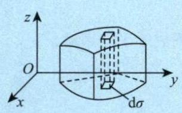

图 14-1

(2) 如果 $f\left( {x, y}\right)$ 是负的,柱体就在 ${xOy}$ 面的下方,二重积分的绝对值仍等于柱体的体积, 但二重积分的值是负的.

(3) 如果 $f\left( {x, y}\right)$ 在 $D$ 的若干部分区域上是正的,而在其他部分区域上是负的,那么, $f\left( {x, y}\right)$ 在 $D$ 上的二重积分就等于 ${xOy}$ 面上方的柱体体积减去 ${xOy}$ 面下方的柱体体积所得之差.

---

### 2. 性质

性质 1 (求区域面积) $\iint\limits_{D}1 \cdot \mathrm{d}\sigma = \iint\limits_{D}\mathrm{\;d}\sigma = A$ ,其中 $A$ 为 $D$ 的面积.

性质 2 (可积函数必有界) 当 $f\left( {x, y}\right)$ 在有界闭区域 $D$ 上可积时, $f\left( {x, y}\right)$ 在 $D$ 上必有界.

性质 3 (积分的线性性质) 设 ${k}_{1},{k}_{2}$ 为常数,则

$$
\iint\limits_{D}\left\lbrack {{k}_{1}f\left( {x, y}\right) \pm {k}_{2}g\left( {x, y}\right) }\right\rbrack \mathrm{d}\sigma = {k}_{1}\iint\limits_{D}f\left( {x, y}\right) \mathrm{d}\sigma \pm {k}_{2}\iint\limits_{D}g\left( {x, y}\right) \mathrm{d}\sigma .
$$

性质 4 (积分的可加性) 设 $f\left( {x, y}\right)$ 在有界闭区域 $D$ 上可积,且 ${D}_{1} \cup {D}_{2} = D,{D}_{1} \cap {D}_{2} = \varnothing$ ,则

$$
\iint\limits_{D}f\left( {x, y}\right) \mathrm{d}\sigma = \iint\limits_{{D}_{1}}f\left( {x, y}\right) \mathrm{d}\sigma + \iint\limits_{{D}_{2}}f\left( {x, y}\right) \mathrm{d}\sigma .
$$

性质 5 (积分的保号性) 当 $f\left( {x, y}\right), g\left( {x, y}\right)$ 在有界闭区域 $D$ 上可积时,若在 $D$ 上有

$$
f\left( {x, y}\right) \leq g\left( {x, y}\right) ,
$$

则有

$$
\iint\limits_{D}f\left( {x, y}\right) \mathrm{d}\sigma \leq \iint\limits_{D}g\left( {x, y}\right) \mathrm{d}\sigma .
$$

特殊地, 有

$$
\left| {\iint\limits_{D}f\left( {x, y}\right) \mathrm{d}\sigma }\right| \leq \iint\limits_{D}\left| {f\left( {x, y}\right) }\right| \mathrm{d}\sigma .
$$

性质 6 (二重积分的估值定理) 设 $M, m$ 分别是 $f\left( {x, y}\right)$ 在有界闭区域 $D$ 上的最大值和最小值, $A$ 为 $D$ 的面积,则有

$$
{mA} \leq \iint\limits_{D}f\left( {x, y}\right) \mathrm{d}\sigma \leq {MA}.
$$

性质 7 (二重积分的中值定理 ) 设函数 $f\left( {x, y}\right)$ 在有界闭区域 $D$ 上连续, $A$ 为 $D$ 的面积,则在 $D$ 上至少存在一点 $\left( {\xi ,\eta }\right)$ ,使得

$$
\iint\limits_{D}f\left( {x, y}\right) \mathrm{d}\sigma = f\left( {\xi ,\eta }\right) A.
$$

例 14.1 设平面闭区域 ${D}_{i}\left( {i = 1,2,3,4}\right)$ 分别是由

$$
{L}_{1} : {x}^{2} + {y}^{2} = 1,{L}_{2} : {x}^{2} + {y}^{2} = 2,
$$

$$
{L}_{3} : {x}^{2} + 2{y}^{2} = 2,{L}_{4} : 2{x}^{2} + {y}^{2} = 2
$$

围成的平面区域, 记

$$
{I}_{i} = \iint\limits_{{D}_{i}}\left( {1 - {x}^{2} - \frac{1}{2}{y}^{2}}\right) \mathrm{d}x\mathrm{\;d}y,
$$

则 $\max \left\{ {{I}_{1},{I}_{2},{I}_{3},{I}_{4}}\right\} = \left( \;\right)$ .

(A) ${I}_{1}$ (B) ${I}_{2}$ (C) ${I}_{3}$ (D) ${I}_{4}$

解 应选 (D).

曲线 ${L}_{i}\left( {i = 1,2,3,4}\right)$ 如图 14-2 所示. 记被积函数为 $f\left( {x, y}\right) =$ $1 - \left( {{x}^{2} + \frac{1}{2}{y}^{2}}\right)$ ,由于 ${L}_{4} : 2{x}^{2} + {y}^{2} = 2$ ,则 ${D}_{4}$ 内部为 ${x}^{2} + \frac{{y}^{2}}{2} < 1$ ,于是在 ${D}_{4}$ 内部有 $f\left( {x, y}\right) > 0$ ,而在 ${D}_{4}$ 外部有 $f\left( {x, y}\right) < 0$ .

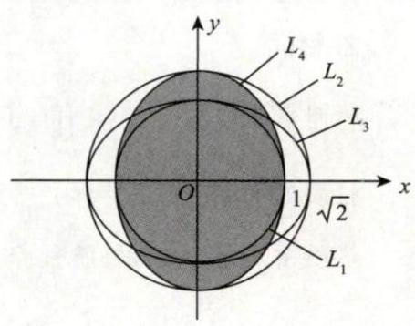

图 14-2

① 比较 ${I}_{1}$ 与 ${I}_{4}$ .

$$
{I}_{4} = \iint\limits_{{D}_{4}}f\left( {x, y}\right) \mathrm{d}x\mathrm{\;d}y = \iint\limits_{{D}_{1}}f\left( {x, y}\right) \mathrm{d}x\mathrm{\;d}y + \iint\limits_{{D}_{4} - {D}_{1}}f\left( {x, y}\right) \mathrm{d}x\mathrm{\;d}y
$$

$$
={I}_{1} + \iint\limits_{{D}_{4} - {D}_{1}}f\left( {x, y}\right) \mathrm{d}x\mathrm{\;d}y > {I}_{1}.
$$

> ${D}_{4} - {D}_{1}$ 上 $f\left( {x, y}\right) > 0$

② 比较 ${I}_{2}$ 与 ${I}_{4}$ .

$$
{I}_{2} = \iint\limits_{{D}_{2}}f\left( {x, y}\right) \mathrm{d}x\mathrm{\;d}y = \iint\limits_{{D}_{4}}f\left( {x, y}\right) \mathrm{d}x\mathrm{\;d}y + \iint\limits_{{D}_{2} - {D}_{4}}f\left( {x, y}\right) \mathrm{d}x\mathrm{\;d}y
$$

$$
{I}_{4} + \iint\limits_{{D}_{2} - {D}_{4}}f\left( {x, y}\right) \mathrm{d}x\mathrm{\;d}y < {I}_{4}.
$$

> ${D}_{2} - {D}_{4}$ 上 $f\left( {x, y}\right) < 0$

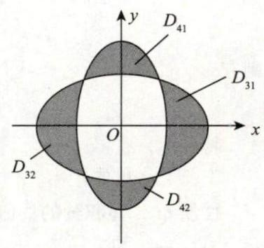

图 14-3

③ 比较 ${I}_{3}$ 与 ${I}_{4}$ . 如图 14-3 所示,将 ${D}_{3},{D}_{4}$ 中互不重合的部分分别记为 ${D}_{31},{D}_{32},{D}_{41},{D}_{42}$ ,则

$$
{I}_{3} = \iint\limits_{{D}_{31}}f\left( {x, y}\right) \mathrm{d}x\mathrm{\;d}y + \iint\limits_{{D}_{32}}f\left( {x, y}\right) \mathrm{d}x\mathrm{\;d}y + \iint\limits_{{D}_{3} \cap {D}_{4}}f\left( {x, y}\right) \mathrm{d}x\mathrm{\;d}y
$$

$$
< \iint\limits_{{D}_{41}}f\left( {x, y}\right) \mathrm{d}x\mathrm{\;d}y + \iint\limits_{{D}_{42}}f\left( {x, y}\right) \mathrm{d}x\mathrm{\;d}y + \iint\limits_{{D}_{3} \cap {D}_{4}}f\left( {x, y}\right) \mathrm{d}x\mathrm{\;d}y
$$

$$
= {I}_{4}\text{.}
$$

> ${D}_{31},{D}_{32}$ 上 $f\left( {x, y}\right) < 0$ ; ${D}_{41},{D}_{42}$ 上 $f\left( {x, y}\right) > 0$

所以 $\max \left\{ {{I}_{1},{I}_{2},{I}_{3},{I}_{4}}\right\} = {I}_{4}$ ,即应选 (D).

---

【注】事实上, ${D}_{4}$ 是使得 $\iint\limits_{D}\left( {1 - {x}^{2} - \frac{1}{2}{y}^{2}}\right) \mathrm{d}x\mathrm{\;d}y$ 取得最大值的区域,因为 ${D}_{4}$ 包含了所有使 $1 - {x}^{2} - \frac{1}{2}{y}^{2}$ 大于零的区域,而不包含任何使 $1 - {x}^{2} - \frac{1}{2}{y}^{2}$ 小于零的区域,由二重积分的性质知 ${I}_{4}$ 最大.

---

例 14.2 设

$$
{D}_{t} = \left\{ {\left( {x, y}\right) \mid 2{x}^{2} + 3{y}^{2} \leq {6t}}\right\} \left( {t \geq 0}\right) ,
$$

$$
f\left( {x, y}\right) = \left\{ \begin{array}{ll} \displaystyle \frac{\sqrt[3]{1 - {xy}} - 1}{{\mathrm{e}}^{xy} - 1}, & {xy} \neq 0, \\ a, & {xy} = 0 \end{array}\right.
$$

为连续函数,令 $F\left( t\right) = \iint\limits_{{D}_{t}}f\left( {x, y}\right) \mathrm{d}x\mathrm{\;d}y$ ,则 ${F}_{ + }^{\prime }\left( 0\right) =$ _____

解 应填 $\displaystyle - \frac{\sqrt{6}\pi }{3}$ .

由例 13.2 可知 $\displaystyle a = - \frac{1}{3}$ .

由二重积分中值定理知,存在 $\left( {\xi ,\eta }\right) \in {D}_{t}$ ,使得

$$
F\left( t\right) = \iint\limits_{{D}_{t}}f\left( {x, y}\right) \mathrm{d}x\mathrm{\;d}y = \sqrt{6}{\pi tf}\left( {\xi ,\eta }\right) .
$$

于是,

$$
{F}_{ + }^{\prime }\left( 0\right) = \mathop{\lim }\limits_{{t \rightarrow {0}^{ + }}}\frac{F\left( t\right) - F\left( 0\right) }{t - 0} = \mathop{\lim }\limits_{{t \rightarrow {0}^{ + }}}\frac{\sqrt{6}{\pi tf}\left( {\xi ,\eta }\right) }{t} = \mathop{\lim }\limits_{{t \rightarrow {0}^{ + }}}\sqrt{6}{\pi f}\left( {\xi ,\eta }\right)
$$

$$
= \sqrt{6}{\pi f}\left( {0,0}\right) = - \frac{\sqrt{6}\pi }{3}.
$$

---

【注】此题的被积函数命制成具体函数,但 $\iint\limits_{{D}_{t}}f\left( {x, y}\right) \mathrm{d}\sigma$ 难以计算,故考虑利用二重积分中值定理来处理. 同理, 若被积函数命制成抽象函数, 也可以考虑利用二重积分中值定理来处理, 如: 设 $f\left( {x, y}\right)$ 具有二阶连续偏导数,

$$
{D}_{t} = \{ \left( {x, y}\right) \mid 0 \leq x \leq t,0 \leq y \leq t\} ,
$$

令 $F\left( t\right) = \iint\limits_{{D}_{t}}{f}_{xy}^{\prime \prime }\left( {x, y}\right) \mathrm{d}x\mathrm{\;d}y$ ,求 ${F}_{ + }^{\prime }\left( 0\right)$ .

解

$$
{F}_{ + }^{\prime }\left( 0\right) = \mathop{\lim }\limits_{{t \rightarrow {0}^{ + }}}\frac{F\left( t\right) - F\left( 0\right) }{t - 0} = \mathop{\lim }\limits_{{t \rightarrow {0}^{ + }}}\frac{\iint\limits_{{D}_{t}}{f}_{xy}^{\prime \prime }\left( {x, y}\right) \mathrm{d}x\mathrm{\;d}y}{t - 0}
$$

$$
\xlongequal{\text{二重积分中值定理}}\mathop{\lim }\limits_{{t \rightarrow {0}^{ + }}}\frac{{f}_{xy}^{\prime \prime }\left( {\xi ,\eta }\right) \cdot {t}^{2}}{t} = \mathop{\lim }\limits_{{t \rightarrow {0}^{ + }}}t \cdot {f}_{xy}^{\prime \prime }\left( {\xi ,\eta }\right) = 0\text{.}
$$

> $\mathop{\lim }\limits_{{t \rightarrow {0}^{ + }}}{f}_{xy}^{\prime \prime }\left( {\xi ,\eta }\right)={f}_{xy}^{\prime \prime }\left( {0,0}\right)$

---

### 3. 普通对称性与轮换对称性

#### (1) 普通对称性

设区域 $D$ 关于 $y$ 轴对称,如图 14-4 所示,取对称的两块小面积 $\mathrm{d}\sigma$ ,对称点分别为 $\left( {x, y}\right)$ 与 $\left( {-x, y}\right)$ ,则对称点处的高分别为 $f\left( {x, y}\right)$ 与 $f\left( {-x, y}\right)$ . 依据定义,对称位置的两个 “小竖条” 的体积分别为 $f\left( {x, y}\right) \mathrm{d}\sigma$ 与 $f\left( {-x, y}\right) \mathrm{d}\sigma$ . 因为 $\mathrm{d}\sigma$ 一样,所以,当 $f\left( {x, y}\right) = f\left( {-x, y}\right)$ 时, $f\left( {x, y}\right) \mathrm{d}\sigma = f\left( {-x, y}\right) \mathrm{d}\sigma$ , 体积相同, 此时只需计算对称区域的一半, 然后乘以 2 即可得到整个积分值; 而当 $f\left( {x, y}\right) = - f\left( {-x, y}\right)$ 时, $f\left( {x, y}\right) \mathrm{d}\sigma = - f\left( {-x, y}\right) \mathrm{d}\sigma$ ,对称区域的体积正好相反, 这样累加起来的总体积自然就是 0 . 于是, 我们有

$$
\iint\limits_{D}f\left( {x, y}\right) \mathrm{d}x\mathrm{\;d}y = \left\{ \begin{array}{lll} 2\iint\limits_{{D}_{1}}f\left( {x, y}\right) \mathrm{d}x\mathrm{\;d}y, & f\left( {x, y}\right) = f\left( {-x, y}\right) , &  \\ 0, & f\left( {x, y}\right) = - f\left( {-x, y}\right) , & \end{array}\right.
$$

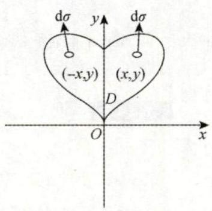

图 14-4

其中 ${D}_{1}$ 是 $D$ 在 $y$ 轴右侧的部分.

你看, 用这种基于概念的分析方法, 不用死记硬背, 而且真正理解了性质的本质. 现将二重积分有关的对称性全面总结如下.

①若 $D$ 关于 $y$ 轴对称,则

$$
\iint\limits_{D}f\left( {x, y}\right) \mathrm{d}\sigma = \left\{ \begin{array}{ll} 2\iint\limits_{{D}_{1}}f\left( {x, y}\right) \mathrm{d}\sigma , & f\left( {x, y}\right) = f\left( {-x, y}\right) , \\ 0, & f\left( {x, y}\right) = - f\left( {-x, y}\right) , \end{array}\right.
$$

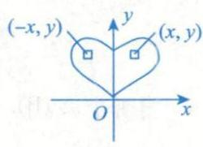

其中 ${D}_{1}$ 是 $D$ 在 $y$ 轴右侧的部分.

---

【注】若 $D$ 关于 $x = a\left( {a \neq 0}\right)$ 对称,则

$$
\iint\limits_{D}f\left( {x, y}\right) \mathrm{d}\sigma = \left\{ \begin{array}{ll} 2\iint\limits_{{D}_{1}}f\left( {x, y}\right) \mathrm{d}\sigma , & f\left( {x, y}\right) = f\left( {{2a} - x, y}\right) , \\ 0, & f\left( {x, y}\right) = - f\left( {{2a} - x, y}\right) , \end{array}\right.
$$

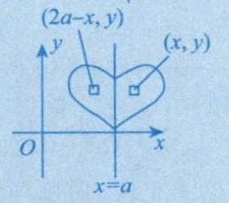

其中 ${D}_{1}$ 是 $D$ 在 $x = a$ 右侧的部分.

如 $\iint\limits_{D}\left( {x - a}\right) \mathrm{d}\sigma = 0$ ，因 $f\left( {x, y}\right) = x - a$ ，而 $f\left( {{2a} - x, y}\right) = a - x$ .

---

② 若 $D$ 关于 $x$ 轴对称,则

$$
\iint\limits_{D}f\left( {x, y}\right) \mathrm{d}\sigma = \left\{ \begin{array}{ll} 2\iint\limits_{{D}_{1}}f\left( {x, y}\right) \mathrm{d}\sigma , & f\left( {x, y}\right) = f\left( {x, - y}\right) , \\ 0, & f\left( {x, y}\right) = - f\left( {x, - y}\right) , \end{array}\right.
$$

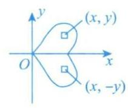

其中 ${D}_{1}$ 是 $D$ 在 $x$ 轴上侧的部分.

【注】若 $D$ 关于 $y = a\left( {a \neq 0}\right)$ 对称,则

$$
\iint\limits_{D}f\left( {x, y}\right) \mathrm{d}\sigma = \left\{ \begin{array}{ll} 2\iint\limits_{{D}_{1}}f\left( {x, y}\right) \mathrm{d}\sigma , & f\left( {x, y}\right) = f\left( {x,{2a} - y}\right) , \\ 0, & f\left( {x, y}\right) = - f\left( {x,{2a} - y}\right) , \end{array}\right.
$$

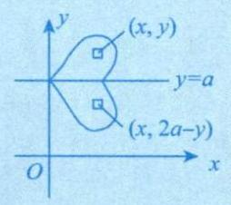

其中 ${D}_{1}$ 是 $D$ 在 $y = a$ 上侧的部分.

---

③若 $D$ 关于原点对称,则

$$
\iint\limits_{D}f\left( {x, y}\right) \mathrm{d}\sigma = \left\{ \begin{array}{ll} 2\iint\limits_{{D}_{1}}f\left( {x, y}\right) \mathrm{d}\sigma , & f\left( {x, y}\right) = f\left( {-x, - y}\right) , \\ 0, & f\left( {x, y}\right) = - f\left( {-x, - y}\right) , \end{array}\right.
$$

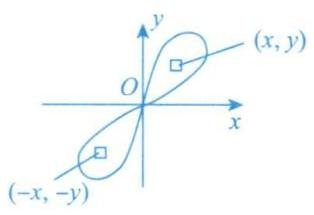

其中 ${D}_{1}$ 是 $D$ 关于原点对称的半个部分.

④若 $D$ 关于 $y = x$ 对称,则

$$
\iint\limits_{D}f\left( {x, y}\right) \mathrm{d}\sigma = \left\{ \begin{array}{ll} 2\iint\limits_{{D}_{1}}f\left( {x, y}\right) \mathrm{d}\sigma , & f\left( {x, y}\right) = f\left( {y, x}\right) , \\ 0, & f\left( {x, y}\right) = - f\left( {y, x}\right) , \end{array}\right.
$$

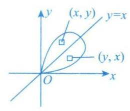

其中 ${D}_{1}$ 是 $D$ 关于 $y = x$ 对称的半个部分.

> $x, y$ 对调, $f\left( {x, y}\right) = f\left( {y, x}\right)$

例 14.3 设 ${J}_{i} = \iint\limits_{{D}_{i}}\sqrt[3]{x - y}\mathrm{\;d}x\mathrm{\;d}y\left( {i = 1,2,3}\right)$ ,其中 ${D}_{1} = \{ \left( {x, y}\right) \mid 0 \leq x \leq 1,0 \leq y \leq 1\} ,{D}_{2} = \{ \left( {x, y}\right) \mid 0 \leq$ $x \leq 1,0 \leq y \leq \sqrt{x}\} ,{D}_{3} = \left\{ {\left( {x, y}\right) \mid 0 \leq x \leq 1,{x}^{2} \leq y \leq 1}\right\}$ ,则 $\left( \;\right)$ .

(A) ${J}_{1} < {J}_{2} < {J}_{3}$ (B) ${J}_{3} < {J}_{1} < {J}_{2}$ (C) ${J}_{2} < {J}_{3} < {J}_{1}$ (D) ${J}_{2} < {J}_{1} < {J}_{3}$

解 应选 (B).

如图 14-5(a) 所示, ${D}_{1}$ 被直线 $y = x$ 分成 ${D}_{11}$ 和 ${D}_{12}$ 两部分,故 $\iint\limits_{{D}_{1}}\sqrt{x - y}\mathrm{\;d}x\mathrm{\;d}y = \iint\limits_{{D}_{11} + {D}_{12}}\sqrt[3]{x - y}\mathrm{\;d}x\mathrm{\;d}y$ ,由于 $\sqrt[3]{x - y} = - \sqrt[3]{y - x}$ ,故由普通对称性,有 ${J}_{1} = \iint\limits_{{D}_{1}}\sqrt{x - y}\mathrm{\;d}x\mathrm{\;d}y = 0$ .

如图 14-5(b) 所示,作辅助线 $y = {x}^{2}$ ,将 ${D}_{2}$ 分为 ${D}_{21}$ 和 ${D}_{22}$ 两部分,由普通对称性知, $\iint\limits_{{D}_{21}}\sqrt{x - y}\mathrm{\;d}x\mathrm{\;d}y = 0$ . 而在 ${D}_{22}$ 上, $\sqrt[3]{x - y} \geq 0$ ,由保号性知,

$$
{J}_{2} = \iint\limits_{{D}_{2}}\sqrt{x - y}\mathrm{\;d}x\mathrm{\;d}y = \iint\limits_{{D}_{22}}\sqrt{x - y}\mathrm{\;d}x\mathrm{\;d}y > 0.
$$

如图 14-5(c) 所示,作辅助线 $y = \sqrt{x}$ ,将 ${D}_{3}$ 分为 ${D}_{31}$ 和 ${D}_{32}$ 两部分,由普通对称性知, $\iint\limits_{{D}_{32}}\sqrt[3]{x - y}\mathrm{\;d}x\mathrm{\;d}y = 0$ . 而在 ${D}_{31}$ 上, $\sqrt[3]{x - y} \leq 0$ ,由保号性知,

$$
{J}_{3} = \iint\limits_{{D}_{3}}\sqrt{x - y}\mathrm{\;d}x\mathrm{\;d}y = \iint\limits_{{D}_{31}}\sqrt{x - y}\mathrm{\;d}x\mathrm{\;d}y < 0.
$$

综上, ${J}_{3} < {J}_{1} < {J}_{2}$ .

图 14-5

#### (2) 轮换对称性

引例 1

$$
\iint\limits_{{D}_{1} : \frac{{x}^{2}}{4} + \frac{{y}^{2}}{3} \leq 1}\left( {2{x}^{2} + 3{y}^{2}}\right) \mathrm{d}x\mathrm{\;d}y\overset{?}{ = }\iint\limits_{{D}_{2} : \frac{y^2}{4} + \frac{x^2}{3} \leq 1}\left( {2{y}^{2} + 3{x}^{2}}\right) \mathrm{d}y\mathrm{\;d}x.
$$

解 因为上述两个积分只是将 $x$ 与 $y$ 这两个字母对调了,而 **积分值与用什么字母表示是无关的** ,故它们是相等的.

引例 2

$$
\iint\limits_{D : \frac{{x}^{2}}{4} + \frac{{y}^{2}}{4} \leq 1}\left( {2{x}^{2} + 3{y}^{2}}\right) \mathrm{d}x\mathrm{\;d}y\overset{?}{ = }\iint\limits_{D : \frac{{x}^{2}}{4} + \frac{{y}^{2}}{4} \leq 1}\left( {2{y}^{2} + 3{x}^{2}}\right) \mathrm{d}y\mathrm{\;d}x.
$$

解 理由如上, 它们也是相等的.

引例 2 中的区域 $D$ 有个特点,就是当你把 $x$ 与 $y$ 对调后,区域 $D$ 不变 (事实上,区域 $D$ 关于 $y = x$ 对称). 于是抽象化写出的式子为

$$
\iint\limits_{D}f\left( {x, y}\right) \mathrm{d}x\mathrm{\;d}y = \iint\limits_{D}f\left( {y, x}\right) \mathrm{d}y\mathrm{\;d}x.
$$

整理一下, 我们可以这样来描述:

在直角坐标系下,若把 $x$ 与 $y$ 对调后,区域 $D$ 不变 (或区域 $D$ 关于 $y = x$ 对称),则

$$
\iint\limits_{D}f\left( {x, y}\right) \mathrm{d}\sigma = \iint\limits_{D}f\left( {y, x}\right) \mathrm{d}\sigma ,
$$

这就是 **轮换对称性** .

---

【注】(1) 在直角坐标系中,若 $f\left( {x, y}\right) + f\left( {y, x}\right) \underset{(>)}{ = } a$ ,则

$$
I = \frac{1}{2}\iint\limits_{D}\left\lbrack {f\left( {x, y}\right) + f\left( {y, x}\right) }\right\rbrack \mathrm{d}x\mathrm{d}y\underset{(>)}{ = }\frac{1}{2}\iint\limits_{D}a\mathrm{\;d}x\mathrm{\;d}y = \frac{a}{2}{S}_{D}.
$$

(2) 要注意区分普通对称性中的④ 与这里轮换对称性的区别与联系. 虽然它们都是 $D$ 关于 $y = x$ 对称,但普通对称性考查的是 $f\left( {x, y}\right)$ 与 $f\left( {y, x}\right)$ 是相等还是相反,轮换对称性考查的是 $f\left( {x, y}\right) + f\left( {y, x}\right)$ 是否简单. 事实上,当 $f\left( {x, y}\right) = - f\left( {y, x}\right)$ 时,它们是一回事.

---

例 14.4 设 $\displaystyle f\left( x\right) = \iint\limits_{D\left( x\right) }\frac{v\ln \sqrt{{u}^{2} + {v}^{2}}}{u + v}\mathrm{\;d}u\mathrm{\;d}v, D\left( x\right) = \left\{ {\left( {u, v}\right) \mid {u}^{2} + {v}^{2} \leq {x}^{2}}\right\}$ ,则 $f\left( x\right) = \left( \;\right)$ .

(A) $\frac{1}{4}\iint\limits_{D\left( x\right) }\ln \left( {{u}^{2} + {v}^{2}}\right) \mathrm{d}u\mathrm{\;d}v$ (B) $\frac{1}{2}\iint\limits_{D\left( x\right) }\ln \left( {{u}^{2} + {v}^{2}}\right) \mathrm{d}u\mathrm{\;d}v$

(C) $\iint\limits_{D\left( x\right) }\ln \left( {{u}^{2} + {v}^{2}}\right) \mathrm{d}u\mathrm{\;d}v$ (D) $2\iint\limits_{D\left( x\right) }\ln \left( {{u}^{2} + {v}^{2}}\right) \mathrm{d}u\mathrm{\;d}v$

解 应选 (A).

由轮换对称性, 有

$$
f\left( x\right) = \iint\limits_{D\left( x\right) }\frac{v\ln \sqrt{{u}^{2} + {v}^{2}}}{u + v}\mathrm{\;d}u\mathrm{\;d}v = \iint\limits_{D\left( x\right) }\frac{u\ln \sqrt{{u}^{2} + {v}^{2}}}{u + v}\mathrm{\;d}u\mathrm{\;d}v
$$

$$
= \frac{1}{2}\iint\limits_{D\left( x\right) }\ln \sqrt{{u}^{2} + {v}^{2}}\mathrm{\;d}u\mathrm{\;d}v = \frac{1}{4}\iint\limits_{D\left( x\right) }\ln \left( {{u}^{2} + {v}^{2}}\right) \mathrm{d}u\mathrm{\;d}v.
$$

## 二、计算

### 1. 直角坐标系下的计算方法

在直角坐标系下, 按照积分次序的不同, 一般将二重积分的计算分为两种情况, 如图 14-6 所示.

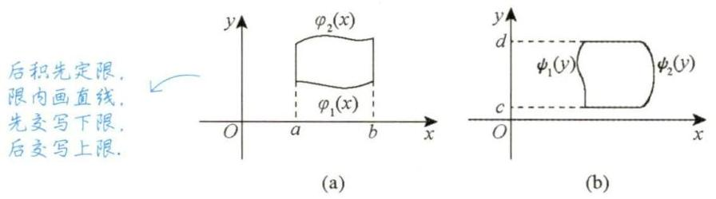

图 14-6

(1) $\iint\limits_{D}f\left( {x, y}\right) \mathrm{d}\sigma = {\int }_{a}^{b}\mathrm{\;d}x{\int }_{{\varphi }_{1}\left( x\right) }^{{\varphi }_{2}\left( x\right) }f\left( {x, y}\right) \mathrm{d}y$ ,其中 $D$ 为 $X$ 型区域: ${\varphi }_{1}\left( x\right) \leq y \leq {\varphi }_{2}\left( x\right), a \leq x \leq b$ ;

(2) $\iint\limits_{D}f\left( {x, y}\right) \mathrm{d}\sigma = {\int }_{c}^{d}\mathrm{\;d}y{\int }_{{\psi }_{1}\left( y\right) }^{{\psi }_{2}\left( y\right) }f\left( {x, y}\right) \mathrm{d}x$ ,其中 $D$ 为 $Y$ 型区域: ${\psi }_{1}\left( y\right) \leq x \leq {\psi }_{2}\left( y\right), c \leq y \leq d$ .

---

【注】(1) 有一点需要指出, 这里的下限都必须小于等于上限.

(2) 若被积函数 $f\left( {x, y}\right)$ 易于对 $y$ 积分或积分区域 $D$ 是 $X$ 型区域,则选择先 $y$ 后 $x$ 的积分次序;

若被积函数 $f\left( {x, y}\right)$ 易于对 $x$ 积分或积分区域 $D$ 是 $Y$ 型区域,则选择先 $x$ 后 $y$ 的积分次序.

(3) 计算二重积分的关键是确定积分限,为此,要画好积分区域 $D$ 的边界图形,当 $D$ 的边界图形不易画出时,要写出 $D$ 的不等式表达式,从而确定上下限.

---

例 14.5 设函数 $f\left( {x, y}\right)$ 连续,则二次积分 ${\int }_{\frac{\pi }{2}}^{\pi }\mathrm{d}x{\int }_{\sin x}^{1}f\left( {x, y}\right) \mathrm{d}y = \left( \;\right)$ .

(A) ${\int }_{0}^{1}\mathrm{\;d}y{\int }_{\pi + \arcsin y}^{\pi }f\left( {x, y}\right) \mathrm{d}x$ (B) ${\int }_{0}^{1}\mathrm{\;d}y{\int }_{\pi - \arcsin y}^{\pi }f\left( {x, y}\right) \mathrm{d}x$

(C) ${\int }_{0}^{1}\mathrm{\;d}y{\int }_{\frac{\pi }{2}}^{\pi + \arcsin y}f\left( {x, y}\right) \mathrm{d}x$ (D) ${\int }_{0}^{1}\mathrm{\;d}y{\int }_{\frac{\pi }{2}}^{\pi - \arcsin y}f\left( {x, y}\right) \mathrm{d}x$

解 应选 (B).

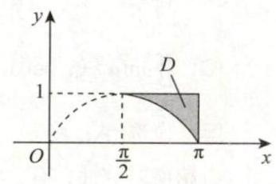

图 14-7

根据所给二次积分得到积分区域为 $D : \left\{ \begin{array}{l} \sin x < y < 1, \\ \frac{\pi }{2} < x < \pi , \end{array}\right.$ 如图 14-7 所示,则

$$
{\int }_{\frac{\pi }{2}}^{\pi }\mathrm{d}x{\int }_{\sin x}^{1}f\left( {x, y}\right) \mathrm{d}y = {\int }_{0}^{1}\mathrm{\;d}y{\int }_{\pi - \arcsin y}^{\pi }f\left( {x, y}\right) \mathrm{d}x.
$$

> 由例1.12得，当 $\frac{\pi }{2} < x \leq \frac{3}{2}\pi$ 时， $x = \pi - \arcsin y$

例 14.6 当 $x \rightarrow {0}^{ + }$ 时, $f\left( x\right) = {\int }_{0}^{{x}^{2}}\mathrm{\;d}y{\int }_{x}^{\sqrt{y}}\sin \frac{y}{t}\mathrm{\;d}t$ 与 $g\left( x\right) = a{x}^{b}$ 是等价无穷小量,则 ${ab} =$

解 应填 $- \frac{1}{2}$ .

$$
f\left( x\right) = {\int }_{0}^{{x}^{2}}\mathrm{\;d}y{\int }_{x}^{\sqrt{y}}\sin \frac{y}{t}\mathrm{\;d}t = - {\int }_{0}^{{x}^{2}}\mathrm{\;d}y{\int }_{\sqrt{y}}^{x}\sin \frac{y}{t}\mathrm{\;d}t
$$

$$
= - \iint\limits_{D}\sin \frac{y}{t}\mathrm{\;d}\sigma = - {\int }_{0}^{x}\mathrm{\;d}t{\int }_{0}^{{t}^{2}}\sin \frac{y}{t}\mathrm{\;d}y
$$

$$
= {\int }_{0}^{x}t \cdot {\left. \left( \cos \frac{y}{t}\right) \right| }_{y = 0}^{y = {t}^{2}}\mathrm{\;d}t
$$

$$
= {\int }_{0}^{x}t\left( {\cos t - 1}\right) \mathrm{d}t
$$

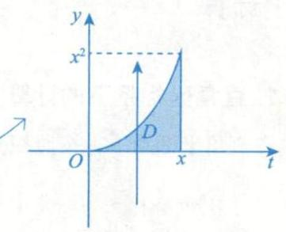

于是 $\mathop{\lim }\limits_{{x \rightarrow {0}^{ + }}}\frac{f\left( x\right) }{g\left( x\right) } = \mathop{\lim }\limits_{{x \rightarrow {0}^{ + }}}\frac{x\left( {\cos x - 1}\right) }{{ab}{x}^{b - 1}} = \mathop{\lim }\limits_{{x \rightarrow {0}^{ + }}}\frac{-\frac{1}{2}{x}^{3}}{{ab}{x}^{b - 1}} = 1$ ,故 ${ab} = - \frac{1}{2}$ .

---

【注】(1) $\int \frac{\sin x}{x}\mathrm{\;d}x,\int \frac{\cos x}{x}\mathrm{\;d}x,\int \frac{\ln \left( {1 + x}\right) }{x}\mathrm{\;d}x,\int \frac{1}{\ln x}\mathrm{\;d}x,\int \sin {x}^{2}\mathrm{\;d}x,\int \cos {x}^{2}\mathrm{\;d}x,\int \sin \frac{1}{x}\mathrm{\;d}x,\int \cos \frac{1}{x}\mathrm{\;d}x$ ,

$\int \frac{\tan x}{x}\mathrm{\;d}x,\int \frac{{\mathrm{e}}^{x}}{x}\mathrm{\;d}x,\int \tan {x}^{2}\mathrm{\;d}x,\int {\mathrm{e}}^{a{x}^{2} + {bx} + c}\mathrm{\;d}x\left( {a \neq 0}\right)$ 均没有初等函数形式的原函数,见到它们,一般都要交换积分次序.

(2) 事实上, $a = - \frac{1}{8}, b = 4$ .

---

例 14.7 计算 ${\int }_{0}^{1}\mathrm{\;d}y{\int }_{y}^{1}\arcsin \sqrt{{4x} - 4{x}^{2}}\mathrm{\;d}x$ .

解 先对 $x$ 积分较困难,交换积分次序.

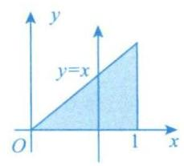

$$
\text{原式} = {\int }_{0}^{1}\mathrm{\;d}x{\int }_{0}^{x}\arcsin \sqrt{{4x} - 4{x}^{2}}\mathrm{\;d}y
$$

$$
= {\int }_{0}^{1}x\arcsin \sqrt{{4x} - 4{x}^{2}}\mathrm{\;d}x \xlongequal{\text{由例9.15知}} \frac{1}{2}
$$

### 2. 极坐标系下的计算方法

在极坐标系下, 按照积分区域与极点位置关系的不同, 一般将二重积分的计算分为三种情况, 如图 14-8 所示.

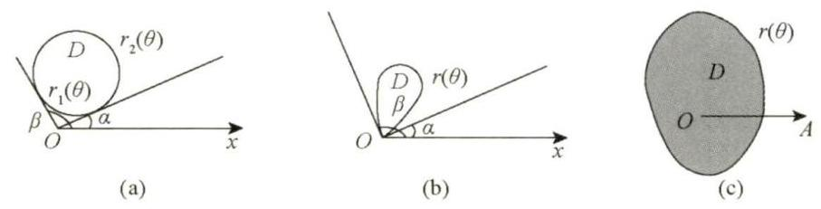

图 14-8

极坐标: $\left\{ \begin{array}{l} x = r\cos \theta , \\ y = r\sin \theta , \end{array}\right. \mathrm{d}x\mathrm{d}y = r\mathrm{d}r\mathrm{d}\theta$ .

(1) $\iint\limits_{D}f\left( {x, y}\right) \mathrm{d}\sigma = {\int }_{\alpha }^{\beta }\mathrm{d}\theta {\int }_{{r}_{1}\left( \theta \right) }^{{r}_{2}\left( \theta \right) }f\left( {r\cos \theta, r\sin \theta }\right) r\mathrm{\;d}r$ (极点 $O$ 在区域 $D$ 外部);

(2) $\iint\limits_{D}f\left( {x, y}\right) \mathrm{d}\sigma = {\int }_{\alpha }^{\beta }\mathrm{d}\theta {\int }_{0}^{r\left( \theta \right) }f\left( {r\cos \theta, r\sin \theta }\right) r\mathrm{\;d}r$ (极点 $O$ 在区域 $D$ 边界上);

(3) $\iint\limits_{D}f\left( {x, y}\right) \mathrm{d}\sigma = {\int }_{0}^{2\pi }\mathrm{d}\theta {\int }_{0}^{r\left( \theta \right) }f\left( {r\cos \theta, r\sin \theta }\right) r\mathrm{\;d}r$ (极点 $O$ 在区域 $D$ 内部).

---

【注】极坐标系与直角坐标系选择的一般原则.

一般来说, 给出一个二重积分. （是否用极坐标系计算主要看①）.

①看被积函数是否为 $f\left( {{x}^{2} + {y}^{2}}\right), f\left( \frac{y}{x}\right), f\left( \frac{x}{y}\right)$ 等形式;

②看积分区域是否为圆或者圆的一部分.

如果①, ②至少满足其中之一, 那么优先选用极坐标系, 否则, 就优先考虑直角坐标系.

---

例 14.8 设区域 $D = \left\{ {\left( {x, y}\right) \mid {x}^{2} + {y}^{2} \leq \sqrt{2}}\right\}$ ,则 $\displaystyle\iint\limits_{D}\left( {{x}^{2} + \frac{{y}^{2}}{2}}\right) \mathrm{d}x\mathrm{\;d}y =$ ___.

解 应填 $\frac{3\pi }{4}$ .

$$
\iint\limits_{D}\left( {{x}^{2} + \frac{{y}^{2}}{2}}\right) \mathrm{d}x\mathrm{\;d}y \xlongequal{\text{用轮换对称性}} \iint\limits_{D}\left( {{y}^{2} + \frac{{x}^{2}}{2}}\right) \mathrm{d}x\mathrm{\;d}y = \frac{1}{2}\left( {1 + \frac{1}{2}}\right) \iint\limits_{D}\left( {{x}^{2} + {y}^{2}}\right) \mathrm{d}x\mathrm{\;d}y
$$

$$
= \frac{1}{2}\left( {1 + \frac{1}{2}}\right) {\int }_{0}^{2\pi }\mathrm{d}\theta {\int }_{0}^{{2}^{\frac{1}{4}}}\left( {{r}^{2}{\cos }^{2}\theta + {r}^{2}{\sin }^{2}\theta }\right) r\mathrm{\;d}r = \frac{3\pi }{4}.
$$

例 14.9 设平面有界区域 $D$ 位于第一象限,由曲线 ${x}^{2} + {y}^{2} - {xy} = 1,{x}^{2} + {y}^{2} - {xy} = 2$ 与直线 $y =$ $\sqrt{3}x, y = 0$ 围成,计算 $\displaystyle\iint\limits_{D}\frac{1}{3{x}^{2} + {y}^{2}}\mathrm{\;d}x\mathrm{\;d}y$ .

解 在考试时,有些 $D$ 的边界图形不易画出,考生可根据 $D$ 的表达式来确定上下限. 由 ${x}^{2} + {y}^{2} - {xy} = 2$ 得 ${r}^{2} - {r}^{2}\sin \theta \cos \theta = 2$ ,故 $r = \sqrt{\frac{2}{1 - \cos \theta \sin \theta }}$ . 又 $y = \sqrt{3}x$ ,得 $r\sin \theta = \sqrt{3}r\cos \theta$ ,有 $\tan \theta = \sqrt{3}$ ,则 $\theta = \frac{\pi }{3}$ .

$$
\iint\limits_{D}\frac{1}{3{x}^{2} + {y}^{2}}\mathrm{\;d}x\mathrm{\;d}y = {\int }_{0}^{\frac{\pi }{3}}\mathrm{\;d}\theta {\int }_{\sqrt{\frac{1}{1 - \cos \theta \sin \theta }}}^{\sqrt{\frac{2}{1 - \cos \theta \sin \theta }}} \cdot \frac{1}{{r}^{2}\left( {3{\cos }^{2}\theta + {\sin }^{2}\theta }\right) }r\mathrm{\;d}r
$$

$$
= {\int }_{0}^{\frac{\pi }{3}}\mathrm{\;d}\theta {\int }_{\sqrt{\frac{1}{1 - \cos \theta \sin \theta }}}^{\sqrt{\frac{2}{1 - \cos \theta \sin \theta }}} \cdot \frac{1}{3{\cos }^{2}\theta + {\sin }^{2}\theta } \cdot \frac{1}{r}\mathrm{\;d}r
$$

> $\displaystyle\ln r\left| {\;\frac{\sqrt{\frac{2}{1 - \cos \theta \sin \theta }}}{\sqrt{\frac{1}{1 - \cos \theta \sin \theta }}} = \frac{\ln 2}{2}}\right.$

$$
= \frac{\ln 2}{2}{\int }_{0}^{\frac{\pi }{3}}\frac{1}{3{\cos }^{2}\theta + {\sin }^{2}\theta }\mathrm{d}\theta
$$

$$
= \frac{\ln 2}{2}{\int }_{0}^{\frac{\pi }{3}}\frac{1}{3 + {\tan }^{2}\theta }\mathrm{d}\left( {\tan \theta }\right)
$$

$$
= {\left. \frac{\ln 2}{2}\left( \frac{1}{\sqrt{3}}\arctan \frac{\tan \theta }{\sqrt{3}}\right) \right| }_{0}^{\frac{\pi }{3}}
$$

$$
= \frac{\sqrt{3}\ln 2}{24}\pi
$$

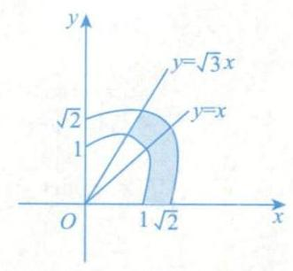

---

【注】本题有两个办法画出 $D$ 的边界图形.

第一,描点法. 显然, ${x}^{2} + {y}^{2} - {xy} = 1$ 与 ${x}^{2} + {y}^{2} - {xy} = 2$ 分别与 $x$ 轴、 $y$ 轴和 $y = x$ 交于 $\left( {1,0}\right)$ 与 $\left( {\sqrt{2},0}\right) ,\left( {0,1}\right)$ 与 $\left( {0,\sqrt{2}}\right) ,\left( {1,1}\right)$ 与 $\left( {\sqrt{2},\sqrt{2}}\right)$ ,将这些点连起来即可得到其大致图形.

第二,事实上, ${x}^{2} + {y}^{2} - {xy} = \left( {xy}\right) \left( \begin{matrix} 1 & - \frac{1}{2} \\ - \frac{1}{2} & 1 \end{matrix}\right) \left( \begin{array}{l} x \\ y \end{array}\right)$ ,其二次型矩阵为 $\mathbf{A} = \left( \begin{matrix} 1 & - \frac{1}{2} \\ - \frac{1}{2} & 1 \end{matrix}\right) ,\left| {\lambda \mathbf{E} - \mathbf{A}}\right| =$

$\left| \begin{matrix} \lambda - 1 & \frac{1}{2} \\ 1 & \lambda \\ \frac{1}{2} & \lambda - 1 \end{matrix}\right| = 0$ ,得 ${\lambda }_{1} = \frac{1}{2},{\lambda }_{2} = \frac{3}{2}$ (或用配方法 ${x}^{2} + {y}^{2} - {xy} = {\left( x - \frac{1}{2}y\right) }^{2} + \frac{3}{4}{y}^{2}$ ). 故 ${x}^{2} + {y}^{2} - {xy}$ 可经正

交变换化为 $\frac{1}{2}{y}_{1}^{2} + \frac{3}{2}{y}_{2}^{2}$ ,于是 $\frac{1}{2}{y}_{1}^{2} + \frac{3}{2}{y}_{2}^{2} = 1$ 与 $\frac{1}{2}{y}_{1}^{2} + \frac{3}{2}{y}_{2}^{2} = 2$ 均为椭圆,即可画出图形.

---

例 14.10 设 $\displaystyle f\left( x\right) = \iint\limits_{D\left( x\right) }\frac{v\ln \sqrt{{u}^{2} + {v}^{2}}}{u + v}\mathrm{\;d}u\mathrm{\;d}v, D\left( x\right) = \left\{ {\left( {u, v}\right) \mid {u}^{2} + {v}^{2} \leq {x}^{2}}\right\}$ ,求曲线 $y\left( x\right) = {\int }_{1}^{x}f\left( t\right) \mathrm{d}t\left( {x > 0}\right)$ 的拐点.

解 由轮换对称性, 根据例 14.4 知, 有

$$
f\left( x\right) = \frac{1}{4}\iint\limits_{D\left( x\right) }\ln \left( {{u}^{2} + {v}^{2}}\right) \mathrm{d}u\mathrm{\;d}v
$$

$$
= \frac{1}{4}{\int }_{0}^{2\pi }\mathrm{d}\theta {\int }_{0}^{x}\ln {r}^{2} \cdot r\mathrm{\;d}r
$$

$$
= \frac{\pi }{4}{\int }_{0}^{x}\ln {r}^{2}\mathrm{\;d}\left( {r}^{2}\right) = \frac{\pi }{4}\left( {{\left. {r}^{2}\ln {r}^{2}\right| }_{0}^{x} - {\int }_{0}^{x}{r}^{2} \cdot \frac{2r}{{r}^{2}}\mathrm{\;d}r}\right)
$$

$$
= \frac{\pi }{4}\left( {2{x}^{2}\ln x - {x}^{2}}\right) ,
$$

故 ${y}^{\prime }\left( x\right) = f\left( x\right) ,{y}^{\prime \prime }\left( x\right) = \frac{\pi }{4}\left( {{4x}\ln x + {2x} - {2x}}\right) = {\pi x}\ln x\xlongequal{\text{ 令 }}0$ ,得 $x = 1$ ,当 $0 < x < 1$ 时, ${y}^{\prime \prime }\left( x\right) < 0$ ,当 $x > 1$ 时, ${y}^{\prime \prime }\left( x\right) > 0$ ,于是 $\left( {1,0}\right)$ 为 $y\left( x\right)$ 的拐点.

例 14.11 计算 ${\int }_{0}^{+\infty }{\mathrm{e}}^{-{x}^{2}}\mathrm{\;d}x$ .

解 设 $I = {\int }_{0}^{+\infty }{\mathrm{e}}^{-{x}^{2}}\mathrm{\;d}x$ ,则

$$
{I}^{2} = {\int }_{0}^{+\infty }{\mathrm{e}}^{-{x}^{2}}\mathrm{\;d}x \cdot {\int }_{0}^{+\infty }{\mathrm{e}}^{-{x}^{2}}\mathrm{\;d}x = {\int }_{0}^{+\infty }{\mathrm{e}}^{-{x}^{2}}\mathrm{\;d}x \cdot {\int }_{0}^{+\infty }{\mathrm{e}}^{-{y}^{2}}\mathrm{\;d}y
$$

$$
= {\int }_{0}^{+\infty }\mathrm{d}x{\int }_{0}^{+\infty }{\mathrm{e}}^{-\left( {{x}^{2} + {y}^{2}}\right) }\mathrm{d}y = {\iint }_{\begin{matrix} {0 \leq x < + \infty } \\ {0 \leq y < + \infty } \end{matrix}}{\mathrm{e}}^{-\left( {{x}^{2} + {y}^{2}}\right) }\mathrm{d}x\mathrm{\;d}y
$$

$$
= {\int }_{0}^{\frac{\pi }{2}}\mathrm{\;d}\theta \cdot {\int }_{0}^{+\infty }{\mathrm{e}}^{-{r}^{2}} \cdot r\mathrm{\;d}r = \frac{\pi }{2} \cdot \left( {-\frac{1}{2}}\right) {\int }_{0}^{+\infty }{\mathrm{e}}^{-{r}^{2}}\mathrm{\;d}\left( {-{r}^{2}}\right)
$$

$$
= - {\left. \frac{\pi }{4}{\mathrm{e}}^{-{r}^{2}}\right| }_{0}^{+\infty } = \frac{\pi }{4},
$$

由积分的保号性知 $I > 0$ ,故 $I = {\int }_{0}^{+\infty }{\mathrm{e}}^{-{x}^{2}}\mathrm{\;d}x = \frac{\sqrt{\pi }}{2}$ .

---

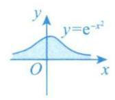

${\int }_{-\infty }^{+\infty }{\mathrm{e}}^{-{x}^{2}}\mathrm{\;d}x = \sqrt{\pi }$ ，这叫高斯积分，如同欧拉公式 ${\mathrm{e}}^{\pi \mathrm{i}} + 1 = 0$ 一样美妙.比如你看，它们都同时包含 $\mathrm{e},\pi$ .

---

>【注】应记住这一结果, 它经常被用到, 如例 14.12.

例 14.12 计算 ${\int }_{-\infty }^{+\infty }{x}^{2}{\mathrm{e}}^{-{x}^{2}}\mathrm{\;d}x$ .

解 ${\int }_{-\infty }^{+\infty }{x}^{2}{\mathrm{e}}^{-{x}^{2}}\mathrm{\;d}x = 2{\int }_{0}^{+\infty }{x}^{2}{\mathrm{e}}^{-{x}^{2}}\mathrm{\;d}x$ ,又由例 9.28 知, $2{\int }_{0}^{+\infty }{x}^{2}{\mathrm{e}}^{-{x}^{2}}\mathrm{\;d}x = 2{\int }_{0}^{+\infty }{x}^{2 \cdot \frac{3}{2} - 1}{\mathrm{e}}^{-{x}^{2}}\mathrm{\;d}x = \Gamma \left( \frac{3}{2}\right) = \frac{1}{2} \cdot \Gamma \left( \frac{1}{2}\right) =$ $\frac{\sqrt{\pi }}{2}$ . 故 ${\int }_{-\infty }^{+\infty }{x}^{2}{\mathrm{e}}^{-{x}^{2}}\mathrm{\;d}x = \frac{\sqrt{\pi }}{2}$ .

---

【注】本题若不用 $\Gamma$ 函数,对于 ${\int }_{0}^{+\infty }{x}^{2}{\mathrm{e}}^{-{x}^{2}}\mathrm{\;d}x$ ,要这样算:

$$
{\int }_{0}^{+\infty }{x}^{2}{\mathrm{e}}^{-{x}^{2}}\mathrm{\;d}x = {\int }_{0}^{+\infty }\left( {-\frac{1}{2}}\right) x{\mathrm{e}}^{-{x}^{2}}\mathrm{\;d}\left( {-{x}^{2}}\right) = {\int }_{0}^{+\infty }\left( {-\frac{1}{2}}\right) x\mathrm{\;d}\left( {\mathrm{e}}^{-{x}^{2}}\right)
$$

$$
= - {\left. \frac{1}{2}x{\mathrm{e}}^{-{x}^{2}}\right| }_{0}^{+\infty } - {\int }_{0}^{+\infty }\left( {-\frac{1}{2}}\right) {\mathrm{e}}^{-{x}^{2}}\mathrm{\;d}x
$$

$$
= 0 + \frac{1}{2}{\int }_{0}^{+\infty }{\mathrm{e}}^{-{x}^{2}}\mathrm{\;d}x = \frac{\sqrt{\pi }}{4},
$$

故 ${\int }_{-\infty }^{+\infty }{x}^{2}{\mathrm{e}}^{-{x}^{2}}\mathrm{\;d}x = \frac{\sqrt{\pi }}{2}$ ,显然,这是相对麻烦的.

---

例 14.13 已知 $\displaystyle\mathop{\lim }\limits_{{x \rightarrow + \infty }}\frac{{\int }_{0}^{x}{t}^{2}{\mathrm{e}}^{{x}^{2} - {t}^{2}}\mathrm{\;d}t + a{\mathrm{e}}^{{x}^{2}}}{{x}^{b}} = - \frac{1}{2}$ ,求 $a, b$ 的值.

解 一开始,可能看不出是什么类型的未定式,作恒等变形 (分子分母同时除以 ${\mathrm{e}}^{{x}^{2}}$ ) 再看:

$$
\text{原式} = \mathop{\lim }\limits_{{x \rightarrow + \infty }}\frac{{\int }_{0}^{x}{t}^{2}{\mathrm{e}}^{-{t}^{2}}\mathrm{\;d}t + a}{{x}^{b}{\mathrm{e}}^{-{x}^{2}}} = - \frac{1}{2}\text{,}
$$

此时不论 $b$ 取何值, $\mathop{\lim }\limits_{{x \rightarrow + \infty }}{x}^{b}{\mathrm{e}}^{-{x}^{2}} = 0$ ,即判定为 “ $\frac{0}{0}$ ” 型 (事实上,变形前为 “ $\frac{\infty }{\infty }$ ” 型 ).

故

$$
\mathop{\lim }\limits_{{x \rightarrow + \infty }}\left( {{\int }_{0}^{x}{t}^{2}{\mathrm{e}}^{-{t}^{2}}\mathrm{\;d}t + a}\right) = 0,
$$

于是

$$
a = - {\int }_{0}^{+\infty }{t}^{2}{\mathrm{e}}^{-{t}^{2}}\mathrm{\;d}t \xlongequal{\text{由例14.12知}} - \frac{\sqrt{\pi }}{4}.
$$

则

$$
\text{原式} = \mathop{\lim }\limits_{{x \rightarrow + \infty }}\frac{{\int }_{0}^{x}{t}^{2}{\mathrm{e}}^{-{t}^{2}}\mathrm{\;d}t - \frac{\sqrt{\pi }}{4}}{{x}^{b}{\mathrm{e}}^{-{x}^{2}}}\xlongequal{\text{洛必达法则}}\mathop{\lim }\limits_{{x \rightarrow + \infty }}\frac{{x}^{2}{\mathrm{e}}^{-{x}^{2}}}{b{x}^{b - 1}{\mathrm{e}}^{-{x}^{2}} + {x}^{b}{\mathrm{e}}^{-{x}^{2}}\left( {-{2x}}\right) }
$$

$$
= \mathop{\lim }\limits_{{x \rightarrow + \infty }}\frac{{x}^{2}}{b{x}^{b - 1} - 2{x}^{b + 1}} = - \frac{1}{2},
$$

故 $b = 1$ .

### 3. 极坐标系与直角坐标系的互相转化

一是用好 $\left\{ \begin{array}{l} x = r\cos \theta , \\ y = r\sin \theta \end{array}\right.$ 这个公式; 二是画出区域 $D$ 的边界图形,做好上限、下限的转化.

例14.14 $\displaystyle{\int }_{0}^{1}\mathrm{\;d}x{\int }_{1 - x}^{\sqrt{1 - {x}^{2}}}\frac{x + y}{{x}^{2} + {y}^{2}}\mathrm{\;d}y =$

解 应填 $2 - \frac{\pi }{2}$ .

本题乍一看, 也许我们会先考虑题目是否在积分次序上设置了障碍, 是否需要交换积分次序再做积分,但是,细致做来,我们会发现不管是先对 $x$ 积分,还是先对 $y$ 积分,都不容易计算. 看来这不是积分次序上的问题,这时想想看是不是选择何种坐标系的问题呢? 被积函数中含有 ${x}^{2} + {y}^{2}$ 的形式,且积分区域是圆的一部分, 如图 14-9 所示,

图 14-9

显然应该优先考虑极坐标系, 题目给出的却是直角坐标系, 我们需要改变一下. 于是, 有

由 $x+y=1$ 得 $r\cos \theta + r\sin \theta = 1$ 故 $r = \frac{1}{\cos \theta + \sin \theta }\text{.}$

$$
\text{原式} = {\int }_{0}^{\frac{\pi }{2}}\mathrm{\;d}\theta {\int }_{\frac{1}{\cos \theta + \sin \theta }}^{1}\frac{r\left( {\cos \theta + \sin \theta }\right) }{{r}^{2}}r\mathrm{\;d}r
$$

$$
= {\int }_{0}^{\frac{\pi }{2}}\left( {\cos \theta + \sin \theta }\right) \frac{\cos \theta + \sin \theta - 1}{\cos \theta + \sin \theta }\mathrm{d}\theta
$$

$$
= {\int }_{0}^{\frac{\pi }{2}}\cos \theta \mathrm{d}\theta + {\int }_{0}^{\frac{\pi }{2}}\sin \theta \mathrm{d}\theta - {\int }_{0}^{\frac{\pi }{2}}\mathrm{\;d}\theta
$$

$$
= 1 + 1 - \frac{\pi }{2} = 2 - \frac{\pi }{2}\text{. }
$$

### 4. 换元法

二重积分亦有和定积分一脉相承的换元法, 有时很有用, 现介绍于此, 供参考, 若能够用上, 可直接使用, 不必证明.

先回顾一元函数积分换元法, 见 “①”, 再看二重积分换元法, 见 “②”.

① ${\int }_{a}^{b}f\left( x\right) \mathrm{d}x\xlongequal{x = \varphi \left( t\right)} {\int }_{\alpha }^{\beta }f\left\lbrack {\varphi \left( t\right) }\right\rbrack {\varphi }^{\prime }\left( t\right) \mathrm{d}t$ .

a. $f\left( x\right) \rightarrow f\left\lbrack {\varphi \left( t\right) }\right\rbrack$ .

b. ${\int }_{a}^{b} \rightarrow {\int }_{\alpha }^{\beta }$ .

c. $\mathrm{d}x \rightarrow {\varphi }^{\prime }\left( t\right) \mathrm{d}t$ .

注意: $x = \varphi \left( t\right)$ 单调,存在一阶连续导数.

② $\displaystyle\iint\limits_{{D}_{xy}}f\left( {x, y}\right) \mathrm{d}x\mathrm{\;d}y\underset{x = x\left( {u, v}\right) }{\xlongequal{y = y\left( {u, v}\right) }}\iint\limits_{{D}_{uv}}f\left\lbrack {x\left( {u, v}\right), y\left( {u, v}\right) }\right\rbrack \left\vert\frac{\partial \left( {x, y}\right) }{\partial \left( {u, v}\right) }\right\vert\mathrm{d}u\mathrm{d}v$ .

a. $f\left( {x, y}\right) \rightarrow f\left\lbrack {x\left( {u, v}\right), y\left( {u, v}\right) }\right\rbrack$ .

b. $\iint\limits_{{D}_{xy}} \rightarrow \iint\limits_{{D}_{uv}}$ .

c. $\mathrm{d}x\mathrm{d}y \rightarrow \left| \frac{\partial \left( {x, y}\right) }{\partial \left( {u, v}\right) }\right| \mathrm{d}u\mathrm{d}v$ .

注意: 其中 $\left\{ \begin{array}{l} x = x\left( {u, v}\right) , \\ y = y\left( {u, v}\right) \end{array}\right.$ 是 $\left( {x, y}\right)$ 面到 $\left( {u, v}\right)$ 面的一对一映射, $x = x\left( {u, v}\right), y = y\left( {u, v}\right)$ 存在一阶连续偏导数,

$$
\frac{\partial \left( {x, y}\right) }{\partial \left( {u, v}\right) } = \left| \begin{array}{ll} \frac{\partial x}{\partial u} & \frac{\partial x}{\partial v} \\\\ \frac{\partial y}{\partial u} & \frac{\partial y}{\partial v} \end{array}\right| \neq 0
$$

另外,令 $\left\{ \begin{array}{l} x = r\cos \theta , \\ y = r\sin \theta , \end{array}\right.$ 则

$$
\iint\limits_{{D}_{xy}}f\left( {x, y}\right) \mathrm{d}x\mathrm{\;d}y = \iint\limits_{{D}_{r\theta }}f\left( {r\cos \theta, r\sin \theta }\right) \begin{Vmatrix} \frac{\partial x}{\partial r} & \frac{\partial x}{\partial \theta } \\\\ \frac{\partial y}{\partial r} & \frac{\partial y}{\partial \theta } \end{Vmatrix}\mathrm{d}r\mathrm{\;d}\theta
$$

$$
= \iint\limits_{{D}_{r\theta }}f\left( {r\cos \theta, r\sin \theta }\right) \begin{Vmatrix} \cos \theta & - r\sin \theta \\ \sin \theta & r\cos \theta \end{Vmatrix}\mathrm{d}r\mathrm{\;d}\theta = \iint\limits_{{D}_{r\theta }}f\left( {r\cos \theta, r\sin \theta }\right) r\mathrm{\;d}r\mathrm{\;d}\theta .
$$

这就是直角坐标系到极坐标系的换元过程.

例 14.15 设平面区域 $D = \{ \left( {x, y}\right) \mid 0 \leq x \leq 1 - y,0 \leq y \leq 1\}$ ,计算二重积分 $\iint\limits_{D}{\mathrm{e}}^{\frac{y}{x + y}}\mathrm{\;d}\sigma$ .

解 令 $\left\{ \begin{array}{l} x + y = u, \\ y = v, \end{array}\right.$ 则 $\left\{ \begin{array}{l} x = u - v, \\ y = v, \end{array}\right.$

$$
J = \left| \begin{array}{ll} \frac{\partial x}{\partial u} & \frac{\partial x}{\partial v} \\\\ \frac{\partial y}{\partial u} & \frac{\partial y}{\partial v} \end{array}\right| = \left| \begin{matrix} 1 & - 1 \\ 0 & 1 \end{matrix}\right| = 1
$$

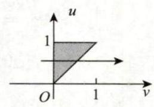

图 14-10

且由 $\left\{ \begin{array}{l} 0 \leq x \leq 1 - y, \\ 0 \leq y \leq 1, \end{array}\right.$ 知 $\left\{ \begin{array}{l} v \leq u \leq 1, \\ 0 \leq v \leq 1, \end{array}\right.$ 如图 14-10 所示. 故

$$
I = \iint\limits_{D}{\mathrm{e}}^{\frac{y}{x + y}}\mathrm{\;d}\sigma = \iint\limits_{{D}_{uv}}{\mathrm{e}}^{\frac{v}{u}}\left| J\right| \mathrm{d}u\mathrm{\;d}v = {\int }_{0}^{1}\mathrm{\;d}u{\int }_{0}^{u}{\mathrm{e}}^{\frac{v}{u}}\mathrm{\;d}v
$$

$$
= {\int }_{0}^{1}u{\left. {\mathrm{e}}^{\frac{v}{u}}\right| }_{v = 0}^{v = u}\mathrm{\;d}u = {\int }_{0}^{1}u\left( {\mathrm{e} - 1}\right) \mathrm{d}u = \frac{1}{2}\left( {\mathrm{e} - 1}\right) .
$$

---

【注】此题亦可用常规方法 (极坐标系, 见图 14-11) 求解:

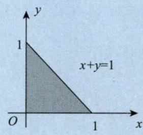

图 14-11

$$
I = {\int }_{0}^{\frac{\pi }{2}}\mathrm{\;d}\theta {\int }_{0}^{\frac{1}{\cos \theta + \sin \theta }}{\mathrm{e}}^{\frac{\sin \theta }{\cos \theta + \sin \theta }}r\mathrm{\;d}r
$$

$$
= {\int }_{0}^{\frac{\pi }{2}}{\mathrm{e}}^{\frac{\sin \theta }{\cos \theta + \sin \theta }} \cdot {\left. \frac{{r}^{2}}{2}\right| }_{0}^{\frac{1}{\cos \theta + \sin \theta }}\mathrm{d}\theta
$$

$$
= \frac{1}{2}{\int }_{0}^{\frac{\pi }{2}}{\mathrm{e}}^{\frac{\sin \theta }{\cos \theta + \sin \theta }}\frac{1}{{\left( \cos \theta + \sin \theta \right) }^{2}}\mathrm{\;d}\theta
$$

$$
= \frac{1}{2}{\int }_{0}^{\frac{\pi }{2}}{\mathrm{e}}^{\frac{\sin \theta }{\cos \theta + \sin \theta }}\mathrm{d}\left( \frac{\sin \theta }{\cos \theta + \sin \theta }\right)
$$

$$
= {\left. \frac{1}{2}{\mathrm{e}}^{\frac{\sin \theta }{\cos \theta + \sin \theta }}\right| }_{0}^{\frac{\pi }{2}} = \frac{1}{2}\left( {\mathrm{e} - 1}\right) .
$$

---

## 习题

**14.1** 设 ${I}_{1} = \iint\limits_{D}\sin \left| \frac{x - y}{2}\right| \mathrm{d}x\mathrm{\;d}y,{I}_{2} = \iint\limits_{D}\sin {\left( \frac{x - y}{2}\right) }^{2}\mathrm{\;d}x\mathrm{\;d}y,{I}_{3} = \iint\limits_{D}\sin {\left( \frac{x - y}{2}\right) }^{3}\mathrm{\;d}x\mathrm{\;d}y$ ,其中 $D = \{ \left( {x, y}\right) \mid$ $\left. {{\left( x - 1\right) }^{2} + {\left( y - 1\right) }^{2} \leq 2}\right\}$ ,则 $\left( \;\right)$ .

(A) ${I}_{1} < {I}_{2} < {I}_{3}$ (B) ${I}_{2} < {I}_{3} < {I}_{1}$ (C) ${I}_{3} < {I}_{1} < {I}_{2}$ (D) ${I}_{3} < {I}_{2} < {I}_{1}$

**14.2** 设函数 $f\left( t\right)$ 连续,区域 $D = \left\{ {\left( {x, y}\right) \mid {x}^{2} + {y}^{2} \leq {2y}}\right\}$ ,则 $\iint\limits_{D}f\left( {xy}\right) \mathrm{d}x\mathrm{\;d}y = \left( \;\right)$ .

(A) ${\int }_{-1}^{1}\mathrm{\;d}x{\int }_{-\sqrt{1 - {x}^{2}}}^{\sqrt{1 - {x}^{2}}}f\left( {xy}\right) \mathrm{d}y$ (B) $2{\int }_{0}^{2}\mathrm{\;d}y{\int }_{0}^{\sqrt{{2y} - {y}^{2}}}f\left( {xy}\right) \mathrm{d}x$

(C) ${\int }_{0}^{\pi }\mathrm{d}\theta {\int }_{0}^{2\sin \theta }f\left( {{r}^{2}\sin \theta \cos \theta }\right) \mathrm{d}r$ (D) ${\int }_{0}^{\pi }\mathrm{d}\theta {\int }_{0}^{2\sin \theta }f\left( {{r}^{2}\sin \theta \cos \theta }\right) r\mathrm{\;d}r$

**14.3** 累次积分 ${\int }_{0}^{\frac{\pi }{2}}\mathrm{\;d}\theta {\int }_{0}^{\cos \theta }f\left( {r\cos \theta, r\sin \theta }\right) r\mathrm{\;d}r$ 可以写成 ( ).

(A) ${\int }_{0}^{1}\mathrm{\;d}y{\int }_{0}^{\sqrt{y - {y}^{2}}}f\left( {x, y}\right) \mathrm{d}x$ (B) ${\int }_{0}^{1}\mathrm{\;d}y{\int }_{0}^{\sqrt{1 - {y}^{2}}}f\left( {x, y}\right) \mathrm{d}x$

(C) ${\int }_{0}^{1}\mathrm{\;d}x{\int }_{0}^{1}f\left( {x, y}\right) \mathrm{d}y$ (D) ${\int }_{0}^{1}\mathrm{\;d}x{\int }_{0}^{\sqrt{x - {x}^{2}}}f\left( {x, y}\right) \mathrm{d}y$

**14.4** ${\int }_{-1}^{1}\mathrm{\;d}x{\int }_{\left| x\right| }^{\sqrt{2 - {x}^{2}}}\sin \left( {{x}^{2} + {y}^{2}}\right) \mathrm{d}y = \left( \;\right)$ .

(A) $\frac{\pi }{4}\left( {\cos 2 - 1}\right)$ (B) $\frac{\pi }{4}\left( {-\cos 2 + 1}\right)$ (C) $\frac{\pi }{4}\left( {\cos 2 + 1}\right)$ (D) $\frac{\pi }{4}\left( {-\cos 2 - 1}\right)$

**14.5** 交换积分次序: ${\int }_{0}^{\frac{1}{4}}\mathrm{\;d}y{\int }_{y}^{\sqrt{y}}f\left( {x, y}\right) \mathrm{d}x + {\int }_{\frac{1}{4}}^{\frac{1}{2}}\mathrm{\;d}y{\int }_{y}^{\frac{1}{2}}f\left( {x, y}\right) \mathrm{d}x =$

**14.6** 设 $f\left( x\right)$ 为连续函数, $F\left( t\right) = {\int }_{1}^{t}\mathrm{\;d}y{\int }_{y}^{t}f\left( x\right) \mathrm{d}x$ ,则 ${F}^{\prime }\left( t\right) =$ ___.

**14.7** 设区域 $D$ 是由曲线 $y = \sin x$ 与直线 $x = \pm \frac{\pi }{2}, y = 1$ 围成的平面区域,则 $\iint\limits_{D}\left( {x{y}^{5} - 1}\right) \mathrm{d}\sigma =$

**14.8** 设区域 $D = \left\{ {\left( {x, y}\right) \mid {x}^{2} + {y}^{2} \leq 1, x \geq 0}\right\}$ ,计算二重积分 $I = \iint\limits_{D}\frac{1 + {xy}}{1 + {x}^{2} + {y}^{2}}\mathrm{\;d}x\mathrm{\;d}y$ .

**14.9** 计算二重积分 $\iint\limits_{D}{\mathrm{e}}^{\max \left\{ {{x}^{2},{y}^{2}}\right\} }\mathrm{d}x\mathrm{\;d}y$ ,其中 $D = \{ \left( {x, y}\right) \mid 0 \leq x \leq 1,0 \leq y \leq 1\}$ .

**14.10** 计算二重积分 $I = \iint\limits_{D}{r}^{2}\sin \theta \sqrt{1 - {r}^{2}\cos {2\theta }}\mathrm{d}r\mathrm{\;d}\theta$ ,其中

$$
D = \left\{ {\left( {r,\theta }\right) \mid 0 \leq r \leq \sec \theta ,0 \leq \theta \leq \frac{\pi }{4}}\right\} .
$$

**14.11** 计算二重积分 $I = \iint\limits_{D}{r}^{2}{\mathrm{e}}^{-{r}^{2}{\sin }^{2}\theta }\cos \theta \mathrm{d}r\mathrm{\;d}\theta$ ,其中 $D = \left\{ {\left( {r,\theta }\right) \mid r \geq 0,\frac{\pi }{4} \leq \theta \leq \frac{\pi }{2}}\right\}$ .

14.12 (1) 设积分区域 $D$ 能使二重积分 $\iint\limits_{D}\left( {1 - 2{x}^{2} - {y}^{2}}\right) \mathrm{d}\sigma$ 的值达到最大,求出该积分区域 $D$ ;

(2) 对 (1) 中的二重积分 $\iint\limits_{D}\left( {1 - 2{x}^{2} - {y}^{2}}\right) \mathrm{d}\sigma$ ,求出其最大值.

## 解答

14.1 (D) 解 当 $\left( {x, y}\right) \in D$ 时, $- 2 \leq x - y \leq 2, - 1 \leq \frac{x - y}{2} \leq 1$ ,则 $0 < \left| \frac{x - y}{2}\right| < 1$ ,从而有

$$
0 < {\left( \frac{x - y}{2}\right) }^{2} = {\left| \frac{x - y}{2}\right| }^{2} < \left| \frac{x - y}{2}\right| < 1,
$$

所以

$$
0 < \iint\limits_{D}\sin {\left( \frac{x - y}{2}\right) }^{2}\mathrm{\;d}x\mathrm{\;d}y < \iint\limits_{D}\sin \left| \frac{x - y}{2}\right| \mathrm{d}x\mathrm{\;d}y.
$$

又由轮换对称性知,

$$
{I}_{3} = \iint\limits_{D}\sin {\left( \frac{x - y}{2}\right) }^{3}\mathrm{\;d}x\mathrm{\;d}y
$$

$$
= \frac{1}{2}\iint\limits_{D}\left\lbrack {\sin {\left( \frac{x - y}{2}\right) }^{3} + \sin {\left( \frac{y - x}{2}\right) }^{3}}\right\rbrack \mathrm{d}x\mathrm{\;d}y
$$

$$
= \frac{1}{2}\iint\limits_{D}\left\lbrack {\sin {\left( \frac{x - y}{2}\right) }^{3} - \sin {\left( \frac{x - y}{2}\right) }^{3}}\right\rbrack \mathrm{d}x\mathrm{\;d}y
$$

于是 ${I}_{3} < {I}_{2} < {I}_{1}$ .

14.2 (D) 解 所给问题为直角坐标系下的二重积分,积分区域 $D = \left\{ {\left( {x, y}\right) \mid {x}^{2} + {y}^{2} \leq {2y}}\right\}$ 在直角坐标系下可以表示为 ${x}^{2} + {\left( y - 1\right) }^{2} \leq 1$ ,即圆心在 $\left( {0,1}\right)$ ,半径为 1 的圆域. 因此区域 $D$ 可表示为

$$
- 1 \leq x \leq 1,1 - \sqrt{1 - {x}^{2}} \leq y \leq 1 + \sqrt{1 - {x}^{2}},
$$

也可以表示为

$$
0 \leq y \leq 2, - \sqrt{{2y} - {y}^{2}} \leq x \leq \sqrt{{2y} - {y}^{2}}.
$$

因此

$$
\iint\limits_{D}f\left( {xy}\right) \mathrm{d}x\mathrm{\;d}y = {\int }_{-1}^{1}\mathrm{\;d}x{\int }_{1 - \sqrt{1 - {x}^{2}}}^{1 + \sqrt{1 - {x}^{2}}}f\left( {xy}\right) \mathrm{d}y,
$$

可知 (A) 不正确. 又

$$
\iint\limits_{D}f\left( {xy}\right) \mathrm{d}x\mathrm{\;d}y = {\int }_{0}^{2}\mathrm{\;d}y{\int }_{-\sqrt{{2y} - {y}^{2}}}^{\sqrt{{2y} - {y}^{2}}}f\left( {xy}\right) \mathrm{d}x,
$$

且题设中没有给出 $f$ 为偶函数的条件,可知 (B) 也不正确.

在极坐标系下, ${x}^{2} + {y}^{2} = {2y}$ 转化为 $r = 2\sin \theta$ . 因此 $D$ 可以表示为

$$
0 \leq \theta \leq \pi ,0 \leq r \leq 2\sin \theta ,
$$

因此

$$
\iint\limits_{D}f\left( {xy}\right) \mathrm{d}x\mathrm{\;d}y = {\int }_{0}^{\pi }\mathrm{d}\theta {\int }_{0}^{2\sin \theta }f\left( {{r}^{2}\cos \theta \sin \theta }\right) r\mathrm{\;d}r,
$$

可知 (C) 不正确, (D) 正确. 故选 (D).

14.3 (D) 解 积分区域 $D = \left\{ {\left( {r,\theta }\right) \mid 0 \leq \theta \leq \frac{\pi }{2},0 \leq r \leq \cos \theta }\right\}$ ,化为直角坐标,可表示为

$$
D = \left\{ {\left( {x, y}\right) \mid 0 \leq x \leq 1,0 \leq y \leq \sqrt{x - {x}^{2}}}\right\}
$$

$$
= \left\{ {\left( {x, y}\right) \left| {\;0 \leq y \leq \frac{1}{2}}\right. ,\frac{1}{2} - \sqrt{\frac{1}{4} - {y}^{2}} \leq x \leq \frac{1}{2} + \sqrt{\frac{1}{4} - {y}^{2}}}\right\} .
$$

14.4 (B) 解 先画出积分区域 $D$ ,如图 14-12 所示,因积分区域 $D$ 的边界曲线为 $y = \left| x\right|$ 与 $y = \sqrt{2 - {x}^{2}}$ ,其交点为 $\left( {1,1}\right)$ 与 $\left( {-1,1}\right)$ ,故 $D$ 可用极坐标表示为

$$
D = \left\{ {\left( {r,\theta }\right) \left| {\;0 \leq r \leq \sqrt{2}}\right. ,\frac{\pi }{4} \leq \theta \leq \frac{3\pi }{4}}\right\} ,
$$

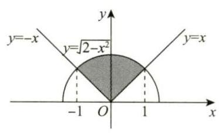

图 14-12

则

$$
{\int }_{-1}^{1}\mathrm{\;d}x{\int }_{\left| x\right| }^{\sqrt{2 - {x}^{2}}}\sin \left( {{x}^{2} + {y}^{2}}\right) \mathrm{d}y = {\int }_{\frac{\pi }{4}}^{\frac{3\pi }{4}}\mathrm{\;d}\theta {\int }_{0}^{\sqrt{2}}r\sin {r}^{2}\mathrm{\;d}r
$$

$$
= {\left. \frac{\pi }{2} \times \frac{1}{2}\left( -\cos {r}^{2}\right) \right| }_{0}^{\sqrt{2}} = \frac{\pi }{4}\left( {-\cos 2 + 1}\right) .
$$

14.5 ${\int }_{0}^{\frac{1}{2}}\mathrm{\;d}x{\int }_{{x}^{2}}^{x}f\left( {x, y}\right) \mathrm{d}y$ 解 积分区域为 $D = \left\{ {\left( {x, y}\right) \mid 0 \leq x \leq \frac{1}{2},{x}^{2} \leq y \leq x}\right\}$ , 如图 14-13 所示, 故应填

$$
{\int }_{0}^{\frac{1}{2}}\mathrm{\;d}x{\int }_{{x}^{2}}^{x}f\left( {x, y}\right) \mathrm{d}y.
$$

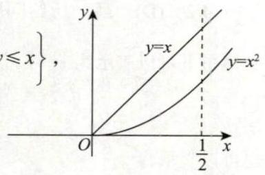

图 14-13

14.6 $\left( {t - 1}\right) f\left( t\right)$ 解 所给积分为二次变限积分,它是变量 $t$ 的函数. 故求 ${F}^{\prime }\left( t\right)$ 需先将二次变限积分化为变限的单积分. 为此考虑所给二次积分的特点, 由于依给定的积分次序, 不能化为变限单积分, 因此先交换积分次序, 可得

$$
F\left( t\right) = {\int }_{1}^{t}\mathrm{\;d}y{\int }_{y}^{t}f\left( x\right) \mathrm{d}x = {\int }_{1}^{t}\mathrm{\;d}x{\int }_{1}^{x}f\left( x\right) \mathrm{d}y = {\int }_{1}^{t}\left( {x - 1}\right) f\left( x\right) \mathrm{d}x,
$$

于是 ${F}^{\prime }\left( t\right) = \left( {t - 1}\right) f\left( t\right)$ .

14.7 $- \pi$ 解 所给积分区域如图 14-14 所示.

记 $A\left( {-\frac{\pi }{2}, - 1}\right), B\left( {-\frac{\pi }{2},1}\right), C\left( {\frac{\pi }{2},1}\right)$ . 作辅助线 $y = - \sin x$ ,则曲线 ${BO}$ 将区域 $D$ 划分为 ${D}_{1},{D}_{2}$ 两个子区域,区域 ${D}_{1}$ 关于 $x$ 轴对称,区域 ${D}_{2}$ 关于 $y$ 轴对称. 而 $x{y}^{5}$ 既为 $x$ 的奇函数,也为 $y$ 的奇函数,从而 $\iint\limits_{{D}_{1}}x{y}^{5}\mathrm{\;d}x\mathrm{\;d}y = 0,\iint\limits_{{D}_{2}}x{y}^{5}\mathrm{\;d}x\mathrm{\;d}y = 0$ ,因此

$$
\text{原式} = - \iint\limits_{D}\mathrm{\;d}x\mathrm{\;d}y = - {\int }_{-\frac{\pi }{2}}^{\frac{\pi }{2}}\mathrm{\;d}x{\int }_{\sin x}^{1}\mathrm{\;d}y
$$

$$
= - {\int }_{-\frac{\pi }{2}}^{\frac{\pi }{2}}\left( {1 - \sin x}\right) \mathrm{d}x \xlongequal{\left( *\right) } - 2{\int }_{0}^{\frac{\pi }{2}}\mathrm{\;d}x = - \pi .
$$

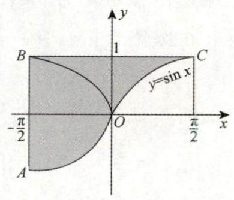

图 14-14

>【注】上述 (*) 处见第 9 讲 “三、(2) 的注 (1)”.

14.8 解 因为 ${I}_{1} = \iint\limits_{D}\frac{1}{1 + {x}^{2} + {y}^{2}}\mathrm{\;d}x\mathrm{\;d}y = {\int }_{-\frac{\pi }{2}}^{\frac{\pi }{2}}\mathrm{\;d}\theta {\int }_{0}^{1}\frac{1}{1 + {r}^{2}}r\mathrm{\;d}r = {\left. \frac{\pi }{2}\ln \left( 1 + {r}^{2}\right) \right| }_{0}^{1} = \frac{\pi }{2}\ln 2$ ,

$$
{I}_{2} = \iint\limits_{D}\frac{xy}{1 + {x}^{2} + {y}^{2}}\mathrm{\;d}x\mathrm{\;d}y = {\int }_{-\frac{\pi }{2}}^{\frac{\pi }{2}}\mathrm{\;d}\theta {\int }_{0}^{1}\frac{{r}^{3}\cos \theta \sin \theta }{1 + {r}^{2}}\mathrm{\;d}r = {\int }_{-\frac{\pi }{2}}^{\frac{\pi }{2}}\cos \theta \sin \theta \mathrm{d}\theta {\int }_{0}^{1}\frac{{r}^{3}}{1 + {r}^{2}}\mathrm{\;d}r = 0,
$$

所以

$$
I = {I}_{1} + {I}_{2} = \frac{\pi }{2}\ln 2
$$

14.9 解 设 ${D}_{1} = \{ \left( {x, y}\right) \mid 0 \leq x \leq 1,0 \leq y \leq x\} ,{D}_{2} = \{ \left( {x, y}\right) \mid 0 \leq x \leq 1, x \leq y \leq 1\}$ ,则

$$
\iint\limits_{D}{\mathrm{e}}^{\max \left\{ {{x}^{2},{y}^{2}}\right\} }\mathrm{d}x\mathrm{\;d}y = \iint\limits_{{D}_{1}}{\mathrm{e}}^{\max \left\{ {{x}^{2},{y}^{2}}\right\} }\mathrm{d}x\mathrm{\;d}y + \iint\limits_{{D}_{2}}{\mathrm{e}}^{\max \left\{ {{x}^{2},{y}^{2}}\right\} }\mathrm{d}x\mathrm{\;d}y = \iint\limits_{{D}_{1}}{\mathrm{e}}^{{x}^{2}}\mathrm{\;d}x\mathrm{\;d}y + \iint\limits_{{D}_{2}}{\mathrm{e}}^{{y}^{2}}\mathrm{\;d}x\mathrm{\;d}y
$$

$$
= {\int }_{0}^{1}\mathrm{\;d}x{\int }_{0}^{x}{\mathrm{e}}^{{x}^{2}}\mathrm{\;d}y + {\int }_{0}^{1}\mathrm{\;d}y{\int }_{0}^{y}{\mathrm{e}}^{{y}^{2}}\mathrm{\;d}x = {\int }_{0}^{1}x{\mathrm{e}}^{{x}^{2}}\mathrm{\;d}x + {\int }_{0}^{1}y{\mathrm{e}}^{{y}^{2}}\mathrm{\;d}y = \mathrm{e} - 1.
$$

14.10 解 我们先画出积分区域 $D$ (见图 14-15),然后将积分化为直角坐标系下的二重积分,再去计算,即

图 14-15

> $\;\begin{array}{l} r = \sec \theta \text{. 即 }r = \frac{1}{\cos \theta }. \\ \text{ 也即 }r\cos \theta = 1\text{. 得 }x = 1\text{. } \end{array}$

$$
I = \iint\limits_{D}{r}^{2}\sin \theta \sqrt{1 - {r}^{2}{\cos }^{2}\theta + {r}^{2}{\sin }^{2}\theta }\mathrm{d}r\mathrm{\;d}\theta = \iint\limits_{D}y\sqrt{1 - {x}^{2} + {y}^{2}}\mathrm{\;d}x\mathrm{\;d}y
$$

$$
= \frac{1}{2}{\int }_{0}^{1}\mathrm{\;d}x{\int }_{0}^{x}\sqrt{1 - {x}^{2} + {y}^{2}}\mathrm{\;d}\left( {1 - {x}^{2} + {y}^{2}}\right) = {\left. \frac{1}{3}{\int }_{0}^{1}{\left( 1 - {x}^{2} + {y}^{2}\right) }^{\frac{3}{2}}\right| }_{0}^{x}\mathrm{\;d}x
$$

$$
= \frac{1}{3}{\int }_{0}^{1}\left\lbrack {1 - {\left( 1 - {x}^{2}\right) }^{\frac{3}{2}}}\right\rbrack \mathrm{d}x
$$

设 $x = \sin t$ ,则 $I = \frac{1}{3} - \frac{1}{3}{\int }_{0}^{\frac{\pi }{2}}{\cos }^{4}t\mathrm{\;d}t = \frac{1}{3} - \frac{1}{3} \times \frac{3}{4} \times \frac{1}{2} \times \frac{\pi }{2} = \frac{1}{3} - \frac{\pi }{16}$ .

14.11 解 $D$ 的图形为图 14-16 中阴影部分. 转换成直角坐标系进行计算.

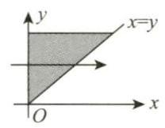

图 14-16

$$
I = \iint\limits_{D}x{\mathrm{e}}^{-{y}^{2}}\mathrm{\;d}x\mathrm{\;d}y = {\int }_{0}^{+\infty }{\mathrm{e}}^{-{y}^{2}}\mathrm{\;d}y{\int }_{0}^{y}x\mathrm{\;d}x = \frac{1}{2}{\int }_{0}^{+\infty }{y}^{2}{\mathrm{e}}^{-{y}^{2}}\mathrm{\;d}y\xlongequal{\text{ 由例 }{14.12}}\frac{\sqrt{\pi }}{8}.
$$

14.12 解 (1) 由二重积分的性质可知,当积分区域 $D$ 包含了所有使被积函数 $1 - 2{x}^{2} - {y}^{2}$ 大于等于零的区域,而不包含使被积函数 $1 - 2{x}^{2} - {y}^{2}$ 小于零的区域,即当 $D$ 是椭圆 $2{x}^{2} + {y}^{2} = 1$ 所围的平面闭区域时, 此二重积分的值达到最大.

(2) 由 (1) 知 $D = \left\{ {\left( {x, y}\right) \mid 2{x}^{2} + {y}^{2} \leq 1}\right\}$ ,此时令 $\left\{ \begin{array}{l} x = \frac{1}{\sqrt{2}}r\cos \theta , \\ y = r\sin \theta , \end{array}\right.$ 则

$$
\iint\limits_{D}\left( {1 - 2{x}^{2} - {y}^{2}}\right) \mathrm{d}\sigma = {\int }_{0}^{2\pi }\mathrm{d}\theta {\int }_{0}^{1}\left( {1 - {r}^{2}{\cos }^{2}\theta - {r}^{2}{\sin }^{2}\theta }\right) \cdot \begin{Vmatrix} \frac{\partial x}{\partial r} & \frac{\partial x}{\partial \theta } \\ \frac{\partial y}{\partial r} & \frac{\partial y}{\partial \theta } \end{Vmatrix}\mathrm{d}r
$$

$$
= {\int }_{0}^{2\pi }\mathrm{d}\theta {\int }_{0}^{1}\left( {1 - {r}^{2}}\right) \frac{1}{\sqrt{2}}r\mathrm{\;d}r
$$

$$
= {2\pi } \cdot \frac{1}{\sqrt{2}}{\int }_{0}^{1}\left( {r - {r}^{3}}\right) \mathrm{d}r
$$

$$
= {\left. \sqrt{2}\pi \left( \frac{1}{2}{r}^{2} - \frac{1}{4}{r}^{4}\right) \right| }_{0}^{1} = \frac{\sqrt{2}\pi }{4}.
$$
