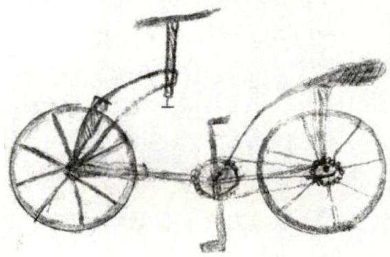
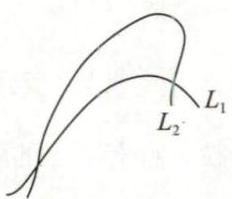
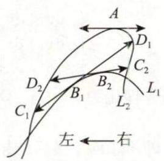
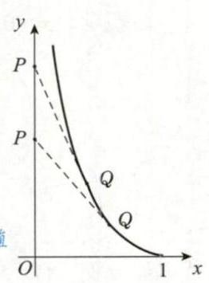

# 第15讲 微分方程

## 一、微分方程的概念

### 1. 微分方程及其阶

表示未知函数及其导数 (或者微分) 与自变量之间关系的方程称为 **微分方程** , 一般写成

$$
F\left\lbrack {x, y,{y}^{\prime },\cdots ,{y}^{\left( n\right) }}\right\rbrack = 0\text{ 或 }{y}^{\left( n\right) } = f\left\lbrack {x, y,{y}^{\prime },\cdots ,{y}^{\left( n - 1\right) }}\right\rbrack .
$$

微分方程中未知函数的最高阶导数的阶数称为 **微分方程的阶** . 如 ${y}^{\prime \prime \prime } - {y}^{\prime \prime } + {6y} = 0$ 就是三阶微分方程.

>满足两个条件:  
>①方程；  
>②含未知函数的导数(微分)

### 2. 常微分方程

未知函数是一元函数的微分方程称为 **常微分方程** . 如 ${y}^{\prime \prime \prime } - {y}^{\prime \prime } + {6y} = 0, y\mathrm{\;d}x - \left( {x + \sqrt{{x}^{2} + {y}^{2}}}\right) \mathrm{d}y = 0$ .

### 3. 线性微分方程

形如 ${a}_{n}\left( x\right) {y}^{\left( n\right) } + {a}_{n - 1}\left( x\right) {y}^{\left( n - 1\right) } + \cdots + {a}_{1}\left( x\right) {y}^{\prime } + {a}_{0}\left( x\right) y = f\left( x\right)$ 的微分方程称为 **$n$ 阶线性微分方程** ,其中 ${a}_{k}\left( x\right) \left( {k = 0,1,2,\cdots, n}\right)$ 都是自变量 $x$ 的函数, ${a}_{n}\left( x\right) \neq 0$ . 当 ${a}_{k}\left( x\right) \left( {k = 0,1,2,\cdots, n}\right)$ 都是常数时,又称方程为 **$n$ 阶常系数线性微分方程** . 若右端函数 $f\left( x\right)$ 恒为零,则称方程为 **$n$ 阶齐次线性微分方程** ,否则称其为 $n$ 阶非齐次线性微分方程.

### 4. 微分方程的解

若将函数代入微分方程, 使方程成为恒等式, 则该函数称为 **微分方程的解** . 微分方程解的图形称为积分曲线.

### 5. 微分方程的通解

若微分方程的解中含有的独立常数的个数等于微分方程的阶数, 则该解称为微分方程的 **通解** .

> 独立：经任何恒等变形都不能使常数个数减少，如 $y = {\mathrm{e}}^{x}\left( {{C}_{1} + {C}_{2}x}\right)$ ，但 $y = {C}_{1}\sin x +{C}_{2} \cdot 2\sin x = \left( {{C}_{1} + 2{C}_{2}}\right) \sin x = C\sin x$ ,这里的 ${C}_{1},{C}_{2}$ 就不独立.  
> 常数：此处的常数并非一定是任意常数，可能是在一定范围内取值的常数，如例15.4

### 6. 初始条件与特解

确定通解中常数的条件就是 **初始条件** . 如 $y\left( {x}_{0}\right) = {a}_{0},{y}^{\prime }\left( {x}_{0}\right) = {a}_{1},\cdots ,{y}^{\left( n - 1\right) }\left( {x}_{0}\right) = {a}_{n - 1}$ ,其中 ${a}_{0}$ , ${a}_{1},\cdots ,{a}_{n - 1}$ 为 $n$ 个给定的数. 确定了通解中的常数后,解就成了 **特解** .

例 15.1 设 $y = f\left( x\right)$ 是方程 ${y}^{\prime \prime } - 2{y}^{\prime } + {4y} = 0$ 的一个解,若 $f\left( {x}_{0}\right) > 0$ ,且 ${f}^{\prime }\left( {x}_{0}\right) = 0$ ,则函数 $f\left( x\right)$ 在点 ${x}_{0}$ 处 ( ).

(A) 取得极大值 (B) 取得极小值

(C) 某个邻域内单调增加 (D) 某个邻域内单调减少

分析 乍一看题目, ${y}^{\prime \prime } - 2{y}^{\prime } + {4y} = 0$ 是《全国硕士研究生招生考试数学考试大纲》中要求的一个很

简单的微分方程, 于是很多同学便先去求它的解, 再去讨论问题. 姑且不论这样做能否解决问题 (事实上, 由于初始条件不够, 是解不出特解的), 考场上时间有限, 需要的是效率, 是最好的解题方法. 希望大家在平时的复习中, 努力研究最 “恰当” 的方法, 这种 “恰当” 也正是命题人想考查你的地方.

解 应选 (A).

由题设,有 ${f}^{\prime \prime }\left( {x}_{0}\right) - 2{f}^{\prime }\left( {x}_{0}\right) + {4f}\left( {x}_{0}\right) = 0$ ,结合 $f\left( {x}_{0}\right) > 0,{f}^{\prime }\left( {x}_{0}\right) = 0$ ,可得 ${f}^{\prime \prime }\left( {x}_{0}\right) = - {4f}\left( {x}_{0}\right) < 0$ ,又 ${f}^{\prime }\left( {x}_{0}\right) = 0$ ,由判别极值的第二充分条件知,点 $x = {x}_{0}$ 是 $f\left( x\right)$ 的极大值点. 答案选择 (A).

例 15.2 设 $y = y\left( x\right)$ 是二阶常系数线性微分方程 ${y}^{\prime \prime } + p{y}^{\prime } + {qy} = {\mathrm{e}}^{3x}$ 满足初始条件 $y\left( 0\right) = {y}^{\prime }\left( 0\right) = 0$ 的特解,则 $\displaystyle\mathop{\lim }\limits_{{x \rightarrow 0}}\frac{\ln \left( {1 + {x}^{2}}\right) }{y\left( x\right) } =$

解 应填 2 .

不用求解微分方程, 而是利用方程所反映出来的函数与各阶导数之间的关系来解题.

由 ${y}^{\prime \prime } + p{y}^{\prime } + {qy} = {\mathrm{e}}^{3x}$ 得 ${y}^{\prime \prime }\left( x\right)$ 连续,且 ${y}^{\prime \prime }\left( 0\right) = - p{y}^{\prime }\left( 0\right) - {qy}\left( 0\right) + {\mathrm{e}}^{0} = 1$ ,故

$$
\mathop{\lim }\limits_{{x \rightarrow 0}}\frac{\ln \left( {1 + {x}^{2}}\right) }{y\left( x\right) } = \mathop{\lim }\limits_{{x \rightarrow 0}}\frac{{x}^{2}}{y\left( x\right) } = \mathop{\lim }\limits_{{x \rightarrow 0}}\frac{2x}{{y}^{\prime }\left( x\right) } = \mathop{\lim }\limits_{{x \rightarrow 0}}\frac{2}{{y}^{\prime \prime }\left( x\right) } = \frac{2}{{y}^{\prime \prime }\left( 0\right) } = 2.
$$

## 二、一阶微分方程的求解

### 1. 可分离变量型微分方程

#### (1) 直接可分离

能写成 ${y}^{\prime } = f\left( x\right) g\left( y\right)$ 形式的方程称为 **可分离变量型微分方程** . 其解法为

$$
\frac{\mathrm{d}y}{\mathrm{\;d}x} = f\left( x\right) g\left( y\right) \Rightarrow \int \frac{\mathrm{d}y}{g\left( y\right) } = \int f\left( x\right) \mathrm{d}x.
$$

例 15.3 已知曲线 $y = f\left( x\right)$ 过点 $\left( {0, - \frac{1}{2}}\right)$ ,且其上任一点 $\left( {x, y}\right)$ 处的切线斜率为 $x\ln \left( {1 + {x}^{2}}\right)$ ,则 $f\left( x\right) =$

分析 本题考查根据实际问题建立微分方程的能力, 关键是要知道导数的几何意义即为曲线在这一点处的切线的斜率. 本讲中将经常出现由几何、物理、经济问题建立微分方程并求解的试题.

解 应填 $\frac{1}{2}\left( {1 + {x}^{2}}\right) \left\lbrack {\ln \left( {1 + {x}^{2}}\right) - 1}\right\rbrack$ .

由实际问题建立微分方程为

$$
\left\{ \begin{array}{l} \displaystyle\frac{\mathrm{d}y}{\mathrm{\;d}x} = x\ln \left( {1 + {x}^{2}}\right) , \\\\ \displaystyle{\left. y\right| }_{x = 0} = - \frac{1}{2}, \end{array}\right.
$$

这是一个可分离变量型微分方程求特解的问题, 用分离变量法求解. 由

$$
\int \mathrm{d}y = \int x\ln \left( {1 + {x}^{2}}\right) \mathrm{d}x
$$

得

$$
y = \frac{1}{2}\int \ln \left( {1 + {x}^{2}}\right) \mathrm{d}\left( {1 + {x}^{2}}\right) = \frac{1}{2}\left\lbrack {\left( {1 + {x}^{2}}\right) \ln \left( {1 + {x}^{2}}\right) -\int \frac{1 + {x}^{2}}{1 + {x}^{2}}\mathrm{\;d}\left( {1 + {x}^{2}}\right) }\right\rbrack
$$

$$
= \frac{1}{2}\left( {1 + {x}^{2}}\right) \left\lbrack {\ln \left( {1 + {x}^{2}}\right) - 1}\right\rbrack + C.
$$

代入初始条件 ${\left. y\right| }_{x = 0} = - \frac{1}{2}$ 得 $C = 0$ ,故方程的特解为

$$
y = \frac{1}{2}\left( {1 + {x}^{2}}\right) \left\lbrack {\ln \left( {1 + {x}^{2}}\right) - 1}\right\rbrack .
$$

例 15.4 微分方程 $\displaystyle \frac{y\mathrm{\;d}y}{1 + {y}^{2}} = \frac{\mathrm{d}x}{x\left( {1 + {x}^{2}}\right) }$ 的解为___.

解 应填 $\left( {1 + {x}^{2}}\right) \left( {1 + {y}^{2}}\right) = C{x}^{2}$ ,其中 $C$ 为大于零的任意常数.

两边积分,得 $\displaystyle\int \frac{y\mathrm{\;d}y}{1 + {y}^{2}} = \int \left( {\frac{1}{x} - \frac{x}{1 + {x}^{2}}}\right) \mathrm{d}x$ ,则

$$
\frac{1}{2}\ln \left( {1 + {y}^{2}}\right) = \ln \left| x\right| - \frac{1}{2}\ln \left( {1 + {x}^{2}}\right) + \ln {C}_{1},
$$

即 $\ln \left\lbrack {\left( {1 + {x}^{2}}\right) \left( {1 + {y}^{2}}\right) }\right\rbrack = \ln C{x}^{2}$ ,故 $\left( {1 + {x}^{2}}\right) \left( {1 + {y}^{2}}\right) = C{x}^{2}$ ,其中 $C$ 为大于零的任意常数.

---

【注】由本题的通解表达式可知, 通解中的常数是指在一定范围内任意取值的常数, 而未必是在实数范围内任意取值的常数.

---

#### (2) 换元后可分离

形如 $\displaystyle\frac{\mathrm{d}y}{\mathrm{\;d}x} = f\left( {{ax} + {by} + c}\right)$ 的方程,其中常数 $a, b$ 全都不为零. 其解法为令 $u = {ax} + {by} + c$ ,则 $\displaystyle\frac{\mathrm{d}u}{\mathrm{\;d}x} = a + b\frac{\mathrm{d}y}{\mathrm{\;d}x}$ ,代入原方程得 $\displaystyle\frac{\mathrm{d}u}{\mathrm{\;d}x} = a + {bf}\left( u\right)$ .

例 15.5 求微分方程 $\mathrm{d}y = \sin \left( {x + y + {100}}\right) \mathrm{d}x$ 的通解.

解 ①方程可写成 $\displaystyle\frac{\mathrm{d}y}{\mathrm{\;d}x} = \sin \left( {x + y + {100}}\right)$ ,令 $u = x + y + {100}$ ,则 $\displaystyle\frac{\mathrm{d}u}{\mathrm{\;d}x} = 1 + \displaystyle\frac{\mathrm{d}y}{\mathrm{\;d}x}$ ,于是原方程化为 $\displaystyle\frac{\mathrm{d}u}{\mathrm{\;d}x} =$ $1 + \sin u$ ,就得到了可分离变量型微分方程.

②分离变量,得 $\displaystyle\frac{\mathrm{d}u}{1 + \sin u} = \mathrm{d}x$ ,恒等变形,有 $\displaystyle\frac{\left( {1 - \sin u}\right) \mathrm{d}u}{1 - {\sin }^{2}u} = \mathrm{d}x$ ,即 $\left( {{\sec }^{2}u - \tan u\sec u}\right) \mathrm{d}u = \mathrm{d}x$ .

两边积分,得 $\tan u - \sec u = x + C$ . 将 $u = x + y + {100}$ 代入,得原方程的通解为

$$
\tan \left( {x + y + {100}}\right) - \sec \left( {x + y + {100}}\right) = x + C,
$$

其中 $C$ 为任意常数.

---

【注】事实上,在本题解析过程中的②处,分离变量得 $\displaystyle\frac{\mathrm{d}u}{1 + \sin u} = \mathrm{d}x$ 时,默认了一件事情,那就是 $\sin u \neq - 1$ ,回避了 $1 + \sin u = 0$ 的情况,从而丢掉了全部解中的部分解 (可称为 “奇解”). 当 $\sin u = - 1$ 时,得

$$
x + y + {100} = {2k\pi } - \displaystyle\frac{\pi }{2},
$$

其中 $k = 0, \pm 1, \pm 2,\cdots$ . 在《全国硕士研究生招生考试数学考试大纲》中,只要求求通解,并不要求求出全部解.

---

### 2. 齐次型微分方程

形如 $\displaystyle\frac{\mathrm{d}y}{\mathrm{\;d}x} = \varphi \left( \frac{y}{x}\right)$ 的方程叫作齐次型微分方程. 其解法为令 $u = \displaystyle\frac{y}{x}$ ,则

$$
y = {ux} \Rightarrow \frac{\mathrm{d}y}{\mathrm{\;d}x} = u + x\frac{\mathrm{d}u}{\mathrm{\;d}x},
$$

于是原方程变为 $\displaystyle x\frac{\mathrm{d}u}{\mathrm{\;d}x} + u = \varphi \left( u\right)$ ,即 $\displaystyle\frac{\mathrm{d}u}{\varphi \left( u\right) - u} = \frac{\mathrm{d}x}{x}$ .

例 15.6 设 $L$ 是一条平面曲线,其上任意一点 $P\left( {x, y}\right) \left( {x > 0}\right)$ 到坐标原点的距离恒等于该点处的切线在 $y$ 轴上的截距,且 $L$ 经过点 $\left( {\frac{1}{2},0}\right)$ . 求曲线 $L$ 的方程.

解 设曲线 $L$ 过点 $P\left( {x, y}\right)$ 的切线方程为 $Y - y = {y}^{\prime }\left( {X - x}\right)$ . 令 $X = 0$ ,得该切线在 $y$ 轴上的截距为 $y - x{y}^{\prime }$ .

由题设知 $\displaystyle\sqrt{{x}^{2} + {y}^{2}} = y - x{y}^{\prime },\sqrt{1 + {\left( \frac{y}{x}\right) }^{2}} = \frac{y}{x} - {y}^{\prime }$ ,令 $\displaystyle u = \frac{y}{x}$ ,则此方程可化为 $\displaystyle\frac{\mathrm{d}u}{\sqrt{1 + {u}^{2}}} = - \frac{\mathrm{d}x}{x}$ ,解

之得

$$
y + \sqrt{{x}^{2} + {y}^{2}} = C.
$$

由 $L$ 经过点 $\displaystyle\left( {\frac{1}{2},0}\right)$ ,知 $C = \displaystyle\frac{1}{2}$ . 于是 $L$ 的方程为 $\displaystyle y + \sqrt{{x}^{2} + {y}^{2}} = \frac{1}{2}$ ,即 $\displaystyle y = \frac{1}{4} - {x}^{2}\left( {x > 0}\right)$ .

### 3. 一阶线性微分方程

形如 ${y}^{\prime } + p\left( x\right) y = q\left( x\right)$ 的方程叫作一阶线性微分方程,其中 $p\left( x\right), q\left( x\right)$ 为已知的连续函数,其通解公式为

$$
y = {\mathrm{e}}^{-\int p\left( x\right) \mathrm{d}x}\left\lbrack {\int {\mathrm{e}}^{\int p\left( x\right) \mathrm{d}x} \cdot q\left( x\right) \mathrm{d}x + C}\right\rbrack .
$$

请大家一定要掌握该公式的推导过程, 这是一个很好的锻炼机会, 不要错过.

---

【注】(1) 推导通解公式.

在方程两边同时乘以 ${\mathrm{e}}^{\int p\left( x\right) \mathrm{d}x}$ ,得

$$
{\mathrm{e}}^{\int p\left( x\right) \mathrm{d}x} \cdot {y}^{\prime } + {\mathrm{e}}^{\int p\left( x\right) \mathrm{d}x}p\left( x\right) \cdot y = {\mathrm{e}}^{\int p\left( x\right) \mathrm{d}x} \cdot q\left( x\right) ,
$$

于是

$$
{\left\lbrack {\mathrm{e}}^{\int p\left( x\right) \mathrm{d}x} \cdot y\right\rbrack }^{\prime } = {\mathrm{e}}^{\int p\left( x\right) \mathrm{d}x} \cdot q\left( x\right) ,
$$

两边积分, 得

$$
{\mathrm{e}}^{\int p\left( x\right) \mathrm{d}x} \cdot y = \int {\mathrm{e}}^{\int p\left( x\right) \mathrm{d}x} \cdot q\left( x\right) \mathrm{d}x + C,
$$

则

$$
y = {\mathrm{e}}^{-\int p\left( x\right) \mathrm{d}x}\left\lbrack {\int {\mathrm{e}}^{\int p\left( x\right) \mathrm{d}x} \cdot q\left( x\right) \mathrm{d}x + C}\right\rbrack .
$$

(2) 在一阶线性微分方程的通解公式 $y = {\mathrm{e}}^{-\int p\left( x\right) \mathrm{d}x}\left\lbrack {\int {\mathrm{e}}^{\int p\left( x\right) \mathrm{d}x} \cdot q\left( x\right) \mathrm{d}x + C}\right\rbrack$ 中,若

$$
\int p\left( x\right) \mathrm{d}x = \ln \left| {\varphi \left( x\right) }\right| ,
$$

则

$$
{\mathrm{e}}^{\int p\left( x\right) \mathrm{d}x} = \left| {\varphi \left( x\right) }\right| = \pm \varphi \left( x\right) ,{\mathrm{e}}^{-\int p\left( x\right) \mathrm{d}x} = \pm \frac{1}{\varphi \left( x\right) },
$$

代入上述通解公式, 有

$$
y = \pm \frac{1}{\varphi \left( x\right) }\left\lbrack {\int \pm \varphi \left( x\right) \cdot q\left( x\right) \mathrm{d}x + C}\right\rbrack
$$

$$
= \frac{1}{\varphi \left( x\right) }\left\lbrack {\int \varphi \left( x\right) \cdot q\left( x\right) \mathrm{d}x \pm C}\right\rbrack
$$

$$
\xlongequal{\displaystyle\text{ 令 } \pm C = D} \frac{1}{\varphi \left( x\right) }\left\lbrack {\int \varphi \left( x\right) \cdot q\left( x\right) \mathrm{d}x + D}\right\rbrack ,
$$

其中 $D$ 依然为任意常数,故 ${\mathrm{e}}^{\int p\left( x\right) \mathrm{d}x} = \left| {\varphi \left( x\right) }\right|$ 可不加绝对值.

在其他计算过程中,若出现 $\ln u$ ,且 $u$ 不知正负,一律加绝对值.

(3) 由于 $\int p\left( x\right) \mathrm{d}x$ 与 $\int q\left( x\right) {\mathrm{e}}^{\int p\left( x\right) \mathrm{d}x}\mathrm{\;d}x$ 均应理解为某一不含任意常数的原函数,故公式法亦可写成 $y = {\mathrm{e}}^{-{\int }_{{x}_{0}}^{x}p\left( t\right) \mathrm{d}t}\left\lbrack {{\int }_{{x}_{0}}^{x}q\left( t\right) {\mathrm{e}}^{{\int }_{{x}_{0}}^{t}p\left( s\right) \mathrm{d}s}\mathrm{\;d}t + C}\right\rbrack$ ,这里的 ${x}_{0}$ 在题设未提出定值要求时,可按方便解题的原则来取. 此写法在研究解的性质时颇为有用.

---

例 15.7 设 $y = y\left( x\right)$ 是微分方程 ${y}^{\prime } + y = {\mathrm{e}}^{-x}\cos x$ 满足 $y\left( 0\right) = 0$ 的特解.

(1) 求 $y\left( x\right)$ ;

(2) 求曲线 $y\left( x\right)$ 与 $x$ 轴在 $\lbrack 0, + \infty )$ 上所围图形的面积.

解 (1) 根据一阶非齐次线性微分方程的通解公式, 得

$$
y\left( x\right) = {\mathrm{e}}^{-\int \mathrm{d}x}\left( {\int {\mathrm{e}}^{-x}\cos x \cdot {\mathrm{e}}^{\int \mathrm{d}x}\mathrm{\;d}x + C}\right)
$$

$$
= {\mathrm{e}}^{-x}\left( {\int \cos x\mathrm{\;d}x + C}\right)
$$

$$
= {\mathrm{e}}^{-x}\left( {\sin x + C}\right) \text{.}
$$

由 $y\left( 0\right) = 0$ ,得 $C = 0$ ,所以 $y = {\mathrm{e}}^{-x}\sin x$ .

(2) 由例 10.4,可知所求面积为 $\displaystyle\frac{{\mathrm{e}}^{-\pi } + 1}{2\left( {1 - {\mathrm{e}}^{-\pi }}\right) }$ .

例 15.8 微分方程 $y\mathrm{\;d}x + \left( {x - 3{y}^{2}}\right) \mathrm{d}y = 0$ 满足条件 ${\left. y\right| }_{x = 1} = 1$ 的解为 $y =$

解 应填 $\sqrt{x}$ .

将微分方程变形为 $\displaystyle\frac{\mathrm{d}x}{\mathrm{\;d}y} + \frac{x}{y} = {3y}$ ,这是 $x$ 关于 $y$ 的一阶线性微分方程,其通解为

$$
x = {\mathrm{e}}^{-\int \frac{1}{y}\mathrm{\;d}y}\left( {\int {3y}{\mathrm{e}}^{\int \frac{1}{y}\mathrm{\;d}y}\mathrm{\;d}y + C}\right) = \frac{1}{y}\left( {\int 3{y}^{2}\mathrm{\;d}y + C}\right) = {y}^{2} + \frac{C}{y}
$$

> ${\mathrm{e}}^{-\int \frac{1}{y}\mathrm{\;d}y}= e^{-\ln y}=\frac{1}{y}$ 此处 $\ln y$ 未写成 $\ln |y|$ ，理由见 “二、3.的注(2)”

将 ${\left. y\right| }_{x = 1} = 1$ 代入上式,得 $C = 0$ ,于是 $x = {y}^{2}$ ,即 $y = \pm \sqrt{x}$ . 注意到 ${\left. y\right| }_{x = 1} = 1$ ,故将 $y = - \sqrt{x}$ 舍去,得

$$
y = \sqrt{x}
$$

例 15.9 设函数 $y = \varphi \left( x\right)$ 是微分方程 ${y}^{\prime } + \mathrm{e}y = {\left( 1 - \frac{1}{x}\right) }^{x}$ 的一个解,则 $\mathop{\lim }\limits_{{x \rightarrow + \infty }}\varphi \left( x\right) = \left( \;\right)$ .

(A) $\mathrm{e}$ (B) ${\mathrm{e}}^{2}$ (C) $\frac{1}{\mathrm{e}}$ (D) $\frac{1}{{\mathrm{e}}^{2}}$

解 应选 (D).

${y}^{\prime } + \mathrm{e}y = {\left( 1 - \frac{1}{x}\right) }^{x}$ 为一阶线性微分方程,其通解为

$$
y = {\mathrm{e}}^{-\int \mathrm{{edx}}}\left\lbrack {\int {\left( 1 - \frac{1}{x}\right) }^{x} \cdot {\mathrm{e}}^{\int \mathrm{{edx}}}\mathrm{d}x + C}\right\rbrack = {\mathrm{e}}^{-\mathrm{{ex}}}\left\lbrack {\int {\left( 1 - \frac{1}{x}\right) }^{x} \cdot {\mathrm{e}}^{\mathrm{{ex}}}\mathrm{d}x + C}\right\rbrack
$$

$$
= {\mathrm{e}}^{-\mathrm{{ex}}}\left\lbrack {{\int }_{{x}_{0}}^{x}{\left( 1 - \frac{1}{t}\right) }^{t} \cdot {\mathrm{e}}^{\mathrm{e}t}\mathrm{\;d}t + C}\right\rbrack = \frac{{\int }_{{x}_{0}}^{x}{\left( 1 - \frac{1}{t}\right) }^{t} \cdot {\mathrm{e}}^{\mathrm{e}t}\mathrm{\;d}t + C}{{\mathrm{e}}^{\mathrm{e}x}},
$$

其中 ${x}_{0}$ 为任意正实数,则 $\displaystyle\mathop{\lim }\limits_{{x \rightarrow + \infty }}y = \mathop{\lim }\limits_{{x \rightarrow + \infty }}\frac{{\int }_{{x}_{0}}^{x}{\left( 1 - \frac{1}{t}\right) }^{t} \cdot {\mathrm{e}}^{\mathrm{e}t}\mathrm{\;d}t + C}{{\mathrm{e}}^{\mathrm{e}x}} = \mathop{\lim }\limits_{{x \rightarrow + \infty }}\frac{{\left( 1 - \frac{1}{x}\right) }^{x} \cdot {\mathrm{e}}^{\mathrm{e}x}}{\mathrm{e} \cdot {\mathrm{e}}^{\mathrm{e}x}} = \frac{{\mathrm{e}}^{-1}}{\mathrm{e}} = \frac{1}{{\mathrm{e}}^{2}}$ .

故 $\displaystyle\mathop{\lim }\limits_{{x \rightarrow + \infty }}\varphi \left( x\right) = \frac{1}{{\mathrm{e}}^{2}}$ ,选 (D).

例 15.10 设 $a > 0$ ,函数 $f\left( x\right)$ 在 $\lbrack 0, + \infty )$ 内连续有界. 证明: 微分方程 ${y}^{\prime } + {ay} = f\left( x\right)$ 的解在 $\lbrack 0, + \infty )$ 内有界.

证明 $\displaystyle y = {\mathrm{e}}^{-\int a\mathrm{\;d}x}\left\lbrack {\int f\left( x\right) \cdot {\mathrm{e}}^{\int a\mathrm{\;d}x}\mathrm{\;d}x + C}\right\rbrack = {\mathrm{e}}^{-{ax}}\left\lbrack {\int f\left( x\right) \cdot {\mathrm{e}}^{\int a\mathrm{\;d}x}\mathrm{\;d}x + C}\right\rbrack = {\mathrm{e}}^{-{ax}}\left\lbrack {{\int }_{0}^{x}f\left( t\right) {\mathrm{e}}^{at}\mathrm{\;d}t + C}\right\rbrack$ ,

由例 8.14 知 $y\left( x\right)$ 在 $\lbrack 0, + \infty )$ 内有界.

### 4. 伯努利方程 (仅数学一)

形如

$$
\frac{\mathrm{d}y}{\mathrm{\;d}x} + p\left( x\right) y = q\left( x\right) {y}^{n}\left( {n \neq 0,1}\right)
$$

的方程叫作伯努利方程,其中 $p\left( x\right), q\left( x\right)$ 为已知的连续函数. 其解法为

① 先变形为 $\displaystyle{y}^{-n} \cdot \frac{\mathrm{d}y}{\mathrm{\;d}x} + p\left( x\right) {y}^{1 - n} = q\left( x\right)$ ;

②令 $z = {y}^{1 - n}$ ,得 $\displaystyle\frac{\mathrm{d}z}{\mathrm{\;d}x} = \left( {1 - n}\right) {y}^{-n}\frac{\mathrm{d}y}{\mathrm{\;d}x}$ ,则 $\displaystyle\frac{1}{1 - n}\frac{\mathrm{d}z}{\mathrm{\;d}x} + p\left( x\right) z = q\left( x\right)$ ;

③解此一阶线性微分方程即可.

例 15.11 求 $y\mathrm{\;d}x = \left( {1 + x\ln y}\right) x\mathrm{\;d}y\left( {y > 0}\right)$ 的通解.

解 方程变形为 $\displaystyle\frac{\mathrm{d}x}{\mathrm{\;d}y} - \frac{1}{y}x = \frac{\ln y}{y}{x}^{2}$ ,这是以 $y$ 为自变量, $x$ 为未知函数的伯努利方程 (如果以 $x$ 为自变量, $y$ 为未知函数来解方程,是极其困难的,所以当我们遇到困难时,要学会 “换位思考” $- x$ 与 $y$ 谁作为自变量,谁作为未知函数是可以互换的 $)$ .

①两边同时除以 ${x}^{2}$ ,并令 $z = {x}^{-1}$ ,有 $\displaystyle\frac{\mathrm{d}z}{\mathrm{\;d}y} = - \frac{1}{{x}^{2}}\frac{\mathrm{d}x}{\mathrm{\;d}y}$ ,于是方程化为 $\displaystyle\frac{\mathrm{d}z}{\mathrm{\;d}y} + \frac{1}{y}z = - \frac{\ln y}{y}$ .

②应用一阶线性微分方程的通解公式, 得

$$
\frac{1}{x} = z = {\mathrm{e}}^{-\ln y}\left\lbrack {\int \left( {-\frac{\ln y}{y}{\mathrm{e}}^{\ln y}}\right) \mathrm{d}y + C}\right\rbrack = \frac{1}{y}\left\lbrack {y\left( {1 - \ln y}\right) + C}\right\rbrack ,
$$

故通解为 $\displaystyle\frac{1}{x} = 1 - \ln y + \frac{C}{y}(y > 0, C$ 为任意常数 $)$ .

### 5. 二阶可降阶微分方程 (用换元法化为一阶方程) (仅数学一、数学二)

#### (1) ${y}^{\prime \prime } = f\left( {x,{y}^{\prime }}\right)$ 型 (方程中不显含未知函数 $y$ )

①令 ${y}^{\prime } = p,{y}^{\prime \prime } = {p}^{\prime }$ ,则原方程变为一阶方程 $\frac{\mathrm{d}p}{\mathrm{\;d}x} = f\left( {x, p}\right)$ ;

> $p = p\left( x\right)$  
> $\frac{\mathrm{d}p}{\mathrm{\;d}x} = f\left( {x, p}\right)$ ：赶尽杀绝y

②若求得其通解为 $p = \varphi \left( {x,{C}_{1}}\right)$ ,即 ${y}^{\prime } = \varphi \left( {x,{C}_{1}}\right)$ ,则原方程的通解为 $y = \int \varphi \left( {x,{C}_{1}}\right) \mathrm{d}x + {C}_{2}$ .

#### (2) ${y}^{\prime \prime } = f\left( {y,{y}^{\prime }}\right)$ 型 (方程中不显含自变量 $x$ )

① 令 $\displaystyle {y}^{\prime } = p',{y}^{\prime \prime } = \frac{\mathrm{d}p}{\mathrm{\;d}x} = \frac{\mathrm{d}p}{\mathrm{\;d}y} \cdot \frac{\mathrm{d}y}{\mathrm{\;d}x} = \frac{\mathrm{d}p}{\mathrm{\;d}y} \cdot p$ ,则原方程变为一阶方程 $\displaystyle p\frac{\mathrm{d}p}{\mathrm{\;d}y} = f\left( {y, p}\right)$ ;

> $p = p\left( x\right)$  
> $p\frac{\mathrm{d}p}{\mathrm{\;d}y} = f\left( {y, p}\right)$ ：斩草除根 $x$  
> 若 ${y}^{\prime } = p,{y}^{\prime \prime } = {p}^{\prime }$ ,则 $\frac{\mathrm{d}p}{\mathrm{\;d}x} = f\left( {y, p}\right)$ ,会增加方程的复杂性.

②若求得其通解为 $p = \varphi \left( {y,{C}_{1}}\right)$ ,则由 $\displaystyle p = \frac{\mathrm{d}y}{\mathrm{\;d}x}$ 可得 $\displaystyle \frac{\mathrm{d}y}{\mathrm{\;d}x} = \varphi \left( {y,{C}_{1}}\right)$ ,分离变量得 $\displaystyle \frac{\mathrm{d}y}{\varphi \left( {y,{C}_{1}}\right) } = \mathrm{d}x$ ;

③两边积分得 $\displaystyle \int \frac{\mathrm{d}y}{\varphi \left( {y,{C}_{1}}\right) } = x + {C}_{2}$ ,即可求得原方程的通解.

#### (3) ${y}^{\prime \prime } = f\left( {y}^{\prime }\right)$ 型

此类型既不显含 $y$ ,又不显含 $x$ ,按 (1) 的办法,即不显含 $y$ 来处理.

例 15.12 求微分方程 ${y}^{\prime \prime } = {y}^{\prime }\left\lbrack {1 + {\left( {y}^{\prime }\right) }^{2}}\right\rbrack$ 满足 $y\left( 0\right) = 0,{y}^{\prime }\left( 0\right) = 1$ 的特解.

解 令 ${y}^{\prime } = p$ ,则 ${y}^{\prime \prime } = {p}^{\prime }$ ,代入题干微分方程得

$$
{p}^{\prime } = p\left( {1 + {p}^{2}}\right) ,
$$

分离变量得

$$
\frac{\mathrm{d}p}{p\left( {1 + {p}^{2}}\right) } = \mathrm{d}x
$$

两边积分得

$$
\ln \frac{{p}^{2}}{1 + {p}^{2}} = {2x} + \ln {C}_{1}\left( {{C}_{1} > 0}\right) .
$$

由题意有 ${y}^{\prime }\left( 0\right) = 1$ ,即当 $x = 0$ 时 $p = 1$ ,代入上式得 ${C}_{1} = \displaystyle \frac{1}{2}$ ,于是有

$$
{y}^{\prime } = p = \frac{\frac{{\mathrm{e}}^{x}}{\sqrt{2}}}{\sqrt{1 - \frac{1}{2}{\mathrm{e}}^{2x}}},
$$

两边积分得

$$
y = \int \frac{\frac{{\mathrm{e}}^{x}}{\sqrt{2}}}{\sqrt{1 - {\left( \frac{{\mathrm{e}}^{x}}{\sqrt{2}}\right) }^{2}}}\mathrm{\;d}x = \arcsin \frac{{\mathrm{e}}^{x}}{\sqrt{2}} + {C}_{2}.
$$

由题意有 $y\left( 0\right) = 0$ ,代入上式得 $\displaystyle {C}_{2} = - \frac{\pi }{4}$ ,所以 $\displaystyle y = \arcsin \frac{{\mathrm{e}}^{x}}{\sqrt{2}} - \frac{\pi }{4}$ .

例 15.13 求微分方程 $\displaystyle y{y}^{\prime \prime } - \frac{2}{3}{\left( {y}^{\prime }\right) }^{2} = 0$ 满足 $y\left( 0\right) = 0$ 的解.

解 令 ${y}^{\prime } = p$ ,则 $\displaystyle {y}^{\prime \prime } = \frac{\mathrm{d}p}{\mathrm{\;d}y} \cdot p$ ,于是 $\displaystyle y \cdot \frac{\mathrm{d}p}{\mathrm{\;d}y} \cdot p - \frac{2}{3}{p}^{2} = 0$ ,分离变量,得 $\displaystyle \frac{\mathrm{d}p}{p} = \frac{2}{3}\frac{\mathrm{d}y}{y}$ ,两边积分得

$$
\ln \left| p\right| = \frac{2}{3}\ln \left| y\right| + \ln {C}_{0},
$$

即

$$
\left| p\right| = {C}_{0}{\left| y\right| }^{\frac{2}{3}},
$$

$$
p = \pm {C}_{0}{y}^{\frac{2}{3}} = {C}_{1}{y}^{\frac{2}{3}},
$$

即 $\displaystyle \frac{\mathrm{d}y}{{y}^{\frac{2}{3}}} = {C}_{1}\mathrm{\;d}x$ ,两边积分,得 $\displaystyle 3{y}^{\frac{1}{3}} = {C}_{1}x + {C}_{2}$ .

由 $y\left( 0\right) = 0$ ,得 ${C}_{2} = 0$ ,故 $y = {C}_{3}{x}^{3}$ .

又 ${C}_{3} = 0$ 时, $y \equiv 0$ ,满足题意,故 $y = C{x}^{3}$ ,其中 $C$ 为任意常数.

## 三、高阶线性微分方程的求解

### 1. 二阶常系数齐次线性微分方程

#### (1) 概念

方程 ${y}^{\prime \prime } + p{y}^{\prime } + {qy} = 0$ 称为二阶常系数齐次线性微分方程,其中 $p, q$ 为常数.

#### (2) 解的结构

若 ${y}_{1}\left( x\right) ,{y}_{2}\left( x\right)$ 是 ${y}^{\prime \prime } + p{y}^{\prime } + {qy} = 0$ 的两个解,且 $\frac{{y}_{1}\left( x\right) }{{y}_{2}\left( x\right) } \neq C$ (常数),则称 ${y}_{1}\left( x\right) ,{y}_{2}\left( x\right)$ 是该方程的两个 **线性无关的解** ,且 $y\left( x\right) = {C}_{1}{y}_{1}\left( x\right) + {C}_{2}{y}_{2}\left( x\right)$ 是方程 ${y}^{\prime \prime } + p{y}^{\prime } + {qy} = 0$ 的 **通解** .

#### (3) 通解

对于 ${y}^{\prime \prime } + p{y}^{\prime } + {qy} = 0$ ,其对应的特征方程为 ${r}^{2} + {pr} + q = 0$ .

①若 ${p}^{2} - {4q} > 0$ ,设 ${r}_{1},{r}_{2}$ 是特征方程的两个不等实根,即 ${r}_{1} \neq {r}_{2}$ ,可得其通解为

$$
y = {C}_{1}{\mathrm{e}}^{{r}_{1}x} + {C}_{2}{\mathrm{e}}^{{r}_{2}x}.
$$

②若 ${p}^{2} - {4q} = 0$ ,设 ${r}_{1},{r}_{2}$ 是特征方程的两个相等的实根,即二重根,令 ${r}_{1} = {r}_{2} = r$ ,可得其通解为

$$
y = \left( {{C}_{1} + {C}_{2}x}\right) {\mathrm{e}}^{rx}.
$$

③若 ${p}^{2} - {4q} < 0$ ,设 $\alpha \pm \beta \mathrm{i}$ 是特征方程的一对共轭复根,可得其通解为

$$
y = {\mathrm{e}}^{\alpha x}\left( {{C}_{1}\cos {\beta x} + {C}_{2}\sin {\beta x}}\right) .
$$

例 15.14 设函数 $y = y\left( x\right)$ 是微分方程 ${y}^{\prime \prime } + {y}^{\prime } - {2y} = 0$ 的解,且在 $x = 0$ 处 $y\left( x\right)$ 取得极值 3,则 $y\left( x\right) =$

解 应填 ${\mathrm{e}}^{-{2x}} + 2{\mathrm{e}}^{x}$ .

这是二阶常系数齐次线性微分方程, 其特征方程为

$$
{r}^{2} + r - 2 = 0,
$$

可知特征根为 ${r}_{1} = - 2,{r}_{2} = 1$ ,故通解为 $y\left( x\right) = {C}_{1}{\mathrm{e}}^{-{2x}} + {C}_{2}{\mathrm{e}}^{x}$ .

由于在 $x = 0$ 处 $y\left( x\right)$ 取得极值 3,可知 $y\left( 0\right) = {C}_{1} + {C}_{2} = 3$ ,且

$$
{y}^{\prime }\left( x\right) = - 2{C}_{1}{\mathrm{e}}^{-{2x}} + {C}_{2}{\mathrm{e}}^{x},{y}^{\prime }\left( 0\right) = - 2{C}_{1} + {C}_{2} = 0,
$$

因此 ${C}_{1} = 1,{C}_{2} = 2$ . 故 $y\left( x\right) = {\mathrm{e}}^{-{2x}} + 2{\mathrm{e}}^{x}$ .

例 15.15 设函数 $y = f\left( x\right)$ 满足微分方程 ${y}^{\prime \prime } + 2{y}^{\prime } + {5y} = 0$ ,且 $f\left( 0\right) = 1,{f}^{\prime }\left( 0\right) = - 1$ ,则 $f\left( x\right) =$

解 应填 ${\mathrm{e}}^{-x}\cos {2x}$ .

特征方程为 ${r}^{2} + {2r} + 5 = 0,{r}_{1,2} = - 1 \pm 2\mathrm{i}$ ,故通解为

> ${r}_{1,2} = \frac{-2 \pm \sqrt{{2}^{2} - 4 \times 5}}{2} = - 1 \pm 2\mathrm{i}$

$$
y = {C}_{1}{\mathrm{e}}^{-x}\cos {2x} + {C}_{2}{\mathrm{e}}^{-x}\sin {2x},
$$

由 $f\left( 0\right) = 1,{f}^{\prime }\left( 0\right) = - 1$ ,得 ${C}_{1} = 1,{C}_{2} = 0$ ,即 $f\left( x\right) = {\mathrm{e}}^{-x}\cos {2x}$ .

### 2. 二阶常系数非齐次线性微分方程

#### (1) 概念

方程 ${y}^{\prime \prime } + p{y}^{\prime } + {qy} = f\left( x\right) \left( {f\left( x\right) ≢ 0}\right)$ 称为二阶常系数非齐次线性微分方程,其中 $p, q$ 为常数, $f\left( x\right)$ 为已知的连续函数, 叫作自由项.

#### (2) 解的结构

①若 ${y}_{1}^{\prime \prime }\left( x\right)$ 是 ${y}^{\prime \prime } + p{y}^{\prime } + {qy} = {f}_{1}\left( x\right)$ 的解, ${y}_{2}^{\prime \prime }\left( x\right)$ 是 ${y}^{\prime \prime } + p{y}^{\prime } + {qy} = {f}_{2}\left( x\right)$ 的解,则 ${y}_{1}^{\prime \prime }\left( x\right) + {y}_{2}^{\prime \prime }\left( x\right)$ 是 ${y}^{\prime \prime } + p{y}^{\prime } +$ ${qy} = {f}_{1}\left( x\right) + {f}_{2}\left( x\right)$ 的解.

② 设 ${y}_{1}^{ * },{y}_{2}^{ * }$ 都是 ${y}^{\prime \prime } + p{y}^{\prime } + {qy} = f\left( x\right)$ 的特解,则 ${y}_{1}^{ * } - {y}_{2}^{ * }$ 是对应齐次方程的解.

#### (3) 特解的设定

对于 ${y}^{\prime \prime } + p{y}^{\prime } + {qy} = f\left( x\right)$ ,《全国硕士研究生招生考试数学考试大纲》规定我们需要会求以下两种情况下的特解.

设 ${P}_{n}\left( x\right) ,{P}_{m}\left( x\right)$ 分别为 $x$ 的 $n$ 次、 $m$ 次多项式.

① 当自由项 $f\left( x\right) = {P}_{n}\left( x\right) {\mathrm{e}}^{\alpha x}$ 时,特解要设为 ${y}^{ * } = {\mathrm{e}}^{\alpha x}{Q}_{n}\left( x\right) {x}^{k}$ ,其中

$$
\left\{ \begin{array}{l} {\mathrm{e}}^{\alpha x}\text{ 照抄,} \\\\ {Q}_{n}\left( x\right) \text{ 为 }x\text{ 的 }n\text{ 次多项式,} \\\\ k = \left\{ \begin{array}{ll} 0, & \alpha \text{ 不是特征根,} \\ 1, & \alpha \text{ 是单特征根,} \\ 2, & \alpha \text{ 是二重特征根. } \end{array}\right. \end{array}\right.
$$

---

【注】 ${y}^{\prime \prime } + p{y}^{\prime } + {qy} = {P}_{n}\left( x\right) {\mathrm{e}}^{\alpha x}$ .

设 ${y}^{ * } = {Q}_{n}\left( x\right) {\mathrm{e}}^{\alpha x} \cdot {x}^{k}$ ,

$$
\left\{ \begin{array}{l} {\mathrm{e}}^{\alpha x}\text{ 照抄,} \\\\ {Q}_{n}\left( x\right) \text{ 为 }x\text{ 的 }n\text{ 次多项式,} \\\\ \text{一看自由项中的}\alpha \text{，二算 }r_{1,2} \text{，三比较}k \\\\ k = \left\{ \begin{array}{l} 0,\alpha \neq {r}_{1,2},\;L \\ 1,\alpha = {r}_{1}\text{ 或 }\alpha = {r}_{2}\left( {{r}_{1} \neq {r}_{2}}\right) , \\ 2,\alpha = {r}_{1} = {r}_{2}. \end{array}\right. \end{array}\right.
$$

例子

${y}^{\prime \prime } - 2{y}^{\prime } + {5y} = 1 \cdot {\mathrm{e}}^{x}.$

> $\alpha = 1, r_{1,2} = 1\pm 2i, \alpha \ne r_{1,2}$

设 ${y}^{ * } = a{\mathrm{e}}^{x} \cdot {x}^{0}=a{\mathrm{e}}^{x}$

代回方程 $\Rightarrow a{\mathrm{e}}^{x} - {2a}{\mathrm{e}}^{x} + {5a}{\mathrm{e}}^{x} = {\mathrm{e}}^{x} \Rightarrow {4a} = 1 \Rightarrow a = \frac{1}{4}$ ,则 ${y}^{ * } = \frac{1}{4}{\mathrm{e}}^{x}$ ,故通解为

$$
y = {\mathrm{e}}^{x}\left( {{C}_{1}\cos {2x} + {C}_{2}\sin {2x}}\right) + \frac{1}{4}{\mathrm{e}}^{x} \tag{ ${C}_{1},{C}_{2}$ 为任意常数 }
$$

---

② 当自由项 $f\left( x\right) = {\mathrm{e}}^{\alpha x}\left\lbrack {{P}_{m}\left( x\right) \cos {\beta x} + {P}_{n}\left( x\right) \sin {\beta x}}\right\rbrack$ 时,特解要设为

$$
{y}^{ * } = {\mathrm{e}}^{\alpha x}\left\lbrack {{Q}_{l}^{\left( 1\right) }\left( x\right) \cos {\beta x} + {Q}_{l}^{\left( 2\right) }\left( x\right) \sin {\beta x}}\right\rbrack {x}^{k},
$$

其中

$$
\left\{ \begin{array}{l} {\mathrm{e}}^{\alpha x}\text{ 照抄,} \\\\ l = \max \{ m, n\} ,{Q}_{l}^{\left( 1\right) }\left( x\right) ,{Q}_{l}^{\left( 2\right) }\left( x\right) \text{ 分别为 }x\text{ 的两个不同的 }l\text{ 次多项式,} \\\\ k = \left\{ \begin{array}{ll} 0, & \alpha \pm \beta \mathrm{i}\text{ 不是特征根,} \\ 1, & \alpha \pm \beta \mathrm{i}\text{ 是特征根. } \end{array}\right. \end{array}\right.
$$

---

【注 1】 ${y}^{\prime \prime } + p{y}^{\prime } + {qy} = {\mathrm{e}}^{\alpha x}\left\lbrack {{P}_{m}\left( x\right) \cos {\beta x} + {P}_{n}\left( x\right) \sin {\beta x}}\right\rbrack$ .

设 ${y}^{ * } = {\mathrm{e}}^{\alpha x}\left\lbrack {{Q}_{l}^{\left( 1\right) }\left( x\right) \cos {\beta x} + {Q}_{l}^{\left( 2\right) }\left( x\right) \sin {\beta x}}\right\rbrack {x}^{k}$ ,

$$
\left\{ \begin{array}{l} {\mathrm{e}}^{\alpha x}\text{ 照抄,} \\\\ l = \max \{ m, n\} ,{Q}_{l}^{\left( 1\right) }\left( x\right) ,{Q}_{l}^{\left( 2\right) }\left( x\right) \text{ 分别为 }x\text{ 的两个不同的 }l\text{ 次多项式,} \\\\ \text{一看自由项中的}\alpha,\beta \text{，二算 }r_{1,2} \text{，三比较}k \\\\ k = \left\{ \begin{array}{ll} 0, & \alpha \pm \beta \mathrm{i}\text{ 不是特征根,} \\ 1, & \alpha \pm \beta \mathrm{i}\text{ 是特征根. } \end{array}\right. \end{array}\right.
$$

例子

${y}^{\prime \prime } - 2{y}^{\prime } + {5y} = - {\mathrm{e}}^{x}\cos {2x}$

$={{\mathrm{e}}^{1 \cdot x}}\left\lbrack {\left( {-1}\right) \cos {2x} + 0\sin {2x}}\right\rbrack$

设 ${y}^{ * } = {\mathrm{e}}^{x}\left( {A\cos {2x} + B\sin {2x}}\right) {x}^{ 1 }$ .

一看: $\alpha \pm \beta \mathrm{i} = 1 \pm 2\mathrm{i}$  
二算：$r_{1,2} = 1\pm 2\mathrm{i}$  

---

【注 2】特解还可用微分算子法来求解.

由英国物理学家海威塞德在19世纪末提出，“D”由他引入，使微分方程变为形式上的代数方程.许多数学家批评此方法不全面，不严谨.这让我又想起另一位物理学家，诺贝尔物理学奖得主费曼，他经常在积分号中求导，也被数学家批评不严谨甚至错误，但很多棘手的积分（甚至著名的积分，如Γ函数）在他“荒唐”的方法下，却可轻易得到正确结果，这在第9讲已经讲过了.

约定: $\displaystyle \mathrm{D} = \frac{\mathrm{d}}{\mathrm{d}x},\mathrm{D}y = \frac{\mathrm{d}y}{\mathrm{\;d}x},{\mathrm{D}}^{2} = \frac{{\mathrm{d}}^{2}}{\mathrm{\;d}{x}^{2}},{\mathrm{D}}^{2}y = \frac{{\mathrm{d}}^{2}y}{\mathrm{\;d}{x}^{2}}$ ,于是微分方程 ${y}^{\prime \prime } + p{y}^{\prime } + {qy} = f\left( x\right)$ 即可写成

$\left( {{\mathrm{D}}^{2} + p\mathrm{D} + q}\right) y = f\left( x\right)$ ,进一步记 ${\mathrm{D}}^{2} + p\mathrm{D} + q = F\left( \mathrm{D}\right)$ ,称为算子多项式,它满足普通多项式的运算规则,如因式分解等,则上述微分方程即可写成 $F\left( \mathrm{D}\right) y = f\left( x\right)$ ,此时它的一个特解为

$$
{y}^{ * } = \frac{1}{F\left( \mathrm{D}\right) }f\left( x\right) .
$$

在约定 “D” 表示求导的条件下,约定 “ $\frac{1}{\mathrm{D}}$ ” 表示积分,如 $\mathrm{D}\sin x = \cos x,\frac{1}{\mathrm{D}}\sin x = - \cos x$ (取 $C = 0$ ).

① $\frac{1}{F\left( \mathrm{D}\right) }{\mathrm{e}}^{\alpha x}$ 型.

若 ${\left. F\left( \mathrm{D}\right) \right| }_{\mathrm{D} = \alpha } \neq 0$ ,有 ${y}^{ * } = \frac{1}{{\left. F\left( \mathrm{D}\right) \right| }_{\mathrm{D} = \alpha }}{\mathrm{e}}^{\alpha x}$ .

若 ${\left. F\left( \mathrm{D}\right) \right| }_{\mathrm{D} = \alpha } = 0$ ,而 ${\left. {F}^{\prime }\left( \mathrm{D}\right) \right| }_{\mathrm{D} = \alpha } \neq 0$ ,有 ${y}^{ * } = x\frac{1}{{\left. {F}^{\prime }\left( \mathrm{D}\right) \right| }_{\mathrm{D} = \alpha }}{\mathrm{e}}^{\alpha x}$ .

若 ${\left. F\left( \mathrm{D}\right) \right| }_{\mathrm{D} = \alpha } = 0,{\left. {F}^{\prime }\left( \mathrm{D}\right) \right| }_{\mathrm{D} = \alpha } = 0$ ,而 ${\left. {F}^{\prime \prime }\left( \mathrm{D}\right) \right| }_{\mathrm{D} = \alpha } \neq 0$ ,有

$$
{y}^{ * } = {x}^{2}\frac{1}{{\left. {F}^{\prime \prime }\left( \mathrm{D}\right) \right| }_{\mathrm{D} = \alpha }}{\mathrm{e}}^{\alpha x}.
$$

注例 1 已知 ${y}^{\prime \prime } + {y}^{\prime } - {2y} = 2$ ,求 ${y}^{ * }$ .

解 ${y}^{ * } = \frac{1}{{\mathrm{D}}^{2} + \mathrm{D} - 2}2{\mathrm{e}}^{0x}$ ,由 ${\left. \left( {\mathrm{D}}^{2} + \mathrm{D} - 2\right) \right| }_{\mathrm{D} = 0} \neq 0$ ,得

$$
{y}^{ * } = \frac{1}{{\left. \left( {\mathrm{D}}^{2} + \mathrm{D} - 2\right) \right| }_{\mathrm{D} = 0}}2{\mathrm{e}}^{0x} = \frac{1}{-2} \cdot 2 = - 1.
$$

注例 2 已知 ${y}^{\prime \prime } + {y}^{\prime } - {2y} = {\mathrm{e}}^{x}$ ,求 ${y}^{ * }$ .

解 ${y}^{ * } = \frac{1}{{\mathrm{D}}^{2} + \mathrm{D} - 2}{\mathrm{e}}^{x}$ ,由 ${\left( {\mathrm{D}}^{2} + \mathrm{D} - 2\right| }_{\mathrm{D} = 1} = 0,{\left. {\left( {\mathrm{D}}^{2} + \mathrm{D} - 2\right) }^{\prime }\right| }_{\mathrm{D} = 1} \neq 0$ ,得

$$
{y}^{ * } = x\frac{1}{{\left. {\left( {\mathrm{D}}^{2} + \mathrm{D} - 2\right) }^{\prime }\right| }_{\mathrm{D} = 1}}{\mathrm{e}}^{x} = x \cdot \frac{1}{3}{\mathrm{e}}^{x} = \frac{1}{3}x{\mathrm{e}}^{x}.
$$

注例 3 已知 ${y}^{\prime \prime } - 2{y}^{\prime } + y = {\mathrm{e}}^{x}$ ,求 ${y}^{ * }$ .

解 ${y}^{ * } = \frac{1}{{\mathrm{D}}^{2} - 2\mathrm{D} + 1}{\mathrm{e}}^{x}$ ,由

$$
{\left. {\left( {\mathrm{D}}^{2} - 2\mathrm{D} + 1\right) }_{\mathrm{D} = 1} = 0,{\left( {\mathrm{D}}^{2} - 2\mathrm{D} + 1\right) }^{\prime }\right| }_{\mathrm{D} = 1} = 0,{\left. {\left( {\mathrm{D}}^{2} - 2\mathrm{D} + 1\right) }^{\prime \prime }\right| }_{\mathrm{D} = 1} \neq 0,
$$

得

$$
{y}^{ * } = {x}^{2}\frac{1}{{\left. {\left( {\mathrm{D}}^{2} - 2\mathrm{D} + 1\right) }^{\prime \prime }\right| }_{\mathrm{D} = 1}}{\mathrm{e}}^{x} = {x}^{2} \cdot \frac{1}{2}{\mathrm{e}}^{x} = \frac{1}{2}{x}^{2}{\mathrm{e}}^{x}.
$$

② a. $\frac{1}{{\mathrm{D}}^{2} + q}\cos {\beta x}$ 或 $\frac{1}{{\mathrm{D}}^{2} + q}\sin {\beta x}$ 型.

若 ${\left. \left( {\mathrm{D}}^{2} + q\right) \right| }_{\mathrm{D} = \beta \mathrm{i}} \neq 0$ ,有 ${y}^{ * } = \frac{1}{{\left. \left( {\mathrm{D}}^{2} + q\right) \right| }_{\mathrm{D} = \beta \mathrm{i}}}\cos {\beta x},{y}^{ * } = \frac{1}{{\left. \left( {\mathrm{D}}^{2} + q\right) \right| }_{\mathrm{D} = \beta \mathrm{i}}}\sin {\beta x}$ .

若 ${\left. \left( {\mathrm{D}}^{2} + q\right) \right| }_{\mathrm{D} = \beta \mathrm{i}} = 0$ ,有 ${y}^{ * } = x\frac{1}{{\left( {\mathrm{D}}^{2} + q\right) }^{\prime }}\cos {\beta x},{y}^{ * } = x\frac{1}{{\left( {\mathrm{D}}^{2} + q\right) }^{\prime }}\sin {\beta x}$ .

b. $\frac{1}{F\left( \mathrm{D}\right) }\cos {\beta x}$ 或 $\frac{1}{F\left( \mathrm{D}\right) }\sin {\beta x}$ 型.

若 $F\left( \mathrm{D}\right) = {\mathrm{D}}^{2} + p\mathrm{D} + q$ ,则取

$$
{\left. F\left( \mathrm{D}\right) \right| }_{{\mathrm{D}}^{2} = {\left( \beta \mathrm{i}\right) }^{2}} = p\mathrm{D} + q - {\beta }^{2},
$$

$$
{y}^{ * } = {\left. \frac{1}{F\left( \mathrm{D}\right) }\right| }_{{\mathrm{D}}^{2} = {\left( \beta \mathrm{i}\right) }^{2}}\cos {\beta x} = {\left. \frac{p\mathrm{D} - \left( {q - {\beta }^{2}}\right) }{{p}^{2}{\mathrm{D}}^{2} - {\left( q - {\beta }^{2}\right) }^{2}}\right| }_{{\mathrm{D}}^{2} = {\left( \beta \mathrm{i}\right) }^{2}}\cos {\beta x} = \frac{p\mathrm{D} - \left( {q - {\beta }^{2}}\right) }{-{p}^{2}{\beta }^{2} - {\left( q - {\beta }^{2}\right) }^{2}}\cos {\beta x}.
$$

$\frac{1}{F\left( \mathrm{D}\right) }\sin {\beta x}$ 同理.

注例 4 已知 ${y}^{\prime \prime } - y = \sin x$ ,求 ${y}^{ * }$ .

解 ${y}^{ * } = \frac{1}{{\mathrm{D}}^{2} - 1}\sin x$ ,由 ${\left. \left( {\mathrm{D}}^{2} - 1\right) \right| }_{\mathrm{D} = \mathrm{i}} \neq 0$ ,得

$$
{y}^{ * } = \frac{1}{{\left. \left( {\mathrm{D}}^{2} - 1\right) \right| }_{\mathrm{D} = \mathrm{i}}}\sin x = - \frac{1}{2}\sin x.
$$

注例 5 已知 ${y}^{\prime \prime } + {4y} = \sin {2x}$ ,求 ${y}^{ * }$ .

解 ${y}^{ * } = \frac{1}{{\mathrm{D}}^{2} + 4}\sin {2x}$ ,由 ${\left. \left( {\mathrm{D}}^{2} + 4\right) \right| }_{\mathrm{D} = 2\mathrm{i}} = 0$ ,得

$$
{y}^{ * } = x\frac{1}{{\left( {\mathrm{D}}^{2} + 4\right) }^{\prime }}\sin {2x} = x\frac{1}{2\mathrm{D}}\sin {2x} = \frac{1}{2}x \cdot \frac{1}{\mathrm{D}}\sin {2x} = - \frac{1}{4}x\cos {2x}.
$$

注例 6 已知 ${y}^{\prime \prime } - 3{y}^{\prime } + {2y} = - \frac{1}{2}\cos {2x}$ ,求 ${y}^{ * }$ .

解 ${y}^{ * } = \frac{1}{{\mathrm{D}}^{2} - 3\mathrm{D} + 2}\left( {-\frac{1}{2}\cos {2x}}\right)$ ,此为 $\frac{1}{F\left( \mathrm{D}\right) }\cos {\beta x}$ 型,于是

$$
{y}^{ * } = \frac{1}{{\mathrm{D}}^{2} - 3\mathrm{D} + 2}\left( {-\frac{1}{2}\cos {2x}}\right) = \frac{1}{-4 - 3\mathrm{D} + 2}\left( {-\frac{1}{2}\cos {2x}}\right) = \frac{1}{2} \cdot \frac{1}{3\mathrm{D} + 2}\cos {2x}
$$

$$
= \frac{1}{2} \cdot \frac{3\mathrm{D} - 2}{9{\mathrm{D}}^{2} - 4}\cos {2x} = \frac{1}{2} \cdot \frac{3\mathrm{D} - 2}{-{40}}\cos {2x} = - \frac{1}{80}\left( {3\mathrm{D} - 2}\right) \cos {2x}
$$

$$
= - \frac{1}{80}\left( {3\mathrm{D}\cos {2x} - 2\cos {2x}}\right) = - \frac{1}{80}\left( {-6\sin {2x} - 2\cos {2x}}\right)
$$

$$
= \frac{1}{40}\left( {3\sin {2x} + \cos {2x}}\right) \text{.}
$$

③ $\frac{1}{F\left( \mathrm{D}\right) }\left( {{x}^{k} + {a}_{1}{x}^{k - 1} + \cdots + {a}_{k - 1}x + {a}_{k}}\right)$ 型.

$$
{y}^{ * } = \frac{1}{F\left( \mathrm{D}\right) }\left( {{x}^{k} + {a}_{1}{x}^{k - 1} + \cdots + {a}_{k - 1}x + {a}_{k}}\right) = {Q}_{k}\left( \mathrm{D}\right) \left( {{x}^{k} + {a}_{1}{x}^{k - 1} + \cdots + {a}_{k - 1}x + {a}_{k}}\right) .
$$

这里 ${Q}_{k}\left( \mathrm{D}\right)$ 是将 $\frac{1}{F\left( \mathrm{D}\right) }$ 展开为 $k$ 次泰勒多项式 （常借助 $\frac{1}{1 - x}\text{的}k\text{次泰勒多项式}1 + x + {x}^{2} + \cdots + {x}^{k}$）,即 ${b}_{0} + {b}_{1}\mathrm{D} + {b}_{2}{\mathrm{D}}^{2} + \cdots + {b}_{k}{\mathrm{D}}^{k}$ ,得 ${Q}_{k}\left( \mathrm{D}\right)$ .

注例 7 已知 ${y}^{\prime \prime } + {y}^{\prime } = {x}^{2} + 1$ ,求 ${y}^{ * }$ .

解

$$
{y}^{ * } = \frac{1}{{\mathrm{D}}^{2} + \mathrm{D}}\left( {{x}^{2} + 1}\right) = \frac{1}{\mathrm{D}} \cdot \frac{1}{1 + \mathrm{D}}\left( {{x}^{2} + 1}\right) .
$$

下面将 $\frac{1}{1 + D}$ 作 $D$ 的 2 次展开:

$$
\frac{1}{1 + \mathrm{D}} = 1 - \mathrm{D} + {\mathrm{D}}^{2} + \cdots ,
$$

于是

$$
{y}^{ * } = \frac{1}{\mathrm{D}} \cdot \left( {1 - \mathrm{D} + {\mathrm{D}}^{2}}\right) \left( {{x}^{2} + 1}\right) = \left( {\frac{1}{\mathrm{D}} - 1 + \mathrm{D}}\right) \left( {{x}^{2} + 1}\right)
$$

$$
= \frac{1}{\mathrm{D}}\left( {{x}^{2} + 1}\right) - \left( {{x}^{2} + 1}\right) + \mathrm{D}\left( {{x}^{2} + 1}\right)
$$

$$
= \frac{1}{3}{x}^{3} + x - {x}^{2} - 1 + {2x} = \frac{1}{3}{x}^{3} - {x}^{2} + {3x} - 1.
$$

④ $\frac{1}{F\left( \mathrm{D}\right) }{\mathrm{e}}^{\alpha x}v\left( x\right)$ 型.

${y}^{ * } = \frac{1}{F\left( \mathrm{D}\right) }{\mathrm{e}}^{\alpha x}v\left( x\right) = {\mathrm{e}}^{\alpha x} \cdot \frac{1}{F\left( {\mathrm{D} + \alpha }\right) }v\left( x\right)$ ,这里 $v\left( x\right)$ 是实函数.

注例 8 已知 ${y}^{\prime \prime } + 4{y}^{\prime } + {5y} = {\mathrm{e}}^{-{2x}}\sin x$ ,求 ${y}^{ * }$ .

解

$$
{y}^{ * } = \frac{1}{{\mathrm{D}}^{2} + 4\mathrm{D} + 5}{\mathrm{e}}^{-{2x}}\sin x = {\mathrm{e}}^{-{2x}} \cdot \frac{1}{{\left( \mathrm{D} - 2\right) }^{2} + 4\left( {\mathrm{D} - 2}\right) + 5}\sin x
$$

$$
= {\mathrm{e}}^{-{2x}} \cdot \frac{1}{{\mathrm{D}}^{2} + 1}\sin x = {\mathrm{e}}^{-{2x}} \cdot x\frac{1}{{\left( {\mathrm{D}}^{2} + 1\right) }^{\prime }}\sin x
$$

$$
= {\mathrm{e}}^{-{2x}} \cdot x\frac{1}{2\mathrm{D}}\sin x = \frac{1}{2}{\mathrm{e}}^{-{2x}} \cdot x\left( {-\cos x}\right) = - \frac{1}{2}x{\mathrm{e}}^{-{2x}}\cos x.
$$

注例 9 已知 ${y}^{\prime \prime } - 3{y}^{\prime } + {2y} = {2x}{\mathrm{e}}^{x}$ ,求 ${y}^{ * }$ .

解

$$
{y}^{ * } = \frac{1}{{\mathrm{D}}^{2} - 3\mathrm{D} + 2}{2x}{\mathrm{e}}^{x} = 2{\mathrm{e}}^{x} \cdot \frac{1}{{\left( \mathrm{D} + 1\right) }^{2} - 3\left( {\mathrm{D} + 1}\right) + 2}x = 2{\mathrm{e}}^{x} \cdot \frac{1}{{\mathrm{D}}^{2} - \mathrm{D}}x
$$

$$
= 2{\mathrm{e}}^{x} \cdot \frac{1}{\mathrm{D}} \cdot \frac{1}{\mathrm{D} - 1}x = 2{\mathrm{e}}^{x} \cdot \frac{1}{\mathrm{D}} \cdot \left( {-1 - \mathrm{D}}\right) x = 2{\mathrm{e}}^{x} \cdot \left( {-\frac{1}{\mathrm{D}} - 1}\right) x
$$

$$
= 2{\mathrm{e}}^{x} \cdot \left( {-\frac{1}{2}{x}^{2} - x}\right) = - x\left( {x + 2}\right) {\mathrm{e}}^{x}.
$$

#### (4) 通解

若 $y\left( x\right) = {C}_{1}{y}_{1}\left( x\right) + {C}_{2}{y}_{2}\left( x\right)$ 是 ${y}^{\prime \prime } + p{y}^{\prime } + {qy} = 0$ 的通解, ${y}^{ * }\left( x\right)$ 是

$$
{y}^{\prime \prime } + p{y}^{\prime } + {qy} = f\left( x\right)
$$

的一个特解,则 $y\left( x\right) + {y}^{ * }\left( x\right)$ 是 ${y}^{\prime \prime } + p{y}^{\prime } + {qy} = f\left( x\right)$ 的通解.

例 15.16 求 ${y}^{\prime \prime } - 3{y}^{\prime } + {2y} = 2{\mathrm{e}}^{-x}\cos x$ 的通解.

解 特征方程为 ${r}^{2} - {3r} + 2 = 0$ ,其解为 ${r}_{1} = 2,{r}_{2} = 1$ ,因此对应的齐次微分方程的通解是

$$
\bar{y} = {C}_{1}{\mathrm{e}}^{x} + {C}_{2}{\mathrm{e}}^{2x}.
$$

下面用两种方法求特解.

方法一 方程的一个特解可设为 ${y}^{ * } = {\mathrm{e}}^{-x}\left( {A\cos x + B\sin x}\right)$ ,求得

$$
{y}^{*\prime } = {\mathrm{e}}^{-x}\left\lbrack {\left( {B - A}\right) \cos x - \left( {A + B}\right) \sin x}\right\rbrack ,
$$

$$
{y}^{*\prime \prime } = {\mathrm{e}}^{-x}\left( {-{2B}\cos x + {2A}\sin x}\right) ,
$$

代入方程解得 $A = \frac{1}{5}, B = - \frac{1}{5}$ ,即 ${y}^{ * } = \frac{{\mathrm{e}}^{-x}}{5}\left( {\cos x - \sin x}\right)$ .

方法二 微分算子法.

$$
{y}^{ * } = \frac{1}{{\mathrm{D}}^{2} - 3\mathrm{D} + 2}2{\mathrm{e}}^{-x}\cos x
$$

$$
= 2{\mathrm{e}}^{-x}\frac{1}{{\left( \mathrm{D} - 1\right) }^{2} - 3\left( {\mathrm{D} - 1}\right) + 2}\cos x
$$

$$
= 2{\mathrm{e}}^{-x}\frac{1}{{\mathrm{D}}^{2} - 5\mathrm{D} + 6}\cos x
$$

$$
= 2{\mathrm{e}}^{-x}\frac{1}{-5\mathrm{D} + 5}\cos x
$$

$$
= - \frac{2}{5}{\mathrm{e}}^{-x}\frac{1}{\mathrm{D} - 1}\cos x
$$

$$
= - \frac{2}{5}{\mathrm{e}}^{-x}\frac{\mathrm{D} + 1}{{\mathrm{D}}^{2} - 1}\cos x
$$

$$
= \frac{1}{5}{\mathrm{e}}^{-x}\left( {\mathrm{D} + 1}\right) \cos x
$$

$$
= \frac{1}{5}{\mathrm{e}}^{-x}\left( {-\sin x + \cos x}\right) \text{.}
$$

从而原方程的通解为

$$
y = \bar{y} + {y}^{ * } = {C}_{1}{\mathrm{e}}^{x} + {C}_{2}{\mathrm{e}}^{2x} + \frac{1}{5}{\mathrm{e}}^{-x}\left( {\cos x - \sin x}\right) ,
$$

其中 ${C}_{1},{C}_{2}$ 为任意常数.

例 15.17 设二阶常系数线性微分方程 ${y}^{\prime \prime } + \alpha {y}^{\prime } + {\beta y} = \gamma {\mathrm{e}}^{x}$ 的一个特解为 ${y}^{ * } = {\mathrm{e}}^{2x} + \left( {1 + x}\right) {\mathrm{e}}^{x}$ . 确定常数 $\alpha ,\beta ,\gamma$ ,并求该方程的通解.

> $y^*={\underline{{\mathrm{e}}^{2x} + {\mathrm{e}}^{x}}} + x{\mathrm{e}}^{x}$  
> ${\mathrm{e}}^{2x} + x{\mathrm{e}}^{x}$ 不是对应齐次方程的解 的结构，故只能是 ${\mathrm{e}}^{2x} + {\mathrm{e}}^{x}$ 是对应齐次方程的解的结构.  

解 由 $f\left( x\right) = \gamma {\mathrm{e}}^{x}$ 可知 ${\mathrm{e}}^{ax}\left( {a \neq 1}\right)$ 不可能是非齐次方程的特解,故 ${\mathrm{e}}^{2x}$ 不可能是非齐次方程的特解, 又因为 $y = {\mathrm{e}}^{2x} + {\mathrm{e}}^{x} + x{\mathrm{e}}^{x}$ 是非齐次方程的解,所以 ${\mathrm{e}}^{2x}$ 必是对应齐次方程的解,故微分方程有一个特征根 ${r}_{1} = 2$ .

若 ${\mathrm{e}}^{x}$ 是非齐次方程的解,则 $x{\mathrm{e}}^{x}$ 就是齐次方程的解,此时 ${r}_{1} = {r}_{2} = 1$ ,与上述 ${r}_{1} = 2$ 矛盾,于是 ${\mathrm{e}}^{x}$ 也必是齐次方程的解,此时 ${r}_{2} = 1$ . 所以特征方程为 $\left( {r - 1}\right) \left( {r - 2}\right) = 0$ ,即

$$
{r}^{2} - {3r} + 2 = 0,
$$

于是 $\alpha = - 3,\beta = 2$

为确定 $\gamma$ ,只需将特解 ${y}^{ * } = x{\mathrm{e}}^{x}$ 代入方程,得

$$
\left( {x + 2}\right) {\mathrm{e}}^{x} - 3\left( {x + 1}\right) {\mathrm{e}}^{x} + {2x}{\mathrm{e}}^{x} = \gamma {\mathrm{e}}^{x},
$$

解得 $\gamma = - 1$ .

原方程的通解为 $y = {C}_{1}{\mathrm{e}}^{x} + {C}_{2}{\mathrm{e}}^{2x} + x{\mathrm{e}}^{x}$ ,其中 ${C}_{1},{C}_{2}$ 为任意常数.

### 3. $n\left( {n > 2}\right)$ 阶常系数齐次线性微分方程

①若 $r$ 为单实根,写 $C{\mathrm{e}}^{rx}$ ;

②若 $r$ 为 $k$ 重实根,写

$$
\left( {{C}_{1} + {C}_{2}x + {C}_{3}{x}^{2} + \cdots + {C}_{k}{x}^{k - 1}}\right) {\mathrm{e}}^{rx};
$$

③若 $r$ 为单复根 $\alpha \pm \beta \mathrm{i}$ ,写

$$
{\mathrm{e}}^{\alpha x}\left( {{C}_{1}\cos {\beta x} + {C}_{2}\sin {\beta x}}\right) ;
$$

④若 $r$ 为二重复根 $\alpha \pm \beta \mathrm{i}$ ,写

$$
{\mathrm{e}}^{\alpha x}\left( {{C}_{1}\cos {\beta x} + {C}_{2}\sin {\beta x} + {C}_{3}x\cos {\beta x} + {C}_{4}x\sin {\beta x}}\right)
$$

---

【注】(1) 如果解中含特解 ${\mathrm{e}}^{rx}$ ,则 $r$ 至少为单实根;

(2) 如果解中含特解 ${x}^{k - 1}{\mathrm{e}}^{rx}$ ,则 $r$ 至少为 $k$ 重实根;

(3) 如果解中含特解 ${\mathrm{e}}^{\alpha x}\cos {\beta x}$ 或 ${\mathrm{e}}^{\alpha x}\sin {\beta x}$ ,则 $\alpha \pm \beta \mathrm{i}$ 至少为单复根;

(4) 如果解中含特解 ${\mathrm{e}}^{\alpha x}x\cos {\beta x}$ 或 ${\mathrm{e}}^{\alpha x}x\sin {\beta x}$ ,则 $\alpha \pm \beta \mathrm{i}$ 至少为二重复根.

这是反求方程的理论基础

---

例 15.18 已知某四阶常系数齐次线性微分方程有特解 ${y}_{1}\left( x\right) = {\mathrm{e}}^{x}\cos {2x},{y}_{2}\left( x\right) = x$ ,且方程中 ${y}^{\left( 4\right) }$ 前的系数为 1 , 该方程为___.

解 应填 ${y}^{\left( 4\right) } - 2{y}^{\left( 3\right) } + 5{y}^{\prime \prime } = 0$ .

该方程有解 ${y}_{1}\left( x\right) = {\mathrm{e}}^{x}\cos {2x}$ ,必有另一解 ${y}_{3}\left( x\right) = {\mathrm{e}}^{x}\sin {2x}$ ,可知对应的特征根为 $1 \pm 2\mathrm{i}$ ; 该方程有解 ${y}_{2}\left( x\right) = x$ ,必有另一解 ${y}_{4}\left( x\right) = C$ ( $C$ 为常数),可知 $r = 0$ 为二重根. 由以上分析可知,原微分方程的特征方程有 4 个特征根: $1 \pm 2\mathrm{i},0$ (二重),故特征方程为

$$
\left\lbrack {r - \left( {1 + 2\mathrm{i}}\right) }\right\rbrack \left\lbrack {r - \left( {1 - 2\mathrm{i}}\right) }\right\rbrack {r}^{2} = 0,
$$

即

$$
{r}^{4} - 2{r}^{3} + 5{r}^{2} = 0,
$$

所以满足条件的微分方程为

$$
{y}^{\left( 4\right) } - 2{y}^{\left( 3\right) } + 5{y}^{\prime \prime } = 0.
$$

### 4. 能写成 ${x}^{2}{y}^{\prime \prime } + {px}{y}^{\prime } + {qy} = f\left( x\right)$ (欧拉方程 ) (仅数学一)

形如 $\displaystyle {x}^{2}\frac{{\mathrm{d}}^{2}y}{\mathrm{\;d}{x}^{2}} + {px}\frac{\mathrm{d}y}{\mathrm{\;d}x} + {qy} = f\left( x\right)$ 的方程称为欧拉方程,其中 $p$ 与 $q$ 为常数, $f\left( x\right)$ 为已知的连续函数. 欧拉方程有固定的解法.

① 当 $x > 0$ 时,令 $x = {\mathrm{e}}^{t}$ ,则 $t = \ln x,\frac{\mathrm{d}t}{\mathrm{\;d}x} = \frac{1}{x}$ ,于是

$$
\frac{\mathrm{d}y}{\mathrm{\;d}x} = \frac{\mathrm{d}y}{\mathrm{\;d}t} \cdot \frac{\mathrm{d}t}{\mathrm{\;d}x} = \frac{1}{x}\frac{\mathrm{d}y}{\mathrm{\;d}t},\frac{{\mathrm{d}}^{2}y}{\mathrm{\;d}{x}^{2}} = \frac{\mathrm{d}}{\mathrm{d}x}\left( {\frac{1}{x}\frac{\mathrm{d}y}{\mathrm{\;d}t}}\right) = - \frac{1}{{x}^{2}}\frac{\mathrm{d}y}{\mathrm{\;d}t} + \frac{1}{x}\frac{\mathrm{d}}{\mathrm{d}x}\left( \frac{\mathrm{d}y}{\mathrm{\;d}t}\right) = - \frac{1}{{x}^{2}}\frac{\mathrm{d}y}{\mathrm{\;d}t} + \frac{1}{{x}^{2}}\frac{{\mathrm{d}}^{2}y}{\mathrm{\;d}{t}^{2}},
$$

方程化为

$$
\frac{{\mathrm{d}}^{2}y}{\mathrm{\;d}{t}^{2}} + \left( {p - 1}\right) \frac{\mathrm{d}y}{\mathrm{\;d}t} + {qy} = f\left( {\mathrm{e}}^{t}\right) ,
$$

即可求解 (最后结果别忘了用 $t = \ln x$ 回代成 $x$ 的函数).

② 当 $x < 0$ 时,令 $x = - {\mathrm{e}}^{t}$ ,同理可得.

例 15.19 欧拉方程 ${x}^{2}\frac{{\mathrm{d}}^{2}y}{\mathrm{\;d}{x}^{2}} + {4x}\frac{\mathrm{d}y}{\mathrm{\;d}x} + {2y} = 0\left( {x > 0}\right)$ 的通解为___.

解 应填 $y = \frac{{C}_{1}}{x} + \frac{{C}_{2}}{{x}^{2}},{C}_{1},{C}_{2}$ 为任意常数.

由题设, $x > 0$ ,令 $x = {\mathrm{e}}^{t}$ ,则

$$
\frac{\mathrm{d}y}{\mathrm{\;d}x} = \frac{\mathrm{d}y}{\mathrm{\;d}t} \cdot \frac{\mathrm{d}t}{\mathrm{\;d}x} = \frac{1}{x}\frac{\mathrm{d}y}{\mathrm{\;d}t},
$$

$$
\frac{{\mathrm{d}}^{2}y}{\mathrm{\;d}{x}^{2}} = - \frac{1}{{x}^{2}}\frac{\mathrm{d}y}{\mathrm{\;d}t} + \frac{1}{x}\frac{{\mathrm{d}}^{2}y}{\mathrm{\;d}{t}^{2}} \cdot \frac{\mathrm{d}t}{\mathrm{\;d}x} = \frac{1}{{x}^{2}}\left( {\frac{{\mathrm{d}}^{2}y}{\mathrm{\;d}{t}^{2}} - \frac{\mathrm{d}y}{\mathrm{\;d}t}}\right) ,
$$

代入原方程，得

$$
\frac{{\mathrm{d}}^{2}y}{\mathrm{\;d}{t}^{2}} + 3\frac{\mathrm{d}y}{\mathrm{\;d}t} + {2y} = 0,
$$

解此方程得通解为 $\displaystyle y = {C}_{1}{\mathrm{e}}^{-t} + {C}_{2}{\mathrm{e}}^{-{2t}} = \frac{{C}_{1}}{x} + \frac{{C}_{2}}{{x}^{2}},{C}_{1},{C}_{2}$ 为任意常数.

## 四、微分方程的几何应用

在第 3 讲中, 我们讲了切线一一那把极速切过曲线上某点的锋利无比的刀, 它是一个强大的工具, 在几何上常常用来建立微分方程并求解运动轨迹. 先看一张图 (见图 15-1).

图 15-1

这是达·芬奇所画的最初的自行车, 与现在的自行车几乎无异. 若某嫌疑人 (你以为我又要讲福尔摩斯了吗? 不, 这里他犯了错误) 骑车逃跑时在地面上留下了前后轮的局部运动轨迹 (见图 15-2).

图 15-2

福尔摩斯犯难了, 嫌疑人是向左逃跑还是向右逃跑了呢? 首先,你得确定 ${L}_{1},{L}_{2}$ 哪一条轨迹是前轮留下的. 事实上,对切线概念的深刻理解可以让你迅速得出答案. 轨迹上每一点的切线方向都代表此刻轮子的前进方向. 所以若一条曲线上存在一个点 (如点 $A$ ) 处的切线不会与此处另一条曲线相交, 前者就是前轮的轨迹, 因为它是前轮, 前轮前进的方向可以没有后轮经过, 但后轮每一刻的前进方向必然都指向前轮此刻的位置. 好,那么 ${L}_{2}$ 是前轮轨迹, ${L}_{1}$ 是后轮轨迹,我们可以确定了. 接下来是最关键的问题了,车是向左还是向右行驶? 达・芬奇手稿中的自行车告诉我们, 前后轮的轨迹连线必然是连接前后车轮轮毂的装置的投影, 它是长度不变的.

如图 15-3 所示,

图 15-3

由于 $\left| {{B}_{2}{C}_{2}}\right|$ 明显不等于 $\left| {{B}_{1}{D}_{1}}\right|$ ,即自行车不会向右行驶,故是从右往左行驶的.

例 15.20 设自行车前轮和后轮与地面的接触点分别为 $P$ 和 $Q$ ,并设 $\left| {PQ}\right| = 1$ , 初始时刻 $P$ 在原点, $Q$ 在 $\left( {1,0}\right)$ 点,若前轮沿 $y$ 轴的正方向前进,求 $Q$ 点的运动轨迹.

解 如图 15-4 所示,

图 15-4

当 $P$ 点沿着 $y$ 轴向上移动时,记 $Q$ 点的轨迹形成曲线 $y = y\left( x\right)$ . 并设曲线上 $Q$ 点的坐标为 $\left( {x, y}\right), P$ 点坐标为 $\left( {0, Y}\right)$ ,由 $\left| {PQ}\right| = 1$ ,得

$$
{x}^{2} + {\left( y - Y\right) }^{2} = 1\text{,即}y - Y = - \sqrt{1 - {x}^{2}}.\;Y > y\text{,故取负值}
$$

由题意知, ${QP}$ 的方向就是曲线 $y = y\left( x\right)$ 在 $\left( {x, y}\right)$ 点的切线方向,故

$$
\frac{\mathrm{d}y}{\mathrm{\;d}x} = \frac{y - Y}{x} = - \frac{\sqrt{1 - {x}^{2}}}{x},
$$

两边积分得

$$
y = - \int \frac{\sqrt{1 - {x}^{2}}}{x}\mathrm{\;d}x.
$$

令 $x = \sin t$ ,则

$$
y = - \int \frac{\sqrt{1 - {x}^{2}}}{x}\mathrm{\;d}x = - \int \frac{{\cos }^{2}t}{\sin t}\mathrm{\;d}t
$$

$$
= - \int \frac{1 - {\sin }^{2}t}{\sin t}\mathrm{\;d}t
$$

$$
= - \int \csc t\mathrm{\;d}t + \int \sin t\mathrm{\;d}t
$$

$$
= - \ln \left| {\csc t - \cot t}\right| - \cos t + C
$$

$$
= - \ln \left| {\frac{1}{x} - \frac{\sqrt{1 - {x}^{2}}}{x}}\right| - \sqrt{1 - {x}^{2}} + C
$$

$$
= \ln \left| {\frac{1}{x} + \frac{\sqrt{1 - {x}^{2}}}{x}}\right| - \sqrt{1 - {x}^{2}} + C
$$

$$
= \ln \frac{1 + \sqrt{1 - {x}^{2}}}{x} - \sqrt{1 - {x}^{2}} + C.
$$

由 $x = 1$ 时, $y = 0$ ,可得 $C = 0$ . 故 $Q$ 点的轨迹方程为

$$
y = \ln \frac{1 + \sqrt{1 - {x}^{2}}}{x} - \sqrt{1 - {x}^{2}}.
$$

## 五、微分方程的物理应用 (仅数学一、数学二)

例 15.21 飞机在机场降落时, 为了减少滑行距离, 在触地的瞬间, 飞机尾部张开减速伞, 以增大阻力, 使飞机迅速减速并停下.

现有一质量为 $m$ 的飞机,着陆时的水平速度为 $v\left( 0\right)$ . 经测试,减速伞打开后,飞机所受的总阻力与飞机的速度成正比. 比例系数为 $k, k > 0$ . 从飞机接触跑道开始计时,设 $t$ 时刻飞机的滑行距离为 $x\left( t\right)$ , 速度为 $v\left( t\right)$ ,则飞机滑行的位移方程为 ( ).

(A) $x\left( t\right) = \frac{m}{k}\left\lbrack {v\left( 0\right) - v\left( t\right) }\right\rbrack$ (B) $x\left( t\right) = \frac{m}{k}\left\lbrack {v\left( t\right) - v\left( 0\right) }\right\rbrack$

(C) $x\left( t\right) = {km}\left\lbrack {(v\left( 0\right) - v\left( t\right) }\right.$ ] (D) $x\left( t\right) = {km}\left\lbrack {v\left( t\right) - v\left( 0\right) }\right\rbrack$

分析 本题是标准的牛顿第二定律的应用题, 列出关系式后再解微分方程即可.

解 应选 (A).

根据牛顿第二定律,得 $m\frac{\mathrm{d}v}{\mathrm{\;d}t} = - {kv}$ ,又 $\frac{\mathrm{d}v}{\mathrm{\;d}t} = \frac{\mathrm{d}v}{\mathrm{\;d}x} \cdot \frac{\mathrm{d}x}{\mathrm{\;d}t} = v\frac{\mathrm{d}v}{\mathrm{\;d}x}$ ,可得 $\mathrm{d}x = - \frac{m}{k}\mathrm{\;d}v$ ,积分得

$$
x\left( t\right) = - \frac{m}{k}v\left( t\right) + C.
$$

由 $x\left( 0\right) = 0$ ,得 $C = \frac{m}{k}v\left( 0\right)$ ,从而

$$
x\left( t\right) = \frac{m}{k}\left\lbrack {v\left( 0\right) - v\left( t\right) }\right\rbrack .
$$

【注】此题中,加速度 $a = \frac{{\mathrm{d}}^{2}x}{\mathrm{\;d}{t}^{2}} = \frac{\mathrm{d}v}{\mathrm{\;d}t} = \frac{\mathrm{d}v}{\mathrm{\;d}x} \cdot \frac{\mathrm{d}x}{\mathrm{\;d}t} = v\frac{\mathrm{d}v}{\mathrm{\;d}x}$ ,这是因为选项均为 $x$ 与 $v$ 的关系式,故用相关变化率的手段写成上述表达形式.

例 15.22 已知高温物体置于低温介质中, $t$ 时刻物体温度 $T\left( t\right)$ ℃对时间 (单位: $\min$ ) 的变化率与 $t$ 时刻物体和介质的温差 $T - {T}_{0}$ 成正比 $\left( {T > {T}_{0}}\right)$ ,比例系数为 $k, k > 0$ . 现将一初始温度为 ${120}^{ \circ }\mathrm{C}$ 的物体在 ${20}^{ \circ }\mathrm{C}$ 恒温介质中冷却, ${30}\mathrm{\;{min}}$ 后该物体温度降至 ${30}^{ \circ }\mathrm{C}$ ,则 $T\left( t\right) =$

解 应填 ${100}{\mathrm{e}}^{-\frac{\ln {10}}{30}t} + {20}$ .

由题意得

$$
\frac{\mathrm{d}T}{\mathrm{\;d}t} = - k\left( {T - {20}}\right) ,
$$

解得

$$
T = C{\mathrm{e}}^{-{kt}} + {20}.
$$

将初始条件 $T\left( 0\right) = {120}$ 代入上式,解得 $C = {100}$ ,故

$$
T = {100}{\mathrm{e}}^{-{kt}} + {20}.
$$

将 $t = {30}, T = {30}$ 代入上式得 $k = \frac{\ln {10}}{30}$ ,所以

$$
T\left( t\right) = {100}{\mathrm{e}}^{-\frac{\ln {10}}{30}t} + {20}.
$$

【注】 “ $t$ 时刻物体温度 $T\left( t\right)$ ℃对时间的变化率与 $t$ 时刻物体和介质的温差 $T - {T}_{0}$ 成正比 $\left( {T > {T}_{0}}\right)$ ”, 应写成 $\frac{\mathrm{d}T}{\mathrm{\;d}t} = - k\left( {T - {T}_{0}}\right)$ ,负号代表 $\frac{\mathrm{d}T}{\mathrm{\;d}t} < 0$ (温度随着时间的增加而降低).

## 六、一阶常系数线性差分方程 (仅数学三)

### 1. 函数差分的定义

函数 ${y}_{t} = f\left( t\right), t = 0, \pm 1, \pm 2,\cdots$ . 函数 $f\left( t\right)$ 在 $t$ 时刻的一阶差分定义为

$$
\Delta {y}_{t} = {y}_{t + 1} - {y}_{t} = f\left( {t + 1}\right) - f\left( t\right) ;
$$

函数 $f\left( t\right)$ 在 $t$ 时刻的二阶差分定义为

$$
{\Delta }^{2}{y}_{t} = \Delta \left( {\Delta {y}_{t}}\right) = \Delta {y}_{t + 1} - \Delta {y}_{t} = {y}_{t + 2} - 2{y}_{t + 1} + {y}_{t}.
$$

### 2. 一阶常系数线性差分方程及其求解

(1) 一阶常系数线性差分方程.

一阶常系数线性差分方程的一般形式为

$$
{y}_{t + 1} + a{y}_{t} = f\left( t\right) \tag{①}
$$

其中 $f\left( t\right)$ 为已知函数, $a$ 为非零常数.

当 $f\left( t\right) \equiv 0$ 时,方程①变为

$$
{y}_{t + 1} + a{y}_{t} = 0, \tag{②}
$$

我们称 $f\left( t\right) ≢ 0$ 时的①为一阶常系数非齐次线性差分方程,②为其对应的一阶常系数齐次线性差分方程.

(2) 齐次差分方程的通解.

通过迭代, 并由数学归纳法可得 2 的通解为

$$
{y}_{C}\left( t\right) = C \cdot {\left( -a\right) }^{t},
$$

这里 $C$ 为任意常数.

(3) 非齐次差分方程的解.

定理 1 若 ${y}_{t}^{ * }$ 是非齐次差分方程①的一个特解, ${y}_{C}\left( t\right)$ 是齐次差分方程②的通解,则非齐次差分方程①的通解为

$$
{y}_{t} = {y}_{C}\left( t\right) + {y}_{t}^{ * }.
$$

定理 2 若 ${\bar{y}}_{t}$ 与 ${\widetilde{y}}_{t}$ 分别是差分方程

$$
{y}_{t + 1} + a{y}_{t} = {f}_{1}\left( t\right)
$$

和

$$
{y}_{t + 1} + a{y}_{t} = {f}_{2}\left( t\right)
$$

的解, 则

$$
{y}_{t} = {\bar{y}}_{t} + {\widetilde{y}}_{t}
$$

是差分方程

$$
{y}_{t + 1} + a{y}_{t} = {f}_{1}\left( t\right) + {f}_{2}\left( t\right)
$$

的解.

非齐次差分方程①的特解 ${y}_{t}^{ * }$ 形式的设定见下表.

<table><thead><tr><th>

① 中 $f\left( t\right)$ 的形式

</th><th>取待定特解的条件</th><th>试取特解的形式
</th></tr></thead><tr><td rowspan="2">

$f\left( t\right) = {d}^{t} \cdot {P}_{m}\left( t\right)$ $d$ 为非零常数

</td><td>

$a + d \neq 0$</td><td>${y}_{t}^{ * } = {d}^{t} \cdot {Q}_{m}\left( t\right)$</td></tr><tr><td>$a + d = 0$</td><td>${y}_{t}^{ * } = t \cdot {d}^{t} \cdot {Q}_{m}\left( t\right)$</td></tr><tr><td rowspan="2">

$f\left( t\right) = {b}_{1}\cos {\omega t} + {b}_{2}\sin {\omega t}$ $\omega \neq 0$ 且 ${b}_{1},{b}_{2}$ 为不同时为零的 常数</td><td>

$D = \left| \begin{matrix} a + \cos \omega & \sin \omega \\ - \sin \omega & a + \cos \omega \end{matrix}\right| \neq 0$</td><td>${y}_{t}^{ * } = \alpha \cos {\omega t} + \beta \sin {\omega t}$ $\alpha ,\beta$ 为待定常数</td></tr><tr><td>$D = 0$</td><td>${y}_{t}^{ * } = t\left( {\alpha \cos {\omega t} + \beta \sin {\omega t}}\right)$</td></tr></table>

例 15.23 差分方程 $\Delta {y}_{t} = t$ 的通解为 ${y}_{t} =$

解 应填 $\frac{1}{2}t\left( {t - 1}\right) + C$ ( $C$ 为任意常数).

齐次差分方程 ${y}_{t + 1} - {y}_{t} = 0$ 的特征根为 $r = 1$ ,其通解为 $y = C$ .

设非齐次差分方程 ${y}_{t + 1} - {y}_{t} = t$ 的一个特解为 ${y}^{ * } = t\left( {a + {bt}}\right)$ ,代入方程并整理,得 $a + b + {2bt} = t$ ,所以 $b = \frac{1}{2}, a = - \frac{1}{2}$ ,故差分方程 $\Delta {y}_{t} = t$ 的通解为

$$
{y}_{t} = \frac{1}{2}t\left( {t - 1}\right) + C\text{(}C\text{为任意常数).}
$$

例 15.24 求一阶差分方程 ${y}_{t + 1} - {y}_{t} = 4\cos \frac{\pi }{3}t$ 的通解.

解 对应齐次差分方程的通解为 ${y}_{A}\left( t\right) = A$ . 由于

$$
D = \left| \begin{matrix} - 1 + \cos \frac{\pi }{3} & \sin \frac{\pi }{3} \\ - \sin \frac{\pi }{3} & - 1 + \cos \frac{\pi }{3} \end{matrix}\right| = \left| \begin{matrix} - \frac{1}{2} & \frac{\sqrt{3}}{2} \\ - \frac{\sqrt{3}}{2} & - \frac{1}{2} \end{matrix}\right| = 1 \neq 0,
$$

故设非齐次差分方程的特解为

$$
{y}_{t}^{ * } = {B}_{0}\cos \frac{\pi }{3}t + {B}_{1}\sin \frac{\pi }{3}t
$$

代入原方程后可求得 ${B}_{0} = - 2,{B}_{1} = 2\sqrt{3}$ . 于是原方程的通解为

$$
{y}_{t} = A - 2\cos \frac{\pi }{3}t + 2\sqrt{3}\sin \frac{\pi }{3}t(A\text{为任意常数).}
$$

## 习题

15.1 微分方程 ${y}^{\prime \prime } - 4{y}^{\prime } + {4y} = {x}^{2} + 8{\mathrm{e}}^{2x}$ 的一个特解应具有的形式为 (其中 $a, b, c, d$ 为常数) ( ).

(A) $a{x}^{2} + {bx} + c{\mathrm{e}}^{2x}$ (B) $a{x}^{2} + {bx} + c + d{x}^{2}{\mathrm{e}}^{2x}$

(C) $a{x}^{2} + {bx} + {cx}{\mathrm{e}}^{2x}$ (D) $a{x}^{2} + \left( {b{x}^{2} + {cx}}\right) {\mathrm{e}}^{2x}$

15.2 已知 ${y}_{1} = {\mathrm{e}}^{3x} - x{\mathrm{e}}^{2x},{y}_{2} = {\mathrm{e}}^{x} - x{\mathrm{e}}^{2x},{y}_{3} = - x{\mathrm{e}}^{2x}$ 是某二阶常系数非齐次微分方程的 3 个解,则该方程满足 $y\left( 0\right) = 0,{y}^{\prime }\left( 0\right) = 1$ 的特解为___.

15.3 微分方程 ${y}^{\prime }\tan x = y\ln y$ 的通解是

15.4 微分方程 $\left( {x\frac{\mathrm{d}y}{\mathrm{\;d}x} - y}\right) \arctan \frac{y}{x} = x$ 的通解为___.

15.5 微分方程 ${y}^{\prime } + 1 = {\mathrm{e}}^{-y}\sin x$ 的通解为___.

15.6 (仅数学一、数学二) 微分方程 $x{y}^{\prime \prime } + 3{y}^{\prime } = 0$ 的通解为___.

15.7 微分方程 ${y}^{\prime \prime } - {4y} = {\mathrm{e}}^{2x}$ 的通解为___.

15.8 (仅数学一) 方程 ${x}^{2}\frac{{\mathrm{d}}^{2}y}{\mathrm{\;d}{x}^{2}} - {2y} = {x}^{2}$ 的通解为___.

15.9 已知 ${y}_{1} = x{\mathrm{e}}^{x} + {\mathrm{e}}^{-x}$ 是某二阶非齐次线性微分方程的特解, ${y}_{2} = \left( {x + 1}\right) {\mathrm{e}}^{x}$ 是对应二阶齐次线性微分方程的特解, 求此非齐次线性微分方程.

15.10 设函数 $f\left( t\right)$ 在 $\lbrack 0, + \infty )$ 上连续,且满足方程 $f\left( t\right) = {\mathrm{e}}^{{4\pi }{t}^{2}} + {\iint }_{{x}^{2} + {y}^{2} \leq 4{t}^{2}}f\left( {\frac{1}{2}\sqrt{{x}^{2} + {y}^{2}}}\right) \mathrm{d}x\mathrm{\;d}y$ ,求 $f\left( t\right)$ .

15.11 设四阶常系数齐次线性微分方程 ${y}^{\left( 4\right) } - {y}^{\prime \prime \prime } + {y}^{\prime \prime } - {y}^{\prime } = 0$ .

(1) 求上述微分方程的通解 $y\left( x\right)$ ;

(2) 求在 $x \rightarrow 0$ 时是 $x$ 的三阶无穷小的解 $y\left( x\right)$ .

15.12 (仅数学一、数学二) 设函数 $y\left( x\right)$ 具有二阶导数,且曲线 $l : y = y\left( x\right)$ 与直线 $y = x$ 相切于原点. 记 $\alpha$ 为曲线 $l$ 在点 $\left( {x, y}\right)$ 处切线的倾角,若 $\frac{\mathrm{d}\alpha }{\mathrm{d}x} = \frac{\mathrm{d}y}{\mathrm{\;d}x}$ ,求 $y\left( x\right)$ 的表达式.

15.13 (仅数学一、数学二) 设函数 $f\left( x\right)$ 可导,且 ${f}^{\prime }\left( x\right) > 0$ . 曲线 $y = f\left( x\right) \left( {x \geq 0}\right)$ 经过坐标原点 $O$ , 其上任意一点 $M$ 处的切线与 $x$ 轴交于 $T$ ,又 ${MP}$ 垂直 $x$ 轴于点 $P$ . 已知由曲线 $y = f\left( x\right)$ ,直线 ${MP}$ 以及 $x$

轴所围图形的面积与 $\bigtriangleup {MTP}$ 的面积之比恒为 $3 : 2$ ,求满足上述条件的曲线的方程.

15.14 (仅数学三) 求一阶非齐次线性差分方程 $\Delta {y}_{x} = 3$ 满足初始条件 ${y}_{0} = 2$ 的特解.

15.15 (仅数学三) 求方程 ${y}_{t + 1} - 3{y}_{t} = {2}^{t} - 1,{y}_{0} = 1$ 的特解.

## 解答

15.1 (B) 解 原微分方程所对应齐次方程的特征方程为 ${r}^{2} - {4r} + 4 = 0$ ,特征根 ${r}_{1,2} = 2$ . 而 ${f}_{1}\left( x\right) = {x}^{2},{\lambda }_{1} = 0$ 非特征根,故 ${y}_{1}^{ * } = a{x}^{2} + {bx} + c$ . 又 ${f}_{2}\left( x\right) = 8{\mathrm{e}}^{2x},{\lambda }_{2} = 2$ 是二重特征根,所以 ${y}_{2}^{ * } = d{x}^{2}{\mathrm{e}}^{2x}$ . ${y}_{1}^{ * } + {y}_{2}^{ * }$ 就是特解的形式,选 (B).

15.2 $y = {\mathrm{e}}^{3x} - {\mathrm{e}}^{x} - x{\mathrm{e}}^{2x}$ 解 记 ${\bar{y}}_{1} = {y}_{1} - {y}_{3} = {\mathrm{e}}^{3x},{\bar{y}}_{2} = {y}_{2} - {y}_{3} = {\mathrm{e}}^{x}$ ,则 ${\bar{y}}_{1},{\bar{y}}_{2}$ 是题设二阶常系数非齐

次线性微分方程对应的齐次方程的两个解,且 ${\bar{y}}_{1}$ 和 ${\bar{y}}_{2}$ 线性无关. 由此可得题设微分方程的通解是

$$
y = {C}_{1}{\bar{y}}_{1} + {C}_{2}{\bar{y}}_{2} + {y}_{3},
$$

即

$$
y = {C}_{1}{\mathrm{e}}^{3x} + {C}_{2}{\mathrm{e}}^{x} - x{\mathrm{e}}^{2x},
$$

代入初始条件 ${\left. y\right| }_{x = 0} = 0,{\left. {y}^{\prime }\right| }_{x = 0} = 1$ ,得

$$
\left\{ \begin{array}{l} {C}_{1} + {C}_{2} = 0, \\ 3{C}_{1} + {C}_{2} - 1 = 1, \end{array}\right.
$$

解得 ${C}_{1} = 1,{C}_{2} = - 1$ ,故所求特解为 $y = {\mathrm{e}}^{3x} - {\mathrm{e}}^{x} - x{\mathrm{e}}^{2x}$ .

15.3 $\ln y = C\sin x$ 或 $y = {\mathrm{e}}^{C\sin x}$ ,其中 $C$ 为任意常数 解 原方程分离变量,有 $\frac{\mathrm{d}y}{y\ln y} = \frac{\cos x}{\sin x}\mathrm{\;d}x$ ,

积分得

$$
\ln \left| {\ln y}\right| = \ln \left| {\sin x}\right| + {C}_{1},
$$

故通解为 $\ln y = C\sin x$ 或 $y = {\mathrm{e}}^{C\sin x}$ ,其中 $C$ 为任意常数.

15.4 $C\sqrt{{x}^{2} + {y}^{2}} = {\mathrm{e}}^{\frac{y}{x}\arctan \frac{y}{x}}$ ,其中 $C$ 为任意正常数 解 所求微分方程为齐次型微分方程,只要作代换 $u = \frac{y}{x}$ 解之即可.

将方程变形为 $\frac{\mathrm{d}y}{\mathrm{\;d}x} = \frac{1}{\arctan \frac{y}{x}} + \frac{y}{x}$ ,令 $u = \frac{y}{x}$ ,则有 $\arctan u\mathrm{\;d}u = \frac{\mathrm{d}x}{x}$ ,两边积分,得

$$
u\arctan u - \int \frac{u}{1 + {u}^{2}}\mathrm{\;d}u = \int \frac{\mathrm{d}x}{x},
$$

所以有 $u\arctan u - \frac{1}{2}\ln \left( {1 + {u}^{2}}\right) = \ln \left| x\right| + \ln C$ ,即 $u\arctan u = \ln \left( {C \cdot \left| x\right| \sqrt{1 + {u}^{2}}}\right)$ .

回代 $u = \frac{y}{x}$ ,得 $\frac{y}{x}\arctan \frac{y}{x} = \ln \left( {C\sqrt{{x}^{2} + {y}^{2}}}\right)$ ,即得原方程的通解 $C\sqrt{{x}^{2} + {y}^{2}} = {\mathrm{e}}^{\frac{y}{x}\arctan \frac{y}{x}}$ ,其中 $C$ 为任意正常数.

15.5 ${\mathrm{e}}^{y} = {\mathrm{e}}^{-x}\left\lbrack {\frac{1}{2}{\mathrm{e}}^{x}\left( {\sin x - \cos x}\right) + C}\right\rbrack$ ,其中 $C$ 为任意常数 解 将方程 ${y}^{\prime } + 1 = {\mathrm{e}}^{-y}\sin x$ 变形为 ${\left( {\mathrm{e}}^{y}\right) }^{\prime } +$ ${\mathrm{e}}^{y} = \sin x$ ,这是关于 ${\mathrm{e}}^{y}$ 的一阶线性微分方程. 利用一阶非齐次线性微分方程的通解公式,得

$$
{\mathrm{e}}^{y} = {\mathrm{e}}^{-\int \mathrm{d}x}\left( {\int \sin x \cdot {\mathrm{e}}^{\int \mathrm{d}x}\mathrm{\;d}x + C}\right) = {\mathrm{e}}^{-x}\left( {\int {\mathrm{e}}^{x}\sin x\mathrm{\;d}x + C}\right)
$$

$$
= {\mathrm{e}}^{-x}\left\lbrack {\frac{1}{2}{\mathrm{e}}^{x}\left( {\sin x - \cos x}\right) + C}\right\rbrack \text{,其中}C\text{为任意常数.}
$$

---

【注】变量代换是求解微分方程问题的重要方法.

---

15.6 $y = {C}_{1} + \frac{{C}_{2}}{{x}^{2}}\left( {{C}_{1},{C}_{2}}\right.$ 为任意常数 $)$ 解 这是 ${y}^{\prime \prime } = f\left( {x,{y}^{\prime }}\right)$ 型的可降阶微分方程. 令 $p = {y}^{\prime }$ ,则

$$
{p}^{\prime } + \frac{3}{x}p = 0, p = C{x}^{-3},
$$

因此,

$$
y = \int C{x}^{-3}\mathrm{\;d}x = {C}_{1} - \frac{C}{2}{x}^{-2} = {C}_{1} + \frac{{C}_{2}}{{x}^{2}}\text{(}{C}_{1},{C}_{2}\text{为任意常数).}
$$

15.7 $y = {C}_{1}{\mathrm{e}}^{-{2x}} + {C}_{2}{\mathrm{e}}^{2x} + \frac{1}{4}x{\mathrm{e}}^{2x}$ ,其中 ${C}_{1},{C}_{2}$ 为任意常数 解 对应的齐次方程为 ${y}^{\prime \prime } - {4y} = 0$ ,

特征方程

$$
{r}^{2} - 4 = 0,
$$

特征根

$$
{r}_{1} = - 2,{r}_{2} = 2\text{,}
$$

故齐次方程的通解为

$$
Y = {C}_{1}{\mathrm{e}}^{-{2x}} + {C}_{2}{\mathrm{e}}^{2x}.
$$

由于 $f\left( x\right) = {\mathrm{e}}^{2x},\lambda = 2$ 为特征方程的单根,可设原方程特解 ${y}^{ * } = {Ax}{\mathrm{e}}^{2x}$ ,代入原方程可求得

$$
A = \frac{1}{4},
$$

因此

$$
{y}^{ * } = \frac{1}{4}x{\mathrm{e}}^{2x},
$$

原方程通解为 $y = {C}_{1}{\mathrm{e}}^{-{2x}} + {C}_{2}{\mathrm{e}}^{2x} + \frac{1}{4}x{\mathrm{e}}^{2x}$ ,其中 ${C}_{1},{C}_{2}$ 为任意常数.

15.8 $y = {C}_{1}{x}^{2} + \frac{{C}_{2}}{\left| x\right| } + \frac{1}{3}{x}^{2}\ln \left| x\right|$ ,其中 ${C}_{1},{C}_{2}$ 为任意常数 解 此为欧拉方程,按解欧拉方程的办法解之.

当 $x > 0$ 时,令 $x = {\mathrm{e}}^{t}$ ,有 $t = \ln x$ ,经计算化原方程为 $\frac{{\mathrm{d}}^{2}y}{\mathrm{\;d}{t}^{2}} - \frac{\mathrm{d}y}{\mathrm{\;d}t} - {2y} = {\mathrm{e}}^{2t}$ ,其特征方程为 ${r}^{2} - r - 2 = 0$ , 特征根 ${r}_{1} = 2,{r}_{2} = - 1$ ,则其齐次方程的通解为 $Y = {C}_{1}{\mathrm{e}}^{2t} + {C}_{2}{\mathrm{e}}^{-t}$ . 设特解 ${y}^{ * } = {At}{\mathrm{e}}^{2t}$ ,可得 $A = \frac{1}{3}$ . 从而得通解为

$$
y = {C}_{1}{\mathrm{e}}^{2t} + {C}_{2}{\mathrm{e}}^{-t} + \frac{1}{3}t{\mathrm{e}}^{2t} = {C}_{1}{x}^{2} + \frac{{C}_{2}}{x} + \frac{1}{3}{x}^{2}\ln x.
$$

当 $x < 0$ 时,令 $x = - u$ ,原方程化为 $y$ 关于 $u$ 的方程

$$
{u}^{2}\frac{{\mathrm{d}}^{2}y}{\mathrm{\;d}{u}^{2}} - {2y} = {u}^{2},
$$

得通解

$$
y = {C}_{3}{u}^{2} + \frac{{C}_{4}}{u} + \frac{1}{3}{u}^{2}\ln u = {C}_{3}{x}^{2} - \frac{{C}_{4}}{x} + \frac{1}{3}{x}^{2}\ln \left( {-x}\right) .
$$

合并两种情形得原方程的通解为

$$
y = {C}_{1}{x}^{2} + \frac{{C}_{2}}{\left| x\right| } + \frac{1}{3}{x}^{2}\ln \left| x\right| \text{,其中}{C}_{1},{C}_{2}\text{为任意常数.}
$$

15.9 解 由于 ${y}_{2} = \left( {x + 1}\right) {\mathrm{e}}^{x}$ 为二阶齐次线性微分方程的特解,由解的结构可知, $y = {\mathrm{e}}^{x}$ 与 $y = x{\mathrm{e}}^{x}$ 都为该齐次方程的解. 故 $r = 1$ 为二重特征根,特征方程为

$$
{\left( r - 1\right) }^{2} = {r}^{2} - {2r} + 1 = 0,
$$

则对应齐次方程为

$$
{y}^{\prime \prime } - 2{y}^{\prime } + y = 0.
$$

又由于 ${y}_{1} = x{\mathrm{e}}^{x} + {\mathrm{e}}^{-x}$ 为非齐次方程的特解, $y = x{\mathrm{e}}^{x}$ 为对应齐次方程的解,可知 ${y}_{1} - x{\mathrm{e}}^{x} = {\mathrm{e}}^{-x} = {y}^{ * }$ 也为该非齐次方程的特解. 设所求方程为

$$
{y}^{\prime \prime } - 2{y}^{\prime } + y = f\left( x\right) ,
$$

将 ${y}^{ * } = {\mathrm{e}}^{-x}$ 代入上面的方程,可得 $f\left( x\right) = 4{\mathrm{e}}^{-x}$ ,因此所求方程为 ${y}^{\prime \prime } - 2{y}^{\prime } + y = 4{\mathrm{e}}^{-x}$ .

15.10 解 显然 $f\left( 0\right) = 1$ ,由于

$$
{\iint }_{{x}^{2} + {y}^{2} \leq 4{t}^{2}}f\left( {\frac{1}{2}\sqrt{{x}^{2} + {y}^{2}}}\right) \mathrm{d}x\mathrm{\;d}y = {\int }_{0}^{2\pi }\mathrm{d}\theta {\int }_{0}^{2t}f\left( {\frac{1}{2}r}\right) r\mathrm{\;d}r = {2\pi }{\int }_{0}^{2t}{rf}\left( {\frac{1}{2}r}\right) \mathrm{d}r,
$$

可见

$$
f\left( t\right) = {\mathrm{e}}^{{4\pi }{t}^{2}} + {2\pi }{\int }_{0}^{2t}{rf}\left( {\frac{1}{2}r}\right) \mathrm{d}r,{f}^{\prime }\left( t\right) = {8\pi t}{\mathrm{e}}^{{4\pi }{t}^{2}} + {8\pi tf}\left( t\right) .
$$

解上述关于 $f\left( t\right)$ 的一阶非齐次线性微分方程,得

$$
f\left( t\right) = \left( {\int {8\pi t}{\mathrm{e}}^{{4\pi }{t}^{2}}{\mathrm{e}}^{-\int {8\pi tdt}}\mathrm{\;d}t + C}\right) {\mathrm{e}}^{\int {8\pi tdt}} = \left( {{8\pi }\int t\mathrm{\;d}t + C}\right) {\mathrm{e}}^{{4\pi }{t}^{2}} = \left( {{4\pi }{t}^{2} + C}\right) {\mathrm{e}}^{{4\pi }{t}^{2}},
$$

将 $f\left( 0\right) = 1$ 代入,得 $C = 1$ . 因此 $f\left( t\right) = \left( {{4\pi }{t}^{2} + 1}\right) {\mathrm{e}}^{{4\pi }{t}^{2}}$ .

15.11 解 (1) 由 ${r}^{4} - {r}^{3} + {r}^{2} - r = 0$ ,即 ${r}^{3}\left( {r - 1}\right) + r\left( {r - 1}\right) = 0$ ,也即 $r\left( {r - 1}\right) \left( {{r}^{2} + 1}\right) = 0$ ,得 ${r}_{1} = 0$ , ${r}_{2} = 1,{r}_{3,4} = \pm \mathrm{i}$ ,于是通解 $y = {C}_{1} + {C}_{2}{\mathrm{e}}^{x} + {C}_{3}\cos x + {C}_{4}\sin x$ ,其中 ${C}_{1},{C}_{2},{C}_{3},{C}_{4}$ 是任意常数.

(2) 要想在 $x \rightarrow 0$ 时保证 $y$ 是 $x$ 的三阶无穷小,最简单的办法就是对 $y$ 作泰勒展开,

$$
y = {C}_{1} + {C}_{2}{\mathrm{e}}^{x} + {C}_{3}\cos x + {C}_{4}\sin x = {C}_{1} + {C}_{2}\left\lbrack {1 + x + \frac{1}{2}{x}^{2} + \frac{1}{6}{x}^{3} + o\left( {x}^{3}\right) }\right\rbrack +
$$

$$
{C}_{3}\left\lbrack {1 - \frac{1}{2}{x}^{2} + 0{x}^{3} + o\left( {x}^{3}\right) }\right\rbrack + {C}_{4}\left\lbrack {x - \frac{1}{6}{x}^{3} + o\left( {x}^{3}\right) }\right\rbrack
$$

$$
= {C}_{1} + {C}_{2} + {C}_{3} + \left( {{C}_{2} + {C}_{4}}\right) x + \left( {\frac{{C}_{2}}{2} - \frac{{C}_{3}}{2}}\right) {x}^{2} + \left( {\frac{{C}_{2}}{6} - \frac{{C}_{4}}{6}}\right) {x}^{3} + o\left( {x}^{3}\right) ,
$$

于是必须 ${C}_{1} + {C}_{2} + {C}_{3} = 0,{C}_{2} + {C}_{4} = 0,\frac{{C}_{2}}{2} - \frac{{C}_{3}}{2} = 0,\frac{{C}_{2}}{6} - \frac{{C}_{4}}{6} \neq 0$ ,解得 ${C}_{2} = {C}_{3} = - {C}_{4} = - \frac{{C}_{1}}{2}$ ,且 ${C}_{1} \neq 0$ , 记 ${C}_{1} = {2C}$ ,则

$$
y = {2C} - C{\mathrm{e}}^{x} - C\cos x + C\sin x\text{,其中}C \neq 0\text{.}
$$

15.12 解 由导数的几何意义,有 ${y}^{\prime } = \tan \alpha$ ,即 $\alpha = \arctan {y}^{\prime }$ ,所以

$$
\frac{\mathrm{d}\alpha }{\mathrm{d}x} = \frac{{y}^{\prime \prime }}{1 + {\left( {y}^{\prime }\right) }^{2}}.
$$

由题意 $\frac{\mathrm{d}\alpha }{\mathrm{d}x} = \frac{\mathrm{d}y}{\mathrm{\;d}x}$ ,得 $\frac{{y}^{\prime \prime }}{1 + {\left( {y}^{\prime }\right) }^{2}} = {y}^{\prime }$ ,即

$$
{y}^{\prime \prime } = {y}^{\prime }\left\lbrack {1 + {\left( {y}^{\prime }\right) }^{2}}\right\rbrack
$$

因为曲线 $l$ 与直线 $y = x$ 相切于原点,所以 $y\left( 0\right) = 0,{y}^{\prime }\left( 0\right) = 1$ ,由例 15.12 可知, $y = \arcsin \frac{{\mathrm{e}}^{x}}{\sqrt{2}} - \frac{\pi }{4}$ .

15.13 解 曲线 $y = f\left( x\right) \left( {x \geq 0}\right)$ 上点 $M\left( {x, y}\right)$ 处的切线 ${MT}$ 的方程为

$$
Y - y = {y}^{\prime }\left( {X - x}\right) ,
$$

$T$ 点坐标为 $\left( {x - \frac{y}{{y}^{\prime }},0}\right)$ ,由题意得

$$
\frac{1}{2}\frac{{y}^{2}}{{y}^{\prime }} = \frac{2}{3}{\int }_{0}^{x}y\mathrm{\;d}t
$$

两端对 $x$ 求导,有

$$
\frac{{2y}{\left( {y}^{\prime }\right) }^{2} - {y}^{2}{y}^{\prime \prime }}{2{\left( {y}^{\prime }\right) }^{2}} = \frac{2}{3}y\text{,即}y{y}^{\prime \prime } - \frac{2}{3}{\left( {y}^{\prime }\right) }^{2} = 0\text{.}
$$

因为曲线过坐标原点,所以 $y\left( 0\right) = 0$ ,由例 15.13,且因 $x \geq 0,{f}^{\prime }\left( x\right) > 0$ ,故所求曲线的方程为 $y = C{x}^{3}\left( {C > 0}\right) . \rightarrow$ 此处因 $x \geq 0,{f}^{\prime }\left( x\right) > 0$ ,故有 $C > 0$

15.14 解 因为原方程可化为 ${y}_{x + 1} - {y}_{x} = 3$ ,相应的齐次方程为 ${y}_{x + 1} - {y}_{x} = 0$ ,所以其特征方程为 $r - 1 = 0$ ,特征根为 $r = 1$ ,故相应的齐次方程的通解为 ${Y}_{x} = C$ .

因为 ${P}_{n}\left( x\right) {b}^{x} = 3$ ,即已知多项式为 ${P}_{n}\left( x\right) = 3$ 是零次的,而 $b = 1$ 是特征根,所以设特解为 ${y}_{x}^{ * } = {Ax}$ , 则 ${y}_{x + 1}^{ * } = A\left( {x + 1}\right)$ ,代入原方程 ${y}_{x + 1} - {y}_{x} = 3$ ,得 $A = 3$ ,所以 ${y}_{x}^{ * } = {3x}$ ,故原方程的通解为

$$
{y}_{x} = {Y}_{x} + {y}_{x}^{ * } = C + {3x}\text{,其中}C\text{为任意常数.}
$$

将 ${y}_{0} = 2$ 代入通解,得 $C = 2$ ,故满足初始条件的特解为 ${y}_{x} = 2 + {3x}$ .

15.15 解 相应的齐次方程为 ${y}_{t + 1} - 3{y}_{t} = 0$ ,其特征方程为 $r - 3 = 0$ ,得 $r = 3$ ,故相应的齐次方程的通解为 ${Y}_{t} = A \cdot {3}^{t}$ . 由于 ${y}_{t + 1} - 3{y}_{t} = {2}^{t}$ 的特解为 $- {2}^{t}$ ,而 ${y}_{t + 1} - 3{y}_{t} = - 1$ 的特解为 $\frac{1}{2}$ . 由叠加原理可得,原方程的通解为

$$
{y}_{t} = A \cdot {3}^{t} - {2}^{t} + \frac{1}{2}
$$

代入定解条件 ${y}_{0} = 1$ ,可求得 $A = \frac{3}{2}$ ,故原方程的特解为

$$
{y}_{t} = \frac{1}{2} \cdot {3}^{t + 1} - {2}^{t} + \frac{1}{2}.
$$
