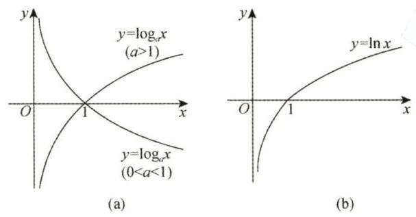
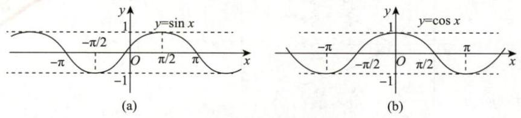
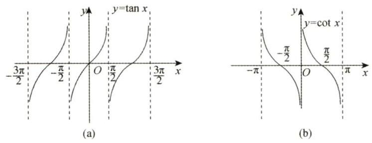
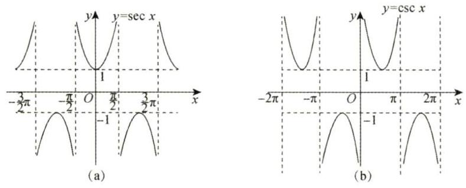
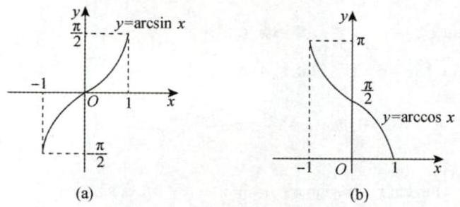
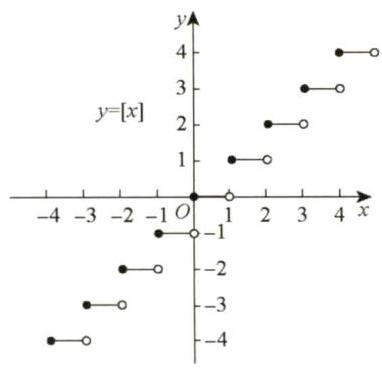
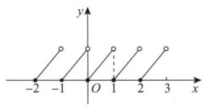

# 第1讲 函数极限与连续

## 1.1 函数的概念与特性

### 1. 函数

设 $x$ 与 $y$ 是两个变量，$D$ 是一个给定的数集，若对于每一个 $x\in D$ ，按照一定的法则 $f$，有一个确定的值 $y$ 与之对应，则称 $y$ 为 $x$ 的 **函数** ，记作 $y=f(x)$ 。称 $x$ 为 **自变量** ， $y$ 为 **因变量** 。称数集 $D$ 为此函数的 **定义域** ，定义域一般由实际背景中变量的具体意义或者函数对应法则的要求确定。称 $\{ f\left( x\right) \mid x \in D\}$ 为值域.

> 【注】单值函数与多值函数.
>
> 事实上,上述定义的函数是单值函数,若给一个 ${x}_{1}$ ,对应一个 ${y}_{1}$ ; 给另外一个 ${x}_{2}$ ,对应另外一个 ${y}_{2}$ ,这叫一对一 [见图 1-1(a)]. 若给定 ${x}_{1},{x}_{2}\left( {{x}_{1} \neq {x}_{2}}\right)$ ,它们对应同一个 $y$ ,则称多对一 [见图 1-1(b)], 所以函数可以一对一, 也可以多对一, 这叫单值函数.
>
> 但是,若一个 $x$ 对应一个 ${y}_{1}$ ,又对应另一个 ${y}_{2}$ ,也就是一对多,这叫多值函数 [见图 1-1(c)], 它不在上述定义中.
>
> 
>
> 图 1-1
>
> 我们的研究对象主要是单值函数.

【例 1.1】 设 $f\left( {x + \displaystyle\frac{1}{x}}\right) = \displaystyle\frac{x + {x}^{3}}{1 + {x}^{4}}, x \geq 2$ ,则 $f\left( x\right) =$ ______

解 应填 $\displaystyle\displaystyle\frac{x}{{x}^{2} - 2}$ .

$f\left( {x + \displaystyle\frac{1}{x}}\right) = \displaystyle\frac{x + {x}^{3}}{1 + {x}^{4}} = \displaystyle\frac{x + \displaystyle\frac{1}{x}}{{x}^{2} + \displaystyle\frac{1}{{x}^{2}}} = \displaystyle\frac{x + \displaystyle\frac{1}{x}}{{\left( x + \displaystyle\frac{1}{x}\right) }^{2} - 2}$ ,于是 $f\left( x\right) = \displaystyle\frac{x}{{x}^{2} - 2}$ .

【例 1.2】 设函数 $f\left( x\right)$ 的定义域为 $\left( {0, + \infty }\right)$ ,且满足 ${2f}\left( x\right) + {x}^{2}f\left( \displaystyle\frac{1}{x}\right) = \displaystyle\frac{{x}^{2} + {2x}}{\sqrt{1 + {x}^{2}}}$ ,则 $f\left( x\right) =$ ______

解 应填 $\displaystyle\frac{x}{\sqrt{1 + {x}^{2}}}$ .

由 ${2f}\left( x\right) + {x}^{2}f\left( \displaystyle\frac{1}{x}\right) = \displaystyle\frac{{x}^{2} + {2x}}{\sqrt{1 + {x}^{2}}}$ ,得 ${2f}\left( \displaystyle\frac{1}{x}\right) + \displaystyle\frac{1}{{x}^{2}}f\left( x\right) = \displaystyle\frac{\displaystyle\frac{1}{{x}^{2}} + \displaystyle\frac{2}{x}}{\sqrt{1 + \displaystyle\frac{1}{{x}^{2}}}} = \displaystyle\frac{\displaystyle\frac{1 + {2x}}{{x}^{2}}}{\displaystyle\frac{\sqrt{1 + {x}^{2}}}{x}} = \displaystyle\frac{1 + {2x}}{x\sqrt{1 + {x}^{2}}}$ ,结合以上两式, 消去 $f\left( \displaystyle\frac{1}{x}\right)$ ,可得 $f\left( x\right) = \displaystyle\frac{x}{\sqrt{1 + {x}^{2}}}$ .

> 【注】若给 $f\left( x\right) + {xf}\left( {-x}\right) = x$ ,应学会写 $f\left( {-x}\right) - {xf}\left( x\right) = - x$ ,消去 $f\left( {-x}\right)$ ,得 $f\left( x\right) = \displaystyle\frac{x + {x}^{2}}{1 + {x}^{2}}$ .

### 2.反函数

设函数 $y=f(x)$ 的定义域为 $D$ ，值域为 $R$ 。如果对于每一个 $y \in R$ ，必存在唯一的 $x \in D$ 使得 $y=f(x)$ 成立，则由此定义了一个新的函数 $x=\varphi(y)$ 。这个函数就称为函数 $y=f(x)$ 的反函数，一般记作 $x=f^{-1}(y)$ ，它的定义域为 $R$ ，值域为 $D$ ，相对于反函数来说，原来的函数也称为 **直接函数** 。以下两点需要说明。

第一，严格单调函数必有反函数，比如函数 $y=x^2 (x\in [0, +\infty))$ 是严格单调函数，故它有反函数 $x=\sqrt{y}$ 。

第二，若把 $x=f^{-1}(y)$ 与 $y=f(x)$ 的图形画在同一坐标系中，则它们完全重合。只有把 $y=f(x)$ 的反函数 $x=f^{-1}(y)$ 写成 $y=f^{-1}(x)$ 后，它们的图形才关于 $y=x$ 对称，事实上这也是字母 $x$ 与 $y$ 互换的结果。

> 【注】有反函数的函数不一定是单调函数。比如 $f(x)=\begin{cases}x,\quad x\geq 0,\\[10px] \displaystyle\frac{1}{x}, \quad x<0,\end{cases}$ ，其图像如图 1-2 所示，其反函数即为 $f(x)$ 本身，但 $f(x)$ 不是单调函数。  
>   
> 图 1-2

【例 1.3】 求函数 $y = f\left( x\right) = \ln \left( {x + \sqrt{{x}^{2} + 1}}\right)$ 的反函数 ${f}^{-1}\left( x\right)$ 的表达式及其定义域.

解 直接由 $y = \ln \left( {x + \sqrt{{x}^{2} + 1}}\right)$ 解出 $x = {f}^{-1}\left( y\right)$ 会很麻烦,现采用下述方法.

$$
- y = - \ln \left( {x + \sqrt{{x}^{2} + 1}}\right) = \ln \frac{1}{x + \sqrt{{x}^{2} + 1}}
$$

$$
= \ln \frac{\sqrt{{x}^{2} + 1} - x}{\left( {\sqrt{{x}^{2} + 1} + x}\right) \left( {\sqrt{{x}^{2} + 1} - x}\right) } = \ln \left( {\sqrt{{x}^{2} + 1} - x}\right) ,
$$

所以

$$
\begin{align}
\text{公式: } & \mathrm{e}^{-y} = \sqrt{{x}^{2} + 1} - x, \tag*{$①$}
\end{align}
$$

再由 $y = f\left( x\right)$ 的表达式有

$$
{\mathrm{e}}^{y} = \sqrt{{x}^{2} + 1} + x, \tag*{$②$}
$$

② - ①, 得

$$
x = \frac{1}{2}\left( {{\mathrm{e}}^{y} - {\mathrm{e}}^{-y}}\right) ,
$$

交换上式中 $x, y$ 的位置后就是 $y = f\left( x\right)$ 的反函数,即

$$
y = {f}^{-1}\left( x\right) = \frac{1}{2}\left( {{\mathrm{e}}^{x} - {\mathrm{e}}^{-x}}\right) , - \infty < x < + \infty .
$$

> 【注】(1) 函数 $y = \ln \left( {x + \sqrt{{x}^{2} + 1}}\right)$ 叫作反双曲正弦函数,其图像如图 1-3(a) 所示. 函数 $y = \displaystyle\frac{{\mathrm{e}}^{x} - {\mathrm{e}}^{-x}}{2}$ 叫作双曲正弦函数, 其图像如图 1-3(b) 所示. 考生应记住这两个函数的图像.
>
> 
>
> 图 1-3
>
> (2) $y = \displaystyle\frac{{\mathrm{e}}^{x} + {\mathrm{e}}^{-x}}{2}$ 叫作双曲余弦函数,其图像如图 1-4 所示,它是偶函数,是一种特殊的悬链线. 达. 芬奇在画《抱银貂的女子》时, 曾仔细思索过女子的脖子上戴的项链的形状是什么函数, 可惜他一生都未能明白, 在他去世后近 200 年后, 约翰·伯努利解决了这个问题. 那不是抛物线 $y = {x}^{2}$ ,而是悬链线 $y = \displaystyle\frac{a}{2}\left( {{\mathrm{e}}^{\frac{x}{a}} + {\mathrm{e}}^{-\frac{x}{a}}}\right)$ ,取 $a = 1$ ,便是此例.
>
> 
>
> 图 1-4
>
> (3) 以后会知道如下 3 个重要结论.
>
> ① $x \rightarrow 0$ 时, $\ln \left( {x + \sqrt{{x}^{2} + 1}}\right) \sim x$ .
>
> ② ${\left\lbrack \ln \left( x + \sqrt{{x}^{2} + 1}\right) \right\rbrack }^{\prime } = \displaystyle\frac{1}{\sqrt{{x}^{2} + 1}}$ ,于是 $\int \displaystyle\frac{1}{\sqrt{{x}^{2} + 1}}\mathrm{\;d}x = \ln \left( {x + \sqrt{{x}^{2} + 1}}\right) + C$ .
>
> ③ 由于 $y = \ln \left( {x + \sqrt{{x}^{2} + 1}}\right)$ 是奇函数,于是 ${\int }_{-1}^{1}\left\lbrack {\ln \left( {x + \sqrt{{x}^{2} + 1}}\right) + {x}^{2}}\right\rbrack \mathrm{d}x = {\int }_{-1}^{1}{x}^{2}\mathrm{\;d}x = \frac{2}{3}$ .

### 3. 复合函数

设函数 $y=f(u)$ 的定义域为 $D_1$ ，函数 $u=g(x)$ 在 $D$ 上有定义，且 $g(D) \subset D_1$ ，则由

$$
y = f\left\lbrack {g\left( x\right) }\right\rbrack \left( {x \in D}\right)
$$

确定的函数，称为由函数 $u = g\left( x\right)$ 和函数 $y = f\left( u\right)$ 构成的 **复合函数** ，它的定义域为 $D$ ， $u$ 称为中间变量，考生要掌握复合的方法.

【例 1.4】 设 $f\left( x\right) = {x}^{2}, f\left\lbrack {\varphi \left( x\right) }\right\rbrack = - {x}^{2} + {2x} + 3$ ,且 $\varphi \left( x\right) \geq 0$ ,求 $\varphi \left( x\right)$ 及其定义域与值域.

解 由题设条件知, $f\left\lbrack {\varphi \left( x\right) }\right\rbrack = {\varphi }^{2}\left( x\right) = - {x}^{2} + {2x} + 3$ ,于是 $\varphi \left( x\right) = \sqrt{-{x}^{2} + {2x} + 3}$ .

由 $- {x}^{2} + {2x} + 3 \geq 0$ ,即 $\left( {x - 3}\right) \left( {x + 1}\right) \leq 0$ ,知 $\varphi \left( x\right)$ 的定义域为 $\left\lbrack {-1,3}\right\rbrack$ .

又 $\sqrt{-{x}^{2} + {2x} + 3} = \sqrt{-{\left( x - 1\right) }^{2} + 4}$ ,当 $x = 1$ 时, $\varphi \left( 1\right) = 2$ 为最大值,显然 $\varphi \left( {-1}\right) = \varphi \left( 3\right) = 0$ 为最小值,故 $\varphi \left( x\right)$ 的值域为 $\left\lbrack {0,2}\right\rbrack$ .

【例 1.5】 设 $g\left( x\right) = \left\{ {\begin{array}{l} 2 - x, x \leq 0, \\ 2 + x, x > 0, \end{array}f\left( x\right) = \left\{ \begin{array}{ll} {x}^{2}, & x < 0, \\ - x - 1, & x \geq 0, \end{array}\right. }\right.$ 则 $g\left\lbrack {f\left( x\right) }\right\rbrack =$ _________________

f(x)的图像

解 应填 $\left\{ \begin{array}{ll} 3 + x, & x \geq 0, \\ 2 + {x}^{2}, & x < 0. \end{array}\right.$

先求出 $g\left\lbrack {f\left( x\right) }\right\rbrack$ 的表达式.

$$
g\left\lbrack {f\left( x\right) }\right\rbrack = \left\{ \begin{array}{l} 2 - f\left( x\right), f\left( x\right) \leq 0, \\ 2 + f\left( x\right), f\left( x\right) > 0, \end{array}\right.
$$

当 $f\left( x\right) \leq 0$ 时, $x \geq 0$ ,此时 $f\left( x\right) = - x - 1$ ; 当 $f\left( x\right) > 0$ 时, $x < 0$ ,此时 $f\left( x\right) = {x}^{2}$ .

综上,

$$
g\left\lbrack {f\left( x\right) }\right\rbrack = \left\{ {\begin{array}{ll} 2 - \left( {-x - 1}\right) , & x \geq 0, \\ 2 + {x}^{2}, & x < 0 \end{array} = \left\{ \begin{array}{ll} 3 + x, & x \geq 0, \\ 2 + {x}^{2}, & x < 0. \end{array}\right. }\right.
$$

### 4. 隐函数

设方程 $F\left( {x, y}\right) = 0$ ,若当 $x$ 取某区间内的任一值时,总有满足该方程的唯一的值 $y$ 存在,则称方程 $F\left( {x, y}\right) = 0$ 在上述区间内确定了一个隐函数 $y = y\left( x\right)$ .

如 $x + {y}^{3} - 1 = 0$ 就表示一个隐函数,且可显化为 $y = \sqrt[3]{1 - x}$ ; 再如 $\sin \left( {xy}\right) = \ln \displaystyle\frac{x + \mathrm{e}}{y} + 1$ 也表示一个隐函数, 但不易显化.

一般来说,由 $F\left( {x, y}\right) = 0$ 所确定的隐函数求 $y\left( {x}_{0}\right)$ ,若代入 ${x}_{0}$ 易求出 $y\left( {x}_{0}\right)$ ,则直接求之; 若不易求出 $y\left( {x}_{0}\right)$ ,则用观察法. 如:

①设函数 $y = y\left( x\right)$ 由方程 $\ln y - \displaystyle\frac{x}{y} + x = 0$ 确定,当 $x = 2$ 时, $y\left( 2\right) = 1$ .

> $\ln y - \displaystyle\frac{2}{y} + 2 = 0$ ,显然可看出, $y = 1$ 时成立

②设函数 $y = y\left( x\right)$ 由方程 $\ln y + {\mathrm{e}}^{y - 1} = \displaystyle\frac{x}{2}$ 确定,当 $x = 2$ 时, $y\left( 2\right) = 1$ .

> $\ln y + {\mathrm{e}}^{y - 1} = 1$ . 显然可 看出， $y = 1$ 时成立
>
> 【注】考研试题中常出现这种问题, 考生要重视.

### 5. 函数的四种特性

#### (1) 有界性

设 $f\left( x\right)$ 的定义域为 $D$ ,数集 $I \subset D$ . 如果存在某个正数 $M$ ,使对任一 $x \in I$ ,有 $\left| {f\left( x\right) }\right| \leq M$ ,则称 $f\left( x\right)$ 在 $I$ 上有界; 如果这样的 $M$ 不存在,则称 $f\left( x\right)$ 在 $I$ 上无界.

> 【注】(1) 从几何上看,如果在给定的区间,函数 $y = f\left( x\right)$ 的图形能够被直线 $y = - M$ 和 $y = M$ “完全包起来”,则为有界; 从解析上说,如果找到某个正数 $M$ ,使得 $\left| {f\left( x\right) }\right| \leq M$ ,则为有界.
>
> (2) 有界还是无界的讨论首先需指明区间 $I$ ,不知区间,无法谈论有界性. 比如 $y = \displaystyle\frac{1}{x}$ 在 $\left( {2, + \infty }\right)$ 内有界,但在 $\left( {0,2}\right)$ 内无界.
>
> (3) 事实上,只要在区间 $I$ 上或其端点处存在点 ${x}_{0}$ ,使得 $\mathop{\lim }\limits_{{x \rightarrow {x}_{0}}}f\left( x\right)$ 的值为无穷大,则没有任何两条直线 $y = - M$ 和 $y = M$ 可以把 $I$ 上的 $f\left( x\right)$ “包起来”,这就叫无界. 考研中常出这样的题目,比如例 1.17.

【例 1.6】 证明函数 $f\left( x\right) = \displaystyle\frac{x}{1 + {x}^{2}}$ 在 $\left( {-\infty , + \infty }\right)$ 内有界.

证明 当 $x \neq 0$ 时,

$$
\left| {f\left( x\right) }\right| = \frac{\left| x\right| }{1 + {x}^{2}} = \frac{1}{\displaystyle\frac{1}{\left| x\right| } + \left| x\right| }
$$

由不等式 $\displaystyle\frac{a + b}{2} \geq \sqrt{ab}\left( {a, b > 0}\right)$ ,有 $\displaystyle\frac{1}{\left| x\right| } + \left| x\right| \geq 2\sqrt{\frac{1}{\left| x\right| }\left| x\right| } = 2$ ,即 $\left| {f\left( x\right) }\right| \leq \displaystyle\frac{1}{2}$ .

当 $x = 0$ 时, $f\left( 0\right) = 0$ . 综上,函数 $f\left( x\right)$ 在 $\left( {-\infty , + \infty }\right)$ 内有界.

#### (2) 单调性

设 $f\left( x\right)$ 的定义域为 $D$ ,区间 $I \subset D$ . 如果对于区间 $I$ 上任意两点 ${x}_{1},{x}_{2}$ ,当 ${x}_{1} < {x}_{2}$ 时,恒有 $f\left( {x}_{1}\right) < f\left( {x}_{2}\right)$ , 则称 $f\left( x\right)$ 在区间 $I$ 上单调增加. 如果对于区间 $I$ 上任意两点 ${x}_{1},{x}_{2}$ ,当 ${x}_{1} < {x}_{2}$ 时,恒有 $f\left( {x}_{1}\right) >$ $f\left( {x}_{2}\right)$ ,则称 $f\left( x\right)$ 在区间 $I$ 上单调减少.

> 【注】后面会看到, 在考研试题中常常用求导的方法来讨论函数在某个区间上的单调性, 但是定义法不可以忘记. 试题中也常用到如下定义法的判别形式, 请读者留意.
>
> 对任意 ${x}_{1},{x}_{2} \in D,{x}_{1} \neq {x}_{2}$ ,有
>
> $f\left( x\right)$ 是单调增函数 $\Leftrightarrow \left( {{x}_{1} - {x}_{2}}\right) \left\lbrack {f\left( {x}_{1}\right) - f\left( {x}_{2}\right) }\right\rbrack > 0$ ;
>
> $f\left( x\right)$ 是单调减函数 $\Leftrightarrow \left( {{x}_{1} - {x}_{2}}\right) \left\lbrack {f\left( {x}_{1}\right) - f\left( {x}_{2}\right) }\right\rbrack < 0$ ;
>
> $f\left( x\right)$ 是单调不减函数 $\Leftrightarrow \left( {{x}_{1} - {x}_{2}}\right) \left\lbrack {f\left( {x}_{1}\right) - f\left( {x}_{2}\right) }\right\rbrack \geq 0$ ;
>
> $f\left( x\right)$ 是单调不增函数 $\Leftrightarrow \left( {{x}_{1} - {x}_{2}}\right) \left\lbrack {f\left( {x}_{1}\right) - f\left( {x}_{2}\right) }\right\rbrack \leq 0$ .

【例 1.7】 设 $f\left( x\right)$ 在 $\left( {-\infty , + \infty }\right)$ 上有定义,任给 ${x}_{1},{x}_{2},{x}_{1} \neq {x}_{2}$ ,均有 $\left( {{x}_{1} - {x}_{2}}\right) \cdot \left\lbrack {f\left( {x}_{1}\right) - f\left( {x}_{2}\right) }\right\rbrack > 0$ , 则以下函数一定单调增加的是 ( ).

(A) $\left| {f\left( x\right) }\right|$ &emsp; (B) $f\left( \left| x\right| \right)$  &emsp; (C) $f\left( {-x}\right)$  &emsp; (D) $- f\left( {-x}\right)$

解 应选 (D).

由上述注知, $f\left( x\right)$ 是单调增函数,又 $f\left( {-x}\right)$ 与 $f\left( x\right)$ 的图像关于 $y$ 轴对称, $- f\left( {-x}\right)$ 与 $f\left( x\right)$ 的图像关于原点对称 [见附录 1(2) 的②,③],可知 $f\left( {-x}\right)$ 单调减少, $- f\left( {-x}\right)$ 单调增加, $\left| {f\left( x\right) }\right|$ 是否具有单调性与 $f\left( x\right)$ 的正负相关, $f\left( \left| x\right| \right)$ 为偶函数,在 $\left( {-\infty , + \infty }\right)$ 上无单调性 [见附录 1(2) 的⑤,⑥],故选 (D).

#### (3) 奇偶性

设 $f\left( x\right)$ 的定义域 $D$ 关于原点对称 (若 $x \in D$ ,则 $- x \in D$ ). 如果对于任一 $x \in D$ ,恒有 $f\left( {-x}\right) = f\left( x\right)$ , 则称 $f\left( x\right)$ 为偶函数. 如果对于任一 $x \in D$ ,恒有 $f\left( {-x}\right) = - f\left( x\right)$ ,则称 $f\left( x\right)$ 为奇函数. 我们熟知的是,偶函数的图形关于 $y$ 轴对称,奇函数的图形关于原点对称.

> 【注】(1) 前提: 定义域关于原点对称.
>
> (2) 基本类型.
>
> ① $f\left( x\right) + f\left( {-x}\right)$ 必是偶函数.
>
> 如 $\displaystyle\frac{{\mathrm{e}}^{x} + {\mathrm{e}}^{-x}}{2}$ ,图像见下图.
>
> 
>
> 如 $\sqrt[3]{{\left( 1 + x\right) }^{2}} + \sqrt[3]{{\left( 1 - x\right) }^{2}}$ .
>
> ② $f\left( x\right) - f\left( {-x}\right)$ 必是奇函数.
>
> 如 $\displaystyle\frac{{\mathrm{e}}^{x} - {\mathrm{e}}^{-x}}{2}$ .
>
> 
>
> 如 $\ln \displaystyle\frac{1 + x}{1 - x} = \ln \left( {1 + x}\right) - \ln \left( {1 - x}\right)$ .
>
> 对任一函数 $f\left( x\right)$ ,令 $u\left( x\right) = \displaystyle\frac{1}{2}\left\lbrack {f\left( x\right) + f\left( {-x}\right) }\right\rbrack, v\left( x\right) = \displaystyle\frac{1}{2}\left\lbrack {f\left( x\right) - f\left( {-x}\right) }\right\rbrack$ ,则 $u\left( x\right)$ 是偶函数, $v\left( x\right)$ 是奇函数. 由
>
> $$
f\left( x\right) = \frac{1}{2}\left\lbrack {f\left( x\right) + f\left( {-x}\right) }\right\rbrack + \frac{1}{2}\left\lbrack {f\left( x\right) - f\left( {-x}\right) }\right\rbrack = u\left( x\right) + v\left( x\right) ,$$
>
> 可知任何一个函数都可以写成一个奇函数与一个偶函数之和的形式.
>
> ③ $f\left\lbrack {\varphi \left( x\right) }\right\rbrack$ (内偶则偶,内奇同外).
>
> - 奇[偶] $\Rightarrow$ 偶. 如 $\sin {x}^{2}$ .
>
> - 偶[奇] $\Rightarrow$ 偶. 如 $\cos \left( {\sin x}\right) ,\left| {\sin x}\right|$ .
>
> - 奇[奇] $\Rightarrow$ 奇. 如 $\sin \frac{1}{x},\sqrt[3]{\tan x}$ .
>
> - 偶[偶] $\Rightarrow$ 偶. 如 $\cos \left| x\right| ,\left| {\cos x}\right|$ .
>
> - 非奇非偶[偶] $\Rightarrow$ 偶. 如 ${\mathrm{e}}^{{x}^{2}},\ln \left| x\right|$ .
>
> ④ 一个特色: ${\left\lbrack \ln \left( x + \sqrt{{x}^{2} + 1}\right) \right\rbrack }^{\prime } = \displaystyle\frac{1}{\sqrt{{x}^{2} + 1}}$ .
>
> ⑤ $f\left( x\right)$ 奇 $\Rightarrow {f}^{\prime }\left( x\right)$ 偶 $\Rightarrow {f}^{\prime \prime }\left( x\right)$ 奇 $\Rightarrow \cdots$ . 见例 3.1.
>
> 上面可依次替换为：(偶)  (奇)  (偶)
>
> ⑥ $f\left( x\right)$ 奇 $\Rightarrow {\int }_{0}^{x}f\left( t\right) \mathrm{d}t$ 偶.
>
> 上面可依次替换为：(偶) (奇)
>
> ⑦设对任意的 $x, y$ ,都有 $f\left( {x + y}\right) = f\left( x\right) + f\left( y\right)$ ,则 $f\left( x\right)$ 是奇函数,证明见例 1.8.

【例 1.8】 设对任意 $x, y$ ,都有 $f\left( {x + y}\right) = f\left( x\right) + f\left( y\right)$ ,证明: $f\left( x\right)$ 是奇函数.

证明 令 $x = y = 0$ ,则 $f\left( 0\right) = f\left( 0\right) + f\left( 0\right)$ ,于是 $f\left( 0\right) = 0$ ,再令 $y = - x$ ,则 $f\left( 0\right) = f\left( x\right) + f\left( {-x}\right)$ ,即 $f\left( {-x}\right) = - f\left( x\right)$ ,故 $f\left( x\right)$ 是奇函数.

#### (4) 周期性

设 $f\left( x\right)$ 的定义域为 $D$ ,如果存在个正数 $T$ ,使得对于任一 $x \in D$ ,有 $x \pm T \in D$ ,且 $f\left( {x + T}\right) =$ $f\left( x\right)$ ,则称 $f\left( x\right)$ 为 **周期函数** , $T$ 称为 $f\left( x\right)$ 的 **周期** .

> 【注】重要结论.
>
> ① 若 $f\left( x\right)$ 以 $T$ 为周期,则 $f\left( {{ax} + b}\right)$ 以 $\displaystyle\frac{T}{\left| a\right| }$ 为周期.
>
> ② 若 $g\left( x\right)$ 是周期函数,则复合函数 $f\left\lbrack {g\left( x\right) }\right\rbrack$ 也是周期函数,如 ${\mathrm{e}}^{\sin x},{\cos }^{2}x$ 等.
>
> ③ 若 $f\left( x\right)$ 是以 $T$ 为周期的可导函数,则 ${f}^{\prime }\left( x\right)$ 也以 $T$ 为周期. 见例 3.1.
>
> ④ 若 $f\left( x\right)$ 是以 $T$ 为周期的连续函数,则只有在 ${\int }_{0}^{T}f\left( x\right) \mathrm{d}x = 0$ 时, ${\int }_{0}^{x}f\left( t\right) \mathrm{d}t$ 也以 $T$ 为周期. 见例 9.25.

【例 1.9】 设函数 $f\left( x\right)$ 在 $\left( {-\infty , + \infty }\right)$ 上满足 $f\left( x\right) = f\left( {x - \pi }\right) + \sin x$ . 证明: $f\left( x\right)$ 是以 $T = {2\pi }$ 为周期的周期函数.

证明 多次利用题目等式条件,得到 $f\left( {x + {2\pi }}\right) = f\left( {x + \pi }\right) + \sin \left( {x + {2\pi }}\right) = f\left( x\right) + \sin \left( {x + \pi }\right) + \sin \left( {x + {2\pi }}\right) =$ $f\left( x\right)$ ,故 $f\left( x\right)$ 以 $T = {2\pi }$ 为周期.

## 1.2 函数的图像

### 1. 基本初等函数与初等函数

基本初等函数: 常数函数、幂函数、指数函数、对数函数、三角函数、反三角函数.

#### (1) 常数函数

$y = A, A$ 为常数,其图形为平行于 $x$ 轴的水平直线 (见图 1-5).

> 易考 “找交点个数” 或在概率论中求概率 $P\{ g\left( X\right) \leq y\}$  
> 它为偶函数

图 1-5

#### (2) 幂函数

$y = {x}^{\mu }\left( {\mu \text{ 是实数 }}\right)$ .

> 【注】(1) $y = {x}^{\mu }$ 的定义域和值域取决于 $\mu$ 的值. 当 $x > 0$ 时, $y = {x}^{\mu }$ 都有定义.
>
> (2) 常用的幂函数 (见图 1-6).
>
> $$
y = x, y = {x}^{2}, y = \sqrt{x}, y = {x}^{3}, y = \sqrt[3]{x}, y = \frac{1}{x}.$$
>
> 
>
> 图 1-6
>
> (3) 当 $x > 0$ 时,由 $y = x$ 与 $y = \sqrt{x}, y = \sqrt[3]{x}, y = \ln x$ [见图 1-8(b)] 具有相同的单调性且与 $y = \displaystyle\frac{1}{x}$ 具有相反的单调性, 故
>
> ① 见到 $\sqrt{u},\sqrt[3]{u}$ 时,可用 $u$ 来研究最值;
>
> ② 见到 $\left| u\right|$ 时,由 $\left| u\right| = \sqrt{{u}^{2}}$ ,可用 ${u}^{2}$ 来研究最值;
>
> ③ 见到 ${u}_{1}{u}_{2}{u}_{3}$ 时,可用 $\ln \left( {{u}_{1}{u}_{2}{u}_{3}}\right) = \ln {u}_{1} + \ln {u}_{2} + \ln {u}_{3}$ 来研究最值;
>
> ④ 见到 $\displaystyle\frac{1}{u}$ 时,可用 $u$ 来研究最值 (结论相反,即 $\displaystyle\frac{1}{u}$ 与 $u$ 的最大值点、最小值点相反).
>
> 利用以上①∼④ ,可使得计算简单方便.

【例 1.10】 设 $0 < x < \displaystyle\frac{1}{2}$ ,求 $y\left( x\right) = {x}^{6}{\left( 1 - x\right) }^{2}{\left( 1 - 2x\right) }^{4}$ 的最大值点.

解 取对数, 得

$$
\ln y\left( x\right) = 6\ln x + 2\ln \left( {1 - x}\right) + 4\ln \left( {1 - {2x}}\right) .
$$

令

$$
\frac{\mathrm{d}\left\lbrack {\ln y\left( x\right) }\right\rbrack }{\mathrm{d}x} = \frac{6}{x} - \frac{2}{1 - x} - \frac{8}{1 - {2x}} = \frac{{24}{x}^{2} - {28x} + 6}{x\left( {1 - x}\right) \left( {1 - {2x}}\right) } = 0,
$$

即 ${12}{x}^{2} - {14x} + 3 = 0$ ,解得 $x = \displaystyle\frac{7 \pm \sqrt{13}}{12}$ ,因为 $\displaystyle\frac{7 + \sqrt{13}}{12} > \frac{1}{2}$ 不符合题意,又 $\mathop{\lim }\limits_{{x \rightarrow {0}^{ + }}}y\left( x\right) = \mathop{\lim }\limits_{{x \rightarrow \left( \frac{1}{2}\right)^- }}y\left( x\right) =$ $0 < y\left( \displaystyle\frac{7 - \sqrt{13}}{12}\right)$ ,故 $y$ 的最大值点为 $x = \displaystyle\frac{7 - \sqrt{13}}{12}$ .

#### (3) 指数函数

$y = {a}^{x}\left( {a > 0, a \neq 1}\right)$ [见图 1-7(a)].

图 1-7

> 【注】(1) 定义域: $\left( {-\infty , + \infty }\right)$ ,值域: $\left( {0, + \infty }\right)$ .
>
> (2) 单调性: 当 $a > 1$ 时, $y = {a}^{x}$ 单调增加; 当 $0 < a < 1$ 时, $y = {a}^{x}$ 单调减少.
>
> (3) 常用的指数函数: $y = {\mathrm{e}}^{x}$ [见图 1-7(b)].
>
> (4) 极限: $\mathop{\lim }\limits_{{x \rightarrow - \infty }}{\mathrm{e}}^{x} = 0,\mathop{\lim }\limits_{{x \rightarrow + \infty }}{\mathrm{e}}^{x} = + \infty$ .
>
> (5) 特殊函数值: ${a}^{0} = 1,{\mathrm{e}}^{0} = 1$ .
>
> (6) 指数运算法则.
>
>
> $$
{a}^{\alpha } \cdot {a}^{\beta } = {a}^{\alpha + \beta },\frac{{a}^{\alpha }}{{a}^{\beta }} = {a}^{\alpha - \beta },{\left( {a}^{\alpha }\right) }^{\beta } = {a}^{\alpha \beta },{\left( ab\right) }^{\alpha } = {a}^{\alpha }{b}^{\alpha },{\left( \frac{a}{b}\right) }^{\alpha } = \frac{{a}^{\alpha }}{{b}^{\alpha }}, $$
>
>> $$
(\alpha^\alpha)^\beta \text{如}{\left| x\right| }^{3n} = {\left( {\left| x\right| }^{3}\right) }^{n} = {\left( \left| {x}^{3}\right| \right) }^{n} $$
>>
>> $$
\alpha^{\alpha - \beta}\text{如}{\mathrm{e}}^{\tan x} - {\mathrm{e}}^{\sin x} = {\mathrm{e}}^{\sin x}\left( {{\mathrm{e}}^{\tan x - \sin x} - 1}\right) $$
>
> 其中 $a, b$ 是正实数, $\alpha ,\beta$ 是任意实数.

#### (4) 对数函数

$y = {\log }_{a}x\left( {a > 0, a \neq 1}\right) \left\lbrack \text{见图 1-8(a)}\right\rbrack$ 是 $y = {a}^{x}$ 的反函数.

图 1-8

>【注】(1) 定义域: $\left( {0, + \infty }\right)$ ,值域: $\left( {-\infty , + \infty }\right)$ .
>
>(2) 单调性: 当 $a > 1$ 时, $y = {\log }_{a}x$ 单调增加; 当 $0 < a < 1$ 时, $y = {\log }_{a}x$ 单调减少.
>
>(3) 常用的对数函数: $y = \ln x$ (自然对数: $\ln x = {\log }_{\mathrm{e}}x,\mathrm{e} = {2.71828}\cdots$ ) [见图 1-8(b)].
>
>(4) 特殊函数值: ${\log }_{a}1 = 0,{\log }_{a}a = 1,\ln 1 = 0,\ln \mathrm{e} = 1$ .
>
>(5) 极限: $\mathop{\lim }\limits_{{x \rightarrow {0}^{ + }}}\ln x = - \infty ,\mathop{\lim }\limits_{{x \rightarrow + \infty }}\ln x = + \infty$ .
>
>(6) 常用公式: $x = {\mathrm{e}}^{\ln x}\left( {x > 0}\right) ,{u}^{v} = {\mathrm{e}}^{\ln {u}^{v}} = {\mathrm{e}}^{v\ln u}\left( {u > 0}\right)$ .
>
>(7) 对数运算法则.
>
> ① ${\log }_{a}\left( {MN}\right) = {\log }_{a}M + {\log }_{a}N$ (积的对数 $=$ 对数的和).
>> 积变和
>
>② ${\log }_{a}\displaystyle\frac{M}{N} = {\log }_{a}M - {\log }_{a}N$ (商的对数 $=$ 对数的差).
>> 商变差
>
>③ ${\log }_{a}{M}^{n} = n{\log }_{a}M$，${\log }_{a}\sqrt[n]{M} = \displaystyle\frac{1}{n}{\log }_{a}M$ (幂的对数 $=$ 对数的倍数).
>
>> 幂次变倍数
>
>常考: 当 $x > 0$ 时,
>
>$\ln \sqrt{x} = \displaystyle\frac{1}{2}\ln x$ ； $\ln \displaystyle\frac{1}{x} = - \ln x$ ； $\ln \left( {1 + \displaystyle\frac{1}{x}}\right) = \ln \displaystyle\frac{x + 1}{x} = \ln \left( {x + 1}\right) - \ln x$ （中值定理（拉格朗日中值定理）证明）。

【例 1.11】 已知 ${\mathrm{e}}^{x} = \mathop{\sum }\limits_{{n = 0}}^{\infty }\displaystyle\frac{{x}^{n}}{n!}, x \in \mathbf{R}$ ,则 ${2}^{x} = \left( \;\right)$ .

(A) $\mathop{\sum }\limits_{{n = 1}}^{\infty }\displaystyle\frac{{\left( x\ln 2\right) }^{n}}{n!}$  &emsp; (B) $\mathop{\sum }\limits_{{n = 0}}^{\infty }\displaystyle\frac{{\left( x\ln 2\right) }^{n}}{n!}$  &emsp; (C) $\mathop{\sum }\limits_{{n = 1}}^{\infty }\displaystyle\frac{\left( {\ln 2}\right) {x}^{n}}{n!}$  &emsp; (D) $\mathop{\sum }\limits_{{n = 0}}^{\infty }\displaystyle\frac{\left( {\ln 2}\right) {x}^{n}}{n!}$

解 应选 (B).

由于 ${2}^{x} = {\mathrm{e}}^{x\ln 2}$ ,又 ${\mathrm{e}}^{x} = \mathop{\sum }\limits_{{n = 0}}^{\infty }\displaystyle\frac{{x}^{n}}{n!}, x \in \mathbf{R}$ ,因此 ${2}^{x} = \mathop{\sum }\limits_{{n = 0}}^{\infty }\displaystyle\frac{{\left( x\ln 2\right) }^{n}}{n!}$ .

#### (5) 三角函数

一拱的面积为2.

##### ①正弦函数与余弦函数

正弦函数 $y = \sin x$ [见图 1-9(a)],余弦函数 $y = \cos x$ [见图 1-9(b)].

图 1-9

>【注】(1) 定义域: $\left( {-\infty , + \infty }\right)$ ,值域: $\left\lbrack {-1,1}\right\rbrack$ .
>
>(2) 奇偶性: $y = \sin x$ 是奇函数, $y = \cos x$ 是偶函数, $x \in \left( {-\infty , + \infty }\right)$ .
>
>(3) 周期性: $y = \sin x$ 和 $y = \cos x$ 均以 ${2\pi }$ 为最小正周期, $x \in \left( {-\infty , + \infty }\right)$ .
>
>(4) 有界性: $\left| {\sin x}\right| \leq 1,\left| {\cos x}\right| \leq 1$ .
>
>(5) 特殊函数值: $\;\sin 0 = 0,\sin \displaystyle\frac{\pi }{6} = \frac{1}{2},\sin \frac{\pi }{4} = \frac{\sqrt{2}}{2},\sin \frac{\pi }{3} = \frac{\sqrt{3}}{2}$ ,
>
>$$
\sin \frac{\pi }{2} = 1,\sin \pi = 0,\sin \frac{3\pi }{2} = - 1,\sin {2\pi } = 0,$$
>
>$$
\cos 0 = 1,\cos \frac{\pi }{6} = \frac{\sqrt{3}}{2},\cos \frac{\pi }{4} = \frac{\sqrt{2}}{2},\cos \frac{\pi }{3} = \frac{1}{2}\text{,} $$
>
>$$
\cos \frac{\pi }{2} = 0,\cos \pi = - 1,\cos \frac{3\pi }{2} = 0,\cos {2\pi } = 1.$$
>
>(6) ${\sin }^{2}\alpha + {\cos }^{2}\alpha = 1$ .

##### ②正切函数与余切函数

正切函数 $y = \tan x$ [见图 1-10(a)],余切函数 $y = \cot x$ [见图 1-10(b)].

$$
\tan x = \frac{\sin x}{\cos x},\cot x = \frac{\cos x}{\sin x} = \frac{1}{\tan x}.
$$

图 1-10

> 【注】(1) 定义域: $y = \tan x$ 的定义域为 $\left\{ {x \mid x \neq {k\pi } + \displaystyle\frac{\pi }{2}\left( {k \in \mathbf{Z}}\right) }\right\} ;y = \cot x$ 的定义域为 $\{ x \mid x \neq {k\pi }$ $\left( {k \in \mathbf{Z}}\right) \}$ .
>
> 值域: $\left( {-\infty , + \infty }\right)$ .
>
> (2) 奇偶性: $y = \tan x$ 和 $y = \cot x$ 均为奇函数 (在其定义域内).
>
> (3) 周期性: $y = \tan x$ 和 $y = \cot x$ 均以 $\pi$ 为最小正周期 (在其定义域内).
>
> (4) 特殊函数值: $\;\tan 0 = 0,\tan \displaystyle\frac{\pi }{6} = \frac{\sqrt{3}}{3},\tan \frac{\pi }{4} = 1,\tan \frac{\pi }{3} = \sqrt{3}$ ,
>
> $$
\mathop{\lim }\limits_{{x \rightarrow \frac{\pi }{2}}}\tan x = \infty ,\tan \pi = 0,\mathop{\lim }\limits_{{x \rightarrow \frac{3\pi }{2}}}\tan x = \infty ,\tan {2\pi } = 0, $$
>
> $$
\mathop{\lim }\limits_{{x \rightarrow 0}}\cot x = \infty ,\cot \frac{\pi }{6} = \sqrt{3},\cot \frac{\pi }{4} = 1,\cot \frac{\pi }{3} = \frac{\sqrt{3}}{3}, $$
>
> $$
\cot \frac{\pi }{2} = 0,\mathop{\lim }\limits_{{x \rightarrow \pi }}\cot x = \infty ,\cot \frac{3\pi }{2} = 0,\mathop{\lim }\limits_{{x \rightarrow {2\pi }}}\cot x = \infty .$$

##### ③正割函数与余割函数

正割函数 $y = \sec x$ [见图 1-11(a)],余割函数 $y = \csc x$ [见图 1-11(b)].

$$
\sec x = \frac{1}{\cos x},\csc x = \frac{1}{\sin x}.
$$

图 1-11

> 【注】(1) 定义域: $y = \sec x$ 的定义域为 $\left\{ {x \mid x \neq {k\pi } + \displaystyle\frac{\pi }{2}\left( {k \in \mathbf{Z}}\right) }\right\} ;y = \csc x$ 的定义域为 $\{ x \mid x \neq {k\pi }$ $\left( {k \in \mathbf{Z}}\right) \}$ .
>
> 值域: $\left( {-\infty , - 1\rbrack \cup \lbrack 1, + \infty }\right)$ .
>
> (2) 奇偶性: $y = \sec x$ 为偶函数, $y = \csc x$ 为奇函数 (在其定义域内).
>
> (3) 周期性: $y = \sec x$ 和 $y = \csc x$ 均以 ${2\pi }$ 为最小正周期 (在其定义域内).
>
> (4) $1 + {\tan }^{2}\alpha = {\sec }^{2}\alpha$ ； $1 + {\cot }^{2}\alpha = {\csc }^{2}\alpha$ .

#### (6) 反三角函数

##### ①反正弦函数与反余弦函数

反正弦函数 $y = \arcsin x$ [见图 1-12(a)],反余弦函数 $y = \arccos x$ [见图 1-12(b)].

图 1-12

$y = \arcsin x$ 是 $y = \sin x\left( {-\displaystyle\frac{\pi }{2} \leq x \leq \frac{\pi }{2}}\right)$ 的反函数, $y = \arccos x$ 是 $y = \cos x\left( {0 \leq x \leq \pi }\right)$ 的反函数.

>【注】(1) 主值区间.
>
>$y = \arcsin x$ 的主值区间为 $\left\lbrack {-\displaystyle\frac{\pi }{2},\frac{\pi }{2}}\right\rbrack, y = \arccos x$ 的主值区间为 $\left\lbrack {0,\pi }\right\rbrack$ .
>
>(2) 反三角函数的恒等式有
>
> $$
\sin \left( {\arcsin x}\right) = x, x \in \left\lbrack {-1,1}\right\rbrack ,\sin \left( {\arccos x}\right) = \sqrt{1 - {x}^{2}}, x \in \left\lbrack {-1,1}\right\rbrack ; $$
>
>> $\sin \left( {\arccos x}\right) = \sqrt{1 - {x}^{2}}, x \in \left\lbrack {-1,1}\right\rbrack$  
>> 令 $t = \arccos x \in \left\lbrack {0,\pi }\right\rbrack$  
>> 则 $x = \cos t,\sin t > 0$  
>> 又 ${\sin }^{2}t + {\cos }^{2}t = 1$  
>> 因此 $\sin t = \sqrt{1 - {x}^{2}}$  
>> 即 $\sin \left( {\arccos x}\right) = \sqrt{1 - {x}^{2}}$
>
>$$
\cos \left( {\arccos x}\right) = x, x \in \left\lbrack {-1,1}\right\rbrack ,\cos \left( {\arcsin x}\right) = \sqrt{1 - {x}^{2}}, x \in \left\lbrack {-1,1}\right\rbrack ; $$
>
>$$
\arcsin \left( {\sin y}\right) = y, y \in \left\lbrack {-\frac{\pi }{2},\frac{\pi }{2}}\right\rbrack ;$$
>
>$$
\arccos \left( {\cos y}\right) = y, y \in \left\lbrack {0,\pi }\right\rbrack ;$$
>
>$$
\arcsin x + \arccos x = \frac{\pi }{2}\left( {-1 \leq x \leq 1}\right) .$$
>
>(3) 特殊函数值:
>
>$$
\arcsin 0 = 0,\arcsin \frac{1}{2} = \frac{\pi }{6},\arcsin \frac{\sqrt{2}}{2} = \frac{\pi }{4},\arcsin \frac{\sqrt{3}}{2} = \frac{\pi }{3},\arcsin 1 = \frac{\pi }{2}\text{,} $$
>
> $$
\arccos 1 = 0,\arccos \frac{\sqrt{3}}{2} = \frac{\pi }{6},\arccos \frac{\sqrt{2}}{2} = \frac{\pi }{4},\arccos \frac{1}{2} = \frac{\pi }{3},\arccos 0 = \frac{\pi }{2} $$

【例 1.12】 设 $y = \sin x,0 \leq x \leq {2\pi }$ ,求其所有单调区间上的反函数.

只有当 $x$ 落在 $\left\lbrack {-\displaystyle\frac{\pi }{2},\frac{\pi }{2}}\right\rbrack$ 上时，才有反函数 $x = \arcsin y.\;y \in \left\lbrack {-1,1}\right\rbrack$ .

解 当 $0 \leq x \leq \displaystyle\frac{\pi }{2}$ 时,对 $y = \sin x$ ,有 $x = \arcsin y, y \in \left\lbrack {0,1}\right\rbrack$ ;

当 $\displaystyle\frac{\pi }{2} < x \leq \frac{3\pi }{2}$ 时 (见图 1-13),有 $- \displaystyle\frac{\pi }{2} < x - \pi \leq \frac{\pi }{2}$ ,此时 $\sin \left( {x - \pi }\right) = - \sin \left( {\pi - x}\right) = - \sin x = - y$ ,于是有 $x - \pi = - \arcsin y$ ,故 $x = \pi - \arcsin y, y \in \lbrack - 1,1)$ ;

当 $\displaystyle\frac{3\pi }{2} < x \leq {2\pi }$ 时 (见图 1-13),有 $- \displaystyle\frac{\pi }{2} < x - {2\pi } \leq 0$ ,此时 $\sin \left( {x - {2\pi }}\right) = \sin x = y$ ,于是有 $x - {2\pi } =$ $\arcsin y$ ,故

$$
x = {2\pi } + \arcsin y, y \in ( - 1,0\rbrack \text{.}
$$

图 1-13

综上所述, $x = \left\{ \begin{array}{ll} \arcsin y, & 0 \leq x \leq \displaystyle\frac{\pi }{2}, \\\\ \pi - \arcsin y, & \displaystyle\frac{\pi }{2} < x \leq \displaystyle\frac{3\pi }{2}, \\\\ {2\pi } + \arcsin y, & \displaystyle\frac{3}{2}\pi < x \leq {2\pi }. \end{array}\right.$

##### ②反正切函数与反余切函数

反正切函数 $y = \arctan x$ [见图 1-14(a)],反余切函数 $y = \operatorname{arccot}x$ [见图 1-14(b)].

图 1-14

$y = \arctan x$ 是 $y = \tan x\left( {-\displaystyle\frac{\pi }{2} < x < \frac{\pi }{2}}\right)$ 的反函数, $y = \operatorname{arccot}x$ 是 $y = \cot x\left( {0 < x < \pi }\right)$ 的反函数.

>【注】(1) 定义域: $\left( {-\infty , + \infty }\right)$ .
>
>值域: $y = \arctan x$ 的值域为 $\left( {-\displaystyle\frac{\pi }{2},\frac{\pi }{2}}\right), y = \operatorname{arccot}x$ 的值域为 $\left( {0,\pi }\right)$ .
>
>(2) 单调性: $y = \arctan x$ 单调增加, $y = \operatorname{arccot}x$ 单调减少.
>
>(3) 奇偶性: $y = \arctan x$ 为奇函数 (在其定义域内).
>
> (4) 有界性: 两个函数在其定义域内有界, $- \displaystyle\frac{\pi }{2} < \arctan x < \frac{\pi }{2},0 < \operatorname{arccot}x < \pi$ .
>
> (5) 性质: $\arctan x + \operatorname{arccot}x = \displaystyle\frac{\pi }{2}\left( {-\infty < x < + \infty }\right)$ .
>
> (6) 特殊函数值: $\arctan 0 = 0,\arctan \displaystyle\frac{\sqrt{3}}{3} = \frac{\pi }{6},\arctan 1 = \frac{\pi }{4},\arctan \sqrt{3} = \frac{\pi }{3}$ ,
>
> $$
\operatorname{arccot}0 = \frac{\pi }{2},\operatorname{arccot}\sqrt{3} = \frac{\pi }{6},\operatorname{arccot}1 = \frac{\pi }{4},\operatorname{arccot}\frac{\sqrt{3}}{3} = \frac{\pi }{3}.$$
>
> (7) 极限: $\mathop{\lim }\limits_{{x \rightarrow - \infty }}\arctan x = - \displaystyle\frac{\pi }{2},\mathop{\lim }\limits_{{x \rightarrow + \infty }}\arctan x = \frac{\pi }{2},\mathop{\lim }\limits_{{x \rightarrow - \infty }}\operatorname{arccot}x = \pi ,\mathop{\lim }\limits_{{x \rightarrow + \infty }}\operatorname{arccot}x = 0$ .

#### (7) 初等函数

由基本初等函数经过有限次的四则运算, 以及有限次的复合步骤所构成的并且可以由一个式子所表示的函数称为 **初等函数** .

> 【注】(1) 初等函数的定义域可以是一个区间,也可以是几个区间的并集, 甚至可以是一些孤立的点. 例如, $y = \sqrt{\cos {\pi x} - 1}$ 的定义域是 $x = 0, \pm 2, \pm 4,\cdots$ .
>
> (2) 幂指函数 $u{\left( x\right) }^{v\left( x\right) } = {\mathrm{e}}^{v\left( x\right) \ln u\left( x\right) }$ 也是初等函数,如 $x > 0$ 时, $f\left( x\right) = {x}^{x} = {\mathrm{e}}^{x\ln x}$ 是初等函数, 其图形如图 1-15 所示. 具体作图过程见例 5.12.
>
> 
>
> 图 1-15

### 2. 分段函数

在自变量的不同变化范围中, 对应法则用不同式子来表示的函数称为 **分段函数** . 需要强调一句, 分段函数是用几个式子来表示的一个 (不是几个) 函数, 一般来说, 它不是初等函数. 分段函数的典型形式如下:

$$
f\left( x\right) = \left\{ {\begin{array}{ll} {\varphi }_{1}\left( x\right) , & x > {x}_{0}, \\ a, & x = {x}_{0}, \\ {\varphi }_{2}\left( x\right) , & x < {x}_{0} \end{array}\text{,或 }f\left( x\right) = \left\{ \begin{array}{ll} \varphi \left( x\right) , & x \neq {x}_{0}, \\ a, & x = {x}_{0}. \end{array}\right. }\right.
$$

分段函数很重要, 原因在于其形式的复杂性所带来的命题的丰富性. 后面会看到, 不论是求极限、 求导数, 还是求积分, 出现最多的研究对象之一便是分段函数.

下面列出三个重要的分段函数.

① $y = \left| x\right| = \left\{ \begin{array}{ll} x, & x \geq 0, \\ - x, & x < 0 \end{array}\right.$ 称为 **绝对值函数**,如图 1-16(a) 所示.

② $y = \operatorname{sgn}x = \left\{ \begin{array}{ll} 1, & x > 0, \\ 0, & x = 0, \\ - 1, & x < 0 \end{array}\right.$ 称为符号函数,如图 1-16(b) 所示. 对于任意实数 $x$ ，有 $x = \left| x\right| \operatorname{sgn}x$ 。

图 1-16

③ $y = \left\lbrack x\right\rbrack$ 称为取整函数. 先给出定义: 设 $x$ 为任一实数,不超过 $x$ 的最大整数称为 $x$ 的整数部分,记作 $\left\lbrack x\right\rbrack$ . 如

$$
\left\lbrack {0.99}\right\rbrack = 0,\left\lbrack \pi \right\rbrack = 3,\left\lbrack {-1}\right\rbrack = - 1,\left\lbrack {-{1.99}}\right\rbrack = - 2\text{.}
$$

因此,取整函数 $y = \left\lbrack x\right\rbrack$ 的定义域为 $\mathbf{R}$ ,值域为 $\mathbf{Z}$ . 它的图形如图 1-17 所示,在 $x$ 为整数值处图形发生跳跃.

图 1-17

>【注】(1) $\left\lbrack {x + n}\right\rbrack = \left\lbrack x\right\rbrack + n$ ,其中 $n$ 为整数.
>
>(2) $x - 1 < \left\lbrack x\right\rbrack \leq x$ .
>
>(3) $\mathop{\lim }\limits_{{x \rightarrow {0}^{ + }}}\left\lbrack x\right\rbrack = 0;\mathop{\lim }\limits_{{x \rightarrow {0}^{ - }}}\left\lbrack x\right\rbrack = - 1$ .
>
【例 1.13】 设 $\left\lbrack x\right\rbrack$ 表示不超过 $x$ 的最大整数,则 $y = x - \left\lbrack x\right\rbrack$ 是 ( ) .

(A) 无界函数 (B) 单调函数

(C) 偶函数 (D) 周期函数

解 应选 (D).

由于 $y\left( {x + 1}\right) = x + 1 - \left\lbrack {x + 1}\right\rbrack = x + 1 - \left( {\left\lbrack x\right\rbrack + 1}\right) = x - \left\lbrack x\right\rbrack = y\left( x\right)$ ,即 $y\left( x\right)$ 是周期为 1 的周期函数, 其图形如图 1-18 所示, 故选 (D).

图 1-18

## 1.3 函数极限的概念与性质

### 1.3.1 邻域

① $\delta$ 邻域. 设 ${x}_{0}$ 是数轴上一个点, $\delta$ 是某一正数,则称 $\left( {{x}_{0} - \delta ,{x}_{0} + \delta }\right)$ 为点 ${x}_{0}$ 的 $\delta$ 邻域,记作 $U\left( {{x}_{0},\delta }\right)$ ,即

$$
U\left( {{x}_{0},\delta }\right) = \left\{ {x \mid {x}_{0} - \delta < x < {x}_{0} + \delta }\right\} = \left\{ {x\left| \right| x - {x}_{0} \mid < \delta }\right\} ,
$$

其中点 ${x}_{0}$ 称为邻域的中心, $\delta$ 称为邻域的半径.

②去心 $\delta$ 邻域. 定义点 ${x}_{0}$ 的去心邻域 $\overset{ \circ }{U}\left( {{x}_{0},\delta }\right) = \left\{ {x\left| {0 < }\right| x - {x}_{0} \mid < \delta }\right\}$ .

③左、右 $\delta$ 邻域. $\left\{ {x \mid 0 < x - {x}_{0} < \delta }\right\}$ 称为点 ${x}_{0}$ 的右 $\delta$ 邻域,记作 ${U}^{ + }\left( {{x}_{0},\delta }\right) ;\left\{ {x \mid 0 < {x}_{0} - x < \delta }\right\}$ 称为点 ${x}_{0}$ 的左 $\delta$ 邻域,记作 ${U}^{ - }\left( {{x}_{0},\delta }\right)$ .

④邻域与区间 (区域). 邻域当然属于区间 (区域) 的范畴, 但事实上, 邻域通常表示 “一个局部位置”,比如 “点 ${x}_{0}$ 的 $\delta$ 邻域” 就可以称为 “点 ${x}_{0}$ 的附近”. 于是,函数 $f\left( x\right)$ 在点 ${x}_{0}$ 的某 $\delta$ 邻域内有定义也就是函数 $f\left( x\right)$ 在点 ${x}_{0}$ 的附近有定义,这个 “附近” 到底有多近多远,既难以说明也没有必要说明.

>【注】关于邻域的一组概念非常重要, 因为我们将要 “在一个局部位置” 细致地研究问题.

### 1.3.2 函数极限的定义

设函数 $f\left( x\right)$ 在点 ${x}_{0}$ 的某一去心邻域内有定义. 若存在常数 $A$ ,对于任意给定的 $\varepsilon > 0$ (不论它多么小),总存在正数 $\delta$ ,使得当 $0 < \left| {x - {x}_{0}}\right| < \delta$ 时,对应的函数值 $f\left( x\right)$ 都满足不等式 $\left| {f\left( x\right) - A}\right| < \varepsilon$ ,则 $A$ 叫作函数 $f\left( x\right)$ 当 $x \rightarrow {x}_{0}$ 时的极限,记为

$$
\mathop{\lim }\limits_{{x \rightarrow {x}_{0}}}f\left( x\right) = A\text{ 或 }f\left( x\right) \rightarrow A\left( {x \rightarrow {x}_{0}}\right) .
$$

写成 “ $\varepsilon - \delta$ 语言 ”: $\mathop{\lim }\limits_{{x \rightarrow {x}_{0}}}f\left( x\right) = A \Leftrightarrow \forall \varepsilon > 0,\exists \delta > 0$ ,当 $0 < \left| {x - {x}_{0}}\right| < \delta$ 时,有 $\left| {f\left( x\right) - A}\right| < \varepsilon$ .

> 【注 1】符号 “ $\forall$ ” 是英文 Arbitrary (任意的 ) 的首字母上下方向倒着写出来的; 符号 “ $\exists$ ” 是英文 Exist(存在) 的首字母左右方向倒着写出来的.

【注 2】

|                     | $f(x)\rightarrow A$                                                          | $f(x)\rightarrow \infty$ | $f(x)\rightarrow +\infty$ | $f(x)\rightarrow -\infty$ |
| ------------------- | ---------------------------------------------------------------------------- | ------------------------ | ------------------------- | ------------------------- |
| $x \rightarrow x_0$ | $\forall \varepsilon > 0 , \exists \delta > 0 \\ \text{，使得当} \\ 0<\vert x-x_0 \vert < \delta \\ \text{时，有} \\ \vert f(x)-A \vert < \varepsilon$ | $\forall M > 0 , \exists \delta > 0 \\ \text{，使得当} \\ 0<\vert x-x_0 \vert < \delta \\ \text{时，有} \\ \vert f(x) \vert > M$ | $\forall M > 0 , \exists \delta > 0 \\ \text{，使得当} \\ 0<\vert x-x_0 \vert < \delta \\ \text{时，有} \\ f(x) > M$ | $\forall M > 0 , \exists \delta > 0 \\ \text{，使得当} \\ 0<\vert x-x_0 \vert < \delta \\ \text{时，有} \\ f(x) < -M$ |
| $x \rightarrow x_0^+ \\ \text{(右极限)}$ | $\forall \varepsilon > 0 , \exists \delta > 0 \\ \text{，使得当} \\ 0< x-x_0 < \delta \\ \text{时，有} \\ \vert f(x)-A \vert < \varepsilon$ | $\forall M > 0 , \exists \delta > 0 \\ \text{，使得当} \\ 0< x-x_0  < \delta \\ \text{时，有} \\ \vert f(x) \vert > M$ | $\forall M > 0 , \exists \delta > 0 \\ \text{，使得当} \\ 0< x-x_0  < \delta \\ \text{时，有} \\ f(x) > M$ | $\forall M > 0 , \exists \delta > 0 \\ \text{，使得当} \\ 0< x-x_0 < \delta \\ \text{时，有} \\ f(x) < -M$ |
| $x \rightarrow x_0^- \\ \text{(左极限)}$ | $\forall \varepsilon > 0 , \exists \delta > 0 \\ \text{，使得当} \\ 0< x_0 - x < \delta \\ \text{时，有} \\ \vert f(x)-A \vert < \varepsilon$ | $\forall M > 0 , \exists \delta > 0 \\ \text{，使得当} \\ 0< x_0 - x  < \delta \\ \text{时，有} \\ \vert f(x) \vert > M$ | $\forall M > 0 , \exists \delta > 0 \\ \text{，使得当} \\ 0< x_0 - x  < \delta \\ \text{时，有} \\ f(x) > M$ | $\forall M > 0 , \exists \delta > 0 \\ \text{，使得当} \\ 0< x_0 - x < \delta \\ \text{时，有} \\ f(x) < -M$ |
| $x \rightarrow \infty \\$ | $\forall \varepsilon > 0 , \exists X > 0 \\ \text{，使得当} \\ \vert x \vert > X \\ \text{时，有} \\ \vert f(x)-A \vert < \varepsilon$ | $\forall M > 0 , \exists X > 0 \\ \text{，使得当} \\ \vert x \vert > X \\ \text{时，有} \\ \vert f(x) \vert > M$ | $\forall M > 0 , \exists X > 0 \\ \text{，使得当} \\ \vert x \vert > X \\ \text{时，有} \\ f(x) > M$ | $\forall M > 0 , \exists X > 0 \\ \text{，使得当} \\ \vert x \vert > X \\ \text{时，有} \\ f(x) < -M$ |
| $x \rightarrow +\infty \\$ | $\forall \varepsilon > 0 , \exists X > 0 \\ \text{，使得当} \\ x > X \\ \text{时，有} \\ \vert f(x)-A \vert < \varepsilon$ | $\forall M > 0 , \exists X > 0 \\ \text{，使得当} \\  x  > X \\ \text{时，有} \\ \vert f(x) \vert > M$ | $\forall M > 0 , \exists X > 0 \\ \text{，使得当} \\  x > X \\ \text{时，有} \\ f(x) > M$ | $\forall M > 0 , \exists X > 0 \\ \text{，使得当} \\  x > X \\ \text{时，有} \\ f(x) < -M$ |
| $x \rightarrow -\infty \\$ | $\forall \varepsilon > 0 , \exists X > 0 \\ \text{，使得当} \\ x < -X \\ \text{时，有} \\ \vert f(x)-A \vert < \varepsilon$ | $\forall M > 0 , \exists X > 0 \\ \text{，使得当} \\  x  < -X \\ \text{时，有} \\ \vert f(x) \vert > M$ | $\forall M > 0 , \exists X > 0 \\ \text{，使得当} \\  x < -X \\ \text{时，有} \\ f(x) > M$ | $\forall M > 0 , \exists X > 0 \\ \text{，使得当} \\  x < -X \\ \text{时，有} \\ f(x) < -M$ |

【例 1.14】 已知 $\mathop{\lim }\limits_{{x \rightarrow 0}}\displaystyle\frac{f\left( x\right) }{{x}^{2}}$ 存在,且函数

$$
f\left( x\right) = \displaystyle\frac{x - \sin x}{x} + {x}^{2}\mathop{\lim }\limits_{{x \rightarrow 0}}\displaystyle\frac{f\left( x\right) }{1 - \cos x},
$$

则 $\mathop{\lim }\limits_{{x \rightarrow 0}}\displaystyle\frac{f\left( x\right) }{{x}^{2}} = \left( \;\right)$ .

(A) $- \displaystyle\frac{1}{3}$ &emsp; (B) $\displaystyle\frac{1}{3}$ &emsp; (C) $\displaystyle\frac{1}{6}$ &emsp; (D) $- \displaystyle\frac{1}{6}$

解 应选 (D).

设 $\mathop{\lim }\limits_{{x \rightarrow 0}}\displaystyle\frac{f\left( x\right) }{{x}^{2}} = A$ ,且 $x \rightarrow 0$ 时, $1 - \cos x \sim \displaystyle\frac{1}{2}{x}^{2}$ ,于是 $f\left( x\right) = \displaystyle\frac{x - \sin x}{x} + 2{x}^{2} \cdot A$ ,则

$$
\displaystyle\frac{f\left( x\right) }{{x}^{2}} = \displaystyle\frac{x - \sin x}{{x}^{3}} + {2A},
$$

上式两端同时取 $x \rightarrow 0$ 时的极限,有

$$
A = \mathop{\lim }\limits_{{x \rightarrow 0}}\displaystyle\frac{x - \sin x}{{x}^{3}} + {2A},
$$

则

$$
A = \displaystyle\frac{1}{6} + {2A}
$$

即 $A = - \displaystyle\frac{1}{6}$ . 故选 (D).

附注：

计算极限 $\mathop{\lim }\limits_{x \to 0} \displaystyle\frac{x - \sin x}{x^3}$。

首先，回顾一下 $\sin x$ 的泰勒级数展开：

$$
\sin x = x - \frac{x^3}{6} + O(x^5)
$$

在 $x \to 0$ 的极限下，高阶项 $O(x^5)$ 可以忽略。因此，

$$
\sin x \approx x - \frac{x^3}{6}
$$

现在将 $\sin x$ 代入原式：

$$
\frac{x - \sin x}{x^3} = \frac{x - \left(x - \frac{x^3}{6}\right)}{x^3}
$$

化简分子：

$$
x - \left(x - \frac{x^3}{6}\right) = x - x + \frac{x^3}{6} = \frac{x^3}{6}
$$

所以，原式变为：

$$
\frac{\frac{x^3}{6}}{x^3} = \frac{x^3}{6x^3} = \frac{1}{6}
$$

因此，极限是：

$$
\lim_{x \to 0} \frac{x - \sin x}{x^3} = \frac{1}{6}
$$

这个计算结果是：

$$
\boxed{\frac{1}{6}}
$$

### 1.3.3 函数极限的性质

#### (1) 唯一性

如果极限 $\mathop{\lim }\limits_{{x \rightarrow {x}_{0}}}f\left( x\right)$ 存在,那么极限唯一.

> 【注】(1) 函数极限存在的充要条件.
>
> $$
\mathop{\lim }\limits_{{x \rightarrow {x}_{0}}}f\left( x\right) = A \Leftrightarrow \mathop{\lim }\limits_{{x \rightarrow {x}_{0}^{ - }}}f\left( x\right) = A\text{ 且 }\mathop{\lim }\limits_{{x \rightarrow {x}_{0}^{ + }}}f\left( x\right) = A,$$
>
> $$
\mathop{\lim }\limits_{{x \rightarrow {x}_{0}}}f\left( x\right) = A \Leftrightarrow f\left( x\right) = A + \alpha \left( x\right) ,\mathop{\lim }\limits_{{x \rightarrow {x}_{0}}}\alpha \left( x\right) = 0.$$
>
> (2) 关于唯一性的说明.
>
>① 对于 $x \rightarrow \infty$ ,意味着 $x \rightarrow + \infty$ 且 $x \rightarrow - \infty$ ;
>
>② 对于 $x \rightarrow {x}_{0}$ ,意味着 $x \rightarrow {x}_{0}^{ + }$ 且 $x \rightarrow {x}_{0}^{ - }$ .
>
>我们称这个细节的问题为自变量取值的 “双向性 (有正有负)”, 基于此, 我们看几个重要的函数极限问题.
>
>① $\mathop{\lim }\limits_{{x \rightarrow \infty }}{\mathrm{e}}^{x}$ 不存在,因为 $\mathop{\lim }\limits_{{x \rightarrow + \infty }}{\mathrm{e}}^{x} = + \infty ,\mathop{\lim }\limits_{{x \rightarrow - \infty }}{\mathrm{e}}^{x} = 0$ ,根据 “极限若存在,必唯一”,得原极限不存在;
>
>② $\mathop{\lim }\limits_{{x \rightarrow 0}}\displaystyle\frac{\sin x}{\left| x\right| }$ 不存在,因为 $\mathop{\lim }\limits_{{x \rightarrow {0}^{ + }}}\displaystyle\frac{\sin x}{\left| x\right| } = \mathop{\lim }\limits_{{x \rightarrow {0}^{ + }}}\displaystyle\frac{\sin x}{x} = 1,\mathop{\lim }\limits_{{x \rightarrow {0}^{ - }}}\displaystyle\frac{\sin x}{\left| x\right| } = \mathop{\lim }\limits_{{x \rightarrow {0}^{ - }}}\displaystyle\frac{\sin x}{-x} = - 1$ ;
>
>③ $\mathop{\lim }\limits_{{x \rightarrow \infty }}\arctan x$ 不存在,因为 $\mathop{\lim }\limits_{{x \rightarrow + \infty }}\arctan x = \displaystyle\frac{\pi }{2},\mathop{\lim }\limits_{{x \rightarrow - \infty }}\arctan x = - \displaystyle\frac{\pi }{2}$ ;
>
>④ $\mathop{\lim }\limits_{{x \rightarrow 0}}\left\lbrack x\right\rbrack$ 不存在,因为 $\mathop{\lim }\limits_{{x \rightarrow {0}^{ + }}}\left\lbrack x\right\rbrack = 0,\mathop{\lim }\limits_{{x \rightarrow {0}^{ - }}}\left\lbrack x\right\rbrack = - 1$ ;
>
>⑤分段函数分段点两侧表达式不同, 需分别求左、右极限.

【例 1.15】 当 $x \rightarrow 1$ 时,函数 $\displaystyle\frac{{\mathrm{e}}^{\frac{1}{x - 1}}\ln \left| {1 + x}\right| }{\left( {{\mathrm{e}}^{x} - 1}\right) \left( {x - 2}\right) }$ 的极限 $\left( \;\right)$ .

(A) 等于 1 &emsp; (B) 等于 0 &emsp; (C) 为 $\infty$ &emsp; (D) 不存在且不为 $\infty$

解 应选 (D).

函数 $\displaystyle\frac{{\mathrm{e}}^{\frac{1}{x - 1}}\ln \left| {1 + x}\right| }{\left( {{\mathrm{e}}^{x} - 1}\right) \left( {x - 2}\right) }$ 在 $x = 1$ 处没有定义,在 $x = 1$ 的两侧表达式虽然相同,但是注意到当 $x \rightarrow 1$ 时,

$\displaystyle\frac{1}{x - 1}$ 左、右极限不相等,因此应该考虑单侧极限.

$$
\mathop{\lim }\limits_{{x \rightarrow 1^{ - }}}\displaystyle\frac{{\mathrm{e}}^{\frac{1}{x - 1}}\ln \left| {1 + x}\right| }{\left( {{\mathrm{e}}^{x} - 1}\right) \left( {x - 2}\right) } = 0,
$$

$$
\mathop{\lim }\limits_{{x \rightarrow {1}^{ + }}}\displaystyle\frac{{\mathrm{e}}^{\frac{1}{x - 1}}\ln \left| {1 + x}\right| }{\left( {{\mathrm{e}}^{x} - 1}\right) \left( {x - 2}\right) } = \infty ,
$$

可知当 $x \rightarrow 1$ 时,函数 $\displaystyle\frac{{\mathrm{e}}^{\frac{1}{x - 1}}\ln \left| {1 + x}\right| }{\left( {{\mathrm{e}}^{x} - 1}\right) \left( {x - 2}\right) }$ 的极限不存在且不为 $\infty$ ,故选 (D).

> 【注】对于上述 $\mathop{\lim }\limits_{{x \rightarrow 1}}{\mathrm{e}}^{\frac{1}{x - 1}}$ 的情形,由于 $\mathop{\lim }\limits_{{x \rightarrow {1}^{ + }}}\displaystyle\frac{1}{x - 1}$ 与 $\mathop{\lim }\limits_{{x \rightarrow {1}^{ - }}}\displaystyle\frac{1}{x - 1}$ 不相等,因此不能忽视左极限与右极限, 否则会导致错误, 这是这类问题经常出现错误的原因.

【例 1.16】 设 $g\left( x\right) = \left\{ {\begin{array}{ll} 2 - x, & x \leq 0, \\ 2 + x, & x > 0, \end{array}f\left( x\right) = \left\{ \begin{array}{ll} {x}^{2}, & x < 0, \\ - x - 1, & x \geq 0, \end{array}\right. }\right.$ 则 $\mathop{\lim }\limits_{{x \rightarrow 0}}g\left\lbrack {f\left( x\right) }\right\rbrack \left( \;\right)$ .

(A) 为 3 &emsp; (B) 为 2 &emsp; (C) 为 1 &emsp; (D) 不存在

解 应选 (D).

由例 1.5 可知,

$$
g\left\lbrack {f\left( x\right) }\right\rbrack = \left\{ \begin{array}{ll} 3 + x, & x \geq 0, \\ 2 + {x}^{2}, & x < 0. \end{array}\right.
$$

又 $\mathop{\lim }\limits_{{x \rightarrow {0}^{ + }}}g\left\lbrack {f\left( x\right) }\right\rbrack = \mathop{\lim }\limits_{{x \rightarrow {0}^{ + }}}\left( {3 + x}\right) = 3 \neq \mathop{\lim }\limits_{{x \rightarrow {0}^{ - }}}g\left\lbrack {f\left( x\right) }\right\rbrack = \mathop{\lim }\limits_{{x \rightarrow {0}^{ - }}}\left( {2 + {x}^{2}}\right) = 2$ ,故 $\mathop{\lim }\limits_{{x \rightarrow 0}}g\left\lbrack {f\left( x\right) }\right\rbrack$ 不存在.

#### (2) 局部有界性

如果 $\mathop{\lim }\limits_{{x \rightarrow {x}_{0}}}f\left( x\right) = A$ ,则存在正常数 $M$ 和 $\delta$ ,使得当 $0 < \left| {x - {x}_{0}}\right| < \delta$ 时,有 $\left| {f\left( x\right) }\right| \leq M$ .

> 【注】① 设 $\mathop{\lim }\limits_{{x \rightarrow \cdot }}f\left( x\right)$ 存在,则当 $x \rightarrow \cdot$ 时, $f\left( x\right)$ 有界. 其中 “ $x \rightarrow \cdot$ ” 是指 $x \rightarrow {x}_{0}, x \rightarrow {x}_{0}^{ - }, x \rightarrow {x}_{0}^{ + }$ , $x \rightarrow \pm \infty, x \rightarrow - \infty, x \rightarrow + \infty$ 六种情形. 值得注意的是,极限存在只是函数局部有界的充分条件,并非必要条件; 如 $y = \sin x$ 在任意区间上有界. 但 $\mathop{\lim }\limits_{{x \rightarrow + \infty }}\sin x$ 不存在
>
>② 若 $y = f\left( x\right)$ 在 $\left\lbrack {a, b}\right\rbrack$ 上为连续函数,则 $f\left( x\right)$ 在 $\left\lbrack {a, b}\right\rbrack$ 上必定有界;
>
>③ 若 $f\left( x\right)$ 在 $\left( {a, b}\right)$ 内为连续函数,且 $\mathop{\lim }\limits_{{x \rightarrow {a}^{ + }}}f\left( x\right)$ 与 $\mathop{\lim }\limits_{{x \rightarrow {b}^{ - }}}f\left( x\right)$ 都存在,则 $f\left( x\right)$ 在 $\left( {a, b}\right)$ 内必定有界;
>
> ④有界函数与有界函数的和、差、积仍为有界函数.

【例 1.17】 在下列区间内,函数 $f\left( x\right) = \displaystyle\frac{x\sin \left( {x - 3}\right) }{\left( {x - 1}\right) {\left( x - 3\right) }^{2}}$ 有界的是 $\left( \;\right)$ .

(A) $\left( {-2,1}\right)$ &emsp; (B) $\left( {-1,0}\right)$ &emsp; (C) $\left( {1,2}\right)$ &emsp; (D) $\left( {2,3}\right)$

解 应选 (B).

所给选项皆为开区间, 因此不能直接利用连续函数在闭区间上的有界性定理. 可以考虑在开区间两个端点处函数的极限是否存在.

由于 $f\left( x\right)$ 在 ${x}_{1} = 1,{x}_{2} = 3$ 处没有定义,因此当 $x \neq 1, x \neq 3$ 时, $f\left( x\right)$ 为初等函数且为连续函数. 又由

$$
\mathop{\lim }\limits_{{x \rightarrow 1}}f\left( x\right) = \mathop{\lim }\limits_{{x \rightarrow 1}}\displaystyle\frac{x\sin \left( {x - 3}\right) }{\left( {x - 1}\right) {\left( x - 3\right) }^{2}} = \infty ,
$$

$$
\mathop{\lim }\limits_{{x \rightarrow 3}}f\left( x\right) = \mathop{\lim }\limits_{{x \rightarrow 3}}\displaystyle\frac{x\sin \left( {x - 3}\right) }{\left( {x - 1}\right) {\left( x - 3\right) }^{2}} = \infty ,
$$

可知在区间端点为 1 或 3 的开区间内, $f\left( x\right)$ 均为无界函数,故选 (B).

#### (3) 局部保号性

如果 $f\left( x\right) \rightarrow A\left( {x \rightarrow {x}_{0}}\right)$ 且 $A > 0$ (或 $A < 0$ ),那么存在常数 $\delta > 0$ , 使得当 $0 < \left| {x - {x}_{0}}\right| < \delta$ 时,有 $f\left( x\right) > 0$ (或 $f\left( x\right) < 0$ ). 如果在 ${x}_{0}$ 的某去心邻域内 $f\left( x\right) \geq 0$ (或 $f\left( x\right) \leq 0$ ) 且 $\mathop{\lim }\limits_{{x \rightarrow {x}_{0}}}f\left( x\right) = A$ ,则 $A \geq 0$ (或 $A \leq 0$ ).

> $\lim f > 0 \Rightarrow f > 0$  
> $\lim f < 0 \Rightarrow f < 0$  
> （脱帽严格不等）
>
> $f \geq 0 \Rightarrow \lim f \geq 0$  
> $f \leq 0 \Rightarrow \lim f \leq 0$  
>（戴帽非严格不等）
---
> 【注】证明 $\mathop{\lim }\limits_{{x \rightarrow {x}_{0}}}f\left( x\right) = A\left( {A > 0}\right) \Leftrightarrow \forall \varepsilon > 0$ ,存在 $\delta > 0$ ,使得当 $0 < \left| {x - {x}_{0}}\right| < \delta$ 时,有 $\left| {f\left( x\right) - A}\right| < \varepsilon$ .
>
>取 $\varepsilon = \displaystyle\frac{A}{2} > 0$ ,即有 $\left| {f\left( x\right) - A}\right| < \displaystyle\frac{A}{2}$ ,所以 $f\left( x\right) > \displaystyle\frac{A}{2} > 0$ ,证毕.
>
> 若取 $\varepsilon = {2A}$ ，则 $- A < f\left( x\right) < {3A}$ ，此范围不够精确，不能用于证明此结论.
>
> lim我=你: 即使给我整个世界，我也只在你身边.

【例 1.18】 已知 $f\left( x\right)$ 在 $x = 0$ 的某个邻域内连续,且 $\mathop{\lim }\limits_{{x \rightarrow 0}}\displaystyle\frac{f\left( x\right) }{1 - \cos x} = - 1$ ,则存在 $\delta > 0,\left( \;\right)$ .

(A) 当 $x \in \left( {-\delta ,0}\right)$ 时, $f\left( x\right) > 0$ ; 当 $x \in \left( {0,\delta }\right)$ 时, $f\left( x\right) < 0$

(B) 当 $x \in \left( {-\delta ,0}\right)$ 时, $f\left( x\right) < 0$ ; 当 $x \in \left( {0,\delta }\right)$ 时, $f\left( x\right) > 0$

(C) 当 $x \in \left( {-\delta ,0}\right)$ 时, $f\left( x\right) > 0$ ; 当 $x \in \left( {0,\delta }\right)$ 时, $f\left( x\right) > 0$

(D) 当 $x \in \left( {-\delta ,0}\right)$ 时, $f\left( x\right) < 0$ ; 当 $x \in \left( {0,\delta }\right)$ 时, $f\left( x\right) < 0$

解 应选 (D).

由于

$$
\mathop{\lim }\limits_{{x \rightarrow 0}}\displaystyle\frac{f\left( x\right) }{1 - \cos x} = \mathop{\lim }\limits_{{x \rightarrow 0}}\displaystyle\frac{{2f}\left( x\right) }{{x}^{2}} = - 1,
$$

故 $\mathop{\lim }\limits_{{x \rightarrow 0}}\displaystyle\frac{f\left( x\right) }{{x}^{2}} = - \displaystyle\frac{1}{2} < 0$ ,由极限的局部保号性可知,在 $x = 0$ 的某去心邻域内有 $\displaystyle\frac{f\left( x\right) }{{x}^{2}} < 0$ ,即 $f\left( x\right) < 0$ ,从而选 (D).

### 1.3.4 无穷小的定义

如果当 $x \rightarrow {x}_{0}$ (或 $x \rightarrow \infty$ ) 时,函数 $f\left( x\right)$ 的极限为零,那么称函数 $f\left( x\right)$ 为当 $x \rightarrow {x}_{0}$ (或 $x \rightarrow \infty$ ) 时的无穷小,记为

$$
\mathop{\lim }\limits_{{x \rightarrow {x}_{0}}}f\left( x\right) = 0\text{ (或 }\mathop{\lim }\limits_{{x \rightarrow \infty }}f\left( x\right) = 0\text{ ). }
$$

> 【注】无穷小包括 $\left\{ \begin{array}{l} \text{ 本身就是 }0 \rightarrow \text{ 是一个常数 } \\ \text{ 本身不是 }0,\text{ 是趋于 }0\text{ 的 }f\left( x\right) \text{ 或 }\left\{ {x}_{n}\right\} \rightarrow \text{ 是一个极限过程 } \end{array}\right.$
>
> 【注】(脱帽法) $\mathop{\lim }\limits_{{x \rightarrow \infty }}f\left( x\right) = A \Leftrightarrow f\left( x\right) = A + \alpha$ ,这里 $\mathop{\lim }\limits_{{x \rightarrow \infty }}\alpha = 0$ ,即 $\alpha$ 是 $x \rightarrow \cdot$ 时的无穷小.

### 1.3.5 无穷小的性质

①有限个无穷小的和是无穷小.

②有界函数与无穷小的乘积是无穷小.

③有限个无穷小的乘积是无穷小.

### 1.3.6 无穷小的比阶

设在自变量的同一变化过程中, $\lim \alpha \left( x\right) = 0,\lim \beta \left( x\right) = 0$ ,且 $\beta \left( x\right) \neq 0$ ,则

①若 $\lim \displaystyle\frac{\alpha \left( x\right) }{\beta \left( x\right) } = 0$ ,则称 $\alpha \left( x\right)$ 是比 $\beta \left( x\right)$ 高阶的无穷小,记为 $\alpha \left( x\right) = o\left( {\beta \left( x\right) }\right)$ ;

②若 $\lim \displaystyle\frac{\alpha \left( x\right) }{\beta \left( x\right) } = \infty$ ,则称 $\alpha \left( x\right)$ 是比 $\beta \left( x\right)$ 低阶的无穷小;

③若 $\lim \displaystyle\frac{\alpha \left( x\right) }{\beta \left( x\right) } = c \neq 0$ ,则称 $\alpha \left( x\right)$ 与 $\beta \left( x\right)$ 是同阶无穷小;

④若 $\lim \displaystyle\frac{\alpha \left( x\right) }{\beta \left( x\right) } = 1$ ,则称 $\alpha \left( x\right)$ 与 $\beta \left( x\right)$ 是等价无穷小,记为 $\alpha \left( x\right) \sim \beta \left( x\right)$ ;

⑤若 $\lim \displaystyle\frac{\alpha \left( x\right) }{{\left\lbrack \beta \left( x\right) \right\rbrack }^{k}} = c \neq 0, k > 0$ ,则称 $\alpha \left( x\right)$ 是 $\beta \left( x\right)$ 的 $k$ 阶无穷小.

> 【注】 **并不是任意两个无穷小都可进行比阶的.** 例如,当 $x \rightarrow 0$ 时, $x\sin \displaystyle\frac{1}{x}$ 与 ${x}^{2}$ 虽然都是无穷小,
>
> 但是却不可以比阶,也就是说既无高低阶之分,也无同阶可言,因为 $\mathop{\lim }\limits_{{x \rightarrow 0}}\displaystyle\frac{x\sin \displaystyle\frac{1}{x}}{{x}^{2}} = \mathop{\lim }\limits_{{x \rightarrow 0}}\displaystyle\frac{1}{x}\sin \displaystyle\frac{1}{x}$ 不存在.

### 1.3.7. 常用的等价无穷小

当 $x \rightarrow 0$ 时,常用的等价无穷小有

$$
\sin x \sim x,\tan x \sim x,\arcsin x \sim x,\arctan x \sim x,\ln \left( {1 + x}\right) \sim x,{\mathrm{e}}^{x} - 1 \sim x,
$$

$$
{a}^{x} - 1 \sim x\ln a,1 - \cos x \sim \displaystyle\frac{1}{2}{x}^{2},{\left( 1 + x\right) }^{a} - 1 \sim {ax}.
$$

> 【注】使用时一般都要做广义化: 可将 $x$ 替换为趋向于 0 的函数,请灵活使用.
>
> 【注】在应用等价无穷小时，只能用于乘除，不能用于加减
> 例如 $\tan x - \sin x$ 的等价无穷小并不是 0，而是 $\tan x(1-\cos x)$ 即 $x \cdot \displaystyle\frac{1}{2}x^2$ 即 $\displaystyle\frac{1}{2}x^3$

### 1.3.8 无穷大的定义

如果当 $x \rightarrow {x}_{0}$ (或 $x \rightarrow \infty$ ) 时,函数 $\left| {f\left( x\right) }\right|$ 无限增大,那么称函数 $f\left( x\right)$ 为当 $x \rightarrow {x}_{0}$ (或 $x \rightarrow \infty$ ) 时的无穷大, 记为

$$
\mathop{\lim }\limits_{{x \rightarrow {x}_{0}}}f\left( x\right) = \infty \text{ (或 }\mathop{\lim }\limits_{{x \rightarrow \infty }}f\left( x\right) = \infty \text{ ) . }
$$

无穷大同无穷小，也是一个极限过程  
无穷大一定无界，但无界不一定是无穷大量

这是一个数学分析中的重要概念。我们来详细解释一下为什么“无穷大一定无界，但无界不一定是无穷大量”。

#### 无穷大与无界的定义

1. **无穷大**：如果一个数列或函数在某个点处趋向于正无穷或负无穷，我们称其为无穷大。例如，数列 $a_n = n$ 趋向于无穷大，因为当 $n \to \infty$ 时，$a_n \to \infty$。

2. **无界**：如果一个数列或函数的取值范围在某个区间内没有上界或下界，我们称其为无界。例如，数列 $a_n = (-1)^n n$ 是无界的，因为它的取值会随着 $n$ 增大而变得越来越大，虽然它的值是正负交替的。

#### 无穷大一定无界

无穷大的数列或函数意味着它的值会超过任何有限的数，所以它没有一个上界或下界。因此，无穷大的数列或函数一定是无界的。

举个例子，数列 $a_n = n$ 是无穷大的，因为对于任意给定的数 $M$，存在一个整数 $N$，使得当 $n > N$ 时，$a_n > M$。这也意味着数列 $a_n$ 是无界的，因为它的值可以无限增大。

#### 无界不一定是无穷大量

无界的数列或函数只需要没有上界或下界，但它不一定在某个点上趋向于正无穷或负无穷。

举个例子，数列 $a_n = (-1)^n n$ 是无界的，因为它的绝对值随着 $n$ 的增大而增大，但它不是无穷大的，因为它没有在某个点上趋向于正无穷或负无穷。实际上，它的值在正负之间交替变化。

#### 总结

- **无穷大**：意味着数列或函数趋向于正无穷或负无穷，一定是无界的。
- **无界**：只意味着数列或函数没有上界或下界，但不一定趋向于正无穷或负无穷。

因此，无穷大一定是无界的，而无界不一定是无穷大的。

> 【注】无穷小与无穷大的关系.
>
> 在自变量的同一变化过程中,如果 $f\left( x\right)$ 为无穷大,则 $\displaystyle\frac{1}{f\left( x\right) }$ 为无穷小; 反之,如果 $f\left( x\right)$ 为无穷小, 且 $f\left( x\right) \neq 0$ ,则 $\displaystyle\frac{1}{f\left( x\right) }$ 为无穷大.
>
> 则 ↘用除法的新颖观点来理解“无穷”.
>
> $\displaystyle\frac{1}{1/2} = 2 \text{(次)}$ &emsp; $1 - \displaystyle\frac{1}{2} - \displaystyle\frac{1}{2} = 0$
>
> $\displaystyle\frac{1}{1/4} = 4 \text{(次)}$ &emsp; $1 - \displaystyle\frac{1}{4} - \displaystyle\frac{1}{4} - \displaystyle\frac{1}{4} - \displaystyle\frac{1}{4} = 0$
>
> $\displaystyle\frac{1}{0} =\text{不存在}$ &emsp; $1 - 0 - 0 - \cdots \neq 0$
>
> $\mathop{\lim }\limits_{{x \rightarrow {0}^{ + }}}\displaystyle\frac{1}{x} = + \infty \text{(次)}$ &emsp; $1 - x - x - \cdots = 0$

【例 1.19】 设 $x \rightarrow 0$ 时, ${\mathrm{e}}^{\tan x} - {\mathrm{e}}^{\sin x}$ 与 ${x}^{n}$ 是同阶无穷小,则 $n$ 为 ( ).

(A) 1 &emsp; (B) 2

(C) 3 &emsp; (D) 4

解 应选 (C).  当 $x \rightarrow 0$ 时,

$$
{\mathrm{e}}^{\tan x} - {\mathrm{e}}^{\sin x} = {\mathrm{e}}^{\sin x}\left( {{\mathrm{e}}^{\tan x - \sin x} - 1}\right) = 1\cdot \left( {{\mathrm{e}}^{\tan x - \sin x} - 1}\right) \sim \tan x - \sin x = \tan x\left( {1 - \cos x}\right) \sim \displaystyle\frac{1}{2}{x}^{3},
$$

因此选 (C).

## 1.4 计算

### 1.4.1 方法

#### 1. 极限四则运算规则

若 $\lim f\left( x\right) = A,\lim g\left( x\right) = B$ ,那么

① $\lim \left\lbrack {{kf}\left( x\right) \pm \lg \left( x\right) }\right\rbrack = k\lim f\left( x\right) \pm l\lim g\left( x\right) = {kA} \pm {lB}$ ,其中 $k, l$ 为常数;

② $\lim \left\lbrack {f\left( x\right) \cdot g\left( x\right) }\right\rbrack = \lim f\left( x\right) \cdot \lim g\left( x\right) = A \cdot B$ . 特别地,若 $\lim f\left( x\right)$ 存在, $n$ 为正整数,则

$$
\lim {\left\lbrack f\left( x\right) \right\rbrack }^{n} = {\left\lbrack \lim f\left( x\right) \right\rbrack }^{n};
$$

③ $\lim \displaystyle\frac{f\left( x\right) }{g\left( x\right) } = \displaystyle\frac{\lim f\left( x\right) }{\lim g\left( x\right) } = \displaystyle\frac{A}{B}\left( {B \neq 0}\right)$ .

>【注】(1) 若 $\lim f\left( x\right)$ 存在, $\lim g\left( x\right)$ 不存在,则 $\lim \left\lbrack {f\left( x\right) \pm g\left( x\right) }\right\rbrack$ 必不存在. （ $= \lim f\left( x\right) \pm \lim g\left( x\right)$ 。 加法中，有任何一部分极限存在，则可直接拆分. ）
>
>(2) 若 $\lim f\left( x\right)$ 不存在, $\lim g\left( x\right)$ 也不存在,则 $\lim \left\lbrack {f\left( x\right) \pm g\left( x\right) }\right\rbrack$ 不一定不存在.
>
>(3) 若 $\lim f\left( x\right) = A \neq 0$ ,则 $\lim f\left( x\right) g\left( x\right) = A\lim g\left( x\right)$ ,即乘除法中非零因子可往外先提出去.

【例 1.20 】证明: (1) 若 $\lim \displaystyle\frac{f\left( x\right) }{g\left( x\right) } = A$ ,且 $\lim g\left( x\right) = 0$ ,则 $\lim f\left( x\right) = 0$ ;

(2) 若 $\lim \displaystyle\frac{f\left( x\right) }{g\left( x\right) } = A \neq 0$ ,且 $\lim f\left( x\right) = 0$ ,则 $\lim g\left( x\right) = 0$ .

证明 (1) 由于 $f\left( x\right) = \displaystyle\frac{f\left( x\right) }{g\left( x\right) } \cdot g\left( x\right)$ ,则

$$
\lim f\left( x\right) = \lim \displaystyle\frac{f\left( x\right) }{g\left( x\right) } \cdot g\left( x\right) = \lim \displaystyle\frac{f\left( x\right) }{g\left( x\right) } \cdot \lim g\left( x\right) = A \cdot 0 = 0.
$$

(2) 由于 $g\left( x\right) = \displaystyle\frac{f\left( x\right) }{\displaystyle\frac{f\left( x\right) }{g\left( x\right) }}$ ,则 $\lim g\left( x\right) = \lim \displaystyle\frac{f\left( x\right) }{\displaystyle\frac{f\left( x\right) }{g\left( x\right) }} = \displaystyle\frac{\lim f\left( x\right) }{\lim \displaystyle\frac{f\left( x\right) }{g\left( x\right) }} = \displaystyle\frac{0}{A} = 0$ .

【注】以上结论非常重要, 以后在有关定参数的题目中可直接使用, 如下例.

【例 1.21】 设 $\mathop{\lim }\limits_{{x \rightarrow 0}}\displaystyle\frac{\sin x}{{\mathrm{e}}^{x} - a}\left( {\cos x - b}\right) = 5$ ,则 $b = \left( \;\right)$ .

(A) -4 (B) -3 (C) -2 (D) -1

解 应选 (A).

$\mathop{\lim }\limits_{{x \rightarrow 0}}\displaystyle\frac{\sin x}{{\mathrm{e}}^{x} - a}\left( {\cos x - b}\right) = 5 \neq 0$ ,由例 1.20 的 (2) 知, $\mathop{\lim }\limits_{{x \rightarrow 0}}\left( {{\mathrm{e}}^{x} - a}\right) = 0$ ,故 $a = 1$ ,此时原极限变为 $\mathop{\lim }\limits_{{x \rightarrow 0}}\displaystyle\frac{\sin x}{{\mathrm{e}}^{x} - 1}\left( {\cos x - b}\right) = \mathop{\lim }\limits_{{x \rightarrow 0}}\left( {\cos x - b}\right) = 1 - b$ ,故 $b = - 4$ .

#### 2. 洛必达法则

法则一 设① 当 $x \rightarrow a$ (或 $x \rightarrow \infty$ ) 时,函数 $f\left( x\right)$ 及 $F\left( x\right)$ 都趋于零;

② ${f}^{\prime }\left( x\right)$ 及 ${F}^{\prime }\left( x\right)$ 在点 $a$ 的某去心邻域内 (或当 $\left| x\right| > X$ ,此时 $X$ 为充分大的正数) 存在, 且 ${F}^{\prime }\left( x\right) \neq 0$ ;

③ $\mathop{\lim }\limits_{{x \rightarrow a}}\displaystyle\frac{{f}^{\prime }\left( x\right) }{{F}^{\prime }\left( x\right) }$ (或 $\mathop{\lim }\limits_{{x \rightarrow \infty }}\displaystyle\frac{{f}^{\prime }\left( x\right) }{{F}^{\prime }\left( x\right) }$ ) 存在或为无穷大,则

$$
\mathop{\lim }\limits_{{x \rightarrow a}}\displaystyle\frac{f\left( x\right) }{F\left( x\right) } = \mathop{\lim }\limits_{{x \rightarrow a}}\displaystyle\frac{{f}^{\prime }\left( x\right) }{{F}^{\prime }\left( x\right) }\text{ (或 }\mathop{\lim }\limits_{{x \rightarrow \infty }}\displaystyle\frac{f\left( x\right) }{F\left( x\right) } = \mathop{\lim }\limits_{{x \rightarrow \infty }}\displaystyle\frac{{f}^{\prime }\left( x\right) }{{F}^{\prime }\left( x\right) }\text{ ). }
$$

法则二 设①当 $x \rightarrow a$ (或 $x \rightarrow \infty$ ) 时,函数 $f\left( x\right)$ 及 $F\left( x\right)$ 都趋于无穷大;

② ${f}^{\prime }\left( x\right)$ 及 ${F}^{\prime }\left( x\right)$ 在点 $a$ 的某去心邻域内 (或当 $\left| x\right| > X$ ,此时 $X$ 为充分大的正数) 存在,且 ${F}^{\prime }\left( x\right) \neq 0$ ;

③ $\mathop{\lim }\limits_{{x \rightarrow a}}\displaystyle\frac{{f}^{\prime }\left( x\right) }{{F}^{\prime }\left( x\right) }$ (或 $\mathop{\lim }\limits_{{x \rightarrow \infty }}\displaystyle\frac{{f}^{\prime }\left( x\right) }{{F}^{\prime }\left( x\right) }$ ) 存在或为无穷大,则

$$
\mathop{\lim }\limits_{{x \rightarrow a}}\displaystyle\frac{f\left( x\right) }{F\left( x\right) } = \mathop{\lim }\limits_{{x \rightarrow a}}\displaystyle\frac{{f}^{\prime }\left( x\right) }{{F}^{\prime }\left( x\right) }\text{ (或 }\mathop{\lim }\limits_{{x \rightarrow \infty }}\displaystyle\frac{f\left( x\right) }{F\left( x\right) } = \mathop{\lim }\limits_{{x \rightarrow \infty }}\displaystyle\frac{{f}^{\prime }\left( x\right) }{{F}^{\prime }\left( x\right) }\text{ ). }
$$

> 【注】(1) 一般来说,洛必达法则是用来计算 “ $\displaystyle\frac{0}{0}$ ” 型或者 “ $\displaystyle\frac{\infty }{\infty }$ ” 型未定式的,不是 “ $\displaystyle\frac{0}{0}$ ” 型和 “ $\displaystyle\frac{\infty }{\infty }$ ” 型, 就不能用洛必达法则.
>
>(2) 如果极限 $\mathop{\lim }\limits_{{x \rightarrow a}}\displaystyle\frac{{f}^{\prime }\left( x\right) }{{F}^{\prime }\left( x\right) }$ 仍属于 “ $\displaystyle\frac{0}{0}$ ” 型或者 “ $\displaystyle\frac{\infty }{\infty }$ ” 型,且 ${f}^{\prime }\left( x\right) ,{F}^{\prime }\left( x\right)$ 继续满足洛必达法则的条件,则可以继续使用洛必达法则,即 $\mathop{\lim }\limits_{{x \rightarrow a}}\displaystyle\frac{f\left( x\right) }{F\left( x\right) } = \mathop{\lim }\limits_{{x \rightarrow a}}\displaystyle\frac{{f}^{\prime }\left( x\right) }{{F}^{\prime }\left( x\right) } = \mathop{\lim }\limits_{{x \rightarrow a}}\displaystyle\frac{{f}^{\prime \prime }\left( x\right) }{{F}^{\prime \prime }\left( x\right) }$ .
>
> (3) 如果 $\mathop{\lim }\limits_{{x \rightarrow a}}\displaystyle\frac{{f}^{\prime }\left( x\right) }{{F}^{\prime }\left( x\right) }$ 不存在也不为 $\infty$ ,不能推出 $\mathop{\lim }\limits_{{x \rightarrow a}}\displaystyle\frac{f\left( x\right) }{F\left( x\right) }$ 不存在也不为 $\infty$ ,简单一点说就是:
>
>对于 $\mathop{\lim }\limits_{{x \rightarrow a}}\displaystyle\frac{f\left( x\right) }{F\left( x\right) } = \mathop{\lim }\limits_{{x \rightarrow a}}\displaystyle\frac{{f}^{\prime }\left( x\right) }{{F}^{\prime }\left( x\right) }$ ,“ **右存在,则左存在; 但左存在,并不意味着右一定存在** ”. 比如说,极限
>
> $$
\mathop{\lim }\limits_{{x \rightarrow 0}}\displaystyle\frac{{x}^{2} \cdot \sin \displaystyle\frac{1}{x}}{x} = \mathop{\lim }\limits_{{x \rightarrow 0}}x \cdot \sin \displaystyle\frac{1}{x} = 0 $$
>
> 存在, 而如果使用洛必达法则, 会有
>
> $$
\mathop{\lim }\limits_{{x \rightarrow 0}}\displaystyle\frac{{x}^{2} \cdot \sin \displaystyle\frac{1}{x}}{x} = \mathop{\lim }\limits_{{x \rightarrow 0}}\left( {{2x} \cdot \sin \displaystyle\frac{1}{x} - \cos \displaystyle\frac{1}{x}}\right) ,$$
>
> 这个极限显然不存在. 这是一个很细致、很隐蔽的问题, 稍不注意就可能出错.

【例 1.22】 证明:

(1) 当 $x \rightarrow 0$ 时, $\ln \left( {x + \sqrt{1 + {x}^{2}}}\right) \sim x$ ;

(2) 当 $x \rightarrow 0$ 时, $1 - {\left( \cos x\right) }^{a} \sim \displaystyle\frac{1}{2}a{x}^{2}, a \neq 0$ .

证明 (1) 由于 $\mathop{\lim }\limits_{{x \rightarrow 0}}\displaystyle\frac{\ln \left( {x + \sqrt{1 + {x}^{2}}}\right) }{x} = \mathop{\lim }\limits_{{x \rightarrow 0}}\displaystyle\frac{\displaystyle\frac{1}{\sqrt{1 + {x}^{2}}}}{1} = 1$ ,于是当 $x \rightarrow 0$ 时, $\ln \left( {x + \sqrt{1 + {x}^{2}}}\right) \sim x$ .

(2) 当 $x \rightarrow 0$ 时, $\mathop{\lim }\limits_{{x \rightarrow 0}}\displaystyle\frac{1 - {\left( \cos x\right) }^{a}}{\displaystyle\frac{1}{2}a{x}^{2}} = \mathop{\lim }\limits_{{x \rightarrow 0}}\displaystyle\frac{-a{\left( \cos x\right) }^{a - 1}\left( {-\sin x}\right) }{ax} = \mathop{\lim }\limits_{{x \rightarrow 0}}{\left( \cos x\right) }^{a - 1} = 1$ . 证毕.

【例 1.23】 设 $f\left( x\right) = {\ln }^{10}x, g\left( x\right) = x, h\left( x\right) = {\mathrm{e}}^{\frac{x}{10}}$ ,则当 $x$ 充分大时,有 $\left( \;\right)$ .

(A) $g\left( x\right) < h\left( x\right) < f\left( x\right)$

(B) $h\left( x\right) < g\left( x\right) < f\left( x\right)$

(C) $f\left( x\right) < g\left( x\right) < h\left( x\right)$

(D) $g\left( x\right) < f\left( x\right) < h\left( x\right)$

解 应选 (C).

因为 $\mathop{\lim }\limits_{{x \rightarrow + \infty }}\displaystyle\frac{g\left( x\right) }{f\left( x\right) } = + \infty ,\mathop{\lim }\limits_{{x \rightarrow + \infty }}\displaystyle\frac{h\left( x\right) }{g\left( x\right) } = + \infty$ ,所以当 $x$ 充分大时,有 $f\left( x\right) < g\left( x\right) < h\left( x\right)$ .

故选项 (C) 正确.

> 【注】① 当 $x \rightarrow + \infty$ 时,有 ${\ln }^{\alpha }x \ll {x}^{\beta } \ll {a}^{x}$ ,其中 $\alpha ,\beta > 0, a > 1$ ,符号 “ $\ll$ ” 叫远远小于;
>
> ② 当 $n \rightarrow \infty$ 时,有 ${\ln }^{\alpha }n \ll {n}^{\beta } \ll {a}^{n} \ll n! \ll {n}^{n}$ ,其中 $\alpha ,\beta > 0, a > 1$ .

#### 3. 泰勒公式

设 $f\left( x\right)$ 在点 $x = 0$ 处 $n$ 阶可导,则存在 $x = 0$ 的一个邻域,对于该邻域内的任一点 $x$ ,有

$$
f\left( x\right) = f\left( 0\right) + {f}^{\prime }\left( 0\right) x + \displaystyle\frac{{f}^{\prime \prime }\left( 0\right) }{2!}{x}^{2} + \cdots + \displaystyle\frac{{f}^{\left( n\right) }\left( 0\right) }{n!}{x}^{n} + o\left( {x}^{n}\right) .
$$

如 $\sin x = {\left. \sin 0 + {\left( \sin x\right) }^{\prime }\right| }_{x = 0} \cdot x + \displaystyle\frac{{\left. {\left( \sin x\right) }^{\prime \prime }\right| }_{x = 0}}{2!}{x}^{2} + \displaystyle\frac{{\left. {\left( \sin x\right) }^{\prime \prime \prime }\right| }_{x = 0}}{3!}{x}^{3} + o\left( {x}^{3}\right)$ ,即 $\sin x = x - \displaystyle\frac{1}{6}{x}^{3} + o\left( {x}^{3}\right)$ .

再如 $\sec x = {\left. \sec 0 + {\left( \sec x\right) }^{\prime }\right| }_{x = 0} \cdot x + \displaystyle\frac{{\left. {\left( \sec x\right) }^{\prime \prime }\right| }_{x = 0}}{2!}{x}^{2} + \displaystyle\frac{{\left. {\left( \sec x\right) }^{\prime \prime \prime }\right| }_{x = 0}}{3!}{x}^{3} + o\left( {x}^{3}\right)$ ,即 $\sec x = 1 + \displaystyle\frac{{x}^{2}}{2} + o\left( {x}^{3}\right)$ .

同理可得如下重要函数的泰勒公式.

$\sin x = x - \displaystyle\frac{{x}^{3}}{3!} + o\left( {x}^{3}\right) ,\;\cos x = 1 - \displaystyle\frac{{x}^{2}}{2!} + \displaystyle\frac{{x}^{4}}{4!} + o\left( {x}^{4}\right) ,$

$\arcsin x = x + \displaystyle\frac{{x}^{3}}{3!} + o\left( {x}^{3}\right) ,\;\tan x = x + \displaystyle\frac{{x}^{3}}{3} + o\left( {x}^{3}\right) ,\; \rightarrow$ 背含泰勒公式，“一站直达”

$\arctan x = x - \displaystyle\frac{{x}^{3}}{3} + o\left( {x}^{3}\right) ,\;\ln \left( {1 + x}\right) = x - \displaystyle\frac{{x}^{2}}{2} + \displaystyle\frac{{x}^{3}}{3} + o\left( {x}^{3}\right) ,$

${\mathrm{e}}^{x} = 1 + x + \displaystyle\frac{{x}^{2}}{2!} + \displaystyle\frac{{x}^{3}}{3!} + o\left( {x}^{3}\right) ,\;{\left( 1 + x\right) }^{\alpha } = 1 + {\alpha x} + \displaystyle\frac{\alpha \left( {\alpha - 1}\right) }{2!}{x}^{2} + o\left( {x}^{2}\right) .$

>【注】从数学命题的角度对以上公式进行处理, 可得到一组 “差函数” 的等价无穷小代换式, 如 $x - \sin x = \displaystyle\frac{1}{6}{x}^{3} + o\left( {x}^{3}\right)$ ,则 $x - \sin x \sim \displaystyle\frac{1}{6}{x}^{3}\left( {x \rightarrow 0}\right)$ ,同理有
>
> $$
\arcsin x - x \sim \displaystyle\frac{1}{6}{x}^{3}\left( {x \rightarrow 0}\right) ,\tan x - x \sim \displaystyle\frac{1}{3}{x}^{3}\left( {x \rightarrow 0}\right), x - \arctan x \sim \displaystyle\frac{{x}^{3}}{3}\left( {x \rightarrow 0}\right) $$
>
> 等,并可将这些公式广义化,如第一个公式广义化为狗 $- \sin$ 狗 $\sim \displaystyle\frac{1}{6}$ (狗) (狗 $\rightarrow 0$ ),其余类似.

#### 4. 无穷小的运算

设 $m, n$ 为正整数,则

① $o\left( {x}^{m}\right) \pm o\left( {x}^{n}\right) = o\left( {x}^{l}\right), l = \min \{ m, n\}$ (加减法时低阶 “吸收” 高阶);

② $o\left( {x}^{m}\right) \cdot o\left( {x}^{n}\right) = o\left( {x}^{m + n}\right) ,{x}^{m} \cdot o\left( {x}^{n}\right) = o\left( {x}^{m + n}\right)$ (乘法时阶数 “累加”);

③ $o\left( {x}^{m}\right) = o\left( {k{x}^{m}}\right) = k \cdot o\left( {x}^{m}\right), k \neq 0$ 且为常数 (非零常数相乘不影响阶数).

【注】在后面泰勒公式的应用中, 会对上述高阶无穷小的运算提出要求, 请读者学会正确书写

#### 5. 泰勒公式应用时的展开原则

##### (1) $\displaystyle\frac{A}{B}$ 型,适用 “上下同阶” 原则

具体说来,如果分母 (或分子) 是 $x$ 的 $k$ 次幂,则应把分子 (或分母) 展开到 $x$ 的 $k$ 次幂,可称为 “上下同阶” 原则.

例如,计算 $\mathop{\lim }\limits_{{x \rightarrow 0}}\displaystyle\frac{x - \ln \left( {1 + x}\right) }{{x}^{2}}$ .

由于

$$
\ln \left( {1 + x}\right) = x + o\left( x\right) ,\ln \left( {1 + x}\right) = x - \displaystyle\frac{{x}^{2}}{2} + o\left( {x}^{2}\right) ,
$$

$$
\ln \left( {1 + x}\right) = x - \displaystyle\frac{{x}^{2}}{2} + \displaystyle\frac{{x}^{3}}{3} + o\left( {x}^{3}\right) ,
$$

$$
\dots \dots
$$

因此

$$
\mathop{\lim }\limits_{{x \rightarrow 0}}\displaystyle\frac{x - \ln \left( {1 + x}\right) }{{x}^{2}} = \mathop{\lim }\limits_{{x \rightarrow 0}}\displaystyle\frac{x - \left\lbrack {x - \displaystyle\frac{{x}^{2}}{2} + o\left( {x}^{2}\right) }\right\rbrack }{{x}^{2}} = \mathop{\lim }\limits_{{x \rightarrow 0}}\displaystyle\frac{\displaystyle\frac{{x}^{2}}{2}}{{x}^{2}} = \displaystyle\frac{1}{2},
$$

这里顺便得到了一个重要的等价代换式 $x - \ln \left( {1 + x}\right) \sim \displaystyle\frac{1}{2}{x}^{2}\left( {x \rightarrow 0}\right)$ .

同理

$$
x - \sin x \sim \displaystyle\frac{{x}^{3}}{6}\left( {x \rightarrow 0}\right) ,
$$

$$
\arcsin x - x \sim \displaystyle\frac{{x}^{3}}{6}\left( {x \rightarrow 0}\right) ,
$$

$$
\tan x - x \sim \displaystyle\frac{{x}^{3}}{3}\left( {x \rightarrow 0}\right) ,
$$

$$
x - \arctan x \sim \displaystyle\frac{{x}^{3}}{3}\left( {x \rightarrow 0}\right) ,
$$

均可由 “上下同阶” 原则得到.

##### (2) $A - B$ 型,适用 “幂次最低” 原则

具体说来,即将 $A, B$ 分别展开到它们的系数不相等的 $x$ 的最低次幂为止.

例如,已知当 $x \rightarrow 0$ 时, $\cos x - {\mathrm{e}}^{-\frac{{x}^{2}}{2}}$ 与 $a{x}^{b}$ 为等价无穷小,求 $a, b$ .

用泰勒公式, $\cos x = 1 - \displaystyle\frac{{x}^{2}}{2!} + \displaystyle\frac{{x}^{4}}{4!} + o\left( {x}^{4}\right) ,{\mathrm{e}}^{-\frac{{x}^{2}}{2}} = 1 - \displaystyle\frac{{x}^{2}}{2} + \displaystyle\frac{1}{2!}\displaystyle\frac{{x}^{4}}{4} + o\left( {x}^{4}\right)$ .

显然,将 $\cos x,{\mathrm{e}}^{-\frac{{x}^{2}}{2}}$ 展开到 ${x}^{4}$ 时,其系数就不一样了,使用 “幂次最低” 原则,展开到此项后,进

行运算, 得

$$
\cos x - {\mathrm{e}}^{-\frac{{x}^{2}}{2}} = \left\lbrack {1 - \displaystyle\frac{{x}^{2}}{2!} + \displaystyle\frac{{x}^{4}}{4!} + o\left( {x}^{4}\right) }\right\rbrack - \left\lbrack {1 - \displaystyle\frac{{x}^{2}}{2} + \displaystyle\frac{1}{2!}\displaystyle\frac{{x}^{4}}{4} + o\left( {x}^{4}\right) }\right\rbrack = - \displaystyle\frac{1}{12}{x}^{4} + o\left( {x}^{4}\right) ,
$$

于是可知 $\cos x - {\mathrm{e}}^{-\frac{{x}^{2}}{2}} \sim - \displaystyle\frac{1}{12}{x}^{4}\left( {x \rightarrow 0}\right)$ ,故 $a = - \displaystyle\frac{1}{12}, b = 4$ .

#### 6. 两个重要极限

$$
\mathop{\lim }\limits_{{x \rightarrow 0}}\displaystyle\frac{\sin x}{x} = 1,\mathop{\lim }\limits_{{x \rightarrow \infty }}{\left( 1 + \displaystyle\frac{1}{x}\right) }^{x} = \mathrm{e}.
$$

>【注】常考变量广义化
>
> $$
\mathop{\lim }\limits_{{\text{ 狗 } \rightarrow 0}}\displaystyle\frac{\sin \text{ 狗 }}{\text{ 狗 }} = 1,\mathop{\lim }\limits_{{\text{ 狗 } \rightarrow \infty }}{\left( 1 + \displaystyle\frac{1}{\text{ 狗 }}\right) }^{\text{ 狗 }} = \mathrm{e}.$$
>
>如狗 $= \displaystyle\frac{1}{x}$ ,则上述式子为
>
> $$
\mathop{\lim }\limits_{{\frac{1}{x} \rightarrow 0}}\displaystyle\frac{\sin \displaystyle\frac{1}{x}}{\displaystyle\frac{1}{x}} = 1\text{,即}\mathop{\lim }\limits_{{x \rightarrow \infty }}x\sin \displaystyle\frac{1}{x} = 1\text{,}$$
>
> $$
\mathop{\lim }\limits_{{\frac{1}{x} \rightarrow \infty }}{\left( 1 + \displaystyle\frac{1}{\displaystyle\frac{1}{x}}\right) }^{\frac{1}{x}} = \mathrm{e}\text{,即}\mathop{\lim }\limits_{{x \rightarrow 0}}{\left( 1 + x\right) }^{\frac{1}{x}} = \mathrm{e}\text{.}$$

#### 7. 夹逼准则

$\rightarrow$ 适当放缩 $\left\{ \begin{array}{l} \text{ 已知不等式 } \\ \text{ 题设条件 } \end{array}\right.$

如果函数 $f\left( x\right), g\left( x\right)$ 及 $h\left( x\right)$ 满足下列条件:

(1) $h\left( x\right) \leq f\left( x\right) \leq g\left( x\right)$ ;

(2) $\lim g\left( x\right) = A,\lim h\left( x\right) = A$ .

则 $\lim f\left( x\right)$ 存在,且 $\lim f\left( x\right) = A$ .

>【注】常见的一个问题: 设任意的 $x$ ,总有 $h\left( x\right) \leq f\left( x\right) \leq g\left( x\right)$ ,且 $\lim \left\lbrack {g\left( x\right) - h\left( x\right) }\right\rbrack = 0$ ,则 $\lim f\left( x\right)$ 是否一定存在? 答案是否定的. $\lim \left\lbrack {g\left( x\right) - h\left( x\right) }\right\rbrack$ 存在并不能说明 $\lim g\left( x\right) ,\lim h\left( x\right)$ 都存在, 从而也不能保证 $\lim f\left( x\right)$ 存在.
>
> 例如,当 $x > 0$ 时,取 $h\left( x\right) = x + \displaystyle\frac{1}{x + 1}, f\left( x\right) = x + \displaystyle\frac{2}{x + 1}, g\left( x\right) = x + \displaystyle\frac{3}{x + 1}$ ,则 $h\left( x\right) < f\left( x\right) < g\left( x\right)$ ,且 $\mathop{\lim }\limits_{{x \rightarrow + \infty }}\left\lbrack {g\left( x\right) - h\left( x\right) }\right\rbrack = 0$ ,但 $\mathop{\lim }\limits_{{x \rightarrow + \infty }}f\left( x\right)$ 不存在.

### 1.4.2 七种未定式的计算

 $\rightarrow$ “未定”是你来定，有可能存在有可能不存在.

考研的函数极限计算题一般归纳为七种未定式:

$$
\text{“}\displaystyle\frac{0}{0}\text{” “}\displaystyle\frac{\infty }{\infty }\text{” “}0 \cdot \infty \text{” “}\infty - \infty \text{” “}{\infty }^{0}\text{” “}{0}^{0}\text{” “}1^\infty \text{”.}
$$

题型: 直接计算、反求参数、已知某一极限求另一极限、无穷小的比阶等.

解题思路如下:

①化简先行.

a. 提出极限不为 0 的因式; b. 等价无穷小代换; c. 恒等变形 (基本的恒等变形法如提公因式、拆项、 合并、分子分母同除变量的最高次幂等, 高级的恒等变形法如变量代换, 也叫换元法等). 需要强调的是, 很多问题如果不化简就计算, 可能计算会很复杂, 甚至可能计算不出结果.

②判断类型 (运算类型).

③选择方法 (洛必达法则、泰勒公式、夹逼准则等).

#### (1) “ $\displaystyle\frac{0}{0}$ ” “ $\displaystyle\frac{\infty }{\infty }$ ” “ $0 \cdot \infty$ ”

【例 1.24】 $\mathop{\lim }\limits_{{x \rightarrow {0}^{ + }}}\displaystyle\frac{{\left( 1 + x\right) }^{\frac{1}{x}} - \mathrm{e}}{x} =$

解 应填 $- \displaystyle\frac{\mathrm{e}}{2}$ .

原极限 $= \mathop{\lim }\limits_{{x \rightarrow {0}^{ + }}}\displaystyle\frac{{\mathrm{e}}^{\frac{1}{x}\ln \left( {1 + x}\right) } - \mathrm{e}}{x} = \mathrm{e}\mathop{\lim }\limits_{{x \rightarrow {0}^{ + }}}\displaystyle\frac{{\mathrm{e}}^{\frac{1}{x}\ln \left( {1 + x}\right) - 1} - 1}{x} = \mathrm{e}\mathop{\lim }\limits_{{x \rightarrow {0}^{ + }}}\displaystyle\frac{\displaystyle\frac{1}{x}\ln \left( {1 + x}\right) - 1}{x}$

$$
= \mathrm{e}\mathop{\lim }\limits_{{x \rightarrow {0}^{ + }}}\displaystyle\frac{\ln \left( {1 + x}\right) - x}{{x}^{2}} = \mathrm{e}\mathop{\lim }\limits_{{x \rightarrow {0}^{ + }}}\displaystyle\frac{-\displaystyle\frac{1}{2}{x}^{2}}{{x}^{2}} = - \displaystyle\frac{1}{2}\mathrm{e}.
$$

>【注】 $f\left( x\right) = {\left( 1 + x\right) }^{\displaystyle\frac{1}{x}}$ 在 $x > 0$ 时有以下性质:
>
>① $f\left( x\right)$ 单调减少; ② $\mathop{\lim }\limits_{{x \rightarrow {0}^{ + }}}f\left( x\right) = \mathrm{e}$ ; ③ ${\left( 1 + x\right) }^{\displaystyle\frac{1}{x}} - \mathrm{e} \sim - \displaystyle\frac{\mathrm{e}}{2}x\left( {x \rightarrow {0}^{ + }}\right)$ .
>
> 

【例 1.2】 求极限 $I = \mathop{\lim }\limits_{{x \rightarrow \infty }}\displaystyle\frac{{a}_{n}{x}^{n} + {a}_{n - 1}{x}^{n - 1} + \cdots + {a}_{1}x + {a}_{0}}{{b}_{m}{x}^{m} + {b}_{m - 1}{x}^{m - 1} + \cdots + {b}_{1}x + {b}_{0}}$ ,其中 ${a}_{n}\left( { \neq 0}\right) ,{b}_{m}\left( { \neq 0}\right)$ 为常数.

解 若 $n = m$ ,则 $I = \mathop{\lim }\limits_{{x \rightarrow \infty }}\displaystyle\frac{{a}_{n} + \displaystyle\frac{{a}_{n - 1}}{x} + \cdots + \displaystyle\frac{{a}_{1}}{{x}^{n - 1}} + \displaystyle\frac{{a}_{0}}{{x}^{n}}}{{b}_{m} + \displaystyle\frac{{b}_{m - 1}}{x} + \cdots + \displaystyle\frac{{b}_{1}}{{x}^{n - 1}} + \displaystyle\frac{{b}_{0}}{{x}^{n}}} = \displaystyle\frac{\mathop{\lim }\limits_{{x \rightarrow \infty }}\left( {{a}_{n} + \displaystyle\frac{{a}_{n - 1}}{x} + \cdots + \displaystyle\frac{{a}_{1}}{{x}^{n - 1}} + \displaystyle\frac{{a}_{0}}{{x}^{n}}}\right) }{\mathop{\lim }\limits_{{x \rightarrow \infty }}\left( {{b}_{m} + \displaystyle\frac{{b}_{m - 1}}{x} + \cdots + \displaystyle\frac{{b}_{1}}{{x}^{n - 1}} + \displaystyle\frac{{b}_{0}}{{x}^{n}}}\right) } = \displaystyle\frac{{a}_{n}}{{b}_{m}};$

若 $n > m$ ,则 $I = \mathop{\lim }\limits_{{x \rightarrow \infty }}\displaystyle\frac{{x}^{n - m}\left( {{a}_{n}{x}^{m} + {a}_{n - 1}{x}^{m - 1} + \cdots + {a}_{1}{x}^{m - n + 1} + {a}_{0}{x}^{m - n}}\right) }{{b}_{m}{x}^{m} + {b}_{m - 1}{x}^{m - 1} + \cdots + {b}_{1}x + {b}_{0}} = \mathop{\lim }\limits_{{x \rightarrow \infty }}{x}^{n - m} \cdot \displaystyle\frac{{a}_{n}}{{b}_{m}} = \infty$ ;

若 $n < m$ ,则 $I = \mathop{\lim }\limits_{{x \rightarrow \infty }}\displaystyle\frac{{a}_{n}{x}^{n} + {a}_{n - 1}{x}^{n - 1} + \cdots + {a}_{1}x + {a}_{0}}{{x}^{m - n}\left( {{b}_{m}{x}^{n} + {b}_{m - 1}{x}^{n - 1} + \cdots + {b}_{1}{x}^{n - m + 1} + {b}_{0}{x}^{n - m}}\right) } = \mathop{\lim }\limits_{{x \rightarrow \infty }}\displaystyle\frac{1}{{x}^{m - n}} \cdot \displaystyle\frac{{a}_{n}}{{b}_{m}} = 0$ .

综上, $\mathop{\lim }\limits_{{x \rightarrow \infty }}\displaystyle\frac{{a}_{n}{x}^{n} + {a}_{n - 1}{x}^{n - 1} + \cdots + {a}_{1}x + {a}_{0}}{{b}_{m}{x}^{m} + {b}_{m - 1}{x}^{m - 1} + \cdots + {b}_{1}x + {b}_{0}} = \left\{ \begin{array}{ll} \displaystyle\frac{{a}_{n}}{{b}_{m}}, & n = m, \\\\ \infty , & n > m, \\\\ 0, & n < m. \end{array}\right.$

> 【注】本题的结果要记住,以后直接使用,这就是通常说的 “抓大头”,即当 $x \rightarrow \infty$ 时,分别抓分子、 分母中关于 $x$ 的最高次项,忽略其他项,如 $\mathop{\lim }\limits_{{x \rightarrow - \infty }}\displaystyle\frac{\sqrt{4{x}^{2} + x - 1} + \left| {x + 1}\right| }{\left| \sqrt{{x}^{2} + \sin x}\right| } = 1$ . 另外特别注意,若 $x \rightarrow 0$ ,则应该分别抓分子、分母中关于 $x$ 的最低次项.

【例 1.26】 设函数 $f\left( x\right) = \mathop{\lim }\limits_{{n \rightarrow \infty }}\displaystyle\frac{{x}^{2} + {nx}\left( {1 - x}\right) {\sin }^{2}{\pi x}}{1 + n{\sin }^{2}{\pi x}}$ ,则 $f\left( x\right) =$

解 应填 $\left\{ \begin{array}{ll} {x}^{2}, & x = 0, \pm 1, \pm 2,\cdots , \\ x\left( {1 - x}\right) , & x\text{ 取其他值. } \end{array}\right.$

当 $\sin {\pi x} = 0$ ,即 $x = k$ (整数) 时, $f\left( x\right) = \mathop{\lim }\limits_{{n \rightarrow \infty }}\displaystyle\frac{{x}^{2} + {nx}\left( {1 - x}\right) \cdot 0}{1 + n \cdot 0} = {x}^{2}$ ;

当 $\sin {\pi x} \neq 0$ ,即 $x \neq k$ (整数) 时, $f\left( x\right) = \mathop{\lim }\limits_{{n \rightarrow \infty }}\displaystyle\frac{\displaystyle\frac{{x}^{2}}{n} + x\left( {1 - x}\right) {\sin }^{2}{\pi x}}{\displaystyle\frac{1}{n} + {\sin }^{2}{\pi x}} = \displaystyle\frac{x\left( {1 - x}\right) {\sin }^{2}{\pi x}}{{\sin }^{2}{\pi x}} = x\left( {1 - x}\right)$ .

综上, $f\left( x\right) = \left\{ \begin{array}{ll} {x}^{2}, & x = 0, \pm 1, \pm 2,\cdots , \\ x\left( {1 - x}\right) , & x\text{ 取其他值. } \end{array}\right.$

【例 1.27】 已知极限 $\mathop{\lim }\limits_{{x \rightarrow 0}}\displaystyle\frac{\tan {2x} + {xf}\left( x\right) }{\sin {x}^{3}} = 0$ ,则 $\mathop{\lim }\limits_{{x \rightarrow 0}}\displaystyle\frac{2 + f\left( x\right) }{{x}^{2}} = \left( \;\right)$ .

(A) $\displaystyle\frac{13}{9}$  &emsp; (B) 4  &emsp; (C) $\displaystyle\frac{10}{3}$  &emsp; (D) $- \displaystyle\frac{8}{3}$

解 应选 (D).

方法一 脱帽法.

$$
\mathop{\lim }\limits_{{x \rightarrow 0}}\displaystyle\frac{\tan {2x} + {xf}\left( x\right) }{\sin {x}^{3}} = 0,
$$

则 $\displaystyle\frac{\tan {2x} + {xf}\left( x\right) }{{x}^{3}} = \alpha \left( x\right)$ ,其中 $\alpha \left( x\right)$ 为 $x \rightarrow 0$ 时的无穷小. 因此

$$
f\left( x\right) = \displaystyle\frac{{x}^{3} \cdot \alpha \left( x\right) - \tan {2x}}{x},
$$

故

$$
\mathop{\lim }\limits_{{x \rightarrow 0}}\displaystyle\frac{2 + f\left( x\right) }{{x}^{2}} = \mathop{\lim }\limits_{{x \rightarrow 0}}\displaystyle\frac{2 + \displaystyle\frac{{x}^{3} \cdot \alpha \left( x\right) - \tan {2x}}{x}}{{x}^{2}}
$$

$$
= \mathop{\lim }\limits_{{x \rightarrow 0}}\displaystyle\frac{{2x} - \tan {2x} + {x}^{3}\alpha \left( x\right) }{{x}^{3}}
$$

$$
= \mathop{\lim }\limits_{{x \rightarrow 0}}\displaystyle\frac{{2x} - \left\lbrack {{2x} + \displaystyle\frac{1}{3}{\left( 2x\right) }^{3} + o\left( {x}^{3}\right) }\right\rbrack + {x}^{3}\alpha \left( x\right) }{{x}^{3}}
$$

$$
= - \displaystyle\frac{8}{3}\text{.}
$$

方法二 泰勒展开. 由 $\mathop{\lim }\limits_{{x \rightarrow 0}}\displaystyle\frac{\tan {2x} + {xf}\left( x\right) }{\sin {x}^{3}} = 0$ ,得

$$
\mathop{\lim }\limits_{{x \rightarrow 0}}\displaystyle\frac{{2x} + \displaystyle\frac{1}{3}{\left( 2x\right) }^{3} + o\left( {x}^{3}\right) + {xf}\left( x\right) }{{x}^{3}} = 0,
$$

故

$$
\mathop{\lim }\limits_{{x \rightarrow 0}}\displaystyle\frac{2 + f\left( x\right) }{{x}^{2}} = - \displaystyle\frac{8}{3}.
$$

【例 1.28】 求极限 $\mathop{\lim }\limits_{{x \rightarrow {1}^{ - }}}\ln x\ln \left( {1 - x}\right)$ .

解 这是 “ $0 \cdot \infty$ ” 型未定式,注意一个事实: 当 $x \rightarrow 0$ 时, $\ln \left( {1 + x}\right) \sim x$ ,将其广义化,得

$$
\ln \left( {1 + u}\right) \sim u\left( {u \rightarrow 0}\right) ,
$$

于是在考研中常考的一个式子是 $\ln x = \ln \left( {1 + x - 1}\right) \sim x - 1\left( {x \rightarrow 1}\right)$ ,则

$$
\mathop{\lim }\limits_{{x \rightarrow {1}^{ - }}}\ln x\ln \left( {1 - x}\right) = \mathop{\lim }\limits_{{x \rightarrow {1}^{ - }}}\ln \left( {1 + x - 1}\right) \ln \left( {1 - x}\right)
$$

$$
= \mathop{\lim }\limits_{{x \rightarrow {1}^{ - }}}\left( {x - 1}\right) \ln \left( {1 - x}\right)
$$

$$
\xlongequal{\text{ 令 }1 - x = t}{} - \mathop{\lim }\limits_{{t \rightarrow {0}^{ + }}}t\ln t = 0.
$$

>【注】事实上,当 $\alpha > 0$ 时, $\mathop{\lim }\limits_{{x \rightarrow {0}^{ + }}}{x}^{\alpha }\ln x = \mathop{\lim }\limits_{{x \rightarrow {0}^{ + }}}\displaystyle\frac{\ln x}{{x}^{-\alpha }} = \mathop{\lim }\limits_{{x \rightarrow {0}^{ + }}}\displaystyle\frac{{x}^{-1}}{-\alpha {x}^{-\alpha - 1}} = - \displaystyle\frac{1}{\alpha }\mathop{\lim }\limits_{{x \rightarrow {0}^{ + }}}{x}^{\alpha } = 0$ ,本题中 $\alpha = 1$ .

【例 1.29】 求 $I = \mathop{\lim }\limits_{{x \rightarrow 0}}x\left\lbrack \displaystyle\frac{10}{x}\right\rbrack$ ,其中 $\left\lbrack \cdot \right\rbrack$ 为取整符号.

解 当 $x \rightarrow 0$ 时, $\displaystyle\frac{10}{x} \rightarrow \infty$ ,对于 $\left\lbrack \infty \right\rbrack$ ,此时想到极限计算的利器一夹逼准则 (当常规求极限的方

法——比如等价无穷小代换、泰勒公式、洛必达法则——无法使用时, 一定要能够想得起这个“两边夹击” 的重要方法).

根据 $x - 1 < \left\lbrack x\right\rbrack \leq x$ ,有

$$
\displaystyle\frac{10}{x} - 1 < \left\lbrack \displaystyle\frac{10}{x}\right\rbrack \leq \displaystyle\frac{10}{x}
$$

于是

$$
\left\{ \begin{array}{l} x > 0\text{ 时,有 }{10} - x < x \cdot \left\lbrack \displaystyle\frac{10}{x}\right\rbrack \leq {10}, \\ x < 0\text{ 时,有 }{10} - x > x \cdot \left\lbrack \displaystyle\frac{10}{x}\right\rbrack \geq {10}. \end{array}\right.
$$

可见,无论 $x > 0$ ,还是 $x < 0$ ,不等式两边均可趋于同一极限,故 $I = \mathop{\lim }\limits_{{x \rightarrow 0}}x\left\lbrack \displaystyle\frac{10}{x}\right\rbrack = {10}$ .

#### (2) " $\infty - \infty$ "

>【注】对于 “ $\infty - \infty$ ” 型未定式,一般有两种思路.
>
>(1) 如果函数中有分母, 则通分, 将加减法变形为乘除法, 以便于使用其他计算工具 (比如洛必达法则), 见例 1.30 .
>
>(2) 如果函数中没有分母, 则可以通过提取公因式或者作倒代换, 出现分母后, 再利用通分等恒等变形的方法, 将加减法变形为乘除法, 见例 1.31.

【例 1.30】 极限 $\mathop{\lim }\limits_{{x \rightarrow 0}}\left\lbrack {\displaystyle\frac{1}{\ln \left( {1 + x}\right) } - \displaystyle\frac{1}{x}}\right\rbrack = \left( \;\right)$ .

(A) 2 &emsp; (B) $\displaystyle\frac{3}{2}$ &emsp; (C) 1 &emsp; (D) $\displaystyle\frac{1}{2}$

解 应选 (D).

所给极限为 “ $\infty - \infty$ ” 型,先变形,化为 “ $\displaystyle\frac{0}{0}$ ” 型.

$$
\mathop{\lim }\limits_{{x \rightarrow 0}}\left\lbrack {\displaystyle\frac{1}{\ln \left( {1 + x}\right) } - \displaystyle\frac{1}{x}}\right\rbrack = \mathop{\lim }\limits_{{x \rightarrow 0}}\displaystyle\frac{x - \ln \left( {1 + x}\right) }{x\ln \left( {1 + x}\right) }
$$

$$
= \mathop{\lim }\limits_{{x \rightarrow 0}}\displaystyle\frac{x - \ln \left( {1 + x}\right) }{{x}^{2}} = \mathop{\lim }\limits_{{x \rightarrow 0}}\displaystyle\frac{1 - \displaystyle\frac{1}{1 + x}}{2x}
$$

$$
= \mathop{\lim }\limits_{{x \rightarrow 0}}\displaystyle\frac{x}{{2x}\left( {1 + x}\right) } = \mathop{\lim }\limits_{{x \rightarrow 0}}\displaystyle\frac{1}{2\left( {1 + x}\right) } = \displaystyle\frac{1}{2}\text{.}
$$

故选 (D).

【例 1.31】 求极限 $\mathop{\lim }\limits_{{x \rightarrow + \infty }}\left\lbrack {{x}^{2}\left( {{\mathrm{e}}^{\frac{1}{x}} - 1}\right) - x}\right\rbrack$ .

解

$$
\text{原式} \xlongequal{\text{ 令 }u = \displaystyle\frac{1}{x}}{\mathop{\lim }\limits_{{u \rightarrow {0}^{ + }}}\displaystyle\frac{{\mathrm{e}}^{u} - 1 - u}{{u}^{2}}} = \mathop{\lim }\limits_{{u \rightarrow {0}^{ + }}}\displaystyle\frac{{\mathrm{e}}^{u} - 1}{2u} = \displaystyle\frac{1}{2}\text{.}
$$

#### (3) “ ${\infty }^{0}$ ” 和 “ ${0}^{0}$ ”

【例 1.32】 求极限 $\mathop{\lim }\limits_{{x \rightarrow + \infty }}{\left( x + \sqrt{1 + {x}^{2}}\right) }^{\displaystyle\frac{1}{x}}$ .

解 这是 “ $\infty$ ” 型未定式,是幂指函数的极限,对于 “ $\infty$ ” 和 “ 0 ” 型这两种未定式,一般来说, 我们都用恒等变形

$$
\lim {u}^{v} = {\mathrm{e}}^{\lim v\ln u} \xlongequal{记} \exp \{ \lim v\ln u\} ,
$$

将其化成 “ $\displaystyle\frac{0}{0}$ ” “ $\displaystyle\frac{\infty }{\infty }$ ” “ $0 \cdot \infty$ ” 这三种类型,然后计算,故原式 $= \exp \left\{ {\mathop{\lim }\limits_{{x \rightarrow + \infty }}\displaystyle\frac{1}{x}\ln \left( {x + \sqrt{1 + {x}^{2}}}\right) }\right\}$ .

因为 $\mathop{\lim }\limits_{{x \rightarrow + \infty }}\displaystyle\frac{1}{x}\ln \left( {x + \sqrt{1 + {x}^{2}}}\right) = \mathop{\lim }\limits_{{x \rightarrow + \infty }}\displaystyle\frac{1}{x + \sqrt{1 + {x}^{2}}}\left( {1 + \displaystyle\frac{x}{\sqrt{1 + {x}^{2}}}}\right) = \mathop{\lim }\limits_{{x \rightarrow + \infty }}\displaystyle\frac{1}{\sqrt{1 + {x}^{2}}} = 0$ ,所以

$$
\mathop{\lim }\limits_{{x \rightarrow + \infty }}{\left( x + \sqrt{1 + {x}^{2}}\right) }^{\displaystyle\frac{1}{x}} = {\mathrm{e}}^{0} = 1.
$$

#### (4) “ $1^\infty$ ”

【例 1.33】 求极限 $\mathop{\lim }\limits_{{x \rightarrow 0}}{\left( \displaystyle\frac{{\mathrm{e}}^{x} + {\mathrm{e}}^{2x} + {\mathrm{e}}^{3x}}{3}\right) }^{\displaystyle\frac{\mathrm{e}}{x}}$ .

解 这是 “ 1 ” 型未定式,是幂指函数的极限,如果 $\lim {u}^{v}$ 属于 “ $1^\infty$ ” 型,则有一个重要且简单的计算方法: $\lim {u}^{v} = {\mathrm{e}}^{\lim \left( {u - 1}\right) v}$ .

推导如下: 利用第二重要极限公式 $\mathop{\lim }\limits_{{x \rightarrow \infty }}{\left( 1 + \displaystyle\frac{1}{x}\right) }^{x} = \mathrm{e}$ ,得

$$
\lim {u}^{v} = \lim {\left\{ {\left\lbrack 1 + \left( u - 1\right) \right\rbrack }^{\frac{1}{u - 1}}\right\} }^{\left( {u - 1}\right) v} = {\mathrm{e}}^{\lim \left( {u - 1}\right) v},
$$

故 原式 $= \exp \left\{ {\mathop{\lim }\limits_{{x \rightarrow 0}}\displaystyle\frac{\mathrm{e}}{x}\left( {\displaystyle\frac{{\mathrm{e}}^{x} + {\mathrm{e}}^{2x} + {\mathrm{e}}^{3x}}{3} - 1}\right) }\right\} = \exp \left\{ {\mathop{\lim }\limits_{{x \rightarrow 0}}\displaystyle\frac{\mathrm{e}}{3}\left( {\displaystyle\frac{{\mathrm{e}}^{x} - 1}{x} + \displaystyle\frac{{\mathrm{e}}^{2x} - 1}{x} + \displaystyle\frac{{\mathrm{e}}^{3x} - 1}{x}}\right) }\right\}$

$$
= \exp \left\{ {\displaystyle\frac{\mathrm{e}}{3}\left( {\mathop{\lim }\limits_{{x \rightarrow 0}}\displaystyle\frac{{\mathrm{e}}^{x} - 1}{x} + \mathop{\lim }\limits_{{x \rightarrow 0}}\displaystyle\frac{{\mathrm{e}}^{2x} - 1}{x} + \mathop{\lim }\limits_{{x \rightarrow 0}}\displaystyle\frac{{\mathrm{e}}^{3x} - 1}{x}}\right) }\right\} = {\mathrm{e}}^{\frac{\mathrm{e}}{3}\left( {1 + 2 + 3}\right) } = {\mathrm{e}}^{2\mathrm{e}}.
$$

#### (5) 泰勒公式

【例 1.34】 设当 $x \rightarrow 0$ 时, ${\mathrm{e}}^{x} - \left( {a{x}^{2} + {bx} + 1}\right)$ 是比 ${x}^{2}$ 高阶的无穷小,则 $\left( \;\right)$ .

(A) $a = \displaystyle\frac{1}{2}, b = 1$  
(B) $a = 1, b = 1$  
(C) $a = - \displaystyle\frac{1}{2}, b = - 1$  
(D) $a = - 1, b = 1$

解 应选 (A).

方法一 由泰勒公式可知 $\;{\mathrm{e}}^{x} = 1 + x + \displaystyle\frac{{x}^{2}}{2!} + o\left( {x}^{2}\right)$ .

由题设可知

$$
\mathop{\lim }\limits_{{x \rightarrow 0}}\displaystyle\frac{{\mathrm{e}}^{x} - \left( {a{x}^{2} + {bx} + 1}\right) }{{x}^{2}} = 0,
$$

即

$$
\mathop{\lim }\limits_{{x \rightarrow 0}}\displaystyle\frac{\left( {\displaystyle\frac{1}{2} - a}\right) {x}^{2} + \left( {1 - b}\right) x + o\left( {x}^{2}\right) }{{x}^{2}} = 0,
$$

则 $a = \displaystyle\frac{1}{2}, b = 1$ .

方法二 由洛必达法则可知

$$
\mathop{\lim }\limits_{{x \rightarrow 0}}\displaystyle\frac{{\mathrm{e}}^{x} - \left( {a{x}^{2} + {bx} + 1}\right) }{{x}^{2}} = \mathop{\lim }\limits_{{x \rightarrow 0}}\displaystyle\frac{{\mathrm{e}}^{x} - {2ax} - b}{2x},
$$

若 $b \neq 1$ ,上式右端趋于无穷,从而左端也趋于无穷,与原题设矛盾,所以 $b = 1$ . 因此

$$
\mathop{\lim }\limits_{{x \rightarrow 0}}\displaystyle\frac{{\mathrm{e}}^{x} - {2ax} - b}{2x} = \mathop{\lim }\limits_{{x \rightarrow 0}}\displaystyle\frac{{\mathrm{e}}^{x} - 1}{2x} - a = \displaystyle\frac{1}{2} - a = 0,
$$

故 $a = \displaystyle\frac{1}{2}$ ,所以应选 (A).

【例 1.35】 设函数 $f(x) = \displaystyle\frac{\sin x}{1 + {x}^{2}}$ 在 $x = 0$ 处的3次泰勒多项式为 $ax+bx^2+cx^3$ ,则 ( ).

(A) $a = 1, b = 0, c = - \displaystyle\frac{7}{6}$

(A) $a = 1, b = 0, c = \displaystyle\frac{7}{6}$

(C) $a = - 1, b = - 1, c = - \displaystyle\frac{7}{6}$

(D) $a = - 1, b = - 1, c = \displaystyle\frac{7}{6}$

解 应选 (A).

方法一 由于在 $x = 0$ 处有泰勒展开式

$$
\sin x = x - \displaystyle\frac{{x}^{3}}{3!} + \cdots ,\displaystyle\frac{1}{1 + {x}^{2}} = 1 - {x}^{2} + {x}^{4} - \cdots ,
$$

因此

$$
\displaystyle\frac{\sin x}{1 + {x}^{2}} = \left( {x - \displaystyle\frac{{x}^{3}}{3!} + \cdots }\right) \left( {1 - {x}^{2} + {x}^{4} - \cdots }\right) = x - \displaystyle\frac{7}{6}{x}^{3} + \cdots .
$$

又由题设知,在 $x = 0$ 处有

$$
\displaystyle\frac{\sin x}{1 + {x}^{2}} = {ax} + b{x}^{2} + c{x}^{3} + \cdots ,
$$

所以

$$
a = 1, b = 0, c = - \displaystyle\frac{7}{6}\text{.}
$$

故选 (A).

方法二 由题设可得在 $x = 0$ 处

$$
\sin x = \left( {1 + {x}^{2}}\right) \left( {{ax} + b{x}^{2} + c{x}^{3} + \cdots }\right) ,
$$

所以

$$
\mathop{\lim }\limits_{{x \rightarrow 0}}\displaystyle\frac{\sin x}{x} = \mathop{\lim }\limits_{{x \rightarrow 0}}\left( {1 + {x}^{2}}\right) \left( {a + {bx} + c{x}^{2} + \cdots }\right) = a,
$$

故 $a = 1$ .

又因为 $\sin x$ 为奇函数,所以 $b = 0$ ,从而可得

$$
\sin x = \left( {1 + {x}^{2}}\right) \left( {x + c{x}^{3} + \cdots }\right) ,
$$

故

$$
c = \mathop{\lim }\limits_{{x \rightarrow 0}}\displaystyle\frac{\sin x - \left( {1 + {x}^{2}}\right) x}{{x}^{3}} = \mathop{\lim }\limits_{{x \rightarrow 0}}\displaystyle\frac{\sin x - x}{{x}^{3}} - 1 = \mathop{\lim }\limits_{{x \rightarrow 0}}\displaystyle\frac{\cos x - 1}{3{x}^{2}} - 1 = - \displaystyle\frac{7}{6}.
$$

故选 (A).

## 1.5 函数的连续与间断

讨论间断点只看 $\left\{ \begin{array}{l} \text{ 无定义点 (必间断) } \\ \text{ 分段点 (未必间断) } \end{array}\right.$

### 1. 连续点的定义

设函数 $f\left( x\right)$ 在点 ${x}_{0}$ 的某一邻域内有定义,且有 $\mathop{\lim }\limits_{{x \rightarrow {x}_{0}}}f\left( x\right) = f\left( {x}_{0}\right)$ ,则称函数 $f\left( x\right)$ 在点 ${x}_{0}$ 处连续.

>【注】(1) 当需要讨论左、右极限时, 用以下结论:
>
> $$
\mathop{\lim }\limits_{{x \rightarrow {x}_{0}^{ + }}}f\left( x\right) = \mathop{\lim }\limits_{{x \rightarrow {x}_{0}^{ - }}}f\left( x\right) = f\left( {x}_{0}\right) \Leftrightarrow f\left( x\right) \text{在点}{x}_{0}\text{处连续.}$$
>
>(2) 连续性运算法则.
>
> ① (连续性的四则运算法则) 设 $f\left( x\right)$ 与 $g\left( x\right)$ 都在点 $x = {x}_{0}$ 处连续,则 $f\left( x\right) \pm g\left( x\right)$ 与 $f\left( x\right) g\left( x\right)$ 在点 $x = {x}_{0}$ 处连续,当 $g\left( {x}_{0}\right) \neq 0$ 时, $f\left( x\right) /g\left( x\right)$ 在点 $x = {x}_{0}$ 处也连续.
>
>② (复合函数的连续性) 设 $u = \varphi \left( x\right)$ 在点 $x = {x}_{0}$ 处连续, $y = f\left( u\right)$ 在点 $u = {u}_{0}$ 处连续,且 ${u}_{0} = \varphi \left( {x}_{0}\right)$ ,则 $f\left\lbrack {\varphi \left( x\right) }\right\rbrack$ 在点 $x = {x}_{0}$ 处连续.
>
>③ (反函数的连续性) 设 $y = f\left( x\right)$ 在区间 ${I}_{x}$ 上单调且连续,则反函数 $x = \varphi \left( y\right)$ 在对应的区间 ${I}_{y} = \left\{ {y \mid y = f\left( x\right), x \in {I}_{x}}\right\}$ 上连续且有相同的单调性.
>
>(3) 设 $f\left( x\right)$ 在点 $x = {x}_{0}$ 处连续,且 $f\left( {x}_{0}\right) > 0$ (或 $f\left( {x}_{0}\right) < 0$ ),则存在 $\delta > 0$ ,使得当 $\left| {x - {x}_{0}}\right| < \delta$ 时 $f\left( x\right) > 0$ (或 $f\left( x\right) < 0$ ).

### 2. 间断点的定义与分类

以下设函数 $f\left( x\right)$ 在点 ${x}_{0}$ 的某去心邻域内有定义（这是讨论间断点的前提）.

#### (1) 可去间断点

若 $\mathop{\lim }\limits_{{x \rightarrow {x}_{0}}}f\left( x\right) = A \neq f\left( {x}_{0}\right) \left( {f\left( {x}_{0}\right) }\right.$ 甚至可以无定义 $)$ ,则 $x = {x}_{0}$ 称为 **可去间断点** .

>【注】只要修改或者补充 $f\left( {x}_{0}\right)$ ,使得 $f\left( {x}_{0}\right) = A = \mathop{\lim }\limits_{{x \rightarrow {x}_{0}}}f\left( x\right)$ ,就会使得函数在点 ${x}_{0}$ 处连续,于是, 这个点叫作可去间断点, 也叫作可补间断点.

#### (2) 跳跃间断点

若 $\mathop{\lim }\limits_{{x \rightarrow {x}_{0}^{ - }}}f\left( x\right)$ 与 $\mathop{\lim }\limits_{{x \rightarrow {x}_{0}^{ + }}}f\left( x\right)$ 都存在,但 $\mathop{\lim }\limits_{{x \rightarrow {x}_{0}^{ - }}}f\left( x\right) \neq \mathop{\lim }\limits_{{x \rightarrow {x}_{0}^{ + }}}f\left( x\right)$ ,则 $x = {x}_{0}$ 称为 **跳跃间断点** .

可去间断点和跳跃间断点统称为 **第一类间断点** .

【注】按此定义,跳跃间断点和 $f\left( {x}_{0}\right)$ 的值无关.

#### (3) 无穷间断点

若 $\mathop{\lim }\limits_{{x \rightarrow {x}_{0}}}f\left( x\right) = \infty$ 或 $\mathop{\lim }\limits_{{x \rightarrow {x}_{0}^{ + }}}f\left( x\right) = \infty$ 或 $\mathop{\lim }\limits_{{x \rightarrow {x}_{0}^{ - }}}f\left( x\right) = \infty$ ,则 $x = {x}_{0}$ 称为无穷间断点,如点 $x = 0$ 为函数 $y = \displaystyle\frac{1}{x}$ 的无穷间断点.

#### (4) 振荡间断点

若 $\mathop{\lim }\limits_{{x \rightarrow {x}_{0}}}f\left( x\right)$ 振荡不存在,则 $x = {x}_{0}$ 称为振荡间断点,如函数 $y = \sin \displaystyle\frac{1}{x}$ 在点 $x = 0$ 处没有定义,且当 $x \rightarrow 0$ 时,函数值在 -1 与 1 这两个数之间交替振荡取值,极限不存在,故点 $x = 0$ 为函数 $y = \sin \displaystyle\frac{1}{x}$ 的振荡间断点.

无穷间断点和振荡间断点都属于 **第二类间断点** .

【例 1.36】 已知 $f\left( x\right) = \left\{ \begin{array}{ll} {\left( \cos x\right) }^{{x}^{-2}}, & x \neq 0, \\ a, & x = 0 \end{array}\right.$ 在 $x = 0$ 处连续,则 $a =$

解 应填 ${\mathrm{e}}^{-\frac{1}{2}}$ .

$\mathop{\lim }\limits_{{x \rightarrow 0}}f\left( x\right) = \mathop{\lim }\limits_{{x \rightarrow 0}}{\left( \cos x\right) }^{{x}^{-2}} \xlongequal{\text{“} 1^\infty \text{”}} {\mathrm{e}}^{A}$ ,式中 $A = \mathop{\lim }\limits_{{x \rightarrow 0}}\displaystyle\frac{\cos x - 1}{{x}^{2}} = - \displaystyle\frac{1}{2}$ ,故 $\mathop{\lim }\limits_{{x \rightarrow 0}}f\left( x\right) = {\mathrm{e}}^{-\frac{1}{2}}$ .

又 $f\left( x\right)$ 在 $x = 0$ 处连续,所以 $a = \mathop{\lim }\limits_{{x \rightarrow 0}}f\left( x\right) = {\mathrm{e}}^{-\frac{1}{2}}$ .

【例 1.37】 函数 $f\left( x\right) = \displaystyle\frac{{\mathrm{e}}^{\frac{1}{x - 1}}\ln \left| {1 + x}\right| }{\left( {{\mathrm{e}}^{x} - 1}\right) \left( {x - 2}\right) }$ 的第二类间断点的个数为 ( ).

(A) 1 &emsp; (B) 2 &emsp; (C) 3 &emsp; (D) 4

解 应选 (C).

本题考查初等函数的连续性、间断点、间断点分类等基本概念, 考查利用等价无穷小替换及洛必达法则求极限的方法, 是一道考查基本概念和简单运算的题目.

$f\left( x\right)$ 的定义域为 $\{ x \mid x \in \left( {-\infty , + \infty }\right), x \neq - 1, x \neq 0, x \neq 1, x \neq 2\}$ ,而初等函数在定义域内是连续的,

所以该函数的所有间断点是 $- 1,0,1,2$ . 由于

$$
\mathop{\lim }\limits_{{x \rightarrow - 1}}f\left( x\right) = \mathop{\lim }\limits_{{x \rightarrow - 1}}\displaystyle\frac{{\mathrm{e}}^{\displaystyle\frac{1}{x - 1}}\ln \left| {1 + x}\right| }{\left( {{\mathrm{e}}^{x} - 1}\right) \left( {x - 2}\right) } = \infty ,
$$

$$
\mathop{\lim }\limits_{{x \rightarrow 2}}f\left( x\right) = \mathop{\lim }\limits_{{x \rightarrow 2}}\displaystyle\frac{{\mathrm{e}}^{\displaystyle\frac{1}{x - 1}}\ln \left| {1 + x}\right| }{\left( {{\mathrm{e}}^{x} - 1}\right) \left( {x - 2}\right) } = \infty ,
$$

由例 1.15 知,

$$
\mathop{\lim }\limits_{{x \rightarrow {1}^{ + }}}f\left( x\right) = \infty ,
$$

$$
\mathop{\lim }\limits_{{x \rightarrow 0}}f\left( x\right) = \mathop{\lim }\limits_{{x \rightarrow 0}}\displaystyle\frac{{\mathrm{e}}^{\displaystyle\frac{1}{x - 1}}\ln \left| {1 + x}\right| }{\left( {{\mathrm{e}}^{x} - 1}\right) \left( {x - 2}\right) } = - \displaystyle\frac{1}{2\mathrm{e}}\mathop{\lim }\limits_{{x \rightarrow 0}}\displaystyle\frac{\ln \left( {1 + x}\right) }{{\mathrm{e}}^{x} - 1} = - \displaystyle\frac{1}{2\mathrm{e}},
$$

因此 $x = 0$ 是函数的可去间断点,而其余 3 个点均为函数的第二类间断点,故选 (C).

【例 1.38】 设函数 $f\left( x\right) = \mathop{\lim }\limits_{{n \rightarrow \infty }}\displaystyle\frac{{x}^{2} + {nx}\left( {1 - x}\right) {\sin }^{2}{\pi x}}{1 + n{\sin }^{2}{\pi x}}$ ,则 $f\left( x\right) \left( \;\right)$ .

(A) 处处连续  
(B) 只有第一类间断点  
(C) 只有第二类间断点  
(D) 既有第一类间断点, 又有第二类间断点

解 应选 (B).

由例 1.26 可知,

$$
f\left( x\right) = \left\{ \begin{array}{ll} {x}^{2}, & x = 0, \pm 1, \pm 2,\cdots , \\ x\left( {1 - x}\right) , & x\text{ 取其他值. } \end{array}\right.
$$

可见 $f\left( x\right)$ 有第一类间断点,没有第二类间断点,故选 (B).
