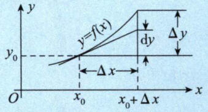

# 第3讲 一元函数微分学的概念

## 1. 导数

设 $y=f(x)$ 定义在区间 $I$ 上，让自变量在 $x= x_0$ 处加一个增量 $\Delta x$ (可正可负), 其中 $x_0\in I,x_0+\Delta x\in I$ ,则可得函数的增量 $\Delta y=f(x_0+\Delta x)-f(x_0)$ .若函数增量 $\Delta y$ 与自变量增量 $\Delta x$ 的比值在 $\Delta x\to0$ 时的极限存在，即 $\mathop{\lim }\limits_{\Delta x\to0}\displaystyle\frac{\Delta y}{\Delta x}$ 存在，则称函数 $y=f(x)$在点 $x_0$ 处可导，并称这个极限为$y=f(x)$ 在点 $x_0$处的导数，记作$f^\prime(x_0)$,即

$$
f'(x_0)=\lim_{\Delta x\to0}\frac{\Delta y}{\Delta x}=\lim_{\Delta x\to0}\frac{f(x_0+\Delta x)-f(x_0)}{\Delta x} = \mathop{\lim }\limits_{x\to x_0}\frac{f(x)-f(x_0)}{x-x_0}
$$

### 注意

（1）在考题中, 增量 $\Delta x$ 一般会被命题人广义化为“狗”:

$$
\\f^{\prime}\left(x_{0}\right)=\lim_{\Delta x\to0}\frac{f\left(x_{0}+\Delta x\right)-f\left(x_{0}\right)}{\Delta x}\xlongequal{广义化}\lim_{\text{狗}\to0}\frac{f\left(x_{0}+\text{狗}\right)-f\left(x_{0}\right)}{\text{狗}}
$$

（2）

$$
f'(x_0)=\lim_{\Delta x\to0}\frac{f(x_0+\Delta x)-f(x_0)}{\Delta x} = \mathop{\lim }\limits_{x\to x_0}\frac{f(x)-f(x_0)}{x-x_0}
$$

（3）下面这三种提法是等价的。

- $y=f\left(x\right)$ 在点 $x_{0}$ 处可导
- $y=f\left(x\right)$ 在点 $x_{0}$ 处导数存在
- $f^{\prime}\left(x_{0}\right)=A$ ( $A$ 为有限数)

（4）函数在一点可导的充要条件。

1. 单侧导数
    $$\lim_{\Delta x\to0^{-}}\frac{f\left(x_{0}+\Delta x\right)-f\left(x_{0}\right)}{\Delta x}=f_{-}^{\prime}\left(x_{0}\right),$$
    $$\lim_{\Delta x\to0^{+}}\frac{f\left(x_{0}+\Delta x\right)-f\left(x_{0}\right)}{\Delta x}=f_{+}^{\prime}\left(x_{0}\right),$$
    这里，$f_-^{\prime}(x_0),f_+^{\prime}(x_0)$分别是$f(x)$在点$x_0$处的左导数、右导数，统称为单侧导数.

2. $f^{\prime}(x_0)$存在$\Leftrightarrow$其左导数$f_-^{\prime}(x_0)$与右导数$f_+^{\prime}(x_0)$均存在且相等.这一点当然是与极限存在的充分必要条件(左、右极限均存在且相等)对应.因为从本质上来说，导数的定义就是一个极限问题。

（5）函数在一点可导的必要条件：若$f\left(x\right)$在一点可导，则$f\left(x\right)$在该点连续。反之未必. 如：$f\left(x\right)=\left|x\right|$ 在x=0处的情形.

这是因为函数的导数存在的条件比连续性的条件更严格。当函数可导时，不仅要求函数值在接近该点时趋于该点处的函数值（这是连续性的定义），还要求函数的增量与自变量的增量之比在自变量增量趋近于零时趋于某个有限值（这是可导性的定义）。

## 2. 导数的几何意义

函数 $y=f(x)$在点 $x_0$ 处的导数值 $f^\prime(x_0)$就是曲线 $y=f(x)$在点 $(x_0,y_0)$处切线的斜率 $k$ ,
即 $k=f^\prime(x_{0})$,于是曲线 $y=f(x)$ 在点 $(x_0,y_{0})$处的切线方程为

$$y- y_0= f^\prime ( x_{0}) ( x- x_{0})$$

法线方程为

$$
y-y_{0}=-\frac{1}{f^{\prime}(x_{0})}(x-x_{0})(f^{\prime}(x_{0})\neq0)
$$

## 3. 高阶导数

函数$f(x)$在点 $x_0$处的二阶导数为
$$f''(x_0)=\lim_{\Delta x\to0}\frac{f'(x_0+\Delta x)-f'(x_0)}{\Delta x}\text{或}f''(x_0)=\lim_{x\to x_0}\frac{f'(x)-f'(x_0)}{x-x_0}\:.$$
函数$f(x)$在点 $x_0$处的 $n(n$ 为大于 2 的整数 )阶导数为
$$f^{(n)}(x_0)=\lim_{\Delta x\to0}\frac{f^{(n-1)}(x_0+\Delta x)-f^{(n-1)}(x_0)}{\Delta x}\text{或}f^{(n)}(x_0)=\lim_{x\to x_0}\frac{f^{(n-1)}(x)-f^{(n-1)}(x_0)}{x-x_0}\:.$$

> [注]  
> (1) 如果$f(x)$在点$x_0$处有二阶导数，则$f(x)$在$x_0$的某个邻域内有一阶导数且$f^\prime(x)$在$x_0$处连续  
> (2) 如果 $f\left(x\right)$ 在点 $x_{0}$ 处有 $n$ 阶导数，则$f\left(x\right)$ 在 $x_0$ 的某个邻域内有 $1 \sim \left(n-1\right)$阶的各阶导数.

## 4. 微分的概念

设函数$y=f(x)$在点 $x_0$的某邻域内有定义，且 $x_0+\Delta x$ 在该邻域内，对于函数增量

$$\Delta y=f(x_0+\Delta x)-f(x_0)\:,$$

若存在与 Δx 无关的常数$A$ ,使得

$$\Delta y=A\Delta x+o\left(\Delta x\right)$$

其中 $o(\Delta x)$ 是在 $\Delta x \to 0$ 时比 $\Delta x$ 更高阶的无穷小，则称 $f(x)$ 在点 $x_{_0}$ 处可微，并把增量的主要部分 $A\Delta x$ 称为线性主部，也叫作 $f(x)$ 在点 $x_0$ 处的微分,记 $\mathrm{d}y| _{x= x_0}= A\Delta x$ 或 $\mathrm{d}y|_{x=x_0}=f^{\prime}(x_0)\mathrm{d}x$

$\mathrm{d}x=\Delta x$

### 注意

(注)

（1）可微的判别。

1. 写增量$\Delta y=f\left(x_0+\Delta x\right)-f\left(x_0\right);$

2. 写线性增量 $A\Delta x=f^{\prime}\left(x_{0}\right)\Delta x;$

3. 作极限 $\mathop{\lim }\limits_{\Delta x\to0}\frac{\Delta y-A\Delta x}{\Delta x}$

若该极限等于0，则 $y=f\left(x\right)$在点$x_0$处可微，否则不可微。

（2）从上述判别步聚可以看出，用形式简单的“线性增量 $A\Delta x$ ”去代替形式复杂的“增量 $A\Delta y$ ” 且其误差“ $\Delta y-A\Delta x$ ”是 $o(\Delta x)$ ，这就是说，用“简单的量”代替了“复杂的量”，且产生的误差又可以忽略不计，这就是可微的含义

（3）“$f(x)$ 在点$x_0$ 处可微” 与 “$f(x)$ 在点 $x_0$ 处可导” 互为充要条件，故判别$f(x)$ 在点$x_0$ 处是否可微可以转化为判别其在点$x_0$ 处是否可导，这样的话考生会比较熟悉

（4）可微的几何意义

若f（x）在点$x_0$ 处可微，则在点$(x_{0},y_{0})$ 附近可以用切线段近似代替曲线段，这是可微的几何意义。图3-5可以较好地帮助读者理解以上论述

图3-5
